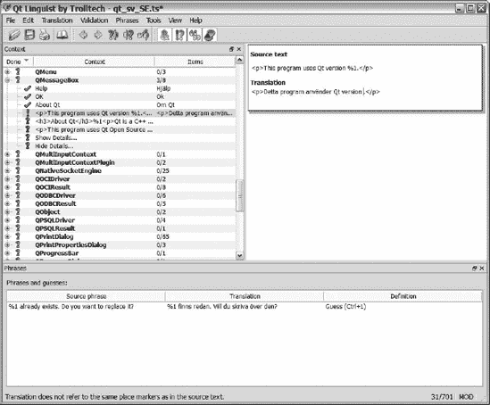
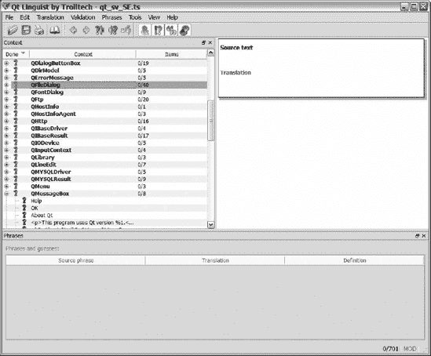
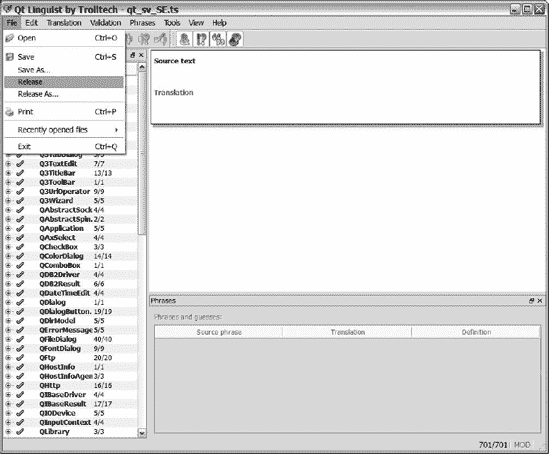

## 十、国际化和本地化

当你为国际市场部署你的应用程序时，你必须提供本地化版本。这样做的原因远远超出了世界人口所使用的不同语言；事实上，在时间、日期和货币价值的表示上存在差异；甚至更复杂的书面语言问题，如文本应该从右边还是从左边读。

* * *

**提示**国际化和本地化实际上是同一个流程的两个部分。国际化就是让您的应用程序摆脱与特定位置的任何联系，使其独立于任何特定的语言或文化。本地化是下一步——采用国际化的应用程序，并使其适应具有特定语言和文化的特定位置。

* * *

在开始处理为了成功适应应用程序的不同语言和文化而必须管理的所有细节之前，先看看 Qt 提供的管理工具。

* * *

**提示**你知道国际化经常被写成 i18n，其中 18 是去掉的字符数吗？本地化往往可以看做 l10n(用同样的方式缩写)。

* * *

### 翻译应用程序

要开始，你需要一个应用程序来翻译。您将使用第 4 章的[中的 SDI 应用程序，以及在第 8 章](04.html#the_main_window)[中扩展的附加特性(当添加了文件处理支持时)。在](08.html#files_comma_streams_comma_and_xml)[图 10-1](#the_sdi_application) 中可以看到应用程序的截图。因为我的母语是瑞典语，所以任务是将应用程序翻译成瑞典语。


**图 10-1。***SDI 申请*

翻译以两种不同的文件格式保存:`ts`和`qm`。`ts`文件是在开发过程中使用的，它以一种易于维护的 XML 文件格式包含了应用程序中的所有单词。`qm`文件在运行时使用，包含可移植的压缩格式的短语。这个想法是在开发过程中使用`ts`文件作为源文件。然后将`ts`文件编译成实际应用程序使用的可分发的`qm`格式。编译被称为*发布*翻译。

在开始翻译应用程序之前，您需要通知 Qt 您的意图。因为目标语言是在瑞典使用的瑞典语，并且该地区常用的代码是`sv_SE`，所以您可以将它添加到应用程序名称的末尾:`SDI_sv_SE`。

* * *

**注意**名称的`sv_SE`部分是由 ISO 639-1 的语言代码和 ISO 3166-1 的国家代码组合而成的。应用程序名称只是应用程序的非正式名称。这种命名约定只是约定俗成的——您可以随意命名您的翻译。

* * *

要将此翻译添加到项目中，只需将下面一行添加到项目文件中:

```cpp
TRANSLATIONS += sdi_sv_SE.ts
通过适当地添加新的`TRANSLATION +=`行，您可以向项目添加任意数量的翻译。您也可以通过用空格或制表符分隔来一次指定多个翻译。
 提取字符串
当项目文件被一个或多个翻译更新后，是时候从应用程序中的各种`tr()`调用中提取需要翻译的字符串了。也有其他情况，但将在以后讨论。
`lupdate`工具用于提取短语——它创建或更新给定项目文件中列出的所有`ts`文件。很高兴知道，当它更新一个现有的文件时，它不会删除任何东西——所有已经完成的翻译都保持不变。因为项目文件名为`sdi.pro`，所以在命令行输入的命令是`lupdate sdi.pro`。这将从项目文件的源代码中找到的字符串创建`sdi_sv_SE.ts`文件。
虽然 Qt 附带了一个软件翻译工具，但并不是所有的翻译业务都希望使用定制工具。幸运的是，`ts`文件非常容易处理，因为它们是 XML 格式的。[清单 10-1](#an_example_of_the_contents_of_an_untrans) 显示了未翻译的`sdi_sv_SE.ts`文件的摘录。

**清单 10-1。** *一个未翻译的内容的例子* `ts` *文件*
<?xml version="1.0" encoding="utf-8"?>

<!DOCTYPE TS><TS version="1.1">

<context>

    <name>SdiWindow</name>

    <message>

        <location filename="sdiwindow.cpp" line="254"/>

        <source>%1[*] - %2</source>

        <translation type="unfinished"></translation>

    </message>

    <message>

        <location filename="sdiwindow.cpp" line="19"/>

...

</context>

</TS>
正如您从摘录中看到的，将它转换成您的翻译公司喜欢的格式并返回应该不难。
语言学家:翻译的工具
Qt 与*语言学家*工具捆绑在一起，该工具为翻译人员提供了要翻译的字符串及其各自状态的方便概述:完成、未知或缺失。它还提供了一些简单的检查来确保翻译是正确的。例如，它检查原始字符串和翻译字符串中的最终标点符号是否相同。
启动语言学家产生如图 10-2 所示的用户界面。该图显示了打开翻译并翻译了几个字符串后的应用程序。
如果你仔细观察[图 10-2](#linguist_with_a_fresh_translation_file_l) ，你可以看到语言界面由三个面板组成。在上下文面板中(左边)是包含字符串的类和它们各自的字符串。当前选定的字符串以其原始和翻译的形式显示在主面板中(右上角)。在短语面板中，Qt 通过查看早期的翻译和你可以加载的短语手册来推荐翻译。(这里不涉及短语书。)

**图 10-2。** *语言学家用一个新鲜的翻译文件加载了*
在语言学家中最简单的方法是从上下文面板中选择一个字符串，翻译它，然后按 Ctrl + Enter。如果四个验证器都没问题的话，这将把您带到下一个未翻译的字符串。可以从验证菜单中打开和关闭验证器。它们的功能如下:

```

*   加速器:如果原始字符串中有加速器，这个函数确保翻译中有加速器。
*   结尾标点:这个函数确保原文和译文的结尾标点匹配。
*   短语匹配:这个函数检查原始字符串是否匹配一个已知的短语。在这种情况下，翻译应该与已知短语的翻译相同。
*   位置标记匹配:该函数确保原始字符串中的位置标记(例如，`%1`，`%2`)也存在于翻译中。

如果验证器不接受，可以保留一个翻译，但是 Ctrl + Enter 快捷键不会自动移动(确保你主动决定忽略验证器)。当一个验证程序反对一个翻译时，它会在状态栏中显示一条消息(见[图 10-3](#the_validator_objects_to_the_translation) )。



**图 10-3。** *验证器反对该翻译，因为该翻译没有引用与源文本中相同的位置标记。*

随着翻译的进行，您可以在状态栏的右侧看到您的状态。翻译完所有字符串后，破折号两边的数字将匹配。您可以随时保存您的翻译，稍后继续工作。语言学家和`lupdate`不会丢失任何信息，除非你自己覆盖或删除它。

当您的翻译准备好并保存后，您必须编译或*发布*它，以便能够通过使用`lrelease`工具在您的应用程序中使用它。只需将您的项目名称作为参数传递。对于`sdi.pro`应用程序，您可以从命令行运行`lrelease sdi.pro`,从您的`ts`文件构建所需的`qm`文件。

#### 设置一个翻译对象

当翻译准备好并发布后，就该将它们加载到应用程序中了。因为语言是在应用程序级别设置的，所以目标是在`QApplication`对象上安装一个包含正确翻译的`QTranslator`对象。

在担心`QTranslator`对象之前，您需要确定用户期望用哪种语言编写应用程序。这些信息可以在`QLocale`类中找到。一个`QLocale`对象代表一个特定的本地化区域和语言。对象知道该区域和语言的大多数本地化细节。要获得表示计算机的区域和语言的对象，可以使用名为`QLocale::system`的静态方法。

这个名字在[清单 10-2](#a_translation_is_loaded_into_a_translato) 中使用，通过调用`installTranslator(QTranslator*)`在安装之前将翻译加载到`QTranslator`对象中。正如您在清单中看到的，没有指定翻译文件的文件扩展名。如果`load`调用失败，翻译器将没有任何作用，应用程序将以源代码中使用的语言显示。

**清单 10-2。** *翻译被加载到安装在应用程序上的翻译器中。*

```cpp
int main( int argc, char **argv )

{

  QApplication app( argc, argv );

  QTranslator translator;

  translator.load( QString("sdi_")+QLocale::system().name() );

  app.installTranslator( &translator );

  QTranslator qtTranslator;

  qtTranslator.load( QString("qt_")+QLocale::system().name() );

  app.installTranslator( &qtTranslator );

  SdiWindow *window = new SdiWindow;

  window->show();

  return app.exec();

}
```

命名翻译文件没有规则。它可能被称为`swedish.qm`或`12345.qm`——这不重要。将地区名称与翻译器联系起来的好处是，您可以使用`QLocale::system`来找到正确的语言。

* * *

**提示**您可以将您的`qm`文件添加到一个资源文件中，以便将翻译集成到您的应用程序中。它增加了可执行文件的重量，但是减少了对其他文件的依赖。这可以使应用程序更容易部署。

* * *

#### Qt 字符串

如果您现在部署应用程序，那么只有部分内容会被翻译。在 Qt 打开和保存文档的标准对话框和 About Qt 对话框中，使用了嵌入在 Qt 库中的字符串。这些字符串被`lupdate`遗漏了，因为它只出现在当前项目的源代码中。相反，您必须安装另一个翻译器来处理嵌入在 Qt 标准对话框中的字符串。

在开始编写添加这样一个翻译器的代码之前，先看看 Qt 提供的翻译。Qt 库包含大约 2200 个单词(你可以看到语言学家在[图 10-4](#a_qt_translation_loaded_into_linguist) 中加载了 Qt 翻译)。Qt 附带了这些单词的翻译，用于将默认语言(英语)翻译成法语和德语。还包括其他语言，但是它们没有得到 Trolltech 的官方支持。所有的翻译都可以从 Qt 安装目录下的`translations`子目录中获得。注意，如果您需要支持一种新的语言，您可以使用`qt_untranslated.ts`文件作为起点。你也应该在网上搜索，因为许多开发者会发布他们的翻译供他人使用。



**图 10-4。** *一个 Qt 翻译载入语言学家*

因为 Qt 字符串不是你的应用程序的一部分，你必须手动释放它。你可以通过使用语言学家打开文件并从文件菜单中释放它(如图[图 10-5](#you_can_release_the_current_translation) 所示)，或者你可以将`ts`文件作为参数给`lrelease`而不是你的项目文件。

* * *

**提示**另一种方法是将你的`ts`文件基于适当的 Qt 翻译。因为`lupdate`从不删除任何东西，这与合并翻译是一样的，这使得发布过程更容易。

* * *



**图 10-5。** *您可以使用文件菜单中的发布选项发布当前翻译。*

当您已经将 Qt 字符串的翻译创建或复制到项目目录中，发布它，并给结果文件一个合适的名称时，是时候将它加载到一个翻译器中并安装它了。在瑞典语的情况下，文件被称为`qt_sv_SE`，加载如[清单 10-3](#loading_and_installing_a_translator_for) 所示。如您所见，该过程与应用程序字符串的翻译加载是相同的。

**清单 10-3。** *为 Qt 的字符串加载和安装翻译器*

```cpp
int main( int argc, char **argv )

{

  QApplication app( argc, argv );

  QTranslator translator;

  translator.load( QString("sdi_")+QLocale::system().name() );

  app.installTranslator( &translator );

  QTranslator qtTranslator;

  qtTranslator.load( QString("qt_")+QLocale::system().name() );

  app.installTranslator( &qtTranslator );

  SdiWindow *window = new SdiWindow;

  window->show();

  return app.exec();

}
```

当两个翻译器都被加载和安装后，用户界面被翻译。在[图 10-6](#the_sdi_application_in_english_and_swedi) 中可以看到翻译瑞典语旁边的英文原文。


**图 10-6。** *英语和瑞典语的 SDI 应用*

#### 处理其他翻译案件

当您在`tr`调用中包含字符串时，会发生两件事:`lupdate`找到字符串并将其交给翻译器；然后字符串通过`QApplication::translate`方法传递。

所以有两种特殊情况需要注意:确保`lupdate`可以找到所有的字符串，并确保所有的字符串都以允许方法正确翻译的方式通过`translate`。

**寻找所有字符串**

有时你写的代码中你的字符串不会出现在`tr`调用中。在这种情况下，您可以使用宏`QT_TR_NOOP`或`QT_TRANSLATE_NOOP`。请看清单 10-4 中的[作为例子。](#strings_outside_tr_calls_can_be_made_vis)

这两个宏的区别在于`QT_TR_NOOP`没有上下文参数。这对于`texts2`中的字符串来说很好，它们不太可能与应用程序中的其他字符串混淆。然而,`texts`中的琴弦很容易混淆。例如，`Title`是指网页的标题还是指某个人的标题？在瑞典语中，网页标题的翻译是`Överskrift`,人名标题的翻译是`Befattning`——差别很大。

当字符串可能不明确时，`QT_TRANSLATE_NOOP`宏就派上了用场。它使得为译者和翻译机制添加上下文成为可能。[图 10-7](#the_strings_found_using_the_qt_underscor) 显示了来自[清单 10-4](#strings_outside_tr_calls_can_be_made_vis) 的字符串出现在语言学家中的样子。

**清单 10-4。使用 `QT_TR_NOOP` *和* `QT_TRANSLATE_NOOP` *宏可以使* `lupdate` *调用之外的*** *字符串可见。*

```cpp
   char *texts[] = { QT_TRANSLATE_NOOP("main","URL"),

                     QT_TRANSLATE_NOOP("main","Title"),

                     QT_TRANSLATE_NOOP("main","Publisher") };

   char *texts2[] = { QT_TR_NOOP( "This is a very special string."),

                      QT_TR_NOOP( "And this is just as special.") };
```

从继承以`Q_OBJECT`开始的`QObject`的类中捕获的字符串被自动放置在以该类命名的上下文中。

使用来自外部的字符串很容易。只需使用应用程序对象中可用的`translate`方法。如果你的字符串没有上下文，可以传递一个空字符串(`0`)；否则，将上下文作为第一个参数，字符串作为第二个参数。下面一行使用了来自`texts`和`texts2`向量的字符串:

```cpp
  QMessageBox::information( 0, qApp->translate("main",texts[2]), qApp-

>translate(0,texts2[1]) );
**区分字符串**
如前所述，有些字符串可能是不明确的。例如， *address* 这个词可以指邮政地址、web URL 或者计算机主内存中的内存地址。不同句子的翻译可以根据意思和上下文而有所不同。如果在一个上下文中使用了这些含义中的几个，您可以为每个字符串添加一个注释，以便翻译人员能够区分它们。

**图 10-7。** *使用* `QT_TRANSLATE_NOOP` *宏找到的字符串在上下文中找到。*
[清单 10-5](#adding_comments_to_tell_the_same_word_wi) 展示了如何在`tr`调用中指定注释的例子。注释只是作为第二个参数发送给`tr`方法。

**清单 10-5。** *添加注释以区分不同意思的同一个词*
   new QLabel( tr("Address:", "Postal address"), this );

   new QLabel( tr("Address:", "Website address"), this );
当翻译器打开`ts`文件时，注释显示在要翻译的实际字符串下面。清单 10-5 中的[字符串显示在](#adding_comments_to_tell_the_same_word_wi)[图 10-8](#the_comment_is_shown_to_the_translator_b) 中。

**图 10-8。** *注释显示在原字符串下方给译者看。*
**您更改了** ** * n * ** **文件**
当`translate`方法试图翻译一个字符串时，它需要得到一个精确的匹配，所以清单 10-6 中只有一个字符串有效。在`tr`调用(`line1`)中使用`+`操作符合并字符串的问题是`lupdate`不能正确地找到字符串。在`tr`调用(`line2`)之后合并字符串的问题是，词序或多或少是固定的。通过使用在`line3`赋值中显示的`arg`调用，翻译器可以自由地改变单词的顺序，并且不管`n`的值是多少，字符串都会被匹配。

**清单 10-6。** *三种建串方式:一对两错*

```
   QString line1 = tr("You have altered " + QString::number(n) + " file(s).");

   QString line2 = tr("You have altered ") + QString::number(n) + tr(" file(s).");

   QString line3 = tr("You have altered %1 file(s).").arg(n);
```cpp

关于`line3`赋值有一个恼人的问题:即`(s)`部分。可以让翻译器为`n`的不同值提供字符串；清单 10-7 中`line4`的代码向展示了它是如何完成的。`tr`调用有三个参数:实际的字符串、一个注释和一个用于确定字符串是单数还是复数形式的值。

**清单 10-7。** *处理复数字符串*

```
   QString line4 = tr("You have altered %1 file.", "", n).arg(n);
```cpp

当找到带有值的`tr`调用时，翻译器就有能力提供字符串的单数和复数版本。有些语言有其他特殊形式，比如*paucal*——Qt 也处理它们。`line4`的管柱如图[图 10-9](#singular_and_plural_versions_of_a_string) 所示。

**图 10-9。** *语言学家*中一个字符串的单数和复数版本
找到丢失的字符串
有时很容易忘记给`tr`或`translate`打电话；或者从`tr`、`QT_TR_NOOP`或`QT_TRANSLATE_NOOP`标记中省略一个字符串。这导致字符串在运行时不被翻译或被`lupdate`工具错过，从而在`translate`被调用时丢失。
有工具可以定位丢失的字符串。例如，Qt 4 附带了`findtr` perl 脚本。如果你在 Unix 系统上工作，你也可以使用更简单的`grep`命令`grep -n '"' *.cpp | grep -v 'tr('`。
另一种方法是在源代码中使用虚假的语言(例如，在所有字符串之前添加`FOO`，在它们之后添加`BAR`——这样普通的菜单栏就会显示为`FOOFileBAR`、`FOOEditBAR`和`FOOHelpBAR`)。这使得发现没有被翻译的字符串变得容易，因此在测试过程中所有的字符串都有可能被定位。
这两个技巧都不是万无一失的，所以你需要注意你的琴弦以及你对它们做了什么。在翻译中遗漏一个字符串会很快给你的用户传达一个糟糕的信息。

**提示**找到遗漏的`tr()`调用的一种方法是阻止 Qt 自动将`char*`字符串转换为`QString`对象，这将导致编译器在您遗漏调用`tr()`的所有时间都出错。您可以通过在项目文件中添加一行`DEFINES += QT_NO_CAST_FROM_ASCII`来禁用转换。

即时翻译
有时，您可能希望您的应用程序能够在不同的语言之间动态切换。用户应该能够选择一种语言，然后整个环境立即被翻译成所选择的语言。要尝试这样做，请看一下图 10-10 中的应用程序。只有两种语言可供选择，但是相同的解决方案适用于任何数量的语言。

**图 10-10。** *正在翻译的应用程序*
原理很简单。当用户选中一个单选按钮时，`toggled`信号连接到一个插槽。该插槽将新的翻译加载到已安装的`QTranslator`对象中，这将导致对`tr`的所有调用返回所选语言的字符串。唯一的问题是所有的`tr`调用都需要重新做一遍。在这种情况下，最好知道当一个新的翻译被加载时，一个`QEvent::LanguageChange`事件被发送给所有的`QObject`。它的工作原理是将所有的`setText`和`setTitle`调用放在一个函数中，一旦发生语言改变事件就调用那个函数。
这在理论上听起来不错，所以让我们看看实际的源代码。[清单 10-8](#the_dyndialog_class_declaration) 显示了`DynDialog`类的声明，它是应用程序中使用的对话框。您需要保留对所有显示文本的小部件的引用——`languages`分组框和两个单选按钮。

**清单 10-8。***`DynDialog`*类声明**```
class DynDialog : public QDialog

{

  Q_OBJECT

public:

  DynDialog();

protected:

  void changeEvent( QEvent* );

private slots:

  void languageChanged();

private:

  void translateUi();

  QGroupBox *languages;

  QRadioButton *english;

  QRadioButton *swedish;

};
```cpp

该构造器表明该对话框旨在被动态翻译。在清单 10-9 的[所示的源代码中，小部件被创建、配置并放置在布局中，但是没有一个对`setText`或`setTitle`的调用。相反，在最后调用了`translateUi`方法。](#the_constructor_of_the_dyndialog_dialogm)

**清单 10-9。***`DynDialog`*对话框的构造器——注意没有设置文本**

```
DynDialog::DynDialog() : QDialog( 0 )

{

  languages = new QGroupBox( this );

  english = new QRadioButton( this );

  swedish = new QRadioButton( this );

  english->setChecked( true );

  qTranslator->load( "english" );

  QVBoxLayout *baseLayout = new QVBoxLayout( this );

  baseLayout->addWidget( languages );

  QVBoxLayout *radioLayout = new QVBoxLayout( languages );

  radioLayout->addWidget( english );

  radioLayout->addWidget( swedish );

  connect( english, SIGNAL(toggled(bool)), this, SLOT(languageChanged()) );

  connect( swedish, SIGNAL(toggled(bool)), this, SLOT(languageChanged()) );

  translateUi();

}
```cpp

`translateUi`方法如[清单 10-10](#updating_all_the_user_visible_strings_at) 所示。这里，用户可见的所有字符串都通过`tr`传递，然后被设置。

**清单 10-10。** *一次更新所有用户可见字符串*

```
void DynDialog::translateUi()

{

  languages->setTitle( tr("Languages") );

  english->setText( tr("English") );

  swedish->setText( tr("Swedish") );

}
```cpp

参考清单 10-9 中的[可以看到，当用户选择另一种语言时(也就是切换其中一个单选按钮)，槽`languageChanged`被调用。插槽实现如清单 10-11](#the_constructor_of_the_dyndialog_dialogm) 所示。如您所见，`qTranslator`为不同的用户选择加载了不同的翻译器。`qTranslator`指针是一个应用全局指针，指向已安装的`QTranslation`对象。该对象被创建并安装在`main`功能中。

**清单 10-11。** *加载译文*

```
void DynDialog::languageChanged()

{

  if( english->isChecked() )

    qTranslator->load( "english" );

  else

    qTranslator->load( "swedish" );

}
```cpp

当加载新的翻译时，`QEvent::LanguageChanged`事件被发送到所有的`QObject`实例。这个事件可以在受保护的`changeEvent`方法中被捕获，如[清单 10-12](#watch_for_the_qevent_colon_colon_languag) 所示。一旦遇到事件，就会再次调用`translateUi`方法，使用新加载的翻译器更新所有可见文本。

**清单 10-12。** *观察* `QEvent::LanguageChanged` *事件，遇到时更新用户界面。*

```
void DynDialog::changeEvent( QEvent *event )

{

  if( event->type() == QEvent::LanguageChange )

  {

    translateUi();

  }

  else

    QDialog::changeEvent( event );

}

```cpp

* * *

**提示**您可以在`changeEvent`方法中观察更多的国际化事件。当地区改变时，发送`QEvent::LocaleChange`。

* * *

为了能够构建系统，使用了一个带有行`TRANSLATIONS += english.ts swedish.ts`的项目文件。使用`lupdate`生成`ts`文件，语言学家翻译字符串，使用`lrelease`生成`qm`文件。然后运行`qmake`和`make`来构建应用程序。

### 其他注意事项

当执行应用程序的实际本地化时，有几个问题需要注意。这不仅仅是翻译文本的问题；您还必须处理不同的键入数字、显示图像、处理货币以及处理时间和日期的方式。

#### 处理文字

因为 Qt 在内部处理 Unicode 字符，所以`QString`和`QChar`类可以处理几乎任何可能的字符。但是这意味着标准库`isalpha`、`isdigit`、`isspace`等不能在所有平台上正常工作，因为它们有时在西欧或美国环境下运行。

* * *

我有时会在英文网站上注册我的街道地址时遇到麻烦，因为我居住的城镇叫做 Alingså。字母“不被认为是合法字符。

* * *

解决方案是坚持这些方法的特定于 Qt 的实现。`QChar`类包含了方法`isAlpha`、`isDigit`、`isSpace`以及更多等同于标准函数的方法。

考虑 Unicode 不仅在验证用户输入时很重要，在解析文件时也很重要。要将 Unicode `QString`转换为`char*`向量(通过`QByteArray`，可以使用`toAscii`或`toLatin1`将字符串转换为每字符 8 位的格式。结果是 ASCII 字符串或 Latin1 (ISO 8859-1)字符串。如果您想转换为当前的 8 位格式，您可以使用`toLocal8Bit`方法，该方法会转换为系统设置所指示的 8 位编码。

您也可以使用`toUtf8`将其转换为 UTF8。UTF8 格式表示许多字符，就像在 ASCII 中一样，但是通过将它们编码为多字节序列来支持所有 Unicode 字符。

绘制文字时，Qt 尊重文字的方向。有些语言是从右向左书写的，所以在定制小部件时必须考虑到这一点。最简单的方法是使用矩形而不是点来指定文本的位置。通过这种方式，Qt 可以将文本放置在用户期望的位置。

#### 图片

当谈到图像时，有两件重要的事情需要考虑:小心使用图像来交流文字游戏，避免敏感的符号。设计有效的图标是一门艺术，遵循这些规则会使它变得更加困难。

文字游戏的一个经典例子是将一棵树的日志显示为日志查看器的图标。这在英语环境中是非常合乎逻辑的，但是在瑞典语中，表示一棵树的原木的单词是 stock。这个图标可以说是代表一个股票市场交易工具——这在英语环境中是一个糟糕的文字游戏。

当涉及敏感符号时，有许多事情要避免。排在首位的是宗教符号。另一个有文化内涵的例子是红十字会(在一些国家，红新月会更常见)。避免政治和军事符号也是明智的，因为它们在不同的国家有很大的不同。关键是运用你的判断力，记住人们很容易被冒犯。

#### 数字

数字可能是一个棘手的问题——无论是打印还是解释。`QLocale`类可以处理不同的负号、小数点、组分隔符、指数字符和代表零的字符。所有这些都给了你很多出错的细节。

根据我的经验，关于数字的表示，最常见的混淆问题是用于小数点和组分隔符(将数字分成三组)的字符。以数字 1.234 和 1，234 为例。如何解读这些数字取决于你所在的国家——在一些国家，第一个数字读作*一千二百三十四*；在其他地方，它读作*一点二三四*。加两个小数更好，但不完美:1.234，00 和 1，234.00。两者都有效，但是小数点和组分隔符不同。

* * *

**提示**能够处理系统的小数点字符非常重要。不同的键盘在数字小键盘上有不同的小数点字符。不得不在数字键盘和主键盘之间移动来写一个小数点，这可能*非常*烦人。

* * *

使用`QLocale`类及其方法`toString`将数字转换成文本；使用`toFloat`、`toInt`等将字符串转换为数字。虽然这适用于处理显示给用户的数字和字符串，但是在将数字作为文本存储在文件中时，请记住坚持一种格式，因为文件可以在不同的国家之间移动(并且无论当前的语言环境如何，您仍然必须能够正确地读取数字)。

* * *

 **提示**系统区域设置`QString::toDouble`和好友用于将字符串转换为数值。

* * *

[清单 10-13](#printing_three_values_using_a_given_loca) 显示了一个使用给定的`QLocale`来转换和打印三个值的函数。给定一个`QLocale( QLocale::Swedish, QLocale::Sweden )`和一个`QLocale( QLocale::English, QLocale::UnitedStates )`的函数的输出可以在[清单 10-14](#the_same_three_values_printed_using_diff) 中看到。注意使用的不同小数点和组分隔符。

**清单 10-13。** *使用给定的区域设置打印三个值*

`void printValues( QLocale loc )

{

  QLocale::setDefault( loc );

  double v1 = 3.1415;

  double v2 = 31415;

  double v3 = 1000.001;

  qDebug() << loc.toString( v1 );

  qDebug() << loc.toString( v2 );

  qDebug() << loc.toString( v3 );

}`

**清单 10-14。** *使用不同的语言环境打印相同的三个值*

```
Swedish

"3,1415"

"31 415"

"1 000"

US English

"3.1415"

"31,415"

"1,000"
```cpp

**货币**

处理货币是不借助 Qt 也要做的事情。这没什么，因为货币可以被视为一个有限精度的数字——通常是两位小数，但有时没有或只有三位。

当您向用户显示货币值时，记住一些基础知识是很重要的。首先，您可以在值(例如，280，00 SEK 或 8.75 美元)后面加上三个字母的货币代码(ISO 4217)。请注意，我根据示例中的货币使用了适当的小数点符号。(当然，您应该根据用户的偏好选择一个小数点符号。)

所有的货币都有名字。例如， *SEK* 是瑞典克朗的简称或者只是克朗(复数为克朗)。这也是可以放在被呈现的值之后的东西。

一些货币有一个标志或符号，可以用来代替在值后加上代码或名称。这个符号可以放在值的前面，也可以放在值的后面，或者作为小数点符号。例如 12.50 英镑和€12.50 欧元。有更多的符号可用于其他货币。一些符号是普遍使用的，而另一些只在使用该货币的当地市场使用。

从国际化的角度来看，我建议使用 ISO 4217 代码，因为它是中立的(代码是国际标准的一部分)并且易于处理(代码总是跟在值后面)。

#### 日期和时间

在全球范围内，日期和时间以多种不同的方式呈现，这对开发人员来说是一个困难的挑战。尽管 Qt 提供了处理复杂性的类，但是存在误解用户输入和通过输出混淆用户的风险。

让我们先来看看时间以及它是如何呈现给用户的。以文本形式表示的时间通常表示为数字时钟，两位数表示小时，两位数表示分钟。小时和分钟由冒号或简单的点分隔。这里的问题是时钟可以是 24 小时制的，时间从 0 到 23。时钟也可以是 12 小时制，其中时间从 0 到 11 运行两次。在后一种情况下，分钟后面跟 AM 或 PM，表示时间是指早上还是晚上。

你可以使用`QTime`方法`toString`和`fromString`(结合`QLocale`类的`timeFormat`方法)或者直接使用`QLocale`中的`toString`方法，以用户期望的方式处理输入和输出。请确保您不会将 12 小时制的 PM 时间解释为后面跟有一些无意义字符的 24 小时制时间。

[清单 10-15](#printing_times_using_different_locales) 显示了一个使用给定地区打印时间的函数。结果输出如[清单 10-16](#the_resulting_strings_when_printing_time) 所示。语言环境是`QLocale( QLocale::Swedish, QLocale::Sweden )`和`QLocale( QLocale::English, QLocale::UnitedStates )`。

**清单 10-15。** *使用不同地区的打印时间*

```
void printTimes( QLocale loc )

{

  QLocale::setDefault( loc );

  QTime t1( 6, 15, 45 );

  QTime t2( 12, 00, 00 );

  QTime t3( 18, 20, 25 );

  qDebug() << "short";

  qDebug() << loc.toString( t1, QLocale::ShortFormat );

  qDebug() << loc.toString( t2, QLocale::ShortFormat );

  qDebug() << loc.toString( t3, QLocale::ShortFormat );

  qDebug() << "long";

  qDebug() << loc.toString( t1, QLocale::LongFormat );

  qDebug() << loc.toString( t2, QLocale::LongFormat );

  qDebug() << loc.toString( t3, QLocale::LongFormat );

  qDebug() << "default";

  qDebug() << loc.toString( t1 );

  qDebug() << loc.toString( t2 );

  qDebug() << loc.toString( t3 );

}
```cpp

**清单 10-16。** *打印时产生的字符串使用不同的区域设置*

```
Swedish

short

"06.15.45"

"12.00.00"

"18.20.25"

long

"kl. 06.15.45 W. Europe Daylight Time"

"kl. 12.00.00 W. Europe Daylight Time"

"kl. 18.20.25 W. Europe Daylight Time"

default

"kl. 06.15.45 W. Europe Daylight Time"

"kl. 12.00.00 W. Europe Daylight Time"

"kl. 18.20.25 W. Europe Daylight Time"

US English

short

"6:15:45 AM"

"12:00:00 PM"

"6:20:25 PM"

long

"6:15:45 AM W. Europe Daylight Time"

"12:00:00 PM W. Europe Daylight Time"

"6:20:25 PM W. Europe Daylight Time"

default

"6:15:45 AM W. Europe Daylight Time"

"12:00:00 PM W. Europe Daylight Time"

"6:20:25 PM W. Europe Daylight Time"
```cpp

说到表示日期，还有其他问题要处理。月份在不同的国家有不同的名称，一周中的日子也是如此。书写日期时，不同国家的日、月、年的顺序不同。让事情变得更复杂的是，一周的第一天可以是周日，也可以是周一，这取决于你所在的位置。为了帮助您管理这些，`QLocale`类可以处理大部分问题。

通过使用来自`QDate`类的`toString`和`fromString`方法和来自`QLocale`的`dateFormat`方法，或者直接使用`QLocale`的`toString`方法，您可以正确地表示和解释日期。

为了比较区域设置`QLocale( QLocale::Swedish, QLocale::Sweden )`和`QLocale( QLocale::English, QLocale::UnitedStates )`对日期格式的影响，我使用了[清单 10-17](#printing_dates_using_different_locales) 中所示的函数。结果输出可以在[清单 10-18](#the_resulting_strings_when_printing_date) 中看到。

**清单 10-17。** *使用不同地区打印日期*

```
void printDates( QLocale loc )

{

  QLocale::setDefault( loc );

  QDate d1( 2006, 10, 12 );

  QDate d2( 2006, 01, 31 );

  QDate d3( 2006, 06, 06 );

  qDebug() << "short";

  qDebug() << loc.toString( d1, QLocale::ShortFormat );

  qDebug() << loc.toString( d2, QLocale::ShortFormat );

  qDebug() << loc.toString( d3, QLocale::ShortFormat );

  qDebug() << "long";

  qDebug() << loc.toString( d1, QLocale::LongFormat );

  qDebug() << loc.toString( d2, QLocale::LongFormat );

  qDebug() << loc.toString( d3, QLocale::LongFormat );

  qDebug() << "default";

  qDebug() << loc.toString( d1 );

  qDebug() << loc.toString( d2 );

  qDebug() << loc.toString( d3 );

}
```cpp

**清单 10-18。** *使用不同语言环境打印日期时产生的字符串*

```
Swedish

short

"12 okt 2006"

"31 jan 2006"

"6 jun 2006"

long

"torsdag 12 oktober 2006"

"tisdag 31 januari 2006"

"tisdag 6 juni 2006"

default

"torsdag 12 oktober 2006"

"tisdag 31 januari 2006"

"tisdag 6 juni 2006"

US English

short

"Oct 12, 2006"

"Jan 31, 2006"

"Jun 6, 2006"

long

"Thursday, October 12, 2006"

"Tuesday, January 31, 2006"

"Tuesday, June 6, 2006"

default

"Thursday, October 12, 2006"

"Tuesday, January 31, 2006"

"Tuesday, June 6, 2006"
```cpp

注意在[清单 10-14](#the_same_three_values_printed_using_diff) 和[清单 10-18](#the_resulting_strings_when_printing_date) 中，默认格式都是长格式。如果我必须在长格式和短格式之间做出选择，我会认为短格式在大多数情况下更容易阅读(除非我真的需要关于工作日和时区的所有细节)。

#### 救命

Qt 附带的翻译工具捕获了您提供的大部分帮助:工具提示、状态消息和这是什么字符串，只要它们包含在`tr`调用中就可以找到。不要忘记您的在线帮助文档。您必须负责翻译您的帮助文档，并确保在用户请求帮助时显示正确的语言。不是很复杂；这只是一些你不能忘记的事情，因为 Qt 工作流没有捕捉到它。

### 总结

国际化和本地化不仅仅是翻译应用程序。您不能再依赖于许多您认为理所当然的东西:日期格式、时间格式、数字格式、用户理解的图标、合法字符等等。这个过程实际上是关于理解目标文化及其习俗。这就是为什么在全球范围内部署应用程序是一项如此艰巨的任务。

通过使用`lupdate`、`lrelease`和语言学家以及`QLocale`类，您已经取得了很大的进步。尽可能将您的文本放在`QString`和`QChar`中，以确保使用 Unicode(使您不必总是考虑字符编码)。

在部署之前，请确保在所有目标语言环境中进行测试。如果可能的话，尝试使用本地测试人员——他们可能会比你发现更多的错误。** 
```