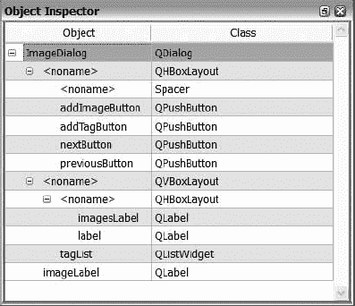
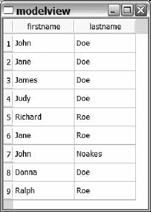
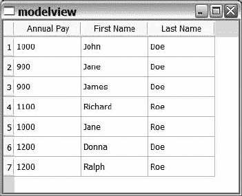

## 十三、数据库

**D** 即使是最简单的现代应用程序，数据库也是不可或缺的一部分。虽然大多数读者可能倾向于将数据库与网站和大型企业解决方案联系起来，但您可能会惊讶地发现，您还可以使用数据库来存储 Qt 应用程序中管理的数据。

Qt 为关系数据库提供了一个叫做`QtSql`的模块。 *SQL* ，代表*结构化查询语言*，是一种用于操作关系数据库的语言。使用 SQL，您可以在不同的数据库引擎和应用程序之间进行通信。

Qt 支持许多最流行的数据库，包括 MySQL、Oracle、PostgreSQL、Sybase、DB2、SQLite、Interbase 和 ODBC。这些驱动可以作为插件构建，也可以集成在 Qt 中。

在这一章中，你将学习如何将 MySQL 和 SQLite 数据库与你的 Qt 应用程序集成。您可能会在更复杂的情况下使用 MySQL，当数据库很方便时使用 SQLite，但是功能齐全的数据库服务器可能会被认为是多余的。

### SQL 快速介绍

在开始学习一些基本的 SQL 语句之前，您应该理解 SQL 是另一种编程语言。这本书不会教你用 SQL 开发；它只会显示最基本的信息。您还需要知道 Qt 支持的不同数据库服务器支持不同的 SQL 方言。这意味着，与 SQLite 连接相比，MySQL 连接的语句看起来可能略有不同。通过坚持最基本的原则，这些差异是可以避免的，但是请准备好阅读 SQL 手册中您选择使用的数据库引擎。

本节中使用和描述的语句已经过 MySQL 和 SQLite 的测试，所以不会有方言上的问题。

* * *

**注意**一条 SQL 语句也被称为*查询*，因为有些语句是用来查询数据库信息的。

* * *

#### 什么是数据库？

本章的其余部分将讨论关系数据库，即表的集合。每个表都有一个名称和一组列和行。列定义了表格的结构，而行包含数据。然后，这些表通过关系连接在一起，在关系中，不同表中的列值相互链接。

每一列都有一个名称和一个类型，这使得控制内容的去向和按名称检索成为可能。您还可以控制允许的内容，以便用默认值替换`NULL`值，或者您可以完全禁止`NULL`值。

行包含由列定义的数据。当您使用数据库时，通常会搜索行、添加行、更新行或删除行。

您需要做的第一件事是创建一个实际的数据库，创建它的方式取决于您计划使用的数据库服务器。有关详细信息，请参阅服务器的用户手册。

在开始添加行之前，您需要使用`CREATE TABLE`命令创建一个表。我们把桌子叫做`names`。下面的语句创建一个表，该表有一个名为`id`的整数列和两个名为`firstname`和`lastname`的字符串:

```cpp
CREATE TABLE names (

id INTEGER PRIMARY KEY,

firstname VARCHAR(30),

lastname VARCHAR(30)

)
在语句中，您将`id`指定为`PRIMARY KEY`，这意味着在同一个表中不能有两个相同的`id`值。您可以通过`id`列来识别每一行，这可以在搜索数据时使用。
使用的类型是用于整数值的`INTEGER`和用于字符串的`VARCHAR(30)`。`VARCHAR`类型是一个可变长度的字符串。括号内的值限制了字符串的长度，因此`firstname`和`lastname`字符串必须少于或等于 30 个字符。
该语句的一个问题是，如果该表已经存在，它将失败。您可以通过添加`IF NOT EXISTS`来创建以下语句来解决这个问题:
CREATE TABLE IF NOT EXISTS names (

id INTEGER PRIMARY KEY,

firstname VARCHAR(30),

lastname VARCHAR(30)

)
该语句添加该表，或者如果该表已经存在，则忽略它。
要删除一个表，使用`DROP TABLE`命令。要删除刚刚创建的`names`表，只需执行以下命令:
DROP TABLE names
插入、查看、修改和删除数据
与数据库交互所需的最基本操作是查看、添加、修改和删除存储在表中的数据。一旦你把桌子摆好，剩下的时间你就要做这个了。这四个操作组成了有时所谓的 *CRUD* 接口(代表*创建、读取、更新*和*删除*)。
执行这些任务的 SQL 命令包括用于添加数据的`INSERT`、用于查看的`SELECT`、用于修改的`UPDATE`和用于删除的`DELETE`。所有这四项任务都将在以下章节中介绍。
 **插入数据**
将一个名字插入到`names`表中很容易。使用`INSERT INTO`语句，您可以列出列名，后跟`VALUES`关键字和实际值:
INSERT INTO names (id, firstname, lastname) VALUES (1, 'John', 'Doe')
可以跳过列名，但这意味着您依赖于表中列的顺序 Murphy 告诉您，如果您依赖于它，这种情况一定会改变。虽然我将命令放在一行中，但是为了可读性，请随意将较大的查询分成多行，因为 SQL 对换行符不敏感。
当向`names`表中插入项目时，您可以让数据库自动生成`id`值，方法是告诉它在创建表时该列将`AUTOINCREMENT`。

**注意**这个特性被 SQLite 称为`AUTOINCREMENT`，被 MySQL 称为`AUTO_INCREMENT`，但是其他数据库可能根本不支持它。这意味着表创建语句可能不兼容。

**查看数据**
当您将数据放入数据库后，您需要能够检索并查看它。这是`SELECT`命令进入画面的地方。该命令可用于转储表的全部内容，但也可以指示它查找特定数据、对其排序、分组并执行计算。
让我们从询问`names`表的全部内容开始:
SELECT * FROM names
这一行返回整个`names`表，如下所示。我已经执行了额外的`INSERT`语句。`SELECT`和`FROM`之间的星号表示您对所有栏目都感兴趣。

```

<colgroup><col valign="top" width="20%" class="calibre28"> <col valign="top" width="20%" class="calibre28"> <col valign="top" width="20%" class="calibre28"></colgroup> 
| **id** | **名字** | **姓氏** |
| --- | --- | --- |
| `1` | `John` | `Doe` |
| `2` | `Jane` | `Doe` |
| `3` | `James` | `Doe` |
| `4` | `Judy` | `Doe` |
| `5` | `Richard` | `Roe` |
| `6` | `Jane` | `Roe` |
| `7` | `John` | `Noakes` |
| `8` | `Donna` | `Doe` |
| `9` | `Ralph` | `Roe` |

该表中显示了许多不同的姓氏，所以让我们查询数据库中所有姓氏为 *Roe* 的个人。为此，`SELECT`语句是由和一个`WHERE`子句组合而成的。`id`列并没有那么有趣，所以要求使用`firstname`和`lastname`列，而不是使用星号:

`SELECT firstname, lastname FROM names WHERE lastname = 'Roe'`

下表显示了查询的结果:

<colgroup><col valign="top" width="20%" class="calibre28"> <col valign="top" width="20%" class="calibre28"></colgroup> 
| 西方人名的第一个字 | 姓 |
| --- | --- |
| `Richard` | `Roe` |
| `Jane` | `Roe` |
| `Ralph` | `Roe` |

`WHERE`子句包含几个比较，可以使用`AND`、`OR`、`NOT`和括号组合起来，形成更复杂的过滤器。

请注意，上表中名字的顺序并不理想。您可以使用`ORDER BY`子句来指定排序顺序:

`SELECT firstname, lastname FROM names WHERE lastname = 'Roe' ORDER BY firstname`

该命令的结果如下表所示(顺序已固定):

<colgroup><col valign="top" width="40%" class="calibre28"> <col valign="top" width="40%" class="calibre28"></colgroup> 
| 西方人名的第一个字 | 姓 |
| --- | --- |
| `Jane` | `Roe` |
| `Ralph` | `Roe` |
| `Richard` | `Roe` |

另一个可以与`SELECT`语句一起使用的子句是`GROUP BY`，它将结果分组。它可以与`COUNT(*)`函数结合使用，后者表示找到的行数。如果你按姓氏分组，你可以计算每个家庭的成员人数:

`SELECT lastname, COUNT(*) as 'members'
FROM names
GROUP BY lastname
ORDER BY lastname`

下表显示了该命令的结果。我使用关键字`AS`将计算列命名为`members`。我还对`lastname`一栏中的进行了排序，以便姓氏按字母顺序出现:

<colgroup><col valign="top" width="20%" class="calibre28"> <col valign="top" width="20%" class="calibre28"></colgroup> 
| 姓 | 成员 |
| --- | --- |
| `Doe` | `5` |
| `Noakes` | `1` |
| `Roe` | `3` |

**修改数据**

更改数据库表中存储的数据是通过`UPDATE`语句处理的。在与一个`WHERE`子句结合之后，现在可以控制这些更改了。因为`id`列对于每一行都是唯一的，所以它可以用来更改一个人的姓名。下面一行将约翰·诺克斯重命名为尼西·斯文森:

`UPDATE names SET firstname = 'Nisse', lastname = 'Svensson' WHERE id = 7`

在本例中，`WHERE`子句用于将更新限制在`id`值为`7`的行。更改用逗号分隔，您可以更改`firstname`和`lastname`字段。

您可以使用更开放的`WHERE`子句一次更新几行。下面一行更改所有行的`lastname`字段，其中`firstname`是 Jane 它将 Jane Doe 和 Jane Roe 重新命名为 Jane Johnson:

`UPDATE names SET lastname = 'Johnson' WHERE firstname = 'Jane'`

* * *

**注意**省略`WHERE`子句会将更改应用于表中的所有行。

* * *

**删除数据**

`DELETE`语句用于从数据库表中删除数据。它看起来非常像`UPDATE`语句——通过使用一个`WHERE`子句来指定要从哪个表中删除哪些行。

您可以从删除 Nisse Svensson(以前称为 John Noakes)行开始:

`DELETE FROM names WHERE id = 7`

就像更新一样，您可以使用不太具体的`WHERE`子句一次删除几行。以下语句删除了从两个 Janes 创建的两个 Johnsons:

`DELETE FROM names WHERE lastname = 'Johnson'`

#### 更多的桌子意味着更多的权力

当您使用数据库时，您通常需要几个包含同一事物不同方面信息的表。通过将`JOIN`子句与`SELECT`一起使用，您仍然可以通过一个查询提取您需要的信息。

通过指定一个*关系*来连接表——您定义了什么将两个表联系在一起。

在这里使用的数据库中，有另一个名为`salaries`的薪水表。立柱为`id`和`annual`，均为`INTEGER`型。`id`列用于将薪水与`names`表中的个人相关联(这是表之间的关系)，而`annual`列保存每个个人的年收入。该表的内容如下所示(注意，表中缺少`id`的一些值):

<colgroup><col valign="top" width="20%" class="calibre28"> <col valign="top" width="20%" class="calibre28"></colgroup> 
| id | 年刊 |
| --- | --- |
| `1` | `1000` |
| `2` | `900` |
| `3` | `900` |
| `5` | `1100` |
| `6` | `1000` |
| `8` | `1200` |
| `9` | `1200` |

现在您可以从`names`中`SELECT`并请求数据库`JOIN`表`names`和`salaries ON`列`id`。这在 SQL 中表示如下:

`SELECT names.firstname, names.lastname, salaries.annual
FROM names JOIN salaries ON names.id = salaries.id`

该语句的结果如下所示(未在两个表中显示的行被省略):

<colgroup><col valign="top" width="20%" class="calibre28"> <col valign="top" width="20%" class="calibre28"> <col valign="top" width="20%" class="calibre28"></colgroup> 
| 西方人名的第一个字 | 姓 | 年刊 |
| --- | --- | --- |
| `John` | `Doe` | `1000` |
| `Jane` | `Doe` | `900` |
| `James` | `Doe` | `900` |
| `Richard` | `Roe` | `1100` |
| `Jane` | `Roe` | `1000` |
| `Donna` | `Doe` | `1200` |
| `Ralph` | `Roe` | `1200` |

要从`names`表中获取所有行，用`LEFT JOIN`替换`JOIN`。所有行都从第一个表(语句中左边的那个表)返回。结果是这样的:

`SELECT names.firstname, names.lastname, salaries.annual
FROM names LEFT JOIN salaries ON names.id = salaries.id`

`salaries`表中未显示的行获得值`NULL`。查询结果如下表所示:

<colgroup><col valign="top" width="20%" class="calibre28"> <col valign="top" width="20%" class="calibre28"> <col valign="top" width="20%" class="calibre28"></colgroup> 
| 西方人名的第一个字 | 姓 | 年刊 |
| --- | --- | --- |
| `John` | `Doe` | `1000` |
| `Jane` | `Doe` | `900` |
| `James` | `Doe` | `900` |
| `Judy` | `Doe` | `NULL` |
| `Richard` | `Roe` | `1100` |
| `Jane` | `Roe` | `1000` |
| `John` | `Noakes` | `NULL` |
| `Donna` | `Doe` | `1200` |
| `Ralph` | `Roe` | `1200` |

当处理包含多个表的数据库时，拥有一个*规范化的*结构是很重要的。正常情况下，任何信息都不应该出现一次以上。相反的一个例子是如果`salaries`表包含`lastname`和`id`。在这种情况下，改变`lastname`需要两次`UPDATE`调用。

到目前为止使用的表格都非常简单，但是要记住只将数据保存在一个地方(这有时可能需要额外的`id`列来将事情联系在一起)。这是一个值得花的时间，因为它使结构更容易工作。

对 SQL 的介绍仅仅触及了数据库设计和连接语句的皮毛。在实现一个复杂的数据库之前，还需要考虑更多的方面，还有许多其他的连接表和创建关系的方法。其中一些是标准化的，另一些则非常依赖于您正在使用的数据库服务器。在实现任何复杂的数据库设计之前，我建议您查阅数据库服务器的文档以及相关书籍。

#### 计数和计算

查询数据时，数据库可以在返回数据之前对数据进行计算。在本章的前面，您已经看到了这样一个例子，使用`COUNT(*)`来计算每个`lastname`的家庭成员数量。

SQL 中有一系列可用的数学函数。一些最常见的包括`SUM`、`MIN`和`MAX`，它们用于汇总一列的值或获得最小值或最大值。这些功能为您提供了一个强大的工具。在`SELECT`语句中使用时，可以将这些函数与`GROUP BY`子句结合起来，根据行组计算结果。

这些计算的结果可以使用普通的算术运算进行组合，例如`+`、`-`、`*`和`/`。以下语句使用`SUM`函数、除法和`COUNT(*)`来计算每个家庭的平均年薪:

`SELECT
  names.lastname,
  SUM(salaries.annual)/COUNT(*) AS 'Average',
  MIN(salaries.annual) AS 'Minimum',
  MAX(salaries.annual) AS 'Maximum'
FROM names
LEFT JOIN salaries ON names.id = salaries.id
GROUP BY names.lastname`

因为您执行了左连接，所以没有收入的家庭成员将包含在`COUNT(*)`中，但不包含在汇总和挑选最小值和最大值的函数中。这意味着那些被命名为 Doe 的人的最低工资保持在 900，但平均工资计算为 800。下表显示了该语句的完整结果:

<colgroup><col valign="top" width="20%" class="calibre28"> <col valign="top" width="20%" class="calibre28"> <col valign="top" width="20%" class="calibre28"> <col valign="top" width="20%" class="calibre28"></colgroup> 
| 姓 | 平均的 | 最低限度 | 最高的 |
| --- | --- | --- | --- |
| `Doe` | `800` | `900` | `1200` |
| `Noakes` | `NULL` | `NULL` | `NULL` |
| `Roe` | `1100` | `1000` | `1200` |

让数据库对您的数据执行许多有趣的功能是很容易的，这既有好处也有坏处。潜在的负面后果可能是中央服务器的工作负载更重。好处是通过网络发送的数据更少，客户端代码也不太复杂。

### Qt 和数据库

Qt 处理和连接数据库的类可以分为三组。第一层基于一组数据库驱动程序，这使得使用 Qt 访问不同类型的数据库服务器成为可能。

第二层处理与数据库的连接、查询及其结果，以及来自数据库服务器的错误消息。这一层基于驱动程序层，因为连接到数据库需要驱动程序。

第三层称为用户界面层，它提供了一组与 Qt 的模型视图框架一起使用的模型。

* * *

**注意**建议您在开发新软件而非实时版本时使用测试数据库。SQL 语句中很容易出现错误，导致整个数据库的内容变得无用。使用开发数据库而不是生产数据库(用于真实的东西)可以为您省去很多麻烦。最好的情况是，您不必从备份中恢复数据库；在最坏的情况下，它可以挽救你的工作。

* * *

#### 连接

每个数据库连接由一个`QSqlDatabase`对象表示，这些连接是通过一个驱动程序建立的。选好司机后，可以设置`hostName`、`databaseName`、`userName`、`password`等相关属性。连接建立后，您必须先`open`它，然后才能使用它。

为了避免传递同一个`QSqlDatabase`对象，整个`QtSql`模块都有默认连接的概念。只要您一次连接到一个数据库，所有与数据库交互的类都已经知道使用哪个连接。

[清单 13-1](#connecting_to_a_mysql_server) 显示了一个正在建立的到 MySQL 服务器的连接。这个过程很简单。首先，通过静态的 `QSqlDatabase::addDatabase`方法，使用`QMYSQL`驱动程序添加一个数据库连接。因为您只传递了一个驱动程序名，而没有传递连接名，所以它将是默认连接。

然后设置返回的`QSqlDatabase`对象。设置了`hostName`、`databaseName`、`userName`和`password`的属性。然后使用`open`方法打开数据库连接。如果返回`false`，则连接未建立。失败的原因通过一个`QSqlError`对象返回，这个对象可以通过使用`lastError`方法获得。如果返回`true`，则连接已经成功建立。

* * *

**注意**连接数据库时可以使用的属性有`hostName`、`databaseName`、`userName`、`password`、`port`和`connectOptions`。这些属性的内容取决于所使用的数据库驱动程序。

* * *

**清单 13-1。** *连接到 MySQL 服务器*

`QSqlDatabase db = QSqlDatabase::addDatabase( "QMYSQL" );

db.setHostName( "localhost" );
db.setDatabaseName( "qtbook" );

db.setUserName( "user" );
db.setPassword( "password" );

if( !db.open() )
{
  qDebug() << db.lastError();
  qFatal( "Failed to connect." );
}`

[清单 13-2](#connecting_to_an_sqlite_file) 展示了如何使用`QSQLITE`驱动程序连接到 SQLite 数据库。SQLite 数据库不同于 MySQL 数据库，因为它不基于服务器，所以您不需要使用用户名和密码登录数据库。相反，您只需通过`databaseName`属性指定一个文件名。该文件包含数据库，并在连接成功打开时打开或创建。

**清单 13-2。** *连接到 SQLite 文件*

```cpp
QSqlDatabase db = QSqlDatabase::addDatabase( "QSQLITE" );

db.setDatabaseName( "testdatabase.db" );

if( !db.open() )

{

  qDebug() << db.lastError();

  qFatal( "Failed to connect." );

}
```

SQLite 数据库引擎的一个很好的特性是可以在内存中创建数据库。这意味着执行速度非常快，因为不需要从磁盘加载和保存到磁盘。如果希望信息在应用程序终止后仍然存在，就必须将它显式地存储到一个文件或另一个数据库中。

通过指定文件名`":memory: "`，如下面的代码行所示，数据库将包含在内存中:

```cpp
db.setDatabaseName( ":memory:" );
当一个`QSqlDatabase`对象代表一个不再使用的连接时，您可以使用`close`方法关闭它。任何打开的连接都会被`QSqlDatabase`析构函数自动关闭。
查询数据
当向数据库传递 SQL 查询时，使用一个`QSqlQuery`对象来表示查询和从数据库引擎返回的结果。让我们从一个简单的`SELECT`查询开始。
清单 13-3 显示了一个正在执行的查询。SQL 语句被简单地传递给一个`QSqlQuery`对象的`exec`方法。如果执行失败，`exec`方法返回`false`。失败后，查询对象的`lastError`方法包含更多关于出错的信息。因为您正在处理一个被客户端应用程序查询的服务器，所以不一定是 SQL 语句错了，也可能是连接失败、用户身份验证问题或许多其他原因。

**清单 13-3。** *准备和执行 SQL 查询*
if( !qry.exec( "SELECT firstname, lastname FROM names "

               "WHERE lastname = 'Roe' ORDER BY firstname" ) )

  qDebug() << qry.lastError(); 
如果查询的执行顺利完成，就该查看结果了。[清单 13-4](#iterating_over_the_column_names_and_the) 展示了这是如何做到的。首先检索一个`QSqlRecord`。记录代表结果中的一行，您可以使用`count`方法获得列的总数。从`fieldName(int)`方法中可以得到返回列的名称。使用这两种方法，在第一个`for`循环中创建一个包含列名的字符串。
在`while`循环中，通过使用`next`方法从`QSqlQuery`对象请求第一个结果行。当查询对象从成功的`exec`调用返回时，当前行是空的(即`NULL`)。这表示为`isValid`是`false`。当调用`next`时，返回结果中的下一行(如果可用)。第一次调用该方法时，调用第一行。当调用试图移动到最后一个可用行之外时，返回值是`false`。

**注意**`next`方法只对`SELECT`查询有效。您可以用`isSelect`方法查看一个`QSqlQuery`对象是否是一个`SELECT`查询。

对于每一行，使用`value(int)`方法收集列中的值。`value`方法返回一个`QVariant`，因此必须使用`toString`方法将其转换为`QString`。不同的列可以有不同的值，所以没有必要使用`toString`方法。`QVariant`类有将值转换成大多数类型的方法。最常见的有`toInt`、`toDouble`、`toBool`、`toString`。

**清单 13-4。** *遍历列名和结果行*

```
QSqlRecord rec = qry.record();

int cols = rec.count();

QString temp;

for( int c=0; c<cols; c++ )

  temp += rec.fieldName(c) + ((c<cols-1)?"\t":"");

qDebug() << temp;

while( qry.next() )

{

  temp = "";

  for( int c=0; c<cols; c++ )

    temp += qry.value(c).toString() + ((c<cols-1)?"\t":"");

  qDebug() << temp;

}
```cpp

在前面的清单中，您将整个 SQL 查询作为整个字符串传递。这对于简单的查询可能有用，但是一旦开始向查询中添加用户输入，就可能会出现问题。例如，如果用户在[清单 13-3](#preparing_and_executing_an_sql_query) 中提供了`lastname`字符串，那么如果该名称包含单引号`(')`，就会出现问题。处理浮点值也是一个问题，因为不同地区的十进制字符不同。
这些问题的解决方案是在执行查询之前的准备阶段*绑定*查询中使用的值。清单 13-5 展示了如何为一个`INSERT`查询做这件事。查询的准备是一个可选步骤，可能包括对一些数据库进行语法检查，而其他数据库将在执行时失败。如果语法检查失败，`prepare`调用将返回`false`。因为您之前已经测试过 SQL 语句，所以您不必检查它。然而，即使语句已经过测试，`exec`调用仍然可能由于数据库连接的问题而失败。
在[清单 13-5](#binding_values_to_a_query_containing_an) 中，查询是用`prepare`方法准备的。查询中放置的不是实际值，而是占位符。占位符由以冒号(`:`)为前缀的名称组成。准备好查询后，使用`bindValue(QString,QVariant)`将一个值绑定到每个占位符。

**注意**您可以使用一个问号(`?`)作为占位符，然后使用`addBindValue(QVariant)`从左到右将值绑定到它。我建议不要使用这种方法，因为在使用带有命名占位符的代码时，这种方法更容易修改，也更不容易出错。

**清单 13-5。** *将值绑定到一个包含* `INSERT` *的查询调用*

```
qry.prepare( "INSERT INTO names (id, firstname, lastname) "

             "VALUES (:id, :firstname, :lastname)" );

qry.bindValue( ":id", 9 );

qry.bindValue( ":firstname", "Ralph" );

qry.bindValue( ":lastname", "Roe" );

if( !qry.exec() )

  qDebug() << qry.lastError();
```cpp

建立多个连接
如果您需要一次使用几个数据库连接，您必须给它们命名。如果未指定连接名称，则始终使用默认连接。如果新连接是使用与以前连接相同的名称建立的，它将替换以前的连接。这也适用于默认连接。
当您使用`QSqlDatabase::addDatabase(QString,QString)`添加连接时，第一个参数是数据库驱动程序的名称(例如`QMYSQL`，而第二个可选参数是连接的名称。
当创建您的`QSqlQuery`对象时，如果您希望它使用特定的连接，您可以将一个数据库对象传递给构造器。如果需要检索连接名的`QSqlDatabase`对象，可以使用静态的`QSqlDatabase::database(QString)`方法。
把所有这些放在一起
要真正尝试使用数据库类，您将看到一个图像收集应用程序，它使您能够将标签应用于图像，然后显示带有所选标签的图像。图像和标签将存储在 SQLite 数据库中。因为数据库包含在一个文件中，所以可以认为它是应用程序的文件格式。
该应用程序由一个简单的对话框组成(见[图 13-1](#the_image_book_application_in_action) )。标签显示在右侧，带有任何选定标签的图像数量显示在列表下方的标签中。左半部分用于显示当前图像，以及用于在图像间移动、添加图像和添加标签的按钮。
从可用的按钮可以看出，应用程序没有实现完整的 CRUD 接口。它主要关注前两个部分:创建，比如添加标签和图像；和读取，如显示图像和标签。

**图 13-1。** *图画书应用在行动*
应用程序中使用的数据库(如图[图 13-2](img/Chapter13.html#the_tags_and_images_tables) 所示)由两个表组成:一个用于标签，一个用于图像(分别称为`tags`和`images`)。`images`表每行保存一个图像。每一行都包含一个名为`id`的`INTEGER`，用于识别每一幅图像。这些图像存储在每个`id`旁边的`BLOB`列中，称为`data`。一个`BLOB`是一个二进制大对象，它几乎意味着任何东西。应用程序将 PNG 格式的图像存储在该列中。
`tags`表由一个名为`id`的`INTEGER`列和一个名为`tag`的`VARCHAR`列组成。`id`列将标签连接到不同的图像。请注意，每个图像可以有几个标签。

**图 13-2。***`tags`*`images`*表*** **####  应用的结构

应用程序分为两个主要部分:用户接口类和数据库接口类。用户界面使用数据库界面来访问来自`QtSql`模块的类。用户界面包含在`ImageDialog`类中，数据库界面包含在`ImageCollection`类中。

通过将使用 SQL 的代码拆分到一个特定的类中，可以避免在整个源代码中使用 SQL 字符串。将包含 SQL 的代码从其余代码中分离出来有几个原因。首先，可以详细测试这部分代码，这很重要，因为 SQL 语句中的任何语法错误都会在运行时首先被检测出来。在数据库中使用的类型和 Qt 的类之间进行转换非常方便。当您更改数据库引擎时，可能有必要检查和更新所使用的一些 SQL 语句。

#### 用户界面

用户界面在`ImageDialog`类中实现。如清单 13-6 所示，类声明的公共部分由一个构造器和一组插槽组成，每个插槽代表一个用户动作。

用户能做什么？查看类声明和[图 13-1](#the_image_book_application_in_action) 你可以看到一些可能的用户动作。下面列出了它们及其对应的插槽:** 
```

***   在图像:`nextClicked`和`previousClicked`之间移动*   更改标签列表中的选择:`tagsChanged`*   添加新图像:`addImageClicked`*   添加新标签:`addTagClicked`**

 **将继承的任务添加到该列表中，例如能够关闭对话框以退出应用程序。

**清单 13-6。** *半个* `ImageDialog` *类声明*

```cpp
class ImageDialog : public QDialog

{

  Q_OBJECT

public:

  ImageDialog();

private slots:

  void nextClicked();

  void previousClicked();

  void tagsChanged();

  void addImageClicked();

  void addTagClicked();

...

};
```

类声明的另一半告诉你这个应用程序是如何工作的(源代码如清单 13-7 所示)。它以四种私人支持方式开始:`selectedTags`、`updateImages`、`updateTags`和`updateCurrentImage`。你很快就会看到他们每一个人。

在这些方法之后，设计者生成的用户界面类作为`ui`包含在用于跟踪图像的成员变量之前。`imageIds`列表包含根据所选标签显示的图像的`id`值。`currentImage`是进入`imageIds`列表的索引，指示哪个图像是活动的。最后，`images`变量是处理数据库的`ImageCollection`类的一个实例。

**清单 13-7。***`ImageDialog`*的私人半班宣言**

```cpp
class ImageDialog : public QDialog

{

...

private:

  QStringList selectedTags();

  void updateImages();

  void updateTags();

  void updateCurrentImage();

  Ui::ImageDialog ui;

  QList<int> imageIds;

  int currentImage;

  ImageCollection images;

};
```

**插件和插槽**

`ImageDialog`是用 Designer 创建的，所以你可以先看看它([图 13-3](#the_design_of_the_image_dialog) 显示了对话框的基本设计)。除了文本属性和不同小部件的名称，唯一改变的属性是`QListWidget`的`SelectionMode`；它被设置为`MultiSelection`。


**图 13-3。** *图像对话框的设计*

[图 13-4](#the_object_hierarchy_of_the_image_dialog) 显示了对话框的对象层次结构(你也可以看到不同部件的名称)。唯一不明显的是对话框本身的布局是网格布局。



**图 13-4。** *图像对话框的对象层次*

现在让我们看看`ImageDialog`类的源代码，从构造器和用户动作开始。(对话框显示之前运行的代码，构造器，可以在[清单 13-8](#the_constructor_of_the_imagedialog_class) 中看到。)

它从设置从设计器文件生成的用户界面开始。当小部件就位时，它将`currentImage`初始化为无效值，以确保在更新标签列表和要显示的图像之前没有图像可见。完成后，连接就完成了。每个按钮的点击信号都连接到相应的插槽。标签列表的`itemSelectionChanged`信号连接到`tagsChanged`插槽。

**清单 13-8。***`ImageDialog`*类*的构造器*

```cpp
ImageDialog::ImageDialog()

{

  ui.setupUi( this );

  currentImage = −1;

  updateTags();

  updateImages();

  connect( ui.previousButton, SIGNAL(clicked()), this, SLOT(previousClicked()) );

  connect( ui.nextButton, SIGNAL(clicked()), this, SLOT(nextClicked()) );

  connect( ui.addTagButton, SIGNAL(clicked()), this, SLOT(addTagClicked()) );

  connect( ui.addImageButton, SIGNAL(clicked()), this, SLOT(addImageClicked()) );

  connect( ui.tagList, SIGNAL(itemSelectionChanged()), this, SLOT(tagsChanged()) );

}
```

记住，`updateCurrentImage`方法禁用下一个、上一个和添加标签按钮。从构造器调用的`updateImages`中调用`updateCurrentImage`方法。这意味着，如果单击“下一个”、“上一个”或“添加标签”按钮，就会出现一个当前图像。

查看插槽，注意其中三个相当简单(见清单 13-9 中的[实现)。首先出场的是一对`nextClicked`和`previousClicked`。如前所述，`currentImage`变量充当`id`值的`imageIds`列表的索引。当用户点击下一步按钮时，`currentImage`值增加。如果值太大，它又从零开始。上一个按钮也是如此。该值会减少，并在需要时从列表的另一端开始。](#three_simple_slots)

最后一个简单的槽是`tagsChanged`槽，如果标签的选择改变了，就会到达这个槽。如果它们被改变了，你需要得到一个新的图像列表。调用`updateImages`会解决这个问题。

**清单 13-9。** *三个简单的插槽*

```cpp
void ImageDialog::nextClicked()

{

  currentImage = (currentImage+1) % imageIds.count();

  updateCurrentImage();

}

void ImageDialog::previousClicked()

{

  currentImage --;

  if( currentImage == −1 )

    currentImage = imageIds.count()-1;

  updateCurrentImage();

}

void ImageDialog::tagsChanged()

{

  updateImages();

}
```

下一个插槽`addTagClicked`，可以在清单 13-10 的[中看到。当用户想要向当前图像添加标签时，调用该槽。](#adding_a_tag_to_the_current_image)

该插槽通过显示一个`QInputDialog`来要求用户输入一个标签。如果用户指定了一个字符串，那么输入的文本将被转换为小写，并被检查以符合标签的标准。在这种情况下，这意味着它只包含字符 a-z。没有空格，没有特殊字符，没有元音字母或其他本地字符；实际的检查是使用正则表达式来执行的。

如果发现文本是一个实际的标签，要求`ImageCollection`对象`images`将标签添加到当前图像中。添加标签后，您需要更新标签列表并调用`updateTags`。

**清单 13-10。** *给当前图像添加标签*

```cpp
void ImageDialog::addTagClicked()

{

  bool ok;

  QString tag = QInputDialog::getText(

    this, tr("Image Book"), tr("Tag:"),

    QLineEdit::Normal, QString(), &ok );

  if( ok )

  {

    tag = tag.toLower();

    QRegExp re( "[a-z]+" );

    if( re.exactMatch(tag))

    {

      QMessageBox::warning( this, tr("Image Book"),

        tr("This is not a valid tag. "

           "Tags consists of lower case characters a-z.") );

      return;

    }

    images.addTag( imageIds[ currentImage ], tag );

    updateTags();

  }

}
```

剩余的槽位`addImageClicked`(如清单 13-11 中的[所示)，当用户想要向集合中添加新图像时使用。该插槽还将当前选定的标签应用于图像，以确保它保持可见。](#adding_an_image_to_the_collection_with_t)

该插槽做的第一件事是要求用户使用`QFileDialog`选择一个 PNG 图像。当图像被拾取时，它被加载。如果加载失败，插槽的剩余部分将被中止。

如果加载成功，图像将与当前选择的标签一起添加到`ImageCollection`。要获得标签，使用`selectedTags`方法。添加图像后，您需要更新图像列表中的`id`值。为了解决这个问题，调用`updateImages`方法。

**清单 13-11。** *用当前标签给收藏添加图片*

```cpp
void ImageDialog::addImageClicked()

{

  QString filename = QFileDialog::getOpenFileName(

    this, tr("Open file"), QString(), tr("PNG Images (*.png)") );

  if( !filename.isNull() )

  {

    QImage image( filename );

    if( image.isNull() )

    {

      QMessageBox::warning( this, tr("Image Book"),

        tr("Failed to open the file '%1'").arg( filename ) );

      return;

    }

    images.addImage( image, selectedTags() );

    updateImages();

  }

}
```

如您所见，插槽相当简单。它们有时会确保用户输入在传递给`ImageCollection`对象之前是有效的。当某些东西需要更新时，使用适当的支持方法。

**支持方式**

`selectedTags`方法与插槽和支持方法一起使用，从标签列表中取出选定的标签，并将它们放入一个`QStringList`(源代码见[清单 13-12](#having_the_current_selection_of_tags_in) )。

该方法简单地遍历列表小部件中的所有项目。如果选择了一个项目，它的文本被添加到`QStringList`对象结果中，然后作为方法的结果返回。

**清单 13-12。** *将当前选择的标签放在列表中会很方便*

```cpp
QStringList ImageDialog::selectedTags()

{

  QStringList result;

  foreach( QListWidgetItem *item, ui.tagList->selectedItems() )

    result << item->text();

  return result;

}
```

从构造器调用的第一个支持方法是`updateTags`，它在不丢失当前选择的情况下更新标签列表(源代码见[清单 13-13](#updating_the_tag_list_without_losing_the) )。

该方法从从`selectedTags`方法获取当前选择开始。然后，它向`ImageCollection`对象请求一组新的标签，清除列表，并添加新的标签。当新标签就位后，该方法遍历列表项，并将更新前选择的项的`selected`属性设置为`true`。

**清单 13-13。** *更新标签列表而不丢失选择*

```cpp
void ImageDialog::updateTags()

{

  QStringList selection = selectedTags();

  QStringList tags = images.getTags();

  ui.tagList->clear();

  ui.tagList->addItems( tags );

  for( int i=0; i<ui.tagList->count(); ++i )

    if( selection.contains( ui.tagList->item(i)->text() ) )

      ui.tagList->item(i)->setSelected( true );

}
```

当构造器更新了标签列表后，就该通过调用`updateImages`方法来更新图像了。该方法负责更新`imageIds`列表。如果当前显示的图像在新的`id`值列表中仍然可用，它也会保留当前显示的图像。

该方法的源代码如[清单 13-14](#get_a_new_list_of_image_id_values_and_ke) 所示。它首先尝试检索当前显示图像的`id`。如果没有可用的图像，则`id`被设置为`−1`，这是一个无效的`id`。

该方法然后通过从`ImageCollection`获得图像`id`值的新列表来继续。该列表基于当前选择的标签。

如果先前图像的`id`仍然在`id`值列表中，则`currentImage`索引被更新以保持显示相同的图像。如果不能显示相同的图像，则显示第一个图像(显然，如果没有图像，则不显示图像)。

因为该方法会影响`currentImage`索引值，所以它会调用`updateCurrentImage`方法来相应地更新用户界面。

**清单 13-14。** *获取一个新的图像列表* `id` *值，如果可能的话继续显示当前图像。*

```cpp
void ImageDialog::updateImages()

{

  int id;

  if( currentImage != −1 )

    id = imageIds[ currentImage ];

  else

    id = −1;

  imageIds = images.getIds( selectedTags() );

  currentImage = imageIds.indexOf( id );

  if( currentImage == −1 && !imageIds.isEmpty() )

    currentImage = 0;

  ui.imagesLabel->setText( QString::number( imageIds.count() ) );

  updateCurrentImage();

}
```

清单 13-15 中的[方法检查是否有当前图像。如果有，该方法从`ImageCollection`对象中获取它，并通过使用`imageLabel`小部件显示它。它还启用了“下一个”、“上一个”和“添加标签”按钮。](#update_the_currently_shown_image_and_mak)

如果没有当前图像，则`imageLabel`被设置为显示文本`"No Image"`，并且按钮被禁用。

**清单 13-15。** *更新当前显示的图像并使右边的按钮可用。*

```cpp
void ImageDialog::updateCurrentImage()

{

  if( currentImage == −1 )

  {

    ui.imageLabel->setPixmap( QPixmap() );

    ui.imageLabel->setText( tr("No Image") );

    ui.addTagButton->setEnabled( false );

    ui.nextButton->setEnabled( false );

    ui.previousButton->setEnabled( false );

  }

  else

  {

    ui.imageLabel->setPixmap(

      QPixmap::fromImage(

        images.getImage( imageIds[ currentImage ] ) ) );

    ui.imageLabel->clear();

    ui.addTagButton->setEnabled( true );

    ui.nextButton->setEnabled( true );

    ui.previousButton->setEnabled( true );

  }

}
```

尽管支撑方法看起来很有帮助，但实际上是在其他地方进行的。所有的方法都是要求`ImageCollection`对象做事情和取东西。

#### 数据库类

`ImageCollection`类，让你离数据库更近一步，负责与数据库的所有联系。它已经被实现，因此它可以使用相关类型与应用程序的其余部分进行交互。应用程序的其余部分不需要知道`ImageCollection`是基于数据库的。类声明如[清单 13-16](#the_imagecollection_class_definition) 所示。

您可能会注意到有些方法被命名为`getXxx`，这不是 Qt 应用程序中命名 getter 方法的常见方式。这样命名的原因是为了能够告诉应用程序的其他部分，这些方法实际上是从其他地方获取的；指示操作可能需要一些时间，具体取决于具体情况。

所有的方法都执行有限的任务，所以你应该能够从它们的名字中了解它们的作用。

**清单 13-16。***`ImageCollection`*类定义**

```cpp
class ImageCollection

{

public:

  ImageCollection();

  QImage getImage( int id );

  QList<int> getIds( QStringList tags );

  QStringList getTags();

  void addTag( int id, QString tag );

  void addImage( QImage image, QStringList tags );

private:

  void populateDatabase();

};
```

如[清单 13-17](#the_constructor_and_the_populatedatabase) 所示，类构造器打开一个数据库连接并填充它。整个类使用默认连接，所以不需要保存一个`QSqlDatabase`对象。被访问的数据库是存储在内存中的 SQLite 数据库，所以每次应用程序结束时，它的内容都会丢失。这在开发时会很方便，很容易将数据库名`:memory:`替换为合适的文件名，并让数据库成为应用程序的文件格式。

`populateDatabase`方法，在与构造器相同的清单中显示，试图在数据库中创建两个表。它使用了`IF NOT EXISTS`子句，因为保存的文件将包含这两个表——这应该不会导致失败。

**清单 13-17。** *构造器和* `populateDatabase` *方法*

```cpp
ImageCollection::ImageCollection()

{

  QSqlDatabase db = QSqlDatabase::addDatabase( "QSQLITE" );

  db.setDatabaseName( ":memory:" );

  if( !db.open() )

    qFatal( "Failed to open database" );

  populateDatabase();

}

void ImageCollection::populateDatabase()

{

  QSqlQuery qry;

  qry.prepare( "CREATE TABLE IF NOT EXISTS images "

               "(id INTEGER PRIMARY KEY, data BLOB)" );

  if( !qry.exec() )

    qFatal( "Failed to create table images" );

  qry.prepare( "CREATE TABLE IF NOT EXISTS tags (id INTEGER, tag VARCHAR(30))" );

  if( !qry.exec() )

    qFatal( "Failed to create table tags" );

}
```

**使用图像标签**

图像集合的一些职责包括管理标签列表和跟踪哪个标签属于哪个图像。让我们先来看看`getTags`方法。它的作用是返回所有可用标签的列表。

该方法的源代码可以在[清单 13-18](#querying_for_a_list_of_tags_comma_packag) 中看到。因为您使用默认连接，所以您创建一个查询，准备并执行它。查询本身包含一个`DISTINCT`子句，因为相同的标签可能在不同的图像中出现多次。这可以确保您不会得到重复的列表。当查询被执行后，结果被放入一个返回的`QStringList`中。

**清单 13-18。** *查询标签列表，封装在* `QStringList` *中，返回*

```cpp
QStringList ImageCollection::getTags()

{

  QSqlQuery qry;

  qry.prepare( "SELECT DISTINCT tag FROM tags" );

  if( !qry.exec() )

    qFatal( "Failed to get tags" );

  QStringList result;

  while( qry.next() )

    result << qry.value(0).toString();

  return result;

}
```

另一种标签管理方法是`addTag`方法(见[清单 13-19](#adding_a_new_tag_to_an_image) )，它给给定的图像添加一个标签。使用一个`id`值来指定标签属于哪个图像。该方法不检查重复的标签，因为`getTags`方法会过滤掉重复的标签，所以有可能对同一张图片多次添加相同的标签。

**清单 13-19。** *给图像添加新标签*

```cpp
void ImageCollection::addTag( int id, QString tag )

{

  QSqlQuery qry;

  qry.prepare( "INSERT INTO tags (id, tag) VALUES (:id, :tag)" );

  qry.bindValue( ":id", id );

  qry.bindValue( ":tag", tag );

  if( !qry.exec() )

    qFatal( "Failed to add tag" );

}
```

**图像**

`getIds`方法从标签的角度处理图像。它接受一个`QStringList`标签，并返回至少有一个标签的图像的一个`id`值列表。如果该方法没有标签，它将返回所有图像`id`值。这就是为什么在[清单 13-20](#getting_every_id_for_a_given_set_of_tags) 所示的源代码中准备了两个不同的查询。

在处理一个或多个标签的 SQL 语句中，使用了`IN`子句。写`x IN (1, 2, 3)`等于写`x=1 OR x=2 or x=3`。因为用户界面确保标签仅由字母 a–z 组成，所以您可以安全地将它们连接在一起，并直接在 SQL 查询中使用它们。

* * *

**注意**你应该尽量避免在 SQL 语句中手动插入字符串；尽可能使用`bindValue`。

* * *

SQL 语句以一个`GROUP BY`子句结束，确保您不会得到一个以上的`id`。查询结果放在返回的整数列表中。

**清单 13-20。** *获取给定标签集的每个* `id` *(如果没有给定标签，则获取每个*`id`*)*

```cpp
QList< int> ImageCollection::getIds( QStringList tags )

{

  QSqlQuery qry;

  if( tags.count() == 0 )

    qry.prepare( "SELECT images.id FROM images" );

  else

    qry.prepare( "SELECT id FROM tags WHERE tag IN ('" +

                 tags.join("','") + "') GROUP BY id" );

  if( !qry.exec() )

    qFatal( "Failed to get IDs" );

  QList<int> result;

  while( qry.next() )

    result << qry.value(0).toInt();

  return result;

}
```

**在数据库中存储图像**

在数据库中存储图像不是一项简单的任务，因为没有用于存储图形的数据类型。相反，您必须依赖于`BLOB`类型，这是一个二进制大对象(简单地说:一大块原始数据)。

将一个`QImage`对象变成一个 blob 的过程可以分为三个步骤。首先，在内存中创建一个缓冲区，并将图像保存到该缓冲区中。缓冲区然后被转换成一个`QByteArray`，它被绑定到一个 SQL `INSERT`查询中的一个变量。然后执行该查询。

这都是在清单 13-21 中的[方法中完成的。正如您从突出显示的行中看到的，创建了一个`QBuffer`对象。图像以带有`QImageWriter`的 PNG 格式写入缓冲区。当缓冲区包含图像数据时，在准备`INSERT`查询将图像放入数据库时，可以在`bindValue`调用中使用缓冲区中的数据。](#add_an_image_and_its_tags_to_the_databas)

查看代码的其余部分，查询数据库中的图像数量，以便能够确定新的`id`。如果您让用户从数据库中删除图像，此方法不起作用。创建表时，可以使用`AUTOINCREMENT`让数据库自动分配一个新的`id`。那就解决了问题。但是由于您只支持添加新的映像，即不支持删除它们，并且假设一次只有一个客户端应用程序在使用数据库，所以这个解决方案是可行的。

`INSERT`的陈述非常简单明了；在查询执行之前，`id`和`data`被绑定到查询。当图像被插入后，给该方法的所有标签被传递给`addTag`，以便它们被插入到数据库中。

**清单 13-21。** *将一幅图像及其标签添加到数据库中。*

```cpp
void ImageCollection::addImage( QImage image, QStringList tags )

{

  QBuffer buffer;

  QImageWriter writer(&buffer, "PNG");

  writer.write(image);

  QSqlQuery qry;

  int id;

  qry.prepare( "SELECT COUNT(*) FROM images" );

  qry.exec();

  qry.next();

  id = qry.value(0).toInt() + 1;

  qry.prepare( "INSERT INTO images (id, data) VALUES (:id, :data)" );

  qry.bindValue( ":id", id );

  qry.bindValue( ":data", buffer.data() );

  qry.exec();

  foreach( QString tag, tags )

    addTag( id, tag );

}
```

将存储的图像从数据库放回一个`QImage`对象的过程涉及相同的类。[清单 13-22](#from_the_query_comma_through_a_buffer_co) 向你展示了它是如何完成的。因为`getImage`方法不必担心生成新的`id`值或标签，所以它比`addImage`方法更直接。

首先，准备并执行查询；然后从结果中提取出`QByteArray`。该数组被传递给一个`QBuffer`，您可以从一个`QImageReader`中使用它。注意，在将缓冲区传递给图像阅读器之前，必须打开缓冲区进行读取。从图像阅读器中，您可以获得作为结果返回的`QImage`对象。

**清单 13-22。** *来自查询，通过缓冲区，传给读者*

```cpp
QImage ImageCollection::getImage( int id )

{

  QSqlQuery qry;

  qry.prepare( "SELECT data FROM images WHERE id = :id" );

  qry.bindValue( ":id", id );

  if( !qry.exec() )

    qFatal( "Failed to get image" );

  if( !qry.next() )

    qFatal( "Failed to get image id" );

  QByteArray array = qry.value(0).toByteArray();

  QBuffer buffer(&array);

  buffer.open( QIODevice::ReadOnly );

  QImageReader reader(&buffer, "PNG");

  QImage image = reader.read();

  return image;

}
```

如您所见，将数据存储为嵌入数据库的文件相当容易。因为所有 Qt 流都使用的是`QIODevice`类，并且该类是`QFile`和`QBuffer`的基类，所以几乎可以对任何文件格式使用这个方法。

#### 把所有东西放在一起

`ImageDialog`类包含了`ImageCollection`类的一个实例，所以`main`函数所要做的就是创建一个`QApplication`和一个`ImageDialog`，显示对话框，并启动事件循环(代码如[清单 13-23](#the_main_function) 所示)。现在应该都很熟悉了。

**清单 13-23。***`main`*功能**

```cpp
int main( int argc, char **argv )

{

  QApplication app( argc, argv );

  ImageDialog dlg;

  dlg.show();

  return app.exec();

}
```

使用的项目文件可以通过调用`qmake –project`然后将行`QT += sql`附加到结果文件来生成。[图 13-5](#the_image_book_application_being_used) 显示了应用程序启动后的样子。

如果查看代码，您会发现大部分工作都是由数据库引擎执行的。您不必遍历您的定制数据结构来定位所有唯一的标签，只需通过查询传递适当的`SELECT`语句。

说到存储信息，可以使用`SQLite`作为应用程序的文件格式。有几种方法可以确保文件有效。例如，您可以有一个特殊的表，其中包含有关您的应用程序、用于写入文件的版本等信息。加载文件，然后在使用文件前检查该表。


**图 13-5。** *正在使用的图画书应用*

### 模型数据库

到目前为止，您已经编写了数据库查询，然后将数据提取到列表和值中。但是也有可能以更直接的方式管理数据。因为从数据库接收的数据通常与您向用户显示的数据相同，所以使用通用 SQL 模型来完成这项工作是有意义的。Qt 提供了三种不同的模型:

*   `QSqlQueryModel`:提供一个只读模型，用于显示给定`SELECT`查询的结果
*   `QSqlTableModel`:提供可编辑的模型，显示单个表格
*   `QSqlRelationalModel`:提供一个可编辑的模型，用于显示引用其他表的单个表中的数据

这些模型就像所有其他数据库类一样工作。所以当你理解了 Qt SQL 模块是如何工作的，你也会知道如何使用这些模型。

#### 查询模型

`QSqlQueryModel`使您能够通过视图显示查询的结果([清单 13-24](#showing_the_results_of_an_sql_query_in_a) 向您展示了它的用法)。这个模型很容易建立:简单地创建一个`QSqlQueryModel`对象，并使用`setQuery`调用指定一个查询。

其余代码创建并配置一个表模型来显示查询模型。

**清单 13-24。** *在表格视图中显示 SQL 查询的结果*

```cpp
QSqlQueryModel *model = new QSqlQueryModel();

model->setQuery( "SELECT firstname, lastname FROM names" );

QTableView *view = new QTableView();

view->setModel( model );

view->show();
```

该查询被传递给本章开头的 SQL 简介中使用的表。得到的表格模型如图[图 13-6](#the_results_of_a_query_model) 所示。



**图 13-6。** *查询模型的结果*

#### 桌子模型

使用`QSqlTableModel`可以得到一个显示整个表格内容的可编辑模型。使用该类的一小段源代码如清单 13-25 所示。

使用该类时，通过使用`setTable`方法选择要显示的表。如果要添加一个`WHERE`子句，可以使用`setFilter`方法添加条件。默认情况下没有过滤器，显示整个表。当您设置了一个过滤器和一个表后，调用`select`来执行对数据库的实际查询。

调用`removeColumn`时，通过传递列在表中的序号位置，可以避免显示列。在列表列中，0 是隐藏的；这对应于`id`列。

**清单 13-25。** *设置显示 Doe 名称的表格模型*

```cpp
QSqlTableModel *model = new QSqlTableModel();

model->setTable( "names" );

model->setFilter( "lastname = 'Doe'" );

model->select();

model->removeColumn( 0 );

QTableView *view = new QTableView();

view->setModel( model );

view->show();
```

生成的表格视图如图[图 13-7](#the_results_of_a_query_model-019) 所示。结果视图是可编辑的，因为模型是可编辑的。通过将视图的`editTriggers`属性设置为`QAbstractItemView:: NoEditTriggers`，可以防止用户编辑数据。


**图 13-7。** *查询模型的结果*

#### 关系表模型

`QSqlRelationalTableModel`是桌子模型的更高级的化身。通过创建关系模型并指定数据库中不同表之间的关系，可以让模型从几个表中查找信息，并将它们作为一个表显示。

[清单 13-26](#a_relational_table_model_showing_the_nam) 显示了如何使用这样的关系将`names`表中的`id`列链接到`salaries`表中的相应列。结果是显示了来自`salaries`表的`annual`值，而不是`id`。这个关系是在清单中的`setRelation(int,QSqlRelation)`调用中建立的。第一个参数是要在关系中使用的列的序号。作为第二个参数给出的`QSqlRelation`接受三个参数:首先，要关联的表的名称；第二，连接表时使用的相关表中的列名；第三，要从被联接的表中获取的列的名称。在这个例子中，您基于`salaries.id`连接`salaries`表，并使用`salaries.annual`列。正如表模型一样，您需要调用`select`将数据放入模型中。

为了获得漂亮的标题，可以使用`setHeaderData`方法来指定每个列标题的方向和文本。这可以在所有模型中实现，而不仅仅是关系模型。

**清单 13-26。** *一个关系表模型，用漂亮的标题显示姓名和年薪*

```cpp
QSqlRelationalTableModel *model = new QSqlRelationalTableModel();

model->setTable( "names" );

model->setRelation( 0, QSqlRelation( "salaries", "id", "annual" ) );

model->select();

model->setHeaderData( 0, Qt::Horizontal, QObject::tr("Annual Pay") );

model->setHeaderData( 1, Qt::Horizontal, QObject::tr("First Name") );

model->setHeaderData( 2, Qt::Horizontal, QObject::tr("Last Name") );

QTableView *view = new QTableView();

view->setModel( model );

view->show();
```

清单 13-26 的[结果可以在](#a_relational_table_model_showing_the_nam)[图 13-8](#the_results_of_the_relational_table_mode) 中看到。注意，模型是可编辑的，所以如果您不调整视图的`editTriggers`属性，用户可以编辑视图。



**图 13-8。** *关系表模型的结果*

当您查找类似邮政编码的城市名称而不仅仅是一个数字时，关系模型非常有用。你可以使用一个`QSqlRelationalDelegate`来让用户从列表中选择一个城市，而不是必须输入名字。

### 总结

Qt SQL 模块使得以跨平台的方式访问几乎任何可能的数据库成为可能。事实上，SQL 数据库驱动程序是插件，所以如果你需要访问一个定制的数据库，你仍然可以写一个驱动程序并使用 Qt 的类来访问它。在大多数情况下，为这样的数据库获取一个 ODBC 驱动程序并将其用作 Qt 和相关数据库之间的一个层会更容易。

当访问数据库时，使用`QSqlDatabase`类来表示一个连接。数据库模块有一个默认连接，所以只要坚持一次使用一个连接，就可以避免很多额外的麻烦。

连接到数据库后，使用`QSqlQuery`类将 SQL 查询传递给数据库。但是，要注意 SQL 方言——一个数据库接受的有效语句可能被另一个数据库认为无效。在发布产品之前尝试所有的 SQL 语句是很重要的，因为在编译期间不会检查它们的错误。

通过使用作为 SQL 模块一部分的 SQL 模型，您通常可以避免查询数据库并将结果转换成可以向用户显示的内容。可用的型号有`QSqlQueryModel`、`QSqlTableModel`和`QSqlRelationalTableModel`。尽可能多地使用这些模型——它们可以为您节省大量时间和精力。******