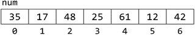
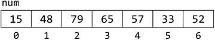
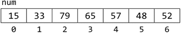
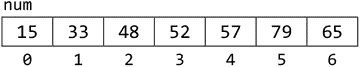
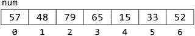
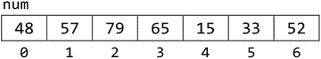
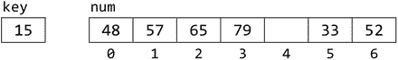
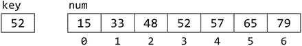

# 九、搜索、排序和合并

在本章中，我们将解释以下内容:

*   如何使用顺序搜索来搜索列表
*   如何使用选择排序对列表进行排序
*   如何使用插入排序对列表进行排序
*   如何对字符串列表进行排序
*   如何对并行数组进行排序
*   如何使用二分搜索法搜索排序列表
*   如何合并两个排序列表

## 9.1 顺序搜索

在许多情况下，数组用于存储信息列表。存储信息后，可能需要在列表中找到给定的项目。例如，一个数组可以用来存储 50 个人的名单。然后可能需要找到给定名字(`Indira`)在列表中的存储位置。

我们需要开发一种技术来搜索给定特定数组的元素。因为给定的项可能不在数组中，所以我们的技术也必须能够确定这一点。不管数组中元素的类型如何，搜索项的技术都是相同的。然而，对于不同类型的元素，该技术的实现可能是不同的。

我们将使用一个整数数组来说明称为顺序搜索的技术。考虑七个整数的数组`num`:

我们希望确定数字`61`是否被存储。在搜索术语中，`61`被称为搜索关键字，或者简称为关键字。搜索过程如下:

*   将`61`与第一个数字`num[0]`进行比较，第一个数字是`35`；它们不匹配，所以我们继续下一个数字。
*   将`61`与第二个数字`num[1]`比较，第二个数字是`17`；它们不匹配，所以我们继续下一个数字。
*   将`61`与第三个数字`num[2]`相比较，第三个数字是`48`；它们不匹配，所以我们继续下一个数字。
*   将`61`与第 4 个数字`num[3]`进行比较，第 4 个数字是`25`；它们不匹配，所以我们继续下一个数字。
*   将`61`与第 5 个数字`num[4]`进行比较，第 5 个数字是`61`；它们匹配，所以搜索停止，我们断定钥匙在位置`4`。

但是如果我们在找`32`呢？在这种情况下，我们将比较`32`和数组中的所有数字，没有一个匹配。我们断定`32`不在阵列中。

假设数组包含`n`个数字，我们可以将上述逻辑表达如下:

`for h = 0 to n - 1`

`if (key == num[h]) then key found, exit the loop`

`endfor`

`if h < n then key found in position h`

`else key not found`

在这种情况下，我们可能想在查看完数组中的所有元素之前退出循环。另一方面，我们可能必须查看所有元素，然后才能得出结论，关键不在那里。

如果我们找到了密钥，我们就退出循环，`h`将小于`n`。如果我们因为`h`变成`n`而退出循环，那么这个键不在数组中。

让我们用函数`search`来表达这种技术，给定一个`int`数组`num`，一个整数`key`，以及两个整数`lo`和`hi`，从`num[lo]`到`num[hi]`搜索`key`。如果找到，函数返回数组中的位置。如果没有找到，则返回`-1`。例如，考虑以下语句:

`n = search(num, 61, 0, 6);`

这将在`num[0]`到`num[6]`中搜索`61`。它将在位置`4`找到它并返回`4`，然后存储在`n`中。电话

`search(num, 32, 0, 6)`

将返回`-1`，因为`32`没有存储在数组中。`search`功能如下:

`int search(int num[], int key, int lo, int hi) {`

`//search for key from num[lo] to num[hi]`

`for (int h = lo; h <= hi; h++)`

`if (key == num[h]) return h;`

`return -1;`

`} //end search`

我们首先设置`h`到`lo`从那个位置开始搜索。`for`循环“遍历”数组的元素，直到找到键或者`h`通过`hi`。

为了举例说明如何使用搜索，考虑一下上一章的投票问题。计完票数后，我们的数组`name`和`vote`如下所示(记住我们没有使用`name[0]`和`vote[0]`):

<colgroup><col> <col> <col></colgroup> 
| `1` | `Victor Taylor` | `4` |
| `2` | `Denise Duncan` | `3` |
| `3` | `Kamal Ramdhan` | `6` |
| `4` | `Michael Ali` | `4` |
| `5` | `Anisa Sawh` | `6` |
| `6` | `Carol Khan` | `2` |
| `7` | `Gary Olliverie` | `3` |

假设我们想知道收到了多少张选票。我们必须在`name`数组中搜索她的名字。当我们找到它时(在`6`的位置)，我们可以从`vote[6]`检索她的投票。一般来说，如果一个名字在`n`的位置，得到的票数将是`vote[n]`。

我们修改我们的搜索函数，在`name`数组中查找一个名字:

`//search for key from name[lo] to name[hi]`

`int search(char name[][MaxNameLength+1], char key[], int lo, int hi) {`

`for (int h = lo; h <= hi; h++)`

`if (strcmp(key, name[h]) == 0) return h;`

`return -1;`

`}`

回想一下，我们使用`strcmp`来比较两个字符串。为了使用任何预定义的字符串函数，我们必须使用指令

`#include <string.h>`

我们节目的负责人。

我们可以如下使用该函数:

`n = search(name, "Carol Khan", 1, 7);`

`if (n > 0) printf("%s received %d vote(s)\n", name[n], vote[n]);`

`else printf("Name not found\n");`

使用我们的样本数据，`search`将返回存储在`n`中的`6,`。从`6 > 0`开始，代码将被打印

`Carol Khan received 2 vote(s)`

## 9.2 选择排序

考虑 8.15 节的投票程序。在程序 P8.8 中，我们按照给出名字的顺序打印结果。但是，假设我们想按姓名的字母顺序或按收到的票数顺序打印结果，获胜者排在第一位。我们必须按照我们想要的顺序重新排列名字或选票。我们说我们必须将名字按升序排序，或者将选票按降序排序。

排序是将一组值按升序或降序排列的过程。排序的原因有很多。有时我们排序是为了产生更可读的输出(例如，产生一个按字母顺序排列的列表)。教师可能需要按姓名或平均分对学生进行排序。如果我们有一个很大的值集，并且我们想要识别重复项，我们可以通过排序来实现；重复的值将一起出现在排序列表中。排序的方式有很多种。我们将讨论一种叫做选择排序的方法。

考虑以下阵列:

使用选择排序按升序对`num`进行排序的过程如下:

第一遍

*   找出位置`0`到`6`的最小数字；最小的是`15`，位于`4`位置。
*   Interchange the numbers in positions `0` and `4`. We get this:

    

第二遍

*   找出位置`1`到`6`的最小数字；最小的是`33`，位于`5`位置。
*   Interchange the numbers in positions `1` and `5`. We get this:

    

第三遍

*   找出位置`2`到`6`的最小数字；最小的是`48`，位于`5`位置。
*   Interchange the numbers in positions `2` and `5`. We get this:

    

第四遍

*   找出位置`3`到`6`的最小数字；最小的是`52`，位于`6`位置。
*   Interchange the numbers in positions `3` and `6`. We get this:

    

第五遍

*   找出位置`4`到`6`的最小数字；最小的是`57`，位于`4`位置。
*   Interchange the numbers in positions `4` and `4`. We get this:

    

第六遍

*   找出位置`5`到`6`的最小数字；最小的是`65`，位于`6`位置。
*   Interchange the numbers in positions `5` and `6`. We get this:

    

现在数组已经完全排序了。

如果我们让`h`从`0`到`5`，在每一遍中:

*   我们从位置`h`到`6`找到最小的数字。
*   如果最小的数字在位置`s`，我们交换位置`h`和`s`的数字。
*   对于大小为`n`的数组，我们进行`n-1`遍。在我们的示例中，我们在六次传递中对七个数字进行了排序。

以下是该算法的概要:

`for h = 0 to n - 2`

`s = position of smallest number from num[h] to num[n-1]`

`swap num[h] and num[s]`

`endfor`

在 8.14 节，我们写了一个函数来返回整数数组中最小数的位置。这里是为了便于参考:

`//find position of smallest from num[lo] to num[hi]`

`int getSmallest(int num[], int lo, int hi) {`

`int small = lo;`

`for (int h = lo + 1; h <= hi; h++)`

`if (num[h] < num[small]) small = h;`

`return small;`

`} //end getSmallest`

我们还编写了一个函数`swap`，它交换了一个字符数组中的两个元素。我们现在重写`swap`来交换整数数组中的两个元素:

`//swap elements num[i] and num[j]`

`void swap(int num[], int i, int j) {`

`int hold = num[i];`

`num[i] = num[j];`

`num[j] = hold;`

`} //end swap`

有了`getSmallest`和`swap`，我们可以将上面的算法编码成函数`selectionSort`。为了强调我们可以为参数使用任何名称，我们编写了一个函数来对名为`list`的整数数组进行排序。为了通用，我们还通过指定下标`lo`和`hi`来告诉函数对数组的哪一部分进行排序。与算法中从`0`到`n-2`的循环不同，现在是从`lo`到`hi-1`——这只是一个微小的变化，以获得更大的灵活性。

`//sort list[lo] to list[hi] in ascending order`

`void selectionSort(int list[], int lo, int hi) {`

`int getSmallest(int [], int, int);`

`void swap(int [], int, int);`

`for (int h = lo; h < hi; h++) {`

`int s = getSmallest(list, h, hi);`

`swap(list, h, s);`

`}`

`} //end selectionSort`

我们现在编写程序 P9.1 来测试`selectionSort`是否正常工作。程序请求最多 10 个数字(因为数组被声明为大小为 10)，将它们存储在数组`num`中，调用`selectionSort`，然后打印排序后的列表。

Program P9.1

`#include <stdio.h>`

`int main() {`

`void selectionSort(int [], int, int);`

`int v, num[10];`

`printf("Type up to 10 numbers followed by 0\n");`

`int n = 0;`

`scanf("%d", &v);`

`while (v != 0) {`

`num[n++] = v;`

`scanf("%d", &v);`

`}`

`//n numbers are stored from num[0] to num[n-1]`

`selectionSort(num, 0, n-1);`

`printf("\nThe sorted numbers are\n");`

`for (int h = 0; h < n; h++) printf("%d ", num[h]);`

`printf("\n");`

`} //end main`

`void selectionSort(int list[], int lo, int hi) {`

`//sort list[lo] to list[hi] in ascending order`

`int getSmallest(int [], int, int);`

`void swap(int [], int, int);`

`for (int h = lo; h < hi; h++) {`

`int s = getSmallest(list, h, hi);`

`swap(list, h, s);`

`}`

`} //end selectionSort`

`int getSmallest(int num[], int lo, int hi) {`

`//find position of smallest from num[lo] to num[hi]`

`int small = lo;`

`for (int h = lo + 1; h <= hi; h++)`

`if (num[h] < num[small]) small = h;`

`return small;`

`} //end getSmallest`

`void swap(int num[], int i, int j) {`

`//swap elements num[i] and num[j]`

`int hold = num[i];`

`num[i] = num[j];`

`num[j] = hold;`

`} //end swap`

以下是该程序的运行示例:

`Type up to 10 numbers followed by 0`

`57 48 79 65 15 33 52 0`

`The sorted numbers are`

`15 33 48 52 57 65` `79`

对程序 P9.1 的评论

这个程序演示了如何在一个数组中读取和存储未知数量的值。该程序最多支持 10 个数字，但如果提供的数字更少，它也必须工作。我们使用`n`给数组加下标并计数。最初，`n`是`0`。下面描述了样本数据的情况:

*   读取第一个数字`57`；它不是`0`，所以我们进入 while 循环。我们将`57`存储在`num[0]`中，然后将`1`添加到`n`，使其成为`1`；已读取一个数字，且`n`为`1`。
*   读取第二个数字`48`；它不是`0`，所以我们进入`the while`循环。我们将`48`存储在`num[1]`中，然后将`1`加到`n`，使其成为`2`；已读取两个数字，`n`为`2`。
*   读取第三个数字`79`；它不是`0`，所以我们进入`while`循环。我们将`79`存储在`num[2]`中，然后将`1`加到`n`，使其成为`3`；已经读取了三个数字，`n`是`3`。
*   第 4 个数字，`65`，读出；它不是`0`，所以我们进入`while`循环。我们将`65`存储在`num[3]`中，然后将`1`加到`n`，使其成为`4`；已经读取了四个数字，`n`是`4`。
*   第 5 个数字，`15`，读出；它不是`0`，所以我们进入`while`循环。我们将`15`存储在`num[4]`中，然后将`1`加到`n`，使其成为`5`；已读取五个数字，`n`为`5`。
*   第 6 个数字，`33`，读；它不是`0`，所以我们进入`while`循环。我们将`33`存储在`num[5]`中，然后将`1`加到`n`，使其成为`6`；已读取六个数字，`n`为`6`。
*   第 7 个数字，`52`，读；它不是`0`，所以我们进入`while`循环。我们将`52`存储在`num[6]`中，然后将`1`加到`n`，使其成为`7`；已读取七个数字，`n`为`7`。
*   The 8th number, `0`, is read; it is `0` so we exit the `while` loop and the array looks like this:

    

在任何阶段，`n`的值表示到那时为止已经存储了多少个数字。最后，`n`是`7`，数组中存储了七个数字。程序的其余部分可以假设`n`给出了数组中实际存储的值的数量；从`num[0]`到`num[n-1]`存储数值。

例如，调用

`selectionSort(num, 0, n-1);`

是对`num[0]`到`num[n-1]`进行排序的请求，但是，由于`n`是`7`，所以是对`num[0]`到`num[6]`进行排序的请求。

如前所述，如果用户在输入`0`之前输入超过 10 个数字，程序将会崩溃。当读取第 11 个数字时，将试图将其存储在不存在的`num[10]`中，给出“数组下标”错误。

我们可以通过将`while`条件改为这样来处理:

`while (v != 0 && n < 10)`

现在，如果`n`达到`10`，则不进入循环(因为`10`不小于`10`，并且不会尝试存储第 11 个数字。事实上，第 10 个数字之后的所有数字都将被忽略。

通常，最好在整个程序中使用一个设置为`10`的符号常量(`MaxNum`)，并使用`MaxNum`，而不是常量`10`。

我们已经按升序对数组进行了排序。我们可以用下面的算法对`num[0]`到`num[n-1]`进行降序排序:

`for h = 0 to n - 2`

`b = position of biggest number from num[h] to num[n-1]`

`swap num[h] and num[b]`

`endfor`

我们建议您尝试练习 1 和 2，按姓名升序和收到的票数降序打印投票问题的结果。

### 9.2.1 选择排序分析

为了找到 k 个项目中最小的一个，我们进行 k-1 次比较。在第一遍中，我们进行 n-1 次比较，找出 n 个项目中最小的一个。在第二遍中，我们进行 n-2 次比较，找出 n-1 项中最小的一项。以此类推，直到最后一遍，我们进行一次比较，找出两个项目中较小的一个。一般来说，在第 I 遍中，我们进行 n-i 次比较，以找到 n-i+1 项中最小的一项。因此:

比较总数= 1 + 2 +...+ n-1 = n(n-1) ≈ n 2

我们说选择排序的顺序是 O(n 2 )(“大 on 的平方”)。常量在“大 O”符号中并不重要，因为当 n 变得很大时，常量变得无关紧要。

每一次，我们用三个任务交换两个项目。我们进行了 n-1 次传递，因此我们总共进行了 3(n-1)次分配。使用“大 O”符号，我们说赋值的个数是 O(n)。常量 3 和 1 并不重要，因为 n 变大了。

如果数据是有序的，选择排序的性能会更好吗？不。一种方法是给它一个排序列表，看看它做什么。如果你完成了这个算法，你会发现这个方法不考虑数据的顺序。不管数据如何，它每次都会进行相同次数的比较。

作为一个练习，修改程序代码，使其计算使用选择排序对列表进行排序时的比较和赋值次数。

## 9.3 插入排序

考虑与之前相同的阵列:

把数字想象成桌子上的卡片，按照它们在数组中出现的顺序一次拿起一张。因此，我们首先拿起`57`，然后是`48`，然后是`79`，以此类推，直到我们拿起`52`。然而，当我们拿起每一个新的数字时，我们把它加到我们手上，这样我们手上的数字都被排序了。

当我们拿起`57`时，我们手中只有一个数字。我们认为有一个数字需要排序。

当我们拿起`48`时，我们把它加在`57`前面，这样我们的手就包含了

`48 57`

当我们拿起`79`时，我们把它放在`57`之后，这样我们的手就包含了

`48 57 79`

当我们拿起`65`时，我们把它放在`57`之后，这样我们的手就包含了

`48 57 65 79`

在这个阶段，四个数字已经被挑选出来，我们的手将它们按顺序排列。

当我们拿起`15`时，我们把它放在`48`之前，这样我们的手就包含了

`15 48 57 65 79`

当我们拿起`33`时，我们把它放在`15`之后，这样我们的手就包含了

`15 33 48 57 65 79`

最后，当我们拿起`52`时，我们把它放在`48`之后，这样我们的手就包含了

`15 33 48 52 57 65 79`

这些数字已按升序排列。

所描述的方法说明了插入排序背后的思想。从左到右，一次处理一个数组中的数字。这相当于从表中选取数字，一次一个。由于第一个数字本身是已排序的，我们将从第二个数字开始处理数组中的数字。

当我们开始处理`num[h]`时，我们可以假设`num[0]`到`num[h-1]`被排序。然后，我们尝试在`num[0]`到`num[h-1]`之间插入`num[h]`，以便对`num[0]`到`num[h]`进行排序。然后，我们将继续处理`num[h+1]`。当我们这样做时，我们假设元素`num[0]`到`num[h]`被排序将是正确的。

使用插入排序按升序对`num`进行排序的过程如下:

第一遍

*   Process `num[1]`, that is, `48`. This involves placing `48` so that the first two numbers are sorted; `num[0]` and `num[1]` now contain the following:

    

数组的其余部分保持不变。

第二遍

*   Process `num[2]`, that is, `79`. This involves placing `79` so that the first three numbers are sorted; `num[0]` to `num[2]` now contain the following:

    

数组的其余部分保持不变。

第三遍

*   Process `num[3]`, that is, `65`. This involves placing `65` so that the first four numbers are sorted; `num[0] to num[3]` now contain the following:

    

数组的其余部分保持不变。

第四遍

*   Process `num[4]`, that is, `15`. This involves placing `15` so that the first five numbers are sorted. To simplify the explanation, think of `15` as being taken out and stored in a simple variable (`key`, say) leaving a “hole” in `num[4]`. We can picture this as follows:

    

将`15`插入其正确位置的过程如下:

*   Compare `15` with `79`; it is smaller, so move `79` to location `4`, leaving location `3` free. This gives the following:

    

*   Compare `15` with `65`; it is smaller, so move `65` to location `3`, leaving location `2` free. This gives the following:

    

*   Compare `15` with `57`; it is smaller, so move `57` to location `2`, leaving location `1` free. This gives the following:

    

*   Compare `15` with `48`; it is smaller, so move `48` to location `1`, leaving location `0` free. This gives the following:

    

*   There are no more numbers to compare with `15`, so it is inserted in location `0`, giving the following:

    

*   我们可以把`15` ( `key`)的摆放逻辑用它和它左边的数字比较来表达，从最近的一个开始。只要`key`小于`num[k]`，对于某些`k`，我们就把`num[k]`移到`num[k+1]`位置，继续考虑`num[k-1]`，前提是它存在。当`k`实际上是`0`的时候就不会存在了。在这种情况下，过程停止，并且`key`插入位置`0`。

第五遍

*   流程`num[5]`，即`33`。这包括放置`33`,以便对前六个数字进行排序。这是按如下方式完成的:
    *   将`33`存储在`key`中，留下位置`5`空闲。
    *   比较`33`和`79`；它变小了，所以把`79`移到位置`5`，留下位置`4`空闲。
    *   比较`33`和`65`；它变小了，所以把`65`移到位置`4`，留下位置`3`空闲。
    *   比较`33`和`57`；它变小了，所以把`57`移到位置`3`，留下位置`2`空闲。
    *   比较`33`和`48`；它变小了，所以把`48`移到位置`2`，留下位置`1`空闲。
*   Compare `33` with `15`; it is bigger, so insert `33` in location `1`. This gives the following:

    

*   我们可以通过与它左边的数字比较来表达放置`33`的逻辑，从最近的一个开始。只要`key`小于`num[k]`，对于某些`k`，我们就把`num[k]`移到位置`num[k+1]`，继续考虑`num[k-1]`，前提是它存在。如果某些`k`的`key`大于或等于`num[k]`，则`key`插入`k+1`位置。这里，`33`大于`num[0]`，所以插入`num[1]`。

第六遍

*   流程`num[6]`，即`52`。这包括放置`52`,以便对前七个(所有)数字进行排序。这是按如下方式完成的:
    *   将`52`存储在`key`中，留下位置`6`空闲。
    *   比较`52`和`79`；它变小了，所以把`79`移到位置`6`，留下位置`5`空闲。
    *   比较`52`和`65`；它变小了，所以把`65`移到位置`5`，留下位置`4`空闲。
    *   比较`52`和`57`；它变小了，所以把`57`移到位置`4`，留下位置`3`空闲。
*   Compare `52` with `48`; it is bigger, so insert `52` in location `3`. This gives the following:

    

数组现在已经完全排序了。

以下是使用插入排序对数组`num`的前`n`个元素进行排序的概要:

`for h = 1 to n - 1 do`

`insert num[h] among num[0] to num[h-1] so that`

`num[0] to num[h] are sorted`

`endfor`

使用这个大纲，我们使用参数`list`编写函数`insertionSort`。

`void insertionSort(int list[], int n) {`

`//sort list[0] to list[n-1] in ascending order`

`for (int h = 1; h < n; h++) {`

`int key = list[h];`

`int k = h - 1; //start comparing with previous item`

`while (k >= 0 && key < list[k]) {`

`list[k + 1] = list[k];`

`--k;`

`}`

`list[k + 1] = key;`

`} //end for`

`} //end insertionSort`

`while`语句是排序的核心。它声明，只要我们在数组(`k >= 0`)中，并且当前数字(`key`)小于数组(`key < list[k]`)中的数字，我们就将`list[k]`向右移动(`list[k+1] = list[k]`)，并继续移动到左边的下一个数字(`--k`)。

对于某些`k`，如果`k`等于`-1`或者如果`key`大于或等于`list[k]`，我们退出`while`循环。无论哪种情况，`key`都被插入到`list[k+1]`中。如果`k`为`-1`，则表示当前数字小于列表中所有之前的数字，必须插入到`list[0]`中。但是当`k`为`-1`时`list[k+1]`为`list[0]`，所以在这种情况下`key`插入正确。

该函数按升序排序。要按降序排序，我们所要做的就是改变`while`条件中的< to >，因此:

`while (k >= 0 && key > list[k])`

现在，如果一个键变大了，它就会向左移动。

我们编写程序 P9.2 来测试`insertionSort`是否正确工作。

Program P9.2

`#include <stdio.h>`

`int main() {`

`void insertionSort(int [], int);`

`int v, num[10];`

`printf("Type up to 10 numbers followed by 0\n");`

`int n = 0;`

`scanf("%d", &v);`

`while (v != 0) {`

`num[n++] = v;`

`scanf("%d", &v);`

`}`

`//n numbers are stored from num[0] to num[n-1]`

`insertionSort(num, n);`

`printf("\nThe sorted numbers are\n");`

`for (int h = 0; h < n; h++) printf("%d ", num[h]);`

`printf("\n");`

`} //end main`

`void insertionSort(int list[], int n) {`

`//sort list[0] to list[n-1] in ascending order`

`for (int h = 1; h < n; h++) {`

`int key = list[h];`

`int k = h - 1; //start comparing with previous item`

`while (k >= 0 && key < list[k]) {`

`list[k + 1] = list[k];`

`--k;`

`}`

`list[k + 1] = key;`

`} //end for`

`} //end insertionSort`

程序请求最多 10 个数字(因为数组被声明为大小为 10)，将它们存储在数组`num`中，调用`insertionSort`，然后打印排序后的列表。以下是 P9.2 的运行示例:

`Type up to 10 numbers followed by 0`

`57 48 79 65 15 33 52 0`

`The sorted numbers are`

`15 33 48 52 57 65` `79`

### 9.3.1 插入排序分析

在处理 j 项时，我们可以进行少至一次的比较(如果`num[j]`大于`num[j-1]`)或多达 j-1 次的比较(如果`num[j]`小于前面所有的项)。对于随机数据，平均来说，我们应该进行(j-1)次比较。因此，对 n 个项目进行排序的平均总比较次数如下:

我们说插入排序的阶数为 O(n 2 )(“大 on 的平方”)。随着`n`变大，常量并不重要。

每次我们做一个比较，我们也做一个分配。因此，分配的总数也是 n(n-1) ≈ n 2 。

我们强调这是随机数据的平均值。与选择排序不同，插入排序的实际性能取决于所提供的数据。如果给定的数组已经排序，插入排序将通过进行 n-1 次比较来快速确定这一点。在这种情况下，它以 O(n)时间运行。人们会认为，数据中的顺序越多，插入排序的性能就越好。

如果给定的数据是降序排列的，插入排序的性能最差，因为每个新数字都必须一直移动到列表的开头。在这种情况下，比较的次数是 n(n-1) ≈ n 2 。分配数也是 n(n-1) ≈ n 2 。

因此，通过插入排序进行比较的次数从 n-1(最佳)到 n 2 (平均)到 n 2 (最差)。赋值的次数总是与比较的次数相同。

作为一个练习，修改程序代码，使其计算使用插入排序对列表进行排序时的比较和赋值次数。

### 9.3.2 在适当的位置插入一个元素

插入排序使用向已经排序的列表中添加新元素的思想，以便列表保持排序。我们可以把它本身当作一个问题(与插入排序无关)。具体来说，给定一个从`list[m]`到`list[n]`的排序列表，我们想要向列表中添加一个新的条目(比如说`newItem`)，以便对`list[m]`到`list[n+1]`进行排序。

添加新项目会使列表的大小增加 1。我们假设数组有空间容纳新的项目。我们编写函数`insertInPlace`来解决这个问题。

`void insertInPlace(int newItem, int list[], int m, int n) {`

`//list[m] to list[n] are sorted`

`//insert newItem so that list[m] to list[n+1] are sorted`

`int k = n;`

`while (k >= m && newItem < list[k]) {`

`list[k + 1] = list[k];`

`--k;`

`}`

`list[k + 1] = newItem;`

`} //end insertInPlace`

现在我们有了`insertInPlace`，我们可以将`insertionSort`(称之为`insertionSort2`)重写如下:

`void insertionSort2(int list[], int lo, int hi) {`

`//sort list[lo] to list[hi] in ascending order`

`void insertInPlace(int, int [], int, int);`

`for (int h = lo + 1; h <= hi; h++)`

`insertInPlace(list[h], list, lo, h - 1);`

`} //end insertionSort2`

请注意，`insertionSort2`的原型现在是这样的:

`void insertionSort2(int [], int, int);`

为了对包含`n`项的数组`num`进行排序，我们必须这样调用它:

`insertionSort2(num, 0, n-1);`

## 9.4 对字符串数组进行排序

考虑按字母顺序排列姓名列表的问题。我们已经看到，在 C 中，每个名字都存储在一个字符数组中。为了存储几个名字，我们需要一个二维字符数组。例如，考虑下面的名字列表。

<colgroup><col> <col> <col> <col> <col> <col> <col> <col> <col> <col> <col> <col> <col> <col> <col> <col></colgroup> 
|   | `0` | `1` | `2` | `3` | `4` | `5` | `6` | `7` | `8` | `9` | `10` | `11` | `12` | `13` | `14` |
| `0` | `S` | `a` | `m` | `l` | `a` | `l` | `,` |   | `R` | `a` | `w` | `l` | `E` | `\0` |   |
| `1` | `W` | `i` | `l` | `l` | `i` | `a` | `m` | `s` | `,` |   | `M` | `a` | `r` | `k` | `\0` |
| `2` | `D` | `e` | `l` | `w` | `i` | `n` | `,` |   | `M` | `a` | `c` | `\0` |   |   |   |
| `3` | `T` | `a` | `y` | `l` | `o` | `r` | `,` |   | `V` | `i` | `c` | `t` | `o` | `r` | `\0` |
| `4` | `M` | `o` | `h` | `a` | `m` | `e` | `d` | `,` |   | `A` | `b` | `u` | `\0` |   |   |
| `5` | `S` | `i` | `n` | `g` | `h` | `,` |   | `K` | `R` | `i` | `s` | `h` | `n` | `a` | `\0` |
| `6` | `T` | `a` | `w` | `a` | `r` | `i` | `,` |   | `T` | `a` | `u` | `\0` |   |   |   |
| `7` | `A` | `b` | `d` | `o` | `o` | `l` | `,` |   | `Z` | `a` | `i` | `d` | `\0` |   |   |

为了存储这个列表，我们需要一个如下所示的声明:

`char list[8][15];`

为了迎合更长的名字，我们可以增加 15 个，为了迎合更多的名字，我们可以增加 8 个。

排序`list`的过程本质上与排序整数数组相同。主要区别在于，我们使用`<`来比较两个数字，而我们必须使用`strcmp`来比较两个名字。在前面显示的函数`insertionSort`中，`while`条件由此改变:

`while (k >= lo && key < list[k])`

到下面，其中`key`现在被声明为`char key[15]`:

`while (k >= lo && strcmp(key, list[k]) < 0)`

此外，我们现在必须使用`strcpy`(因为我们不能对字符串使用`=`)来为另一个位置分配名称。我们将在下一节看到完整的功能。

### 可变长度数组

我们将用这个例子来展示可变长度数组(vla)在 C 语言中的用法，这个特性只在 C99 及更高版本的 C 语言中可用。其思想是数组的大小可以在运行时指定，而不是在编译时指定。

在下面的函数中，注意参数列表中`list` ( `char list[][max]`)的声明。与一维数组一样，第一维的大小没有指定。使用参数`max`指定第二维的尺寸；调用函数时会指定`max`的值。这给了我们更多的灵活性，因为我们可以在运行时指定第二维的大小。

`void insertionSort3(int lo, int hi, int max, char list[][max]) {`

`//Sort the strings in list[lo] to list[hi] in alphabetical order.`

`//The maximum string size is max - 1 (one char taken up by \0).`

`char key[max];`

`for (int h = lo + 1; h <= hi; h++) {`

`strcpy(key, list[h]);`

`int k = h - 1; //start comparing with previous item`

`while (k >= lo && strcmp(key, list[k]) < 0) {`

`strcpy(list[k + 1], list[k]);`

`--k;`

`}`

`strcpy(list[k + 1], key);`

`} //end for`

`} // end insertionSort3`

我们编写一个简单的`main`例程来测试`insertionSort3`，如程序 P9.3 所示。

Program P9.3

`#include <stdio.h>`

`#include <string.h>`

`#define MaxNameSize 14`

`#define MaxNameBuffer MaxNameSize+1`

`#define MaxNames 8`

`int main() {`

`void insertionSort3(int, int, int max, char [][max]);`

`char name[MaxNames][MaxNameBuffer] =`

`{"Samlal, Rawle", "Williams, Mark","Delwin, Mac",`

`"Taylor, Victor", "Mohamed, Abu","Singh, Krishna",`

`"Tawari, Tau", "Abdool, Zaid" };`

`insertionSort3(0, MaxNames-1, MaxNameBuffer, name);`

`printf("\nThe sorted names are\n\n");`

`for (int h = 0; h < MaxNames; h++) printf("%s\n", name[h]);`

`} //end main`

`void insertionSort3(int lo, int hi, int max, char list[][max]) {`

`//Sort the strings in list[lo] to list[hi] in alphabetical order.`

`//The maximum string size is max - 1 (one char taken up by \0).`

`char key[max];`

`for (int h = lo + 1; h <= hi; h++) {`

`strcpy(key, list[h]);`

`int k = h - 1; //start comparing with previous item`

`while (k >= lo && strcmp(key, list[k]) < 0) {`

`strcpy(list[k + 1], list[k]);`

`--k;`

`}`

`strcpy(list[k + 1], key);`

`} //end for`

`} // end insertionSort3`

`name`的声明用前面显示的八个名字初始化它。运行时，该程序产生以下输出:

`The sorted names are`

`Abdool, Zaid`

`Delwin, Mac`

`Mohamed, Abu`

`Samlal, Rawle`

`Singh, Krishna`

`Tawari, Tau`

`Taylor, Victor`

`Williams,` `Mark`

## 9.5 排序并行数组

在不同的数组中有相关的信息是很常见的。例如，假设除了`name`，我们还有一个整数数组`id`，使得`id[h]`是与`name[h]`相关联的标识号，如下所示。

在不同的数组中有相关的信息是很常见的。例如，假设除了`name`，我们还有一个整数数组`id`，使得`id[h]`是与`name[h]`相关联的标识号，如下所示。

<colgroup><col> <col> <col></colgroup> 
|   | `Name` | `id` |
| --- | --- | --- |
| `0` | `Samlal, Rawle` | `8742` |
| `1` | `Williams, Mark` | `5418` |
| `2` | `Delwin, Mac` | `4833` |
| `3` | `Taylor, Victor` | `4230` |
| `4` | `Mohamed, Abu` | `8583` |
| `5` | `Singh, Krishna` | `2458` |
| `6` | `Tawari, Tau` | `5768` |
| `7` | `Abdool, Zaid` | `7746` |

考虑按字母顺序排列名字的问题。最后，我们希望每个名字都有正确的 ID 号。所以，比如排序完成后，`name[0]`应该包含`Abdool, Zaid`，`id[0]`应该包含`7746`。

为此，在排序过程中，每次移动一个姓名时，相应的 ID 号也必须移动。因为姓名和 ID 号必须“并行”移动，所以我们说我们正在进行并行排序，或者我们正在对并行数组进行排序。

我们重写`insertionSort3`来说明如何对并行数组进行排序。我们只需添加代码，以便在移动名称时移动 ID。我们称之为`parallelSort`。

`void parallelSort(int lo, int hi, int max, char list[][max], int id[]) {`

`//Sort the names in list[lo] to list[hi] in alphabetical order, ensuring`

`//that each name remains with its original id number.`

`//The maximum string size is max - 1 (one char taken up by \0).`

`char key[max];`

`for (int h = lo + 1; h <= hi; h++) {`

`strcpy(key, list[h]);`

`int m = id[h];  // extract the id number`

`int k = h - 1; //start comparing with previous item`

`while (k >= lo && strcmp(key, list[k]) < 0) {`

`strcpy(list[k + 1], list[k]);`

`id[k+ 1] = id[k];  // move up id when we move a name`

`--k;`

`}`

`strcpy(list[k + 1], key);`

`id[k + 1] = m; // store id in the same position as the name`

`} //end for`

`} //end parallelSort`

我们通过编写下面的`main`例程来测试`parallelSort`:

`#include <stdio.h>`

`#include <string.h>`

`#define MaxNameSize 14`

`#define MaxNameBuffer MaxNameSize+1`

`#define MaxNames 8`

`int main() {`

`void parallelSort(int, int, int max, char [][max], int[]);`

`char name[MaxNames][MaxNameBuffer] =`

`{"Samlal, Rawle", "Williams, Mark","Delwin, Mac",`

`"Taylor, Victor", "Mohamed, Abu","Singh, Krishna",`

`"Tawari, Tau", "Abdool, Zaid" };`

`int id[MaxNames] = {8742,5418,4833,4230,8583,2458,5768,3313};`

`parallelSort(0, MaxNames-1, MaxNameBuffer, name, id);`

`printf("\nThe sorted names and IDs are\n\n");`

`for (int h = 0; h < MaxNames; h++)`

`printf("%-18s %d\n", name[h], id[h]);`

`} //end main`

运行时，它会产生以下输出:

`The sorted names and IDs are`

`Abdool, Zaid       3313`

`Delwin, Mac        4833`

`Mohamed, Abu       8583`

`Samlal, Rawle      8742`

`Singh, Krishna     2458`

`Tawari, Tau        5768`

`Taylor, Victor     4230`

`Williams, Mark     5418`

我们顺便注意到，使用 C 结构可以更方便地存储“并行数组”。在我们学习了一些结构之后，我们将在 10.9 节讨论一个例子。

## 9.6 二分搜索法

如果列表是有序的(升序或降序)，二分搜索法是搜索给定项目列表的一种非常快速的方法。如果列表不有序，可以使用前面描述的任何方法进行排序。

为了说明该方法，考虑一个由 11 个数字组成的列表，按升序排列。

假设我们希望搜索`56`。搜索过程如下:

*   首先，我们找到列表中的中间项。这是在位置`5`的`49`。我们将`56`与`49`相比较。由于`56`更大，我们知道如果`56`在列表中，它一定在位置`5`之后，因为数字是升序排列的。下一步，我们将搜索范围限制在位置`6`到`10`。
*   接下来，我们从位置`6`到`10`找到中间的项目。这是`8`位置的物品，即`72`。
*   我们比较`56`和`72`。由于`56`较小，我们知道如果`56`在列表中，它一定在位置`8`之前，因为数字是按升序排列的。下一步，我们将搜索范围限制在位置`6`到`7`。
*   接下来，我们从位置`6`到`7`找到中间的项目。在这种情况下，我们可以选择项目`6`或项目`7`。我们要写的算法会选择`6`项，也就是`56`。
*   我们比较`56`和`56`。由于它们是相同的，我们的搜索成功结束，在位置`6`找到了所需的项目。

假设我们正在搜索`60`。搜索将如上进行，直到我们将`60`与`56`(在位置`6`)进行比较。

*   由于`60`更大，我们知道如果`60`在列表中，它一定在位置`6`之后，因为数字是按升序排列的。下一步，我们将搜索范围限制在`7`到`7`的地点。这只是一个地点。
*   我们将`60`与`7`项进行比较，即`66`。由于`60`较小，我们知道如果`60`在列表中，它一定在位置`7`之前。由于它不可能在位置`6`之后，位置`7`之前，所以我们断定它不在列表中。

在搜索的每个阶段，我们将搜索限制在列表的某个部分。让我们使用变量`lo`和`hi`作为定义这一部分的下标。换句话说，我们的搜索将被限制在从`num[lo]`到`num[hi]`的数字范围内。

最初，我们想要搜索整个列表，因此在本例中，我们将把`lo`设置为`0`，把`hi`设置为`10`。

我们如何找到中项的下标？我们将使用计算

`mid = (lo + hi) / 2;`

因为将执行整数除法，所以分数(如果有的话)将被丢弃。例如当`lo`为`0`，`hi`为`10`，`mid`变为`5`；当`lo`为`6`且`hi`为`10`时，`mid`变为`8`；当`lo`为`6`且`hi`为`7`时，`mid`变为`6`。

只要`lo`小于或等于`hi`，它们就定义了要搜索的列表的非空部分。当`lo`等于`hi`时，它们定义了要搜索的单个项目。如果`lo`变得比`hi`大，这意味着我们已经搜索了整个列表，但没有找到该项目。

基于这些想法，我们现在可以编写一个函数`binarySearch`。更一般地说，我们将编写它，以便调用例程可以指定它希望搜索数组的哪个部分来查找该项。

因此，必须给该函数指定要搜索的项(`key`)、数组(`list`)、搜索的开始位置(`lo`)和搜索的结束位置(`hi`)。例如，为了在上面的数组`num`中搜索数字`56`，我们可以发出下面的调用:

`binarySearch(56, num, 0, 10)`

这个函数必须告诉我们搜索的结果。如果找到了该项，该函数将返回它的位置。如果没有找到，将返回`-1`。

`int binarySearch(int key, int list[], int lo, int hi) {`

`//search for key from list[lo] to list[hi]`

`//if found, return its location; otherwise, return -1`

`int mid;`

`while (lo <=``h`T2】

`mid = (lo + hi) / 2;`

`if (key == list[mid]) return mid; // found`

`if (key < list[mid]) hi = mid - 1;`

`else lo = mid + 1;`

`}`

`return -1; //lo and hi have crossed; key not found`

`} //end binarySearch`

如果`item`包含一个要搜索的数字，我们可以编写以下代码来调用`binarySearch`并检查搜索的结果:

`int ans = binarySearch(item, num, 0, 12);`

`if (ans == -1) printf(“%d not found\n”, item);`

`else printf(“%d found in location %d\n”, item, ans);`

如果我们希望从位置`i`到`j`搜索`item`，我们可以这样写:

`int ans = binarySearch(item, num, i, j);`

## 9.7 词频计数

让我们写一个程序来阅读一篇英语文章，并统计每个单词出现的次数。输出由单词及其频率的字母列表组成。

我们可以使用以下大纲来开发我们的程序:

`while there is input`

`get a word`

`search for word`

`if word is in the table`

`add 1 to its count`

`else`

`add word to the table`

`set its count to 1`

`endif`

`endwhile`

`print table`

这是典型的“搜索并插入”情况。我们在目前存储的单词中搜索下一个单词。如果搜索成功，我们只需要增加它的计数。如果搜索失败，该单词将被放入表中，并且其计数设置为 1。

这里的一个主要设计决策是如何搜索表，这反过来又取决于新单词在表中的插入位置和插入方式。以下是两种可能性:

A new word is inserted in the next free position in the table. This implies that a sequential search must be used to look for an incoming word since the words would not be in any particular order. This method has the advantages of simplicity and easy insertion, but searching takes longer as more words are put in the table.   A new word is inserted in the table in such a way that the words are always in alphabetical order. This may entail moving words that have already been stored so that the new word may be slotted in the right place. However, since the table is in order, a binary search can be used to search for an incoming word.  

对于这种方法，搜索速度更快，但是插入速度比(1)慢。因为一般来说，搜索比插入更频繁，(2)可能更好。

(2)的另一个优点是，在最后，单词已经按字母顺序排列，不需要排序。如果使用(1)，则需要对单词进行排序，以获得字母顺序。

我们将使用(2)中的方法编写程序。完整的程序如程序 P9.4 所示。

Program P9.4

`#include <stdio.h>`

`#include <string.h>`

`#include <ctype.h>`

`#include <stdlib.h>`

`#define MaxWords 50`

`#define MaxLength 10`

`#define MaxWordBuffer MaxLength+1`

`int main() {`

`int getWord(FILE *, char[]);`

`int binarySearch(int, int, char [], int max, char [][max]);`

`void addToList(char[], int max, char [][max], int[], int, int);`

`void printResults(FILE *, int max, char [][max], int[], int);`

`char wordList[MaxWords][MaxWordBuffer], word[MaxWordBuffer];`

`int frequency[MaxWords], numWords = 0;`

`FILE * in = fopen("passage.txt", "r");`

`if (in == NULL){`

`printf("Cannot find file\n");`

`exit(1);`

`}`

`FILE * out = fopen("output.txt", "w");`

`if (out == NULL){`

`printf("Cannot create output file\n");`

`exit(2);`

`}`

`for (int h = 1; h <= MaxWords ; h++) frequency[h] = 0;`

`while (getWord(in, word) != 0) {`

`int loc = binarySearch (0, numWords-1, word, MaxWordBuffer,`

`wordList);`

`if (strcmp(word, wordList[loc]) == 0)`

`++frequency[loc]; //word found`

`else //this is a new word`

`if (numWords < MaxWords) { //if table is not full`

`addToList(word, MaxWordBuffer, wordList, frequency, loc,`

`numWords-1);`

`++numWords;`

`}`

`else fprintf(out, "'%s' not added to table\n", word);`

`}`

`printResults(out, MaxWordBuffer, wordList, frequency, numWords);`

`} // end main`

`int getWord(FILE * in, char str[]) {`

`// store the next word, if any, in str; convert word to lowercase`

`// return 1 if a word is found; 0, otherwise`

`char ch;`

`int n = 0;`

`// read over white space`

`while (!isalpha(ch = getc(in)) && ch != EOF) ; //empty while body`

`if (ch == EOF) return 0;`

`str[n++] = tolower(ch);`

`while (isalpha(ch = getc(in)) && ch != EOF)`

`if (n < MaxLength) str[n++] = tolower(ch);`

`str[n] = '\0';`

`return 1;`

`} // end getWord`

`int binarySearch(int lo, int hi, char key[], int max, char list[][max]) {`

`//search for key from list[lo] to list[hi]`

`//if found, return its location;`

`//if not found, return the location in which it should be inserted`

`//the calling program will check the location to determine if found`

`while (lo <= hi) {`

`int mid = (lo + hi) / 2;`

`int cmp = strcmp(key, list[mid]);`

`if (cmp == 0) return mid; // found`

`if (cmp < 0) hi = mid - 1;`

`else lo = mid + 1;`

`}`

`return lo; //not found; should be inserted in location lo`

`} //end binarySearch`

`void addToList(char item[], int max, char list[][max],`

`int freq[], int p, int n) {`

`//adds item in position list[p]; sets freq[p] to 1`

`//shifts list[n] down to list[p] to the right`

`for (int h = n; h >= p; h--) {`

`strcpy(list[h+1], list[h]);`

`freq[h+1] = freq[h];`

`}`

`strcpy(list[p], item);`

`freq[p] = 1;`

`} //end addToList`

`void printResults(FILE *out, int max, char list[][max],`

`int freq[], int n) {`

`fprintf(out, "\nWords     Frequency\n\n");`

`for (int h = 0; h < n; h++)`

`fprintf(out, "%-15s %2d\n", list[h], freq[h]);`

`} //end printResults`

假设文件`passage.txt`包含以下数据(来自 Rudyard Kipling 的 If):

`If you can dream—and not make dreams your master;`

`If you can think—and not make thoughts your aim;`

`If you can meet with Triumph and Disaster`

`And treat those two impostors just the same...`

`If you can fill the unforgiving minute`

`With sixty seconds’ worth of distance run,`

`Yours is the Earth...`

使用这些数据运行程序 P9.4 时，它会产生以下输出:

`Words     Frequency`

`aim           1`

`and           4`

`can           4`

`disaster      1`

`distance      1`

`dream         1`

`dreams        1`

`earth         1`

`fill          1`

`if            4`

`impostors     1`

`is            1`

`just          1`

`make          2`

`master        1`

`meet          1`

`minute        1`

`not           2`

`of            1`

`run           1`

`same          1`

`seconds       1`

`sixty         1`

`the           3`

`think         1`

`those         1`

`thoughts      1`

`treat         1`

`triumph       1`

`two           1`

`unforgivin    1`

`with          2`

`worth         1`

`you           4`

`your          2`

`yours` `1`

对 P9.4 计划的评论

*   出于我们的目的，我们假设一个单词以字母开头，并且只由字母组成。如果您想包含其他字符(如连字符或撇号)，您只需更改`getWord`函数。
*   `MaxWords`表示满足的不同单词的最大数量。为了测试程序，我们使用了`50`作为这个值。如果文章中不同单词的数量超过了`MaxWords` ( `50`)，那么`50` th 之后的所有单词都将被读取，但不会被存储，并且会打印一条大意如此的消息。然而，如果再次遇到，已经存储的单词的计数将增加。
*   `MaxLength`(我们用`10`来测试)表示一个单词的最大长度。字符串使用`MaxLength+1`(定义为`MaxWordBuffer`)来声明，以迎合`\0`，它必须添加在每个字符串的末尾。
*   `main`检查输入文件是否存在，输出文件是否可以创建。接下来，它将频率计数初始化为`0`。然后，它根据本节开始时显示的大纲处理文章中的单词。
*   `getWord`读取输入文件并存储在其字符串参数中找到的下一个单词。如果找到一个单词，它返回`1`，否则返回`0`。如果一个单词比`MaxLength`长，则只存储第一个`MaxLength`字母；其余的被读取并丢弃。例如，使用字长`10`将`unforgiving`截断为`unforgivin`。
*   所有单词都被转换成小写，例如，`The`和`the`被视为同一个单词。
*   我们编写了`binarySearch`，这样如果找到这个单词，就会返回它的位置(`loc`)。如果没有找到，则返回单词应该插入的位置。测试
*   `if (strcmp(word, wordList[loc]) == 0)`
*   确定是否找到了它。`addToList`被赋予插入新单词的位置。该位置右侧的单词(包括该位置)将被移动，以便为新单词腾出空间。
*   在声明函数原型时，一些编译器允许像在`char [][]`中那样声明一个二维数组参数，没有为任何一个维度指定大小。其他要求必须指定第二维的大小。指定第二维的大小应该适用于所有编译器。在我们的程序中，我们使用参数`max`指定第二维度，调用函数时将提供该参数的值。

## 9.8 合并排序列表

合并是将两个或多个有序列表合并成一个有序列表的过程。例如，给定两个数字列表，`A`和`B`，如下所示:

`A: 21 28 35 40 61 75`

`B: 16 25 47 54`

它们可以组合成一个有序列表`C`，如下所示:

`C: 16 21 25 28 35 40 47 54 61 75`

列表`C`包含列表`A`和`B`中的所有数字。如何执行合并？

一种思考方式是想象给定列表中的数字存储在卡片上，每张卡片一个，卡片面朝上放在桌子上，最小的放在顶部。我们可以如下想象列表 A 和 B:

`21    16`

`28    25`

`35    47`

`40    54`

`61`

`75`

我们看最上面的两张卡，`21`和`16`。较小的`16`被移除并放置在`C`中。这就暴露了`25`这个数字。我们有这个:

`21    25`

`28    47`

`35    54`

`40`

`61`

`75`

现在最上面的两张卡是`21`和`25`。较小的`21`被移除并添加到`C`，T3 现在包含了`16 21`。这就暴露了数字`28`。我们有这个:

`28` `25`

`35    47`

`40    54`

`61`

`75`

现在最上面的两张卡是`28`和`25`。较小的`25`被移除并添加到`C`，T3 现在包含了`16 21 25`。这就暴露了数字`47`。我们有这个:

`28    47`

`35    54`

`40`

`61`

`75`

现在最上面的两张卡是`28`和`47`。较小的`28`被移除并添加到`C`，T3 现在包含了`16 21 25 28`。这就暴露了数字`35`。我们有这个:

`35    47`

`40    54`

`61`

`75`

现在最上面的两张卡是`35`和`47`。较小的`35`被移除并添加到`C`，T3 现在包含了`16 21 25 28 35`。这就暴露了数字`40`。我们有这个:

`40    47`

`61    54`

`75`

现在最上面的两张卡是`40`和`47`。较小的`40`被移除并添加到`C`，T3 现在包含了`16 21 25 28 35 40`。这就暴露了数字`61`。我们有这个:

`61    47`

`75    54`

现在最上面的两张卡是`61`和`47`。较小的`47`被移除并添加到`C`，T3 现在包含了`16 21 25 28 35 40 47`。这就暴露了数字`54`。我们有这个:

`61    54`

`75`

现在最上面的两张卡是`61`和`54`。较小的`54`被移除并添加到`C`，T3 现在包含了`16 21 25 28 35 40 47 54`。列表`B`没有更多数字。

我们将`A`的剩余元素(`61 75`)复制到`C`，现在包含以下内容:

`16 21 25 28 35 40 47 54 61 75`

合并现已完成。

在合并的每一步，我们将最小剩余数`A`与最小剩余数`B`进行比较。其中较小的被添加到`C`。如果较小的数字来自于`A`，我们继续前进到`A`的下一个数字；如果较小的数字来自`B`，我们将继续处理`B`中的下一个数字。

重复这一过程，直到使用完`A`或`B`中的所有号码。如果`A`中的所有号码都已被使用，我们将从`B`到`C`的剩余号码相加。如果`B`中的所有数字都已被使用，我们将从`A`到`C`的剩余数字相加。

我们可以将合并的逻辑表达如下:

`while (at least one number remains in both A and B) {`

`if (smallest in A < smallest in B)`

`add smallest in A to C`

`move on to next number in A`

`else`

`add smallest in B to C`

`move on to next number in B`

`endif`

`}`

`if (A has ended) add remaining numbers in B to C`

`else add remaining numbers in A to` `C`

### 实施合并

假设数组`A`包含存储在`A[0]`到`A[m-1],`中的 m 个数字，数组`B`包含存储在`B[0]`到`B[n-1]`中的 n 个数字。假设数字按升序存储。我们希望将`A`和`B`中的数字合并到另一个数组`C`中，这样`C[0]`到`C[m+n-1]`就包含了`A`和`B`中按升序排序的所有数字。

我们将使用整数变量`i`、`j,`和`k`来分别下标数组`A`、`B`和`C`。在数组中“移动到下一个位置”可以通过给下标变量加 1 来实现。我们可以用下面的代码实现合并:

`i = 0; //i points to the first (smallest) number in A`

`j = 0; //j points to the first (smallest) number in B`

`k = -1; //k will be incremented before storing a number in C[k]`

`while (i < m && j < n) {`

`if (A[i] < B[j]) C[++k] = A[i++];`

`else C[++k] = B[j++];`

`}`

`if (i == m) //copy B[j] to B[n-1] to C`

`for ( ; j < n; j++) C[++k] = B[j];`

`else // j == n, copy A[i] to A[m-1] to C`

`for ( ; i < m; i++) C[++k] = A[i];`

程序 P9.5 显示了一个简单的主函数，它测试了我们方法的逻辑。我们把合并写成一个函数，给定参数`A`、`m`、`B`、`n`和`C`，执行合并并返回`C`中的元素数量`m+n`。运行时，程序打印出`C`的内容，如下所示:

`16 21 25 28 35 40 47 54 61 75`

Program P9.5

`#include <stdio.h>`

`int main () {`

`int merge(int[], int, int[], int, int[]);`

`int A[] = {21, 28, 35, 40, 61, 75};`

`int B[] = {16, 25, 47, 54};`

`int C[20];`

`int n = merge(A, 6, B, 4, C);`

`for (int h = 0; h < n; h++) printf("%d ", C[h]);`

`printf("\n\n");`

`} //end main`

`int merge(int A[], int m, int B[], int n, int C[]) {`

`int i = 0; //i points to the first (smallest) number in A`

`int j = 0; //j points to the first (smallest) number in B`

`int k = -1; //k will be incremented before storing a number in C[k]`

`while (i < m && j < n) {`

`if (A[i] < B[j]) C[++k] = A[i++];`

`else C[++k] = B[j++];`

`}`

`if (i == m) ///copy B[j] to B[n-1] to C`

`for ( ; j < n; j++) C[++k] = B[j];`

`else // j == n, copy A[i] to A[m-1] to C`

`for ( ; i < m; i++) C[++k] = A[i];`

`return m + n;`

`} //end merge`

有趣的是，我们也可以如下实现 merge:

`int merge(int A[], int m, int B[], int n, int C[]) {`

`int i = 0; //i points to the first (smallest) number in A`

`int j = 0; //j points to the first (smallest) number in B`

`int k = -1; //k will be incremented before storing a number in C[k]`

`while (i < m || j < n) {`

`if (i == m) C[++k] = B[j++];`

`else if (j == n) C[++k] = A[i++];`

`else if (A[i] < B[j]) C[++k] = A[i++];`

`else C[++k] = B[j++];`

`}`

`return m + n;`

`} //end merge`

`while`循环表达了以下逻辑:只要在`A`或`B`中至少有一个元素要处理，我们就进入循环。如果我们完成了`A` ( `i == m`，从`B`到`C`复制一个元素。如果我们完成了`B` ( `j == n`)，将一个元素从`A`复制到`C`。否则，将`A[i]`和`B[j]`中较小的一个复制到`C`。每当我们从一个数组中复制一个元素，我们就给这个数组的下标加 1。

虽然以前的版本以一种简单的方式实现了合并，但是说这个版本更简洁似乎是合理的。

EXERCISES 9In the voting problem of Section 8.15, print the results in alphabetical order by candidate name. Hint: in sorting the `name` array, when you move a name, make sure and move the corresponding item in the `vote` array.   In the voting problem of Section 8.15, print the results in descending order by candidate score.   Write a function to sort a `double` array in ascending order using selection sort. Do the sort by finding the largest number on each pass.   Write a program to find out, for a class of students, the number of families with 1, 2, 3, ... up to 8 or more children. The data consists of the number of children in each pupil’s family, terminated by `0`. Print the results in decreasing order by family-size popularity. That is, print the most popular family-size first and the least popular family-size last.   A survey of 10 pop artists is made. Each person votes for an artist by specifying the number of the artist (a value from 1 to 10). Write a program to read the names of the artists, followed by the votes, and find out which artist is the most popular. Choose a suitable end-of-data marker. Print a table of the results with the most popular artist first and the least popular last.   The median of a set of n numbers (not necessarily distinct) is obtained by arranging the numbers in order and taking the number in the middle. If n is odd, there is a unique middle number. If n is even, then the average of the two middle values is the median. Write a program to read a set of n positive integers (assume n < 100) and print their median; n is not given but `0` indicates the end of the data.   The mode of a set of n numbers is the number that appears most frequently. For example, the mode of `7 3 8 5 7 3 1 3 4 8 9` is `3`. Write a program to read a set of n arbitrary positive integers (assume n < 100) and print their mode; n is not given but `0` indicates the end of the data. Write an efficient program to find the mode if it is known that the numbers all lie between 1 and 999, inclusive, with no restriction on the amount of numbers supplied; `0` ends the data.   An array `num` contains `k` numbers in `num[0]` to `num[k-1]`, sorted in descending order. Write a function `insertInPlace` which, given `num`, `k` and another number `x`, inserts `x` in its proper position such that `num[0]` to `num[k]` are sorted in descending order. Assume the array has room for `x`.   A multiple-choice examination consists of 20 questions. Each question has 5 choices, labeled A, B, C, D, and E. The first line of data contains the correct answers to the 20 questions in the first 20 consecutive character positions, for example: `BECDCBAADEBACBAEDDBE` Each subsequent line contains the answers for a candidate. Data on a line consists of a candidate number (an integer), followed by 1 or more spaces, followed by the 20 answers given by the candidate in the next 20 consecutive character positions. An X is used if a candidate did not answer a particular question. You may assume all data are valid and stored in a file `exam.dat`. A sample line is: `4325 BECDCBAXDEBACCAEDXBE` There are at most 100 candidates. A line containing a “candidate number” `0` only indicates the end of the data. Points for a question are awarded as follows:– correct answer: 4 points; wrong answer: -1 point; no answer: 0 points. Write a program to process the data and print a report consisting of candidate number and the total points obtained by the candidate, in ascending order by candidate number. At the end, print the average number of points gained by the candidates.   An array `A` contains integers that first increase in value and then decrease in value, for example:

It is unknown at which point the numbers start to decrease. Write efficient code to copy the numbers from `A` to another array `B` so that `B` is sorted in ascending order. Your code must take advantage of the way the numbers are arranged in `A`. (Hint: perform a merge starting at both ends.)   You are given two integer arrays `A` and `B` each of maximum size 500\. If `A[0]` contains `m`, say, then `m` numbers are stored in arbitrary order from `A[1]` to `A[m]`. If `B[0]` contains `n`, say, then `n` numbers are stored in arbitrary order from `B[1]` to `B[n]`. Write code to merge the elements of `A` and `B` into another array `C` such that `C[0]` contains `m+n` and `C[1]` to `C[m+n]` contain the numbers in ascending order.   An anagram is a word or phrase formed by rearranging the letters of another word or phrase. Examples of one-word anagrams are: sister/resist and senator/treason. We can get more interesting anagrams if we ignore letter case and punctuation marks. Examples are: Time-table/Bet I’m Late, Clint Eastwood/Old West Action, and Astronomers/No More Stars. Write a function that, given two strings, returns `1` if the strings are anagrams of each other and `0` if they are not.   An input file contains one word or phrase per line. Write a program to read the file and output all words/phrases (from the file) that are anagrams of each other. Print a blank line between each group of anagrams.