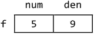
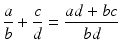

# 十、结构

在本章中，我们将解释以下内容:

*   什么是结构
*   如何声明一个结构
*   如何使用 typedef 更方便地处理结构
*   如何使用结构数组
*   如何搜索结构数组
*   如何对结构数组进行排序
*   如何声明嵌套结构
*   如何使用结构处理分数
*   如何使用结构存储并行数组
*   如何将结构传递给函数

## 10.1 对结构的需求

在 C 语言中，结构是一个或多个变量的集合，这些变量可能是不同类型的，为了方便处理，它们被组合在一个名字下。

在许多情况下，我们希望处理关于某个实体或对象的数据，但是这些数据由各种类型的项目组成。例如，学生的数据(学生记录)可能由几个字段组成，如姓名、地址和电话号码(都是字符串类型)；参加的课程数量(整数)；应付费用(浮点)；课程名称(字符串)；获得的成绩(性格)；等等。

汽车的数据可能包括制造商、型号和注册号码(字符串)；座位容量和燃料容量(整数)；以及里程和价格(浮点)。对于一本书，我们可能想存储作者和书名(字符串)；价格(浮点)；页数(整数)；装订类型:精装、平装、螺旋(线装)；和库存份数(整数)。

假设我们想在一个程序中存储 100 名学生的数据。一种方法是每个字段有一个单独的数组，并使用下标将字段链接在一起。因此，`name[i]`、`address[i]`、`fees[i]`等等，引用第`i`个学生的数据。

这种方法的问题是，如果有许多字段，那么处理几个并行数组就变得笨拙而不实用。例如，假设我们想通过参数列表将学生的数据传递给一个函数。这将涉及几个数组的传递。此外，如果我们按姓名对学生进行排序，比方说，每次两个姓名互换时，我们都必须编写语句来交换其他数组中的数据。在这种情况下，使用 C 结构很方便。

## 10.2 如何声明一个结构

考虑在程序中存储日期的问题。日期由三部分组成:日、月和年。这些部分中的每一个都可以用一个整数来表示。例如，日期“2006 年 9 月 14 日”可以用日 14 来表示；月份，9；2006 年。我们说日期由三个字段组成，每个字段都是整数。

如果我们愿意，我们也可以用月份的名称来表示日期，而不是月份的数字。在这种情况下，日期由三个字段组成，其中一个是字符串，另外两个是整数。

在 C 中，我们可以使用关键字`struct`将日期类型声明为一个结构。请考虑以下声明:

`struct date {int day, month, year;};`

它由关键字`struct`组成，后跟我们选择的结构名称(在本例中为`date`)；接下来是用左右括号括起来的字段声明。注意右括号前声明末尾的分号——这是分号结束声明的常见情况。右括号后面是分号，结束了`struct`声明。

我们也可以编写如下声明，其中每个字段都是单独声明的:

`struct date {`

`int day;`

`int month;`

`int year;`

`};`

这可以按如下方式编写，但上面的样式更具可读性:

`struct date {int day; int month; int year;};`

给定`struct`声明，我们可以声明类型`struct date`的变量，如下所示:

`struct date dob; //to hold a "date of birth"`

这将`dob`声明为`date`类型的“结构变量”。它有三个字段，分别叫做`day`、`month`和`year`。这可以如下图所示:

我们将日字段称为`dob.day`，月字段称为`dob.month`，年字段称为`dob.year`。在 C 语言中，这里使用的句点(`.`)被称为结构成员运算符。

一般来说，字段是由结构变量名指定的，后面跟一个句点，再后面跟字段名。

我们可以一次声明多个变量，如下所示:

`struct date borrowed, returned; //for a book in a library, say`

这些变量中的每一个都有三个字段:`day`、`month`和`year`。`borrowed`的字段由`borrowed.day`、`borrowed.month`和`borrowed.year`引用。返回的字段由`returned.day`、`returned.month`和`returned.year`引用。

在这个例子中，每个字段都是一个`int`，并且可以在任何可以使用`int`变量的上下文中使用。例如，要将日期“2015 年 11 月 14 日”指定给`dob`，我们可以这样使用:

`dob.day = 14;`

`dob.month = 11;`

`dob.year = 2015;`

这可以如下图所示:

我们也可以用下面的代码读取`day`、`month`和`year`的值:

`scanf("%d %d %d", &dob.day, &dob.month, &dob.year);`

假设`today`被声明如下:

`struct date today;`

假设我们已经在`today`中存储了一个值，那么我们可以将`today`的所有字段分配给`dob`,如下所示:

`dob = today;`

这条语句相当于以下语句:

`dob.day = today.day;`

`dob.month = today.month;`

`dob.year = today.year;`

我们可以这样打印`dob`的“值”:

`printf("The party is on %d/%d/%d\n", dob.day, dob.month, dob.year);`

对于此示例，将打印以下内容:

`The party is on 14/11/2015`

请注意，每个字段都必须单独打印。我们也可以编写一个函数`printDate`，比如说，它打印一个作为参数给出的日期。下面的程序展示了如何编写和使用`printDate`。

`#include <stdio.h>`

`struct date {`

`int day;`

`int month;`

`int year;`

`};`

`int main() {`

`struct date dob;`

`void printDate(struct date);`

`dob.day = 14 ;`

`dob.month = 11;`

`dob.year = 2015;`

`printDate(dob);`

`}`

`void printDate(struct date d) {`

`printf("%d/%d/%d \n", d.day, d.month, d.year);`

`}`

运行时，该程序打印

`14/11/2015`

我们顺便注意到，C 在标准库中提供了一个日期和时间结构`tm`。除了日期之外，它还提供了精确到秒的时间。要使用它，您的程序前面必须有以下内容:

`#include <time.h>`

与单个单词类型`int`或`double`相比，`struct date`这个结构使用起来有点麻烦。幸运的是，C 为我们提供了`typedef`来使处理结构变得更加方便。

### 10.2.1 `typedef`

我们可以使用`typedef`给某个现有的类型命名，然后这个名称可以用来声明该类型的变量。我们还可以使用`typedef`为预定义的 C 类型或用户声明的类型(如结构)构造更短或更有意义的名称。例如，下面的语句声明了一个新的类型名`Whole`，它与预定义类型`int`同义:

`typedef int Whole;`

请注意，`Whole`出现在与变量相同的位置，而不是紧接在单词`typedef`之后。然后我们可以声明`Whole`类型的变量，如下所示:

`Whole amount, numCopies;`

这完全等同于

`int amount, numCopies;`

对于那些习惯了 Pascal 或 FORTRAN 等语言的术语`real`的人来说，下面的语句允许他们声明类型为`Real`的变量:

`typedef float Real;`

在本书中，我们至少使用一个大写字母来区分使用`typedef`声明的类型名。

我们可以用下面的声明给前面显示的日期结构取一个简短而有意义的名字`Date`:

`typedef struct date {`

`int day;`

`int month;`

`int year;`

`} Date;`

回想一下，C 区分大写字母和小写字母，使得`date`不同于`Date`。如果我们愿意，我们可以使用任何其他标识符，比如`DateType`，而不是`Date`。

我们现在可以声明`Date`类型的“结构变量”，如下所示:

`Date dob, borrowed, returned;`

请注意，与下面的代码相比，这段代码要简洁得多:

`struct date dob, borrowed, returned;`

由于几乎没有任何理由使用第二种形式，我们可以从上面的声明中省略`date`,写成:

`typedef struct {`

`int day;`

`int month;`

`int year;`

`} Date;`

此后，只要需要`struct`，我们就可以使用`Date`。例如，我们可以将`printDate`改写如下:

`void printDate(Date d) {`

`printf("%d/%d/%d \n", d.day, d.month, d.year);`

`}`

为了实现日期示例，假设我们想要存储“短”名称——月份的前三个字母，例如`Aug`。我们将需要使用这样的声明:

`typedef struct {`

`int day;`

`char month[4]; //one position for \0 to end string`

`int year;`

`} Date;`

我们可以在变量`dob`的`Date`中表示日期“2015 年 11 月 14 日”,如下所示:

`dob.day = 14;`

`strcpy(dob.month, "Nov");//remember to #include <string.h> to use` `strcpy`

`dob.year = 2015;`

我们可以这样写`printDate`:

`void printDate(Date d) {`

`printf("%s %d, %d \n", d.month, d.day, d.year);`

`}`

电话

`printDate(dob);`

将打印以下内容:

`Nov 14, 2015`

假设我们想要存储关于学生的信息。对于每个学生，我们希望存储他们的姓名、年龄和性别(男性或女性)。假设一个名称不超过 30 个字符，我们可以使用下面的声明:

`typedef struct {`

`char name[31];`

`int age;`

`char gender;`

`} Student;`

我们现在可以声明类型为`Student`的变量，如下所示:

`Student stud1, stud2;`

每个`stud1`和`stud2`都有自己的字段——`name`、`age`和`gender`。我们可以参考以下这些字段:

`stud1.name stud1.age stud1.gender`

`stud2.name stud2.age stud2.gender`

像往常一样，我们可以给这些字段赋值，或者将值读入这些字段。而且，如果我们愿意，我们可以用一条语句将`stud1`的所有字段分配给`stud2`:

`stud2 = stud1;`

## 结构的排列

假设我们想要存储 100 名学生的数据。我们将需要一个大小为 100 的数组，数组的每个元素将保存一个学生的数据。因此，每个元素都必须是一个结构——我们需要一个“结构阵列”

我们可以用下面的语句来声明数组，类似于我们说“`int pupil[100]`”来声明一个大小为 100 的整数数组:

`Student pupil[100];`

这为`pupil[0]`、`pupil[1]`、`pupil[2`、`…`，直到`pupil[99]`分配存储。每个元素`pupil[i]`由三个字段组成，可参考如下:

`pupil[i].name   pupil[i].age   pupil[i].gender`

首先，我们需要在数组中存储一些数据。假设我们有以下格式的数据(姓名、年龄、性别):

`"Jones, John" 24 M`

`"Mohammed, Lisa" 33 F`

`"Singh, Sandy" 29 F`

`"Layne, Dennis" 49 M`

`"END"`

假设数据存储在文件`input.txt`中，并且`in`声明如下:

`FILE * in = fopen("input.txt", "r");`

如果`str`是一个字符数组，假设我们可以调用这个函数

`getString(in, str)`

将下一个带引号的数据字符串存储在`str`中，不带引号。还假设`readChar(in)`将读取数据并返回下一个非空白字符。

练习:编写函数`getString`和`readChar`。

我们可以用下面的代码将数据读入数组`pupil`:

`int n = 0;`

`char temp[31];`

`getString(in, temp);`

`while (strcmp(temp, "END") != 0) {`

`strcpy(pupil[n].name, temp);`

`fscanf(in, "%d", &pupil[n].age);`

`pupil[n].gender = readChar(in);`

`n++;`

`getString(in, temp);`

`}`

最后，`n`包含存储的学生人数，`pupil[0]`到`pupil[n-1]`包含这些学生的数据。

为了确保我们不会试图存储超过我们在数组中的空间的数据，我们应该检查`n`是否在数组的边界内。假设`MaxItems`的值为`100`，这可以通过将`while`条件改为如下来实现:

`while (n < MaxItems && strcmp(temp, "END") != 0)`

或者在语句`n++`后插入以下内容；在循环内部:

`if (n == MaxItems) break;`

## 10.4 搜索结构数组

有了存储在数组中的数据，我们可以用各种方式操纵它。例如，我们可以编写一个函数来搜索一个给定的名字。假设数据没有按特定顺序存储，我们可以使用如下顺序搜索:

`int search(char key[], Student list[], int n) {`

`//search for key in list[0] to list[n-1]`

`//if found, return the location; if not found, return -1`

`for (int h = 0; h < n; h++)`

`if (strcmp(key, list[h].name) == 0) return h;`

`return -1;`

`} //end search`

给定前面的数据，调用

`search("Singh, Sandy", pupil, 4)`

将返回`2`，下面的调用将返回`-1`:

`search("Layne, Sandy", pupil, 4)`

## 10.5 对结构数组进行排序

假设我们需要按姓名字母顺序排列的学生名单。需要对数组`pupil`进行排序。下面的函数使用插入排序来完成这项工作。这个过程与对一个`int`数组进行排序是一样的，除了`name`字段用于控制排序。

`void sort(Student list[], int n) {`

`//sort list[0] to list[n-1] by name using an insertion sort`

`Student temp;`

`int k;`

`for (int h = 1; h < n; h++) {`

`Student temp = list[h];`

`k = h - 1;`

`while (k >= 0 && strcmp(temp.name, list[k].name) < 0) {`

`list[k + 1] = list[k];`

`k = k - 1;`

`}`

`}`

`list[k + 1] = temp;`

`} //end sort`

请遵守以下声明:

`list[k + 1] = list[k];`

这将把`list[k]`的所有字段分配给`list[k+1]`。

如果我们想按年龄对学生进行排序，我们需要改变的只是`while`条件。为了按升序排序，我们这样写:

`while (k >= 0 && temp.age < list[k].age)`

`//move smaller numbers to the left`

要按降序排序，我们这样写:

`while (k >= 0 && temp.age > list[k].age)`

`//move bigger numbers to the left`

我们甚至可以根据性别字段将列表分为男生和女生。因为按字母顺序 F 在 M 之前，我们可以把女性放在第一位，写为:

`while (k >= 0 && temp.gender < list[k].gender)`

`//move Fs to the left`

我们可以把男性放在第一位:

`while (k >= 0 && temp.gender > list[k].gender)`

`//move Ms to the` `left`

## 10.6 读取、搜索和排序结构

我们通过编写程序 P10.1 来说明前面讨论的思想。该程序执行以下操作:

*   从文件`input.txt`中读取学生的数据，并将它们存储在一个结构数组中。
*   按照数组中存储的顺序打印数据。
*   测试通过读取几个名字并在数组中查找它们来进行搜索。
*   按照`name`的字母顺序对数据进行排序。
*   打印排序后的数据。

该程序还说明了如何编写函数`getString`和`readChar`。`getString`让我们读取包含在任何“分隔符”字符中的字符串。例如，我们可以指定一个字符串为`$John Smith$`或`"John Smith."`，这是一种非常灵活的指定字符串的方式。每个字符串都可以指定自己的分隔符，对于下一个字符串，分隔符可能会有所不同。它对于指定可能包含特殊字符(如双引号)的字符串特别有用，而不必使用转义序列(如`\"`)。

Program P10.1

`#include <stdio.h>`

`#include <stdlib.h>`

`#include <string.h>`

`#include <ctype.h>`

`#define MaxStudents 100`

`#define MaxNameLength 30`

`#define MaxNameBuffer MaxNameLength+1`

`typedef struct {`

`char name[MaxNameBuffer];`

`int age;`

`char gender;`

`} Student;`

`int main() {`

`Student pupil[MaxStudents];`

`char aName[MaxNameBuffer];`

`void getString(FILE *, char[]);`

`int getData(FILE *, Student[]);`

`int search(char[], Student[], int);`

`void sort(Student[], int);`

`void printStudent(Student);`

`void getString(FILE *, char[]);`

`FILE * in = fopen("input.txt", "r");`

`if (in == NULL) {`

`printf("Error opening input file.\n");`

`exit(1);`

`}`

`int numStudents = getData(in, pupil);`

`if (numStudents == 0) {`

`printf("No data supplied for students");`

`exit(1);`

`}`

`printf("\n");`

`for (int h = 0; h < numStudents; h++) printStudent(pupil[h]);`

`printf("\n");`

`getString(in, aName);`

`while (strcmp(aName, "END") != 0) {`

`int ans = search(aName, pupil, numStudents);`

`if (ans == -1) printf("%s not found\n", aName);`

`else printf("%s found at location %d\n", aName, ans);`

`getString(in, aName);`

`}`

`sort(pupil, numStudents);`

`printf("\n");`

`for (int h = 0; h < numStudents; h++) printStudent(pupil[h]);`

`} //end main`

`void printStudent(Student t) {`

`printf("Name: %s Age: %d Gender: %c\n", t.name, t.age, t.gender);`

`} //end printStudent`

`int getData(FILE *in, Student list[]) {`

`char temp[MaxNameBuffer];`

`void getString(FILE *, char[]);`

`char readChar(FILE *);`

`int n = 0;`

`getString(in, temp);`

`while (n < MaxStudents && strcmp(temp, "END") != 0) {`

`strcpy(list[n].name, temp);`

`fscanf(in, "%d", &list[n].age);`

`list[n].gender = readChar(in);`

`n++;`

`getString(in, temp);`

`}`

`return n;`

`} //end getData`

`int search(char key[], Student list[], int n) {`

`//search for key in list[0] to list[n-1]`

`//if found, return the location; if not found, return -1`

`for (int h = 0; h < n; h++)`

`if (strcmp(key, list[h].name) == 0) return h;`

`return -1;`

`} //end search`

`void sort(Student list[], int n) {`

`//sort list[0] to list[n-1] by name using an insertion sort`

`Student temp;`

`int k;`

`for (int h = 1; h < n; h++) {`

`temp = list[h];`

`k = h - 1;`

`while (k >= 0 && strcmp(temp.name, list[k].name) < 0) {`

`list[k + 1] = list[k];`

`k = k - 1;`

`}`

`list[k + 1] = temp;`

`} //end for`

`} //end sort`

`void getString(FILE * in, char str[]) {`

`// stores, in str, the next string within delimiters`

`// the first non-whitespace character is the delimiter`

`// the string is read from the file 'in'`

`char ch, delim;`

`int n = 0;`

`str[0] = '\0';`

`// read over white space`

`while (isspace(ch = getc(in))) ; //empty while body`

`if (ch == EOF) return;`

`delim = ch;`

`while (((ch = getc(in)) != delim) && (ch != EOF))`

`str[n++] = ch;`

`str[n] = '\0';`

`} // end getString`

`char readChar(FILE * in) {`

`char ch;`

`while (isspace(ch = getc(in))) ; //empty while body`

`return ch;`

`} //end readChar`

假设文件`input.txt`包含以下数据:

`"Jones, John" 24 M`

`"Mohammed, Lisa" 33 F`

`"Singh, Sandy" 29 F`

`"Layne, Dennis" 49 M`

`"Singh, Cindy" 16 F`

`"Ali, Imran" 39 M`

`"Kelly, Trudy" 30 F`

`"Cox, Kerry" 25 M`

`"END"`

`"Kelly, Trudy"`

`"Layne, Dennis"`

`"Layne, Cindy"`

`"END"`

该程序打印以下内容:

`Name: Jones, John Age: 24 Gender: M`

`Name: Mohammed, Lisa Age: 33 Gender: F`

`Name: Singh, Sandy Age: 29 Gender: F`

`Name: Layne, Dennis Age: 49 Gender: M`

`Name: Singh, Cindy Age: 16 Gender: F`

`Name: Ali, Imran Age: 39 Gender: M`

`Name: Kelly, Trudy Age: 30 Gender: F`

`Name: Cox, Kerry Age: 25 Gender: M`

`Kelly, Trudy found at location 6`

`Layne, Dennis found at location 3`

`Layne, Cindy not found`

`Name: Ali, Imran Age: 39 Gender: M`

`Name: Cox, Kerry Age: 25 Gender: M`

`Name: Jones, John Age: 24 Gender: M`

`Name: Kelly, Trudy Age: 30 Gender: F`

`Name: Layne, Dennis Age: 49 Gender: M`

`Name: Mohammed, Lisa Age: 33 Gender: F`

`Name: Singh, Cindy Age: 16 Gender: F`

`Name: Singh, Sandy Age: 29 Gender:` `F`

## 10.7 嵌套结构

c 允许我们使用一个结构作为另一个结构定义的一部分——结构中的结构，称为嵌套结构。考虑一下`Student`结构。假设我们想存储学生的出生日期，而不是年龄。这可能是一个更好的选择，因为学生的出生日期是固定的，而他的年龄是变化的，并且该字段必须每年更新。

我们可以使用下面的声明:

`typedef struct {`

`char name[31];`

`Date dob;`

`char gender;`

`} Student;`

如果`mary`是一个`Student`类型的变量，那么`mary.dob`指的是她的出生日期。但是`mary.dob`本身就是一个`Date`结构。如果需要，我们可以用`mary.dob.day`、`mary.dob.month`、`mary.dob.year`来指代它的字段。

如果我们想以更灵活的方式存储姓名，例如，名、中间名和姓，我们可以使用这样的结构:

`typedef struct {`

`char first[21];`

`char middle;`

`char last[21];`

`} Name;`

现在,`Student`结构变成如下，它包含两个结构,`Name`和`Date`:

`typedef struct {`

`Name name; //assumes Name has already been declared`

`Date dob; //assumes Date has already been declared`

`char gender;`

`} Student;`

如果`st`是类型`Student`的变量，

`st.name`是指`Name`类型的结构；

`st.name.first`指学生的名字；和

`st.name.last[0]`指她姓氏的第一个字母。

现在，如果我们想按姓氏对数组`pupil`进行排序，函数`sort`中的`while`条件就变成这样:

`while (k >= 0 && strcmp(temp.name.last, pupil[k].name.last) < 0)`

一个结构可以嵌套到你想要的深度。点(`.`)运算符从左到右关联。如果`a`、`b`和`c`是结构，则构造

`a.b.c.` `d`

被解释为

`((a.b).c).d`

## 10.8 使用分数

考虑处理分数的问题，其中分数由两个整数值表示:一个表示分子，另一个表示分母。例如，`5/9`由两个数字`5`和`9`表示。

我们将使用以下结构来表示分数:

`typedef struct {`

`int num;`

`int den;`

`} Fraction;`

如果`f`是`Fraction`类型的变量，我们可以用这个在`f`中存储 5/9:

`f.num = 5;`

`f.den = 9;`

这可以如下图所示:

我们还可以读取代表分数的两个值，并使用如下语句将它们存储在`f`中:

`scanf("%d %d", &f.num, &f.den);`

我们可以写一个函数`printFraction`，来打印一个分数。它显示在下面的程序中。

`#include <stdio.h>`

`typedef struct {`

`int num;`

`int den;`

`} Fraction;`

`int main() {`

`void printFraction(Fraction);`

`Fraction f;`

`f.num = 5;`

`f.den = 9;`

`printFraction(f);`

`}`

`void printFraction(Fraction f) {`

`printf("%d/%d", f.num, f.den);`

`}`

运行时，该程序将打印

`5/9`

### 操纵分数

我们可以编写函数对分数进行各种运算。例如，由于

我们可以编写一个函数将两个分数相加如下:

`Fraction addFraction(Fraction a, Fraction b) {`

`Fraction c;`

`c.num = a.num * b.den + a.den * b.num;`

`c.den = a.den * b.den;`

`return c;`

`} //end addFraction`

类似地，我们可以编写函数来加减乘除分数。

`Fraction subFraction(Fraction a, Fraction b) {`

`Fraction c;`

`c.num = a.num * b.den - a.den * b.num;`

`c.den = a.den * b.den;`

`return c;`

`} //end subFraction`

`Fraction mulFraction(Fraction a, Fraction b) {`

`Fraction c;`

`c.num = a.num * b.num;`

`c.den = a.den * b.den;`

`return c;`

`} //end mulFraction`

`Fraction divFraction(Fraction a, Fraction b) {`

`Fraction c;`

`c.num = a.num * b.den;`

`c.den = a.den * b.num;`

`return c;`

`} //end divFraction`

为了说明它们的用途，假设我们想找到

{ 的2537+58

我们可以使用以下语句来实现这一点:

`Fraction a, b, c, sum, ans;`

`a.num = 2; a.den = 5;`

`b.num = 3; b.den = 7;`

`c.num = 5; c.den = 8;`

`sum = addFraction(b, c);`

`ans = mulFraction(a, sum);`

`printFraction(ans);`

严格地说，变量`sum`和`ans`不是必需的，但是我们用它们来简化解释。因为函数的参数可以是一个表达式，所以我们可以得到相同的结果:

`printFraction(mulFraction(a, addFraction(b, c)));`

运行时，此代码将打印以下内容，正确答案是:

`118/280`

然而，如果你愿意，你可以写一个函数把一个分数化为它的最低项。这可以通过找到分子和分母的最大公因数(HCF)来实现。然后将分子和分母除以它们的 HCF。例如，118 和 280 的 HCF 是 2，因此`118/280`减少为`59/140`。编写这个函数作为一个练习。

## 10.9 投票问题

这个例子将用来说明关于函数参数传递的几个要点。它进一步强调了数组参数和简单变量参数之间的区别。我们将展示一个函数如何通过使用一个结构向一个调用函数返回多个值。为此，我们将编写一个程序来解决我们在 8.15 节中遇到的投票问题。又来了:

*   问题:在一次选举中，有七名候选人。每个选民都被允许为他们选择的候选人投一票。投票记录为从 1 到 7 的数字。投票人数事先未知，但以`0`票终止投票。任何不是从 1 到 7 的数字的投票都是无效的。
*   文件`votes.txt`包含候选人的姓名。第一个名字被视为候选人 1，第二个被视为候选人 2，依此类推。名字后面是投票。写一个程序来读取数据并评估选举的结果。打印所有输出到文件，`results.txt`。
*   您的输出应该指定总投票数、有效投票数和无效投票数。接下来是每位候选人和选举获胜者获得的票数。

假设文件`votes.txt`包含以下数据:

`Victor Taylor`

`Denise Duncan`

`Kamal Ramdhan`

`Michael Ali`

`Anisa Sawh`

`Carol Khan`

`Gary Olliverie`

`3 1 2 5 4 3 5 3 5 3 2 8 1 6 7 7 3 5`

`6 9 3 4 7 1 2 4 5 5 1 4 0`

您的程序应该向`results.txt`发送以下输出:

`Invalid vote: 8`

`Invalid vote: 9`

`Number of voters: 30`

`Number of valid votes: 28`

`Number of spoilt votes: 2`

`Candidate       Score`

`Victor Taylor     4`

`Denise Duncan     3`

`Kamal Ramdhan     6`

`Michael Ali       4`

`Anisa Sawh        6`

`Carol Khan        2`

`Gary Olliverie    3`

`The winner(s):`

`Kamal Ramdhan`

`Anisa` `Sawh`

我们现在解释如何使用 C 结构解决这个问题。考虑这些声明:

`typedef struct {`

`char name[31];`

`int numVotes;`

`} PersonData;`

`PersonData candidate[8];`

这里，`candidate`是一个结构体数组。我们将使用`candidate[1]`到`candidate[7]`来表示七个候选人；我们不会用`candidate[0]`。这将使我们更自然地处理选票。投个票(`v`，说吧)，`candidate[v]`会更新。如果我们使用`candidate[0]`，我们会有一个尴尬的情况，投票`v`，`candidate[v-1]`必须被更新。

元素`candidate[h]`不仅仅是单个数据项，而是由两个字段组成的结构。这些字段可参考如下:

`candidate[h].name and candidate[h].numVotes`

为了使程序灵活，我们将定义以下符号常量:

`#define MaxCandidates 7`

`#define MaxNameLength 30`

`#define MaxNameBuffer MaxNameLength+1`

我们还将前面的声明更改为以下内容:

`typedef struct {`

`char name[MaxNameBuffer];`

`int numVotes;`

`} PersonData;`

`PersonData candidate[MaxCandidates+1];`

该解决方案基于以下大纲:

`initialize`

`process the votes`

`print the` `results`

函数`initialize`将从文件`in`中读取名字，并将投票计数设置为`0`。该文件作为参数传递给函数。我们将分两部分(名和姓)读取候选人的姓名，然后将它们连接在一起，创建一个单一的姓名，并存储在`person[h].name`中。将为`max`人员读取数据。下面是函数:

`void initialize(PersonData person[], int max, FILE *in) {`

`char lastName[MaxNameBuffer];`

`for (int h = 1; h <= max; h++) {`

`fscanf(in, "%s %s", person[h].name, lastName);`

`strcat(person[h].name, " ");`

`strcat(person[h].name, lastName);`

`person[h].numVotes = 0;`

`}`

`} //end initialize`

处理投票将基于以下大纲:

`get a vote`

`while the vote is not 0`

`if the vote is valid`

`add 1 to validVotes`

`add 1 to the score of the appropriate candidate`

`else`

`print invalid vote`

`add 1 to spoiltVotes`

`endif`

`get a vote`

`endwhile`

在处理完所有的投票后，这个函数需要返回有效投票和无效投票的数量。但是一个函数怎么能返回多个值呢？如果值存储在结构中，并且该结构作为函数的“值”返回，则可以。

我们将使用以下声明:

`typedef struct {`

`int valid, spoilt;`

`} VoteCount;`

我们将把`processVotes`写成:

`VoteCount processVotes(PersonData person[], int max, FILE *in, FILE *out) {`

`VoteCount temp;`

`temp.valid = temp.spoilt = 0;`

`int v;`

`fscanf(in, "%d", &v);`

`while (v != 0) {`

`if (v < 1 || v > max) {`

`fprintf(out, "Invalid vote: %d\n", v);`

`++temp.spoilt;`

`}`

`else {`

`++person[v].numVotes;`

`++temp.valid;`

`}`

`fscanf(in, "%d", &v);`

`} //end while`

`return temp;`

`}  //end processVotes`

接下来，我们编写`main`，前面是编译器指令和结构声明。

`#include <stdio.h>`

`#include <string.h>`

`#define MaxCandidates 7`

`#define MaxNameLength 30`

`#define MaxNameBuffer MaxNameLength+1`

`typedef struct  {`

`char name[MaxNameBuffer];`

`int numVotes;`

`} PersonData;`

`PersonData candidate[MaxCandidates];`

`typedef struct {`

`int valid, spoilt;`

`} VoteCount;`

`int main() {`

`void initialize(PersonData[], int, FILE *);`

`VoteCount processVotes(PersonData[], int, FILE *, FILE *);`

`void printResults(PersonData[], int, VoteCount, FILE *);`

`PersonData candidate[MaxCandidates+1];`

`VoteCount count;`

`FILE *in = fopen("votes.txt", "r");`

`FILE *out = fopen("results.txt", "w");`

`initialize(candidate, MaxCandidates, in);`

`count = processVotes(candidate, MaxCandidates, in, out);`

`printResults(candidate, MaxCandidates, count, out);`

`fclose(in);`

`fclose(out);`

`} //end main`

`PersonData`和`VoteCount`的声明在`main`之前。这样做是为了让其他函数可以引用它们，而不必重复整个声明。如果它们是在`main`中声明的，那么`PersonData`和`VoteCount`的名字只会在`main`中被知道，其他函数将无法访问它们。

现在我们知道了如何读取和处理投票，剩下的只是确定获胜者并打印结果。我们将把这个任务委托给函数`printResults`。

使用样本数据，数组`candidate`将在所有投票被统计后包含如下所示的值(记住，我们没有使用`candidate[0]`)。

<colgroup><col> <col> <col></colgroup> 
|   | 名字 | numVotes |
| --- | --- | --- |
| `1` | `Victor Taylor` | `4` |
| `2` | `Denise Duncan` | `3` |
| `3` | `Kamal Ramdhan` | `6` |
| `4` | `Michael Ali` | `4` |
| `5` | `Anisa Sawh` | `6` |
| `6` | `Carol Khan` | `2` |
| `7` | `Gary Olliverie` | `3` |

要找到获胜者，我们必须首先找到数组中的最大值。为此，我们将如下调用函数`getLargest`:

`int win = getLargest(candidate, 1, MaxCandidates);`

这将把`win`设置为从`candidate[1]`到`candidate[7]`的`numVotes`字段中最大值的下标(因为`MaxCandidates`是`7`):

在我们的例子中，`win`将被设置为`3`，因为最大值`6`位于位置`3`。(`6`也在`5`位置，但是我们只需要最大值，我们可以从任一位置得到。)

这里是`getLargest`:

`int getLargest(PersonData person[], int lo, int hi) {`

`//returns the index of the highest vote from person[lo] to person[hi]`

`int big = lo;`

`for (int h = lo + 1; h <= hi; h++)`

`if (person[h].numVotes > person[big].numVotes) big = h;`

`return big;`

`} //end getLargest`

现在我们知道最大值在`candidate[win].numVotes`中，我们可以“遍历”数组，寻找具有该值的候选值。这样，我们将找到所有得票最高的候选人(如果不止一个)，并宣布他们为获胜者。

`printResults`的概要如下:

`printResults`

`print the number of voters, valid votes and spoilt votes`

`print the score of each candidate`

`determine and print the winner(s)`

详细信息在函数`printResults`中给出:

`void printResults(PersonData person[], int max, VoteCount c, FILE*out) {`

`int getLargest(PersonData[], int, int);`

`fprintf(out, "\nNumber of voters: %d\n", c.valid + c.spoilt);`

`fprintf(out, "Number of valid votes: %d\n", c.valid);`

`fprintf(out, "Number of spoilt votes: %d\n", c.spoilt);`

`fprintf(out, "\nCandidate Score\n\n");`

`for (int h = 1; h <= max; h++)`

`fprintf(out, "%-15s %3d\n", person[h].name,`

`person[h].numVotes);`

`fprintf(out, "\nThe winner(s)\n");`

`int win = getLargest(person, 1, max);`

`int winningVote = person[win].numVotes;`

`for (int h = 1; h <= max; h++)`

`if (person[h].numVotes == winningVote) fprintf(out, "%s\n",`

`person[h].name);`

`} //end printResults`

把所有的片段放在一起，我们得到了程序 P10.2，解决投票问题的程序。

Program P10.2

`#include <stdio.h>`

`#include <string.h>`

`#define MaxCandidates 7`

`#define MaxNameLength 30`

`#define MaxNameBuffer MaxNameLength+1`

`typedef struct  {`

`char name[MaxNameBuffer];`

`int numVotes;`

`} PersonData;`

`PersonData candidate[MaxCandidates];`

`typedef struct {`

`int valid, spoilt;`

`} VoteCount;`

`int main() {`

`void initialize(PersonData[], int, FILE *);`

`VoteCount processVotes(PersonData[], int, FILE *, FILE *);`

`void printResults(PersonData[], int, VoteCount, FILE *);`

`PersonData candidate[MaxCandidates+1];`

`VoteCount count;`

`FILE *in = fopen("votes.txt", "r");`

`FILE *out = fopen("results.txt", "w");`

`initialize(candidate, MaxCandidates, in);`

`count = processVotes(candidate, MaxCandidates, in, out);`

`printResults(candidate, MaxCandidates, count, out);`

`fclose(in);`

`fclose(out);`

`} //end main`

`void initialize(PersonData person[], int max, FILE *in) {`

`char lastName[MaxNameBuffer];`

`for (int h = 1; h <= max; h++) {`

`fscanf(in, "%s %s", person[h].name, lastName);`

`strcat(person[h].name, " ");`

`strcat(person[h].name, lastName);`

`person[h].numVotes = 0;`

`}`

`} //end initialize`

`VoteCount processVotes(PersonData person[], int max, FILE *in, FILE *out) {`

`VoteCount temp;`

`temp.valid = temp.spoilt = 0;`

`int v;`

`fscanf(in, "%d", &v);`

`while (v != 0) {`

`if (v < 1 || v > max) {`

`fprintf(out, "Invalid vote: %d\n", v);`

`++temp.spoilt;`

`}`

`else {`

`++person[v].numVotes;`

`++temp.valid;`

`}`

`fscanf(in, "%d", &v);`

`} //end while`

`return temp;`

`}  //end processVotes`

`int getLargest(PersonData person[], int lo, int hi) {`

`//returns the index of the highest vote from person[lo] to person[hi]`

`int big = lo;`

`for (int h = lo + 1; h <= hi; h++)`

`if (person[h].numVotes > person[big].numVotes) big = h;`

`return big;`

`} //end getLargest`

`void printResults(PersonData person[], int max, VoteCount c, FILE *out) {`

`int getLargest(PersonData[], int, int);`

`fprintf(out, "\nNumber of voters: %d\n", c.valid + c.spoilt);`

`fprintf(out, "Number of valid votes: %d\n", c.valid);`

`fprintf(out, "Number of spoilt votes: %d\n", c.spoilt);`

`fprintf(out, "\nCandidate Score\n\n");`

`for (int h = 1; h <= max; h++)`

`fprintf(out, "%-15s %3d\n", person[h].name, person[h].numVotes);`

`fprintf(out, "\nThe winner(s)\n");`

`int win = getLargest(person, 1, max);`

`int winningVote = person[win].numVotes;`

`for (int h = 1; h <= max; h++)`

`if (person[h].numVotes == winningVote)`

`fprintf(out, "%s\n", person[h].name);`

`} //end` `printResults`

假设需要通过`numVotes`按降序打印候选人的姓名。为此，必须使用`numVotes`字段控制排序，以降序对结构数组`candidate`进行排序。这可以通过以下函数调用来完成:

`sortByVote(candidate, 1, MaxCandidates);`

`sortByVote`使用插入排序，并使用形参`person`(任何名字都可以)编写，如下所示:

`void sortByVote(PersonData person[], int lo, int hi) {`

`//sort person[lo..hi] in descending order by numVotes`

`PersonData insertItem;`

`// process person[lo+1] to person[hi]`

`for (int h = lo + 1; h <= hi; h++) {`

`// insert person h in its proper position`

`insertItem = person[h];`

`int k = h -1;`

`while (k >= lo && insertItem.numVotes > person[k].numVotes) {`

`person[k + 1] = person[k];`

`--k;`

`}`

`person[k + 1] = insertItem;`

`}`

`} //end sortByVote`

请注意，函数的结构与我们对一个简单的整数数组进行排序时非常相似。主要的区别是在`while`条件中，我们必须指定哪个字段用于确定排序顺序。(在这个例子中，我们也使用了>，而不是`person[h]`，我们将其复制到临时结构`insertItem`。这释放了`person[h]`，以便在必要时`person[h-1]`可以移动到位置`h`。要将数组元素向右移动，我们使用下面的简单赋值:

`person[k + 1] = person[k];`

这将移动整个结构(在本例中是两个字段)。

如果我们需要按字母顺序对候选人进行排序，我们可以使用函数`sortByName`:

`void sortByName(PersonData person[], int lo, int hi) {`

`//sort person[lo..hi] in alphabetical order by name`

`PersonData insertItem;`

`// process person[lo+1] to person[hi]`

`for (int h = lo + 1; h <= hi; h++) {`

`// insert person j in its proper position`

`insertItem = person[h];`

`int k = h -1;`

`while (k > 0 && strcmp(insertItem.name, person[k].name) < 0) {`

`person[k + 1] = person[k];`

`--k;`

`}`

`person[k + 1] = insertItem;`

`}`

`} //end sortByName`

函数`sortByName`与`sortByVote`相同，除了`while`条件，该条件指定在比较中使用哪个字段，并使用<按升序排序。注意使用标准字符串函数`strcmp`来比较两个名字。如果`strcmp(s1, s2)`为负，则意味着按照字母顺序，字符串`s1`在字符串`s2`之前。

作为一个练习，重写解决投票问题的程序，使它按照投票的降序和字母顺序打印结果。

## 10.10 将结构传递给函数

在投票问题中，我们看到了将结构数组`candidate`传递给各种函数的例子。我们现在讨论将结构传递给函数时出现的一些其他问题。

考虑具有以下字段的“书籍类型”的结构:

`typedef struct {`

`char author[31];`

`char title[51];`

`char binding;  //paperback, hardcover, spiral, etc.`

`double price;`

`int quantity;  //quantity in stock`

`} Book;`

`Book text;`

这声明了一个名为`Book`的新类型，而`text`被声明为`Book`类型的变量。

我们可以以通常的方式将单个字段传递给函数；对于简单变量，传递它的值，但是对于数组变量，传递它的地址。因此:

`fun1(text.quantity); // value of text.quantity is passed`

`fun2(text.binding);  // value of text.binding is passed`

`fun3(text.price);    // value of text.price is passed`

但是，

`fun4(text.title); // address of array text.title is passed`

我们甚至可以通过标题的第一个字母，如下:

`fun5(text.title[0]); // value of first letter of title is passed`

为了传递整个结构，我们使用这个:

`fun6(text);`

当然，这些函数的头必须用适当的参数类型编写。

在最后一个例子中，`text`的字段被复制到一个临时位置(称为运行时堆)，副本被传递给`fun6`；也就是说，该结构是“按值”传递的如果一个结构很复杂或者包含数组，复制操作可能会很耗时。此外，当函数返回时，必须从堆中移除结构元素的值；这增加了开销——执行函数调用所需的额外处理。

为了避免这种开销，可以传递该结构的地址。这可以通过下面的语句来实现:

`fun6(&text);`

然而，进一步的讨论涉及到指针的更深层次的知识，这超出了本书的范围。

EXERCISES 10Write a program to read names and phone numbers into a structure array. Request a name and print the person’s phone number. Use binary search to look up the name.   Write a function that, given two date structures, `d1` and `d2`, returns `-1` if `d1` comes before `d2`, `0` if `d1` is the same as `d2`, and `1` if `d1` comes after `d2`.   Write a function that, given two date structures, `d1` and `d2`, returns the number of days that `d2` is ahead of `d1`. If `d2` comes before `d1`, return a negative value.   A time in 24-hour clock format is represented by two numbers; for example, `16 45` means the time 16:45: that is, 4:45 p.m. Using a structure to represent a time, write a function that, given two time structures, `t1` and `t2`, returns the number of minutes from `t1` to `t2`. For example, if the two given times are `16 45` and `23 25`, your function should return `400`.   Modify the function so that it works as follows: if `t2` is less than `t1`, take it to mean a time for the next day. For example, given the times `20:30` and `6:15`, take this to mean 8.30 p.m. to 6.15 a.m. of the next day. Your function should return `585`.     A length, specified in meters and centimeters, is represented by two integers. For example, the length 3m 75cm is represented by `3 75`. Using a structure to represent a length, write functions to compare, add, and subtract two lengths.   A file contains the names and distances jumped by athletes in a long-jump competition. Using a structure to hold a name and distance (which is itself a structure as in Exercise 5), write a program to read the data and print a list of names and distance jumped in order of merit (best jumper first).   A data file contains registration information for six courses – CS20A, CS21A, CS29A, CS30A, CS35A, and CS36A. Each line of data consists of a seven-digit student registration number followed by six (ordered) values, each of which is `0` or `1`. A value of `1` indicates that the student is registered for the corresponding course; `0` means the student is not. Thus, `1 0 1 0 1 1` means that the student is registered for CS20A, CS29A, CS35A, and CS36A, but not for CS21A and CS30A. You may assume that there are no more than 100 students and a registration number `0` ends the data. Write a program to read the data and produce a class list for each course. Each list consists of the registration numbers of those students taking the course.   At a school’s bazaar, activities were divided into stalls. At the close of the bazaar, the manager of each stall submitted information to the principal consisting of the name of the stall, the income earned, and its expenses. Here are some sample data: `Games 2300.00 1000.00` `Sweets 900.00 1000.00` Create a structure to hold a stall’s data   Write a program to read the data and print a report consisting of the stall name and net income (income – expenses), in order of decreasing net income (that is, with the most profitable stall first and the least profitable stall last). In addition, print the number of stalls, the total profit or loss of the bazaar, and the stall(s) that made the most profit. Assume that a line containing `xxxxxx` only ends the data.