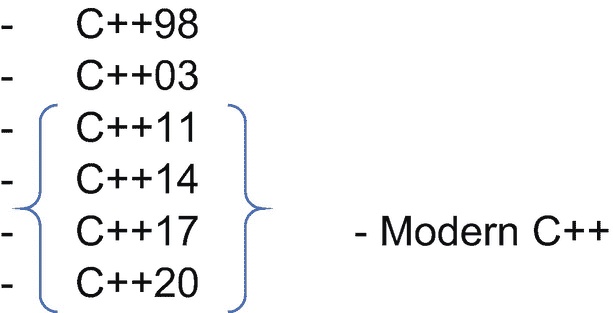

# 四十、C++ 标准

C++ 是一种 ISO 标准化编程语言。有不同的 C++ 标准:



一切以 C++11 开始的都被称为“现代 C++”。这些标准在技术细节上定义了这种语言。它们也可以作为 C++ 编译器作者的手册。这是一套令人难以置信的规则和规范。可以购买 C++ 标准，或者免费下载草稿版本。这些草案非常类似于最终的 C++ 标准。当 C++ 代码可以在不同平台(机器或编译器)上成功迁移和编译，并且 C++ 实现紧密遵循标准时，我们说代码是*可移植的。*这就是通常所说的*可移植 C++* 。

用大括号括起来的标准代表所谓的“现代 C++”每个标准都描述了这种语言，并引入了新的语言和库特性。它还可能对现有规则进行修改。我们将描述每个标准的显著特征。

## 40.1 C++11

C++11 是 ISO C++ 标准，发布于 2011 年。为了按照这个标准进行编译，如果使用 g++ 或 clang 进行编译，那么在命令行编译字符串中添加 *-std=c++11* 标志。如果使用 Visual Studio，选择*项目/选项/配置属性/ C/C++ /语言/C++ 语言标准*，选择 *C++11* 。新的 Visual Studio 版本已经支持这个现成的标准。我们已经在前面的章节中描述了 C++11 的显著特性，在这里我们将再次简要回顾一下，并介绍几个新特性:

### 40.1.1 自动类型推断

该标准引入了`auto`关键字，它根据变量的初始化式来推断变量的类型:

```cpp
int main()
{
    auto mychar = 'A';
    auto myint = 123 + 456;
    auto mydouble = 456.789;
}

```

### 40.1.2 基于范围的循环

基于范围的循环允许我们在范围内迭代，例如 C++ 标准库容器:

```cpp
#include <iostream>
#include <vector>

int main()
{
    std::vector<int> v = { 10, 20, 40, 5, -20, 75 };
    for (auto el : v)
    {
        std::cout << el << '\n';
    }
}

```

基于范围的 for 循环如下:`for (type element : container)`。对于容器中的每个元素来说，这读作*(做点什么)。*

### 初始化列表

用大括号{ }表示的初始化列表允许我们以统一的方式初始化对象。我们可以初始化单个对象:

```cpp
int main()
{
    int x{ 123 };
    int y = { 456 };
    double d{ 3.14 };
}

```

和容器:

```cpp
#include <vector>

int main()
{
    std::vector<int> v = { 1, 2, 3, 4, 5 };
}

```

列表初始化还可以防止收缩转换。如果我们试图在初始化列表中用 double 值初始化 integer 对象，编译将会失败:

```cpp
int main()
{
    int x = { 123.45 }; // Error, does not allowing narrowing
}

```

在初始化我们的对象时，我们应该更喜欢初始化列表{}，而不是旧式的括号()。

### 移动语义

C++ 11 标准引入了类的移动语义。我们可以通过移动其他对象的数据来初始化我们的对象。这是通过移动构造器和移动赋值操作符实现的。两者都接受所谓的*右值引用*作为参数。 *Lvalue* 是一个可以用在赋值操作左侧的表达式。*右值*是可以在赋值的右边使用的表达式。右值引用的签名为 *some_type & &* 。为了将表达式转换为右值引用，我们使用了 *std::move* 函数。简单的移动构造器和移动赋值签名是:

```cpp
class MyClass
{
public:
    MyClass(MyClass&& otherobject) // move constructor
    {
        //implement the move logic here
    }

    MyClass& operator=(MyClass&& otherobject) // move assignment operator
    {
        // implement the copy logic here
        return *this;
    }
};

```

### 40 . 1 . 5λ表达式

Lambda 表达式是匿名函数对象。它们允许我们编写一小段代码，用作标准库函数谓词。lambda 有一个捕获列表，标记为[ ]，在这里我们可以通过引用或复制来捕获局部变量，有可选参数的参数列表标记为( )，还有一个 lambda 主体，标记为{ }。空的 lambda 看起来像[](){ }；。使用 lambda 作为谓词只计算集合中偶数的简单示例:

```cpp
#include <iostream>
#include <vector>
#include <algorithm>

int main()
{
    std::vector<int> v = { 1, 2, 3, 4, 5 };
    auto counteven = std::count_if(std::begin(v), std::end(v),
        [](int x) {return x % 2 == 0; }); // lambda expression
    std::cout << "The number of even vector elements is: " << counteven;
}

```

### constexpr 描述符

constexpr 描述符承诺变量或函数可以在编译时被求值。如果在编译时不能对表达式求值，编译器会发出一个错误:

```cpp
int main()
{
    constexpr int n = 123;          //OK, 123 is a compile-time constant // expression
    constexpr double d = 456.78;    //OK, 456.78 is a compile-time constant // expression
    constexpr double d2 = d;        //OK, d is a constant expression
    int x = 123;
    constexpr int n2 = x;           //compile-time error
                                    // the value of x is not known during // compile-time
}

```

### 范围枚举器

C++11 标准引入了作用域枚举器。与旧的枚举器不同，作用域枚举器不会将它们的名字泄漏到周围的作用域中。作用域枚举具有以下签名:*枚举类 Enumerator_Name {value1，value2 等}* 签名。作用域枚举的一个简单示例是:

```cpp
enum class MyEnum
{
    myfirstvalue,
    mysecondvalue,
    mythirdvalue
};

int main()
{
    MyEnum myenum = MyEnum::myfirstvalue;
}

```

### 40.1.8 智能指针

智能指针指向对象，当指针超出范围时，对象被销毁。这使得它们*变得智能*，因为我们不必担心手动释放已分配的内存。智能指针为我们做了所有的重活。

有两种智能指针，带有 *std::unique_ptr <类型>* 签名的唯一指针和带有 *std::shared_ptr <类型>* 签名的共享指针。两者的区别在于我们只能有一个唯一的指针指向对象。相反，我们可以有多个共享指针指向一个对象。当唯一指针超出范围时，对象被销毁，内存被释放。当指向我们的对象的最后一个共享指针超出范围时，对象就会被销毁。内存被释放。

一个独特的指针示例:

```cpp
#include <iostream>
#include <memory>

int main()
{
    std::unique_ptr<int> p(new int{ 123 });
    std::cout << *p;
} // p goes out of scope here, the memory gets deallocated, the object gets // destroyed

```

唯一指针不能被复制，只能被移动。要让多个共享指针指向同一个对象，我们应该写:

```cpp
#include <iostream>
#include <memory>

int main()
{
    std::shared_ptr<int> p1(new int{ 123 });
    std::shared_ptr<int> p2 = p1;
    std::shared_ptr<int> p3 = p1;
} // when the last shared pointer goes out of scope, the memory gets // deallocated

```

共享指针可以复制。据说他们*共享该物体的所有权*。当最后一个共享指针超出范围时，指向的对象被销毁，内存被释放。

### std::unordered_set

std::unordered_set 是一个允许常量时间插入、搜索和删除元素的容器。这个容器被实现为一个链表存储桶的数组。计算每个元素的哈希值，并根据哈希值将对象放入适当的桶中。对象本身不按任何特定顺序排序。为了定义一个无序集合，我们需要包含`<unordered_set>`头。示例:

```cpp
#include <iostream>
#include <unordered_set>

int main()
{
    std::unordered_set<int> myunorderedset = { 1, 2, 5, -4, 7, 10 };
    for (auto el : myunorderedset)
    {
        std::cout << el << '\n';
    }
}

```

这些值没有排序，但却是唯一的。为了将单个或多个值插入到一个 unordered_set 中，我们使用。insert()成员函数:

```cpp
#include <iostream>
#include <unordered_set>

int main()
{
    std::unordered_set<int> myunorderedset = { 1, 2, 5, -4, 7, 10 };
    myunorderedset.insert(6); // insert a single value
    myunorderedset.insert({ 8, 15, 20 }); // insert multiple values
    for (auto el : myunorderedset)
    {
        std::cout << el << '\n';
    }
}

```

要从无序集中删除一个值，我们使用。erase()成员函数:

```cpp
#include <iostream>
#include <unordered_set>

int main()
{
    std::unordered_set<int> myunorderedset = { 1, 2, 5, -4, 7, 10 };
    myunorderedset.erase(-4); // erase a single value
    for (auto el : myunorderedset)
    {
        std::cout << el << '\n';
    }
}

```

### 标准::无序 _ 映射

与 std::unordered_set 类似，还有一个 std::unordered_map，这是一个由具有唯一键的键值对组成的无序容器。该容器还允许快速插入、搜索和移除元素。容器和数据也以桶的形式实现。什么元素进入什么桶取决于元素的键哈希值。为了定义一个无序映射，我们包含了`<unordered_map>`头。示例:

```cpp
#include <iostream>
#include <unordered_map>

int main()
{
    std::unordered_map<char, int> myunorderedmap = { {'a', 1}, {'b', 2}, {'c', 5} };
    for (auto el : myunorderedmap)
    {
        std::cout << el.first << ' '<< el.second << '\n';
    }
}

```

这里我们用键值对初始化一个无序映射。在基于范围的 for 循环中，我们打印键和值。地图元素是成对的。Pairs 有成员函数*。第一个*用于访问密钥和。*第二个*用于访问一个值。要在地图中插入一个元素，我们可以使用 member 函数。insert()成员函数:

```cpp
#include <iostream>
#include <unordered_map>

int main()
{
    std::unordered_map<char, int> myunorderedmap = { {'a', 1}, {'b', 2}, {'c', 5} };
    myunorderedmap.insert({ 'd', 10 });

    for (auto el : myunorderedmap)
    {
        std::cout << el.first << ' '<< el.second << '\n';
    }
}

```

我们还可以使用映射的操作符[]来插入一个元素。通常，该运算符用于通过键访问元素值。但是，如果键不存在，操作者将在映射中插入一个新元素:

```cpp
#include <iostream>
#include <unordered_map>

int main()
{
    std::unordered_map<char, int> myunorderedmap = { {'a', 1}, {'b', 2}, {'c', 5} };
    myunorderedmap['b'] = 4; // key exists, change the value
    myunorderedmap['d'] = 10; // key does not exist, insert the new element
    for (auto el : myunorderedmap)
    {
        std::cout << el.first << ' ' << el.second << '\n';
    }
}

```

### 标准:元组

虽然 *std::pair* 只能保存两个值，但是 *std::tuple* 包装器可以保存两个以上的值。要使用元组，我们需要包含 *<元组>* 头。为了访问某个元组元素，我们使用了*STD::get<index _ of _ an _ element>(tuple _ name)*函数:

```cpp
#include <iostream>
#include <utility>
#include <tuple>

int main()
{
    std::tuple<char, int, double> mytuple = { 'a', 123, 3.14 };
    std::cout << "The first element is: " << std::get<0>(mytuple) << '\n';
    std::cout << "The second element is: " << std::get<1>(mytuple) << '\n';
    std::cout << "The third element is: " << std::get<2>(mytuple) << '\n';
}

```

我们可以使用 *std::make_tuple* 函数创建一个元组:

```cpp
#include <iostream>
#include <tuple>
#include <string>

int main()
{
    auto mytuple = std::make_tuple<int, double, std::string>(123, 3.14, "Hello World.");
    std::cout << "The first tuple element is: " << std::get<0>(mytuple) << '\n';
    std::cout << "The second tuple element is: " << std::get<1>(mytuple) << '\n';
    std::cout << "The third tuple element is: " << std::get<2>(mytuple) << '\n';
}

```

我们没有键入冗长的元组类型，即 *std::tuple < int，double，std::string >* ，而是使用 *auto* 描述符来为我们推导类型名称。

### 静态断言

*static_assert* 指令在编译时检查静态(constexpr)条件。如果条件为 false，则指令编译失败，并显示一条错误消息。示例:

```cpp
int main()
{
    constexpr int x = 123;
    static_assert(x == 456, "The constexpr value is not 456.");
}

```

这里，static_assert 检查编译时 x 的值是否等于 456。因为不是，编译将失败，并显示一条`"The constexpr value is not 456."`消息。我们可以将 static_assert 视为在编译时测试代码的一种方式。这也是测试 constexpr 表达式的值是否是我们期望的值的一种简洁方法。

### 40.1.13 并发性介绍

C++11 标准引入了处理线程的工具。为了启用线程，我们需要在命令行上用 g++ 和 clang 编译时添加 *-pthreads* 标志。示例:

```cpp
g++ -std=c++11 -Wall -pthread source.cpp

```

铿锵声响起:

```cpp
clang++ -std=c++11 -Wall -pthread source.cpp

```

当我们编译和链接我们的源代码程序时，就会产生一个可执行文件。当我们启动可执行程序时，程序被载入内存并开始运行。这个正在运行的程序被称为*进程*。当我们启动多个可执行文件时，我们可以有多个进程。每个进程都有自己的内存，自己的地址空间。在一个进程中，可以有多个线程。有哪些线索？线程或执行线程是一种操作系统机制，它允许我们并发/同时执行多段代码。

例如，我们可以使用线程同时执行多个功能。从更广泛的意义上来说，concurrently 也可以指*与*平行。线程是进程的一部分。一个进程可以产生一个或多个线程。线程共享同一个内存，因此可以使用这个共享内存相互通信。

为了创建一个线程对象，我们使用来自一个 *<线程>* 头文件的 *std::thread* 类模板。一旦被定义，线程就开始执行。为了创建一个在函数中执行代码的线程，我们将函数名作为参数提供给线程构造器。示例:

```cpp
#include <iostream>
#include <thread>

void function1()
{
    for (int i = 0; i < 10; i++)
    {
        std::cout << "Executing function1." << '\n';
    }
}

int main()
{
    std::thread t1{ function1 }; // create and start a thread
    t1.join(); // wait for the t1 thread to finish
}

```

这里我们定义了一个名为 *t1* 的线程，它执行一个函数 *function1* 。我们将函数名作为第一个参数提供给 std::thread 构造器。在某种程度上，我们的程序现在有一个主线程，它是 *main()* 函数本身，还有一个 t1 线程，它是从主线程创建的。*。join()* 成员函数说:“*嘿，主线程，请等我完成我的工作再继续你的。”如果我们忽略了。join()函数，主线程将在 t1 线程完成其工作之前完成执行。我们通过将子线程连接到主线程来避免这个问题。*

如果我们的函数接受参数，我们可以在构造 std::thread 对象时传递这些参数:

```cpp
#include <iostream>
#include <thread>
#include <string>

void function1(const std::string& param)
{
    for (int i = 0; i < 10; i++)
    {
        std::cout << "Executing function1, " << param << '\n';
    }
}

int main()
{
    std::thread t1{ function1, "Hello World from a thread." };
    t1.join();
}

```

通过构造多个 std::thread 对象，我们可以在程序/进程中产生多个线程。例如，我们有两个线程并发/同时执行两个不同的功能:

```cpp
#include <iostream>
#include <thread>

void function1()
{
    for (int i = 0; i < 10; i++)
    {
        std::cout << "Executing function1." << '\n';
    }
}

void function2()
{
    for (int i = 0; i < 10; i++)
    {
        std::cout << "Executing function2." << '\n';
    }
}

int main()
{
    std::thread t1{ function1 };
    std::thread t2{ function2 };

    t1.join();
    t2.join();
}

```

这个例子创建了两个线程，同时执行两个不同的函数。

*function1* 代码在线程 *t1、*中执行，而 *function2* 代码在名为 *t2* 的单独线程中执行。

我们还可以让多个线程同时执行同一个函数的代码:

```cpp
#include <iostream>
#include <thread>
#include <string>

void myfunction(const std::string& param)
{
    for (int i = 0; i < 10; i++)
    {
        std::cout << "Executing function from a " << param << '\n';
    }
}

int main()
{
    std::thread t1{ myfunction, "Thread 1" };
    std::thread t2{ myfunction, "Thread 2" };

    t1.join();
    t2.join();
}

```

线程有时需要访问同一个对象。在我们的例子中，两个线程都在访问全局 *std::cout* 对象，以便输出数据。这可能是个问题。同时从两个不同的线程访问 *std::cout* 对象允许一个线程向它写一点，然后另一个线程跳进去向它写一点，我们可以在控制台窗口中结束一些奇怪的文本:

执行。执行功能 1。执行功能 2 。

这意味着我们需要以某种方式同步对一个共享的 *std::cout* 对象的访问。当一个线程向它写入数据时，我们需要确保该线程不会向它写入数据。

我们通过锁定和解锁互斥体来做到这一点。互斥体由来自 *<互斥体>* 头的 *std::mutex* 类模板表示。互斥是一种在多个线程之间同步访问共享对象的方式。一旦线程锁定了互斥体，它就拥有了互斥体，然后执行对共享数据的访问，并在不再需要访问共享数据时解锁互斥体。这确保了当时只有一个线程可以访问一个共享对象，在我们的例子中是 *std::cout* 。

下面是一个例子，其中两个线程执行相同的函数，并通过锁定和解锁互斥体来保护对 std::cout 对象的访问:

```cpp
#include <iostream>
#include <thread>
#include <string>
#include <mutex>

std::mutex m; // will guard std::cout

void myfunction(const std::string& param)
{
    for (int i = 0; i < 10; i++)
    {
        m.lock();
        std::cout << "Executing function from a " << param << '\n';
        m.unlock();
    }
}

int main()
{
    std::thread t1{ myfunction, "Thread 1" };
    std::thread t2{ myfunctiosn, "Thread 2" };

    t1.join();
    t2.join();
}

```

我们可以忘记手动解锁互斥锁。更好的方法是使用 *std::lock_guard* 函数。它锁定互斥体，一旦超出范围，就自动解锁互斥体。示例:

```cpp
#include <iostream>
#include <thread>
#include <string>
#include <mutex>

std::mutex m; // will guard std::cout

void myfunction(const std::string& param)
{
    for (int i = 0; i < 10; i++)
    {
        std::lock_guard<std::mutex> lg(m);
        std::cout << "Executing function from a " << param << '\n';
    } // lock_guard goes out of scope here and unlocks the mutex
}

int main()
{
    std::thread t1{ myfunction, "Thread 1" };
    std::thread t2{ myfunction, "Thread 2" };

    t1.join();
    t2.join();
}

```

### 删除的和默认的功能

如果我们不提供默认的构造器，编译器会为我们生成一个，这样我们就可以写:

```cpp
class MyClass
{

};

int main()
{
    MyClass o; // OK, there is an implicitly defined default constructor
}

```

但是，在某些情况下，不会隐式生成默认构造器。例如，当我们为类定义一个复制构造器时，默认构造器被隐式删除。示例:

```cpp
#include <iostream>

class MyClass
{
public:
    MyClass(const MyClass& other)
    {
        std::cout << "Copy constructor invoked.";
    }
};

int main()
{
    MyClass o; // Error, there is no default constructor
}

```

为了强制编译器生成的默认构造器的实例化，我们在其声明中提供了 *=default* 描述符。示例:

```cpp
#include <iostream>

class MyClass
{
public:
    MyClass() = default; // defaulted member function
    MyClass(const MyClass& other)
    {
        std::cout << "Copy constructor invoked.";
    }
};

int main()
{
    MyClass o; // Now OK, the defaulted default constructor is there
    MyClass o2 = o; // Invoking the copy constructor
}

```

当在成员函数上使用时， *=default* 描述符意味着:无论语言规则如何，我都希望这个默认成员函数存在。我不希望它被隐式禁用。

类似地，如果我们想禁止一个成员函数出现，我们使用 *=delete* 描述符。要禁用复制构造器和复制赋值，我们应该编写:

```cpp
#include <iostream>

class MyClass
{
public:
    MyClass()
    {
        std::cout << "Default constructor invoked.";
    }
    MyClass(const MyClass& other) = delete; // delete the copy constructor
    MyClass& operator=(const MyClass& other) = delete; // delete the copy // assignment operator
};

int main()
{
    MyClass o; // OK
    MyClass o2 = o; // Error, a call to deleted copy constructor
    MyClass o3;
    o3 = o; // Error, a call to deleted copy assignment operator
}

```

这些描述符主要用于我们想要:

1.  当我们使用 *=default 时，强制或实例化隐式定义的成员函数，如构造器和赋值操作符；*表情

2.  使用 *=delete 禁用隐式定义的成员函数的实例化；*表情

这些表达式也可以用于其他函数。

### 类型别名

类型别名是用户为现有类型提供的名称。如果我们想对现有类型使用不同的名称，我们写:*使用 my _ type _ name = existing _ type _ name；*举例:

```cpp
#include <iostream>
#include <string>
#include <vector>

using MyInt = int;
using MyString = std::string;
using MyVector = std::vector<int>;

int main()
{
    MyInt x = 123;
    MyString s = "Hello World";
    MyVector v = { 1, 2, 3, 4, 5 };
}

```

## 40.2 C++14

C++14 是 2014 年发布的 ISO C++ 标准。它为语言和标准库带来了一些补充，但主要是补充和修正 C++11 标准。当我们说要使用 C++11 标准时，我们实际上想要的是 C++14 标准。下面是 C++14 的一些新特性。

要针对 C++14 进行编译，如果使用 g++ 或 clang 编译器，请在命令行编译字符串中添加 *-std=c++14* 标志。在 Visual Studio 中，选择*项目/选项/配置属性/ C/C++ /语言/C++ 语言标准*，选择 *C++14* 。

### 二进制文字

值由文字表示。到目前为止，我们已经提到了三种不同的二进制文字:十进制、十六进制和八进制，如下例所示:

```cpp
int main()
{
    int x = 10;
    int y = 0xA;
    int z = 012;
}

```

这三个变量具有相同的值 10，由不同的数字文字表示。C++14 标准引入了第四种整型文字，称为*二进制文字*。使用二进制文字，我们可以用二进制形式表示值。文字有一个`0b`前缀，后跟一系列表示值的 1 和 0。为了用二进制文字表示数字 10，我们写:

```cpp
int main()
{
    int x = 0b101010;
}

```

二进制形式的著名数字 42 是:

```cpp
int main()
{
    int x = 0b1010;
}

```

Important to remember

价值观就是价值观；它们是内存中一些位和字节的序列。可以不同的是值*表示法*。该值有十进制、十六进制、八进制和二进制表示形式。同一事物的这些不同形式可能与我们人类相关。对一台机器来说，它全是比特和字节、晶体管和电流。

### 40.2.2 数字分隔符

在 C++14 中，我们可以用单引号分隔数字，使其可读性更好:

```cpp
int main()
{
    int x =100'000'000;
}

```

编译器会忽略引号。这里的分隔符只是为了我们的利益，例如，将大量内容分成可读性更强的部分。

### 自动 for 功能

我们可以根据返回语句的值推断出函数类型:

```cpp
auto myintfn() // integer
{
    return 123;
}

auto mydoublefn() // double
{
    return 3.14;
}

int main()
{
    auto x = myintfn(); // int
    auto d = mydoublefn(); // double
}

```

### 40.2.4 通用 Lambdas

我们现在可以在 lambda 函数中使用`auto`参数。参数的类型将从提供给 lambda 函数的值中推导出来。这也被称为*通用λ*:

```cpp
#include <iostream>

int main()
{
    auto mylambda = [](auto p) {std::cout << "Lambda parameter: " << p << '\n'; };
    mylambda(123);
    mylambda(3.14);
}

```

### 40.2.5 标准::制作 _ 唯一

C++14 引入了一个用于创建唯一指针的 *std::make_unique* 函数。它是在一个`<memory>`头中声明的。创建唯一指针时，使用此函数优于原始`new`运算符:

```cpp
#include <iostream>
#include <memory>

class MyClass
{
private:
    int x;
    double d;
public:
    MyClass(int xx, double dd)
        : x{ xx }, d{ dd }    {}
    void printdata() { std::cout << "x: " << x << ", d: " << d; }
};

int main()
{
    auto p = std::make_unique<MyClass>(123, 456.789);
    p->printdata();
}

```

## 40.3 C++17

C++17 标准引入了新的语言和库特性，并更改了一些语言规则。

### 嵌套的名称空间

还记得我们说过可以有嵌套的名称空间吗？我们可以把一个名称空间放到另一个名称空间中。我们使用了以下嵌套命名空间:

```cpp
namespace MyNameSpace1
{
    namespace MyNameSpace2
    {
        namespace MyNameSpace3
        {
            // some code
        }
    }
}

```

C++17 标准允许我们使用名称空间解析操作符来嵌套名称空间。上面的例子现在可以重写为:

```cpp
namespace MyNameSpace1::MyNameSpace2::MyNameSpace3
{
    // some code
}

```

### 40.3.2 Constexpr Lambdas

Lambdas 现在可以是一个常量表达式，这意味着它们可以在编译时进行计算:

```cpp
int main()
{
    constexpr auto mylambda = [](int x, int y) { return x + y; };
    static_assert(mylambda(10, 20) == 30, "The lambda condition is not true.");
}

```

我们将`constexpr`描述符放入 lambda 本身的一个等价例子是:

```cpp
int main()
{
    auto mylambda = [](int x, int y) constexpr { return x + y; };
    static_assert(mylambda(10, 20) == 30, "The lambda condition is not true.");
}

```

在早期的 C++ 标准中，情况并非如此。

### 结构化绑定

结构化绑定将变量名绑定到编译时已知表达式的元素，如数组或映射。如果我们想让多个变量接受表达式元素的值，我们使用结构化绑定。语法是:

```cpp
auto [myvar1, myvar2, myvar3] = some_expression;

```

一个简单的例子是，我们将三个变量绑定为三个数组元素的别名:

```cpp
int main()
{
    int arr[] = { 1, 2, 3 };
    auto [myvar1, myvar2, myvar3] = arr;
}

```

现在我们已经定义了三个整型变量。这些变量的数组元素值分别为 1、2、3。这些变量是数组元素的副本。对变量进行更改不会影响数组元素本身:

```cpp
#include <iostream>

int main()
{
    int arr[] = { 1, 2, 3 };
    auto [myvar1, myvar2, myvar3] = arr;
    myvar1 = 10;
    myvar2 = 20;
    myvar3 = 30;
    for (auto el : arr)
    {
        std::cout << el << ' ';
    }
}

```

我们可以使用 auto&语法进行引用类型的结构化绑定。这意味着变量现在是数组元素的引用，对变量进行更改也会更改数组元素:

```cpp
#include <iostream>

int main()
{
    int arr[] = { 1, 2, 3 };
    auto& [myvar1, myvar2, myvar3] = arr;
    myvar1 = 10;
    myvar2 = 20;
    myvar3 = 30;
    for (auto el : arr)
    {
        std::cout << el << ' ';
    }
}

```

这是将多个变量引入并绑定到一些类似容器的表达式元素的一种很好的方式。

### 标准::文件系统

std::filesystem 库允许我们在系统上处理文件、路径和文件夹。这个库是通过一个<filesystem>头声明的。路径可以表示文件路径和文件夹路径。要检查给定的文件夹是否存在，我们使用:</filesystem>

```cpp
#include <iostream>
#include <filesystem>

int main()
{
    std::filesystem::path folderpath = "C:\\MyFolder\\";
    if (std::filesystem::exists(folderpath))
    {
        std::cout << "The path: " << folderpath << " exists.";
    }
    else
    {
        std::cout << "The path: " << folderpath << " does not exist.";
    }
}

```

类似地，我们可以使用 std::filesystem::path 对象来检查文件是否存在:

```cpp
#include <iostream>
#include <filesystem>

int main()
{
    std::filesystem::path folderpath = "C:\\MyFolder\\myfile.txt";
    if (std::filesystem::exists(folderpath))
    {
        std::cout << "The file: " << folderpath << " exists.";
    }
    else
    {
        std::cout << "The file: " << folderpath << " does not exist.";
    }
}

```

为了迭代文件夹元素，我们使用了*STD::file system::directory _ iterator*迭代器:

```cpp
#include <iostream>
#include <filesystem>

int main()
{
    auto myfolder = "C:\\MyFolder\\";
    for (auto el : std::filesystem::directory_iterator(myfolder))
    {
        std::cout << el.path() << '\n';
    }
}

```

这里我们遍历目录条目，并使用。path()成员函数。

对于 Linux，我们需要调整路径并使用以下内容:

```cpp
#include <iostream>
#include <filesystem>

int main()
{
    auto myfolder = "MyFolder/";
    for (auto el : std::filesystem::recursive_directory_iterator(myfolder))
    {
        std::cout << el.path() << '\n';
    }
}

```

为了递归地迭代文件夹元素，我们使用*STD::file system::recursive _ directory _ iterator*。这允许我们递归地遍历一个文件夹中的所有子文件夹。在 Windows 上，我们将使用:

```cpp
#include <iostream>
#include <filesystem>

int main()
{
    auto myfolder = "C:\\MyFolder\\";
    for (auto el : std::filesystem::recursive_directory_iterator(myfolder))
    {
        std::cout << el.path() << '\n';
    }
}

```

在 Linux 和类似的操作系统上，我们将使用以下路径:

```cpp
#include <iostream>
#include <filesystem>

int main()
{
    auto myfolder = "MyFolder/";
    for (auto el : std::filesystem::directory_iterator(myfolder))
    {
        std::cout << el.path() << '\n';
    }
}

```

下面是 std::filesystem 名称空间中一些有用的实用函数:

*   `std::filesystem::create_directory`用于创建目录

*   `std::filesystem::copy`用于复制文件和目录

*   `std::filesystem::remove`用于删除文件或空文件夹

*   `std::filesystem::remove_all`用于删除文件夹和子文件夹

### std::string_view

就 CPU 使用率而言，复制数据可能是一项开销很大的操作。将子字符串作为函数参数传递需要复制子字符串。这是一个昂贵的手术。string_view 类模板试图纠正这种情况。

string_view 是字符串或子字符串的非所有者视图。它是对内存中已经存在的东西的引用。它被实现为指向某个字符序列的指针加上该序列的大小。有了这种结构，我们可以高效地解析字符串。

std::string_view 在`<string_view>`头文件中声明。要从现有字符串创建 string_view，我们编写:

```cpp
#include <iostream>
#include <string>
#include <string_view>

int main()
{
    std::string s = "Hello World.";
    std::string_view sw(s);
    std::cout << sw;
}

```

要为前五个字符的子字符串创建 string_view，我们使用不同的构造器重载。这个 string_view 构造器接受一个指向第一个字符串元素和子字符串长度的指针:

```cpp
#include <iostream>
#include <string>
#include <string_view>

int main()
{
    std::string s = "Hello World.";
    std::string_view sw(s.c_str() , 5);
    std::cout << sw;
}

```

一旦我们创建了一个 string_view，我们就可以使用它的成员函数。为了从 string_view 中创建一个子串，我们使用了`.substr()`成员函数。为了创建子串，我们提供起始位置索引和长度。为了创建前五个字符的子串，我们使用:

```cpp
#include <iostream>
#include <string>
#include <string_view>

int main()
{
    std::string s = "Hello World";
    std::string_view sw(s);
    std::cout << sw.substr(0, 5);
}

```

string_view 允许我们解析(而不是更改)已经在内存中的数据，而不必复制数据。该数据属于另一个字符串或字符数组对象。

### 标准::任何

std::any 容器可以保存任何类型的单个值。这个容器是在头文件中声明的。示例:

```cpp
#include <any>

int main()
{
    std::any a = 345.678;
    std::any b = true;
    std::any c = 123;
}

```

为了以安全的方式访问 std::any 对象的值，我们使用 *std::any_cast* 函数将其转换为我们选择的类型:

```cpp
#include <iostream>
#include <any>

int main()
{
    std::any a = 123;
    std::cout << "Any accessed as an integer: " << std::any_cast<int>(a) << '\n';
    a = 456.789;
    std::cout << "Any accessed as a double: " << std::any_cast<double>(a) << '\n';
    a = true;
    std::cout << "Any accessed as a boolean: " << std::any_cast<bool>(a) << '\n';
}

```

重要的是，如果我们试图将 123 转换为 double 类型，那么 *std::any_cast* 将抛出一个异常。此函数仅执行类型安全转换。另一个 *std::any* 成员函数是*。has_value()* 检查 *std::any* 对象是否包含值:

```cpp
#include <iostream>
#include <any>

int main()
{
    std::any a = 123;
    if (a.has_value())
    {
        std::cout << "Object a contains a value." << '\n';
    }

    std::any b{};
    if (b.has_value())
    {
        std::cout << "Object b contains a value." << '\n';
    }
    else
    {
        std::cout << "Object b does not contain a value." << '\n';
    }
}

```

### 40.3.7 标准::变体

C++ 中还有一种数据叫做 *union* 。联合是一种类型，其不同类型的数据成员占用相同的内存。一次只能访问一个数据成员。内存中联合的大小是其最大数据成员的大小。数据成员在某种意义上是重叠的。要在 C++ 中定义联合类型，我们编写:

```cpp
union MyUnion
{
    char c;        // one byte
    int x;         // four bytes
    double d;      // eight bytes
};

```

这里我们声明了一个联合类型，它可以保存字符、整数或双精度数。该联合的大小是其最大数据成员 double 的大小，可能是 8 个字节，这取决于实现。尽管 union 声明了多个数据成员，但它在任何给定时间只能保存一个成员的值。这是因为所有的数据成员共享相同的内存位置。我们只能访问最后写入的成员。示例:

```cpp
#include <iostream>

union MyUnion
{
    char c;        // one byte
    int x;         // four bytes
    double d;      // eight bytes
};

int main()
{
    MyUnion o;
    o.c = 'A';
    std::cout << o.c << '\n';
    // accessing o.x or o.d is undefined behavior at this point
    o.x = 123;
    std::cout << o.c;
    // accessing o.c or o.d is undefined behavior at this point
    o.d = 456.789;
    std::cout << o.c;
    // accessing o.c or o.x is undefined behavior at this point
}

```

C++17 引入了一种使用来自 *< variant >* 头的 *std::variant* 类模板处理联合的新方法。这个类模板提供了一种存储和访问联合的类型安全方式。要使用 *std::variant* 声明一个变量，我们应该写:

```cpp
#include <variant>

int main()
{
    std::variant<char, int, double> myvariant;
}

```

此示例定义了一个可以保存三种类型的变量。当我们初始化变量或给变量赋值时，就选择了一个合适的类型。例如，如果我们用一个字符值初始化一个变量，这个变量当前将保存一个 char 数据成员。此时访问其他成员将引发异常。示例:

```cpp
#include <iostream>
#include <variant>

int main()
{
    std::variant<char, int, double> myvariant{ 'a' }; // variant now holds // a char

    std::cout << std::get<0>(myvariant) << '\n'; // obtain a data member by // index
    std::cout << std::get<char>(myvariant) << '\n'; // obtain a data member // by type

    myvariant = 1024; // variant now holds an int
    std::cout << std::get<1>(myvariant) << '\n'; // by index
    std::cout << std::get<int>(myvariant) << '\n'; // by type

    myvariant = 123.456; // variant now holds a double
}

```

我们可以使用*STD::get<index _ number>(variant _ name)*函数通过索引来访问一个变量。或者我们可以使用:*STD::get<type _ namer>(variant _ name)*通过类型名来访问变量值。如果我们试图访问一个错误的类型或错误的索引成员，就会引发一个类型为*const STD::bad _ variant _ access&*的异常。示例:

```cpp
#include <iostream>
#include <variant>

int main()
{
    std::variant<int, double> myvariant{ 123 }; // variant now holds an int
    std::cout << "Current variant: " << std::get<int>(myvariant) << '\n';

    try
    {
        std::cout << std::get<double>(myvariant) << '\n'; // exception is // raised
    }
    catch (const std::bad_variant_access& ex)
    {
        std::cout << "Exception raised. Description: " << ex.what();
    }
}

```

我们定义了一个变量，既可以保存 int 也可以保存 double。我们用一个 int 类型的 123 字面值初始化变量。所以现在我们的变量保存了一个 int 数据成员。我们可以使用索引 0 或提供给 std::get 函数的类型名来访问该成员。然后我们试图访问 double 类型的错误数据成员。会引发异常。并且该异常*的特定类型是 std::bad_variant_access* 。在 catch 块中，我们通过解析名为 *ex* 的参数来处理异常。参数的类型是 *std::bad_variant_access，*，它有一个*。what()* 提供异常简短描述的成员函数。

## 40.4 C++20

C++ 20 标准承诺给这种语言带来一些大的补充。据说它对现有标准的影响就像 C++11 对 C++98/C++03 标准的影响一样大。在撰写本文时，C++20 标准将在 2020 年 5 月左右获得批准。编译器中的完整实现和支持应该紧随其后。乍一看，下面的一些事情似乎有些吓人，尤其是在开始学 C++ 的时候。但是，不要担心。在撰写本文时，没有一个编译器完全支持 C++20 标准，但这种情况即将改变。一旦编译器完全支持 C++20 标准，测试这些例子就容易多了。记住这一点，让我们来看看一些最令人兴奋的 C++20 特性。

### 模块

模块是 C++20 的新特性，旨在消除将代码分成头文件和源文件的需要。到目前为止，在传统的 C++ 中，我们使用头文件和源文件来组织我们的源代码。我们将声明/接口保存在头文件中。我们将定义/实现放在源文件中。例如，我们有一个带有函数声明的头文件:

*mylibrary.h*

```cpp
#ifndef MYLIBRARY_H
#define MYLIBRARY_H

int myfunction();

#endif // !MYLIBRARY_H

```

这里我们声明了一个名为`myfunction().`的函数，我们用头文件保护将代码包围起来，这确保了头文件在编译过程中不会被多次包含。我们有一个包含函数定义的源文件。这个源文件包括我们的头文件:

*mylibrary.cpp*

```cpp
#include "mylibrary.h"

int myfunction()
{
    return 123;
}

```

在我们的 *main.cpp* 文件中，我们还包含了上面的头文件并调用了函数:

```cpp
#include "mylibrary.h"

int main()
{
    int x = myfunction();
}

```

我们多次包含同一个标题。这增加了编译时间。模块只包含一次，我们不必将代码分成接口和实现。一种方法是拥有一个单独的模块文件，例如, *mymodule.cpp* ,我们在其中提供这个函数的完整实现和导出。

为了创建一个实现并导出上述函数的简单模块文件，我们编写:

*mymodule.cpp:*

```cpp
export module mymodule;

export int myfunction() { return 123; }

```

说明:`export module mymodule;`行表示在这个文件中有一个名为 *mymodule* 的模块。在第二行，函数上的*导出*描述符意味着一旦模块被导入到主程序中，该函数将是可见的。

我们通过编写`import mymodule;`语句将模块包含在主程序中。

*main.cpp* :

```cpp
import mymodule;

int main()
{
    int x = myfunction();
}

```

在我们的主程序中，我们导入模块并调用导出的`myfunction()`函数。

模块也可以提供一个实现，但是需要导出它。如果我们不希望函数对主程序可见，我们将省略模块中的导出描述符。这使得实现专用于模块:

```cpp
export module mymodule;

export int myfunction() { return 123; }
int myprivatefunction() { return 456; }

```

如果我们有一个包含名称空间的模块，并且该名称空间内的声明被导出，则整个名称空间被导出。在该命名空间中，只有导出的函数是可见的示例:

*mymodule2.cpp* :

```cpp
export module mymodule2;

namespace MyModule
{
    export int myfunction() { return 123; }
}

```

*main2.cpp:*

```cpp
import mymodule2;

int main()
{
    int x = MyModule::myfunction();
}

```

### 概念

还记得提供泛型类型 T 的类模板和函数模板吗？如果我们希望我们的模板参数 T 满足某些要求，那么我们使用概念。换句话说，我们希望我们的 T 满足某些编译时标准。一个概念的特征是:

```cpp
template <typename T>
concept concept_name = requires (T var_name) { reqirement_expression; };

```

第二行定义了一个概念名，后面是一个保留字`requires`，后面是一个可选的模板参数 T 和一个局部变量名称，后面是一个 bool 类型的 const expr`requirement_expression`。

简而言之，概念谓词指定了模板参数在模板中使用时必须满足的要求。有些需求我们可以自己写，有些是已经预先做好的。

我们可以说，概念将类型约束到某些需求。它们也可以被看作是我们模板类型的一种编译时断言。

例如，如果我们想让模板参数递增 1，我们将为它指定概念:

```cpp
template <typename T>
concept MustBeIncrementable = requires (T x) { x += 1; };

```

为了在模板中使用这个概念，我们编写:

```cpp
template<MustBeIncrementable T>
void myfunction(T x)
{
    // code goes in here
}

```

将概念包含到模板中的另一种方法是:

```cpp
template<typename T> requires MustBeIncrementable <T>
void myfunction(T x)
{
    // code goes in here
}

```

完整的工作示例是:

```cpp
#include <iostream>
#include <concepts>

template <typename T>
concept MustBeIncrementable = requires (T x) { x ++; };

template<MustBeIncrementable T>
void myfunction(T x)

{
    x += 1;
    std::cout << x << '\n';
}

int main()
{
    myfunction<char>(42); // OK
    myfunction<int>(123); // OK
    myfunction<double>(345.678); // OK
}

```

这个概念确保了 T 类型的参数 x 必须能够接受 operator ++，并且参数必须能够增加 1。这种检查是在编译时执行的。对于类型`char`、`int`和`double`来说，这个要求确实是正确的。如果我们使用了一个不满足要求的类型，编译器会发出一个编译时错误。

我们可以结合多个概念。例如，我们有一个概念，要求 T 参数是偶数或奇数。

```cpp
template <typename T>
concept MustBeEvenOrOdd = requires (T x) { x % 2; };

```

现在我们的模板可以包含`MustBeIncrementable`和`MustBeEvenOrOdd`概念`:`

```cpp
template<typename T> requires MustBeIncrementable<T> && MustBeEvenNumber<T>;
void myfunction(T x)
{
    // code goes in here
}

```

关键字`requires`既用于概念中的表达式，也用于将概念包含到我们的模板类/函数中。

包括两个概念要求的完整计划将是:

```cpp
#include <iostream>
#include <concepts>

template <typename T>
concept MustBeIncrementable = requires (T x) { x++; };

template <typename T>
concept MustBeEvenOrOdd = requires (T x) { x % 2; };

template<typename T> requires MustBeIncrementable<T> && MustBeEvenOrOdd<T>
void myfunction(T x)
{
    std::cout << "The value conforms to both conditions: " << x << '\n';
}

int main()
{
    myfunction<char>(123); // OK
    myfunction<int>(124); // OK
    myfunction<double>(345); // Error, a floating point number is not even // nor odd
}

```

在这个例子中，如果在编译期间两个概念需求都被评估为真，那么模板将被实例化。只有`myfunction<char>(123);`和`myfunction<int>(124);`函数可以被实例化并通过编译。char 和 int 类型的参数确实是可递增的，可以是偶数也可以是奇数。然而，声明`myfunction<double>(345`)；不通过编译。原因是第二个要求`MustBeEvenOrOdd`没有满足，因为浮点数既不是奇数也不是偶数。

重要！这两个概念都表示:对于 T 类型的每个 x，代码块{ }中的语句进行编译，仅此而已。它只是编译。如果它可以编译，就满足了该类型的要求。

例如，如果我们希望我们的类型 T 有一个成员函数。 *empty()* 我们希望该函数的结果可转换为 bool 类型，我们编写:

```cpp
template <typename T>
concept HasMemberFunction requires (T x)
{
    { x.empty() } -> std::convertible_to(bool);
};

```

在 C++20 标准中有多个预定义的概念。他们检查类型是否满足某些要求。这些预定义的概念位于<concepts>头中。其中一些是:</concepts>

1.  STD::integral–指定类型应该是整数类型

2.  STD::boolean–指定该类型可以用作布尔类型

3.  STD::move _ constructible–指定可以使用移动语义来构造特定类型的对象

4.  STD::mobile–指定可以移动特定类型 T 的对象

5.  STD::signed _ integral–表示该类型既是整型又是有符号整型

### 40 . 4 . 3λ模板

我们现在可以在 lambda 函数中使用模板语法。示例:

```cpp
auto mylambda = []<typename T>(T param)
{
    // code
};

```

例如，要使用模板化的 lambda 表达式打印输出泛型类型名，我们应该编写:

```cpp
#include <iostream>
#include <vector>
#include <typeinfo>

int main()
{
    auto mylambda = []<typename T>(T param)
    {
        std::cout << typeid(T).name() << '\n';
    };

    std::vector<int> v = { 1, 2, 3, 4, 5 };
    mylambda(v); // integer

    std::vector<double> v2 = { 3.14, 123.456, 7.13 };
    mylambda(v2); // double
}

```

### 40 . 4 . 4[可能]和[不太可能]的属性

如果我们知道一些执行路径比其他路径更有可能被执行，我们可以通过放置*属性*来帮助编译器优化代码。我们在更有可能被执行的语句前使用*[[可能]]* 属性。我们也可以把*[[不太可能]]* 属性放在不太可能执行的语句前面。例如，属性可以用在*开关*语句内的 *case* 分支上:

```cpp
#include <iostream>

void mychoice(int i)
{
    switch (i)
    {
    [[likely]] case 1:
        std::cout << "Likely to be executed.";
        break;
    [[unlikely]] case 2:
        std::cout << "Unlikely to be executed.";
        break;
    default:
        break;
    }
}
int main()
{
    mychoice(1);
}

```

如果我们想在 if-else 分支上使用这些属性，我们写:

```cpp
#include <iostream>

int main()
{
    bool choice = true;
    if (choice) [[likely]]
    {
        std::cout << "This statement is likely to be executed.";
    }
    else [[unlikely]]
    {
        std::cout << "This statement is unlikely to be executed.";
    }
}

```

### 40.4.5 范围

一般来说，范围是指一系列元素的对象。新的 C++20 范围特性是在一个`<ranges>`头文件中声明的。范围本身通过 *std::ranges* 名称访问。对于 std::vector 这样的经典容器，如果我们想对数据进行排序，我们可以使用:

```cpp
#include <iostream>
#include <vector>
#include <algorithm>

int main()
{
    std::vector<int> v = { 1, 2, 3, 4, 5 };
    std::sort(v.begin(), v.end());

    for (auto el : v)
    {
        std::cout << el << '\n';
    }
}

```

std::sort 函数接受 vector 的*。begin()* 和 *end()* 迭代器。对于范围，就简单多了，我们只提供范围的名称，没有迭代器:

```cpp
#include <iostream>
#include <ranges>
#include <vector>
#include <algorithm>

int main()
{
    std::vector<int> v = { 3, 5, 2, 1, 4 };
    std::ranges::sort(v);

    for (auto el : v)
    {
        std::cout << el << '\n';
    }
}

```

范围有一个称为适配器的特性。范围适配器之一是*视图*。视图适配器通过视图不拥有的`std::ranges::views.`访问。它们不能更改基础元素的值。也有人说他们被懒洋洋地处决了。这意味着来自视图适配器的代码将不会被执行，直到我们迭代这些视图的结果。

让我们创建一个示例，通过创建一个范围视图，使用范围视图过滤出偶数，只打印向量中的奇数:

```cpp
#include <iostream>
#include <ranges>
#include <vector>
#include <algorithm>

int main()
{
    std::vector<int> v = { 1, 2, 3, 4, 5 };

    auto oddnumbersview = v | std::views::filter([](int x) { return x % 2 == 1; });
    for (auto el : oddnumbersview)
    {
        std::cout << el << '\n';
    }
}

```

说明:我们有一个简单的向量和一些元素。然后，我们在该向量上创建一个视图范围适配器，它过滤该范围内的数字。为此，我们使用管道操作符|。只包括谓词为真的数字。在我们的例子中，这意味着偶数被排除在外。然后我们迭代过滤后的视图并打印出元素。

重要的是要注意，底层向量的元素不受影响，因为我们是在视图上操作，而不是在向量上操作。

让我们创建一个示例，该示例创建一个只返回大于 2 的数字的视图:

```cpp
#include <iostream>
#include <ranges>
#include <vector>
#include <algorithm>

int main()
{
    std::vector<int> v = { 1, 2, 3, 4, 5 };

    auto greaterthan2view = v | std::views::filter([](int x) { return x > 2; });
    for (auto el : greaterthan2view)
    {
        std::cout << el << '\n';
    }
}

```

现在，让我们通过使用多个管道|操作符将两个视图分开，将它们合并成一个大视图:

```cpp
#include <iostream>
#include <ranges>
#include <vector>
#include <algorithm>

int main()
{
    std::vector<int> v = { 1, 2, 3, 4, 5 };

    auto oddandgreaterthan2 = v | std::views::filter([](int x) { return x % 2 == 1; })
                                | std::views::filter([](int x) { return x > 2; });
    for (auto el : oddandgreaterthan2)
    {
        std::cout << el << '\n';
    }
}

```

此示例创建一个包含大于 2 的奇数的视图范围适配器。我们通过将两个不同的范围视图合并为一个来创建此视图。

另一个范围适配器是*算法*。这个想法是让算法超载范围。要调用算法适配器，我们使用:`std::ranges::algorithm_name(parameters)`。使用 std::ranges::reverse()算法的示例:

```cpp
#include <iostream>
#include <ranges>
#include <vector>
#include <algorithm>

int main()
{
    std::vector<int> v = { 1, 2, 3, 4, 5 };
    std::ranges::reverse(v);
    for (auto el : v)
    {
        std::cout << el << '\n';
    }
}

```

与视图不同，范围算法修改实际的矢量内容。

### 协程程序

协程是一个可以挂起和恢复的函数。如果普通函数在其函数体中使用以下任何运算符，则该函数是协同例程:

1.  co _ await——暂停协程的执行，直到执行了其他一些计算，也就是说，直到协程本身恢复

2.  co _ yield–挂起一个协同程序，并向调用者返回值

3.  co _ return–从协程返回并停止执行

### 40.4.7 标准::跨度

一些容器和类型按顺序存储它们的元素，一个挨着一个。数组和向量就是这种情况。我们可以用指向第一个元素的指针加上容器的长度来表示这样的容器。一个来自 *< span >* 头的 *std::span* 类模板就是这样。对一系列连续容器元素的引用。使用 std::span 的一个原因是它的构建和复制成本很低。Span 不拥有它引用的向量或数组。但是，它可以改变元素的值。为了从向量创建跨度，我们使用:

```cpp
#include <iostream>
#include <vector>
#include <span>

int main()
{
    std::vector<int> v = { 1, 2, 3 };
    std::span<int> myintspan = v;
    myintspan[2] = 256;

    for (auto el : v)
    {
        std::cout << el << '\n';
    }
}

```

这里，我们创建了一个引用向量元素的 span。然后我们使用 span 来改变向量的第三个元素。使用 span，我们不必担心传递指针和长度，我们只需使用 span 包装器的简洁语法。因为向量的大小可以改变，我们说我们的跨度有一个动态范围。我们可以从固定大小的数组创建固定大小的跨度。我们说我们的跨度现在有一个*静态范围*。示例:

```cpp
#include <iostream>
#include <span>

int main()
{
    int arr[] = { 1, 2, 3, 4, 5 };
    std::span<int, 5> myintspan = arr;
    myintspan[4] = 10;

    for (auto el : arr)
    {
        std::cout << el << '\n';
    }
}

```

### 数学常量

C++20 标准引入了一种表示一些数学常量的方法。要使用它们，我们需要包含 *<数字>* 头。常量本身位于 *std::numbers* 名称空间中。下面的例子展示了如何使用数字 *pi* 和 *e* ，对数函数的结果以及数字 2 和 3 的平方根:

```cpp
#include <iostream>
#include <numbers>

int main()
{
    std::cout << "Pi: " << std::numbers::pi << '\n';
    std::cout << "e: " << std::numbers::e << '\n';
    std::cout << "log2(e): " << std::numbers::log2e << '\n';
    std::cout << "log10(e): " << std::numbers::log10e << '\n';
    std::cout << "ln(2): " << std::numbers::ln2 << '\n';
    std::cout << "ln(10): " << std::numbers::ln10 << '\n';
    std::cout << "sqrt(2): " << std::numbers::sqrt2 << '\n';
    std::cout << "sqrt(3): " << std::numbers::sqrt3 << '\n';
}

```