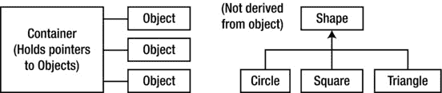
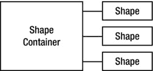

# 十六、模板介绍

继承和组合提供了一种重用目标代码的方法。C++ 中的*模板*特性提供了一种重用*源代码*的方法。

尽管 C++ 模板是一种通用的编程工具，但当它们被引入语言时，它们似乎不鼓励使用基于对象的容器类层次结构(在第 15 章[末尾演示)。](15.html)

这一章不仅演示了模板的基础知识，也是对容器的介绍，容器是面向对象编程的基本组件，几乎完全是通过标准 C++ 库中的容器实现的。你会发现这本书通篇都在使用容器的例子——`Stash`和`Stack`——正是为了让你对容器感到舒服；在这一章中，还将添加*迭代器*的概念。虽然容器是使用模板的理想例子，但是模板还有许多其他的用途。

容器

假设你想创建一个栈，就像我们在整本书中所做的那样。清单 16-1 中的堆栈类将保存`int` s，以保持简单。

***[清单 16-1](#_list1)*** 。说明了一个简单的整数堆栈

```cpp
//: C16:IntStack.cpp
// Simple integer stack
//{L} fibonacci
#include "fibonacci.h"    // SEE ahead in this Section
#include "../require.h"   // To be INCLUDED from *[Chapter 9](09.html)*
#include <iostream>
using namespace std;

class IntStack {
  enum { ssize = 100 };
  int stack[ssize];
  int top;
public:
  IntStack() : top(0) {}
  void push(int i) {
    require(top < ssize, "Too many push()es");
    stack[top++] = i;
  }
  int pop() {
    require(top > 0, "Too many pop()s");
    return stack[--top];
  }
};

int main() {
  IntStack is;
  // Add some Fibonacci numbers, for interest:
  for(int i = 0; i < 20; i++)
    is.push(fibonacci(i));
  // Pop & print them:
  for(int k = 0; k < 20; k++)
    cout << is.pop() << endl;
} ///:∼
```

类`IntStack`是下推堆栈的一个简单例子。为了简单起见，这里创建了一个固定大小的类，但是您也可以修改它，通过从堆中分配内存来自动扩展，就像在本书中讨论的`Stack`类一样。

向堆栈中添加一些整数，并再次弹出它们。为了让这个例子更有趣，整数是用`fibonacci()`函数创建的，它生成传统的兔子繁殖数。[清单 16-2](#list2) 是声明该函数的头文件。

***[清单 16-2](#_list2)*** 。斐波那契数列生成器的头文件

```cpp
//: C16:fibonacci.h
// Fibonacci number generator
int fibonacci(int n); ///:∼
```

[清单 16-3](#list3) 是实现。

***[清单 16-3](#_list3)*** 。斐波那契数生成器的实现

```cpp
//: C16:fibonacci.cpp {O}
#include "../require.h"

int fibonacci(int n) {
  const int sz = 100;
  require(n < sz);
  static int f[sz]; // Initialized to zero
  f[0] = f[1] = 1;
  // Scan for unfilled array elements:
  int i;
  for(i = 0; i < sz; i++)
    if(f[i] == 0) break;
  while(i <= n) {
    f[i] = f[i-1] + f[i-2];
    i++;
  }
  return f[n];
} ///:∼
```

这是一个相当有效的实现，因为它只生成一次数字。它使用了一个`int`的`static`数组，并且依赖于编译器将一个`static`数组初始化为零的事实。第一个`for`循环将索引`i`移动到第一个数组元素为零的位置，然后`while`循环将斐波那契数添加到数组中，直到到达所需的元素。但是请注意，如果通过元素`n`的斐波那契数已经初始化，它将完全跳过`while`循环。

对容器的需求

显然，整数栈不是一个重要的工具。当您开始使用`new`在堆上创建对象并用`delete`销毁它们时，就真正需要容器了。在一般的编程问题中，当你写程序时，你不知道你需要多少对象。例如，在一个空中交通管制系统中，你不希望限制系统可以处理的飞机数量。你不希望程序仅仅因为超出了某个数字而中止。在计算机辅助设计系统中，你要处理许多形状，但是只有用户决定(在运行时)你到底需要多少形状。一旦你注意到这种趋势，你会在你自己的编程环境中发现很多例子。

*C* 依靠虚拟内存来处理他们的“内存管理”的程序员经常发现`new,` `delete`的想法，以及容器类令人不安。显然，C 中的一种做法是创建一个巨大的全局数组，比程序需要的任何东西都要大。这可能不需要太多的思考(或者对`malloc()`和`free()`的了解)，但是它确实产生了移植性不好并且隐藏了微妙错误的程序。

此外，如果在 C++ 中创建一个巨大的全局对象数组，构造器和析构函数的开销会大大降低速度。C++ 方法的工作*要好得多*:当你需要一个对象时，用`new`创建它，并把它的指针放在一个容器中。稍后，把它捞出来，做点什么。这样，您只创建绝对需要的对象。通常在程序启动时，你并不具备所有的初始化条件。`new`允许您等到环境中发生某些事情，然后才能真正创建对象。

因此，在最常见的情况下，您将创建一个容器来保存指向一些感兴趣的对象的指针。您将使用`new`创建这些对象，并将结果指针放入容器中(*潜在地*在这个过程中向上抛掷它)，稍后当您想要对该对象做一些事情时将它取出。这种技术产生了最灵活、最通用的程序。

模板概述

现在出现了一个问题。你有一个保存整数的`IntStack`。但是你想要一堆形状、飞机、植物或其他东西。对于一种鼓吹可重用性的语言来说，每次都重新编写源代码似乎不是一个非常明智的方法。一定有更好的办法。

在这种情况下，有三种重用源代码的技术:C 方式，这里为了对比而介绍；Smalltalk 方法，它极大地影响了 c++；和模板的 C++ 方法。

C 解决方案

当然，你正试图摆脱 C 语言的方法，因为它混乱不堪，容易出错，而且完全不优雅。在这种方法中，您复制了一个`Stack`的源代码，并手工进行了修改，在这个过程中引入了新的错误。这当然不是一个非常有效的技术。

闲聊解决方案

Smalltalk(以及 Java，以其为例)采用了一种简单明了的方法:您想要重用代码，那么就使用继承。为了实现这一点，每个容器类保存通用基类`Object`的项目(类似于第 15 章[结尾的例子)。但是因为 Smalltalk 中的库是如此的重要，你不能从头开始创建一个类。相反，您必须始终从现有的类中继承它。你找到一个尽可能接近你想要的类，从它继承，并做一些改变。显然，这是一个好处，因为它最小化了您的工作(并且解释了为什么您在成为一个有效的 Smalltalk 程序员之前花费大量时间学习类库)。](15.html)

但这也意味着 Smalltalk 中的所有类最终都是单个继承树的一部分。创建新类时，必须从该树的一个分支继承。树的大部分已经在那里了(它是 Smalltalk 类库)，在树的根部是一个名为`Object`的类——每个 Smalltalk 容器持有的同一个类。

这是一个巧妙的技巧，因为这意味着 Smalltalk(和 Java)类层次结构中的每个类都是从`Object`派生的，所以每个类都可以保存在每个容器中(包括容器本身)。这种基于基本泛型类型(通常被命名为`Object`，在 Java 中也是如此)的单树层次被称为*基于对象的层次*。你可能听说过这个术语，并认为它是 OOP 中的一些新的基本概念，比如多态。它只是指一个以`Object`(或者类似的名字)为根的类层次结构和包含`Object`的容器类。

因为 Smalltalk 类库比 C++ 有更长的历史和经验，并且因为最初的 C++ 编译器没有容器类库，所以在 C++ 中复制 Smalltalk 类库似乎是个好主意。这是作为早期 C++ 实现的一个实验来完成的，因为它代表了大量的代码，所以许多人开始使用它。在尝试使用容器类的过程中，他们发现了一个问题。

问题是在 Smalltalk(和大多数其他 OOP 语言)中，所有的类都是自动从一个层次结构中派生出来的，但是在 C++ 中却不是这样。您可能有一个不错的基于对象的层次结构及其容器类，但是您可能会从另一个没有使用该层次结构的供应商那里购买一组形状类或飞机类。(首先，使用这种层次结构会增加开销，这是 C 程序员避免的。)在基于对象的层次结构中，如何将单独的类树插入到容器类中？图 16-1 显示了问题的样子。



[图 16-1](#_Fig1) 。如何在基于对象的层次结构中将单独的类树(形状)插入到容器类中？

因为 C++ 支持多个独立的层次结构，所以 Smalltalk 的基于对象的层次结构不太好用。解决方案似乎显而易见。如果您可以有许多继承层次，那么您应该能够从多个类继承。*多重继承*会解决问题。解决方法见[图 16-2](#Fig2) (类似的例子在[第 15 章](15.html)末尾给出)。


[图 16-2](#_Fig2) 。通过多重继承解决问题

现在`OShape`有了`Shape`的特征和行为，但是因为它也是从`Object`派生出来的，所以可以放在`Container`里。额外继承成`OCircle,` `OSquare`等。是必要的，这样那些类就可以向上转换到`OShape`中，从而保持正确的行为。你可以看到事情正在迅速变得混乱。

编译器供应商发明并包含了他们自己的基于对象的容器类层次结构，其中大部分已经被模板版本所取代。你可以争论多重继承对于解决一般的编程问题是必要的，但是你会在第 21 章中看到，除非在特殊情况下，否则最好避免它的复杂性。

模板解决方案

尽管具有多重继承的基于对象的层次结构在概念上很简单，但使用起来却很痛苦。在他的原著中，Stroustrup 展示了他认为的基于对象的层次结构的更好的替代方案。容器类是作为大型预处理器宏创建的，其参数可以替换为您想要的类型。当您想要创建一个容器来保存一个特定的类型时，您需要进行几次宏调用。

不幸的是，这种方法被所有现有的 Smalltalk 文献和编程经验所混淆，而且有点笨拙。基本上没人懂。

与此同时，Stroustrup 和贝尔实验室的 C++ 团队修改了他最初的宏方法，将其简化并从预处理器领域转移到编译器领域。这种新的代码替换设备被称为`template`，它代表了一种完全不同的重用代码的方式。模板重用源代码，而不是像继承和组合那样重用目标代码。容器不再保存一个名为`Object`的通用基类，而是保存一个未指定的参数。当你使用一个模板时，参数被编译器替换*，很像旧的宏方法，但是更干净和更容易使用。*

现在，当你想使用一个容器类时，不用担心继承或组合，你可以使用容器的模板版本，并为你的特定问题去掉一个特定的版本，如图 16-3 所示。



[图 16-3](#_Fig3) 。通过源模板重用代码

编译器会为您完成这项工作，您最终会得到完成工作所需的容器，而不是笨拙的继承层次结构。在 C++ 中，模板实现了参数化类型的概念。模板方法的另一个好处是，可能不熟悉或不习惯继承的程序员新手仍然可以马上使用固定的容器类(就像我们在整本书中对`vector`所做的那样)。

模板语法

`template`关键字告诉编译器，后面的类定义将操作一个或多个未指定的类型。从模板生成实际的类代码时，必须指定这些类型，以便编译器可以替换它们。为了演示语法，请看清单 16-4 中一个产生边界检查数组的小例子。

***[清单 16-4](#_list4)*** 。说明模板语法

```cpp
//: C16:Array.cpp
#include "../require.h"
#include <iostream>
using namespace std;

template<class T>
class Array {
  enum { size = 100 };
  T A[size];
public:
  T& operator[](int index) {
    require(index >= 0 && index < size,
      "Index out of range");
    return A[index];
  }
};
int main() {
  Array<int> ia;
  Array<float> fa;
  for(int i = 0; i < 20; i++) {
    ia[i] = i * i;
    fa[i] = float(i) * 1.414;
}
  for(int j = 0; j < 20; j++)
    cout << j << ": " << ia[j]
         << ", " << fa[j] << endl;
} ///:∼
```

您可以看到，除了行之外，它看起来像一个普通的类

```cpp
template<class T>
```

它说`T`是替换参数，它代表一个类型名。此外，你会看到`T`在类中的任何地方都被使用，在那里你通常会看到容器持有的特定类型。

在`Array`中，用相同的函数插入*和提取*元素:重载的`operator []`。它返回一个引用，所以它可以用在等号的两边(即，既作为左值又作为右值)。请注意，如果索引超出界限，则使用`require()`函数打印一条消息。由于`operator[]`是一个`inline`，您可以使用这种方法来保证不发生数组边界冲突，然后删除发货代码的`require()`。

在`main()`中，您可以看到创建保存不同类型对象的`Array`是多么容易。当你说

```cpp
Array<int> ia;
Array<float> fa;
```

编译器两次扩展`Array`模板(这被称为*实例化*，以创建两个新生成的类，你可以把它们想象成`Array_int`和`Array_float`。

 **注**不同的编译器可能会以不同的方式修饰名字。

这些类就像您手工执行替换时生成的类一样，只是编译器会在您定义对象`ia`和`fa`时为您创建它们。还要注意，重复的类定义要么被编译器避免，要么被链接器合并。

非内联函数定义

当然，有时候你会想要非内联成员函数定义。在这种情况下，编译器需要在成员函数定义之前看到`template`声明。[清单 16-5](#list5) 显示了修改后的代码形式[清单 16-4](#list4) 显示了非内联成员定义。

***[清单 16-5](#_list5)*** 。说明非内联模板/函数定义

```cpp
//: C16:Array2.cpp
// Non-inline template definition
#include "../require.h"

template<class T>
class Array {
  enum { size = 100 };
  T A[size];
public:
  T& operator[](int index);
};

template<class T>
T& Array<T>::operator[](int index) {
  require(index >= 0 && index < size,
    "Index out of range");
  return A[index];
}

int main() {
  Array<float> fa;
  fa[0] = 1.414;
} ///:∼
```

任何对模板类名的引用都必须附有模板参数列表，如`Array<T>::operator[]`所示。您可以想象，在内部，类名是用模板参数列表中的参数修饰的，以便为每个模板实例化产生一个惟一的类名标识符。

头文件

即使你创建了非内联函数定义，你通常也会想把一个模板的所有声明*和*定义放到一个头文件中。这似乎违反了正常的头文件规则“不要放入任何分配存储空间的东西”(防止链接时出现多个定义错误)，但是模板定义是特殊的。任何以`template<...>`开头的东西都意味着编译器不会在那时为它分配存储，而是等待直到它被告知(通过模板实例化),并且在编译器和链接器中的某个地方有一个机制来删除同一个模板的多个定义。因此，为了方便使用，您几乎总是将整个模板声明*和*定义放在头文件中。

有时，您可能需要将模板定义放在单独的`cpp`文件中，以满足特殊需求(例如，强制模板实例化只存在于单个 Windows `dll`文件中)。大多数编译器都有某种机制允许这样做；要使用它，您必须研究特定编译器的文档。

有些人认为将实现的所有源代码放在一个头文件中会使人们有可能窃取和修改您的代码，如果他们从您这里购买一个库的话。这可能是一个问题，但这可能取决于你如何看待这个问题。他们购买的是产品还是服务？如果它是一个产品，那么你就要尽你所能去保护它，而且很可能你不想给源代码，只给编译好的代码。但是许多人将软件视为一种服务，甚至更多的是一种订阅服务。客户需要你的专业知识；他们希望你继续维护这段可重用的代码，这样他们就不必这么做了，这样他们就可以专注于完成他们的工作。我个人认为，大多数客户会把你视为一种有价值的资源，不希望危及他们与你的关系。至于那几个想偷而不是买或者做原创的，他们大概无论如何都跟不上你。

IntStack 作为模板

[清单 16-6](#list6) 显示了来自`IntStack.cpp`的容器和迭代器，使用模板实现为通用容器类。

***[清单 16-6](#_list6)*** 。说明了一个简单的整数堆栈模板

```cpp
//: C16:StackTemplate.h
// Simple stack template
#ifndef STACKTEMPLATE_H
#define STACKTEMPLATE_H
#include "../require.h"

template<class T>
class StackTemplate {
  enum { ssize = 100 };
  T stack[ssize];
  int top;
public:
  StackTemplate() : top(0) {}
  void push(const T& i) {
    require(top < ssize, "Too many push()es");
    stack[top++] = i;
  }
  T pop() {
    require(top > 0, "Too many pop()s");
    return stack[--top];
  }
  int size() { return top; }
};
#endif // STACKTEMPLATE_H ///:∼
```

请注意，模板对它所保存的对象做了某些假设。例如，`StackTemplate`假设在`push()`函数中有某种针对`T`的赋值操作。你可以说一个模板对于它能够容纳的类型“暗示了一个接口”。

换句话说，模板为 C++ 提供了一种*弱类型*机制，c++ 通常是一种强类型语言。弱类型并不要求一个对象必须是某种精确的类型才能被接受，它只要求它要调用的成员函数对于一个特定的对象来说是*可用的*。因此，弱类型代码可以应用于任何可以接受这些成员函数调用的对象，因此更加灵活。

清单 16-7 包含了测试模板的修改后的例子。

***[清单 16-7](#_list7)*** 。测试清单 16-6 中的整数堆栈模板

```cpp
//: C16:StackTemplateTest.cpp
// Test simple stack template
//{L} fibonacci
#include "fibonacci.h"
#include "StackTemplate.h"   // To be INCLUDED from above
#include <iostream>
#include <fstream>
#include <string>
using namespace std;

int main() {
  StackTemplate<int> is;
  for(int i = 0; i < 20; i++)
    is.push(fibonacci(i));
  for(int k = 0; k < 20; k++)
    cout << is.pop() << endl;
  ifstream in("StackTemplateTest.cpp");
  assure(in, "StackTemplateTest.cpp");
  string line;
  StackTemplate<string> strings;
  while(getline(in, line))
    strings.push(line);
  while(strings.size() > 0)
    cout << strings.pop() << endl;
} ///:∼
```

唯一不同的是`is`的打造。在模板参数列表中，你可以指定栈和迭代器应该持有的对象类型。为了演示模板的*通用性*，还创建了一个`StackTemplate`来保存`string`。这是通过从源代码文件中读入行来测试的。

模板中的常量

模板参数不限于类类型；也可以使用内置类型。这些参数的值随后成为模板特定实例化的编译时常量。您甚至可以为这些参数使用默认值。清单 16-8 允许你在实例化过程中设置`Array`类的大小，但也提供了一个默认值。

***[清单 16-8](#_list8)*** 。说明如何使用内置类型作为模板参数

```cpp
//: C16:Array3.cpp
// Built-in types as template arguments
#include "../require.h"
#include <iostream>
using namespace std;
template<class T, int size = 100>
class Array {
  T array[size];

public:

  T& operator[](int index) {
    require(index >= 0 && index < size,
      "Index out of range");
    return array[index];
  }
  int length() const { return size; }
};

class Number {
  float f;

public:

  Number(float ff = 0.0f) : f(ff) {}
  Number& operator=(const Number& n) {
    f = n.f;
    return *this;
  }
  operator float() const { return f; }
  friend ostream&
    operator<<(ostream& os, const Number& x) {
      return os << x.f;
  }
};

template<class T, int size = 20>
class Holder {
  Array<T, size>* np;

public:

  Holder() : np(0) {}
  T& operator[](int i) {
    require(0 <= i && i < size);
    if(!np) np = new Array<T, size>;
    return np->operator[](i);
  }

  int length() const { return size; }
  ∼Holder() { delete np; }
};

int main() {
  Holder<Number> h;
  for(int i = 0; i < 20; i++)
    h[i] = i;
  for(int j = 0; j < 20; j++)
    cout << h[j] << endl;
} ///:∼
```

和以前一样，`Array`是一个检查过的对象数组，它可以防止索引越界。类`Holder`很像`Array`，除了它有一个指向`Array`的指针，而不是一个`Array`类型的嵌入对象。此指针未在构造器中初始化；初始化被延迟到第一次访问。这叫做*惰性初始化*；如果您正在创建许多对象，但不能访问所有对象，并且希望节省存储空间，那么您可能会使用这样的技术。

您会注意到，两个模板中的`size`值从来没有存储在类内部，但是它被用作成员函数中的数据成员。

作为模板堆叠和隐藏

在本书中反复出现的`Stash`和`Stack`容器类的“所有权”问题来自于这样一个事实，即这些容器不能确切地知道它们持有什么类型。离他们最近的是在`OStackTest.cpp` ( [清单 15-17](15.html#list17) )的[第 15 章](15.html)结尾看到的`Stack``Object`集装箱。

如果客户端程序员没有显式删除容器中保存的所有对象指针，那么容器应该能够正确删除这些指针。也就是说，容器"*拥有*任何没有被移除的对象，因此负责清理它们。问题是清理需要知道对象的类型，而创建一个通用容器类需要*而不是*知道对象的类型。然而，使用模板，您可以编写不知道对象类型的代码，并轻松地为您想要包含的每种类型实例化该容器的新版本。单个实例化的容器*确实*知道它们持有的对象的类型，因此可以调用正确的析构函数(假设，在涉及多态的典型情况下，已经提供了一个虚拟析构函数)。

对于`Stack`,这变得非常简单，因为所有的成员函数都可以合理地内联；见清单 16-9 。

***[清单 16-9](#_list9)*** 。示出了作为模板的堆栈的创建

```cpp
//: C16:TStack.h
// The Stack as a template
#ifndef TSTACK_H
#define TSTACK_H

template<class T>
class Stack {
  struct Link {
    T* data;
    Link* next;
    Link(T* dat, Link* nxt):
      data(dat), next(nxt) {}
  }* head;
public:
  Stack() : head(0) {}
  ∼Stack(){
    while(head)
      delete pop();
  }
  void push(T* dat) {
    head = new Link(dat, head);
  }
  T* peek() const {
    return head ? head->data : 0;
  }
  T* pop(){
    if(head == 0) return 0;
    T* result = head->data;
    Link* oldHead = head;
    head = head->next;
    delete oldHead;
    return result;
  }
};
#endif // TSTACK_H ///:∼
```

如果你将此与第 15 章的[结尾的`OStack.h`例子进行比较，你会发现`Stack`实际上是相同的，除了`Object`被替换为`T`。测试程序也几乎相同，除了消除了从`string`和`Object`多重继承的必要性(甚至消除了对`Object` *本身*的需求)。现在没有`MyString`类来宣布它的销毁，所以在](15.html)[清单 16-10](#list10) 中添加了一个小的新类来显示一个`Stack`容器清理它的对象。

***[清单 16-10](#_list10)*** 。测试清单 16-9 中的模板堆栈

```cpp
//: C16:TStackTest.cpp
//{T} TStackTest.cpp
#include "TStack.h"   // To be INCLUDED from above
#include "../require.h"
#include <fstream>
#include <iostream>
#include <string>
using namespace std;

class X {
public:
  virtual ∼X() { cout << "∼X " << endl; }
};

int main(int argc, char* argv[]) {
  requireArgs(argc, 1); // File name is argument
  ifstream in(argv[1]);
  assure(in, argv[1]);
  Stack<string> textlines;
  string line;
  // Read file and store lines in the Stack:
  while(getline(in, line))
    textlines.push(new string(line));
  // Pop some lines from the stack:
  string* s;
  for(int i = 0; i < 10; i++) {
    if((s = (string*)textlines.pop())==0) break;
    cout << *s << endl;
    delete s;
  } // The destructor deletes the other strings.
  // Show that correct destruction happens:
  Stack<X> xx;
  for(int j = 0; j < 10; j++)
    xx.push(new X);
} ///:∼
```

`X`的析构函数是*虚拟的*，不是因为它在这里是必需的，而是因为`xx`以后可以用来保存从`X`派生的对象。

注意为`string`和`X`创建不同种类的`Stack`是多么容易。因为有了模板，您可以两全其美:`Stack`类的易用性和适当的清理。

模板化指针存储

将`PStash`代码重新组织成一个模板并不那么简单，因为有许多成员函数不应该被内联。然而，作为一个模板，那些函数定义仍然属于头文件(编译器和链接器处理任何多重定义问题)。清单 16-11 中的[代码看起来与普通的`PStash`非常相似，除了你会注意到增量的大小(由`inflate()`使用)已经被模板化为一个带有默认值的非类参数，因此增量大小可以在实例化时修改(注意这意味着增量大小是固定的；您可能还会认为增量大小应该在对象的整个生命周期中是可变的)。](#list11)

***[清单 16-11](#_list11)*** 。说明了模板化的指针存储

```cpp
//: C16:TPStash.h
#ifndef TPSTASH_H
#define TPSTASH_H

template<class T, int incr = 10>
class PStash {
  int quantity; // Number of storage spaces
  int next; // Next empty space
  T** storage;
  void inflate(int increase = incr);
public:
  PStash() : quantity(0), next(0), storage(0) {}
  ∼PStash();
  int add(T* element);
  T* operator[](int index) const; // Fetch
  // Remove the reference from this PStash:
  T* remove(int index);
  // Number of elements in Stash:
  int count() const { return next; }
};

template<class T, int incr>
int PStash<T, incr>::add(T* element) {
  if(next >= quantity)
    inflate(incr);
  storage[next++] = element;
  return(next - 1); // Index number
}

// Ownership of remaining pointers:
template<class T, int incr>
PStash<T, incr>::∼PStash() {
  for(int i = 0; i < next; i++) {
    delete storage[i]; // Null pointers OK
    storage[i] = 0; // Just to be safe
  }
  delete []storage;
}

template<class T, int incr>
T* PStash<T, incr>::operator[](int index) const {
  require(index >= 0,
    "PStash::operator[] index negative");
  if(index >= next)
    return 0; // To indicate the end
  require(storage[index] != 0,
    "PStash::operator[] returned null pointer");
  // Produce pointer to desired element:
  return storage[index];
}

template<class T, int incr>
T* PStash<T, incr>::remove(int index) {
  // operator[] performs validity checks:
  T* v = operator[](index);
  // "Remove" the pointer:
  if(v != 0) storage[index] = 0;
  return v;
}

template<class T, int incr>
void PStash<T, incr>::inflate(int increase) {
  const int psz = sizeof(T*);
  T** st = new T*[quantity + increase];
  memset(st, 0, (quantity + increase) * psz);
  memcpy(st, storage, quantity * psz);
  quantity += increase;
  delete []storage; // Old storage
  storage = st; // Point to new memory
}
#endif // TPSTASH_H ///:∼
```

这里使用的默认增量很小，以保证调用`inflate()`发生。这样你可以确保它正常工作。

为了测试模板化`PStash`的所有权控制，清单 16-12 中的[类将报告它自己的创建和销毁，并保证所有已创建的对象也被销毁。`AutoCounter`将只允许在堆栈上创建其类型的对象。](#list12)

***[清单 16-12](#_list12)*** 。测试(模板化指针存储的)所有权控制

```cpp
//: C16:AutoCounter.h
#ifndef AUTOCOUNTER_H
#define AUTOCOUNTER_H
#include "../require.h"
#include <iostream>
#include <set> // Standard C++ Library container
#include <string>

class AutoCounter {
  static int count;
  int id;
  class CleanupCheck {
    std::set<AutoCounter*> trace;
  public:
    void add(AutoCounter* ap) {
      trace.insert(ap);
    }
    void remove(AutoCounter* ap) {
      require(trace.erase(ap) == 1,
        "Attempt to delete AutoCounter twice");
    }
    ∼CleanupCheck() {
      std::cout << "∼CleanupCheck()"<< std::endl;
      require(trace.size() == 0,
       "All AutoCounter objects not cleaned up");
    }
  };
  static CleanupCheck verifier;
  AutoCounter() : id(count++) {
    verifier.add(this); // Register itself
    std::cout << "created[" << id << "]"
              << std::endl;
  }
  // Prevent assignment and copy-construction:
  AutoCounter(const AutoCounter&);
  void operator=(const AutoCounter&);
public:
  // You can only create objects with this:
  static AutoCounter* create() {
    return new AutoCounter();
  }
  ∼AutoCounter() {
    std::cout << "destroying[" << id
              << "]" << std::endl;
    verifier.remove(this);
  }
  // Print both objects and pointers:
  friend std::ostream& operator<<(
    std::ostream& os, const AutoCounter& ac){
    return os << "AutoCounter " << ac.id;
  }
  friend std::ostream& operator<<(
    std::ostream& os, const AutoCounter* ac){
    return os << "AutoCounter " << ac->id;
  }
};
#endif // AUTOCOUNTER_H ///:∼
```

`AutoCounter`类做两件事。首先，它对`AutoCounter`的每个实例进行顺序编号:该编号的值保存在`id`中，该编号是使用`static`数据成员`count`生成的。

其次，也是更复杂的，嵌套类`CleanupCheck`的一个`static`实例(称为`verifier`)跟踪所有被创建和销毁的`AutoCounter`对象，并在您没有清理它们时向您报告(例如，是否有内存泄漏)。这个行为是使用标准 C++ 库中的`set`类完成的，这是一个很好的例子，说明了设计良好的模板如何使生活变得简单。

`set`类在它持有的类型上被模板化；在这里，它被实例化以保存`AutoCounter`指针。一个`set`将只允许添加每个不同对象的一个实例；在`add()`中，你可以看到这是通过`set::insert()`函数实现的。如果你试图添加已经添加的东西，实际上会通知你它的返回值；然而，由于添加了对象地址，你可以依靠 C++ 保证所有对象都有唯一的地址。

在`remove()`中，`set::erase()`用于从`set`中移除一个`AutoCounter`指针。返回值告诉您移除了元素的多少个实例；在我们的例子中，我们只期望零或一。然而，如果该值为零，则意味着该对象已经从`set`中删除，并且您正试图第二次删除它，这是一个编程错误，将通过`require()`报告。

`CleanupCheck`的析构函数通过确保`set`的大小为零来做最后的检查——这意味着所有的对象都被适当地清理了。如果它不为零，那么您有一个内存泄漏，这是通过`require()`报告的。

`AutoCounter`的构造器和析构函数向`verifier`对象注册和取消注册。注意，构造器、复制构造器和赋值操作符都是`private`，所以创建对象的唯一方法是使用`static create()`成员函数。这是一个简单的*工厂*的例子，它保证所有的对象都是在堆上创建的，所以`verifier`不会对赋值和复制构造感到困惑。

因为所有的成员函数都被内联了，所以实现文件的唯一原因是包含静态数据成员定义；参见[清单 16-13](#list13) 。

***[清单 16-13](#_list13)*** 。在[清单 16-12](#list12) 中实现自动计算器

```cpp
//: C16:AutoCounter.cpp {O}
// Definition of static class members
#include "AutoCounter.h" // To be INCLUDED from above
AutoCounter::CleanupCheck AutoCounter::verifier;
int AutoCounter::count = 0;
///:∼
```

有了`AutoCounter`，你现在可以测试`PStash`的设备了。[清单 16-14](#list14) 不仅显示了`PStash`析构函数清理了它当前拥有的所有对象，还展示了`AutoCounter`类如何检测还没有被清理的对象。

***[清单 16-14](#_list14)*** 。使用自动计数器测试模板化的指针存储

```cpp
//: C16:TPStashTest.cpp
//{L} AutoCounter
#include "AutoCounter.h"
#include "TPStash.h" // To be INCLUDED from above
#include <iostream>
#include <fstream>
using namespace std;

int main() {
  PStash<AutoCounter> acStash;
  for(int i = 0; i < 10; i++)
    acStash.add(AutoCounter::create());
  cout << "Removing 5 manually:" << endl;
  for(int j = 0; j < 5; j++)
    delete acStash.remove(j);
  cout << "Remove two without deleting them:"
       << endl;
  // ... to generate the cleanup error message.
  cout << acStash.remove(5) << endl;
  cout << acStash.remove(6) << endl;
  cout << "The destructor cleans up the rest:"
       << endl;
  // Repeat the test from earlier chapters:
  ifstream in("TPStashTest.cpp");
  assure(in, "TPStashTest.cpp");
  PStash<string> stringStash;
  string line;
  while(getline(in, line))
    stringStash.add(new string(line));
  // Print out the strings:
  for(int u = 0; stringStash[u]; u++)
    cout << "stringStash[" << u << "] = "
         << *stringStash[u] << endl;
} ///:∼
```

当`AutoCounter`元素 5 和 6 从`PStash`中移除时，它们变成了调用者的责任，但是由于调用者从不清理它们，它们导致了内存泄漏，然后在运行时被`AutoCounter`检测到。

当您运行该程序时，您会看到错误消息并不像预期的那样具体。如果您使用`AutoCounter`中介绍的方案来发现您自己系统中的内存泄漏，您可能希望让它打印出关于尚未清理的对象的更详细的信息。有更复杂的方法可以做到这一点，在本书后面你会看到。

打开和关闭所有权

让我们回到所有权问题。通过值保存对象的容器通常不担心所有权，因为它们清楚地拥有它们所包含的对象。但是如果你的容器保存了指针(这在 C++、*中更常见，尤其是在多态*中)，那么这些指针很可能还会在程序中的其他地方使用，你不一定要删除这个对象，因为这样程序中的其他指针就会引用一个被销毁的对象。为了防止这种情况发生，您必须在设计和使用容器时考虑所有权。

很多程序比这个简单很多，不会遇到所有权问题；一个容器保存只由该容器使用的对象的指针。在这种情况下，所有权非常简单:容器拥有它的对象。

处理所有权问题的最好方法是给客户程序员一个选择。这通常是通过构造器参数来实现的，默认为指明所有权(最简单的情况)。此外，可能有*、* get”和“set”功能来查看和修改容器的所有权。如果容器具有移除对象的功能，所有权状态通常会影响移除，因此您也可以在移除功能中找到控制销毁的选项。您可以为容器中的每个元素添加所有权数据，这样每个位置都会知道它是否需要销毁；这是引用计数的一种变体，只不过是容器而不是对象知道指向一个对象的引用的数量(见[清单 16-15](#list15) )。

***[清单 16-15](#_list15)*** 。展示具有运行时可控所有权的堆栈

```cpp
//: C16:OwnerStack.h
// Stack with runtime controllable ownership
#ifndef OWNERSTACK_H
#define OWNERSTACK_H

template<class T> class Stack {
  struct Link {
    T* data;
    Link* next;
    Link(T* dat, Link* nxt)
      : data(dat), next(nxt) {}
  }* head;
  bool own;
public:
  Stack(bool own = true) : head(0), own(own) {}
  ∼Stack();
  void push(T* dat) {
    head = new Link(dat,head);
  }
  T* peek() const {
    return head ? head->data : 0;
  }
  T* pop();
  bool owns() const { return own; }
  void owns(bool newownership) {
    own = newownership;
  }
  // Auto-type conversion: true if not empty:
  operator bool() const { return head != 0; }
};

template<class T> T* Stack<T>::pop() {
if(head == 0) return 0;
  T* result = head->data;
  Link* oldHead = head;
  head = head->next;
  delete oldHead;
  return result;
}

template<class T> Stack<T>::∼Stack() {
  if(!own) return;
  while(head)
    delete pop();
}
#endif // OWNERSTACK_H ///:∼
```

默认行为是容器销毁它的对象，但是你可以通过修改构造器参数或者使用`owns()`读/写成员函数来改变这一点。

与您可能看到的大多数模板一样，整个实现包含在头文件中。清单 16-16 是一个练习所有权能力的小测试。

***[清单 16-16](#_list16)*** 。在清单 16-15 中测试堆栈的所有权

```cpp
//: C16:OwnerStackTest.cpp
//{L} AutoCounter
#include "AutoCounter.h"
#include "OwnerStack.h"   // To be INCLUDED from above
#include "../require.h"
#include <iostream>
#include <fstream>
#include <string>
using namespace std;

int main() {
  Stack<AutoCounter> ac; // Ownership on
  Stack<AutoCounter> ac2(false); // Turn it off
  AutoCounter* ap;
  for(int i = 0; i < 10; i++) {
    ap = AutoCounter::create();
    ac.push(ap);
    if(i % 2 == 0)
      ac2.push(ap);
  }
  while(ac2)
    cout << ac2.pop() << endl;
  // No destruction necessary since
  // ac "owns" all the objects
} ///:∼
```

`ac2`对象不拥有你放入其中的对象，因此`ac`是负责所有权的“主”容器。如果在容器生命周期的中途，您想改变容器是否拥有它的对象，您可以使用`owns()`来实现。

也有可能改变所有权的粒度，使其基于一个对象接一个对象，但是这可能会使所有权问题的解决方案比问题更复杂。

按值保存对象

实际上，如果没有模板，在通用容器中创建对象的副本是一个复杂的问题。有了模板，事情就相对简单了；你只是说你持有的是对象而不是指针，如[清单 16-17](#list17) 所示。

***[清单 16-17](#_list17)*** 。使用模板说明按值保存对象

```cpp
//: C16:ValueStack.h
// Holding objects by value in a Stack
#ifndef VALUESTACK_H
#define VALUESTACK_H
#include "../require.h"

template<class T, int ssize = 100>
class Stack {
  // Default constructor performs object
  // initialization for each element in array:
  T stack[ssize];
  int top;
public:
  Stack() : top(0) {}
  // Copy-constructor copies object into array:
  void push(const T& x) {
    require(top < ssize, "Too many push()es");
    stack[top++] = x;
  }
  T peek() const { return stack[top]; }
  // Object still exists when you pop it;
  // it just isn't available anymore:
  T pop() {
    require(top > 0, "Too many pop()s");
    return stack[--top];
  }
};
#endif // VALUESTACK_H ///:∼
```

所包含对象的复制构造器通过按值传递和返回对象来完成大部分工作。在`push()`内部，对象到`Stack`数组的存储是通过`T::operator=`完成的。为了保证它的工作，一个名为`SelfCounter`的类跟踪对象的创建和复制构造；参见[清单 16-18](#list18) 。

***[清单 16-18](#_list18)*** 。使用 SelfCounter 使清单 16-17 中的 ValueStack 工作

```cpp
//: C16:SelfCounter.h
#ifndef SELFCOUNTER_H
#define SELFCOUNTER_H
#include "ValueStack.h"   // To be INCLUDED from above
#include <iostream>

class SelfCounter {
  static int counter;
  int id;
public:
  SelfCounter() : id(counter++) {
    std::cout << "Created: " << id << std::endl;
  }
  SelfCounter(const SelfCounter& rv) : id(rv.id){
    std::cout << "Copied: " << id << std::endl;
  }
  SelfCounter operator=(const SelfCounter& rv) {
    std::cout << "Assigned " << rv.id << " to "
              << id << std::endl;
    return *this;
  }
  ∼SelfCounter() {
    std::cout << "Destroyed: "<< id << std::endl;
  }
  friend std::ostream& operator<<(
    std::ostream& os, const SelfCounter& sc){
    return os << "SelfCounter: " << sc.id;
  }
};
#endif // SELFCOUNTER_H ///:∼

//: C16:SelfCounter.cpp {O}
#include "SelfCounter.h"   // To be INCLUDED from above
int SelfCounter::counter = 0; ///:∼

//: C16:ValueStackTest.cpp
//{L} SelfCounter
#include "ValueStack.h"
#include "SelfCounter.h"
#include <iostream>
using namespace std;

int main() {
  Stack<SelfCounter> sc;
  for(int i = 0; i < 10; i++)
    sc.push(SelfCounter());
  // OK to peek(), result is a temporary:
  cout << sc.peek() << endl;
  for(int k = 0; k < 10; k++)
    cout << sc.pop() << endl;
} ///:∼
```

当创建一个`Stack`容器时，为数组中的每个对象调用所包含对象的默认构造器。您最初会看到 100 个`SelfCounter`对象被莫名其妙地创建，但这只是数组初始化。这可能有点贵，但是在这样一个简单的设计中没有办法解决这个问题。如果您通过允许大小动态增长来使`Stack`更通用，则会出现更复杂的情况，因为在[清单 16-18](#list18) 所示的实现中，这将涉及创建一个新的(更大的)数组，将旧数组复制到新数组，并销毁旧数组(事实上，这是标准 C++ 库`vector`类所做的)。

迭代器简介

一个*迭代器*是一个对象，它遍历一个包含其他对象的容器，一次选择一个对象，但不提供对该容器实现的直接访问。迭代器提供了访问元素的标准方式，不管容器是否提供了直接访问元素的方式。您将看到迭代器最常与容器类结合使用；迭代器是标准 C++ 容器设计和使用中的一个基本概念。

在许多方面，迭代器是一个智能指针，事实上你会注意到迭代器通常模仿大多数指针操作。然而，与指针不同，迭代器被设计为安全的，所以你不太可能做等同于离开数组末尾的事情(*或者如果你这样做了，*你会更容易发现它)。

考虑本章的第一个例子。清单 16-19 增加了一个简单的迭代器。

***[清单 16-19](#_list19)*** 。用迭代器演示了一个简单的整数堆栈

```cpp
//: C16:IterIntStack.cpp
// Simple integer stack with iterators
//{L} fibonacci
#include "fibonacci.h"
#include "../require.h"
#include <iostream>
using namespace std;

class IntStack {
  enum { ssize = 100 };
  int stack[ssize];
  int top;
public:
  IntStack() : top(0) {}
  void push(int i) {
    require(top < ssize, "Too many push()es");
    stack[top++] = i;
  }
  int pop() {
    require(top > 0, "Too many pop()s");
    return stack[--top];
  }
  friend class IntStackIter;
};

// An iterator is like a "smart" pointer:
class IntStackIter {
  IntStack& s;
  int index;
public:
  IntStackIter(IntStack& is) : s(is), index(0) {}
  int operator++() { // Prefix
    require(index < s.top,
      "iterator moved out of range");
    return s.stack[++index];
  }
  int operator++(int) { // Postfix
    require(index < s.top,
      "iterator moved out of range");
    return s.stack[index++];
  }
};

int main() {
  IntStack is;
  for(int i = 0; i < 20; i++)
    is.push(fibonacci(i));
  // Traverse with an iterator:
  IntStackIter it(is);
  for(int j = 0; j < 20; j++)
    cout << it++ << endl;
} ///:∼
```

`IntStackIter`被创建为仅与`IntStack`一起工作。注意，`IntStackIter`是`IntStack`的`friend`，这使得它可以访问`IntStack`的所有`private`元素。

像指针一样，`IntStackIter`的工作是遍历`IntStack`并检索值。在这个简单的例子中，`IntStackIter`只能向前移动(使用`operator++`的前缀和后缀形式)。然而，定义迭代器的方式没有边界，除了它所使用的容器的约束。迭代器在关联容器内以任何方式移动并导致所包含的值被修改是完全可以接受的(在底层容器的限制内)。

习惯上，迭代器是用一个构造器创建的，这个构造器将迭代器附加到一个容器对象上，迭代器在它的生命周期中不会附加到不同的容器上。

 **注意**迭代器通常又小又便宜，所以你很容易再做一个。

使用迭代器，您可以遍历堆栈中的元素而不弹出它们，就像指针可以在数组的元素中移动一样。然而，迭代器知道栈的底层结构以及如何遍历元素，所以即使你通过假装“增加一个指针”来遍历它们，底层发生的事情更复杂。这是迭代器的关键:它将从一个容器元素移动到下一个容器元素的复杂过程抽象成看起来像指针的东西。目标是让*程序中的每个迭代器*都有相同的接口，这样任何使用迭代器的代码都不会关心它指向什么；它只知道可以用同样的方式重新定位所有迭代器，所以迭代器指向的容器并不重要。通过这种方式，您可以编写更通用的代码。标准 C++ 库中的所有容器和算法都是基于迭代器的原理。

为了有助于使事情更加通用，最好能够说“每个容器都有一个名为`iterator`的相关类”，但是这通常会导致命名问题。解决方案是向每个容器添加一个嵌套的`iterator`类(注意，在本例中，“`iterator`”以小写字母开头，以便符合标准 C++ 库的样式)。清单 16-20 显示了带有嵌套`iterator`的`IterIntStack.cpp`。

***[清单 16-20](#_list20)*** 。展示了容器中迭代器的嵌套

```cpp
//: C16:NestedIterator.cpp
// Nesting an iterator inside the container
//{L} fibonacci
#include "fibonacci.h"
#include "../require.h"
#include <iostream>
#include <string>
using namespace std;

class IntStack {
  enum { ssize = 100 };
  int stack[ssize];
  int top;
public:
  IntStack() : top(0) {}
  void push(int i) {
    require(top < ssize, "Too many push()es");
    stack[top++] = i;
  }
  int pop() {
    require(top > 0, "Too many pop()s");
    return stack[--top];
  }
  class iterator;
  friend class iterator;
  class iterator {
    IntStack& s;
    int index;
  public:
    iterator(IntStack& is) : s(is), index(0) {}
    // To create the "end sentinel" iterator:
    iterator(IntStack& is, bool)
      : s(is), index(s.top) {}
    int current() const { return s.stack[index]; }
    int operator++() { // Prefix
      require(index < s.top,
        "iterator moved out of range");
      return s.stack[++index];
    }
    int operator++(int) { // Postfix
      require(index < s.top,
        "iterator moved out of range");
      return s.stack[index++];
    }
    // Jump an iterator forward
    iterator& operator+=(int amount) {
      require(index + amount < s.top,
        "IntStack::iterator::operator+=() "
        "tried to move out of bounds");
      index += amount;
      return *this;
    }
    // To see if you're at the end:
    bool operator==(const iterator& rv) const {
      return index == rv.index;
    }
    bool operator!=(const iterator& rv) const {
      return index != rv.index;
    }
    friend ostream&
    operator <<(ostream& os, const iterator& it) {
      return os << it.current();
    }
  };
  iterator begin() { return iterator(*this); }
  // Create the "end sentinel":
  iterator end() { return iterator(*this, true);}
};

int main() {
  IntStack is;
  for(int i = 0; i < 20; i++)
    is.push(fibonacci(i));
  cout << "Traverse the whole IntStack\n";
  IntStack::iterator it = is.begin();
  while(it != is.end())
    cout << it++ << endl;
  cout << "Traverse a portion of the IntStack\n";
  IntStack::iterator
    start = is.begin(), end = is.begin();
  start += 5, end += 15;
  cout << "start = " << start << endl;
  cout << "end = " << end << endl;
  while(start != end)
    cout << start++ << endl;
} ///:∼
```

在制作嵌套的`friend`类时，必须经历先声明类名，再声明为`friend`，再定义类的过程。否则，编译器会感到困惑。

迭代器中增加了一些新的变化。成员函数产生迭代器当前选择的容器中的元素。您可以使用`operator+=`将迭代器向前“跳转”任意数量的元素。此外，您将看到两个重载操作符，`==`和`!=`，它们将一个迭代器与另一个迭代器进行比较。这些可以比较任意两个`IntStack::iterator`，但是它们主要是用来测试迭代器是否像“真正的”标准 C++ 库迭代器一样位于序列的末尾。这个想法是两个迭代器定义一个范围，包括第一个迭代器指向的第一个元素，直到第二个迭代器指向的最后一个元素。所以如果你想在两个迭代器定义的范围内移动，你可以说类似于

```cpp
while(start != end)
  cout << start++ << endl;
```

其中`start`和`end`是范围内的两个迭代器。注意，`end`迭代器，我们通常称之为*结束标记*，并没有被解引用，它只是告诉你已经到了序列的末尾。因此，它代表“一个过去的结束。”

大多数情况下，您希望遍历容器中的整个序列，因此容器需要某种方式来产生迭代器，以指示序列的开始和结束标记。在这里，和在标准 C++ 库中一样，这些迭代器由容器成员函数`begin()`和`end()`产生。`begin()`使用第一个`iterator`构造器，默认指向容器的开头(这是压入堆栈的第一个元素)。然而，`end()`使用的第二个构造器是创建结束标记`iterator`所必需的。“在末尾”意味着指向堆栈的顶部，因为`top`总是指示堆栈上下一个可用但未使用的空间。这个`iterator`构造器接受第二个`bool`类型的参数，这是一个伪参数，用于区分两个构造器。

斐波那契数列再次用于填充`main()`中的`IntStack`，而`iterator` s 用于移动整个`IntStack`，并且也在序列的缩小范围内。

当然，下一步是通过*将它的类型*模板化来使代码通用化，这样你就可以保存任何类型，而不是被迫只保存`int`s；参见清单 16-21 。

***[清单 16-21](#_list21)*** 。用嵌套迭代器演示了一个简单的堆栈模板

```cpp
//: C16:IterStackTemplate.h
// Simple stack template with nested iterator
#ifndef ITERSTACKTEMPLATE_H
#define ITERSTACKTEMPLATE_H
#include "../require.h"
#include <iostream>

template<class T, int ssize = 100>
class StackTemplate {
  T stack[ssize];
  int top;
public:
  StackTemplate() : top(0) {}
  void push(const T& i) {
    require(top < ssize, "Too many push()es");
    stack[top++] = i;
  }
  T pop() {
    require(top > 0, "Too many pop()s");
    return stack[--top];
  }
  class iterator; // Declaration required
  friend class iterator; // Make it a friend
  class iterator { // Now define it
    StackTemplate& s;
    int index;
  public:
    iterator(StackTemplate& st): s(st),index(0){}
    // To create the "end sentinel" iterator:
    iterator(StackTemplate& st, bool)
      : s(st), index(s.top) {}
    T operator*() const { return s.stack[index];}
    T operator++() { // Prefix form
      require(index < s.top,
        "iterator moved out of range");
      return s.stack[++index];
    }
    T operator++(int) { // Postfix form
      require(index < s.top,
        "iterator moved out of range");
      return s.stack[index++];
    }
    // Jump an iterator forward
    iterator& operator+=(int amount) {
      require(index + amount < s.top,
        " StackTemplate::iterator::operator+=() "
        "tried to move out of bounds");
      index += amount;
      return *this;
    }
    // To see if you're at the end:
    bool operator==(const iterator& rv) const {
      return index == rv.index;
    }
    bool operator!=(const iterator& rv) const {
      return index != rv.index;
    }

    friend std::ostream& operator<<(
      std::ostream& os, const iterator& it) {
      return os << *it;
    }
  };

  iterator begin() { return iterator(*this); }
  // Create the "end sentinel":
  iterator end() { return iterator(*this, true);}
};
#endif // ITERSTACKTEMPLATE_H ///:∼
```

您可以看到从常规类到`template`的转换是相当透明的。这种先创建并调试一个普通类，然后将其制作成模板的方法通常被认为比从头开始创建模板更容易。

请注意，不只是说

```cpp
friend iterator; // Make it a friend
```

这个代码说

```cpp
friend class iterator; // Make it a friend
```

这很重要，因为名字*“迭代器”*已经在一个包含文件的作用域中。

代替`current()`成员函数，`iterator`有一个`operator*`来选择当前元素，这使得`iterator`看起来更像一个指针，这是一种常见的做法。

清单 16-22 显示了测试模板的修改后的例子。

***[清单 16-22](#_list22)*** 。测试清单 16-21 中的堆栈模板

```cpp
//: C16:IterStackTemplateTest.cpp
//{L} fibonacci
#include "fibonacci.h"
#include "IterStackTemplate.h"   // To be INCLUDED from above
#include <iostream>
#include <fstream>
#include <string>
using namespace std;

int main() {
  StackTemplate<int> is;
  for(int i = 0; i < 20; i++)
    is.push(fibonacci(i));
  // Traverse with an iterator:
  cout << "Traverse the whole StackTemplate\n";
  StackTemplate<int>::iterator it = is.begin();
  while(it != is.end())
    cout << it++ << endl;
  cout << "Traverse a portion\n";
  StackTemplate<int>::iterator
    start = is.begin(), end = is.begin();
  start += 5, end += 15;
  cout << "start = " << start << endl;
  cout << "end = " << end << endl;
  while(start != end)
    cout << start++ << endl;
  ifstream in("IterStackTemplateTest.cpp");
  assure(in, "IterStackTemplateTest.cpp");
  string line;
  StackTemplate<string> strings;
  while(getline(in, line))
    strings.push(line);
  StackTemplate<string>::iterator
    sb = strings.begin(), se = strings.end();
  while(sb != se)
    cout << sb++ << endl;
} ///:∼
```

迭代器的第一次使用只是从头到尾行进一次(并显示 end sentinel 工作正常)。在第二种用法中，您可以看到迭代器如何让您轻松地指定元素的范围(标准 C++ 库中的*容器*和*迭代器*几乎在任何地方都使用*范围*的概念)。重载的`operator+=`将`start`和`end`迭代器移动到`is`中元素范围的中间位置，这些元素被打印出来。请注意，在输出中，end sentinel 是包含在范围内的*而不是*,因此它可以是一个超出范围的结束标记，让您知道您已经通过了结束标记——但是您不能取消对 end sentinel 的引用，否则您可能会取消对空指针的引用。最后，为了验证`StackTemplate`与类对象一起工作，为`string`实例化了一个，并用源代码文件中的行填充，然后打印出来。

带迭代器的堆栈

您可以使用动态调整大小的`Stack`类重复这个过程，该类在整本书中都被用作示例。[清单 16-23](#list23) 显示了`Stack`类，其中嵌套了一个迭代器。

***[清单 16-23](#_list23)*** 。说明了带有嵌套迭代器的模板化堆栈

```cpp
//: C16:TStack2.h
// Templatized Stack with nested iterator
#ifndef TSTACK2_H
#define TSTACK2_H

template<class T> class Stack {
  struct Link {
    T* data;
    Link* next;
    Link(T* dat, Link* nxt)
      : data(dat), next(nxt) {}
  }* head;
public:
  Stack() : head(0) {}
  ∼Stack();
  void push(T* dat) {
    head = new Link(dat, head);
  }
  T* peek() const {
    return head ? head->data : 0;
  }
  T* pop();
  // Nested iterator class:
  class iterator; // Declaration required
  friend class iterator; // Make it a friend
  class iterator { // Now define it
    Stack::Link* p;
  public:
    iterator(const Stack<T>& tl) : p(tl.head) {}
    // Copy-constructor:
    iterator(const iterator& tl) : p(tl.p) {}
    // The end sentinel iterator:
    iterator() : p(0) {}
    // operator++ returns boolean indicating end:
    bool operator++() {
      if(p->next)
        p = p->next;
      else p = 0; // Indicates end of list
      return bool(p);
    }
    bool operator++(int) { return operator++(); }
    T* current() const {
      if(!p) return 0;
      return p->data;
    }
    // Pointer dereference operator:
    T* operator->() const {
      require(p != 0,
        "PStack::iterator::operator->returns 0");
      return current();
    }
    T* operator*() const { return current(); }
    // bool conversion for conditional test:
    operator bool() const { return bool(p); }
    // Comparison to test for end:
    bool operator==(const iterator&) const {
      return p == 0;
    }
    bool operator!=(const iterator&) const {
      return p != 0;
    }
  };
  iterator begin() const {
    return iterator(*this);
  }
  iterator end() const { return iterator(); }
};

template<class T> Stack<T>::∼Stack() {
  while(head)
    delete pop();
}

template<class T> T* Stack<T>::pop() {
  if(head == 0) return 0;
  T* result = head->data;
  Link* oldHead = head;
  head = head->next;
  delete oldHead;
  return result;
}
#endif // TSTACK2_H ///:∼
```

你还会注意到这个类已经被修改为支持所有权，这现在可以工作了，因为这个类知道确切的类型(或者至少知道基本类型，*，假设使用了虚拟析构函数*，它将会工作)。默认情况下容器销毁它的对象，但是你要对你使用的任何指针负责。

迭代器很简单，物理上非常小——只有一个指针的大小。当你创建一个`iterator`时，它被初始化到链表的头部，你只能在链表中向前递增。如果想从头开始，可以创建一个新的迭代器，如果想记住列表中的某个点，可以从指向该点的现有迭代器创建一个新的迭代器(使用迭代器的复制构造器)。

要为迭代器引用的对象调用函数，可以使用`current()`函数、`operator*`或指针解引用`operator->`(迭代器中常见的情况)。后者有一个实现，*看起来*和`current()`一样，因为它返回一个指向当前对象的指针，但是不同的是，指针解引用操作符执行额外级别的解引用(参考[第 12 章](12.html))。

`iterator`类遵循你在清单 16-21 中看到的形式。`class iterator`嵌套在容器类中，它包含构造器来创建指向容器中元素的迭代器和“end sentinel”迭代器，容器类有`begin()`和`end()`方法来产生这些迭代器。整个实现包含在头文件中，所以没有单独的`cpp`文件。

清单 16-24 包含了一个测试迭代器的小测试。

***[清单 16-24](#_list24)*** 。测试清单 16-23 中的模板化堆栈

```cpp
//: C16:TStack2Test.cpp

#include "TStack2.h"   // To be INCLUDED from above
#include "../require.h"
#include <iostream>
#include <fstream>
#include <string>

using namespace std;

int main() {
  ifstream file("TStack2Test.cpp");

  assure(file, "TStack2Test.cpp");

  Stack<string> textlines;
  // Read file and store lines in the Stack:

  string line;

  while(getline(file, line))
    textlines.push(new string(line));

  int i = 0;
  // Use iterator to print lines from the list:
  Stack<string>::iterator it = textlines.begin();

  Stack<string>::iterator* it2 = 0;

  while(it != textlines.end()) {
    cout << it->c_str() << endl;
    it++;
    if(++i == 10) // Remember 10th line
      it2 = new Stack<string>::iterator(it);
  }
  cout << (*it2)->c_str() << endl;
  delete it2;
} ///:∼
```

一个`Stack`被实例化以保存`string`对象，并用文件中的行填充。然后创建一个迭代器，用于遍历序列。通过从第一个迭代器复制构造第二个迭代器来记住第十行；稍后，这一行被打印出来，动态创建的迭代器被销毁。这里，动态对象创建用于控制对象的生存期。

带迭代器的 PStash

对于大多数容器类来说，拥有一个迭代器是有意义的。清单 16-25 展示了一个添加到`PStash`类中的迭代器。

***[清单 16-25](#_list25)*** 。说明了带有嵌套迭代器的模板化 PStash

```cpp
//: C16:TPStash2.h
// Templatized PStash with nested iterator
#ifndef TPSTASH2_H
#define TPSTASH2_H
#include "../require.h"
#include <cstdlib>

template<class T, int incr = 20>
class PStash {
  int quantity;
  int next;
  T** storage;
  void inflate(int increase = incr);
public:
  PStash() : quantity(0), storage(0), next(0) {}
  ∼PStash();
  int add(T* element);
  T* operator[](int index) const;
  T* remove(int index);
  int count() const { return next; }
  // Nested iterator class:
  class iterator; // Declaration required
  friend class iterator; // Make it a friend
  class iterator { // Now define it
    PStash& ps;
    int index;
  public:
    iterator(PStash& pStash)
      : ps(pStash), index(0) {}
    // To create the end sentinel:
    iterator(PStash& pStash, bool)
      : ps(pStash), index(ps.next) {}
    // Copy-constructor:
    iterator(const iterator& rv)
      : ps(rv.ps), index(rv.index) {}
    iterator& operator=(const iterator& rv) {
      ps = rv.ps;
      index = rv.index;
      return *this;
    }
    iterator& operator++() {
      require(++index <= ps.next,
        "PStash::iterator::operator++ "
        "moves index out of bounds");
      return *this;
    }
    iterator& operator++(int) {
      return operator++();
    }
    iterator& operator--() {
      require(--index >= 0,
        "PStash::iterator::operator-- "
        "moves index out of bounds");
      return *this;
    }
    iterator& operator--(int) {
      return operator--();
    }
    // Jump interator forward or backward:
    iterator& operator+=(int amount) {
      require(index + amount < ps.next &&
        index + amount >= 0,
        "PStash::iterator::operator+= "
        "attempt to index out of bounds");
      index += amount;
      return *this;
    }
    iterator& operator-=(int amount) {
      require(index - amount < ps.next &&
        index - amount >= 0,
        "PStash::iterator::operator-= "
        "attempt to index out of bounds");
      index -= amount;
      return *this;
    }
    // Create a new iterator that's moved forward
    iterator operator+(int amount) const {
      iterator ret(*this);
      ret += amount; // op+= does bounds check
      return ret;
    }
    T* current() const {
      return ps.storage[index];
    }
    T* operator*() const { return current(); }
    T* operator->() const {
      require(ps.storage[index] != 0,
        "PStash::iterator::operator->returns 0");
      return current();
    }
    // Remove the current element:
    T* remove(){
      return ps.remove(index);
    }
    // Comparison tests for end:
    bool operator==(const iterator& rv) const {
      return index == rv.index;
    }
    bool operator!=(const iterator& rv) const {
      return index != rv.index;
    }
  };
  iterator begin() { return iterator(*this); }
  iterator end() { return iterator(*this, true);}
};

// Destruction of contained objects:
template<class T, int incr>
PStash<T, incr>::∼PStash() {
  for(int i = 0; i < next; i++) {
    delete storage[i]; // Null pointers OK
    storage[i] = 0; // Just to be safe
  }
  delete []storage;
}

template<class T, int incr>
int PStash<T, incr>::add(T* element) {
if(next >= quantity)
    inflate();
  storage[next++] = element;
  return(next - 1); // Index number
}

template<class T, int incr> inline
T* PStash<T, incr>::operator[](int index) const {
  require(index >= 0,
    "PStash::operator[] index negative");
  if(index >= next)
    return 0; // To indicate the end
  require(storage[index] != 0,
    "PStash::operator[] returned null pointer");
  return storage[index];
}

template<class T, int incr>
T* PStash<T, incr>::remove(int index) {
  // operator[] performs validity checks:
  T* v = operator[](index);
  // "Remove" the pointer:
  storage[index] = 0;
  return v;
}

template<class T, int incr>
void PStash<T, incr>::inflate(int increase) {
  const int tsz = sizeof(T*);
  T** st = new T*[quantity + increase];
  memset(st, 0, (quantity + increase) * tsz);
  memcpy(st, storage, quantity * tsz);
  quantity += increase;
  delete []storage; // Old storage
  storage = st; // Point to new memory
}
#endif // TPSTASH2_H ///:∼
```

这个文件的大部分内容是将前面的`PStash`和嵌套的`iterator`直接翻译成一个模板。然而，这一次，操作符返回对当前迭代器的引用，这是更典型、更灵活的方法。

析构函数为所有包含的指针调用`delete`，因为类型是由模板捕获的，所以会发生适当的析构。您应该知道，如果容器保存指向基类类型的指针，该类型应该有一个`virtual`析构函数，以确保在将地址被向上转换的派生对象放入容器时，对它们进行适当的清理。

`PStash::iterator`在其生命周期中遵循绑定到单个容器对象的迭代器模型。此外，copy-constructor 允许您创建一个新的迭代器，指向与创建它的现有迭代器相同的位置，有效地在容器中创建一个书签。`operator+=`和`operator-=`成员函数允许你移动迭代器很多点，同时尊重容器的边界。重载的递增和递减操作符将迭代器移动一个位置。`operator+`产生一个新的迭代器，它向前移动了加数的数量。如清单 16-11 中的[所示，指针解引用操作符用于对迭代器所引用的元素进行操作，`remove()`通过调用容器的`remove()`销毁当前对象。](#list11)

与清单 16-11 中的[相同类型的代码(就像标准 C++ 库容器一样)被用于创建结束标记:第二个构造器，容器的`end()`成员函数，以及用于比较的`operator==`和`operator!=`。](#list11)

[清单 16-26](#list26) 创建并测试了两种不同的`Stash`对象，一种用于一个名为`Int`的新类，它声明了它的构造和销毁，另一种用于保存标准库`string`类的对象。

***[清单 16-26](#_list26)*** 。创建和测试两个不同的 Stash 对象

```cpp
//: C16:TPStash2Test.cpp
#include "TPStash2.h"   // To be INCLUDED from above
#include "../require.h"
#include <iostream>
#include <vector>
#include <string>
using namespace std;

class Int {
  int i;
public:
  Int(int ii = 0) : i(ii) {
    cout << ">" << i << ' ';
  }
  ∼Int() { cout << "∼" << i << ' '; }
  operator int() const { return i; }
  friend ostream&
    operator <<(ostream& os, const Int& x) {
      return os << "Int: " << x.i;
  }
  friend ostream&
    operator <<(ostream& os, const Int* x) {
      return os << "Int: " << x->i;
  }
};

int main() {
  { // To force destructor call
    PStash<Int> ints;
    for(int i = 0; i < 30; i++)
      ints.add(new Int(i));
    cout << endl;
    PStash<Int>::iterator it = ints.begin();
    it += 5;
    PStash<Int>::iterator it2 = it + 10;
    for(; it != it2; it++)
      delete it.remove(); // Default removal
    cout << endl;
    for(it = ints.begin();it != ints.end();it++)
      if(*it) // Remove() causes "holes"
        cout << *it << endl;
  } // "ints" destructor called here
  cout << "\n-------------------\n";
  ifstream in("TPStash2Test.cpp");
  assure(in, "TPStash2Test.cpp");
  // Instantiate for String:
  PStash<string> strings;
  string line;
  while(getline(in, line))
    strings.add(new string(line));
  PStash<string>::iterator sit = strings.begin();
  for(; sit != strings.end(); sit++)
    cout << **sit << endl;
  sit = strings.begin();
  int n = 26;
  sit += n;
  for(; sit != strings.end(); sit++)
    cout << n++ << ": " << **sit << endl;
} ///:∼
```

为了方便起见，`Int`对于`Int&`和`Int*`都有一个关联的`ostream operator<<`。

`main()`中的第一个代码块用大括号括起来，以强制销毁`PStash<Int>`，从而由析构函数自动清除。手工移除和删除一系列元素，表明`PStash`清理了剩余的元素。

对于`PStash`的两个实例，一个迭代器被创建并用于遍历容器。注意使用这些结构产生的优雅；您不会被使用数组的实现细节所困扰。你告诉容器*和迭代器*对象*做什么*，而不是怎么做。这使得解决方案更容易概念化、构建和修改。

为什么是迭代器？

到目前为止，您已经看到了迭代器的*机制，但是理解它们为什么如此重要需要一个更复杂的例子。*

在真正的面向对象程序中，多态、动态对象创建和容器一起使用是很常见的。容器和动态对象创建解决了不知道需要多少或什么类型的对象的问题。如果容器被配置为保存指向基类对象的指针，则每次将派生类指针放入容器时都会发生向上转换(具有相关的代码组织和可扩展性好处)。作为本章的最后一段代码，[清单 16-27](#list27) 也将汇集到目前为止你所学的所有内容的各个方面。如果你能遵循这个例子，*那么*你就为接下来的章节做好了准备。

***[清单 16-27](#_list27)*** 。把这一切放在一起

```cpp
//: C16:Shape.h
#ifndef SHAPE_H
#define SHAPE_H
#include <iostream>
#include <string>

class Shape {
public:
  virtual void draw() = 0;
  virtual void erase() = 0;
  virtual ∼Shape() {}
};

class Circle : public Shape {
public:
  Circle() {}
  ∼Circle() { std::cout << "Circle::∼Circle\n"; }
  void draw() { std::cout << "Circle::draw\n";}
  void erase() { std::cout << "Circle::erase\n";}
};

class Square : public Shape {
public:
  Square() {}
  ∼Square() { std::cout << "Square::∼Square\n"; }
  void draw() { std::cout << "Square::draw\n";}
  void erase() { std::cout << "Square::erase\n";}
};

class Line : public Shape {
public:
  Line() {}
  ∼Line() { std::cout << "Line::∼Line\n"; }
  void draw() { std::cout << "Line::draw\n";}
  void erase() { std::cout << "Line::erase\n";}
};

#endif // SHAPE_H ///:∼
```

假设您正在创建一个程序，允许用户编辑和生成不同种类的绘图。每个绘图都是一个对象，包含一组`Shape`对象；见清单 16-27 。

这使用了基类中虚函数的经典结构，这些虚函数在派生类中被重写。注意，`Shape`类包含了一个`virtual`析构函数，你应该自动添加到任何带有`virtual`函数的类中。如果一个容器保存了指向`Shape`对象的指针或引用，那么当这些对象的`virtual`析构函数被调用时，一切都将被正确地清理。

清单 16-28 中的[每种不同类型的绘图都使用了不同种类的模板化容器类:本章已经定义的`PStash`和`Stack`，以及标准 C++ 库中的`vector`类。容器的“使用”非常简单；一般来说，继承可能不是最好的方法(组合可能更有意义)，但在这种情况下，继承是一种简单的方法，它不会偏离示例中的观点。](#list28)

***[清单 16-28](#_list28)*** 。使用清单 16-27 中的头文件

```cpp
//: C16:Drawing.cpp
#include <vector> // Uses Standard vector too!
#include "TPStash2.h"
#include "TStack2.h"
#include "Shape.h"   // To be INCLUDED from above
using namespace std;

// A Drawing is primarily a container of Shapes:
class Drawing : public PStash<Shape> {
public:
  ∼Drawing() { cout << "∼Drawing" << endl; }
};

// A Plan is a different container of Shapes:
class Plan : public Stack<Shape> {
public:
  ∼Plan() { cout << "∼Plan" << endl; }
};
// A Schematic is a different container of Shapes:
class Schematic : public vector<Shape*> {
public:
  ∼Schematic() { cout << "∼Schematic" << endl; }
};
// A function template:
template<class Iter>
void drawAll(Iter start, Iter end) {
  while(start != end) {
    (*start)->draw();
    start++;
  }
}

int main() {
  // Each type of container has
  // a different interface:
  Drawing d;
  d.add(new Circle);
  d.add(new Square);
  d.add(new Line);
  Plan p;
  p.push(new Line);
  p.push(new Square);
  p.push(new Circle);
  Schematic s;
  s.push_back(new Square);
  s.push_back(new Circle);
  s.push_back(new Line);
  Shape* sarray[] = {
    new Circle, new Square, new Line
  };
  // The iterators and the template function
  // allow them to be treated generically:
  cout << "Drawing d:" << endl;
  drawAll(d.begin(), d.end());
  cout << "Plan p:" << endl;
  drawAll(p.begin(), p.end());
  cout << "Schematic s:" << endl;
  drawAll(s.begin(), s.end());
  cout << "Array sarray:" << endl;
  // Even works with array pointers:
  drawAll(sarray,
    sarray + sizeof(sarray)/sizeof(*sarray));
  cout << "End of main" << endl;
} ///:∼
```

不同类型的容器都包含指向`Shape`的指针和指向从`Shape`派生的类的向上转换对象的指针。然而，由于多态，当调用虚函数时，正确的行为仍然发生。

注意，`Shape*`的数组`sarray`，也可以认为是一个容器。

功能模板

在`drawAll()`你会看到一些新的东西。到目前为止，本章中我们只使用了*类模板*，它基于一个或多个类型参数实例化新类。然而，您可以轻松地创建*函数模板*，它基于类型参数创建新函数。

创建函数模板的原因与创建类模板的原因是一样的:您试图创建泛型代码，并且通过延迟一个或多个类型的规范来实现这一点。你只是想说这些类型参数支持某些操作，而不是确切的说它们是什么类型。

函数模板`drawAll()`可以被认为是一个*算法*(而这也是标准 C++ 库中大多数函数模板的叫法)。它只是说如何做一些给定的迭代器描述一系列元素，只要这些迭代器可以被解引用，增加，和比较。这些正是我们在本章中开发的迭代器，也是——并非巧合——由标准 C++ 库中的容器产生的迭代器，在本例中使用`vector`就是证明。

你还想让`drawAll()`成为一个*通用算法*，这样容器就可以是任何类型，你不必为每个不同类型的容器编写新版本的算法。这就是函数模板必不可少的地方，因为它们会自动为每种不同类型的容器生成特定的代码。

但是如果没有迭代器提供的额外间接性，这种泛型(程序的*泛型属性*或*泛型属性*)是不可能的。这就是迭代器重要的原因；它们允许您编写涉及容器的通用代码，而无需了解容器的底层结构。

 **注意**在 C++ 中，迭代器和泛型算法需要函数模板才能工作。

你可以在`main()`中看到这一点的证明，因为`drawAll()`对于每一种不同类型的容器都是不变的。更有趣的是，`drawAll()`还可以处理指向数组开头和结尾的指针`sarray`。这种将数组视为容器的能力是标准 C++ 库设计的一部分，其算法看起来很像`drawAll()`。

因为容器类模板很少受到你在“普通”类中看到的继承和向上转换的影响，所以你几乎不会在容器类中看到`virtual`函数。容器类重用是用*模板*实现*的*，而不是用继承。

审查会议

1.  容器类是面向对象编程的一个基本部分。它们是简化和隐藏程序细节的另一种方式，也是加速*程序开发过程的另一种方式。*
2.  此外，通过取代 c 语言中原始的数组和相对粗糙的数据结构技术，它们提供了大量的安全性和灵活性
3.  因为客户端程序员需要容器，所以容器必须易于使用。这就是*模板*的用武之地。
4.  有了模板，*源代码重用*(与*继承和*组合提供的目标代码重用相反)的语法对新手用户来说变得足够简单。事实上，*用模板复用代码*明显比继承和组合*容易*。
5.  与容器类设计相关的问题在本章中已经有所涉及，但是你可能已经知道它们可以更进一步。
6.  事实上，*复杂的容器类库*可能涵盖所有种类的附加问题，包括多线程、持久性和垃圾收集。