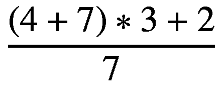
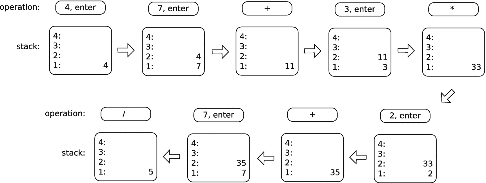

# 1.定义案例研究

## 1.1 简要介绍

这本书是关于程序设计的。然而，与这个主题的许多书籍不同，这本书通过探索而不是通过指导来教授设计。一般来说，大多数作者在撰写设计的某些方面时，会建立他们想要传达的原则，将这些原则抽象出来，然后给出支持当前观点的例子。这不是这样一本书。更确切地说，这本书定义了一个需要解决的实际问题，并继续详细研究它的解决方案。也就是说，我没有决定一个主题并创造琐碎的例子来支持它的教学，而是定义了一个难题，然后让这个问题的解决方案决定应该讨论什么主题。

有趣的是，前面的方法正是我告诉某人*而不是*去学习一门学科的方法。我总是强调，人们应该首先学习广泛的基本原理，然后应用这些原理来解决问题。然而，这不是一本旨在教授设计原则的书。相反，这本书是为那些已经知道基本原理，但希望加深实践知识的人准备的。这本书旨在教人们从头到尾设计和实现一个现实的，尽管很小的程序。这个过程不仅仅包括了解设计的元素。它包括理解何时以及如何使用你所知道的，理解如何在看似等同的方法之间做出决定，以及理解各种决定的长期影响。这本书在数据结构、算法、设计模式或 C++ 最佳实践的覆盖面上并不全面；有大量的书籍涵盖了这些主题。这是一本关于学习如何应用这些知识来编写有组织的、内聚的、合理的、有目的的和实用的代码的书。换句话说，这本书是关于学习编写既能完成现在的工作(开发)又能让其他人在未来继续完成工作(维护)的代码。我称之为实用设计。

为了探索实用的设计，我们需要一个案例研究。理想情况下，案例研究问题应该是

*   大到不仅仅是微不足道的

*   小到可以处理

*   熟悉到不需要特定领域的专业知识

*   有趣到足以让读者在整个阅读过程中保持注意力

在考虑了前面的标准之后，我决定选择一个基于堆栈的反向波兰符号(RPN)计算器作为案例研究。计算器要求的细节将在下面定义。我相信一个全功能计算器的代码足够重要，以至于对其设计的详细研究提供了足以涵盖一本书的材料。然而这个项目足够小，所以这本书可以有一个合理的长度。当然，专业领域的专业知识不是必需的。我怀疑这本书的每个读者都使用过计算器，并且非常熟悉它的基本功能。最后，我希望制作计算器 RPN 能提供一个合适的扭转来避免无聊。

## 1.2 关于需求的几句话

不管多大，多小，所有的程序都有要求。需求是程序必须遵循的那些特性，无论是显式的还是隐式的，功能性的还是非功能性的。整本书都是关于收集和管理软件需求的(例如，参见[36]或[28])。通常，尽管尽了最大的努力，实际上不可能预先收集所有的需求。有时，所需的努力在经济上是不可行的。有时，领域专家忽略了对他们来说似乎是显而易见的需求，他们只是忽略了将他们所有的需求与开发团队联系起来。有时，只有在程序开始成形后，需求才变得明显。有时，客户并没有很好地理解他们自己的需求，无法向开发团队清楚地表达出来。虽然使用敏捷开发方法可以缓解一些困境，但事实仍然是，许多设计决策，其中一些可能具有深远的影响，必须在了解所有需求之前做出。

在本书中，我们不会学习收集需求的技术；相反，我们的需求被简单地提前放弃了。好吧，他们中的大部分会被提前放弃。一些需求已经被明确地保留到后面的章节，这样我们可以研究我们的设计如何改变来适应未知的未来扩展。当然，人们可以公正地争辩说，由于作者知道需求将如何变化，最初的设计将正确地“预测”不可预见的特性。虽然这种批评是公平的，但我仍然认为设计决策背后的思维过程和讨论仍然是相关的。作为一名软件架构师，你工作的一部分将是预测未来的请求。尽管任何请求都是可能的，但是一开始就包含太多的灵活性是不经济的。为未来的扩展而设计必须始终被认为是一种权衡，即预先明确适应可扩展性的成本差异与以后需要更改时修改代码的成本差异。设计应该在简单性和灵活性之间的哪个范围内，最终必须根据功能请求实现的可能性和添加新功能的可行性来衡量，如果在开始时没有考虑新功能的加入。

## 1.3 反向波兰符号(RPN)

我认为任何阅读这本书的人都熟悉计算器的典型操作。然而，除非您从小使用惠普计算器，否则您可能不熟悉基于堆栈的 RPN 计算器的工作方式(如果您不熟悉堆栈的工作方式，请参见[10])。简单地说，输入的数字被推送到一个堆栈上，对已经在堆栈上的数字执行操作。二元运算符(如加法)从堆栈中弹出前两个数字，将这两个数字相加，然后将结果推送到堆栈上。一元运算符(如正弦函数)从堆栈顶部弹出一个数字，将该数字用作操作数，并将结果推送到堆栈上。对于那些熟悉基本编译器术语的人来说，RPN 充当操作的后缀符号(参见[4]对后缀符号的详细讨论)。下面的列表描述了我对逆波兰符号相对于传统语法的一些优势的看法:

*   所有的运算都可以用无括号的方式表达。

*   可以同时显示多个输入和输出。

*   大型计算可以被平凡地分解成多个简单的操作。

*   中间结果可以轻松地保留和重用。

虽然 RPN 一开始可能看起来非常笨拙，但是一旦你习惯了它，当你执行比简单算术更复杂的任务时，你会诅咒每一个不使用它的计算器。

为了确保 RPN 计算器的操作清晰明了，我们来看一个简短的例子。假设我们希望评估以下表达式:

在一个典型的非 RPN 计算器上，我们会键入((4+7)*∫*3+2)*/*7，然后按=键。在 RPN 计算器上，我们应该键入 4 7+3*∫*2+7*/*，其中每个数字后面都有一个 enter 命令，以便将输入推送到堆栈上。注意，对于许多计算器来说，为了减少按键输入，像+这样的操作也可以隐式地输入堆栈上的前一个数字。图 [1-1](#Fig1) 显示了在 RPN 计算器上逐步执行的上述计算。

图 1-1

在 RPN 计算器上执行的示例计算显示了中间步骤。与直觉相反，堆栈的顶部在屏幕的底部

## 1.4 计算器的要求

一旦你理解了逆向波兰符号的本质，计算器的其余功能应该从需求描述中变得简单明了。如果 RPN 仍然不清楚，我建议在继续之前花一些时间澄清这个概念。考虑到这一点，计算器的要求现在定义如下:

*   计算器将基于堆栈；堆栈大小不应该是硬编码的。

*   计算器将使用 RPN 来执行运算。

*   计算器将只对浮点数进行运算；应该实现用于输入数字(包括科学符号)的技术。

*   计算器将具有撤销和重做操作的能力；撤销/重做堆栈的大小在概念上应该是无限的。

*   计算器将能够交换栈顶的两个元素。

*   计算器将能够从堆栈顶部删除一个元素。

*   计算器将能够清除整个堆栈。

*   计算器将能够从栈顶复制元素。

*   计算器将能够从栈顶开始对元素求反。

*   计算器将实现四种基本的算术运算:加、减、乘、除。不允许除以 0。

*   计算器将实现三个基本的三角函数及其逆函数:sin、cos、tan、arcsin、arccos 和 arctan。三角函数的参数将以弧度给出。

*   计算器将实现*y*T3】xT5】和![$ \sqrt[x]{y} $](img/454125_2_En_1_Chapter_TeX_IEq1.png)的功能。

*   计算器将实现一个运行时插件结构来扩展计算器可以执行的操作。

*   该计算器将实现命令行界面(CLI)和图形用户界面(GUI)。

*   计算器不支持无穷大或虚数。

*   计算器将是容错的(即，如果用户输入错误，它不会崩溃)，但不需要处理浮点异常。

既然计算器有了要求，它就应该有一个名字。我选择称这个计算器为 pdCalc，是实用设计计算器的缩写。请接受我对命名创意不足的道歉。

本书的其余部分将详细考察满足上述要求的计算器的完整设计。除了描述为最终设计做出的决策，我们还将讨论备选方案，以了解为什么做出最终决策，以及不同决策可能产生的后果。我会注意到，本书中呈现的最终设计并不是唯一会满足需求的设计，它甚至可能不是满足需求的最佳设计。我鼓励雄心勃勃的读者尝试不同的设计，扩展计算器以满足他们自己的需求和兴趣。

## 1.5 源代码

在本书的整个文本中，我们将在设计计算器时检查大量代码片段。这些代码片段大部分直接取自 pdCalc 的 GitHub 源代码库(参见附录 A 中下载源代码的说明)。我将指出文本中的代码和存储库中的代码之间的任何显著差异。偶尔，代码片段由小的、人为的例子组成。这些代码片段不是 pdCalc 的源代码库的一部分。所有的代码都可以在 GPL 版本 3 [12]下获得。我强烈建议您尝试源代码，并以您认为合适的任何方式进行修改。

为了构建 pdCalc，您需要访问兼容 C++20 的编译器、Qt(版本 5 或 6)和 CMake。为了不引入额外的依赖，单元测试是用 Qt 的 QtTest 来执行的。在编写这个版本的时候，微软的 Visual C++ (MSVC)是唯一一个具有足够的 C++20 兼容性来构建 pdCalc 的编译器。希望 GCC 和 clang 能很快达到 C++20 的成熟度。然而，由于 GCC 或 clang 无法构建 pdCalc，我只能使用 MSVC 在 Windows 中构建和测试该程序。然而，随着更多的编译器达到足够的 C++20 成熟度，代码也应该在其他系统上构建和执行，而只需很少或不需要修改源代码。为了移植到不同的平台，对 CMake 项目文件进行一些调整是必要的，尽管我至少提供了一些钩子来帮助人们使用 GCC 或 clang 开始使用 Linux。因为我预计本书的读者倾向于有多年经验的开发人员，所以我怀疑从源代码构建代码将是一项相当琐碎的任务。但是，为了完整起见，我在附录 a 中包含了构建指南。此外，我还包含了附录 B 来解释 pdCalc 的源代码、库和可执行文件的组织。虽然这两个附录出现在本书的末尾，但是如果您打算在阅读文本的同时构建 pdCalc 并探索其完整实现，您可能希望先阅读它们。