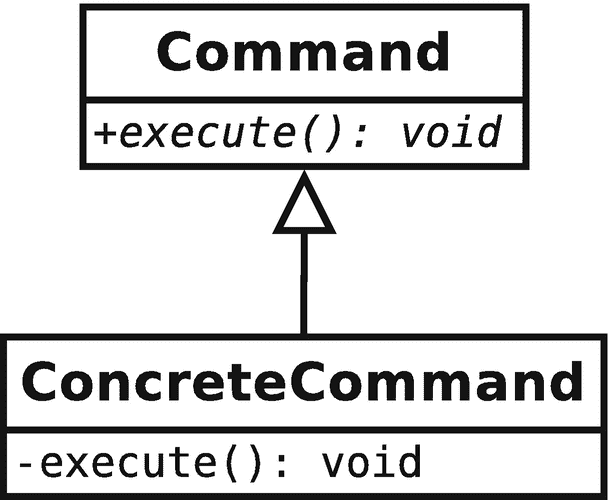
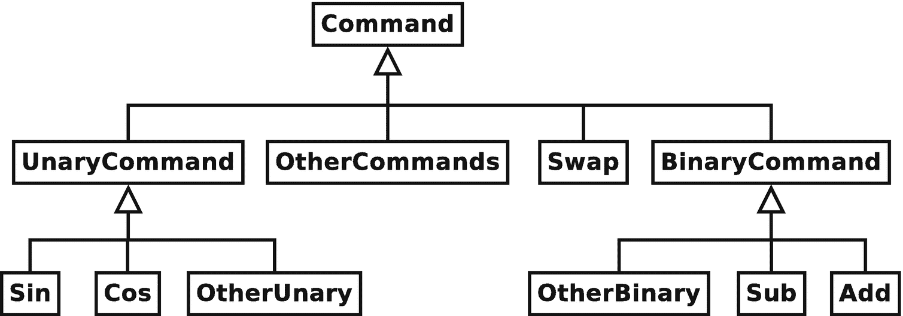
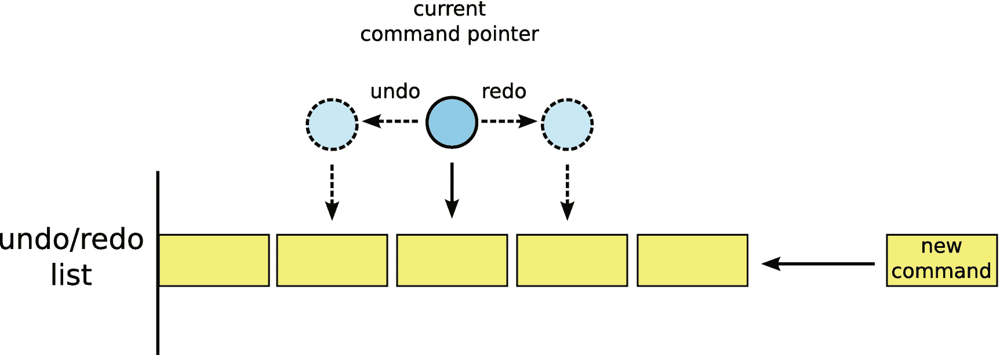
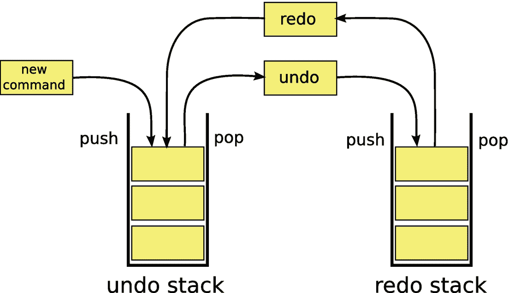

# 4.指挥调度员

命令调度程序是计算器的核心。作为 MVC 框架中的控制器，命令调度程序负责应用程序的整个业务逻辑。本章不仅介绍了计算器的命令调度器模块的具体设计，而且更广泛地介绍了松散耦合的命令基础设施的灵活设计。

## 4.1 命令调度员的分解

当分解堆栈时，我们问的第一个问题是，“堆栈应该分成多少个组件？”我们现在向指挥调度员提出同样的问题。为了回答这个问题，让我们考虑一下命令调度程序必须封装的功能。命令调度程序的功能是

1.  存储已知命令的集合

2.  接收并解释对这些命令的请求

3.  分派命令请求(包括撤销和重做的能力)

4.  执行实际操作(包括更新计算器的状态)

在第二章中，我们讨论了衔接的原则。在最顶层的分解层，命令调度程序实际上只做一件事:它解释命令，这是命令调度程序模块合适的抽象层。然而，在实现层面，从我们前面提到的功能列表来看，该模块显然必须执行多个任务。因此，我们将 command dispatcher 分解成几个不同的类，每个类负责它必须执行的一个主要任务，因为在类的层次上，设计内聚性意味着每个类应该只做一件事，而且应该做得很好。因此，我们定义了以下类别:

1.  `CommandFactory:`创建可用命令

2.  接收并解释执行命令的请求

3.  分派命令并管理撤销和重做

4.  `Command`层级:执行命令

`CommandFactory`、`CommandInterpreter`和`CommandManager`类都是命令调度器模块的组件。正如在第 [2](2.html) 章中所讨论的，虽然`Command`类层次结构逻辑上属于命令调度器模块，但是`Command`类层次结构包含在一个单独的`command`模块中，因为这些类对于插件实现者必须是可独立导出的。本章的剩余部分将专门描述前面提到的类列表和类层次结构的设计和突出的实现细节。

## 4.2 命令类

在分解的这个阶段，我发现切换到自底向上的设计方法更有用。在严格的自顶向下方法中，我们可能会从接收和解释命令请求的类`CommandInterpreter`开始，然后一路向下直到命令。然而，在这种自下而上的方法中，我们将从研究命令本身的设计开始。我们从称为命令模式的抽象开始。

### 4.2.1 命令模式

命令模式是一种简单但非常强大的行为模式，它以对象的形式封装请求。在结构上，该模式被实现为一个抽象的命令基类，它提供了一个执行请求的接口。具体的命令只是实现接口。在最普通的情况下，抽象接口只包含一个命令来执行该命令封装的请求。琐碎实现的类图如图 [4-1](#Fig1) 所示。

本质上，该模式做两件事。首先，它将命令的请求者与命令的分派者分离开来。其次，它将一个动作的请求封装到一个对象中，否则这个请求可能会通过函数调用来实现。该对象可以携带状态，并拥有比请求本身的直接生存期更长的生存期。

实际上，这两个特征给了我们什么？首先，因为请求者与分派者是分离的，所以执行命令的逻辑不需要与负责执行命令的类驻留在同一个类中，甚至不需要驻留在同一个模块中。这显然降低了耦合性，但也增加了内聚性，因为可以为系统必须实现的每个唯一命令创建一个唯一的类。第二，因为请求现在被封装在命令对象中，其生存期不同于动作的生存期，所以命令可以在时间上被延迟(例如，排队

命令)并撤消。撤销操作之所以成为可能，是因为已经执行的命令可以保留足够的数据，以便将状态恢复到命令执行之前的时刻。当然，将排队能力与撤销能力相结合允许为实现命令模式的所有请求创建无限制的撤销/重做。



图 4-1

命令模式最简单的层次结构

### 4.2.2 关于实现撤消/重做的更多信息

对 pdCalc 的要求之一是实现无限制的撤销和重做操作。大多数书籍都指出，撤销可以通过命令模式实现，只需用撤销命令扩充抽象命令接口。然而，这种简单化的处理掩盖了正确实现撤销特性所必需的实际细节。

实现撤销和恢复包括两个不同的步骤。首先(很明显)，撤销和重做必须在具体的命令类中正确实现。第二，必须实现一种数据结构，以便在命令对象被分派时跟踪和存储它们。当然，这种数据结构必须保持命令执行的顺序，并且能够发出撤销、重做或执行新命令的请求。这种撤销/重做数据结构将在 4.4 节中详细描述。现在讨论撤消和重做的实现。

实现撤销和重做操作本身通常很简单。重做操作与命令的执行功能相同。假设在第一次执行命令之前和调用撤销之后系统的状态是相同的，那么实现重做命令基本上是免费的。当然，这直接意味着实现撤销实际上是将系统状态恢复到命令第一次执行之前的状态。

撤销可以通过两种相似但略有不同的机制来实现，每种机制以不同的方式负责恢复系统的状态。第一种机制正如名字 undo 所暗示的那样:它获取系统的当前状态，并完全逆转 forward 命令的过程。从数学上讲，也就是说，撤销是作为执行的逆操作来实现的。例如，如果向前操作是取栈顶数字的平方根，那么撤销操作就是取栈顶数字的平方。这种方法的优点是不需要存储额外的状态信息来实现撤销。缺点是该方法并不适用于所有可能的命令。让我们检查一下上一个例子的反面。也就是说，考虑取栈顶数字的平方。撤销操作是取平方操作结果的平方根。然而，原数是平方根还是负平方根？没有保留额外的状态信息，反演方法就失败了。

作为反向操作实现撤销的替代方案是在命令第一次执行之前保留系统的状态，然后将撤销实现为对该先前状态的回复。回到我们平方一个数的例子，向前操作将计算平方并保存栈顶的数。然后，撤消操作将通过从堆栈中删除结果并从执行前向操作之前推送保存的状态来实现。该过程由命令模式实现，因为所有命令都被实现为被允许携带状态的具体命令类的实例。这种实现撤销的方法的一个有趣的特点是操作本身不需要数学上的逆运算。注意，在我们的例子中，撤销甚至不需要知道向前操作是什么。它只需要知道如何用保存的状态替换堆栈中的顶部元素。

在应用程序中使用哪种机制实际上取决于应用程序执行的不同操作。当操作没有反转时，存储状态是唯一的选择。当逆运算的计算成本过高时，存储状态通常是更好的实现方式。当存储状态的开销很大时，假设存在反向操作，那么通过反向实现撤销是首选。当然，由于每个命令都是作为一个单独的类实现的，所以不需要为整个系统做出如何实现撤销的全局决定。给定命令的设计者可以在逐个命令的基础上自由选择最适合该特定操作的方法。在某些情况下，甚至混合方法(存储和反转操作的独立部分)也可能是最佳的。在下一节中，我们将检查我为 pdCalc 所做的选择。

### 4.2.3 应用于计算器的命令模式

为了执行、撤销和重做计算器中的所有操作，我们将实现命令模式，并且每个计算器操作将被其自己的具体类封装，该类从抽象的`Command`类派生。从前面关于命令模式的讨论中，我们可以看到，为了将该模式应用于计算器，必须做出两个决定。首先，我们必须决定每个命令必须支持哪些操作。这个操作集合将定义`Command`基类的抽象接口。其次，我们必须选择如何支持撤销的策略。准确地说，这个决定总是由特定具体命令的实施者做出。然而，通过预先选择状态重建或命令反转，我们可以实现一些基础设施来简化命令实现者的撤销。我们将连续处理这两个问题。

#### 命令界面

选择在抽象`Command`类中包含什么公共函数等同于为计算器中的所有命令定义接口。所以，这个决定一定不能掉以轻心。虽然每个具体命令将执行不同的功能，但所有具体命令必须可以相互替换(回想一下 LSP)。因为我们希望界面最小但完整，所以我们必须确定最少数量的函数，这些函数可以抽象地表达所有命令所需的操作。

要包含的前两个命令是最明显和最容易定义的。它们是`execute()`和`undo()`，分别用于执行命令的正向和反向操作。这两个函数返回 void，并且不需要参数。不需要参数，因为计算器的所有数据都是通过`Stack`类处理的，这个类可以通过 singleton 模式全局访问。另外，`Command`类需要一个构造函数和一个析构函数。因为该类是一个具有虚函数的接口类，所以析构函数应该是虚的。下面的代码片段说明了我们对接口的第一次尝试:

```cpp
export module pdCalc.command;

export class Command
{
public:
  virtual ~Command();
  void execute();
  void undo();

protected:
  Command();

private:
  virtual void executeImpl() = 0;
  virtual void undoImpl() = 0;
};

```

注意省略了`pdCalc`名称空间，这在整个文本中通常都是这样做的。尽管前面已经明确列出，但是如果可以从上下文中暗示模块导出行和类名或名称空间声明前面的`export`关键字的存在，我也会经常从文本中省略它们。

在前面的清单中，读者会立即注意到构造函数是受保护的，`execute()`和`undo()`都是公共的和非虚拟的，并且存在单独的`executeImpl()`和`undoImpl()`虚函数。构造函数受到保护的原因是向实现者发出信号，表明`Command`类不能被直接实例化。当然，因为该类包含纯虚函数，所以无论如何，编译器会阻止直接实例化`Command`类。让构造函数受保护在某种程度上是多余的。另一方面，使用虚函数和非虚函数的组合来定义公共接口值得更详细的解释。

通过混合使用公共非虚拟函数和私有虚拟函数来定义一个类的公共接口是一种被称为非虚拟接口(NVI)模式的设计原则。NVI 模式规定多态接口应该总是使用非虚拟的公共函数来定义，这些函数将调用转发给私有的虚函数。这种模式背后的推理非常简单。因为具有虚函数的基类充当接口类，所以客户端应该只通过基类的接口经由多态性来访问派生类的功能。通过使公共接口成为非虚拟的，基类实现者保留了在分派之前截取虚函数调用的能力，以便向所有派生类实现的执行添加前置条件或后置条件。将虚拟函数私有会迫使消费者使用非虚拟接口。在不需要前置条件或后置条件的简单情况下，非虚函数的实现简化为对虚函数的转发调用。即使在微不足道的情况下，坚持 NVI 模式的额外冗长性也是有保证的，因为它以零计算开销保留了未来扩展的设计灵活性，因为转发函数调用可以内联。Sutter [34]详细讨论了 NVI 模式背后更深入的基本原理。

现在让我们考虑`execute()`或`undo()`是否需要前置条件或后置条件；我们从`execute()`开始。快速浏览第 [2](2.html) 章中的用例，我们可以看到，pdCalc 必须完成的许多操作只有在满足一组先决条件的情况下才能执行。例如，要将两个数相加，我们必须在堆栈上有两个数。显然，加法是有前提条件的。从设计的角度来看，如果我们在命令执行之前捕获这个前提条件，我们就可以在它们导致执行问题之前处理前提条件错误。在调用`executeImpl()`之前，作为基类`execute()`实现的一部分，我们肯定要检查前提条件。

所有命令都必须检查什么前提条件？也许，和加法一样，所有的命令在堆栈中必须至少有两个数？让我们检查另一个用例。考虑取一个数的正弦值。这个命令只要求堆栈上有一个数字。啊，前提条件是命令特有的。我们关于前提条件一般处理的问题的正确答案是，让`execute()`首先调用一个`checkPreconditionsImpl()`虚函数，让派生类检查它们自己的前提条件。

`execute()`的后置条件呢？事实证明，如果每个命令的前提条件都得到满足，那么所有命令在数学上都得到了很好的定义。很好，不需要后置条件检查！不幸的是，数学正确性不足以确保浮点数的无错计算。例如，当使用 pdCalc 所需的双精度数时，浮点加法可能导致正溢出，即使加法是数学定义的。然而，幸运的是，我们在第 [1 章](1.html)中的要求指出浮点错误可以忽略。因此，从技术上讲，我们不需要处理浮点错误，也不需要后置条件检查。

为了保持代码相对简单，我选择遵守要求，忽略 pdCalc 中的浮点异常。如果我想在设计中更主动，捕捉浮点错误，可以使用一个`checkPostconditions()`函数。因为浮点错误对所有命令都是通用的，所以后置条件检查可以在基类级别处理。

理解我们的前置条件和后置条件需求，使用 NVI 模式，我们能够为`execute()`编写以下简单的实现:

```cpp
void Command::execute()
{
  checkPreconditionsImpl();
  executeImpl();
  return;
}

```

假设`checkPreconditionsImpl()`和`executeImpl()`都必须被派生类连续调用和处理，我们能不能把这两个操作合并到一个函数调用中？我们可以，但是这个决定会导致一个次优的设计。首先，通过将这两个操作合并成一个`executeImpl()`函数调用，我们会因为要求一个函数执行两个不同的操作而失去内聚性。第二，通过使用单独的`checkPreconditionsImpl()`调用，我们可以选择强制派生类实现者检查前提条件(通过使`checkPreconditionsImpl()`成为纯虚拟的),或者可选地提供前提条件检查的默认实现。最后，谁说`checkPreconditionsImpl()`和`executeImpl()`会调度到同一个派生类？请记住，层次结构可以有多个层次。

类似于`execute()`函数，可以假设撤销命令需要前提条件检查。然而，事实证明我们实际上从来不需要检查撤销的前提条件，因为它们总是被构造为真。也就是说，因为撤销命令只能在执行命令成功完成后调用，所以保证满足`undo()`的前提条件(当然，假设`execute()`的正确实现)。与前向执行一样，`undo()`不需要后置条件检查。

对`execute()`和`undo()`的前置条件和后置条件的分析导致仅向虚拟接口添加一个功能`checkPreconditionsImpl()`。然而，为了完成这个函数的实现，我们必须确定这个函数的正确签名。首先，函数的返回值应该是什么？我们可以选择使返回值无效，并通过异常处理前提条件的失败，或者使返回值成为可以指示前提条件不满足的类型(例如，在前提条件失败时返回 false 的布尔值，或者指示发生的失败类型的枚举)。对于 pdCalc，我选择通过异常来处理前提条件失败。这种策略支持更大程度的灵活性，因为错误不需要由直接调用者`execute()`函数来处理。此外，可以将异常设计为携带自定义的描述性错误消息，该消息可以由派生的命令扩展。这与使用枚举类型形成对比，后者必须完全由基类实现者定义。

在指定`checkPreconditionsImpl()`的签名时，我们必须解决的第二个问题是选择函数应该是纯虚拟的还是有默认的实现。虽然大多数命令确实需要满足一些前提条件，但并不是每个命令都是如此。例如，在堆栈中输入一个新数字不需要前提条件。因此，`checkPreconditionsImpl()`不应该是一个纯虚函数。而是给它一个默认的实现，什么都不做，相当于声明前提条件满足。

因为命令中的错误是通过`checkPreconditionsImpl()`函数检查的，所以任何命令的正确实现都不应该抛出异常，除了来自`checkPreconditionsImpl()`的异常。因此，为了增加接口保护，`Command`类中的每个纯虚函数都应该标记为`noexcept`。为了简洁，我经常在正文中跳过这个关键词；但是，`noexcept`确实出现在实施中。这个说明符实际上只在插件命令的实现中重要，这将在第 [7](7.html) 章中讨论。

添加到`Command`类的下一组函数是多态复制对象的函数。这个集合包括一个受保护的复制构造函数、一个公共的非虚拟`clone()`函数和一个私有的`cloneImpl()`函数。在设计的这一点上，为什么命令必须是可复制的基本原理不能被充分证明。然而，当我们检查`CommandFactory`的实现时，推理将变得清晰。然而，为了保持连续性，我们现在将讨论复制接口的实现。

对于为多态使用而设计的类层次结构，简单的复制构造函数是不够的，对象的复制必须由克隆虚函数来执行。考虑以下仅显示复制构造函数的简化命令层次结构:

```cpp
class Command
{
protected:
  Command(const Command&);
};

class Add : public Command
{
public:
  Add(const Add&);
};

```

我们的目标是复制多态使用的。让我们以下面的例子为例，我们通过一个`Command`指针持有一个`Add`对象:

```cpp
Command* p = new Add;

```

根据定义，复制构造函数将对它自己的类类型的引用作为它的参数。因为在多态设置中我们不知道底层类型，所以我们必须尝试如下调用复制构造函数:

```cpp
auto p2 = new Command{*p};

```

前面的构造是非法的，不会编译。因为`Command`类是抽象的(并且它的复制构造函数是受保护的)，编译器不允许创建`Command`对象。然而，并不是所有的层次结构都有抽象基类，所以在合法的情况下，人们可能会尝试这种结构。当心。这种结构会分割层级。也就是说，`p2`将被构造为一个`Command`实例，而不是一个`Add`实例，并且来自`p`的任何`Add`状态都将在副本中丢失。

假设我们不能直接使用复制构造函数，我们如何在多态环境中复制类呢？解决方案是提供一个虚拟克隆操作，可按如下方式使用:

```cpp
Command* p2 = p->clone();

```

在这里，非虚拟的`clone()`函数将克隆操作分派给派生类的`cloneImpl()`函数，它的实现只是调用自己的复制构造函数，用一个解引用的`this`指针作为它的参数。对于前面的示例，扩展的接口和实现如下所示:

```cpp
class Command
{
public:
  Command* clone() const { return cloneImpl(); }

protected:
  Command(const Command&) = default;

private:
  virtual Command* cloneImpl() const = 0;
};

class Add : public Command
{
public:
  Add(const Add& rhs) : Command{rhs} { }

private:
  Add* cloneImpl() const { return new Add{*this}; }
};

```

这里唯一有趣的实现特性是`cloneImpl()`函数的返回类型。注意，基类指定返回类型为`Command*`，而派生类指定返回类型为`Add*`。这种构造被称为返回类型协方差，这是一种规则，它规定派生类中的重写函数可以返回比虚拟接口中的返回类型更具体的类型。协方差允许克隆函数总是返回与调用克隆的层次级别相适应的特定类型。这个特性对于具有公共克隆功能并允许从层次结构中的所有级别进行克隆调用的实现非常重要。

我选择用一个帮助消息函数和一个相应的虚拟实现函数来完善命令界面。此帮助功能的目的是强制各个命令实施者为可通过用户界面中的帮助命令查询的命令提供简要文档。帮助功能对于命令的功能来说并不重要，它是否作为设计的一部分是可选的。然而，为命令的使用提供一些内部文档总是好的，即使是在像计算器这样简单的程序中。

结合前面提到的所有信息，我们最终可以为我们的`Command`类编写完整的抽象接口:

```cpp
class Command
{
public:
  virtual ~Command();
  void execute();
  void undo();
  Command* clone() const;
  const char* helpMessage() const;

protected:
  Command();
  Command(const Command&);

private:
  virtual void checkPreconditionsImpl() const;
  virtual void executeImpl() noexcept = 0;
  virtual void undoImpl() noexcept = 0;
  virtual Command* cloneImpl() const = 0;
  virtual const char* helpMessageImpl() const noexcept = 0;
};

```

如果你查看`Command.m.cpp`中的源代码，你还会看到一个虚拟的`deallocate()`函数。这个功能是插件专用的，它在界面上的添加将在第 [7](7.html) 章讨论。

Modern C++ Design Note: The Override Keyword

override 关键字是在 C++11 中引入的。从功能上来说，它防止了一个经常让新 C++程序员感到惊讶的常见错误。考虑下面的代码片段:

```cpp
class Base
{
public:
  virtual void foo(int);
};

class Derived : public Base
{
public:
  void foo(double);
};

Base* p = new Derived;
p->foo(2.1);

```

调用哪个函数？大多数 C++程序员新手认为调用了`Derived::foo()`，因为他们认为`Derived`的`foo()`会覆盖`Base`的实现。然而，因为`foo()`函数的签名在基类和派生类之间是不同的，`Base`的`foo()`实际上隐藏了`Derived`的实现，因为重载不能跨越作用域边界。因此，调用`p->foo()`将调用`Base`的`foo()`，而不管参数的类型。有趣的是，出于同样的原因

```cpp
Derived d;
d->foo(2);

```

除了`Derived`的`foo()`永远不能调用别的。

在 C++03 和 C++11 中，前面的代码以完全相同的令人困惑但技术上正确的方式运行。然而，从 C++11 开始，派生类可以选择用关键字`override`标记重写函数:

```cpp
class Derived : public Base
{
public:
  void foo(double) override;
};

```

现在，编译器会将该声明标记为错误，因为程序员明确声明派生函数应该重写。因此，override 关键字的添加允许程序员明确自己的意图，从而防止令人困惑的错误发生。

从设计的角度来看，`override`关键字显式地将函数标记为覆盖。虽然这看起来并不重要，但在处理大型代码库时却非常有用。当实现基类在代码的另一个不同部分的派生类时，不必查看基类的声明就可以很方便地知道哪些函数重写了基类函数，哪些没有。

#### 撤销策略

已经为我们的命令定义了抽象接口，我们接下来继续设计撤销策略。从技术上来说，因为我们界面中的`undo()`命令是纯虚拟的，我们可以简单地放弃我们的手，声称撤销的实现是每个具体命令的问题。然而，这既不雅又低效。相反，我们寻求所有命令(或至少命令组)的一些功能共性，这可能使我们能够在比命令层次结构中的每个叶节点更高的级别上实现撤销。

如前所述，撤销可以通过命令反转或状态重建(或两者的某种组合)来实现。命令反演已经被证明是有问题的，因为对于某些命令来说，反演问题是不适定的(具体来说，它有多个解)。因此，让我们将状态重建作为 pdCalc 的通用撤销策略来研究。

我们首先考虑一个用例，加法运算。加法从堆栈中移除两个元素，将它们相加，并返回结果。简单的撤销可以通过从堆栈中删除结果并恢复原始操作数来实现，前提是这些操作数由`execute()`命令存储。现在，考虑减法、乘法或除法。这些命令也可以通过丢弃它们的结果并恢复它们的操作数来撤消。为所有命令实现撤销是否如此简单，我们只需要在`execute()`期间存储堆栈中的前两个值，并通过丢弃命令的结果和恢复存储的操作数来实现撤销？不。考虑正弦，余弦和正切。它们各自从堆栈中取出一个操作数并返回一个结果。考虑互换。它从堆栈中取出两个操作数并返回两个结果(操作数的顺序相反)。一个完全统一的撤销策略不能在所有命令上实现。也就是说，我们不应该放弃希望，回到为每个命令单独实现撤销。

仅仅因为我们计算器中的所有命令都必须从`Command`类继承而来，没有规则要求这种继承是图 [4-1](#Fig1) 中描述的直接继承。相反，考虑图 [4-2](#Fig2) 中描述的命令层级。虽然有些命令仍然直接继承自`Command`基类，但是我们已经创建了两个新的子类，`UnaryCommand`和`BinaryCommand`，从中可以继承更多的专用命令。事实上，很快就会看到，这两个新的基类本身就是抽象的。



图 4-2

计算器命令模式的多级层次结构

我们前面的用例分析确定了操作的两个重要子类，它们为各自的成员统一实现撤销:二元命令(接受两个操作数并返回一个结果的命令)和一元命令(接受一个操作数并返回一个结果的命令)。因此，我们可以通过处理这两类命令的撤销来大大简化我们的实现。虽然不属于一元或二元命令家族的命令仍然需要单独执行`undo()`，但这两个子类别占计算器核心命令的 75%。创建这两个抽象将节省大量的工作。

让我们检查一下`UnaryCommand`类。根据定义，所有一元命令都需要一个参数并返回一个值。例如，*f*(*x*)= sin(*x*)从堆栈中取出一个数字 *x* ，并将结果 *f* ( *x* )返回到堆栈中。如前所述，将所有一元函数作为一个家族来考虑的原因是，不管是什么函数，所有一元命令都同样实现向前执行和撤消，不同之处仅在于 *f* 的函数形式。此外，它们还必须至少满足相同的前提条件。也就是说，堆栈上必须至少有一个元素。

在代码中，通过覆盖`UnaryCommand`基类中的`executeImpl()`、`undoImpl()`和`checkPreconditionsImpl()`，并创建一个新的`unaryOperation()`纯虚拟，将每个命令的精确实现委托给一个进一步的派生类，来加强一元命令的上述共同特征。结果是一个带有以下声明的`UnaryCommand`类:

```cpp
class UnaryCommand : public Command
 {
 public:
   virtual ~UnaryCommand() = default;

 protected:
   void checkPreconditionsImpl() const override;
   UnaryCommand() = default;
   UnaryCommand(const UnaryCommand&);

 private:
   void executeImpl() override final;
   void undoImpl() override final;
   virtual double unaryOperation(double top) const = 0;

   double top_;
};

```

注意，`executeImpl()`和`undoImpl()`功能都标有`final`，但`checkPreconditionsImpl()`功能没有。`UnaryCommand`类存在的全部原因是为了优化其所有后代的撤销操作。因此，为了被归类为一元命令，派生类必须接受`UnaryCommand`对 undo 和 execute 的处理。我们通过使用`final`关键字禁用派生类覆盖`undoImpl()`和`executeImpl()`的能力来实施这个约束。我们将在本章后面的边栏中看到对关键字`final`更详细的解释。`checkPreconditionsImpl()`功能不同。虽然所有一元命令都有一个共同的前提条件，即堆栈上必须至少有一个元素，但个别函数可能需要更多的前提条件。例如，考虑一元函数反正弦，它要求其操作数在[*-*1*，* 1]范围内。必须允许`Arcsine`类实现自己版本的`checkPreconditionsImpl()`函数，该函数应该在执行自己的前提条件检查之前调用`UnaryCommand`的`checkPreconditionsImpl()`。

为了完整起见，让我们检查一下来自`Command`的三个被覆盖函数的实现。检查前提条件是琐碎的；我们确保堆栈中至少有一个元素。否则，将引发异常:

```cpp
void UnaryCommand::checkPreconditionsImpl() const
{
  if( Stack::Instance().size() < 1 )
    throw Exception{"Stack must have at least one element"};
}

```

`executeImpl()`命令也很简单:

```cpp
void UnaryCommand::executeImpl()
 {
   top_ = Stack::Instance().pop(true);
   Stack::Instance().push( unaryOperation(top_) );
 }

```

顶部元素从堆栈中弹出，并存储在`UnaryCommand`的状态中，以便撤销。请记住，因为我们已经检查了前提条件，所以我们可以确信`unaryOperation()`将正确无误地完成。如前所述，带有特殊前置条件的命令仍然需要实现`checkPreconditionsImpl()`，但它们至少可以将一元前置条件检查向上委托给`UnaryCommand`的`checkPreconditionsImpl()`函数。然后，我们一举将一元函数操作分派给另一个派生类，并将其结果推回堆栈。

`UnaryCommand`的`executeImpl()`函数的唯一特点是栈的弹出命令的布尔参数。此布尔值可以选择抑制堆栈更改事件的发出。因为我们知道对堆栈的下一个 push 命令将立即再次改变堆栈，所以不需要发出两个后续的 stack changed 事件。此事件的抑制允许命令实施者将命令的动作合并到一个用户表面事件中。虽然`Stack`的`pop()`的布尔参数不是最初设计的一部分，但是为了方便起见，现在可以将该功能添加到`Stack`类中。记住，设计是迭代的。

要检查的最后一个成员函数是`undoImpl()`:

```cpp
void UnaryCommand::undoImpl()
{
    Stack::Instance().pop(true);
    Stack::Instance().push(top_);
}

```

这个函数也有预期的明显实现。一元运算的结果从堆栈中删除，在执行`executeImpl()`期间存储在类的`top_`成员中的前一个顶部元素被恢复到堆栈中。

作为使用`UnaryCommand`类的一个例子，我们给出了 sine 命令的部分实现:

```cpp
class Sine : public UnaryCommand
{
private:
  double unaryOperation(double t) const override { return std::sin(t); }
};

```

很明显，使用`UnaryCommand`作为基类而不是最高级的`Command`类的好处是，我们不再需要实现`undoImpl()`和`checkPreconditionsImpl()`，我们用稍微简单一点的`unaryOperation()`代替了`executeImpl()`的实现。我们不仅需要更少的代码，而且因为`undoImpl()`和`checkPreconditionsImpl()`的实现在所有一元命令中都是相同的，我们也减少了代码重复，这总是一个积极的方面。

二进制命令的实现方式类似于一元命令。唯一的区别是执行操作的函数将两个命令作为操作数，并且相应地必须存储这两个值以便撤消。在 GitHub 源代码库中的`Command.m.cpp`文件中，可以在`Command`和`UnaryCommand`类旁边找到`BinaryCommand`类的完整定义。

#### 具体命令

定义前面提到的`Command`、`UnaryCommand`和`BinaryCommand`类完成了在计算器中使用命令模式的抽象接口。让这些接口正确包含了命令设计的大部分。然而，在这一点上，我们的计算器还没有一个具体的命令(除了部分的`Sine`类实现)。这一部分将最终纠正这个问题，我们的计算器的核心功能将开始成形。

计算器的核心命令都在`CoreCommands.m.cpp`文件中定义。什么是核心命令？我已经将核心命令定义为包含从第 [1 章](1.html)中列出的需求中提取的功能的命令集。计算器必须执行的每个不同的操作都有一个唯一的核心命令。为什么我称这些为核心命令？它们是核心命令，因为它们与计算器一起编译和链接，因此在加载计算器时立即可用。事实上，它们是计算器固有的一部分。这与插件命令相反，插件命令可以在运行时由计算器动态加载。插件命令将在第 7 章中详细讨论。

有趣的是，尽管`Command`、`UnaryCommand`和`BinaryCommand`类是从`command`模块定义和导出的，但核心命令都包含在命令调度器模块的`CoreCommands`分区中。`CoreCommands`不从命令调度器模块导出，测试除外。这种设计是合理的，因为与抽象命令类不同，根据定义，核心命令是那些直接内置到 pdCalc 中的命令，并且这些类的使用完全在命令调度程序模块本身内。

虽然有人可能怀疑我们现在需要执行一个分析来确定核心命令，但事实证明这个分析已经完成了。具体来说，核心命令是由第 [2](2.html) 章的用例中描述的动作定义的。敏锐的读者甚至会记得用例中的异常列表定义了每个命令的前提条件。因此，必要时参考用例，可以轻松地导出核心命令。为了方便起见，它们都列在表 [4-1](#Tab1) 中。

表 4-1

按直接抽象基类列出的核心命令

<colgroup><col class="tcol1 align-left"> <col class="tcol2 align-left"> <col class="tcol3 align-left"></colgroup> 
| `Command` | `UnaryCommand` | `BinaryCommand` |
| `EnterCommand` | `Sine` | `Add` |
| `SwapTopOfStack` | `Cosine` | `Subtract` |
| `DropTopOfStack` | `Tangent` | `Multiply` |
| `Duplicate` | `Arcsine` | `Divide` |
| `ClearStack` | `Arccosine` | `Power` |
|   | `Arctangent` | `Root` |
|   | `Negate` |   |

在比较前面提到的核心命令列表和第 2 章中的用例时，我们注意到明显缺少撤销和重做命令，尽管它们都是用户可以请求计算器执行的操作。这两个命令很特殊，因为它们作用于系统中的其他命令。因此，在命令模式意义上，它们不是作为命令来实现的。相反，它们本质上是由将要讨论的`CommandManager`处理的，这个类负责请求命令、执行命令以及请求撤销和重做操作。撤销和重做动作(与每个命令定义的撤销和重做操作相反)将在第 4.4 节详细讨论。

每个核心命令的实现，包括检查前提条件、向前操作和撤销实现，都相对简单。大多数命令类可以用大约 20 行代码实现。如果感兴趣的读者希望查看细节，可以参考存储库源代码。

#### 深层命令层级的替代方案

为每个操作创建一个单独的`Command`类是实现命令模式的一种非常经典的方式。然而，现代 C++给了我们一个非常令人信服的选择，使我们能够扁平化层次结构。具体来说，我们可以使用 lambda 表达式(见侧栏)来封装操作，而不是创建额外的派生类，然后使用标准的`function`类(见侧栏)在`UnaryCommand`或`BinaryCommand`级别的类中存储这些操作。为了使讨论具体化，让我们考虑一个替代`BinaryCommand`类的局部设计:

```cpp
class BinaryCommandAlternative final : public Command
{
  using BinaryCommandOp = double(double, double);
public:
  BinaryCommandAlternative(string_view help,
    function<BinaryCommandOp> f);

private:
  void checkPreconditionsImpl() const override;
  const char* helpMessageImpl() const override;
  void executeImpl() override;
  void undoImpl() override;

  double top_;
  double next_;
  string helpMsg_;
  function<BinaryCommandOp> command_;
};

```

现在，我们声明了一个具体的`final`(见侧栏)类，它接受一个可调用的目标并通过调用这个目标来实现`executeImpl()`,而不是抽象的`BinaryCommand`通过一个`binaryOperation()`虚函数来实现`executeImpl()`。事实上，`BinaryCommand`和`BinaryCommandAlternative`之间唯一的实质性区别是在`executeImpl()`命令的实现上的细微差别:

```cpp
void BinaryCommandAlternative::executeImpl()
{
  top_ = Stack::Instance().pop(true);
  next_ = Stack::Instance().pop(true);
  // invoke callable target instead of virtual dispatch:
  Stack::Instance().push( command_(next_, top_) );
}

```

现在，作为一个例子，代替声明一个`Multiply`类和实例化一个`Multiply`对象:

```cpp
auto mult = new Multiply;

```

我们创造了一个能够乘法的`BinaryCommandAlternative`:

```cpp
auto mult = new BinaryCommandAlternative{ "help msg",
  [](double d, double f){ return d * f; } };

```

为了完整起见，我们提到因为没有进一步从`BinaryCommandAlternative`派生的类，我们必须直接在构造函数中处理帮助消息，而不是在派生类中。此外，在实现时，`BinaryCommandAlternative`只处理二元前置条件。然而，可以以类似于处理二元运算的方式来处理附加的前提条件。也就是说，在对`checkPreconditionsImpl()`中的两个堆栈参数进行测试之后，构造函数可以接受并存储一个 lambda 来执行前提条件测试。

显然，通过创建一个`UnaryCommandAlternative`类，可以像处理二进制命令一样处理一元命令。有了足够的模板，我敢肯定你甚至可以将二进制和一进制命令统一到一个类中。不过，事先警告一下。太多的聪明，虽然在水冷器上令人印象深刻，但通常不会导致可维护的代码。在这种扁平化的命令层次结构中，为二元命令和一元命令保留单独的类可能会在简洁性和可理解性之间取得适当的平衡。

`BinaryCommand`的`executeImpl()`和`BinaryCommandAlternative`的`executeImpl()`之间的实现差异相当小。然而，我们不应该低估这一变化的程度。最终结果是在命令模式的实现中出现了显著的设计差异。一般情况下一个比另一个好吗？我不认为这样的声明可以明确；每种设计都有权衡。`BinaryCommand`策略是命令模式的经典实现，大多数有经验的开发人员都会这样认为。源代码非常容易阅读、维护和测试。对于每个命令，只创建一个执行一个操作的类。而`BinaryCommandAlternative`则非常简洁。不是有 *n* 个类用于 *n* 个操作，而是只有一个类存在，每个操作由构造函数中的 lambda 定义。如果你的目标是减少代码，这种替代风格是很难被击败的。然而，因为根据定义，lambdas 是匿名对象，所以不命名系统中的每个二进制操作会失去一些清晰度。

对于 pdCalc，深层命令层次和浅层命令层次哪个策略更好？就个人而言，我更喜欢深层次的命令，因为命名每个对象会带来清晰性。然而，对于像加法和减法这样简单的运算，我认为人们可以提出一个很好的论点，即减少的行数比匿名带来的损失更能提高清晰度。由于我个人的偏好，我使用深层次和`BinaryCommand`类实现了大多数命令。尽管如此，我还是通过`BinaryCommandAlternative`实现了乘法，以说明实践中的实现。在生产系统中，我强烈建议选择其中一种策略。在同一个系统中实现这两种模式肯定比采用一种模式更令人困惑，即使选择的模式被认为是次优的。

Modern C++ Design Note: Lambdas, Standard `FUNCTION`, AND THE `FINAL` KEYWORD

Lambdas、standard `function`和`final`关键字实际上是三个独立的现代 C++概念。因此，我们将分别处理它们。

**Lambdas:**

Lambdas(更正式的说法是 lambda 表达式)可以被认为是匿名函数对象。推理 lambdas 最简单的方法是考虑它们的函数对象等价。定义 lambda 的语法如下所示:

[ *捕获列表* ]( *自变量列表* ){ *函数体* }

前面的 lambda 语法等同于一个函数对象，它通过构造函数将*捕获列表*存储为成员变量，并为`operator() const`成员函数提供由*参数列表*提供的参数，以及由*函数体*提供的函数体。`operator()`的返回类型通常是从函数体推导出来的，但是如果需要，也可以使用可选的函数返回类型语法(即参数列表和函数体之间的`-> ret`)手动指定。使用`auto`可以指定或自动推导出*参数列表*的参数类型。当自动推导出*参数列表*时，等价于这个通用 lambda 的函数对象有一个模板化的`operator()`。

给定 lambda 表达式和函数对象之间的等价关系，lambda 实际上并没有给 C++提供新的功能。任何可以在 C++11 中用 lambda 实现的事情都可以在 C++03 中用不同的语法实现。然而，lambdas 确实提供了一种引人注目的、简洁的语法来声明内嵌的匿名函数。lambdas 的两个非常常见的用例是作为 STL 算法的谓词和异步任务的目标。有些人甚至认为 lambda 语法如此引人注目，以至于不再需要用高级代码编写`for`循环，因为它们可以被 lambda 和算法所取代。我个人觉得这个观点太偏激了。

在二进制命令的替代设计中，我们看到了 lambdas 的另一种用途。它们可以存储在对象中，然后按需调用，为实现算法提供不同的选项。在某些方面，这个范例编码了策略模式的一个微观应用。为了避免与命令模式混淆，我特意没有在正文中介绍策略模式。感兴趣的读者可以参考 Gamma 等人[11]的详细资料。

**标准** `function` `:`

`function`类是 C++标准库的一部分。这个类在任何可调用的目标周围提供了一个通用的包装器，将这个可调用的目标转换成一个函数对象。本质上，任何可以像函数一样调用的 C++构造都是可调用的目标。这包括函数、lambdas 和成员函数。

标准`function`提供了两个非常有用的特性。首先，它提供了与任何可调用目标接口的通用工具。也就是说，在模板编程中，将一个可调用的目标存储在一个`function`对象中统一了目标上的调用语义，而与底层类型无关。其次，`function`支持存储其他难以存储的类型，比如 lambda 表达式。在`BinaryCommandAlternative`的设计中，我们利用`function`类来存储 lambdas，以实现小算法来将策略模式叠加到命令模式上。虽然在 pdCalc 中没有实际使用，`function`类的一般性质实际上使`BinaryCommandAlternative`构造函数能够接受除 lambdas 之外的可调用目标。

**`final`**关键词** `:`**

 **C++11 中引入的关键字`final`使类设计者能够声明一个类不能被继承或者一个虚函数不能被重写。对于那些来自 C#或 Java 的程序员来说，你会知道 C++在最终(双关语)加入这一功能方面是姗姗来迟。

在 C++11 之前，需要使用卑鄙的手段来阻止类的进一步派生。从 C++11 开始，`final`关键字使编译器能够实施这个约束。在 C++11 之前，许多 C++设计者认为`final`关键字是不必要的。设计者希望一个类是不可继承的，可以让析构函数成为非虚拟的，从而暗示从这个类派生超出了设计者的意图。任何看过从 STL 容器继承的代码的人都会知道开发人员有多倾向于遵循编译器没有强制执行的意图。你有多少次听到一个开发伙伴说，“当然，一般来说，这是一个坏主意，但是，不要担心，在我的特殊情况下这很好。”这个经常被提及的评论几乎不可避免地伴随着一个长达一周的调试会议，以追踪不明显的错误。

为什么要防止从类继承或重写以前声明的虚函数？很可能，因为你有这样一种情况，继承虽然被语言很好地定义了，但在逻辑上却毫无意义。一个具体的例子是 pdCalc 的`BinaryCommandAlternative`类。虽然您可以尝试从它派生并覆盖`executeImpl()`成员函数(即没有`final`关键字)，但该类的目的是终止层次结构并通过一个可调用的目标提供二元操作。从`BinaryCommandAlternative`继承超出了它的设计范围。因此，防止派生可能会防止微妙的语义错误。在本章的前面，当介绍`UnaryCommand`类时，我们看到了这样一种情况:从一个类派生，同时禁止重写它的虚函数子集，这就强制了设计者的预期用途。

## 4.3 指挥工厂

我们的计算器现在拥有满足其要求所需的所有命令。然而，我们还没有定义存储命令和随后按需访问它们所必需的基础设施。在这一节中，我们将探索几种存储和检索命令的设计策略。

### 4.3.1 命令工厂类

乍一看，实例化一个新命令似乎是一个需要解决的小问题。例如，如果用户请求将两个数字相加，下面的代码将执行此功能:

```cpp
Command* cmd = new Add;
cmd->execute();

```

太好了，问题解决了，对吧？不完全是。这个代码怎么叫？这段代码出现在哪里？如果添加了新的核心命令(即需求改变)，会发生什么？如果新命令是动态添加的(就像在插件中一样)会怎样？看似容易解决的问题实际上比最初预期的要复杂。让我们通过回答前面的问题来探索可能的设计方案。

首先，我们问代码如何被调用的问题。计算器的部分要求是同时拥有命令行界面(CLI)和图形用户界面(GUI)。显然，初始化命令的请求将在用户界面的某个地方产生，以响应用户的动作。让我们考虑一下用户界面如何处理减法。假设 GUI 有一个减法按钮，当单击这个按钮时，会调用一个函数来初始化和执行减法命令(我们暂时忽略撤销)。现在考虑 CLI。当减法标记被识别时，一个类似的函数被调用。起初，人们可能期望我们可以调用相同的函数，只要它存在于业务逻辑层而不是用户界面层。然而，GUI 回调的机制使得这不可能，因为它会在 GUI 的小部件库的业务逻辑层中强加一个不期望的依赖(例如，在 Qt 中，按钮回调是类中的一个槽，它要求回调的类是一个`Q_OBJECT`)。或者，GUI 可以部署双重间接方式来分派每个命令(每个按钮单击将调用一个函数，该函数将调用业务逻辑层中的一个函数)。这种场景看起来既不优雅又低效。

虽然前面的策略看起来相当麻烦，但是这种初始化方案具有比不便更深的结构性缺陷。在我们为 pdCalc 采用的模型-视图-控制器体系结构中，不允许视图直接访问控制器。由于命令理所当然地属于控制器，由 UI 直接初始化命令违反了我们的基本架构。

我们如何解决这个新问题？从表 [2-2](2.html#Tab2) 中回忆，命令调度器唯一的公共接口是事件处理函数`commandEntered` `(const string&)`。这个实现实际上回答了我们最初提出的前两个问题:初始化和执行代码是如何调用的，它驻留在哪里？该代码必须通过从 UI 到命令调度程序的事件间接触发，具体命令通过字符串编码。代码本身必须驻留在命令调度程序中。请注意，此界面还有一个额外的好处，即在创建新命令时，可以消除 CLI 和 GUI 之间的重复。现在，两个用户界面都可以通过引发`commandEntered`事件并通过字符串指定命令来创建命令。我们将分别在第 [5](5.html) 和 [6](6.html) 章中看到每个用户界面如何实现引发该事件。

根据前面的分析，我们有理由向命令调度程序添加一个新类，负责拥有和分配命令。我们将把这个类称为`CommandFactory`。目前，我们假设命令调度程序的另一部分(`CommandInterpreter`类)接收到`commandEntered()`事件并从`CommandFactory`请求适当的命令(通过`commandEntered()`的`string`参数)，命令调度程序的另一个组件(`CommandManager`类)随后执行命令(并处理撤销和重做)。也就是说，我们将命令的初始化和存储与它们的分派和执行分离开来。`CommandManager`和`CommandInterpreter`类是后续部分的主题。现在，我们将关注命令存储、初始化和检索。

我们现在的任务是实现一个函数，该函数能够实例化从`Command`类派生的任何类，只给定一个表示其特定类型的`string`参数。正如所料，将对象创建与类型分离是设计中常见的现象。任何提供这种抽象的构造通常被称为工厂。这里，我们介绍一个特定的实施例，工厂功能设计模式。

在继续之前，我应该指出工厂函数和工厂方法模式之间的语义差异，正如四人帮所定义的[11]。如前所述，一般来说，工厂是一种从逻辑实例化的角度来分离层次结构中特定派生类的选择的机制。工厂方法模式通过单独的类层次结构实现工厂，而工厂函数只是一个实现工厂概念的单一函数接口，没有类层次结构。

通常，工厂函数是通过调用带有标志(整数、枚举、字符串等)的函数来实现的。)来限定层次结构的专门化，并返回一个基类指针。让我们检查一个人为的例子。假设我们有一个包含派生类`Circle`、`Triangle`和`Rectangle`的`Shape`层次结构。此外，假设我们已经定义了下面的枚举类:

```cpp
enum class ShapeType {Circle, Triangle, Rectangle};

```

以下工厂函数可用于创建形状:

```cpp
unique_ptr<Shape> shapeFactory(ShapeType t)
{
  switch(t)
  {
  case ShapeType::Circle:
    return make_unique<Circle>();
  case ShapeType::Triangle:
    return make_unique<Triangle>();
  case ShapeType::Rectangle:
    return make_unique<Rectangle>();
  }
}

```

可以通过以下函数调用创建一个`Circle`:

```cpp
auto s = shapeFactory(ShapeType::Circle);

```

为什么前面的结构比打字有用

```cpp
auto s = make_unique<Circle>();

```

事实上，考虑到类似的编译时间依赖性，事实并非如此。然而，相反，考虑一个接受`string`参数而不是枚举类型的工厂函数(用一系列`if`语句替换`switch`语句)。我们现在可以用下面的代码构造一个`Circle`:

```cpp
string t = "circle";
auto s = shapeFactory(t);

```

前面提到的是一个比使用类名或枚举类型直接实例化更有用的构造，因为`t`值的发现可以推迟到运行时。例如，工厂函数的典型用法是实例化特定的派生类，其类型是从配置文件、输入文件或动态用户交互(即，通过 UI)中发现的。

回到 pdCalc，我们希望设计一个类`CommandFactory`，它实例化一个特定的`Command`，给定从用户交互生成的事件数据中获得的`string`标识符。因此，我们用一个工厂函数开始我们的`CommandFactory`类的接口，这个工厂函数返回一个给定了`string`参数的`Command`:

```cpp
class CommandFactory
{
public:
  unique_ptr<Command> allocateCommand(const string&) const;
};

```

该接口使用智能指针返回类型来明确调用者拥有新构造命令的内存。

现在让我们考虑一下`allocateCommand()`的实现可能是什么样子。这个练习将帮助我们修改设计以获得更大的灵活性。

```cpp
unique_ptr<Command> CommandFactory::allocateCommand(const string& c)
const
{
  if(c == "+") return make_unique<Add>();
  else if(c == "-") return make_unique<Subtract>();
  // ...all known commands...
  else return nullptr;
}

```

前面的接口简单而有效，但是由于需要系统中每个命令的先验知识而受到限制。一般来说，由于几个原因，这样的设计是非常不理想和不方便的。首先，向系统添加新的核心命令需要修改工厂的初始化功能。其次，部署运行时插件命令需要完全不同的实现。第三，这种策略在特定命令的实例化和它们的存储之间产生了不必要的耦合。相反，我们更喜欢一种设计，其中`CommandFactory`只依赖于由`Command`基类定义的抽象接口。

前面的问题可以通过应用一种简单的模式来解决，这种模式被称为原型模式[11]。原型模式是一种创建模式，其中存储了一个原型对象，这种类型的新对象可以通过复制原型来创建。现在，考虑一个将我们的`CommandFactory`仅仅视为命令原型容器的设计。此外，让原型都由`Command`指针存储，比方说，在一个散列表中，使用一个字符串作为键(可能是在`commandEntered()`事件中产生的同一个字符串)。然后，可以通过添加(或删除)新的原型命令来动态地添加(或删除)新的命令。为了实现这一策略，我们向我们的`CommandFactory`类添加了以下内容:

```cpp
class CommandFactory
{
public:
  unique_ptr<Command> allocateCommand(const string&) const;
  void registerCommand(const string& name, unique_ptr<Command> c);

private:
  using Factory = unordered_map<string, unique_ptr<Command>>;
  Factory factory_;
};

```

注册命令的实现非常简单:

```cpp
void CommandFactory::registerCommand(const string& name,
unique_ptr<Command> c)
{
  if( factory_.contains(name) )
    // handle duplicate command error
  else
    factory_.emplace( name, std::move(c) );
}

```

在这里，我们检查命令是否已经在工厂中。如果是，那么我们处理错误。如果不是，那么我们将命令参数移入工厂，在这里命令成为命令`name`的原型。注意，`unique_ptr`的使用表明注册一个命令会将这个原型的所有权转移到命令工厂。实际上，核心命令都是通过`CommandFactory.m.cpp`文件中的一个函数注册的，每个插件内部都有一个类似的函数来注册插件命令(当我们在第 [7 章](7.html)中研究插件的构造时会看到这个接口)。这些函数分别在计算器初始化和插件初始化期间被调用。可选地，可以用一个带有明显实现的注销命令来扩充命令工厂。

使用我们的新设计，我们可以将`allocateCommand()`函数重写如下:

```cpp
unique_ptr<Command> CommandFactory::allocateCommand(const string& name)
const
{
  if( factory_.contains(name) )
  {
    const auto& command = factory_.find(name)->second;
    return unique_ptr<Command>( command->clone() );
  }
  else return nullptr;
}

```

现在，如果在工厂中找到该命令，就会返回原型的副本。如果没有找到该命令，则返回一个`nullptr`(或者抛出一个异常)。原型的副本在一个`unique_ptr`中返回，表明调用者现在拥有这个命令的副本。注意来自`Command`类的`clone()`函数的使用。克隆函数最初被添加到`Command`类中是为了将来的合理性。现在很明显，我们需要`clone()`函数，以便为原型模式的实现多形态地复制`Command` s。当然，如果我们在设计`Command`类时没有预见到为所有命令实现克隆功能，那么现在可以很容易地添加它。记住，你不会在第一遍就得到完美的设计，所以要习惯迭代设计的思想。

本质上，`registerCommand()`和`allocateCommand()`体现了`CommandFactory`类的最小完整接口。但是，如果您检查这个类包含的源代码，您会看到一些不同之处。首先，在界面上添加了额外的功能。额外的功能大多是方便和语法糖。第二，我用了一个别名，`CommandPtr`，而不是直接用`unique_ptr<Command>`。出于本章的目的，只需将`CommandPtr`视为由以下 using 语句定义:

```cpp
using CommandPtr = std::unique_ptr<Command>;

```

真正的别名，可以在`Command.m.cpp`里找到，稍微复杂一点。此外，我使用了一个函数`MakeCommandPtr()`而不是`unique_ptr`的构造函数来创建`CommandPtr`，这些差异的原因将在第 [7](7.html) 章中详细解释。

最后，存储库代码中唯一没有讨论的影响设计的接口部分是选择使`CommandFactory`成为单例。这个决定的原因很简单。不管系统中有多少不同的命令解释器(有趣的是，我们最终会看到有多个命令解释器的情况)，函数的原型永远不会改变。因此，使`CommandFactory`成为单例集中了计算器所有命令的存储、分配和检索。

Modern C++ Design Note: Uniform Initialization

你可能已经注意到了，我经常用花括号来初始化。对于长期使用 C++编程的开发人员来说，使用花括号来初始化一个类(即调用其构造函数)可能会显得很奇怪。虽然我们习惯了初始化数组的列表语法:

```cpp
  int a[] = { 1, 2, 3 };

```

使用花括号初始化类是 C++11 中的一个新特性。虽然圆括号仍可用于调用构造函数，但使用花括号的新语法(称为统一初始化)是现代 C++的首选语法。虽然这两种初始化机制在功能上执行相同的任务，但新语法有三个优点:

1.  统一初始化是非箭头:

1.  统一初始化(结合初始化列表)允许用列表初始化用户定义的类型:

```cpp
class A { A(int a); };
A a(7.8); // ok, truncates
A a{7.8}; // error, narrows

```

1.  统一初始化绝不会被错误地解析为函数:

```cpp
vector<double> v{ 1.1, 1.2, 1.3 }; // valid since C++11; initializes vector with 3 doubles

```

```cpp
struct B { B(); void foo(); };
B b(); // Are you declaring a function that returns a B?
b.foo(); // error, requesting foo() in non-class type b
B b2{}; // ok, default construction
b2.foo(); // ok, call B::foo()

```

使用统一初始化时，只有一个重要的注意事项:列表构造函数总是在任何其他构造函数之前被调用。典型的例子来自 STL `vector`类，它有一个初始化列表构造函数和一个单独的构造函数，接受一个整数来定义`vector`的大小。因为如果使用花括号，初始化列表构造函数在任何其他构造函数之前被调用，所以我们有以下不同的行为:

```cpp
  vector<int> v(3); // vector, size 3, all elements initialized to 0
  vector<int> v{3}; // vector with 1 element initialized to 3

```

幸运的是，前面的情况并不经常出现。但是，当它发生时，您必须理解统一初始化和函数样式初始化之间的区别。

从设计的角度来看，统一初始化的主要优点是用户定义的类型可以被设计为接受相同类型值的列表进行构造。因此，容器，如`vectors`，可以用一个值列表静态初始化，而不是默认初始化后再进行连续赋值。这一现代 C++特性使派生类型的初始化能够使用与内置数组类型相同的初始化语法，这是 C++03 中缺少的语法特性。

### 注册核心命令

我们现在已经定义了计算器的核心命令和一个按需加载和服务命令的类。然而，我们还没有讨论将核心命令加载到`CommandFactory`中的方法。为了正常运行，所有核心命令的加载必须只执行一次，并且必须在使用计算器之前执行。本质上，这定义了命令调度器模块的初始化需求。由于在退出程序时不需要注销核心命令，因此不需要终结功能。

命令调度程序调用初始化操作的最佳位置是在计算器的`main()`函数中。因此，我们简单地创建一个全局`RegisterCoreCommands()`函数，在`CommandFactory.m.cpp`文件中实现它，确保该函数从模块中导出，并从`main()`中调用它。创建一个全局函数而不是在`CommandFactory`的构造函数中注册核心命令的原因是为了避免将`CommandFactory`类与命令层次结构的派生类相耦合。另一种方法是在`CoreCommands.m.cpp`文件中定义`RegisterCoreCommands()`，但是这需要额外的接口文件、实现文件和模块导出。当然，注册功能可以被称为类似于`InitCommandDispatcher()`的东西，但是我更喜欢一个更具体地描述该功能的名称。

隐式地，我们只是将接口扩展到了命令调度器模块(最初在表 [2-2](2.html#Tab2) 中定义)，尽管这相当琐碎。我们应该能够提前预测这部分界面吗？可能不会。这次界面更新是由一个设计决策引起的，这个决策比第二章[的高级分解要详细得多。我发现在开发过程中稍微修改一个关键接口是一种可以接受的程序设计方式。要求不变性的设计策略过于死板，不切实际。但是，请注意，在开发过程中容易接受关键接口修改与在发布后接受关键接口修改形成对比，只有在充分考虑更改将如何影响已经使用您的代码的客户端之后，才应该做出决定。](2.html)

## 4.4 命令管理器

已经设计了命令基础结构，并为系统中命令的存储、初始化和检索创建了一个工厂，现在我们准备设计一个负责按需执行命令和管理撤销和重做的类。这个类叫做`CommandManager`。本质上，它通过对每个命令调用`execute()`函数来管理命令的生命周期，并随后以适合实现无限撤销和重做的方式保留每个命令。我们将从定义`CommandManager`的接口开始，并通过讨论实现无限撤销和重做的策略来结束本节。

### 4.4.1 界面

`CommandManager`的界面非常简单明了。`CommandManager`需要一个接口来接受要执行的命令、撤销命令和重做命令。可选地，还可以包括用于查询撤销和重做操作的可用数量的界面，这对于 GUI 的实现可能是重要的(例如，对于重做大小等于零，使重做按钮变灰)。一旦命令被传递给`CommandManager`，则`CommandManager`拥有该命令的生命周期。因此，`CommandManager`的接口应该强制拥有语义。结合起来，`CommandManager`的完整界面如下:

```cpp
class CommandManager
{
public:
  size_t getUndoSize() const;
  size_t getRedoSize() const;
  void executeCommand(unique_ptr<Command> c);
  void undo();
  void redo();
};

```

在`CommandManager.m.cpp`中列出的实际代码中，接口额外定义了一个`enum class`，用于在构造期间选择撤销/重做实现策略。这些策略将在下一节讨论。我包含这个选项只是为了说明。生产代码将简单地实现一个撤销/重做策略，而不在构造时定制底层数据结构。

### 4.4.2 实现撤消和重做

为了实现无限制的撤销和重做，我们必须有一个动态增长的数据结构，能够按照命令执行的顺序存储和重新访问命令。虽然可以设计许多不同的数据结构来满足这一需求，但我们将研究两个同样好的策略。这两种策略都已经在计算器上实现，可以在`CommandManager.m.cpp`文件中看到。



图 4-3

撤销/重做列表策略

考虑图 [4-3](#Fig3) 中的数据结构，我称之为列表策略。在命令被执行之后，它被添加到列表中(实现可以是`list`、`vector`或其他合适的有序容器)，并且指针(或索引)被更新以指向最后执行的命令。每当调用 undo 时，当前指向的命令被撤消，指针向左移动(以前命令的方向)。调用 redo 时，命令指针向右移动(后面命令的方向)，执行新指向的命令。当当前命令指针到达最左侧(没有要撤消的命令)或最右侧(没有要重做的命令)时，存在边界条件。这些边界条件可以通过禁用使用户能够调用命令的机制(例如，使撤销或重做按钮变灰)或者通过简单地忽略将导致指针超出边界的撤销或重做命令来处理。当然，每次执行新命令时，在新命令被添加到撤销/重做列表之前，必须刷新当前命令指针右边的整个列表。为了防止撤消/重做列表变成具有多个重做分支的树，刷新列表是必要的。

作为替代，考虑图 [4-4](#Fig4) 中的数据结构，我称之为堆栈策略。我们维护两个堆栈，一个用于撤销命令，一个用于重做命令，而不是按照命令执行的顺序维护命令列表。执行新命令后，它会被推送到撤消堆栈上。通过从撤消堆栈弹出顶部条目、撤消命令并将命令压入重做堆栈来撤消命令。通过从重做堆栈弹出顶部条目、执行命令并将命令压入撤消堆栈来重做命令。边界条件是存在的，并且很容易通过堆栈的大小来识别。执行新命令需要刷新重做堆栈。



图 4-4

撤销/重做堆栈策略

实际上，选择通过堆栈还是列表策略实现撤销和重做很大程度上取决于个人偏好。列表策略只需要一个数据容器和较少的数据移动。然而，堆栈策略稍微容易实现，因为它不需要索引或指针移动。也就是说，这两种策略都很容易实现，并且只需要很少的代码。一旦您实现并测试了任一策略，`CommandManager`就可以很容易地在未来需要撤销和重做功能的项目中重用，只要命令是通过命令模式实现的。更普遍的是，`CommandManager`可以在抽象命令类上被模板化。为了简单起见，我选择专门为前面讨论的抽象`Command`类实现包含的`CommandManager`。

## 4.5 命令解释器

命令调度程序模块的最后一个组件是`CommandInterpreter`类。如前所述，`CommandInterpreter`类有两个主要作用。第一个角色是充当命令调度程序模块的主要接口。第二个角色是解释每个命令，从`CommandFactory`请求适当的命令，并将每个命令传递给`CommandManager`执行。我们依次处理这两个角色。

### 界面

尽管命令调度程序模块的实现很复杂，但是`CommandInterpreter`类的接口非常简单(大多数好的接口都是如此)。正如在第 [2](2.html) 章中所讨论的，命令调度模块的接口完全由一个用于执行命令的功能组成；命令本身由字符串参数指定。这个函数自然就是前面讨论过的`executeCommand()`事件处理程序。因此，`CommandInterpreter`类的接口如下所示:

```cpp
class CommandInterpreter
{
  class CommandInterpreterImpl;
public:
  CommandInterpreter(UserInterface& ui);
  void executeCommand(const string& command);

private:
  unique_ptr<CommandInterpreterImpl> pimpl_;
};

```

回想一下，计算器的基础架构是基于模型-视图-控制器模式的，并且`CommandInterpreter`作为控制器的一个组件，被允许直接访问模型(堆栈)和视图(用户界面)。因此，`CommandInterpreter`的构造函数引用了一个抽象的`UserInterface`类，其细节将在第 5 章[中讨论。不需要对栈的直接引用，因为栈是作为单例实现的。`CommandInterpreter`的实际实现被委托给私有实现类`CommandInterpreterImpl`。我们将在下一小节中讨论这种使用指向实现类的指针的模式，称为 pimpl 习惯用法。](5.html)

前面提到的另一种设计是直接让`CommandInterpreter`类成为一个观察者。正如在第三章[中所讨论的，我更喜欢使用中间事件观察者的设计。在第](3.html) [5](5.html) 章中，我们将讨论一个`CommandIssuedObserver`代理类的设计和实现，它在用户界面和`CommandInterpreter`类之间代理事件。虽然`CommandIssuedObserver`是在用户界面旁边描述的，但它实际上属于命令调度器模块。

#### 通俗的习语

在本书的第一个版本中，我在 pdCalc 的实现中大量使用了 pimpl 模式。然而，当在 C++模块接口而不是头文件中声明类时，我发现我使用 pimpl 模式的频率大大降低了。尽管我减少了对该模式的使用，但由于它在 C++代码中的突出地位，pimpl 习惯用法仍然值得讨论。因此，我们将描述 pimpl 模式本身，为什么它在历史上如此重要，以及 pimpl 模式在模块存在的情况下仍然有意义的地方。

如果您查看足够多的 C++代码，您最终会发现许多类都有一个奇怪的单成员变量，通常名为`pimpl_`(或类似的东西)，抽象实现细节(桥模式的一种 C++专门化)。对于那些不熟悉术语 pimpl 的人来说，它是指向实现的指针的简写符号。实际上，不是在类的声明中声明类的所有实现，而是向前声明一个指向“隐藏”实现类的指针，并在一个单独的实现文件中完全声明和定义这个“隐藏”类。如果`pimpl`变量仅在包含其完整声明的源文件中被解引用，那么包含和使用不完整类型(`pimpl`变量)是允许的。例如，考虑下面的类`A`，它有一个由函数`f()`和`g()`组成的公共接口；具有函数`u()`、`v()`和`w()`的私有实现；以及私有数据`v_`和`m_`:

```cpp
class A
{
public:
  void f();
  void g();

private:
  void u();
  void v();
  void w();
  vector<double> v_;
  map<string, int> m_;
};

```

我们没有将`A`的私有接口可视化地暴露给这个类的消费者(在头文件或模块接口单元中)，而是使用 pimpl 习惯用法，编写

```cpp
class A
{
  class AImpl;
public:
  void f();
  void g();

private:
  unique_ptr<AImpl> pimpl_;
};

```

其中`u`、`v`、`w`、`v_`和`m_`现在都是类`AImpl`的一部分，这些类将只在与类`A`关联的实现文件中声明和定义。为了确保`AImpl`不能被任何其他类访问，我们声明这个实现类是一个完全在`A`中定义的私有类。Sutter 和 Alexandrescu [34]简要解释了 pimpl 习语的优点。假设使用一个头文件/实现文件对(与模块相对)，一个主要的优点是通过将类`A`的私有接口从`A.h`移动到`A.cpp`，当只有`A`的私有接口改变时，我们不再需要重新编译任何代码消耗类`A`。对于大规模的软件项目，编译过程中节省的时间可能是显著的。

对于具有适度复杂的私有接口的代码，我倾向于使用 pimpl 习惯用法，而不考虑它对编译时间的影响。我的一般规则的例外是计算密集型的代码(例如，pimpl 的间接开销很大的代码)。假设一个遗留的头文件实现，除了在只有类`AImpl`改变时不必重新编译包括`A.h`在内的文件的编译好处之外，我发现 pimpl 习惯用法极大地增加了代码的清晰度。这种清晰性源于在实现文件中隐藏助手函数和类的能力，而不是在接口文件中列出它们。通过这种方式，接口文件真正反映的只是接口的基本要素，从而防止类膨胀，至少在可见的接口级别是这样。对于任何其他只是使用你的类的程序员来说，实现的细节在视觉上是隐藏的，因此不会影响到你的文档良好的有限的公共接口。pimpl 习语确实是封装的缩影。

#### 模块消除了 Pimpl 习语吗？

C++20 模块给接口带来了几个设计和实现上的好处。这些好处消除了对 pimpl 习语的需求吗？要回答这个问题，我们需要列举使用 pimpl 模式的原因，并确定模块是否反对使用这种习惯用法。

使用 pimpl 模式的第一个原因是为了加速编译。在经典的头文件包含模型中，pimpl 模式分离了类的私有实现和它的公共声明之间的依赖关系。这种分离意味着，当只对私有实现类进行更改时，依赖于 pimpl-ed 类的头文件的翻译单元不需要重新编译，因为这些更改将出现在单独编译的源文件中，而不是 pimpl-ed 类的头文件中。模块部分解决了这个问题。为了理解为什么，我们需要简单地研究一下模块编译模型。

假设我们在`foo.cpp`中定义了一个函数`foo`，它使用了类`A`。在头包含模型中，`A`将在`A.h`中声明，在`A.cpp`中定义；`A.h`将包含在`foo.cpp`中。头文件包含模型本质上是在编译`foo.cpp`时将`A.h`的内容粘贴到`foo.cpp`中。因此，`A.h`中的任何变化都会强制对`foo.cpp`进行重新编译，这包括对`A.h`的全部内容进行重新编译，因为它是以文本形式包含在`foo.cpp`中的。当`A.h`很大时，这种情况是有问题的，并且这种情况是加倍有问题的，因为对于这个类的每个消费者都发生`A.h`内容的重新编译。当然，`A.cpp`的任何变化都不会导致其消费者的重新编译，因为`A`的消费者只依赖于`A.h`，而不依赖于`A.cpp`。这种编译依赖性正是为什么 pimping 通过将`A`的实现细节从`A.h`移到`A.cpp`而使我们受益的原因。

模块的编译模型不同于头文件包含模型。模块不会以文本形式包含在它们的使用者中；相反，它们是进口的。模块不需要单独的头文件和实现文件，导入也不直接需要声明的可见性。相反，导入模块依赖于编译器创建编译模块接口(CMI)，不幸的是，这是一个依赖于编译器的过程。例如，当编译模块时，gcc 自动缓存 CMI，而 clang 依赖于构建系统手动定义 CMI 预编译步骤。无论如何，模块导入机制提供了超越头文件包含模型的明显优势，因为 CMI 在构建模块时编译一次，消除了每次包含头文件时重新编译头文件中的定义的需要。当然，前面对模块编译的解释稍微简化了一些，因为模块可以分成模块定义和模块实现文件，CMI 是编译器版本特定的，甚至是编译选项特定的。尽管如此，模块部分地解决了我们使用 pimpl 习语的第一个原因。如果类`A`是在模块`ModuleA`中定义的，而不是在`A.h`中定义的，那么对`A`定义的任何更改仍然需要重新编译`A`的消费者。然而，`A.h`的先前内容的重新编译将被预编译一次到 CMI 中，而不是被文本地包含并由每个消费者重新编译。是的，每个消费者仍然需要重新编译，但是这些编译应该更快。如果有足够的工具支持，如果构建工具能够检测到 CMI 中公共和私有变更之间的差异，甚至有可能不需要重新编译使用者。

使用 pimpl 模式的第二个原因是 pimpl 模式对消费编译单元隐藏了实现名和附加类型。既然实现细节会出现在类的私有部分，并且消费者无法访问，那么这又有什么关系呢？奇怪的是，即使私有名称被限制使用，它们也参与了重载决策。考虑以下示例:

```cpp
// A.h
class A
{
public:
  void bar(double);

private:
  void bar(int);
};

// foo.cpp
#include "A.h"
void foo()
{
  A a;
  a.bar(7.0); // OK, calls A::bar(double)
  a.bar(7); // error, tries calling inaccessible A::bar(int)
}

Listing 4-1Visibility versus accessibility

```

如果`A::bar(int)`被隐藏在一个私有实现类中，那么前面函数`foo()`中的错误代码行将会编译成数字 7 从 int 到 double 的隐式转换。

模块能解决前面的问题吗？同样，答案只是部分的。对于清单 [4-1](#PC42) 中给出的类似例子，其中类`A`将被重构为一个模块的导出，将会导致相同的错误。然而，让我们考虑下面这个更简单的例子:

```cpp
// AMod.cpp
export module AMod;
export void bar(double);
void bar(int);
// implementations of bar

// foo.cpp
import AMod;

void foo()
{
  bar(7);
  bar(7.0);
}

```

前面的编译，但是只调用了`bar(double)`。也就是说，虽然`bar(int)`对人类是可见的，但对编译器是不可见的。有趣的是，`bar(int)`即使不可见，也仍然可以到达。让我们回到我们的类示例，修改模块的 pimpl 模式。我们现在可以写了

```cpp
// AMod.cpp
export module AMod;

struct AImpl
{
  void bar(int){}
};

export class A
{
public:
  void bar(double);
  void baz(int i){impl_.bar(i);}

private:
  AImpl impl_;
};

// foo.cpp
import AMod;

void foo()
{
  A a;
  a.bar(7);
  a.bar(7.0);
  a.baz(7);
}

```

前面的例子表明我们仍然必须使用 pimpl 模式来消除`bar()`的名称歧义。然而，因为模块可以隐藏可见性而不阻塞可达性，所以我们可以在没有指针间接性的情况下构造我们的 pimpl，同时仍然从实例化的角度对消费者隐藏`AImpl`。最后一个事实把我们带到了下一个困境。

假设客户端没有完整的源代码访问权限，pimpl 模式使我们能够通过将这些细节从人类可读的接口(头文件)移动到仅作为编译的二进制代码交付给客户端的实现文件中，来隐藏实现细节。模块允许隐藏类的实现细节而不求助于 pimpl 习惯用法吗？不幸的是，没有。模块提供了一种语言特性，使编译器能够对消费代码隐藏可见性，而不是对人类。虽然模块可以分解成独立的模块接口和模块实现单元，但是模块接口单元必须是人类可读的，因为 CMI 不能可靠地跨编译器版本或设置使用。也就是说，如果一个模块的接口必须是可导出的，那么其实现的源代码必须是可分发的。前面的语句扩展到了这样的情况，我们在类`A`自己的模块`AMod.Impl`中定义了类`A`的实现细节，并将`AMod.Impl`导入到`AMod`(没有重新导出`AMod.Impl`)。CMI 缺乏二进制可移植性意味着任何由`AMod`导入的模块接口单元也必须与`AMod`的模块接口单元一起发布，就像嵌套的头文件一样。此外，类似于头文件类声明，模块接口单元`–`导出的类声明必须包含足够的信息来实例化一个对象。因此，类型必须完全可见(即使不可访问)，这意味着要对人隐藏代码，我们必须求助于 pimpl 模式的实现，该模式使用指针间接寻址，而不是前面提到的利用类组合的更有效的方法。模块不能解决通过发送私有类实现细节来解决的人类可见性问题。

最后，我的观点是，pimpl 模式通过最大限度地减少出现在一个类的客户端接口的可视化表示中的代码行数，在风格上简化了接口代码。许多人可能不关心，甚至不承认 pimpl 习语的这一优势。这种风格上的优势适用于头文件和模块接口单元。

总的来说，如果你只是为了编译效率的好处而使用 pimpl 模式，那么一旦模块成熟了，就很可能不再使用 pimpl 了。如果您使用 pimpl 模式来避免冲突，模块可以部分解决您的问题。最后，如果您使用 pimpl 习惯用法从分布式接口源代码中删除实现细节，以避免人工可见性，或者只是为了清理接口，那么模块根本没有帮助。本节最后得出的结论是，根据您的使用情况，模块可能会部分消除 pimpl 习惯用法。虽然我仍然使用 pimpl 模式，但我发现我在模块中使用它的频率比在头文件中少。

### 实施细节

通常在这本书里，我们不会关注类的实现细节。不过，在这种情况下，`CommandInterpreterImpl`类的实现特别有指导意义。`CommandInterpreterImpl`类的主要功能是实现函数`executeCommand()`。该函数必须接收命令请求，解释这些请求，检索命令，请求执行命令，并优雅地处理未知命令。如果我们从自顶向下开始分解 command dispatcher 模块，试图干净利落地实现这个功能会非常困难。然而，由于我们自底向上的方法，`executeCommand()`的实现很大程度上是将现有组件粘合在一起的练习。考虑下面的实现，其中`manager_`对象是`CommandManager`类的一个实例:

```cpp
 1  void CommandInterpreter::CommandInterpreterImpl::executeCommand(const
 2  string command&)
 3  {
 4    if(double d; isNum(command, d) )
 5      manager_.executeCommand(MakeCommandPtr<EnterNumber>(d));
 6    else if(command == "undo")
 7      manager_.undo();
 8    else if(command == "redo")
 9      manager_.redo();
10    else
11    {
12      if( auto c = CommandFactory::Instance().allocateCommand(command) )
13      {
14        try
15        {
16          manager_.executeCommand( std::move(c) );
17        }
18        catch(Exception& e)
19        {
20          ui_.postMessage( e.what() );
21        }
22      }
23      else
24      {
25        auto t = std::format("Command {} is not a known command", command);
26        ui_.postMessage(t);
27      }
28    }
29
30    return;
31  }

```

第 4 行`–` 9 处理特殊命令。特殊命令是命令工厂中没有输入的任何命令。在前面的代码中，这包括输入新数字、撤消和重做。如果没有遇到特殊的命令，则假定可以在命令工厂中找到该命令；第 12 行是命令工厂请求。如果`nullptr`从命令工厂返回，错误在第 25 行`–` 26 中处理。否则，命令由命令管理器执行。请注意，命令的执行是在 try/catch 块中处理的。通过这种方式，我们能够捕获由命令前提条件失败导致的错误，并在用户界面中报告这些错误。`CommandManager`的实现确保了不满足前提条件的命令不会进入撤销堆栈。

在`CommandInterpreter.cpp`中找到的`executeCommand()`的实际实现与前面的代码略有不同。首先，实际的实现包括两个额外的特殊命令。这些附加的特殊命令中的第一个是 help。可以发出 help 命令来打印命令工厂中当前所有命令的简要说明消息。虽然实现一般会将帮助信息打印到用户界面，但我只在 CLI 中公开了 help 命令(即，我的 GUI 实现没有帮助按钮)。第二个特殊命令处理存储过程。存储过程在第 [8 章](8.html)中解释。此外，我将 try/catch 块放在它自己的函数中。这样做只是为了缩短`executeCommand()`功能，并将命令解释的逻辑与命令执行分开。

根据您对 C++17 以来语言语法演变的熟悉程度，在`executeCommand()`的实现中有两条代码语句对您来说可能是新的，也可能不是新的:if 语句中的初始化器和`std::format()`函数。我们将在下面的侧栏中研究这两个新特性。

Modern C++ Design Note: If Statement Initializers And `STD::FORMAT()`

在 C++17 中引入了 if 语句中的初始化，在 C++20 中引入了`std::format()`函数。让我们来看看这两个新特性。

**If 语句初始值** **:**

在 C++17 之前，您多久会发现自己处于以下(或类似)情况？

```cpp
auto i = getAnInt();
if(i % 2 == 0 ) { /* do even things with i */ }
else { /* do odd things with i */}

```

您希望像在 for 循环中作用于变量一样作用于 if 语句的频率有多高？在 C++17 中，这种困境通过 if 语句的扩展得到了补救，它包含了一个可选的初始化子句。现在，我们可以写

```cpp
if(auto i = getAnInt(); i % 2 == 0 ) { /* do even things with i */ }
else { /* do odd things with i */}

```

这个特性从根本上改变了你能用 C++做什么吗？不，但这很方便，它为 if 语句和 for 循环的作用域和初始化规则带来了一致性。一个类似的特性为 switch 语句添加了初始化。while 循环呢？不，没有为 while 循环添加新的语法。为什么不呢？不需要新的语法。我们总是能够用 for 循环来表达这个结构。也就是说，我们有以下等价关系:

```cpp
while(auto keepGoing = foo(); keepGoing) //not C++
{ /* do something that updates keepGoing */ }

```

与...相同

```cpp
for(auto keepGoing = foo(); keepGoing;)
{ /* do something that updates keepGoing */ }

```

**STD::format()**T2:

你是不是从来不喜欢过于冗长的字符串格式语法，而渴望一种类似于 C++的类型安全的字符串格式？如果你是，那么`std::format()`将会真正让你兴奋！

C++20 增加了一个格式化库，有几个不同的格式化函数，其中两个在 pdCalc 中使用:`format()`和`format_to()`。`format()`函数有以下逻辑签名:

```cpp
template<class... Args>
string format(string_view fmtStr, const Args&... args);

```

其中`fmtStr`是一个格式化字符串，接受任意数量的类型化参数。带格式的字符串是一个普通的字符串，默认情况下，它按顺序用参数替换任何出现的`{}`。`{}`可以为空(默认格式)，也可以包含用户指定的格式参数。该函数的返回值是格式化的字符串，所有的`{}`都被格式化的参数替换。举个例子:

```cpp
cout << format("{0} to {1} decimal places: {2:.{1}f}", "pi", 4, 3.1415927);

```

生产

```cpp
pi to four decimal places: 3.1416

```

在前面的示例中，我对格式说明符使用了带编号的参数，以便重用第二个参数，即精度值。此外，该示例还演示了如何打印参数或将其用作格式说明符的变量。相信我，前面提到的只是标准格式的皮毛。

使用`format()`可以格式化单个字符串。如果您需要一个字符串生成器，您可以使用`format_to()`。`format_to()`使用与`format()`相同的语法格式化字符串，除了`format_to()`接受一个输出迭代器作为它的第一个参数，并返回由格式化字符串推进的相同的输出迭代器，而不是返回一个格式化的字符串。当输出迭代器是一个`back_inserter<string>`时，那么`format_to()`实质上代替了一个`ostringstream`。

我必须承认，我不是那些被`iostream`库过于冗长的语法所困扰的人之一。然而，自从我开始使用 C++20 格式化库以来，我还没有使用过`ostream`来格式化文本。我想我实际上被之前的语法所困扰，但我甚至不知道它！

## 4.6 重新审视先前的决定

至此，我们已经完成了计算器的两个主要模块:堆栈和命令调度程序。让我们重新审视我们的原始设计，讨论一个已经出现的重大细微偏差。

回想一下第 [2](2.html) 章，我们最初的设计是通过在堆栈和命令调度程序中引发事件来处理错误，这些事件是由用户界面来处理的。做出这一决定的原因是为了保持一致。虽然命令调度程序有对用户界面的引用，但堆栈没有。因此，我们决定简单地让两个模块通过事件通知用户界面错误。然而，敏锐的读者会注意到，和以前设计的一样，命令调度程序从不引发错误事件。相反，当出现错误时，它直接调用用户界面。那么，我们没有打破系统中有意设计的一致性吗？不。实际上，我们在命令调度程序的设计过程中隐式地重新设计了系统的错误处理机制，因此无论是堆栈还是命令调度程序都不会引发错误事件。让我们来看看为什么。

正如我们刚才所说的，从它的实现中可以明显看出，命令调度程序没有引发错误事件，但是堆栈事件发生了什么呢？我们没有改变`Stack`类的源代码，那么错误事件是如何消除的呢？在最初的设计中，当发生错误时，堆栈通过引发事件间接通知用户界面。两种可能的堆栈错误情况是弹出一个空堆栈和交换大小不足的堆栈的顶部两个元素。在设计命令时，我意识到如果一个命令触发了这些错误条件中的任何一个，用户界面会得到通知，但是命令调度程序不会得到通知(它不是堆栈事件的观察者)。在这两种错误情况下，一个命令可能已经完成，尽管没有成功，并且被错误地放在撤消堆栈上。然后我意识到，要么命令调度程序必须捕获堆栈错误并防止错误放置到撤销堆栈上，要么不允许命令产生堆栈错误。正如最终设计所展示的，我选择了更简单、更干净的实现，即在执行命令之前使用前提条件来防止出现堆栈错误，从而隐式地抑制堆栈错误。

最大的问题是，为什么我没有改变描述原始设计的文本和相应的代码来反映错误报告中的变化？简单地说，我想让读者看到错误确实会发生。设计是一个迭代的过程，一本试图通过例子来教授设计的书应该接受这个事实，而不是隐藏它。设计应该有点流动性(但可能有高粘度)。尽管有证据表明原始设计中存在缺陷，但尽早改变一个糟糕的设计决策要比坚持下去好得多。一个糟糕的设计改变得越晚，修复它的成本就越高，开发人员在试图实现一个错误时就会承受越多的痛苦。至于更改代码本身，当我执行重构时，我会从生产系统中的`Stack`类中删除多余的代码，除非`Stack`类被设计为在另一个通过事件处理错误的程序中重用。毕竟，作为一种通用设计，通过引发事件来报告错误的机制是没有缺陷的。事后看来，这种机制根本不适合 pdCalc。**