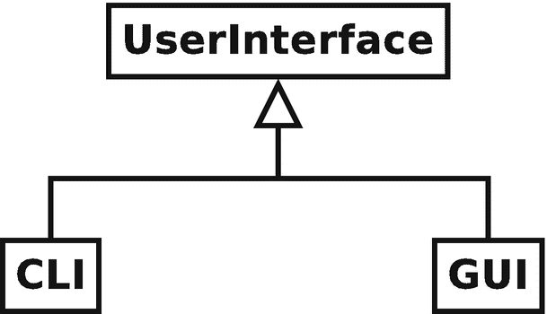
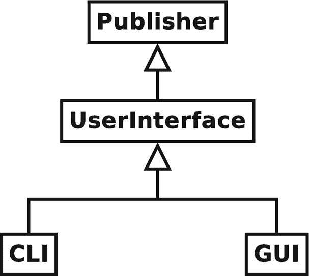

# 五、命令行界面

这是非常激动人心的一章。虽然命令行界面(CLI)可能不具备现代图形用户界面(GUI)的魅力，尤其是那些手机、平板电脑或 Web 界面，但 CLI 仍然是非常有用和有效的用户界面。本章详细介绍了 pdCalc 命令行界面的设计和实现。到本章结束时，我们将第一次拥有一个功能正常的计算器，尽管功能不完整，这是我们开发过程中的一个重要里程碑。

## 5.1 用户界面抽象

虽然我们可以单独设计一个功能完整的 CLI，但我们从需求中知道，功能完整的计算器必须同时具有 CLI 和 GUI。因此，通过首先考虑这两个接口之间的共性并将这种功能分解到一个公共抽象中，我们的整体设计将会得到更好的服务。让我们考虑构造用户界面抽象的两种设计方案:自顶向下的方法和自底向上的方法。

在考虑具体类型之前设计抽象接口类似于自顶向下的设计。就用户界面而言，你首先要考虑任何用户界面都必须符合的最基本的要素，并基于这个极简主义的概念创建一个抽象的界面。当抽象概念缺少实现具体类型所需的东西时，对接口的细化就变得必要了。在考虑具体类型之后设计抽象接口类似于自底向上的设计。同样，就用户界面而言，您首先要考虑所有具体类型的需求(在本例中是 CLI 和 GUI)，寻找所有类型之间的共性，然后将这些共性提取出来。当您添加一个新的具体类型，该类型需要最初提取抽象时没有考虑到的额外特性时，对接口的细化就变得必要了。

一般来说，自顶向下和自底向上哪种策略更适合创建抽象界面？通常，答案取决于具体的情况、个人舒适度和风格。在这个特定的场景中，我们更好地从抽象开始，向下工作到具体的类型(自顶向下的方法)。

为什么呢？在这种情况下，自顶向下的方法基本上是免费的。用户界面是 pdCalc 的高级模块之一，当我们执行初始分解时，我们已经在第 [2](2.html) 章中为 UI 模块定义了抽象接口。现在让我们把抽象的模块接口变成实际的面向对象的设计。

### 抽象接口

为用户界面提供一个抽象界面的目的是使程序的其余部分能够与用户界面进行交互，而不用考虑当前界面是图形界面、命令行界面还是其他什么界面。理想情况下，我们将能够将抽象接口分解为使用每个具体接口所需的最少数量的函数。任何共享实现的函数都可以在基类中定义，而任何需要基于具体类型的唯一实现的函数都可以在抽象基类中声明为虚拟的，并在派生类中定义。这个概念相当简单，但是，像往常一样，细节决定成败。



图 5-1

最小接口层次结构

考虑图 [5-1](#Fig1) 中描述的层级。我们的目标是为 pdCalc 的`UserInterface`类设计一个最小但完整的接口，与 Liskov 替换原则一致，该接口既适用于 CLI，也适用于 GUI。如前所述，我们已经在第 [2](2.html) 章中为这个 UI 定义了一个高级接口。让我们从这个预定义的接口开始，并根据需要进行重构。

参照表 [2-2](2.html#Tab2) ，我们看到`UserInterface`类的完整接口由两个事件处理函数`postMessage()`和`stackChanged()`以及一个`UserInterface`引发的事件`commandEntered()`组成。有趣的是，`UserInterface`类是发布者、观察者、抽象用户接口类，也是模块接口的主要组件。

两个事件处理函数`postMessage()`和`stackChanged()`在接口级是简单明了的。正如我们对以前的观察者所做的那样，我们将简单地将这两个函数添加到`UserInterface`类的公共接口中，并创建代理观察者类来代理发布者和实际观察者之间的通信。这些代理将在“用户界面观察者”一节中详细讨论。具体的用户界面必须根据单个用户界面与用户的交互方式，唯一地处理事件处理的实现。因此，`postMessage()`和`stackChanged()`必须都是纯虚拟的。因为在事件处理过程中不需要`UserInterface`类的介入，为了简单起见，我选择放弃 NVI 模式。然而，正如在第 [4](4.html) 章中所讨论的，我们可以使用 NVI 模式来处理琐碎的转发非虚拟接口功能。

类作为发布者的角色比作为观察者的角色稍微复杂一些。正如我们在第 [3](3.html) 章中看到的，在设计`Stack`类时，`Stack`实现了发布者接口，而不是作为发布者。因此我们得出结论，从`Publisher`类继承应该是私有的。对于`UserInterface`类，除了`UserInterface`类本身不是发布者之外，它与`Publisher`类的关系是相似的。`UserInterface`类是系统中用户界面的抽象接口，继承自`Publisher`类只是为了强调用户界面必须自己实现发布者接口的概念。CLI 和 GUI 类都需要从`Publisher`访问公共函数(例如，引发事件)。因此，在这种情况下，受保护的继承模式是合适的。

此外，回想一下第 [3](3.html) 章，为了让`Stack`类实现发布者接口，一旦我们使用私有继承，我们需要将`Publisher`类的`attach()`和`detach()`函数提升到`Stack`的公共接口中。使用受保护的继承也是如此。然而，问题是提升应该发生在`UserInterface`类中还是它的派生类中？要回答这个问题，我们需要知道 pdCalc 将如何使用特定的用户界面。显然，CLI 或 GUI *都是-a* `UserInterface`。因此，具体的用户界面将公开地从`UserInterface`继承，并被期望遵守 LSP。因此，将事件附加到特定用户界面或从特定用户界面分离事件必须能够在不知道底层 UI 类型的情况下完成。因此，`attach()`和`detach()`函数必须作为`UserInterface`公共接口的一部分可见。有趣的是，在 observer 模式的一个相当独特的实现中，发布者接口的一部分是在`UserInterface`级别实现的，而发布者接口的另一部分是在派生类级别实现的。

结合前面的所有要点，我们最终可以定义`UserInterface`类:

```cpp
export module pdCalc.userInterface;

export class UserInterface : protected Publisher
{
public:
  UserInterface();
  virtual ~UserInterface();

  virtual void postMessage(string_view m) = 0;
  virtual void stackChanged() = 0;

  using Publisher::attach;
  using Publisher::detach;

  static string CommandEntered();
};

```

`CommandEntered()`函数返回一个字符串，它是命令输入事件的名称。它是附加或分离该事件所必需的，可以被赋予任何对`UserInterface`类中的事件唯一的名称。

为了完整起见，我们在图 [5-2](#Fig2) 中展示了最终的用户界面层次。类图说明了 CLI、GUI、抽象的`UserInterface`类和发布者接口之间的关系。记住`UserInterface`类和`Publisher`类之间的继承是受保护的，所以`UserInterface`(或后续的派生类)不能用作`Publisher`。然而，如前所述，具体 CLI 和 GUI 类与抽象`UserInterface`类之间的继承意图是公共的，允许任一具体类型的实例化被替换为`UserInterface`。



图 5-2

用户界面层次结构

### 用户界面事件

定义`UserInterface`类并没有完成 UI 的接口。因为`UserInterface`类是一个事件发布者，我们还必须定义对应于`commandEntered()`事件的事件数据类。此外，定义`UserInterface`类最终完成了发布者/观察者对，因此我们最终准备好设计和实现事件代理类，以便在用户界面、命令调度器和栈之间代理事件。

在第 4 章[中，我们看到所有的命令都是通过事件传递给命令调度器的。具体来说，UI 引发一个包含编码为字符串参数的特定命令的事件，`CommandInterpreter`接收该事件，字符串参数被传递给`CommandFactory`，在那里检索具体的命令进行处理。就命令调度器而言，处理`commandEntered()`事件是一样的，不管编码的命令字符串是来自 CLI 还是 GUI。同样，当`Stack`类引发一个`stackChanged()`事件时，`Stack`对处理该事件的特定`UserInterface`无关紧要。因此，我们被鼓励在用户界面层次结构的`UserInterface`类级别上统一处理`commandEntered()`事件的发布和`stackChanged()`事件的处理。](4.html)

我们从检查引发`commandEntered()`事件的公共基础设施开始。在`UserInterface`类的构造器中为所有用户界面注册了`commandEntered()`事件。因此，任何派生的用户界面类都可以简单地通过调用由`Publisher`接口定义的`raise()`函数来引发这个事件，由于受保护的继承，它是任何具体 UI 实现的一部分。`raise()`函数的签名需要事件的名称和事件的数据。因为事件的名称是在`UserInterface`的构造器中预定义的，所以引发命令输入事件所需的唯一附加功能是处理事件数据的统一对象。现在让我们来看看它的设计。

#### 命令数据

在第 3 章[中，我们设计了我们的事件系统，使用推送语义来传递事件数据。回想一下，推送语义仅仅意味着发布者创建一个包含处理事件所需信息的对象，并在事件发生时将该对象推送给观察者。我们还研究了两种处理事件数据的技术。在多态技术中，事件数据对象必须公开地从抽象的`EventData`类继承。当事件被引发时，观察器通过抽象接口接收事件数据，并通过将事件数据向下转换到适当的派生类来检索数据。在类型擦除技术中，如果具体的观察者知道如何将数据`any_cast`为适当的类型，则事件数据不需要从公共基类派生。pdCalc 的实现使用类型擦除方法来实现事件。由于这两种技术都在第](3.html) [3](3.html) 章中进行了描述，下面只讨论 pdCalc 中实际使用的类型擦除技术。

对于命令输入的事件，事件数据通常是一个字符串，包含要输入到栈中的数字或要发出的命令的名称。虽然我们可以创建一个独特的`CommandEnteredData`类，在其构造器中接受这个字符串，但类型擦除方法实际上允许一个简单得多的解决方案:事件数据可以只是字符串本身。当事件被观察者捕获时，事件数据`d`由`any_cast<string>(d)`而不是`any_cast<CommandEnteredData>(d)`恢复。

对于`commandEntered()`事件数据的任何一种设计都不能被认为优于另一种——它们只是做出相反的权衡。使用一个`CommandEnteredData`类通过抽象提供了额外的类型特异性，代价是额外的代码和额外的函数调用来检索抽象的字符串。使用普通的`string`作为事件的数据简单、轻量、高效，但是缺乏类抽象所带来的清晰性。对于复杂的代码库，引入一个新的类来抽象事件数据可能是更好的选择。然而，由于我们已经在第 [3](3.html) 章中描述了类抽象事件数据策略，为了便于说明，`commandEntered()`事件的数据是使用普通的`string`实现的。

虽然 CLI 和 GUI 确定如何以及何时引发`commandEntered()`事件的机制有所不同，但两者都是通过最终调用`Publisher`的`raise()`函数来引发事件，其中的`string`对发出的特定命令进行编码。也就是说，对于一些命令字符串`cmd`，下面的代码在 CLI、GUI 或任何其他可能从`UserInterface`继承的用户界面中引发一个`commandEntered()`事件:

```cpp
raise(UserInterface::CommandEntered(), cmd);

```

现在我们可以引发 UI 事件了，让我们看看它们是如何被处理的。

#### 用户界面观察者

这一小节的目标是构建使类能够监听事件的机制。因为抽象用户界面既是事件的源，也是事件的接收器，所以 UI 是演示发布者和观察者如何相互交互的理想选择。

在第 3 章[中，我们看到观察者是注册并监听发布者发起的事件的类。到目前为止，我们已经遇到了都需要观察事件的`CommandInterpreter`和`UserInterface`类。虽然可以直接让`CommandInterpreter`或`UserInterface`成为观察者，但我更喜欢在发布者和需要观察事件的类之间构建一个专用的观察者中介。我经常含糊地把这个中介称为代理。我们现在准备给这个术语一个更具体的含义。](3.html)

代理模式[11]是一种设计模式，它使用一个类，代理，作为其他东西的接口。其他的东西，姑且称之为目标，并没有严格的定义。它可以是一个网络连接、一个文件、一个内存中的对象，或者就像我们的例子一样，只是另一个类。通常，当底层目标无法复制、不方便复制或复制成本很高时，会使用代理模式。代理模式使用一个类缓冲区来允许系统将目标视为一个独立于其底层组成的对象。在我们的上下文中，我们使用代理模式只是为了缓冲发布者和观察者之间的通信。

我们为什么要在这里为代理模式费心呢？这种策略有几个明显的优点。首先，它通过用描述性命名的事件处理函数替换一般命名的`notify()`函数，增加了目标类的公共接口的清晰度。其次，从`Observer`类中移除了一个不必要的继承。消除这种依赖性减少了耦合，增加了内聚力，并有助于在目标不是观察者的环境中重用目标。第三，使用代理类消除了需要监听多个事件的目标类所产生的模糊性。如果不使用代理类，观察者将需要在其单一的`notify()`函数中消除事件的歧义。为每个事件使用单独的代理使每个事件能够调用目标对象中唯一的处理函数。使用代理实现观察者模式的主要缺点是处理每个事件的额外间接成本很小。然而，在适合使用观察者模式的情况下，额外的间接成本可以忽略不计。

使用代理模式实现观察者模式导致了下面两个处理`commandEntered()`和`stackChanged()`事件的类:分别是`CommandIssuedObserver`和`StackUpdatedObserver`。`CommandIssuedObserver`在 UI 引发的`commandEntered()`事件和 command dispatcher 中的观察之间进行协调。`StackUpdatedObserver`在由栈引发的`stackChanged()`事件和 UI 中的观察之间起中介作用。这两个类的实现相对简单并且非常相似。举例来说，让我们检查一下`CommandIssuedObserver`的实现。

`CommandIssuedObserver`的声明如下所示:

```cpp
class CommandIssuedObserver : public Observer
{
public:
  explicit CommandIssuedObserver(CommandInterpreter& ci);

private:
  void notifyImpl(const any&) override;
  CommandInterpreter& ci_;
};

```

因为它在作为发布者的 UI 和作为观察者的目标的`CommandInterpreter`之间传递事件，所以`CommandIssuedObserver`的构造器引用一个`CommandInterpreter`实例，当 UI 引发一个`commandEntered()`事件时，它保留这个实例以回调命令调度器。回想一下，当观察者连接到事件时，`CommandIssuedObserver`将由 UI 存储在`Publisher`的事件符号表中。`notifyImpl()`的实现只是将函数的参数任意转换为`string`，然后调用`CommandInterpreter`的`commandEntered()`函数。

当然，在事件被触发之前，`CommandIssuedObserver`必须向 UI 注册。为了完整起见，以下代码说明了如何完成此任务:

```cpp
ui.attach( UserInterface::CommandEntered(),
  make_unique<CommandIssuedObserver>(ci) );

```

其中`ui`是一个`UserInterface`引用，`ci`是一个`CommandInterpreter`实例。注意，由于`attach()`函数被有意提升到抽象的`UserInterface`作用域中，通过引用附加允许我们对 CLI 和 GUI 重用同一个调用。也就是说，注册事件是通过抽象 UI 接口完成的，这大大简化了 pdCalc 的`main()`例程中的用户界面设置。`StackUpdatedObserver`的声明和注册是类似的。

观察者代理类的完整实现可以在`AppObservers.m.cpp`中找到。虽然观察者代理的使用与事件观察类交织在一起，但是代理不是目标类接口的一部分。

因此，它们包含在自己的文件中。在`main.cpp`中执行代理与事件的连接。这种代码结构保留了发布者和观察者之间的松散绑定。具体来说，发布者知道他们可以引发哪些事件，但不知道谁会观察它们，而观察者知道他们会观看哪些事件，但不知道谁会引发它们。发布者及其观察者外部的代码将两者绑定在一起。

## 5.2 具体的 CLI 类

本章的其余部分将专门详细介绍 CLI 具体类，它是用户界面模块的一个成员。让我们从重新检查 CLI 的要求开始。

### 要求

对 pdCalc 的要求表明计算器必须有一个命令行界面，但是准确地说，什么是 CLI 呢？我对命令行界面的定义是任何通过文本交互响应用户命令的程序用户界面。即使您对命令行界面的定义有些不同，我相信我们肯定会同意，仅仅简单地指出一个程序应该有一个 CLI 是远远不够的。

在产品开发的情况下，当你遇到一个太模糊的需求而不能设计一个组件时，你应该立即向你的客户寻求澄清。注意，我说的是当时*，而不是如果*时*。无论您在尝试细化需求之前付出了多少努力，您总是会有不完整的、不一致的或者变化的需求。这通常有几个原因。有时，这是由于有意识地努力不要在前期花费时间提炼需求。有时，这是由于缺乏经验的团队成员不理解如何正确地收集需求。然而，通常情况下，它只是因为最终用户不知道他们真正想要或需要什么，直到产品开始成型。我发现这是真的，即使对于我自己的客户的小开发项目也是如此！虽然作为实现者，您总是保留在没有客户参与的情况下提炼需求的权宜之计，但我的经验表明，这条道路总是导致重复重写代码:一次是为了您认为用户想要的，一次是为了用户认为他们想要的，一次是为了用户实际想要的。*

显然，对于我们的案例研究，我们只有一个假设的最终用户，所以我们将简单地自己进行细化。我们规定如下:

1.  CLI 应该接受为计算器定义的任何命令的文本命令(存在于命令工厂中的命令以及撤销、重做、帮助和退出命令)。

2.  help 命令应该显示所有可用命令的列表和简短的解释消息。

3.  CLI 应该按照处理命令的顺序接受空格分隔的命令。回想一下，这个顺序对应于反向波兰符号。按下 return 键后，将处理一行中的所有命令。

4.  处理完命令后，界面应该最多显示栈的前四个元素加上栈的当前大小。

令人惊讶的是，前面列出的最低要求足以构建一个简单的 CLI。虽然这些需求有些随意，但为了描述设计和实现，需要选择一些特定的东西。如果您不喜欢由此产生的 CLI，我强烈建议您指定自己的需求，并相应地修改设计和实现。

### CLI 设计

CLI 的设计非常简单。因为我们的总体架构设计将计算器的整个“业务逻辑”放在了后端，所以前端只是一个薄层，它只不过接受和标记来自用户的输入，将输入顺序传递给控制器，并显示结果。让我们从描述接口开始。

#### 界面

从本章前面的分析中，我们知道具体的 CLI 类将继承抽象的`UserInterface`类。这个继承是公共的，因为 CLI *是-a* `UserInterface`并且必须替换为一个。因此，CLI 必须实现`UserInterface`的两个抽象纯虚函数:`postMessage()`和`stackChanged()`。这两个方法只通过一个`UserInterface`引用进行多态调用；因此，这两种方法都成为 CLI 私有接口的一部分。除了构造和销毁，CLI 需要公开的唯一功能是启动其执行的命令。这个函数驱动整个 CLI，并且只在用户请求退出程序时返回(正常情况下)。结合上述内容，CLI 的整个界面可由以下内容给出:

```cpp
export module pdCalc.userInterface;

export class Cli : public UserInterface
{
public:
  Cli(istream& in, ostream& out);
  ~Cli();

  void execute(bool suppressStartupMessage = false, bool echo = false);

private:
  void postMessage(string_view m) override;
  void stackChanged() override;
};

```

虽然接口基本上是自解释的，但是构造器和`execute()`函数的参数都值得解释一下。为了满足前面描述的需求，可以编写不带参数的`execute()`函数。接口中包含的两个参数只是可以打开的可选特性。第一个参数指示 CLI 启动时是否显示横幅。第二个参数控制命令回显。如果`echo`被设置为`true`，那么在显示结果之前每个命令都会重复。这两个特性都可以在 CLI 中硬编码，但是为了增加灵活性，我选择将它们作为参数添加到`execute()`方法中。

构造器的参数比`execute()`命令的参数稍微不那么明显。根据定义，CLI 从`cin`获取输入，并将结果输出到`cout`或者`cerr`。然而，对这些标准 I/O 流进行硬编码会任意地将该类的使用限制在传统的 CLI 中。通常，我主张将功能限制在您真正需要的范围内，而不是预期更广泛的用途。然而，使用 C++ 流 I/O 是我的经验法则的少数例外之一。

让我们讨论一下为什么使用对基类 C++ I/O 流的引用通常是一个好的设计实践。首先，使用不同 I/O 模式的愿望很普遍。具体来说，重定向到文件或从文件重定向是经常请求对 CLI 进行的修改。事实上，我们会在第 [8](8.html) 章看到这个请求！第二，实现通用与专用接口实际上并没有增加复杂性。例如，不是直接写入`cout`，而是简单地保存对输出流的引用并写入。在基本情况下，这个引用简单地指向`cout`。最后，使用任意的流输入和输出大大简化了测试。虽然程序可以使用`cin`和`cout`实例化`Cli`类，但是测试可以使用文件流或字符串流实例化`Cli`类。以这种方式，可以使用字符串或文件来模拟交互式流输入和输出。这种策略简化了对`Cli`类的测试，因为输入可以很容易地传入，输出可以很容易地以字符串的形式捕获，而不是通过标准的输入和输出。

最后，请注意，`Cli`类被声明为`UserInterface.m.cpp`文件中`userInterface`模块的一部分，而它是在`Cli.m.cpp`文件中的分区`userInterface:Cli`中定义的。由于在`UserInterface.m.cpp`和`Cli.m.cpp`之间会产生一个循环参考，所以需要这种有点奇怪的结构。另一种选择是简单地在`userInterface`模块中定义`Cli`类，而不是一个分区，很可能将`Cli.m.cpp`重命名为`UserInterface.cpp`。这个实现细节与 pdCalc 的设计没有任何关系——它只是对文件组织的好奇。

#### 实施

`Cli`类的实现值得研究，以观察 pdCalc 设计的模块化所带来的简单性。`Cli`类的整个实现有效地包含在`execute()`和`postMessage()`成员函数中。`execute()`函数驱动命令行界面。它向最终用户显示启动消息，等待输入命令，标记这些命令，并引发事件以通知命令调度器输入了新命令。`stackChanged()`函数是一个观察者代理回调目标，它在`stackChanged()`事件引发后将栈的顶部写入命令行。本质上，CLI 简化为两个 I/O 例程，其中`execute()`处理输入，`stackChanged()`处理输出。让我们从`execute()`函数开始，看看这两个函数的实现:

```cpp
void Cli::execute(bool suppressStartupMessage, bool echo)
{
  if(!suppressStartupMessage) startupMessage();

  for(string line; std::getline(in_, line, '\n'); )
  {
    istringstream iss{line};
    // Tokenizer must be one of LazyTokenizer or GreedyTokenizer.
    // See discussion below.
    Tokenizer tokenizer{iss};
    for(auto i : tokenizer)
    {
      if(echo) out_ << i << endl;
      if(i == "exit" || i == "quit")
        return;
      else
        raise(UserInterface::CommandEntered(), i);
    }
  }

  return;
}

```

CLI 的主要算法相当简单。首先，CLI 等待用户输入一行。其次，这个输入行被`Tokenizer`类标记化。然后，CLI 对输入行中的每个令牌进行循环，并以令牌字符串作为事件数据引发事件。CLI 在遇到`quit`或`exit`令牌时终止。

之前没有解释的`execute()`函数的唯一部分是`Tokenizer`类。简单地说，`Tokenizer`类负责获取一个文本字符串，并将这个字符串拆分成单独的空格分隔的标记。CLI 和`Tokenizer`都不能确定令牌的有效性。令牌只是作为事件引发，供命令调度器模块处理。注意，作为编写自己代码的替代方法，许多库(例如 boost)都提供了简单的记号赋予器。

记号化算法相对简单；我们马上会看到两个独立的实现。然而，首先，为什么要为`Tokenizer`选择一个类设计，而不是，比方说，选择一个使用返回`string` s 的`vector`的函数的设计？实际上，两种设计在功能上都是可行的，并且两种设计都同样易于测试和维护。然而，我更喜欢类设计，因为它为`Tokenizer`提供了一个独特的类型。让我们来看看为标记化创建不同类型的优势。

假设我们想在函数`foo()`中对输入进行令牌化，但在单独的函数`bar()`中处理令牌。考虑以下两对可能的函数来实现这一目标:

```cpp
// use a Tokenizer class
Tokenizer foo(string_view);
void bar(const Tokenizer&);

// use a vector of strings
vector<string> foo(string_view);
void bar(const vector<string>&);

```

首先，使用一个`Tokenizer`类，`foo()`和`bar()`的签名立即通知程序员函数的意图。我们知道这些函数涉及到标记化。使用`string` s 的`vector`会产生歧义，不需要更多的文档(我故意没有为参数提供名称)。然而，更重要的是，键入标记器使编译器能够确保只能使用`Tokenizer`类作为参数调用`bar()`，从而防止程序员意外地使用不相关的`string`集合调用`bar()`，类设计的另一个好处是`Tokenizer`类封装了表示标记集合的数据结构。这种封装保护了与`bar()`的接口，使其不必决定将底层数据结构从`string`的`vector`更改为`string`的`list`(或者，一个生成器，我们很快就会看到)。最后，如果需要的话，`Tokenizer`类可以封装关于标记化的附加状态信息(例如，原始的、预标记的输入)。一个`string`的集合显然仅限于携带令牌本身。

我们现在转向`Tokenizer`类的实现。我选择呈现两个独立的实现:贪婪标记化和懒惰标记化。第一种方法，贪婪标记化，是我在本书第一版中采用的方法。第二种方法，惰性标记化，只是随着 C++20 中协程的引入才变得微不足道。

为了演示这两种算法的可交换性，我在一个相同的概念接口后面实现了这两种算法。但是，因为这两个类不打算以多种形式使用，所以接口不是通过继承实现的。让我们检查一下这个假设的接口:

```cpp
class TokenizerInterface
{
public:
  explicit TokenizerInterface(istream&);
  ~TokenizerInterface();

  size_t nTokens() const;

  // not a "real" interface class - just using auto conceptually
  auto begin();
  auto end();
};

```

记号赋予器可以从输入流中构造，它可以声明已经解析了多少个记号，并且可以返回一个迭代器到记号流的开始和结尾。当然，还可以添加更多的功能，但是这些成员函数构成了在 pdCalc 中解析标记所需的最小集合。现在让我们来看看各个实现。

是什么让一个符号化算法变得贪婪，又是什么让一个人变得懒惰？两种实现都在构造器中初始化标记化。但是，贪婪算法会立即解析流中的所有令牌，并将它们存储在一个容器中以备将来使用。`TokenizerInterface`中的迭代器接口只是将请求转发给底层容器，例如`GreedyTokenizer`中的`vector<string>`。当用户迭代令牌时，不会发生令牌化；符号化在构造过程中已经贪婪地发生了。下面是贪婪标记化算法的一个简单实现(它也将所有条目弹出为小写):

```cpp
void GreedyTokenizer::tokenize(istream& is)
{
  for(istream_iterator<string> i{is}; i != istream_iterator<string>{};
  ++i)
  {
    string t;
    ranges::transform(*i, back_inserter<string>(t), ::tolower);
    tokens_.push_back( std::move(t) );
  }

  return;
}

```

相比之下，我们来看看懒惰标记化算法。惰性令牌化只在请求下一个令牌时解析每个令牌。C++20 协程使这种懒惰算法变得简单可行，这将在侧栏中讨论。然而，首先让我们检查一下`LazyTokenizer`的实现:

```cpp
cppcoro::generator<string> LazyTokenizer::tokenize(std::istream& is)
{
  for(istream_iterator<string> i{is}; i != istream_iterator<string>{};
  ++i)
  {
    string t;
    ranges::transform(*i, back_inserter<string>(t), ::tolower);
    ++nTokens_;
    co_yield t;
  }

  co_return;
}

Listing 5-1Lazy tokenizer

```

贪婪和懒惰实现之间存在两个差异。首先，简单地说，惰性例程需要计算和存储被解析的标记(`nTokens_`)的数量。对于贪婪算法来说，这一步是不必要的，因为它将所有的令牌保存在一个`vector`中，而这个 T1 知道自己的大小。第二个区别是，惰性算法使用了`co_yield`操作符，并返回一个生成器(cppcoro 库[7]的一部分)，这将在侧栏中详细讨论。实际上，`co_yield`操作符向编译器发出信号，表明这个函数是一个协程，它可以被抢占，然后在它产生的地方重新启动，在这种情况下，恢复 for 循环来解析下一个令牌。`co_yield`允许返回值，在本例中，是我们的延迟求值的令牌。

应该注意的是，虽然这两个记号赋予器有相同的接口，但是它们的行为略有不同。首先，贪婪的令牌化器解析流一次，但是令牌可以根据需要迭代多次。`nTokens()`函数总是返回流中令牌的总数，因为在调用`nTokens()`之前流已经被完全解析。相比之下，惰性标记化器只能迭代一次，因为迭代会导致标记化。因此，`nTokens()`函数返回到那时为止解析的令牌数，这个数可能小于输入流中的令牌总数。当然，如果需要在`LazyTokenizer`上进行多次迭代，令牌可以总是存储在一个容器中，因为流是被延迟解析的。一旦解析完成，这两个记号赋予器将表现相同。

贪婪标记器和懒惰标记器的实现都在`Tokenizer.m.cpp`源文件中提供。默认情况下，pdCalc 被配置为只使用惰性标记器。然而，这两个记号赋予器是完全可以互换的。如果您希望尝试贪婪的记号赋予器，只需更改在`CLI`的`execute()`函数中实例化的记号赋予器。显然，两个标记化器之间的切换可以通过静态多态性在编译时进行配置。

Modern C++ Design Note: Coroutines and Generators

协程是一个古老的概念，最终在 C++20 中成为标准。在我看来，就可用性而言，协程是一个混合体。如果您不需要编写用于管理协程生命周期的支持代码，那么编写协程本身相当简单。具体来说，相对于列出 [5-1](#PC10) ，实现`tokenize()`容易，实现`generator<>`难。

不幸的是，C++20 标准(可能是 C++23)没有采用一个用于协同程序使用的公共库。).然而，幸运的是，高质量的 cppcoro 协程库已经存在[7]，您可以放心地知道，它的作者已经为您实现了使用协程的困难部分。在我最初实现清单 [5-1](#PC10) 时，我编写了自己的生成器类。我的实现不是通用的，也很粗糙，但是它确实像预期的那样工作。然而，理解实现对理解 pdCalc 的设计没有指导意义。最终，我认为描述协程的详细实现超出了本书的范围。而是决定直接用 cppcoro 的生成器类。许可的 MIT`generator.hpp`包含在 pdCalc 中，位于`3rdparty/cppcoro`中。那些有兴趣了解协程细节的读者可以参考 cppcoro 的创建者刘易斯·贝克的精彩博文。相反，我们的讨论将集中于更高层次的设计目标，即概念上的协程是什么，以及我们如何能够使用它们来改进 pdCalc 的设计。

协程是子程序的推广，它允许通过程序从内部放弃执行来暂停控制。协程保持它们的状态，并且以后可以从它们放弃控制的点恢复。实际上，协程提供了一种语言机制来支持协作式多任务处理(相对于线程的抢占式多任务处理)。

协程支持的类型之一是生成器。生成器是在迭代时生成序列的对象。当数列是无穷大时，它们特别有用。生成器的规范实现似乎是斐波那契数的生成。斐波那契数列， *F* <sub>*n*</sub> ，由以下递归定义:

*F* <sub>0</sub> = 0 *，F* <sub>1</sub> = 1 *，F*<sub>*n*</sub>=*F*<sub>*n*1</sub>+*F*<sub>*n*2</sub>*，n >* 1

在不使用协程的情况下，可以用下面的函数很容易地生成第 *n* 个序列:

```cpp
auto fibLoop(unsigned int n)
{
  vector<long long> v(n+1);
  v[0] = 0;

  if(n > 0) v[1] = 1;

  for(auto i = 2u; i < v.size(); ++i)
    v[i] = v[i-1] + v[i-2];

  return v;
}

```

不幸的是，我们必须对所有数字进行贪婪的评估，直到第 *n* 个数字。`fibLoop()`不允许通过重复调用函数来对斐波那契数列进行缓慢的顺序计算。

让我们试着创建一个函数，它可以在每次被调用时生成斐波纳契数列中的下一个数字。下面的代码是我们的第一次尝试:

```cpp
long long fibStatic()
{
  static long long cur = 0;
  static long long prev = 1;

  auto t = cur;
  cur += prev;
  prev = t;

  return prev;
}

```

只要我们只想在单线程环境中每次程序执行时生成一次斐波那契数列，代码就能工作。为了解决代码只能被调用一次的问题，我们可以添加一个重置标志作为参数。然而，现在我们只是添加了黑客，我们仍然没有解决无法在多线程环境中运行的问题。让我们再试一次。

我们的下一个尝试是一个相当复杂的解决方案，包括一个 Fibonacci 类和一个迭代器:

```cpp
class Fibonacci
{
  class fibonacci_iterator
  {
  public:
    using iterator_category = std::input_iterator_tag;
    using difference_type = std::ptrdiff_t;
    using value_type = long long;
    using reference = long long&;
    using pointer = long long*;

    fibonacci_iterator(){}
    fibonacci_iterator(Fibonacci* f): f_{f}{}

    long long operator*() const { return f_->cur_; }
    fibonacci_iterator& operator++(){f_->next(); return *this;}
    void operator++(int){ operator++(); }

    auto operator<=>(const fibonacci_iterator&) const = default;

  private:
    Fibonacci* f_ = nullptr;
  };
public:

  using iterator = fibonacci_iterator;

  iterator begin() { return fibonacci_iterator{this}; }
  iterator end() { return fibonacci_iterator{}; }

private:
  void next()
  {
    long long t = cur_;
    cur_ += prev_;
    prev_ = t;
  }

  long long cur_ = 0l;
  long long prev_ = 1l;
};

```

哎哟！前面的代码是草率的、不完整的，执行看似简单的任务真的很糟糕。然而，利用范围库(见下一个边栏)，它确实使我们能够以一种非常简洁的方式生成和使用斐波那契数:

```cpp
Fibonacci fib;

// grab the first 10 Fibonacci numbers and use them one at a time
ranges::for_each(fib | views::take(10), [](auto fn){useFib(fn);});

```

如果您不熟悉前面的语法，尤其是将范围传递给视图的函数式风格，不要担心。ranges 库是 C++20 的另一个新特性，我将在下一个边栏中简要介绍它。

简单的事情应该很容易，这就是协程和生成器的亮点。如果我们能提供`fibLoop()`的简单性、`fibStatic()`的一个接一个的语义，以及`Fibonacci`类的可表达性和安全性，那会怎么样。如果有一种语言机制，允许我们编写一个可以被中断和恢复的函数，并在每次函数暂停时产生一个值，那么这将是可能的。当然，这个特性正是协程所提供的。我们现在可以简单地写

```cpp
cppcoro::generator<long long> fibonacci()
{
  long long prev = 1;
  long long cur = 0;
  while(true)
  {
    co_yield cur;
    long long t = cur;
    cur += prev;
    prev = t;
  }
}

```

前面的协程是一个无限但可中断的循环。`co_yield`表达式使协程暂停并产生当前的斐波那契数。cppcoro 的`generator`类将暂停和恢复`fibonacci()`的复杂机制隐藏在简单易用的迭代器接口后面。当生成器迭代器被解引用时，返回当前斐波那契数的值。当向前迭代器前进时，`fibonacci()`被恢复，继续无限循环，直到再次遇到`co_yield`。通过这种方式，我们可以以有限的方式使用和访问无限循环，这为计算有限但不是预定深度的斐波那契数提供了一个非常简洁的实现。如前所述，协程可以简单地使用:

```cpp
auto fib = fibonacci();

// grab the first 10 Fibonacci numbers and use them one at a time
ranges::for_each(fib | views::take(10), [](auto fn){useFib(fn);});

```

在这一点上，希望列出 [5-1](#PC10) 是有意义的。我们的惰性令牌化器只是一个字符串令牌生成器，它通过循环流、提取每个空格分隔的字符串并暂停执行直到请求下一个令牌来生成。这是一个漂亮的设计，通过新的 C++20 语言特性变得很容易。

在离开这个侧栏之前，我想分享一个我从惨痛的教训中学到的快速技巧:仔细观察通过引用传递给协程的任何值的生命周期。事实上，我甚至认为应该避免通过引用协程来传递值。考虑我第一次为`LazyTokenizer`编写字符串构造器的失败尝试:

```cpp
LazyTokenizer::LazyTokenizer(const std::string& s)
: nTokens_{0}
{
  istringstream t{s};
  generator_ = tokenize(t);
}

```

前面看似正确的代码将会编译，但是标记器在使用时会导致分段错误。原因是虽然`tokenize()`函数看起来是一个简单返回的常规函数调用，但它不是。`tokenize()`是一个可恢复的协程，通过其返回的生成器来访问，在这种情况下，生成器存储在`generator_`中。这里，`generator_`，一个成员变量，比局部变量`t`有更长的生存期。当第一次调用`tokenize()`时，一切正常。发电机已初始化并处于就绪状态。然而，由于`tokenize()`通过引用捕获它的流参数，当协程通过迭代`generator_`前进时，`t`已经超出范围并被销毁。在`tokenize()`内部，我们被留下来推进一个`istream_iterator<string>`，它正在迭代一个被销毁的`istringstream`。显然，这段代码会失败。一旦你推理出这个失败，它就完全有意义了。然而，对我来说，我第一次遇到这个错误时并不明显，因为我的经验已经训练我将`tokenize()`解释为一个单通函数，它只在控制权返回给调用者之前存在。当然，协程调用语义是不同的，因为协程在销毁之前一直存在。将控制权返回给调用者不会破坏协程内部的本地上下文，其中可能包含对函数参数的引用。相反，该状态被存储以供以后恢复。此后超出范围的任何被引用对象都变得无效。程序员当心。

作为 CLI 实现的最后一部分，我们研究一个简化版本的`stackChanged()`函数:

```cpp
void Cli::stackChanged()
{
  unsigned int nElements{4};
  auto v = Stack::Instance().getElements(nElements);
  string s{"\n"};
  auto bi = std::back_inserter(s);

  for( auto j = v.size(); auto i : views::reverse(v) )
    std::format_to(bi, "{}:\t{:.12g}\n", j--, i);

  postMessage(s);
}

```

`Cli.m.cpp`中的实现仅在印刷的花哨程度上有所不同。注意，每当栈改变时，CLI 简单地挑选栈的前四个(如我们的需求中所指定的)条目(`getElements()`返回`nElements`和栈大小的最小值)，在`string`中格式化它们，并将该字符串传递给`postMessage()`函数。对于 CLI，`postMessage()`只是将字符串写入输出流。

在我们继续之前，让我们停下来思考一下 CLI 的实现有多简洁明了。这种简单性是 pdCalc 整体设计的直接结果。尽管许多用户界面将“业务逻辑”与显示代码混杂在一起，但我们精心设计了这两个独立的层。命令的解释和处理，即“业务逻辑”，完全驻留在命令调度器中。因此，CLI 只负责接受命令、标记命令和报告结果。此外，基于我们的事件系统的设计，CLI 没有直接耦合到命令调度器，这与我们的 MVC 架构是一致的。命令调度器确实有到用户界面的直接链接，但是由于我们的抽象，命令调度器绑定到一个抽象的`UserInterface`而不是一个具体的用户界面实现。通过这种方式，`Cli`完美地替代了`UserInterface`(LSP 的应用)，并且可以作为计算器的许多独特视图中的任何一个来轻松地换入或换出。虽然对于计算器的设计来说，这种灵活性似乎有些过头了，但是从测试和关注点分离的角度来看，所有组件的模块化都是有益的，即使计算器没有设计另一个用户界面。

Modern C++ Design Note: The Ranges Library

ranges 库是 C++20 的四大特性之一，一个简单的侧边栏并不能代表这个库。然而，我们将绕一个很快的弯路来得到一个粗略的介绍。

范围库引入了三个主要的新构造:范围概念、范围算法和视图。忽略用 C++ 概念实现范围的详细 C++ 机制，从逻辑上讲，范围是一个由开始和结束划分的可迭代集合。虽然你可以选择实现自己的范围，但从 C++20 开始，STL 容器就是范围，所以每个人都可以直接访问范围。

很好，`vector` s 是范围，那么现在怎么办？您将从范围中看到的第一个直接好处是它们所伴随的算法的语法得到了改进。假设您需要对`string` s、`v`中的`vector`进行排序(我们假设使用默认的排序标准)。在 ranges 之前，使用标准库，您将编写以下代码:

```cpp
std::sort( begin(v), end(v) );

```

前面的语法并不可怕，但是假设我们想要对整个`vector`进行排序，为什么我们不能只调用`sort(v)`？现在你可以了。因为`vector`是一个范围，我们可以称之为基于范围的等价算法:

```cpp
std::ranges::sort(v);

```

那就干净多了。如果不是全部的话，大多数标准算法现在都有基于范围的等价算法。

如果基于范围的算法语法是我们从 ranges 库中得到的全部，我会感到很无趣。然而，我们得到的要多得多，因为范围是有视图的。不严格地说，视图是一个延迟求值的范围适配器。让我们考虑一个例子。假设您有一个由 20 个整数组成的`vector`、`v`，并且想要存储您在`vector`、`t`中遇到的最后五个偶数的平方(是的，这是一个不可否认的人为例子)。下面一行可执行代码将完成这一壮举:

```cpp
// note, code assumes
// namespace ranges = std::ranges;
// namespace views = std::ranges::views;
ranges::copy( v | views::filter([](int i){return i % 2 == 0;})
                | views::reverse
                | views::take(5)
                | views::transform([](int i){return i * i;})
                , back_inserter(t) );

```

在前面显示的一行代码中发生了三件重要的事情。首先，也是最明显的，所有的视图都被链接在一起。其次，视图的链接使我们能够在一个循环中通过`v`执行所有这些操作。第三，因为视图是延迟评估的，所以只采取必要的操作。例如，我们不反转所有的`v`，只反转偶数。此外，我们没有平方所有的偶数，只有最后五个(或者更少，如果在`v`中偶数少于五个)。

虽然前面的代码既紧凑又高效，但我愿意承认它可能不是最易读的。当然，视图`reverse`和`take`清楚地陈述了它们在做什么，但是理解`filter`和`transform`做什么也需要理解它们嵌入的 lambda 表达式。幸运的是，我们可以将视图存储在变量中，并按如下方式应用它们:

```cpp
auto takeEven = views::filter([](int i){ return i % 2 == 0; });
auto square = views::transform([](int i){return i * i;});

ranges::copy(v | takeEven | views::reverse | views::take(5) | square, back_inserter(t));

```

这就更清楚了。从现有视图中轻松创建新的命名视图的能力既增加了可读性，又支持可重用性。

我将以我开始时的方式结束这个侧边栏，声明这个小侧边栏绝不公正。然而，如果这篇边栏激起了你的兴趣，我鼓励你去读读 Eric Niebler 的文章《介绍 Range[26]和 Range-v3 用户手册[25]。Eric Niebler 的 Range-v3 库构成了构建 C++ 标准范围库的基础。

## 5.3 将它结合在一起:一个工作程序

在我们结束关于 CLI 的章节之前，有必要编写一个简单的主程序，将所有组件连接在一起，演示一个可以工作的计算器。pdCalc 在`main.cpp`中的实际实现要复杂得多，因为它处理多个用户界面和插件。最终，我们将逐步理解`main.cpp`中的完整实现，但是现在，下面的代码将使我们能够使用命令行界面执行一个有效的计算器(当然，包括适当的头文件和模块导入):

```cpp
int main()
{
  Cli cli{std::cin, std::cout};

  CommandInterpreter ci{cli};

  RegisterCoreCommands(cli);

  cli.attach(UserInterface::CommandEntered(),   make_unique<CommandIssuedObserver>(ci) );

  Stack::Instance().attach(Stack::StackChanged(),   make_unique<StackUpdatedObserver>(cli) );

  cli.execute();

  return 0;
}

```

由于设计的模块化，整个计算器只需六个可执行语句就可以设置、组装和执行！`main()`函数中的逻辑很容易理解。从维护的角度来看，任何项目的新程序员都可以很容易地跟踪计算器的逻辑，并看到每个模块的功能都被清晰地划分为不同的抽象。正如我们将在以后的章节中看到的，随着更多模块的加入，抽象变得更加强大。

为了让您快速入门，在构建可执行文件`pdCalc-simple-cli`的存储库源代码中包含了一个项目，使用前面的`main()`函数作为应用程序的驱动程序。该可执行文件是一个独立的 CLI，包括本书到目前为止讨论的所有功能。

在下一章，我们将考虑计算器的图形用户界面的设计。一旦 GUI 完成，许多用户会很快认为 CLI 只是一个练习或以前时代的遗物。在此之前，我想鼓励读者不要这么快就对这个不起眼的 CLI 做出判断。CLI 是非常高效的界面，通常更容易为需要大型部署或自动化的任务编写脚本。至于 pdCalc，就个人而言，我更喜欢 CLI 而不是 GUI，因为它易于使用。当然，也许这只是表明我也是上一个时代的遗物。