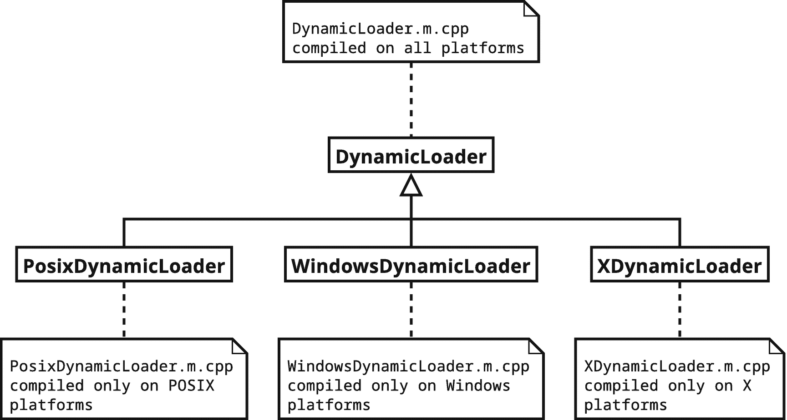
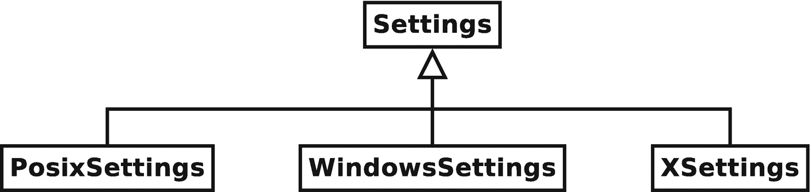
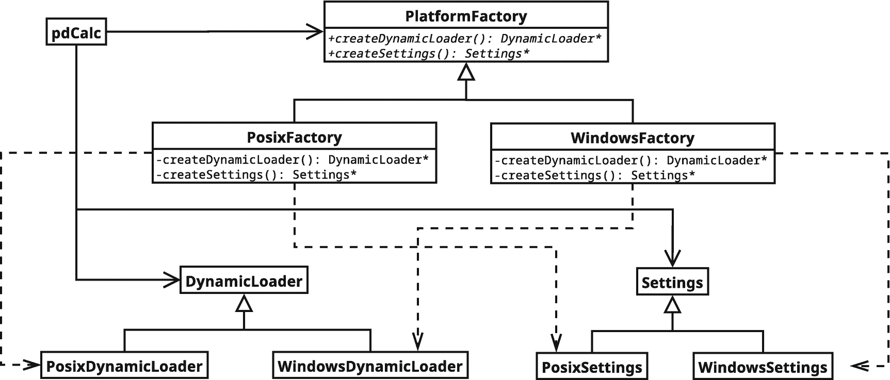

# 7.插件

你可能已经读过这一章的标题，所以你已经知道这一章是关于插件的，特别是它们的设计和实现。此外，插件将为我们提供探索设计技术的机会，以隔离平台特定的功能。然而，在我们深入细节之前，让我们先来定义什么是插件。

## 7.1 什么是插件？

插件是一种软件组件，在程序初次编译后，它可以将新功能添加到程序中。在这一章中，我们将专门关注运行时插件，即作为共享库构建的插件(例如，POSIX。所以还是 Windows。dll 文件)，它们在运行时是可发现和可加载的。

插件在应用程序中有用的原因有很多。这里只是几个例子。首先，插件对于允许最终用户在不需要重新编译的情况下向现有程序添加特性是有用的。通常，这些新特性是最初的应用程序开发人员完全没有预料到的。第二，从架构上来说，插件可以将一个程序分成多个可选的部分，这些部分可以单独与程序一起发布。例如，考虑一个程序(例如 web 浏览器)，它附带一些基本功能，但允许用户添加专业功能(例如广告拦截器)。第三，插件可以用于设计一个可以为特定客户定制的应用程序。例如，考虑一个电子健康记录系统，它需要不同的功能，这取决于软件是部署在医院还是医生的个人诊所。插入核心系统的不同模块可以捕获必要的定制。当然，人们可以为插件想出许多额外的应用。

在 pdCalc 的上下文中，插件是提供新的计算器命令和可选的新 GUI 按钮的共享库。这项任务会有多难？在第 4 章[中，我们创建了许多命令，并看到添加新的命令是相当简单的。我们简单地继承了`Command`类(或它的一个派生类，如`UnaryCommand`或`BinaryCommand`)，实例化了命令，并用`CommandFactory`注册了它。例如，以正弦命令为例，该命令在`CoreCommands.m.cpp`中声明如下:](4.html)

```cpp
class Sine : public UnaryCommand
{
  // implement Command virtual members
};

```

并由线路登记在`CommandFactory.m.cpp`

```cpp
cf.registerCommand( "sin", MakeCommandPtr<Sine>() );

```

其中`cf`是一个`CommandFactory`参考。事实证明，除了一个关键步骤之外，插件命令几乎完全可以遵循这个配方。由于 pdCalc 在编译时不知道插件命令的类名，所以我们不能使用插件类名进行分配。

不知道插件命令的类名这个看似简单的困境导致了我们需要为插件解决的第一个问题。具体来说，我们需要建立一个抽象接口，通过它插件命令可以被发现并在 pdCalc 中注册。一旦我们就插件接口达成一致，我们将很快遇到第二个基本的插件问题，那就是如何动态加载一个插件，甚至使共享库中的名称对 pdCalc 可用。让我们的生活变得更复杂的是，第二个问题的解决方案依赖于平台，所以我们将寻求一种设计策略来最小化平台依赖性的痛苦。我们将遇到的最后一个问题是更新我们现有的代码来动态添加新的命令和按钮。也许令人惊讶的是，这最后一个问题是最容易解决的。然而，在我们开始解决这三个问题之前，我们需要考虑一些 C++ 插件的规则。

### 7 . 1 . 1 c++ 插件的规则

插件在概念上不是 C++ 语言的一部分。更确切地说，插件是操作系统如何动态加载和链接共享库的一种表现形式(因此插件具有平台特定的性质)。对于任何规模不小的项目，应用程序通常分为一个可执行文件和几个共享库(传统上。所以 Unix 中的文件。麦克 OS X 的 dylib 文件。MS Windows 中的 dll 文件)。

通常，作为 C++ 程序员，我们很高兴地没有意识到这种结构的微妙之处，因为可执行文件和库是在同构的构建环境中构建的(即，相同的编译器和标准库)。然而，对于一个实用的插件接口，我们没有这样的保证。相反，我们必须防御性地编程，并假设最坏的情况，即插件构建在与主应用程序不同但兼容的环境中。这里，我们将做一个相对较弱的假设，即这两个环境至少共享相同的对象模型。具体来说，我们要求两个环境使用相同的布局来处理虚函数指针(`vptr`)。如果你不熟悉虚函数指针的概念，所有血淋淋的细节都可以在[18]中找到。虽然原则上，C++ 编译器作者可以选择不同的`vptr`布局，但实际上，编译器通常使用兼容的布局，尤其是同一编译器的不同版本。如果没有这个共享对象模型的假设，我们将被迫开发一个 C 语言的`–`纯插件结构。注意，我们还必须假设`sizeof(T)`对于主应用程序和插件中的所有类型`T`都是相同的大小。例如，这消除了 32 位应用程序和 64 位插件，因为这两个平台具有不同的指针大小。

异构环境中的编程如何影响我们可以使用的编程技术？在最坏的情况下，主应用程序可能是用不同的编译器和不同的标准库构建的。这一事实有几个严重的影响。首先，我们不能假设插件和应用程序之间的内存分配和释放是兼容的。这意味着在一个插件中的任何内存必须在同一个插件中。其次，我们不能假设来自标准库的代码在任何插件和主应用程序之间都是兼容的。因此，我们的插件接口不能包含任何标准容器。虽然标准库的不兼容性看起来很奇怪(这是标准的*库，对吗？)，记住标准指定的是接口，而不是实现(受一些限制，比如`vector` s 占用连续内存)。例如，不同的标准库实现经常有不同的`string`实现。一些人喜欢小字符串优化，而另一些人喜欢使用写时复制。第三，虽然我们已经为对象中的`vptr`假设了一个兼容的布局，但是我们不能假设完全相同的对齐。因此，如果主应用程序中使用了基类中定义的成员变量，插件类就不应该从主应用程序类继承。这是因为如果每个编译器使用不同的对齐方式，主应用程序的编译器可能会对成员变量使用不同于插件编译器定义的内存偏移量。第四，由于不同编译器之间的名称混淆差异，导出的接口必须指定`extern "C"`链接。链接要求是双向的。插件不应调用没有`extern "C"`链接的应用程序函数，应用程序也不应调用没有`extern "C"`链接的插件函数。请注意，因为非非线性、非虚拟成员函数需要跨编译单元的链接(与虚函数相反，虚函数是通过虚函数表中的偏移量通过`vptr`调用的)，所以应用程序应该只通过虚函数调用插件代码，插件代码不应该调用在主应用程序中编译的基类非非线性、非虚拟函数。第五，异常很少能在主程序和插件之间的二进制接口上移植，所以我们不能在插件中抛出异常并试图在主应用程序中捕捉它们。最后，C++20 模块可以跨插件边界移植，但是它们的编译模块接口(CMI)却不能。插件所需的由 C++20 模块封装的任何主要应用程序代码必须向该插件提供其模块接口文件。这本质上与给插件提供一个头文件没有什么不同，除了，根据构建系统，模块接口文件可能需要单独编译或预编译，而不是简单地包含。*

那是一口。让我们通过列举 C++ 插件的规则来回顾一下:

1.  在一个插件中分配的内存必须在同一个插件中释放。

2.  标准库组件不能在插件接口中使用。

3.  假设不兼容对齐。如果主应用程序中使用了成员变量，避免插件从主应用程序类继承。

4.  从插件导出的函数(将由主应用程序调用)必须指定`extern "C"`链接。从主应用程序导出的函数(将被插件调用)必须指定`extern "C"`链接。

5.  主应用程序应该只通过虚函数与插件派生类通信。插件派生类不应该调用非非线性、非虚拟的主应用程序基类函数。

6.  不要让插件中抛出的异常传播到主应用程序。

7.  模块 CMI 不是可分发的工件；分发模块接口文件。

记住这些规则，让我们回到设计插件必须解决的三个基本问题。

## 7.2 问题 1:插件接口

插件接口负责几个项目。首先，它必须能够发现新的命令和新的 GUI 按钮。我们将看到，通过类接口可以最有效地实现这一功能。第二，插件必须支持一个 C 链接接口来分配和释放前面提到的插件类。第三，pdCalc 应该提供一个从`Command`派生的`PluginCommand`类来帮助正确编写插件命令。从技术上讲，`PluginCommand`类是可选的，但是提供这样一个接口有助于用户遵守插件规则第三和第六条。第四，值得插件接口提供查询一个插件支持的 API 版本的功能。最后，pdCalc 必须为插件调用的任何函数提供 C 链接。具体来说，插件命令必须能够访问堆栈。我们将从发现命令的界面开始依次解决这些问题。

### 7.2.1 发现命令的界面

我们面临的第一个问题是如何从插件中分配命令，我们既不知道插件提供什么命令，也不知道我们需要实例化的类的名称。我们将通过创建一个抽象接口来解决这个问题，所有插件都必须遵循这个接口来导出命令及其名称。首先，让我们解决我们将需要什么功能。

回想一下第 [4](4.html) 章，为了将新命令加载到计算器中，我们必须用`CommandFactory`注册它。按照设计，`CommandFactory`是专门为允许命令的动态分配而构建的，这正是我们插件命令所需要的功能。现在，我们假设插件管理系统可以访问 register 命令(我们将在 7.4 节解决这个缺陷)。`CommandFactory`的注册功能需要一个`string`命令名和一个`unique_ptr`作为命令的原型。由于 pdCalc 对插件中的命令名一无所知，插件接口必须首先使名称可被发现。第二，由于 C++ 缺乏反射这一语言特性，插件接口必须提供一种方法来创建一个与每个发现的名字相关联的原型命令。同样，通过设计，抽象的`Command`接口通过`clone()`虚拟成员函数支持原型模式。让我们看看这两个先前的设计决策是如何有效地启用插件的。

基于前面提到的 C++ 插件规则，我们实现命令发现的唯一方法是将其封装成一个所有插件都必须遵守的纯虚拟接口。理想情况下，我们的虚函数将返回一个由`string` s 键入的`unique_ptr<CommandPtr>`值的关联容器。然而，我们的 C++ 插件规则也规定我们不能使用标准容器，因此排除了`string`、`map`、`unordered_map`和`unique_ptr`。与其(糟糕地)重新实现这些容器的定制版本，我们将只使用一个通常被避免的、低级的可用工具，指针数组。

前面的设计是通过创建一个所有插件都必须符合的`Plugin`类来实现的。这个抽象类的目的是标准化插件命令发现。类声明由以下内容给出:

```cpp
// module code will be omitted from additional plugin listings
export class pdCalc.plugins;

export class Plugin
{
public:
  Plugin();
  virtual ~Plugin();

  struct PluginDescriptor
  {
    int nCommands;
    char** commandNames;
    Command** commands;
  };

  virtual const PluginDescriptor& getPluginDescriptor() const = 0;
};

```

我们现在有了一个抽象插件接口，当它被专门化时，需要一个派生类来返回一个描述符，该描述符提供了可用命令的数量、这些命令的名称以及命令本身的原型。显然，命令名的顺序必须与命令原型的顺序相匹配。另一种设计是将`CommandDescriptor`定义如下:

```cpp
struct CommandDescriptor
{
  char* commandName;
  Command* command;
};

```

并让`PluginDescriptor`保存一个`CommandDescriptor`的数组，而不是单独的名称和命令数组。这种选择是典型的数组结构或数组结构难题。在这种情况下，两种选择都是有效的，我选择前者作为 pdCalc 的实现，这有点武断。

不幸的是，对于原始指针和原始数组，谁拥有命令名和命令原型的内存会产生歧义。我们无法使用标准容器，这迫使我们进入了一个不幸的设计:通过注释签约。因为我们的规则规定在一个插件中分配的内存必须由同一个插件释放，所以最好的策略是规定插件负责释放`PluginDescriptor`及其组成部分。如前所述，内存契约是通过注释“执行”的。

太好了，我们的问题解决了。我们创建一个插件；姑且称之为`MyPlugin`，继承自`Plugin`。我们将在 7.3 节看到如何分配和释放插件。在`MyPlugin`内部，我们像往常一样通过继承`Command`来创建新的命令。因为插件知道它自己的命令名，不像主程序，插件可以用`new`操作符分配它的命令原型。然后，为了注册所有插件的命令，我们简单地分配一个带有命令名和命令原型的插件描述符，通过覆盖`getPluginDescriptor()`函数返回描述符，并让 pdCalc 注册命令。由于`Command`必须每个都实现一个`clone()`函数，pdCalc 可以通过这个虚拟函数复制插件命令原型，并向`CommandFactory`注册它们。很简单，用于注册的字符串名称可以从`commandNames`数组中创建。对于已经分配的`Plugin* p`，pdCalc 中的以下代码可以实现注册:

```cpp
const auto& d = p->getPluginDesciptor();
for(int i = 0; i < d.nCommands; ++i)
  CommandFactory::Instance().registerCommand( d.commandNames[i],
    MakeCommandPtr(d.commands[i]->clone()) );

```

在这一点上，你可能会意识到我们的插件所面临的困境。命令在插件中分配，通过插件的`clone()`函数分配，在`CommandRegistry`注册时复制到主程序中，然后当`CommandRegistry`的析构函数执行时，最终被主程序删除。更糟糕的是，每次执行命令时，`CommandRegistry`都会克隆它的原型，通过`Command`的`clone()`函数触发插件中的`new`语句。这个已执行命令的生命周期由`CommandManager`通过其撤销和重做栈来管理。具体来说，当一个命令从其中一个堆栈中被清除时，当保存该命令的`unique_ptr`被销毁时，在主程序中调用`delete`。至少，它是这样工作的，不需要任何调整。正如第 [4](4.html) 章提到的，`CommandPtr`不仅仅是`unique_ptr<Command>`的简单别名。现在让我们最后描述一下`CommandPtr`别名和`MakeCommandPtr()`函数背后的机制，它们允许正确的插件命令内存管理。

基本上，我们首先需要一个函数在适当的编译单元中调用`delete`。这个问题最简单的解决方案是在`Command`类中添加一个`deallocate()`虚函数。这个函数的职责是当`Command`被销毁时，在正确的编译单元中调用`delete`。对于所有核心命令，正确的行为是简单地`delete`主程序中的类。因此，我们没有使`deallocate()`函数成为纯虚拟的，我们给它以下默认实现:

```cpp
void Command::deallocate()
{
  delete this;
}

```

对于插件命令，`deallocate()`的覆盖具有相同的定义，只有定义出现在插件的编译代码中(比如，在特定插件中命令使用的基类中)。因此，当在主应用程序的`Command`指针上调用`deallocate()`时，虚拟函数调度确保从正确的编译单元调用`delete`。现在，我们只需要一个机制来确保当`Command` s 被回收时，我们调用`deallocate()`而不是直接调用`delete`。幸运的是，似乎标准委员会在设计`unique_ptr`时就完美地预见到了我们的需求。让我们回到`CommandPtr`别名，看看如何使用`unique_ptr`来解决我们的问题。

定义一个`CommandPtr`别名和实现一个能够调用`deallocate()`而不是`delete`的`MakeCommandPtr()`函数只需要非常少的几行代码。这段代码利用了`unique_ptr`的 deleter 对象(见侧栏)，当调用`unique_ptr`的析构函数时，它允许调用一个定制例程来回收`unique_ptr`持有的资源。让我们看看代码:

```cpp
inline void CommandDeleter(Command* p)
{
    if(p) p->deallocate();
    return;
}

using CommandPtr = unique_ptr<Command, decltype(&CommandDeleter)>;

inline auto MakeCommandPtr(Command* p)
{
    return CommandPtr{p, &CommandDeleter};
}

```

对前面的密集代码的简要解释是有保证的。一个`CommandPtr`只是一个`unique_ptr`的别名，它包含一个`Command`指针，通过在析构时调用`CommandDeleter()`函数来回收这个指针。由`unique_ptr`调用的`CommandDeleter()`函数是一个简单的内联函数，它调用先前定义的虚拟`deallocate()`函数。为了减轻创建`CommandPtr`的语法负担，我们引入了一个内联的`MakeCommandPtr()`助手函数，它从一个`Command`指针构造一个`CommandPtr`。就这样。现在，就像以前一样，`unique_ptr` s 自动为`Command` s 管理内存。但是，`unique_ptr`的析构函数调用`CommandDeleter`函数，该函数调用`deallocate()`，该函数在正确的编译单元中对底层`Command`发出`delete`,而不是直接调用底层`Command`上的`delete`。

如果您查看`MakeCommandPtr()`的源代码，除了之前看到的采用`Command`指针参数的函数版本之外，您会看到一个非常不同的重载，它使用可变模板和完美转发。由于在存储过程的构造中`MakeCommandPtr()`的不同语义用法，这个重载函数一定存在。我们将在第 8 章中重温这两种函数形式背后的推理。如果悬念太多，可以直接跳到第 8.1.2 节。

Modern C++ Design Note: UNIQUE_PTR Destruction Semantics

`unique_ptr<T,D>`类模板是一个智能指针，它对资源的唯一所有权进行建模。最常见的用法是只指定第一个模板参数`T`，它声明了所拥有的指针的类型。第二个参数`D`指定了一个定制的删除可调用对象，该对象在`unique_ptr`的销毁过程中被调用。让我们来看看`unique_ptr`的析构函数的概念模型:

```cpp
template<typename T, typename D = default_delete<T>>
class unique_ptr
{
  T* p_;
  D d_;

public:
  ~unique_ptr()
  {
    d_(p_);
  }
};

```

`unique_ptr`的析构函数没有直接调用`delete`，而是使用函数调用语义将所拥有的指针传递给删除器。从概念上来说，`default_delete`实现如下:

```cpp
template<typename T>
struct default_delete
{
  void operator()(T* p)
  {
    delete p;
  }
};

```

也就是说，`default_delete`仅仅是由`unique_ptr`包含的底层指针。然而，通过在构造期间指定一个定制的删除器可调用对象(`D`模板参数)，可以使用`unique_ptr`来释放需要定制的解除分配语义的资源。举个简单的例子，`unique_ptr`的删除语义允许我们创建一个简单的 RAII(资源获取是初始化)容器类，`MyObj`，由`malloc()`分配:

```cpp
  MyObj* m = static_cast<MyObj*>( malloc(sizeof(MyObj) ) );
  auto p = unique_ptr<MyObj, decltype(&free)>{m, &free};

```

当然，我们对 pdCalc 的设计展示了自定义删除语义`unique_ptr`有用性的另一个实例。应该注意的是，`shared_ptr`也以类似的方式接受自定义删除器。

### 7.2.2 添加新 GUI 按钮的界面

从概念上讲，动态添加按钮与动态添加命令没有太大区别。主应用程序不知道需要从插件中导入什么按钮，所以`Plugin`接口必须提供一个提供按钮描述符的虚函数。然而，与命令不同，插件实际上不需要分配按钮本身。回想一下第 6 章[中的 GUI `CommandButton`小部件只需要文本来构造。特别是，它需要按钮的显示文本(可选地，转换状态文本)和与`clicked()`信号一起发出的命令文本。因此，即使对于插件命令，相应的 GUI 按钮本身也完全驻留在主应用程序中；插件必须只提供文本。这导致了`Plugin`类中的如下简单接口:](6.html)

```cpp
class Plugin
{
public:
  struct PluginButtonDescriptor
  {
    int nButtons;
    char** dispPrimaryCmd; // primary command label
    char** primaryCmd; // primary command
    char** dispShftCmd; // shifted command label
    char** shftCmd; // shifted command
  };

  virtual const PluginButtonDescriptor* getPluginButtonDescriptor() const = 0;
};

```

同样，由于插件必须遵循的规则，接口必须由低级的字符数组组成，而不是高级的 STL 结构。同样，我们也可以提供一个使用结构数组而不是数组的结构的接口。

`getPluginButtonDescriptor()`函数相对于`getPluginDescriptor()`的一个有趣的方面是决定返回一个指针而不是一个引用。这种选择背后的基本原理是，插件作者可能希望编写一个插件，该插件导出没有相应 GUI 按钮的命令(即，仅 CLI 命令)。当然，相反的情况是荒谬的。也就是说，我无法想象为什么有人会编写一个插件，为不存在的命令输出按钮。这种实用性体现在两个描述符函数的返回类型中。由于这两个函数都是纯虚拟的，`Plugin`专门化必须实现它们。因为`getPluginDescriptor()`返回一个引用，所以它必须导出一个非空描述符。然而，通过返回一个指向描述符的指针，`getPluginButtonDescriptor()`被允许返回一个`nullptr`,表明插件没有导出任何按钮。有人可能会争辩说，`getPluginButtonDescriptor()`函数不应该是纯虚拟的，而应该提供一个返回`nullptr`的默认实现。这个决定在技术上是可行的。然而，通过坚持插件作者手动实现`getPluginButtonDescriptor()`，界面强制明确做出决定。

### 7.2.3 插件分配和释放

我们最初的问题是主程序不知道插件命令的类名，因此不能通过调用`new`来分配它们。我们通过创建一个抽象的`Plugin`接口来解决这个问题，该接口负责导出命令原型、命令名和 GUI 创建按钮的足够信息。当然，要实现这个接口，插件必须从`Plugin`类派生，从而创建一个专门化，其名称主应用程序不能提前知道。表面上，我们没有取得任何进展，又回到了原来的问题。

我们的新问题虽然可能与原来的问题相似，但实际上要容易解决得多。这个问题是通过在每个插件中创建一个单独的`extern "C"`分配/解除分配函数对来解决的，这个函数对具有预先指定的名字，通过基类指针来分配/解除分配`Plugin`专门化类。为了满足这些需求，我们向插件接口添加了以下两个函数:

```cpp
extern "C" void* AllocPlugin();
extern "C" void DeallocPlugin(void*);

```

显然，`AllocPlugin()`函数分配了`Plugin`特殊化并将其返回给主应用程序，而一旦主应用程序使用完插件，`DeallocPlugin()`函数就会解除插件的分配。奇怪的是，`AllocPlugin()`和`DeallocPlugin()`函数使用`void`指针而不是`Plugin`指针。这个接口对于保持 C 链接是必要的，因为`extern "C"`接口必须符合 C 类型。保持 C 连接的一个不幸后果是必须进行强制转换。主应用程序在使用`void*`之前必须将它强制转换为`Plugin*`，共享库在调用`delete`之前必须将`void*`强制转换回`Plugin*`。然而，请注意，我们不需要具体的`Plugin`的类名。因此，`AllocPlugin()/DeallocPlugin()`函数对解决了我们的问题。

### 插件命令界面

从技术上讲，不需要特殊的插件命令接口。然而，提供这样的接口有助于编写遵循 C++ 插件规则的插件命令。具体来说，通过创建一个`PluginCommand`接口，我们向插件开发者保证了两个关键特性。首先，我们提供了一个接口，保证插件命令不会从具有任何状态的命令类继承(以避免对齐问题)。从结构上看，这一特性是显而易见的。其次，我们修改了`checkPreconditionsImpl()`函数来创建一个跨越插件边界的无异常接口。考虑到这一点，我们给出了`PluginCommand`界面:

```cpp
class PluginCommand : public Command
{
public:
  virtual ~PluginCommand();

private:
  virtual const char* checkPluginPreconditions() const noexcept = 0;
  virtual PluginCommand* clonePluginImpl() const noexcept = 0;

  void checkPreconditionsImpl() const override final;
  PluginCommand* cloneImpl() const override final;
};

```

虽然在第 [4](4.html) 章中只简单提到过，但是除了`checkPreconditionsImpl()`和`cloneImpl()`之外，`Command`类中所有的纯虚函数都被标记为`noexcept`(参见关键字`noexcept`的侧栏)。因此，为了确保插件命令不会引发异常，我们只需在层次结构的`PluginCommand`级别实现`checkPreconditionsImpl()`和`cloneImpl()`函数，并为其派生类创建新的、无异常的纯虚函数来实现。`checkPreconditionsImpl()`和`cloneImpl()`在`PluginCommand`类中都被标记为`final`，以防止专门化无意中覆盖这些函数中的任何一个。`checkPreconditionsImpl()`的实现可以简单地写成如下:

```cpp
void PluginCommand::checkPreconditionsImpl() const
{
  if( const char* p = checkPluginPreconditions() )
    throw Exception(p);

  return;
}

```

注意，上述实现背后的关键思想是，`PluginCommand`类的实现驻留在主应用程序的编译单元中，而该类的任何专门化驻留在插件的编译单元中。因此，通过虚拟调度，对`checkPreconditionsImpl()`的调用在主应用程序的编译单元中执行，这个函数又调用驻留在插件的编译单元中的无异常的`checkPluginPreconditions()`函数。如果出现错误，`checkPreconditionsImpl()`函数通过指针返回值接收错误，随后从主应用程序的编译单元而不是插件的编译单元产生异常。如果没有前提条件失败，`checkPluginPreconditions()`返回一个`nullptr`，不抛出异常。

在`Command.cpp`中可以找到类似的`cloneImpl()`的简单实现。继承自`PluginCommand`而不是`Command`、`UnaryCommand`或`BinaryCommand`的插件命令更有可能避免违反任何 C++ 插件规则，因此不太可能产生难以诊断的特定于插件的运行时错误。

Modern C++ Design Note: `Noexcept`

C++98 标准允许使用异常规范。例如，下面的规范表明函数`foo()`不抛出任何异常(规范`throw`为空):

```cpp
void foo() throw();

```

不幸的是，C++98 异常规范存在许多问题。虽然它们在指定函数可能抛出的异常方面是一种高尚的尝试，但它们通常不会像预期的那样运行。例如，编译器在编译时从不保证异常规范，而是通过运行时检查来强制执行该约束。更糟糕的是，声明不抛出异常规范可能会影响代码性能。出于这些原因以及更多原因，许多编码标准被编写成声明应该简单地避免异常规范(例如，参见[34]中的标准 75)。

虽然指定一个函数可以抛出哪些规范被证明不是非常有用，但是指定一个函数不能抛出任何异常可能是一个重要的接口考虑事项。幸运的是，C++11 标准通过引入`noexcept`关键字弥补了异常规范的混乱。关于`noexcept`说明符用法的深入讨论，参见[24]中的第 14 项。对于我们的讨论，我们将集中在关键字在设计中的有用性。

撇开性能优化不谈，在函数规范中选择使用`noexcept`很大程度上是一个偏好问题。对于大多数函数来说，没有异常规范是正常的。即使函数代码本身不发出异常，也很难静态地确保函数中的嵌套函数调用不发出任何异常。因此，`noexcept`是在运行时强制执行的，而不是在编译时保证。因此，我个人的建议是将`noexcept`说明符的用法保留到那些需要对函数意图做出强有力声明的特殊情况中。pdCalc 的`Command`层次结构说明了不抛出异常对于正确操作非常重要的几种情况。这一要求在接口中进行了编码，以通知开发人员抛出异常将导致运行时错误。

### API 版本控制

毫无疑问，在一个长期应用程序的生命周期中，插件的规范可能会改变。这意味着在某个时间点编写的插件可能不再适用于更新的 API 版本。对于作为单个单元交付的应用程序，组成整体的组件(即多个共享库)由开发计划同步。对于一个完整的应用程序，版本控制用于向外部世界表达整个应用程序已经发生了变化。然而，因为插件被设计成独立于主应用程序的开发，所以将插件版本与应用程序版本同步可能是不可能的。此外，插件 API 可能会也可能不会随着每个应用程序版本而改变。因此，为了确保兼容性，我们必须将插件 API 的版本与主应用程序分开。虽然您可能不希望将来改变插件 API，但是如果您没有预先将查询插件支持的 API 版本的能力作为 API 本身的一部分，您将不得不引入一个突破性的改变来在以后添加这个特性。根据您的需求，这样的突破性改变可能是不可行的，并且您将永远无法添加 API 版本控制。因此，即使最初没有使用，在插件接口中添加一个函数来查询插件支持的 API 版本也应该被认为是一个隐式需求。很明显，API 版本不同于应用程序版本。

实际的 API 版本编号方案可以简单，也可以复杂，视情况而定。简单来说，可以是单个整数。在更复杂的方面，它可以是一个包含几个整数的结构，用于主版本、次版本等。对于 pdCalc，我选择了一个简单的结构，只使用了一个主版本号和一个次版本号。接口代码如下所示:

```cpp
class Plugin
{
public:
  struct ApiVersion
  {
    int major;
    int minor;
  };

  virtual ApiVersion apiVersion() const = 0;
};

```

主应用程序在调用插件函数之前简单地调用`apiVersion()`函数，以确保插件是兼容的。如果检测到不兼容，会显示一条错误消息，并且可以忽略或拒绝不兼容的插件。或者，主应用程序可以支持多个插件版本，并且`ApiVersion`信息通知主应用程序插件支持什么功能。

### 7.2.6 提供堆栈

插件接口的一部分包括使插件及其命令可被 pdCalc 发现。pdCalc 插件接口的另一部分包括使 pdCalc 功能的必要部分对插件可用。具体来说，新命令的实现需要访问 pdCalc 的堆栈。

正如我们在开发核心命令时所看到的，命令只需要对堆栈进行非常基本的访问。具体来说，他们需要能够将元素推到堆栈上，从堆栈中弹出元素，并可能检查堆栈中的元素(以实现前提条件)。我们让这个功能对核心命令可用的策略是将`Stack`类实现为一个单独的类，带有一个公共接口，包括 push、pop 和 inspection 成员函数。然而，这种设计无法扩展到插件命令，因为它违反了 C++ 插件的两条规则。也就是说，我们当前的接口不符合 C 链接(堆栈提供了一个 C++ 类接口)，当前的检查函数通过 STL `vector`返回堆栈元素。

这个问题的解决方法很简单。我们只需在堆栈中添加一个新的接口(最好是在一个特别指定的头文件中)，该接口由一组全局(在`pdCalc`名称空间之外)`extern "C"`函数组成，这些函数在 C 链接和 C++ 类链接(又是适配器模式)之间进行转换。回想一下，由于`Stack`类是作为单例实现的，插件和全局帮助函数都不需要拥有`Stack`引用或指针。助手函数通过`Instance()`函数直接访问`Stack`。我选择在单独的`StackPluginInterface.m.cpp`模块接口文件中实现以下五个功能:

```cpp
export module pdCalc.stackinterface;

extern "C" void StackPush(double d, bool suppressChangeEvent);
extern "C" double StackPop(bool suppressChangeEvent);
extern "C" size_t StackSize();
extern "C" double StackFirstElement();
extern "C" double StackSecondElement();

```

为了简单起见，由于我的示例插件不需要比顶部两个元素更深入地访问堆栈，所以我只创建了两个检查函数，`StackFirstElement()`和`StackSecondElement()`，用于获取堆栈的顶部两个元素。如果需要，可以实现将堆栈元素返回到任意深度的函数。为了维护`extern "C"`链接，这样一个函数的实现者需要记住使用一个`double`的原始数组，而不是 STL `vector`。

前面五个函数的完整、简单的实现出现在`StackPluginInterface.cpp`文件中。例如，`StackSize()`函数的实现如下所示:

```cpp
size_t StackSize()
{
  return pdCalc::Stack::Instance().size();
}

```

## 7.3 问题 2:加载插件

如前所述，插件是特定于平台的，插件的加载本质上需要特定于平台的代码。在本节中，我们将考虑两个主题。首先，我们将讨论加载库和它们各自的符号所必需的特定于平台的代码。这里，我们将关注两个平台接口:POSIX (Linux、UNIX、Mac OS X)和 win32 (MS Windows)。其次，我们将探索一种设计策略，以减轻由于使用特定于平台的代码而导致的源代码混乱。

### 7.3.1 特定平台插件加载

为了使用插件，我们只需要三个特定于平台的函数:一个打开共享库的函数，一个关闭共享库的函数，一个从打开的共享库中提取符号的函数。表 [7-1](#Tab1) 按平台列出了这些函数及其相关的头文件。让我们看看这些函数是如何使用的。

表 7-1

不同平台的插件功能

<colgroup><col class="tcol1 align-left"> <col class="tcol2 align-left"> <col class="tcol3 align-left"></colgroup> 
|   | 

可移植性操作系统接口

 | 

win32

 |
| --- | --- | --- |
| 页眉 | dl fcn . h .- | windows.h |
| 加载库 | 运行中() | LoadLibrary() |
| 关闭库 | dlclose() | 免费库() |
| 获取库符号 | dlsym() | GetProcAddress() |

### 7.3.2 加载、使用和关闭共享库

使用插件的第一步是要求运行时系统打开库，并使其可导出的符号对当前的工作程序可用。每个平台上的 open 命令都需要打开共享库的名称(POSIX 还需要一个标志来指定所需的符号绑定，可以是惰性的，也可以是立即的)，它返回一个不透明的库句柄，用于在后续的函数调用中引用该库。在 POSIX 系统上，句柄类型是一个`void*`，而在 win32 系统上，句柄类型是一个`HINSTANCE`(经过一些分解后，它是一个`void*`的 typedef)。例如，下面的代码在 POSIX 系统上打开一个插件库`libPlugin.so`:

```cpp
void* handle = dlopen("libPlugin.so", RTLD_LAZY);

```

其中,`RTLD_LAZY`选项只是告诉运行时系统执行惰性绑定，在执行引用符号的代码时解析符号。替代选项是`RTLD_NOW`，在`dlopen()`返回之前解析库中所有未定义的符号。如果打开失败，则返回空指针。一个简单的错误处理方案跳过从空插件加载任何功能，警告用户打开插件失败。

除了不同的函数名之外，打开插件的主要平台特定的差异是不同平台采用的规范命名约定。例如，在 Linux 上，共享库以`lib`开头，并有一个`.so`文件扩展名。在 Windows 上，共享库(通常称为动态链接库，简称 dll)没有特定的前缀和一个`.dll`文件扩展名。在 Mac OS X 上，共享库通常以`lib`开头，扩展名为`.dylib`。本质上，这种命名约定只在两个地方有关系。首先，构建系统应该为各自的平台创建具有适当名称的插件。其次，打开插件的调用应该使用正确的格式指定名称。由于插件名称是在运行时指定的，我们需要确保插件名称是由提供插件的用户正确指定的。

一旦插件被打开，我们需要从共享库中导出符号来调用插件中包含的函数。这个导出是通过调用`dlopen()`或`LoadLibrary()`(取决于平台)来完成的，这两者都使用插件函数的字符串名称将插件函数绑定到函数指针。然后，通过这个获得的函数指针，在主应用程序中间接调用绑定的插件函数。

为了绑定到共享库中的一个符号，我们需要有一个插件句柄(打开一个插件的返回值)，要知道我们要调用的插件中的函数名，要知道我们要调用的函数的签名。对于 pdCalc，我们需要调用的第一个插件函数是`AllocPlugin()`来分配嵌入的`Plugin`类(见 7.2.3 节)。因为这个函数被声明为插件接口的一部分，所以我们知道它的名字和签名。举个例子，在 Windows 上，对于一个已经加载的由`HINSTANCE handle`指向的插件，我们用下面的代码将插件的`AllocPlugin()`函数绑定到一个函数指针:

```cpp
// function pointer of AllocPlugin's type:
extern "C" { typedef void* (*PluginAllocator)(void); }
// bind the symbol from the plugin
auto alloc = GetProcAddress(handle, "AllocPlugin");
// cast the symbol from void* (return of GetProcAddress)
// to the function pointer type of AllocPlugin
PluginAllocator allocator{ reinterpret_cast<PluginAllocator>(alloc) };

```

随后，插件的`Plugin`特殊化由以下内容分配:

```cpp
// only dereference if the function was bound properly
if(allocator)

{
  // dereference the allocator, call the function,
  // cast the void* return to a Plugin*
  auto p = static_cast<Plugin*>((*allocator)());
}

```

具体的`Plugin`现在可以通过抽象的`Plugin`接口使用(例如，加载插件命令，查询支持的插件 API)。

在插件解除分配时，需要一个类似的代码序列来绑定和执行插件的`DeallocPlugin()`函数。感兴趣的读者可以参考 GitHub 资源库中特定于平台的代码来了解详细信息。记住，在释放插件之前，由于插件分配的命令驻留在主应用程序的内存中(但是必须在插件中回收)，所以在释放所有命令之前，插件不能关闭。驻留在主应用程序内存空间的插件命令的例子有`CommandFactory`中的命令原型和`CommandManager`中撤销/重做堆栈上的命令。

因为一个插件是一个获得的资源，我们应该在用完它的时候释放它。这个动作在 POSIX 平台上通过调用`dlclose()`来执行，在 win32 平台上通过调用`FreeLibrary()`来执行。例如，POSIX 系统的以下代码关闭了用`dlopen()`打开的共享库(`handle`):

```cpp
// only try to close a non-null library
if(handle) dlclose(handle);

```

既然我们已经讨论了特定于平台的打开、使用和关闭插件的机制，我们将注意力转向一种设计策略，这种策略减轻了使用多平台源代码所固有的复杂性。

### 7.3.3 多平台代码的设计

对于任何软件项目来说，跨平台的可移植性都是一个值得称赞的目标。然而，在维护可读代码库的同时实现这一目标需要大量的预先考虑。在这一节中，我们将研究一些在保持可读性的同时实现平台可移植性的设计技术。

#### 显而易见的解决方案:库

对于可移植性问题，显而易见的(也是首选的)解决方案是使用一个为您抽象平台依赖性的库。在任何开发场景中使用高质量的库总是可以节省您设计、实现、测试和维护项目所需功能的精力。使用库进行跨平台开发还有一个额外的好处，就是将特定于平台的代码隐藏在独立于平台的 API 后面。当然，这样的 API 允许您维护一个可以跨多个平台无缝工作的单一代码库，而不用在源代码中添加预处理指令。尽管我们在第 6 章中没有明确讨论这些优点，但是 Qt 的工具包抽象为构建 GUI 提供了一个平台无关的 API，否则这将是一个平台相关的任务。在 pdCalc 中，我们使用 Qt 构建了一个可以在 Windows 和 Linux 上编译和执行的 GUI(可能还有 OS X，尽管我还没有验证这个事实),而不需要在平台之间修改任何一行源代码。

唉，显而易见的解决方案并不总是可用的。不将库合并到项目中有许多原因。首先，许多库不是免费的，一个库的成本可能高得令人望而却步，尤其是如果许可证除了开发费之外还有使用费的话。第二，库的许可可能与项目的许可不兼容。例如，也许您正在构建一个封闭的源代码，但是唯一可用的库有一个不兼容的开源许可证(反之亦然)。第三，库经常没有源代码。缺少源代码使得扩展库的功能变得不可能。第四，您可能需要对库的支持，但是供应商可能不提供任何支持。第五，库可能会附带与您的升级周期不兼容的升级周期。第六，一个库可能与你的工具链不兼容。最后，对于您正在寻找的功能，库可能根本不存在。因此，虽然使用库通常是实现可移植性的第一选择，但是有足够多的使用库的反例值得讨论如何在没有库的情况下实现可移植性。

#### 原始预处理器指令

使用原始预处理器指令无疑是尝试实现跨平台代码的第一种方法。几乎所有编写过可移植代码的人都是这样开始的。简单地说，平台相关代码出现的任何地方，特定于平台的部分都被预处理器`#ifdef`指令所包围。让我们以 Linux 和 Windows 中共享库的运行时加载为例:

```cpp
#ifdef POSIX
  void* handle = dlopen("libPlugin.so", RTLD_LAZY);
#elif WIN32
  HINSTANCE handle = LoadLibrary("Plugin.dll");
#endif

```

不要忘记头文件周围的预处理器指令:

```cpp
#ifdef POSIX
  #include <dlfcn.h>
#elif WIN32
  #include <windows.h>
#endif

```

对于少数平台或极少数实例，使用原始预处理器指令是可以接受的。然而，这种技术扩展性很差。一旦平台数量或需要平台相关代码的代码位置数量增加，使用原始预处理器指令很快就会变得一团糟。代码变得难以阅读，并且在添加新平台时找到所有依赖于平台的位置变成了一场噩梦。即使在一个中等规模的项目中，在代码中散布`#ifdef`很快就变得站不住脚了。

#### (稍微)更聪明的预处理器指令

在平台 API 名称不同但函数调用参数相同的情况下(比您想象的更常见，因为相似的功能需要相似的定制，这不足为奇)，我们可以更聪明地使用预处理器。我们可以创建平台相关的宏名，并在一个集中的位置定义它们，而不是将预处理指令放在每个平台相关的函数调用和类型声明的位置。这个想法用一个例子更好解释。让我们来看看关闭 Linux 和 Windows 上的共享库:

```cpp
// some common header defining all platform dependent analogous symbols
#ifdef POSIX
  #define HANDLE void*
  #define CLOSE_LIBRARY dlclose
#elif WIN32
  #define CLOSE_LIBRARY FreeLibrary
  #define HANDLE HINSTANCE
#endif

// in the code, for some shared library HANDLE handle
CLOSE_LIBRARY(handle);

```

这种技术比在每次函数调用时都洒上`#ifdef`的幼稚方法要干净得多。然而，它受到严格的限制，只能处理具有相同参数的函数调用。显然，我们在调用点仍然需要一个`#ifdef`来打开一个共享库，因为 POSIX 调用需要两个参数，而 Windows 调用只需要一个。当然，有了 C++ 的抽象能力，我们可以做得更好。

#### 构建系统解决方案

一个有趣的想法是将特定于平台的代码分成特定于平台的源文件，然后使用构建系统根据平台选择正确的文件。让我们考虑一个例子。将所有特定于 Unix 的代码放在名为`UnixImpl.cpp`的文件中，将所有特定于 Windows 的代码放在名为`WindowsImpl.cpp`的文件中。在每个相应的平台上，编写构建脚本，只编译适当的特定于平台的文件。使用这种技术，不需要平台预处理器指令，因为任何给定的源文件只包含一个平台的源代码。

前面的方案有两个明显的缺点。首先，只有在所有平台上的所有特定于平台的文件之间保持与您自己的源代码相同的接口(例如，函数名、类名、参数列表)时，该方法才有效。这个壮举说起来容易做起来难，特别是如果你有独立的团队在每个平台上工作和测试。使问题复杂化的是，因为编译器在任何给定时间仅看到单个平台的代码，所以没有语言机制(例如，类型系统)来实施这些跨平台接口约束。其次，实现跨平台兼容性的机制对于任何在单一平台上检查源代码的开发人员来说都是完全不透明的。在任何一个平台上，许多依赖于平台的源文件中只有一个有效地存在，并且这个源文件不提供其他文件存在的任何提示。当然，后一个问题加剧了前一个问题，因为缺乏跨平台的源代码透明性，加上缺乏对该技术的语言支持，使得维护接口一致性几乎是不可能的。由于这些原因，一个纯粹的构建系统解决方案是难以处理的。

注意到这种技术的缺点，我们必须小心不要把婴儿和洗澡水一起倒掉，因为我们最终解决方案的核心在于预处理程序和构建系统解决方案并列的语言支持机制。这种设计技术将在下一节中讨论。

#### 平台工厂功能

将预处理器宏分散到代码中需要特定于平台的功能的地方，类似于使用整数标志和`switch`语句来执行特定于类型的代码。并非巧合的是，这两个问题有相同的解决方案，即构建一个抽象的类层次结构，并通过多态性执行特定的功能。

我们将分两步构建设计通用跨平台架构的解决方案。首先，我们将设计一个处理动态加载的平台层次结构。其次，我们将把这个特定的解决方案扩展成一个框架，将平台依赖性抽象成一个独立于平台的接口。在这两个步骤中，我们将采用一种混合解决方案，通过最少使用特定于平台的预处理器指令，以类型安全的方式利用构建系统。在这个过程中，我们会遇到一个重要的设计模式，抽象工厂。让我们从检查插件的平台无关的动态加载开始。

为了解决我们的具体问题，我们首先为一个`DynamicLoader`基类定义一个独立于平台的抽象接口。我们的`DynamicLoader`只需要做两件事:分配和解除分配插件。因此，基类被简单地定义如下:

```cpp
class DynamicLoader
{
public:
  virtual ~DynamicLoader();

  virtual Plugin* allocatePlugin(const string& pluginName) = 0;
  virtual void deallocatePlugin(Plugin*) = 0;
};

```

前面的基类的设计意图是层次结构将由平台特殊化。

注意，接口本身是独立于平台的。平台相关的分配和取消分配是一个实现细节，由该接口的平台特定的派生类通过虚函数来处理。此外，因为每个特定于平台的实现都完全包含在派生类中，所以通过将每个派生类放在一个单独的文件中，我们可以使用构建系统来有选择地只编译与每个平台相关的文件，从而避免在层次结构中的任何地方需要平台预处理器指令。更好的是，一旦分配了一个`DynamicLoader`,接口就抽象出插件加载的特定于平台的细节，插件的消费者不需要关心插件加载的细节。装就行了。对于`DynamicLoader`的派生类的实现者，编译器可以使用类型信息来加强跨平台的接口一致性，因为每个派生类必须符合抽象基类指定的接口，这对于所有平台都是通用的。该设计在图 [7-1](#Fig1) 中进行了图示总结。pdCalc 包含的源代码为 POSIX 兼容系统和 Windows 实现了特定于平台的加载器。

前面的设计将特定于平台的细节隐藏在抽象接口之后，减轻了插件消费者理解插件是如何加载的需要。当然，这是假设插件消费者实例化了正确的特定于平台的派生类，这是不能由`DynamicLoader`层次结构自动处理的。这里，我们可以使用熟悉的设计模式，即工厂函数，来解决实例化正确的派生类的问题。回想一下，工厂函数是一种将类型创建与实例化的逻辑点分开的模式。



图 7-1

用于独立于平台的插件分配和释放的动态加载器层次结构

在第 4 章中，我们定义了一个工厂函数，它基于一个`string`参数返回一个特定类型的`Command`。在这里，工厂函数更加简单。由于我们的层次结构是由平台特殊化的，而不是传入一个`string`来选择适当的派生类，我们只是通过使用预处理器指令来进行选择:

```cpp
unique_ptr<DynamicLoader> dynamicLoaderFactory()
{
#ifdef POSIX
  return make_unique<PosixDynamicLoader>();
#elif WIN32
  return make_unique<WindowsDynamicLoader>();
#else
  return nullptr;
#endif
}

Listing 7-1A dynamic loader factory function

```

通过将`dynamicLoaderFactory()`函数编译成它自己的源文件，我们可以通过在一个源文件中隔离一组预处理器指令来实现独立于平台的插件创建。然后调用工厂函数在需要插件分配或释放的站点返回正确类型的`DynamicLoader`。通过让工厂返回一个`unique_ptr`，我们不必担心内存泄漏。下面的代码片段说明了`DynamicLoader`的独立于平台的用法:

```cpp
// Question: What platform?
auto loader = dynamicLoaderFactory();
// Answer: Who cares?
auto plugin = (loader ? loader->allocatePlugin(pluginName) : nullptr);

```

出于 pdCalc 的目的，我们可以停止使用`DynamicLoader`层次结构和简单的工厂函数。我们只需要抽象一个平台相关的特性(插件的分配和释放)，前面的代码就足够了。然而，我们已经走了这么远，值得再走一步来看看平台独立性的通用实现，它适用于需要许多不同的平台相关特性的情况，即使它不是我们的案例研究特别需要的。

#### 通用平台无关代码的抽象工厂

作为软件开发人员，我们经常面临平台依赖性带来的设计挑战。下面是一个 C++ 开发人员的常见平台特定编程任务的不完整列表:插件加载、进程间通信、文件系统导航(在 C++17 中标准化)、图形、线程(在 C++11 中标准化)、持久设置、二进制序列化、`sizeof()`内置数据类型、定时器(在 C++11 中标准化)和网络通信。这个列表中的大部分功能(如果不是全部的话)都可以通过 boost 或 Qt 之类的库中独立于平台的 API 获得。对我个人来说，引起最大麻烦的平台特定特性是不起眼的目录分隔符(POSIX 系统上的`'/'`和 Windows 系统上的`'\'`)。

假设我们的计算器需要读取、写入和保存持久自定义设置的能力(参见第 [8 章](8.html)了解为什么这对计算器是必要的)。通常，Linux 系统将设置保存在文本文件中(例如，在 Ubuntu 上，用户设置保存在。在 Windows 系统上，持久设置保存在系统注册表中。实际上，最好的解决方案是使用已经实现了这个抽象的现有库(例如，Qt 的`QSettings`类)。出于教学目的，我们将假设没有可用的外部库，我们将检查一个在现有动态加载器旁边添加持久设置(或任何数量的平台相关功能)的设计。我们的重点将放在抽象上，而不是每个平台上设置实现的细节。

简单的解决方案是搭载我们的动态加载器，简单地将必要的设置接口直接添加到`DynamicLoader`类中。当然，我们需要将这个类重命名为更通用的名字，比如`OsSpecificFunctionality`，并使用`LinuxFuntionality`和`WindowsFunctionality`这样的派生类。这种方法简单、快速，并且很快难以处理；它与凝聚力是对立的。对于任何相当大的代码，这种技术最终会导致不可控制的膨胀，因此，完全缺乏界面的可维护性。尽管项目有时间压力，但我建议总是避免这种快速解决方案，因为它只会增加您的技术债务，并在未来导致比现在使用适当的解决方案更长的延迟。

我们没有膨胀现有的`DynamicLoader`类，而是从它的设计中获得灵感，创建了一个独立的、类似的设置层次，如图 [7-2](#Fig2) 所示。

同样，我们有在每个独特的平台上实例化特定于平台的派生类的问题。然而，我们没有添加一个额外的`settingsLoaderFactory()`函数来镜像现有的`dynamicLoaderFactory()`函数，而是寻求一个通用的解决方案，在为平台选择保留单个代码点的同时实现无限的功能扩展。正如所料，我们不是第一个遇到这个特殊问题的程序员，并且已经有了一个解决方案，抽象工厂模式。



图 7-2

独立于平台的持久设置的设置层次结构

根据 Gamma 等人[11]的说法，抽象工厂“提供了一个创建相关或依赖对象系列的接口，而无需指定它们的具体类。”本质上，该模式可以分两步构建:

1.  为每个相关对象创建独立的层次结构(族)(例如，动态加载器层次结构和设置层次结构，通过它们的平台依赖性相关)。

2.  创建一个专门针对依赖关系(例如平台)的层次结构，为每个系列提供工厂功能。

我发现如果没有具体的例子，前面的抽象很难理解；因此，让我们考虑一下我们在 pdCalc 中试图解决的问题。当我们浏览这个例子时，我们将参考图 [7-3](#Fig3) 中的(过于复杂的)类图。回想一下，这种抽象的总体目标是创建一个单一的源位置，它能够为创建任意数量的特定于平台的专门化提供一种独立于平台的机制。

正如我们已经看到的，依赖于平台的功能可以抽象成并行、独立的层次结构。这些层次结构使得依赖于平台的实现可以通过多态性通过独立于平台的基类接口来访问。对于 pdCalc，这种模式转化为提供平台不可知的`Settings`和`DynamicLoader`层次结构来分别抽象持久设置和动态加载。例如，我们可以通过抽象的`DynamicLoader`接口多态地分配和释放一个插件，只要系统基于平台实例化正确的底层派生类(`PosixDynamicLoader`或`WindowsDynamicLoader`)。抽象工厂的这一部分由图 [7-3](#Fig3) 中的`DynamicLoader`层次表示。



图 7-3

应用于 pdCalc 的抽象工厂模式

问题现在简化为基于当前平台实例化正确的派生类。我们不是提供单独的工厂函数来实例化`DynamicLoader`和`Settings`对象(一种分散的方法，要求每个工厂中有单独的平台`#ifdef`，而是创建一个层次结构，提供一个抽象接口来提供创建`DynamicLoader`和`Settings`对象所必需的工厂函数。然后，这个抽象工厂层次结构(图 [7-3](#Fig3) 中的`PlatformFactory`层次结构)在平台上专门化，这样我们就有了工厂层次结构的平台特定的派生类，它们创建了功能层次结构的平台特定的派生类。该方案将平台依赖性集中到一个工厂函数中，该工厂函数实例化正确的`PlatformFactory`专门化。在 pdCalc 的实现中，我选择将`PlatformFactory`设为单例，从而将`PlatformFactory`的工厂函数“隐藏”在`Instance()`函数中。

抽象工厂模式可能仍然没有太多意义，所以让我们来看一些示例代码，以自顶向下的方式查看抽象。最终，抽象工厂模式使我们能够在 pdCalc 中编写以下独立于平台的高级代码:

```cpp
// PlatformFactory Instance returns either a PosixFactory or a
// WindowsFactory instance (based on the platform), which in turn
// creates the correct derived DynamicLoader
auto loader = PlatformFactory::Instance().createDynamicLoader();

// The correctly instantiated loader provides platform specific
// dynamic loading functionality polymorphically through a platform
// independent interface
auto plugin = loader->allocatePlugin(pName);
// ...
loader->deallocatePlugin(plugin);

// Same principle for settings...
auto settings = PlatformFactory::Instance().createSettings();
settings->readSettingsFromDisk();
// ...
settings->commitSettingsToDisk();

```

向下钻取，我们将检查的第一个函数是`PlatformFactory`的`Instance()`函数，它根据平台返回一个`PosixFactory`或一个`WindowsFactory`。

```cpp
PlatformFactory& PlatformFactory::Instance()
{
#ifdef POSIX
  static PosixFactory instance;
#elif WIN32
  static WindowsFactory instance;
#endif

  return instance;
}

```

前面的函数做了一些微妙但聪明的事情，这是一个值得了解的技巧。从客户端的角度来看，`PlatformFactory`看起来像一个普通的单例类。一个调用`Instance()`函数，返回一个`PlatformFactory`引用。然后，客户端使用`PlatformFactory`的公共接口，就像使用任何其他单例类一样。然而，因为`Instance()`成员函数返回一个引用，我们可以自由地多态使用实例。因为`PosixFactory`和`WindowsFactory`都是从`PlatformFactory`派生的，所以被实例化的`instance`变量是与实现中的`#ifdef`所定义的平台相匹配的专门化。我们巧妙地对类的用户隐藏了一个实现细节，抽象工厂模式的机制。除非客户注意到`PlatformFactory`中的工厂函数是纯虚拟的，否则他们可能不会意识到他们正在使用面向对象的层次结构。当然，我们的目标并不是在一个邪恶的阴谋中向用户隐藏任何东西来掩盖实现。更确切地说，信息隐藏的这种使用被用来减少`PlatformFactory`的客户端的认知负担。

我们接下来检查`PosixFactory`和`WindowsFactory`类中`createDynamicLoader()`函数的简单实现(注意函数的协变返回类型):

```cpp
unique_ptr<DynamicLoader> PosixFactory::createDynamicLoader()
{
  return make_unique<PosixDynamicLoader>();
}

unique_ptr<DynamicLoader> WindowsFactory::createDynamicLoader()
{
  return make_unique<WindowsDynamicLoader>();
}

```

之前，我们简单地用类层次结构替换了动态加载器工厂函数(见清单 [7-1](#PC27) ),用多态替换了平台`#ifdef`。由于只有一部分功能依赖于平台，用抽象工厂替换工厂功能无疑是大材小用。然而，对于我们的例子，我们有独立的`DynamicLoader`和`Settings`家族，它们都依赖于相同的平台标准(原则上，我们可以有任意数量的这种层次)，抽象工厂模式允许我们将平台依赖性集中在一个位置(这里，在`PlatformFactory`的`Instance()`函数中)，而不是分散在多个独立的工厂函数中。从维护的角度来看，价值主张类似于偏好多态来切换语句。

拼图的最后一块是`DynamicLoader`和`Settings`层次结构的实现。幸运的是，这些实现与 7.3.3 节中概述的思想是相同的，我们不需要在这里重复它们的实现。使用抽象工厂模式确实不会给平台相关功能的实现增加任何固有的复杂性。该模式只是通过单个工厂层次结构而不是一系列工厂函数来增加这些类实例化的机制。

在 pdCalc 的存储库中的源代码中，不存在`Settings`层次结构(或其关联的`readSettingsFromDisk()`和`PlatformFactory`中的`commitSettingsToDisk()`函数)实现，因为 pdCalc 不需要持久设置抽象。`Settings`层次结构仅仅是作为一个看似合理的例子制造出来的，用来具体展示抽象工厂模式的机制和相关性。也就是说，我确实选择在 pdCalc 的代码中单独包含一个完整的抽象平台工厂实现，只是为了说明抽象工厂模式的实际实现，即使更简单的单个工厂函数对于生产代码来说已经足够了，也是更好的选择。

## 7.4 问题 3:改装 pdCalc

我们现在转向最后一个插件问题，即改造已经开发的类和接口，以适应动态添加计算器功能。这个问题不是关于插件管理的。相反，我们在这里解决的问题是扩展 pdCalc 的模块接口以接受插件特性。本质上，第 7.2 节定义了如何发现插件中的命令和按钮，本节描述了如何将这些新发现的命令合并到 pdCalc 中。

### 注入命令

让我们首先创建一个接口来实现新发现的插件命令的注入。回想一下第 [4](4.html) 章，当应用程序启动时，核心命令被加载到`CommandFactory`中。首先，主应用程序调用`RegisterCoreCommands()`函数。其次，在这个函数中，为每个核心命令调用`CommandFactory`类的`registerCommand()`函数，用`CommandFactory`注册命令的名称和命令原型。在 7.2 节中，我们开发了一个从插件导出命令名和命令原型的接口。显然，要注册这些插件命令，我们只需扩展命令调度器模块的接口，使其包含现有的`registerCommand()`函数，这样负责加载插件的代码也可以注册它们的命令。因为已经导出了`commandDispatcher`模块的`CommandFactory`分区(为了导出`RegisterCoreCommands()`函数)，所以只需从`CommandFactory`分区导出`CommandFactory`类，就可以实现对命令分派器模块的所需接口更改。真的就这么简单。

事后看来，导出`CommandFactory`类和`RegisterCoreCommands()`函数的需求解释了为什么将`RegisterCoreCommands()`放在了`CommandFactory`分区中。最初，我在`CoreCommands`分区中实现了`RegisterCoreCommands()`，但是当我意识到`CoreCommands`分区不需要从`commandDispatcher`模块中导出时，我移动了它。

### 7.4.2 向 GUI 添加插件按钮

回想一下，在本节开始时，我们概述了在为插件改装 pdCalc 时需要解决的两个问题。我们刚刚解决的第一个问题是，如何在插件加载后将插件命令添加到`CommandFactory`中。由于我们已经编写了必要的函数，只需要扩展模块定义的公共接口，所以解决方案变得非常简单。第二个问题涉及改装 pdCalc，以便能够在 GUI 中添加对应于插件命令的按钮。

根据我们的命令调度程序的设计，一旦命令被注册，它就可以被任何引发一个`commandEntered()`事件的用户界面执行，事件的参数是命令的名称。因此，对于 CLI，用户可以通过键入插件名称来执行插件命令。也就是说，插件命令一经注册，CLI 就可以立即访问它们。当然，让一个插件命令在 GUI 中可访问要稍微复杂一些，因为必须为每个发现的插件命令创建一个可以引发`commandEntered()`事件的按钮。

在第 7.2 节中，我们定义了一个用于标记`CommandButton`的接口。每个插件都提供了一个`PluginButtonDescriptor`来定义主要命令标签、次要命令标签以及与这些标签相关联的底层命令。因此，为了添加一个与插件命令相对应的新 GUI 按钮，我们必须简单地扩展 GUI 的`MainWindow`类的接口，以包括一个基于按钮标签添加按钮的功能:

```cpp
class MainWindow : public QMainWindow, public UserInterface
{
public:
  // Existing interface plus the following:
  void addCommandButton(const string& dispPrimaryCmd,
    const string& primaryCmd, const string& dispShftCmd,
    const string& shftCmd);
};

```

当然，这个功能也需要基于一些合适的算法来布局按钮。我的简单算法只是将四个按钮从左到右排成一行。

与`CommandRegistry`的`registerCommand()`函数不同，`addCommandButton()`不是`MainWindow`类预先存在的公共函数。因此，我们必须添加并实现这个新功能。十有八九，GUI 的模块化实现在 GUI 模块的某个地方已经有了类似的功能，因为已经需要这个功能来创建核心命令的按钮。因此，`addCommandButton()`函数的实现可能只是将这个调用从`MainWindow`转发到适当的内部 GUI 类，而这个函数可能已经存在了。由于 Qt 目前的局限性，我们没有使用 C++ 模块来封装 GUI。将`addCommandButton()`添加到`MainWindow`类的公共部分足以扩展逻辑模块。

## 7.5 合并插件

到目前为止，我们已经讨论了 C++ 插件的指南、插件接口、插件命令内存管理、加载和卸载插件、接口后抽象平台相关代码的设计模式，以及改进 pdCalc 以支持插件命令和 GUI 注入。然而，我们还没有讨论任何发现插件的机制，实际上从磁盘加载和卸载插件，管理插件的生命周期，或者将插件功能注入 pdCalc。这些操作是由应用程序的`PluginLoader`类和`main()`函数执行的，现在将对这两者进行描述。

### 加载插件

加载插件是由一个`PluginLoader`类完成的。`PluginLoader`负责查找插件动态库文件，将插件加载到内存中，并按需为 pdCalc 提供具体的`Plugin`专门化。`PluginLoader`还负责在适当的时候释放插件资源。正如我们之前看到的，一个好的设计会通过 RAII 实现自动释放。

加载插件的第一步是确定应该加载哪些插件以及何时加载。事实上，只有两个可行的选择来回答这个问题。当程序启动时，插件由 pdCalc 自动加载(例如，配置文件中指定的文件或特定目录中的所有 dll)，或者插件由用户直接请求按需加载。当然，这些选项并不相互排斥，并且可以设计一个包含这两个选项的`PluginLoader`类，可能具有让用户指示将来应该自动加载哪些手动加载的插件的能力。插件如何加载没有对错之分。这个决定必须由计划的需求来解决。

为了简单起见，我选择实现一个插件加载器，在 pdCalc 启动时自动加载插件。`PluginLoader`通过读取由多行文本组成的 ASCII 配置文件来找到这些插件，每一行都单独列出了插件的文件名。配置文件被任意命名为`plugins.pdp`，这个文件必须位于当前的可执行路径中。在`plugins.pdp`中列出的插件文件可以使用相对或绝对路径来指定。更复杂的插件加载器实现可能会将插件文件的位置存储在操作系统`–`特定的配置位置(例如，Windows 注册表)中，并使用更好的文件格式，例如 XML 或 JSON。一个好的库，比如 Qt，可以帮助您解析文件，并使用独立于平台的抽象找到特定于系统的配置文件。

正如前面在 7.1.1 节中提到的，插件传统上在不同的平台上有不同的命名约定。对于 pdCalc，我选择要求用户在`plugins.pdp`文件中指定每个插件的依赖于平台的文件名。另一种方法是要求用户为每个插件指定一个独立于平台的根名称，并让 pdCalc 在每个平台上重新构建依赖于平台的名称。如果我们选择了后一种方法，我们将能够通过用插件名称构建器层次结构扩展抽象平台工厂来干净地实现这个特性。

考虑到前面的插件加载器设计约束，`PluginLoader`接口相当简单:

```cpp
export module pdCalc.pluginManagement;

export class PluginLoader
{
public:
  void loadPlugins(UserInterface& ui, const string& pluginFileName);
  const vector<const Plugin*> getPlugins();
};

```

`loadPlugins()`函数将配置文件的名称作为输入，将每个库加载到内存中，并分配每个库的`Plugin`类的一个实例。`UserInterface`参考仅用于错误报告。当`main()`函数准备好注入插件的命令时，`getPlugins()`函数被调用来返回加载的`Plugin`的集合。当然，`loadPlugins()`和`getPlugins()`函数可以合并，但是我更喜欢这样的设计，它能让程序员保留对插件加载时间和插件使用的更好的控制。我的`PluginLoader`实现使用了一些巧妙的技术，通过 RAII 来管理插件的自动释放。由于这里的实现与设计是正交的，感兴趣的读者可以参考`PluginLoader.m.cpp`源文件了解详细信息。

### 注入功能

已经决定插件应该从配置文件中自动加载，插件加载最合理的位置是在`main()`函数中的某个地方(或者由`main()`调用的帮助函数)。本质上，这个`loadPlugins()`函数只是把我们之前讨论过的所有部分放在一起:加载插件库，加载插件，从插件描述符中提取命令和按钮，并将这些命令和按钮注入到 pdCalc 中。当然，正确的实现也会对插件进行错误检查。例如，错误检查可能包括检查插件 API 版本，确保命令尚未注册，以及确保 GUI 按钮对应于命令工厂中的命令。下面的代码片段是加载插件的函数的框架。它的输入是一个用于报告错误的`UserInterface`参考和一个`PluginLoader`参考。

```cpp
void setupPlugins(UserInterface& ui, PluginLoader& loader)
{
  loader.loadPlugins(ui, "plugins.pdp");
  auto plugins = loader.getPlugins();

  for(auto p : plugins)
  {
    auto apiVersion = p->apiVersion();
    // verify plugin API at correct level

    // inject plugin commands into CommandFactory - recall
    // the cloned command will auto release in the plugin
    auto descriptor = p->getPluginDescriptor();
    for( auto i : views::iota(0, descriptor.nCommands) )
    {
      registerCommand(ui, descriptor.commandNames[i],
        MakeCommandPtr(descriptor.commands[i]->clone()) );
    }

    // if gui, setup buttons
    auto mw = dynamic_cast<MainWindow*>(&ui);
    if(mw)
    {
      auto buttonDescriptor = p->getPluginButtonDescriptor();
      if(buttonDescriptor)
      {
        for( auto i : views::iota(0, buttonDescriptor->nButtons) )
        {
          auto b = *buttonDescriptor;
          // check validity of button commands
          mw->addCommandButton(b.dispPrimaryCmd[i], b.primaryCmd[i],
            b.dispShftCmd[i], b.shftCmd[i]);
        }
      }
    }
  }

  return;
}

```

在花了很长一章描述如何实现 C++ 插件之后，结局有点虎头蛇尾，因为大多数机制都是在更深的抽象层处理的。当然，这种“乏味”，正如我们在本书中了解到的，只有通过精心的设计才能实现。简单性总是比代码本身所表明的更难实现。在这个高层次的抽象中，如果有任何复杂的东西泄露出来，这肯定意味着一个低劣的设计。

## 7.6 具体插件

在解释如何将原生 C++ 插件整合到 pdCalc 中的长时间讨论之后，我们终于到了可以实现一个具体插件的时候了。基于我们在第 [1](1.html) 章中的需求，我们需要编写一个插件，为自然对数、其反指数算法和双曲三角函数添加命令。当然，你可以随意添加包含任何你喜欢的功能的插件。例如，两个有趣的插件可能是概率插件和统计插件。概率插件可以计算排列、组合、阶乘和随机数，而统计插件可以计算平均值、中位数、众数和标准差。然而现在，我们将简单地考虑我们的双曲线自然对数插件的设计和实现。

### 插件接口

`HyperbolicLnPlugin`的实现实际上非常简单。我们将从该类的接口开始，然后一反常态地研究一些实现细节。选择用于进一步检查的代码突出了与原生 C++ 插件相关的特定细节。

`HyperbolicLnPlugin`的接口由专门化`Plugin`类的类定义和所需的插件分配和解除分配函数给出:

```cpp
class HyperbolicLnPlugin : public pdCalc::Plugin
{
public:
  HyperbolicLnPlugin();
  ~HyperbolicLnPlugin();

private:
  const PluginDescriptor& getPluginDescriptor() const override;
  const PluginButtonDescriptor* getPluginButtonDescriptor()
    const override;
  pdCalc::Plugin::ApiVersion apiVersion() const;

};

extern "C" void* AllocPlugin();
extern "C" void DeallocPlugin(void*);

```

正如所料，该类实现了`Plugin`类中的三个纯虚函数。`AllocPlugin()`和`DeallocPlugin()`函数有它们明显的实现。`AllocPlugin()`简单地返回一个新的`HyperbolicLnPlugin`实例，而`DeallocPlugin()`函数将其`void*`参数转换为`Plugin*`，随后在这个指针上调用`delete`。注意，根据定义，插件不是主程序的一部分，因此也不应该是`pdCalc`名称空间的一部分。因此，在一些位置有明确的名称空间限定。

`HyperbolicLnPlugin`类的职责只是按需提供插件描述符，并管理描述符所需对象的生命周期。`PluginDescriptor`提供命令名和插件实现的相应的`Command`。第 7.6.3 节对这些`Command`进行了描述。插件的`PluginButtonDescriptor`简单地列出了由`PluginDescriptor`定义的`Command`的名称以及出现在 GUI 按钮上的相应标签。因为`HyperbolicLnPlugin`中的命令都有自然的反转，我们简单地给每个按钮贴上一个前进命令的标签，并把第二个(移位的)命令附加到反转上。我对插件提供的命令使用了明显的标签:`sinh`、`asinh`、`cosh`、`acosh`、`tanh`、`atanh`、`ln`和`exp`。您是选择`ln`作为主服务器，选择`exp`作为辅助服务器，还是相反，这只是一个偏好问题。

由于已经讨论过的原因，插件描述符不使用 STL 容器来传输内容。我们通常更喜欢在界面中使用`vector`和`unique_ptr`来管理资源，但是我们被迫使用原始数组。当然，我们的类提供的封装使我们能够在实现中使用我们想要的任何内存管理方案。对于`HyperbolicLnPlugin`，我选择了一个使用`string`、`unique_ptr`和`vector`的复杂的自动内存管理方案。使用 RAII 内存管理方案的优点是，我们可以确保插件在出现异常时不会泄漏内存(即，在构建期间抛出的内存不足异常)。实际上，我不希望计算器在低内存环境中执行，即使是这样，插件分配期间的内存泄漏也不会有多大影响，因为用户在这种情况下的下一个动作可能是重启计算机。因此，回想起来，在构造器中使用裸的`new`而在析构函数中使用`delete`的更简单的内存管理方案可能会更实用。

### 7.6.2 源代码依赖倒置

令人惊讶的是，`HyperbolicLnPlugin`前面的类声明确实是插件的完整接口。我说令人惊讶是因为，乍一看，人们可能会惊讶于插件的界面与插件提供的功能没有任何关系。当然，这种情况正是应该的。插件提供的计算器功能实际上只是一个实现细节，可以完全包含在插件的实现文件中。

前面的微妙之处，即 pdCalc 只知道插件的接口，而不知道功能本身，不应该被忽略。事实上，这种源代码依赖倒置是插件设计的全部要点。到底什么是源代码依赖倒置，为什么它很重要？要回答这个问题，我们必须先上一堂简短的历史课。

传统上(想想 20 世纪 70 年代的 Fortran)，通过简单地编写新的函数和子程序来扩展代码。这种方法的主要设计问题是，要求主程序调用新函数会将主程序绑定到任何扩展的具体接口上。因此，主程序变得依赖于扩展作者突发奇想定义的接口变化。也就是说，每一个新的扩展都定义了一个新的接口，主程序必须遵循这个接口。这种设置非常脆弱，因为主程序需要不断修改才能跟上扩展接口的变化。因为每个新的扩展都需要对主程序的源代码进行独特的修改，所以主程序处理扩展的代码的复杂性随着扩展的数量而线性增长。如果这还不够糟糕的话，添加新功能总是需要重新编译和重新链接主程序。具体来说，想象一个 pdCalc 的设计，每次添加新的插件命令时，都需要修改、重新编译和重新链接 pdCalc 的源代码。

前面的问题可以在没有面向对象编程的情况下通过函数指针和回调来解决，尽管这种方式有些不雅和麻烦。然而，随着面向对象编程的兴起，特别是继承和多态，依赖问题的解决方案在语言支持下以类型安全的方式得到了解决。这些技术使得源代码依赖倒置的普及成为可能。具体来说，源代码依赖倒置声明主程序定义了一个接口(例如，我们在本章中学习的插件接口),所有扩展都必须符合这个接口。在这种策略下，扩展从属于主程序的接口，而不是相反。因此，主程序可以通过插件进行扩展，而无需修改、重新编译或重新链接主程序的源代码。然而，更重要的是，接口的可扩展性是由应用程序而不是其插件决定的。具体来说，pdCalc 提供了`Plugin`接口类来定义新功能的添加，但是 pdCalc 从来不知道其扩展的实现细节。一个不符合 pdCalc 接口的插件根本无法注入新的`Command`

### 7.6.3 实现双曲线插件的功能

到游戏的这个阶段，我们知道`HyperbolicLnPlugin`将通过为每个操作实现一个命令类来提供它的功能。在实现了其中的一些类之后，你会很快注意到插件中的所有命令都是一元命令。不幸的是，基于我们 C++ 插件的第三条规则(假设不兼容对齐)，我们不能从`UnaryCommand`类继承，而是必须从`PluginCommand`类继承。注意，我们的对齐假设甚至排除了通过多重继承使用`UnaryCommand`类，我们必须在`HyperbolicLnPluginCommand`基类中重新实现一元命令功能。虽然这确实感觉有点重复，但 C++ 插件的规则让我们别无选择(虽然我们可以为一个`UnaryPluginCommand`和一个`UnaryBinaryCommand`提供源代码，但这些必须用每个插件单独编译)。

因此，我们最终得到了接口类，所有的命令都来自这个接口类:

```cpp
class HyperbolicLnPluginCommand : public pdCalc::PluginCommand
{
public:
  HyperbolicLnPluginCommand() = default; // ???? see sidebar
  explicit HyperbolicLnPluginCommand(const HyperbolicLnPluginCommand&
    rhs);
  virtual ~HyperbolicLnPluginCommand() = default;
  void deallocate() override;

protected:
  const char* checkPluginPreconditions() const noexcept override;

private:
  void executeImpl() noexcept override;
  void undoImpl() noexcept override;
  HyperbolicLnPluginCommand* clonePluginImpl() const noexcept override;

  virtual HyperbolicLnPluginCommand* doClone() const = 0;
  virtual double unaryOperation(double top) const = 0;

  double top_;
};

```

与`UnaryCommand`类一样，`HyperbolicLnPluginCommand`类实现了纯虚拟的`executeImpl()`和`undoImpl()`命令，将命令操作委托给纯虚拟的`unaryOperation()`函数。此外，`HyperbolicLnPluginCommand`类实现了`checkPluginPreconditions()`函数，以确保在调用命令之前，堆栈中至少有一个数字。该函数是`protected`，因此如果子类必须实现任何额外的前提条件，但仍然调用基类的`checkPluginPreconditions()`来进行一元命令前提条件检查，它可以直接覆盖前提条件函数。

`deallocate()`和`clonePluginImpl()`函数有明显的实现，但在插件中扮演着关键的角色。`deallocate()`函数简单地实现为

```cpp
void HyperbolicLnPluginCommand::deallocate()
{
  delete this;
}

```

回想一下，`deallocate()`函数的作用是在插件的编译单元中强制释放插件命令的内存。当持有命令的`unique_ptr`被销毁时，通过`CommandDeleter()`函数调用。

`clonePluginImpl()`函数由下式给出

```cpp
HyperbolicLnPluginCommand*
HyperbolicLnPluginCommand::clonePluginImpl() const noexcept
{
  HyperbolicLnPluginCommand* p;
  try
  {
    p = doClone();
  }
  catch(...)
  {
    return nullptr;
  }

  return p;
}

```

该函数的唯一目的是调整插件命令的克隆，以确保异常不会跨越插件和主应用程序之间的内存边界。

完成`HyperbolicLnPlugin`剩下的工作就是为插件中需要的每个数学运算子类化`HyperbolicLnPluginCommand`，并实现剩下的几个纯虚函数(`unaryOperation()`、`doClone()`和`helpMessageImpl()`)。一旦我们达到这一点，这些函数的实现与第 4 章[的一元函数的实现没有什么不同。感兴趣的读者可以参考`HyperbolicLnPlugin.cpp`中的源代码了解详情。](4.html)

Modern C++ Design Note: Defaulting Special Functions

有些成员函数是特殊的，如果你不提供实现，编译器可以为你提供一个。唯一允许这样做的成员函数是默认构造器、复制构造器、移动构造器、默认析构函数、复制赋值、移动赋值和比较操作。编译器可以自动提供这些操作，为什么我们还需要`= default`语法？实际上，有两个主要原因。首先，有时默认实现会被抑制。例如，只有在没有提供其他构造器的情况下，才会自动生成默认构造器。因此，如果您提供了替代构造器，但仍希望编译器自动为您生成默认构造器，您必须手动指示它这样做。`default`关键字有用的第二个原因是为了清晰。以前，在编译器会为您实现一个特殊成员函数的情况下，您可以让它安静地实现(可能会让新手感到困惑),或者手动实现它，不必编写编译器会为您编写的相同代码。新语法通过声明特殊函数的存在为您提供了明确的能力，但通过`= default`实现它也是高效的。

## 7.7 后续步骤

在对 C++ 插件进行了相当长时间的讨论之后，随着双曲三角函数和自然对数插件的实现，我们已经完成了第 [1](1.html) 章中提出的 pdCalc 的要求。正如最初描述的那样，计算器已经完成，我们准备发布了！然而，作为有经验的软件开发人员，我们知道任何“成品”都只是客户要求新特性之前的一个暂时的里程碑。下一章处理这种确切的情况，我们将修改我们的设计，以纳入计划外的扩展。