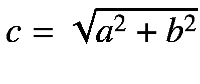
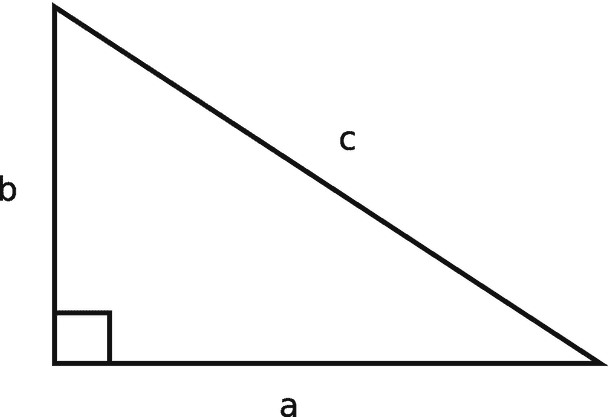
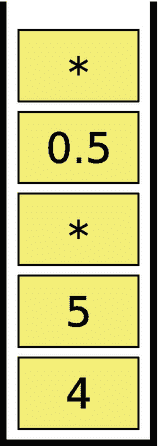
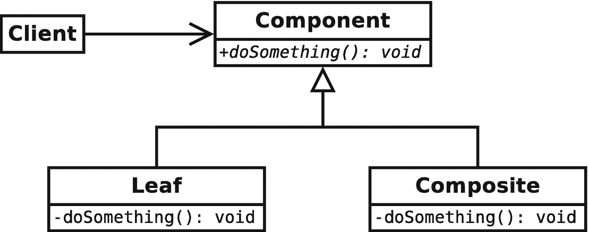
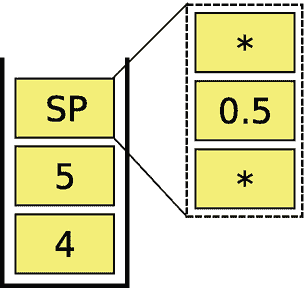
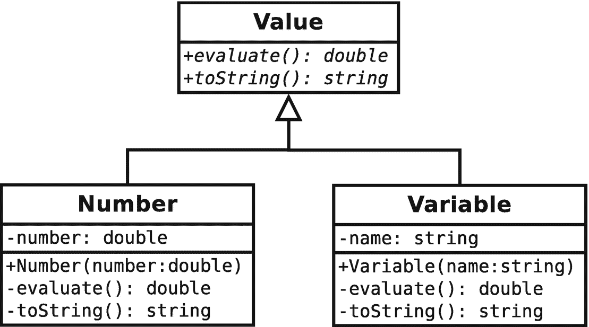
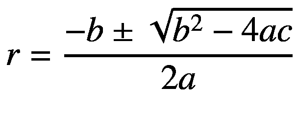

# 8.新要求

这是一个美丽的周一早晨，你刚刚在轻松的周末步入工作岗位。毕竟你周五刚做完 pdCalc，现在准备出货了。在你坐下来喝咖啡之前，你的项目经理走进你的办公室说，“我们还没完。客户要求一些新功能。”

前面的场景在软件开发中太常见了。虽然新功能可能不会在上线时被请求，但是在您完成大部分设计和实现之后，新功能几乎不可避免地会被请求。因此，我们应该尽可能实际地进行防御性开发，以预测可扩展性。我说尽可能实际地防御，而不是尽可能地防御，因为过于抽象的代码和过于具体的代码一样对开发有害。通常，如果需要的话，简单地重写一个不灵活的代码比毫无理由地维护一个高度灵活的代码要容易得多。在实践中，我们寻求在代码的简单性、可维护性和一定程度的可扩展性之间取得平衡。

在这一章中，我们将探索修改我们的代码来实现超出原始需求设计的特性。本章中介绍的新功能的讨论范围从完整的设计和实现到仅为自我探索而提出的建议。让我们从两个扩展开始，从需求一直到实现。

## 8.1 完全设计的新功能

在这一节中，我们将研究两个新特性:计算器的批处理操作和存储过程的执行。我们将从批量操作开始。

### 批量操作

对于那些不熟悉这个术语的人，让我们来定义批处理操作。任何程序的批处理操作都只是程序的执行，从开始到结束，一旦程序启动，没有用户的交互。大多数桌面程序不在批处理模式下运行。然而，批处理操作在编程的许多分支中仍然非常重要，例如科学计算。对于那些受雇于大公司的人来说，可能更感兴趣的是，你的工资单可能是由一个程序以批处理方式运行的。

实话实说吧。pdCalc 的批处理操作，除了测试之外，并不是一个非常有用的扩展。我之所以包括它，主要是因为它演示了如何简单地扩展一个设计良好的 CLI 来添加批处理模式。

回想一下第 [5](5.html) 章，pdCalc 的 CLI 具有以下公共接口:

```cpp
class Cli : public UserInterface
{
public:
  Cli(istream& in, ostream& out);
  ~Cli();

  void execute(bool suppressStartupMessage = false, bool echo = false);
};

```

要使用 CLI，该类是用`cin`和`cout`作为参数构造的，而`execute()`是用空参数调用的:

```cpp
Cli cli{cin, cout};
// setup other parts of the calculator
cli.execute();

```

我们如何修改`Cli`类来启用批处理操作？令人惊讶的是，我们根本不需要修改这个类的代码！按照设计，CLI 本质上是一个解析器，它只是从输入流中提取空格分隔的字符输入，通过计算器处理数据，并生成字符输出到输出流。因为我们预先考虑过不要将这些输入和输出流硬编码为`cin`和`cout`，所以我们可以通过将输入和输出流转换为文件流来将 CLI 转换为批处理处理器，如下所示:

```cpp
ifstream fin{inputFile};
ofstream fout{outputFile};
Cli cli{fin, fout};
// setup other parts of the calculator
cli.execute(true, true);

```

其中`inputFile`和`outputFile`是可以通过 pdCalc 的命令行参数获得的文件名。回想一下，`execute()`函数的参数只是抑制了启动横幅，并将命令回显到输出中。

是的，确实是这样(但是参见`main.cpp`中的一些实现技巧)。我们的 CLI 最初是这样构建的，只需更改其构造函数参数，就可以将其转换为批处理程序。当然，你可以争辩说，作为作者，我是故意这样设计`Cli`类的，因为我知道计算器会以这种方式扩展。然而，事实是，我只是用流输入而不是硬编码输入来构造我的所有 CLI 接口，因为这种设计使 CLI 更加灵活，几乎没有额外的认知负担。

在离开这一部分之前，我将很快注意到，实际情况是，在操作系统的帮助下，pdCalc 的 CLI 已经有了批处理模式。通过在命令行重定向输入和输出，我们可以获得相同的结果:

```cpp
my_prompt> cat inputFile | pdCalc --cli > outputFile

```

对于 Windows，只需用 Windows `type`命令替换 Linux `cat`命令。

### 存储过程

无可否认，向 pdCalc 添加批处理模式是一个有点做作的例子。增加的功能并不十分有用，代码变化也很小。在这一节中，我们将研究一个更有趣的特性扩展——存储过程。

什么是存储过程？在 pdCalc 中，存储过程是在当前堆栈上操作的存储的、可重复的操作序列。存储过程提供了一种技术，通过从现有的计算器原语创建用户定义的函数来扩展计算器的功能。您可以将执行存储过程视为类似于为计算器运行一个非常简单的程序。理解这个概念最简单的方法是考虑一个例子。

假设你需要经常计算三角形的斜边。对于图 [8-1](#Fig1) 中描绘的直角三角形，我们可以用毕达哥拉斯公式计算出斜边的长度 *c* 。



图 8-1

直角三角形

假设我们有一个边长为 *a* = 4、 *b* = 3 的三角形，这些值被输入到 pdCalc 的堆栈中。在 CLI 中，您会看到以下内容:

```cpp
Top 2 elements of stack (size = 2):
2:      3
1:      4

```

为了计算这个三角形的 *c* ，我们将执行下面的指令序列:`dup * swap dup * + 2 root`。按 enter 键后，最终结果将是

```cpp
Top element of stack (size = 1):
1:      5

```

如果一次输入一个命令，那么每次按 enter 键时，我们都会看到中间结果堆栈。如果我们在一行中输入所有命令，然后按 enter 键，pdCalc 将在显示最终结果之前显示每个中间堆栈。当然，请注意，这个命令序列不是唯一的。使用例如命令序列`2 pow swap 2 pow + 2 root`可以获得相同的结果。

如果你和我一样，如果你不得不用 pdCalc 反复计算斜边，你可能会想在第一次手工计算后自动操作。这正是存储过程所允许的。自动化不仅节省时间，而且更不容易出错，因为封装了许多连续命令的存储过程可以被编写、测试和随后重用。如果操作可以由 pdCalc 原语(包括插件函数)组装，存储过程可以扩展计算器的功能，以计算简单的公式，而无需编写任何 C++ 代码。现在我们只需要设计和实现这个新特性。

#### 用户界面

pdCalc 既有 GUI 又有 CLI，因此添加任何面向用户的功能都需要对这两个用户界面组件进行一些修改。对于存储过程，对用户界面的修改非常小。首先，存储过程只是一个包含有序的 pdCalc 指令序列的文本文件。因此，用户可以使用任何纯文本编辑器创建存储过程。因此，除非您想为存储过程文本编辑器提供语法突出显示，否则存储过程的用户界面只能从 CLI 和 GUI 执行。

让我们首先解决在 CLI 中合并存储过程的问题。如前所述，存储过程只是文件系统中的文本文件。回想一下，CLI 的工作方式是将空格分隔的输入标记化，然后通过引发事件将每个标记单独传递给命令调度程序。因此，访问存储过程的一个简单方法就是将存储过程文件的名称传递给 CLI。然后，这个文件名将像任何其他命令或数字一样进行标记化，并传递给命令调度程序进行处理。为了确保文件名被命令调度程序解释为存储过程而不是命令，我们只需在文件名前面加上符号`proc:`，并更改命令调度程序的解析器。例如，对于一个名为`hypotenuse.psp`的存储过程，我们可以向 CLI 发出命令`proc:hypotenuse.psp`。我采用文件扩展名`psp`作为 pdCalc 存储过程的简写。自然，文件本身是一个普通的 ASCII 文本文件，包含一系列用于计算直角三角形斜边的命令，如果您愿意，可以使用`txt`扩展名。

回想一下，GUI 被设计为像 CLI 一样将命令传递给命令调度程序。因此，为了使用存储过程，我们添加一个按钮，打开一个对话框来导航文件系统以找到存储过程。一旦选择了存储过程，我们就在文件名前面加上`proc:`并引发一个`CommandEntered`事件。显然，您可以让您的存储过程选择对话框尽可能的漂亮。我选择了一个简单的设计，允许在一个可编辑的组合框中输入文件名。为了便于使用，组合框中预先填充了当前目录中扩展名为`.psp`的任何文件。

#### 对命令调度程序模块的更改

下面是`CommandInterpreter`的`executeCommand()`函数的简短列表，包括解析存储过程所需的逻辑。代码中省略的部分出现在第 4.5.2 节。

```cpp
void CommandInterpreter::CommandInterpreterImpl::executeCommand(const
string& command)
{
  string_view sv{command};
  // handle numbers, undo, redo, help in nested if
  // ...
  else if( command.size() > 6 && sv.starts_with("proc:") )
  {
    string filename{sv.substr(5, command.size() - 5)};
    handleCommand( MakeCommandPtr<StoredProcedure>(ui_, filename) );
  }
  // else statement to handle Commands from CommandFactory
  // ...

  return;
}

```

从前面的代码清单中，我们看到实现只是从 string 命令参数中剥离出`proc:`来创建存储过程文件名，创建一个新的`StoredProcedure`类，并执行这个类。现在，我们假设让`StoredProcedure`类成为`Command`类的子类是最佳设计。我们将讨论为什么这种策略是首选，并在接下来的小节中检查它的实现。然而，在我们到达那里之前，让我们讨论一下这个`MakeCommandPtr()`函数的新重载。

在第 7.2.1 节中，我们首先看到了由以下实现给出的`MakeCommandPtr`的版本:

```cpp
inline void CommandDeleter(Command* p)
{
  if(p) p->deallocate();
  return;
}

using CommandPtr = std::unique_ptr<Command, decltype(&CommandDeleter)>;

inline auto MakeCommandPtr(Command* p)
{
  return CommandPtr{p, &CommandDeleter};
}

```

前面的函数是一个帮助函数，用于从原始的`Command`指针创建`CommandPtr`。这种形式的函数用于从现有`Command`的克隆中创建一个`CommandPtr`(例如，在`CommandFactory::allocateCommand()`):

```cpp
auto p = MakeCommandPtr( command->clone() );

```

然而语义上，在`CommandInterpreterImpl::executeCommand()`中，我们看到了完全不同的用法，那就是构造一个从`Command`派生的类的命名实例。当然，我们可以用现有的`MakeCommandPtr`原型来满足这个用例。例如，我们可以如下创建一个`StoredProcedure`:

```cpp
auto c = MakeCommandPtr(new StoredProcedure{ui, filename});

```

然而，只要有可能，我们不希望用裸露的`new`来污染高级代码。因此，我们寻求实现一个重载的 helper 函数来为我们执行这个构造。其实现如下所示:

```cpp
template<typename T, typename... Args>
auto MakeCommandPtr(Args&&... args)
requires std::derived_from<T, Command>
{
  return CommandPtr{new T{std::forward<Args>(args)...}, &CommandDeleter};
}

Listing 8-1Generic perfect forwarding constructor

```

在 C++11 之前，不存在简单有效的技术来构造具有可变数目构造函数参数的泛型类型，这对于创建从`Command`类派生的任何一个可能的类都是必要的，每个类都具有不同的构造函数参数。然而，现代 C++ 使用可变模板和完美转发为这个问题提供了一个优雅的解决方案。这个构造是下面侧栏的主题。

Modern C++ Design Note: Variadic Templates and Perfect Forwarding

可变模板和完美转发各自解决了 C++ 中不同的问题。可变模板支持使用未知数量的类型化参数进行类型安全的泛型函数调用。完美转发支持将参数正确类型地转发到模板函数内部的底层函数。这些技术的机制可以在你最喜欢的 C++11 参考文本中学习(例如，[30])。在侧栏中，我们将研究一种类型安全的通用设计技术，用于构造需要不同数量构造函数参数的具体对象。这种技术是通过可变模板和完美转发的组合来实现的。由于缺乏命名创意，我将这种模式命名为通用完美转发构造函数(GPFC)。让我们从介绍 GPFC 解决的根本问题开始。

让我们考虑一下每个作者最喜欢的过度简化的面向对象编程的例子，形状层次结构:

```cpp
class Shape
{
public:
  virtual double area() const = 0;
};

class Circle : public Shape
{
public:
  Circle(double r) : r_{r} {}
  double area() const override { return 3.14159 * r_ * r_; }

private:
  double r_;
};

class Rectangle : public Shape
{
public:
  Rectangle(double l, double w) : l_{l}, w_{w} {}
  double area() const override { return l_ * w_; }

private:
  double l_, w_;
};

```

在 C++ 中，实现为虚拟分派的可替换性解决了需要使用基类保证的接口通过基类指针调用派生类型的特定实现的问题。在形状示例中，可替换性意味着能够按如下方式计算面积:

```cpp
double area(const Shape& s)
{
  return s.area();
}

```

对于任何从`Shape`派生的类。虚拟函数的确切接口是完全指定的，包括任何函数参数的数量和类型(即使在空的情况下，如本例中的`area()`函数)。然而，问题是对象构造永远不能以这种方式“虚拟化”,即使可以，也不会起作用，因为构造一个对象所必需的信息(它的参数)在不同的派生类之间经常是不同的。

进入一般的完美转发构造器模式。在这个模式中，我们使用可变模板来提供一个类型安全的接口，该接口可以接受任意数量的不同类型的构造函数参数。第一个模板参数总是我们想要构造的类型。然后，使用完全转发来保证参数以正确的类型传递给构造函数。准确地说，为什么在这种情况下完美转发是必要的，这源于模板中类型是如何推导出来的，超出了本讨论的范围(详见[24])。对于我们的形状示例，应用 GPFC 模式会导致以下实现:

```cpp
template<typename T, typename... Args>
auto MakeShape(Args&&... args)
{
  return make_unique<T>(forward<Args>(args)...);
}

```

下面的代码说明了如何使用`MakeShape()`函数创建具有不同数量构造函数参数的不同类型:

```cpp
auto c = MakeShape<Circle>(4.0);
auto r = MakeShape<Rectangle>(3.0, 5.0);

```

注意，GPFC 模式也适用于在继承层次结构中创建彼此不相关的类。事实上，GPFC 模式被标准库中的`make_unique()`函数用来以一种高效、通用的方式生成`unique_ptr`，而不需要裸的`new`。虽然严格地说，它们是不同的，但我喜欢把 GPFC 模式看作工厂方法的一般模拟。

敏锐的读者会注意到清单 [8-1](#PC11) 中函数声明后面的特殊的`requires`子句。对于 C++20 来说，`requires`子句引入了一个约束，指定了对模板参数的编译时要求。在清单 [8-1](#PC11) 的情况下，我们要求类型`T`必须从`Command`派生。约束是概念的组成部分，是 C++20 的一个新的语言特性。在下面的边栏中简要介绍了一些概念。

Modern C++ Design Note: Concepts

概念是 C++20 的一个非常突出的新特性，用于向模板类型添加需求。概念在本书中并不突出，因为 pdCalc 在其实现中并没有包含很多模板。然而，由于新标准中概念的重要性，我选择在侧栏中简要提及它们，以说明为什么您可能会使用它们。

模板在 C++ 语言中已经存在了几十年，在它们存在的整个过程中，程序员都有同样的抱怨:模板错误会导致冗长的、难以理解的编译器错误消息。为什么不同编译器的错误信息都是一样的？答案基本上是因为类型错误通常是在调用堆栈深处发现的，而不是在使用该类型的第一行。在错误发生的地方，失去了太多的上下文来给出简洁的信息。

概念通过在使用时约束可接受的模板类型来解决前面的问题。这些需求既可以通过一个`requires`子句作为约束添加，也可以通过使用一个`requires`子句(或其连接词)来构建一个称为概念的受限模板类型。如果您选择在模板代码中使用概念(您可能应该这样做)，不要从头开始。C++20 概念库预定义了许多概念，比如清单 [8-1](#PC11) 中使用的`derived_from`概念。

让我们从概念和`requires`子句的上下文中重新检查清单 [8-1](#PC11) 中的代码。在这本书的第一版中，因为概念还不是一种语言特征，所以完全相同的功能被无限制地呈现出来。也就是说，清单 [8-1](#PC11) 是相同的，只是没有出现`requires`子句。对于两个版本的源代码，当一个从`Command`派生的类被传递给`MakeCommandPtr()`时，会生成相同的编译代码。概念的真正好处是在犯错误的时候。

考虑一个不是从`Command`派生的默认可构造哑类`A`，并进一步考虑以下错误的函数调用:

```cpp
auto p = MakeCommandPtr<A>();

```

使用 gcc，调用受约束版本的`MakeCommandPtr()`会导致以下“友好的”错误:

```cpp
note: 'pdCalc::Command' is not a base of 'A'

```

我在引号中写了 friendly，因为 gcc 给出了一个巨大的模板扩展错误，但至少包含了有用的注释，即`Command`不是`A`的基，作为错误末尾的注释，这正是这段代码无法编译的原因。现在让我们对比一下同样的呼叫，但是是无约束版本的`MakeCommandPtr()`。这一次，最后出现的错误是

```cpp
note: candidate expects 0 arguments, 2 provided
return CommandPtr{new T{std::forward<Args>(args)...}, &CommandDeleter};

```

这实际上并没有解释这个函数调用失败的原因。在向语言引入概念之前，有经验的程序员只是习惯了糟糕的模板错误消息。我个人诊断模板错误的策略是使用编译器找到令人不快的源代码行，忽略编译器产生的所有消息，并认真思考该行为什么会导致错误。这样的技术对新手来说是不可能的；概念是一个很大的进步。

在结束这篇边栏之前，值得注意的是，在清单 [8-1](#PC11) 中，我们没有使用`requires`子句，而是创建了一个概念并将模板参数约束为`MakeCommandPtr()`。这种策略会产生以下替代代码:

```cpp
template<typename T>
concept PdCalcCommand = std::derived_from<T, Command>;

template<PdCalcCommand T, typename... Args>
auto MakeCommandPtr(Args&&... args)
{
  return CommandPtr{new T{std::forward<Args>(args)...}, &CommandDeleter};
}

```

我选择直接使用`requires`子句，而不是创建一个概念，因为这个概念没有在代码中的其他地方使用过。也就是说，代码没有从概念上受益于`PdCalcCommand`；它只需要对`MakeCommandPtr`有一个约束。因此，`requires`子句的使用看起来更简单，再次遵从了奥卡姆剃刀的设计。

#### 设计 StoredProcedure 类

我们现在回到设计`StoredProcedure`类的棘手问题。我们问的第一个问题是，我们到底需要一个类吗？我们已经有了解析单个命令、执行它们并将其放入撤销/重做堆栈的设计。也许正确的答案是以类似于处理批量输入的方式来处理存储过程。也就是说，在交互式会话(GUI 或 CLI)期间，通过读取存储过程文件、解析它并批量执行命令(就像我们在 CLI 中使用多个命令的一长行命令一样)来处理存储过程，而不引入新的`StoredProcedure`类。

在考虑了下面这个非常简单的例子后，几乎可以立即放弃上述设计。假设您实现了一个计算三角形面积的存储过程。存储过程的输入将是栈上三角形的底和高。`triangleArea.psp`由下式给出:

```cpp
*
0.5
*

```

如果我们没有一个`StoredProcedure`类，那么`triangleArea.psp`中的每个命令都将被执行并按顺序进入撤销/重做堆栈。对于 I/O 堆栈上的值`4`和`5`，存储过程的正向执行将产生正确的结果`10`，以及如图 [8-2](#Fig2) 所示的撤销堆栈。基于这个撤销堆栈，如果用户试图撤销，而不是撤销三角形区域存储过程，用户将只撤销堆栈上的顶层操作，即最后的乘法。I/O 堆栈将读取

```cpp
4
5
0.5

```



图 8-2

没有`StoredProcedure`类的撤销堆栈

(撤销堆栈在`5`和`0.5`之间会有一个`*`,而不是

```cpp
4
5

```

要完全撤销一个存储过程，用户需要按撤销 *n 次*，其中 *n* 等于存储过程中的命令数。重做操作也存在同样的缺陷。在我看来，撤销存储过程的预期行为应该是撤销整个过程，并让 I/O 堆栈保持在执行存储过程之前的状态。因此，不使用`StoredProcedure`类来处理存储过程的设计无法正确地实现撤销和重做，因此必须放弃。

#### 复合模式

本质上，为了解决存储过程的撤销/重做问题，我们需要一个特殊的命令，它封装了多个命令，但表现为单个命令。幸运的是，复合模式解决了这个难题。根据 Gamma 等人[11]的说法，复合模式“让客户可以一致地对待单个对象和对象的组合。”通常，复合模式指的是树形数据结构。我更喜欢一个更宽松的定义，这种模式可以应用于任何允许对复合对象进行统一处理的数据结构。

图 [8-3](#Fig3) 显示了复合模式的一般形式。`Component`类是一个抽象类，需要执行一些动作。这个动作可以由一个`Leaf`节点单独执行，也可以由一组被称为`Composite`的`Component`来执行。客户端通过`Component`接口与组件层次结构中的对象进行多形态的交互。从客户端的角度来看，`Leaf`节点和`Composite`节点都不加区分地处理`doSomething()`请求。通常，`Composite` s 通过简单地调用它持有的`Component` s(或者`Leaf` s 或者嵌套`Composite` s)的`doSomething()`命令来实现`doSomething()`。



图 8-3

复合模式的一般形式

在我们特定的具体例子中，`Command`类扮演`Component`的角色，具体的命令如`Add`或`Sine`扮演`Leaf`节点的角色，而`StoredProcedure`类是复合的。`doSomething()`命令由一对纯虚函数`executeImpl()`和`undoImpl()`代替。我怀疑以这种方式组合命令和复合模式是相当普遍的。

以前，我们了解到为了正确地实现存储过程的撤销/重做策略，类设计是必要的。如前所述，复合模式的应用促使从`Command`类派生出`StoredProcedure`类。现在让我们设计一个`StoredProcedure`类，并作为复合模式的一个具体应用来检查它的实现。

#### 第一次尝试

实现复合模式的一种常见方法是通过递归。`Composite`类保存一个`Component`的集合，通常通过简单的`vector`或者更复杂的方式，比如二叉树中的节点。`Composite`的`doSomething()`函数简单地迭代这个集合，为集合中的每个`Component`调用`doSomething()`。`Leaf`节点的`doSomething()`函数实际上*做了一些事情*并终止递归。虽然不是必需的，但是`Component`类中的`doSomething()`函数通常是纯虚拟的。

让我们考虑前面的方法，在 pdCalc 中为`StoredProcedure` s 实现复合模式。我们已经确定，pdCalc 的`Command`类是`Component`，具体的命令类，比如`Add`，是`Leaf`类。因此，我们只需要考虑`StoredProcedure`类本身的实现。注意，由于当前的`Component`和`Leaf`类的实现可以按原样使用，复合模式可以很容易地应用于扩展现有代码库的功能。

考虑以下`StoredProcedure`级的骨架设计:

```cpp
class StoredProcedure : public Command
{
private:
  void executeImpl() noexcept override;
  void undoImpl() noexcept override;

  vector<unique_ptr<CommandPtr>> components_;
};

```

`executeImpl()`命令将按如下方式执行:

```cpp
void StoredProcedure::executeImpl()
{
  for(auto& i : components_)
    i->execute();

  return;
}

```

`undoImpl()`将以类似的方式实现，但是对`component_`集合进行反向迭代。

前面的设计是否解决了以前在没有`StoredProcedure`类的情况下将存储过程命令直接输入撤销/重做堆栈时遇到的撤销/重做问题？考虑图 [8-4](#Fig4) 中所示的撤销堆栈，这是我们之前检查过的`triangleArea.psp`示例。如图中的`SP`所示，存储过程在撤销堆栈中显示为单个对象，而不是代表其组成命令的单个对象。因此，当用户发出撤销命令时，`CommandManager`将通过调用存储过程的`undoImpl()`函数来撤销存储过程。这个存储过程的`undoImpl()`函数反过来通过对其容器`Command` s 的迭代来撤销单个命令，这种行为正是我们所期望的，复合模式的应用确实解决了眼前的问题。



图 8-4

使用`StoredProcedure`类的撤销堆栈

为了完成`StoredProcedure`类的实现，我们需要解析存储过程文件的字符串命令(带有错误检查),并使用它们来填充`StoredProcedure`的`components_ vector`。这个操作可以写在`StoredProcedure`的构造函数中，并且实现将是有效和完整的。我们现在将拥有一个`StoredProcedure`类，它可以将字符串命令转换成`Command`命令，并将它们存储在一个容器中，并且能够根据需要执行和撤销这些存储的`Command`命令。换句话说，我们基本上重写了`CommandInterpreter`！相反，让我们考虑一种替代设计，它通过重用`CommandInterpreter`类来实现`StoredProcedure`类。

#### `StoredProcedure`级的最终设计

这个设计的目标是按原样重用`CommandInterpreter`类。放松这个约束并修改`CommandInterpreter`的代码可以稍微清理一下实现，但是设计的本质是一样的。考虑下面的`StoredProcedure`级改进骨架设计:

```cpp
class StoredProcedure : public Command
{
private:
  void executeImpl() noexcept override;
  void undoImpl() noexcept override;

  std::unique_ptr<Tokenizer> tokenizer_;
  std::unique_ptr<CommandInterpreter> ci_;
  bool first_ = true;
};

```

目前的设计与我们之前的设计几乎相同，除了`components_ vector`已经被`CommandInterpreter`所取代，并且已经明确了对记号赋予器的需求。好在我们在第 5 章[中编写了可重用的记号赋予器！](5.html)

我们现在准备好看到`executeImpl()`和`undoImpl()`的完整实现。注意，虽然下面的实现没有使用前面看到的模式的规范版本，但是这个`StoredProcedure`类的实现仍然只是复合模式的一个应用。首先，我们来看看`executeImpl()`:

```cpp
void StoredProcedure::executeImpl() noexcept
{
  if(first_)
  {
    ranges::for_each( *tokenizer_,
      [this](auto c){ci_->commandEntered(c);} );
    first_ = false;
  }
  else
  {
    for(auto i = 0u; i < tokenizer_->nTokens(); ++i)
      ci_->commandEntered("redo");
  }

  return;
}

```

第一次调用`executeImpl()`时，令牌必须从令牌化器中提取出来，并由`StoredProcedure`自己的`CommandInterpreter`执行。对`executeImpl()`的后续调用仅仅是请求`StoredProcedure`的`CommandInterpreter`重做每个`StoredProcedure`命令的向前执行。记住，`StoredProcedure`的`executeImpl()`函数本身会被 pdCalc 的`CommandInterpreter`调用；因此，我们的设计要求嵌套`CommandInterpreter`的。图 [8-5](#Fig5) 显示了三角形区域存储过程示例的设计，其中`CI`代表`CommandInterpreter`。


图 8-5

使用嵌套`CommandInterpreter`的撤销堆栈

`StoredProcedure`的`undoImpl()`的实现很简单:

```cpp
void StoredProcedure::undoImpl() noexcept
{
  for(auto i = 0u; i < tokenizer_->nTokens(); ++i)
    ci_->commandEntered("undo");

  return;
}

```

撤销是通过请求底层的`CommandInterpreter`撤销存储过程中的一些命令来实现的。

在结束对最后一个`StoredProcedure`类的讨论之前，我们应该考虑一下`StoredProcedure`类中命令的标记化。`StoredProcedure`的标记化过程包括两个步骤。必须打开并读取存储过程文件，然后对文本流进行实际的标记化。这个过程只需要在初始化时，每个`StoredProcedure`实例化执行一次。因此，标记化的自然位置是在`StoredProcedure`的构造函数中。然而，在`StoredProcedure`的构造函数中放置标记化会与 pdCalc 的命令错误处理程序产生不一致。特别是，pdCalc 假设命令可以被构造，但不一定被执行，而不会失败。如果一个命令不能被执行，期望通过检查命令的前提条件来处理这个错误。标记化会失败吗？当然可以。例如，如果存储过程文件无法打开，标记化就会失败。因此，为了保持错误处理的一致性，我们在`StoredProcedure`的`checkPreconditionsImpl()`函数中实现了标记化，当 pdCalc 的`CommandInterpreter`第一次尝试执行存储过程时会调用这个函数。由于标记化需要执行一次，所以我们只在第一次执行`checkPreconditionsImpl()`函数时执行操作。完整的实现可以在`StoredProcedure.cpp`文件中找到。

## 8.2 设计更有用的计算器

到目前为止，所有关于 pdCalc 的讨论都集中在可从 GitHub 下载的完整代码的设计和实现上。然而，本章的其余部分标志着对这种风格的背离。此后，我们将只讨论扩展的想法和如何修改 pdCalc 以适应新特性的建议。不仅没有提供工作代码，而且在写这些部分之前也没有创建工作代码。因此，我们将要讨论的设计还没有经过测试，选择完成这些扩展的有冒险精神的读者可能会发现将要讨论的想法是次优的，或者，我敢说，是错误的。欢迎来到从空白开始设计功能的狂野西部！将需要试验和反复。

### 8.2.1 复数

计算器的原始设计规范要求双精度数字，我们设计和实现的计算器明确地只处理双精度数字。然而，需求是变化的。假设您的同事是一名电气工程师，他路过您的办公室，爱上了您的计算器，但需要一台处理复数(虚数)的计算器。这是一个合理的要求，所以让我们看看如何重构我们的计算器来满足这个新特性。

添加复数需要对 pdCalc 进行四项主要修改:在内部使用复数表示，而不是将数字表示为`double` s，更改输入和输出(以及，通过扩展，解析)以适应复数，修改 pdCalc 的堆栈以存储复数而不是`double` s，以及修改命令以对复数而不是实值输入执行计算。第一个变化，寻找一个复数的 C++ 表示，是微不足道的；我们将使用`std::complex<double>`。一个只有实部的数将简单地存储为一个虚部设置为`0`的`complex<double>`。其他三个变化不那么微不足道。现在让我们更深入地看看一些能够适应这些变化的设计选项。

#### 修改输入和输出

在所有需要的改变中，修改 I/O 例程实际上是最容易的。要解决的第一个问题是如何解释和表示复数。例如，我们是否希望一个复数`c`被表示为`c = re + im * i`(也许虚数应该是`j`，因为特性请求来自一个电气工程师)？也许我们更喜欢使用`c = (re, im)`或使用尖括号或方括号的变体。这个问题没有正确答案。尽管有些选择可能比其他选择更容易实现，但由于这种选择只是一种约定，在实践中，我们会将解决方案委托给客户。对于我们的案例研究，我们将简单地采用约定`c = (re, im)`。

我们将只讨论修改 I/O 的命令行版本。一旦为 CLI 准备好了处理复数的基础设施，修改 GUI 应该相当简单。我们遇到的第一个问题是`Tokenizer`类。这个类的最初设计只是通过在空白上分割输入来标记。然而，对于复数，这种方案是不够的。例如，根据逗号后是否插入空格，复数的标记方式会有所不同。

在某种程度上，输入变得足够复杂，以至于您需要使用一种语言语法，并将简单的输入例程迁移到“真正的”扫描器和解析器(可能使用 lex 和 yacc 之类的库)。有些人可能会说，通过增加复数，我们已经达到了这种复杂程度。然而，我认为，如果我们修改`tokenize()`例程来扫描'`(`'标记，并为左括号和右括号之间(包括左括号和右括号)的任何内容创建一个“number”标记，我们可能可以勉强使用现有的简单输入标记器。显然，我们需要执行一些基本的错误检查来确保正确的格式。另一种方法是基于正则表达式匹配分解输入流。这就是 lex 的基本操作方式，在从头开始编写复杂的扫描器之前，我会使用 lex 或类似的库进行研究。

我们遇到的下一个输入问题是解析`CommandInterpreterImpl`的`executeCommand()`函数中的数字。目前，一个字符串参数(令牌)被传递给这个函数，该字符串被解析以确定它是一个数字还是一个命令。通过检查，我们可以看到，如果我们修改`isNum()`来识别和返回复数而不是浮点数，`executeCommand()`将适用于复数。最后，需要更新`EnterNumber`命令来接受和存储一个`complex<double>`。

这就负责修改输入例程，但是我们如何修改输出例程呢？回想一下，`Cli`类是`Stack`的`stackChanged()`事件的(间接)观察者。每当`Stack`引发该事件时，就会调用`Cli`的`stackChanged()`函数将当前堆栈输出到命令行。让我们来看看`Cli::stackChanged()`是如何实现的。本质上，CLI 使用以下函数调用回调堆栈，用顶部的`nElements`填充容器:

```cpp
auto v = Stack::Instance().getElements(nElements);

```

然后创建一个`string`、`s`和相应的`back_inserter`、`bi`，首先用一些堆栈元数据填充，然后用以下代码填充堆栈元素:

```cpp
for( auto j = v.size(); auto i : views::reverse(v) )
{
  std::format_to(bi, "{}:\t{:.12g}\n", j--, i);
}

```

最后，`s`被发送到 CLI 的输出例程，该例程将其输出到 CLI 的输出流。一旦`Stack`的`getElements()`函数被修改为返回一个`vector<complex<double>>`，并且输出格式被相应地改变，`Cli`的`stackChanged()`函数将按预期工作。实际上只需要很少的改变——这就是设计良好和实现良好的代码的美妙之处。

#### 修改堆栈

在第 3 章[中，我们最初设计计算器的堆栈只对双精度变量进行操作。显然，这个限制意味着现在必须重构`Stack`类来处理复数。当时，我们质疑为堆栈硬编码目标数据类型的逻辑，我建议不要设计通用的`Stack`类。我的建议是，一般来说，在第一个重用案例明确建立之前，不要设计通用接口。设计好的通用接口通常比设计特定类型更难，从我的个人经验来看，我发现代码的意外重用很少会有结果。然而，对于我们的`Stack`类来说，将这种数据结构重新用于另一种数据类型的时候到了，在这一点上，谨慎的做法是将`Stack`的接口转换为通用接口，而不仅仅是重构该类以针对复数进行硬编码。](3.html)

使`Stack`类通用化几乎和你想象的一样简单。第一步是通过用我们的通用类型`T`替换`double`的显式使用，使接口本身通用化。界面变成了

```cpp
template<typename T>
class Stack : private Publisher
{
public:
  static Stack& Instance();
  void push(T, bool suppressChangeEvent = false);
  T pop(bool suppressChangeEvent = false);
  void swapTop();

  std::vector<T> getElements(size_t n) const;
  void getElements(size_t n, std::vector<T>&) const;

  using Publisher::attach;
  using Publisher::detach;
};

```

一般来说，所需的实现更改很简单。`double`的使用被替换为`T`，显然，pdCalc 中的`Stack`类的使用必须被重构，以使用泛型而不是非模板化接口。

需要修改的接口的最后一部分是第 [7](7.html) 章中添加的五个全局`extern "C"`帮助函数，用于将堆栈命令导出到插件。因为这些函数必须有 C 链接，我们不能让它们成为模板，它们也不能返回 C++ `complex`类型来代替`double`。第一个问题并不像乍看上去那么可怕。虽然我们的目标是使`Stack`类通用和可重用，但是栈的插件接口不需要通用。对于任何特定版本的 pdCalc，无论是对实数进行操作的版本还是对复数进行操作的版本，系统中只存在一个特定的`Stack<T>`实例，并且这个实例将有一个特定的`T`实现。因此，用于 pdCalc 的堆栈的 C 链接接口只需要反映计算器中使用的`T`的选择。也就是说，容器被设计成通用的和可重用的，但是插件的接口不需要这种灵活性，因为一旦为计算器选择了数据格式，它就不再被重用。

将 C 链接接口中的`complex<double>`表示替换到堆栈中很简单。我们有几个选择。首先，我们可以用两个`doubles`的序列替换每个`double`:一个代表实数部分，一个代表复数部分。当然，由于 C 函数本身不能返回两个`doubles`，我们必须修改返回堆栈值的函数。一种选择是在参数列表中使用指针参数，通过这些参数“返回”复杂的值。第二种选择是通过数组返回复数。另一个解决方案，也是我的首选，是简单地定义一个`struct`:

```cpp
struct Complex
{
  double re;
  double im;
};

```

为了补充接口功能，将当前使用的`double`替换为`Complex`。虽然这个新的`Complex struct`复制了标准`complex`类的存储，但是我们不能在纯 C 接口中使用标准的`complex`类。

#### 修改命令

修改命令来处理复数真的很容易，因为 C++ 库为我们的计算器所需的所有数学运算提供了重载。除了用`Stack<complex<double>>`替换`Stack`(希望我们在某处给它起了别名)和在`BinaryCommand`和`UnaryCommand`中用`complex<double>`替换`double`的语法变化之外，大多数命令保持不变。例如，清除一堆实数和清除一堆复数是一样的。给定运算符重载，将两个复数相加与将两个实数相加是相同的。当然，我们可能想要添加额外的命令，比如 complex conjugate，但是即使是这个功能也是由 C++ `complex`类提供的。如果您创建的命令使用了`complex`类本身不支持的算法，那么在修改命令以支持复数时，您可能会遇到比编程更多的数学困难。

### 变量

在本章的前面，我们实现了存储过程作为一种存储简单指令序列的方法。虽然存储过程适用于只使用每个输入一次的琐碎操作(例如，毕达哥拉斯定理)，但是在尝试实现多次使用每个输入的更复杂的公式(例如，二次公式)时，很快就会遇到问题。为了克服这个困难，您需要实现在命名变量中存储参数的能力。

在 pdCalc 中实现变量需要对现有组件进行一些修改，包括添加一个重要的新组件，即符号表。为了简单起见，在示例代码中，我恢复使用实数表示 pdCalc。然而，使用复数不会增加额外的设计复杂性。现在让我们探索一些实现变量的可能的设计思想。

#### 输入和新命令

显然，使用变量需要一些提供符号名的方法。目前，我们的计算器只接受数字和命令作为输入。输入任何在`CommandFactory`中找不到的字符串都会导致错误。然而，回想一下，这个错误是在`CommandInterpreter`中产生的，而不是在标记器中产生的。因此，我们需要修改`CommandInterpreter`，使其不拒绝字符串，而是以某种方式将它们放入堆栈。现在，我们假设栈除了接受数字还可以接受字符串。我们将在接下来的章节中讨论对`Stack`类的必要修改。同样，我们将讨论限制在命令行界面。图形用户界面带来的唯一额外的复杂性是提供了一种机制来输入除数字之外的字符串(可能是虚拟数字小键盘附带的虚拟键盘)。

从技术上讲，我们可以允许任何字符串代表一个变量。然而，将允许的语法限制在字符串的某个子集可能会更好，可能用符号分隔以区分变量名和命令。因为这种选择仅仅是惯例，所以您可以自由选择适合您或您的用户口味的任何规则。就个人而言，我可能会选择像变量名必须以字母开头，可以包含字母、数字的任意组合，还可能包含一些特殊符号，如下划线。为了消除变量名和命令之间的混淆，我将变量用单引号或双引号括起来。

既然我们已经建立了变量的语法，我们仍然需要一种机制来从堆栈中取出一个数字并将其存储到变量中。完成这项任务最简单的方法是提供一个新的二进制命令`store`，从堆栈中删除一个数字和一个字符串，并创建一个符号表条目，将这个变量名链接到这个数字。例如，考虑堆栈

```cpp
4.5
2.9
"x"

```

发出`store`命令应导致进入 *x* → 2 *。*符号表中的 9 和的一个结果堆栈

```cpp
4.5

```

隐式地，变量应该被转换成在计算中使用的数字，但在堆栈中显示为名称。我们还应该提供一个明确的命令`eval`，将一个符号名称转换成一个数字。例如，给定堆栈

```cpp
"x"

```

发出`eval`命令应该会导致堆栈

```cpp
2.9

```

这样的命令应该有一个相当明显的实现:用符号表中的值替换栈顶的变量。显然，请求对不在符号表中的变量求值会导致错误。计算一个数字可能会导致错误，或者更好的是，只返回数字。您可能会想到许多处理变量的奇特命令(例如，列出符号表)。然而，`store`和`eval`命令包含使用变量所需的最小命令集。

#### 数字表示和堆栈

到目前为止，我们的堆栈只需要表示一个单一的、唯一的类型，可以是实数，也可以是复数。然而，由于变量和数字都可以存储在堆栈中，我们需要堆栈能够同时存储这两种类型。我们立即摒弃了可以同时处理两种不同类型的堆栈的概念，因为这将很快导致混乱。相反，我们寻求一种能够通过单一接口处理数字和变量类型的统一表示。很自然，我们转向了等级制度。

考虑图 [8-6](#Fig6) 中类图表达的设计。这种层次结构使得`Variable`和`Number`可以作为`Value`互换使用。这种多态设计解决了我们已经遇到的三个问题。首先，`Variable` s 和`Number` s 可以统一存储在`Stack<Value*>`中(可能使用更合适的智能指针存储方案)。第二，当`Add`或`Sine`等命令需要一个数来执行一个操作时，可以从堆栈中弹出`Value` s，并通过虚拟的`evaluate()`函数请求`double` s。显然，a `Number`直接存储它所代表的`double`，而 a `Variable`存储变量的名称，可以通过在变量符号表中查找转换成数值。最后，`Value`的子类可以返回其底层值的`string`表示(或者是`Number`的数值，或者是`Variable`的名称)。这种字符串转换对于在 I/O 堆栈上显示是必要的。



图 8-6

一种能够统一表示数字和变量的层次结构

#### 符号表

从本质上讲，符号表只是一种数据结构，它允许通过将一个键与一个值(关联数组)配对来进行符号查找。在这种情况下，变量名作为键，数值作为值。C++ 标准库直接通过`map`或`unordered_map`提供这种服务，这取决于所需的底层数据结构。然而，正如在第三章[中，我强烈建议不要在程序中直接使用标准库容器作为外部接口。相反，应该使用适配器模式将库容器封装在由应用程序本身定义的接口之后。这种模式没有给类的用户增加任何限制，但是它允许设计者独立于底层库容器的接口来限制、扩展或修改组件的接口。](3.html)

因此，符号表的推荐设计是创建一个`SymbolTable`类来包装一个`unordered_map<string, double>`。这个底层哈希表提供了一种存储类型，用于在作为`string`的变量名和底层数值之间进行映射。`SymbolTable`类的公共接口提供了从符号表中添加和删除变量的成员函数，可选地(我们没有指定清除变量的命令)。由于我们在计算器中只需要一个符号表，所以`SymbolTable`可能应该作为单例来实现。

#### 一个简单的扩展:数字常量

一旦我们建立了存储用户定义变量的机制，我们就可以进行简单的扩展来提供用户定义的常量。常量是简单的变量，一旦设定就不能改变。常量可以在 pdCalc 中硬编码，在程序启动时通过读取常量文件添加，或者在计算器执行期间动态添加。

显然，为了存储一个常数，我们将需要添加一个新的命令；姑且称之为`cstore`。`cstore`的工作方式与`store`相同，除了该命令通知符号表正在存储的变量不能被改变。我们有两个显而易见的实施方案。首先，在`SymbolTable`类中，我们添加了第二个映射，指示给定的名称是代表变量还是常数。这种方法的优点是，添加一个额外的映射只需要对现有代码进行最少的实现更改。缺点是这种方法需要对符号表的每次调用进行两次独立的查找。更好的方法是修改原始映射，将值类型存储为`Entry`而不是`double`，其中`Entry`定义为

```cpp
struct Entry
{
  double val;
  bool isConst;
};

```

当然，为了避免硬编码`double`类型，我们当然可以模板化`SymbolTable`和`Entry`。

#### 由变量启用的功能

让我们来看看哪些变量使我们能够做到这一点。考虑根由



给定的二次方程*ax*<sup>2</sup>+*bx*+*c*= 0

以前我们不能编写存储过程来计算两个根，现在我们可以编写存储过程:

```cpp
"c" store "b" store "a" store "b" 2 pow 4 "a" "c" * * - sqrt "root" store
"b" neg "root" + 2 a * / "b" neg "root" - 2 a * /

```

它将从堆栈中取出代表系数 *a，b，c* 的三个条目，并返回代表二次方程的根的两个条目。现在，我们的计算器有所进展了！

## 8.3 一些有趣的自我探索扩展

本章最后一节列出了一些有趣的 pdCalc 扩展，您可以考虑自己尝试一下。与上一节不同，我没有提供任何设计思路来帮助您开始。我只提供了每个挑战的简要描述。

### 8.3.1 高 DPI 缩放

像素分辨率极高的显示器越来越成为标准配置。考虑如何修改 pdCalc 的 GUI 来正确处理此类显示的缩放。这个特性是独立于操作系统的，还是我们对第 [7 章](7.html)中的`PlatformFactory`有另外的用途？从版本 5.6 开始，Qt 通过一个高 DPI 缩放的接口来帮助你完成这个任务。

### 动态蒙皮

在第 6 章中，引入了一个类来管理 GUI 的外观。然而，所提供的实现仅仅集中了外观和感觉。它不允许用户定制。

用户经常想要定制他们的应用程序的外观和感觉。允许这种变化的应用程序被认为是“可换肤的”，每个不同的外观和感觉被称为一个皮肤。考虑对`LookAndFeel`类进行必要的接口和适当的实现更改，以启用 pdCalc 的皮肤。一些可能的选项包括用于定制单个小部件的对话框或从皮肤配置文件中选择皮肤的机制。用一个集中的类来处理应用程序的外观应该会使这种改变变得简单明了。不要忘了给`LookAndFeel`添加一个信号，这样其他 GUI 元素就知道什么时候需要用新的外观重新绘制它们自己了！

### 流量控制

有了变量，我们大大增强了存储过程的灵活性。对于计算大多数公式，这个框架应该是足够的。然而，如果我们想实现一个递归公式，比如计算一个数的阶乘，该怎么办呢？虽然我们有能力通过插件来执行如此复杂的计算，但如果能将这种功能扩展到那些没有 C++ 编程经验的计算器用户，那就更好了。为了完成这项任务，我们需要为流控制设计一个语法。最简单的设计至少能够处理循环和条件操作。就增加的功能和实现工作而言，将流控制添加到 pdCalc 将是一个相当显著的增强。可能是时候转向真正的扫描器和解析器了！

### 8.3.4 另一种图形用户界面布局

受 HP48S 计算器的启发，pdCalc GUI 目前采用垂直方向。然而，现代屏幕分辨率往往宽于高，使得垂直方向不是最佳选择。对水平方向进行硬编码并不比最初的垂直方向更具挑战性。相反，考虑如何重新设计 pdCalc，以便能够在运行时切换方向。也许垂直方向只是一个不同的皮肤选项？

### 一个图形计算器

HP48 系列计算器不仅仅是科学计算器；他们在绘制计算器。尽管在复杂的独立绘图程序存在的情况下，为计算机实现绘图计算器可能不太实际，但这种练习可能会被证明是非常有趣的。从 5.7 版本开始，Qt 现在包含了一个绘图模块，使得这个任务比以前简单多了。考虑到这个图形化小部件集，最大的挑战可能只是设计一个图形化输入的方法。如果你想回到 20 世纪 70 年代，考虑为 CLI 实现一个 ASCII 图形计算器！

### 8.3.6 插件管理系统

目前，插件是在 pdCalc 启动时加载的，加载哪些插件是通过从文本文件中读取共享库名称来确定的。插件一旦加载，就不能卸载。考虑实现一个动态插件管理系统，以便插件可以在运行时被选择、加载和卸载。您甚至可以扩展插件接口来支持插件描述的动态查询。我认为真正的问题在于如何处理一个插件的卸载，这个插件的一个命令当前在撤销/重做堆栈上。

### 移动设备接口

在我创作这本书的最初构思中，我设想了一章来描述如何将 pdCalc 扩展到 iOS 或 Android 平板电脑。Qt 库可以再次帮助您完成这项任务。我没有在本书中包括这一章的原因是我没有任何平板电脑编程的实践经验。从我第一次涉足设计领域开始，我就觉得试图教别人如何设计平板电脑界面是不真诚的。嗯，这可能是一个糟糕设计的绝佳例子！尽管如此，将 pdCalc 扩展到平板电脑或智能手机界面仍是一个有价值的挑战。

### 8.3.8 云中的 pdCalc

假设您想扩展 pdCalc 以在云中执行。本书中介绍的 pdCalc 的设计可能会被归类为模块化整体结构。大多数大规模云程序都被设计成分布式服务。因此，我建议的第一个设计变更是将 pdCalc 重组为微服务架构。我们不是将模块构建为共享库，而是将模块实现为独立的服务，每个模块运行在自己的容器中。模块将通过 RESTful APIs 而不是函数调用进行通信。从现有的 c++ API 设计 RESTful APIs 应该是一项简单的任务。根据程序的预期负载，您可以通过一个容器编排服务(如 Kubernetes)添加动态伸缩。然而，我怀疑我们的低级计算器不太可能看到每个服务需要一个以上的容器。一个合适的构建系统甚至应该包括一个自动化测试套件和一个用于持续集成和持续部署的管道。

微服务架构的一个方便的特性是，由于不同的组件通过 API 进行通信，所以用不同的编程语言编写不同的模块是很简单的。基于云的 pdCalc 的 GUI 可能是一个网页，我们可能希望用 JavaScript(或 TypeScript)编写该组件，可能使用 Angular 之类的库。后端可以用 C++ 设计，但 Python 可能是更合适的语言。根据会话状态和堆栈的设计，pdCalc 甚至可能需要一个数据库。

将 pdCalc 移植到云听起来不仅仅是一个小的设计修改。事实上，它的设计可能足够独特，足以成为它自己的一本书——如果你想合写，请随时给我发电子邮件。既然你已经看完了这本书，你和我都需要一个新的项目！