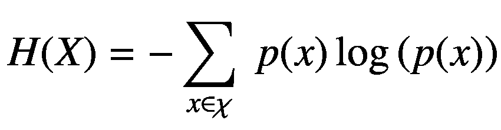
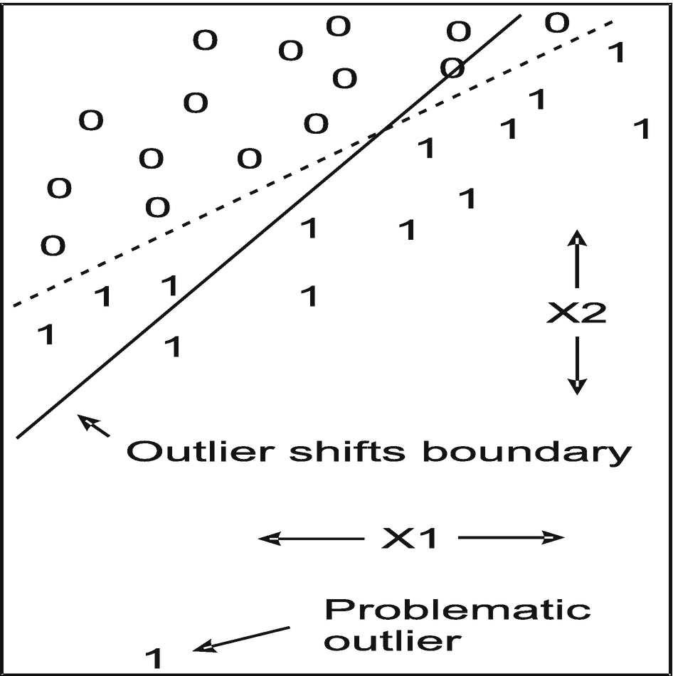
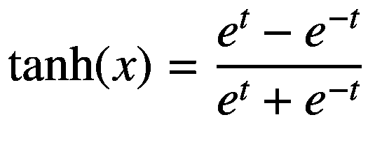
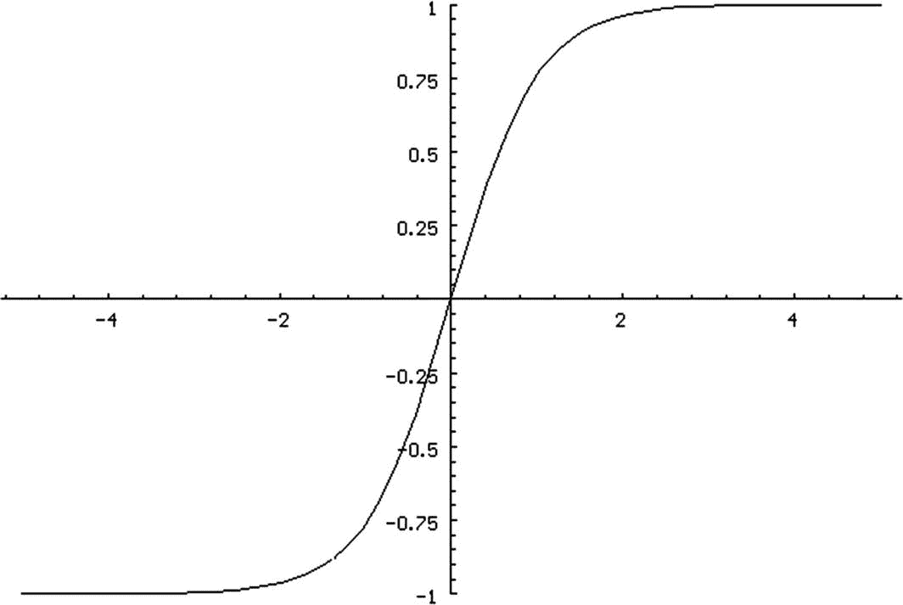

# 二、预优化问题

## 评估和改善平稳性

从本质上来说，时间序列的*平稳性*(如市场价格变化、指标或单个交易收益)是指其统计属性随时间保持不变的程度。统计学家可能会对如此宽松的定义感到畏缩，但这抓住了这个术语的实际意义。当我们使用市场历史来创建一个(最好是)有利可图的交易系统时，我们隐含地指望产生回溯测试盈利能力的历史模式至少在不久的将来仍然有效。如果我们不愿意做出这样的假设，我们还不如放弃交易系统的设计。

这个概念有许多方面与金融市场的自动交易特别相关。

*   市场，以及从市场历史中得出的指标和交易回报，本质上是不稳定的。它们的属性不断变化。唯一的问题是:情况有多糟？我们能处理吗？我们能解决问题让它变得更好吗？

*   对非平稳性进行任何严格的传统统计检验都是没有意义的。事实上，我们进行的任何测试都会显示出非常显著的统计非平稳性，所以我们不必费心；我们已经知道答案了。

*   非平稳性可以有无数种形式。也许方差在一段时间内是相当恒定的，而平均值则是漂移的。反之亦然。或者偏斜度可能改变。或者…

*   一些类型的不稳定可能对我们无害，而另一些可能对我们的交易系统是毁灭性的。一个交易系统可能有一种不稳定的弱点，而另一个交易系统可能被不同的东西拖累。在评估平稳性时，我们必须尽可能地考虑上下文。

*   评估一个*完成的*交易系统的耐用性的最好方法是使用第 142 页给出的渐进向前算法。

但是我们将忽略最后一点。这一章专门讨论在交易系统的发展过程中，我们应该在之前考虑的问题。渐进向前行走出现在开发的最后，是几个最终验证过程中的一个。

排除了非平稳性的传统统计测试，那么你应该怎么做？你绝对*必须*仔细研究你的指标。你可能会对你所看到的感到惊讶。它们的中心趋势可能会慢慢上下波动，使得预测模型在一个或两个极端都没有用。日复一日的徘徊是正常的，但缓慢的徘徊，或方差的缓慢变化，是一个严重的问题。如果一个指标在回到更“正常”的行为之前花了几个月甚至几年的时间，模型可能会在这些延长的时间内关闭或做出错误的预测。我们必须警惕这种灾难性的情况，如果我们不小心的话，这种情况很容易发生。

有时我们可能没有指标来绘制。下一节中显示的 STATN 程序是一个有价值的替代方案。但是理解非平稳性的潜在问题是很重要的。设计一个年复一年运行良好的自动交易系统，不需要调整，甚至完全重新设计，是非常困难的。市场总是变化的。我们很容易陷入的陷阱是设计一个在回溯测试中表现良好的系统，但其令人鼓舞的表现仅仅是因为在我们回溯测试历史中有利的一段时间里表现突出。因此，我们*必须*研究我们系统的权益曲线。如果它只在一小部分时间里表现出色，而在其他时间表现平平，我们就应该仔细考虑这种情况。当然，如果前一段时间表现出色，而最近的表现有所恶化，那就更是如此了！

关键的一点是，当我们在某种市场条件下开发一个交易系统时，只有在这种市场条件下，我们才能期待持续的良好表现。因此，*我们希望在我们的开发和测试期间，市场条件变化足够频繁，以便所有可能的市场条件都能得到体现。*而且即使所有条件都表现出来了，缓慢的徘徊也可能引起周期性的延长的不利表现。长时间的出色表现，接着是长时间的糟糕表现，会令人沮丧。

### STATN 计划

对于我们这些渴望硬数字的人来说，有一个很好的测试，它比基于目测情节的武断决定更可靠。我已经在 STATN.CPP 程序中提供了这个算法的示例。这个版本读取市场历史文件，并检查市场随时间的趋势和波动性。您可以通过添加其他市场属性(如 ADX 或您使用的任何自定义指标)来轻松修改它。

这个程序的原理很简单，但却令人惊讶地揭示了市场异常。它基于这样一种想法，即在特定市场条件下开发的交易系统(如上升或下降趋势，高或低波动性)在其他市场条件下可能会失去盈利能力。在大多数情况下，我们希望看到反映在我们的指标中的这些条件在规则和合理随机的基础上变化，以便我们开发的系统将尽可能多地经历投入使用时会遇到的各种条件。缓慢的徘徊是危险的非平稳性的本质；市场属性可能会在一段时间内保持在一个状态，然后在另一段时间内变为另一个状态，同样会影响我们的指标。这使得开发健壮的模型变得困难。粗略地说，平稳性等于行为的一致性。

使用以下命令调用该程序:

```cpp
STATN Lookback Fractile Version Filename

```

让我们来分解这个命令:

*   `Lookback`:历史棒线的数量，包括当前棒线，用于计算市场的趋势和波动性。

*   `Fractile`:趋势和波动性的分位数(0–1)，用作差距分析的上/下阈值。

*   `Version` : 0 表示原始指标，1 表示差异原始指标，> 1 表示指定原始减去扩展原始。详见第 14 页。

*   `Filename`:格式为`YYYYMMDD Open High Low Close`的市场历史文件。

使用真实市场数据的例子将出现在第 17 页。首先，我们探索一些代码片段。参见 STATN。完整上下文的 CPP。

该程序遍历市场历史，计算趋势(最小二乘线的斜率)和波动性(平均真实范围)。它查找对应于指定分位数的分位数；0.5 将是中间值。对于每根棒线，它决定趋势和波动的当前值(或它们的修改值，如后所述)是小于分位数还是大于或等于分位数。每次状态改变时(从上面到下面或从下面到上面),它会记录已经过了多少个小节并记录下来。例如，如果下一个条形的状态发生变化，则计数为 1。如果状态在下一个条之后改变了一个条，则计数为 2，依此类推。对于 1、2、4、8、16、32、64、128、256、512 和大于 512 的条计数，定义了 11 个仓。当程序结束时，它打印仓位计数，一个趋势表和一个波动表。

`Version`参数需要更多一点的解释，其理由将推迟到下一节。现在，请理解，如果用户将其指定为 0，趋势和波动指标将完全按照计算结果使用。如果它是 1，每个指示器的当前值通过减去它在`lookback`条之前的值来调整，使它成为一个经典振荡器。如果它大于 1，则通过使用`Version * Lookback`的回看减去该值来调整当前值，使其成为另一种振荡器。后两个版本要求实际回看大于用户指定的回看，如以下代码所示:

```cpp
   if (version == 0)
       full_lookback = lookback ;
   else if (version == 1)
       full_lookback = 2 * lookback ;
   else if (version > 1)
       full_lookback = version * lookback ;

   nind = nprices - full_lookback + 1 ;   // This many indicators

```

如果`nprices`是价格条的数量，我们丢失其中的`full_lookback–1`，得到指标的`nind`值，如前面代码的最后一行所示。

以下代码块显示了趋势指标(可能已修改)的计算。波动性也是如此。对于每一遍，`k`是指示器当前值的索引。我们必须从足够远的指标历史开始，以涵盖完整的回顾。

```cpp
   for (i=0 ; i<nind ; i++) {
      k = full_lookback - 1 + i ;
      if (version == 0)
          trend[i] = find_slope ( lookback , close + k ) ;
      else if (version == 1)
          trend[i] = find_slope ( lookback , close + k ) –
                         find_slope ( lookback , close + k - lookback ) ;
      else
          trend[i] = find_slope ( lookback , close + k ) –
                         find_slope ( full_lookback , close + k ) ;
      trend_sorted[i] = trend[i] ;
      }

```

对值进行排序以找到用户指定的分位数，然后计算每个箱中的计数。

```cpp
   qsortd ( 0 , nind-1 , trend_sorted ) ;
   k = (int) (fractile * (nind+1)) - 1 ;
   if (k < 0)
      k = 0 ;
   trend_quantile = trend_sorted[k] ;

   gap_analyze ( nind , trend , trend_quantile , ngaps , gap_size , gap_count ) ;

```

在调用`gap_analyze()`之前，我们必须做一些准备，为其提供间隙尺寸的边界。如果你想的话，可以随意修改。分析代码出现在下一页。

```cpp
#define NGAPS 11       /* Number of gaps in analysis */

   ngaps = NGAPS ;
   k = 1 ;
   for (i=0 ; i<ngaps-1 ; i++) {
      gap_size[i] = k ;
      k *= 2 ;
      }

```

该例程仅保留一个标志`above_below`，如果当前值等于或高于阈值，则该标志为*真* (1)，如果低于阈值，则为*假* (0)。对于每次循环，如果指示器仍然在阈值的同一侧，则计数器递增。如果它转换了方向，则相应的 bin 递增，并且计数器复位。到达数组末尾相当于翻转两边，所以最后一个系列才算。

```cpp
void gap_analyze (
   int n ,
   double *x ,
   double thresh ,
   int ngaps ,
   int *gap_size ,
   int *gap_count
   )
{
   int i, j, above_below, new_above_below, count ;

   for (i=0 ; i<ngaps ; i++)
      gap_count[i] = 0 ;
   count = 1 ;
   above_below = (x[0] >= thresh)  ?  1 : 0 ;

   for (i=1 ; i<=n ; i++) {
      if (i == n) // Passing end of array counts as a change
         new_above_below = 1 - above_below ;
      else
         new_above_below = (x[i] >= thresh)  ?  1 : 0 ;

      if (new_above_below == above_below)
         ++count ;
      else {
         for (j=0 ; j<ngaps-1 ; j++) {
            if (count <= gap_size[j])
               break ;
            }
         ++gap_count[j] ;
         count = 1 ;
         above_below = new_above_below

;
         }
      }
}

```

### 通过振荡改善位置平稳性

提高指标稳定性的一个简单但通常有效的方法，至少就其中心趋势而言，是计算其相对于某个相关“基础”值的值*。最常见也是最有效的方法是减去滞后值，滞后值通常(但不一定)是指标的回望值。例如，我们可以计算最近 20 个价格的趋势，并从中减去 20 根棒线之前该指标的值。*

一个相似但不完全相同的方法是计算当前时间的指标，但有两个不同的回顾，一个短，一个长。从短期指标中减去长期指标，得到一个更稳定的修正指标。

这两种方法都涉及到重要的权衡。可能是指标的实际值承载了重要的信息。刚刚描述的两个修改放弃了实际值，而选择了相对值。根据我的经验，后一个值通常比实际值携带更多的预测信息，并且在几乎所有情况下都有更好的稳定性。但这并不具有普遍性，这种权衡必须牢记在心。

如果这种权衡是一个问题，请记住，第一种方法，即找出指标的当前值和滞后值之间的差异，是最“强大”的，因为它通常导致最大的稳定性，同时也丢弃了关于真实当前值的大多数信息。第二种方法更像是一种妥协。此外，通过调整长期回顾，人们可以对这种权衡施加很大的控制。增加长期回顾可以更好地保存当前值的信息，但代价是平稳性的改善较少。

在下一页，我们可以看到 STATN 程序制作的两个表格，回顾值为 100，S&P 100 指数 OEX 的分位数为 0.5(中位数)。上表是趋势，下表是波动。第一列是原始指标；第二个是`Version` =1，滞后差；而第三个是`Version` =3，给出 300 棒的长期回看。

```cpp
Trend with Lookback=100, Fractile=0.5

 Gap  Version=0  Version=1  Version=3
   1      3          1          0
   2      3          1          0
   4      2          2          2
   8      5          2          1
  16      4          3          4
  32     14          2         12
  64     22         14         25
 128     29         54         33
 256     18         15         21
 512      3          1          1
>512      0          0          0

Volatility with Lookback=100, Fractile=0.5

 Gap  Version=0  Version=1   Version=3
   1     13         41          19
   2      6         13           6
   4      2          9          13
   8      2          8           6
  16      4          9           4
  32      2         10          10
  64      3         12           8
 128      5         25          10
 256      9         23          18
 512      2          5           9
>512      6          0           1

```

在这个*趋势*表中，我们看到原始指标有三个长时间段，在这三个时间段中，该指标保持在其中值的同一侧。这些周期大于 256 根连续棒线，也许长达 512 根棒线，超过两年！两个修改版本只有一个这样的周期。

波动性的情况甚至更严重，原始指标有六个时间段大于 512 棒线，波动性位于中值的同一侧。修改极大地改善了这种情况，尽管在下一个较低的级别会有显著的恶化。波动一般具有极端的非平稳性。

### 极端平稳归纳

刚刚描述的两种方法只在指标的中心趋势中引入平稳性。这很重要，可以说是平稳性最重要的品质。如果一个指标缓慢波动，长时间停留在高值，然后长时间移动到低值，这个指标在交易系统中的效用可能会受损。基于此类指标的系统很容易长期亏损，甚至停止交易。当然，在某些情况下，停止交易是有用的；如果你有几个互补的系统，如果每个系统都在盈利交易和不交易之间交替，那就太好了。不幸的是，在现实生活中，这样的系统只是例外，而不是规则。

但是一个指标有无数种不稳定的方式。集中趋势(平均值)通常是最重要的，其次是方差。如果一个指标在很长一段时间内变化很小，然后在随后的很长一段时间内变化很大，则该指标将受损。

有一种简单的方法可以使均值、方差或两者达到一个极端但可控的程度。只需回顾指标最近值的移动窗口，并计算该窗口内的平均值(如果指标表现良好)或中值(如果偶尔出现极值)。从当前值中减去该值，以在中心趋势中引入稳定性。如果窗口很短，效果会很明显，足以克服几乎任何程度的不稳定性。同样，您可以计算移动窗口的标准差(如果指标表现良好)或四分位间距(如果出现野值)。将(可能居中的)当前值除以该量，以引起方差的平稳性。

没有提供这种方法的例子，因为它是一种简单的计算。请记住，长窗口将保留有关指标实际值的大量信息，同时提供很少的非平稳性减少。相反，短窗口会破坏几乎所有关于实际值的信息，使一切都与最近的历史相关，从而导致巨大的平稳性。

## 用熵度量指标信息

几十年前，贝尔实验室的 Claude Shannon 开发了一种严格且极其强大的方法来量化一条消息可以传达的信息量。这与交易系统的开发有关，因为从最近的市场历史计算的指标可以被认为是来自市场的信息，传达了关于市场的当前和可能的未来状态的信息。如果我们可以量化指标中的平均信息，我们就可以了解该指标的潜在价值。更好的是，我们可以修改指标，增加其信息含量。并非巧合的是，这些增加信息的修改与众所周知的提高预测模型性能的修改完全相同。这是一个值得研究的领域。

我们将采取一种肤浅的、直观的方法来量化指标中的平均信息。关于这个主题的更详细的探索，请参阅我的两本书*c++*中的数据挖掘算法或者*评估和改进预测和分类*。

假设需要传达一条信息，这条信息就是一道选择题的答案。也许这是一个简单的二元选择，例如“市场处于上升趋势状态”与“市场处于下降趋势状态”或许再详细一点，比如四种可能的情况:“市场处于强涨/弱涨/弱跌/强跌”状态。现在添加一个限制，即消息必须是二进制的，即一个或多个 1 和 0 的字符串。显然，第一个问题的答案可以用一个二进制位给出，而第二个问题的答案将需要两个位来涵盖四种可能的市场状态(00，01，10，11)。一般来说，如果有 *K* 个可能的答案，那么我们将需要消息中的 log <sub>2</sub> ( *K* )位来传达正确的答案。

量化信息价值的一个好方法是它所传达的信息的位数。为消息赋值的一种不太清楚但更有用的方法是通过接收消息来消除不确定性的位数。假设你参加了一个总共有 1024 张彩票的抽奖，其中一张是你的。获胜者的身份可以用 log <sub>2</sub> (1024)=10 位编码。在你收到任何信息之前，你对获胜者的身份有 10 点不确定性。相当于，每个条目都有 1/1024 的机会成为赢家。

收到一条信息，回答一个简单的问题:你是否赢得了彩票。让我们计算这两个可能答案的价值。如果答案是你中了彩票，则解决了概率为 1/1024 的事件，给该特定消息的值为 log<sub>2</sub>(1024)=–log<sub>2</sub>(1/1024)= 10 位。如果答案是您没有赢，则概率为 1023/1024 的事件已经解决，给该特定消息的值为–log<sub>2</sub>(1023/1024)= 0.0014 位。

大多数人(和计算机)不使用 base 2 中的日志。相反，他们使用自然对数。当这样做时，信息的单位是 nat，而不是比特。所以，在讨论的例子中，你赢了的一个*答案的值是–log(1/1024)= 6.93 NATs，失望答案的值是–log(1023/1024)= 0.00098 NATs。*

我们只是计算了每个答案的价值。但是我们也对消息的预期价值感兴趣。回想一下，离散随机变量的期望值是每个值乘以该值的概率的乘积之和。因此，消息的期望值是你赢得答案的概率乘以它的值，加上你没有赢得答案的概率乘以它的值*。这是 1/1024 *–log(1/1024)+1023/1024 *–log(1023/1024)= 0.0077 纳特。这个期望值被称为消息的*熵*，并且被符号化为 *H* 。*

我们可以更严谨一些。设 *χ* 是一个集合，它枚举了一个消息流 *X* 中每一个可能的答案。因此， *χ* 可能是{ *大幅度上升趋势*、*小幅度上升趋势*、*小幅度下降趋势*、*大幅度下降趋势* }。当我们观察到一个 *X* 的值时，我们称之为 *x* ，根据定义它总是 *χ* 的成员。这就写成了 *x* ∈ *χ* 。设 *p* ( *x* )为 *x* 被观测到的概率。那么 *X* 的熵由方程 [2-1](#Equ1) 给出。在这个等式中，0*log(0)被定义为零。



(2-1)

我们在没有证明的情况下陈述，当每个可能的答案( *x* 的值)具有相等的概率时，消息流 *X* 的熵(平均信息量)最大，并且这个最大熵是 log( *K* ，其中 *K* 是 *x* 的可能值的数量。因此，我们将对*H*(*X*)/log(*K*)的值最感兴趣，因为这个数字的范围从零(消息流不传递任何信息)到一(消息流传递最大可能的信息量)。这个比值称为*相对熵*或*比例熵*。

最后，我们可以将所有这些(高度简化的)理论与自动市场交易联系起来。我们要做的是筛选我们交易系统中使用的所有指标的相对熵。如果相对熵很小，我们应该考虑用不同的方法计算指标，也许可以采用一种简单的方法，比如应用非线性变换来增加相对熵。在我自己的工作中，我希望相对熵至少为 0.5，甚至更高，尽管这个阈值是非常随意的。

有几个注意事项要记住。首先，理解熵是信息内容的度量，但是我们不知道这些信息是否与手头的任务相关。一个指标可能在预测市场波动是否会在接下来的一周爆发方面做得非常出色。但是，如果我们的目标是确定我们是做多还是做空，这个信息丰富的指标对我们的项目来说可能毫无价值。然而，熵可以被认为是信息内容的上限，所以如果熵很小，我们的指标可能没有什么价值。

第二，可能发生的情况是，无论我们做什么修改来增加指标的熵，实际上都会妨碍指标的性能。也许我们最初的想法作为一个指标做得很好，但是当我们应用一个看似无害的改变来大大增加它的熵时，它在我们交易系统中的效用下降了。这是可能发生的。但是请理解，这两种情况，尤其是第二种情况，是不寻常的例外。在绝大多数情况下，增加指标的熵可以显著提高其性能。

### 计算指标的相对熵

从指标的历史值计算指标的相对熵的最简单也可能是最好的方法是，将指标的整个范围划分为多个区间，这些区间以相等的间距划分该范围，计算落入每个区间的事例的比例，并使用等式 [2-1](#Equ1) 来计算熵。将这个量除以箱数的对数，得到相对熵。请注意，将范围划分为包含相同数量事例的箱是没有意义的，因为这将始终给出一个相对熵。相反，仓必须由总范围的相等数字部分来定义。下面是一个简单的子例程:

```cpp
double entropy (
   int n ,           // Number of data values
   double *x ,   // They are here
   int nbins ,     // Number of bins, at least 2
   int *count     // Work area nbins long
   )
{
   int i, k ;
   double minval, maxval, factor, p, sum ;

   minval = maxval = x[0] ;

   for (i=1 ; i<n ; i++) {
      if (x[i] < minval)
         minval = x[i] ;
      if (x[i] > maxval)
         maxval = x[i] ;
      }

   factor = (nbins - 1.e-10) / (maxval - minval + 1.e-60) ;

   for (i=0 ; i<nbins ; i++)
      count[i] = 0 ;

   for (i=0 ; i<n ; i++) {        // Count the number of cases in each bin
      k = (int) (factor * (x[i] - minval)) ;
      ++count[k] ;
      }

   sum = 0.0 ;
   for (i=0 ; i<nbins ; i++) {  // Sum Equation 2-1
      if (count[i]) {
         p = (double) count[i] / n ;
         sum += p * log ( p ) ;
         }
      }

   return -sum / log ( (double) nbins ) ;
}

```

在前面的代码中，我们必须对将数据值映射到 bin 的因子的计算进行两次微小的旋转。分子被略微减小，以确保在最后一个 bin 之后没有映射到不存在的“bin”。修改分母，以确保在所有数据值相等的病态情况下，我们不会被零除。最后一个循环只是对等式 [2-1](#Equ1) 求和，我们通过将熵除以其最大可能值来得出相对熵。

### 熵影响预测模型的质量

熵作为衡量指标信息含量的有用性不仅仅是理论上的空谈。不管是不是巧合，熵与我们训练有效预测模型的能力高度相关。这是因为高熵与指标范围内数据值的大致相等分布相关，并且在大多数情况下，当模型的指标具有这样的分布时，模型训练最有效。

最常见的有问题的低熵情况是当有一个或多个极端异常值时。许多模型训练算法会将一个异常值视为说了一些重要的事情，并对该异常值投入大量注意力。这减少了对大量“正常”病例的关注。图 [2-1](#Fig1) 展示了这种情况的一个有点简单但通常很现实的例子。这是一个处理两个类的线性分类器，应该是一个玩具般简单的问题。虚线示出了实现完美分类的线性边界。但是左下角的那个例子，是 X2 指标的异常值，把边界线往它的方向拖，严重损害了分类质量。尽管这个特定的例子以线性分类器为特征，但是即使是具有弯曲边界的非线性分类器，也会经常遭受同样的退化。



图 2-1

离群值会降低性能

由于低熵，不需要离群值来产生性能下降。假设我们有这样一种情况，在这种情况下，与预测/分类完全无关的一些外部条件，在大约一半的情况下，在另外一个优秀的预测器中引起一个大的固定偏移。也许这个变量在一半的情况下有 1.0 左右的值，在这些情况下有很好的表现。同样假设在另一半的情况下，它的值在 100.0 左右，并且它在这个组中也有极好的功效。没有多少模型能够处理这种极低熵的情况。他们会将聚类在 1.0 左右的病例和聚类在 100.0 左右的病例之间的分离视为主导因素，并专注于使用该聚类成员来尝试预测/分类。结果不会很好。

### 提高指标的熵

如果你测试一个指标，发现它有危险的小熵(小于 0.5 是可疑的；低于 0.1 是严重的，应该进行调查并可能解决)，那么你的第一步应该是重新考虑你的指标想法是如何实现的。也许对你的计算算法做一个简单的修改就能解决这个问题，而不会影响你的想法。以下是一些需要考虑的其他想法:

*   如果你的指标计算除以一个可能变小的值，你就如履薄冰了。

*   你的修改应该与你最初的想法单调相关。换句话说，如果修订前的情况 A 小于修订前的情况 B，那么在修订后应该保持相同的顺序。在其他期望的属性中，这确保了如果某个阈值在修订前的基础上分离病例，则存在将在修订后执行相同分离的阈值。这是保存信息的一个重要品质。

*   截断(将极值重新映射到单个极限值)是解决异常值问题的一种糟糕方法。除此之外，它违反了刚刚列出的优先原则！

*   如果您只有一些罕见的异常值，单调仅尾修改是一个很好的解决方案，它极大地提高了熵，但对指标值的影响相对较小。选择一个中等的百分位数，低异常值可能在 1-10%之间，高异常值可能在 90-99%之间。在这一阈值的“好”侧的情况保持不变。此阈值“异常值”一侧的情况会受到极端单调压缩，如对数压缩。这将在第 29 页详细讨论。

*   如果只有右尾较重或为正偏斜(仅在异常大的情况下)，平方根或立方根变换将处理中等偏斜或异常值，而对数变换应处理严重情况。

*   如果两个尾部都很重，考虑立方根变换。

*   如果两个尾部都非常重或有严重的异常值，双曲正切函数(方程 [2-2](#Equ2) 和图 [2-2](#Fig2) )或逻辑函数(方程 [2-3](#Equ3) 和图 [2-3](#Fig3) )可以提供很好的结果，前提是在应用该函数之前对指标值进行了适当的预标定。如果使用逻辑函数，最好在变换后减去 0.5，使其位于零的中心，这是许多训练算法所欣赏的。



(2-2)


(2-3)


图 2-3

逻辑函数



图 2-2

TANH 函数

*   如果您的指标应该具有类似于常见统计分布的分布有理论上的原因，那么通过应用该分布的累积分布函数进行转换可能是有效的。例如，许多指标(即两个移动平均线之差的振荡器)有一个漂亮的钟形曲线形状，除了适度沉重的尾部，这几乎是正常的，尾部不严重，但坏到足以引起麻烦。在 STATS 中应用普通 cdf ( `normal_cdf()`)。CPP)会做得很出色。其他指标可能是两个类方差量的比值，在这种情况下，在 STATS 中为 F CDF ( `F_CDF`)。CPP)是理想的。

*   有时，您的指标的分布可能会以一种不直接的方式出现问题。例如，考虑由第 25 页描述的外部条件引起的聚集，其中指标具有良好的紧凑分布，完全没有异常值，但是数据聚集成几个小的聚集。或者它可能有这个问题加上一个重尾，或者两个重尾。当这种情况发生时，有一种粗暴的方法，这种方法很笨拙，但是非常有效和通用，特别是如果您有大量具有代表性的指标值样本。按升序对您的样本进行排序，并选择性地保存以备将来使用。然后，要转换一个值，请使用二分搜索法来限制排序数组中的值。转换后的值是小于或等于转换前值的已排序元素的数量。这产生了具有非常接近完美的相对熵的变换指标。当样本很大，具有充分的代表性，并且很少或没有联系时，这种方法效果最好。作为最后一步，将这个数除以元素总数，然后减去 0.5。这给出了一个范围从-0.5 到 0.5 的值，这个范围对许多训练程序特别友好。

*   刚刚介绍的许多技术力求产生一种尽可能在其范围内均匀的指示剂分布。但有时这并不理想，尽管它有最大熵。当指标的极端值确实具有特殊意义，但这种极端值阻碍甚至阻止预测模型的正确训练时，就会发生这种情况。在这种情况下，你想做的只是驯服尾巴，而不是消灭它们。如果您已经采用了一种变换来生成几乎均匀的分布，但是您希望原始极值映射到足够突出但又不会极端到有问题的值，有一个简单的解决方法:变换到正态分布。这种分布具有钟形曲线形状，其中大多数情况集中在内部，但在两个尾部都有适度的极值。为此，首先应用将指示器映射到几乎均匀分布的任何变换。然后使用逆正态累积分布函数进行第二次变换。这可以通过调用 STATS.CPP 中的函数`inverse_normal_cdf()`来完成。得到的指标仍会有极值，但不足以降低模型训练。

### 单调仅尾部清洗

有时候，你对你的指标的分布总体上是满意的，除了它偶尔会有一个野值，需要驯服以产生适当的熵。或者，预测模型交易系统中的目标偶尔会出现极端情况，妨碍你的训练算法，但你不想过多干预目标值，以免过分扭曲业绩数据。这种情况要求只影响最极端值的转换，而不影响大多数情况。这里有一个很好的处理方法。

这种转变分两步进行。第一步识别标记低尾和高尾的数据值，第二步修改尾(仅)。这里显示的版本以相同的方式处理两个尾部。读者可以很容易地修改它，只处理一个尾部，或者不同地处理上下尾部。

如下所示调用子例程。用户提供了一个工作向量，因为我们必须对原始数据进行排序来定位尾部。调用者指定将被单调压缩的*每个*尾部的分数(通常很小，可能是 0.01 到 0.1)，保留顺序关系，同时强烈引入离群值。变量`cover`是保持不变的病例比例。我们将原始数据复制到工作区，并对其进行分类。

```cpp
void clean_tails (
   int n ,                      // Number of cases
   double *raw ,           // They are here
   double *work ,         // Work area n long
   double tail_frac       // Fraction of each tail to be cleaned (0-0.5)
   )
{
   int i, istart, istop, best_start, best_stop ;
   double cover, range, best, limit, scale, minval, maxval ;

   cover = 1.0 - 2.0 * tail_frac ;  // Internal fraction preserved

   for (i=0 ; i<n ; i++)
      work[i] = raw[i] ;

   qsortd ( 0 , n-1 , work ) ; // Sort data ascending

```

识别尾部的一个好方法是检查排序数组中具有指定覆盖范围(包含所需数量的“内部”事例)的每个可能的连续事例集。找出范围(最大值减去最小值)最小的集合。那么，将位于这个最小范围内部集合之外的那些情况标为尾部是合理的。该内部设置将被识别为从`istart`到`istop`运行。

```cpp
   istart = 0 ;                                           // Start search at the beginning
   istop = (int) (cover * (n+1)) - 1 ;          // This gives desired coverage
   if (istop >= n)                                      // Happens if careless user has tail=0
      istop = n - 1 ;

```

我们从最左边到最右边，在每一个可能的位置运行这个内部集合。对于每组试验终点，找出范围并跟踪哪个位置的范围最窄。

```cpp
   best = 1.e60 ;                                      // Will be minimum span
   best_start = best_stop = 0 ;               // Not needed; shuts up LINT

   while (istop < n) {                                // Test every possible position
      range = work[istop] - work[istart] ;   // This is what we minimize
      if (range < best) {
         best = range ;
         best_start = istart ;
         best_stop = istop ;
         }
      ++istart ;
      ++istop ;
      }

```

此时，我们已经找到了最窄的内部集合。获取其下限值和上限值，并防止粗心的呼叫者。

```cpp
   minval = work[best_start] ;      // Value at start of interior interval
   maxval = work[best_stop] ;      // And end
   if (maxval <= minval) {             // Rare pathological situation
      maxval *= 1.0 + 1.e-10 ;
      minval *= 1.0 - 1.e-10 ;
      }

```

最后一步是修改尾部(只修改尾部)。通过使用`maxval–minval`作为缩放常数，我们保持该过程不受数据缩放变化的影响。`limit`变量控制变换后的尾部值位于内部范围之外的程度。使用`(1.0–cover)`这个因素是我自己的启发，在我看来是合理的。不同意也可以，想改就改。

读者应该检查这段代码并确认`limit`确实定义了转换值的偏离极限，即最小值和最大值(以及它们之间的值！)保持不变，并且变换是单调的(保序的)。

```cpp
   limit = (maxval - minval) * (1.0 - cover) ;
   scale = -1.0 / (maxval - minval) ;

   for (i=0 ; i<n ; i++) {
      if (raw[i] < minval)                  // Left tail
         raw[i] = minval - limit * (1.0 - exp ( scale * (minval - raw[i]) ) ) ;
      else if (raw[i] > maxval)         // Right tail
         raw[i] = maxval + limit * (1.0 - exp ( scale * (raw[i] - maxval) ) ) ;
      }
}

```

#### 熵程序

文件熵。CPP 包含一个完整的程序，演示了从市场价格历史文件计算的各种指标的熵的计算。其中两个指标是第 13 页描述的 STATN 程序中的*趋势*和*波动*指标。此外，这里的*版本*参数与 STATN 程序中的相同，尽管它在熵的上下文中不如在平稳性中有趣。

使用以下命令调用该程序:

```cpp
ENTROPY Lookback Nbins Version Filename

```

让我们来分解这个命令:

*   `Lookback`:历史棒线的数量，包括当前棒线，用于从市场价格历史计算指标。

*   `Nbins`:用于计算熵的箱数。对于一个至少有几千条记录的市场历史来说，大约 20 个左右的仓位是好的，尽管实际上这个数字并不太重要。如果少量改变容器的数量会导致计算出的熵发生很大的变化，那么数据或读者设计的任何自定义指标都有问题。*绘制直方图！*

*   `Version` : 0 表示原始指标，1 表示差异原始指标，> 1 表示指定原始减去扩展原始。详见第 14 页。

*   `Filename`:格式为`YYYYMMDD Open High Low Close`的市场历史文件。

计算以下指标，并打印其最小值、最大值、中值和相对熵。

*   *趋势*是由最小二乘拟合定义的每根棒线的(对数)价格变化。

*   *波动率*是根据标准定义计算的平均真实范围。

*   *扩展*是一个故意设计得很差的指标，它展示了*而不是*如何定义一个指标，以及低熵如何揭示问题。收盘价的范围(最大收盘价减去最小收盘价)是为覆盖指定回看距离一半的最近价格计算的。然后计算相同的量，但是滞后于回看的一半。*扩展*指标是最近的范围除以旧的范围，分母略微增加以防止被零除。该指标揭示了波动性(价格范围)的粗略度量是增加、减少还是保持不变。

*   *RawJump* 衡量最近收盘价与最近指数平滑收盘价的对比情况。这个量揭示了市场是突然上涨还是下跌，还是保持不变。它的两端偶尔会有异常值，因此熵值很低。

*   *CleanedJump* 是第 29 页描述的单调尾部平滑应用于每个尾部的外部 5%后的 *RawJump* 。

当熵程序在标准普尔 500 市场历史上运行时，使用 20 根棒线和 20 个仓来计算熵，计算第一列中的相对熵值。当回看下降到七个小节时，我们得到的结果显示在第二列中。

<colgroup><col class="tcol1 align-left"> <col class="tcol2 align-left"> <col class="tcol3 align-left"></colgroup> 
| *趋势* | Zero point five eight | Zero point four eight three |
| *波动性* | Zero point six three nine | Zero point five five nine |
| *膨胀* | Zero point four six one | Zero |
| *拉弗 Jump* | Zero point four eight four | Zero point three nine five |
| 清洁跳跃 | Zero point nine five eight | Zero point nine five two |

特别是对于较短的回望，*趋势*和*波动*指标的相对熵勉强可以接受。他们可以稍微调整一下。一些温和的东西可能会做。*扩张*指标，通过使用不稳定的比率故意设计得很差，在回顾七根棒线时变得一文不值。请特别注意这样一个事实，即 *RawJump* 指标的相对熵从差到优，只不过是清理了外部 5%的尾部，其他什么也没碰。