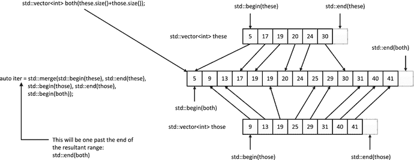
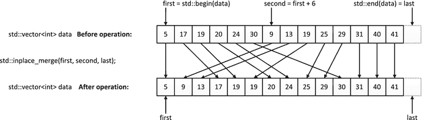
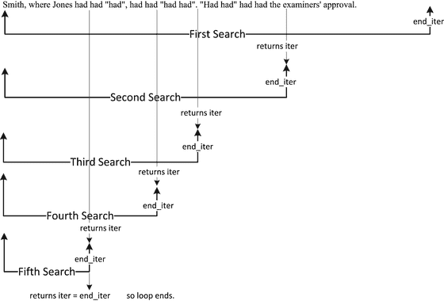

# 六、排序、合并、搜索和分区

Electronic supplementary material The online version of this chapter (doi:[10.​1007/​978-1-4842-0004-9_​6](http://dx.doi.org/10.1007/978-1-4842-0004-9_6)) contains supplementary material, which is available to authorized users.

本章描述了与排序和合并范围松散相关的算法。其中有两组专门提供排序和合并功能。另一组提供了相对于给定元素值划分范围的机制。另外两个组提供了在一个范围内查找一个或多个元素的方法。在本章中，您将了解:

*   如何将随机访问迭代器定义的范围按升序或降序排序？
*   如何防止相等的元素在排序操作中被重新排序？
*   如何合并有序范围？
*   如何搜索一个无序的范围来找到一个或多个给定的元素。
*   划分一个范围意味着什么，以及如何使用 STL 提供的划分算法。
*   如何使用二分搜索法算法？

## 对范围进行排序

排序在许多应用程序中是必不可少的，许多 STL 算法只能处理有序的对象范围。默认情况下，`algorithm`头中定义的`sort<Iter>()`函数模板将一系列元素按升序排序，这意味着假定要排序的对象类型支持`<`操作符。这些对象还必须是可交换的，这意味着必须能够使用在`utility`头中定义的`swap()`函数模板交换两个对象。这进一步意味着对象的类型必须实现一个移动构造函数和一个移动赋值操作符。`sort()`函数模板类型参数`Iter,`是范围内迭代器的类型，它们必须是随机访问迭代器。这意味着只有提供随机访问迭代器的容器中的元素才能被`sort()`算法排序，这意味着只有`array`、`vector`或`deque`容器中的元素或标准数组中的元素是可接受的。你在第二章中看到`list`和`forward_list`容器有`sort()`功能成员；这些用于排序的特殊成员是必要的，因为`list`只提供双向迭代器，而`forward_list`只提供正向迭代器。

`sort()`的模板类型参数将从函数调用参数中推导出来，这些参数将是定义要排序的对象范围的迭代器。当然，迭代器类型隐式定义了范围内对象的类型。这里有一个使用`sort() algorithm:`的例子

`std::vector<int> numbers {99, 77, 33, 66, 22, 11, 44, 88};`

`std::sort(std::begin(numbers), std::end(numbers));`

`std::copy(std::begin(numbers), std::end(numbers),`

`std::ostream_iterator<int> {std::cout, " "});   // Output: 11 22 33 44 66 77 88 99`

`sort()`调用将`numbers`容器中的所有元素按升序排序，`copy()`算法输出结果。您不必对容器中的所有内容进行排序。该语句对`numbers`中的元素进行排序，不包括第一个和最后一个:

`std::sort(++std::begin(numbers), --std::end(numbers));`

要按降序排序，您需要将用于比较元素的函数对象作为第三个参数提供给`sort()`:

`std::sort(std::begin(numbers), std::end(numbers), std::greater<>());`

比较函数必须返回一个`bool`值，并有两个参数，要么是解引用迭代器产生的类型，要么是解引用迭代器可以隐式转换的类型。参数可以是不同的类型。只要比较函数满足要求，它可以是你喜欢的任何东西，包括一个 lambda 表达式。例如:

`std::deque<string> words {"one", "two", "nine", "nine", "one", "three", "four", "five", "six"};`

`std::sort(std::begin(words), std::end(words),`

`{ return s1.back() > s2.back(); });`

`std::copy(std::begin(words), std::end(words),`

`std::ostream_iterator<string> {std::cout, " "}); // six four two one nine nine one three five`

这个语句序列对`deque`容器`words`中的`string`元素进行排序，并输出结果。这里的比较函数是一个 lambda 表达式，它比较每个单词的最后一个字母来确定排序顺序。结果是元素按其最后一个字母的降序排列。

让我们用一个简单的工作示例来看看`sort()`的运行，这个示例将从键盘读取`Name`对象，按升序对它们进行排序，然后输出结果。`Name`类将在`Name.h`头中定义，它将包含以下代码:

`#ifndef NAME_H`

`#define NAME_H`

`#include <string>                                // For string class`

`class Name`

`{`

`private:`

`std::string first{};`

`std::string second{};`

`public:`

`Name(const std::string& name1, const std::string& name2) : first(name1), second(name2){}`

`Name()=default;`

`std::string get_first() const {return first;}`

`std::string get_second() const { return second; }`

`friend std::istream& operator>>(std::istream& in, Name& name);`

`friend std::ostream& operator<<(std::ostream& out, const Name& name);`

`};`

`// Stream input for Name objects`

`inline std::istream& operator>>(std::istream& in, Name& name)`

`{`

`return in >> name.first >> name.second;`

`}`

`// Stream output for Name objects`

`inline std::ostream& operator<<(std::ostream& out, const Name& name)`

`{`

`return out << name.first << " " << name.second;`

`}`

`#endif`

流插入和提取操作符为`Name`对象定义为`friend`函数。您可以将`operator<()`定义为一个类成员，但是我省略了它，以显示将比较指定为`sort()`的一个参数。程序是这样的:

`// Ex6_01.cpp`

`// Sorting class objects`

`#include <iostream>                              // For standard streams`

`#include <string>                                // For string class`

`#include <vector>                                // For vector container`

`#include <iterator>                              // For stream and back insert iterators`

`#include <algorithm>                             // For sort() algorithm`

`#include "Name.h"`

`int main()`

`{`

`std::vector<Name> names;`

`std::cout << "Enter names as first name followed by second name. Enter Ctrl+Z to end:";`

`std::copy(std::istream_iterator<Name>(std::cin), std::istream_iterator<Name>(),`

`std::back_insert_iterator<std::vector<Name>>(names));`

`std::cout << names.size() << " names read. Sorting in ascending sequence...\n";`

`std::sort(std::begin(names), std::end(names), `

`{return name1.get_second() < name2.get_second(); });`

`std::cout << "\nThe names in ascending sequence are:\n";`

`std::copy(std::begin(names), std::end(names), std::ostream_iterator<Name>(std::cout, "\n"));`

`}`

`main()`中几乎所有的东西都是使用 STL 模板完成的。`names`容器将存储从`cin`中读取的名字。输入由`copy()`算法执行，该算法使用`istream_iterator<Name>`实例读取`Name`对象。`istream_iterator<Name>`的默认构造函数为流创建结束迭代器。`copy()`函数使用由`back_insert_iterator<Name>()`函数创建的`back_inserter<Name>`迭代器将每个输入对象复制到`names`。重载`Name`类的流操作符允许流迭代器用于`Name`对象的输入和输出。

对象的比较函数由 lambda 表达式定义，它是算法的第三个参数。如果要将`operator<()`定义为`Name`类的成员，可以省略这个参数。排序后的名称由`copy()`算法写入标准输出流，该算法将前两个参数指定的元素范围复制到第三个参数`ostream_iterator<Name>`对象。

以下是一些输出示例:

`Enter names as first name followed by second name. Enter Ctrl+Z to end:`

`Jim Jones`

`Bill Jones`

`Jane Smith`

`John Doe`

`Janet Jones`

`Willy Schaferknaker`

`^Z`

`6 names read. Sorting in ascending sequence...`

`The names in ascending sequence are:`

`John Doe`

`Jim Jones`

`Bill Jones`

`Janet Jones`

`Willy Schaferknaker`

`Jane Smith`

姓名的排序只考虑第二个姓名。当第二个名字相同时，您可以扩展 lambda 表达式来比较第一个名字。

你可能想知道为什么我没有在这个例子中使用`pair<string,string>`对象来表示名字；这将比定义一个新类更简单。显然，这是可能的，但却不太清楚。

### 排序和相等元素的顺序

`sort()`算法可能会改变相等元素的顺序，这有时不是您想要的。假设您有一个存储某种交易的容器，可能是银行账户。进一步假设您希望在处理交易之前按帐号对交易进行排序，以便可以按顺序更新帐户。如果 equal 元素出现的顺序反映了它们被添加到容器中的时间顺序，您将需要保留该顺序。允许给定账户的交易被重新安排可能导致账户看起来已经透支，而事实并非如此。

在这种情况下,`stable_sort()`算法提供了您需要的东西。它对一个范围内的元素进行排序，并确保相等的元素保持其原始顺序。有两个版本；一个接受两个指定排序范围的迭代器参数，另一个接受一个用于比较的附加参数。您可以修改对`Ex6_01.cpp`中的`names`容器进行排序的语句，以查看`stable_sort()`的工作情况:

`std::stable_sort(std::begin(names), std::end(names),`

` { return name1.get_second() < name2.get_second(); });`

当然，我为使用了`sort()`的`Ex6_01`展示的输出没有打乱相同元素的顺序，所以使用`stable_sort()`不会改变相同输入的输出。不同之处在于，使用`stable_sort()`可以保证相同元素的顺序不会改变，而使用`sort()`算法则不是这种情况。当您想确定相同元素的顺序保持不变时，使用`stable_sort()`。

### 部分排序

通过一个例子最容易理解部分排序是什么意思。假设您有一个容器，其中收集了几百万个值，但您只对其中最低的 100 个值感兴趣。您可以对容器的全部内容进行排序，并选择前 100 个，但这可能会有点耗时。您需要的是部分排序，在这种情况下，一个范围内的大量值中只有最低的`n`按顺序排列。这里有一个特殊的算法，`partial_sort()`算法，它期望三个参数是随机访问迭代器。如果功能参数为`first`、`second`和`last`，则算法适用于范围`[first,last)`内的元素。执行算法后，范围`[first,second)`将包含范围`[first,last)`中升序排列的最低`second-first`元素。

Note

如果你以前没有遇到过，我用来表示范围的符号`[first,last)`来源于数学，它定义了区间，区间定义了数字的范围。这两个值称为端点。在该符号中，方括号表示相邻端点包括在范围内，圆括号表示相邻端点不包括在内。例如，如果`(2,5)`是一个整数区间，2 和 5 被排除在外，所以它只代表整数`3,4`；这被称为开放区间，因为两个端点都不包括在内。区间`[2,5)`包括 2 但不包括 5，所以它代表`2,3,4`。(2，5)代表 3，4，5。[2，5]代表 2，3，4，5，被称为封闭区间，因为两端点都包括在内。当然，`first`和`last`是迭代器，`[first,last)`表示`first`指向的被包含，而`last`指向的不被包含——所以它在 C++ 中精确地表达了一个范围。

这里有一些代码展示了`partial_sort()`算法是如何工作的:

`size_t count {5};                                // Number of elements to be sorted`

`std::vector<int> numbers {22, 7, 93, 45, 19, 56, 88, 12, 8, 7, 15, 10};`

`std::partial_sort(std::begin(numbers), std::begin(numbers) + count, std::end(numbers));`

执行上述`partial_sort()`的效果如图 [6-1](#Fig1) 所示。

图 6-1。

Operation of the `partial_sort()` algorithm

最低的`count`元素按顺序排列。在范围`[first,second)`中，`second`指向的元素不包含在内，因为`second`是最后一个迭代器。图 [6-1](#Fig1) 显示了在我的系统上执行语句的结果；在您的系统上可能有所不同。请注意，没有排序的元素的原始顺序没有保持。执行`partial_sort()`后这些元素的顺序是不确定的，取决于您的实现。

如果您希望`partial_sort()`算法使用不同于`<`操作符的比较，您可以提供一个函数对象作为附加参数。例如:

`std::partial_sort(std::begin(numbers), std::begin(numbers) + count, std::end(numbers),`

`std::greater<>());`

现在，`numbers`中最大的`count`元素将在容器的开头按降序排列。在我的系统上，执行这条语句的结果是:

`93 88 56 45 22 7 19 12 8 7 15 10`

同样，`numbers`中未排序的元素的原始顺序也不会保留。

除了将排序后的元素复制到另一个容器中的不同区域之外，`partial_sort_copy()`算法与`partial_sort()`基本相同。前两个参数是迭代器，指定部分排序要应用的范围；第三个和第四个参数是迭代器，用于标识存储结果的范围。目标范围中的元素数量决定了输入范围中将要排序的元素数量。这里有一个例子:

`std::vector<int> numbers {22, 7, 93, 45, 19, 56, 88, 12, 8, 7, 15, 10};`

`size_t count {5};                             // Number of elements to be sorted`

`std::vector<int> result(count);                  // Destination for the results - count elements`

`std::partial_sort_copy(std::begin(numbers), std::end(numbers), std::begin(result), std::end(result));`

`std::copy(std::begin(numbers), std::end(numbers), std::ostream_iterator<int> {std::cout, " "});`

`std::cout << std::endl;`

`std::copy(std::begin(result), std::end(result), std::ostream_iterator<int> {std::cout, " "});`

`std::cout << std::endl;`

这些语句实现了`numbers`容器的部分排序。这个想法是将来自`numbers`的最底层的`count`元素按顺序放置，并将它们存储在`result`容器中。您指定为目的地的范围必须存在，因此在目的地容器`result`中必须至少有`count`个元素，在本例中，我们分配的正好是所需的数量。执行这些语句的输出是:

`22 7 93 45 19 56 88 12 8 7 15 10`

`7 7 8 10 12`

你可以看到`numbers`中的元素序列没有被打乱，`result`包含了从`numbers`开始按升序排列的最低`count`元素的副本。

当然，您可以通过额外的参数指定不同的比较函数:

`std::partial_sort_copy(std::begin(numbers), std::end(numbers), std::begin(result), std::end(result),`

`std::greater<>());`

将`greater<>`的一个实例指定为函数对象将导致最大的`count`元素按降序被复制到`result`。如果该语句后面跟有前面代码片段的输出语句，输出将是:

`22 7 93 45 19 56 88 12 8 7 15 10`

`93 88 56 45 22`

和以前一样，原始容器中的元素顺序是不受干扰的。

`nth_element()`算法不同于`partial_sort()`。它适用的范围由函数的第一个和第三个参数定义，第二个参数是一个指向第`n`个元素的迭代器。执行`nth_element()`将导致第 n 个元素被设置为如果该范围被完全排序时应该存在的元素。范围中第`n`个元素之前的所有元素都将小于第`n`个元素，之后的所有元素都将大于第`n`个元素。默认情况下，该算法使用`<`运算符来产生结果。下面是一些要练习的代码`nth_element()`:

`std::vector<int> numbers {22, 7, 93, 45, 19, 56, 88, 12, 8, 7, 15, 10};`

`size_t count {5};                                // Index of nth element`

`std::nth_element(std::begin(numbers), std::begin(numbers) + count, std::end(numbers));`

第 n 个元素是`numbers`容器中的第 6 个，对应的是`numbers[5]`。图 [6-2](#Fig2) 说明了这是如何工作的。

图 6-2。

Operation of the `nth_element()` algorithm

第`n`个元素之前的元素将少于第`n`个元素，但不一定是有序的。同样，第`n`个元素之后的元素会比它大，但不一定是有序的。如果第二个参数与第三个参数相同(范围的结尾)，则该算法无效。

与本章前面的算法一样，您可以提供一个函数对象，将比较定义为第四个参数:

`std::nth_element(std::begin(numbers), std::begin(numbers) + count, std::end(numbers),`

`std::greater<>());`

这使用了`>`操作符来比较元素，所以如果元素是降序的，那么第`n`个元素将是它应该是的。第`n`个元素前面的元素会更大，后面的元素会更小。使用前面`numbers`容器中的初始值，结果将是:

`45 56 93 88 22 19 10 12 15 7 8 7`

在您的系统中，第 n 个元素两边的元素顺序可能不同，但是左边的应该比它大，右边的应该比它小。

### 排序范围的测试

排序非常耗时，尤其是当您有大量元素时。测试一个范围是否已经排序可以避免不必要的排序操作。如果由两个迭代器参数指定的范围内的元素是升序，那么`is_sorted()`函数模板返回`true`。迭代器必须至少是前向迭代器，以允许元素被顺序处理。提醒你一下——前向迭代器支持前缀和后缀增量操作。这里有一个使用`is_sorted()`的例子:

`std::vector<int> numbers {22, 7, 93, 45, 19};`

`std::vector<double> data {1.5, 2.5, 3.5, 4.5};`

`std::cout << "numbers is "`

`<< (std::is_sorted(std::begin(numbers), std::end(numbers)) ? "": "not ")`

`<< "in ascending sequence.\n";`

`std::cout << "data is "`

`<< (std::is_sorted(std::begin(data), std::end(data)) ? "": "not ")`

`<< "in ascending sequence." << std::endl;`

使用的默认比较是`<`操作符。输出将显示`numbers`不在升序中，而`data`在。有一个版本允许你提供一个函数对象来比较元素:

`std::cout << "data reversed is "`

`<< (std::is_sorted(std::rbegin(data), std::rend(data), std::greater<>()) ? "": "not ")`

`<< "in descending sequence." << std::endl;`

该语句的输出将表明`data`中逆序的元素按降序排列。

您还可以使用`is_sorted_until()`函数模板来确定某个范围内的元素的顺序。参数是定义测试范围的迭代器。这个函数返回一个迭代器，这个迭代器是这个范围中按升序排列的元素的上限。这里有一个例子:

`std::vector<string> pets {"cat", "chicken", "dog", "pig", "llama",  "coati", "goat"};`

`std::cout << "The pets in ascending sequence are:\n";`

`std::copy(std::begin(pets), std::is_sorted_until(std::begin(pets), std::end(pets)),`

`std::ostream_iterator<string>{std::cout, " "});`

`copy()`算法的前两个参数是`pets`容器的 begin 迭代器和`is_sorted_until()`应用于 pets 中所有元素时返回的迭代器。`is_sorted_until()`算法将返回`pets`中升序排列的元素的上限——这将是一个迭代器，指向小于其前任的第一个元素，或者是序列的结束迭代器(如果排序的话)。该代码的输出将是:

`The pets in ascending sequence are:`

`cat chicken dog pig`

`"llama"`是小于其前身的第一个元素，因此`"pig"`是升序序列中的最后一个元素。

您可以选择提供一个函数对象来比较元素:

`std::vector<string> pets {"dog", "coati", "cat", "chicken", "pig", "llama",  "goat"};`

`std::cout << "The pets in descending sequence are:\n";`

`std::copy(std::begin(pets),`

`std::is_sorted_until(std::begin(pets), std::end(pets), std::greater<>()),`

`std::ostream_iterator<string>{std::cout, " "});`

这次我们寻找一个降序的元素序列，因为`string`类的`operator>()`成员将用于比较元素。输出将是:

`The pets in descending sequence are:`

`dog coati cat`

`"chicken"`是第一个大于其前任的元素，所以由`is_sorted_until()`返回的迭代器将指向这个元素。因此`"cat"`是降序排列的最后一个元素。

## 合并范围

合并操作将两个范围中以相同方式排序的元素组合在一起——要么都是升序，要么都是降序。结果是包含来自两个输入范围的元素副本的范围，其排序方式与原始范围相同。图 [6-3](#Fig3) 说明了这是如何工作的。

图 6-3。

Merging elements from two `vector` containers

`merge()`算法合并两个范围，并将结果存储在第三个范围中。它使用`<`操作符来比较元素。图 [6-3](#Fig3) 显示了应用于`these`和`those`容器内容的合并操作，其中结果范围存储在`both`容器中。`merge()`算法需要五个参数。前两个是迭代器，指定第一个输入范围—`these`,在本例中，后两个是迭代器，标识第二个输入范围—`those`,最后一个参数是迭代器，标识第一个合并的元素范围应该放在哪里—`both`容器。标识要合并的范围的迭代器至少只需要是输入迭代器，用于保存结果的目标范围的迭代器只需要是输出迭代器。

`merge()`算法没有关于合并元素范围的容器的信息，所以它不能创建元素——它只能使用您作为第五个参数提供的迭代器来存储元素。因此，示例中目标范围内的元素必须已经存在。这在图 [6-3](#Fig3) 中通过创建`both`容器来确保，容器中的元素数量指定为每个输入容器的元素总数。目标区域可以在任何地方，甚至可以在一个源区域容器中，但是源区域和目标区域不能重叠。如果他们这样做，后果是不确定的，但你可以肯定的是，效果不会好。当然，如果通过插入迭代器指定目的地，元素将被自动创建。

`merge()`算法返回一个迭代器，该迭代器指向合并范围中最后一个元素之后的一个元素，因此您可以通过函数调用中使用的第五个迭代器参数加上函数返回的迭代器来标识合并范围。

当比较需要不同于`<`操作符时，您可以提供一个函数对象作为第六个参数。例如:

`std::vector<int> these {2, 15, 4, 11, 6, 7};                     // 1st input to merge`

`std::vector<int> those {5, 2, 3, 2, 14, 11, 6};                  // 2nd input to merge`

`std::stable_sort(std::begin(these), std::end(these),             // Sort 1st range in...`

`std::greater<>());           // ...descending sequence`

`std::stable_sort(std::begin(those), std::end(those),             // Sort 2nd range`

`std::greater<>());`

`std::vector<int> result(these.size() + those.size() + 10);             // Plenty of room for results`

`auto end_iter = std::merge(std::begin(these), std::end(these),   // Merge 1st range...`

`std::begin(those), std::end(those),   // ...and 2nd range...`

`std::begin(result), std::greater<>()); // ...into result`

`std::copy(std::begin(result), end_iter, std::ostream_iterator<int>{std::cout, " "});`

这个语句序列首先使用`stable_sort()`将两个`vector`容器的内容按降序排序，这保证了 equal 元素的原始顺序将被保持。合并操作将两个容器的内容合并到第三个容器`result`中，这个容器比需要的多创建了 10 个元素——只是为了演示`merge()`返回的迭代器的使用。`copy()`算法复制由`result`的 begin 迭代器和`merge()`返回的`end_iter`迭代器指定的范围到输出流迭代器。输出将是:

`15 14 11 11 7 6 6 5 4 3 2 2 2`

`inplace_merge()`算法就地合并相同范围内的两个连续排序的元素序列。有三个参数，`first`、`second`和`last`是双向迭代器。第一个输入序列的范围是`[first,second)`，第二个输入序列的范围是`[second,last)`，因此`second`指向的元素在第二个输入范围内。结果将是范围`[first,last)`。图 [6-4](#Fig4) 显示了该操作。

图 6-4。

`inplace_merge()` operation

图 [6-4](#Fig4) 中的`data`容器包含两个范围，都是升序排列。`inplace_merge()`操作将这些组合起来，在同一个容器中产生一个升序范围。

我们可以将你在本章中看到的几个算法合并成一个单一的工作示例。这个有些做作的示例将处理从键盘输入的信贷和借记交易，并将它们应用到根据需要创建的一组帐户。我们将始终创建零余额账户。交易将是一个包含账号、金额以及金额是贷方还是借方的对象。为不存在的账户处理交易将导致该账户被创建。帐户对象将包含标识唯一帐号、所有者姓名和当前余额的成员。账户持有人的名字将是一个包含名字和第二个名字的`pair`对象。帐号将是一个无符号整数。贷记将被表示为一个`bool`值，账户余额和要借记或贷记的金额将属于`double`类型。

`Transaction`类型将在`Transaction.h`头文件中定义如下:

`#ifndef TRANSACTION_H`

`#define TRANSACTION_H`

`#include <iostream>                              // For stream class`

`#include <iomanip>                               // For stream manipulators`

`#include "Account.h"`

`class Transaction`

`{`

`private:`

`size_t account_number {};                      // The account number`

`double amount {};                              // The amount`

`bool credit {true};                            // credit = true debit=false`

`public:`

`Transaction()=default;`

`Transaction(size_t number, double amnt, bool cr) : account_number {number}, amount {amnt},`

`credit {cr}{}`

`size_t get_acc_number() const { return account_number; }`

`// Less-than operator - compares account numbers`

`bool operator<(const Transaction& transaction) const { return account_number <                                                               transaction.account_number; }`

`// Greater-than operator - compares account numbers`

`bool operator>(const Transaction& transaction) const { return account_number >                                                              transaction.account_number; }`

`friend std::ostream& operator<<(std::ostream& out, const Transaction& transaction);`

`friend std::istream& operator>>(std::istream& in, Transaction& transaction);`

`// Making the Account class a friend allows Account objects`

`// to access private members of Transaction objects`

`friend class Account;`

`};`

`// Stream insertion operator for Transaction objects`

`std::ostream& operator<<(std::ostream& out, const Transaction& transaction)`

`{`

`return out << std::right << std::setfill('0') << std::setw(5)              << transaction.account_number`

`<< std::setfill(' ') << std::setw(8) << std::fixed << std::setprecision(2)              << transaction.amount`

`<< (transaction.credit ? " CR" : " DR");`

`}`

`// Stream extraction operator for Transaction objects`

`std::istream& operator>>(std::istream& in, Transaction& tr)`

`{`

`if((in >> std::skipws >> tr.account_number).eof())`

`return in;`

`return in >> tr.amount >> std::boolalpha >> tr.credit;`

`}`

`#endif`

默认构造函数通常是允许在容器中创建默认元素所必需的。在类中同时包含`<`和`>`操作符允许对`Transaction`对象进行升序或降序排序，尽管这个例子不会同时使用这两个选项。我们接下来要讨论的`Account`类是`Transaction`类的`friend`，因此`Account`类的函数成员可以访问传递给它的`Transaction`对象的`private`数据成员。定义了重载的流输入和输出操作符后，我们将能够结合 STL 提供的流迭代器使用`copy()`算法来读写`Transaction`对象。

`Account`类将在`Account.h`头中定义:

`#ifndef ACCCOUNT_H`

`#define ACCCOUNT_H`

`#include <iostream>                                   // For stream class`

`#include <iomanip>                                    // For stream manipulators`

`#include <string>                                     // For string class`

`#include <utility>                                    // For pair template type`

`#include "Transaction.h"`

`using first_name = std::string;`

`using second_name = std::string;`

`using Name = std::pair<first_name, second_Name>;`

`class Account`

`{`

`private:`

`size_t account_number {};                           // 5-digit account number`

`Name name {"", ""};                                 // A pair containing 1st & 2nd names`

`double balance {};                                  // The account balance - negative when overdrawn`

`public:`

`Account()=default;`

`Account(size_t number, const Name& nm) : account_number {number}, name {nm}{}`

`double get_balance() const { return balance; }`

`void set_balance(double bal) { balance = bal; }`

`size_t get_acc_number() const {return account_number;}`

`const Name& get_name() const { return name; }`

`// Apply a transaction to the account`

`bool apply_transaction(const Transaction& transaction)`

`{`

`if(transaction.credit)                            // For a credit...`

`balance += transaction.amount;                  // ...add the mount`

`else                                              // For a debit...`

`balance -= transaction.amount;                  // ...subtract the amount`

`return balance < 0.0;                             // Return true when overdrawn`

`}`

`// Less-than operator - compares by account number`

`bool operator<(const Account& acc) const { return account_number < acc.account_number; }`

`friend std::ostream& operator<<(std::ostream& out, const Account& account);`

`};`

`// Stream insertion operator for Account objects`

`std::ostream& operator<<(std::ostream& out, const Account& acc)`

`{`

`return out << std::left << std::setw(20) << acc.name.first + " " + acc.name.second`

`<< std::right << std::setfill('0') << std::setw(5) << acc.account_number`

`<< std::setfill(' ') << std::setw(8) << std::fixed << std::setprecision(2) << acc.balance;`

`}`

`#endif`

除了帐号之外，该类还有一个`Name`成员来标识帐户的所有者。一个`Name`只是一个`pair<string,string>`类型的别名，`first_name`和`second_name`别名仅仅是为了标识每个`pair`成员的重要性。类型别名通常有助于将特定于应用程序的含义赋予一般类型。

为`Account`对象重载流插入操作符允许使用`<<`将对象写入输出流。`operator<()`成员定义允许`Account`对象在排序或存储到有序容器中时按账号排序。如果你想让`Account`对象以不同的方式排序——比如通过名字，你可以定义一个提供比较功能的函数对象。该示例将按名称对`Account`对象进行排序，启用该功能的函数对象将在`Compare_Names.h`中定义，如下所示:

`#ifndef COMPARE_NAMES_H`

`#define COMPARE_NAMES_H`

`#include "Account.h"`

`// Order Account objects in ascending sequence by Name`

`class Compare_Names`

`{`

`public:`

`bool operator()(const Account& acc1, const Account& acc2)`

`{`

`const auto& name1 = acc1.get_name();`

`const auto& name2 = acc2.get_name();`

`return (name1.second < name2.second) ||`

`((name1.second == name2.second) && (name1.first < name2.first));`

`}`

`};`

`#endif`

你应该不难理解这是如何工作的。函数调用操作符定义比较两个`Account`对象的`Name`成员，首先通过名字，其次通过名字。

使用我们定义的类的`main()`程序将在`Ex6_02.cpp`中:

`// Ex6_02.cpp`

`// Sorting and inplace merging`

`#include <iostream>                              // For standard streams`

`#include <string>                                // For string class`

`#include <algorithm>                             // For sort(), inplace_merge()`

`#include <functional>                            // For greater<T>`

`#include <vector>                                // For vector container`

`#include <utility>                               // For pair template type`

`#include <map>                                   // For map container`

`#include <iterator>                              // For stream and back insert iterators`

`#include "Account.h"`

`#include "Transaction.h"`

`#include "Compare_Names.h"`

`using std::string;`

`using first_name = string;`

`using second_name = string;`

`using Name = std::pair<first_name, second_Name>;`

`using Account_Number = size_t;`

`// Read the name of an account holder`

`Name get_holder_name(Account_Number number)`

`{`

`std::cout << "Enter the holder’s first and second names for account number " << number << ": ";`

`string first {};`

`string second {};`

`std::cin >> first  >> second;`

`return std::make_pair(first, second);`

`}`

`int main()`

`{`

`std::vector<Transaction> transactions;`

`std::cout << "Enter each transaction as:\n"`

`<< "   5 digit account number   amount   credit(true or false).\n"`

`<< "Enter Ctrl+Z to end.\n";`

`// Read 1st set of transactions`

`std::copy(std::istream_iterator<Transaction> {std::cin}, std::istream_iterator<Transaction> {},`

`std::back_inserter(transactions));`

`std::cin.clear();                              // Clear the EOF flag for the stream`

`// Sort 1st set``in`T2】

`std::stable_sort(std::begin(transactions), std::end(transactions), std::greater<>());`

`// List the transactions`

`std::cout << "First set of transactions after sorting...\n";`

`std::copy(std::begin(transactions), std::end(transactions),                                     std::ostream_iterator<Transaction>{std::cout, "\n"});`

`// Read 2nd set of transactions`

`std::cout << "\nEnter more transactions:\n";`

`std::copy(std::istream_iterator<Transaction> {std::cin}, std::istream_iterator<Transaction> {},`

`std::back_inserter(transactions));`

`std::cin.clear();                              // Clear the EOF flag for the stream`

`// List the transactions`

`std::cout << "\nSorted first set of transactions with second set appended...\n";`

`std::copy(std::begin(transactions), std::end(transactions),                                       std::ostream_iterator<Transaction>{std::cout, "\n"});`

`// Sort second set into descending account sequence`

`auto iter = std::is_sorted_until(std::begin(transactions), std::end(transactions),`

`std::greater<>());`

`std::stable_sort(iter, std::end(transactions), std::greater<>());`

`// List the transactions`

`std::cout << "\nSorted first set of transactions with sorted second set appended...\n";`

`std::copy(std::begin(transactions), std::end(transactions),                                     std::ostream_iterator<Transaction>{std::cout, "\n"});`

`// Merge transactions in place`

`std::inplace_merge(std::begin(transactions), iter, std::end(transactions), std::greater<>());`

`// List the transactions`

`std::cout << "\nMerged sets of transactions...\n";`

`std::copy(std::begin(transactions), std::end(transactions),                                     std::ostream_iterator<Transaction>{std::cout, "\n"});`

`// Process transactions creating Account objects when necessary`

`std::map<Account_Number, Account> accounts;`

`for(const auto& tr : transactions)`

`{`

`Account_Number number = tr.get_acc_number();`

`auto iter = accounts.find(number);`

`if(iter == std::end(accounts))`

`iter = accounts.emplace(number, Account {number, get_holder_name(number)}).first;`

`if(iter->second.apply_transaction(tr))`

`{`

`auto name = iter->second.get_name();`

`std::cout << "\nAccount number " << number`

`<< " for " << name.first << " " <<name.second << " is overdrawn!\n"`

`<< "The concept is that you bank with us - not the other way round, so fix it!\n"`

`<< std::endl;`

`}`

`}`

`// Copy accounts to a vector container`

`std::vector<Account> accs;`

`for(const auto& pr :accounts)`

`accs.push_back(pr.second);`

`// List accounts after sorting in name sequence`

`std::stable_sort(std::begin(accs), std::end(accs), Compare_Names());`

`std::copy(std::begin(accs), std::end(accs), std::ostream_iterator < Account > {std::cout, "\n"});`

`}`

`get_holder_name()`是一个助手函数，它从`cin`中读取给定账号的名称。这是在为一个给定的账号处理一个交易并且没有`Account`对象时使用的。返回的`Name`对象将用于创建`Account`对象。

事务作为`Transaction`对象被读取并存储在`vector<Transaction>`容器`transactions`中。代码读取一个使用`stable_sort()`按降序排序的事务序列。然后，第二个事务序列被读入同一个容器，并以同样的方式进行排序。通过设法创建一个包含两个排序的事务序列的`vector`，我们可以利用`inplace_merge()`创建两个序列的有序组合。

下面是针对五个帐户的七笔交易的输出示例。我选择事务数量来演示排序和合并操作的行为方式。

`Enter each transaction as:`

`5 digit account number   amount   credit(true or false).`

`Enter Ctrl+Z to end.`

`12345 40 true`

`12344 50 true`

`12346 75.5 true`

`^Z`

`First set of transactions after sorting...`

`12346   75.50 CR`

`12345   40.00 CR`

`12344   50.00 CR`

`Enter more transactions:`

`12344 25.25 true`

`12345 75 false`

`12345 100 true`

`12346 100 true`

`^Z`

`Sorted first set of transactions with second set appended...`

`12346   75.50 CR`

`12345   40.00 CR`

`12344   50.00 CR`

`12344   25.25 CR`

`12345   75.00 DR`

`12345  100.00 CR`

`12346  100.00 CR`

`Sorted first set of transactions with sorted second set appended...`

`12346   75.50 CR`

`12345   40.00 CR`

`12344   50.00 CR`

`12344   25.25 CR`

`12346  100.00 CR`

`12345   75.00 DR`

`12345  100.00 CR`

`Merged sets of transactions...`

`12346   75.50 CR`

`12346  100.00 CR`

`12345   40.00 CR`

`12345   75.00 DR`

`12345  100.00 CR`

`12344   50.00 CR`

`12344   25.25 CR`

`Enter the holder’s first and second names for account number 12346: Stan Dupp`

`Enter the holder’s first and second names for account number 12345: Ann Ounce`

`Account number 12345 for Ann Ounce is overdrawn!`

`The concept is that you bank with us - not the other way round, so fix it!`

`Enter the holder’s first and second names for account number 12344: Dan Druff`

`Dan Druff           12344   75.25`

`Stan Dupp           12346  175.50`

`Ann Ounce           12345   65.00`

在每个阶段都列出了`Transaction`对象的序列，所以你可以看到`stable_sort()`和`inplace_merge()`算法像我描述的那样工作。特别是，等价交易的顺序是保持不变的，所以借项和贷项是按照它们产生的顺序来应用的。最后，帐户按名称顺序列出，以表明交易已被正确应用。这是通过将`map`容器中的`Account`对象复制到`vector<Account>`容器中，并将`stable_sort()`算法应用于`vector`中的元素，其中`Compare_Names`函数对象提供比较。您可以将`Account`对象复制到一个`set<Account, Compare_Names>`容器而不是`vector<Account>`容器中，让对象自动排序，但是这样您就会错过使用`stable_sort()`的机会。

## 搜索范围

STL 提供了多种多样的算法，用于以各种方式搜索一系列对象。这些方法大多处理无序序列。但是有些，我稍后会讲到，需要对序列进行排序。

### 查找范围中的元素

有三种算法可以在两个输入迭代器定义的范围内找到单个对象。

*   `find()`算法在由前两个参数指定的范围内找到第一个等于第三个参数的对象。
*   `find_if()`算法在前两个参数指定的范围内找到第一个对象，第三个参数指定的谓词为该对象返回`true`。谓词不能修改传递给它的对象。
*   `find_if_not()`算法在前两个参数指定的范围内找到第一个对象，第三个参数指定的谓词为该对象返回`false`。谓词不能修改传递给它的对象。

每个算法返回一个指向找到的对象的迭代器，如果没有找到对象，则返回该范围的结束迭代器。以下是如何使用`find()`的示例:

`std::vector<int> numbers {5, 46, -5, -6, 23, 17, 5, 9, 6, 5};`

`int value {23};`

`auto iter = std::find(std::begin(numbers), std::end(numbers), value);`

`if(iter !=  std::end(numbers)) std::cout << value << " was found.\n";`

这段代码将输出消息，表明在`numbers`向量中确实找到了`23`。当然，您可以重复使用`find()`来查找给定元素在一个范围内的所有出现:

`size_t count {};`

`int five {5};`

`auto start_iter = std::begin(numbers);`

`auto end_iter = std::end(numbers);`

`while((start_iter = std::find(start_iter, end_iter, five)) != end_iter)`

`{`

`++count;`

`++start_iter;`

`}`

`std::cout << five << " was found " << count << " times." << std::endl;    // 3 times`

在`while`循环中递增的`count`变量计算在`numbers`向量中找到`five`的次数。循环表达式调用`find()`在`start_iter`和`end_iter`定义的范围内寻找`five`。`find()`返回的迭代器存储在`start_iter`中，覆盖变量之前的值。最初，搜索的范围是`numbers`中的所有元素，因此`find()`将返回一个迭代器，指向第一次出现的`five`。每次找到`five`时，`start_iter`在循环中递增，因此它将指向所找到的元素之后的元素。因此，下一次迭代将从该点搜索到序列的末尾。当`five`不再存在时，`find()`将返回`end_iter`，循环结束。

您可以使用`find_if()`来查找`numbers`中大于`value`的第一个元素，如下所示:

`int value {5};`

`auto iter1 = std::find_if(std::begin(numbers), std::end(numbers),                                                      [value](int n) { return n > value; });`

`if(iter1 != std::end(numbers)) std::cout << *iter1 << " was found greater than " << value << ".\n";`

`find_if()`的第三个参数是一个由 lambda 表达式定义的谓词。lambda 表达式通过值捕获`value`，并在 lambda 的参数大于`value`时返回`true`。这个片段将找到值为`46`的元素。您可以在一个循环中使用`find_if()`来查找所有大于`value`的数字，就像前面的代码片段一样。

您可以使用`find_if_not()`算法来查找谓词为`false`的元素，如下所示:

`size_t count {};`

`int five {5};`

`auto start_iter = std::begin(numbers);`

`auto end_iter = std::end(numbers);`

`while((start_iter = std::find_if_not(start_iter, end_iter,`

`[five](int n) {return n > five; })) != end_iter)`

`{`

`++count;`

`++start_iter;`

`}`

`std::cout << count << " elements were found that are not greater than "<< five << std::endl;`

作为`find_if_not()`的第三个参数的谓词是一个 lambda 表达式，类似于我之前在`find_if()`算法中使用的表达式。只有当一个元素大于`five`时，才会返回`true`。当谓词返回`false`时找到一个元素，因此操作实际上是找到小于或等于`five`的元素。将找到与该范围中的值`5`、`-5`、`-6`、`5`和`5`相对应的五个元素。

### 在一个范围中查找一系列元素中的任何一个

`find_first_of()`算法在一个范围中搜索第二个范围中任何元素的第一个匹配项。要搜索的范围可以仅由输入迭代器指定，但是标识所搜索内容的范围必须至少是前向迭代器。来自两个范围的元素使用`==`操作符进行比较，所以如果范围指定了一个类类型的对象，这个类必须实现`operator==()`。这里有一个使用`find_first_of()`的例子:

`string text {"The world of searching"};`

`string vowels {"aeiou"};`

`auto iter = std::find_first_of(std::begin(text), std::end(text), std::begin(vowels),                                                                 std::end(vowels));`

`if(iter != std::end(text)) std::cout << "We found '" << *iter << "'." << std::endl; // We found 'e'.`

这段代码在`text`中搜索第一次出现的`vowels`中的任何字符。指向`"The"`中第三个字母的迭代器在这个实例中被返回。您可以使用一个循环来查找来自`vowels`的任何字符在`text`中的所有出现:

`string found {};                                   // Records characters that are found`

`for(auto iter = std::begin(text);`

`(iter = std::find_first_of(`

`iter, std::end(text), std::begin(vowels), std::end(vowels))) != std::end(text);  )`

`found += *(iter++);`

`std::cout << "The characters \"" << found << "\" were found in text." << std::endl;`

这使用了一个`for`循环——只是为了证明你可以。第一个循环控制表达式用初始值定义了`iter`，作为`text`的开始迭代器。第二个控制表达式调用`find_first_of()`在范围`[iter, std::end(text))`中搜索从`vowels`开始的任何字符的第一次出现。`find_first_of()`返回的迭代器存储在`iter`中，然后与`text`的结束迭代器进行比较。如果`iter`现在是`text`的结束迭代器，循环结束。如果`iter`不是`text`的结束迭代器，则循环体执行将`iter`指向的字符追加到`found`字符串，并递增`iter`指向下一个字符。该字符将用作下一次搜索范围的起始位置。这个片段产生的输出将是:

`The characters "eooeai" were found in text.`

另一个版本的`find_first_of()`使您能够从第二个范围中搜索任何元素的第一次出现，其中由第五个参数指定的二元谓词返回`true`。范围中的元素不需要属于同一类型。当要比较的元素不支持`==`操作符时，您可以使用这个版本的算法来定义相等比较，但是您也可以以其他方式使用它。例如:

`std::vector<long> numbers {64L, 46L, -65L, -128L, 121L, 17L, 35L, 9L, 91L, 5L};`

`int factors[] {7, 11, 13};`

`auto iter = std::find_first_of(std::begin(numbers),                                std::end(numbers),             // The range to be searched`

`std::begin(factors), std::end(factors),   // Elements sought`

` { return v % d == 0;});  // Predicate - true for a match`

`if(iter != std::end(numbers)) std::cout << *iter << " was found." << std::endl;`

谓词是一个 lambda 表达式，当第一个参数被第二个参数整除时，它返回`true`。因此这段代码找到了`-65`,因为这是`numbers`中第一个能被`factors`数组中的一个元素整除的元素，在本例中是`13`。谓词中的参数类型可以不同于范围中的元素类型，只要每个范围中的元素可以隐式转换为相应的参数类型。这里，`factors`数组中的元素被隐式转换为类型`long`。

当然，您可以使用循环来查找谓词返回`true`的所有元素:

`std::vector<long> numbers {64L, 46L, -65L, -128L, 121L, 17L, 35L, 9L, 91L, 5L};`

`int factors[] {7, 11, 13};`

`std::vector<long> results;                            // Stores elements found`

`auto iter = std::begin(numbers);`

`while((iter = std::find_first_of(iter, std::end(numbers),                 // Range searched`

`std::begin(factors), std::end(factors),   // Elements sought`

` { return v % d == 0; })) // Predicate`

`!= std::end(numbers))`

`results.push_back(*iter++);`

`std::cout << results.size() << " values were found:\n";`

`std::copy(std::begin(results), std::end(results), std::ostream_iterator < long > {std::cout, " " });`

`std::cout << std::endl;`

这个代码片段在`numbers`中找到所有将来自`factors`的元素作为因子的元素。只要`find_first_of()`返回的迭代器不是`numbers`的结束迭代器，`while`循环就会继续。`iter`变量开始指向`numbers`中的第一个元素，指向找到的元素的迭代器存储在`iter`中，覆盖先前的值。在循环体中，`iter`指向的元素存储在`results`容器中，然后`iter`递增指向后面的元素。当循环结束时，`results`包含所有找到的元素，并使用`copy()`算法输出。

### 从一个范围中查找多个元素

`adjacent_find()`算法在一个范围内搜索两个相同的连续元素。使用`==`操作符比较连续的元素对，并返回指向前两个相等元素中第一个的迭代器。如果没有相等的元素对，该算法返回该范围的结束迭代器。例如:

`string saying {"Children should be seen and not heard."};`

`auto iter = std::adjacent_find(std::begin(saying), std::end(saying));`

`if(iter != std::end(saying))`

`std::cout << "In the following text:\n\"" << saying << "\"\n'"`

`<< *iter << "' is repeated starting at index position "`

`<< std::distance(std::begin(saying), iter) << std::endl;`

这将在`saying`字符串中搜索前两个相同的连续字符，因此代码将产生以下输出:

`In the following text:`

`"Children should be seen and not heard."`

`'e' is repeated starting at index position 20`

第二个版本的`adjacent_find()`算法允许您提供一个应用于连续元素的谓词。下面是如何使用它来查找一个范围内的第一对连续的奇数整数:

`std::vector<long> numbers {64L, 46L, -65L, -128L, 121L, 17L, 35L, 9L, 91L, 5L};`

`auto iter = std::adjacent_find(std::begin(numbers), std::end(numbers),`

`{ return n1 % 2 && n2 % 2; });`

`if(iter != std::end(numbers))`

`std::cout << "The first pair of odd numbers is "`

`<< *iter << " and " << *(iter+1) << std::endl;`

当两个参数都不是 2 的倍数时，lambda 表达式返回`true`，因此这段代码将找到数字`121`和`17`。

#### find end()算法

`find_end()`算法查找第二个元素范围中的最后一个匹配项。您可以将此想象为在任何类型的元素序列中查找子序列的最后一个匹配项。该算法返回一个指向子序列最后一次出现的第一个元素的迭代器，或者是正在搜索的范围的结束迭代器。这里有一个使用它的例子:

`string text  {"Smith, where Jones had had \"had\", had had \"had had\"."`

`" \"Had had\" had had the examiners\' approval."};`

`std::cout << text << std::endl;`

`string phrase {"had had"};`

`auto iter = std::find_end(std::begin(text), std::end(text), std::begin(phrase), std::end(phrase));`

`if(iter != std::end(text))`

`std::cout << "The last \"" << phrase`

`<< "\" was found at index " << std::distance(std::begin(text), iter) << std::endl;`

这将在`text`中搜索最后一次出现的`"had had"`，并产生以下输出:

`Smith, where Jones had had "had", had had "had had". "Had had" had had the examiners' approval.`

`The last "had had" was found at index 63`

您可以在`text`中搜索所有出现的`phrase`。这个例子简单地计算了出现的次数:

`size_t count {};`

`auto iter = std::end(text);`

`auto end_iter = iter;`

`while((iter = std::find_end(std::begin(text), end_iter, std::begin(phrase),`

`std::end(phrase))) != end_iter)`

`{`

`++count;`

`end_iter = iter;`

`}`

`std::cout << "\n\""<< phrase << "\" was found " << count << " times." << std::endl;`

`while`循环表达式执行搜索。循环表达式在范围`[std::begin(text), end_iter)`中搜索`phrase`，搜索到的第一个范围是`text`中的所有元素。为了帮助澄清这里发生了什么，这个过程如图 [6-5](#Fig5) 所示。

图 6-5。

Searching repeatedly with `find_end()`

由`find_end()`返回的迭代器存储在`iter`中，当它等于`end_iter`—`iter`的前一个值时——循环结束。因为`find_end()`找到子序列的最后一个出现，所以下一次要搜索的范围的结束迭代器(`end_iter`)必须改为算法返回的迭代器。这指向已找到的序列的第一个字符，因此下一次搜索将从`text`的开头到这一点，忽略已找到的序列。在循环体内递增`count`后，`end_iter`被设置为`iter`。这是必要的，因为如果没有找到`phrase`，下一次搜索将返回这个迭代器。

第二个版本的`find_end()`接受一个二元谓词作为第五个参数，用于比较元素。您可以用它来重复前面的搜索忽略情况:

`size_t count {};`

`auto iter = std::end(text);`

`auto end_iter = iter;`

`while((iter = std::find_end(std::begin(text), end_iter, std::begin(phrase), std::end(phrase),`

`{ return std::toupper(ch1) == std::toupper(ch2); })) != end_iter)`

`{`

`++count;`

`end_iter = iter;`

`}`

现在，来自两个范围的字符对将在转换成大写字母后进行比较。将在`text`中找到`phrase`的五个实例，因为将发现`"Had had"`等于`phrase`。

#### search()算法

`search()`算法与`find_end()`相似，它在序列中寻找一个子序列，但它寻找的是第一个而不是最后一个。和`find_end()`算法一样，有两个版本——第二个版本接受第五个参数，该参数是用于比较元素的谓词。您可以使用`search()`算法通过`find_end()`执行之前的搜索。主要的区别在于如何在每次迭代中改变要搜索的范围的规格。代码如下:

`string text {"Smith, where Jones had had \"had\", had had \"had had\"."`

`" \"Had had\" had had the examiners\' approval."};`

`std::cout << text << std::endl;`

`string phrase {"had had"};`

`size_t count {};`

`auto iter = std::begin(text);`

`auto end_iter = end(text);`

`while((iter = std::search(iter, end_iter, std::begin(phrase), std::end(phrase),`

`{ return std::toupper(ch1) == std::toupper(ch2); })) != end_iter)`

`{`

`++count;`

`std::advance(iter, phrase.size());              // Move to beyond end of subsequence found`

`}`

`std::cout << "\n\""<< phrase << "\" was found " << count << " times." << std::endl;`

执行此代码将产生以下输出:

`Smith, where Jones had had "had", had had "had had". "Had had" had had the examiners' approval.`

`"had had" was found 5 times.`

我们仍然在搜索`"had had"`忽略的情况，但是在向前的方向找到第一个出现的情况。`search()`算法返回的迭代器指向找到的子序列中的第一个元素，因此为了搜索下一个`phrase`，`iter`必须增加`phrase`中的元素数，使其指向找到的子序列之后的第一个元素。

#### search n()算法

`search_n()`算法在一个范围内搜索一个元素给定的连续出现次数。前两个参数是定义要搜索的范围的前向迭代器，第三个参数是要查找的第四个参数的连续出现次数。这里有一个例子:

`std::vector<double> values {2.7, 2.7, 2.7, 3.14, 3.14, 3.14, 2.7, 2.7};`

`double value {3.14};`

`int times {3};`

`auto iter = std::search_n(std::begin(values), std::end(values), times, value);`

`if(iter != std::end(values))`

`std::cout << times << " successive instances of " << value`

`<< " found starting index " << std::distance(std::begin(values), iter) << std::endl;`

这段代码在`values`容器中搜索`value`的一系列`times`实例的第一次出现。它在索引位置 3 查找序列。请注意，指定计数的第三个参数不能是无符号整数类型；如果是这样，代码将不会在没有警告的情况下编译。

使用`==`比较元素，但是您可以提供一个额外的参数来指定要使用的谓词。当然，这不一定需要定义一个相等的比较。下面是一个完整的工作示例，它做了一些不同的事情:

`// Ex6_03.cpp`

`// Searching using search_n() to find freezing months`

`#include <iostream>                              // For standard streams`

`#include <vector>                                // For vector container`

`#include <algorithm>                             // For search_n()`

`#include <string>                                // For string class`

`using std::string;`

`int main()`

`{`

`std::vector<int> temperatures {65, 75, 56, 48, 31, 28, 32, 29, 40, 41, 44, 50};`

`int max_temp {32};`

`int times {3};`

`auto iter = std::search_n(std::begin(temperatures), std::end(temperatures), times, max_temp,`

`{return v <= max; } );`

`std::vector<string> months {"January", "February", "March", "April", "May", "June",`

`"July", "August", "September", "October", "November", "December"};`

`if(iter != std::end(temperatures))`

`std::cout << "It was " << max_temp << " degrees or below for " << times`

`<< " months starting in " << months[std::distance(std::begin(temperatures), iter)]`

`<< std::endl;`

`}`

容器存储一年中每个月的平均温度。作为`search_n()`最后一个参数的谓词是一个 lambda 表达式，当一个元素小于或等于`max_temp`时，它将返回`true`。`months`容器存储月份的名称。表达式`std::distance(std::begin(temperatures), iter)`产生`temperatures`中元素的索引，这是谓词返回`true`的`times`元素序列的第一个。该值用于索引`months`向量以选择月份名称。因此，该代码将产生以下输出:

`It was 32 degrees or below for 3 months starting in May`

## 划分范围

对一个范围内的元素进行分区会重新排列元素，使得给定谓词返回`true`的所有元素都在谓词返回`false`的所有元素之前。`partition()`算法做到了这一点。前两个参数是前向迭代器，用于标识要划分的范围，第三个参数是谓词。下面是如何使用`partition()`算法来重新排列一个值序列，使所有小于平均值的值排在所有大于平均值的值之前:

`std::vector<double> temperatures {65, 75, 56, 48, 31, 28, 32, 29, 40, 41, 44, 50};`

`std::copy(std::begin(temperatures), std::end(temperatures),      // List the values`

`std::ostream_iterator<double>{std::cout, " "});`

`std::cout << std::endl;`

`auto average = std::accumulate(std::begin(temperatures),         // Compute the average value`

`std::end(temperatures), 0.0)/ temperatures.size();`

`std::cout << "Average temperature: " << average << std::endl;`

`std::partition(std::begin(temperatures), std::end(temperatures), // Partition the values`

`[average](double t) { return t < average; });`

`std::copy(std::begin(temperatures), std::end(temperatures),   // List the values after   partitioning`

`std::ostream_iterator<double>{std::cout, " "});`

`std::cout << std::endl;`

这些语句产生以下输出:

`65 75 56 48 31 28 32 29 40 41 44 50`

`Average temperature: 44.9167`

`44 41 40 29 31 28 32 48 56 75 65 50`

使用`accumulate()`算法生成元素的和，然后除以元素的数量，从而得到`temperatures`容器中值的平均值。你以前见过`accumulate()`算法，所以你会记得第三个参数是总和的初始值。您可以看到，在执行`partition()`算法后，所有小于`average`的温度值都在大于`average`的温度值之前。

谓词不一定是顺序关系，可以是任何你喜欢的东西。例如，您可以对代表个人的一系列`Person`对象进行划分，使所有女性优先于男性，或者所有拥有大学学位的人优先于没有大学学位的人。下面是一个例子，它划分了一系列代表人们并识别他们性别的`tuple`对象:

`using gender = char;`

`using first = string;`

`using second= string;`

`using Name = std::tuple<first, second, gender>;`

`std::vector<Name> names {std::make_tuple("Dan", "Old", 'm'), std::make_tuple("Ann", "Old", 'f'),`

`std::make_tuple("Ed", "Old", 'm'),  std::make_tuple("Jan", "Old", 'f'),`

`std::make_tuple("Edna", "Old", 'f')};`

`std::partition(std::begin(names), std::end(names),         // Partition the names`

` { return std::get<2>(name) == 'f'; });`

`for(const auto& name : names)`

`std::cout << std::get<0>(name) << " " << std::get<1>(name) << std::endl;`

`using`声明解释了`tuple`对象成员的重要性。当元组的最后一个成员是`'f'`时，谓词返回 true，因此输出将在 Ed 和 Dan 之前呈现 Edna、Ann 和 Jan。您可以使用表达式`std::get<gender>(name)`来引用谓词中`tuple`的第三个成员。这是可能的，因为第三个成员的类型是唯一的，这允许通过其类型来标识该成员。

`partition()`算法不保证保持范围内原始元素的相对顺序。在上面使用它的例子中，元件 44 和`41`在原始范围内跟随`40`，但是在操作之后不再是这种情况。为了保持元素的相对顺序，可以使用`stable_partition()`算法。论点与`partition()`相同。您可以用下面的语句替换前面代码中调用`partition()`来划分温度的语句:

`std::stable_partition(std::begin(temperatures), std::end(temperatures),`

`[average](double t) { return t < average; });`

经过这一更改后，输出将是:

`65 75 56 48 31 28 32 29 40 41 44 50`

`Average temperature: 44.9167`

`31 28 32 29 40 41 44 65 75 56 48 50`

您可以看到，当不需要重新排序来划分范围时，元素的相对顺序得到了保留。所有小于平均值的元素都按其原始顺序排列，所有不小于平均值的元素也是如此。

### partition_copy()算法

`partition_copy()`算法以与`stable_partition()`相同的方式划分一个范围，但是谓词返回`true`的元素被复制到一个单独的范围，谓词返回`false`的元素被复制到第三个范围。该操作保持原始范围不变。源范围由前两个参数标识，它们必须是输入迭代器。谓词为其返回`true`的元素的目标范围的开始由第三个参数标识，谓词为`false`的元素的目标的开始是第四个参数；两者都必须是输出迭代器。第五个参数是用于划分元素的谓词。这里有一个完整的程序展示了`partition_copy()`的作用:

`// Ex6_04.cpp`

`// Using partition_copy() to find values above average and below average`

`#include <iostream>                              // For standard streams`

`#include <vector>                                // For vector container`

`#include <algorithm>                             // For partition_copy(), copy()`

`#include <numeric>                               // For accumulate()`

`#include <iterator>                              // For back_inserter, ostream_iterator`

`int main()`

`{`

`std::vector<double> temperatures {65, 75, 56, 48, 31, 28, 32, 29, 40, 41, 44, 50};`

`std::vector<double> low_t;                       // Stores below average temperatures`

`std::vector<double> high_t;                      // Stores average or above temperatures`

`auto average = std::accumulate(std::begin(temperatures),std::end(temperatures), 0.0) /`

`temperatures.size();`

`std::partition_copy(std::begin(temperatures), std::end(temperatures),`

`std::back_inserter(low_t), std::back_inserter(high_t),`

`[average](double t) { return t < average; });`

`// Output below average temperatures`

`std::copy(std::begin(low_t), std::end(low_t), std::ostream_iterator<double>{std::cout, " "});`

`std::cout << std::endl;`

`// Output average or above temperatures`

`std::copy(std::begin(high_t), std::end(high_t), std::ostream_iterator<double>{std::cout, " "});`

`std::cout << std::endl;`

`}`

这段代码与您之前看到的`stable_partition()`操作相同，但是将`temperatures`中低于平均值的元素复制到`low_t`容器，将高于平均值的元素复制到`high_t`。output 语句验证了这一点，因为它们会产生以下输出:

`31 28 32 29 40 41 44`

`65 75 56 48 50`

注意，`main()`中的代码使用通过`back_inserter()`助手函数创建的`back_insert_iterator`对象作为`partition_copy()`调用中两个目标容器的迭代器。一个`back_insert_iterator`调用`push_back()`向容器中添加一个新元素，因此使用这种方法避免了预先知道有多少元素要被存储的必要性。如果对目标范围使用 begin 迭代器，那么在操作之前，目标中必须已经存在足够的元素，以容纳将要复制的元素。请注意，如果输入范围与任一输出范围重叠，该算法将无法正常工作。

### partition_point()算法

使用`partition_point()`算法获得分区范围中第一个分区的结束迭代器。前两个参数是定义要检查的范围的前向迭代器，最后一个参数是用于划分范围的谓词。您通常不知道每个分区中有多少元素，因此该算法使您能够提取或访问任一分区中的元素。例如:

`std::vector<double> temperatures {65, 75, 56, 48, 31, 28, 32, 29, 40, 41, 44, 50};`

`auto average = std::accumulate(std::begin(temperatures),         // Compute the average value`

`std::end(temperatures), 0.0)/ temperatures.size();`

`auto predicate = [average](double t) { return t < average; };`

`std::stable_partition(std::begin(temperatures), std::end(temperatures), predicate);`

`auto iter = std::partition_point(std::begin(temperatures), std::end(temperatures), predicate);`

`std::cout << "Elements in the first partition:  ";`

`std::copy(std::begin(temperatures), iter, std::ostream_iterator<double>{std::cout, " "});`

`std::cout << "\nElements in the second partition: ";`

`std::copy(iter, std::end(temperatures), std::ostream_iterator<double>{std::cout, " "});`

`std::cout << std::endl;`

这段代码根据平均温度对`temperatures`容器中的元素进行分区，并通过调用范围的`partition_point()`找到分区点。这是第一个分区的结束迭代器，存储在`iter`中。因此，范围`[std::begin(temperatures), iter)`对应于第一分区中的元素，而范围`[iter, std::end(temperatures))`包含第二分区中的元素。`copy()`算法的两个应用程序输出分区，输出将是:

`Elements in the first partition:  31 28 32 29 40 41 44`

`Elements in the second partition: 65 75 56 48 50`

在应用`partition_point()`之前，你需要确保范围已经被划分。如果对此有疑问，您可以致电`is_partitioned()`来确定是否如此。参数是指定范围的输入迭代器和应该用于划分范围的谓词。如果区域被划分，该算法返回 true，否则返回`false`。在对其应用`partition_point()`算法之前，您可以使用它来验证`temperatures`范围是否被划分:

`if(std::is_partitioned(std::begin(temperatures), std::end(temperatures),`

`[average](double t) { return t < average; }))`

`{`

`auto iter = std::partition_point(std::begin(temperatures), std::end(temperatures),`

`[average](double t) { return t < average; });`

`std::cout << "Elements in the first partition:  ";`

`std::copy(std::begin(temperatures), iter, std::ostream_iterator<double>{std::cout, " "});`

`std::cout << "\nElements in the second partition: ";`

`std::copy(iter, std::end(temperatures), std::ostream_iterator<double>{std::cout, " "});`

`std::cout << std::endl;`

`}`

`else`

`std::cout << "Range is not partitioned." << std::endl;`

这段代码只在`is_partitioned()`返回`true`时执行对`partition_point()`的调用。指向分割点的`iter`变量位于`true`结果的`if`模块。如果您希望`iter`随后可用，您可以在`if`语句之前定义它，如下所示:

`std::vector<double>::iterator iter;`

在所有使迭代器可用的容器类型模板中定义了`iterator`类型别名，它对应于容器类型的`begin()`和`end()`成员返回的迭代器类型。

## 二分搜索法算法

到目前为止，您在本章中看到的搜索算法按顺序搜索一个范围，并且对元素没有预先的排序要求。二分搜索法算法通常比顺序搜索更快，但是要求对应用它们的范围内的元素进行排序。这是因为二分搜索法的工作方式。如图 [6-6](#Fig6) 所示。

图 6-6。

A binary search

图 [6-6](#Fig6) 显示了`22`的二分搜索法从一系列值中按升序排列的事件顺序。因为元素是按升序排列的，所以搜索机制使用小于运算符来查找元素。按降序搜索范围将使用大于号运算符来比较元素。二分搜索法总是从选择范围中间的元素开始，并将其与所寻求的值进行比较。与要查找的元素等价的元素被认为是匹配的，因此当`!(x < n) && !(n < x)`时，值`n`将匹配值`x`。如果被检查的元素不匹配，如果是`x < n`，则从左分区的中间元素继续搜索，否则从右分区的中间元素继续搜索。当找到一个等价元素时，或者当被检查的分区只包含一个元素时，搜索结束。如果不匹配，则该元素不在范围内。

### 二进制搜索()算法

正如您无疑会猜到的那样，`binary_search()`算法实现了一个二分搜索法。它在前两个参数指定的范围内搜索与第三个参数等效的元素。指定范围的迭代器必须是前向迭代器，并且使用`<`操作符比较元素。该范围内的元素必须按升序排序，或者至少相对于要查找的值进行分区。该算法返回一个`bool`值，如果找到第三个参数，该值为`true`，否则为`false`，所以它只告诉您元素是否存在，而不告诉您它何时在哪里。当然，如果你一定要知道在哪里，可以用你已经看过的 find 算法之一，或者`lower_bound()`、`upper_bound()`或者`equal_range()`。这里有一个使用`binary_search()`的例子:

`std::list<int> values {17, 11, 40, 36, 22, 54, 48, 70, 61, 82, 78, 89, 99, 92, 43};`

`values.sort();                                   // Sort into ascending sequence`

`int wanted {22};                                 // What we are looking for`

`if(std::binary_search(std::begin(values), std::end(values), wanted))`

`std::cout << wanted << " is definitely in there - somewhere..." << std::endl;`

`else`

`std::cout << wanted << " cannot be found - maybe you got it wrong..." << std::endl;`

我使用了一个`list`来以任意顺序存储一组任意值——只是为了提醒您这个容器。该代码使用`binary_search()`算法来搜索`wanted`的值。由于`binary_search()`只适用于排序范围，我们必须首先确保列表中的元素是有序的。`sort()`算法不能应用于`list`容器中的一系列元素，因为它需要随机访问迭代器，而`list`容器只提供双向迭代器。出于这个原因，`list`容器定义了一个`sort()`成员，该成员按升序对所有元素进行排序，因此它用于对`values`容器进行排序。该代码执行时，将输出确认`wanted`在`values`中的消息。

第二个版本的`binary_search()`接受一个附加的参数，它是一个用于搜索的函数对象；显然，这必须与用于排序被搜索范围的比较有效地相同。以下是你如何按降序排列`values`，然后搜索`wanted`:

`std::list<int> values {17, 11, 40, 36, 22, 54, 48, 70, 61, 82, 78, 89, 99, 92, 43};`

`auto predicate = { return a > b; };`

`values.sort(predicate);                                    // Sort into descending sequence`

`int wanted {22};`

`if(std::binary_search(std::begin(values), std::end(values), wanted, predicate))`

`std::cout << wanted << " is definitely in there - somewhere..." << std::endl;`

`else`

`std::cout << wanted << " cannot be found - maybe you got it wrong..." << std::endl;`

这使用了接受定义比较的函数对象的`list`容器的`sort()`成员。这里，它是由λ表达式定义的。同一个 lambda 表达式被用作`binary_search()`的第四个参数。当然，结果将与前面的代码相同。

### 下界()算法

`lower_bound()`算法在由前两个参数指定的范围内查找不小于第三个参数的元素——换句话说，是大于或等于第三个参数的第一个元素。前两个参数必须是前向迭代器。`upper_bound()`算法在由它的前两个参数定义的范围内找到大于第三个参数的第一个元素。对于这两种算法，范围必须是有序的，并且假定它们是使用小于运算符进行排序的。这里有一个例子:

`std::list<int> values {17, 11, 40, 36, 22, 54, 48, 70, 61, 82, 78, 89, 99, 92, 43};`

`values.sort();                                   // Sort into ascending sequence`

`int wanted {22};                                 // What we are looking for`

`std::cout << "The lower bound for " << wanted`

`<< " is " << *std::lower_bound(std::begin(values), std::end(values), wanted) << std::endl;`

`std::cout << "The upper bound for " << wanted`

`<< " is " << *std::upper_bound(std::begin(values), std::end(values), wanted) << std::endl;`

这会产生以下输出:

`The lower bound for 22 is 22`

`The upper bound for 22 is 36`

从列表容器中的整数可以看出，算法正在按照描述的方式工作。这两种算法都有其他版本，它们接受 function 对象作为第四个参数，指定用于排序范围的比较。

### equal_range()算法

`equal_range()`算法在一个排序范围内找到所有与给定元素等价的元素。前两个参数是指定范围的前向迭代器，第三个参数是所需的元素。该算法返回一个带有前向迭代器成员的`pair`对象，第一个成员指向不小于第三个参数的元素，第二个成员指向大于第三个参数的元素。因此，您可以在一次调用中得到调用`lower_bound()`和`upper_bound()`的结果。因此，您可以用以下语句替换前面代码片段中的两个输出语句:

`auto pr = std::equal_range(std::begin(values), std::end(values), wanted);`

`std::cout << "the lower bound for " << wanted << " is " << *pr.first << std::endl;`

`std::cout << "the upper bound for " << wanted << " is " << *pr.second << std::endl;`

输出将与前面的代码完全相同。与以前的二分搜索法算法一样，有一个版本的`equal_range()`带有一个额外的参数，该参数提供了使用小于运算符之外的比较进行排序的范围。

我说过，本节中的算法要求对它们所应用的范围内的元素进行排序，但这并不是全部。所有二分搜索法算法也适用于以特定方式划分的范围。对于给定的`wanted`值，范围内的元素必须相对于`(element < wanted)`进行分区，并且相对于`!(wanted < element)`进行分区。我可以用`equal_range()`二分搜索法算法证明这是可行的。在对`values`容器中的元素执行`equal_range()`之前，我们可以这样划分它:

`std::list<int> values {17, 11, 40, 36, 22, 54, 48, 70, 61, 82, 78, 89, 99, 92, 43};`

`// Output the elements in original order`

`std::copy(std::begin(values), std::end(values), std::ostream_iterator<int> {std::cout, " "});`

`std::cout << std::endl;`

`int wanted {22};                                         // What we are looking for`

`std::partition(std::begin(values), std::end(values),    // Partition the values wrt value < wanted`

`[wanted](double value) { return value < wanted; });`

`std::partition(std::begin(values), std::end(values), // Partition the values wrt !(wanted < value)`

`[wanted](double value) { return !(wanted < value); });`

`// Output the elements after partitioning`

`std::copy(std::begin(values), std::end(values), std::ostream_iterator<int> {std::cout, " "});`

`std::cout << std::endl;`

这样的输出将是:

`17 11 40 36 22 54 48 70 61 82 78 89 99 92 43`

`17 11 22 36 40 54 48 70 61 82 78 89 99 92 43`

第一行包含原始序列中的元素，第二行显示分区后的序列。这两个分区操作改变了顺序，但没有改变太多。我们现在可以使用`wanted`的值将`equal_range()`应用于`values`中的元素:

`auto pr = std::equal_range(std::begin(values), std::end(values), wanted);`

`std::cout << "the lower bound for " << wanted << " is " << *pr.first << std::endl;`

`std::cout << "the upper bound for " << wanted << " is " << *pr.second << std::endl;`

该代码的输出将与前面的代码片段相同，其中使用容器对象的`sort()`成员对元素进行了完全排序。本节中的所有算法都处理以这种方式划分的范围。显然，如果分区使用`>`，那么您必须为搜索算法提供一个与此一致的函数对象。

前面的代码片段将`equal_range()`应用于只包含一个`wanted`实例的范围。如果范围包含几个实例，`pr.first`将指向第一次出现的通缉，因此范围`[pr.first, pr.second)`将包含所有实例。这里有一个工作程序来说明这一点:

`// Ex 6_05.cpp`

`// Using partition() and equal_range() to find duplicates of a value in a range`

`#include <iostream>                              // For standard streams`

`#include <list>                                  // For list container`

`#include <algorithm>                             // For copy(), partition()`

`#include <iterator>                              // For ostream_iterator`

`int main()`

`{`

`std::list<int> values {17, 11, 40, 13, 22, 54, 48, 70, 22, 61, 82, 78, 22, 89, 99, 92, 43};`

`// Output the elements in their original order`

`std::cout << "The elements in the original sequence are:\n";`

`std::copy(std::begin(values), std::end(values), std::ostream_iterator<int> {std::cout, " "});`

`std::cout << std::endl;`

`int wanted {22};                                         // What we are looking for`

`std::partition(std::begin(values), std::end(values),   // Partition the values with (value < wanted)`

`[wanted](double value) { return value < wanted; });`

`std::partition(std::begin(values), std::end(values),  // Partition the values with !(wanted < value)`

`[wanted](double value) { return !(wanted < value); });`

`// Output the elements``after`T2】

`std::cout << "The elements after partitioning are:\n";`

`std::copy(std::begin(values), std::end(values), std::ostream_iterator<int> {std::cout, " "});`

`std::cout << std::endl;`

`auto pr = std::equal_range(std::begin(values), std::end(values), wanted);`

`std::cout << "The lower bound for " << wanted << " is " << *pr.first << std::endl;`

`std::cout << "The upper bound for " << wanted << " is " << *pr.second << std::endl;`

`std::cout << "\nThe elements found by equal_range() are:\n";`

`std::copy(pr.first, pr.second, std::ostream_iterator<int> {std::cout, " "});`

`std::cout << std::endl;`

`}`

输出将是:

`The elements in the original sequence are:`

`17 11 40 13 22 54 48 70 22 61 82 78 22 89 99 92 43`

`The elements after partitioning are:`

`17 11 13 22 22 22 48 70 54 61 82 78 40 89 99 92 43`

`The lower bound for 22 is 22`

`The upper bound for 22 is 48`

`The elements found by equal_range() are:`

`22 22 22`

这里的`values`容器有几个值为 22 的元素，这是`wanted`的值。`wanted`的三个实例都在`equal_range()`返回的范围内。该范围只进行了分区，没有完全排序，因此当该范围完全排序时，这显然是可行的。

那么，当范围只是像 Ex6_05 中那样划分，而不是完全排序时，`equal_range()`为什么返回所有出现的`wanted`？要理解这一点，你需要理解两个`partition()`呼叫的影响:

*   第一次分区操作确保所有严格小于`wanted`的元素都在左分区中；这些元素不一定按顺序排列。这个操作还确保了所有不小于`wanted`的元素——也就是大于或等于`wanted`的元素——都在正确的分区中，所以它们按顺序跟随它，也不一定是按顺序。所有出现的`wanted`将在正确的分区中，但是与大于`wanted`的元素混合在一起。在前一个片段中的第一个`partition()`调用之后，`values`中的元素是:

17 11 13 40 22 54 48 70 22 61 82 78 22 89 99 92 43

`17`、`11`和`13`是唯一小于`wanted`的值，并且这些值明显在左分区中。分区不以任何特定的方式定位对应于`wanted`的值。`22`的所有实例都位于右分区中元素的任意位置。

*   第二个分区操作应用于第一个分区操作的结果。表达式`!(wanted < value)`等价于`(value <= wanted)`。因此，所有小于或等于`wanted`的元素将位于左分区，所有严格大于`wanted`的元素将位于右分区。这样做的效果是将`wanted`的所有实例移动到左分区中，这样它们就像左分区中的最后一个元素一样作为一个序列在一起。第二次`partition()`调用后，`values`包含:

17 11 13 22 22 22 48 70 54 61 82 78 40 89 99 92 43

因此,`equal_range()`找到的下限指向第一次出现的`22`,上限指向最后一次出现的`22`之后的元素，即值为`48`的元素。

## 摘要

如果你使用 STL 容器，你会希望熟悉我在本章中讨论的算法。排序是非常常见的需求，尤其是在处理事务的应用程序中。当您需要对数据进行排序时，通常也需要合并数据。确保事务与它们所应用的记录顺序相同通常会使更新过程更快。当然，默认情况下，有序的`set`和`map`容器以及`priority_queue`容器适配器提供了它们所包含的元素的排序，这消除了显式排序操作的需要。但是，当您需要在不同的时间以不同的顺序处理相同的数据时，您需要排序操作来在需要时重新排列对象。STL `sort()`算法的强大之处一方面在于它们的灵活性——你可以对任何你可以比较的东西进行排序，另一方面在于它们的效率——这个实现几乎肯定比你自己实现的排序算法要好。这并不是说 STL 算法总是最好的选择。C++ 标准库中没有实现许多专门的数据排序方法，但是当您使用 STL 容器来管理数据，并且只是想要一个通用的排序功能时，STL 提供了一个即时的解决方案。

STL 查找算法比排序和合并算法应用得更广泛。除了能够比较元素之外，它们对要搜索的范围没有任何要求。同样，定义要搜索的范围的迭代器所需的功能也很少。对范围进行排序时，实现二分搜索法的算法是对查找算法的补充。最后，分区算法在无序和有序范围之间提供了一个中间站。正如您所看到的，您可以将二分搜索法算法应用于分区范围，并允许在不应用完全排序的情况下找到一系列相同的元素。

ExercisesDefine a `Card` class to represent playing cards in a standard deck. Create a `vector` of `Card` objects that represents a complete deck of fifty-two cards. Deal the cards randomly into four `vector` containers so that each represents a hand of thirteen cards in a game. Output the cards in the four vector containers under the headings “North,” “South,” “East,” and “West” after sorting each hand using the sort( ) algorithm. The cards should be sorted into the usual suit and value order - so in card value order from 2 through to 10, then Jack, Queen, King, Ace within the suit sequence Clubs, Diamonds, Hearts, Spades.   Add code to your solution to Exercise 1 to merge the four hands and output the result.   Define a `Person` class that identifies a person by at least their name and hair color. The class should implement `operator<<()` for output streams and function members to compare hair color. Create a `vector` that contains `Person` objects in no particular order, including some that have blond, gray, brown, and black hair. Use the `partition()` algorithm to arrange the objects in the container so that they are ordered by hair color with those that have black hair first, then those that are gray, followed by brown, and blond last. Output the `Person` objects in hair color groups using the `copy()` algorithm.   Add function members for comparing names to the `Person` class type in Exercise 3, and extend your solution to this exercise to use the `sort()` algorithm to order the `Person` objects with a given hair color in ascending sequence of their names before outputting them.  

公职选举通常随机排列候选人名字在选票上出现的顺序，以避免对名字出现在字母顺序后面的候选人产生偏见，如 Joe Yodel 和 Bob Zippo。定义一个`Name`类，使用以下字母顺序对名称进行排序:

英语作文网-英语作文网-英语作文网

所以以`R`开头的名字排在前面，以`L`开头的名字排在最后。在一个矢量容器中创建各种`Name`对象，并使用`stable_sort()`算法根据上面的字母顺序对它们进行升序排序。