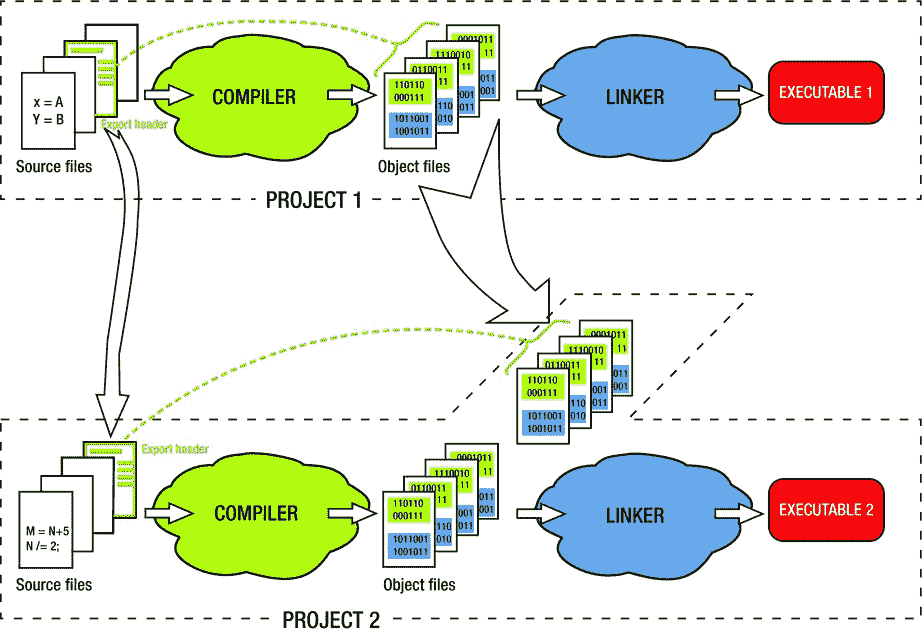
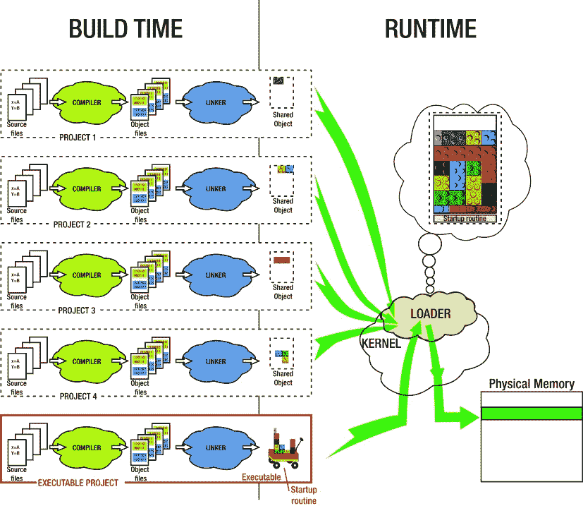
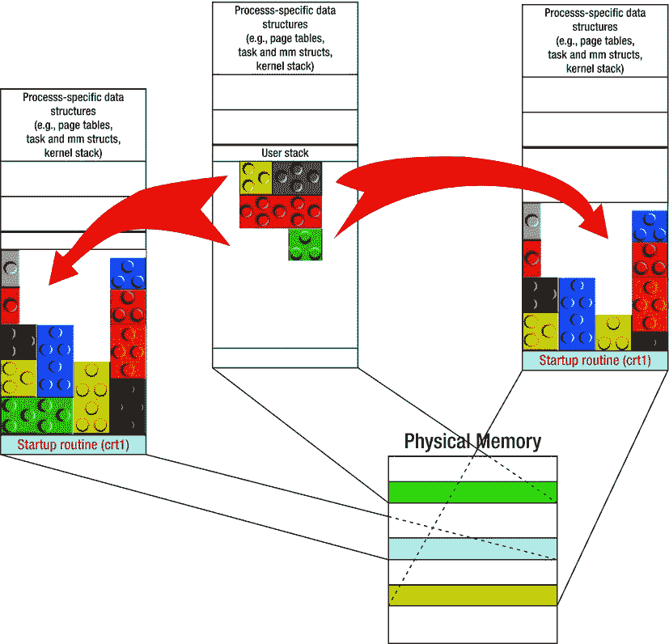
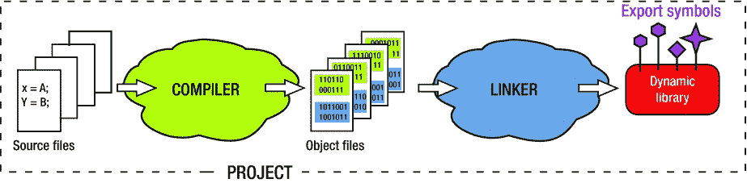
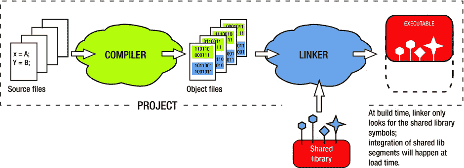
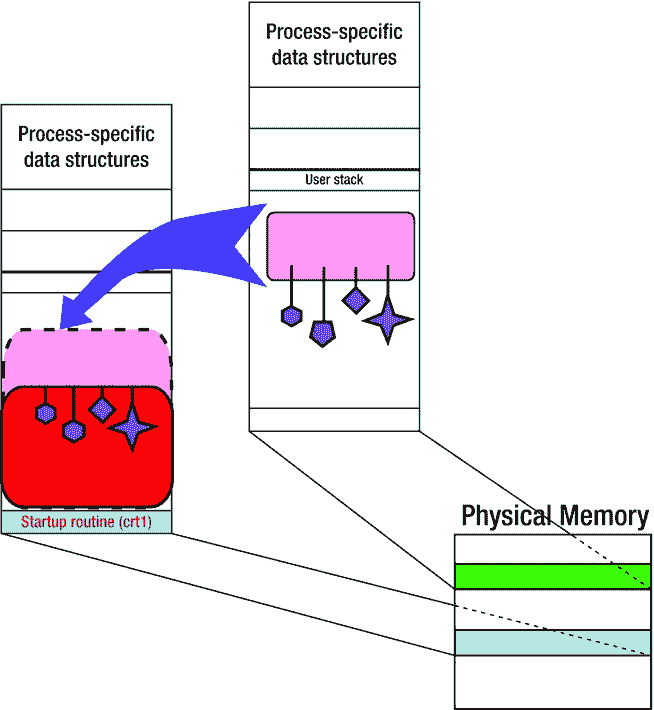
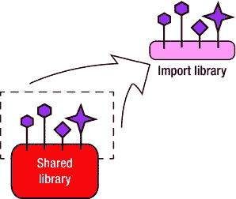
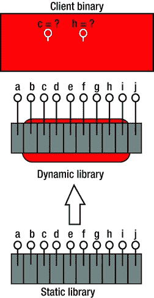

# 4.重用概念的影响

Abstract

代码重用的概念无处不在，并且已经找到了令人印象深刻的多种表现方式。它对构建程序过程的影响发生在众所周知的从过程编程语言向面向对象语言的转变之前。

代码重用的概念无处不在，并且已经找到了令人印象深刻的多种表现方式。它对构建程序过程的影响发生在众所周知的从过程编程语言向面向对象语言的转变之前。

在前几章中已经描述了在编译器和链接器之间划分任务的最初原因。简而言之，这一切都始于将代码保存在单独的源文件中的有用习惯；然后，在编译时，很明显编译器不能简单地完成解析引用的任务，因为必须首先将代码段拼接到程序内存映射的最终拼图中。

代码重用的想法为拆分编译和链接阶段的决策增加了额外的参数。目标文件带来的不确定性(所有部分都有从零开始的地址范围和未解析的引用)，从代码共享的观点来看，这最初看起来肯定是一个缺点，实际上开始看起来像一个宝贵的新品质。

应用于构建程序可执行文件领域的代码重用概念最初是以静态库的形式实现的，静态库是目标文件的捆绑集合。后来，随着多任务操作系统的出现，另一种被称为动态库的重用形式变得突出起来。如今，这两个概念(静态库和动态库)都在使用，各有利弊，因此需要更深入地理解其功能的内部细节。本章非常详细地描述了这两个有些相似，但又有本质区别的概念。

## 静态库

静态库概念背后的思想非常简单:一旦编译器将一组翻译单元(即源文件)翻译成二进制目标文件，您可能希望保留这些目标文件供以后在其他项目中使用，在链接时它们可以很容易地与其他项目固有的目标文件组合在一起。

为了能够将二进制目标文件集成到某个其他项目中，至少需要满足一个额外的要求:二进制文件附带有导出头包含文件，该文件将提供至少这些函数的各种定义和函数声明，这些函数可以用作入口点。标题为“结论:二进制重用概念的影响”的部分解释了为什么有些功能比其他功能更重要。

有几种方法可以将一组目标文件用于各种项目中:

*   在这种情况下，显而易见的要求是链接器理解静态库文件格式，并且能够提取其内容(即捆绑在一起的目标文件)以便将它们链接进来。幸运的是，从微处理器编程的早期开始，这个要求就已经被每一个链接器满足了。
*   还要注意的是，创建静态库的过程决不是不可逆的。更确切地说，静态库仅仅是一个目标文件的档案，可以用多种方式操作。通过方便地使用适当的工具，静态库可以被分解成原始对象文件的集合；可以从库中丢弃一个或多个目标文件，可以添加新的目标文件，最后，现有的目标文件可以被较新的版本替换。

图 4-2。

The static library as form of binary code reuse

*   更好的方法是将目标文件捆绑成一个单一的二进制文件，一个静态库。将单个二进制文件交付给另一个项目比单独交付每个目标文件要简单得多，也优雅得多(图 [4-2](#Fig2) )。

图 4-1。

A trivial method of binary code reuse, the precursor to static libraries

*   简单的解决方法是保存编译器生成的目标文件，并以任何可能的方式复制(剪切-粘贴)或传输到需要它们的项目中(它们将与其他目标文件一起链接到可执行文件中)，如图 [4-1](#Fig1) 所示。

无论您决定采用这两种方法中的哪一种，是简单的方法还是更复杂的静态库方法，您都将经历二进制代码重用的过程，因为在一个项目中生成的二进制文件会在其他项目中使用。二进制代码重用对软件设计前景的整体影响将在后面详细讨论。

## 动态库

与静态库的概念不同，静态库的概念在汇编编程的早期就已经存在，而动态库的概念在很久以后才被完全接受。导致其产生和采用的环境与多任务操作系统的出现密切相关。

在对多任务操作系统功能的任何分析中，有一个特殊的概念很快变得突出:不管并发任务的种类，某些系统资源是独特的，必须由每个人共享。桌面系统上共享资源的典型例子有键盘、鼠标、视频图形适配器、声卡、网卡等等。

如果每个打算访问公共资源的应用程序都必须包含提供资源控制的代码(作为源代码或静态库),这将会适得其反，甚至是灾难性的。这将非常低效、笨拙，并且大量存储(硬盘和内存)将被浪费在存储相同代码的副本上。

对更好、更高效的操作系统的白日梦产生了一种共享机制的想法，这种机制假定既不编译重复的源文件，也不链接重复的目标文件。相反，它将作为某种运行时共享来实现。换句话说，正在运行的应用程序将能够在其程序存储器映射中集成一些其他可执行程序的编译和链接部分，其中集成将在运行时按需发生。这个概念被称为动态链接/动态加载，这将在下一节中更详细地说明。

从最初的设计阶段开始，一个重要的事实变得显而易见:在动态库的所有部分中，只有共享它的代码才有意义。文本)部分，而不是其他进程的数据。在烹饪类比中，一群不同的厨师可以共享同一本食谱(代码)。然而，考虑到不同的厨师可能同时从同一本食谱中准备完全不同的菜肴，如果他们共享相同的厨房用具，那将是灾难性的(数据)。

显然，如果一堆不同的进程可以访问动态库数据段，变量覆盖将在任意时刻发生，动态库的执行将是不可预测的，这将使整个想法变得毫无意义。这样，通过只映射代码段，多个应用程序可以自由地在各自独立的区间中运行共享代码。

### 动态库与共享库

操作系统设计者早期的目标是避免在每个可能需要它们的应用程序的二进制文件中不必要的多次出现相同的操作系统代码。例如，需要打印文档的每个应用程序都必须包含完整的打印堆栈，以打印机驱动程序结束，以便提供打印功能。如果打印机驱动程序改变了，整个应用程序设计团队都需要重新编译他们的应用程序；否则，由于运行时存在过多的不同打印机驱动程序版本，将会出现混乱。

显然，正确的解决方案应该是以如下方式实现操作系统:

*   通常需要的功能以动态库的形式提供。
*   需要访问公共功能的应用程序只需要在运行时加载动态库。

图 [4-3](#Fig3) 说明了动态库概念背后的基本思想。

图 4-3。

The dynamic libraries concept

这个问题的第一个解决方案(即动态链接实现的第一个版本，称为加载时重定位(LTR))部分成功地实现了目标。好消息是应用程序不再需要在二进制文件中携带不必要的操作系统代码；相反，它们只部署了特定于应用程序的代码，而所有与系统相关的需求都通过动态链接操作系统提供的模块来满足。

然而，坏消息是，如果多个应用程序在运行时需要某些系统功能，每个应用程序都必须加载自己的动态库副本。这种限制的根本原因是加载时重定位技术修改了。文本部分，以适应给定应用程序的特定地址映射。对于将动态库加载到可能不同的地址范围中的另一个应用，修改后的库代码根本不适合不同的存储器布局。

因此，在运行时，动态库的多个副本驻留在进程的内存映射中。这是我们可以忍受一段时间的事情，但设计的长期目标要远大得多:提供一种更有效的机制，允许动态库只被加载一次(由首先加载它的任何应用程序加载)，并可供任何其他试图接下来加载它的应用程序使用。

这个目标是通过称为位置无关码(PIC)的概念实现的。通过改变动态库代码访问符号的方式，只有加载到任何进程的内存映射中的动态库的一个副本通过内存映射到任何应用程序的进程内存映射而变得可共享(图 [4-4](#Fig4) )。

图 4-4。

The advances brought by the PIC technique of dynamic linking

此外，操作系统将某些公共系统资源(例如，顶级驱动程序)加载到物理内存中并不罕见，因为它知道大量运行的进程很可能需要这些资源。动态链接的效果是，每个进程都有一个完美的错觉，认为它们是驱动程序的唯一所有者。

自从 PIC 概念发明以来，为支持它而设计的动态库被称为共享库。现在，PIC 概念很流行，在 64 位系统上，它受到编译器的强烈青睐，所以动态库和共享库这两个术语之间的命名区别正在消失，这两个名称或多或少可以互换使用。

虚拟内存的概念为运行时共享思想的成功奠定了基础(集中体现在位置无关代码的概念中)。最初的想法相当简单:如果真实的进程内存映射(具有真实的、具体的地址)只不过是从零开始的进程内存映射的 1:1 映射的结果，那么是什么真正阻止我们创建一个怪物，一个通过映射多个不同进程的部分而获得的真实的进程内存映射呢？事实上，这正是动态库的运行时共享机制的工作方式。

PIC 概念的成功实现代表了现代多任务操作系统的基石。

### 更详细的动态链接

动态链接的概念是动态库概念的核心。如果不理解动态库、客户端可执行文件和操作系统之间复杂的相互作用，几乎不可能完全理解动态库是如何工作的。本节的重点是提供对动态链接过程的必要的广泛理解。一旦理解了它的本质，本文档的后续部分将对细节给予应有的关注。

那么，让我们看看在动态链接的过程中到底发生了什么。

#### 第 1 部分:构建动态库

正如前面的图所示，构建动态库的过程是一个完整的构建，因为它包括编译(将源代码转换为二进制目标文件)和解析引用。动态库构建过程的产品是二进制文件，其性质与可执行文件的性质相同，唯一的区别是动态库缺少启动例程，该例程允许它作为独立程序启动(图 [4-5](#Fig5) )。

图 4-5。

Building the dynamic library

以下是一些需要考虑的注意事项:

*   在 Windows 中，构建动态库严格要求必须解析所有引用。如果动态库代码调用某个其他动态库中的函数，那么该其他库及其包含的引用符号在构建时必须是已知的。
*   然而，在 Linux 中，缺省选项允许更大的灵活性，允许某些符号不被解析，并期望在链接其他动态库之后，它们最终会出现在最终的二进制文件中。此外，Linux 链接器提供了与 Windows 链接器的严格性完全匹配的选项。
*   在 Linux 中，可以修改动态库，使其可以自己运行(仍在研究 Windows 上是否存在这样的选项)。事实上，libc (C 运行时库)本身是可执行的；当通过在 shell 窗口中键入文件名来调用时，它会在屏幕上显示一条消息并终止。有关如何实现此功能的更多详细信息，请查看第 14 章。

#### 第 2 部分:在构建客户端可执行文件时信任游戏(只寻找符号)

使用动态库场景的下一个阶段发生在您尝试构建打算在运行时使用动态库的可执行文件时。与链接器根据自己的意愿创建可执行文件的静态库场景不同，链接动态库的场景是特殊的，因为链接器试图将其当前工作与创建动态库二进制文件的先前完成的链接过程的现有结果相结合。

故事这一部分的关键细节是，链接器几乎把所有的注意力都放在了动态库的符号上。在这个阶段，链接器似乎对任何部分都不感兴趣，对代码也不感兴趣。文本)，也不是数据(。数据/。bss)。

更具体地说，这个操作阶段的链接器“通过信任来玩它”

它没有彻底检查动态库的二进制文件；它既不试图找到这些部分或它们的大小，也不试图将它们集成到生成的二进制文件中。相反，它只是试图验证动态库是否包含生成的二进制文件所需的符号。一旦找到它，它就完成任务并创建可执行的二进制文件(见图 [4-6](#Fig6) )。

图 4-6。

Build time linking with a dynamic library

“信任游戏”的方法并不是完全不直观的。让我们考虑一个现实生活中的例子:如果你告诉某人，为了寄信，他需要去附近广场的信息亭买一张邮票，你基本上是将你的建议建立在合理的信任程度上。你知道广场上应该有一个卖邮票的亭子。事实上，你不知道 kiosk 操作的具体细节(工作时间，谁在那里工作，邮票的价格)并不减少你的建议的有效性，因为在运行时所有这些不太重要的细节都会得到解决。动态链接的想法是基于完全类似的假设。

但是，请注意，这种信任程度为许多有趣的场景打开了大门，所有这些场景都属于“用一个构建，加载另一个”的范例。实际的含义各不相同，从奇特的软件设计技巧一直到全新的范例(插件)，这两者都将在本书后面讨论。

#### 第 3 部分:运行时加载和符号解析

加载时发生的事件至关重要，因为此时需要确认链接器对动态库承诺的信心。以前，构建过程(可能在构建机器“A”上完成)在搜索可执行文件所需的符号时检查动态库二进制文件的副本。现在，运行时需要发生的事情(可能在不同的运行时机器“B”上)如下:

The dynamic library binary file needs to be found.  

每个操作系统都有一套规则，规定加载程序应该在哪个目录中寻找动态库的二进制文件。

The dynamic library needs to be successfully loaded into the process.  

此时，构建时链接的承诺必须在运行时实现。

事实上，在运行时加载的动态库必须携带承诺在构建时可用的相同符号集。更具体地说，在函数符号的情况下，术语“相同”意味着运行时在动态库中找到的函数符号必须与构建时承诺的完整函数签名(从属关系、名称、参数列表、链接/调用约定)完全匹配。

有趣的是，并不要求在运行时找到的动态库的实际汇编代码(即部分内容)与在构建时使用的动态库二进制文件中找到的代码相匹配。这开启了许多有趣的场景，稍后将详细讨论。

The executable symbols need to be resolved to point to the right address in the part of process of memory map where the dynamic library is mapped into.  

正是在这个阶段，将动态库集成到进程内存映射中才真正称得上是动态链接，因为与传统的链接不同，它发生在加载时。

如果这个阶段的所有步骤都成功完成，你就可以让你的应用程序执行动态库中包含的代码，如图 [4-7](#Fig7) 所示。

图 4-7。

Load time linking of a dynamic library

### Windows 动态链接的特点

因为动态链接确实发生在两个阶段(构建时与运行时)，其中链接器关注动态库二进制文件的不同细节，所以没有充分的理由说明为什么动态库二进制文件的相同副本不能在两个阶段都使用。

即使在构建时动态链接阶段只有库符号起作用，如果在运行时阶段也使用二进制文件的完全相同的副本，也没有什么错。

包括 Linux 在内的各种操作系统都遵循这一原则。然而，在 Windows 中，为了使动态链接阶段之间的区分更加清晰，事情变得稍微复杂了一些，这可能会让初学者有点困惑。

#### Windows 中与动态链接相关的特殊二进制文件类型

在 Windows 中，动态链接的不同阶段之间的区别通过在每个阶段使用稍微不同的二进制文件类型来强调。也就是说，当创建和构建 Windows DLL 项目时，编译器会生成几个不同的文件。

##### 动态链接库(。dll)

这种文件类型实际上是动态库，一个在运行时由进程通过动态链接机制使用的共享对象。更具体地说，到目前为止，关于动态库函数完全适用于 DLL 文件的原理的大部分事实。

##### 导入库文件(。lib)

专用的导入库(。lib)二进制文件在 Windows 上专门用于动态链接的“Part2”阶段(图 [4-8](#Fig8) )。它只包含 DLL 符号列表，不包含任何链接器部分，其唯一目的是将动态库的导出符号集呈现给客户端二进制文件。

图 4-8。

Windows import library

导入库文件的文件扩展名(。lib)是混淆的潜在来源，因为相同的文件扩展名也被用来表示静态库。

另一个值得讨论的细节是，这个文件被称为导入库，但实际上在导出 DLL 符号的过程中起作用。的确，命名的选择取决于我们从哪个方面来看待动态链接的过程，同样，这个文件属于 DLL 项目，通过构建 DLL 项目来创建，并且可以传播到无数的应用程序。出于所有这些原因，采用“从 DLL 向外”的方向，并因此使用导出库的名称应该是正确的。

在讨论使用`__declspec`关键字的部分中可以找到明显的证据，证明微软的其他人至少在一定程度上同意这一观点，其中命名(`__declspec(dllexport)`)用于表示从 DLL 向客户端应用程序的导出(即，向外的方向)。

微软公司的人决定坚持这种特殊命名惯例的原因之一是 DLL 项目产生了另一种类型的库文件，可以在循环依赖的情况下代替这种类型的库文件。另一种文件类型称为导出文件(。exp)(见下文)，并且为了区分两者，保留了现有的命名。

##### 导出文件(。exp)

导出文件与导入库文件具有相同的性质。但是，它通常用于两个可执行文件具有循环依赖关系，从而无法完成其中任何一个的构建的情况。在这种情况下，提供 exp 文件的目的是使至少一个二进制文件能够成功编译，这又可以被其他依赖的二进制文件用来完成它们的构建。

Note

Windows DLLs 严格要求在生成时解析所有符号。然而，在 Linux 上，可能会留下一些未解析的动态库符号，并期望丢失的符号最终会作为动态链接到其他动态库中的结果出现在进程内存映射中。

### 动态图书馆的独特性质

在二进制类型的集合中，动态库具有相当独特的性质，在处理通常的相关设计问题时，记住其细节是很重要的，这一点很重要。

当查看其他二进制类型时，可执行文件和静态库的相反性质几乎立即变得显而易见。静态库的创建不涉及链接阶段，而对于可执行文件来说，这是必须的最后一步。因此，可执行文件的性质更加完整，因为它包含已解析的引用，并且由于嵌入了额外的 start 例程，它可以执行了。

在这方面，尽管“库”这个词暗示了静态库和动态库之间的相似之处，但事实是动态库的本质更接近可执行程序的本质。

#### 属性 1:动态库创建需要完整的构建过程

创建动态库的过程不仅包括编译，还包括链接阶段。不管命名的相似性意味着什么，动态库构建过程的完整性(即，除了编译之外的链接)使得动态库与可执行文件的相似性远远大于与静态库的相似性。唯一的区别是可执行文件包含允许内核启动进程的启动代码。向动态库添加几行代码是完全可能的(在 Linux 中肯定是这样),这使得从命令行执行库成为可能，就好像它是一个可执行的二进制类型。更多详情请查看[第 14 章](14.html)。

#### 属性 2:动态库可以链接到其他库中

这是一个非常有趣的事实:不仅是可执行文件可以加载和链接动态库，它也可以是另一个动态库。因此，我们不能再用“可执行”来表示动态库中链接的二进制文件；我们必须使用其他更恰当的术语。

Note

我决定此后使用术语“客户机二进制文件”来表示可执行文件或加载动态库的动态库。

### 应用程序二进制接口(ABI)

当接口概念应用于编程语言领域时，它通常用于表示函数指针的结构。C++ 通过将它定义为一类函数指针增加了一些额外的含义；此外，通过将函数指针声明为等于 NULL，接口获得了额外的抽象，因为它变得不适合实例化，但可以用作其他类实现它的理想模型。

由软件模块输出到客户端的接口通常被称为应用编程接口(API)。当应用于二进制领域时，接口的概念获得了一种额外的特定于领域的味道，称为应用程序二进制接口(ABI)。将 ABI 看作是在源代码接口编译/链接过程中创建的一组符号(主要是一组函数入口点)并没有错。

当更精确地解释动态链接期间发生的事情时，ABI 概念就派上了用场。

*   在动态链接的第一个(构建时)阶段，客户机二进制文件实际上链接到库的导出 ABI。

正如我所指出的，在构建时，客户机二进制文件实际上只检查动态库是否导出了符号(函数指针，如 ABI)，而根本不关心段(函数体)。

*   为了成功完成动态链接的第二个(运行时)阶段，运行时可用的动态库的二进制样本必须导出未改变的 ABI，与构建时找到的相同。

第二个语句被认为是动态链接的基本要求。

## 静态库与动态库的比较点

尽管我只是略微谈到了静态库和动态库背后的概念，但是已经可以对两者进行一些比较了。

### 进口选择性标准的差异

静态库和动态库之间最有趣的区别是试图链接它们的客户端二进制文件所应用的选择性标准的不同。

#### 静态库的导入选择性标准

当客户端二进制链接静态库时，它不会链接完整的静态库内容。相反，它严格地只链接包含真正需要的符号的目标文件，如图 [4-9](#Fig9) 所示。

图 4-9。

Import selectiveness criteria for static libraries

客户机二进制文件的字节长度增加了，尽管只是增加了从静态库中获取的相关代码的数量。

Note

尽管链接算法在选择链接哪些目标文件时是有选择性的，但这种选择性不会超出单个目标文件的粒度。除了真正需要的符号之外，选择的目标文件还可能包含一些不需要的符号。

#### 动态库的导入选择性标准

当客户端二进制链接动态库时，它仅在符号表级别具有选择性，其中只有真正需要的动态库符号才会在符号表中提及。

在所有其他方面，这种选择性实际上是不存在的。无论动态库功能的具体需求有多小，整个动态库都会被动态链接进来(图 [4-10](#Fig10) )。

图 4-10。

Import selectiveness criteria for dynamic libraries

增加的代码量只发生在运行时。客户端二进制文件的字节长度不会显著增加。新符号的簿记所需的额外字节往往相当于小字节计数。然而，链接动态库要求动态库二进制文件在运行时在目标机器上可用。

#### 整个归档导入方案

当静态库的功能需要通过中间的动态库呈现给二进制客户端时，一个有趣的转折就发生了(图 [4-11](#Fig11) )。

图 4-11。

“Whole archive” scenario of importing static library

中间动态库本身不需要任何静态库的功能。因此，根据制定的导入选择性规则，它不会从静态库中链接任何东西。然而，设计动态库的唯一原因是吸收静态库的功能并导出其符号供世界其他地方使用。

如何缓解这些相反的需求？

幸运的是，这个场景很早就被发现了，并且通过`--whole-archive`链接器标志提供了足够的链接器支持。当指定时，该链接器标志指示其后列出的一个或多个库将被无条件地完全链接，而不管链接它们的客户端二进制文件是否需要它们的符号。

考虑到这种情况，Android 原生开发系统除了支持`LOCAL_STATIC_LIBRARIES`构建变量之外，还支持`LOCAL_WHOLE_STATIC_LIBRARIES`构建变量，如下所示:

`$ gcc -fPIC <source files>``-Wl,--whole-archive`T2】

有趣的是，有一个反作用链接器标志(`--no-whole-archive`)。它的作用是抵消`--whole-archive`对所有后续库的影响，这些库被指定在完全相同的链接器命令行上链接。

`$ gcc -fPIC <source files> -o <executable-output-file> \`

`-Wl,--whole-archive` `-l<libraries-to-be-entirely-linked-in> \`

`-Wl,--no-whole-archive` `-l<all-other-libraries>`

与`--whole-archive`标志本质上有些相似的是`-rdynamic`链接器标志。通过传递这个链接器标志，你基本上是在请求链接器将所有的符号(出现在`.symtab`部分)导出到动态`(.dynsym`部分，这基本上使它们可用于动态链接的目的。有趣的是，这面旗帜似乎不需要`-Wl`前缀。

### 部署困境场景

当设计软件部署包时，构建工程师通常面临最小化部署包的字节大小的需求。在一个最简单的可能场景中，需要部署的软件产品由一个可执行文件组成，该可执行文件将向库提供其特定部分功能的任务委托给库。假设这个库有两种风格，静态库和动态库。构建工程师面临的基本问题是使用哪种链接场景来最小化已部署软件包的字节大小。

#### 选择 1:与静态库链接

构建工程师面临的选择之一是将可执行文件与库的静态版本链接起来。这个决定有利有弊。

*   优点:可执行文件是完全独立的，因为它包含了所有需要的代码。
*   缺点:可执行字节的大小会随着从静态库获取的代码量而增加。

#### 选择 2:与动态库链接

当然，另一种可能性是将可执行文件与库的动态版本相链接。这个决定也有利弊。

*   优点:可执行字节大小不会改变(除了小符号簿记费用)。
*   缺点:无论出于什么原因，所需的动态库总是有可能在目标机器上不可用。如果采取预防措施，将所需的动态库与可执行文件一起部署，可能会出现几个潜在的问题。
    *   首先，随着您现在部署一个可执行文件和一个动态库，部署包的总字节大小肯定会变大。
    *   其次，部署的动态库版本可能与依赖它的其他应用程序的需求不匹配。
    *   第三、第四等等，在处理动态库时可能会发生一系列问题，称为“DLL 地狱”

#### 定论

当应用程序链接相对较少数量的静态库的相对较小的部分时，与静态库的链接是一个好的选择。

当应用程序依赖于在运行时存在于目标机器上的动态库时，与动态库的链接是一个很好的选择。

可能的候选者是特定于操作系统的动态库，例如 C 运行时库、图形子系统、用户空间顶级设备驱动程序和/或来自非常流行的软件包的库。表 [4-1](#Tab1) 总结了静态库和动态库的区别。

表 4-1。

Comparison Points Summary

<colgroup><col> <col> <col></colgroup> 
| 比较类别 | 静态库 | 动态库 |
| --- | --- | --- |
| 构建过程 | 未完成:编译:是链接:否 | 完成:编译:是链接:是 |
| 二进制本质 | 目标文件的存档所有部分都存在，但大多数引用未被解析(本地引用除外)。不能独立存在；clientbinary 的环境决定了大量的细节。它的所有符号只有在客户端可执行文件中才有意义。 | 没有启动例程的可执行文件。包含已解析的引用(除非另有说明)，其中一些引用旨在全局可见。非常独立(在 Linux 中，通过一些简单的添加，可以有效地添加缺少的启动例程)。高度专业化于某些战略任务；一旦加载到流程中，在提供专门的服务时通常非常可靠。 |
| 与可执行文件集成 | 在可执行文件构建过程中发生，在链接阶段完成。高效:只有归档文件中需要的目标文件被链接到可执行文件中。但是，客户端二进制文件的字节大小会增加。 | 通过动态链接的两个独立阶段发生:1)针对可用符号进行链接 2)在加载时集成符号和部分效率低下:整个库被加载到进程中，而不管真正需要库的哪一部分。客户端二进制文件的字节大小几乎不变。然而，动态库二进制文件在运行时的可用性是一个额外需要担心的问题。 |
| 对可执行文件大小的影响 | 随着部分被添加到可执行部分，增加可执行文件的大小。 | 减少可执行文件的大小，因为只有特定于应用的代码驻留在应用可执行文件中，而可共享的部分被提取到动态库中。 |
| 轻便 | 很好，因为应用程序需要的一切都在它的二进制文件中。没有外部依赖性使得移植变得容易。 | 各不相同。适用于操作系统标准的动态库(libc、设备驱动程序等)。)，因为它们保证存在于运行时机器上。对于特定于应用程序或特定于供应商的场景，效果不太好。存在大量潜在问题的场景(版本、缺少库、搜索路径等。) |
| 易于组合 | 非常有限。无法通过使用其他库(既不是静态库也不是动态库)来创建静态库。只能将它们链接到同一个可执行文件中。 | 太好了。动态库可以链接一个或多个静态库，和/或一个或多个动态库。事实上，Linux 可以被看作是“乐高乐园”，一组由动态库与其他动态库链接而成的结构。源代码的可用性极大地促进了集成的规模。 |
| 易于转换 | 相当容易。归档器实用程序的标准功能是提取配料对象文件。一旦提取出来，它们就可以被消除、替换或重新组合成一个新的静态或动态库。只有在非常特殊的情况下(在“提示和技巧”一节中，请参阅关于在 64 位 Linux 上将静态库链接到动态库的主题),这可能还不够好，您可能需要重新编译原始源代码。 | 对大多数人来说几乎是不可能的。已经看到了一些商业解决方案，它们试图实现从动态库到静态库的转换，并取得了不同程度的成功。 |
| 适合发展 | 繁琐。即使代码中最小的变化也需要重新编译所有链接库的可执行文件。 | 太好了。处理孤立特征的最佳方式是将其提取到动态库中。只要导出的符号(函数签名和/或数据结构布局)没有改变，重新编译库就不需要重新编译其余的代码。 |
| 杂项/其他 | 甚至在最简单的微控制器开发环境中也应用了更简单、更古老、更普遍的二进制共享形式。 | 二进制代码重用的新方法。现代的多任务系统没有它们甚至无法想象。对插件的概念至关重要。 |

## 有用的对比类似物

表格 [4-2](#Tab2) 到 [4-4](#Tab4) 列出了几个非常有用的和说明性的类比，可以帮助你更好地理解编译过程的作用。

表 4-2。

Legal Analogy

<colgroup><col> <col></colgroup> 
| 二元类型 | 合法等价物 |
| --- | --- |
| 静态库 | 总的来说，法律段落是以一种不确定的方式写成的。比如:如果一个人(哪个人？)被判犯有 A 级轻罪(哪种特定的轻罪？这个人到底做了什么？)，他或她将被判处支付不超过 2000 美元的罚款(具体是多少？)，或者服不超过 6 个月的刑期(到底多长？)或者两者都有(三种可能组合中的哪一种？). |
| 动态图书馆 | 具体指控约翰·史密斯因拒捕和不服从警官而被判有罪。控方要求他支付 1500 美元的罚款，并入狱 30 天。 |
| 可执行的 | 服刑所有参考资料(何人、何事、何时以及可能的原因)都已解决:违法行为已在法庭上得到证实，法官根据法律条文对约翰·史密斯进行了判决，一切准备就绪，他将在附近的州矫正机构服刑。 |

Note

在烹饪的类比中，你(软件设计者)正在经营一家餐馆，在那里(通过构建可执行程序的过程)你为饥饿的 CPU 准备一顿饭，他几乎等不及开始大嚼这顿饭。

表 4-4。

Tropical Jungle Expedition Analogy

<colgroup><col> <col></colgroup> 
| 二元类型 | 探险角色等同 |
| --- | --- |
| 可执行的 | 英国勋爵，探险队的领队，授勋战斗老兵，以其出色的生存技能和本能而闻名。受英国地理学会指派，调查在热带丛林深处存在着失落已久的先进文明神庙的传闻，那里隐藏着无数的物质和科学宝藏。他有权获得当地英国领事部门的后勤支持，该部门负责协调与当地政府的努力，并提供物资、资金、后勤和运输方面的各种帮助。 |
| 动态图书馆 | 当地猎人，探险向导这家伙在探险目标地理区域出生长大。他会说所有当地语言，了解所有部落的宗教和文化；在这个地区有很多人脉；知道所有危险的地方以及如何避开它们；拥有非凡的生存技能；是一个很好的猎人，优秀的开拓者，并能预测天气变化。高度专业化于与丛林相关的一切，完全可以自理。他成年后的大部分时间都是作为这样的探险队的雇佣向导度过的。在探险的间隙，除了和家人在一起、去钓鱼和打猎等，他几乎什么都不做。他既没有野心也没有财力自己创业。 |
| 静态库 | 年轻的私人助理来自贵族家庭的年轻英国小伙子。很少或没有实际生活经验，但牛津大学的考古学学位和古代语言知识，以及速记、电报和莫尔斯电码的操作知识为他在团队中赢得了一席之地。尽管他的技能可能适用于许多角色和许多场景，但他从未到过热带地区，不会说当地语言，并且在很大程度上依赖于更高的权威和/或各种更高的专业知识。最有可能的是，他在探险过程中没有正式的权力，除了在他直接的专业领域内，他没有权力做任何决定，而且只有在被要求这样做的时候。 |

表 4-3。

Culinary Analogy

<colgroup><col> <col></colgroup> 
| 二元类型 | 烹饪等价物 |
| --- | --- |
| 静态库 | 生食配料(如生肉或生蔬菜)肯定适合食用，但不能立即食用，因为它们需要一定量的加工(腌制、添加香料、与其他配料混合，最重要的是高温加工)，这些必须首先完成。 |
| 动态图书馆 | 预先煮好的或现成的可以食用的菜，但照原样端上来就没什么意义了。然而，如果午餐的剩余部分准备好了，它将会是一顿丰盛的大餐。 |
| 可执行的 | 完整的午餐包括当天的新鲜面包、沙拉和准备好的主菜，可以通过几天前做的热菜来丰富。 |

## 结论:二进制重用概念的影响

一旦二进制重用的概念被证明是可行的，它就对软件设计的前景产生了以下直接后果:

*   专用项目的出现，其目的不是构建可执行代码，而是构建可重用代码的二进制包。
*   一旦构建供他人使用的代码的实践开始获得动力，遵循封装原则的必要性就凸显出来了。

封装思想的本质是，如果我们正在构建一些东西供其他人使用，那么这种出口产品将基本功能与不太重要的内部功能细节明确分开总是好的。实现它的一个强制方法是声明接口，这是用户最感兴趣的一组典型功能。

*   接口(一组精华/最重要的函数)通常在导出头文件(一个包含文件，提供可重用二进制代码和潜在用户之间的顶级接口)中声明。

简而言之，将代码分发给其他人使用的方法是交付带有二进制文件集和导出头文件集的软件包。二进制文件导出接口，大部分是使用软件包所必需的功能集。

下一波后果紧随其后:

*   SDK(软件开发工具包)的出现，在最基本的版本中，SDK 是一组导出头文件和二进制文件(静态和/或动态库),旨在与编译客户端项目本地源文件时创建的二进制文件集成。
*   “一个引擎，多种图形用户界面”范例的出现。

有很多这样的例子，不同的应用程序使用流行的引擎，向用户呈现不同的 GUI，但是在后台运行相同的引擎(从相同的动态库中加载)。多媒体领域的典型例子是 ffmpeg 和 avisynth。

*   知识产权受控交换的潜力。

通过交付二进制文件而不是源代码，软件公司可能会交付他们的技术而不披露其背后的想法。反汇编程序的出现使这个故事变得更加复杂，但是从长远来看，基本思想仍然适用。