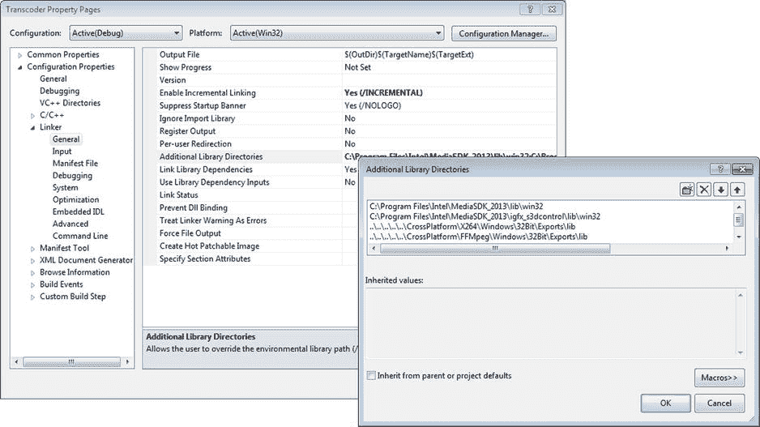
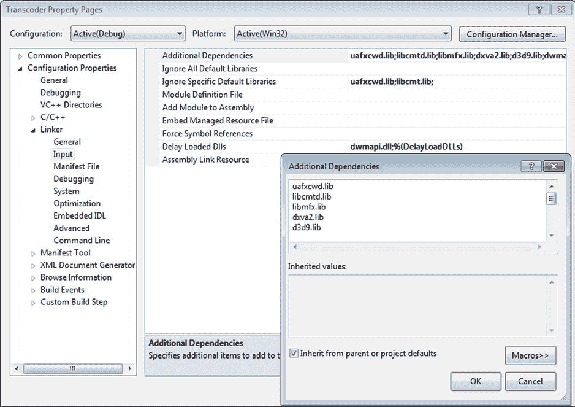
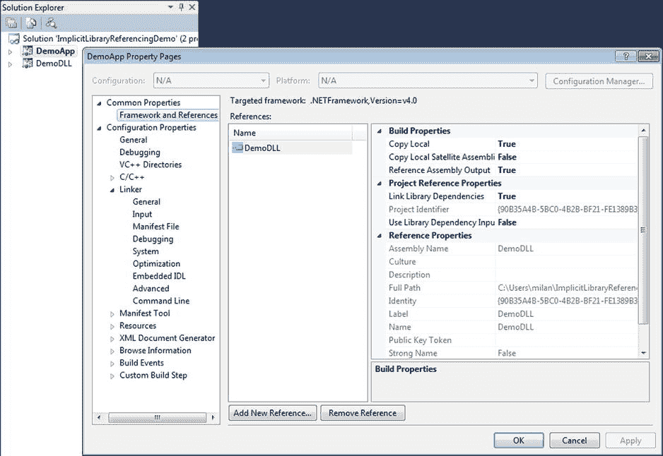
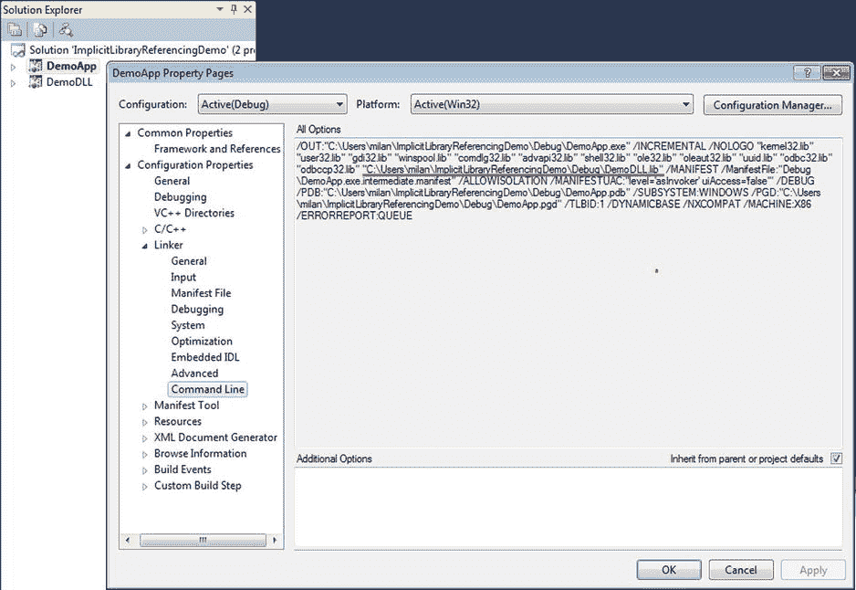
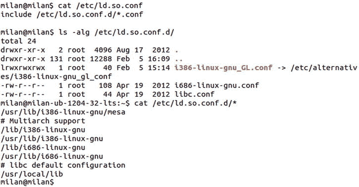

# 7.查找图书馆

Abstract

二进制代码共享的思想是库概念的核心。不太明显的是，这通常意味着库二进制文件的单一副本将驻留在给定机器上的固定位置，而大量不同的客户机二进制文件将需要定位所需的库(在构建时或运行时)。为了解决定位库的问题，已经设计并实现了各种约定。在这一章中，我将讨论这些惯例和准则的细节。

二进制代码共享的思想是库概念的核心。不太明显的是，这通常意味着库二进制文件的单一副本将驻留在给定机器上的固定位置，而大量不同的客户机二进制文件将需要定位所需的库(在构建时或运行时)。为了解决定位库的问题，已经设计并实现了各种约定。在这一章中，我将讨论这些惯例和准则的细节。

## 典型的库用例场景

库的使用已经被证明是跨软件社区共享代码的一种非常强大的方式。在某些领域积累了专业知识的公司以库的形式交付其知识产权是一种非常常见的做法，第三方可以将其集成到他们的产品中并交付给客户。

使用库的实践通过两个不同的用例场景发生。第一个用例场景发生在开发人员试图在他们的产品中集成第三方库(静态或动态)的时候。另一种情况是，为了让安装在客户机上的应用程序正常运行，需要在运行时定位库(在这种情况下，特别是动态库)。

这两个用例场景都引入了定位库二进制文件的问题。这些问题的结构性解决方法将在本章中描述。

### 开发用例场景

通常，第三方包包含库、导出头，可能还有一些附加内容(如文档、在线帮助、包图标、实用程序、代码和媒体示例等)。)安装在开发人员机器上的预定路径上。紧接着，开发人员可能会在她的机器上的许多不同路径上创建过多的项目。

显然，每个需要与第三方库链接的项目都需要能够访问库二进制文件。否则，就不可能完成这个项目。

将第三方库复制到开发人员可能创建的每个项目中绝对是一种可能性，尽管这是一个非常糟糕的选择。显然，在每个可能需要的项目的文件夹中保存库的副本，违背了支持库概念的代码重用的最初想法。

可接受的替代方案是只有一个库二进制文件的副本，以及一组帮助客户机二进制项目定位它的规则。这种规则集通常称为构建时库位置规则，通常由开发平台的链接器支持。这些规则基本上规定了如何将完成客户端二进制链接所需的库路径信息传递给链接器。

构建时库位置规则相当复杂，并且有多种选择。每一个主要的开发平台通常都提供了一套非常复杂的选项来决定如何实施这些规则。

理解构建时库位置规则与静态和动态库都相关是非常重要的。不管链接静态库和动态库之间的实际差异，链接器仍然必须知道所需库二进制文件的位置。

### 最终用户运行时用例场景

一旦开发人员集成了第三方库，他们的产品就可以交付给最终客户了。基于各种各样的设计标准和现实生活中的考虑，所交付产品的结构可能有各种各样的选择:

*   在最简单的情况下，产品包只包含一个应用程序文件。预期用途是客户端简单地运行应用程序。

这个案子很简单。为了访问和运行应用程序，用户只需将它的路径添加到全局 path 环境变量中。除了完全不懂计算机的人之外，任何人都有能力完成这个简单的任务。

*   在更复杂的场景中，产品包混合了动态库和一个或多个实用程序。动态库可以是直接转发的第三方库，也可以是由软件包供应商创建的，或者是两者的组合。

预期用途是各种应用程序与所提供的动态库动态链接。多媒体领域中这种情况的典型例子是诸如 DirectX 或 GStreamer 之类的多媒体框架，因为它们中的每一个都提供(或指望在运行时可用)一组精心制作的动态库，每一个都提供某一组明确定义的功能。

与开发用例场景非常相似，解决该问题的有意义的方法假设只有一个所需动态库的副本，位于安装过程部署它们的路径中。另一方面，驻留在大量不同路径上的大量客户端二进制文件(其他动态库或应用程序)可能需要这些库。

为了构建在运行时(或稍早，在加载时)查找动态库二进制文件的过程，需要建立一组运行时库位置规则。运行时库位置规则通常相当复杂。每一个开发平台都提供了自己风格的复杂选项，来决定如何实施这些规则。

最后——冒着重复显而易见的风险——运行时库位置规则只适用于动态库。静态库的集成总是在运行时之前完成(即，在客户端二进制构建过程的链接阶段)，并且从来不需要在运行时定位静态库。

## 构建时间库位置规则

在这一节中，我将讨论为库二进制文件提供构建时路径的技术。除了提供链接器的完整路径这一最简单的可能步骤之外，还有一些额外的技巧值得您注意。

### Linux 构建时库位置规则

如何在 Linux 上实现构建时库位置规则的诀窍的重要部分属于 Linux 库命名约定。

#### Linux 静态库命名约定

Linux 静态库文件名是根据以下模式标准创建的:

`static library filename =` `lib` `+` `<library name>` `+`

库文件名的中间部分是库的实际名称，用于将库提交给链接器。

#### Linux 动态库命名约定

Linux 有一个非常复杂的动态库命名约定方案。即使最初的意图是解决库版本问题，命名约定方案也会影响库位置机制。下面几段将说明要点。

##### 动态库文件名与库名

Linux 动态库文件名是根据以下模式标准创建的:

`dynamic library filename =``lib``+``<library name>``+``.so`T6】

库文件名的中间部分是库的实际名称，用于将库提交给链接器，然后提交给构建时库搜索以及运行时库搜索过程。

##### 动态库版本信息

库文件名的最后一部分携带的库版本信息遵循以下约定:

`dynamic library version information = <` `M>.<m>.
`

其中每个助记符可以代表一个或多个数字

*   m:主要版本
*   m:次要版本
*   p:补丁(次要代码更改)版本

动态库版本信息的重要性将在第 11 章中详细讨论。

##### 动态图书馆名称

根据定义，动态库的 soname 可以指定为

`library``soname``= lib +``<library``name``>``+``.so``+ <library``major version``digit(s)>`

例如，libz.so.1.2.3.4 库的 soname 应该是 libz.so.1。

事实上，只有主要版本数字在库的 soname 中起作用，这意味着次要版本不同的库仍将由相同的 soname 值来描述。具体如何使用这一特性将在第 11 章的“动态库版本处理”部分讨论。

库 soname 通常由链接器嵌入到库的二进制文件的专用 ELF 字段中。指定库 soname 的字符串通常通过专用的链接器标志传递给链接器，如下所示:

`$ gcc -shared <list of object files>``-Wl,-soname,`T2】

检查二进制文件内容的实用程序通常提供检索 soname 值的选项(图 [7-1](#Fig1) )。

图 7-1。

Library soname embedded in the library binary’s ELF header

#### 链接器与人类对库名的感知

请注意，这些约定所描述的库名不一定在人类对话中用来表示库。例如，在给定机器上提供压缩功能的库可能驻留在文件名 libz.so.1.2.3.4 中。根据库命名约定，该库的名称简单地为“z”，它将在与链接器和加载器的所有交易中使用。从人类交流的角度来看，库可以被称为“libz”，例如在错误跟踪系统中的以下错误描述中:“问题 3142:缺少 libz 二进制文件的问题”。为了避免混淆，有时库名也被称为库的链接器名。

#### Linux 构建时库位置规则详细信息

构建时库路径规范在 Linux 上以所谓的`-L -l`选项的形式实现。使用这两个选项的真正正确方法可以通过以下一组准则来描述:

*   将完整的库路径分为两部分:文件夹路径和库文件名。
*   通过将文件夹路径追加到`-L`链接器标志之后，将文件夹路径传递给链接器。
*   通过将库名(链接器名)附加在`-l`标志之后，仅将其传递给链接器。

例如，通过编译文件`main.cpp`并链接到位于文件夹`../sharedLib`中的动态库`libworkingdemo.so`来创建应用程序演示的命令行可能如下所示:

`$ gcc main.o``-L``../sharedLib``-l`T4】

`^              ^`

`|              |`

`library folder path    library name only`

`(not the full library filename !)`

在 gcc 行结合了编译和链接的情况下，这些链接器标志应该加上`-Wl,`标志，就像这样:

`$ gcc -Wall -fPIC main.cpp``-Wl,-L``../sharedLib``-Wl,-l`T4】

#### 初学者的错误:什么可能出错以及如何避免

在处理动态库的场景中，当下列任一情况发生时，典型的问题会发生在缺乏耐心和经验的程序员身上:

*   动态库的完整路径被传递给`-l`选项(不使用`-L`部分)。
*   路径的一部分通过`-L`选项传递，路径的其余部分(包括文件名)通过`-l`选项传递。

链接器通常正式接受这些指定构建时库路径的变体。如果提供了通向静态库的路径，这些“创造性的自由”不会带来任何问题。

然而，当传递到动态库的路径时，由于偏离传递库路径的真正正确的方式而引入的问题开始在运行时出现。例如，假设一个客户端应用程序演示依赖于库`libmilan.so`，它驻留在开发人员的机器上的以下文件夹中:

`/home/milan/mylibs/case_a/libmilan.so`。

以下链接器命令行成功构建了客户端应用程序:

`$ gcc main.o -l/home/milan/mylibs/case_a/libmilan.so -o demo`

并且在同一台机器上运行良好。

现在让我们假设这个项目被部署到另一台机器上，并被授予一个名为“john”的用户当该用户尝试运行该应用程序时，什么也不会发生。仔细的调查(其技术将在[第 13 章](13.html)和[第 14 章](14.html)中讨论)将揭示应用程序在运行时需要动态库`libmilan.so`(这是可以的)，但它期望在路径/ `home/milan/mylibs/case_a/`找到它。

不幸的是，这个文件夹在用户“john”的机器上不存在！

指定相对路径而不是绝对路径可能只能部分缓解问题。例如，如果库路径被指定为相对于当前文件夹(即`../mylibs/case_a/libmilan.so`)，则只有在客户机二进制文件和所需的动态库被部署到约翰的机器上的文件夹结构中时，约翰的机器上的应用程序才会运行，该文件夹结构保持可执行文件和动态库之间的确切相对位置。但是，如果 john 敢于将应用程序复制到不同的文件夹，并试图从那里执行它，那么原来的问题就会再次出现。

不仅如此，应用程序可能会停止工作，甚至在开发人员的机器上，它曾经完美的工作。如果您决定将应用程序二进制文件复制到开发人员机器上的不同路径，加载程序将开始在相对于应用程序二进制文件所在位置的路径上搜索库。很可能这样的路径将不存在(除非你费心重新创建它)！

理解问题根本原因的关键是要知道链接器和加载器并不同等重视通过`-L`和`-l`选项传递的库路径。

事实上，链接器赋予您在`-l`选项下传递的内容更多的意义。更具体地说，通过`-L`选项传递的那部分路径只在链接阶段有用，但此后就不起作用了。

然而，在`-l`选项下指定的部分被印入二进制库，并在运行时继续发挥重要作用。事实上，当试图找到运行时所需的库时，加载程序首先读取客户机二进制文件，试图找到这个特定的信息。

如果您敢于背离严格的规则，通过`-l`选项传递除了库文件名以外的任何内容，那么在 john 的机器上部署和运行时，在 milan 的机器上构建的应用程序将在硬编码路径中查找动态库，这很可能只存在于开发人员(milan)的机器上，而不存在于用户(john)的机器上。图 [7-2](#Fig2) 对此概念进行了说明。

图 7-2。

The -L convention plays a role only during library building. The impact of -l convention, however, remains important at runtime, too

### Windows 生成时库位置规则

有几种方法可以将链接时所需的关于动态库的信息传递给项目。不管选择哪种方式来指定构建时位置规则，该机制对静态和动态库都有效。

#### 项目链接器设置

标准选项是提供链接器所需的有关 DLL 的信息，如下所示:

图 7-4。

Specify the library paths

*   将导入库的路径添加到库路径目录集中(图 [7-4](#Fig4) )。

图 7-3。

Specify needed libraries in the list of dependencies

*   指定 DLL 的导入库(。lib)文件(图 [7-3](#Fig3) )。

#### #pragma Comment

可以通过在源文件中添加这样一行来指定库要求:

`#pragma comment(lib, "<import library name, full path, or relative path>");`

当遇到这个指令时，编译器将在目标文件中插入一个库搜索记录，该记录最终将被链接器获取。如果双引号中仅提供了库文件名，则库搜索将遵循 Windows 库搜索规则。通常，该选项用于在搜索库的过程中提高精确度，因此，与其他方式相比，更常用于指定库的完整路径和版本。

以这种方式指定构建时库需求的一个巨大优势是，通过在源代码中，它使设计人员能够根据预处理器指令定义链接需求。例如，

`#ifdef CUSTOMER_XYZ`

`#pragma comment(lib, "<customerXYZ-specific library>");`

`#else`

`#ifdef CUSTOMER_ABC`

`#pragma comment(lib, "<customerABC-specific library>");`

`#else`

`#ifdef CUSTOMER_MPQ`

`#pragma comment(lib, "<customerMPQ-specific library>");`

`#endif // CUSTOMER_MPQ`

`#endif // CUSTOMER_ABC`

`#endif // CUSTOMER_XYZ`

#### 库项目的隐式引用

只有在特殊情况下，当动态库项目及其客户端可执行项目都是同一 Visual Studio 解决方案的组成部分时，才可以使用此选项。如果将 DLL 项目添加到客户端应用程序项目的引用列表中，Visual Studio 环境将自动提供构建和运行应用程序所需的一切(对程序员来说几乎是不可见的)。

首先，它会将 DLL 的完整路径传递给应用程序的链接器命令行。最后，它会将 DLL 复制到应用程序的运行时文件夹(对于调试版本通常是`Debug`，对于发布版本通常是`Release`)，从而以最简单的方式满足运行时库位置的规则。

图 [7-5](#Fig5) 到 [7-8](#Fig8) 使用由两个相关项目组成的解决方案(SystemExamination)的例子说明了如何做到这一点:由 SystemExaminerDemoApp 应用程序静态感知链接的 SystemExaminer DLL。

我不会依靠前面描述的第一种方法(即通过指定 DLL 的导入库(链接器输入列表中的`lib`)文件)。图 [7-5](#Fig5) 展示了这个看似奇特又有点反直觉的细节。

图 7-5。

In this method, you don’t need to specify the library dependency directly

相反，将客户端二进制项目设置为引用依赖库项目就足够了。访问通用属性➤框架和参考选项卡(图 [7-6](#Fig6) )。

图 7-6。

Adding a reference to the dependency library project

图 [7-7](#Fig7) 显示引用依赖库项目完成。

图 7-7。

Referencing the dependency library project is completed

最终结果将是所需 DLL 的构建时路径被传入链接器的命令行，如图 [7-8](#Fig8) 所示。

图 7-8。

The result of implicit referencing: the exact path to the library is passed to the linker

## 运行时动态库位置规则

加载程序需要知道动态库的二进制文件的确切位置，以便打开、读取并加载到进程中。程序运行可能需要的动态库种类繁多，从总是需要的系统库，一直到定制的、专有的、特定于项目的库。

从程序员的角度来看，硬编码每个动态库的路径似乎是完全错误的。如果程序员只需提供动态库文件名，操作系统就会知道在哪里寻找这个库，那就更有意义了。

所有主要的操作系统都认识到需要实现这样一种机制，它能够在运行时根据程序提供的库文件名搜索和找到动态库。不仅定义了一组预定的库位置，还定义了搜索顺序，指定了操作系统将首先查找的位置。

最后，不管动态库是静态加载的还是在运行时加载的，知道动态库的运行时位置都同样重要。

### Linux 运行时动态库位置规则

运行时搜索动态库的算法由以下一组规则控制，这些规则以较高的优先级顺序列出。

#### 预加载的库

毫无疑问，高于任何库搜索的最高优先级是为指定预加载的库保留的，因为加载程序首先加载这些库，然后开始搜索其他库。有两种方法可以指定预加载的库:

*   通过设置 LD_PRELOAD 环境变量。

`export``LD_PRELOAD``=/home/milan/project/libs/libmilan.so`T3】

*   通过/etc/ld.so.preload 文件。

这个文件包含一个空格分隔的 ELF 共享库列表，在程序运行前加载。

指定预加载的库不是标准的设计规范。相反，它用于特殊场景，如设计压力测试、诊断和原始代码的紧急修补。

在诊断场景中，您可以快速创建一个标准函数的定制版本，用调试输出来修饰它，并构建一个共享库，它的预加载将有效地替换标准地提供这种函数的动态库。

在完成对指示预加载的库的加载之后，开始搜索被列为依赖项的其他库。它遵循一组精心设计的规则，其完整列表(从最高优先级方法向下排列)将在以下章节中解释。

#### rpath 先生

从很早的时候开始，ELF 格式就有了用于存储 ASCII 字符串的`DT_RPATH`字段，该字符串携带了与二进制文件相关的搜索路径细节。例如，如果可执行的 XYZ 依赖于动态库 ABC 的运行时存在，那么 XYZ 可以在它的`DT_RPATH`中携带指定运行时可以找到库 ABC 的路径的字符串。

这个特性很明显代表了一个很好的进步，允许程序员对部署问题建立更紧密的控制，最显著的是避免了预期库和可用库版本之间可能出现的大范围不匹配。

由可执行 XYZ 的`DT_RPATH`字段携带的信息最终将在运行时由加载程序读出。需要记住的一个重要细节是，加载程序启动的路径在解释`DT_RPATH`信息时发挥了作用。最值得注意的是，在`DT_RPATH`带有相对路径的情况下，它将不会被解释为相对于库 XYZ 的位置，而是相对于加载程序(即应用程序)启动的路径。虽然不错，但是`rpath`的概念经过了一定的修改。

根据网络资源，大约在 1999 年，当 C 运行时库的版本 6 正在取代版本 5 的过程中，rpath 的某些缺点已经被注意到，它大部分被 ELF 二进制文件格式的一个非常相似的字段`runpath` ( `DT_RUNPATH`)所取代。

现在，`rpath`和`runpath`都可用，但是`runpath`在运行时搜索优先级列表中被给予更高的关注。只有在其弟弟`runpath` ( `DT_RUNPATH`字段)不存在的情况下，`rpath` ( `DT_RPATH`字段)才保留 Linux 加载程序的最高优先级的搜索路径信息。然而，如果 ELF 二进制的`runpath` ( `DT_RUNPATH`)字段非空，则`rpath`被忽略。

通常通过向链接器传递紧跟在您想要指定为 runpath 的路径之后的`-R`或`-rpath`标志来设置`rpath`。此外，按照惯例，每当链接器被间接调用时(即通过调用`gcc`或`g++`)，链接器标志需要由前缀`-Wl`(即“减去 Wl 逗号”):

`$ gcc``-Wl,-R`T2】

`^   ^       ^`

`|   |       |`

`|   |       actual rpath value`

`|   |`

`|   run path linker flag`

`|`

`-Wl, prefix required when invoking linker`

`indirectly, through gcc instead of`

`directly invoking ld`

或者，可以通过指定`LD_RUN_PATH`环境变量来设置 rpath:

`$ export``LD_RUN_PATH``=/home/milan/projects`T3】

最后，通过运行`chrpath`实用程序，可以在事后修改二进制文件的 rpath。`chrpath`的一个显著缺点是它不能修改超过现有字符串长度的`rpath`。更准确地说，`chrpath`可以修改和删除/清空`DT_RPATH`字段，但不能插入或扩展到更长的字符串。

检查二进制文件中`DT_RPATH`字段值的方法是检查二进制文件的 ELF 头(比如运行`readelf -d`或`objdump -f`)。

#### LD_LIBRARY_PATH 环境变量

在库搜索路径概念发展的早期，开发人员认识到需要一种临时的、快速而有效的机制来试验和测试他们的设计。通过提供特定环境变量(`LD_LIBRARY_PATH`)将用于满足这些需求的机制来解决需求。

当没有设置`rpath` ( `DT_RPATH`)值时，以这种方式提供的该路径被用作最高优先级搜索路径信息。

Note

在这个优先级方案中，嵌入在二进制文件中的值和环境变量之间存在不均衡的竞争。如果事情保持不变，二进制文件中出现的`rpath`将使得无法用第三方软件产品解决问题。幸运的是，新的优先级方案解决了这个问题，它认识到`rpath`过于独裁，并提供了一种暂时覆盖其设置的方法。`rpath`的弟弟`runpath`被赋予压制流氓和独裁`rpath`的力量，在这种情况下`LD_LIBRARY_PATH`有机会暂时获得最高优先级的待遇。

设置`LD_LIBRARY_PATH`的语法与设置任何类型的路径变量的语法相同。这可以在特定的 shell 实例中通过键入以下内容来完成:

`$ export``LD_LIBRARY_PATH``=/home/milan/projects`T3】

同样，这种机制的使用应该保留用于实验目的。软件产品的生产版本根本不应该依赖这种机制。

#### 运行路径

`runpath`概念遵循与`rpath`相同的原理。它是 ELF 二进制格式的字段(`DT_RUNPATH`)，可以在构建时设置为指向动态库应该查找的路径。相对于权威不容置疑的`rpath`,`runpath`被设计成对`LD_LIBRARY_PATH`机制的紧急需求比较宽容。

`runpath`的设置方式与`rpath`的设置方式非常相似。除了传递`-R`或`-rpath`链接器标志，还需要使用一个额外的`--enable-new-dtags`链接器标志。正如在`rpath`的情况下已经解释的，每当通过调用`gcc`(或`g++`)而不是直接调用`ld`来间接调用链接器时，按照惯例，链接器标志需要加上前缀`-Wl`:

`$ gcc``-Wl,-R``/home/milan/projects/``-Wl,--enable-new-dtags`T4】

`^   ^       ^                             ^`

`|   |       |                             |`

`|   |       actual rpath value            both rpath and runpath set`

`|   |                                     to the same string value`

`|   run path linker flag`

`|`

`-Wl, prefix required when invoking linker`

`indirectly, through gcc instead of`

`directly invoking ld`

通常，只要指定了 runpath，链接器就会将`rpath`和`runpath`设置为相同的值。

检查二进制文件中`DT_RUNPATH`字段值的方法是检查二进制文件的 ELF 头(比如运行`readelf -h`或`objdump -f`)。

从优先级的角度来看，只要`DT_RUNPATH`包含一个非空字符串，加载程序就会忽略`DT_RPATH`字段。这样,`rpath`的独裁权力被压制，而`LD_LIBRARY_PATH`的意志在真正需要的时候得到尊重。

有用的实用程序`patchelf`能够修改二进制文件的`runpath`字段。目前，它还不是官方资料库的一部分，但它的源代码和简单的手册可以在 [`http://nixos.org/patchelf.html`](http://nixos.org/patchelf.html) 找到。编译二进制文件相当简单。下面的例子说明了`patchelf`的用法:

`$ patchelf --set-rpath <one or more paths> <executable>`

`^`

`|`

`multiple paths can be defined,`

`separated by a colon (:)`

Note

尽管`patchelf`文档提到了`rpath`，但是`patchelf`实际上作用于`runpath`字段。

#### ldconfig 高速缓存

标准代码部署过程之一是基于运行 Linux `ldconfig`实用程序( [`http://linux.die.net/man/8/ldconfig`](http://linux.die.net/man/8/ldconfig) )。运行`ldconfig`实用程序通常是标准包安装过程中的最后一步，通常需要将包含库的文件夹路径作为输入参数。结果是`ldconfig`将指定的文件夹路径插入到保存在`/etc/ld.so.conf`文件中的动态库搜索文件夹列表中。同样，对新添加的文件夹路径扫描动态库，结果是找到的库的文件名被添加到保存在`/etc/ld.so.cache`文件中的库文件名列表中。比如对我开发的 Ubuntu 机器的检查，揭示了图 [7-9](#Fig9) 中`/etc/ld.so.conf`文件的内容。

图 7-9。

The contents of /etc/ld.so.conf file

当`ldconfig`预扫描`/etc/ld.so.conf`文件中列出的所有目录时，它会找到大量的动态库，这些动态库的文件名保存在`/etc/ld.so.cache`文件中(图 [7-10](#Fig10) 中只显示了一小部分)。

图 7-10。

The contents (small part) of the /etc/ld.so.cache file Note

`/etc/ld.so.conf`文件引用的一些库可能位于所谓的可信库路径中。如果在构建可执行文件时使用了`-z nodeflib`链接器标志，那么在库搜索过程中，在操作系统信任的库路径中找到的库将被忽略。

#### 默认库路径(/lib 和/usr/lib)

路径`/lib`和`/usr/lib`是 Linux 操作系统保存动态库的两个默认位置。设计用于超级用户权限和/或对所有用户可用的第三方程序通常将其动态库部署到这两个位置之一。

请注意，`/usr/` `local` `/lib`路径不属于此类。当然，没有什么可以阻止您通过使用前面描述的机制之一添加到优先级列表中。

Note

如果可执行文件与`-z nodeflib`链接器标志链接，则在库搜索期间，在操作系统信任的库路径中找到的所有库都将被忽略。

#### 优先级方案摘要

总之，优先级方案有以下两个操作版本。

当指定了`RUNPATH`字段时(即`DT_RUNPATH`非空)

`LD_LIBRARY_PATH`   `runpath` (`DT_RUNPATH` field)   `ld.so.cache`   default library paths (/`lib` and `/usr/lib`)  

在没有`RUNPATH`的情况下(即`DT_RUNPATH`是空字符串)

`RPATH` of the loaded binary, followed by the `RPATH` of the binary, which loads it all the way up to either the executable or the dynamic library which loads all of them   `LD_LIBRARY_PATH`   `ld.so.cache`   default library paths (/`lib` and `/usr/lib`)  

有关这个特定主题的更多细节，请查看 Linux loader 手册页( [`http://linux.die.net/man/1/ld`](http://linux.die.net/man/1/ld) )。

### Windows 运行时动态库位置规则

在关于该主题的最简单、最流行、最广泛的知识中，以下两个位置是最常用的部署运行时所需 DLL 的路径:

*   应用程序二进制文件所在的路径
*   一个系统 DLL 文件夹(如`C:\Windows\System`或`C:\Windows\System32`)

然而，这并不是故事的结尾。Windows 运行时动态库搜索优先级方案要复杂得多，因为以下因素在优先级方案中起作用:

*   Windows 应用商店应用程序(Windows 8)与 Windows 桌面应用程序具有不同的规则集。
*   内存中是否已经加载了同名的 DLL。
*   该 DLL 是否属于给定版本的 Windows OS 的已知 DLL 组。

要获得更精确和最新的信息，查看微软关于这个主题的官方文档是最有意义的，目前位于 [`http://msdn.microsoft.com/en-us/library/windows/desktop/ms682586(v=vs.85).aspx`](http://msdn.microsoft.com/en-us/library/windows/desktop/ms682586(v=vs.85).aspx) 。

## 构建时和运行时约定的 Linux 演示

下面的例子说明了严格遵循`-L`和`-R`约定的积极效果。本例中使用的项目由动态库项目及其测试应用程序项目组成。为了展示应用`-L`惯例的重要性，我们创建了两个演示应用程序。第一个名为`testApp_withMinusL`的例子展示了使用`-L`链接器标志的积极效果。另一个(`testApp_withoutMinusL`)展示了如果不遵守`-L`约定会发生什么样的故障。

两个应用程序都依赖于`rpath`选项来指定所需动态库的运行时位置。动态库的项目文件夹和应用程序的项目文件夹的结构如图 [7-11](#Fig11) 所示。

图 7-11。

The folder structure of project designed to illustrate the benefits of strictly following the –L –l conventions

不依赖于`-L`约定的应用程序的 Makefile 如清单 7-1 所示。

清单 7-1。Makefile 不依赖于–L 约定

`# Import includes`

`COMMON_INCLUDES  = -I../sharedLib/exports/`

`# Sources/objects`

`SRC_PATH        = ./src`

`OBJECTS          = $(SRC_PATH)/main.o`

`# Libraries`

`SYSLIBRARIES    =          \`

`-lpthread \`

`-lm      \`

`-ldl`

`DEMOLIB_PATH    = ../deploy`

`# specifying full or partial path may backfire at runtime !!!`

`DEMO_LIBRARY    = ../deploy/libdynamiclinkingdemo.so`

`LIBS            = $(SYSLIBRARIES) $(DEMO_LIBRARY) -Wl,-Bdynamic`

`# Outputs`

`EXECUTABLE      = demoNoMinusL`

`# Compiler`

`INCLUDES        = $(COMMON_INCLUDES)`

`DEBUG_CFLAGS    = -Wall -g -O0`

`RELEASE_CFLAGS  = -Wall -O2`

`ifeq ($(DEBUG), 1)`

`CFLAGS          = $(DEBUG_CFLAGS) $(INCLUDES)`

`else`

`CFLAGS          = $(RELEASE_CFLAGS) $(INCLUDES)`

`Endif`

`COMPILE          = g++ $(CFLAGS)`

`# Linker`

`RUNTIME_LIB_PATH = -Wl,-R$(DEMOLIB_PATH)`

`LINK            = g++`

`# Build procedures/target descriptions`

`default: $(EXECUTABLE)`

`%.o: %.c`

`$(COMPILE) -c $< -o $@`

`$(EXECUTABLE): $(OBJECTS)`

`$(LINK) $(OBJECTS) $(LIBS) $(RUNTIME_LIB_PATH) -o $(EXECUTABLE)`

`clean:`

`rm $(OBJECTS) $(EXECUTABLE)`

`deploy:`

`make clean; make; patchelf --set-rpath ../deploy:./deploy $(EXECUTABLE);\`

`cp $(EXECUTABLE) ../;`

遵循`-L`约定的应用程序的 Makefile 如清单 7-2 所示。

清单 7-2。遵循–L 约定的 Makefile

`# Import includes`

`COMMON_INCLUDES  = -I../sharedLib/exports/`

`# Sources/objects`

`SRC_PATH        = ./src`

`OBJECTS          = $(SRC_PATH)/main.o`

`# Libraries`

`SYSLIBRARIES    =          \`

`-lpthread \`

`-lm      \`

`-ldl`

`SHLIB_BUILD_PATH = ../sharedLib`

`DEMO_LIBRARY    = -L$(SHLIB_BUILD_PATH) -ldynamiclinkingdemo`

`LIBS            = $(SYSLIBRARIES) $(DEMO_LIBRARY) -Wl,-Bdynamic`

`# Outputs`

`EXECUTABLE      = demoMinusL`

`# Compiler`

`INCLUDES        = $(COMMON_INCLUDES)`

`DEBUG_CFLAGS    = -Wall -g -O0`

`RELEASE_CFLAGS  = -Wall -O2`

`ifeq ($(DEBUG), 1)`

`CFLAGS          = $(DEBUG_CFLAGS) $(INCLUDES)`

`else`

`CFLAGS          = $(RELEASE_CFLAGS) $(INCLUDES)`

`endif`

`COMPILE          = g++ $(CFLAGS)`

`# Linker`

`DEMOLIB_PATH    = ../deploy`

`RUNTIME_LIB_PATH = -Wl,-R$(DEMOLIB_PATH)`

`LINK            = g++`

`# Build procedures/target descriptions`

`default: $(EXECUTABLE)`

`%.o: %.c`

`$(COMPILE) -c $< -o $@`

`$(EXECUTABLE): $(OBJECTS)`

`$(LINK) $(OBJECTS) $(LIBS) $(RUNTIME_LIB_PATH) -o $(EXECUTABLE)`

`clean:`

`rm $(OBJECTS) $(EXECUTABLE)`

`deploy:`

`make clean; make; patchelf --set-rpath ../deploy:./deploy $(EXECUTABLE);\`

`cp $(EXECUTABLE) ../;`

当构建动态库的过程完成时，它的二进制文件被部署到`deploy`文件夹中，该文件夹位于应用程序 Makefile 所在文件夹的两层深度之上。因此，构建时路径需要指定为`../deploy/libdynamiclinkingdemo.so`。

图 [7-12](#Fig12) 展示了遵守`-L`约定的优势:程序不受运行时库路径变化的影响。

当使用`-L`选项指定构建时库路径时，库名称被有效地从路径中分离出来，并被印入客户端二进制文件中。当执行运行时搜索时，印记名称(即，不是路径加名称，而仅仅是库名称！)非常适合运行时搜索算法的实现。

图 7-12。

The benefit of carefully following the –L –l conventions. Following the convention typically means being worry free at runtime