# 10.动态库版本控制

Abstract

大多数时候，代码开发是在进行中的工作。由于努力提供越来越多的功能，以及巩固现有的代码体，代码不可避免地会发生变化。通常情况下，设计的巨大飞跃会破坏软件组件之间的兼容性。实现向后兼容的理想通常需要专注的努力。在这些努力中，一个非常重要的角色属于版本化概念。

大多数时候，代码开发是在进行中的工作。由于努力提供越来越多的功能，以及巩固现有的代码体，代码不可避免地会发生变化。通常情况下，设计的巨大飞跃会破坏软件组件之间的兼容性。实现向后兼容的理想通常需要专注的努力。在这些努力中，一个非常重要的角色属于版本化概念。

考虑到动态库提供的功能通常由不止一个客户端二进制文件使用，跟踪库版本的精确性和遵守指定版本信息的原则需要额外的严格性。未能注意到由动态库的不同版本提供的功能之间的差异并对其做出反应可能不仅意味着单个应用程序的故障，有时还意味着操作系统的更广泛功能(文件系统、网络、窗口系统等)的混乱。

## 版本的分级及其对向后兼容性的影响

并非所有的代码更改对模块的功能都有相同的影响。一些变化本质上是装饰性的，其他的代表了错误修复，还有一些带来了脱离以前存在的范例的实质性变化。变更的整体重要性的分级在复杂的版本化方案中表现出来，其细节值得专门讨论。

### 主要版本代码变更

通常，动态库代码中破坏以前支持的功能的更改应该导致主版本号的增加。先前功能中断的症状包括多种可能性，包括以下几种:

*   所提供的运行时功能的实质性变化，例如完全取消以前支持的功能，对要支持的功能的要求的实质性变化，等等。
*   客户端二进制文件无法链接到动态库，这是由于 ABI 发生了变化，例如函数或整个接口被移除、导出函数签名发生了变化、重新排序的结构或类布局等。
*   维护运行过程中的完全改变的范例或需要主要基础结构改变的改变(例如切换到完全不同类型的数据库，开始依赖不同形式的加密，开始需要不同类型的硬件，等等。).

### 次要版本代码更改

在不破坏现有功能的情况下引入新功能的动态库代码更改通常会导致次版本号增加。符合动态库次要版本号递增条件的代码更改通常不会强制重新编译/重新链接客户端二进制文件，也不会导致运行时行为的实质性改变。添加的功能通常并不代表激进的转变，而是对现有的各种可用选择的温和增强。

在较小版本增量代码变更的情况下，ABI 接口的修改不会被自动排除。然而，在较小版本变化的情况下，ABI 修改主要意味着新函数、常数和结构或类的添加——换句话说，不影响先前存在的接口的定义和使用的变化。最重要的是，依赖于以前版本的客户机二进制文件不需要重新构建就可以使用新的次要版本的动态库。

### 补丁版本

大部分属于内部范围的代码更改，既不会导致 ABI 接口的任何更改，也不会带来实质性的功能更改，通常符合“修补”状态。

## Linux 动态库版本控制方案

将详细讨论版本化概念的特定于 Linux 的实现，因为它解决与动态库版本化问题相关的一些最重要问题的复杂性绝对值得关注。目前有两种不同的版本控制方案正在使用:基于库的 soname 的版本控制方案和单个符号的版本控制方案。

### 基于 Linux Soname 的版本控制方案

#### Linux 库文件名携带版本信息

正如在第 7 章中提到的，Linux 动态库文件名的最后一部分代表了库的版本信息:

`library filename =` `lib` `+` `<library name>` `+` `.so` `+` `<library version information>`

库版本信息通常使用以下格式

`dynamic library version information = <` `M>.<m>.
`

其中 M 代表指示库主版本的一个或多个数字，M 代表指示库次版本的一个或多个数字，而 p 代表指示库补丁(即，非常小的变化)号的一个或多个数字。

#### 通常的动态库升级实践

在典型的现实场景中，动态库的新的次要版本往往会相当频繁地出现。引起任何问题的次要版本升级的期望值通常很低，尤其是如果供应商在发布新代码之前遵循可靠的测试程序。

大多数情况下，动态库的新的次要版本的安装应该是一个相当简单和顺利的过程，例如一个新文件的简单文件复制。

然而，不管一个新的次要版本破坏现有功能的可能性有多小，它仍然有可能发生。为了能够优雅地后退并恢复以前版本的工作完美的动态库，简单的文件复制需要被一种更微妙的方法所取代。

##### 前言:软链接的灵活性

根据定义，软链接是文件系统中携带包含另一个文件路径的字符串的元素。事实上，我们可以说软链接指向一个现有的文件。在大多数方面，操作系统将软链接视为它所指向的文件。对软链接的访问和对它所代表的文件的重定向对性能的影响可以忽略不计。

可以容易地创建软链接。

`$ ln -s <file path> <softlink path>`

也可以重定向到另一个文件。

`$ ln -s -f <another file> <existing softlink>`

最后，软链接可能在不再需要时被销毁。

`$ rm -rf <softlink path>`

##### 前言:库 Soname 与库文件名

正如在[第 7 章](07.html)关于 Linux 库命名约定的讨论中提到的，库文件名应该遵循以下方案:

`library filename =``lib``+``<library name>``+``.so`T6】

Linux 动态库的 soname 被定义为

`library``soname``= lib +``<library``name``>``+``.so``+ <(only the)library``major version``digit(s)>`

显然，soname 几乎与库文件名相同，唯一的区别是它不携带完整的版本信息，而只携带动态库主版本。正如您将看到的，这一事实在动态库版本控制方案中扮演着特别重要的角色。

##### 在图书馆升级方案中结合 Softlink 和 Soname

软链接的灵活性非常适合升级动态库的情况。以下指南描述了该过程:

*   在实际动态库文件名所在的同一文件夹中，维护着一个指向实际库文件的软链接。
*   它的名称与它所指向的库的 soname 完全匹配。这样，软链接实际上携带了库名，其中版本信息稍微宽松(即，仅携带主要版本信息)。
*   通常，客户机二进制文件从不(即，只是极少数情况下)链接到带有完整详细版本信息的动态库文件名。相反，正如您将很快看到的细节，客户机二进制文件构建过程被有目的地设置为客户机二进制文件链接到库 soname。
*   这一决定背后的原因相当简单:指定动态库的完整和准确的版本信息会强加太多不必要的限制，因为它会直接阻止链接到同一库的任何新版本。

图 [10-1](#Fig1) 说明了这个概念。

图 10-1。

The role of the softlink whose name matches the library’s soname

##### 需要额外的软链接以方便开发场景

在构建客户机二进制文件时，您需要确定动态库的构建时位置，在此期间，您需要遵循“-L -l”约定的规则。尽管通过在“-l”和文件名(-l: <filename>)之间添加冒号字符，例如</filename>，可以将准确的动态库文件名(或软链接/soname)传递给链接器

`$ gcc -shared <inputs>``-l:`T2】

只传递任何版本信息中没有的库名，这是一种非正式但很好的约定。例如，

`$ gcc -shared <inputs> -l``m``-l``dl``-l``pthread``-l``xml2``-l``xyz``-o <clientBinary>`

指示客户端二进制文件需要链接到名称分别为 libm、libdl、libpthread、libxml2 和 libxyz 的库。

出于这个原因，除了携带库的 soname 的软链接之外，通常只提供携带库名和`.so`文件扩展名的软链接，如图 [10-2](#Fig2) 所示。

图 10-2。

The use of softlinks during build time vs. during runtime

有几种方法可以提供额外的软链接。最结构化的方法是通过包部署配置(pkg-config)。一种不太结构化的方法是在控制动态库构建的 makefile 的部署目标中完成。最后，总是可以从命令行手动创建软链接，或者通过设置一个简单的脚本来创建。

#### 基于 Soname 的版本控制方案分析

所描述的方案显然结合了两种灵活性:软链接的固有灵活性和 soname 的版本灵活性。下面是这两种灵活性如何在整体方案中共同发挥作用。

##### 软链接的作用

由于操作系统将软链接视为它所指向的文件，并且固有地提供了高效的解引用机制，所以加载器通过软链接将客户端二进制文件与运行时可用的实际库文件连接起来没有特别的问题。

当新版本的动态库到达时，只需花费很少的精力和时间就可以将其文件复制到旧版本已经驻留的同一文件夹中，并修改软链接以指向较新版本的文件。

`$ ln -s -f <new version of dynamic library file> <existing soname>`

这个方案的好处是显而易见的:

*   无需重新构建客户端二进制文件。
*   无需擦除或覆盖动态库文件的当前版本。两个文件可以共存于同一个文件夹中。
*   轻松、优雅、即时地设置客户端二进制文件以使用动态库的新版本。
*   在升级导致意外功能的情况下，能够优雅地恢复客户端二进制文件与旧动态库版本的连接。

##### Soname 的版本保护作用

如前一节所述，并非动态库代码中的所有更改都会对客户端二进制功能产生破坏性影响。次要版本增量应该不会导致任何重大问题(例如无法动态链接或运行，或者严重的不必要和意外的运行时更改)。升级需要主要版本增量；另一方面，它们是极其危险的主张，应该极其谨慎地对待。

不需要太多思考就可以得出结论，soname 实际上被设计成一种相当有弹性的保护措施。

*   通过在构建客户端二进制文件的过程中将其用作动态库标识符，您基本上对动态库的主要版本施加了限制。

加载器被设计得足够智能，能够识别将动态库升级到不同于 soname 建议的主要版本的尝试，并阻止这种情况发生。

*   通过有目的地省略关于次要版本和补丁号的细节，您隐含地允许次要版本的更改没有太多麻烦地发生。

尽管这听起来很棒，但是只有在您有充分的理由预期新库版本带来的更改不会破坏整体功能的情况下，这种方案才是相当安全的，这种情况下最多只有次要版本发生更改。图 [10-3](#Fig3) 说明了 soname 的版本保护作用。

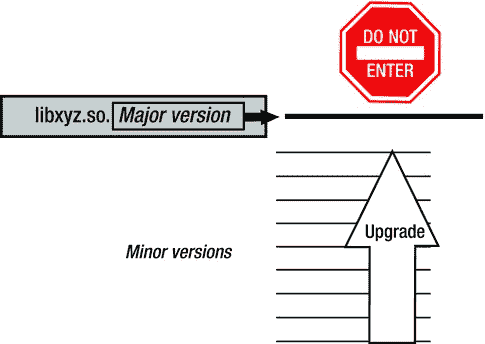

图 10-3。

Soname safeguards against linking with incompatible major versions of shared library, but does not interfere with minor version upgrades

在新的动态库具有升级的主版本的情况下，该方案被设计为阻止运行。解释这种情况下限制措施的确切工作方式需要我们更深入地研究实现细节。

#### Soname 实现的技术细节

尽管听起来很可靠，但是基于使用 soname 的方案并不强大，除非它的实现有一个非常重要的方面。更具体地说，soname 被嵌入到二进制文件中。ELF 格式保留了动态部分的专用字段，用于(根据目的)携带 soname 信息。在链接阶段，链接器获取指定的 soname 字符串，并将其插入到选择的 ELF 格式字段中。

soname 的“卧底生活”始于链接器将其印入动态库，目的是声明库的主要版本。然而，它并没有就此结束。每当客户端二进制文件链接到动态库时，链接器都会提取动态库的 soname，并将其插入到客户端二进制文件中，尽管这次的目的略有不同——表示客户端二进制文件的版本要求。

##### Soname 嵌入到动态库文件中

构建动态库时，可以使用专用的链接器标志来指定库 soname。

`$ gcc -shared <list of linker inputs>``-Wl,-soname,`T2】

链接器将指定的 soname 字符串嵌入到二进制文件的`DT_SONAME`字段中，如图 [10-4](#Fig4) 所示。

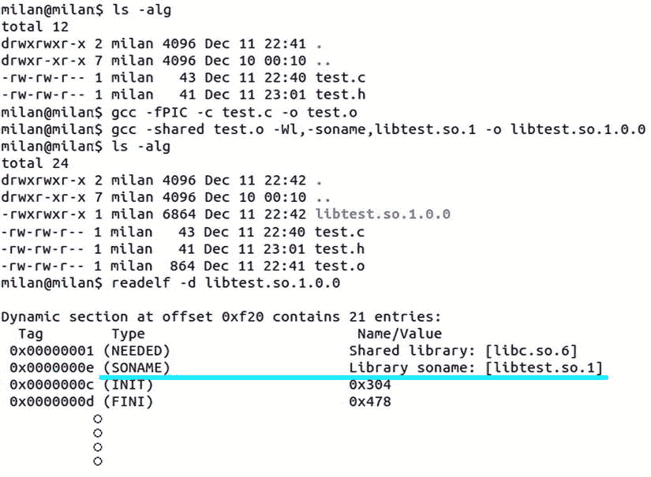

图 10-4。

Soname gets embedded into the DT_SONAME field of the binary file

##### Soname 传播到客户端二进制文件中

当客户端二进制文件与动态库链接(直接或通过软链接)时，链接器获取动态库 soname 并将其插入客户端二进制文件的`DT_NEEDED`字段，如图 [10-5](#Fig5) 所示。

图 10-5。

Linked library soname gets propagated into the client binary

这样，soname 携带的版本信息会进一步传播，在所有相关方(链接器、动态库文件、客户机二进制文件和加载器)之间建立可靠的版本规则。

与库文件名不同，库文件名很容易被任何人修改(从每个脑细胞有太多手指和太多时间的弟弟妹妹到恶意的黑客)，改变 soname 值既不简单也不实际，因为它不仅需要修改二进制文件，还需要完全熟悉 ELF 格式。

##### 其他实用程序的支持(ldconfig)

除了受动态链接场景中所有必要参与者(即链接器、二进制文件、加载器)的支持之外，其他工具也支持 soname 概念。在这方面，ldconfig 实用程序是一个显著的例子。除了其最初的职责范围之外，该工具还有一个额外的“瑞士刀”功能。

当传递了`-n <directory>`命令行参数时，ldconfig 打开所有动态库文件(其名称符合库命名约定！)，提取它们的 soname，并为它们中的每一个创建一个名称与提取的 soname 相同的软链接。

`-l <specific library file>`选项更加灵活，因为在这种情况下，动态库文件名可以是任何合法的文件名。无论文件名看起来像什么(是具有完整版本信息的完全成熟的原始库名，还是经过重大修改的文件名)，嵌入到指定文件中的 soname 都会被提取出来，并且会创建正确的软链接，明确指向库文件。

为了证明这一点，进行了一个小实验，其中原始库名被有目的地改变。然而，ldconfig 设法创建了正确的软链接，如图 [10-6](#Fig6) 所示。

图 10-6。

Regardless of the library name, ldconfig extracts its soname

### Linux 符号版本控制方案

除了控制整个动态库的版本信息之外，GNU 链接器还支持对版本的额外控制，其中版本信息可以归属于单独的符号。在该方案中，在链接阶段，称为版本脚本的文本文件以相当简单的语法为特征被传递给链接器，链接器将该文本文件插入专门用于携带符号版本信息的 ELF 部分(`.gnu.version`和类似部分)。

#### 符号版本控制机制的优势

符号版本控制方案在许多方面比基于 soname 的版本控制更复杂。符号版本控制方法的一个特别有趣的细节是，它允许单个动态库二进制文件同时携带同一符号的几个不同版本。需要相同动态库的不同版本的不同客户端二进制文件将加载相同的且唯一的二进制文件，并且将能够针对指定版本的符号进行链接。

相比之下，当使用基于 soname 的版本控制方法时，为了支持同一个库的几个主要版本，您需要在目标机器上实际存在那么多不同的二进制文件(每个都带有不同的 soname 值)。图 [10-7](#Fig7) 说明了版本化方案之间的区别。

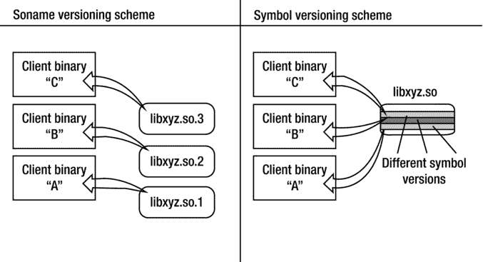

图 10-7。

Comparison of soname-based and symbol-based versioning schemes

额外的好处是，由于脚本文件语法支持丰富的功能，还可以控制符号可见性(即，哪些符号由库导出，哪些保持隐藏)，其优雅和简单性超过了迄今为止描述的所有符号可见性方法。

#### 符号版本控制机制分析模型

为了充分理解符号版本控制机制，定义使用它的常见用例场景是很重要的。

##### 阶段 1:初始版本

一开始，假设动态库的第一个已发布版本与客户机二进制文件“A”愉快地链接在一起，一切运行良好。图 [10-8](#Fig8) 描述了开发周期的早期阶段。

图 10-8。

Chronologically earliest client binary “A” links in library version 1.0.0

然而，这仅仅是故事的开始。

##### 阶段 2:次要版本变更

随着时间的推移，动态的图书馆发展进程不可避免地带来变化。更重要的是，不仅动态库发生了变化，还有一系列新的客户端二进制文件(“B”、“C”等)。)出现，这在动态库与第一个客户机二进制文件“A”链接发生时还不存在。该阶段如图 [10-9](#Fig9) 所示。

某些动态库更改可能对现有的客户端二进制文件的功能没有影响。此类更改被视为次要版本更改是理所当然的。

图 10-9。

Somewhat newer client binary “B” links in newer library version (1.1.0)

##### 阶段 3:主要版本变更

偶尔，动态库代码的变化会带来一些过于激进的差异，这意味着与以前的库版本完全决裂。在这些新的变化发生时创建的新的客户机二进制文件(“C”)在适应新的范例方面通常没有问题。

然而，较老的客户端二进制(“A”和“B”)可能会以图 [10-10](#Fig10) 所示的情况结束，这类似于摇滚婚宴上的一对老年夫妇永远等待乐队演奏他们最喜欢的格伦·米勒曲子。

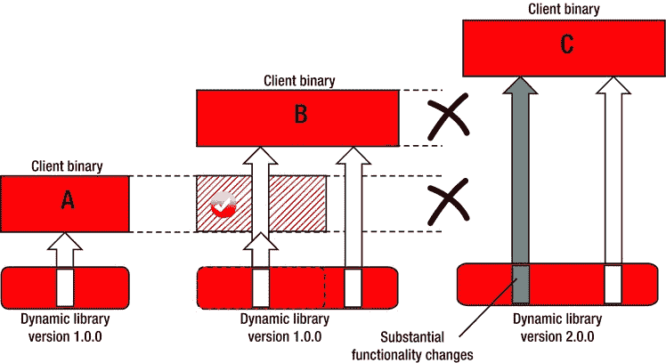

图 10-10。

The latest and greatest client binary “C” links in the newest dynamic library version (2.0.0), which is incompatible for use by the older client binaries “A” and “B”

软件开发人员的任务是使功能升级的过渡尽可能平稳。打破与现有基础设施的兼容性很少是明智之举。该库在开发人员中越受欢迎，就越不建议脱离该库的预期功能。这个问题的真正解决方案是新的动态库至少在一段时间内同时提供旧版本和新版本的功能。这个想法在图 [10-11](#Fig11) 中进行了说明。

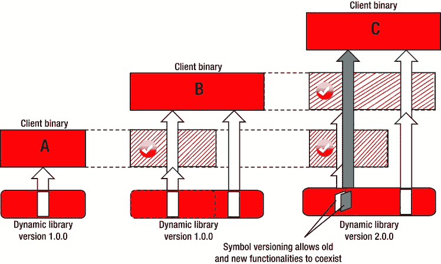

图 10-11。

Symbol versioning resolves incompatibility issues

#### 基本实现要素

符号版本化方案是通过结合链接器版本脚本和`.symver`汇编指令来实现的，这两者都将在接下来详细阐述。

##### 链接器版本脚本

符号可见性控制机制的最基本实现是基于 GNU 链接器读取以版本脚本文本文件形式提供的符号版本信息。

让我们从一个简单的动态库(`libsimple.so`)的例子开始一个简单的演示，它具有清单 10-1 所示的三个函数。

清单 10-1。简单. c

`int first_function(int x)`

`{`

`return (x+1);`

`}`

`int second_function(int x)`

`{`

`return (x+2);`

`}`

`int third_function(int x)`

`{`

`return (x+3);`

`}`

假设现在你想要前两个库函数(但不是第三个！)来携带版本信息。指定符号版本的方法是创建一个相当简单的版本脚本文件，看起来有点像清单 10-2 中的代码。

清单 10-2 .简单版脚本

`LIBSIMPLE_1.0 {`

`global:`

`first_function; second_function;`

`local:`

`*;`

`};`

最后，让我们现在构建动态库。通过使用专用的链接器标志，可以方便地将版本脚本文件名传递给链接器，如下所示:

`$ gcc -fPIC -c simple.c`

`$ gcc -shared simple.o``-Wl,--version-script,``simpleVersionScript`T3】

链接器从脚本文件中提取信息，并将其嵌入专用于版本控制的 ELF 格式部分。关于符号版本信息如何嵌入到 ELF 二进制文件中的更多信息将很快出现。

##### 。symver 装配指令

不同于代表符号版本化概念的“面包和黄油”的版本脚本文件，在所有阶段和所有场景中使用，符号版本化范例依赖于另一个成分——`.symver`汇编指令——来解决棘手的情况。

让我们假设一个主要版本变化的场景，其中函数签名在版本之间没有变化，但是底层功能发生了相当大的变化。此外，有一个函数最初用于返回许多链接元素，但在最新版本中被重新设计为返回链表所占用的总字节数(反之亦然)。参见清单 10-3。

清单 10-3。适用于不同主要版本的相同功能的不同实现的示例

`// VERSION 1.0:`

`unsigned long list_occupancy(struct List* pStart)`

`{`

`// here we scan the list, and return the number of elements`

`return nElements;`

`}`

`// VERSION 2.0:`

`unsigned long list_occupancy(struct List* pStart)`

`{`

`// here we scan the list, but now return the total number of bytes`

`return nElements*sizeof(struct List);`

`}`

显然，库的第一个版本的客户端将面临问题，因为函数返回的值将不再符合预期。

如前所述，这种版本控制技术的信条是在同一二进制文件中提供同一符号的不同版本。说得好听，但是怎么做呢？试图构建两个函数版本将导致链接器报告重复的符号。幸运的是，GCC 编译器支持自定义的`.symver`汇编指令，这有助于缓解这个问题(见清单 10-4)。

清单 10-4。清单 10-3 中的同一对不同版本的函数，这次正确地应用了符号版本控制

`__asm__(".symver list_occupancy_1_0, list_occupancy@MYLIBVERSION_1.0");`

`unsigned long``list_occupancy_1_0`T2】

`{`

`// here we scan the list, and return the number of elements`

`return nElements;`

`}`

`// default symbol version indicated by the additional "@"`

`//                 |`

`//                 v`

`__asm__(".symver list_occupancy_2_0, list_occupancy@@MYLIBVERSION_2.0");`

`unsigned long``list_occupancy_2_0`T2】

`{`

`// here we scan the list, but now return the total number of bytes`

`return nElements*sizeof(struct List);`

`}`

##### 这个方案是如何运作的？

为了消除链接器面临的重复符号问题，您可以为同一函数的不同版本创建不同的名称，这些名称将仅用于内部目的(即不会被导出)。这两个函数是`list_occupancy_1_0`和`list_occupancy_2_0`。

然而，从外部世界的角度来看，链接器将创建以期望的函数名(即`list_occupancy()`)为特征的符号，尽管用适当的符号版本信息进行了修饰，出现在两个不同的版本中:list _ occupancy @ my libversion _ 1.0 和`list_occupancy@MYLIBVERSION_2.0.`

因此，旧的和新的客户端二进制文件都能够识别它们期望的符号。旧的客户端二进制文件会很高兴看到符号 list _ occupancy @ my libversion _ 1.0 的存在。它对这个中间函数符号的调用将在内部被路由到正确的位置——到动态库函数`list_occupancy_1_0()`,这是真正的符号。

最后，全新的客户端二进制文件并不特别关心以前的版本历史，将选择默认符号，由名称中的额外@字符表示(在本例中为`list_occupancy@@MYLIBVERSION_2.0`)。

#### 样本项目分析:阶段 1(初始版本)

既然您已经理解了基本的实现成分(版本脚本和/或`.symver`汇编指令)是如何工作的，那么是时候仔细看看一个真实的例子了。为了说明要点，让我们回到用来说明链接器版本脚本的原始示例(即具有三个函数的库`libsimple.so`，其中前两个将受符号版本控制)。为了让演示更有说服力，会在原代码中加入一些 printf 的；参见清单 10-5 到清单 10-8。

清单 10-5。简单. h

`#pragma once`

`int first_function(int x);`

`int second_function(int x);`

`int third_function(int x);`

清单 10-6。简单. c

`#include <stdio.h>`

`#include "simple.h"`

`int first_function(int x)`

`{`

`printf(" lib: %s\n", __FUNCTION__);`

`return (x+1);`

`}`

`int second_function(int x)`

`{`

`printf(" lib: %s\n", __FUNCTION__);`

`return (x+2);`

`}`

`int third_function(int x)`

`{`

`printf(" lib: %s\n", __FUNCTION__);`

`return (x+3);`

`}`

清单 10-7 .简单版脚本

`LIBSIMPLE_1.0 {`

`global:`

`first_function; second_function;`

`local:`

`*;`

`};`

清单 10-8。build.sh

`gcc -Wall -g -O0 -fPIC -c simple.c`

`gcc -shared simple.o``-Wl,--version-script,``simpleVersionScript`T3】

现在库已经构建好了，让我们仔细看看 ELF 格式是如何支持符号版本化概念的。

##### ELF 格式支持

对库文件的段分析表明，有三个名称非常相似的段用于携带版本信息，如图 [10-12](#Fig12) 所示。

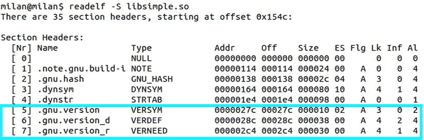

图 10-12。

ELF format support for versioning information

使用`-V`命令行参数调用`readelf`实用程序以一种特别简洁的方式提供了关于这些部分内容的报告，如图 [10-13](#Fig13) 所示。

图 10-13。

Using readelf to list contents of version-related sections

很明显

*   章节描述了在这个特定的库中定义的版本信息(因此章节名中有附录“_d”)。
*   `.gnu.version_r`小节描述了其他库的版本信息，该信息被该库引用(因此小节名称中有附录“_r”)。
*   `.gnu_version`部分提供了与该库相关的所有版本信息的汇总列表。

此时验证版本信息是否与版本脚本中指定的符号相关联是很有趣的。

在所有可用的检查二进制文件符号的方法(`nm`、`objdump`、`readelf`)中，再次是`readelf`实用程序以最好的形式提供答案，其中符号与指定版本信息的关联变得明显，如图 [10-14](#Fig14) 所示。

图 10-14。

Using readelf to print symbol versioning information

显然，在版本脚本中指定并传递给链接器的版本信息找到了进入二进制文件的途径，并且肯定成为了用于版本控制的符号的属性。

一个有趣的旁注是，二进制文件的反汇编表明没有`first_function@@LIBVERSIONDEMO_1.0`这样的东西。你能找到的只有真正的`first_function`的符号。运行时的反汇编(通过运行`gdb`)显示了同样的事情。

显然，用符号版本信息修饰的导出符号是一种虚构(有用，但仍然是虚构)，而最终唯一有价值的是真实的、现有函数的符号。

##### 将版本符号信息传播到客户端二进制文件

当您检查链接到您的符号版本化动态库的客户端二进制文件时，会出现另一轮有趣的发现。为了在这个特定的方向上探索符号版本化，让我们创建一个简单的引用版本化符号的演示应用程序；参见清单 10-9。

清单 10-9。主网站

`#include <stdio.h>`

`#include "simple.h"`

`int main(int argc, char* argv[])`

`{`

`int nFirst  = first_function(1);`

`int nSecond = second_function(2);`

`int nRetValue = nFirst + nSecond;`

`printf("first(1) + second(2) = %d\n", nRetValue);`

`return nRetValue;`

`}`

让我们现在建立它。

`$ gcc -g -O0 -c -I../sharedLib main.c`

`$ gcc main.o -Wl,-L../sharedLib -lsimple \`

`-Wl,-R../sharedLib -o firstDemoApp`

请注意，为了单独使用符号版本控制机制，特意省略了对库 soname 的指定。

作为一个 ELF 二进制文件，演示应用程序也包含与版本相关的部分(如图 [10-15](#Fig15) 中的部分检查所示)，这并不奇怪。

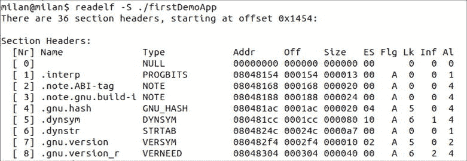

图 10-15。

Demo application also features versioning-related sections

更重要的是，演示动态库的符号版本信息是由客户端二进制程序通过链接过程获取的，如图 [10-16](#Fig16) 所示。

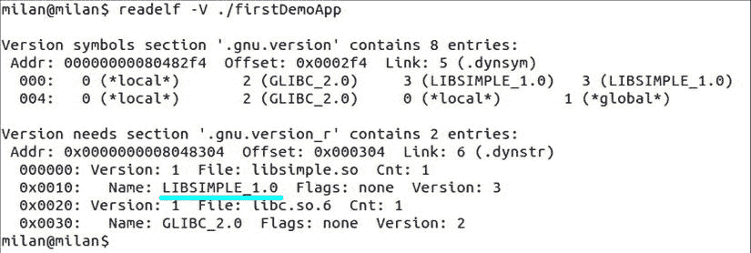

图 10-16。

Client binary “ingests” the symbol versioning info from library it linked in

与前面描述的基于 soname 的版本控制场景完全一样，符号版本控制机制也从动态库传递到其客户端二进制文件。这样，客户机二进制文件和动态库版本之间就建立了一种契约形式。

为什么这很重要？从客户机二进制代码与动态库发生链接的那一刻起，动态库代码可能经历大量的改变，并相应地经历大量的次要和主要版本。

不管动态库如何变化，它的客户机二进制文件将继续使用链接时存在的版本信息。如果恰好那个版本(当然还有与那个特定版本相关联的功能)丢失了，将会强烈地表明向后兼容性的破坏。

在继续之前，让我们确保您的版本控制方案不会阻止应用程序运行。简单的实验如图 [10-17](#Fig17) 所示。

图 10-17。

Versioning scheme working correctly

#### 样本项目分析:阶段 2(次要版本变更)

一旦您理解了符号版本化方案如何操作的基础，就该模拟动态库开发导致非破坏性变更(即，次要版本)的场景了。在尝试模拟真实场景时，将采取以下步骤:

*   您将通过添加更多的函数来修改动态库。只有一个新添加的函数会被导出。宣布 LIBSIMPLE_1.1 次要版本升级的额外项目将丰富版本控制脚本。
*   原始的客户机二进制文件(即最初的简单演示应用程序)将有目的地保持不变。通过不重新构建它，它将完美地模仿遗留应用程序，该应用程序是在动态库以初始版本 1.0 为特色的时候构建的。
*   新的客户机二进制文件(另一个简单的演示应用程序)将被创建并链接到更新的动态库。这样，它将作为一个全新的客户机二进制文件的例子，创建于最新和最好的动态库版本 1.1，不知道任何以前的库版本。
*   为了简化演示，它的代码与最初的简单演示应用程序不会有太大的不同。最显著的区别是它将调用新的 ABI 函数，这在最新的 1.1 版本之前是不存在的。

清单 10-10 和 10-11 显示了修改后的动态库的源文件现在的样子。

清单 10-10。简单. h

`#pragma once`

`int first_function(int x);`

`int second_function(int x);`

`int third_function(int x);`

`int fourth_function(int x);`

`int fifth_function(int x);`

清单 10-11。简单. c

`#include <stdio.h>`

`#include "simple.h"`

`int first_function(int x)`

`{`

`printf(" lib: %s\n", __FUNCTION__);`

`return (x+1);`

`}`

`int second_function(int x)`

`{`

`printf(" lib: %s\n", __FUNCTION__);`

`return (x+2);`

`}`

`int third_function(int x)`

`{`

`printf(" lib: %s\n", __FUNCTION__);`

`return (x+3);`

`}`

`int fourth_function(int x) // exported in version 1.1`

`{`

`printf(" lib: %s\n", __FUNCTION__);`

`return (x+4);`

`}`

`int fifth_function(int x)`

`{`

`printf(" lib: %s\n", __FUNCTION__);`

`return (x+5);`

`}`

清单 10-12 显示了修改后的版本脚本。

清单 10-12 .简单版脚本

`LIBSIMPLE_1.0 {`

`global:`

`first_function; second_function;`

`local:`

`*;`

`};`

`LIBSIMPLE_1.1` `{`

`global:`

`fourth_function` `;`

`local:`

`*;`

`};`

新的演示应用程序源文件将如清单 10-13 所示。

清单 10-13。主网站

`#include <stdio.h>`

`#include "simple.h"`

`int main(int argc, char* argv[])`

`{`

`int nFirst  = first_function(1);`

`int nSecond = second_function(2);`

`int nFourth  = fourth_function(4);`

`int nRetValue = nFirst + nSecond + nFourth;`

`printf("first(1) + second(2) + fourth(4) = %d\n", nRetValue);`

`return nRetValue;`

`}`

让我们现在建立它。

`$ gcc -g -O0 -c -I../sharedLib main.c`

`$ gcc main.o -Wl,-L../sharedLib -lsimple \`

`-Wl,-R../sharedLib -o newerApp`

现在让我们仔细看看这个小版本化冒险的效果，它完美地模拟了动态库次要版本升级时发生的真实场景。

首先，如图 [10-18](#Fig18) 所示，版本信息现在不仅包含原始版本(1.0)，还包含最新版本(1.1)

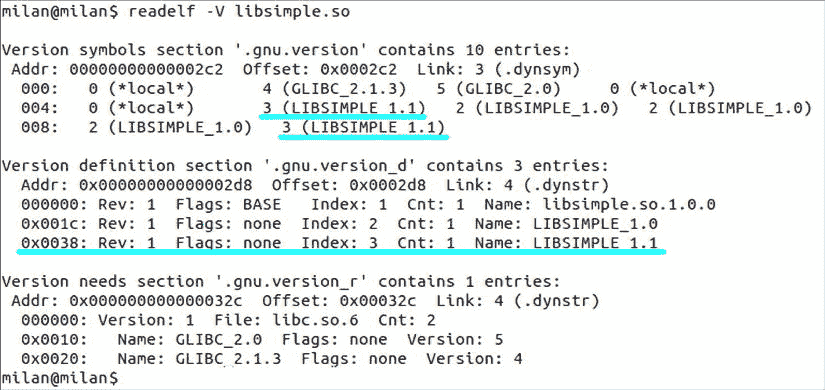

图 10-18。

Complete versioning information ingested by the client binary

导出的符号集现在由 1.0 版和 1.1 版符号组成，如图 [10-19](#Fig19) 所示。

图 10-19。

Symbols of different versions present in the shared library

现在让我们看看在 1.1 版本发布后首次构建的更新、更现代的客户端二进制文件(newerApp)是什么样子的。如图 [10-20](#Fig20) 所示，链接器读出动态库支持的所有版本的信息，并将其插入到新应用的客户端二进制文件中。

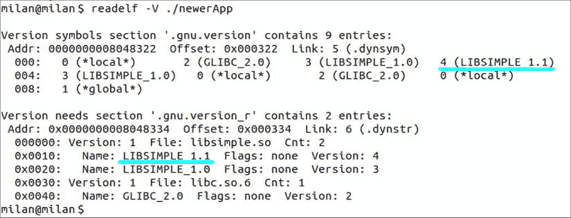

图 10-20。

Newer client binary ingested complete versioning info (both old and newer symbol versions)

客户端二进制文件在运行时依赖的动态库符号列表包含两个版本的符号。图 [10-21](#Fig21) 说明了这一点。

图 10-21。

Symbols of all versions ingested from the shared library

现在，为了验证添加的新功能和修改的版本信息是否如预期的那样工作，您可以尝试运行旧的和新的应用程序。如图 [10-22](#Fig22) 所示，运行老 app 会证明新的小版本动态库并没有带来什么不愉快的惊喜。

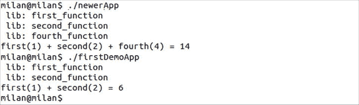

图 10-22。

Both older and newer app link the same library, but use the symbols of different versions

#### 样本项目分析:阶段 3(主要版本变更)

在前面分析的例子中，我已经介绍了新代码变更通常不会影响客户使用现有代码库的情况。这种代码变更被认为是次要版本的增加。

我不会试图涵盖更戏剧性的情况，在这种情况下，代码更改严重破坏了客户使用代码的方式，因此显然属于主要版本增量类别。

##### 改变 ABI 函数行为的情况

当动态库符号看起来什么都没发生时(即，函数的原型没有改变，和/或结构的布局没有改变)，可能会发生最令人不快的代码更改，但是函数处理数据的潜在意义(最重要的是，它们返回的值)确实发生了变化。

想象一下，你有一个函数用来返回以毫秒为单位的时间值。在一个晴朗的日子里，开发人员发现毫秒作为度量不够精确，于是决定返回纳秒值(纳秒值大 1000 倍)。

这个场景是我们下一个例子的主题；我将展示如何通过巧妙使用符号版本控制机制来解决这种性质的问题。(我同意这个例子有点幼稚/荒诞/幼稚。事实上，有一百万种方法可以避免这种变化带来的混乱。例如，您可以引入一个名称中带有单词“纳秒”的新 ABI 函数，它将以纳秒为单位返回时间。即使这样，像这样的例子对于演示来说已经足够好了。)

回到正题，我们假设演示动态库导出头根本没变，所以函数原型没变。然而，最新的设计要求规定从现在起`first_function()`需要返回一个不同于它过去返回的值。

`int first_function(int x)`

`{`

`printf(" lib: %s\n", __FUNCTION__);`

`return``1000*`T2】

`}`

不用说，这种变化肯定会对现有的客户机二进制文件造成严重破坏。他们现有的代码基础设施根本不期望有那么大的价值。跳出数组边界可能会导致异常。在绘制图表的场景中，该值可能会超出界限，等等。

因此，现在您需要一种方法来确保老客户得到通常的待遇(即，现有的客户端二进制文件对`first_function()`的调用返回它以前的值)，而新客户得到新设计的好处。

唯一的问题是，你必须解决冲突；相同的函数名必须在两个完全不同的场景中使用。幸运的是，符号版本控制机制证明它能够处理这类问题。

作为第一步，您将修改版本脚本以表明对新的主要版本的支持；请参见清单 10-14。

清单 10-14 .简单版脚本

`LIBSIMPLE_1.0 {`

`global:`

`first_function; second_function;`

`local:`

`*;`

`};`

`LIBSIMPLE_1.1 {`

`global:`

`fourth_function;`

`local:`

`*;`

`};`

`LIBSIMPLE_2.0` `{`

`global:`

`first_function` `;`

`local:`

`*;`

`};`

接下来，您将基于使用。symver 汇编指令，如清单 10-15 所示。

清单 10-15。simple.c(仅显示此处的更改)

`...`

`__asm__(".symver first_function_1_0,first_function@LIBSIMPLE_1.0");`

`int``first_function_1_0`T2】

`{`

`printf(" lib: %s\n", __FUNCTION__);`

`return (x+1);`

`}`

`__asm__(".symver first_function_2_0,first_function@@LIBSIMPLE_2.0");`

`int``first_function_2_0`T2】

`{`

`printf(" lib: %s\n", __FUNCTION__);`

`return 1000*(x+1);`

`}`

`...`

如图 [10-23](#Fig23) 所示，动态库现在多了一条版本信息。

图 10-23。

The latest and greatest library version contains all the symbol versions

有趣的是，如图 [10-24](#Fig24) 所示，看起来`.symver`指令确实发挥了它的魔力。

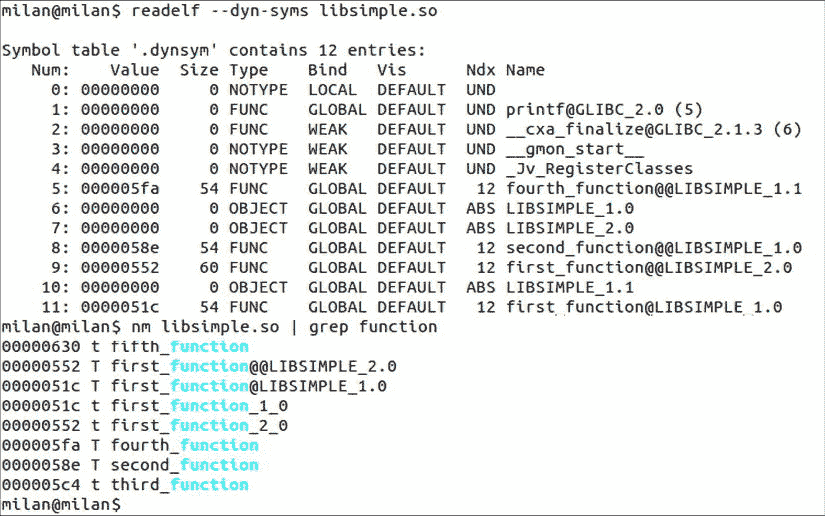

图 10-24。

Both versions of first_function() exist

整个`.symver`方案的最终效果是导出两个版本的`first_function()`符号的魔力，尽管这个名称的函数不再存在，因为它被`first_function_1_0()`和`first_function_2_0()`所取代。

为了清楚地显示实现的不同，您将创建一个新的应用程序，它的源代码与以前的版本没有什么不同(见清单 10-16)。

清单 10-16。主网站

`#include <stdio.h>`

`#include "simple.h"`

`int main(int argc, char* argv[])`

`{`

`int nFirst  = first_function(1);` `// seeing 1000 times larger return value will be fun!`

`int nSecond = second_function(2);`

`int nFourth  = fourth_function(4);`

`int nRetValue = nFirst + nSecond + nFourth;`

`printf("first(1) + second(2) + fourth(4) = %d\n", nRetValue);`

`return nRetValue;`

`}`

将相应地选择新的应用程序名称:

`$ gcc -g -O0 -c -I../sharedLib main.c`

`$ gcc main.o -Wl,-L../sharedLib -lsimple \`

`-Wl,-R../sharedLib -o` `ver2PeerApp`

运行时比较将清楚地表明，旧客户端的功能不会受到主要版本变化的影响。然而，当代应用程序将依靠 2.0 版本带来的新功能。图 [10-25](#Fig25) 总结了这一点。

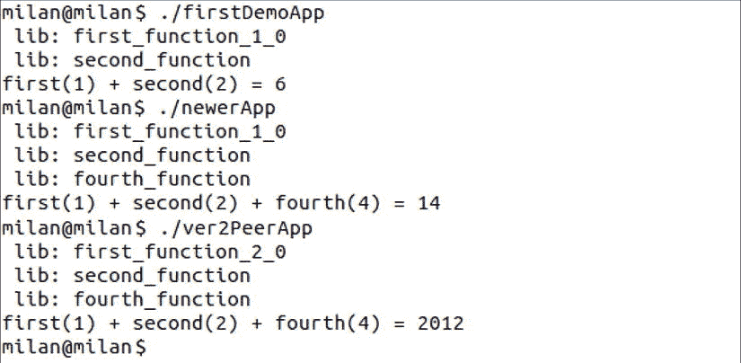

图 10-25。

Three apps (each of which rely on different symbol versions of the same dynamic library) run as intended

##### 改变 ABI 函数原型的案例

之前描述的案例有点离奇。由于有许多方法可以避免，它在现实生活中发生的几率相当低。然而，从教育的角度来看，它是珍贵的，因为解决这种问题的过程是最简单的。

属于主要版本代码更改的一个更常见的情况是当函数的签名需要更改时。例如，让我们假设对于新的用例场景，`first_function()`需要接受一个额外的输入参数。

`int first_function(int x, int normfactor);`

显然，您现在需要支持同名但不同签名的函数。为了演示这个问题，让我们创建另一个版本，如清单 10-17 所示。

清单 10-17 .简单版脚本

`LIBSIMPLE_1.0 {`

`global:`

`first_function; second_function;`

`local:`

`*;`

`};`

`LIBSIMPLE_1.1 {`

`global:`

`fourth_function;`

`local:`

`*;`

`};`

`LIBSIMPLE_2.0 {`

`global:`

`first_function;`

`local:`

`*;`

`};`

`LIBSIMPLE_3.0` `{`

`global:`

`first_function;`

`local:`

`*;`

`};`

一般来说，这个问题的解决方案与前一个案例没有实质性的不同，因为基于`.symver`汇编指令的配方将会以与前一个例子相同的方式使用(见清单 10-18)。

清单 10-18。simple.c(仅显示此处的更改)

`__asm__(".symver first_function_1_0,first_function@LIBSIMPLE_1.0");`

`int first_function_1_0(int x)`

`{`

`printf(" lib: %s\n", __FUNCTION__);`

`return (x+1);`

`}`

`__asm__(".symver first_function_2_0,first_function@LIBSIMPLE_2.0");`

`int first_function_2_0(int x)`

`{`

`printf(" lib: %s\n", __FUNCTION__);`

`return 1000*(x+1);`

`}`

`__asm__(".symver first_function_3_0,first_function@@LIBSIMPLE_3.0");`

`int first_function_3_0` `(int x, int normfactor)`

`{`

`printf(" lib: %s\n", __FUNCTION__);`

`return normfactor*(x+1);`

`}`

然而，最大的区别是导出头必须被修改，如清单 10-19 所示。

清单 10-19。简单. h

`#pragma once`

`// defined when building the latest client binary`

`#ifdef SIMPLELIB_VERSION_3_0`

`int first_function(int x, int normfactor);`

`#else`

`int first_function(int x);`

`#endif // SIMPLELIB_VERSION_3_0`

`int second_function(int x);`

`int third_function(int x);`

`int fourth_function(int x);`

`int fifth_function(int x);`

只有用传递给编译器的 SIMPLELIB_VERSION_3_0 预处理器常量构建的客户端二进制文件才会包含新的`first_function()`原型。

`$ gcc -g -O0 -c``-DSIMPLELIB_VERSION_3_0`T2】

`$ gcc main.o -Wl,-L../sharedLib -lsimple \`

`-Wl,-R../sharedLib -o ver3PeerApp`

对于读者来说，验证这个例子在所有其他方面(版本信息、符号存在、运行时结果)满足他/她的期望是一个很好的小练习。

#### 版本脚本语法概述

到目前为止，代码示例中显示的版本脚本仅提供了广泛支持的语法功能的一个子集。本节的目的是提供受支持选项的简要概述。

##### 版本节点

版本脚本的基本实体是版本节点，封装在描述某个版本的花括号中的命名结构，例如

`LIBXYZ_1.0.6 {`

`... <some descriptors reside here>`

`};`

版本节点通常封装了几个控制版本化过程不同方面的关键字，稍后将更详细地讨论它们的多样性。

##### 版本节点命名规则

通常选择节点名称来精确描述该节点所描述的完整版本。通常，名称以点或下划线分隔的数字结尾。代表较新版本的节点出现在代表较早版本的节点之后，这是一种常识性的做法。

然而，这只是一种让人类的生活更轻松的做法。链接器并不特别关心如何命名版本节点，也不关心它们在文件中出现的顺序。所有这些都需要名字不同。

动态库及其客户端二进制文件也有类似的情况。对他们来说，真正重要的是版本节点被添加到版本文件中的时间顺序——在构建它们的时候存在哪个特定的版本。

##### 符号导出控制

版本节点的`global`和`local`修饰符直接控制符号导出。与在局部标签下声明的符号相反，在全局标签下声明的分号分隔的符号列表将被导出。

`LIBXYZ_1.0.6 {`

`global:`

`first_function; second_function;`

`local:`

`*;`

`};`

尽管这不是版本化方案的主要主题，但是这种导出符号的机制实际上是指定导出符号列表的完全合法的(并且在许多方面是最优雅的)方式。这种机制如何工作的例子将在随后的章节中提供。

##### 通配符支持

版本脚本支持与 shells 支持的表达式匹配操作相同的通配符集。例如，以下版本脚本将名称以“first”或“second”开头的所有函数声明为全局函数

`LIBXYZ_1.0.6 {`

`global:`

`first``*``; second``*`T4】

`local:`

`*;`

`};`

此外，本地标签下的星号指定所有其他函数都属于本地范围(不导出的函数)。双引号中指定的文件名将被逐字采用，不管它们可能包含任何通配符。

##### 链接说明符支持

版本脚本可用于指定`extern "C"`(无名称篡改)或`extern "C++"`链接说明符。

`LIBXYZ_1.0.6 {`

`global:`

`extern "C" {`

`first_function;`

`}`

`local:`

`*;`

`};`

##### 命名空间支持

版本脚本还支持使用命名空间来指定版本化和/或导出符号的从属关系。

`LIBXYZ_1.0.6 {`

`global:`

`extern "C++" {`

`libxyz_namespace::*`

`}`

`local:`

`*;`

`};`

##### 未命名节点

未命名的节点可用于指定未版本化的符号。此外，它的目的可能是托管符号导出说明符(全局和/或局部)。

事实上，当对符号导出的控制是您使用版本控制脚本机制的唯一动机时，版本脚本通常只包含一个未命名的节点。

##### 版本脚本附带功能:符号可见性控制

版本脚本机制的另一个特性是它还提供了对符号可见性的控制。“全局”选项卡下的“版本脚本”节点中列出的符号最终会被导出，而“本地”选项卡下列出的符号不会被导出。

仅仅为了指定要导出的符号而使用版本脚本机制是完全合法的。然而，强烈建议在这种情况下使用未命名的脚本版本节点，如图 [10-26](#Fig26) 所示的简单演示所示。

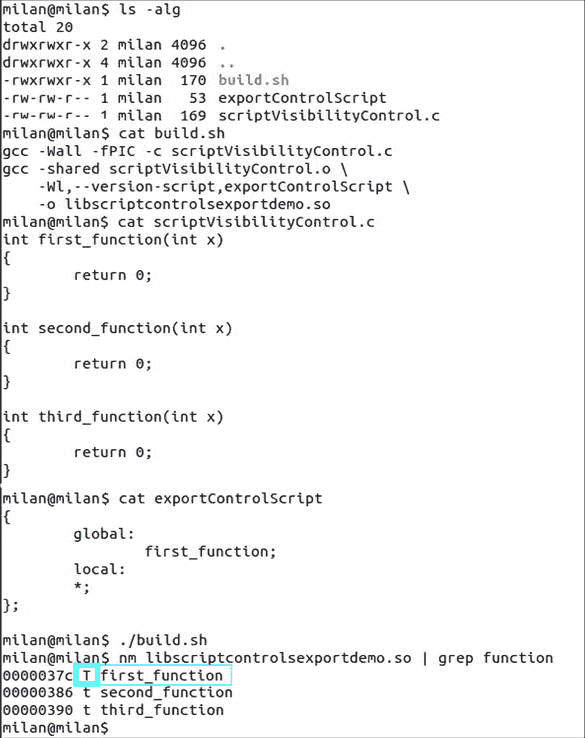

图 10-26。

Version script can be used as the most elegant way of controlling the symbol visibility, as it does not require any modifications of the source code

## Windows 动态库版本控制

Windows 中的版本控制实现遵循与 Linux 中相同的原则。显著脱离现有运行时功能或需要重新构建客户端二进制文件的代码更改会导致主要的版本更改。不中断现有客户端二进制文件功能的所提供功能的添加/扩展符合次要版本更改的条件。

主要影响内部功能细节的代码更改在 Linux 中称为补丁，在 Windows 中称为构建版本。除了明显的命名差异，这两个概念之间没有实质性的区别。

### DLL 版本信息

与 Linux 动态库一样，Windows 动态库(DLL)的版本信息是可选的。除非进行有意识的设计来指定此类信息，否则它不会作为 DLL 的一部分出现。然而，作为一个好的设计规则，所有主要的 DLL 供应商(当然从微软开始)都确保他们提供的动态库携带版本信息。当可用时，DLL 版本信息作为文件属性页上的专用选项卡提供，可以通过右键单击文件资源管理器窗格中的文件图标来检索，如图 [10-27](#Fig27) 所示。

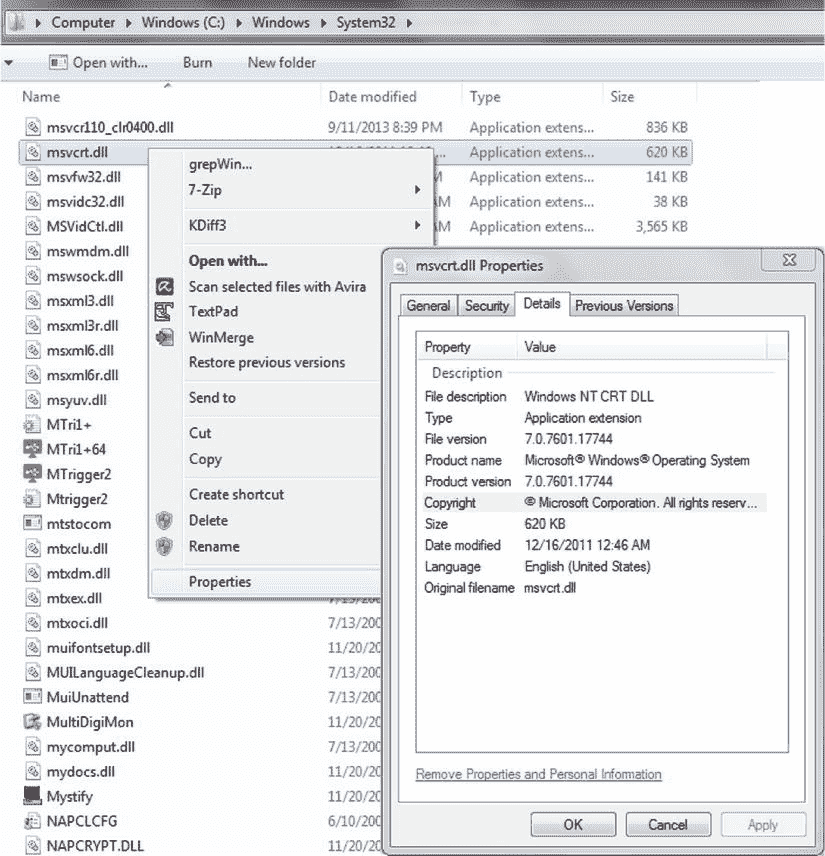

图 10-27。

Example of DLL version information

### 指定 DLL 版本信息

为了说明 Windows DLL 版本控制的最重要方面，创建了一个演示 Visual Studio 解决方案，其中包含两个项目:

*   VersionedDLL 项目，它生成提供了版本信息的 DLL
*   VersionedDLLClientApp 项目，该项目构建加载版本化 DLL 并尝试检索其版本化信息的客户端应用程序

向 DLL 项目提供版本信息的通常方式是将专用版本资源元素添加到库资源文件中，如图 [10-28](#Fig28) 所示。

图 10-28。

Adding the version field to the project resource file

一旦将版本资源添加到 DLL 项目资源文件中，就可以通过 Visual Studio 资源编辑器查看和修改它。

如图 [10-29](#Fig29) 所示，版本信息提供了两个不同的版本组件，文件版本和产品版本。尽管在绝大多数真实生活场景中，这两个组件具有相同的值，但是在如何设置这些组件的值方面存在某些差异。如果一个 DLL 在多个项目中使用，它的文件版本号可能会明显大于它的产品版本号。

通常，当 DLL 刚刚创建时，版本(主要版本、次要版本、内部版本号)通常被设置为相当小且相当接近的值，例如 1.0.0。然而，在本例中，为了进行令人信服的演示，我特意选择不仅将版本信息设置为相当大的数值，而且使 FILEVERSION 值不同于 PRODUCTVERSION 值。

图 10-29。

Using the Visual Studio editor to set file version and product version information

当库建立时，通过编辑版本资源文件指定的版本信息可以通过右击文件浏览器窗格上的文件图标，并选择属性菜单项来查看(图 [10-30](#Fig30) )。

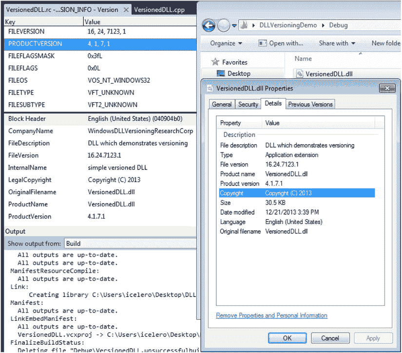

图 10-30。

Set values appearing in the properties of built DLL binary file

### 查询和检索 DLL 版本信息

DLL 版本信息在许多情况下对几个相关方可能特别重要。其功能严重依赖于 DLL 版本的客户端二进制文件可能希望以编程方式检查 DLL 版本详细信息，以便采取适当的进一步操作。安装/部署包可以首先检索现有 dll 的版本信息，以便决定是否用同一文件的较新版本替换/覆盖现有 dll。最后，执行系统管理维护或故障排除任务的人员可能希望仔细查看 DLL 版本。

在这一节中，我将主要关注可以检索 DLL 版本信息的编程方式。

#### 版本信息结构

在`<shlwapi.h>`头文件中声明的 DLLVERSIONINFO 结构通常用于传递版本信息。图 [10-31](#Fig31) 显示了其布局细节。

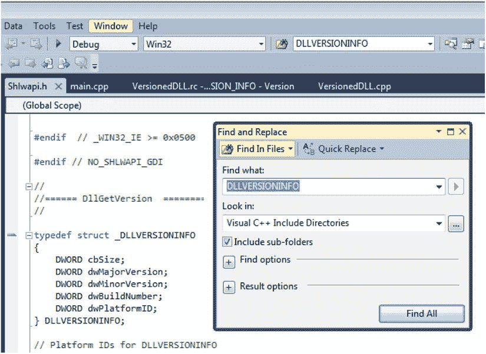

图 10-31。

DLLVERSIONINFO structure

#### 链接要求

需要访问版本相关功能的软件模块必须与`version.dll`链接(即其导入库`version.lib`必须在链接器输入列表中指定)，如图 [10-32](#Fig32) 所示。

图 10-32。

Linking against version.lib (version.dll) is required

接下来将讨论检索 DLL 版本信息的方法。

#### 优雅的方式:调用 DLL 的 DllGetVersion 函数

设计良好的 dll 通常导出`DllGetVersion()`函数的实现，其签名遵循以下规范:

`HRESULT CALLBACK DllGetVersion( DLLVERSIONINFO *pdvi);`

这就是在 MSDN 文献中提到的 [`http://msdn.microsoft.com/enus/library/windows/desktop/bb776404(v=vs.85).aspx`](http://msdn.microsoft.com/enus/library/windows/desktop/bb776404(v=vs.85).aspx) 。Microsoft 提供的 dll 通常提供预期的功能。

对于自定义设计的 dll 来说，实现它也并不复杂。这是配方的概要:函数原型必须被正确地声明和导出，如清单 10-20 以及图 [10-33](#Fig33) 所示。

清单 10-20。VersionedDll.h

`// The following ifdef block is the standard way of creating macros which make exporting`

`// from a DLL simpler. All files within this DLL are compiled with the VERSIONEDDLL_EXPORTS`

`// symbol defined on the command line. This symbol should not be defined on any project`

`// that uses this DLL. This way any other project whose source files include this file see`

`// VERSIONEDDLL_API functions as being imported from a DLL, whereas this DLL sees symbols`

`// defined with this macro as being exported.`

`#ifdef VERSIONEDDLL_EXPORTS`

`#define VERSIONEDDLL_API __declspec(dllexport)`

`#else`

`#define VERSIONEDDLL_API __declspec(dllimport)`

`#endif`

`#include <Shlwapi.h>`

`VERSIONEDDLL_API HRESULT CALLBACK DllGetVersion(DLLVERSIONINFO* pdvi);`

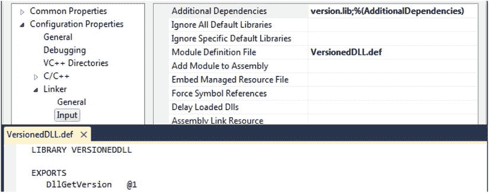

图 10-33。

Properly exporting DllGetVersion() function from DLL

有几种方法可以实现该功能。

*   `DLLVERSIONINFO`结构成员可以被设置为预定的一组值。最好以参数化常量(而不是文字常量)的形式保存版本值。
*   可以通过加载 DLL 资源、提取版本信息字符串以及解析出关于主要版本、次要版本、内部版本的细节来填充`DLLVERSIONINFO`结构。

清单 10-21 说明了这两种方法的结合。如果版本资源检索失败，则可以返回预定值。(为了简单起见，清单中使用了文字常量。我们都知道可以用更结构化的方式来完成)。

清单 10-21。VersionedDLL.cpp

`#define SERVICE_PACK_HOTFIX_NUMBER  (16385)`

`VERSIONEDDLL_API HRESULT CALLBACK DllGetVersion(DLLVERSIONINFO* pdvi)`

`{`

`if(pdvi->cbSize != sizeof(DLLVERSIONINFO) &&`

`pdvi->cbSize != sizeof(DLLVERSIONINFO2))`

`{`

`return E_INVALIDARG;`

`}`

`if(FALSE == extractVersionInfoFromThisDLLResources(pdvi))`

`{`

`// should not happen that we end up here,`

`// but just in case - try to save the day`

`// by sticking in the actual version numbers`

`// TBD: use parametrized value instead of literals`

`pdvi->dwMajorVersion = 4;`

`pdvi->dwMinorVersion = 1;`

`pdvi->dwBuildNumber  = 7;`

`pdvi->dwPlatformID   = DLLVER_PLATFORM_WINDOWS;`

`}`

`if(pdvi->cbSize == sizeof(DLLVERSIONINFO2))`

`{`

`DLLVERSIONINFO2 *pdvi2 = (DLLVERSIONINFO2*)pdvi;`

`pdvi2->dwFlags = 0;`

`pdvi2->ullVersion = MAKEDLLVERULL(pdvi->dwMajorVersion,`

`pdvi->dwMinorVersion,`

`pdvi->dwBuildNumber,`

`SERVICE_PACK_HOTFIX_NUMBER);`

`}`

`return S_OK;`

`}`

清单 10-22 给出了从 DLL 资源中提取版本信息的函数的细节。

清单 10-22。VersionedDLL.cpp(上半部分)

`extern HMODULE g_hModule;`

`BOOL extractVersionInfoFromThisDLLResources(DLLVERSIONINFO* pDLLVersionInfo)`

`{`

`static WCHAR fileVersion[256];`

`LPWSTR lpwstrVersion = NULL;`

`UINT   nVersionLen   = 0;`

`DWORD  dwLanguageID  = 0;`

`BOOL   retVal;`

`if(NULL == pDLLVersionInfo)`

`return FALSE;`

`HRSRC hVersion = FindResource(g_hModule,`

`MAKEINTRESOURCE(VS_VERSION_INFO),`

`RT_VERSION );`

`if(NULL == hVersion)`

`return FALSE;`

`HGLOBAL hGlobal = LoadResource( g_hModule, hVersion );`

`if(NULL == hGlobal)`

`return FALSE;`

`LPVOID lpstrFileVersionInfo  = LockResource(hGlobal);`

`if(NULL == lpstrFileVersionInfo)`

`return FALSE;`

`wsprintf(fileVersion, L"\\VarFileInfo\\Translation");`

`retVal = VerQueryValue ( lpstrFileVersionInfo,`

`fileVersion, (LPVOID*)&lpwstrVersion, (UINT *)&nVersionLen);`

`if(retVal && (4 == nVersionLen))`

`{`

`memcpy(&dwLanguageID, lpwstrVersion, nVersionLen);`

`wsprintf(fileVersion, L"\\StringFileInfo\\%02X%02X%02X%02X\\ProductVersion",`

`(dwLanguageID & 0xff00)>>8,`

`dwLanguageID & 0xff,`

`(dwLanguageID & 0xff000000)>>24,`

`(dwLanguageID & 0xff0000)>>16);`

`}`

`else`

`wsprintf(fileVersion,L"\\StringFileInfo\\%04X04B0\\ProductVersion",GetUserDefaultLangID());`

`if(FALSE == VerQueryValue (lpstrFileVersionInfo,`

`fileVersion,`

`(LPVOID*)&lpwstrVersion,`

`(UINT *)&nVersionLen))`

`{`

`return FALSE;`

`}`

`LPWSTR pwstrSubstring = NULL;`

`WCHAR* pContext = NULL;`

`pwstrSubstring = wcstok_s(lpwstrVersion, L".", &pContext);`

`pDLLVersionInfo->dwMajorVersion = _wtoi(pwstrSubstring);`

`pwstrSubstring = wcstok_s(NULL, L".", &pContext);`

`pDLLVersionInfo->dwMinorVersion = _wtoi(pwstrSubstring);`

`pwstrSubstring = wcstok_s(NULL, L".", &pContext);`

`pDLLVersionInfo->dwBuildNumber = _wtoi(pwstrSubstring);`

`pwstrSubstring = wcstok_s(NULL, L".", &pContext);`

`pDLLVersionInfo->dwPlatformID = _wtoi(pwstrSubstring);`

`pDLLVersionInfo->cbSize = 5*sizeof(DWORD);`

`UnlockResource( hGlobal );`

`FreeResource( hGlobal );`

`return TRUE;`

`}`

菜谱的重要部分是捕获 DLL 的模块句柄值的最佳时刻是调用`DllMain()`函数的时候，如清单 10-23 所示。

清单 10-23。dllmain.cpp

`// dllmain.cpp : Defines the entry point for the DLL application.`

`#include "stdafx.h"`

`HMODULE g_hModule = NULL;`

`BOOL APIENTRY DllMain( HMODULE hModule,`

`DWORD  ul_reason_for_call,`

`LPVOID lpReserved`

`)`

`{`

`switch (ul_reason_for_call)`

`{`

`case DLL_PROCESS_DETACH:`

`g_hModule = NULL;`

`break;`

`case DLL_PROCESS_ATTACH:`

`g_hModule = hModule;`

`case DLL_THREAD_ATTACH:`

`case DLL_THREAD_DETACH:`

`break;`

`}`

`return TRUE;`

`}`

最后，清单 10-24 显示了客户机二进制程序如何检索版本信息。

清单 10-24。main.cpp(客户端应用)

`BOOL extractDLLProductVersion(HMODULE hDll, DLLVERSIONINFO* pDLLVersionInfo)`

`{`

`if(NULL == pDLLVersionInfo)`

`return FALSE;`

`DLLGETVERSIONPROC pDllGetVersion;`

`pDllGetVersion = (DLLGETVERSIONPROC) GetProcAddress(hDll, "DllGetVersion");`

`if(NULL == pDllGetVersion)`

`return FALSE;`

`ZeroMemory(pDLLVersionInfo, sizeof(DLLVERSIONINFO));`

`pDLLVersionInfo->cbSize = sizeof(DLLVERSIONINFO);`

`HRESULT hr = (*pDllGetVersion)(pDLLVersionInfo);`

`if(FAILED(hr))`

`return FALSE;`

`return TRUE;`

`}`

#### 残酷的选择:直接检查文件版本

如果碰巧 DLL 没有导出`DllGetVersion()`函数，您可能会求助于提取嵌入在文件资源中的版本信息的更残酷的措施。实现这种方法的全部工作都在客户端二进制文件上。通过将下面的代码与前面的方法描述中的代码进行比较，可以很容易地得出结论，基于从文件中加载资源、提取版本字符串以及提取其版本号，应用了相同的方法(参见清单 10-25)。

清单 10-25。main.cpp(客户端应用)

`BOOL versionInfoFromFileVersionInfoString(LPSTR lpstrFileVersionInfo,`

`DLLVERSIONINFO* pDLLVersionInfo)`

`{`

`static WCHAR fileVersion[256];`

`LPWSTR lpwstrVersion    = NULL;`

`UINT   nVersionLen  = 0;`

`DWORD  dwLanguageID = 0;`

`BOOL   retVal;`

`if(NULL == pDLLVersionInfo)`

`return FALSE;`

`wsprintf(fileVersion, L"\\VarFileInfo\\Translation");`

`retVal = VerQueryValue ( lpstrFileVersionInfo,`

`fileVersion, (LPVOID*)&lpwstrVersion, (UINT *)&nVersionLen);`

`if(retVal && (4 == nVersionLen))`

`{`

`memcpy(&dwLanguageID, lpwstrVersion, nVersionLen);`

`wsprintf(fileVersion, L"\\StringFileInfo\\%02X%02X%02X%02X\\FileVersion",`

`(dwLanguageID & 0xff00)>>8,`

`dwLanguageID & 0xff,`

`(dwLanguageID & 0xff000000)>>24,`

`(dwLanguageID & 0xff0000)>>16);`

`}`

`else`

`wsprintf(fileVersion,L"\\StringFileInfo\\%04X04B0\\FileVersion",GetUserDefaultLangID());`

`if(FALSE == VerQueryValue (lpstrFileVersionInfo,`

`fileVersion,`

`(LPVOID*)&lpwstrVersion,`

`(UINT *)&nVersionLen))`

`{`

`return FALSE;`

`}`

`LPWSTR pwstrSubstring = NULL;`

`WCHAR* pContext = NULL;`

`pwstrSubstring = wcstok_s(lpwstrVersion, L".", &pContext);`

`pDLLVersionInfo->dwMajorVersion = _wtoi(pwstrSubstring);`

`pwstrSubstring = wcstok_s(NULL, L".", &pContext);`

`pDLLVersionInfo->dwMinorVersion = _wtoi(pwstrSubstring);`

`pwstrSubstring = wcstok_s(NULL, L".", &pContext);`

`pDLLVersionInfo->dwBuildNumber = _wtoi(pwstrSubstring);`

`pwstrSubstring = wcstok_s(NULL, L".", &pContext);`

`pDLLVersionInfo->dwPlatformID = _wtoi(pwstrSubstring);`

`pDLLVersionInfo->cbSize = 5*sizeof(DWORD);`

`return TRUE;`

`}`

`BOOL extractDLLFileVersion(DLLVERSIONINFO* pDLLVersionInfo)`

`{`

`DWORD dwVersionHandle = 0;`

`DWORD dwVersionInfoSize = GetFileVersionInfoSize (DLL_FILENAME, &dwVersionHandle);`

`if(0 == dwVersionInfoSize)`

`return FALSE;`

`LPSTR lpstrFileVersionInfo = (LPSTR) malloc (dwVersionInfoSize);`

`if (lpstrFileVersionInfo == NULL)`

`return FALSE;`

`BOOL bRetValue = GetFileVersionInfo(DLL_FILENAME,`

`dwVersionHandle,`

`dwVersionInfoSize,`

`lpstrFileVersionInfo);`

`if(bRetValue)`

`{`

`bRetValue = versionInfoFromFileVersionInfoString(lpstrFileVersionInfo, pDLLVersionInfo);`

`}`

`free (lpstrFileVersionInfo);`

`return bRetValue;`

`}`

`int main(int argc, char* argv[])`

`{`

`//`

`// Examining the DLL file ourselves`

`//`

`memset(&dvi, 0, sizeof(DLLVERSIONINFO));`

`if(extractDLLFileVersion(&dvi))`

`{`

`printf("DLL File Version (major, minor, build, platformID) = %d.%d.%d.%d\n",`

`dvi.dwMajorVersion, dvi.dwMinorVersion,`

`dvi.dwBuildNumber, dvi.dwPlatformID);`

`}`

`else`

`printf("DLL File Version extraction failed\n");`

`FreeLibrary(hDll);`

`return 0;`

`}`

最后，图 [10-34](#Fig34) 显示了运行演示应用程序的结果，演示了两种方法(DLL 查询和“暴力破解”)。

图 10-34。

Programmatically extracting DLL product version as well as the file version