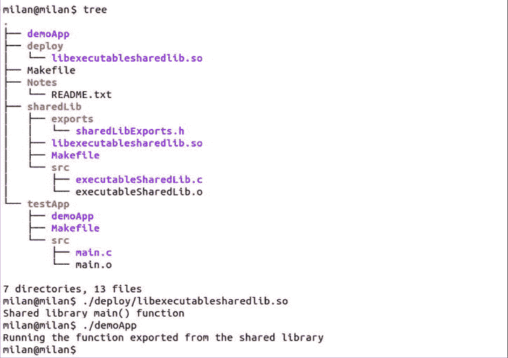
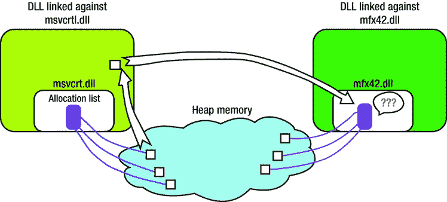

# 11.动态库:杂项主题

Abstract

在理解了动态库概念背后最深刻的思想之后，在深入了解软件专业人员日常处理库的工具箱的细节之前，现在是仔细研究几个遗留问题的好时机。首先，让我们仔细看看插件的概念，它是无缝扩展框架基本功能的无所不在的机制。然后，我将指出源于动态库概念的一些实际含义。最后，我将仔细看看开发人员在日常工作中可能遇到的一些杂七杂八的话题。

在理解了动态库概念背后最深刻的思想之后，在深入了解软件专业人员日常处理库的工具箱的细节之前，现在是仔细研究几个遗留问题的好时机。首先，让我们仔细看看插件的概念，它是无缝扩展框架基本功能的无所不在的机制。然后，我将指出源于动态库概念的一些实际含义。最后，我将仔细看看开发人员在日常工作中可能遇到的一些杂七杂八的话题。

## 插件概念

动态链接的进步可能带来的最重要的概念是插件的概念。这个概念本身没有什么难以理解的，因为我们在日常生活中会遇到很多这样的场景，其中大多数不需要任何技术背景。插入式概念的一个很好的例子是钻头和各种钻头，它们可以根据特定情况的需要和最终用户的决定而改变(图 [11-1](#Fig1) )。

图 11-1。

Drill and bits, an everyday example of the plug-in concept

插件的软件概念遵循同样的原则。基本上，有一个主要应用程序(或执行环境)对某个处理主题执行某个动作(例如，修改图片属性的照片处理应用程序)，还有一组模块专门对处理主题执行非常具体的动作(例如，模糊滤镜、锐化滤镜、棕褐色滤镜、颜色对比度滤镜、高通滤镜、平均滤镜等)。)，这是一个非常容易理解的概念。

但这还不是全部。

并不是所有包含旗舰应用程序和相关模块的系统都应该被称为“插件架构”为了让架构支持插件模型，还需要满足以下要求:

*   添加或删除插件不应要求重新编译应用程序；相反，应用程序应该能够在运行时确定插件的可用性。
*   模块应该通过某种运行时可加载机制来导出它们的功能。
*   无论最终用户在运行时可以使用哪些插件，系统都应该是正常运行的。

实际上，上述要求通常通过以下设计决策来支持:

*   插件被实现为动态库。不管内部功能如何，所有插件动态库都导出标准化接口(一组允许应用程序控制插件执行的函数)。
*   应用程序通过动态库加载过程加载插件。通常支持以下两个选项:
    *   应用程序查看预定义的文件夹，并尝试加载它在运行时找到的所有动态库。在加载时，它试图找到与插件期望导出的接口相对应的符号。如果没有找到这些符号(或者只找到了其中的一部分)，插件库就会被卸载。
    *   用户通过运行时的专用 GUI 选项指定插件位置，并告诉应用程序加载插件并开始提供其功能。

### 出口规则

并不存在针对每一个插件架构的严格规则。然而，确实存在一套常识性的指导原则。根据解释 C++ 语言对链接器问题的影响的段落，大多数插件体系结构倾向于遵循最简单的可能方案，其中插件导出指向由 C 链接函数组成的接口的指针。

尽管插件的内部功能可以实现为 C++ 类，但这样的类通常实现由其动态库容器导出的接口，并且将指向类实例的指针(转换为指向接口的指针)传递给应用程序是惯例。

### 流行的插件架构

支持插件架构的流行程序种类繁多，例如(但不限于):

*   图像处理应用程序(Adobe Photoshop 等。)
*   视频处理应用(索尼维加斯等。)
*   声音处理(斯坦伯格 VST 插件架构，在所有主流音频编辑器中得到普遍支持)
*   多媒体框架(GStreamer，avisynth)和流行的应用程序(Winamp，mplayer)
*   文本编辑器(其中大多数都有提供特定功能的插件)
*   软件开发集成开发环境(ide)通过插件支持多种功能
*   版本控制系统的前端 GUI 应用程序
*   Web 浏览器(NPAPI 插件架构)
*   等等。

对于这些插件体系结构中的每一个，通常都有一个公开的插件接口文档，详细规定了应用程序和插件之间的交互。

## 提示和技巧

要完全理解动态库的概念，最后一步需要您后退一步，将您到目前为止所学的一切整理成另一组简单的事实。在日常设计实践中，以不同的方式表述事物有时可能意味着很大的不同。

### 使用动态库的实际意义

在检查了关于动态库的所有细节之后，关于它们最有力的事实是，针对动态库的链接是一种基于承诺的链接。事实上，在构建阶段，客户端可执行程序所担心的只是动态库符号。只有在运行时加载阶段，动态库部分的内容(代码、数据等)才会被加载。)来玩。从所描述的一系列情况中，有几个现实生活中的含义。

#### 条块分割，更快发展

动态库的概念给了程序员很大的自由。只要对客户机可执行文件重要的符号集不变，程序员就可以自由地修改实际的动态库代码，只要需要就可以。

这个简单的事实对编程的日常程序有巨大的影响，因为它会大大减少不必要的编译时间。通过使用动态库，程序员可以减少对动态库本身重新构建代码的需要，而不必在代码发生微小变化时重新编译整个代码。难怪程序员经常决定将正在开发的代码放在动态库中，至少直到开发完成。

#### 运行时快速替换能力

在构建时，客户机二进制文件不需要完全成熟的动态库，所有的功能都已经就绪。相反，客户端二进制文件在构建时真正需要的是动态库的符号集——仅此而已。

这真的很有趣。请深吸一口气，让我们看看这个说法到底是什么意思。

您在构建时使用的动态库二进制文件和在运行时加载的动态库文件可能在每个方面都有很大的不同，只有一点除外:符号必须匹配。

换句话说(是的，这是真的，也正是它的本意)，为了静态感知的构建目的，你可以使用动态库，它的代码(flash 和 blood)还没有实现，但是它的符号(骨架)已经处于它们的最终形状。

或者，您可以使用一个您知道其代码会改变的库，只要您确信导出的符号集不会改变。

或者，您可以在构建时使用适合一种特定风格(如语言包)的动态库，但在运行时与另一个动态库链接—只要两个动态库二进制文件导出相同的符号集。

这真的非常非常有趣。我们如何从这一重要发现中受益的一个极端例子发生在 Android 原生编程领域。在开发一个模块(动态库或原生应用程序)的过程中，整个开发团队不必要且不明智地采取耗时的方式将他们的源代码添加到巨大的 Android 源代码树中，这种情况并不少见。

或者，更有效的方法是开发一个模块作为独立的 Android 项目，与 Android 源代码树无关。在几分钟内，完成构建阶段所需的 Android 本地动态库可以从任何工作的 Android 设备/手机中复制(在 Android 行话中称为“adb pulled ”),并添加到项目构建结构中。以前需要几个小时，现在构建过程最多只需要几分钟。

即使从最近的可用 Android 手机中提取的动态库的代码(T0 部分)可能与在 Android 源代码树中找到的代码明显不同，但符号列表在两个动态库中很可能是相同的。显然，从 Android 设备上拉取的快速替换库可能满足构建需求，而在运行时，将加载动态库二进制文件中“正确的那个”。

### 杂项提示

在本章的剩余部分，我将讲述以下有趣的知识:

*   将动态库转换为可执行文件
*   Windows 库的冲突运行时内存处理方案
*   链接器弱符号

#### 将动态库转换为可执行文件

正如在前面关于动态库的介绍性讨论中所指出的，动态库和可执行文件之间的区别在于，后者有启动例程，允许内核实际开始执行。在所有其他方面，特别是如果与静态库相比，似乎动态库和可执行文件具有相同的性质，例如二进制文件，其中所有的引用都已被解析。

鉴于如此多的相似之处和如此少的差异，有可能将动态库转换为可执行文件吗？

这个问题的答案是肯定的。这在 Linux 上肯定是可能的(我还在寻找在 Windows 上证实这一说法)。事实上，实现 C 运行时库(`libc.so`)的库实际上是真正可执行的。当通过在 shell 窗口中键入文件名来调用时，您会得到如图 [11-2](#Fig2) 所示的响应。

图 11-2。

Running libc.so as executable file

接下来自然出现的问题是如何实现这个库以使其可执行？

以下食谱使之成为可能:

*   实现动态库中的主函数——这个函数的原型是

`int main(int argc, char* argv[];`

*   声明标准的`main()`函数作为库入口点。传递`-e`链接器标志是完成这项任务的方法。

`gcc -shared` `-Wl,-e,main -o<libname>`

*   将`main()`功能变为不返回功能。这可以通过在`main()`函数的最后一行插入`_exit(0)`调用来实现。
*   将解释器指定为动态链接器。下面一行代码可以做到这一点:

`#ifdef __LP64__`

`const char service_interp[] __attribute__((section(".interp"))) =`

`"/lib/x86_64-linux-gnu/ld-linux-x86-64.so.2";`

`#else`

`const char service_interp[] __attribute__((section(".interp"))) =`

`"/lib/ld-linux.so.2";`

`#endif`

*   构建了没有优化的库(带有`-O0`编译器标志)。

我们制作了一个简单的演示项目来说明这一思想。为了证明动态库的真正双重性(即，即使它现在可以作为可执行文件运行，它仍然能够作为常规动态库运行)，演示项目不仅包含演示动态库，还包含动态加载它并调用其`printMessage()`函数的可执行文件。清单 11-1 说明了可执行共享库项目的细节:

清单 11-1。

文件:executableSharedLib.c

`#include "sharedLibExports.h"`

`#include <unistd.h> // needed for the _exit() function`

`// Must define the interpretor to be the dynamic linker`

`#ifdef __LP64__`

`const char service_interp[] __attribute__((section(".interp"))) =`

`"/lib/x86_64-linux-gnu/ld-linux-x86-64.so.2";`

`#else`

`const char service_interp[] __attribute__((section(".interp"))) =`

`"/lib/ld-linux.so.2";`

`#endif`

`void printMessage(void)`

`{`

`printf("Running the function exported from the shared library\n");`

`}`

`int main(int argc, char* argv[])`

`{`

`printf("Shared library %s() function\n", __FUNCTION__);`

`// must make the entry point function to be a 'no-return' function type`

`_exit(0);`

`}`

文件:build.sh

`g++ -Wall -O0 -fPIC -I./exports/ -c src/executableSharedLib.c -o src/executableSharedLib.o`

`g++ -shared``-Wl,-e,main`T2】

清单 11-2 展示了演示应用程序的细节，其目的是证明我们的共享库在变得可执行的同时并没有失去它原来的功能:

清单 11-2。

文件:main.c

`#include <stdio.h>`

`#include "sharedLibExports.h"`

`int main(int argc, char* argv[])`

`{`

`printMessage();`

`return 0;`

`}`

文件:build.sh

`g++ -Wall -O2 -I../sharedLib/exports/ -c src/main.c -o src/main.o`

`g++  ./src/main.o -lpthread -lm -ldl -L../deploy -lexecutablesharedlib -Wl,-Bdynamic -Wl,-R../deploy -o demoApp`

当您尝试使用它时，会出现图 [11-3](#Fig3) 所示的结果。

图 11-3。

Illustrating dual nature (dynamic lib, executable) of the demo library

项目源代码 tarball 提供了更多的细节。

#### Windows 库的运行时内存处理冲突

一般来说，一旦动态库被加载到进程中，它就成为进程的一个合法部分，并且几乎继承了进程的所有特权，包括对堆(运行动态内存分配的内存池)的访问。由于这些原因，动态库函数分配内存缓冲区，并将其传递给属于另一个动态库(或可执行代码)的函数是完全正常的，当不再需要内存时，可以在那里释放内存。

然而，整个故事有一个特殊的转折，需要仔细研究。

通常，不管有多少动态库被加载到进程中，它们都链接到 C runtime library 的同一个实例，该实例提供内存分配基础结构 malloc 和 free(或者对于 C++，new 和 delete ),以及跟踪分配的内存缓冲区的列表实现。如果这个基础设施对每个进程都是唯一的，那么我们就没有理由认为所描述的任何人都可以释放由其他人分配的内存的方案不可行。

然而，有趣的情况可能发生在 Windows 编程领域。Visual Studio 提供了(至少)两个基本 dll，所有可执行文件(应用程序/动态库)都是在这两个 dll 的基础上构建的——常见的 C 运行时库(`msvcrt.dll`)以及微软基础类(MFC)库(`mfx42.dll`)。有时，项目需求可能会要求混合和匹配构建在不同基 dll 上的 dll，这可能会立即导致与预期规则非常不愉快的偏差。

为了清楚起见，我们假设在同一个项目中，您在运行时加载了以下两个 DLL:DLL“A”，构建在`msvcrt.dll`上，以及 DLL“B”，构建在`MFC DLL`上。现在让我们假设 DLL“A”分配内存缓冲区并将其传递给 DLL“B”，DLL“B”使用它们，然后释放它们。在这种情况下，试图释放内存将导致崩溃(异常如图 [11-4](#Fig4) 所示)。

图 11-4。

Error message dialog typical for between-DLLs-conflict memory issues

问题的原因是围绕堆内存的可用池有两个簿记机构；C 运行时 DLL 和 MFC DLL 都维护它们自己的、单独的已分配缓冲区列表(参见图 [11-5](#Fig5) )。

图 11-5。

The mechanism of runtime problems caused by unrelated memory allocation bookkeepings maintained by different DLLs

通常，当发送缓冲区进行解除分配时，内存分配基础结构会搜索已分配内存地址的列表，如果在列表中找到了为解除分配而传递的缓冲区，则可以成功完成解除分配。但是，如果分配的缓冲区保存在一个列表中(例如，由 C 运行库 DLL 保存)并被传递给另一个列表(例如，由 MFC DLL 保存)，则在列表中找不到缓冲区的内存地址，并且解除分配调用将引发异常。即使您以静默方式处理异常，应用程序是否能够将缓冲区发送到正确的 DLL 进行释放也是有疑问的，从而导致内存泄漏。

更糟糕的是，几乎没有一个通常的内存受限的检查工具能够检测和报告任何错误。在为工具辩护时，您可以注意到，在这种特殊情况下，实际上没有发生任何典型的内存违规(比如写超过缓冲区边界、覆盖缓冲区地址等)。所有这些都使得问题难以处理，除非您事先对潜在的问题有所了解，否则很难确定原因，更不用说问题的解决方案了。

这个问题的解决方案非常简单:在一个 DLL 中分配的内存缓冲区最终应该传递回同一个 DLL 进行释放。唯一的问题是，为了应用这个简单的解决方案，您需要访问两个 dll 的源代码，这可能并不总是可行的。

#### 链接器弱符号解释

链接器弱符号的思想本质上类似于面向对象语言的首要特征(这是多态原理的表现之一)。当应用于链接领域时，弱符号的概念实际上意味着以下内容:

*   编译器(最明显的是，`gcc`)支持语言构造，允许你声明一个符号(一个函数和/或一个全局或函数静态变量)为弱。

下面的示例演示如何将 C 函数声明为弱符号:

`int``__attribute__((weak))`T2】

*   链接器获取这些信息，以一种非常独特的方式处理这样的符号。
    *   如果在链接过程中出现了另一个同名符号，并且没有声明为弱符号，则该符号将替换弱符号。
    *   如果在链接过程中出现了另一个同名的符号，并且被声明为弱符号，链接器可以自由决定实际实现这两个符号中的哪一个。
    *   两个同名的非弱(即强)符号的出现被认为是错误的(该符号已经定义)。
    *   如果在链接过程中没有出现其他同名的符号，链接器可能不会实现这样的符号。如果符号是一个函数指针，保护代码是必须的(事实上，强烈建议总是这样做)。

在 Winfred C.H. Lu 在 [`http://winfred-lu.blogspot.com/2009/11/understand-weak-symbols-by-examples.html`](http://winfred-lu.blogspot.com/2009/11/understand-weak-symbols-by-examples.html) 发表的博客文章中可以找到弱符号概念的一个很好的说明。安迪·穆雷在 [`www.embedded-bits.co.uk/2008/gcc-weak-symbols/`](http://www.embedded-bits.co.uk/2008/gcc-weak-symbols/) 的博客中描述了这些功能何时会派上用场的真实场景。