# 12.Linux 工具箱

Abstract

本章的目的是向读者介绍一套用于分析 Linux 二进制文件内容的工具(实用程序和其他方法)。

本章的目的是向读者介绍一套用于分析 Linux 二进制文件内容的工具(实用程序和其他方法)。

## 快速洞察工具

使用`file`和/或`size`实用程序可以最简单、最直接地了解二进制文件的本质。

### 文件实用程序

简单地命名为`file` ( [`http://linux.die.net/man/1/file`](http://linux.die.net/man/1/file) )的命令行实用程序用于查找任何文件类型的详细信息。它可以很快派上用场，因为它确定了关于二进制文件的最基本的信息(图 [12-1](#Fig1) )。

图 12-1。

Using the file utility

### 尺寸实用程序

名为`size` ( [`http://linux.die.net/man/1/size`](http://linux.die.net/man/1/size) )的命令行实用程序可用于即时了解 ELF 部分的字节长度(图 [12-2](#Fig2) )。

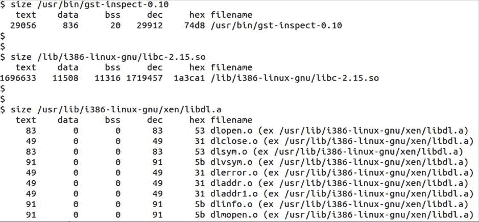

图 12-2。

Using the size utility

## 详细的分析工具

通过依赖于统称为`binutils` ( `www.gnu.org/software/binutils/`)的实用程序集合，可以获得对二进制文件属性的详细了解。我将举例说明`ldd`、`nm`、`objdump`和`readelf`实用程序的使用。尽管它在形式上不属于 binutils，但名为 ldd 的 shell 脚本(由 Roland McGrath 和 Ulrich Drepper 编写)非常适合放在工具箱的同一个隔间中，因此也将说明它的用法。

### 掺杂漏极

命令`ldd` ( [`http://linux.die.net/man/1/ldd`](http://linux.die.net/man/1/ldd) )是一个非常有用的工具，因为它显示了动态库的完整列表，客户端二进制程序将尝试静态感知这些动态库的负载(即，负载时间依赖性)。

当分析加载时依赖关系时，`ldd`首先检查二进制文件，试图定位 ELF 格式字段，其中最直接的依赖关系列表已经被链接器打上印记(如构建过程中链接器命令行所建议的)。

对于每个名字嵌入在客户端二进制文件中的动态库，`ldd`试图根据运行时库位置搜索规则定位它们实际的二进制文件(详见第 7 章中的[)。一旦定位了最直接的依赖关系的二进制文件，`ldd`运行递归过程的下一级，试图找到它们的依赖关系。对每一个“第二代”依赖者，`ldd`进行另一轮调查，等等。](07.html)

一旦所述的递归搜索完成，`ldd`收集报告的依赖项列表，删除重复项，并打印出结果(如图 [12-3](#Fig3) )。

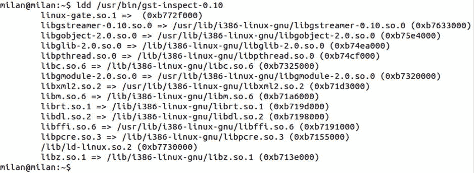

图 12-3。

Using the ldd utility

在使用`ldd`之前，了解它的局限性很重要:

*   `ldd`无法通过调用`dlopen()`函数来识别运行时动态加载的库。为了获得这类信息，必须采用不同的方法。更多详情请访问[第十三章](13.html)。
*   根据其手册页，运行某些`ldd`版本实际上可能代表一种安全威胁。

#### 更安全的 ldd 替代品

如手册页中所述:

但是，请注意，在某些情况下，某些版本的 ldd 可能试图通过直接执行程序来获取依赖信息。因此，您不应该在不可信的可执行文件上使用 ldd，因为这可能导致任意代码的执行。在处理不受信任的可执行文件时，一个更安全的替代方法如下(也如图 [12-4](#Fig4) 所示):

`$ objdump -p /path/to/program | grep NEEDED`

图 12-4。

Using objdump to (only partially) substitute the ldd utility

使用`readelf`实用程序可以获得相同的结果(图 [12-5](#Fig5) ):

`$ readelf -d /path/to/program | grep NEEDED`

图 12-5。

Using readelf to (only partially) substitute the ldd utility

显然，在依赖关系的分析中，这两种工具都不会比仅仅从二进制文件中读出最直接的依赖关系列表更深入。从安全的角度来看，这绝对是一种更安全的寻找答案的方法。

然而，所提供的列表远没有`ldd`通常所提供的那样详尽。为了匹配它，您可能需要自己进行递归搜索。

### 纳米

`nm`实用程序( [`http://linux.die.net/man/1/nm`](http://linux.die.net/man/1/nm) )用于列出一个二进制文件的符号(图 [12-6](#Fig6) )。打印出符号的输出行还指示了符号类型。如果二进制文件包含 C++ 代码，则默认情况下会以损坏的形式打印符号。以下是一些最常用的输入参数组合:

图 12-7。

Using the nm utility to list mangled symbols

*   `$ nm -D --no-demangle <path-to-binary>`打印共享库的动态符号，并严格要求符号不混乱(图 [12-7](#Fig7) )。

图 12-6。

Using the nm utility to list unmangled symbols

*   `$ nm <path-to-binary>`列出一个二进制文件的所有符号。在共享库的情况下，它不仅意味着导出(的`.dynamic`部分),还意味着所有其他符号。如果库已经被剥离(通过使用`strip`命令)，没有参数的`nm`将报告没有找到符号。
*   `$ nm -D <path-to-binary>`仅列出动态部分中的符号(即共享库的导出/可见符号)。
*   `$ nm -C <path-to-binary`以分解的格式列出符号(图 [12-6](#Fig6) )。

该选项对于检测设计共享库时最常见的错误非常有用——当设计者忘记了 ABI 函数声明/定义中的`extern`“C”说明符时(这恰好是客户端二进制文件期望找到的)。

*   当您想要列出库的未定义符号时,`$ nm -u <path-to-binary>`是有用的(即，库本身不包含的符号，但指望在运行时提供，可能由一些其他加载的动态库提供)。

*   `$ nm -A <library-folder-path>/* | grep symbol-name` is useful when you search for a symbol in multitude of binaries located in the same folder, as `-A` option prints the name of each library in which a symbols is found (Figure [12-8](#Fig8)) .

    

    图 12-8。

    Using nm to recursively search for the presence of a symbol in the set of libraries .

位于 [`www.thegeekstuff.com/2012/03/linux-nm-command/`](http://www.thegeekstuff.com/2012/03/linux-nm-command/) 的网页文章列出了 10 个最有用的`nm`命令。

### objdump(对象转储)

`objdump` ( [`http://linux.die.net/man/1/objdump`](http://linux.die.net/man/1/objdump) )实用程序可能是最通用的二元分析工具。按时间顺序，它比`readelf`更古老，这在很多情况下与其能力相当。`objdump`的优势在于除了 ELF，还支持大约 50 种其他二进制格式。而且，它的拆卸能力比`readelf`更好。

以下章节涵盖了最常使用`objdump`的任务。

#### 解析 ELF 标头

`objdump` `-f`命令行选项用于深入了解目标文件的文件头。标题提供了大量有用的信息。特别是，可以快速获得二进制类型(目标文件/静态库对动态库对可执行文件)以及关于入口点的信息(T2 段的开始)(图 [12-9](#Fig9) )。

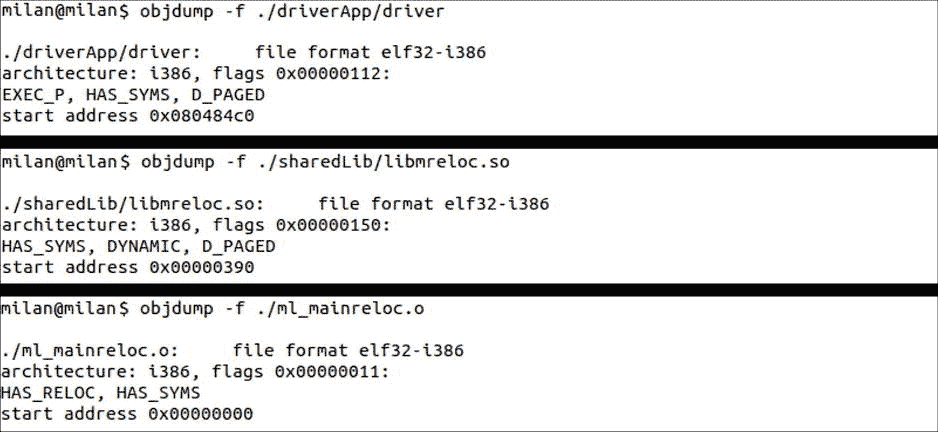

图 12-9。

Using objdump to parse the ELF header of various binary file types

当检查静态库时，`objdump -f`打印出在库中找到的每个目标文件的文件头。

#### 列出和检查部分

`objdump -h`选项用于列出可用的截面(图 [12-10](#Fig10) )。

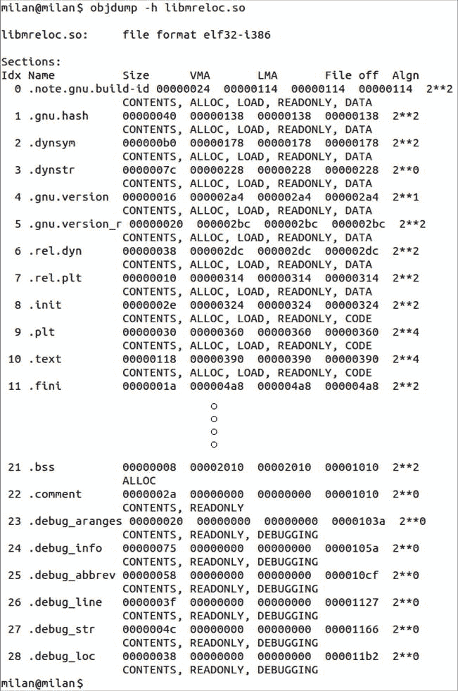

图 12-10。

Using objdump to list the binary file sections

当涉及到部分检查时，`objdump`为程序员最感兴趣的部分提供了专用的命令开关。在接下来的几节中，我将介绍一些著名的例子。

#### 列出所有符号

运行`objdump -t <path-to-binary>`提供完全等同于运行`nm <path-to-binary>`的输出(图 [12-11](#Fig11) )。

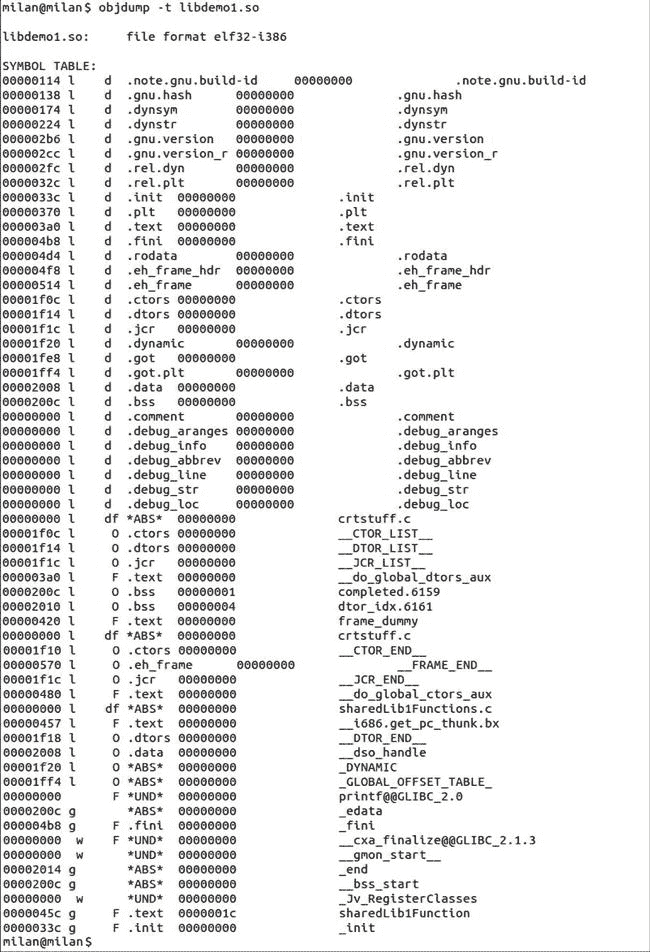

图 12-11。

Using objdump to list all symbols

#### 仅列出动态符号

运行`objdump -T <path-to-binary>`提供完全等同于运行`nm -D <path-to-binary>`的输出(图 [12-12](#Fig12) )。

图 12-12。

Using objdump to list only dynamic symbols

#### 检查动态部分

运行`objdump -p <path-to-binary>`检查动态部分(用于查找`DT_RPATH`和/或`DT_RUNPATH`设置)。请注意，在这种情况下，您关心显示输出的最后部分(图 [12-13](#Fig13) )。

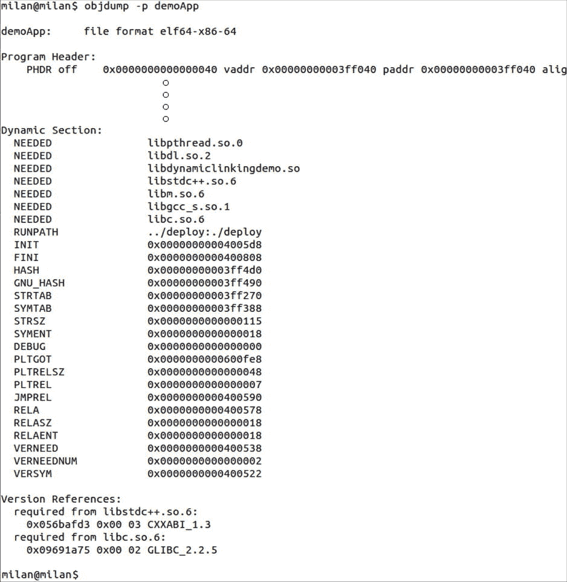

图 12-13。

Using objdump to examine the library dynamic section

#### 检查重新安置部分

运行`objdump -R <path-to-binary>`检查搬迁段(图 [12-14](#Fig14) )。

图 12-14。

Using objdump to list the relocation section

#### 检查数据部分

运行`objdump -s -j <section name> <path-to-binary>`提供截面所携带值的十六进制转储。在图 [12-15](#Fig15) 中为`.got`段。

图 12-15。

Using objdump to examine the data section

#### 列出和检查细分市场

运行`objdump -p <path-to-binary>`显示关于 ELF 二进制段的信息。请注意，只有显示输出的第一部分与该特定任务相关(图 [12-16](#Fig16) )。

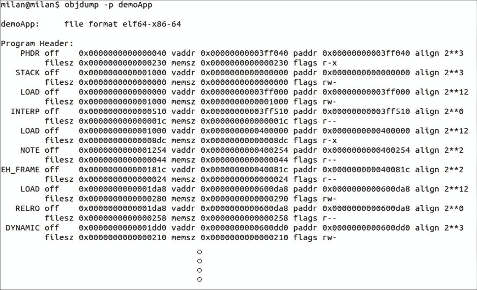

图 12-16。

Using objdump to list segments

#### 反汇编代码

下面是一些如何使用`objdump`反汇编代码的例子:

*   Disassembling and Intel style and interspersing the original source code (Figure [12-18](#Fig18)) .

    

    图 12-18。

    Using objdump to disassemble the binary file (Intel syntax) .

*   Disassembling and specifying assembler notation flavor (Intel style in this case), as shown in Figure [12-17](#Fig17) .

    

    图 12-17。

    Using objdump to disassemble the binary file .

仅当二进制文件是为调试而构建时，该选项才有效(即，使用`-g`选项)。

*   分解特定部分。

除了携带代码的`.text`部分，二进制文件可能包含其他部分(。`plt`为例)，其中也包含代码。默认情况下，`objdump`反汇编所有带有代码的部分。然而，在某些情况下，您可能对检查某个给定部分严格执行的代码感兴趣(图 [12-19](#Fig19) )。

图 12-19。

Using objdump to disassemble a specific section

#### objdump nm 当量

`objdump`可用于提供`nm`命令的完全等效:

*   `$ nm <path-to-binary>`

等同于

`$ objdump -t <path-to-binary>`

*   `$ nm -D <path-to-binary>`

等同于

`$ objdump -T <path-to-binary>`

*   `$ nm -C <path-to-binary>`

等同于

`$ objdump -C <path-to-binary>`

### readelf(读取 11)

`readelf` ( [`http://linux.die.net/man/1/readelf`](http://linux.die.net/man/1/readelf) )命令行实用程序提供了与`objdump`实用程序几乎完全相同的功能。readelf 和 objdump 之间最显著的区别是

*   `readelf`仅支持 ELF 二进制格式。另一方面，`objdump`可以分析大约 50 种不同的二进制格式，包括 Windows PE/COFF 格式。
*   `readelf`不依赖于所有 GNU 目标文件解析工具所依赖的二进制文件描述符库( [`http://en.wikipedia.org/wiki/Binary_File_Descriptor_library`](http://en.wikipedia.org/wiki/Binary_File_Descriptor_library) )，从而提供了对 ELF 格式内容的独立洞察

接下来的两节提供了使用`objdump`的最常见任务的概述。

#### 解析 ELF 标头

`readelf -h`命令行选项用于深入了解目标文件的文件头。标题提供了大量有用的信息。特别是，可以快速获得二进制类型(目标文件/静态库对动态库对可执行文件)以及关于入口点的信息(T1 段的开始)(图 [12-20](#Fig20) )。

 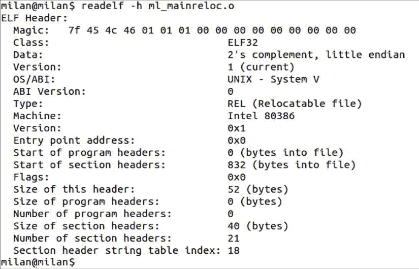

图 12-20。

Examples of using readelf to examine the ELF header of executable, shared library, and object file/static library

当检查静态库时，`readelf -h`打印出在库中找到的每个目标文件的文件头。

#### 列出和检查部分

`readelf -S`选项用于列出可用的截面(图 [12-21](#Fig21) )。

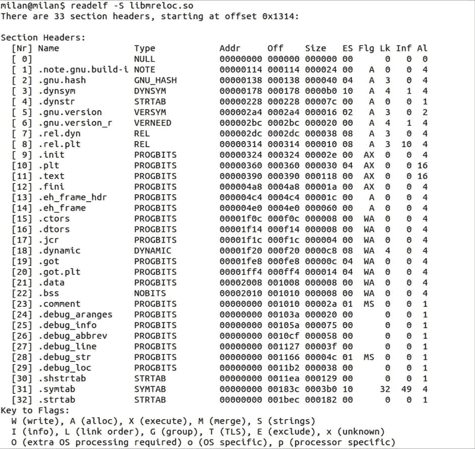

图 12-21。

Using readelf to list sections

当涉及到部分检查时，`readelf`为程序员最感兴趣的部分提供了专用的命令开关，例如`.symtab`、`.dynsym`和`.dynamic`部分。

#### 列出所有符号

运行`readelf --symbols`提供完全等同于运行`nm <path-to-binary>`的输出(图 [12-22](#Fig22) )。

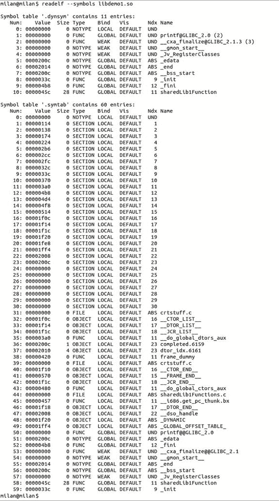

图 12-22。

Using readelf to list all symbols

#### 仅列出动态符号

运行`readelf --dyn-syms`提供完全等同于运行`nm -D <path-to-binary>`的输出(图 [12-23](#Fig23) )。

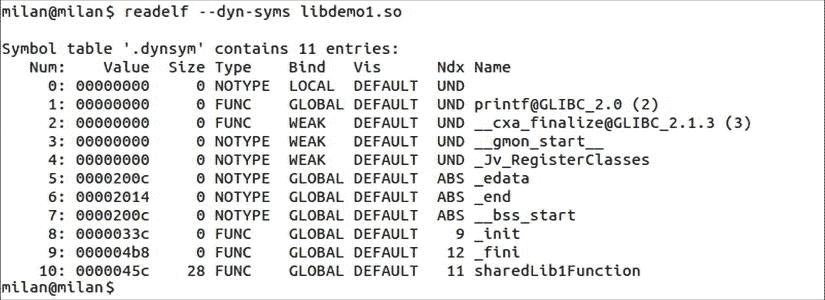

图 12-23。

Using readelf to list dynamic symbols

#### 检查动态部分

运行`readelf -d`检查动态部分(用于查找`DT_RPATH`和/或`DT_RUNPATH`设置)，如图 [12-24](#Fig24) 所示。

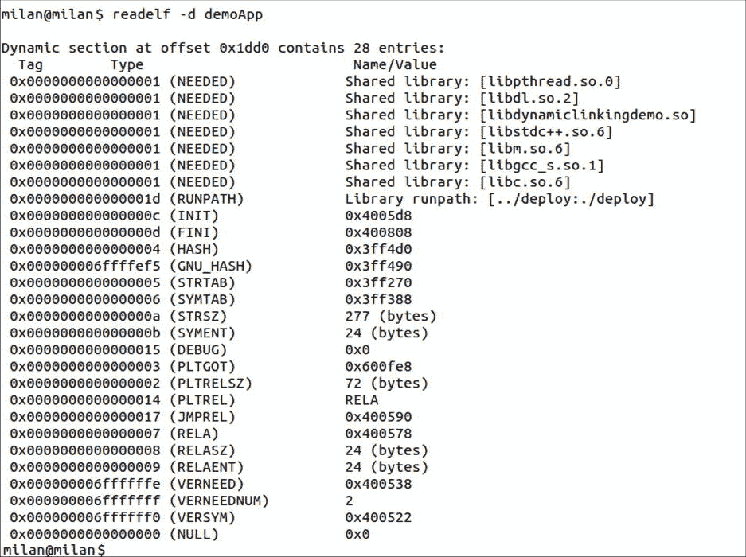

图 12-24。

Using readelf to display the dynamic section

#### 检查搬迁部分

运行`readelf -r`检查搬迁段，如图 [12-25](#Fig25) 所示。

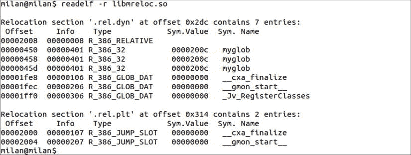

图 12-25。

Using readelf to list relocation (.rel.dyn) section

#### 检查数据部分

运行`readelf -x`提供截面所携带值的十六进制转储。在图 [12-26](#Fig26) 中为`.got`段。

图 12-26。

Using readelf to provide a hex dump of a section (the .got section in this example)

#### 列出和检查细分市场

运行`readelf --segments`显示关于 ELF 二进制段的信息(图 [12-27](#Fig27) )。

图 12-27。

Using readelf to examine segments

#### 检测调试版本

`readelf`命令很好地支持显示二进制文件中包含的各种调试特定信息(图 [12-28](#Fig28) )。

图 12-28。

Readelf provides the option to examine binary file debug information

为了快速确定二进制文件是否是为调试而构建的，在调试构建的情况下，使用任何可用选项运行`readelf --debug-dump`的输出将由打印在`stdout`上的许多行组成。相反，如果二进制文件不是为调试而构建的，输出将是一个空行。在二进制文件包含调试信息的情况下，限制输出喷涌的一个快速而实用的方法是将 readelf 输出通过管道传输到`wc`命令:

`$``readelf --debug-dump=line``<binary file path>`T3】

或者，可以使用下面的简单脚本以简单明了的文本形式显示`readelf`的调查结果。它要求将二进制文件的路径作为输入参数传递。

`file: isDebugVersion.sh`

`if``readelf --debug-dump=line`T2】

## 部署阶段工具

在成功构建二进制文件并开始考虑部署阶段的细节后，诸如`chrpath`、`patchelf`、`strip`和`ldconfig`等实用程序可能会派上用场。

### chrpath

`chrpath`命令行实用程序( [`http://linux.die.net/man/1/chrpath`](http://linux.die.net/man/1/chrpath) )用于修改 ELF 二进制文件的`rpath` ( `DT_RPATH`字段)。在“Linux 运行时库位置规则”一节的第 7 章中描述了`runpath`字段背后的基本概念。

以下细节说明了`chrpath`的使用(图 [12-29](#Fig29) )以及一些限制(图 [12-30](#Fig30) ):

*   它可用于在其原始字符串长度内修改`DT_RPATH`。
*   它可以用来删除现有的`DT_RPATH`字段。

但是，一定要谨慎！

图 12-30。

Limitations of the chrpath utility

 

图 12-29。

Using the chrpath utility to modify RPATH

*   如果`DT_RPATH`字符串最初为空，则不能用新的非空字符串替换。
*   可用于将`DT_RPATH`转换为`DT_RUNPATH`。
*   它不能用更长的字符串替换现有的`DT_RPATH`字符串。

### 补丁精灵

有用的`patchelf` ( [`http://nixos.org/patchelf.html`](http://nixos.org/patchelf.html) )命令行实用程序目前不是标准存储库的一部分，但是可以从源代码 tarball 构建它。简单、基本的文档也是可用的。

该实用程序可用于设置和修改 ELF 二进制文件的`runpath` ( `DT_RUNPATH`字段)。在[第 7 章](07.html)的“Linux 运行时库位置规则”一节中描述了`runpath`字段背后的基本概念。

设置`runpath`最简单的方法是发出如下命令:

`$``patchelf --set-rpath`T2】

`^`

`|`

`multiple paths can be defined,`

`separated by a colon (:)`

`patchelf`修改`DT_RUNPATH`字段的能力远远超过了`chrpath`修改`DT_RPATH`字段的能力，因为它可以以任何想象得到的方式修改`DT_RUNPATH`的字符串值(替换为更短或更长的字符串、插入多条路径、擦除等)。).

### 剥夺

`strip`命令行实用程序( [`http://linux.die.net/man/1/strip`](http://linux.die.net/man/1/strip) )可用于删除动态加载过程中不需要的所有库符号。在[第 7 章](07.html)的“导出 Linux 动态库符号”一节中演示了条带效果。

### ldconfig

在[第 7 章](07.html)(专门讨论 Linux 运行时库位置规则)中，我指出了指定加载程序在运行时应该寻找库的路径的方法之一(尽管不是最高优先级)是通过使用`ldconfig`缓存。

`ldconfig`命令行实用程序( [`http://linux.die.net/man/8/ldconfig`](http://linux.die.net/man/8/ldconfig) )通常作为软件包安装过程的最后一步执行。当包含共享库的路径作为输入参数传递给`ldconfig`时，它搜索共享库的路径，并更新它用于簿记的文件集:

*   包含标准扫描的文件夹列表的文件`/etc/ld.so.conf`
*   文件`/etc/ld.so.cache`文件，包含在扫描作为输入参数传递的各种路径时发现的所有库的 ASCII 文本列表

## 运行时分析工具

通过使用诸如`strace`、`addr2line`，尤其是 GNU 调试器(`gdb`)这样的工具，运行时问题的分析可能会受益。

### 失去了

`strace` ( [`http://linux.die.net/man/1/strace`](http://linux.die.net/man/1/strace) )命令行实用程序跟踪进程发出的系统调用以及进程收到的信号。它有助于找出运行时依赖关系(即，不仅仅是`ldd`命令适用的加载时依赖关系)。图 [12-31](#Fig31) 显示了典型的 strace 输出。

图 12-31。

Using the strace utility

### addr2line

可以使用`addr2line` ( [`http://linux.die.net/man/1/addr2line`](http://linux.die.net/man/1/addr2line) )命令行实用程序将运行时地址转换成源文件的信息和地址对应的行号。

如果(且仅当)二进制文件是为调试而构建的(通过传递`-g -O0`编译器标志)，当分析崩溃信息时，使用该命令可能非常有用，其中崩溃发生的程序计数器地址打印在终端屏幕上，如下所示:

`#00 pc 0000d8cc6 /usr/mylibs/libxyz.so`

在这样的控制台输出上运行`addr2line`

`$ addr2line``-C -f -e`T2】

将产生如下所示的输出:

`/projects/mylib/src/mylib.c: 45`

### gdb (GNU 调试器)

传说中的 GNU 调试器工具 gdb 可以用来执行运行时代码反汇编。在运行时反汇编代码的好处是所有的地址都已经被加载器解析过了，而且大部分地址都是最终的。

以下`gdb`命令在运行时代码反汇编期间会很有用:

*   设置反汇编风味
*   拆卸

调用反汇编命令时，以下两个标志可能会派上用场:

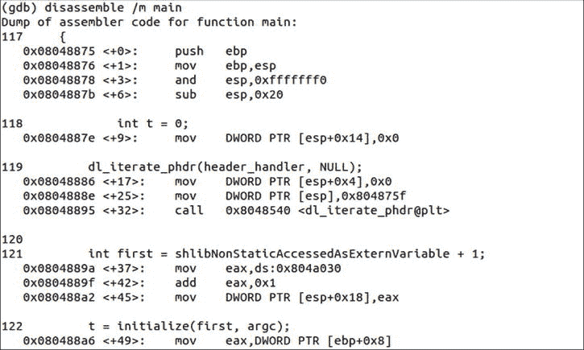

图 12-33。

Interspersed (assembly and source code) disassembly flavor

*   `/m`标志将汇编指令散布在 C/C++ 代码行中(如果有的话)，如图 [12-33](#Fig33) 所示。

*   The `/r` flag requires that the assembler instructions be additionally shown in hexadecimal notation (Figure [12-32](#Fig32)) .

    

    图 12-32。

    Using gdb to show the disassembled code combined with hex values of instructions .

要组合这两个标志，请将它们组合在一起键入(即`/rm`)，而不是分开键入(即`/r /m`)，如图 [12-34](#Fig34) 所示。

图 12-34。

Combining /r and /m disassembly flags

## 静态库工具

与静态库相关的绝大多数任务都可以由归档器`ar`实用程序来执行。通过使用`ar`，您不仅可以将目标文件合并到静态库中，还可以列出其内容，删除单个目标文件，或者用新版本替换它们。

### 阿肯色州

以下简单的例子说明了使用`ar`工具的通常阶段。演示项目由四个源文件(`first.c`、`second.c`、`third.c`和`fourth.c`)和一个可以被客户端二进制文件使用的导出头文件组成(如下面五个例子所示)。

first.c

`#include "mystaticlibexports.h"`

`int first_function(int x)`

`{`

`return (x+1);`

`}`

秒. c

`#include "mystaticlibexports.h"`

`int fourth_function(int x)`

`{`

`return (x+4);`

`}`

三. c

`#include "mystaticlibexports.h"`

`int second_function(int x)`

`{`

`return (x+2);`

`}`

第四. c

`#include "mystaticlibexports.h"`

`int third_function(int x)`

`{`

`return (x+3);`

`}`

mystaticlibexports . h .神秘主义者的出口

`#pragma once`

`int first_function(int x);`

`int second_function(int x);`

`int third_function(int x);`

`int fourth_function(int x);`

假设您已经通过编译每个源文件创建了目标文件:

`$ gcc -Wall -c first.c second.c third.c fourth.c`

下面的屏幕快照说明了处理静态库的各个阶段。

#### 创建静态库

运行`ar -rcs <library name> <list of object files>`将指定的目标文件合并到静态库中(图 [12-35](#Fig35) )。

图 12-35。

Using ar to combine object files to static library

#### 列出静态库对象文件

运行`ar -t <library name>`打印出静态库携带的目标文件列表(图 [12-36](#Fig36) )。

图 12-36。

Using ar to print out the list of static library’s object files

#### 从静态库中删除目标文件

假设您想要修改文件`first.c`(修复一个 bug，或者简单地添加额外的特性)，并且暂时不希望您的静态库携带`first.o object file`。从静态库中删除目标文件的方法是运行`ar -d <library name> <object file to remove>`(图 [12-37](#Fig37) )。

图 12-37。

Using ar to delete an object file from static library

#### 将新的目标文件添加到静态库中

假设您对文件`first.c`中所做的更改感到满意，并且已经重新编译了它。现在您想把新创建的目标文件`first.o`放回静态库中。运行`ar -r <library name> <object file to append>`基本上是将新的目标文件添加到静态库中(图 [12-38](#Fig38) )。

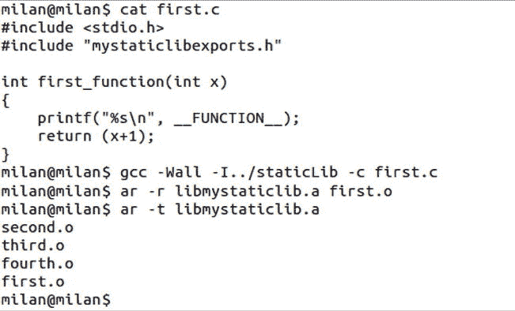

图 12-38。

Using ar to add new object file to static library

请注意，目标文件在静态库中的顺序已经改变。新文件已被有效地添加到档案中。

#### 恢复目标文件的顺序

如果您坚持让您的目标文件以代码更改前的原始顺序出现，您可以纠正它。运行`ar -m -b <object file before> <library name> <object file to move>`完成任务(图 [12-39](#Fig39) )。

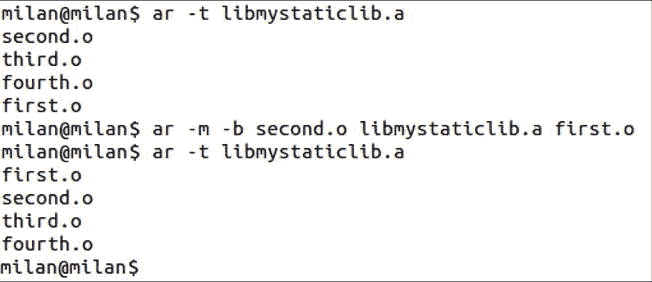

图 12-39。

Using ar to restore the order of object files within the static library