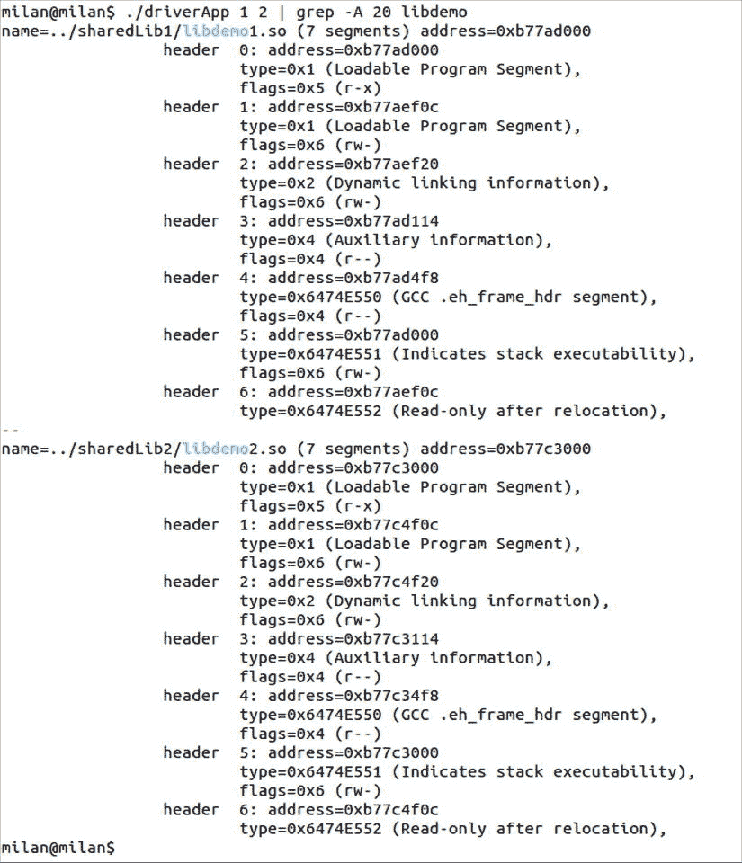

# 十三、Linux 操作指南

Abstract

前一章回顾了 Linux 中可用的有用的分析工具，所以现在是提供同一主题的另一种观点的好时机。这一次的重点不是实用程序本身，而是展示如何完成一些最常执行的任务。

前一章回顾了 Linux 中可用的有用的分析工具，所以现在是提供同一主题的另一种观点的好时机。这一次的重点不是实用程序本身，而是展示如何完成一些最常执行的任务。

通常有多种方法来完成分析任务。对于本章中描述的每项任务，将提供完成任务的替代方法。

## 调试链接

调试链接阶段最有力的帮助可能是使用`LD_DEBUG`环境变量(图 [13-1](#Fig1) )。它不仅适用于测试构建过程，也适用于测试运行时的动态库加载。

操作系统支持一组预先确定的值，在运行所需的操作(构建或执行)之前，可以将`LD_DEBUG`设置为这些值。列出它们的方法是键入

`$ LD_DEBUG=help cat`

图 13-1。

Using the LD_DEBUG environment variable to debug linking

与任何其他环境变量一样，有几种方法可以设置`LD_DEBUG`的值:

*   立即，在调用链接器的同一行
*   终端外壳寿命期内一次

`$ export LD_DEBUG=<chosen_option>`

这可以通过以下方式逆转

`$ unset LD_DEBUG`

*   从外壳轮廓内(例如`bashrc`)文件，为每个终端会话设置它。除非您的日常工作是测试链接过程，否则这个选项可能不是最佳选项。

## 确定二进制文件类型

有几种简单的方法可以确定二进制类型:

*   `file`实用程序(在它能处理的各种各样的文件类型中)提供了可能是最简单、最快和最优雅的方法来确定二进制文件的性质。
*   ELF 文件头分析提供了关于二进制文件类型的信息。运转

`$ readelf -h <path-of-binary> | grep Type`

将显示以下选项之一:

*   `EXEC`(可执行文件)
*   `DYN`(共享对象文件)
*   `REL`(可重定位文件)

在静态库的情况下，`REL`输出将为库携带的每个目标文件出现一次。

*   EFL 标题分析可提供类似的分析，但报告不太详细。该命令的输出

`$ objdump -f <path-of-binary>`

将有一条包含下列值之一的线:

*   `EXEC_P`(可执行文件)
*   `DYNAMIC`(共享对象文件)
*   在目标文件的情况下，没有指明类型

在静态库的情况下，一个目标文件将为库携带的每个目标文件出现一次。

## 确定二进制文件入口点

确定二进制文件入口点是一项复杂的任务，从非常简单(对于可执行文件)到稍微复杂一些(在运行时确定动态库的入口点)，这两者都将在本节中进行说明。

### 确定可执行文件入口点

可执行文件的入口点(即程序存储器映射中第一条指令的地址)可以通过以下任一方法确定

*   ELF 文件头分析，它提供了二进制文件类型的详细信息。运转

`$ readelf -h <path-of-binary> | grep Entry`

将显示如下所示的一行:

`Entry point address:               0x<address>`

*   `objdump` EFL 标题分析，可提供类似分析，但不太详细的报告。该命令的输出

`$ objdump -f <path-of-binary> | grep start`

看起来会像这样:

`start address 0x<address>`

### 确定动态库入口点

当寻找动态库的入口点时，调查并不简单。即使可以使用前面描述的方法之一，所提供的信息(通常是低值的十六进制数，如 0x390)也不是特别有用。假设动态库被映射到客户端二进制进程存储器映射中，则库的真正入口点可能仅在运行时被确定。

最简单的方法可能是在 gnu 调试器中运行加载动态库的可执行文件。如果设置了`LD_DEBUG`环境变量，将会打印出关于加载的库的信息。您需要做的就是在`main()`函数上设置断点。无论可执行文件是否是为调试而生成的，此符号都很可能存在。

在动态库以静态方式链接的情况下，当程序执行到达断点时，加载过程已经完成。

在运行时动态加载的情况下，最简单的方法可能是将大量的屏幕打印输出重定向到文件，以便以后进行可视化检查。

图 [13-2](#Fig2) 展示了依赖于`LD_DEBUG`变量的方法。

图 13-2。

Determining the dynamic library entry point at runtimeList Symbols

## 列出符号

尝试列出可执行文件和库的符号时，可以遵循以下方法:

*   `nm`效用
*   `readelf`效用

特别是，

*   运行以下命令可以获得所有可见符号的列表

`$ readelf --symbols <path-to-binary>`

*   可以通过运行以下命令来获得一个列表，其中只列出了出于动态链接目的而导出的符号

`$ readelf --dyn-syms <path-to-binary>`

*   `objdump`效用

特别是，

*   运行以下命令可以获得所有可见符号的列表

`$ objdump -t <path-to-binary>`

*   可以通过运行以下命令来获得一个列表，其中只列出了出于动态链接目的而导出的符号

`$ objdump -T <path-to-binary>`

## 列出并检查部分

有几种方法可以获得关于二进制部分的信息。运行`size`命令可以获得最快速和最基本的洞察。对于更结构化和更详细的洞察，您通常可以依赖像`objdump`和/或`readelf`这样的工具，后者是严格按照 ELF 二进制格式专门化的。通常，强制性的第一步是列出二进制文件中存在的所有部分。一旦获得这样的洞察力，就详细检查特定片段的内容。

### 列出可用的部分

ELF 二进制文件的节列表可以通过以下方法之一获得:

*   `readelf`效用

`$ readelf -S <path-to-binary>`

*   `objdump`效用

`$ objdump -t <path-to-binary>`

### 检查特定部分

到目前为止，最常检查的部分是包含链接器符号的部分。因此，已经开发了各种各样的工具来满足这一特定需求。出于同样的原因，尽管描述符号提取的段落属于检查各部分的大类，但是它已经作为单独的主题被首先提出。

#### 检查动态部分

二进制文件的动态部分(特别是动态库)包含大量有趣的信息。列出此特定部分的内容可以通过以下方式之一来完成:

*   `readelf`效用

`$ readelf -d <path-to-binary>`

*   `objdump`效用

`$ objdump -p <path-to-binary>`

在可从动态部分提取的有用信息中，以下是极有价值的信息:

*   `DT_RPATH`或`DT_RUNPATH`字段的值
*   动态库`SONAME`字段的值
*   所需动态库的列表(`DT_NEEDED`字段)

##### 确定动态库是 PIC 还是 LTR

如果动态库是在没有`-fPIC`编译器标志的情况下构建的，那么它的动态部分将包含`TEXTREL`字段，否则该字段将不会出现。以下简单的脚本(`pic_or_ltr.sh`)可以帮助您确定动态库是否是用`-fPIC`标志构建的:

`if readelf -d $1 | grep TEXTREL > /dev/null; \`

`then echo "library is LTR, built without the -fPIC flag"; \`

`else echo "library was built with -fPIC flag"; fi`

#### 检查搬迁部分

这项任务可以通过以下方式完成:

*   `readelf`效用

`$ readelf -r <path-to-binary>`

*   `objdump`效用

`$ objdump -R <path-to-binary>`

#### 检查数据部分

这项任务可以通过以下方式完成:

*   `readelf`效用

`$ readelf -x <section name> <path-to-binary>`

*   `objdump`效用

`$ objdump -s -j <section name> <path-to-binary>`

## 列出并检查细分市场

这项任务可以通过以下方式完成:

*   `readelf`效用

`$ readelf --segments <path-to-binary>`

*   `objdump`效用

`$ objdump -p <path-to-binary>`

## 反汇编代码

在本节中，您将研究反汇编代码的不同方法。

### 反汇编二进制文件

这个特殊任务的最佳工具是`objdump`命令。事实上，这可能是唯一一种`readelf`不提供并行解决方案的情况。特别是，`.text`部分可以通过运行来拆卸

`$ objdump``-d`T2】

此外，您可以指定打印输出的风格(美国电话电报公司与英特尔)。

`$ objdump -d``-M intel`T2】

如果您想查看散布在汇编指令中的源代码(如果有的话),您可以运行以下命令:

`$ objdump -d -M intel``-S`T2】

最后，您可能希望分析给定部分中的代码。除了。以携带代码而臭名昭著的 section，其他一些 section(。例如`plt`)可以包含源代码。

默认情况下，`objdump`反汇编所有代码段。要指定要拆卸的单个部件，使用`-j`选项:

`$ objdump -d -S -M intel``-j .plt`T2】

### 分解正在运行的进程

最好的方法是依靠 gdb 调试器。请参考前一章专门介绍这个奇妙工具的部分。

## 标识调试版本

看起来，识别二进制文件是否是为调试而构建的(即，使用`-g`选项)的最可靠的方法是依靠`readelf`工具。尤其是跑步

`$ readelf --debug-dump=line <path-to-binary>`

在二进制文件的调试版本的情况下，将提供非空输出。

## 列出加载时相关性

要列出可执行文件(应用程序和/或共享库)在加载时所依赖的共享库集合，请仔细阅读关于`ldd`命令的讨论(其中提到了`ldd`方法和基于`objdump`的更安全的方法)。

简而言之，运行 ldd

`$ ldd <path-to-binary>`

将提供依赖项的完整列表。

或者，依靠`objdump`或`readelf`来检查二进制文件的动态部分是一个更安全的提议，其代价是只提供第一级依赖关系。

`$ objdump -p /path/to/program | grep NEEDED`

`$ readelf -d /path/to/program | grep NEEDED`

## 列出加载程序已知的库

要列出所有运行时路径已知且对加载器可用的库，您可以依赖于`ldconfig`实用程序。运转

`$ ldconfig -p`

将打印加载程序已知的库的完整列表(即当前存在于`/etc/ld.so.cache`文件中)及其各自的路径。

因此，在加载程序可用的整个库列表中搜索特定的库可以通过运行

`$ ldconfig -p | grep <library-of-interest>`

## 列出动态链接库

与本章到目前为止列出的任务相反，这个特定的任务在二进制分析工具的上下文中没有被提及。原因很简单:当运行时动态库加载发生时，二进制文件分析工具在运行时用处不大。像`ldd`这样的工具不包含运行时通过调用`dlopen()`函数加载的动态库。

以下方法将提供加载的动态库的完整列表。该列表包括静态感知时动态链接的库以及运行时动态链接的库。

### strace 实用程序

调用`strace <program command line>`是一种列出系统调用序列的有用方法，其中`open()`和`mmap()`是我们最感兴趣的。该方法显示加载的共享库的完整列表。每当提到共享库时，通常在`mmap()`调用下面的几行输出会显示加载地址。

### LD_DEBUG 环境变量

鉴于它的灵活性和广泛的选择，这个选项总是出现在跟踪与链接/加载过程相关的一切的工具列表中。对于这个特殊的问题，`LD_DEBUG=files`选项可能会提供大量的打印输出，携带运行时动态加载的库的过多信息(它们的名称、运行时路径、入口点地址等)。).

### /proc/ <id>/maps 文件</id>

每当一个进程运行时，Linux 操作系统在`/proc`文件夹下维护一组文件，跟踪与该进程相关的重要细节。特别是，对于 PID 为 NNNN 的进程，位置`/proc/<NNNN>/maps`的文件包含库列表和它们各自的加载地址。例如，图 [13-3](#Fig3) 显示了这个方法为 Firefox 浏览器报告的内容。

图 13-3。

Examining /proc/<PID>/maps file to examine process memory map

备注 1:

一个潜在的小问题可能是某些应用程序完成得很快，没有留下足够的时间来检查进程内存映射。在这种情况下，最简单快捷的解决方案是通过 gdb 调试器启动进程，并在主函数上设置一个断点。当程序执行在断点处保持阻塞时，您将有无限的时间来检查进程内存映射。

备注 2:

如果您确定当前只有一个程序实例正在执行，那么您可以依靠`pgrep` (process grep)命令来消除查找进程 PID 的需要。对于 Firefox 浏览器，您应该键入

`$ cat /proc/`pgrep firefox`/maps`

### lsof 实用程序

`lsof`实用程序分析正在运行的进程，并在标准输出流中打印出进程打开的所有文件的列表。如其手册页( [`http://linux.die.net/man/8/lsof`](http://linux.die.net/man/8/lsof) )所述，打开的文件可以是常规文件、目录、块专用文件、字符专用文件、执行文本引用、库、流或网络文件(互联网套接字、NFS 文件或 UNIX 域套接字)。

在它报告打开的文件类型的广泛选择中，它还报告由进程加载的动态库的列表，不管加载是静态感知的还是动态执行的(通过在运行时运行`dlopen`)。

下面的截图展示了如何获取 Firefox 浏览器打开的所有共享库的列表，如图 [13-4](#Fig4) 所示:

`$``lsof -p`T2】

图 13-4。

Using the lsof utility to examine process memory map

注意`lsof`提供了定期运行过程检查的命令行选项。通过指定检查周期，您可以捕捉到运行时动态加载和卸载发生的时刻。

使用`-r`选项运行`lsof`时，周期性过程检查会无限循环下去，要求用户按 Ctrl-C 终止。用`+r`选项运行`lsof`具有当不再检测到打开的文件时`lsof`终止的效果。

### 程序化方式

也可以编写代码，打印出进程正在加载的库。当应用程序代码包含对`dl_iterate_phdr()`函数的调用时，它在运行时的打印输出可以帮助您确定它加载的共享库的完整列表，以及与每个库相关联的额外数据(例如加载的库起始地址)。

为了说明这个概念，我们创建了由一个驱动程序和两个简单的动态库组成的演示代码。应用程序的源文件显示在以下示例中。其中一个动态库是静态感知的动态链接，而另一个库是通过调用`dlopen()`函数动态加载的:

`#define _GNU_SOURCE`

`#include <link.h>`

`#include <stdio.h>`

`#include <dlfcn.h>`

`#include "sharedLib1Functions.h"`

`#include "sharedLib2Functions.h"`

`static const char* segment_type_to_string(uint32_t type)`

`{`

`switch(type)`

`{`

`case PT_NULL:         // 0`

`return "Unused";`

`break;`

`case PT_LOAD:         // 1`

`return "Loadable Program Segment";`

`break;`

`case PT_DYNAMIC:      //2`

`return "Dynamic linking information";`

`break;`

`case PT_INTERP:       // 3`

`return "Program interpreter";`

`break;`

`case PT_NOTE:         // 4`

`return "Auxiliary information";`

`break;`

`case PT_SHLIB:        // 5`

`return "Reserved";`

`break;`

`case PT_PHDR:         // 6`

`return "Entry for header table itself";`

`break;`

`case PT_TLS:          // 7`

`return "Thread-local storage segment";`

`break;`

`//  case PT_NUM:          // 8                /* Number of defined types */`

`case PT_LOOS:         // 0x60000000`

`return "Start of OS-specific";`

`break;`

`case PT_GNU_EH_FRAME: // 0x6474e550`

`return "GCC .eh_frame_hdr segment";`

`break;`

`case PT_GNU_STACK:    // 0x6474e551`

`return "Indicates stack executability";`

`break;`

`case PT_GNU_RELRO:    // 0x6474e552`

`return "Read-only after relocation";`

`break;`

`//  case PT_LOSUNW:       // 0x6ffffffa`

`case PT_SUNWBSS:      // 0x6ffffffa`

`return "Sun Specific segment";`

`break;`

`case PT_SUNWSTACK:    // 0x6ffffffb`

`return "Sun Stack segment";`

`break;`

`//  case PT_HISUNW:       // 0x6fffffff`

`//        case PT_HIOS:         // 0x6fffffff        /* End of OS-specific */`

`//        case PT_LOPROC:       // 0x70000000        /* Start of processor-specific */`

`//        case PT_HIPROC:       // 0x7fffffff        /* End of processor-specific */`

`default:`

`return "???";`

`}`

`}`

`static const char* flags_to_string(uint32_t flags)`

`{`

`switch(flags)`

`{`

`case 1:`

`return "--x";`

`break;`

`case 2:`

`return "-w-";`

`break;`

`case 3:`

`return "-wx";`

`break;`

`case 4:`

`return "r--";`

`break;`

`case 5:`

`return "r-x";`

`break;`

`case 6:`

`return "rw-";`

`break;`

`case 7:`

`return "rwx";`

`break;`

`default:`

`return "???";`

`break;`

`}`

`}`

`static int header_handler(struct dl_phdr_info* info, size_t size, void* data)`

`{`

`int j;`

`printf("name=%s (%d segments) address=%p\n",`

`info->dlpi_name, info->dlpi_phnum, (void*)info->dlpi_addr);`

`for (j = 0; j < info->dlpi_phnum; j++) {`

`printf("\t\t header %2d: address=%10p\n", j,`

`(void*) (info->dlpi_addr + info->dlpi_phdr[j].p_vaddr));`

`printf("\t\t\t type=0x%X (%s),\n\t\t\t flags=0x%X (%s)\n",`

`info->dlpi_phdr[j].p_type,`

`segment_type_to_string(info->dlpi_phdr[j].p_type),`

`info->dlpi_phdr[j].p_flags,`

`flags_to_string(info->dlpi_phdr[j].p_flags));`

`}`

`printf("\n");`

`return 0;`

`}`

`int main(int argc, char* argv[])`

`{`

`// function from statically aware loaded library`

`sharedLib1Function(argc);`

`// function from run-time dynamically loaded library`

`void* pLibHandle = dlopen("libdemo2.so", RTLD_GLOBAL | RTLD_NOW);`

`if(NULL == pLibHandle)`

`{`

`printf("Failed loading libdemo2.so, error = %s\n", dlerror());`

`return -1;`

`}`

`PFUNC pFunc = (PFUNC)dlsym(pLibHandle, "sharedLib2Function");`

`if(NULL == pFunc)`

`{`

`printf("Failed identifying the symbol \"sharedLib2Function\"\n");`

`dlclose(pLibHandle);`

`pLibHandle = NULL;`

`return -1;`

`}`

`pFunc(argc);`

`if(2 == argc)`

`getchar();`

`if(3 == argc)`

`dl_iterate_phdr` `(header_handler, NULL);`

`return 0;`

`}`

这个代码示例的核心部分属于对`dl_iterate_phdr()`函数的调用。这个函数本质上是在运行时提取相关的流程映射信息，并将其传递给调用者。调用者负责提供回调函数的定制实现(本例中为`header_handler()`)。图 [13-5](#Fig5) 显示了生成的屏幕打印输出的样子。

图 13-5。

The programmatic way (relying on dl_iterate_phdr() call) of examining the dynamic library loading locations in the process memory map

## 创建和维护静态库

大多数与处理静态库相关的任务都可以通过使用 Linux ar archiver 来完成。完成诸如反汇编静态库代码或检查其符号之类的任务与在应用程序或动态库上执行这些任务没有什么不同。