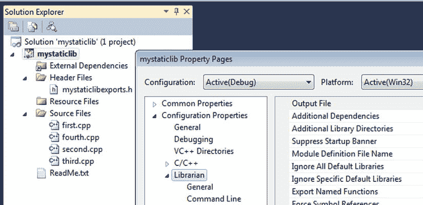
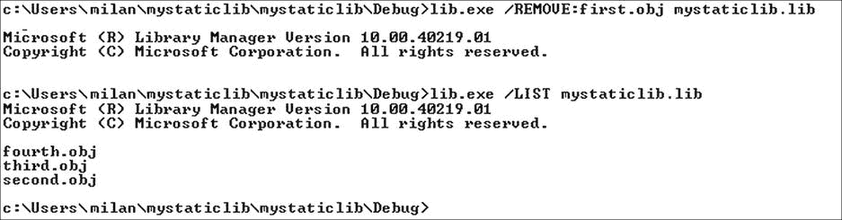
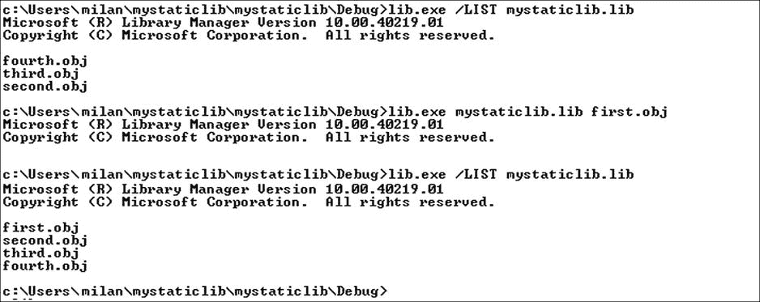
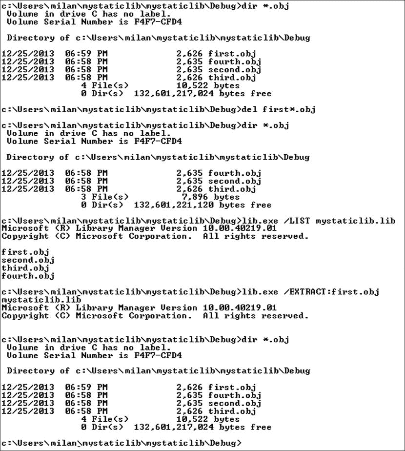
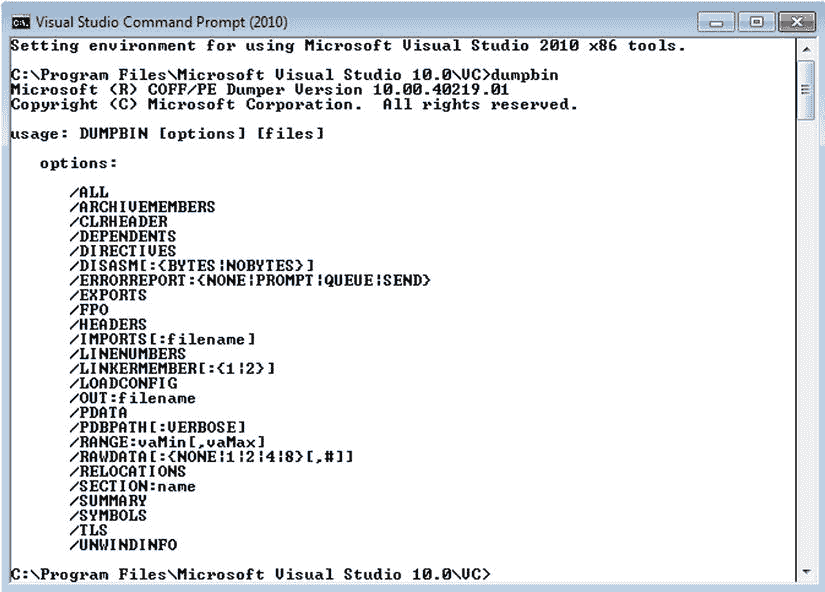
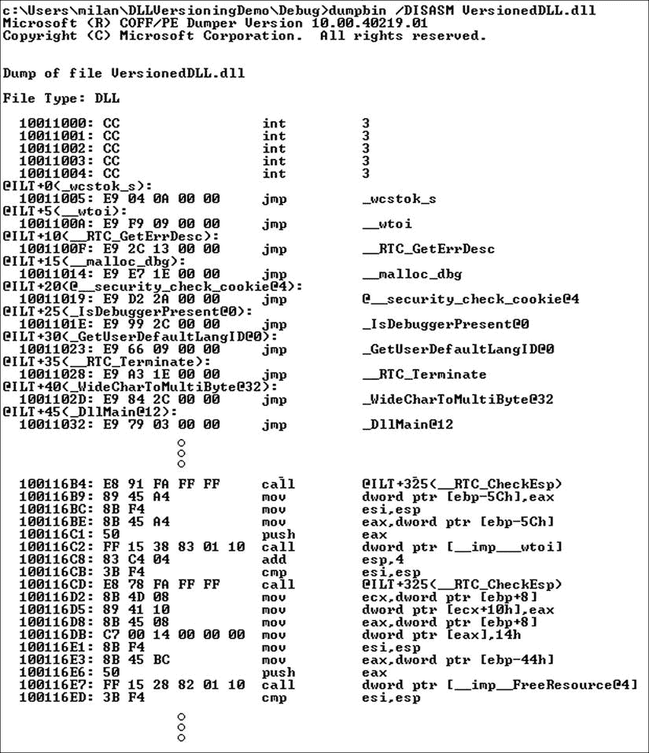
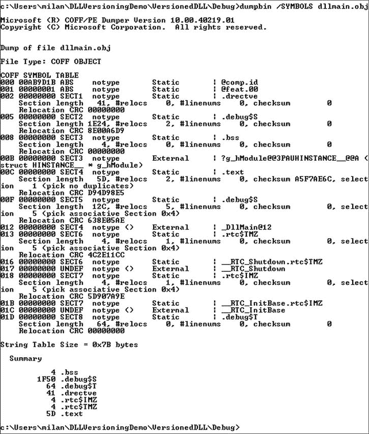
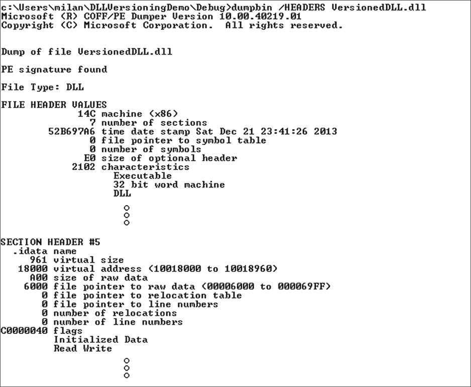
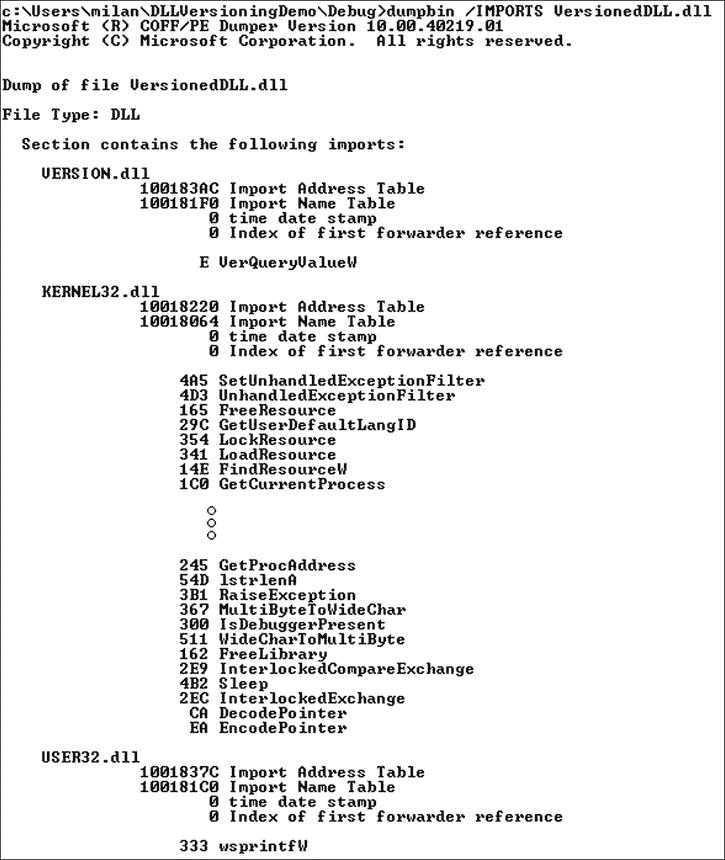

# 14.Windows 工具箱

Abstract

本章的目的是向读者介绍一套用于分析 Windows 二进制文件内容的工具(实用程序以及其他方法)。尽管 Linux `objdump`实用程序有一些分析 PE/COFF 格式的能力，但本章的重点将是本地的 Windows 工具，这些工具更有可能适应 PE/COFF 格式的任何变化。

本章的目的是向读者介绍一套用于分析 Windows 二进制文件内容的工具(实用程序以及其他方法)。尽管 Linux `objdump`实用程序有一些分析 PE/COFF 格式的能力，但本章的重点将是本地的 Windows 工具，这些工具更有可能适应 PE/COFF 格式的任何变化。

## 图书馆经理(lib.exe)

Windows 32 位库管理器`lib.exe`是 Visual Studio 开发工具的标准部分(图 [14-1](#Fig1) )。

图 14-1。

Using the lib.exe utility

这个实用程序不仅以与它的 Linux 对应物(archiver ar)相同的方式处理静态库，而且还在动态库领域扮演一个角色，作为可以创建导入库(DLL 符号的集合，文件扩展名`.lib`)以及导出文件(能够解决循环依赖，文件扩展名`.exp`)的工具。关于`lib.exe`的详细文档可以在 MSDN 网站( [`http://msdn.microsoft.com/en-us/library/7ykb2k5f.aspx`](http://msdn.microsoft.com/en-us/library/7ykb2k5f(v=vs.71).aspx)) `).`)找到

### 作为静态库工具的 lib.exe

在这一节中，我将举例说明`lib.exe`工具可能真正有用的典型角色。

#### lib.exe 作为默认归档工具

使用 Visual Studio 创建 C/C++ 静态库项目时，`lib.exe`被设置为默认的归档器/库管理器工具，项目设置的‘库管理器’选项卡用于为其指定命令行选项(图 [14-2](#Fig2) )。

图 14-2。

Using lib.exe as default archiver

默认情况下，构建静态库项目会在编译阶段后调用`lib.exe`，这无需开发人员采取任何行动。然而，这不一定是使用`lib.exe`必须结束的地方。可以从 Visual Studio 命令提示符下运行`lib.exe`,就像使用 Linux ar archiver 执行相同类型的任务一样。

#### 作为命令行工具的 lib.exe

为了说明`lib.exe`的用法，您将创建一个与 Linux 静态库功能完全匹配的 Windows 静态库，用于演示第 10 章中 ar 的用法。演示项目由四个源文件(`first.c`、`second.c`、`third.c`和`fourth.c`)和一个导出头文件组成，客户端二进制文件可以使用这个文件。这些文件显示在以下五个示例中。

`file: first.c`

`#include "mystaticlibexports.h"`

`int first_function(int x)`

`{`

`return (x+1);`

`}`

`file: second.c`

`#include "mystaticlibexports.h"`

`int fourth_function(int x)`

`{`

`return (x+4);`

`}`

`file: third.c`

`#include "mystaticlibexports.h"`

`int second_function(int x)`

`{`

`return (x+2);`

`}`

`file: fourth.c`

`#include "mystaticlibexports.h"`

`int third_function(int x)`

`{`

`return (x+3);`

`}`

`file: mystaticlibexports.h`

`#pragma once`

`int first_function(int x);`

`int second_function(int x);`

`int third_function(int x);`

`int fourth_function(int x);`

##### 创建静态库

让我们假设您编译了所有四个源文件，并且您有四个可用的目标文件(`first.obj`、`second.obj`、`third.obj`和`fourth.obj`)。将所需的库名传递给`lib.exe`(在`/OUT`标志之后)，后跟参与的目标文件列表，这将产生创建静态库的效果，如图 [14-3](#Fig3) 所示。

图 14-3。

Using lib.exe to combine object files into a static library

为了完全模仿 Visual Studio 在创建静态库项目时提供的默认设置，我添加了`/NOLOGO`参数。

##### 列出静态库内容

当`/LIST`标志传递给`lib.exe`时，打印出静态库当前包含的目标文件列表，如图 [14-4](#Fig4) 所示。

图 14-4。

Using lib.exe to list the object files of static library

##### 从静态库中移除单个目标文件

通过将`/REMOVE`标志传递给`lib.exe`，可以从静态库中移除单个目标文件(图 [14-5](#Fig5) )。

图 14-5。

Using lib.exe to remove individual object file from static library

##### 将目标文件插入到静态库中

通过传递库文件名，然后传递要添加的目标文件列表，可以将新的目标文件添加到现有的静态库中。这个语法非常类似于创建静态库的场景，除了可以省略`/OUT`标志(图 [14-6](#Fig6) )。

图 14-6。

Using lib.exe to insert object file to static library

##### 从静态库中提取单个目标文件

最后，可以从静态库中提取各个目标文件。为了演示它，我首先有目的地删除了计划从静态库中提取的原始目标文件(`first.obj`)(图 [14-7](#Fig7) )。

图 14-7。

Using lib.exe to extract an individual object file from the static library

### 动态库领域中的 lib.exe(导入库工具)

`lib.exe`也用于创建 DLL 导入库(。`lib`)文件和导出文件(。`exp`)基于可用的导出定义文件(。`def`)。当严格在 Visual Studio 环境中工作时，这个任务通常会自动分配给`lib.exe`。当 DLL 是由第三方编译器创建的，而第三方编译器没有创建相应的导入库和导出文件时，会出现更有趣的情况。在这种情况下，`lib.exe`必须从命令行运行(即 Visual Studio 命令提示符)。

以下示例说明了如何在交叉编译会话后使用`lib.exe`创建缺失的导入库，在交叉编译会话中，运行在 Linux 上的 MinGW 编译器生成了 Windows 二进制文件，但没有提供所需的导入库(图 [14-8](#Fig8) )。

图 14-8。

Using lib.exe to create an import library based on DLL and its definition (.DEF)_ file

## 垃圾箱实用程序

Visual Studio `dumpbin`实用程序( [`http://support.microsoft.com/kb/177429`](http://support.microsoft.com/kb/177429) )在很大程度上是 Linux `objdump`实用程序的 Windows 等价物，因为它执行可执行文件的重要细节的检查和分析，例如导出的符号、部分、反汇编代码(。`text`)节，静态库中的目标文件列表等。

该工具也是 Visual Studio 包的标准部分。类似于之前描述的`lib`工具，它通常从 Visual Studio 命令提示符下运行(图 [14-9](#Fig9) )。

图 14-9。

Using the dumpbin utility

运行`dumpbin`可以完成以下章节中描述的典型任务。

### 识别二进制文件类型

在没有额外标志的情况下运行时，`dumpbin`报告二进制文件类型(图 [14-10](#Fig10) )。

图 14-10。

Using the dumpbin utility to identify binary file types

### 列出 DLL 导出的符号

运行`dumpbin /EXPORTS <dll path>`提供导出符号列表(图 [14-11](#Fig11) )。

图 14-11。

Using dumpbin utility to list exported symbols of DLL file

### 列出并检查各部分

运行`dumpbin /HEADERS <binary file path>`打印出文件中出现的完整章节列表(图 [14-12](#Fig12) )。

图 14-12。

Using dumpbin to list the sections

一旦列出了截面名称，就可以通过运行`dumpbin /SECTION:<section name> <binary file path>`获得各个截面的信息(图 [14-13](#Fig13) )。

图 14-13。

Using dumpbin to get detailed insight into a specific section

### 反汇编代码

运行`dumpbin /DISASM <binary file path>`提供完整二进制文件的反汇编列表(图 [14-14](#Fig14) )。

图 14-14。

Using dumpbin to disassemble the code

### 标识调试版本

`dumpbin`实用程序用于识别二进制文件的调试版本。调试版本的指示器根据实际的二进制文件类型而有所不同。

#### 目标文件

在目标文件`(*.obj`上运行`dumpbin /SYMBOLS <binary file path>`会将为调试而构建的目标文件报告为`COFF OBJECT`类型的文件(图 [14-15](#Fig15) )。

图 14-15。

Using dumpbin to detect the debug version of the object file

同一文件的发布版本将被报告为文件类型匿名对象(图 [14-16](#Fig16) )。

图 14-16。

Indication of the release built of the object file

#### dll 和可执行文件

DLL 或可执行文件是为调试而构建的，这一点可以从运行`dumpbin /HEADERS`选项的输出中的`.idata`部分看出。本节的目的是支持仅在调试模式下可用的“编辑并继续”功能。更具体地说，要启用该选项，需要`/INCREMENTAL`链接器标志，通常为调试设置，为发布配置禁用(图 [14-17](#Fig17) )。

图 14-17。

Using dumpbin to detect the debug version of DLL

### 列出加载时间相关性

通过运行`dumpbin /IMPORTS <binary file path>`(图 [14-18](#Fig18) )可以获得依赖库的完整列表以及从其中导入的符号。

图 14-18。

Using dumpbin to list loading dependencies

## 依赖行者

Dependency Walker(又名`depends.exe`，参见 [`www.dependencywalker.com/`](http://www.dependencywalker.com/) )是一个能够跟踪已加载动态库的依赖链的实用程序(图 [14-19](#Fig19) )。它不仅能够分析二进制文件(在这种情况下，它类似于 Linux `ldd`实用程序)，而且还可以执行运行时分析，在运行时分析中，它可以检测和报告运行时动态加载。它最初是由史蒂夫·米勒开发的，在 VS2005 版本之前是 Visual Studio 工具套件的一部分。

图 14-19。

Using the Dependency Walker utility