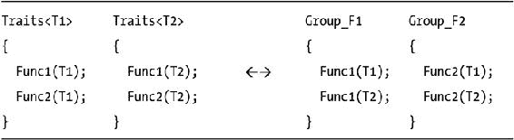

# 四、重载决议

本章介绍基于过载解决的 TMP 技术。

常见的基础架构如下:

*   你想测试 T 型是否满足一个条件。
*   您编写了几个同名的静态函数，比如 test，并向它们传递一个“携带”T 类型的伪参数(换句话说，一个允许推导 T 的参数，比如 T*)。
*   编译器根据 C++ 语言规则选择最佳候选项。
*   您可以使用返回类型或间接从该类型的属性推断出使用了哪个函数，并最终做出决定。

第一部分介绍了一些定义。

4.1.组

一个*组* 是一个提供单个例程的优化变量的类。从外部来看，一个组就像一个整体功能，可以自动为每个调用选择最佳实现。

一个组由两个实体组成:

*   包含(单个)静态成员函数变量的模板结构。
*   一个配套的全局函数模板，它只是将执行转发给组中正确的成员，根据自动推导的模板参数和一些框架提供的信息执行静态决策。

组本身通常是一个模板，即使形式上没有必要(可以用模板成员函数将组写成普通的类)。

最后，观察群体和特性在某种程度上是正交的。特征包含特定类型的所有动作，而组包含许多类型的单个动作。



4.1.1.从超载到群体

组是一组重载函数的演化。

步骤 1:您意识到默认的模板实现可以处理大多数情况，所以您只需添加重载的变体:

```cpp
template <typename T>
bool is_product_negative(T x, T y)
{
   return x<0 ^ y<0;
}

bool is_product_negative(short x, short y)
{
   return int(x)*int(y) < 0;
}

bool is_product_negative(unsigned int x, unsigned int y)
{
   return false;
}

bool is_product_negative(unsigned long x, unsigned long y)
{
   return false;
}
```

步骤 2:实现被聚集在几个使用标签挑选的模板中。

```cpp
template <typename T>
bool is_product_negative(T x, T y, selector<false>)
{
   return x<0 ^ y<0;
}

template <typename T>
bool is_product_negative(T x, T y, selector<true>)
{
   return int(x)*int(y) < 0;
}

template <typename T>
bool is_product_negative(T x, T y)
{
   typedef selector<(sizeof(T)<sizeof(int))> small_int_t;
   return is_product_negative(x, y, small_int_t());
}
```

步骤 3:将所有的辅助函数归入一个类中，并在外面留下一个单独的函数来分派工作:

```cpp
// companion function

template <typename T>
bool is_product_negative(T x, T y)
{
   return is_product_negative_t<T>::doIt(x, y);
}

template <typename T>
struct is_product_negative_t
{
   static bool doIt(T x, T y)
   { ...  }

   static bool doIt(unsigned, unsigned)
   { return false; }
};
```

这是另一个非常简单的组:

```cpp
struct maths
{
   template <typename T>
   inline static T abs(const T x)
   {
      return x<0 ? -x : x;
   }

   inline static unsigned int abs(unsigned int x)
   {
      return x;
   }
};

template <typename T>
inline T absolute_value(const T x)
{
   return maths::abs(x);
}
```

 **注意**记住，组类，作为一个非模板，总是完全实例化的。此外，头文件中的非模板函数必须内联声明。

进一步假设你有一个名为 has_abs_method 的元函数，这样 has_abs_method < T >:::如果 T 类型的对象 x 的绝对值由 x.abs()给定，则值为真。 [<sup class="calibre7">1</sup>](#Fn1)

这允许你的团队变得更复杂。在下一个例子中，您将为 double 专门化整个组，专门化将忽略 has_abs_method <double>的实际结果。 [<sup class="calibre7">2</sup>](#Fn2)</double>

```cpp
template <typename scalar_t>
struct maths
{
   static scalar_t abs(const scalar_t& x, selector<false>)
   {
      return x<0 ? –x : x;
   }

   static scalar_t abs(const scalar_t& x, selector<true>)
   {
      return x.abs();
   }
};

template <>
struct maths<double>
{
   template <bool UNUSED>
   static double abs(const double x, selector< UNUSED >)
   {
      return std::fabs(x);
   }
};

template <typename scalar_t>
inline scalar_t absolute_value(const scalar_t& x)
{
   typedef selector< has_abs_method<scalar_t>::value > select_t;
   return maths<scalar_t>::abs(x, select_t());
}
```

过多的重载可能会发生冲突。记住，非模板函数比匹配的模板更好，但这不适用于使用类的模板参数的成员函数:

```cpp
template <typename scalar_t>
struct maths
{
   static scalar_t abs(const scalar_t& x, selector<false>)
   {
      return x<0 ? –x : x;
   }

   static int abs(const int x, selector<false>)
   {
      return std::abs(x);
   }
}

error: ambiguous call to overloaded function, during instantiation of absolute_value<int>
```

这正是“双层”模板选择的优势。“第一层”是伴随函数中 scalar_t 的自动推导，“第二层”是重载选择，在参数已经固定的类模板(组)内执行:

```cpp
template <typename scalar_t>
inline scalar_t absolute_value(const scalar_t& x)
{
   // collect auxiliary information, if needed
   return math<scalar_t>::abs(x, ...);
}
```

将它们结合起来，你就拥有了更少的全局函数模板(过多的重载很可能导致“模棱两可的调用”)。此外，该组可以有子例程(私有静态成员函数)。

用户有几种扩展选择:

*   专门化整个群体(如果是模板的话)
*   专门化全局伴随函数
*   利用现有框架的模型类型(例如，specialize has_abs_method)

选择部分可以更微妙，在中间有额外的层。如下例所示，通过隐式参数提升选择组的正确成员:

```cpp
#include <cmath>

struct tag_floating
{
   tag_floating() {}
   tag_floating(instance_of<float>) {}
   tag_floating(instance_of<double>) {}
   tag_floating(instance_of<long double>) {}
};

struct tag_signed_int
{
   tag_signed_int() {}
   tag_signed_int(instance_of<short>) {}
   tag_signed_int(instance_of<int>) {}
   tag_signed_int(instance_of<long>) {}
};

struct tag_unsigned_int
{
   tag_unsigned_int() {}
   tag_unsigned_int(instance_of<unsigned short>) {}
   tag_unsigned_int(instance_of<unsigned int>) {}
   tag_unsigned_int(instance_of<unsigned long>) {}
};

template <typename scalar_t>
struct maths
{
   inline static scalar_t abs(const scalar_t x, tag_signed_int)
   {
      return x<0 ? -x : x;
   }

   inline static scalar_t abs(const scalar_t x, tag_unsigned_int)
   {
      return x;
   }

   inline static scalar_t abs(const scalar_t x, tag_floating)
   {
      return fabs(x);
   }
};

template <typename scalar_t>
inline scalar_t absv(const scalar_t& x)
{
   return maths<scalar_t>::abs(x, instance_of<scalar_t>());
}
```

使用反转的选择器层次结构可以获得相同的效果(例如，让 instance_of <double>从 scalar_floating 派生而来)，但是 instance_of 是一个通用的模板，我将其视为不可修改的。</double>

您还可以引入中间选择器(不幸的是，您必须手工编写构造函数):

```cpp
struct tag_int
{
   tag_int() {}
   tag_int(instance_of<short>) {}
   tag_int(instance_of<int>) {}
   tag_int(instance_of<long>) {}
   tag_int(instance_of<unsigned short>) {}
   tag_int(instance_of<unsigned int>) {}
   tag_int(instance_of<unsigned long>) {}
};

template <typename scalar_t>
struct maths
{
   static scalar_t mod(const scalar_t x, const scalar_t y, tag_int)
   {
      return x % y;
   }

   static scalar_t mod(const scalar_t& x, const scalar_t& y, tag_floating)
   {
      return fmod(x, y);
   }
};

template <typename scalar_t>
inline scalar_t mod(const scalar_t& x, const scalar_t& y)
{
   return maths<scalar_t>::mod(x, y, instance_of<scalar_t>());
}
```

注意，在这段代码中，maths <double>包含了一个不能被调用的方法(double 没有运算符%)。如果 operation 是一个非模板类，它无论如何都会被实例化，从而产生一个编译器错误。</double>

然而，当解析依赖于模板参数的表达式时，由于不知道实际涉及的类型，编译器将接受任何形式上合法的 C++ 语句。 [<sup class="calibre7">3</sup>](#Fn3) 因此，如果两个参数 x 和 y 中至少有一个具有泛型类型 T，则 x % y 在实例化之前都被认为是有效的。

前一个例子可以明确地工作，因为伴随函数限制了对名为 mod 的 maths <double>成员的调用，并且对于任何类型 T，<t>的 instance _ 最多可以提升为 tag_int 或 tag_floating 中的一个。</t></double>

有时，组与一个特殊的头文件相关联，该头文件使用宏块检测平台信息，并使用 typedefs 在 C++ 中翻译它:

```cpp
// file "root.hpp"
// note: this code is fictitious

struct msvc {};
struct gcc {};

#if defined(__MSVC)            // preprocessor compiler detection...
typedef msvc compiler_type;    // ...translated in c++
#elif defined(__GCC__)
typedef gcc compiler_type;
#endif

// from here on, there's a global type tag named "compiler_type"
```

在不同的平台上，同一个函数可能有不同的“最佳”实现，因此您可以使用 compiler_type 作为标签来选择最合适的一个(但是*所有的*函数必须是合法的 C++ 代码):

```cpp
template <typename scalar_t, typename compiler_t>
struct maths
{
   static scalar_t multiply_by_two(const scalar_t x)
   { return 2*x; }
};

template < >
struct maths<unsigned int, msvc>
{
   static unsigned int multiply_by_two(const unsigned int x)
   { return x << 1; }
};

template <typename scalar_t>
inline scalar_t multiply_by_two(const scalar_t& x)
{
   return maths<scalar_t, compiler_type>::multiply_by_two(x);
}
```

请注意，您可以根据需要对成员函数进行分支选择——可以同时在多个标记上进行，也可以分层进行。

作为一个规则，每当您需要操作一个标准函数的结果时，您可能想要使用“编译器标签”,该标准函数在某种程度上被定义为特定于编译器的，例如，美化由 typeid(...).名称()。

考虑一个真实世界的例子。根据标准，如果 A 和 B 都是有符号整数，*不都是正的*，A % B 的符号是未定义的(如果改为 A > 0 和 B > 0，标准保证 A % B > 0)。

例如，-10 % 3 可以产生-1 或+2，因为-10 可以写成 3*(-3)+(-1)或 3*(-4)+(+2)，并且|-1|<3 和|2|<3。在任何情况下，这两种解决方案将相差 3。

然而，运算符% 通常被实现为 A 和(A % B)具有相同的符号(实际上，这与用于 fmod 的规则相同)。因此，编写一个允许这个条件的提醒函数是有意义的。

由于(-A) % B == -(A % B)和 A % (-B) == A % B，您可以推断出，当 A % B 的本机实现产生不同的结果时，您可以返回 sign(A)*(|A| % |B|)。

一个简单的实现可以依赖于(-3) % 2 等于+1 或-1。(注意，下面的代码不是 100%防弹的，但这是一个很好的妥协。)

```cpp
template <typename T, int X = (-3)%2, int Y = (-3)%(-2), int Z = 3%(-2)>
struct modgroup;

// if X=+1, Y=-1, Z=+1 then operator% already does what we want
// (strictly speaking, we tested only int)

template <typename T>
struct modgroup<T, 1, -1, 1>
{
   static scalar_t mod(const T x, const T y)
   {
      return x % y;
   }
};

// in any other case, fall back to the safe formula

template <typename T, int X, int Y, int Z>
struct modgroup
{
   static scalar_t mod(const T x, const T y)
   {
      const T result = abs(x) % abs(y);
      return x<0 ? –result : result;
   }
};

template <typename scalar_t>
struct maths
{
   static scalar_t mod(const scalar_t x, const scalar_t y,
                       tag_int)
   {
      return modgroup<scalar_t>::mod(x, y);
   }

   static scalar_t mod(const scalar_t& x, const scalar_t& y,
                       tag_floating)
   {
      return fmod(x, y);
   }
};

template <typename scalar_t>
inline scalar_t mod(const scalar_t& x, const scalar_t& y)
{
   return maths<scalar_t>::mod(x, y, instance_of<scalar_t>());
}
```

4.1.2.运行时间衰减

类型标记可以实现一个特殊的强制转换运算符，这样，如果组中没有重载与标记完全匹配，执行将在默认函数中继续，该函数通常在运行时执行一些工作。原型是一个静态整数，如果没有更好的匹配，它会衰减为正常整数。

假设您想用零填充 C 数组:

```cpp
template <typename T, T VALUE>
struct static_value
{
   // ...

   operator T() const
   {
      return VALUE;
   }
};

template <typename T>
struct zeroize_helper
{
   static void apply(T* const data, static_value<int, 1>)
   {
      *data = T();
   }

   static void apply(T (&data)[2], static_value<int, 2>)
   {
      data[0] = data[1] = T();
   }

   static void apply(T* const data, const int N)
   {
      std::fill_n(data, N, T());
   }
};

template <typename T, int N>
void zeroize(T (&data)[N])
{
   zeroize_helper<T>::apply(data, static_value<int, N>());
}
```

*   你不用 0，而是写 T()，它适用于更广泛的类型。
*   如果 N 大于 2，则最佳匹配是第三个成员。
*   组中的每个函数都可以自由决定转换，甚至忽略 static_value。
*   默认情况下，可以接受每个 static_value，但不一定在运行时执行所有工作，而是使用另一个模板函数:

```cpp
template <>
struct zeroize_helper<char>
{
   template <int N>
   struct chunk
   {
      char data[N];
   };

   template <int N>
   static void apply(char* const data, static_value<int, N>,
selector<true>)
   {
      *reinterpret_cast<chunk<N>*>(data) = chunk<N>();
   }

   template <int N>
   static void apply(char* const data, static_value<int, N>,
selector<false>)
   {
      memset(data, N, 0);
   }

   template <int N>
   static void apply(char* const data, static_value<int, N> S)
   {
      apply(data, S, selector<sizeof(chunk<N>) == N>());
   }
};
```

4.2.更多特征

这部分完成了对特征的回顾。

这一次，您将使用静态编程限制的特征，但也作为函数组。先说一个具体的案例。

4.2.1.字符串的函数集

假设你要为字符串写一些通用算法。当然你可以使用迭代器，特别是随机访问迭代器，对吗？大多数 STL 实现都有 char 优化的算法，比如 std::find、std::copy 等等。

用户的唯一负担是大量调用 strlen 来查找范围的结尾。strlen

```cpp
const char* c_string = "this is an example";

// can we avoid this?
std::copy(c_string, c_string+strlen(c_string), destination);
```

您可以使用 traits 进行更多的优化:

```cpp
template <typename string_t>
struct string_traits
{
   typedef /* dependent on string_t */ const_iterator;
   typedef const string_t& argument_type;

   const_iterator begin(argument_type s);
   const_iterator end  (argument_type s);

   static bool is_end_of_string(const_iterator i, argument_type s);
};
```

假设对于每一个有意义的字符串，string_traits 都有相同的接口，你可以写一个算法如下:

```cpp
template <typename string_t>
void loop_on_all_chars(const string_t& s)
{
   typedef string_traits<string_t> traits_t;

   typename traits_t::const_iterator i = traits_t::begin(s);
   while (!traits_t::is_end_of_string(i, s))
   {
      std::cout << *(i++);
   }
}
```

代码冗长但清晰。然而在这一点上，你的成就可能并不明显。string_traits 的半透明接口 在进行比较时提供了更多的自由度:

```cpp
template <typename char_t>
struct string_traits< std::basic_string<char_t> >
{
   typedef char_t char_type;
   typedef
     typename std::basic_string<char_type>::const_iterator
     const_iterator;

   typedef const std::basic_string<char_type>& argument_type;

   static const_iterator begin(argument_type text)
   {
      return text.begin();
   }

   static const_iterator end(argument_type text)
   {
      return text.end();
   }

   static bool is_end_of_string(const_iterator i, argument_type s);
   {
      return i == s.end();
   }
};

template <>
struct string_traits<const char*>
{
   typedef char char_type;

   typedef const char* const_iterator;
   typedef const char* argument_type;

   static const_iterator begin(argument_type text)
   {
      return text;
   }

   static const_iterator end(argument_type text)
   {
      return 0;   // constant-time
   }

   static bool is_end_of_string(const_iterator i, argument_type s);
   {
      // a constant-time "C" test for end of string
      return (i==0) || (*i==0);
   }
};
```

由于 end 现在是常数时间 ，您保存了一个线性时间通道(您将再次遇到这个完全相同的问题，并在 6.2.2 节中用不同的技术解决它。

您可以很容易地将 string_traits 扩展为一个完整的接口(为了便于阅读，一些单词已被重命名):

```cpp
template <typename string_t>
struct string_traits
{

typedef /* ... */ char_type;

typedef /* ... */ const_iterator;
typedef /* ... */ argument_type; // either string_t or const string_t&

static size_t npos();

static size_t find1st(arg_t txt, const char_t c, size_t offset=0);
static size_t find1st(arg_t txt, const arg_t s, size_t offset=0);

static size_t findlast(arg_t txt, const char_t s, size_t offset);
static size_t findlast(arg_t txt, const arg_t s, size_t offset);

static size_t find1st_in(arg_t txt, const char_t* charset, size_t offs=0);
static size_t find1st_out(arg_t txt, const char_t* charset, size_t offs=0);

static size_t size(arg_t txt);

static const_iterator begin(arg_t txt);
static const_iterator end(arg_t txt);

static const char_t* c_str(arg_t txt);

static bool empty(const_iterator begin, const_iterator end);
static bool less(const_iterator begin, const_iterator end);
static size_t distance(const_iterator begin, const_iterator end);
};
```

要利用接口并利用 std::string 成员函数，请考虑以下约定:

*   所有迭代器都是随机访问的。
*   find 函数返回字符的索引(在所有类型的字符串中都是可移植的)或 npos()，这意味着“没有找到”。

```cpp
static size_t find1st(arg_t text, const char_type c, size_t offset=0)
{
   const char_t* pos = strchr(text+offset, c);
   return pos ? (pos-text) : npos();
}
```

在 const char* 的特殊化中，你对 end 迭代器进行了二义性处理，它可以是一个空指针，表示“直到找到 char 0”。因此，您可以按如下方式实现距离:

```cpp
static size_t distance(const_iterator begin, const_iterator end)
{
   return end ? end-begin : (begin ? strlen(begin) : 0);
}
```

最后，您可以通过公共派生来继承函数集，和 traits 一样，因为它们是无状态的(所以可以省略受保护的空析构函数):

```cpp
template <>
struct string_traits<char*> : string_traits<const char*>
{
};
```

4.2.2.概念特征

正如您在第一章中反复看到的，traits 类规定了语法，而不是精确的实体。代码可以借用 traits 的方式来实现几种不同的实现。

假设您有某种智能指针类，它的 traits 类也负责释放内存:

```cpp
template <typename T, typename traits_t = smart_ptr_traits<T> >
class smart_ptr
{
   typedef typename traits_t::pointer pointer;
   pointer p_;

public:

   ~smart_ptr()
   {
           traits_t::release(p_);
   }
    // ...
};
```

特质::发布可以是:

*   公共静态函数(或仿函数)；相关代码在函数体中。

```cpp
template <typename T>
struct smart_ptr_traits
{
   typedef T* pointer;

   static void release(pointer p)
   {
      delete p;
   }
```

*   触发转换操作符的公共静态函数，该操作符实际上运行代码。

```cpp
template <typename T>
struct smart_ptr_traits
{
   static void release(bool)
   {
   };

   class pointer
   {
      // ...
      public:
         operator bool()
         { ... }
   };

   // ....
```

使用稍微不同的语法，您可以将其重写如下:

```cpp
template <typename T, typename traits_t = smart_ptr_traits<T> >
class smart_ptr
{
   typedef typename traits_t::pointer pointer;
   pointer p_;

   static void traits_release(typename traits_t::release)
   {
                  // note: empty body
   };

public:
   ~smart_ptr()
   {
           traits_release(p_);
   }
```

Release 现在可以是一个类型，相关代码在(非显式)构造函数体中。

```cpp
template <typename T>
struct smart_ptr_traits
{
   typedef T* pointer;

   struct release
   {
      release(pointer p)
      {
         delete p;
      }
   };
```

代码可以再次触发一个转换运算符:

```cpp
template <typename T>
struct smart_ptr_traits
{
   struct release
   {
   };

   class pointer
   {
      // ...
      public:

         operator release()
         {
            delete p_;
            return release();
         }
   };
};
```

所有这些实现都是有效的，您可以选择实际执行的代码的最佳位置。 [<sup class="calibre7">4</sup>](#Fn4)

如果 traits::release 是作为一种类型提供的，那么它可能具有易于与程序的其余部分共享的静态数据(例如，您可以记录所有释放的指针)。

4.2.3.特定平台特征

回想一下，traits 类可以是“全局的”或“局部的”。全局特征类随处可见，局部特征应该作为参数传递。

全局特征是首选的，以使客户端可以轻松访问某些平台属性:

```cpp
template <typename char_t>
struct textfile_traits
{
   static char_t get_eol() { return '\n'; }
   // ...
};
```

下面的完整示例用一个类模板表示一个 timer 对象，并从一个“timer traits”类借用附加信息:

*   如何获得当前时间(未指定单位)
*   如何将时间转换成秒(使用频率)

```cpp
template <typename traits_t>
class basic_timer
{
   typedef typename traits_t::time_type tm_t;
   typedef typename traits_t::difference_type diff_t;

   tm_t start_;
   tm_t stop_;

   inline static tm_t now()
   {
      return traits_t::get_time();
   }

   double elapsed(const tm_t end) const
   {
      static const tm_t frequency = traits_t::get_freq();
      return double(diff_t(end-start_))/frequency;
   }

public:
   typedef tm_t time_type;
   typedef diff_t difference_type;

   basic_timer()
   : start_()
   {}

   difference_type lap() const
   { return now()-start_; }

   time_type start()
   { return start_ = now(); }

   difference_type stop()
   { return (stop_ = now())-start_; }

   difference_type interval() const
   { return stop_-start_; }

   double as_seconds() const
   { return elapsed(stop_); }

   double elapsed() const
   { return elapsed(now()); }
};
```

下面是一个测量时钟时间(以秒为单位)的 traits 类示例:

```cpp
#include <ctime>
struct clock_time_traits
{
   typedef size_t time_type;
   typedef ptrdiff_t difference_type;

   static time_type get_time()
   {
      time_t t;
      return std::time(&t);
   }

   static time_type get_freq()
   {
      return 1;
   }
};
```

这里有一个不同的 traits 类来计算 CPU 时间:

```cpp
struct cpu_time_traits
{
   typedef size_t time_type;
   typedef ptrdiff_t difference_type;

   static time_type get_time()
   {
      return std::clock();
   }

   static time_type get_freq()
   {
      return CLOCKS_PER_SEC;
   }
};
```

和一个简短的用例:

```cpp
basic_timer<clock_time_traits> t;
t.start();
// ...
t.stop();
std::cout << "I ran for " << t.as_seconds() << " seconds.";
```

traits 的基本限制是所有成员函数必须包含有效的 C++ 代码，即使没有使用。不能在其中一个函数中使用编译器特定的代码。

由于不同的操作系统可以为时间测量提供更精确的 API，您可能会想写一些专门的特征:

```cpp
#include <windows.h>

struct windows_clock_time_traits
{
   typedef ULONGLONG time_type;
   typedef LONGLONG difference_type;

   static time_type get_time()
   {
      LARGE_INTEGER i;
      QueryPerformanceCounter(&i);
      return i.QuadPart;
   }

   static time_type get_freq()
   {
      LARGE_INTEGER value;
      QueryPerformanceFrequency(&value);
      return value.QuadPart;
   }
};

#include <sys/time.h>

struct macosx_clock_time_traits
{
   typedef uint64_t time_type;
   typedef int64_t difference_type;

   static time_type get_time()
   {
      timeval now;
      gettimeofday(&now, 0);
      return time_type(now.tv_sec) * get_freq() + now.tv_usec;
   }

   static time_type get_freq()
   {
      return 1000000;
   }
};
```

除了大整数的 typedefs 之外，这个 traits 接口是标准的 C++，所以您可能想把预处理器隔离在“工厂头”中，以后完全依赖模板属性:

```cpp
// platform_detect.hpp

struct windows {};
struct macosx {};
struct other_os {};

#if defined(WIN32)
typedef windows platform_type;
#elif defined(__APPLE__)
typedef macosx platform_type;
#else
typedef other_os platform_type;
#endif

// timer_traits.hpp

template <typename platform_t>
struct clock_time_traits;

template < >
struct clock_time_traits<windows>
{
   // implementation with QPC/QPF
};

template < >
struct clock_time_traits<macosx>
{
   // implementation with gettimeofday
};

template < >
struct clock_time_traits<other_os>
{
   // implementation with std::time
};

typedef basic_timer< clock_time_traits<platform_type> > native_timer_type;
```

不幸的是，代码*是不可移植的*(然而，如果它能编译，它就能正确运行)。

根据该标准，编译器不需要诊断未使用的模板成员函数中的错误，但如果需要，它要求所有提到的实体都是定义良好的。特别是，GCC 将在 clock _ time _ traits<windows>::get _ time 中报告一个错误，因为还没有声明名为 QueryPerformanceCounter 的函数。</windows>

由于这种方法很有吸引力，一些变通方法是可行的:

*   定义一个宏，其名称和参数与函数相同:

```cpp
// define as nothing because the return type is void
// otherwise define as an appropriate constant, e.g. 0

#define QueryPerformanceCounter(X)

#if defined(WIN32)
#undef QueryPerformanceCounter     // remove the fake...
#include <windows.h>               // ...and include the true function
#endif
```

*   声明—但不定义—函数。这是首选的解决方案，因为 Windows traits 不应该链接到其他操作系统中。

```cpp
#if !defined(WIN32)
   void QueryPerformanceCounter(void*);
#endif
```

 **注意**一个常见的窍门，如果函数返回 void，就是将函数本身的名字定义为< nothing >。逗号分隔的参数列表将被解析为逗号运算符。

这也允许使用省略号函数:

```cpp
#define printf

printf("Hello world, %f", cos(3.14));
```

然而，有几个潜在的问题。首先，宏将表达式的返回类型更改为 double(最后一个参数)。此外，程序还在评估 cos(3.14)。另一种也能最大限度地减少运行时工作量的方法是:

```cpp
inline bool discard_everything(...) { return false };

#define printf                false && discard_everything
```

4.2.4.合并特征

特别是当您处理大型特征时，让用户定制特征类的较小部分是一个很好的实践。通常，这个问题的解决方法是将 traits 类分成几个部分，然后使用公共继承将它们重新组合，形成一个 traits 默认值。

假设您在 traits 中对一些比较运算符进行分组:

```cpp
template <typename T>
struct binary_relation_traits
{
   static bool gt(const T& x, const T& y) { return x>y; }
   static bool lt(const T& x, const T& y) { return x<y; }

   static bool gteq(const T& x, const T& y) { return x>=y; }
   static bool lteq(const T& x, const T& y) { return x<=y; }

   static bool eq(const T& x, const T& y) { return x==y; }
   static bool ineq(const T& x, const T& y) { return x!=y; }
};
```

binary_relation_traits 的一般实现假设 T 定义了所有六个比较运算符，但是这个例子支持两个重要的特例，即:

*   t 仅定义运算符<
*   t 仅定义运算符

没有您的支持，用户将不得不从头开始实现所有的 traits 结构。所以必须重新排列代码 如下:

```cpp
template <typename T>
struct b_r_ordering_traits
{
   static bool gt(const T& x, const T& y) { return x>y; }
   static bool lt(const T& x, const T& y) { return x<y; }

   static bool gteq(const T& x, const T& y) { return x>=y; }
   static bool lteq(const T& x, const T& y) { return x<=y; }
};

template <typename T>
struct b_r_equivalence_traits
{
   static bool eq(const T& x, const T& y) { return x==y; }
   static bool ineq(const T& x, const T& y) { return x!=y; }
};

template <typename T>
struct binary_relation_traits
: public b_r_ordering_traits<T>
, public b_r_equivalence_traits<T>
{
};
```

然后你要写备选块 ，可以组合:

```cpp
template <typename T>
struct b_r_ordering_less_traits
{
   static bool gt(const T& x, const T& y) { return y<x; }
   static bool lt(const T& x, const T& y) { return x<y; }

   static bool gteq(const T& x, const T& y) { return !(x<y); }
   static bool lteq(const T& x, const T& y) { return !(y<x); }
};

template <typename T>
struct b_r_equivalence_equal_traits
{
   static bool eq(const T& x, const T& y) { return x==y; }
   static bool ineq(const T& x, const T& y) { return !(x==y); }
};

template <typename T>
struct b_r_equivalence_less_traits
{
   static bool eq(const T& x, const T& y) { return !(x<y) && !(y<x); }
   static bool ineq(const T& x, const T& y) { return x<y || y<x; }
};
```

最后，通过派生和一个隐藏的模板参数 来组合这些片段。

```cpp
enum
{
   HAS_JUST_OPERATOR_LESS,
   HAS_OPERATOR_LESS_AND_EQ,
   HAS_ALL_6_OPERATORS
};

template <typename T, int = HAS_ALL_6_OPERATORS>
struct binary_relation_traits
: b_r_ordering_traits<T>
, b_r_equivalence_traits<T>
{
};

template <typename T>
struct binary_relation_traits<T, HAS_JUST_OPERATOR_LESS>
: b_r_ordering_less_traits<T>
, b_r_equivalence_less_traits<T>
{
};

template <typename T>
struct binary_relation_traits<T, OPERATOR_LESS_AND_EQ>
: b_r_ordering_less_traits<T>
, b_r_equivalence_equal_traits<T>
{
};
```

此外，可以使用适当的枚举和“按位或”语法来链接特征。 [<sup class="calibre7">5</sup>](#Fn5)

如果您想提供一个枚举集，包含 2 的幂，将使用标准的*标志成语* *，*进行组合，但是在编译时:

```cpp
fstream fs("main.txt", ios::in | ios:out);

typedef binary_relation_traits<MyType, native::less | native::eq> MyTraits;
```

首先，您让标志从 1 开始，因为您需要 2 的幂。

```cpp
namespace native
{
   enum
   {
      lt       = 1,
      lt_eq    = 2,
      gt       = 4,
      gt_eq    = 8,
      eq       = 16,
      ineq     = 32
   };
}
```

第二，使用部分专门化将 traits 类分成原子:

```cpp
template <typename T, int FLAG>
struct binary_relation_traits; // no body!

template <typename T>
struct binary_relation_traits<T, native::lt>
{
   static bool lt(const T& x, const T& y) { return x<y; }
};

template <typename T>
struct binary_relation_traits<T, native::lt_eq>
{
   static bool lteq(const T& x, const T& y) { return x<=y; }
};

// and so on...
```

如果用户提供的位掩码标志设置为(native::ineq |...)，性状<t>应该来源于性状<t native::ineq="">和性状<t flags="" native::ineq="">。</t></t></t>

你需要一个辅助元函数叫做 static _ highest _ bit<n>:value，返回一个(正)整数 N 中最高位集合的索引，比如小于等于 N 的二的最大幂的指数 [<sup class="calibre7">6</sup>](#Fn6)</n>

有了这个工具，您就有了一个实现:

```cpp
template <typename T, unsigned FLAG>
struct binary_relation_traits;

template <typename T>
struct binary_relation_traits<T, 0>
{
   // empty!
};

template <typename T>
struct binary_relation_traits<T, native::lt>
{
   static bool lt(const T& x, const T& y) { return x<y; }
};

template <typename T>
struct binary_relation_traits<T, native::gt>
{
   static bool gt(const T& x, const T& y) { return x>y; }
};

// write all remaining specializations
// then finally...

template <typename T, unsigned FLAG>
struct binary_relation_traits
: binary_relation_traits<T, FLAG & (1 << static_highest_bit<FLAG>::value)>
, binary_relation_traits<T,  FLAG – (1 << static_highest_bit<FLAG>::value)>
{
   // empty!
};
```

现在，用户可以在编译时选择 binary_relation_traits 成员:

```cpp
typedef binary_relation_traits<MyType, native::less | native::eq>  MyTraits;

MyType a, b;
MyTraits::lt(a,b);     // ok.
MyTraits::lteq(a,b);   // error: undefined
```

这种技术本身很有趣，但是它不满足最初的要求，因为您只能选择“本地”操作符 。但是您可以添加更多的标志:

```cpp
namespace native
{
   enum
   {
      lt       = 1,
      lt_eq    = 2,
      gt       = 4,
      gt_eq    = 8,
      eq       = 16,
      ineq     = 32
   };
}

namespace deduce
{
   enum
   {
      ordering    = 64,
      equivalence = 128,
      ineq        = 256
   };
}

template <typename T>
struct binary_relation_traits<T, deduce::ordering>
{
   static bool gt(const T& x, const T& y) { return y<x; }

   static bool gteq(const T& x, const T& y) { return !(x<y); }
   static bool lteq(const T& x, const T& y) { return !(y<x); }
};

template <typename T>
struct binary_relation_traits<T, deduce ::ineq>
{
   static bool ineq(const T& x, const T& y) { return !(x==y); }
};

template <typename T>
struct binary_relation_traits<T, deduce::equivalence>
{
   static bool eq(const T& x, const T& y) { return !(x<y) && !(y<x); }
   static bool ineq(const T& x, const T& y) { return x<y || y<x; }
};

typedef
  binary_relation_traits
  <
     MyType,
     native::less | deduce::ordering | deduce::equivalence
  >
  MyTraits;
```

注意，任何不必要的重复(比如 native::ineq | deduct::ineq)都会在第一次使用时触发编译器错误*。如果特质< T，N >和特质< T，M >都有一个成员 x，特质< T，N+M > ::x 就是一个模棱两可的称呼。*

4.3 .sfinae〔t0〕

“替换失败不是错误”(或 SFINAE) 原则是 C++ 标准提供的一种保证。您将确切地看到它的含义，以及当函数模板不满足编译时条件时，如何从重载集中移除函数模板。

记住，当一个类模板被实例化时，编译器生成:

*   班级级别的每个成员签名
*   只有严格必要的函数体

因此，这段代码 无法编译:

```cpp
template <typename T>
struct A
{
   typename T::pointer f() const
   {
      return 0;
   }
};

A<int> x;
```

一旦遇到一个<int>，编译器将试图为每个成员函数的*生成一个签名，并且它将给出一个错误，因为 int::pointer 不是一个有效的类型。相反，这是可行的:*</int>

```cpp
template <typename T>
struct A
{
   int f() const
   {
      typename T::type a = 0;
      return a;
   }
};

A<int> x;
```

只要一个 <int>::f()没有被使用，编译器就会忽略它的主体(这是个好消息，因为它包含一个错误)。</int>

此外，当编译器遇到 f(x)并且 X 具有类型 X 时，它应该决定调用哪个特定的 f，因此它将所有可能的候选对象从最好的到最差的排序，并尝试在任何模板参数中替换 X。如果这种替换产生了具有无效签名的函数(签名，而不是主体！)，候选人默默丢弃。这就是 SFINAE 原理。

```cpp
template <typename T>
typename T::pointer f(T*);

int f(void*);

int* x = 0;
f(x);
```

首选第一个 f，因为 T*比 void*更匹配；但是 int 没有名为指针的成员类型， 所以使用第二个 f。SFINAE 仅在替换产生形式上无效的表达式时适用(如 int::pointer)。相反，当结果是无法编译的类型时，它不适用:

```cpp
template <typename T, int N>
struct B
{
   static const int value = 100/N;
};

template <typename T>
B<T, 0> f(T*);

int f(void*);
```

B <t>是一个有效的类型，但是它的编译给出了一个错误。第一个 f 无论如何都会被选中，编译器会停止。</t>

为了利用 SFINAE 的 ，当您想要“启用”或“禁用”一个函数模板的特定重载时，您可以在它的签名中人为地插入一个依赖名称，该名称可能会解析为一个无效的表达式(一个不存在的类型，如 int::pointer)。

如果所有的候选项都被丢弃了，就会出现一个编译器错误(SFINAE 的简单使用实际上看起来像静态断言)。

SFINAE 的应用主要有两种:f 被选中后运行时和 f 根本不执行时。

4.3.1 .sfinae 元函数

使用 SFINAE 和 sizeof ，您可以编写基于 t 类型的接口做出决定的元函数。这非常接近于不同编程语言中所谓的*反射*。

基本成分是:

*   尺寸不同的两种(或多种)类型；让我们称之为是和不是。
*   一组重载函数 f，其中至少有一个必须是模板，返回 YES 或 NO。
*   用 sizeof(f(something))定义的静态常数。

以下范例有助于澄清这一点:

```cpp
template <typename T>
class YES { char dummy[2]; };         // has size > 1

typedef char NO;                      // has size == 1

template <typename T>
class MF
{
   template <typename X>
   static YES<[[condition on X]]> test(X);

   static NO test(...);

   static T this_type();

public:
   static const bool value = sizeof(test(this_type())) != sizeof(NO);
};
```

当参数类型为 t 时，编译器必须决定调用哪个测试。它将首先尝试评估 YES (因为 void*和省略号...具有非常低的优先级)。如果这会生成无效的类型，test 的第一个重载将被丢弃，它将选择另一个重载。

请注意一些重要事实:

*   静态函数*不需要有主体*；sizeof 中只使用他们的签名。
*   是的<t>不需要 2 号。如果写 sizeof(test(this _ type())= = 2，那就错了。然而，char *必须*的大小为 1，因此您可以验证 sizeof(test(this _ type())>是否为 1。</t>
*   至少一个测试函数应该是依赖于新的参数 x 的模板。根据 T(MF 的参数)定义测试是错误的，因为 SFINAE 不适用。
*   您使用一个返回 T 的伪函数，而不是调用 test(T())，因为 T 可能没有默认的构造函数。

有些编译器会发出警告，因为将对象传递给省略号函数是非法的。实际上，代码不会运行，因为 sizeof 包装了整个表达式，但是警告可能会很长，很烦人。一个好的解决方法是传递指向函数的指针:

```cpp
template <typename X>
static YES<[[condition on X]]> test(X*);

static NO test(...);

static T* this_type();
```

如果切换到指针:

*   void 成为可接受的类型(因为 T*存在)。
*   引用变得非法(指向引用的指针是错误的)。

所以无论哪种方式，你都必须写一些明确的 MF 专门化来处理极限情况。

如果模板参数的任何替换产生了无效类型，不一定在返回类型中，则 SFINAE 适用。事实上，有时使用参数更方便:

```cpp
template <typename T>
class MF
{
   template <typename X>
   static YES<void> test([[type that depends on X]]*);

   template <typename X>
   static NO test(...);

public:
   static const bool value = sizeof(test<T>(0)) != sizeof(NO);
};
```

如果第一个表达式中 X 的替换产生了一个有效的类型，从而产生了一个有效的指针，test <t>(0)将其作为首选调用。(它将 0 强制转换为类型化指针，并返回 YES <void>或任何 yes-type。)否则，传递 0 而不进行任何强制转换(作为整数)来测试(...)，它返回 NO。</void></t>

显式调用测试<t>起作用，因为省略号测试函数有一个伪模板参数；否则永远配不上。[T2】7T4】](#Fn7)</t>

举个简单的例子，您可以测试 T 类型是否有一个名为 pointer 的成员类型:

```cpp
template <typename T>
class has_pointer_type
{
   template <typename X>
   static YES<typename X::pointer> test(X*);

   static NO test(...);

   static T* this_type();

public:
   static const bool value = sizeof(test(this_type())) != sizeof(NO);
};
```

或者(几乎)等价地: [<sup class="calibre7">8</sup>](#Fn8)

```cpp
template <typename T>
class has_pointer_type
{
   template <typename X>
   static YES<void> test(typename X::pointer*);

   template <typename X>
   static NO test(...);

public:
   static const bool value = sizeof(test<T>(0)) == sizeof(YES);
};
```

通过将模板参数修改为 YES，可以检查 T 是否有一个名为 value 的静态常量。再一次，从一个常见的“是”类型中推导出来是很方便的:

```cpp
// copied from Section 2.1.4
typedef char no_type;
typedef larger_than<no_type> yes_type;

template <int VALUE>
struct YES2 : yes_type
{
};

template <typename T>
class has_value
{
   template <typename X>
   static YES2<X::value> test(X*);

   // ...
};
```

或者您可以检查是否存在具有固定名称和签名的成员函数 [<sup class="calibre7">9</sup>](#Fn9) :

```cpp
template <typename T, void (T::*F)(T&)>
struct YES3 : yes_type
{
};

template <typename T>
class has_swap_member
{
   template <typename X>
   static YES3<X, &X::swap> test(X*);

   // ...
};
```

最后，一个流行的习惯用法是使用一个假的指向成员的指针来检查 T 是一个类还是一个基本类型。(文字零可以强制转换为 int T::*如果 T 是一个类，即使它没有 int 类型的成员。)

```cpp
template <typename T>
class is_class
{
   template <typename X>
   static yes_type test(int X::*);

   template <typename X>
   static no_type test(...);

public:
   static const bool value = (sizeof(test<T>(0))!=sizeof(no_type));
};
```

4.3.2.多重决策

到目前为止显示的示例采用了单一的是/否决策路径，但是一些标准可能更复杂。让我们写一个元函数来标识所有带符号的整数 [<sup class="calibre7">10</sup>](#Fn10) :

```cpp
if (T is a class)
        return false

if (T is a pointer)
        return false

if (T is a reference)
        return false

if (we can have a non-type template parameter of type T)
{
        if (the expression "T(0) > T(-1)" is well-formed and true)
                return true
        else
                return false
}
else
{
        return false
}

template <typename X, bool IS_CLASS = is_class<X>::value>
class is_signed_integer;

template <typename X>
class is_signed_integer<X*, false> : public selector<false>
{
};

template <typename X>
class is_signed_integer<X&, false> : public selector<false>
{
};

template <typename X>
class is_signed_integer<X, true> : public selector<false>
{
};

template <typename X>
class is_signed_integer<X, false>
{
   template <typename T>
   static static_parameter<T, 0>* decide_int(T*);

   static void* decide_int(...);

   template <typename T>
   static selector<(T(0) > T(-1))> decide_signed(static_parameter<T, 0>*);

   static selector<false> decide_signed(...);

   static yes_type cast(selector<true>);
   static no_type cast(selector<false>);

   static X* getX();

public:
   static const bool value =
     sizeof(cast(decide_signed(decide_int(getX()))))==sizeof(yes_type);
};
```

对于最终的 sizeof 测试，cast 将所有可能的中间返回类型映射到 yes_type 或 no_type。

一般来说，可以扩展这个想法，返回一个枚举(更准确地说，一个 size_t)，而不是 bool。假设你有更多的中间决策案例:

```cpp
static T1 decide(int*);
static T2 decide(double*);
...
static Tn decide(void*);
```

然后你可以绘制 T1，T2，...使用 fixed_size 将 Tn 转换为枚举:

```cpp
   static fixed_size<1>::type& cast(T1);
   static fixed_size<2>::type& cast(T2);
   // ...

public:
   static const size_t value = sizeof(cast(decide(...)));
};
```

4.3.3.仅 _ 如果

SFINAE 的另一个有趣的用途是从一组重载(成员)函数中排除不符合某些条件的元素:

```cpp
template <bool CONDITION>
struct static_assert_SFINAE
{
   typedef void type;
};

template <>
struct static_assert_SFINAE<false>
{
};
```

如果函数具有指向 X 的指针类型的参数，其中 X 被定义为 static _ assert _ SFINAE<...>:::type，则替换任何评估为 false 的条件都会生成无效的表达式。以便从重载集中移除特定的函数。

伪指针参数的默认值为 0，这意味着用户可以安全地忽略它的存在。 [<sup class="calibre7">11</sup>](#Fn11)

```cpp
#define ONLY_IF(COND)   typename static_assert_SFINAE<COND>::type* = 0

template <typename T>
void f(T x, ONLY_IF(is_integer<T>::value))
{
}

void f(float x)
{
}

// later...

double x = 3.14;
f(x); // calls f(float)
```

这种技术通常在类模板的通用复制构造函数中很有用:

```cpp
template <typename T1>
class MyVector
{
public:
   // not used if T2 is T1

   template <typename T2>
   MyVector(const MyVector<T2>& that)
   {
   }
};
```

使用 ONLY_IF (has_conversion 可以很容易地引入对 T2 的限制，这在 4.4 节中有完整的说明。

```cpp
template <typename T2>
MyVector(const MyVector<T2>& that,
         ONLY_IF((has_conversion<T2,T1>::L2R)))
{
}
```

另一个应用是 static_value 的“静态造型”。你可能需要把静态值<int>转换成静态值<long>:</long></int>

```cpp
template <typename T, T VALUE>
struct static_value
{
   static const T value = VALUE;

   static_value(const int = 0)
   {
   }

   template <typename S, S OTHER>
      static_value(const static_value<S, OTHER>,
                   typename only_if<VALUE==OTHER, int>::type = 0)
   {
   }
};
```

有时，不是对参数，而是对返回值应用这个习惯用法会很有用:

```cpp
template <bool CONDITION, typename T = void>
struct only_if
{
   typedef T type;
};

template <typename T>
struct only_if<false, T>
{
};

template <typename T>
typename only_if<is_integer<T>::value,T>::type multiply_by_2(const T x)
{
   return x << 1;
}
```

这个函数要么格式错误，要么接受一个常量 T 并返回 T。

4.3.4.SFINAE 和返回的函子

到目前为止，您看到的各种测试函数对它们的返回类型没有用处，返回类型的大小才是最重要的。有时它们会返回一个被立即调用的仿函数。考虑一个简单的例子，其中如果 x 有一个名为 size_type 的类型成员，函数 number_of_elem 返回 x.size()，否则返回 1。

```cpp
template <typename T, typename S>
struct get_size
{
   S operator()(const T& x) const { return x.size(); }

   get_size(int) {}
};

struct get_one
{
   template <typename T>
   size_t operator()(const T&) const { return 1; }

   get_one(int) {}
};

template <typename T>
get_size<T, typename T::size_type> test(const T* x)   // SFINAE
{
   return 0;
}

get_one test(const void*)
{
   return 0;
}

template <typename T>
size_t number_of_elem(const T& x)
{
   return test(&x)(x);
}

std::vector<int> v;
std::map<int, double> m;
double x;

number_of_elem(v);      // returns v.size()
number_of_elem(m);      // returns m.size()
number_of_elem(x);      // returns 1
```

您可以使用上一段中的一些技术来描述一个日志回调的实现，它具有基于元编程的可变日志级别。

在科学计算中，你可以遇到长时间运行的函数。因此，即使在函数运行时，也有必要保持与函数的交互，例如，获取进度反馈或发送中止信号。由于没有对环境的假设(计算例程通常是可移植的)，你不能传递一个进度条的指针，你必须设计一个同样可移植的界面。

一个可能的解决方案如下。该函数在内部用关于程序状态的所有有意义的信息更新一个结构(其类型为其调用方所知),并且它在该结构上定期调用一个用户仿函数:

```cpp
struct algorithm_info
{
   int iteration_current;
   int iteration_max;

   double best_tentative_solution;

   size_t time_elapsed;
   size_t memory_used;
};

template <..., typename logger_t>
void algorithm(..., logger_t LOG)
{
   algorithm_info I;
   for (...)
   {
      // do the work...

      I.iteration_current = ...;
      I.best_tentative_solution = ...;

      LOG(I);
   }
}
```

您可以尝试在记录器和算法之间设计一些静态交互，以便只更新信息的一些相关部分。如果 LOG 什么都不做，就不会浪费时间更新 I。

首先，所有可记录的信息都被分成不同的级别。logger_t 将声明一个名为 log_level 的静态常量，算法循环将不会更新与被忽略级别中的信息相对应的对象。

按照惯例，没有成员 log_level 或 log_level=0 相当于跳过日志。

```cpp
template <int LEVEL = 3>
struct algorithm_info;

template <>
struct algorithm_info<0>
{
};

template <>
struct algorithm_info<1> : algorithm_info<0>
{
   int iteration_current;
   int iteration_max;
};

template <>
struct algorithm_info<2> : algorithm_info<1>
{
   double best_value;
};

template <>
struct algorithm_info<3> : algorithm_info<2>
{
   size_t time_elapsed;
   size_t memory_used;
};
```

第二，使用 SFINAE 查询 logger_t 中名为 log_level 的常量:

```cpp
template <int N>
struct log_level_t
{
   operator int () const
   {
      return N;
   }
};

template <typename T>
log_level_t<T::log_level> log_level(const T*)
{
   return log_level_t<T::log_level>();
}

inline int log_level(...)
{
   return 0;
}
```

最后，一个简单的开关就可以了。如果 logger_t 包含 log_level，SFINAE 将选择 log_level 的第一个重载，返回一个立即转换为 integer 的对象。否则，较弱的重载将立即返回 0。

```cpp
switch (log_level(&LOG))
{
   case 3:
      I.time_elapsed = ...;
      I.memory_used = ...;

   case 2: // fall through
      I.best_value = ...;

   case 1: // fall through
      I.iteration_current = ...;
      I.iteration_max = ...;

   case 0: // fall through
   default:
      break;
}

LOG(I);
```

这个实现是最简单的代码，但是 LOG 仍然可以访问整个对象 I，甚至是没有初始化的部分。

关于级别的静态信息已经包含在 log_level_t 中，因此将该对象转换为执行转换的仿函数是合适的。

```cpp
template <int N>
struct log_level_t
{
   operator int () const
   {
      return N;
   }

   typedef const algorithm_info<N>& ref_n;
   typedef const algorithm_info< >& ref;

   ref_n operator()(ref i) const
   {
      return i;
   }
};

template <typename T>
log_level_t<T::log_level> log_level(const T*)
{
   return log_level_t<T::log_level>();
}

inline log_level_t<0> log_level(...)
{
   return log_level_t<0>();
}

   switch (log_level(&LOG))
   {
      // as above...
   }

   LOG(log_level(&LOG)(I));
```

这迫使 LOG 实现一个操作符()，该操作符只接受正确的信息“片段”。

4.3.5.SFINAE 和软件更新

基于 SFINAE 的元函数的许多用途之一是条件需求检测。

TMP 库经常与用户类型和用户函子交互，这通常必须满足一些(最小的)接口约束。原则上，这些库的新版本会对额外的优化提出额外的要求，但这通常会与向后兼容性相冲突。

假设您通过将一个自定义二进制关系传递给一个外部库函数(称为 nonstd::sort)来对一个范围进行排序:

```cpp
struct MyLess
{
   bool operator()(const Person& x, const Person & y) const
   {
      // ...
    }
};

std::vector<Person> v;
nonstd::sort(v.begin(), v.end(), MyLess());
```

排序库 2.0 版本要求 MyLess 包含一个名为 static void CompareAndSwap(Person&a，Person & b)的附加函数，所以这段代码不会编译。

相反，该库可以很容易地检测到是否提供了这样一个函数，如果提供了，就自动调用一个更快的基于 CAS 的并行算法。

这种特性的“自我检测”允许*独立升级*底层库。

这也适用于特征:

```cpp
struct MyTraits
{
   static const bool ENABLE_FAST_ALLOCATOR = true;
   static const bool ENABLE_UTF8 = true;
   static const bool ENABLE_SERIALIZATION = false;
};

typedef nonstd::basic_string<char, MyTraits> MyString;
```

字符串 库的 2.0 版本使用了一个额外的成员:

```cpp
struct MyTraits
{
   static const bool ENABLE_FAST_ALLOCATOR = true;
   static const bool ENABLE_UTF8 = true;
   static const bool ENABLE_SERIALIZATION = false;

   static const size_t NUMBER_OF_THREADS = 4;
};
```

但是库的作者不应该假设这个新的常量存在于他接收的 traits 类中。但是，他可以使用 SFINAE 间接提取该值(如果存在),或者使用默认值:

```cpp
template <typename T, size_t DEFAULT>
class read_NUMBER_OF_THREADS
{
   template <typename X>
   static static_value<size_t, X::NUMBER_OF_THREADS> test(X*);

   static static_value<size_t, DEFAULT> test(void*);

   template <size_t N>
   static typename fixed_size<N+1>::type& cast(static_value<size_t,N>);

   static T* getT();

public:
   static const size_t value = sizeof(cast(test(getT()))) - 1;
};
```

+1/-1 技巧是避免长度为零的数组所必需的。

nonstd::basic_string 的作者会写:

```cpp
template <typename char_t, typename traits_t>
class basic_string
{
   // ...

   int n = read_NUMBER_OF_THREADS<traits_t, 4>::value;
```

所以这个类甚至可以编译旧的特征。

作为一个规则，你不需要检查 NUMBER_OF_THREADS 确实有 type (static const) size_t，任何整数都可以。有可能更严谨，但一般不值得机械。我将展示所有的细节，但是您应该将这一部分的剩余部分视为一个练习。你需要三个额外的元函数:

*   用通常的技术检测 T 是否有任何名为 NUMBER_OF_THREADS 的常量。
*   如果这是假的，结果立即为假(第 2 行)。
*   否则，使用不同的专门化，在这里编写 T::NUMBER_OF_THREADS 是合法的。您将这个“项目”传递给一个测试函数(第 1 行)。最佳选择是带有 REQUIRED_T 类型参数的非模板函数；另一个选项是匹配所有其他内容的模板，因此不会发生强制转换。

```cpp
template <typename T>
struct has_any_NUMBER_OF_THREADS
{
   template <typename X>
   static static_value<size_t, X::NUMBER_OF_THREADS> test(X*);

   static no_type test(void*);

   template <size_t N>
   static yes_type cast(static_value<size_t, N>);

   static no_type cast(no_type);

   static T* getT();

   static const bool value = (sizeof(cast(test(getT()))) > 1);
};

template <typename REQUIRED_T, typename T, bool>
struct check_NUMBER_OF_THREADS_type;

template <typename REQUIRED_T, typename T>
struct check_NUMBER_OF_THREADS_type<REQUIRED_T, T, true>
{
   static yes_type test(REQUIRED_T);

   template <typename X>
   static no_type test(X);

   static const bool value
      = sizeof(test(T::NUMBER_OF_THREADS))>1; // line #1
};

template <typename REQUIRED_T, typename T>
struct check_NUMBER_OF_THREADS_type<REQUIRED_T, T, false>
{
   static const bool value = false; // line #2
};

template <typename T>
struct has_valid_NUMBER_OF_THREADS
: check_NUMBER_OF_THREADS_type<size_t, T,
                               has_any_NUMBER_OF_THREADS<T>::value>
{
};
```

4.3.6.局限性和解决方法

SFINAE 技术最终依赖于编译器优雅地处理错误，因此它们特别容易受到编译器错误的攻击。

如果正确的代码无法编译，这里有一个工作区清单 :

*   给所有的功能一个身体。
*   将静态函数移到类之外的私有命名空间中。
*   移除 private 并使用 struct。
*   想一个更简单的算法。

表 4-1。变通办法前后的代码对比

| 模板 <typename x="">类 is_signed_integer
{
模板<typename T>
static static _ value<T，0>* decide _ int(T *)；

静态 void* decide_int(...);

模板<类型名 T >
静态选择器<(T(0)>T(-1))>
decide _ signed(static _ value<T，0>*)；

静态选择器<假> decide_signed(...);

静态 yes_type cast(选择器<真>)；
静态 no_type cast(选择器<假>)；

静态 X * getX()；

public:
static const bool value =
sizeof(cast(decide _ signed(decide _ int(getX()))))
= = sizeof(yes _ type)；
}；</typename> | 
namespace priv {

模板<typename T>
static _ value<T，0>* decide _ int(T *)；

void* decide_int(...);

模板<类型名 T >
选择器<(T(0)>T(-1))>
decide _ signed(static _ value<T，0>*)；

选择器<假>判定 _ 签名(...);

yes_type cast(选择器<true>)；
no_type cast(选择器<假>)；

模板< typename X >
结构 is _ signed _ integer _ helper
{
X * getX()；

静态常量 bool 值=
sizeof(cast(decide _ signed(decide _ int(getX()))))
= = sizeof(yes _ type)；
}；

} //命名空间结束

模板<typename T>
struct is _ signed _ integer
:公共选择器<priv::is _ signed _ integer _ helper<T>::value>
{}; |

标准中的一个极端情况是 sizeof 内部的替换失败，该 sizeof 应该绑定到模板参数。下面的例子通常不会编译:

```cpp
template <typename T>
class is_dereferenceable
{
   template <size_t N>
   class YES { char dummy[2]; };

   template <typename X>
      static YES<sizeof(*X())> test(X*);

   static NO test(...);

   static T* this_type();

public:
   static const bool value = sizeof(test(this_type()))>1;
};
```

成员函数的检测很成问题。让我们在这里重写元函数。

```cpp
template <typename S>
class has_swap_member
{
   template <typename T, void (T::*)(T&) >
   class YES { char dummy[2]; };

   typedef char NO;

   template <typename T>
   static YES<T, &T::swap> test( T* );

   static NO test(...);

   static S* ptr();

public:
   static const bool value = sizeof(test(ptr()))>1;
};
```

假设 D1 和 D2 类有一个名为 B <t1>和 B <t2>的公共模板库，它们没有自己的数据成员。swap 可能在 B 中只实现一次，签名为 void B<t>:::swap(B<t>&)，但是用户会将其视为 D1::swap 和 D2::swap(D1 类型的参数将被转换为 B <t1>&)。 [<sup class="calibre7">十二</sup>](#Fn12)</t1></t></t></t2></t1>

但是，has_swap_member <d1>:::值为假，因为 YES <d1>与 YES <t void="">不匹配。</t></d1></d1>

假设，它将匹配 YES <t1>或者甚至 YES <t1>，但是这个指针转换超出了范围，因为 T2 是未知的。</t1></t1>

此外，该标准明确指出，不能将指针指向库对象的成员函数，因为只要语法按预期工作，实现就可以修改原型。例如，您可以拥有一个完全有效的 void T::swap(T & amp，int = 0)。

所以 has _ swap _ member<t>:::value 为 false 并不意味着语法 a.swap(b)是非法的。</t>

您能做的最好的事情就是将检测阶段与交换本身集成在一起，并创建一个函数，用最著名的方法交换两个引用。当交换检测失败时，ADL 通常会在正确的名称空间中找到一个等价的例程(至少对于所有 STL 容器是这样；参见第 1.4.2 节。

```cpp
using std::swap;

struct swap_traits
{
   template <typename T>
   inline static void apply(T& a, T& b)
   {
      apply1(a, b, test(&a));
   }

private:

   template <typename T, void (T::*F)(T&)>
   struct yes : public yes_type
   {
      yes(int = 0)
      {}
   };

   template <typename T>
   static yes<T, &T::swap> test(T*)
   { return 0; }

   static no_type test(void*)
   { return 0; }

   template <typename T>
   inline static void apply1(T& a, T& b, no_type)
   {
      swap(a, b);
   }

   template <typename T>
   inline static void apply1(T& a, T& b, yes_type)
   {
      a.swap(b);
   }
};

template <typename T>
inline void smart_swap(T& x, T& y)
{
   swap_traits::apply(x, y);
}
```

注意，所有函数都有一个体，因为它们是真正被调用的。

工作流程如下。smart_swap(x，y)调用 apply，而 apply 又是 apply1(x，y，[[T 上的条件]])。当条件为否时，apply1 是 ADL 交换，否则是成员交换调用。

```cpp
#include <map>

struct swappable
{
   void swap(swappable&)
   {
   }
};

int main()
{
   std::map<int, int> a, b;
   smart_swap(a, b);        // if it fails detection of map::swap
                            // then it uses ADL swap, which is the same
   swappable c, d;
   smart_swap(c, d);        // correctly detects and uses swappable::swap

   int i = 3, j = 4;
   smart_swap(i, j);        // correctly uses std::swap
}
```

 **注意**真解需要 C++0x 关键字 decltype。参见第 12.2 节。

最后一个警告是避免将 SFINAE 与私有成员混合。

C++ 2003 标准说访问控制发生在模板演绎之后*。因此，如果 T::type 存在，但它是私有的，SFINAE 将根据 T::type 实际存在的信息选择一个操作，但编译器错误通常会立即发生(因为 T::type 不可访问)。 [<sup class="calibre7">13</sup>](#Fn13)*

```cpp
template <typename T>
typename T::type F(int);

template <typename T>
char F(...);

class X
{
        typedef double type;  // note: private, by default
};

// A condensed version of the usual SFINAE machinery...
// We would expect the code to compile and N==1.
// This occurs only in C++0x
int N = sizeof(F<X>(0));

error: type "X::type" is inaccessible
  typename T::type F(int);
              ^
          detected during instantiation of "F" based on template argument <X>
```

4.3.7.具有部分专门化的 SFINAE

SFINAE 也适用于类模板的部分专门化。当用于选择部分特化的条件是病态的时，该特化将从候选集中被无声地删除。本节通过一个例子展示了一个实际应用。 [<sup class="calibre7">14</sup>](#Fn14)

假设您有一个名为<t>的模板类，当类型 T 包含一个名为 iterator 的 typedef 时，您希望专门化这个模板类。</t>

首先，向添加第二个模板参数，并在第二个模板参数上添加部分专用化(稍后将定义 DEFAULT_TYPE 和 METAFUNC):

```cpp
template <typename T, typename X = DEFAULT_TYPE>
struct A
{ ... };

template <typename T>
struct A<T, typename METAFUNC<typename T::iterator>::type >
{ ... };
```

根据 SFINAE 的说法，当 T::iterator 不存在时，会忽略特殊化，使用通用模板。然而，当 T::iterator 确实存在(并且 METAFUNC 定义良好)时，两种定义都有效。但根据 C++ 语言规则，如果 DEFAULT_TYPE 恰好与元函数<:iterator>:::TYPE 相同，则使用 A 的专门化。让我们更清楚地重写这个例子:

```cpp
template <typename T>
struct METAFUNC
{
   typedef int type;
};

template <typename T, typename X = int>
struct A
{ ... };

template <typename T>
struct A<T, typename METAFUNC<typename T::iterator>::type >
{ ... };

A<int> a1; // uses the general template
A<std::vector<int>> a2; // uses the specialization
```

4.4.Sizeof 的其他经典元函数

可以选择重载，因为可以成功转换参数。

本节展示了一个返回三个布尔常量的元函数—当 L(左)可转换为 R(右)时 has _ conversion<l>:·L2R为真，当 L 和 R 为同一类型时 has_conversion < L，R>:·identity 为真。 [<sup class="calibre7">15</sup>](#Fn15)</l>

```cpp
template <typename L, typename R>
class has_conversion
{
   static yes_type test(R);
   static no_type test(...);
   static L left();

public:
   static const bool L2R = (sizeof(test(left())) == sizeof(yes_type));
   static const bool identity = false;
};

template <typename T>
class has_conversion<T, T>
{
public:
   static const bool L2R = true;
   static const bool identity = true;
};
```

这段代码传递一个假的 L 实例进行测试。如果 L 可转换为 R，则首选第一个重载，结果为 yes_type。

遵循 Alexandrescu， [<sup class="calibre7">16</sup>](#Fn16) 你可以推导出一个类型是否公开地从另一个派生:

```cpp
template <typename B, typename D>
struct is_base_of
{
   static const bool value =
   (
      has_conversion<const D*, const B*>::L2R &&
      !has_conversion<const B*, const void*>::identity
   );
};
```

大卫·亚伯拉罕广泛使用了技巧 。 [<sup class="calibre7">17</sup>](#Fn17) 重点是在命名空间级别重载一个操作符，而不是作为成员。

```cpp
struct fake_incrementable
{
   template <typename T>
   fake_incrementable(T);   // non-explicit universal constructor
};

fake_incrementable operator++(fake_incrementable);      // line #1

yes_type test(fake_incrementable);

template <typename T>
no_type test(T);

template <class T>
struct has_preincrement
{
   static T& getT();

   static const bool value = sizeof(test(++getT())) == sizeof(no_type);
};
```

++getT()语句可以解析为 x 自己的运算符++ 或者(优先级较低)解析为转换为 fake_incrementable ，后跟 fake_incrementable 增量。后一个函数是可见的，因为正如预期的那样，它在名称空间中被声明为全局实体，而不是成员函数。

要测试后增量，请将第 1 行替换为:

```cpp
fake_incrementable operator++(fake_incrementable, int);
```

注意，sizeof(test ++ x)的计算必须在 fake_incrementable 所在的名称空间中完成。否则，它将失败:

```cpp
namespace aux {

struct fake_incrementable
{
   template <typename T>
   fake_incrementable(T);
};

fake_incrementable operator++(fake_incrementable);

yes_type test(fake_incrementable);

template <typename T>
no_type test(T);

}

template <typename T>
struct has_preincrement
{
   static T& getT();
   static const bool value
      = sizeof(aux::test(++getT())) == sizeof(no_type);
};
```

您还可以将计算移动到名称空间内部，并在外部调用结果:

```cpp
namespace aux {

// ... (all as above)

template <typename T>
struct has_preincrement_helper
{
   static T& getT();
   static const bool value = sizeof(test(++getT())) == sizeof(no_type);
};

}

template <typename T>
struct has_preincrement : selector<aux::has_preincrement_helper<T>::value>
{
};
```

4.5.函数指针上的重载

用于选择重载函数的最方便的标记对象之一是函数指针，它随后被丢弃。

指针构建起来很便宜，但是可以传递大量的静态信息，这使得它适合于模板参数推导。

4.5.1.擦除

下面是主要的例子。它在一个 STL 容器上迭代，所以你需要擦除迭代器 I 指向的元素，擦除应该推进(而不是无效)迭代器本身。不幸的是，语法不同。对于某些容器，正确的语法是 i = c.erase(i)，但是对于关联容器，正确的语法是 c.erase(i++)。

利用 C::erase 必须存在这一事实(否则您将不知道该做什么，并且对 erase_gap 的调用将是错误的)，您只需用一个伪指针选择正确的一个:

```cpp
template <typename C, typename iterator_t, typename base_t>
void erase_gap2(C& c, iterator_t& i, iterator_t (base_t::*)(iterator_t))
{
   i = c.erase(i);
}

template <typename C, typename iterator_t, typename base_t>
void erase_gap2(C& c, iterator_t& i, void (base_t::*)(iterator_t))
{
   c.erase(i++);
}

template <typename C>
void erase_gap(C& c, typename C::iterator& i)
{
   erase_gap2(c, i,&C::erase);
}

int main()
{
   for (i = c.begin(); i != c.end(); )
   {
      if (need_to_erase(i))
         erase_gap(c, i);
      else
         ++i;
   }
}
```

观察擦除是通过指针调用的*而不是*。重要的只是指针的类型。

此外，擦除的类型可能不是...(丙::*)(...)，因为一个容器可能有一个“隐藏的底座”。因此，确切的类型留给编译器推导。

4.5.2.交换

前面的技术可以通过 SFINAE 扩展到未知成员函数是否存在的情况。为了演示，您需要扩展 swap_traits(在 4.3.6 节中介绍)来执行下面的 [<sup class="calibre7">18</sup>](#Fn18) :

*   如果 T 有 void T::swap(T&)，使用 a.swap(b)。
*   如果 T 有静态 void swap(T & amp，T & amp)，则使用 T::swap(a，b)。
*   如果 T 有两个交换，调用是不明确的。
*   在任何其他情况下，使用 ADL swap。

第一部分简单地重用了前几节中的技术。特别要注意的是，所有的 yes 类型都是从一个公共的“yes-base”派生出来的，因为第一个测试只是为了确保可能的交换成员函数存在。

```cpp
struct swap_traits
{
   template <typename T, void (T::*F)(T&)>
   class yes1 : public yes_type {};

   template <typename T, void (*F)(T&, T&)>
   class yes2 : public yes_type {};

   template <typename T>
   inline static void apply(T& a, T& b)
   {
      apply1(a, b, test(&a));
   }

private:
   // first test: return a yes_type* if any allowed T::swap exists

   template <typename T>
   static yes1<T, &T::swap>* test(T*)
   { return 0; }

   template <typename T>
   static yes2<T, &T::swap>* test(T*)
   { return 0; }

   static no_type* test(void*)
   { return 0; }
```

当测试为假时，调用 ADL swap。否则，执行基于*功能指针的*测试。通过获取 swap 的地址来调用 apply2，这是可行的，因为至少存在一个 swap。

```cpp
private:

   template <typename T>
   inline static void apply1(T& a, T& b, no_type*)
   {
      swap(a, b);
   }

   template <typename T>
   inline static void apply1(T& a, T& b, yes_type*)
   {
      apply2(a, b,&T::swap);
   }

   template <typename T>
   inline static void apply2(T& a, T& b, void (*)(T&, T&))
   {
      T::swap(a, b);
   }

   template <typename T, typename BASE>
   inline static void apply2(T& a, T& b, void (BASE::*)(BASE&))
   {
      a.swap(b);
   }

   template <typename T>
   inline static void apply2(T& a, T& b, ...)
   {
      swap(a, b);
   }
};
```

4.5.2.论点优势

当一个函数模板有几个类型必须推导出来的参数时，您可能会产生歧义:

```cpp
template <typename T>
T max(T a1, T a2) { ... }

max(3, 4.0); // error: ambiguous, T may be int or double
```

通常情况下，一个参数更重要，因此您可以明确指示编译器在类型推导过程中忽略所有其他参数:

```cpp
// here T must be the type of arg1

template <typename T>
void add_to(T& a1, T a2) { ... }

double x = 0;
add_to(x, 3); // we would like this code to compile
```

解决这个问题的方法是用一个间接元函数代替 T，这个间接元函数会产生相同的结果。仅对非依赖名称执行类型推导，然后编译器确保结果与任何其他依赖名称兼容:

```cpp
template <typename T>
void add_to(T& a1, typename instance_of<T>::type a2)
{ ... }
```

在这个例子中，T&对于类型检测是可行的。T=double 是唯一匹配的。<double>的 instance _ 确实包含一个名为 type 的类型(是 double)，所以匹配是可行的。所以该函数自动将 a2 强制转换为 double。</double>

当 a1 是函数指针，a2 是 a1 的自变量时，这个习惯用法非常流行:

```cpp
template <typename A, typename R>
R function_call(R (*f)(A), R x)
{ return f(x); }
```

函数指针是一个主要的参数，因为你可以在任何可转换的东西上调用 f。因此，您应该考虑禁用对 x:

```cpp
template <typename A, typename R>
R function_call(R (*f)(A), typename instance_of<R>::type x)
{ return f(x); }
```

___________________

[<sup class="calibre18">1</sup>](#_Fn1)5.3 节和 5.3.1 节说明了如何检测 T 是否有成员函数 T T::abs() const。

[<sup class="calibre18">2</sup>](#_Fn2) 当然，您可以编写一个方法，该方法采用选择器< false >，但是使用模板代替 C 省略可能会有些意思。

例如，非法语句可能是对未声明的函数的调用。回想一下，编译器不需要诊断未实例化的模板中的错误。MSVC 甚至跳过一些基本的语法检查，而 GCC 确实禁止使用未声明的函数和类型。另请参见第 5.2.3 节关于平台特定特征的内容。

[<sup class="calibre18">4</sup>](#_Fn4) 大多数情况下，选择将取决于发布和指针是独立的还是由相同的特征提供。

[<sup class="calibre18">5</sup>](#_Fn5) 参见 2.3.3 节。

[<sup class="calibre18">6</sup>](#_Fn6) 静态 _ 最高 _ 位的详细内容在 3.4.1 节。

[<sup class="calibre18">7</sup>](#_Fn7) 参见 1.2.1 节。

[<sup class="calibre18">8</sup>](#_Fn8) 如果 X::pointer 是一个引用，这将失败；目前，你不需要担心这个。

[<sup class="calibre18">9</sup>](#_Fn9) 互换——检测问题实际上要困难得多；这将在本节稍后讨论。

[<sup class="calibre18">10</sup>](#_Fn10) 光靠“主算法”是不够的。当 T 是一个基本类型时，它会起作用。有些编译器在 T 为指针时，将表达式 T(0) < T(-1)求值为真；如果 T 是一个没有构造函数的类型，其他编译器会给出错误。这就是为指针、引用和类类型添加显式专门化的原因。但是，请注意，这种方法优于专门化的显式列表，因为它完全独立于编译器/预处理器。

有时候，记录 C++ 代码是可取的，不是按字面意思，而是按照用户应该使用它的方式。这种功能文档也是 C++ 风格的一部分。这里举例说明了 f(T)是一个单参数函数，即使它不是。所有的实现细节都应该隐藏起来。

[<sup class="calibre18">12</sup> 在流行的 STL 实现中，让 D1=std::map，D2=std::set 和 B < T >是一个表示平衡树的无文档类。](#_Fn12)

[<sup class="calibre18">13</sup>](#_Fn13) 这是在 C++11 标准中改变的。见[http://www . open-STD . org/JT C1/sc22/wg21/docs/cwg _ defects . html # 1170](http://www.open-std.org/jtc1/sc22/wg21/docs/cwg_defects.html#1170)。

[<sup class="calibre18">14</sup>](#_Fn14) 沃尔特·布朗最近让这种技术流行起来。见[http://www . open-STD . org/JT C1/sc22/wg21/docs/papers/2014/n 3911](http://www.open-std.org/jtc1/sc22/wg21/docs/papers/2014/n3911)。

[<sup class="calibre18">15</sup>](#_Fn15) 左右符号可能不是最优雅的，但对于记住类是如何工作的来说，它确实是极好的。

[<sup class="calibre18">16</sup>](#_Fn16) 参见参考书目。

[<sup class="calibre18">17</sup>](#_Fn17)boost::is _ incrementable 正确地从 T 中剥离了限定符，但它允许 operator++ 返回 void，这在一般情况下并不可取。在这种情况下，这里给出的更简单的版本给出了一个编译时错误。

[<sup class="calibre18">18</sup>](#_Fn18) 这个扩展算是一个练习，但不一定是个好主意。