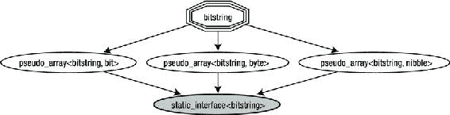
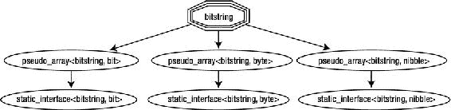

# 五、接口

模板以两种不同的方式用作接口:提供原子函数集和获得*编译时多态性* 。

如果几个函数使用一个对象接口的同一个部分，你可以在一个模板中把它们分解出来:

```cpp
void do_something(std::vector<double>& v)
{
   if (v.empty())
      // ...

   ... v.size();

   for_each(v.begin(), v.end(), my_functor());
   ...
}

void do_something(std::list<double>& L)
{
   if (L.empty())
      // ...

   ... L.size();

   for_each(L.begin(), L.end(), my_functor());
   ...
}
```

变成:

```cpp
template <typename T>
void do_something(T& L)
{
   if (L.empty())
      // ...

   ... L.size();

   for_each(L.begin(), L.end(), my_functor());
   ...
}
```

当您遵循容器(如 1.4 节所列)的通用指南时，这种代码统一会更简单。

如有必要，如 3.4.3 节所述，您可以将对*成员*函数的调用替换为对小型*全局*函数的调用。假设您有第三个 do_something，它执行一个稍微不同的测试:

```cpp
void do_something(MyContainer<double>& M)
{
   if (M.size() == 0)
   ...
```

最好将“空性”的测试隔离在不同的函数中:

```cpp
template <typename T>
bool is_empty(const T& c)
{
   return c.empty();
}

template <typename T>
bool is_empty(const MyContainer<T>& c)
{
   return c.size() == 0;
}

template <typename T>
void do_something(T& L)
{
   if (is_empty(L))
    ...
```

5.1.包装参考文献T2】

类模板及其专门化可以用来使接口统一:

```cpp
class Dog
{
   public:
      void bark();
      void go_to_sleep();
};

class Professor
{
   public:
      void begin_lesson();
      void end_lesson();
};

template <typename T>
class Reference
{
   T& obj_;

public:
   Reference(T& obj) : obj_(obj) {}
   void start_talking() { obj_.talk(); }
   void end_talking() { obj_.shut(); }
};

template <>
class Reference<Dog>
{
   Dog& obj_;

public:
   Reference(Dog& obj) : obj_(obj) {}

   void start_talking() { for (int i=0; i<3; ++i) obj_.bark(); }
   void end_talking() { obj_.go_to_sleep(); }
};

template <>
class Reference<Professor>
{
   Professor& obj_;

public:
   Reference(Professor& obj) : obj_(obj) {}

   void start_talking() { obj_.begin_lesson(); }
   void end_talking() { obj_.end_lesson(); }
};
```

注意，包装器可能确实包含一些逻辑。最后:

```cpp
template <typename T>
void DoIt(T& any)
{
   Reference<T> r(any);
   r.start_talking();
   // ...
   r.end_talking();
}
```

5.2.静态接口

当函数模板操作未指定类型 T 的对象时，它实际上强制该对象实现一个接口。例如，这个非常简单的函数包含许多关于所涉及的(未知)类型的隐藏假设:

```cpp
template <typename iter1_t, typename iter2_t>
iter2_t copy(iter1_t begin, const iter1_t end, iter2_t output)
{
   while (begin != end)
      *(output++) = *(begin++),

   return output;
}
```

这里 iter1_t 和 iter2_t 必须有一个复制构造函数，叫做 operator++(int)。iter1_t 也需要运算符！=.此外，每个 operator++ 返回一个可取消引用的实体，在 iter2_t 的情况下，最终结果是一个 l 值，其赋值盲目接受*(begin++)返回的任何内容。

简而言之，模板代码假装所有指令都编译了，直到编译器可以证明它们没有编译。

一般来说，在类型接口上列出假设太冗长和/或通常没有用。在前面的例子中，iter1_t::operator++ 可能会返回 iter1_t，它也实现了 operator*，但不需要*完全是*这种情况(例如，如果 iter1_t::operator++ 返回了 int*，copy 也可以工作)。

因此，您必须尝试明确列出模板参数必须满足的*概念* 的最小集合。非正式地说，概念是对类型的一个要求，它意味着 C++ 语句是合法的，不管它的实现如何。 [<sup class="calibre7">1</sup>](#Fn1)

例如，这个对象将愉快地扮演 iter2_t 的角色:

```cpp
struct black_hole_iterator
{
   const black_hole_iterator& operator++ () const
   {
      return *this;
   }

   const black_hole_iterator& operator++ (int) const
   {
      return *this;
   }

   const black_hole_iterator& operator* () const
   {
      return *this;
   }

   template <typename T>
   const black_hole_iterator& operator= (const T&) const
   {
      return *this;
   }
};
```

这里满足了“运算符 *返回的对象必须是 l 值”的概念，即使是以一种不寻常的方式(赋值不修改黑洞)。

通常，您不会列出任何通用函数的确切概念。然而，一些概念集有一个标准的名称，所以只要有可能，你就会采用它，即使它是实际需要的超集。

在前面的复制模板中，最好使用一个*输入迭代器* 和一个*输出迭代器* ，因为这些是标识概念(超)集的最小的众所周知的标签。正如你将在[第 6 章](06.html)中读到的，一个真正的输出迭代器满足更多的属性(例如，它必须提供一些 typedefs，这在这里是不相关的)；然而，对于可重用性来说，这是一个合理的价格。 [<sup class="calibre7">2</sup>](#Fn2)

模板代码的作者通常需要明确概念。如果它们有一个简单的名称，它们可以用作模板参数:

```cpp
template <typename FwdIter, typename RandIter>
FwdIter special_copy(RandIter beg, RandIter end, FwdIter output);
```

注意，在这个函数中，除了名字(这是对人类的提示，而不是对编译器的提示)，没有任何约束要求成为迭代器。模板参数 FwdIter 将匹配*任何东西*，比如 double 或 void*，如果幸运的话，函数体将报告错误。可能会发生这样的情况:您传递了一个有效的类型，但它的行为并不像预期的那样。[T33](#Fn3)

另一方面，经典 C++ 确实提供了一个约束类型的工具:继承。您编写了接受 BASE*的代码片段，在运行时它们调用正确的虚函数。

静态接口是它们在 TMP 中的等价物。它们提供了比“扁平”类型 T 更少的通用性，但是具有相同级别的静态优化。

一个*静态接口*是一个骨架类，它将模板的有效范围限制在从接口派生的类型，同时它提供了“虚拟”回调机制的默认(静态)实现。

细节如下。

5.2.1.静态接口

最初的语言习惯被称为“奇怪地重复出现的模板”模式( *CRTP* ) )，它基于以下观察:static_cast 可以仅使用编译时信息遍历类层次结构。简单来说，static_cast 可以将 BASE*转换为 DERIVED*。如果 DERIVED 和 BASE 之间的继承关系不正确或不明确，强制转换将不会编译。但是，只有在运行时 BASE*指向一个真正的派生对象时，结果才有效。

作为一个特例，有一个简单的方法来确保演员会成功；也就是说，当每个派生类 从一个“个人基”继承时:

```cpp
template <typename DERIVED_T>
class BASE
{
   protected:
      ~BASE() {}
};

class DERIVED1 : public BASE<DERIVED1>
{
};

class DERIVED2 : public BASE<DERIVED2>
{
};
```

类型为 BASE <t>的对象肯定是 T 的基类，因为由于受保护的析构函数，除了派生类之外，没有人可以创建 BASE < T >，并且只有 T 本身从 BASE < T >派生。</t>

因此 BASE <t>可以将自己转换为 T 并调用函数:</t>

```cpp
template <typename DERIVED_T>
struct BASE
{
   DERIVED_T& true_this()
   {
      return static_cast<DERIVED_T&>(*this);
   }

   const DERIVED_T& true_this () const
   {
      return static_cast<const DERIVED_T&>(*this);
   }

   double getSomeNumber() const
   {
      return true_this().getSomeNumber();
   }
};

struct DERIVED_rand : public BASE<DERIVED_rand>
{
   double getSomeNumber() const
   {
      return std::rand();
   }
};

struct DERIVED_circle : public BASE<DERIVED_circle>
{
   double radius_;

   double getSomeNumber() const
   {
      return 3.14159265359 * sq(radius_);
   }
};
```

就像虚函数一样，通过派生类接口的普通调用是廉价的:

```cpp
DERIVED_rand d;
d.getSomeNumber();         // normal call; BASE is completely ignored
```

但是，您可以编写一个函数模板，它采用一个对基的引用 ，并对派生的成员函数进行一次廉价的调用。true _ 这不会产生任何开销。

```cpp
template <typename T>
void PrintSomeNumber(BASE<T>& b)      // crucial: pass argument by reference
{
   // here BASE methods will dispatch to the correct T equivalent
   std::cout << b.getSomeNumber();
}

DERIVED_circle C;
DERIVED_rand R;
...
PrintSomeNumber(C); // prints the area of the circle
PrintSomeNumber(R); // prints a random number
```

从概念上讲，前面的函数与这里更简单(但更模糊)的函数相同:

```cpp
template <typename T>
void PrintSomeNumber(T& b)
{
   std::cout << b.getSomeNumber();
}
```

然而，替换看起来是可以接受的，因为 PrintSomeNumber 是一个命名函数，而不是一个操作符(想想用两个 T 类型的参数写一个全局操作符+)。下面的示例演示如何使用带有运算符的静态接口。 [<sup class="calibre7">4</sup>](#Fn4) 它将只实现 operator+=并免费拥有 operator+,简单地从 summatable<中导出...>界面 。

```cpp
template <typename T>
struct summable
{
   T& true_this()
   {
      return static_cast<T&>(*this);
   }

   const T& true_this () const
   {
      return static_cast<const T&>(*this);
   }

   T operator+ (const T& that) const
   {
       T result(true_this());
       result += that;       // call dispatch to native T::operator+=
       return result;
   }
};

struct complex_number : public summable<complex_number>
{
   complex_number& operator+= (const complex_number& that)
   {
      ...
   }
};

complex_number a;
complex_number b;
...
complex_number s = a+b;
```

(看起来很简单)最后一行执行下面的编译时步骤 :

*   a 没有自己的运算符+，所以将 a 强制转换为它的基，即 const summable <complex_number>&。</complex_number>
*   const sumtable<complex_number>&可以求和为一个复数，所以 b 照原样就可以了。</complex_number>
*   summable <complex_number>::operator+构建一个名为 result 的复数，它是 true_this 的副本，因为 true_this 是一个复数。</complex_number>
*   将执行分派给 complex_number::operator+=，计算并返回结果。

请注意，您可以将基类 重写为:

```cpp
template <typename T>
struct summable
{
   // ...

   T operator+ (const summable<T>& that) const
   {
       T result(true_this());
       result += that.true_this();
       return result;
   }
};
```

让我们称*接口*为基类，称*专门化*为派生类。

5.2.2.常见错误

您刚刚遇到了一种情况，接口类制作了自己的专用副本:

```cpp
T result(true_this());
```

这不是问题，因为接口是静态的，它知道自己的“真实类型”。

但是，true_this 的正确行为可以被*切片*破坏:

```cpp
template <typename DERIVED_T>
void PrintSomeNumber(BASE<DERIVED_T> b)// argument by value
{
   std::cout << b.getSomeNumber();     // error: slicing
                                       // b is not a DERIVED_T any more
}
```

通常，有必要将基析构函数声明为非虚拟的和受保护的，有时将保护扩展到复制构造函数是个好主意。算法不需要复制静态接口。如果他们需要克隆对象，正确的习惯用法是调用 DERIVED_T 构造函数并传递 true_this()，如前所示。

```cpp
template <typename DERIVED_T>
struct BASE
{
   DERIVED_T& true_this()
   {
      return static_cast<DERIVED_T&>(*this);
   }

   const DERIVED_T& true_this() const
   {
      return static_cast<const DERIVED_T&>(*this);
   }

protected:
   ~BASE()
   {
   }

   BASE(const BASE&)
   {
   }
};
```

派生的接口仅在基成员函数体内可见:

```cpp
template <typename DERIVED_T>
struct BASE
{
   // ...

   typedef DERIVED_T::someType someType;       // compiler error

   void f()
   {
      typedef DERIVED_T::someType someType;    // ok here
   }
};

class DERIVED : public BASE<DERIVED>
{
   ....
```

派生的 Typedefs 和 enums 在 BASE 中的类级别不可用。这是显而易见的，因为 DERIVED 是在其 base 之后编译的，也就是 BASE <derived>。当 BASE <derived>被处理时，DERIVED 是已知的，但是仍然不完整。</derived></derived>

让 BASE 为 DERIVED_T 公开一个 typedef 是一个好主意(不是错误)，这允许外部函数制作一个专门的 BASE 副本。

```cpp
template <typename DERIVED_T>
struct BASE
{
   typedef DERIVED_T static_type;
```

但是，如果没有完全限定，DERIVED 不能访问基成员，因为模板基类超出了派生对象的范围。 [<sup class="calibre7">5</sup>](#Fn5)

```cpp
template <typename DERIVED_T>
struct BASE
{
   typedef double value_type;

   value_type f() const
   {
      return true_this().f();
   }

   // ...
};

struct DERIVED1 : public BASE<DERIVED1>
{
   value_type f() const       // error: value_type is undefined
   {
      true_this();            // error: true_this is undefined
      return 0;
   }
};

struct DERIVED2 : public BASE<DERIVED2>
{
   BASE<DERIVED2>::value_type f() const    // ok
   {
      this->true_this();                   // ok
      return 0;
   }
};
```

再次注意，范围限制只在类的“内部”有效。外部用户将正确看到 DERIVED1::value_type:

```cpp
template <typename T>
struct value_type_of
{
   typedef typename T::value_type type;
};

value_type_of<DERIVED1>::type Pi = 3.14;      // ok, Pi has type double
```

最后，开发人员必须确保所有派生类都向基类正确地声明了它们的名称，以避免经典的复制和粘贴错误:

```cpp
class DERIVED1 : public BASE<DERIVED1>
{
};

class DERIVED2 : public BASE<DERIVED1>
{
};
```

| 

利益

 | 

问题

 |
| --- | --- |
| 编写采用“不太普通的对象”的算法，并通过静态已知的接口使用它们。 | 开发人员必须确保所有算法都通过引用获取参数，并避免其他常见错误。 |
| 仅实现派生(专用)类中的部分代码，并移动基类中的所有公共代码。 | 实验测量表明，非虚拟受保护析构函数和多重继承的存在可能会抑制或降低代码优化。 |

5.2.3.静态接口实现

以前的许多观念可以归入 一类:

```cpp
template <typename T>
struct clone_of
{
   typedef const T& type;
};

template <typename static_type, typename aux_t = void>
class static_interface
{
public:
   typedef static_type type;

   typename clone_of<static_type>::type clone() const
   {
      return true_this();
   }

protected:
   static_interface() {}
   ~static_interface() {}

   static_type& true_this()
   {
      return static_cast<static_type&>(*this);
   }

   const static_type& true_this() const
   {
      return static_cast<const static_type&>(*this);
   }
};
```

在这一章的后面，你将回到额外的模板参数。

助手元函数 clone_of 可以定制，返回常量引用是一个合理的默认选择。对于小对象，返回副本可能会更快:

```cpp
template <typename T, bool SMALL_OBJECT = (sizeof(T)<sizeof(void*))>
struct clone_of;

template <typename T>
struct clone_of<T, true>
{
   typedef T type;
};

template <typename T>
struct clone_of<T, false>
{
   typedef const T& type;
};
```

首先，您可以使用一些宏来简化接口声明 。

接口的定义如下

```cpp
#define MXT_INTERFACE(NAME)                           \
                                                      \
template <typename static_type>                       \
class NAME : public static_interface<static_type>

#define MXT_SPECIALIZED      this->true_this()
```

这里有一个实际的例子。接口宏 类似于普通的类声明。 [<sup class="calibre7">6</sup>](#Fn6)

```cpp
MXT_INTERFACE(random)
{
protected:

   ~random()
   {
   }

public:
   typedef double random_type;

   random_type max() const
   {
      return MXT_SPECIALIZED.max();
   }

   random_type operator()() const
   {
      return MXT_SPECIALIZED();   // note operator call
   }
};
```

*   random 只能通过显式限定来访问 true_this()(就像 MXT_SPECIALIZED 那样)。
*   random 需要声明一个受保护的析构函数。
*   static_type 在 random 中是一个有效的类型名，即使 static_interface 超出了范围，因为它是模板参数名。

现在让我们实现一些随机算法 :

```cpp
#define MXT_SPECIALIZATION(S, I)               class S : public I< S >

MXT_SPECIALIZATION(gaussian, random)
{
   public:

      double max() const
      {
         return std::numeric_limits<double>::max();
      }

      double operator()() const
      {
         // ...
      }
};

MXT_SPECIALIZATION(uniform, random)
{
   public:

      double max() const
      {
         return 1.0;
      }

      // ...
};
```

如果你需要一个模板 静态接口，比如:

```cpp
template <typename RANDOM_T, typename SCALAR_T>
class random
{
   public:
      typedef SCALAR_T random_type;

      // ...
};

template <typename T>
class gaussian : public random<gaussian<T>, T>
{
   // ...
};
```

很容易为模板静态接口提供更多的宏(带有少量参数)。一个天真的想法是:

```cpp
#define MXT_TEMPLATE_INTERFACE(NAME,T)                \
                                                      \
template <typename static_type, typename T>           \
class NAME : public static_interface<static_type>

#define MXT_TEMPLATE_SPECIALIZATION(S,I,T)            \
                                                      \
template <typename T>                                 \
class S : public I< S<T> >
```

它是这样使用的:

```cpp
MXT_TEMPLATE_INTERFACE(pseudo_array, value_t)
{
protected:

   ~pseudo_array()
   {
   }

public:
   typedef value_t value_type;

   value_type operator[](const size_t i) const
   {
      return MXT_SPECIALIZED.read(i, instance_of<value_type>());
   }

   size_t size() const
   {
      return MXT_SPECIALIZED.size(instance_of<value_type>());
   }
};
```

非模板类可以使用模板静态接口。例如，您可以拥有一个行为类似于位数组、半字节数组或字节数组的 bitstring 类 :

```cpp
typedef bool bit;
typedef char nibble;
typedef unsigned char byte;

class bitstring
: public pseudo_array<bitstring, bit>
, public pseudo_array<bitstring, nibble>
, public pseudo_array<bitstring, byte>
{
    ...
```

一个接口不需要像真正的专门化那样尊重相同的成员名。在这种情况下，operator[]将执行分派给函数模板 read。这是有意义的，因为底层的 bitstring 可以以多种方式读取位置 I 处的元素(有三个不同的第 I 个元素)。但是在 pseudo_array 内部，要检索的类型是静态已知的，所以使用一个 bitstring 作为 pseudo_array 相当于“切片”了 bitstring 接口。这使得代码更加简单。

您需要解决的第一个问题是，当宏展开时，编译器会读取:

```cpp
template <typename static_type, typename value_t>
class pseudo_array : public static_interface<static_type>
```

因此，bitstring 从 static_interface <bitstring>继承了多次，这将使 true_this 中的 static_cast 不明确。</bitstring>



图 5-1。不明确的继承图

为了避免这个问题，在静态接口中使用一个额外的参数来消除歧义。最明确的类型名不是 T 就是整个接口(pseudo_array <bitstring t="">)。宏变成:</bitstring>

```cpp
#define MXT_TEMPLATE_INTERFACE(NAME,T)                \
                                                      \
template <typename static_type, typename T>           \
class NAME                                            \
: public static_interface<static_type, NAME<static_type, T> >

#define MXT_TEMPLATE_SPECIALIZATION(S,I,T)               \
                                                         \
template <typename T>                                    \
class S : public I< S<T>, T >
```



图 5-2。改进的继承图

5.2.4.会员空间问题

到目前为止，静态接口被描述为限制某些模板参数范围的技术。所以不用 F(T)，你写 F(random <t>)，这里 T 是一个随机生成器的特殊实现。如果 F 确实是一个(全局)运算符，这一点尤其有用。</t>

静态接口的第二个应用是*成员空间*问题。[<sup class="calibre7">7</sup>](#Fn7)member space 这个名字相当于一个名称空间，相对于一个类的成员函数。换句话说，它是一个子空间，一个类可以在其中放置重名的成员函数。

假设 C 是一个遵循 STL 约定的容器，那么 C 的第一个元素是*begin()，最后一个是*rbegin()。

这是划分接口的经典解决方案，其中函数名具有唯一的前缀/后缀，例如 push+front、push+back、r+begin 等等。

最好有一个真正的分区，前后都是容器，有自己的接口: [<sup class="calibre7">8</sup>](#Fn8)

```cpp
C MyList;
// ...

first = MyList.front.begin();
last  = MyList.back.begin();

MyList.front.push(3.14);
MyList.back.push(6.28);
MyList.back.pop();
```

的确，你可以使用静态接口来编写代码，比如: [<sup class="calibre7">9</sup>](#Fn9)

```cpp
class bitstring
: public pseudo_array<bitstring, bit>
, public pseudo_array<bitstring, nibble>
, public pseudo_array<bitstring, byte>
{
   char* data_;
   size_t nbits_;

public:
   pseudo_array<bitstring, bit>& as_bit() { return *this; }
   pseudo_array<bitstring, nibble>& as_nibble() { return *this; }
   pseudo_array<bitstring, byte>& as_byte() { return *this; }

   size_t size(instance_of<byte>) const { return nbits_ / CHAR_BIT; }
   size_t size(instance_of<bit>) const { return nbits_; }
   size_t size(instance_of<nibble>) const { return nbits_ / (CHAR_BIT / 2); }

   bit read(size_t n, instance_of<byte>) const { return ...; }
   nibble read(size_t n, instance_of<bit>) const { return ...; }
   byte read(size_t n, instance_of<nibble>) const { return ...; }
};

bitstring b;

int n1 = b.as_bit().size();
int n2 = b.as_byte().size();
```

与之相比:

```cpp
bitstring b;

int n1 = b.size(instance_of<bit_tag>());
```

b.as_bit()本身也是一种容器，它可以通过引用算法来传递:

```cpp
template <typename T, typename X>
X parity(pseudo_array<T, X>& data)
{
   X result = 0;
   for (size_t i=0; i<data.size(); ++i)
      result ^= data[i];

   return result;
}
```

这种技术非常好，但是它有一个局限性。如上所述，专门化中提供的 typedef *在静态接口*中不可用，因此您无法声明返回迭代器的成员函数。这是因为静态接口必须从专门化中借用迭代器类型。

```cpp
MXT_INTERFACE(front)
{
   typename static_type::iterator begin()        // <-- error here
   {
      return MXT_SPECIALIZED.begin();
   }

   typename static_type::iterator end()          // <-- error again
   {
      return MXT_SPECIALIZED.end();
   }
};

MXT_INTERFACE(back)
{
   typename static_type::reverse_iterator begin() // <-- another error
   {
      return MXT_SPECIALIZED.rbegin();
   }

   typename static_type::reverse_iterator end()   // <-- lots of errors
   {
      return MXT_SPECIALIZED.rend();
   }
};

class C : public front<C>, public back<C>
{
   // ...

public:

   front<C>& front()
   { return *this; }

   back<C>& back()
   { return *this; }

};

C MyList;
MyList.front().begin();     // error
MyList.back().begin();      // error
// ...
```

注意，这不是语法问题。由于 C 还不完整，C::iterator 还不存在。然而，有一些*设计*修复:

*   在 C 之前定义迭代器:

```cpp
class C_iterator
{
   // ...
};

class C
{
   // container implementation

   typedef C_iterator iterator;
};
```

*   在 C 和接口之间插入一个附加层，以便静态接口在 C 之后(包装类之前)编译:

```cpp
class C
{
   // container implementation

   class iterator { ... };
};

MXT_TEMPLATE_INTERFACE(front, impl_t)
{
   typename impl_t::iterator begin()
   {
      return MXT_SPECIALIZED.begin();
   }

   typename impl_t::iterator end()
   {
      return MXT_SPECIALIZED.end();
   }
};

// ...

class C_WRAPPER : public front<C_WRAPPER, C>, public back<C_WRAPPER, C>
{
   C c_;

public:
   // reproduce C's interface
   // dispatch all execution to c_

   typename C::iterator begin()
   {
      return c_.begin();
   }

   // ....
};
```

5.2.5.成员选择

用于合并特征的相同技术(参见 4.2.4 节)可以成功地应用于值对象。下一个故意不完整的列表暗示了一个可能的动机:

```cpp
enum
{
   empty    = 0,
   year     = 1,
   month    = 2,
   day      = 4,
   // ...
};

template <unsigned CODE> struct time_val;

template <> struct time_val<empty> { }; // empty, I really mean it 
template <> struct time_val<year>  { int year; };
template <> struct time_val<month> { short month; };

// ...

template <unsigned CODE>
struct time_val
: public time_val<CODE & static_highest_bit<CODE>::value>
, public time_val<CODE – static_highest_bit<CODE>::value>
{
};

// an algorithm

template <unsigned CODE>
time_val<(year | month | day)> easter(const time_val<CODE>& t)
{
   time_val<(year | month | day)> result;

   result.year = t.year;
   result.month = compute_easter_month(t.year);
   result.day = compute_easter_day(t.year);

   return result;
}

   time_val<year | month> tv1;
   time_val<month | day> tv2;

   easter(tv1);   // ok.
   easter(tv2);   // error: tv2.year is undefined.
```

请注意，该算法无条件地运行，就好像任何 time_val `都有成员年份一样。必要时，您可以使用包装器隔离这种假设:`

```cpp
template <unsigned CODE>
time_val<year | month | day> easter(const time_val<CODE>& t, selector<true>)
{
   // implementation
}

template <int CODE>
time_val<year | month | day> easter(const time_val<CODE>& t, selector<false>)
{
   // put whatever here: throw exception, static assert...
}

template <int CODE>
time_val<year | month | day> easter(const time_val<CODE>& t)
{
   return easter(t, selector<CODE & year>());
}
```

5.3.类型隐藏

经典的 C++ 程序将对象的实例转换成可能具有不同类型的其他实例(通过函数调用)。

```cpp
int i = 314;
double x = f(i);   // transform an instance of int into an instance of double
```

使用模板，C++ 可以操作实例、编译时常数和类型(常数在中间，因为它们与两者共享一些属性)。您可以将类型和常量转换为实例(一般而言)，将类型转换为类型(通过 traits 和元函数)，将类型转换为常量(通过元函数和其他运算符，如 sizeof)，将实例转换为常量(通过 sizeof)，将类型转换为一些特殊的系统对象(使用 typeid)。然而，经典 C++ 只有非常有限的语言工具来将实例转换成类型。[<sup class="calibre7">10</sup>T3】](#Fn10)

最常见的例子来自迭代器处理:

```cpp
T t = *begin;     // store a copy of the first element
                  // who is T?
```

目前，元函数提供了一个合适的类型:

```cpp
typename std::iterator_traits<iterator_t>::value_type t = *begin;
```

最简单的方法是将*begin 作为一个未使用的伪参数传递给一个模板函数，该函数将推断出它的类型:

```cpp
template <typename iterator_t>
void f(iterator_t beg, iterator_t end)
{
   if (beg == end)
      return;

   f_helper(beg, end, *beg);
}

template <typename iterator_t, typename value_t>
void f_helper(iterator_t beg, iterator_t end, const value_t& )
{
 // for most iterators,
 // value_t ~ iterator_traits<iterator_t>::value_type

 // however if *beg returns a proxy, value_t is the type of the proxy
 // so this may not work with std::vector<bool> and in general,
 // where value_t just stores a reference to the value.
}
```

在经典 C++ 中，有两种方法可以在不知道对象类型的情况下存储对象:

*   将它传递给一个模板函数，如前所示。但是，对象的寿命是有限的。
*   取消它的接口，可能通过模板和虚函数的组合。在最简单的情况下，对象可以是仅仅被存储的*而不是别的: [<sup class="calibre7">11</sup>](#Fn11)*

```cpp
class wrapper_base
{
   public:
      virtual ~wrapper_base() {}

      virtual wrapper_base* clone() const = 0;
};

template <typename T>
class wrapper : public wrapper_base
{
      T obj_;

   public:
      wrapper(const T& x)
      : obj_(x) {}

      wrapper<T>* clone() const
      {
         return new wrapper<T>(obj_);
      }
};

template <typename T>
wrapper_base* make_clone(const T& x)
{
   return new wrapper<T>(x);
}
```

有时需要为几种类型提供一个公共接口。最著名的例子是由*variantobjects**(也称为**discribed union**)*给出的，它们是静态类型固定，但内部存储可以传输不同类型的类。

本节的其余部分将详细讨论命令行解析的问题。假设您正在编写一个从命令行获取选项的工具。每个选项都有一个名称和一个固定类型的关联值。选项第一，其他都是论证:

```cpp
tool.exe –i=7 –f=3.14 –d=6.28 –b=true ARGUMENT1 ARGUMENT2 ... ARGUMENTn
```

其中 I 是 int，f 是 float，依此类推。

理想情况下，您需要一种映射<string t="">，其中 T 可以因每对而异。此外，您应该能够在这样的映射中查询具有正确类型的值，这样您就可以接受-f=3.14，但拒绝-f="hello world "。</string>

为了更加简单，假设您从一个字符串数组开始，其中每个字符串或者是[前缀][名称]或者是[前缀][名称]=[值]， [<sup class="calibre7">12</sup>](#Fn12) ，并且每个参数值将通过流提取(运算符> >)获得。

您可以生产两个容器。第一个名为 option_map ，存储名称-值对，比如 std::map，但是每个值都有一个任意的类型。名为 option_parser 的第二个容器是另一个映射，它在解析命令行之前知道所需的配对名称类型(例如，“f”是一个浮点数)。目标是编写如下代码:

```cpp
int main(int argc, char* argv[])
{
   option_parser PARSER;

   PARSER.declare_as<float>("f"); // we tell the parser what it should
   PARSER.declare_as<int>("i");   // expect, i.e. that "d" is a double,
   PARSER.declare_as<double>("d");// etc. etc.

   option_map<std::string> CL;    // only key_type is a template parameter

   try
   {
      const char* prefix = "–";

      char** opt_begin = argv+1;
      char** opt_end   = argv+argc;

      // finally we ask the parser to fill a map with the actual values
      // this may throw an exception...

      char** arg_begin = PARSER.parse(CL, opt_begin, opt_end, prefix);

      double d;
      if (!CL.get(d, "d"))
      {
         // the user did not specify a value for "d"
         d = SOME_DEFAULT_VALUE;
      }

   }
   catch (std::invalid_argument& ex)
   {
      // ...
   }
}
```

5.3.1.蹦床

这种“多态性”的核心技术是使用*蹦床* 。

形式上，trampoline 是一个函数模板中的局部类，但是“局部”的含义不应该从字面上理解。

该类只有静态成员函数。它的公共接口接受固定类型的参数(比如 void*)，但是嵌套在模板中，trampoline 的主体知道“外部”模板参数，并使用它来执行安全的静态强制转换。

下面是一个简单的例子——一个包含无类型指针的裸结构和一个知道对象静态类型并明显丢失信息的函数模板。

```cpp
struct generic_t
{
   void* obj;
   void (*del)(void*);
};

template <typename T>                  // outer template parameter
generic_t copy_to_generic(const T& value)
{
   struct local_cast                   // local class
   {
      static void destroy(void* p)     // void*-based interface
      {
         delete static_cast<T*>(p);    // static type knowledge
      }
   };

   generic_t p;
   p.obj = new T(value);          // information loss: copy T* to void*
   p.del = &local_cast::destroy;

   return p;
}
```

实际上，只有 p.obj 不知道如何销毁它附加的对象，但是 p.del 指向(在伪代码中)copy _ to _ generic<t>::local _ cast::destroy，这个函数将做正确的事情，即在删除它之前将 void*强制转换回 T*。</t>

```cpp
p.del(p.obj);                           // it works!
```

del 在功能上相当于虚拟析构函数。蹦床和虚拟功能表之间的类比是正确的，但是:

*   蹦床技术允许你处理*对象*，而不是*指针*(一个经典的工厂会返回指向基的指针，而 copy_to_generic 产生一个对象)。
*   蹦床指针可以在运行时测试和修改。例如，如果指针的所有权被转移，del 可以在任何时候被一个什么都不做的函数替换。
*   蹦床比抽象的类层次结构更不清晰(也就是说，更难维护)。

像 generic_t 这样的结构的优点是，它们的类型是静态已知的，所以它们可以用在标准容器中，它们是类，所以它们可以管理自己的资源和不变量。

不幸的是，虽然类型 T 在内部被称为*，但它不能被公开。像 del 这样的函数指针在它们的签名中不能有 T。trampoline 类的接口必须独立于 T，并且不能有模板成员函数(例如，不能有一个 trampoline 成员接受一个仿函数并将其应用于指针对象)。*

 *接下来，您需要另一个工具——STD::type _ info 的包装器。

5.3.2.Typeinfo 包装器

typeid 运算符是一个不太为人所知的 C++ 运算符，它在运行时确定表达式的类型，并返回对 std::type_info 类型的系统对象的常量引用。

type_info::before 是一个成员函数，可用于模拟类型的总体(但未指定)排序。

已经提出了几个包装器来给出 std::type_info 值语义。这段代码类似于[1]中的优雅实现，但是比较运算符确保默认构造的(null) typeinfo 小于任何其他实例。 [<sup class="calibre7">十三</sup>](#Fn13)

```cpp
class typeinfo
{
   const std::type_info* p_;

public:
   typeinfo()
      : p_(0)
   {}

   typeinfo(const std::type_info& t)
      : p_(&t)
   {}

   inline const char* name() const
   {
      return p_ ? p_->name() : "";
   }

   inline bool operator<(const typeinfo& that) const
   {
      return (p_ != that.p_) &&
         (!p_ || (that.p_ && static_cast<bool>(p_->before(*that.p_))));
   }

   inline bool operator==(const typeinfo& that) const
   {
      return (p_ == that.p_) ||
         (p_ && that.p_ && static_cast<bool>(*p_ == *that.p_));
   }
};
```

5.3.3.选项 _ 地图

回想一下，option_map 是在 5.3 节中引入的，作为一个容器来存储从命令行解析的值及其类型。option_map 的界面确实非常简单。

```cpp
template <typename userkey_t>
class option_map
{
public:
// typed find:
// MAP.find<T>("name") returns true
// if "name" corresponds to an object of type T

   template <typename T>
   bool find(const userkey_t& name) const;

// typeless find:
// MAP.scan("name") returns true if "name" corresponds to any object

   bool scan(const userkey_t& name) const;

// checked extraction:
// MAP.get(x, "name") returns true
// if "name" corresponds to an object of type T;
// in this case, x is assigned a copy of such object;
// otherwise, x is not changed

   template <typename T>
   bool get(T& dest, const userkey_t& name) const;

// unchecked extraction:
// MAP.get<T>("name") returns either the object of type T
// corresponding to "name", or T().

   template <typename T>
   T get(const userkey_t& name) const;

// insertion
// MAP.put("name", x) inserts a copy of x into the map

   template <typename T>
   bool put(const userkey_t& name, const T& value);

   size_t size() const;

   ~option_map();
};
```

现在来看实现细节 generic _ t 的思想得到了进一步的发展，赋予了它复制和销毁的能力:

```cpp
template <typename userkey_t>
class option_map
{
   struct generic_t
   {
      void* obj;
      void (*copy)(void* , const void*);
      void (*del)(void*);
   };
```

因为您希望通过名称和对(名称、类型)来搜索容器，所以您应该使用 typeinfo 包装类选择后一种结构作为键。

```cpp
typedef std::pair<userkey_t, typeinfo> key_t;
typedef std::map<key_t, generic_t> map_t;
typedef typename map_t::iterator iterator_t;

map_t map_;
```

插入例程几乎与原型示例相同:

```cpp
template <typename T>
bool put(const userkey_t& name, const T& value)
{
   struct local_cast
   {
      static void copy(void* dest, const void* src)
      {
         *static_cast<T*>(dest) = *static_cast<const T*>(src);
      }

      static void destroy(void* p)
      {
         delete static_cast<T*>(p);
      }
   };

   generic_t& p = map_[key_t(name, typeid(T))];

   p.obj = new T(value);
   p.copy = &local_cast::copy;
   p.del = &local_cast::destroy;

   return true;
}
```

std::map 顶部的一些函数是免费的:

```cpp
size_t size() const
{
   return map_.size();
}
```

以下是键入的查找结果:

```cpp
template <typename T>
bool find(const userkey_t& name) const
{
   return map_.find(key_t(name, typeid(T))) != map_.end();
}
```

要从 option_map 中检索数据，可以使用 copy 函数。首先，你做一个输入查找。如果成功并且对象为非空，则对用户提供的引用执行复制:

```cpp
template <typename T>
bool get(T& dest, const userkey_t& name) const
{
   const typename map_t::const_iterator i = map_.find(key_t(name, typeid(T)));

   const bool test = (i != map_.end());
   if (test && i->second.obj)
      i->second.copy(&dest, i->second.obj);

   return test;
}
```

未检查的检索是为了方便而实现的快捷方式:

```cpp
template <typename T>
T get(const userkey_t& name) const
{
   initialized_value<T> v;
   get(v.result, name);
   return v.result;
}
```

此时，您只需让析构函数清除所有对象。 [<sup class="calibre7">14</sup>](#Fn14)

```cpp
~option_map()
{
   iterator_t i = map_.begin();
   while (i != map_.end())
   {
      generic_t& p = (i++)->second;
      if (p.del)
         p.del(p.obj);
   }
}
```

最后，您可以利用 typeinfo 的排序属性进行无类型查找。由于对的排序方式，映射按名称排序，同名的条目按 typeinfo 排序。首先，搜索(name，typeinfo())的上界。任何其他同名的对都会更大，因为 typeinfo()是最不可能的值。因此，如果上限存在，并且与您要查找的名称相同，它将返回 true。

```cpp
bool scan(const userkey_t& name) const
{
   const typename map_t::const_iterator i
      = map_.upper_bound(key_t(name, typeinfo()));

   return i != map_.end() && i->first.first == name;
}
```

注意，容器可以保存更多不同类型的同名对象。

5.3.4.选项 _ 解析器

没有完整描述 option_parser，因为它没有为构建 option_map 中使用的概念添加任何内容。但是，请注意，蹦床可能有类型不是 void*的参数。我们把一些细节留给练习。

```cpp
class option_parser
{
  typedef option_map<std::string> option_map_t;
  typedef bool (*store_t)(option_map_t&, const char*, const char*);

  typedef std::map<std::string, store_t> map_t;
  map_t map_;

public:

  template <typename T>
     void declare_as(const char* const name)
  {
    struct local_store
    {
      static bool store(option_map_t& m,
                        const char* name, const char* value)
      {
        std::istringstream is(value);
        T temp;
        return (is >> temp) && m.put(name, temp);
      }
    };

    map_[name] = &local_store::store;
  }
```

请注意，local_store::store 不接受 void*参数。蹦床唯一的要求就是发布一个独立于 t 的接口。

```cpp
template <typename iterator_t>
iterator_t parse(option_map_t& m, iterator_t begin, iterator_t end)
{
  for every iterator i=begin...end
  {
     get the string S = *i;
     if S has no prefix
         stop and return i;
     else
         remove the prefix

     if S has the form "N=V"
         split S in N and V
     else
         set N = S
         set V = <empty string>

     if N is not contained in map_
         throw exception "unknown option"
     else
         set F := local_store::store
         execute F(m, N, V)
         if it fails, throw exception "illegal value"
  }
}
```

5.3.5.最终添加

由于 declare_as 的工作方式，可以从字符串流中提取的每种类型在命令行解析器中都是可以接受的。

要包含无参数选项，只需添加一个空类:

```cpp
struct option
{
};

inline std::istream& operator>>(std::istream& is, option&)
{
   return is;
}
```

这将启用命令行开关，例如:

```cpp
tool.exe –verbose
```

如果名称是唯一的，检索开关值的最简单方法是使用无类型查找。如果省略开关，这将产生 false。

```cpp
PARSER.declare_as<option>("verbose");

char** arg_begin = PARSER.parse(CL, opt_begin, opt_end, prefix);
if (CL.scan("verbose"))
{
   // ...
}
```

蹦床技术可以很容易地优化空间。不是为每个“虚函数 ”创建一个指针，而是可以在一个结构的静态实例中将类型 T 的函数分组，因此只有一个指针，就像虚函数表的传统实现一样。

这种方法也是可扩展的。如果您需要向接口添加额外的“功能”,它需要更少的修改，几乎不需要额外的内存(因为您只有一个指针表，而不是每个实例有许多指针)。

```cpp
struct virtual_function_table
{
    void (*copy)(void* , void*);
    void (*del)(void*);
    void* (*clone)(const void*);
};

   struct generic_t
   {
      void* obj;
      const virtual_function_table* table; // single pointer-to-const
   };

// identical implementation, but not a local class any more...

   template <typename T>
   struct local_cast
   {
      static void copy(void* dest, void* src)
      {
         *static_cast<T*>(dest) = *static_cast<T*>(src);
      }

      static void destroy(void* p)
      {
         delete static_cast<T*>(p);
      }

      static void* clone(const void* p)
      {
         return new T(*static_cast<const T*>(p));
      }
   };

   template <typename T>
      bool put(const userkey_t& name, const T& value)
   {
      static const virtual_function_table pt =
      {
         &local_cast<T>::copy,
         &local_cast<T>::destroy,
         &local_cast<T>::clone
      };

      generic_t& p = map_[key_t(name, typeid(T))];

      p.obj = new T(value);
      p.table = &pt;

      return true;
   }
```

当然，你应该写 p.table->del 而不是 p.del，并支付一个额外的 indirection。

最后，通过三个规则使 generic_t 成为真值:实现复制构造函数、赋值和析构函数。

```cpp
struct generic_t
{
   void* obj;
   const virtual_function_table* table;

   generic_t()
      : obj(0), table(0)
   {
   }

   generic_t(const generic_t& that)
      : table(that.table)
   {
      if (table)
         obj = table.clone(that.obj);
   }

   generic_t& operator=(const generic_t& that)
   {
      generic_t temp(that);
      swap(obj, temp.obj);
      swap(table, temp.table);
      return *this;
   }

   ~generic_t()
   {
      if (table && obj)
         (table->del)(obj);
   }
};
```

5.3.6.蹦床穿越边界

本节简要总结了最后几段。当 trampoline 函数包含足够的信息来恢复原始类型时，它可以作为 void 指针的伴侣:

```cpp
void* myptr_;
void (*del_)(void*);

template <typename T>
struct secret_class
{
   static void destroy(void* p)
   {
      delete static_cast<T*>(p);
   }
};

myptr_ = [[a pointer to T]];
del_ = &secret_class<T>::destroy;
```

关于 T 的信息不能返回给调用者，因为 T 不能出现在 trampoline 接口中。

因此，您通常会处理要求调用者指定类型 T 的问题，而 trampoline 只是确保它与原始类型相同(例如，调用 typeid，参见“类型化查找”)。这被非正式地称为*精确铸造* **。**

简而言之，如果类型不是程序所期望的类型，精确强制转换将会失败:

```cpp
template <typename T>
T* exact_cast() const
{
   return &secret_class<T>::destroy == del_ ?
      static_cast<T*>(myptr_) : 0;
}
```

第二种可能是抛出异常:

```cpp
   template <typename T>
   struct secret_class
   {
      static void throw_T_star(void* p)
      {
         throw static_cast<T*>(p);
      }
   };

struct myobj
{
   void* myptr_;
   void (*throw_)(void*);

   template <typename T>
   myoby(T* p)
   {
      myptr_ = p;
      throw_ = &secret_class<T>::throw_T_star;
   }

   template <typename T>
   T* cast_via_exception() const
   {
      try
      {
         (*throw_)(myptr_);
      }
      catch (T* p)   // yes, it was indeed a T*
      {
         return p;
      }
      catch (...)    // no, it was something else
      {
         return 0;
      }
   }
};
```

这种方法要慢几个数量级(试...catch block 可能不便宜)，但它增加了一个有趣的新功能。不仅可以强制转换为原始类型 T，还可以强制转换为 T 的任何*基类*，当 trampoline 函数抛出 DERIVED*时，异常处理程序将成功捕获 BASE*。

记住，直接动态铸造一个 void*是不可能的，所以这实际上是你能做的最好的事情。如果效率是一个问题，实际上您可能想要采用一种方案，使用 trampolines 执行到 BASE*的精确转换，并在稍后(在 trampoline 代码之后)对结果执行动态转换。

还要注意，根据精确的应用程序语义，您有时可以将“目的地”类型的数量限制在一个小范围内，并在 trampoline 中对它们进行硬编码:

```cpp
struct virtual_function_table
{
   bool (*safe_to_double)(void*, double&);
   std::string (*to_string)(void*);
};

template <typename T1, typename T2>
struct multi_cast
{
   static T2 cast(void* src)
   {
      return has_conversion<T1,T2>::L2R ?
         T2(*static_cast<T1*>(src)) : T2();
   }

   static bool safe_cast(void* src, T2& dest)
   {
      if (has_conversion<T1,T2>::L2R)
         dest = *static_cast<T1*>(src);

      return has_conversion<T1,T2>::L2R;
   }
};

   to_double = &multi_cast<T, double>::safe_cast;
   to_string = &multi_cast<T, std::string>::cast;
```

5.4.不同的

类型隐藏技术的关键点是决定谁记得对象的正确类型。在这个例子中，option_map 的客户机通过调用 option _ map::get<t>(“name”)来负责声明和查询正确的类型。</t>

在某些情况下，客户端需要或者更喜欢忽略类型，盲目地委托“不透明”对象。这样，无论存储的对象是什么，它都会执行正确的操作。

5.4.1.使用虚拟调用删除参数

如果只需要传输任意类型对象的副本，可以将其包装在自定义的类模板中，从而将模板参数“隐藏”在非模板抽象基类后面。

以下粗略的代码片段将有助于阐明这一想法:

```cpp
struct wrapper_base
{
   virtual ~wrapper_base()
   {
   }

   virtual wrapper_base* clone() const = 0;

   // add more virtual functions if needed

   virtual size_t size() const = 0;
};

template <typename T>
struct wrapper : wrapper_base
{
   T obj_;

   wrapper(const T& that)
      : obj_(that)
   {
   }

   virtual wrapper_base* clone() const
   {
      return new wrapper<T>(obj_);
   }

   // implement virtual functions delegating to obj_

   virtual size_t size() const
   {
      return obj_.size();
   }
};

class transporter
{
   wrapper_base* myptr_;

public:
   ~transporter()
   {
      delete myptr_;
   }

   transporter(const transporter& that)
   : myptr_(that.myptr_ ? that.myptr_->clone() : 0)
   {
   }

   transporter()
   : myptr_(0)
   {
   }

   template <typename T>
   transporter(const T& that)
      : myptr_(new wrapper<T>(that))
   {
   }

   // implement member functions delegating to wrapper_base

   size_t size() const
   {
      return myptr_ ? myptr_->size() : 0;
   }
};
```

您还可以添加自定义(朋友)动态转换:

```cpp
template <typename T>
static T* transporter_cast(transporter& t)
{
   if (wrapper<T>* p = dynamic_cast<wrapper<T>*>(t.myptr_))
      return &(p->obj_);
   else
      return 0;
}
```

5.4.2.有访客的变体

不透明的接口经常使用访问者模式。*访问者*是一个未指定类型的仿函数，它被接口接受并被允许与真实对象通信，否则真实对象的类型是隐藏的。

换句话说，您需要一种通过非模板 trampoline 接口传递泛型仿函数的方法。

作为一个原型问题，您将编写一个概念类，它可以存储任何大小不超过固定限制的对象。 [<sup class="calibre7">十五</sup>](#Fn15)

```cpp
template <size_t N>
class variant;
```

首先，您定义所需的蹦床。variant 将有一些固定大小的存储空间来放置对象:

```cpp
template <size_t N>
class variant
{
   char storage_[N];
   const vtable* vt;
};
```

再次从规则三，暂定界面有三个功能:

```cpp
struct vtable
{
   void (*construct)(void*, const void*);
   void (*destroy)(void*);
   void (*assign)(void*, const void*);
};

template <typename T>
struct vtable_impl
{
   static void construct(void* dest, const void* src)
   {
      new(dest) T(*static_cast<const T*>(src));
   }

   static void destroy(void* dest)
   {
      static_cast<T*>(dest)->~T();
   }

   static void assign(void* dest, const void* src)
   {
      *static_cast<T*>(dest) = *static_cast<const T*>(src);
   }
};

template <>
struct vtable_impl<void>
{
   static void construct(void* dest, const void* src)
   {
   }

   static void destroy(void* dest)
   {
   }

   static void assign(void* dest, const void* src)
   {
   }
};

template <typename T>
struct vtable_singleton
{
   static const vtable* get()
   {
      static const vtable v =
      {
         &vtable_impl<T>::construct,
         &vtable_impl<T>::destroy,
         &vtable_impl<T>::assign
      };

      return &v;
   }
};

template <size_t N>
class variant
{
   char storage_[N];
   const vtable* vt;

public:
   ~variant()
   {
      (vt->destroy)(storage_);
   }

   variant()
      : vt(vtable_singleton<void>::get())
   {
   }

   variant(const variant& that)
      : vt(that.vt)
   {
      (vt->construct)(storage_, that.storage_);
   }

   template <typename T>
   variant(const T& that)
      : vt(vtable_singleton<T>::get())
   {
      MXT_ASSERT(sizeof(T)<=N);
      (vt->construct)(storage_, &that);
   }
};
```

构造器初始化“虚函数表指针”并调用原始内存上的构造。 [<sup class="calibre7">16</sup>](#Fn16)

赋值操作符依赖于一个微妙的问题:异常。如果构造函数抛出一个异常，由于对象从未被完全构造，它也不会被销毁，这正是你所需要的。但是，如果您需要用 T2 的实例覆盖 T1 的实例，您首先销毁 T1，但是构建 T2 可能会失败。

因此，您需要将虚拟表指针重置为无操作版本，销毁 T1，构造 T2，然后最终存储正确的指针。

```cpp
void rebuild(const void* src, const vtable* newvt)
{
   const vtable* oldvt = vt;
   vt = vtable_singleton<void>::get();
   (oldvt->destroy)(storage_);

   // if construct throws,
   // then variant will be in a consistent (null) state

   (newvt->construct)(storage_, src);
   vt = newvt;
}
```

多亏了 rebuild，您可以复制另一个变体和任何其他 T 类型的对象:

```cpp
  variant& operator=(const variant& that)
  {
    if (vt == that.vt)
      (vt->assign)(storage_, that.storage_);
    else
      rebuild(that.storage_, that.vt);

    return *this;
   }

  template <typename T>
  variant& operator=(const T& that)
  {
    MXT_ASSERT(sizeof(T)<=N);

    if (vt == vtable_singleton<T>::get())
      (vt->assign)(storage_, &that);
    else
      rebuild(&that, vtable_singleton<T>::get());

    return *this;
  }
};
```

这种变体仅仅是纯粹的存储，但请考虑以下附加内容:

```cpp
class variant
{
  // ...

  template <typename visitor_t>
  void accept_visitor(visitor_t& v)
  {
     // ???
  }
};
```

由于蹦床需要有固定的非模板签名，这里的解决方案是*虚拟继承*。您为任何未指定的访问者定义了一个接口，为访问 T 类型的访问者定义了另一个接口。

虚拟继承是必要的，因为访问者可能想要访问不止一种类型。

```cpp
class variant_visitor_base
{
public:
  virtual ~variant_visitor_base()
  {
  }
};

template <typename T>
class variant_visitor : public virtual variant_visitor_base
{
public:
  virtual void visit(T&) = 0;

  virtual ~variant_visitor()
  {
  }
};

struct bad_visitor
{
};

struct vtable
{
  // ...

  void (*visit)(void*, variant_visitor_base*);
};

template <typename T>
struct vtable_impl
{
   // ...

  static void visit(void* dest, variant_visitor_base* vb)
  {
    if (variant_visitor<T>* v = dynamic_cast<variant_visitor<T>*>(vb))
      v->visit(*static_cast<T*>(dest));
    else
      throw bad_visitor();
   }
};

template <>
struct vtable_impl<void>
{
   // ...

  static void visit(void* dest, variant_visitor_base* vb)
  {
  }
};

template <size_t N>
class variant
{
public:
  variant& accept_visitor(variant_visitor_base& v)
  {
     (vt->visit)(storage_, &v);
     return *this;
  }
```

最后，这里有一个具体的访问者(它将访问三种类型，因此虚拟基类很重要):

```cpp
struct MyVisitor
: public variant_visitor<int>
, public variant_visitor<double>
, public variant_visitor<std::string>
{
   virtual void visit(std::string& s)
   {
      std::cout << "visit: {s}" << s << std::endl;
   }

   virtual void visit(int& i)
   {
      std::cout << "visit: {i}" << i << std::endl;
   }

   virtual void visit(double& x)
   {
      std::cout << "visit: {d}" << x << std::endl;
   }
};

      variant<64> v1, v2, v3;
      std::string s = "hello world!";
      double x = 3.14;
      int j = 628;

      v1 = s;
      v2 = x;
      v3 = j;

      MyVisitor mv;

      v1.accept_visitor(mv);
      v2.accept_visitor(mv);
      v3.accept_visitor(mv);

visit: {s}hello world!
visit: {d}3.14
visit: {i}628
```

注意，为了完整起见，*有界的*有区别的联合，比如 boost::variant，采用了不同的方法。variant 是一个具有 N 个类型参数 T1 的类模板...Tn。在任何时候，variant 只保存 Tj 的一个实例。构造函数可以将 T 类型的任何对象明确转换为一个 Tj，否则将失败。

5.5.包装容器

新的容器通常建立在传统的 STL 对象之上:

```cpp
template <typename T, typename less_t = std::less<T> >
class sorted_vector
{
   typedef std::vector<T> vector_t;
   vector_t data_;
```

排序后的向量基本上相当于一组操作向量的函数，强制执行一些不变量(即保持排序)。因此，sorted_vector 是一种*容器适配器* **、**，因为它代表实际的存储，并且它只改变数据存储的方式。

假设你已经有了一个向量，想把它当作一个排序向量。记住暴露类的内部是个坏主意(回想 1.4.4 节)。

```cpp
template <typename T, typename less_t = std::less<T> >
class sorted_vector
{
public:
   vector_t& base()                // very bad
   { return data_; }

   const vector_t& base() const    // moderately bad
   { return data_; }
};

void causeDamage(sorted_vector<double>& s)
{
   std:random_shuffle(s.base().begin(), s.base().end());
   laugh();   // evil laugh here
}
```

相反，可以有一个额外的参数来定义存储，类似于 std::stack 的容器类型，类似于 std::vector 的分配器参数。

```cpp
template <typename T, typename less_t = ..., typename vector_t = std::vector<T> >
class sorted_vector
{
   vector_t data_;

public:
   sorted_vector(vector_t data)
      : data_(data)
   {
   }
};

void treatVectorAsSorted(vector<double>& v)
{
   sorted_vector<double, less<double>, vector<double>&> sorted_v(v);
   // ...
}
```

当您编写 sorted_vector 的代码时，您应该表现得好像 vector_t 是 std::vector，它的接口是明确定义的。任何替换类型都必须满足相同的合同。

无论如何，这个解决方案是最复杂的编码，因为你需要知道引用的函数。您应该显式地支持 vector_t 是对某个向量的引用的情况，这在决定通过值/通过引用获取参数时很可能会导致问题。这将是特征的一个好例子。

```cpp
template <typename T>
struct s_v_storage_traits
{
   typedef const T& argument_type;
   typedef T value_type;
};

template <typename T>
struct s_v_storage_traits<T&>
{
   typedef T& argument_type;
   typedef T& value_type;
};

template <typename T, typename less_t = ...,  typename vector_t = vector<T> >
class sorted_vector
{
   typename s_v_storage_traits<vector_t>::value_type data_;

public:
   sorted_vector(typename
                 s_v_storage_traits<vector_t>::argument_type data)
   : data_(data)
   {
   }
};
```

隔离存储参数的强烈需求来自于序列化。现代操作系统可以轻松地将任意存储设备中的内存映射到程序地址空间，而无需任何成本。

换句话说，你可以从操作系统中得到一个指针(或者一个指向常量的指针),它看起来像普通的内存，但实际上是指向别的地方，例如，指向硬盘。

现在你可以创建一个直接指向映射内存的 sorted_vector，插入一个合适的类作为 vector_t: [<sup class="calibre7">17</sup>](#Fn17)

```cpp
template <typename T>
class read_only_memory_block
{
   const T* data_;
   size_t size_;

public:
   // constructor, etc....

   // now implement the same interface as a const vector
   typedef const T* const_iterator;

   const_iterator begin() const { return data_; }
   const_iterator end() const { return data_ + size_; }

   const T& operator[](size_t i) const { return data_[i]; }
   // ...
};
```

请注意，您不需要 vector 的真正替代产品。如果你只是调用常量成员函数，接口的子集就足够了。

______________________

[<sup class="calibre18">1</sup>](#_Fn1)*概念*的概念在 2.2.4 节中介绍。

[<sup class="calibre18">2</sup>](#_Fn2) 黑洞迭代器是一个 hack，不是一个完美的输出迭代器。

[<sup class="calibre18">3</sup>](#_Fn3)

[<sup class="calibre18">4</sup>](#_Fn4)boost 库包含一些更通用的代码。参见[http://www . boost . org/doc/libs/1 _ 57 _ 0/libs/utility/operators . htm](http://www.boost.org/doc/libs/1_57_0/libs/utility/operators.htm)。

[<sup class="calibre18">5</sup>](#_Fn5) 参见【2】第 135 页。

[<sup class="calibre18">6</sup>](#_Fn6) 这种技术的缺点是，宏可能会混淆一些 ide，这些 ide 解析头文件来构建项目的图形表示。

[<sup class="calibre18">7</sup> 此外，双端队列示例来自同一作者。](#_Fn7)

[<sup class="calibre18">8</sup>](#_Fn8) 在后面的伪代码中，你要假装 C 是一个类；当然，非模板容器是一种不寻常的东西。

[<sup class="calibre18">9</sup>](#_Fn9) 这段代码不编译，因为为了简洁，我们删除了所有 const 版本的成员函数。然而，修复应该很明显。

[<sup class="calibre18">10</sup>](#_Fn10) 现代 C++ 提供了两个新的关键字:decltype 和 auto。前者返回任何表达式的确切类型，类似于 sizeof。后者允许一个实例“复制”它的初始化器的类型，所以 auto i = f()会声明一个具有最佳类型的变量 I 来本地存储 f()的结果。详见[第 12 章](12.html)。

[<sup class="calibre18">11</sup>](#_Fn11) 这个例子很重要，将在 5.4.1 节再次分析。

[<sup class="calibre18">12</sup>](#_Fn12) 前缀是固定的字符序列，通常为“-”、“-”、或“/”。

[<sup class="calibre18">13</sup>](#_Fn13) 实现使用短路来防止空指针取值，非常简洁。参见附录 b 中的一个练习。

[<sup class="calibre18">14</sup>](#_Fn14) 实施明显有缺陷；无法安全地复制/分配选项映射。为了使代码尽可能简单，甚至更简单，这个主题的讨论推迟到 5.35 节。

[<sup class="calibre18">15</sup>](#_Fn15) 这也被称为*无界歧视联盟*。该代码应被视为概念验证，而不是生产就绪。没有考虑两个大问题:一致性和对齐存储。我建议，作为一个快速而不明智的解决方案，您可以将 variant::storage_ 放在一个具有单成员 double 的伪结构的联合中。看到没。A. Alexandrescu 的《C++ 中歧视性联合的实现》。

[<sup class="calibre18">16</sup>](#_Fn16) 我们去掉了用虚拟蹦床初始化成员的“如果指针为空”测试。

[<sup class="calibre18">17</sup>](#_Fn17) 映射内存区通常是不可调整大小的。仅仅为了简单起见，我们假设它是 const，但是不需要这样。一个 vector 需要存储三段独立的数据(例如，“begin”、“size”和“capacity”)；其他都可以推导出来)。read_write_memory_block 也需要这些成员，但是容量从一开始就是一个常数，等于“最大大小”。**