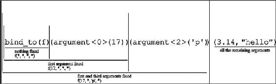
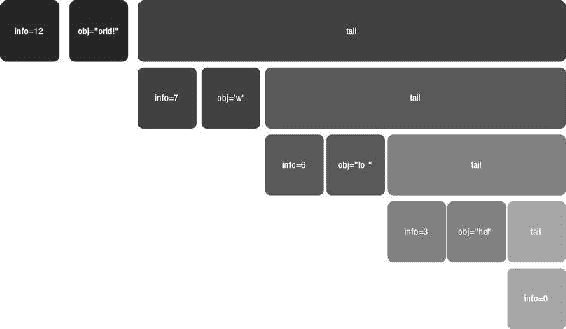

第九章


不透明类型原则

模板类型名称可能太复杂，用户无法直接使用，因为它们可能很冗长，或者可能需要非常复杂的语法。所以你要么发布一个方便的 typedef，要么允许用户完全忽略他们的类型。

平原 C 充满了不透明的类型。

在 C #中，文件流是通过指向驻留在系统内存中的未知文件结构的指针来处理的(C #运行时会预分配一小部分这样的结构)。要在打开的文件中检索当前位置，调用 fgetpos (FILE*，fpos_t)，传递文件指针和另一个充当书签的不透明类型。您不能知道或修改当前位置，但可以通过调用 fsetpos (FILE*，fpos_t)来恢复它。从用户的角度来看，fpos_t 的实例是完全不透明的。因为只有名称是已知的，所以除了默认构造函数、复制构造函数和赋值之外，该类型没有接口。

在不透明类型原则中，不透明性只与*类型名*有关，与接口无关。换句话说，对象有一个未指定的类型和一个已知的接口——它可能是迭代器或函子。

作为“难以编写”的类型，您不希望存储对象，而是应该在创建站点上立即使用它。

9.1.多态结果

假设一个函数执行一次产生几个结果的计算。

你可以将它们打包在一个多态结果中，并允许用户选择需要的内容。

让我们举一个简化的例子:

```cpp
template <typename iterator_t >
[[???]] average(iterator_t beg, iterator_t end)
{
   typename std::iterator_traits<iterator_t>::value_type total = 0;
   total = std::accumulate(beg, end, total);
   size_t count = std::distance(beg, end);

   return total/count;
}
```

固定的返回类型将破坏部分结果，这可能是有用的。因此，您可以延迟子项的聚合，并像这样更改代码:

```cpp
template <typename T, typename I>
class opaque_average_result_t
{
   T total_;
   I count_;

public:
   opaque_average_result_t(T total, I count)
   : total_(total), count_(count)
   {
   }

   // default result is the average

   operator T () const
   {
      return total_/count_;
   }

   T get_total() const
   {
      return total_;
   }

   I get_count() const
   {
      return count_;
   }
};

template <typename VALUE_TYPE, typename iterator_t >
opaque_average_result_t<VALUE_TYPE, size_t> average(iterator_t beg, iterator_t end)
{
   VALUE_TYPE total = 0;
   total = std::accumulate(beg, end, total);
   size_t count = std::distance(beg, end);

   return opaque_average_result_t<VALUE_TYPE, size_t>(total, count);
}
```

现在，客户端可以以更多方式使用原始算法:

```cpp
std::vector<double> v;
double avg = average<double>(v.begin(), v.end());
double sum = average<double>(v.begin(), v.end()).get_total();
```

由于返回类型是不透明的，所以不方便存储结果，但是如果需要的话，很容易将其传递给函数模板: [<sup class="calibre7">1</sup>](#Fn1)

```cpp
<???> x = average<double>(v.begin(), v.end());

template <typename T>
void receive(T res, double& avg, double& sum)
{
   avg = res;
   sum = res.get_total();
}

std::vector<double> v;
double avg, sum;
receive(average<double>(v.begin(), v.end()), avg, sum);
```

9.2.经典 Lambda 表达式

Lambda 表达式是在调用点创建的不透明函数对象。它们将一些基本的片段与有意义的操作符结合起来。产生的函子稍后将在其参数上重放操作符序列。例如，给定两个合适的“lambda 变量”类型的对象 X 和 Y，那么(X+Y)*(X-Y)将是一个接受两个参数并返回它们的和乘以它们的差的函子。

构建一个简化的实现并理解底层的模板技术是一个很好的练习。这些最初是由 Todd Veldhuizen 在他的开创性文章“表达式模板”中提出的。

可以这样写代码:cos(X+2.0) 是一个表达式，返回一个函子，给定一个双 X，其运算符()计算 cos(X+2.0)。

```cpp
lambda_reference<const double> X;

std::find_if(..., X<5.0 && X>3.14);
std::transform(..., cos(X+2.0));

lambda_reference<double> Y;

std::for_each(..., Y+=3.14);

lambda_reference<const double, 0> ARG1;
lambda_reference<const double, 1> ARG2;

std::sort(..., (ARG1<ARG2));
```

可以做如下假设。有些将在以后删除，有些有望在您继续操作时变得更加清晰:

*   为了清楚起见，T 将是一个友好的标量类型，double 或 float，所以所有的操作符都是定义良好的。
*   一个 lambda 表达式将最多接收 K=4 个参数，*所有的*都是相同的类型 T &。特别是:
*   lambda_reference <double>和 lambda_reference <const double="">是不同的，后者是“lambda-const 引用到 double”。</const></double>
*   表达式必须包含对相同类型对象的引用。
*   为了简单起见，所有的常量最初都是 T 类型，X+2 被认为是无效的语法，因为 X 指的是 double，而 2 是 int。因此，你必须编写 X+2.0(你将在本章后面学习如何去除这个限制)。
*   我们显式地尝试编写看起来相似的函数，因此它们可以很容易地用预处理宏生成，即使它们没有在这里列出。

9.2.1.基本 Lambda 对象

让我们在这里改写一下基本定义:lambda 对象是一个用特殊语法生成的函子(即，用运算符组装一些占位符)。函子的作用是在它的实际参数上重放相同的运算符。例如，如果 X 是一个这样的占位符，那么表达式 X+2 产生一个接受一个参数并返回其参数加 2 的函子。

首先，定义一个空的静态接口。注意 T 目前没有被使用，但是你很快就会意识到为什么它是必要的。

```cpp
template <typename true_t, typename T>
class lambda
{
protected:
   ~lambda()
   {
   }

public:
   const true_t& true_this() const
   {
      return static_cast<const true_t&>(*this);
   }
};
```

第一个(普通的)对象是一个λ常数。这是一个函子，不管参数是什么，它都返回常数结果。因为它是一个 lambda 表达式，所以您可以从接口中得到它:

```cpp
template <typename T>
class lambda_const : public lambda<lambda_const<T>, T>
{
   typedef const T& R;

   T c_;

public:
   typedef T result_type;

   lambda_const(R c)
   : c_(c)
   {
   }

   result_type operator()(R  = T(), R  = T(), R  = T(), R  = T()) const
   {
      return c_;
   }
};
```

请注意，lambda 常量可以接受零个或多个参数，但它是一个函数对象，因此调用必须使用某种形式的运算符()。

第二个对象是 lambda_reference <t n="">，它被定义为一个仿函数，至少接受 T&类型的 N 个参数，并返回第 N 个。选择接受 T&作为参数意味着 lambda_reference <t>不能处理文字:</t></t>

```cpp
lambda_reference<double> X1;
lambda_reference<const double> Y1;

X1(3.14);   // error: needs double&
Y1(3.14);   // ok: takes and returns const double&
```

变量的选择并不简单。通常，参数轮换是首选的技术。此外，由于引用是廉价的，这个例子引入了一种称为参数的*复制的技术，以减少重载的数量。operator()的最后一个参数是“克隆”的，因此它总是传递四个项目。*

```cpp
template <typename T, size_t N = 0>
class lambda_reference: public lambda<lambda_reference<T, N>, T>
{
  static T& apply_k(static_value<size_t,0>, T& x1, T&, T&, T&)
  {
    return x1;
  }

  template <size_t K>
  static T& apply_k(static_value<size_t,K>, T& x1, T& x2, T& x3, T& x4)
  {
    return apply_k(static_value<size_t,K-1>(), x2, x3, x4, x1);
  }

public:
  typedef T& result_type;

  result_type operator()(T& x1, T& x2, T& x3, T& x4) const
  {
    MXT_STATIC_ASSERT(N<4);
    return apply_k(static_value<size_t,N>(), x1, x2, x3, x4);
  }

  result_type operator()(T& x1, T& x2, T& x3) const
  {
    MXT_STATIC_ASSERT(N<3);
    return apply_k(static_value<size_t,N>(), x1, x2, x3, x3);
  }

  result_type operator()(T& x1, T& x2) const
  {
    MXT_STATIC_ASSERT(N<2);
    return apply_k(static_value<size_t,N>(), x1, x2, x2, x2);
  }

  result_type operator()(T& x1) const
  {
    MXT_STATIC_ASSERT(N<1);
    return apply_k(static_value<size_t,N>(), x1, x1, x1, x1);
  }
};
```

9.2.2.λ函数和运算符

应用于 lambda 表达式的一元函数 F 是返回应用于 lambda 结果的 F 的函子。 [<sup class="calibre7">2</sup>](#Fn2)

由于有了静态接口，实现可以立刻处理任何λ表达式。

还有，lambda <x t="">可以存储在 X 类型的对象中(而且拷贝很便宜)。</x>

```cpp
template <typename F, typename X, typename T>
class lambda_unary : public lambda<lambda_unary<F,X,T>, T>
{
   X x_;
   F f_;

public:
   lambda_unary(const lambda<X,T>& that)
   : x_(that.true_this())
   {
   }

   typedef typename F::result_type result_type;

   result_type operator()() const
   {
      return f_(x_());
   }

   result_type operator()(T& x1) const
   {
      return f_(x_(x1));
   }

   result_type operator()(T& x1, T& x2) const
   {
      return f_(x_(x1, x2));
   }

   result_type operator()(T& x1, T& x2, T& x3) const
   {
      return f_(x_(x1, x2, x3));
   }

   // ...
};
```

前面的代码构建了一个仿函数 f_，它的运算符()被调用，但是你还需要插入全局/静态成员函数。因此，需要一个小的适配器:

```cpp
template <typename T, T (*F)(T)>
struct unary_f_wrapper
{
   typedef T result_type;

   T operator()(const T& x) const { return F(x); }
};
```

接下来，收集 traits 类中的所有全局函数:

```cpp
template <typename T>
struct unary_f_library
{
   static T L_abs(T x) { return abs(x); }
   static T L_cos(T x) { return cos(x); }
   // ...
};
```

最终你开始在 lambda 对象上定义函数:

```cpp
#define LAMBDA_ABS_TYPE      \
   lambda_unary<unary_f_wrapper<T, &unary_f_library<T>::L_abs>, X, T>

template <typename X, typename T>
LAMBDA_ABS_TYPE abs(const lambda<X, T>& x)
{
   return LAMBDA_ABS_TYPE(x);
}

#define LAMBDA_COS_TYPE      \
   lambda_unary<unary_f_wrapper<T, &unary_f_library<T>::L_cos>, X, T>

template <typename X, typename T>
LAMBDA_COS_TYPE cos(const lambda<X, T>& x)
{
   return LAMBDA_COS_TYPE(x);
}

...
```

这个方案也适用于一元运算符，只需使用不同的仿函数。

```cpp
template <typename T>
struct lambda_unary_minus
{
  typedef T result_type;
  result_type operator()(const T& x) const { return -x; }
};

#define LAMBDA_U_MINUS_TYPE   lambda_unary<lambda_unary_minus<T>, X, T>

template <typename X, typename T>
LAMBDA_U_MINUS_TYPE operator-(const lambda<X, T>& x)
{
   return LAMBDA_U_MINUS_TYPE(x);
}
```

添加的特性越多，返回类型就变得越复杂，但是这些对用户来说是完全隐藏的。

二元运算，比方说+，可以类似地定义:(lambda < X1，T > + lambda < X2，T >)是一个函子，它把它的参数分配给它的两个加数。 [<sup class="calibre7">3</sup>](#Fn3) 所以，类比一元的情况，你会定义一个具体的对象来处理二元运算符，即 lambda_binary < X1，F，X2，T >。特别是*混合*二元运算，比如 lambda < X1，T > + T，是一种特殊情况，通过将 T 提升为 lambda_const < T >来处理。

```cpp
template <typename X1, typename F, typename X2, typename T>
class lambda_binary : public lambda< lambda_binary<X1,F,X2,T>, T >
{
   X1 x1_;
   X2 x2_;
   F f_;

public:
   lambda_binary(const lambda<X1,T>& x1, const lambda<X2,T>& x2)
   : x1_(x1.true_this()), x2_(x2.true_this())
   {
   }

   typedef typename F::result_type result_type;

   result_type operator()() const
   {
      return f_(x1_(), x2_());
   }

   result_type operator()(T& x1) const
   {
      return f_(x1_(x1), x2_(x1));
   }

   result_type operator()(T& x1, T& x2) const
   {
      return f_(x1_(x1, x2), x2_(x1, x2));
   }

   result_type operator()(T& x1, T& x2, T& x3) const
   {
      return f_(x1_(x1, x2, x3), x2_(x1, x2, x3));
   }

   // ...
};
```

在此实现中，逻辑运算符不会使用短路。如果 T 是 int，lambda 对象 X > 0 & & (1/X) < 5 将在被零除时崩溃，而类似的 C++ 语句返回 false。

像+这样的算术运算符可以写成 f_(x1_(...)，x2_(...))和前面一样，但这对于& &和||(其工作流程更复杂)是不正确的:

```cpp
b1 := x1_(...);
if (f_(b1, true) == f_(b1, false))
        return f_(b1, true);
else
        return f_(b1, x2_(...))
```

在接下来的讨论中，为了清晰起见，我们牺牲了一些正确性，将所有操作符视为普通的二元谓词，我们将上面伪代码中为逻辑操作符编写 lambda_binary 的部分专门化作为练习。

现在你定义“具体的”二元函数:

```cpp
template <typename T, T (*f)(T, T)>
struct binary_f_wrapper
{
   typedef T result_type;
   T operator()(const T& x, const T& y) const { return f(x,y); }
};

template <typename T>
struct binary_f_library
{
   static T L_atan2(T x, T y) { return atan2(x, y); }
   // ...
};

#define ATAN2_T(X1, X2)                                             \
  lambda_binary<X1,                                                 \
                binary_f_wrapper<T, &binary_f_library<T>::L_atan2>, \
                X2, T>

template <typename X1, typename X2, typename T>
ATAN2_T(X1, X2) atan2(const lambda<X1,T>& L, const lambda<X2,T>& R)
{
   return ATAN2_T(X1, X2) (L, R);
}

template <typename X1, typename T>
ATAN2_T(X1, lambda_const<T>) atan2(const lambda<X1,T>& L, const T& R)
{
   return atan2(L, lambda_const<T>(R));
}

template <typename T, typename X2>
ATAN2_T(lambda_const<T>, X2) atan2(const T& L, const lambda<X2,T>& R)
{
   return atan2(lambda_const<T>(L), R);
}
```

最后，您需要另一个扩展。有三种类型的运算符

*   二元谓词，带有签名布尔值 F(常数 T &，常数 T &)
*   二元运算符，带签名 T F(常数 T &，常数 T &)
*   赋值，签名 T & F(T &，常量 T &

这转化为以下 C++ 代码:

```cpp
enum lambda_tag
{
   LAMBDA_LOGIC_TAG,
   LAMBDA_ASSIGNMENT_TAG,
   LAMBDA_OPERATOR_TAG
};

template <typename T, lambda_tag TAG>
struct lambda_result_traits;

template <typename T>
struct lambda_result_traits<T, LAMBDA_ASSIGNMENT_TAG>
{
   typedef T& result_type;
   typedef T& first_argument_type;
   typedef const T& second_argument_type;
};

template <typename T>
struct lambda_result_traits<T, LAMBDA_OPERATOR_TAG>
{
   typedef T result_type;
   typedef const T& first_argument_type;
   typedef const T& second_argument_type;
};

template <typename T>
struct lambda_result_traits<T, LAMBDA_LOGIC_TAG>
{
   typedef bool result_type;
   typedef const T& first_argument_type;
   typedef const T& second_argument_type;
};
```

所以你可以写:

```cpp
template <typename T>
struct lambda_less
{
   typedef lambda_result_traits<T, LAMBDA_LOGIC_TAG> traits_t;

   typedef typename traits_t::result_type result_type;
   typedef typename traits_t::first_argument_type arg1_t;
   typedef typename traits_t::second_argument_type arg2_t;

   result_type operator()(arg1_t x, arg2_t y) const
   {
      return x < y;
   }
};

template <typename T>
struct lambda_plus
{
   typedef lambda_result_traits<T, LAMBDA_OPERATOR_TAG> traits_t;

   typedef typename traits_t::result_type result_type;
   typedef typename traits_t::first_argument_type arg1_t;
   typedef typename traits_t::second_argument_type arg2_t;

   result_type operator()(arg1_t x, arg2_t y) const
   {
      return x + y;
   }
};

template <typename T>
struct lambda_plus_eq
{
   typedef lambda_result_traits<T, LAMBDA_ASSIGNMENT_TAG> traits_t;

   typedef typename traits_t::result_type result_type;
   typedef typename traits_t::first_argument_type arg1_t;
   typedef typename traits_t::second_argument_type arg2_t;

   result_type operator()(arg1_t x, arg2_t y) const
   {
      return x += y;
   }
};
```

这些对象的差异很小。

逻辑和标准操作符与任何其他二元函数相同，除了返回类型(与 atan2 比较)。下面是 lambda 的运算符< : [<sup class="calibre7">4</sup>](#Fn4) 的实现

```cpp
#define LSS_T(X1,X2)      lambda_binary<X1, lambda_less<T>, X2, T>

template <typename X1, typename X2, typename T>
LSS_T(X1,X2) operator<(const lambda<X1,T>& L, const lambda<X2,T>& R)
{
   return LSS_T(X1, X2) (L, R);
}

template <typename X1, typename T>
LSS_T(X1, lambda_const<T>) operator<(const lambda<X1,T>& L, const T& R)
{
   return L < lambda_const<T>(R);
}

template <typename T, typename X2>
LSS_T(lambda_const<T>, X2) operator<(const T& L, const lambda<X2,T>& R)
{
   return lambda_const<T>(L) < R;
}
```

赋值运算符不允许第三个重载，这将对应于 lambda 表达式，如(2.0 += X)，这是一个有点可疑的 C++ 语句:

```cpp
#define PEQ_T(X1,X2)    lambda_binary<X1, lambda_plus_eq<T>, X2, T>

template <typename X1, typename X2, typename T>
PEQ_T(X1,X2) operator+=(const lambda<X1,T>& L, const lambda<X2,T>& R)
{
   return PEQ_T(X1,X2) (L,R);
}

template <typename X1, typename T>
PEQ_T(X1,lambda_const<T>) operator+=(const lambda<X1,T>& L, const T&R)
{
   return L += lambda_const<T>(R);
}
```

下面是一个使用所有先前代码的示例:

```cpp
lambda_reference<double, 0> VX1;
lambda_reference<double, 1> VX2;

double data[] = {5,6,4,2,-1};
std::sort(data, data+5, (VX1<VX2));

std::for_each(data,data+5, VX1 += 3.14);
std::transform(data,data+5, data, VX1 + 3.14);
std::transform(data,data+5, data, 1.0 + VX1);

std::for_each(data,data+5, VX1 += cos(VX1));
```

这里有一个故意产生错误的例子，它仍然是人类可读的:

```cpp
const double cdata[] = {5,6,4,2,-1};
// add 3.14 to all the elements of a constant array...
std::for_each(cdata, cdata+5, VX1 += 3.14);

error C2664: 'double &lambda_binary<X1,F,X2,T>::operator ()(T &) const' :
cannot convert parameter 1 from 'const double' to 'double &'
             with
             [
                     X1=lambda_reference<double,0>,
                     F=lambda_plus_eq<double>,
                     X2=lambda_const<double>,
                     T=double
             ]
             Conversion loses qualifiers

             see reference to function template instantiation being compiled
             '_Fn1 std::for_each<const double*,lambda_binary<X1,F,X2,T>>(_InIt,_InIt,_Fn1)'

             with
             [
        _Fn1=lambda_binary<lambda_reference<double,0x00>,lambda_plus_eq<double>,lambda_const<double>,double>,
                                X1=lambda_reference<double,0>,
                                F=lambda_plus_eq<double>,
                                X2=lambda_const<double>,
                                T=double,
                                _InIt=const double *
             ]
```

您可能希望下面的代码能够正常工作；相反，它不会编译。错误日志可能又长又吵，但都指向 operator+。这里已经分离出精确的错误:

```cpp
double data[] = {5,6,4,2,-1};
const double cdata[] = {5,6,4,2,-1};

lambda_reference<const double> C1;

std::transform(cdata,cdata+5, data, C1 + 1.0);

error: 'lambda_binary<X1,lambda_plus<T>,lambda_const<T>,T> operator +(const lambda<true_t,T> &,const T &)' :

template parameter 'T' is ambiguous
      could be 'double'
      or    'const double'
```

这个问题相当于:

```cpp
template <typename T>
struct A
{
};

template <typename T>
void F(A<T>, T)
{
}

A<const double> x;
double i=0;

F(x, i);   // error: ambiguous call.
           // deduce T=const double from x, but T=double from i
```

这就是类型特征出现的地方。您只从 lambda 表达式中获取参数 T，并让常量的类型是依赖的。更准确地说，所有带有 const T &类型参数的混合操作符都应该改为接受 typename lambda _ constant _ arg<T>:::type。

```cpp
template <typename T>
struct lambda_constant_arg
{
   typedef const T& type;
};

template <typename T>
struct lambda_constant_arg<const T>
{
   typedef const T& type;
};
```

C++ 标准规定，如果一个参数可以从一个实参中推导出来，那么它就被推导出来，然后替换到其余的实参中。如果结果是可行的，那么这个推论就被接受为有效的，所以特别是在这样一个签名中:

```cpp
template <typename T>
void F(A<T> x, typename lambda_constant_arg<T>::type i);
```

唯一能推导出 T 的上下文是 x 的类型，所以不会再有歧义了。特别是，现在可以添加任何类型的可转换为 T:

```cpp
std::transform(cdata, cdata+5, data, C1 + 1);
// don't need to write C1 + 1.0
```

最后注意，这些 lambda 表达式对于参数的数量并不太严格。唯一的显式检查是 lambda_reference 中的静态断言。 [<sup class="calibre7">5</sup>](#Fn5)

```cpp
lambda_reference<const double, 0> C1;
lambda_reference<const double, 1> C2;

double t1 = ((C1<C2)+(-C1))(3.14);             // error: C2 requires 2 args
double t2 = ((C1<C2)+(-C1))(3.14, 6.28);       // ok
double t3 = ((C1<C2)+(-C1))(3.14, 6.28, 22/7); // ok, "22/7" ignored
```

9.2.3.改进

请注意，一元和二元运算确实包含表示运算的仿函数的副本，但仿函数始终是默认构造的。您可以添加一个包装器，在 lambda 表达式中嵌入任何用户仿函数。只需修改构造函数，如下所示:

```cpp
public:
   lambda_unary(const lambda<X,T>& that, F f = F())
   : x_(that.true_this()), f_(f)
   {
   }
```

这个例子立即使用这个特性来创建一个*仿函数*，它接受一个仿函数-on-T 并返回一个仿函数-on-lambda:

```cpp
int main()
{
   MyFunctor F;
   lambda_reference<double> X;

   std::transform(data, data+n, data, lambda_wrap[F](3*X+14));  // = F(3*X+14)
}
```

lambda_wrap 是 lambda_wrap_t < void >的全局实例，它的运算符[]吸收了一个合适的用户仿函数。选择[]而不是()给了额外的视觉清晰度，因为它避免了与函数参数的混淆。

```cpp
template <typename F = void>
class lambda_wrap_t
{
   F f_;

public:
   lambda_wrap_t(F f)
   : f_(f)
   {
   }

   template <typename X, typename T>
   lambda_unary<F, X, T> operator()(const lambda<X, T>& x) const
   {
      return lambda_unary<F, X, T>(x, f_);
   }
};

template <>
class lambda_wrap_t<void>
{
public:
   lambda_wrap_t(int = 0)
   {
   }

   template <typename F>
   lambda_wrap_t<F> operator[](F f) const
   {
      return f;
   }
};

const lambda_wrap_t<void> lambda_wrap = 0;
```

这在以下情况下使用:

```cpp
struct MyF
{
   typedef double result_type;

   result_type operator()(const double& x) const
   {
      return 7*x - 2;
   }
};

lambda_reference<double> V;
std::for_each(begin, end, lambda_wrap[MyF()](V+2));   // will execute MyF(V+2)
```

同样的技术可以进一步扩展以实现三元运算符(不能重载),假设的语法可以是:

```cpp
if_[CONDITION].then_[X1].else_[X2]
```

将语句链接在一起的点清楚地表明 if_[C]的返回类型是一个对象，其成员 then_ 有另一个运算符[]，依此类推。

9.2.4.论证和结果演绎

不严格地说，复合 lambda 对象 G:=F(λ)带一个参数 x，返回 F(λ(x))。G 的*参数类型*是λ的参数类型，G 的*结果类型*是 f 的结果类型

到目前为止，我们避免了定义这些类型的问题，因为它们要么是固定的，要么是显式给出的。

*   lambda 接口中的标量类型 T 充当其运算符()的参数。每当一个函数被应用到 lambda <x>时，T 被借用并插入结果，也就是说 lambda <y>。</y></x>
*   lambda 运算符()的返回类型可能会有所不同，所以它被发布为 result_type。例如，lambda_unary <f>从外部获取 T& x，并返回 F 从调用 F(X(x))返回的任何内容。f 可能返回对 T 或 bool 的引用。</f>

但是，在这个过程中，可能会发生从 bool 到 T 的静默强制转换。

例如，函数对象 abs(C1

一般来说，这是期望的行为:

```cpp
(C1<C2);            // returns bool
((C1<C2)+2);        // operator+ will promote "bool" to "double"
```

运算符&&可以作为运算符

```cpp
(C1<C2) && (C2>C1); // operator&& will promote two bools to double, then return bool
```

你应该只指定 lambda_reference 的参数，让每个 lambda 对象*正确地借用参数和结果*。lambda_reference 实际上是唯一用户可见的对象，它的类型参数足以确定整个仿函数。

这个改变也允许你从 lambda 接口中移除 T:[<sup class="calibre7">6</sup>](#Fn6)

```cpp
template <typename X>
class lambda
{
protected:
   ~lambda()
   {
   }

public:
   const X& true_this() const
   {
      return static_cast<const X&>(*this);
   }
};

template <typename T, size_t N = 0>
class lambda_reference : public lambda< lambda_reference<T, N> >
{
public:
   typedef T& result_type;
   typedef T& argument_type;

   result_type operator()(argument_type x1) const
   {
      MXT_STATIC_ASSERT(N<1);
      return apply_k(static_value<size_t, N>(), x1, x1, x1, x1);
   }

   // ...
};
```

你要用内部对象的 result_type 的(元)函数替换每个“包装”lambda 类中 T 的用法:

```cpp
template <typename F, typename X>
class lambda_unary : public lambda< lambda_unary<F,X> >
{
   X x_;
   F f_;

public:
   typedef typename F::result_type result_type;
   typedef typename X::argument_type argument_type;

   // ...
};
```

然而，虽然 T 是一个普通类型(可能是 const 限定的，但从来不是引用)，但 argument_type 通常是一个引用。因此，您需要一个元函数来删除任何限定符:

```cpp
template <typename T>
struct plain
{
   typedef T type;
};

template <typename T>
struct plain<T&> : plain<T>
{
};

template <typename T>
struct plain<const T> : plain<T>
{
};

template <typename T>
class lambda_const : public lambda< lambda_const<T> >
{
   typedef typename plain<T>::type P;
   P c_;

public:
   typedef P result_type;
   typedef const P& argument_type;

   // ...
};
```

棘手的问题在于二元运算符，这里有两个 lambdas，X1 和 X2。

应该借用谁的 argument_type？很容易看出*两种类型*都必须检查，因为必须进行一些推断。

例如，如果 X 是一个 lambda 非常数引用，它需要 T&。λ常数需要常数 T & 1。表达式(X+1.0)是一个函子，它接受一个参数并将其传递给一个 lambda 引用和一个 lambda 常量，因此它应该是 T & amp。一般来说，你需要一个交换元函数，它能够“推导”出一个可行的公共参数类型。

```cpp
template <typename X1, typename F, typename X2>
class lambda_binary : public lambda< lambda_binary<X1,F,X2> >
{
  X1 x1_;
  X2 x2_;
  F f_;

public:
  typedef typename F::result_type result_type;
  typedef typename
    deduce_argument<typename X1::argument_type, typename X2::argument_type>::type
    argument_type;

   // ...
};
```

结合两个任意泛函的问题甚至更深。首先，T 的消除使得所有的返回类型更加复杂。例如，现在 lambda_plus 对象将不得不处理来自任何不同 lambda 的两个不同结果的相加，而不是两个 Ts 的相加:

```cpp
// before
lambda_binary<X1, lambda_plus<T>, X2, T>

// after
lambda_binary<X1, lambda_plus<typename X1::result_type, typename X2::result_type>, X2>
```

此外，“泛型加法”的*返回类型*未知: [<sup class="calibre7">7</sup>](#Fn7)

```cpp
template <typename T1, typename T2>
struct lambda_plus
{
   typedef const typename plain<T1>::type& arg1_t;    // not a problem
   typedef const typename plain<T2>::type& arg2_t;    // not a problem

   typedef [[???]] result_type;

   result_type operator()(arg1_t x, arg2_t y) const
   {
      return x + y;
   }
};
```

因此，您需要另一个元函数“推断结果”,它接受 arg1_t 和 arg2_t 并返回一个合适的类型。

幸运的是，在合理的假设下，这个问题可以通过 TMP 技术解决，因为您只有几个自由度。涉及的类型有 T(从 lambda_reference 推导出来的，在整个模板表达式中是唯一的)、T&、const T&、bool。

9.2.5.推导参数类型

现在你将寻找一个元函数 F，它推导出了普通的参数类型。f 应满足:

*   对称性:F <t1>:= F</t1>
*   最强的需求占上风:F <t ...="">= T&</t>
*   const T&和 T 的行为相同:F <const t="" ...="">= F</const>

F 的元参数是其他 lambda 对象的参数类型:

```cpp
F<typename X1::argument_type, typename X2::argument_type>
```

最终，F 返回 T&或常数 T&就足够了。最简单的实现是将两个参数都减少到引用。如果它们具有相同的基础类型，您应该选择最强的类型；否则，编译器会给出一个错误:

```cpp
template <typename T>
struct as_reference
{
   typedef const T& type;
};

template <typename T>
struct as_reference<T&>
{
   typedef T& type;
};

template <typename T>
struct as_reference<const T&> : as_reference<T>
{
};

template <typename T1, typename T2>
struct deduce_argument
: deduce_argument<typename as_reference<T1>::type, typename as_reference<T2>::type>
{
};

template <typename T>
struct deduce_argument<T&, T&>
{
   typedef T& type;
};

template <typename T>
struct deduce_argument<T&, const T&>
{
   typedef T& type;
};

template <typename T>
struct deduce_argument<const T&, T&>
{
   typedef T& type;
};
```

注意，当 T 是一个 const 类型时，还将使用专门化 deduct _ argument<t t="">。</t>

9.2.6.推断结果类型

您可以使用类似的方法来编写推导结果类型的代码。也就是说，您将分解您想要覆盖的案例列表，并根据需要实现附加的元功能。首先，请注意函数调用的预期结果是*而不是*引用，因此您必须开始确保在调用位置没有引用被传递:

```cpp
template <typename T1, typename T2>
struct lambda_plus
{
   typedef const typename plain<T1>::type& arg1_t;
   typedef const typename plain<T2>::type& arg2_t;

   typedef
      typename deduce_result<typename plain<T1>::type, typename plain<T2>::type>::type
      result_type;

   result_type operator()(arg1_t x, arg2_t y) const
   {
      return x + y;
   }
};
```

这一次您需要四种专业化:

```cpp
template <typename T1, typename T2>
struct deduce_result;

template <typename T>
struct deduce_result<T, bool>
{
   typedef T type;
};

template <typename T>
struct deduce_result<bool, T>
{
   typedef T type;
};

template <typename T>
struct deduce_result<T, T>
{
   typedef T type;
};

template <>
struct deduce_result<bool, bool>
{
   typedef bool type;
};
```

最后的专门化是必要的；否则，<bool bool="">会匹配三者中的*任何一个*(T = bool)，所以会有歧义。</bool>

9.2.7.静态造型

结果/论证演绎的局限性可能会导致一些不一致。传统加法 bool+bool 的类型为 int，而布尔 lambda 对象的加法返回 bool:

```cpp
lambda_reference<const double,0> C1;
lambda_reference<const double,1> C2;

 ((C1<C2) + (C2<C1))(x, y);      // it returns bool
```

两者(C1 <c2 and="" have="" signature="" bool="" double="" const="" so="" lambda_plus="" will="" be="" instantiated="" on="">)。根据假设，当自变量相等时，deduct _ result<x x="">给出 x。</x></c2>

解决类似问题的唯一方法是 lambda-cast 运算符。幸运的是，很容易使用不可推导的模板参数来重现 static_cast 的语法:

```cpp
template <typename T1, typename T2>
struct lambda_cast_t
{
   typedef T2 result_type;

   result_type operator()(const T1& x) const
   {
      return x;
   }
};

#define LAMBDA_CAST_T(T,X)  \
     lambda_unary<lambda_cast_t<typename X::result_type, T>, X>

template <typename T, typename X>
LAMBDA_CAST_T(T,X) lambda_cast(const lambda<X>& x)
{
   return x;
}

(lambda_cast<double>(C1<C2)+lambda_cast<double>(C1<C2))(3.14, 6.28);
// now returns 2.0
```

9.2.8.数组

Todd Veldhuizen 率先将“模板表达式”应用于数组的快速运算，以尽量减少临时变量的使用。 [<sup class="calibre7">8</sup>](#Fn8)

```cpp
valarray<double> A1 = ...;
valarray<double> A2 = ...;

valarray<double> A3 = 7*A1-4*A2+1;
```

一般来说，简单的操作符会产生比需要的更多的对象“副本”。子表达式 7*A1 将返回一个临时数组，其中每个元素是 A1 中相应条目的七倍；4*A2 将返回另一个临时，以此类推。

相反，您可以使用类似 lambda 的表达式:

```cpp
template <typename X, typename T>
class valarray_interface
{
   // X is the true valarray and T is the scalar
   // ...

   public:
   // interface to get the i-th component

   T get(size_t i) const
   {
      return true_this().get(i);
   }

   size_t size() const
   {
      return true_this().size();
   }

   operator valarray<T>() const
   {
      valarray<T> result(size());
      for (size_t i=0; i<size(); ++i)
         result[i] = get(i);

      return result;
   }
};
```

该接口可以转换为真实的 valarray。这种类型转换触发了一个临时对象的创建，这个临时对象是按组件填充的(这是最有效的方式)。

乘积 valarray <t>* T 返回一个 valarray_binary_op < valarray<t>，std::multiplies <t>，scalar_wrapper <t>，T >。该对象包含对原始 valarray 的常量引用。</t></t></t></t>

```cpp
template <typename VA1, typename F, typename VA2, typename T>
class valarray_binary_op
: public valarray_interface< valarray_binary_op<VA1,F,VA2,T> >
{
   const VA1& va1_;
   const VA2& va2_;
   F op_;

public:
   // ...

   T get(size_t i) const
   {
      return op_(va1_.get(i), va2_.get(i));
   }
};
```

对复杂对象(如数组)成功使用表达式模板的关键优化是小心使用常量引用:

```cpp
const VA1& va1_;
const VA2& va2_;
```

const 引用通常是好的，因为它绑定到临时变量，但是它不会阻止被引用对象的死亡。

例如，(A*7)+B 将产生一个临时(A*7)，和另一个具有对它的常量引用的对象，以及对 B 的常量引用。由于 A*7“只在那行代码中”是有效的，如果可以存储表达式并在以后对其求值，它将使程序崩溃。

实际上，您可能希望使用特征来确定合适的存储类型。如果 VA1 是 valarray <t>，那么使用 const VA1&就很方便了。如果 VA1 只是一个标量，那么 const VA1 更安全。</t>

总而言之，行

```cpp
valarray<double> A3 = A1*7;
```

将神奇地触发右边模板表达式的组件式评估，使用接口中的 cast 操作符，或者更好地使用 valarray <t>中的专用模板构造函数/赋值。 [<sup class="calibre7">9</sup>](#Fn9)</t>

铸造操作者不容易去除。因为 A1*7 应该是一个 valarray，所以它甚至可能被用作 valarray，比如编写(A1*7)[3]或 even (A1*7)。调整大小(n)。这意味着在可行的情况下，valarray 和 valarray_interface 应该非常相似。

静态接口方法的另一个优点是许多不同的对象可以表现为一个伪 valarray。作为 lambda_const 的等价体，可以让标量 c 充当数组[c，c，...，c]:

```cpp
template <typename T>
class scalar_wrapper
: public valarray_interface< scalar_wrapper<T> >
{
   T c_;
   size_t size_;

public:
   scalar_wrapper(T c, size_t size)
   : c_(c), size_(size)
   {
   }

   T get(size_t i) const
   {
      return c_;
   }
};
```

9.3.创造性句法

这一节专门讨论如何利用模板语法技巧，比如操作符重载，来表达与标准含义不同的概念。

一些运算符传递一种自然的结合性；最简单的例子是用+，<连接的序列:

```cpp
std:string s = "hello";
std:string r = s + ' ' + "world" + '!';

std::ofstrean o("hello.txt");
o << s << ' ' << "world" << '!';

int a = 1,2,3,4,5,6,7;
```

用户期望这些操作符能够形成任意长度的链。此外，运算符[]和运算符()有时可能有相似的含义；特别是，当链条长度*固定*时，应使用前者:

```cpp
array a;
a[2];             // ok: the user expects a single subscript

matrix m;
m[2][3];          // ok: a matrix is expected to have 2 coordinates

SomeObject x;
x[2][3][1][4][5]; // bad style, here the meaning is obscure

Tensor<double,5> t;
t[2][3][1][4][5]; // good style: the user intuitively expects 5 "dimensions"
```

您可以通过编写使用第一个参数并返回能够处理剩余链的东西的操作符来利用这种语法。想想这条线:

```cpp
std::cout << a << b << c;
```

这个表达式的形式是:F(F(F(cout，a)，b)，c)，所以 F(cout，a)应该返回一个对象 X，这样就存在一个接受 X 和 b 的 F 的重载，依此类推。最简单的情况，F(cout，a)只是返回 cout。

你现在要详细阐述这个论点。

9.3.1.带有()和[]的参数链

有时运算符()用于形成链，从一个函数对象开始。

让我们分析一些假设的代码:

```cpp
double f(int, double, char, const char*);

double r1 = bind_to(f)(argument<2>('p')) (37, 3.14, "hello");
//          ^^^^^^^^^^^^^^^^^^^^^^^^^^^^
// produces a new function:
//
// double f1(int a, double b, const char* c)
// { return f(a, b, 'p', c);

double r2
  = bind_to(f)(argument<0>(17))(argument<2>('p')) (3.14, "hello");
//  ^^^^^^^^^^^^^^^^^^^^^^^^^^^^^^^^^^^^^^^^^^^^^
// produces a new function:
// double f2(double b, const char* c)
// { return f(17, b, 'p', c);
```

假设 f 是一个带 N 个参数的函数，您可以猜测以下事实:

*   bind_to(f)用两个不同的操作符()返回一个对象。
*   第一种形式采用一个语法为 argument <k>(x)的表达式，并返回一个将 x 固定为 f 的第 k 个参数的函子。可以重复调用第一种形式来固定同一语句中的几个参数。</k>
*   The second operator() takes all the remaining arguments at a time and evaluates the function.

    

另一个典型的例子是一个需要几个对象的函数(通常是仿函数或访问器，但是没有形式上的要求)，您不希望将它与其他参数混淆，因为:

*   太多了:F(...、x1、x2、x3、x4...).
*   它们不能按照“改变默认值的概率递减”来排序，调用者可能不得不将任意值放在未指定的位置。f(...，X1 x1 = X1()，X2 x2 = X2()...)可能需要作为 F(...，X1()，X2()，...，x7，X8()，...).
*   每个对象都与一个不同的模板参数相关联，比如 X1，X2...，所以错误地交换了两个参数的函数调用可能会编译。[<sup class="calibre7">10</sup>T3】](#Fn10)

为了说明这种情况，让我们挑选一个需要*三个*对象的算法:一个 less-comparator、一个一元谓词和一个 logger:

```cpp
template <typename iterator_t, typename less_t, typename pred_t, typename logger_t>
void MyFunc(iterator_t b, iterator_t e, less_t less, pred_t p, logger_t& out)
{
   std::sort(b, e, less);
   iterator_t i = std::find_if(b, e, p);
   if (i != e)
      out << *i;
}
```

但是，所有这些参数都有一个默认类型，即 std::ostream 作为 logger(STD::cout 作为 out 的默认值)和以下两种类型:

```cpp
struct basic_comparator
{
   template <typename T>
   bool operator()(const T& lhs, const T& rhs) const
   { return lhs < rhs; }
};

struct accept_first
{
   template <typename T>
   bool operator()(const T&) const { return true; }
};
```

你可能经常想改变其中的一个，也许是最后一个。但是，很难提供重载，因为参数的类型无法区分:

```cpp
template <typename iterator_t, typename less_t >
void MyFunc(iterator_t b, iterator_t e, less_t less)
{ ... }

template <typename iterator_t, typename logger_t>
void MyFunc(iterator_t b, iterator_t e, logger_t& out)
{ ... }
// ambiguous: these functions will generate errors, if given a named variable as 3rd argument
```

所以你使用*参数包*技术。首先，您标记参数。

```cpp
enum { LESS, UNARY_P, LOGGER };

template <size_t CODE, typename T = void>
struct argument
{
   T arg;

   argument(const T& that)
   : arg(that)
   {
   }
};

template <size_t CODE>
struct argument<CODE, void>
{
   argument(int = 0)
   {
   }

   template <typename T>
   argument<CODE, T> operator=(const T& that) const
   {
      return that;
   }

   argument<CODE, std::ostream&> operator=(std::ostream& that) const
   {
      return that;
   }
};
```

然后，您提供命名的全局常量:

```cpp
const argument<LESS> comparator = 0;
const argument<UNARY_P> acceptance = 0;
const argument<LOGGER> logger = 0;

template <typename T1, typename T2, typename T3>
struct argument_pack
{
   T1 first;
   T2 second;
   T3 third;

   argument_pack(int = 0)
   {
   }

   argument_pack(T1 a1, T2 a2, T3 a3)
   : first(a1), second(a2), third(a3)
   {
   }
```

argument_pack::operator[] 接受一个参数< N，T >并用 T 替换它的第 N 个模板参数:

```cpp
        template <typename T>
        argument_pack<T, T2, T3> operator[](const argument<0, T>& x) const
        {
                return argument_pack<T, T2, T3>(x.arg, second, third);
        }

        template <typename T>
        argument_pack<T1, T, T3> operator[](const argument<1, T>& x) const
        {
           return argument_pack<T1, T, T3>(first, x.arg, third);
        }

        template <typename T>
        argument_pack<T1, T2, T> operator[](const argument<2, T>& x) const
        {
                return argument_pack<T1, T2, T>(first, second, x.arg);
        }
};
```

这段代码引入了一个名为 where 的全局常量，并重载了原始函数两次(不考虑参数的实际数量):

```cpp
typedef argument_pack<basic_comparator, accept_first, std::ostream&> pack_t;

// note: a global variable called "where"
static const pack_t where(basic_comparator(), accept_first(), std::cout);

template <typename iterator_t, typename T1, typename T2, typename T3>
void MyFunc(iterator_t b, iterator_t e, const argument_pack<T1,T2,T3> a)
{
   return MyFunc(b, e, a.first, a.second, a.third);
}

template <typename iterator_t >
void MyFunc(iterator_t b, iterator_t e)
{
   return MyFunc(b, e, where);
}
```

所以现在可以写:

```cpp
MyFunc(v.begin(), v.end(), where[logger=std::clog]);
MyFunc(v.begin(), v.end(), where[logger=std::cerr][comparator=greater<int>()]);
```

记录器是一个类型参数< 2，void >的常量，它被升级到参数< 2，STD::ostream&T5。这个实例用 std::ostream &替换 pack_t 的第三个模板参数，用对 std::cerr 的引用替换 pack_t::third 的值。

注意，本节中显示的代码不是通用的，但是它与特定的函数调用紧密相关。然而，需要参数包的复杂函数通常在每个项目中只需要几个。

9.4.成长物体概念

先说个例子。字符串 sum 具有内存重新分配的预期成本 [<sup class="calibre7">11</sup>](#Fn11) :

```cpp
template <typename T>
std::string operator+(std::string s, const T& x)
{
   // estimate the length of x when converted to string;
   // ensure s.capacity() is large enough;
   // append a representation of x to the end of s;
   return s;
}
```

显然，如果同一行上有多个 sum，编译器知道参数的顺序:

```cpp
std::string s = "hello";
std::string r = s + ' ' + "world!";

// repeated invocation of operator+ with arguments: char, const char*
// may cause multiple memory allocations
```

所以你会想:

*   一次收集所有的论点，并对它们的长度求和
*   执行一次内存分配
*   再次遍历参数序列并将它们连接起来

*增长对象*是一种允许在执行前遍历 C++ 表达式的模式。该技术的思想是在表达式中注入一个带有特殊操作符的代理，该操作符“吸收”所有后续参数。

代理 是一个临时的聚集对象，它的操作者让它“增长”,包括对它们的参数的引用。最后，当增长完成时，对象可以一次处理*所有的*参数，并将它们转换成想要的结果。

因此，在前面的示例中，s+' '不是一个字符串，而是一个包含对 s 的引用和一个字符的代理。当添加“world”时，该对象会增长，因此 s+“+”world 也包含一个 const char*。

非正式地说，一个正在增长的对象被实现为一对，包含该对象以前的状态和一些新的微小数据(比如一个引用)。此外,“pair”还有三种可能的变体:

*   一个有两个成员的类:对前一个增长对象和一个小对象的引用
*   有两个成员的类:前一个增长对象的副本和一个小对象
*   从以前的增长对象派生的类，以一个小对象作为唯一成员

在伪模板符号中，三种不同的模型可以写成:

```cpp
template <...>
class G1<N>
{
    const G1<N-1>& prev_;
    T& data_;
};

template <...>
class G2<N>
{
    G2<N-1> prev_;
    T& data_;
};

template <...>
class G3<N> : public G3<N-1>
{
    T& data_;
};
```

第一种是构建速度最快的，因为用新数据扩充临时对象 G1 不涉及复制，但是 G1 的生存期是最短的。其他类型具有相似的复杂性，因为它们的构造无论如何都要复制 Gj <n-1>，但是它们在自然行为上略有不同。</n-1>

G1 的最大优点是构造函数和析构函数都只按顺序运行一次。相反，要创建一个 G2 <n>，你必须生产 G2 <n-1>的两个副本，G2 <n-2>的三个副本...，K+1 份 G2 <n-k>...，等等。</n-k></n-2></n-1></n>

这一点尤其重要，因为当增长完成时，你可能需要 G <n>来运行一些代码*，G < N >的析构函数将是选项之一。*</n>

 *这些 Gj 中的任何一个都包含引用，所以举例来说，没有增长的对象可以被抛出。

此外，在计算结果时有一些已知的递归模式:

*   *向内链接* : G < N >要么直接计算结果，要么委托 G < N-1 >，向内传递信息:

    ```cpp
    private:

            result do_it_myself()
            {
                    // ...
            }

            result do_it(arguments)
            {
                    if (condition)
                            return do_it_myself();
                    else
                            return prev_.do_it(arguments);
            }

    public:
            result do_it()
            {
                    return do_it(default);
            }
    ```

*   *外向链接* : G < N >递归地从 G < N-1 >中求一个结果，并对其进行后处理。

    ```cpp
    result do_it()
    {
            result temp = prev_.do_it();
            return modify(temp);
    }
    ```

*   *直接访问* : G < N >计算 J 并向 G < J >请求一个结果。这种模式对于基于继承的增长对象有不同的实现。

    ```cpp
    template <...>
    class G1<N>
    {
            result do_it_myself(static_value<int, 0>)
            {
                    // really do it
            }

            template <int K>
            result do_it_myself(static_value<int, K>)
            {
                    return prev_.do_it_myself(static_value<int, K-1>());
            }

    public:
            result do_it()
            {
                    static const int J = [...];
                    return do_it_myself(static_value<int, J>());
            }
    };

    template <...>
    class G3<N> : G3<N-1>
    {
            result do_it_myself()
            {
                    // ...
            }

    public:
            result do_it()
            {
                    static const int J = ...;
                    return static_cast<growing<J>&>(*this).do_it_myself();
            }
    };
    ```

9.4.1.字符串串联

使用一系列*聚集体*实现第一个生长对象(参见第 3.6.8 节)。

因为单个语句中涉及的对象至少存在到表达式的末尾，所以您可以认为是一个 const 引用的集合。表达式(string+T1)+T2 不应返回一个字符串，而应返回一个包含参数引用的结构(或副本，如果它们很小)。 [<sup class="calibre7">12</sup>](#Fn12)

```cpp
template <typename T1, typename T2>
class agglomerate;

template <typename T>
agglomerate<string, const T&> operator+(const string&, const T&);<sup class="calibre7">13</sup>

template <typename T1, typename T2, typename T>
agglomerate<agglomerate<T1, T2>, const T&>
   operator+(const agglomerate<T1, T2>, const T&);
```

因此，下面的原型示例中的 sum 将返回 aggregate< agglomerate<string char="">，const char* >:</string>

```cpp
std::string s = "hello";
std::string r = s + ' ' + "world!";
```

最终，所有的工作都由一个 cast 操作符完成，它将 agglomerate 转换为 string:

*   将 this->first 和 this->second 的长度相加(first 是另一个凝聚或字符串，所以两者都有 size()函数；第二个是对新参数的引用)。
*   分配大小合适的字符串。
*   将所有对象附加到字符串的末尾，知道内部不会发生重新分配。

请注意，关于参数，聚集是以相反的顺序构建的；也就是说，执行转换的对象持有最后一个参数。因此，它必须在转储参数成员之前转储其聚集成员*。*

```cpp
// using namespace std;

template <typename T, bool SMALL = (sizeof(T)<=sizeof(void*))>
struct storage_traits;

template <typename T>
struct storage_traits<T, true>
{
   typedef const T type;
};

template <typename T>
struct storage_traits<T, false>
{
   typedef const T& type;
};

// assume that T1 is string or another agglomerate
// and T2 is one of: char, const char*, std::string

template <typename T1, typename T2>
class agglomerate
{
   T1 first;
   typename storage_traits<T2>::type second;

   void write(string& result) const
   {
      // member selection based on the type of 'first'
      write(result, &first);
   }

   template <typename T>
   void write(string& result, const T*) const
   {
      // if we get here, T is an agglomerate, so write recursively:
      // mind the order of functions

      first.write(result);
      result += this->second;
   }

   void write(string& result, const string*) const
   {
      // recursion terminator:
      // 'first' is a string, the head of the chain of arguments

      result = first;
   }

   size_t size()
   {
      return first.size() + estimate_length(this->second);
   }

   static size_t estimate_length(char)
   {
      return 1;
   }

   static size_t estimate_length(const char* const x)
   {
      return strlen(x);
   }

   static size_t estimate_length(const string& s)
   {
      return s.size();
   }

public:
   operator string() const
   {
      string result;
      result.reserve(size());
      write(result);
      return result;      // NVRO
   }
};
```

第一个增强功能允许通过链在*单遍*中累积信息:

```cpp
void write(string& result, size_t length = 0) const
{
   write(result, &first, length + estimate_length(this->second));
}

template <typename T>
void write(string& result, const T*, size_t length) const
{
   first.write(result, length);
   result += this->second;
}

void write(string& result, const string*, size_t length) const
{
   result.reserve(length);
   result = first;
}

operator string() const
{
   string result;
   write(result);
   return result;
}

 std::string s = "hello";
 std::string r = s + ' ' + "world!";
```

在经典 C++ 中，每次调用 string::operator+都会返回一个不同的临时对象，只是简单的复制。所以最初的例子产生了两个中间字符串:即 t <sub class="calibre19"> 1 </sub> ="hello "和 t <sub class="calibre19"> 2 </sub> ="hello world！"。由于每个临时变量都包含一个副本，因此这具有二次复杂度。

对于 C++0x 语言扩展，std::string 是一个可移动的对象。换句话说，当一个参数是临时对象时，它的操作符会检测到，并允许您窃取或重用它的资源。所以前面的代码实际上可能调用了两个不同的求和运算符。第一个无论如何都会产生一个临时变量(因为不允许从局部变量中偷取数据)；第二个检测临时的并重用它的内存。

从概念上讲，实现可能如下所示:

```cpp
string operator+(const string& s, char c)
{
        string result(s);
        return result += c;
}
```

字符串运算符+(**string&&****tmp，** const char* c)

```cpp
{
        string result;
        result.swap(tmp);
        return result += c;
}
```

其中符号字符串&&表示对临时的引用。甚至更简单:

```cpp
string operator+(string s, char c)
 {
         return s += c;
 }

 string operator+(string&& tmp, const char* c)
 {
         return tmp += c;
 }
```

换句话说，C++0x 字符串和在概念上类似于: [<sup class="calibre7">14</sup>](#Fn14)

```cpp
std::string s = "hello";
 std::string r = s;
 r += ' ';
 r += "world!";
```

但是一个不断增长的对象表现得更好，相当于:

```cpp
std::string s = "hello";
 std::string r;
 r.reserve(s.size()+1+strlen("world!");
 r += s;
 r += ' ';
 r += "world!";
```

因此，C++0x 扩展本身不会比增长的对象获得更好的性能。

9.4.2.可变增长对象

一个成长的对象可以用来提供增强的断言: [<sup class="calibre7">15</sup>](#Fn15)

```cpp
std::string s1, s2;
...
SMART_ASSERT(s1.empty() && s2.empty())(s1)(s2);

Assertion failed in matrix.cpp: 879412:
Expression: 's1.empty() && s2.empty()'
Values: s1 = "Wake up, Neo"
        s2 = "It's time to reload."
```

这段代码可以用一个简单的可链接操作符()来实现:

```cpp
class console_assert
{
   std::ostream& out_;

public:
   console_assert(const char*, std::ostream& out);

   console_assert& operator()(const std::string& s) const
   {
      out_ << "Value = " << s << std::endl;
      return *this;
   }

   console_assert& operator()(int i) const;
   console_assert& operator()(double x) const;
   // ...
};

#define SMART_ASSERT(expr) \
      if (expr) {} else console_assert(#expr, std::cerr)
```

这个宏使用 operator()开始一个参数链，因为它不是一个增长对象，所以必须立即使用参数。但是你可以有一个更复杂的“懒惰”方法: [<sup class="calibre7">16</sup>](#Fn16)

```cpp
template <typename T1, typename T2>
class console_assert
{
   const T1& ref_;
   const T2& next_;
   mutable bool run_;

public:
   console_assert(const T1& r, const T2& n)
   : ref_(r), next_(n), run_(false)
   {}

   std::ostream& print() const
   {
      std::ostream& out = next_.print();
      out << "Value = " << ref_ << std::endl;
      run_ = true;
      return out;
   }

   template <typename X>
   console_assert<X, console_assert<T1, T2> >
      operator()(const X& x) const
   {
      return console_assert<X, console_assert<T1, T2> >(x, *this);
   }

   ~console_assert()
   {
      if (!run_)
         print();
   }
};

template < >
class console_assert<void, void>
{
  std::ostream& out_;

public:
  console_assert(const char* msg, std::ostream& out)
  : out_(out << "Assertion failed: " << msg << std::endl)
  {
  }

  std::ostream& print() const
  {
     return out_;
  }

  template <typename X>
  console_assert<X, console_assert<void, void> >
     operator()(const X& x) const
  {
     return console_assert<X, console_assert<void, void> >(x, *this);
  }
};

#define SMART_ASSERT(expr) \
      if (expr) {} else console_assert<void, void>(#expr, std::cerr)
```

前面的例子表明，可以从内部修改增长的对象，通过成员窃取或传递资源。

特别是，一步一步的代码扩展会产生以下结果:

```cpp
SMART_ASSERT(s1.empty() && s2.empty())(s1)(s2);

if (s1.empty() && s2.empty())
    {}
else
    console_assert<void, void>("s1.empty() && s2.empty()", std::cerr)(s1)(s2);
//  ^^^^^^^^^^^^^^^^^^^^^^^^^^^^^^^^^^^^^^^^^^^^^^^^^^^^^^^^^^^^^^^^^
//  constructor of console_assert<void, void>
```

如果断言为假，则创建三个嵌套的临时变量:

| T0 | 控制台 _ 断言 |
| 一种网络的名称(传输率可达 1.54mbps) | 控制台 _ 断言<string>></string> |
| T2 | 控制台 _ 断言<string>> ></string> |

*   T2 被创造出来，然后立即被摧毁。因为 run_ 为 false，所以它调用 print。
*   打印通话 next_.print。
    *   T0 将其流传递给 T1。
    *   T1 打印它的消息，设置 run_=true，并把数据流向上传递给 T2。
*   T2 印刷了它的信息，然后死去。
*   T1 被销毁，但由于 run_ 为真，它保持沉默。
*   T0 被破坏。

控制台 _ 断言、T4【void】和 void >等专门化称为*链式启动器* 。它的界面可能与通用模板有很大不同。

增长对象的接口通常不依赖于粘合在一起的参数的数量。 [<sup class="calibre7">17</sup>](#Fn17)

9.4.3.更多生长物体

概括这个模式，给定一个类型容器 C，实现一个通用的聚集链<traits c="">。唯一的公共构造函数存在于链起始符中，用户可以对任何链和一个参数求和。</traits>

为简单起见，关于如何在链中存储参数(通过复制还是通过引用)的决定由一个全局策略给出: [<sup class="calibre7">18</sup>](#Fn18)

```cpp
template <typename T>
struct storage_traits
{
   typedef const T& type;
};

template <typename T>
struct storage_traits<T*>
{
   typedef T* type;
};

template <typename T>
struct storage_traits<const T*>
{
   typedef const T* type;
};

template <>
struct storage_traits<char>
{
   typedef char type;
};
```

在“凝聚”期间，长度为 N 的链和一个新的自变量生成长度为 N+1 的链。新的链存储这两者并组合一些新的信息(例如，它将旧链的估计长度与新参数的预期长度相加)。

最终，这条信息被发送到“目标对象”，然后该对象以某种顺序接收所有参数。

因为所有这些动作都是参数化的，所以您可以将它们组合在一个 traits 类中:

*   update 从参数中收集信息，一次一个。
*   dispatch 将累积信息发送给目标对象。
*   transmit 将实际参数发送给目标对象。

```cpp
struct chain_traits
{
   static const bool FORWARD = true;

   struct information_type
   {
      // ...
   };

   typedef information_type& reference;

   typedef ... target_type;

   template <typename ARGUMENT_T>
   static void update(const ARGUMENT_T&, information_type&);

   static void dispatch(target_type&, const information_type&);

   template <typename ARGUMENT_T>
   static void transmit(target_type&, const ARGUMENT_T&);
};
```

对象增长期间将自动调用 Update 如果链被强制转换为 target_type 或注入 target _ type，将延迟调用 dispatch 和 transmit。

首先实现空链。

类似于上面 9.4.2 节中的流引用，这个类将只存储公共信息。增长对象的附加层将使用 traits::reference 引用它。

```cpp
template <typename traits_t, typename C = empty>
class chain;

template <typename traits_t>
class chain<traits_t, empty>
{
   template <typename ANY1, typename ANY2>
   friend class chain;

   typedef typename traits_t::information_type information_type;
   typedef typename traits_t::target_type target_type;

   information_type info_;

   void dump(target_type&) const
   {
   }

public:
   explicit chain(const information_type& i = information_type())
   : info_(i)
   {
   }

#define PLUS_T  \
        chain<traits_t, typename push_front<empty, T>::type>

   template <typename T>
   PLUS_T operator+(const T& x) const
   {
      return PLUS_T(x, *this);
   }

   const chain& operator >> (target_type& x) const
   {
      x = target_type();
      return *this;
   }

   operator target_type() const
   {
      return target_type();
   }
};
```

非空链包含:

*   类型为 front <c>的数据成员，存储为 storage_traits <local_t>::type。</local_t></c>
*   由常量引用存储的类型为 chain <pop_front>>，*的链。因为 C 不是空的，你可以安全地弹出它。*</pop_front>
*   对信息对象的引用。信息类型的存储依赖于特征。可能是副本(当 traits_t::reference 和 traits_t::information_type 相同时)也可能是真引用。

operator+调用的私有构造函数首先复制尾链携带的信息，然后用新参数更新它。

```cpp
template <typename traits_t, typename C>
class chain
{
   template <typename ANY1, typename ANY2>
   friend class chain;

   typedef typename traits_t::target_type target_type;
   typedef typename front<C>::type local_t;
   typedef chain<traits_t, typename pop_front<C>::type> tail_t;

   typename storage_traits<local_t>::type obj_;
   typename traits_t::reference info_;
   const tail_t& tail_;

   void dump(target_type& x) const
   {
      tail_.dump(x);
      traits_t::transmit(x, obj_);
   }

   chain(const local_t& x, const tail_t& t)
   : obj_(x), tail_(t), info_(t.info_)
   {
      traits_t::update(x, info_);
   }

public:
   template <typename T>
   chain<traits_t,typename push_front<C,T>::type> operator+(const T& x) const
   {
      typedef
         chain<traits_t, typename push_front<C, T>::type> result_t;
      return result_t(x, *this);
   }

   const chain& operator >> (target_type& x) const
   {
      traits_t::dispatch(x, info_);
      dump(x);
      return *this;
   }

   operator target_type() const
   {
      target_type x;
      *this >> x;
      return x;
   }
};
```

私有转储成员函数负责将所有参数递归传输到目标。请注意，您可以使遍历参数化，并用一个简单的布尔值来反转它:

```cpp
void dump(target_type& x) const
{
  if (traits_t::FORWARD)
  {
     tail_.dump(x);
     traits_t::transmit(x, obj_);
  }
  else
  {
     traits_t::transmit(x, obj_);
     tail_.dump(x);
  }
}
```

最后，您展示了用于字符串连接的 traits 类的概要:

```cpp
struct string_chain_traits
{
   static const bool FORWARD = true;

   typedef size_t information_type;
   typedef size_t reference;

   typedef std::string target_type;

   template <typename ARGUMENT_T>
   static void update(const ARGUMENT_T& x, information_type& s)
   {
      s += estimate_length(x);
   }

   static void dispatch(target_type& x, const information_type s)
   {
      x.reserve(x.size()+s);
   }

   template <typename ARGUMENT_T>
   static void transmit(target_type& x, const ARGUMENT_T& y)
   {
      x += y;
   }
};

typedef chain<string_chain_traits> begin_chain;

std::string q = "lo ";
std::string s = (begin_chain() + "hel" + q + 'w' + "orld!");
```



图 9-1。链图。对象是自下而上构造的

*   因为不允许修改 std::string，所以必须用默认构造的对象显式地开始这个链。
*   在链开始之前只运行一次的代码可以放在 information_type 构造函数中。然后可以用 begin_chain(参数)开始这个链。
*   *存储策略*是一个可以透明地插入定制代码来执行转换的地方。例如，为了加速 int 到 string 的转换，您可以编写:

```cpp
template <>
struct storage_traits<int>
{
   class type
   {
      char data_[2+sizeof(int)*5/2];<sup class="calibre7">19</sup>

   public:
      type(const int i)
      {
         // perform the conversion here
         _itoa(i, data_, 10);
      }

      operator const char* () const
      {
         return data_;
      }
   };
};
```

9.4.4.连锁破坏

可以在*链析构函数* 中编写自定义代码。

由于每个链只有一个副本(它们由常量引用链接)，所以链段是按照从第一个参数到最后一个参数的顺序构造的。它们将以相反的顺序被销毁。您有机会在语句结束时执行一些终结操作。

```cpp
   ~chain()
   {
      traits_t::finalize(obj_, info_);
   }

std::string s;
std::string q = "lo ";
(begin_chain() + "hel" + q + 'w' + "orld!") >> s;
```

然后最左边的对象会追加“hello world！”至多进行一次重新分配。最后，析构函数将以相反的顺序(从左到右)运行 finalize。

如果链是按值存储的，那么破坏的顺序是固定的(首先是对象，然后是其成员)。但是每个子链会有多个副本(即 operator+返回的所有 temporaries)。显然，如果 C1 持有 C0 的副本，C2 持有 C1 的副本，那么就有 C0 的三个副本，因此，不需要一些额外的工作，你就不会知道哪个子链正在被销毁。

9.4.5.生长物体的变化

如果您必须将增长的对象添加到一个只读类中(如 std::string 所示)，而不是手动插入一个链起始符，您可以:

*   用处理第一个参数的全局函数替换链起始符(这相当于将空链的运算符+提升为一个函数)。
*   切换到运算符()进行连接(这使得括号语法一致)。

```cpp
template <typename traits_t, typename T>
chain<traits_t,typename push_front<empty,T>::type> concatenate(const T& x)
{
   typedef chain<traits_t, typename push_front<empty, T>::type> result_t;
   return result_t(x, chain<traits_t>());
}

std::string s = concatenate("hello")(' ')("world");
```

另一个变化涉及结果的提取。有时，强制转换运算符并不可取。您可能决定用流插入语法替换=和+,所以您应该写:

```cpp
std::string s;
s << begin_chain() << "hello" << ' ' << "world";
```

这是可行的，但需要一些技巧来打破这种结合性，因为语言规则会使编译器执行:

```cpp
(s << begin_chain()) << "hello" << ' ' << "world";
 ^^^^^^^^^^^^^^^^^^^
```

虽然您更喜欢:

```cpp
s << (begin_chain() << "hello" << ' ' << "world");
      ^^^^^^^^^^^^^^^^^^^^^^^^^^^^^^^^^^^^^^^^^^^
```

在旧的方法中，结果是最后一条信息；现在是第一。所以你得改装链条，随身携带。您在空链中存储一个指向结果的指针，这样它只能被读取一次。非寻常运算符<< fills this pointer and then returns its *第二个*自变量，不是第一个；这是结合性断路器。

本节仅简要介绍了与之前实现的不同之处:

```cpp
template <typename traits_t, typename C = empty>
class chain;

template <typename traits_t>
class chain<traits_t, empty>
{
   // ...
   mutable target_type* result_;

public:
   // ...

   const chain& bind_to(target_type& x) const
   {
      result_ = &x;
      return *this;
   }

   target_type* release_target() const
   {
      target_type* const t = result_;
      result_ = 0;
      return t;
   }
};

template <typename traits_t>
const chain<traits_t>& operator<<(typename traits_t::target_type& x,
                                  const chain<traits_t>& c)
{
   return c.bind_to(&x);
}

template <typename traits_t, typename C>
class chain
{
  // ...

  target_type* release_target() const
  {
    return tail_.release_target();
  }

public:
  template <typename T>
  chain<traits_t, typename push_front<C,T>::type> operator<<(const T& x) const
  {
    typedef chain<traits_t, typename push_front<C, T>::type> result_t;
    return result_t(x, *this);
  }

  ~chain()
  {
     if (target_type* t = release_target())
       dump(*t);
  }
};
```

链中的最后一个对象会首先被销毁，它将是 release_target 中唯一成功的对象。

9.5.流

正如上一节所介绍的，流插入语法是最统一的语法之一，因此它在视觉上清晰而灵活，并对定制开放。

9.5.1.自定义操纵器和流插入

假设您想通过流插入以 C++ 方式打印一个位串(见 5.2.3 节)。

一个 bitstring 同时实现很多静态接口。

```cpp
class bitstring
: public pseudo_array<bitstring, bit_tag>
, public pseudo_array<bitstring, nibble_tag>
, public pseudo_array<bitstring, byte_tag>
{ ... };
```

如何决定哪个接口应该将其数据发送给流？换句话说，如何优雅地在逐位、逐字节和半字节打印之间进行选择？

回想一下，操纵器是在流中流动的对象，获取流对象，并修改其状态: [<sup class="calibre7">20</sup>](#Fn20)

```cpp
using namespace std;

ostream& flush(ostream& o)
{
   // flush the stream, then...
   return o;
}

// a manipulator is a function pointer that takes and returns a stream by reference
typedef ostream& (*manip_t)(ostream&);

ostream& operator<<(ostream& o, manip_t manip)
{
   manip(o);
   return o;
}

cout << flush << "Hello World!";
```

请注意，虽然有些对象会永久修改流的状态，但通常在下一次插入后，操纵器插入的效果会消失。在前面的代码中，cout 将需要在插入字符串后重新刷新。

然而，没有什么能阻止操纵器返回一个完全不同的流。作为子表达式的一部分，原始流肯定是活动的，因此可以将其封装在一个 shell 中，该 shell 拦截对 operator <

```cpp
class autoflush_t
{
   ostream& ref;

public:
   autoflush_t(ostream& r)
   : ref(r)
   {}

   template <typename T>
   autoflush_t& operator<<(const T& x)
   {
      ref << x << flush;
      return *this;
   }

   operator ostream& () const
   {
      return ref;
   }
};

autoflush_t* autoflush() { return 0; }

inline autoflush_t operator<<(ostream& out, autoflush_t* (*)())
{
   return autoflush_t(out);
}

cout << autoflush << "Hello" << ' ' << "World";
```

autoflush 之后的所有插入实际上都是对 autoflush_t::operator <

还要注意，代码使用代理本身为操纵器生成一个唯一的签名。

一个*流代理*不必是持久的。它可能会实现自己的特殊插入和一个通用操作符，如果下一个对象不是预期的，它会再次“打开”流。

假设您有一个特殊的 double 格式化程序:

```cpp
class proxy
{
   ostream& os_;

public:
   explicit proxy(ostream& os)
   : os_(os)
   {
   }

   ostream& operator<<(const double x) const
   {
      // do the actual work here, finally clear the effect of the
      // manipulator, unwrapping the stream
      return os_;
   }

   // the default insertion simply reveals the enclosed stream

   template <typename T>
   ostream& operator<<(const T& x) const
   {
      return os_ << x;
   }
};

proxy* special_numeric() { return 0; }

inline proxy operator<<(ostream& os, proxy* (*)())
{
   return proxy(os);
}

cout
   << special_numeric << 3.14     // ok, will format a double
   << special_numeric << "hello"; // ok, the manipulator has no effect
```

如果不是模板操作符<< is omitted, a double will be *要求*在机械手之后。

总而言之，通过改变运算符<

*   只要插入了 X 的一个实例，就只影响下一次插入；否则，它们将被忽略。
*   仅影响下一次插入，并要求紧接其后插入 X；否则，就会出现编译错误。
*   影响所有后续插入，直到子表达式结束。
*   影响所有后续插入，直到插入 X:

```cpp
   template <typename any_t>
   proxy_dumper& operator<<(const any_t& x) const
   {
      os_ << x;
      return *this;
   }
```

这正是你需要的 bitstring 的解决方案；将静态接口类型标签视为操纵器。Insertion 返回一个模板代理，它使用静态接口本身的合适函数，根据(静态已知的)类型标签格式化下一个位串。

```cpp
using std::ostream;

template <typename digit_t>
class bistring_stream_proxy
{
   ostream& os_;

public:
   bistring_stream_proxy(ostream& os)
   : os_(os)
   {
   }

   ostream& operator<<(const pseudo_array<bitstring, digit_t>& b) const
   {
      b.dump(os_);
      return os_;
   }

   template <typename any_t>
   ostream& operator<<(const any_t& x) const
   {
      return os_ << x;
   }
};

inline bistring_stream_proxy<bit_t> operator<<(ostream& o, bit_t)
{
   return bistring_stream_proxy<bit_t>(o);
}

inline bistring_stream_proxy<octet_t> operator<<(ostream& o, octet_t)
{
   return bistring_stream_proxy<octet_t>(o);
}

inline bistring_stream_proxy<nibble_t> operator<<(ostream& o, nibble_t)
{
   return bistring_stream_proxy<nibble_t>(o);
}
```

9.5.2.带有增长对象的范围插入

另一个练习是在流中插入一个范围。您需要一个自定义项目来开始一个链:

```cpp
cout << range << begin << end;
```

第一个代理(由 std::cout << range 返回)接受一个迭代器并增长(参见上一节)。插入第二个同类迭代器会触发完全转储:

```cpp
template <typename iterator_t = void*>
class range_t
{
   std::ostream& ref_;
   iterator_t begin_;

public:
   explicit range_t(std::ostream& ref)
   : ref_(ref), begin_()
   {
   }

   range_t(range_t<> r, iterator_t i)
      : ref_(r.ref_), begin_(i)
   {
   }

   std::ostream& operator<<(iterator_t end)
   {
      while (begin_ != end)
         ref_ << *(begin_++);

      return ref_;
   }

   std::ostream& operator<<(size_t count)
   {
      while (count--)
         ref_ << *(begin_++);

      return ref_;
   }
};

range_t<>* range() { return 0; }

inline range_t<> operator<<(std::ostream& os, range<>* (*)())
{
   return range_t<>(os);
}

template <typename iterator_t>
inline range_t<iterator_t> operator<<(range_t<> r, iterator_t begin)
{
   return range_t<iterator_t>(r, begin);
}
```

范围代理接受由[begin...end)或由[begin，N]决定。从理论上讲，可以更加专业化:

```cpp
template <typename iterator_t = void*>
class range_t
{
private:
  // ...

  void insert(iterator_t end, std::random_access_iterator_tag)
  {
     // faster algorithm here
  }

public:
  // ...

  std::ostream& operator<<(iterator_t end)
  {
     insert(end, typename iterator_traits<iterator_t>::iterator_category());
     return ref_;
  }
};
```

9.6.逗号链

逗号运算符 有时会与赋值一起重载，以获得某种形式的惰性/迭代初始化。这模仿了常见的 C 数组初始化语法:

```cpp
int data[] = { 1,2,3 };

// equivalent to:
// data[0] = 1; data[1] = 2; data[2] = 3
```

因为标准的结合性规则，不管它的意义如何，这样一个表达式:

```cpp
A = x, y, z;
```

被编译为

```cpp
(((A = x), y), z);
```

每个逗号实际上是一个二元运算符，所以实际上

```cpp
((A.operator=(x)).operator,(y)).operator,(z)
```

注意这个语法和*增长对象*之间的区别。后者将赋值右侧的所有项目从左到右关联起来:

```cpp
A = ((x+y)+z);
```

在这里，您有机会迭代地修改 A，因为表达式中包含 A 的部分是最先计算的部分:

*   定义一个代理对象 P 
*   定义 P 
*   定义 A::operator=(x)为返回 P 

假设您有一个 C 数组的包装器:

```cpp
template <typename T, size_t N>
struct array
{
   T data[N];
};
```

作为具有公共成员的结构，这样的对象可以用花括号语法初始化:

```cpp
array<double, 4> a = { 1,2,3,4 };
```

但是，您不能在现有对象上执行相同的操作: [<sup class="calibre7">21</sup>](#Fn21)

```cpp
array<double, 4> a = { 1,2,3,4 };

// ok, but now assign {5,6,7,8} to a...

const array<double, 4> b = { 5,6,7,8 };
a = b;

// is there anything better?
```

让赋值返回一个带有特殊逗号运算符的代理:

```cpp
template <typename T, size_t N>
struct array
{
   T data[N];

private:
   template <size_t J>
   class array_initializer
   {
      array<T, N>* const pointer_;

      friend struct array<T, N>;

      template <size_t K>
      friend class array_initializer;

      array_initializer(array<T, N>* const p, const T& x)
      : pointer_(p)
      {
         MXT_ASSERT(J<N);
         pointer_->data[J] = x;
      }
```

作为 operator=的结果，代理在概念上等同于引用，所以通过声明成员常量(如本例)或引用来禁止复制和赋值是很自然的。

为了方便起见，代理是数组的内部类，它的构造函数是私有的；数组本身和所有代理都是朋友。请注意，构造函数执行(安全)赋值。

该代理有一个公共逗号操作符，它构造了另一个代理，将索引移动到下一个位置。因为用户希望表达式 A = x 返回对 A 的引用，所以您还可以添加一个转换运算符:

```cpp
   class array_initializer
   {
      // ...
   public:
      array_initializer<J+1> operator, (const T& x)
      {
         return array_initializer<J+1>(pointer_, x);
      }

      operator array<T, N>& ()
      {
         return *pointer_;
      }

   }; // end of nested class
```

最后，数组赋值只是构造了第一个代理:

```cpp
public:
   array_initializer<0> operator=(const T& x)
   {
      return array_initializer<0>(this, x);
   }
};
```

请注意，该片段:

```cpp
array<int,4> A;
A = 15,25,35,45;
```

大致相当于:

```cpp
((((A = 15),25),35),45);
```

其中，如前所述，每个逗号都是一个运算符。这个表达式在 array::operator=之后，在编译时扩展为:

```cpp
(((array_initializer<0>(A, 15), 25), 35), 45);
```

array_initializer <0>的构造设置一个[0]=15，然后 array_initializer 逗号运算符构造另一个赋值为[1]的初始值设定项，以此类推。

为了构建一个临时的 array_initializer *，你必须将一个 const 指针存储在一个临时的堆栈上，所以整个过程在某种程度上等价于:*

```cpp
array<int,4>* const P1 = &A;
P1->data[0] = 15;
array<int,4>* const P2 = P1;
P2->data[1] = 25;
array<int,4>* const P3 = P2;
P3->data[2] = 35;
array<int,4>* const P4 = P3;
P4->data[3] = 45;
```

如果编译器可以传播所有赋值都涉及的信息，那么代码就相当于手写的初始化。所有的 const 修饰符只是给编译器的提示，使其分析更容易。

逗号链经常利用另一种语言属性:临时代理对象的销毁。一般来说，问题可以表述为:*代理怎么知道自己是不是最后一个？*

在上例中，您可能会喜欢:

```cpp
array<int,4> A;
A = 15,25;            // equivalent to {15,25,0,0}
```

并且

```cpp
array<int,4> A;
A = 15;               // equivalent to {15,15,15,15} not to {15,0,0,0}
```

表达式编译为 array_initializer <0> (&A，15)。操作员，(25)；这将返回 array_initializer <1> (&A，25)。

代理可以向下一个代理传输信息的唯一方式是通过逗号操作符。对象可以跟踪调用，其析构函数可以执行相应的操作:

```cpp
template <size_t J>
class array_initializer
{
   array<T, N>* pointer_; // <-- non-const

public:
   array_initializer(array<T, N>* const p, const T& x)
   : pointer_(p)
   {
      MXT_ASSERT(J<N);
      p->data[J] = x;
   }

   array_initializer<J+1> operator, (const T& x)
   {
      array<T, N>* const p = pointer_;
      pointer_ = 0; // <-- prevent method re-execution
      return array_initializer<J+1>(p, x);
   }

   ~array_initializer()
   {
      // if operator, has not been invoked
      // then this is the last proxy in chain

      if (pointer_)
      {
         if (J == 0)
            std::fill_n(pointer_->data+1, N-1, pointer_->data[0]);
         else
            std::fill_n(pointer_->data+(J+1), N-(J+1), T());
      }
   }
};
```

一般来说，改变析构函数的语义是有风险的。然而，在这里，您可以假设这些对象不应该被存储或复制，并且实现强制这样做，以便(非恶意)用户不能人为地延长这些代理的寿命。 [<sup class="calibre7">22</sup>](#Fn22)

*   将代理放在数组的私有部分，这样用户就无法访问它的名称。
*   将所有危险的操作符声明为非 const，这样，如果通过 const 引用将代理传递给函数，就不能调用它们。非常数引用必须引用非临时变量，这不太可能。
*   禁止复制建设。

虽然有可能执行非法操作，但它*确实*需要恶意代码:

```cpp
template <typename T>
T& tamper(const T& x)
{
   T& r = const_cast<T&>(x);
   r, 6.28;

   return r;
}

array<double, 10> A;
array<double, 10> B = tamper(A = 3.14);
```

*   tamper 的参数是 const T&，可以绑定到任何临时。因此，它击败了名称隐藏保护。
*   const_cast 移除 const 保护，并使逗号运算符可调用。
*   r.operator，(6.28)作为副作用设置 r.pointer_ = 0。
*   当编译器将要构造 B 时，返回的引用仍然有效，但是转换运算符取消了对空指针的引用。

注意，像 tamper 这样的函数看起来无害，可以为每个测试编译

9.7.模拟中缀

让我们来分析下面的片段:

```cpp
double pi = compute_PI();
assert(pi IS_ABOUT 3.14);
```

我们不会解决比较浮点数的问题，但是这一段会给你一个模拟新中缀的思路。如果一个表达式包含不同优先级的运算符，您可以在执行左边部分之前控制右边部分(反之亦然)。例如，IS_ABOUT 可以是扩展到以下内容的宏:

```cpp
assert(pi == SOMETHING() + 3.14);
```

SOMETHING::operator+先运行，所以你马上捕获 3.14。然后一个合适的操作员==负责左侧。

下面是一些代码:

```cpp
template <typename float_t>
class about_t
{
   float_t value_;

public:
   about_t(const float_t value)
   : value_(value)
   {
   }

   bool operator==(const float_t x) const
   {
      const float_t delta = std::abs(value_ - x);
      return delta < std::numeric_limits<float_t>::epsilon();
   }
};

template <typename float_t>
inline bool operator==(const float_t x, const about_t<float_t> a)
{
   return a == x;
}

struct about_creator_t
{
   template <typename float_t>
   inline about_t<float_t> operator+(const float_t f) const
   {
      return about_t<float_t>(f);
   }
};

#define IS_ABOUT         == about_creator_t() +
```

显然+和==的作用是可以颠倒的，这样才能先读左边。

还要注意，如果所有这些对象都属于一个名称空间，那么宏应该完全限定 about_creator_t。

好奇的读者可能希望研究下面的算法，它没有给出任何解释。

给出了两个数字 X 和 Y。

1.  如果 X==Y，则返回 true。
2.  当一个或两个数字都是无穷大或 NAN 时，检查无关紧要的情况，并相应地返回。
3.  从 std::numeric_limits 中选择ε。
4.  设 D := |X-Y|。
5.  设 R := max(|X|，|Y|)。
6.  返回 R

该算法的一个变体也测试 D<ε。

________________________

[<sup class="calibre18">1</sup>](#_Fn1) 参见第 12.3 节。

[<sup class="calibre18">2</sup>](#_Fn2) 在符号中，(F(λ))(x) := F(λ(x))，其中 x 可能是一个元组。

[<sup class="calibre18">3</sup>](#_Fn3) 再次在符号中，(λ1+λ2)(x) := λ1(x)+λ2(x)，其中 x 可能是一个元组。

[<sup class="calibre18">4</sup>](#_Fn4)

这可以通过在每个 lambda 实现中存储一个名为 min_number_of_arguments 的静态常量来解决。原子 lambda(如 lambda_reference)将直接定义它，派生的 lambda 将从它们的嵌套类型中取最大值。最后，这个常量可以用于静态断言。我们将此作为练习。

[<sup class="calibre18">6</sup>](#_Fn6)

[<sup class="calibre18">7</sup>](#_Fn7) 另一方面，赋值和逻辑运算符有一个可推导的返回类型。前者返回它的第一个参数(非常数引用)；后者返回 bool。C++0x 的新关键字 decltype 将允许自动推导这种类型。

[<sup class="calibre18">8</sup>](#_Fn8) 故意使用 valarray 这个名称，是为了说明这些技术适合 std::valarray。

[<sup class="calibre18">9</sup>](#_Fn9) 换句话说，一个取 const valarray_interface < X，T > &的构造函数。细节应该很容易理解，留给读者。如果运算符返回不能直接修改的类型(如 std::string)，则需要 cast 运算符。

[<sup class="calibre18">10</sup>](#_Fn10) 参见 6.2.1 节背包例子中的“价格”和“质量”。

[<sup class="calibre18">11</sup>](#_Fn11) 注意 s 是按值传递的。根据 NVRO(命名值返回优化)，如果只有一个返回语句，并且结果是一个命名变量，编译器通常可以省略副本，直接在调用方的堆栈上构造结果。

[<sup class="calibre18">12</sup>](#_Fn12) 参见 9.2.8 节。

[<sup class="calibre18">13</sup>](#_Fn13) 这个例子显然是虚构的，因为您无法真正将操作符添加到 std::string 中。

[<sup class="calibre18">14</sup>](#_Fn14)

[<sup class="calibre18">15</sup>](#_Fn15) 参见 Alexandrescu 和 Torjo 关于断言的文章，也是本段第一个样本的来源:。

[<sup class="calibre18">16</sup>](#_Fn16) 为了更加清晰，我们从这个例子中省略了信息收集阶段(字符串长度的估计)。事实上，std::ostream 不需要管理。

[<sup class="calibre18">17</sup>](#_Fn17) 这一点都不明显。在 9.3 节的最后一个例子中，我们考虑了一个凝聚，即 bind_to(f)(argument)...(参数)，其语法取决于链的长度。事实上，绑定四个参数中的一个会产生一个接受 4-1=3 个自由参数的函子，依此类推。

[<sup class="calibre18">18</sup>](#_Fn18) 这允许你呈现简化的代码。您可以轻松地将存储策略添加为模板参数。

[<sup class="calibre18">19</sup>](#_Fn19) 如果 n 是 int_t 类型的整数，则 n 的十进制位数为 ceil(log10(n+1))。假设一个字节包含 8 位，sizeof(int_t)是偶数，最大的整数是 256^sizeof(int_t)-1.当您用它代替 n 时，您将获得最大数量的 ceil(log10(256)* sizeof(int _ t))~(5/2)* sizeof(int _ t)位数。您应该为符号添加 1，为终止符添加 1。

[<sup class="calibre18">20</sup>](#_Fn20) 参见 1.4.7 节关于机械手的内容。

[<sup class="calibre18">21</sup>](#_Fn21) C++0x 语言扩展允许你用花括号里的列表初始化一些对象(包括 std::array)。更多详情请参考 http://en.cppreference.com/w/cpp/utility/initializer_list 的[。](http://en.cppreference.com/w/cpp/utility/initializer_list)

[<sup class="calibre18">22</sup>](#_Fn22) 异常安全可能是一个依赖问题。如果代理的析构函数执行重要的工作，它可能会抛出。*