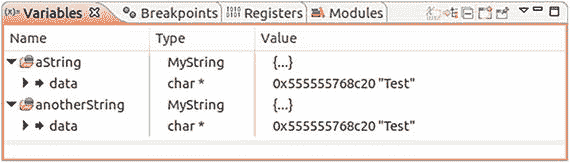
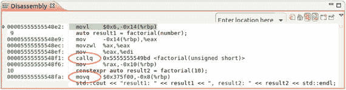

# 5.现代 C++的高级概念

在第 [3](3.html) 和 [4](4.html) 章中，我们讨论了为干净现代的 C++代码建立坚实基础的基本原则和实践。记住这些原则和规则，开发人员可以提高软件项目的内部 C++代码质量，因此，通常可以显著提高其外部质量。代码变得更容易理解，更容易维护，更容易扩展，更不容易出现错误，这对任何软件设计师来说都是一种更好的生活，因为使用这样一个可靠的代码库会更有趣。在第二章[中，我们还了解到，最重要的是，一套维护良好、制作精良的单元测试可以进一步提高软件的质量和开发效率。](2.html)

但是我们能做得更好吗？当然可以。

正如我在这本书的介绍中已经解释过的，在过去的几年中，优秀的老恐龙 C++经历了一些相当大的改进。语言标准 C++11(ISO/IEC 14882:2011 的缩写)，以及随后的标准 C++14(它只是 c++ 11 的一个小扩展)，以及最新版本的 C++17(它已经在 2017 年 6 月进入了最终的 ISO 投票过程)，已经在已经有些尘土飞扬的编程语言中形成了一个现代、灵活、高效的开发工具。通过这些标准引入的一些新概念，如移动语义，实际上是一种范式转变。

我已经在前几章中使用了这些 C++标准的一些特性，并在侧栏中做了大部分解释。现在是时候更深入地研究其中的一些，并探索它们如何支持我们编写非常可靠和现代的 C++代码。当然，在这里不可能完全讨论较新的 C++标准的所有语言特性。这将远远超出本书的范围，且不说这一点已被许多其他书籍所涵盖。因此，我选择了几个我认为非常支持编写干净的 C++代码的主题。

## 管理资源

管理资源是软件开发人员的基本工作。大量各种各样的资源必须定期分配、使用，并在使用后归还。其中包括以下内容:

*   内存(在堆栈上或堆上)；
*   访问硬盘或其他媒体上的文件(读/写)所需的文件句柄；
*   网络连接(例如，到服务器、数据库等。);
*   线程、锁、定时器和事务；
*   其他操作系统资源，如 Windows 操作系统上的 GDI 句柄。(缩写 GDI 代表图形设备接口。GDI 是微软 Windows 的核心操作系统组件，负责表示图形对象。)

正确处理资源可能是一项棘手的任务。考虑以下示例:

```cpp
void doSomething() {
  ResourceType* resource = new ResourceType();
  try {
    // ...do something with resource...
    resource->foo();
  } catch (...) {
    delete resource;
    throw;
  }
  delete resource;
}
Listing 5-1.Dealing with a resource that was allocated on the heap

```

这里有什么问题？也许你已经注意到了两个相同的陈述。包罗万象的异常处理机制在我们的程序中至少引入了两条可能的路径。这也意味着我们必须确保在两个地方释放资源。在正常情况下，这种无所不包的异常处理程序是不受欢迎的。但是在这种情况下，我们除了在这里捕获所有可能发生的异常之外没有其他机会，因为我们必须首先释放资源，然后再抛出异常对象，在其他地方处理它(例如，在函数的调用位置)。

在这个简化的例子中，我们只有两条路径。在真实的程序中，可以存在更多的执行路径。一个`delete`被遗忘的概率要高得多。任何遗忘的`delete`都会导致危险的资源泄漏。

Warning

不要低估资源泄漏！资源泄漏是一个严重的问题，特别是对于长寿命的进程，以及快速分配许多资源而在使用后不释放它们的进程。如果一个操作系统缺乏资源，这可能会导致严重的系统状态。此外，资源泄漏可能是一个安全问题，因为攻击者可以利用它们进行拒绝服务攻击。

对于上面的小示例，最简单的解决方案是在堆栈上分配资源，而不是在堆上分配:

```cpp
void doSomething() {
  ResourceType resource;

  // ...do something with resource...
  resource.foo();

}

Listing 5-2.Much easier: Dealing with a resource on the stack

```

通过这一更改，资源在任何情况下都会被安全删除。但有时不可能分配堆栈上的所有内容，正如我们在第 4 章中的“不要传递或返回 0 (NULL，nullptr)”一节中已经讨论过的。文件句柄、操作系统资源等等呢？？

核心问题是:我们如何保证分配的资源总是被释放？

### 资源获取是初始化(RAII)

资源获取是初始化(RAII)是一种习惯用法(见第 [9](9.html) 章关于习惯用法),可以帮助以安全的方式处理资源。这个习惯用法也被称为构造器获取、析构器释放(骨干)和基于范围的资源管理(SBRM)。

RAII 通过构造函数和相应的析构函数来利用类的对称性。我们可以在类的构造函数中分配资源，也可以在析构函数中释放它。如果我们创建这样的类作为模板，它可以用于不同类型的资源。

```cpp
template <typename RESTYPE>

class ScopedResource final {

public:
  ScopedResource() { managedResource = new RESTYPE(); }
  ∼ScopedResource() { delete managedResource; }

  RESTYPE* operator->() const { return managedResource; }

private:
  RESTYPE* managedResource;
};

Listing 5-3.A very simple class template that can manage several types

of resources

```

现在我们可以如下使用类模板`ScopedResource`:

```cpp
#include "ScopedResource.h"

#include "ResourceType.h"

void doSomething() {

  ScopedResource<ResourceType> resource;

  try {
    // ...do something with resource...
    resource->foo();
  } catch (...) {
    throw;
  }
}

Listing 5-4.Using ScopedResource to manage an instance

of ResourceType

```

很容易看出，不需要`new`或`delete`。如果`resource`超出范围，这可能发生在这个方法的不同点，类型`ResourceType`的包装实例通过`ScopedResource`的析构函数被自动删除。

但是通常没有必要重新发明轮子和实现这样的包装器，它也被称为智能指针。

### 智能指针

从 C++11 开始，标准库提供了不同的、高效的智能指针实现，以方便使用。这些指针在被引入 C++标准之前，已经在著名的 Boost library 项目中开发了很长一段时间，可以认为是非常简单的。智能指针降低了内存泄漏的可能性。此外，它们被设计成线程安全的。

本节提供了一个简要概述。

#### 具有 std::unique_ptr <t>的唯一所有权</t>

类模板`std::` `unique_ptr<T>`(在头文件`<memory>`中定义)管理一个指向`T`类型对象的指针。顾名思义，这种智能指针提供了唯一的所有权，即一个对象一次只能由`std::unique_ptr<T>`的一个实例拥有，这是`std::shared_ptr<T>`的主要区别，下面会解释。这也意味着不允许复制构造和复制赋值。

它的用法非常简单:

```cpp
#include <memory>

class ResourceType {
  //...
};

//...
std::unique_ptr<ResourceType> resource1 { std::make_unique<ResourceType>() };
// ... or shorter with type deduction ...

auto resource2 { std::make_unique<ResourceType>() };

```

在这个构造之后，`resource`可以像指向`ResourceType`实例的常规指针一样使用。(`std::make_unique<T>`在下文“避免新增和删除”一节中解释)。例如，您可以使用`*`和`->`操作符进行解引用:

```cpp
resource->foo();

```

当然，如果`resource`超出了范围，包含的类型`ResourceType`的实例将被安全释放。但最棒的是，`resource`可以很容易地放进集装箱，例如，装在`std::vector`里:

```cpp
#include "ResourceType.h"

#include <memory>

#include <vector>

using ResourceTypePtr = std::unique_ptr<ResourceType>;

using ResourceVector = std::vector<ResourceTypePtr>;

//...

ResourceTypePtr resource { std::make_unique<ResourceType>() };
ResourceVector aCollectionOfResources;
aCollectionOfResources.push_back(std::move(resource));
// IMPORTANT: At this point, the instance of 'resource' is empty!

```

请注意，我们确保`std::vector::push_back()`分别调用了`std::unique_ptr<T>`的 move 构造函数 move 赋值操作符(见下一章关于 move 语义的部分)。因此，`resource`不再管理一个对象，并被标记为空。

Caution

不要再在你的代码中使用`std::auto_ptr<T>`！随着 C++11 标准的发布，`std::auto_ptr<T>`已经被标记为“不推荐使用”,应该不再使用。在最新的标准 C++17 中，这个智能指针类模板现在终于从语言中删除了！这个智能指针的实现不支持右值引用和移动语义(参见本章后面关于移动语义的部分)，并且不能存储在标准库容器中。`std::unique_ptr<T>`是合适的替代者。

如前所述，不允许复制构造`std::` `unique_ptr<T>`。然而，托管资源的独占所有权可以通过使用移动语义(我们将在后面的章节中详细讨论移动语义)以如下方式转移到`std::unique_ptr<T>`的另一个实例:

```cpp
std::unique_ptr<ResourceType> pointer1 = std::make_unique<ResourceType>();
std::unique_ptr<ResourceType> pointer2; // pointer2 owns nothing yet

pointer2 = std::move(pointer1); // Now pointer1 is empty, pointer2 is the new owner

```

#### 与 std::shared_ptr <t>共享所有权</t>

类模板`std::shared_ptr<T>`(在头文件`<memory>`中定义)的实例可以获得`T`类型资源的所有权，并且可以与`std::shared_ptr<T>`的其他实例共享该所有权。换句话说，类型`T`的单个实例的所有权，以及删除它的责任，可以由许多共享所有者接管。

提供类似简单有限的垃圾收集器功能。智能指针的实现有一个引用计数器，它监视拥有共享对象的指针实例的数量。如果指针的最后一个实例被销毁，它将释放托管资源。

图 [5-1](#Fig1) 显示了一个 UML 对象图，描述了一个运行系统中的情况，其中三个实例(`client1`、`client2`和`client3`)使用三个智能指针实例共享同一个资源(`:Resource`)。


图 5-1。

An object diagram depicting how three clients are sharing one resource through smart pointers

与之前讨论的`std::unique_ptr<T>`相比，`std::shared_ptr<T>`当然可以像预期的那样进行复制构建。但是您可以通过使用`std::move<T>`来强制移动被管理的资源:

```cpp
std::shared_ptr<ResourceType> pointer1 = std::make_shared<ResourceType>();
std::shared_ptr<ResourceType> pointer2;

pointer2 = std::move(pointer1); // The reference count does not get modified, pointer1 is empty

```

在这种情况下，引用计数器不会被修改，但是在移动后使用变量`pointer1`时必须小心，因为它是空的，也就是说，它保存了一个`nullptr`。移动语义和实用函数`std::move<T>`将在后面的章节中讨论。

#### 没有所有权，但使用 std::weak_ptr <t>进行安全访问</t>

有时，有必要拥有一个非所有指针，指向一个或多个共享指针所拥有的资源。一开始你可能会说，“好吧，但是有什么问题呢？我只需通过调用`get()`的成员函数，随时从`std::shared_ptr<T>`的实例中获取原始指针。

```cpp
std::shared_ptr<ResourceType> resource = std::make_shared<ResourceType>();
// ...
ResourceType* rawPointerToResource = resource.get();
Listing 5-5.Retrieving the regular pointer from an instance of std::shared_ptr<T>

```

小心脚下！这可能很危险。如果`std::shared_ptr<ResourceType>`的最后一个实例在你程序的某个地方被销毁，而这个原始指针仍然在某个地方被使用，会发生什么？原始指针将指向无人区，使用它会导致严重的问题(记得我在前一章中对未定义行为的警告)。您绝对没有机会确定原始指针是指向资源的有效地址，还是指向内存中的任意位置。

如果你需要一个指向资源的指针而没有所有权，你应该使用`std::weak_ptr<T>`(在头文件`<memory>`中定义)，这对资源的生命周期没有影响。`std::weak_ptr<T>`仅仅“观察”被管理的资源，并且可以询问它是否有效。

```cpp
01  #include <memory>
02
03  void doSomething(const std::weak_ptr<ResourceType>& weakResource) {
04    if (! weakResource.expired()) {
05      // Now we know that weakResource contains a pointer to a valid object
06      std::shared_ptr<ResourceType> sharedResource = weakResource.lock();
07      // Use sharedResource...
08    }
09  }
10
11  int main() {
12    auto sharedResource(std::make_shared<ResourceType>());
13    std::weak_ptr<ResourceType> weakResource(sharedResource);
14
15    doSomething(weakResource);
16    sharedResource.reset(); // Deletes the managed instance of ResourceType
17    doSomething(weakResource);
18
19    return 0;
20  }
Listing 5-6.Using std::weak_ptr<T> to deal with resources that are not owned

```

正如您在上面代码示例的第 4 行所看到的，如果弱指针对象管理一个有效的资源，我们可以询问它。这是通过调用其成员函数`expired()`来完成的。`std::weak_ptr<T>`不提供解引用操作符，像`*`，或者`->`。如果我们想使用这个资源，我们首先必须调用`lock()`函数(见第 6 行)来从中获得一个共享指针对象。

你现在可能会问自己，这种智能指针类型的用例是什么。为什么它是必要的，因为我也可以在任何需要资源的地方使用`std::shared_ptr<T>`？

首先，通过`std::shared_ptr<T>`和`std::weak_ptr<T>`，你能够在软件设计中区分资源的所有者和资源的使用者。并不是每一个只为某个特定的和有时间限制的任务而需要资源的软件单元都想成为它的所有者。正如我们在上面的例子中的函数`doSomething()`中看到的，有时仅仅在有限的时间内将弱指针“提升”为强指针就足够了。

一个很好的例子就是对象缓存，为了提高性能，它将最近访问过的对象在内存中保存一段时间。缓存中的对象保存在`std::shared_ptr<T>`实例中，以及最后使用的时间戳。一种垃圾收集器进程定期运行，它扫描缓存并决定销毁那些在定义的时间跨度内没有使用的对象。

在那些使用缓存对象的地方，`std::weak_ptr<T>`的实例被用来保存指向这些对象的不拥有的指针。如果那些`std::weak_ptr<T>`实例的`expired()`成员函数返回 true，垃圾收集器进程已经从缓存中清除了对象。在另一种情况下，`std::weak_ptr<T>::lock()`函数可用于从中检索一个`std::shared_ptr<T>`。现在，即使垃圾收集器进程处于活动状态，也可以安全地使用该对象。要么该过程评估`std::shared_ptr<T>`的使用计数器，并确定该对象当前至少有一个用户在缓存之外。结果，对象的寿命被延长。或者进程从缓存中删除对象，这不会影响其用户。

另一个例子是处理循环依赖。例如，如果你有一个类`A`需要一个指向另一个类`B`的指针，反之亦然，你将会以一个循环依赖结束。如果您使用`std::shared_ptr<T>`来指向相应的另一个类，如下面的代码示例所示，您可能会导致内存泄漏。这样做的原因是在各自的共享指针实例中的使用计数器永远不会倒计数到 0。因此，这些对象永远不会被删除。

```cpp
#include <memory>

class B; // Forward declaration

class A {

public:
  void setB(std::shared_ptr<B>& pointerToB) {
    myPointerToB = pointerToB;
  }

private:
  std::shared_ptr<B> myPointerToB;
};

class B {

public:
  void setA(std::shared_ptr<A>& pointerToA) {
    myPointerToA = pointerToA;
  }

private:
  std::shared_ptr<A> myPointerToA;
};

int main() {
  { // Curly braces build a scope
    auto pointerToA = std::make_shared<A>();
    auto pointerToB = std::make_shared<B>();
    pointerToA->setB(pointerToB);
    pointerToB->setA(pointerToA);
  }
  // At this point, respectively one instance of A and B is "lost in space" (memory leak)

  return 0;
}

Listing 5-7.The problem with circular dependencies caused through a thoughtless use of std::shared_ptr<T>

```

如果类中的`std::shared_ptr<T>`成员变量被指向相应的其他类的不拥有的弱指针(`std::weak_ptr<T>`)替换，那么内存泄漏的问题就解决了。

```cpp
class B; // Forward declaration

class A {

public:
  void setB(std::shared_ptr<B>& pointerToB) {
    myPointerToB = pointerToB;
  }

private:
  std::weak_ptr<B> myPointerToB;
};

class B {

public:
  void setA(std::shared_ptr<A>& pointerToA) {
    myPointerToA = pointerToA;
  }

private:
  std::weak_ptr<A> myPointerToA;
};
// ...

Listing 5-8.Circular dependencies implemented in the right way with std::weak_ptr<T>

```

基本上，循环依赖在应用程序代码中是糟糕的设计，应该尽可能避免。在低级库中可能会有一些例外，循环依赖不会导致严重的问题。但是除此之外，你应该遵循在第 [6](6.html) 章的专门章节中讨论的非循环依赖原则。

### 避免显式新建和删除

在现代 C++程序中，当编写应用程序代码时，应该避免显式调用`new`和`delete`。为什么呢？简单而简短的解释是:`new`和`delete`增加了复杂性。

更详细的回答是这样的:每次当不可避免地调用`new`和`delete`时，人们都必须处理一个例外的、非违约的情况，一个需要特殊处理的情况。为了理解这些异常情况是什么，我们来看看默认情况——任何 C++开发人员都应该努力争取的情况。

通过以下措施可以避免`new`和/或`delete`的显式调用:

*   尽可能在堆栈上使用分配。堆栈上的分配既简单又安全(记住在第 [3](3.html) 章中讨论的 KISS 原则)。不可能泄漏堆栈上分配的任何内存。一旦超出范围，资源就会被破坏。您甚至可以通过值从函数中返回对象，从而将其内容传递给调用函数。
*   要在堆上分配资源，请使用“make functions”使用`std::make_unique<T>`或`std::make_shared<T>`来实例化资源，并立即将它包装到一个管理资源的管理器对象(一个智能指针)中。
*   在适当的地方使用容器(标准库、Boost 或其他)。容器管理其元素的存储空间。相反，在自行开发数据结构和序列的情况下，您不得不自己实施整个存储管理，这可能是一项复杂且容易出错的任务。
*   为来自需要特定内存管理的专有第三方库的资源提供包装器(见下一节)。

### 管理专有资源

正如在本节关于资源管理的介绍中已经提到的，有时需要使用默认的`new`或`delete`操作符来管理那些没有在堆上分配或释放的其他资源。这种资源的示例是来自文件系统的打开文件、动态加载的模块(例如，Windows 操作系统上的动态链接库(DLL))或图形用户界面的平台特定对象(例如，窗口、按钮、文本输入字段等)。).

通常这些类型的资源是通过一个叫做句柄的东西来管理的。句柄是对操作系统资源的抽象且唯一的引用。在 Windows 上，数据类型`HANDLE`用于定义这样的句柄。事实上，该数据类型在 header `WinNT.h`中定义如下，header`WinNT.h`是一个 C 风格的头文件，它定义了各种 Win32 API 宏和类型:

```cpp
typedef void *HANDLE;

```

例如，如果您想要访问具有某个进程 ID 的正在运行的 Windows 进程，您可以使用 Win32 API 函数`OpenProcess()`检索该进程的句柄。

```cpp
#include <windows.h>
// ...

const DWORD processId = 4711;
HANDLE processHandle = OpenProcess(PROCESS_ALL_ACCESS, FALSE, processId);

```

使用完手柄后，必须使用`CloseHandle()`功能关闭手柄:

```cpp
BOOL success = CloseHandle(processHandle);

```

因此，我们有类似于运算符`new`及其对应运算符`delete`的对称性。因此，也应该有可能利用 RAII 习惯用法，并为此类资源使用智能指针。首先，我们只需要用一个调用`CloseHandle()`的自定义删除器来替换默认删除器(调用`delete`):

```cpp
#include <windows.h> // Windows API declarations

class Win32HandleCloser {

public:
  void operator()(HANDLE handle) const {
    if (handle != INVALID_HANDLE_VALUE) {
      CloseHandle(handle);
    }
  }
};

```

小心点！如果您现在通过编写如下代码来定义类型别名，`std::shared_ptr<T>`将管理类型为`void**`的东西，因为`HANDLE`已经被定义为一个`void`指针:

```cpp
using Win32SharedHandle = std::shared_ptr<HANDLE>; // Caution!

```

因此，Win32 `HANDLE`的智能指针必须定义如下:

```cpp
using Win32SharedHandle = std::shared_ptr<void>;

using Win32WeakHandle = std::weak_ptr<void>;

```

Note

C++中不允许定义一个`std::unique_ptr<void>`！这是因为`std::shared_ptr<T>`实现了类型擦除，而`std::unique_ptr<T>`没有。如果一个类支持类型擦除，这意味着它可以存储任意类型的对象，并正确地销毁它们。

如果您想要使用共享句柄，您必须注意在构造期间将自定义删除器`Win32HandleCloser`的实例作为参数传递:

```cpp
const DWORD processId = 4711;
Win32SharedHandle processHandle { OpenProcess(PROCESS_ALL_ACCESS, FALSE, processId),
  Win32HandleCloser() };

```

## 我们喜欢移动它

如果有人问我 C++11 的哪一个特性可能对现在和将来如何编写现代 C++程序有最深远的影响，我会明确地提名 move semantics。我已经在第 [4](4.html) 章中简要讨论了 C++ move 语义，在关于避免常规指针的策略的章节中。但是我认为它们非常重要，所以我想在这里深化这个语言特性。

### 什么是移动语义？

在许多以前的案例中，旧的 C++语言强迫我们使用复制构造函数，我们实际上并不想创建一个对象的深层副本。相反，我们只是想“移动对象的有效载荷”一个对象的有效载荷只不过是该对象携带的嵌入数据，所以只不过是其他对象，或者像`int`这样的原始类型的成员变量。

例如，以前我们不得不复制对象而不是移动它的情况如下:

*   将本地对象实例作为函数或方法的返回值返回。在 C++11 之前，为了防止这些情况下的复制构造，经常使用指针。
*   将对象插入到`std::vector`或其他容器中。
*   `std::swap<T>`模板功能的实现。

在前面提到的许多情况下，没有必要保持源对象不变，也就是说，创建一个深层的，并且在运行时效率方面通常很昂贵的副本，以便源对象保持可用。

C++11 引入了一个语言特性，使得移动一个对象的嵌入数据成为一个头等操作。除了复制构造函数和复制赋值操作符，该类的开发者现在可以实现移动构造函数和移动赋值操作符(我们将在后面看到为什么他实际上不应该这样做！).移动操作通常非常有效。与真正的复制操作相反，源对象的数据只是移交给目标对象，操作的参数(源对象)被置于一种“空”或初始状态。

下面的例子展示了一个任意的类，它显式地实现了两种类型的语义:复制构造函数(第 6 行)和赋值操作符(第 8 行)，以及移动构造函数(第 7 行)和赋值操作符(第 9 行)。

```cpp
01  #include <string>
02
03  class Clazz {
04  public:
05    Clazz() noexcept;                         // Default constructor
06    Clazz(const Clazz& other);                // Copy constructor
07    Clazz(Clazz&& other) noexcept;            // Move constructor
08    Clazz& operator=(const Clazz& other);     // Copy assignment operator
09    Clazz& operator=(Clazz&& other) noexcept; // Move assignment operator
10    virtual ∼Clazz() noexcept;                // Destructor
11
12  private:
13    // ...
14  };
Listing 5-9.An example class that explicitely declares special member functions for copy and move

```

正如我们将在后面的“零的规则”一节中看到的，不显式声明和定义这样的构造函数和赋值操作符应该是任何 C++开发人员的主要目标。

移动语义与右值引用密切相关(见下一节)。当一个类的构造函数或者赋值操作符接受一个右值引用作为参数时，它们分别被称为“移动构造函数”和“移动赋值操作符”。右值引用通过双&运算符(`&&`)标记。为了更好的区分，带有单个&符号(`&`)的普通引用现在也被称为左值引用。

### 那些左值和右值的问题

所谓的左值和右值是历史术语(从 C 语言继承而来)，因为左值通常出现在赋值表达式的左侧，而右值通常出现在赋值表达式的右侧。在我看来，对 lvalue 更好的解释是，它是一个定位值。这清楚地表明左值表示占据存储器中的位置的对象(即，它具有可访问和可识别的存储器地址)。

相反，右值是表达式中所有非左值的对象。它是一个临时对象或其子对象。因此，不可能给右值赋值。

尽管这些定义来自旧的 C 世界，并且 C++11 仍然引入了更多的类别(xvalue、glvalue 和 prvalue)来支持 move 语义，但是它们对于日常使用来说还是相当不错的。

左值表达式的最简单形式是变量声明:

```cpp
Type var1;

```

表达式`var1`是一个类型为`Type`的左值。以下声明也表示左值:

```cpp
Type* pointer;
Type& reference;
Type& function();

```

左值可以是赋值操作的左操作数，就像本例中的整数变量`theAnswerToAllQuestions`:

```cpp
int theAnswerToAllQuestions = 42;

```

此外，将内存地址分配给指针表明指针是左值:

```cpp
Type* pointerToVar1 = &var1;

```

文字“42”是一个右值。它并不代表内存中可识别的位置，所以不可能给它赋值(当然，右值也会占用堆栈上数据段的内存，但是这个内存是临时分配的，在赋值操作完成后会立即释放):

```cpp
int number = 23; // Works, because 'number' is an lvalue
42 = number; // Compiler error: lvalue required as left operand of assignment

```

你不相信上面通用例子中第三行的`function()`是左值？是啊！您可以编写以下(毫无疑问，有些奇怪)代码，编译器会毫无怨言地编译它:

```cpp
int theAnswerToAllQuestions = 42;

int& function() {
  return theAnswerToAllQuestions;
}

int main() {
  function() = 23; // Works!
  return 0;
}

```

### 右值引用

如上所述，C++11 移动语义与右值引用密切相关。这些右值引用现在使得对右值的内存位置进行寻址成为可能。在下面的例子中，临时内存被分配给一个右值引用，从而使它成为“永久的”您甚至可以检索一个指向这个位置的指针，并使用这个指针操纵由右值引用所引用的内存。

```cpp
int&& rvalueReference = 25 + 17;

int* pointerToRvalueReference = &rvalueReference;
*pointerToRvalueReference = 23;

```

通过引入右值引用，这些引用当然也可以作为参数出现在函数或方法中。表 [5-1](#Tab1) 显示了可能性。

表 5-1。

Different function respectively method signatures, and their allowed parameter kinds

<colgroup><col> <col></colgroup> 
| 函数/方法签名 | 允许的参数种类 |
| --- | --- |
| `void function(Type param) void X::method(Type param)` | 左值和右值都可以作为参数传递。 |
| `void function(Type& param) void function(const Type& param) void X::method(Type& param) void X::method(const Type& param)` | 只有左值可以作为参数传递。 |
| `void function(Type&& param) void X::method(Type&& param)` | 只有右值可以作为参数传递。 |

表 [5-2](#Tab2) 显示了函数或方法的返回类型的情况，以及函数/方法的返回语句允许的内容:

表 5-2。

Possible kinds of return types of functions respectively parameters

<colgroup><col> <col></colgroup> 
| 函数/方法签名 | return 语句返回的可能数据类型 |
| --- | --- |
| `int function() int X::method()` | `[const] int`、`[const] int&`或`[const] int&&.` |
| `int& function() int& X::method()` | 非常数`int`或`int&.` |
| `int&& function() int&& X::method()` | 文字(例如，`return 42`)或一个对象的右值引用(通过`std::move()`获得),该对象的生存期比函数各自的方法范围长。 |

当然，尽管右值引用可以用于任何函数或方法中的参数，但它们的应用领域注定是在移动构造函数和移动赋值操作符中。

```cpp
#include <utility> // std::move<T>

class Clazz {

public:
  Clazz() = default;

  Clazz(const Clazz& other) {
    // Classical copy construction for lvalues
  }

  Clazz(Clazz&& other) noexcept {
    // Move constructor for rvalues: moves content from 'other' to this
  }
  Clazz& operator=(const Clazz& other) {
    // Classical copy assignment for lvalues
    return *this;
  }

  Clazz& operator=(Clazz&& other) noexcept {
    // Move assignment for rvalues: moves content from 'other' to this
    return *this;
  }
  // ...
};

int main() {
  Clazz anObject;
  Clazz anotherObject1(anObject);            // Calls copy constructor
  Clazz anotherObject2(std::move(anObject)); // Calls move constructor
  anObject = anotherObject1;                 // Calls copy assignment operator
  anotherObject2 = std::move(anObject);      // Calls move assignment operator
  return 0;
}

Listing 5-10.A class that explicitely defines both copy- and move semantics

```

### 不要强制到处移动

也许你已经注意到在上面的代码示例中使用了帮助函数`std::move<T>()`(在 header `<utility>`中定义)来强制编译器使用 move 语义。

首先，这个小助手功能的名字有误导性。`std::move<T>()`不会移动任何东西。这或多或少是一种生成对类型为`T`的对象的右值引用的强制转换。

在大多数情况下，没有必要这样做。在正常情况下，构造函数或赋值运算符的复制和移动版本之间的选择是在编译时通过重载决策自动完成的。编译器确定它面对的是左值还是右值，然后相应地选择最合适的构造函数或赋值运算符。C++标准库的容器类也考虑了由移动操作保证的异常安全级别(我们将在“预防胜于治疗”一节中更详细地讨论这个主题)。

请特别注意这一点——不要像这样编写代码:

```cpp
#include <string>

#include <utility>

#include <vector>

using StringVector = std::vector<std::string>;

StringVector createVectorOfStrings() {
  StringVector result;
  // ...do something that the vector is filled with many strings...
  return std::move(result); // Bad and unnecessary, just write "return result;"!
}

Listing 5-11.An improper use of std::move()

```

在 return 语句中使用`std::` `move<T>()`不仅完全没有必要，因为编译器已经知道该变量是要从函数中移出的候选变量(从 C++11 开始，所有标准库容器以及标准库的许多其他类都支持 move 语义，如`std::string`)。更糟糕的影响可能是它会干扰 RVO(返回值优化)，也称为复制省略，现在几乎所有编译器都在执行。RVO 独立副本省略允许编译器在从函数或方法返回值时优化掉代价高昂的副本构造。

永远记住第三章[中的重要原则:小心优化！不要到处用`std::move<T>()`语句搞乱你的代码，只是因为你认为你可以用代码的优化来比你的编译器更聪明。你不是！到处都有这些`std::move<T>()`，你的代码的可读性将会受到影响，并且你的编译器可能无法正确地执行它的优化策略。](3.html)

### 零的规则

作为一个有经验的 C++开发人员，你可能已经知道了三法则和五法则。三原则[Koenig01]最初由 Marshall Cline 在 1991 年提出，它指出如果一个类显式地定义了一个析构函数，那么它应该总是定义一个复制构造函数和一个复制赋值操作符。随着 C++11 的出现，这个规则被扩展成了五规则，因为语言中增加了移动构造函数和移动赋值操作符，而且如果一个类定义了析构函数，这两个特殊的成员函数也必须被定义。

“三法则”和“五法则”在 C++类设计中一直是很好的建议，而当开发人员没有考虑它们时，可能会出现微妙的错误，正如下面故意编写的糟糕代码示例所示。

```cpp
#include <cstring>

class MyString {

public:
  explicit MyString(const std::size_t sizeOfString) : data { new char[sizeOfString] } { }
  MyString(const char* const charArray, const std::size_t sizeOfArray) {
    data = new char[sizeOfArray];
    strcpy(data, charArray);
  }
  virtual ∼MyString() { delete[] data; };

  char& operator[](const std::size_t index) {
    return data[index];
  }
  const char& operator[](const std::size_t index) const {
    return data[index];
  }
  // ...

private:
  char* data;
};

Listing 5-12.An improper implementation of a string class

```

这确实是一个非常业余的实现的 string 类，有一些缺陷，例如，没有一个`nullptr`被传递到初始化构造函数中，并且完全忽略了字符串通常可以增长和收缩的事实。当然，现在没有人必须自己实现一个 string 类，从而重新发明轮子。有了`std::string`，C++标准库中有了一个防弹的字符串类。然而，根据上面的例子，很容易证明为什么遵守五原则是重要的。

为了安全地释放由初始化构造函数为内部字符串表示分配的内存，必须定义一个显式析构函数，并且必须实现它来实现这一点。然而，在上面的类中，违反了五的规则，并且缺少显式的复制/移动构造函数，以及复制/移动赋值操作符。

现在，让我们假设我们以下面的方式使用类`MyString`:

```cpp
int main() {
  MyString aString("Test", 4);
  MyString anotherString { aString }; // Uh oh! :-(
  return 0;
}

```

由于我们的`MyString`类没有显式定义复制或移动构造函数，编译器会合成这些特殊的成员函数，即编译器会分别生成一个默认的复制构造函数和一个默认的移动构造函数。这些默认实现只创建源对象成员变量的平面副本。在我们的例子中，存储在字符指针`data`中的地址值被复制，但不是这个指针指向的内存区域。

这意味着:在自动生成的默认复制构造函数被调用来创建`anotherString`之后，`MyString`的两个实例共享相同的数据，这在图 [5-2](#Fig2) 所示的调试器的变量视图中很容易看到。



图 5-2。

Both character pointers are pointing to the same memory address

如果字符串对象被破坏，这将导致内部数据的双重删除，从而可能导致严重的问题，如分段错误或未定义的行为。

在正常情况下，没有理由为类定义显式析构函数。每次当你被迫定义一个析构函数时，这都是一个值得注意的异常，因为它表明你需要在一个对象的生命周期结束时用资源做一些特殊的事情，这需要相当大的努力。通常需要一个重要的析构函数来释放资源，例如，堆上的内存。因此，您还需要定义显式的复制/移动构造函数和复制/移动赋值操作符，以便在复制或移动时正确处理这些资源。这就是五法则的含义。

有不同的方法来处理上述问题。例如，我们可以提供显式的复制/移动构造函数以及复制/移动赋值操作符来正确处理分配的内存，例如，通过创建指针所指向的内存区域的深层副本。另一种方法是禁止复制和移动，并防止编译器生成这些函数的默认版本。从 C++11 开始，可以通过删除这些特殊的成员函数来做到这一点，这样任何被删除函数的使用都是不良形式的，也就是说，程序将无法编译。

```cpp
class MyString {

public:
  explicit MyString(const std::size_t sizeOfString) : data { new char[sizeOfString] } { }
  MyString(const char* const charArray, const int sizeOfArray) {
    data = new char[sizeOfArray];
    strcpy(data, charArray);
  }
  virtual ∼MyString() { delete[] data; };
  MyString(const MyString&) = delete;
  MyString& operator=(const MyString&) = delete;
  // ...
};
Listing 5-13.A modified MyString class that explicitely deletes copy constructor and copy assignment operator

```

问题是，通过删除特殊的成员函数，该类现在的使用范围非常有限。例如，`MyString`现在不能用在`std::vector`中，因为`std::vector`要求其元素类型`T`是可复制赋值和可复制构造的。

好了，现在是时候选择一种不同的方法和不同的思维方式了。我们要做的是去掉释放已分配资源的析构函数。如果成功了，根据规则五，也没有必要显式地提供其他特殊的成员函数。所以我们开始吧:

```cpp
#include <vector>

class MyString {

public:
  explicit MyString(const std::size_t sizeOfString) {
    data.resize(sizeOfString, ’ ’);
  }

  MyString(const char* const charArray, const int sizeOfArray) : MyString(sizeOfArray) {
    if (charArray != nullptr) {
      for (int index = 0; index < sizeOfArray; index++) {
        data[index] = charArray[index];
      }
    }
  }

  char& operator[](const std::size_t index) {
    return data[index];
  }

  const char& operator[](const std::size_t index) const {
    return data[index];
  }
  // ...

private:
  std::vector<char> data;
};

Listing 5-14.Replacing the char-pointer by a vector of char makes an explicit destructor superfluous

```

再一次备注:我知道这是一个不切实际的业余实现一个自制的字符串，现在已经没有必要了，但这只是为了演示。

现在发生了什么变化？我们已经用元素类型为`char`的`std::vector`替换了类型为`char*`的私有成员。因此，我们不再需要一个显式的析构函数，因为如果一个类型为`MyString`的对象被销毁了，我们就什么都不用做了。不需要释放任何资源。因此，编译器生成的特殊成员函数，如复制/移动构造函数或复制/移动赋值操作符，在使用时会自动执行正确的操作，我们不必显式定义它们。这是个好消息，因为我们遵循了接吻原则(见第三章)。

这就引出了零的法则！零规则是 R. Martinho Fernandes 在 2012 年的一篇博客文章中提出的。ISO 标准委员会成员、HSR 技术学院 IFS 软件研究所所长 Peter Sommerlad 教授在一次关于会议 C++ 2013 [Sommerlad13]的会议演讲中也提出了该规则。规则是这样说的:

编写类时，既不需要声明/定义析构函数，也不需要声明/定义复制/移动构造函数或复制/移动赋值运算符。使用 C++智能指针和标准库类和容器来管理资源。

换句话说，零规则表明，您的类应该以这样一种方式设计，即编译器生成的用于复制、移动和销毁的成员函数自动做正确的事情。这使得你的类更容易理解(总是想起第 [3](3.html) 章中的 KISS 原则)，更不容易出错，更易于维护。其背后的原则是:用更少的代码做更多的事情。

## 编译器是你的同事

正如我已经在其他地方写过的，C++11 语言标准的出现已经从根本上改变了现代和干净的 C++程序的设计方式。程序员在编写现代 C++代码时使用的风格、模式和习惯用法与以前完全不同。除了新的 C++标准提供了许多有用的新特性来编写可维护、可理解、高效和可测试的 C++代码这一事实之外，还有一些东西也发生了变化:编译器的角色！

以前，编译器只是一种工具，用来将源代码翻译成计算机可执行的机器指令(目标代码);但是现在它越来越成为在不同层面上支持开发者的工具。现在使用 C++编译器的三个指导原则如下:

*   所有能在编译时完成的事情也应该在编译时完成。
*   所有可以在编译时检查的东西也应该在编译时检查。
*   编译器所能知道的关于程序的一切也应该由编译器来决定。

在前面的章节中，我们已经在某些地方体验了编译器是如何支持我们的。例如，在关于移动语义的章节中，我们已经看到现代 C++编译器现在能够执行多种复杂的优化(例如，复制省略),我们不必再关心这些。在接下来的几节中，我将向您展示编译器如何支持我们开发人员，并使许多事情变得更加简单。

### 自动类型推导

还记得 C++11 之前的 C++关键字`auto`的含义吗？我很确定这可能是这门语言中最不为人知和使用最少的关键字。也许你还记得 C++98 或 C++03 中的`auto`是一个所谓的存储类说明符，它被用来定义一个局部变量具有“自动持续时间”，也就是说，变量在定义时被创建，当它所属的块退出时被销毁。从 C++11 开始，所有变量默认都有自动持续时间，除非另有说明。因此，`auto`以前的语义变得没用了，这个关键词有了全新的含义。

如今，`auto`用于自动类型推导，有时也叫类型推断。如果它用作变量的类型说明符，则它指定正在声明的变量的类型将从其初始值设定项中自动推导(或推断)出来，如以下示例所示:

```cpp
auto theAnswerToAllQuestions = 42;

auto iter = begin(myMap);

const auto gravitationalAccelerationOnEarth = 9.80665;

constexpr auto sum = 10 + 20 + 12;

auto strings = { "The", "big", "brown", "fox", "jumps", "over", "the", "lazy", "dog" };

auto numberOfStrings = strings.size();

```

Argument Dependent Name Lookup (ADL)

参数相关(名称)查找(简称:ADL)，也称为 Koenig Lookup(以美国计算机科学家安德鲁·克尼格的名字命名)，是一种编译器技术，它根据在调用位置传递给函数的参数类型来查找非限定的函数名(即没有前缀命名空间限定符的函数名)。

假设您有一个`std::map<K, T>`(在标题`<map>`中定义)，如下所示:

```cpp
#include <map>

#include <string>
std::map<unsigned int, std::string> words;

```

由于 ADL，如果使用`begin()`或`end()`函数从容器中检索迭代器，就没有必要指定名称空间`std`。你可以简单地写:

```cpp
auto wordIterator = begin(words);

```

编译器不仅会查看局部范围，还会查看包含参数类型的名称空间(在本例中是`map<T>`的名称空间，也就是`std`)。因此，在上面的例子中，编译器为名称空间`std`中的地图找到了一个合适的`begin()`函数。

在某些情况下，您需要显式定义名称空间，例如，如果您想对一个简单的 C 风格数组使用`std::begin()`和`std::end()`。

乍一看，使用`auto`而不是具体类型似乎是一个方便的特性。开发人员不再被迫记住类型的名称。他们简单地写`auto`、`const auto`、`auto&`(对于引用)或`const auto&`(对于常量引用)，编译器做剩下的事情，因为它知道赋值的类型。自动类型推导当然也可以与`constexpr`结合使用(参见关于编译时计算的章节)。

请不要害怕尽可能多地使用`auto`(或分别使用`auto&``const auto&`)。代码仍然是静态类型的，变量的类型也有明确的定义。例如，上例中的变量`strings`的类型是`std::initializer_list<const char*>`，变量`numberOfStrings`的类型是`std::initializer_list<const char*>::size_type`。

Std::Initializer_List<t> [C++11]

在以前(C++11 以前)，如果我们想用文字初始化一个标准的库容器，我们必须做以下事情:

```cpp
std::vector<int> integerSequence;
integerSequence.push_back(14);
integerSequence.push_back(33);
integerSequence.push_back(69);
// ...and so on...

```

从 C++11 开始，我们可以简单地这样做:

```cpp
std::vector<int> integerSequence { 14, 33, 69, 104, 222, 534 };

```

原因是`std::vector<T>`有一个重载的构造函数，它接受一个所谓的初始化列表作为参数。初始化列表是一个类型为`std::initializer_list<T>`的对象(在头文件`<initializer_list>`中定义)。

当您使用用一对花括号括起来的逗号分隔的文字列表(所谓的 bracked-init-list)时，类型`std::initializer_list<T>`的实例会自动构造。您可以为自己的类配备可以接受初始化列表的构造函数，如下例所示:

```cpp
#include <string>

#include <vector>

using WordList = std::vector<std::string>;

class LexicalRepository {

public:
  explicit LexicalRepository(const std::initializer_list<const char*>& words) {
    wordList.insert(begin(wordList), begin(words), end(words));
  }
  // ...

private:
  WordList wordList;
};

int main() {
  LexicalRepository repo { "The", "big", "brown", "fox", "jumps", "over", "the", "lazy", "dog" };
  // ...
  return 0;
}

```

注意:这个初始化列表不应该和它的成员初始化列表混淆！

从 C++14 开始，也支持函数的自动返回类型推导。当一个返回类型有一个难以记忆或难以理解的名称时，这尤其有用，在将复杂的非标准数据类型作为返回类型处理时，经常会出现这种情况。

```cpp
auto function() {
  std::vector<std::map<std::pair<int, double>, int>> returnValue;
  // ...fill ’returnValue’ with data...
  return returnValue;
}

```

我们到现在还没有讨论 lambda 函数(它们将在第 [7](7.html) 章中详细讨论)，但是 C++11 和更高版本允许你在命名变量中存储 lambda 表达式:

```cpp
auto square = [](int x) { return x * x; };

```

也许你现在想知道:在第 4 章[T2，作者告诉我们一个富有表现力的好的命名对于代码的可读性是很重要的，应该是每个专业程序员的主要目标。同一个作者现在提倡使用关键字`auto`，这使得仅仅通过阅读代码来快速识别变量的类型变得更加困难。这不是矛盾吗？](4.html)

我的明确回答是:不，恰恰相反！除了少数例外，`auto`可以提高代码的可读性。让我们看看变量赋值的以下两种替代方案:

```cpp
// 1st version: without auto
std::shared_ptr<controller::CreateMonthlyInvoicesController> createMonthlyInvoicesController =
  std::make_shared<controller::CreateMonthlyInvoicesController>();

// 2nd version: with auto:

auto createMonthlyInvoicesController =
  std::make_shared<controller::CreateMonthlyInvoicesController>();

Listing 5-15.Which one of the following two versions would you prefer?

```

在我看来，使用`auto`的版本更容易阅读。没有必要显式地重复类型，因为从它的初始化式中可以很清楚地看出`createMonthlyInvoicesController`将是什么类型。顺便说一下，重复显式类型也是对 DRY 原则的一种违反(参见第 [3](3.html) 章)。如果你想到上面这个名为`square`的 lambda 表达式，它的类型是一个唯一的、未命名的非联合类类型，那么如何显式定义这样的类型呢？

所以，我的建议是:

如果不影响代码的意图，尽可能使用 auto！

### 编译期间的计算

高性能计算(HPC)的爱好者，以及嵌入式软件的开发人员和喜欢使用静态常量表来分离数据和代码的程序员，都希望在编译时尽可能多地进行计算。这样做的原因很容易理解:所有可以在编译时计算或评估的东西不一定要在运行时计算或评估。换句话说:在编译时尽可能多的计算是提高程序运行效率的唾手可得的成果。这种优势有时伴随着一个缺点，那就是编译代码所花费的时间或多或少会增加。

从 C++11 开始，就有了`constexpr`(常量表达式)说明符来定义在编译时评估一个函数或变量的值是可能的。随后的标准 C++14 取消了以前对`constexpr`的一些严格限制。例如，一个由`constexpr`指定的函数只允许有一个`return`语句。这个限制从 C++14 开始就取消了。

一个最简单的例子是，变量值是在编译时通过算术运算从文字中计算出来的，如下所示:

```cpp
constexpr int theAnswerToAllQuestions = 10 + 20 + 12;

```

变量`theAnswerToAllQuestions`也是一个常量，就好像已经用`const`声明了一样；因此，您不能在运行时操作它:

```cpp
int main() {
  // ...
  theAnswerToAllQuestions = 23; // Compiler error: assignment of read-only variable!
  return 0;
}

```

还有`constexpr`功能:

```cpp
constexpr int multiply(const int multiplier, const int multiplicand) {
  return multiplier * multiplicand;
}

```

这种函数可以在编译时调用，但在运行时也像普通函数一样使用非常数参数。这对于借助单元测试来测试那些功能的原因来说已经是必要的了(参见第 [2](2.html) 章)。

```cpp
constexpr int theAnswerToAllQuestions = multiply(7, 6);

```

不出所料，也可以递归调用`constexpr`指定的函数，如下面计算阶乘的函数示例所示。

```cpp
01  #include <iostream>
02
03  constexpr unsigned long long factorial(const unsigned short n) {
04    return n > 1 ? n * factorial(n - 1) : 1;
05  }
06
07  int main() {
08    unsigned short number = 6;
09    auto result1 = factorial(number);
10    constexpr auto result2 = factorial(10);
11
12    std::cout << "result1: " << result1 << ", result2: " << result2 << std::endl;
13    return 0;
14  }
Listing 5-16.Calculating the factorial of a non-negative integer ’n’ at compile time

```

前面的例子已经在 C++11 下运行了。`factorial()`函数只包含一条语句，在`constexpr`函数中从一开始就允许递归。`main()`函数包含对`factorial()`函数的两次调用。仔细看看这两个函数调用是值得的。

第 9 行的第一个调用使用变量`number`作为函数参数`n`的变量，其结果被赋给一个非常数变量`result1`。第 10 行的第二个函数调用使用一个数字文本作为参数，它的结果被赋给一个带有`constexpr`说明符的变量。这两个函数调用在运行时的区别可以在反汇编的目标代码中最清楚地看到。图 [5-3](#Fig3) 显示了 Eclipse CDT 反汇编窗口中关键点的目标代码。



图 5-3。

The disassembled object code

第 9 行的第一个函数调用产生了五条机器指令。第四条指令(`callq`)是在内存地址`0x5555555549bd`跳转到函数`factorial()`。换句话说，很明显这个函数是在运行时调用的。相比之下，我们看到第 10 行对`factorial()`的第二次调用只产生了一条简单的机器指令。`movq`指令将四字从源操作数复制到目标操作数。在运行时没有昂贵的函数调用。`factorial(10`的结果，十六进制的是`0x375f00`，十进制的分别是 3，628，800，已经在编译时计算出来，并且像目标代码中的常量一样可用。

正如我之前所写的，从 C++14 开始，C++11 中对`contexpr`指定函数的一些限制已经被废除了。例如，一个`constexpr`指定的函数现在可以有不止一个`return`语句，它可以有像`if` - `else`这样的条件——分支，“文字”类型的局部变量，或者循环。基本上，几乎所有的 C++语句都是允许的，如果它们没有预先假定或者要求一些只有在运行时环境中才可用的东西，例如，在堆上分配内存，或者抛出异常。

### 可变模板

我认为`constexpr`也可以用在模板中就不那么奇怪了，如下例所示。

```cpp
template <typename T>

constexpr T pi = T(3.1415926535897932384626433L);
Listing 5-17.A variable template for mathematical constant pi

```

这就是所谓的变量模板，通过对宏使用`#define`来代替古老的常量定义，这是一个很好且灵活的选择(参见第 [4 章](4.html)中的“避免宏”一节)。根据模板实例化过程中的使用上下文，数学常数 pi 被分为`float`、`double`或`long double`。

```cpp
template <typename T>

constexpr T computeCircumference(const T radius) {
  return 2 * radius * pi<T>;
}

int main() {
  const long double radius { 10.0L };
  constexpr long double circumference = computeCircumference(radius);
  std::cout << circumference << std::endl;
  return 0;
}

Listing 5-18.Calculating a circles circumference at compile time using variable template ’pi’

```

最后但同样重要的是，你也可以在编译时在计算中使用类。你可以为类定义`constexpr`构造函数和成员函数。

```cpp
#include <iostream>

#include <cmath>

class Rectangle {

public:
  constexpr Rectangle() = delete;
  constexpr Rectangle(const double width, const double height) :
    width { width }, height { height } { }
  constexpr double getWidth() const { return width; }
  constexpr double getHeight() const { return height; }
  constexpr double getArea() const { return width * height; }
  constexpr double getLengthOfDiagonal() const {
    return std::sqrt(std::pow(width, 2.0) + std::pow(height, 2.0));
  }

private:
  double width;
  double height;
};

int main() {
  constexpr Rectangle americanFootballPlayingField { 48.76, 110.0 };
  constexpr double area = americanFootballPlayingField.getArea();
  constexpr double diagonal = americanFootballPlayingField.getLengthOfDiagonal();

  std::cout << "The area of an American Football playing field is " <<
      area << "m^2 and the length of its diagonal is " << diagonal <<
      "m." << std::endl;
  return 0;
}

Listing 5-19.Rectangle is a constexpr class

```

另外，在编译时和运行时都可以使用类。然而，与普通类相反，它不允许定义虚拟成员函数(编译时没有多态性)，并且`constexpr`类不能有显式定义的析构函数。

Note

上述代码示例可能无法在某些 C++编译器上编译。按照今天的标准，C++标准并没有将 numerics 库(头文件`<cmath>`)中常见的数学函数指定为`constexpr`，像`std::sqrt()`和`std::pow()`。编译器实现可以自由地做这件事，但这不是强制性的。

然而，从干净代码的角度来看，应该如何判断编译时的这些计算呢？把`constexpr`加到任何可能拥有它的事物上，基本上是个好主意吗？

嗯，我的看法是`constexpr`并没有降低代码的可读性。说明符总是在变量和常量定义之前，分别在函数或方法声明之前。因此，它不会打扰太多。另一方面，如果我明确知道某个东西永远不会在编译时被求值，我也应该放弃这个说明符。

## 不允许未定义的行为

在 C++(以及其他一些编程语言)中，语言规范没有定义任何可能情况下的行为。在某些地方，规范说某个操作的行为在某些情况下是未定义的。在这种情况下，您无法预测会发生什么，因为程序的行为取决于编译器的实现、底层操作系统或特殊的优化开关。那真的很糟糕！该程序可能会崩溃或悄悄地产生不正确的结果。

下面是一个未定义行为的例子，一个智能指针的错误使用:

```cpp
const std::size_t NUMBER_OF_STRINGS { 100 };
std::shared_ptr<std::string> arrayOfStrings(new std::string[NUMBER_OF_STRINGS]>);

```

假设这个`std::shared_ptr<T>`对象是最后一个指向字符串数组资源的对象，在某个地方超出了作用域，会发生什么？

答:`std::shared_ptr<T>`的析构函数减少了共享所有者的数量，计数器变为零。结果，由智能指针管理的资源(`std::string`的数组)通过调用它的析构函数被销毁。但是它会做错，因为当你使用`new[]`分配托管资源时，你需要调用数组形式`delete[]`，而不是`delete`，来释放资源，而`std::shared_ptr<T>`的默认删除器使用`delete`。

用`delete`而不是`delete[]`删除数组会导致未定义的行为。没有具体说明会发生什么。也许这会导致内存泄漏，但这只是猜测。

Caution

避免未定义的行为！这是一个严重的错误，最终程序会无声无息地出错。

让智能指针正确删除字符串数组有几种解决方案。例如，你可以提供一个自定义删除器作为类似函数的对象(也称为“仿函数”，参见第 [7](7.html) 章):

```cpp
template< typename Type >

struct CustomArrayDeleter
{
  void operator()(Type const* pointer)
  {
    delete [] pointer;
  }
};

```

现在，您可以使用自己的删除器，如下所示:

```cpp
const std::size_t NUMBER_OF_STRINGS { 100 };
std::shared_ptr<std::string> arrayOfStrings(new std::string[NUMBER_OF_STRINGS], CustomArrayDeleter<std::string>());

```

在 C++11 中，头文件`<memory>`中定义了一个默认的数组类型删除器:

```cpp
const std::size_t NUMBER_OF_STRINGS { 100 };
std::shared_ptr<std::string> arrayOfStrings(new std::string[NUMBER_OF_STRINGS],
  std::default_delete<std::string[]>());

```

当然，根据要满足的需求，应该考虑使用`std::vector`是否总是实现“事物数组”的最佳解决方案

## 类型丰富的编程

不要相信名字。信任类型。类型不会说谎。类型是你的朋友！——马里奥·富斯科(@mariofusco)，2016 年 4 月 13 日，在推特上

1999 年 9 月 23 日，经过 10 个月的太阳系第四行星之旅，美国宇航局失去了火星气候轨道器 I，一个机器人太空探测器。当飞船进入轨道插入时，位于科罗拉多州的洛克希德·马丁航天公司的推进团队和位于帕萨迪纳(加利福尼亚州)的美国宇航局任务导航团队之间的重要数据传输失败。这个错误把飞船推到了离火星大气层太近的地方，在那里它立即燃烧了。


图 5-4。

Artist's rendering of the Mars Climate Orbiter (Author: NASA/JPL/Corby Waste; License: Public Domain)

数据传输失败的原因是美国宇航局任务导航团队使用国际单位制(SI)，而洛克希德·马丁公司的导航软件使用英制单位(英制测量系统)。任务导航小组使用的软件已经发送了磅-力-秒(lbf s)的值，但是轨道飞行器的导航软件期望的值是牛顿-秒(N s)。美国航天局的总财务损失为 3.28 亿美元。大约 200 名优秀的航天器工程师毕生的工作在几秒钟内毁于一旦。

这个失败不是一个简单软件错误的典型例子。这两个系统本身可能都运转正常。但是它揭示了软件开发中一个有趣的方面。看来两个工程团队之间的沟通和协调问题是这次失败的主要原因。显而易见:既没有对两个子系统进行联合系统测试，也没有正确设计两个子系统之间的接口。人们有时会犯错误。这里的问题不是错误，而是美国宇航局系统工程的失败，以及我们在检测错误的过程中的检查和平衡。这就是我们失去太空船的原因。——爱德华·魏勒博士，美国航天局负责空间科学的副署长[JPL99]

事实上，我对火星气候轨道器的系统软件一无所知。但是根据故障的检查报告，我了解到一个软件产生的结果使用“英制”单位，而另一个使用这些结果的软件希望它们使用公制单位。

我想每个人都知道 C++成员函数声明，看起来像下面的类:

```cpp
class SpacecraftTrajectoryControl {

public:
  void applyMomentumToSpacecraftBody(const double impulseValue);
};

```

`double`代表什么？名为`applyMomentumToSpacecraftBody`的成员函数所期望的值是什么单位？它是以牛顿(N)、牛顿-秒(N s)、磅-力-秒(lbf s)还是其他任何单位测量的值？事实上我们并不知道。`double`可以是任何东西。当然，它是一种类型，但不是语义类型。也许它已经被记录在某个地方，或者我们可以给这个参数一个更有意义、更详细的名字，比如`impulseValueInNewtonSeconds`，这总比什么都没有好。但是，即使最好的文档或参数名也不能保证这个类的客户端将一个不正确的单元值传递给这个成员函数。

我们能做得更好吗？我们当然可以。

我们真正想要的是正确定义一个接口，并且有丰富的语义，就像这样:

```cpp
class SpacecraftTrajectoryControl {

public:
  void applyMomentumToSpacecraftBody(const Momentum& impulseValue);
};

```

在力学中，动量是用牛顿-秒(Ns)来度量的。一牛顿秒(1 Ns)是一牛顿(在国际单位制中是 1 千克米/秒 2)作用于一个物体(物理物体)一秒的力。

要使用类似于`Momentum`的类型来代替非特定的浮点类型`double`，我们必须首先引入该类型。在第一步中，我们定义了一个模板，它可以用来表示基于 MKS 单位制的物理量。缩写 MKS 代表米(长度)、千克(质量)和秒(时间)。这三个基本单位可以用来表示任何给定的物理测量。

```cpp
template <int M, int K, int S>

struct MksUnit {
  enum { metre = M, kilogram = K, second = S};
};
Listing 5-20.A class template to represent MKS units

```

此外，我们需要一个表示值的类模板:

```cpp
template <typename MksUnit>

class Value {

private:
  long double magnitude{ 0.0 };

public:
  explicit Value(const long double magnitude) : magnitude(magnitude) {}
  long double getMagnitude() const {
    return magnitude;
  }
};

Listing 5-21.A class template to represent values of MKS units

```

接下来，我们可以使用这两个类模板来定义具体物理量的类型别名。以下是一些例子:

```cpp
using DimensionlessQuantity = Value<MksUnit<0, 0, 0>>;

using Length = Value<MksUnit<1, 0, 0>>;

using Area = Value<MksUnit<2, 0, 0>>;

using Volume = Value<MksUnit<3, 0, 0>>;

using Mass = Value<MksUnit<0, 1, 0>>;

using Time = Value<MksUnit<0, 0, 1>>;

using Speed = Value<MksUnit<1, 0, -1>>;

using Acceleration = Value<MksUnit<1, 0, -2>>;

using Frequency = Value<MksUnit<0, 0, -1>>;

using Force = Value<MksUnit<1, 1, -2>>;

using Pressure = Value<MksUnit<-1, 1, -2>>;
// ... etc. ...

```

现在也可以定义`Momentum`，这是我们的`applyMomentumToSpacecraftBody`成员函数所需的参数类型:

```cpp
using Momentum = Value<MksUnit<1, 1, -1>>;

```

在我们引入类型别名`Momentum`之后，下面的代码将无法编译，因为没有合适的构造函数将`double`转换为`Value<MksUnit<1,1,-1>>`:

```cpp
SpacecraftTrajectoryControl control;

const double someValue = 13.75;
control.applyMomentumToSpacecraftBody(someValue); // Compile-time error!

```

即使是下一个例子也会导致编译时错误，因为类型为`Force`的变量不能像`Momentum`一样使用，并且必须防止这些不同维度之间的隐式转换:

```cpp
SpacecraftTrajectoryControl control;
Force force { 13.75 };
control.applyMomentumToSpacecraftBody(force); // Compile-time error!

```

但是这个会工作得很好:

```cpp
SpacecraftTrajectoryControl control;
Momentum momentum { 13.75 };
control.applyMomentumToSpacecraftBody(momentum);

```

这些单位也可用于常数的定义。为此，我们需要稍微修改一下类模板`Value`。我们将关键字`constexpr`(参见第四章[中的“编译期间的计算”一节)添加到初始化构造函数和`getMagnitude()`成员函数中。这不仅允许我们创建不必在运行时初始化的编译时常量`Value`。正如我们将在后面看到的，我们现在也能够在编译时用我们的物理值进行计算。](4.html)

```cpp
template <typename MksUnit>

class Value {

public:
  constexpr explicit Value(const long double magnitude) noexcept : magnitude { magnitude } {}
  constexpr long double getMagnitude() const noexcept {
    return magnitude;
  }

private:

  long double magnitude { 0.0 };
};

```

此后，不同物理单位的常数可以定义如下:

```cpp
constexpr Acceleration gravitationalAccelerationOnEarth { 9.80665 };

constexpr Pressure standardPressureOnSeaLevel { 1013.25 };

constexpr Speed speedOfLight { 299792458.0 };

constexpr Frequency concertPitchA { 440.0 };

constexpr Mass neutronMass { 1.6749286e-27 };

```

此外，如果实现了必要的操作符，单元之间的计算是可能的。例如，这些是加法、减法、乘法和除法运算符模板，用于对不同 MKS 单位的两个值执行不同的计算:

```cpp
template <int M, int K, int S>

constexpr Value<MksUnit<M, K, S>> operator+
  (const Value<MksUnit<M, K, S>>& lhs, const Value<MksUnit<M, K, S>>& rhs) noexcept {
  return Value<MksUnit<M, K, S>>(lhs.getMagnitude() + rhs.getMagnitude());
}

template <int M, int K, int S>

constexpr Value<MksUnit<M, K, S>> operator-
  (const Value<MksUnit<M, K, S>>& lhs, const Value<MksUnit<M, K, S>>& rhs) noexcept {
  return Value<MksUnit<M, K, S>>(lhs.getMagnitude() - rhs.getMagnitude());
}

template <int M1, int K1, int S1, int M2, int K2, int S2>

constexpr Value<MksUnit<M1 + M2, K1 + K2, S1 + S2>> operator*
  (const Value<MksUnit<M1, K1, S1>>& lhs, const Value<MksUnit<M2, K2, S2>>& rhs) noexcept {
  return Value<MksUnit<M1 + M2, K1 + K2, S1 + S2>>(lhs.getMagnitude() * rhs.getMagnitude());
}

template <int M1, int K1, int S1, int M2, int K2, int S2>

constexpr Value<MksUnit<M1 - M2, K1 - K2, S1 - S2>> operator/
  (const Value<MksUnit<M1, K1, S1>>& lhs, const Value<MksUnit<M2, K2, S2>>& rhs) noexcept {
  return Value<MksUnit<M1 - M2, K1 - K2, S1 - S2>>(lhs.getMagnitude() / rhs.getMagnitude());
}

```

现在你将能够写出这样的东西:

```cpp
constexpr Momentum impulseValueForCourseCorrection = Force { 30.0 } * Time { 3.0 };
SpacecraftTrajectoryControl control;
control.applyMomentumToSpacecraftBody(impulseValueForCourseCorrection);

```

与将两个无意义的`double`相乘并将其结果赋给另一个无意义的`double`相比，这显然是一个显著的进步。很有表现力。这也更安全，因为你不能将乘法的结果赋给不同于`Momentum`类型的变量。

最好的部分是:类型安全在编译时得到了保证！在运行时没有开销，因为符合 C++11(和更高版本)的编译器可以执行所有必要的类型兼容性检查。

让我们更进一步。如果我们可以像下面这样写，不是很方便和直观吗？

```cpp
constexpr Acceleration gravitationalAccelerationOnEarth = 9.80665_ms2;

```

甚至这在现代 C++中也是可能的。从 C++11 开始，我们可以通过为文字定义特殊函数(所谓的文字运算符)来为文字提供自定义后缀:

```cpp
constexpr Force operator"" _N(long double magnitude) {
  return Force(magnitude);
}

constexpr Acceleration operator"" _ms2(long double magnitude) {
  return Acceleration(magnitude);
}

constexpr Time operator"" _s(long double magnitude) {
  return Time(magnitude);
}

constexpr Momentum operator"" _Ns(long double magnitude) {
  return Momentum(magnitude);
}

// ...more literal operators here...

```

User-Defined Literals [C++11]

基本上，文字是编译时常量，其值在源文件中指定。从 C++11 开始，开发人员可以通过为文字定义用户定义的后缀来生成用户定义类型的对象。例如，如果一个常量应该用 U.S.-$ 145.67 来初始化，这可以通过编写下面的表达式来完成:

```cpp
constexpr Money amount = 145.67_USD;

```

在这种情况下，“_USD”是代表金额的浮点文字的用户定义后缀。为了使用这种用户定义的文字，必须定义一个称为文字运算符的函数:

```cpp
constexpr Money operator"" _USD (const long double amount) {
  return Money(amount);
}

```

一旦我们为我们的物理单位定义了用户定义的文字，我们就可以按以下方式使用它们:

```cpp
Force force = 30.0_N;
Time time = 3.0_s;
Momentum momentum = force * time;

```

这个符号不仅为物理学家和其他科学家所熟悉。甚至更安全。使用类型丰富的编程和用户定义的文字，您可以避免将表示秒值的文字赋给类型为`Force`的变量。

```cpp
Force force1 = 3.0; // Compile-time error!
Force force2 = 3.0_s; // Compile-time error!
Force force3 = 3.0_N; // Works!

```

当然，也可以将用户定义的文字与自动类型推导和/或常量表达式一起使用:

```cpp
auto force = 3.0_N;

constexpr auto acceleration = 100.0_ms2;

```

那很方便也很优雅，不是吗？所以，这是我对公共界面设计的建议:

创建强类型的接口(API)。

换句话说:你应该尽量避免在公共接口或者 API 中使用通用的、低级的内置类型，比如`int`、`double`，或者最糟糕的是`void*`。这种非语义类型在某些情况下是危险的，因为它们可以表示任何东西。

Tip

已经有一些基于模板的库提供了物理量的类型，包括所有的 SI 单位。一个众所周知的例子是 Boost。单位(从版本 1.36.0 开始是 Boost 的一部分；见 [`http://www.boost.org`](http://www.boost.org) )。

## 了解你的图书馆

你听说过“不是这里发明的”(NIH)综合症吗？这是一种组织上的反模式。NIH 综合症是一个贬义词，指的是许多开发组织中的一种立场，描述了对现有知识或基于其来源的屡试不爽的解决方案的忽视。这是一种“重新发明轮子”的形式，也就是说，重新实现某个地方已经有相当高质量的东西(一个库或一个框架)。这种态度背后的理由通常是相信内部开发在几个方面肯定更好。它们经常被错误地认为比现有的和完善的解决方案更便宜、更安全、更灵活、更可控。

事实上，只有少数公司能够成功开发出与市场上已经存在的解决方案真正等效甚至更好的替代方案。通常，这种开发的巨大努力并不能证明低收益的合理性。与已经存在多年的现有成熟解决方案相比，自行开发的库或框架在质量上明显更差，这种情况并不少见。

在过去的几十年里，C++环境中出现了许多优秀的库和框架。这些解决方案有机会在很长一段时间内变得成熟，并且已经在成千上万个项目中成功使用。没有必要重新发明轮子。优秀的软件工匠应该知道这些库。不需要知道这些库和它们的 API 的每一个细节。不过，知道某些应用领域已经有了经过实践检验的解决方案是件好事，这些解决方案值得一看，以便为您的软件开发项目缩小选择范围。

### 利用

如果你想提高你组织中的代码质量，用一个目标代替你所有的编码指南:没有原始循环！Adobe 首席软件架构师 Sean Parent，在 CppCon 2013 上

摆弄元素集合是编程中的日常活动。不管我们处理的是测量数据的集合、电子邮件、字符串、数据库中的记录还是其他元素，软件都必须对它们进行过滤、排序、删除、操作等等。

在许多程序中，我们可以找到“原始循环”(例如，手工制作的`for`-循环或`while`-循环)，用于访问容器或序列中的一些或所有元素，以便用它们做一些事情。一个简单的例子是以这种方式颠倒存储在`std::vector`中的整数的顺序:

```cpp
#include <vector>

std::vector<int> integers { 2, 5, 8, 22, 45, 67, 99 };

// ...somewhere in the program:
std::size_t leftIndex = 0;
std::size_t rightIndex = integers.size() - 1;

while (leftIndex < rightIndex) {
  int buffer = integers[rightIndex];
  integers[rightIndex] = integers[leftIndex];
  integers[leftIndex] = buffer;
  ++leftIndex;
  --rightIndex;
}

```

基本上这段代码是可行的。但是它有几个缺点。很难立即看出这段代码在做什么(事实上，while 循环中的前三行可以由头文件`<utility>`中的`std::swap`替换)。此外，以这种方式编写代码非常繁琐，而且容易出错。想象一下，出于任何原因，我们违反了向量的边界，并试图访问超出范围的位置上的元素。与成员函数`std::vector::at()`不同，`std::vector::operator[]`不会引发`std::out_of_range`异常。这将导致未定义的行为。

C++标准库提供了 100 多种有用的算法，可应用于容器或序列，用于搜索、计数和操作元素。它们被收集在标题`<algorithm>`中。

例如，要颠倒任何类型的标准库容器中的元素顺序，例如，在一个`std::vector`中，我们可以简单地使用`std::reverse`:

```cpp
#include <algorithm>

#include <vector>

std::vector<int> integers = { 2, 5, 8, 22, 45, 67, 99 };
// ...somewhere in the program:
std::reverse(std::begin(integers), std::end(integers));
// The content of ’integers’ is now: 99, 67, 45, 22, 8, 5, 2

```

与我们以前自己编写的解决方案不同，这段代码不仅更紧凑、更不容易出错，而且更易于阅读。由于`std::reverse`是一个函数模板(像所有其他算法一样)，它普遍适用于所有标准库序列容器、关联容器、无序关联容器、`std::string`以及原始数组(顺便说一下，在现代 C++程序中不应该再使用原始数组；参见第 [4](4.html) 章中的“比起简单的 C 风格数组，更喜欢标准的库容器”一节。

```cpp
#include <algorithm>

#include <string>

// Works, but primitive arrays should not be used in a modern C++ program

int integers[] = { 2, 5, 8, 22, 45, 67, 99 };
std::reverse(std::begin(integers), std::end(integers));

std::string text { "The big brown fox jumps over the lazy dog!" };
std::reverse(std::begin(text), std::end(text));
// Content of ’text’ is now: "!god yzal eht revo spmuj xof nworb gib ehT"

Listing 5-22.Applying std::reverse to a C-style array and a string

```

当然，反向算法也可以应用于容器或序列的子范围:

```cpp
std::string text { "The big brown fox jumps over the lazy dog!" };
std::reverse(std::begin(text) + 13, std::end(text) - 9);
// Content of ’text’ is now: "The big brown eht revo spmuj xof lazy dog!"
Listing 5-23.Only a sub-area of the string is reversed

```

#### 自 C++17 以来，算法的并行化更加容易

你的免费午餐很快就会结束。—赫伯·萨特[萨特 05]

上面这段话是写给全世界的软件开发人员的，摘自当时的 ISO C++标准化委员会成员 Herb Sutter 在 2005 年发表的一篇文章。当时，处理器的时钟频率不再逐年增加。换句话说，串行处理速度已经达到了物理极限。相反，处理器越来越多地配备了更多的内核。处理器架构的这种发展导致了一个严重的后果:开发人员不再能够利用时钟速率不断提高的处理器性能 Herb 谈到的“免费午餐”——但他们将被迫开发大规模多线程程序，作为更好地利用现代多核处理器的一种方式。因此，开发人员和软件架构师现在需要在他们的软件架构和设计中考虑并行化。

在 C++11 出现之前，C++标准只支持单线程编程，你必须使用第三方库(例如 Boost。线程)或编译器扩展(例如，开放多处理(OpenMP))来并行化您的程序。从 C++11 开始，所谓的线程支持库可用于支持多线程和并行编程。这个标准库的扩展引入了线程、互斥、条件变量和未来。

并行化一段代码需要很好的问题知识，因此必须在软件设计中加以考虑。否则，可能会出现由竞争条件导致的难以调试的细微错误。特别是对于标准库的算法，这些算法通常必须在装满大量对象的容器上运行，为了利用当今的现代多核处理器，应该为开发人员简化并行化。

从 C++17 开始，标准库的部分内容已经根据 C++并行扩展技术规范(ISO/IEC TS 19570:2015)进行了重新设计，简称为并行 TS (TS =技术规范)。换句话说，在 C++17 中，这些扩展成为了主流 ISO C++标准的一部分。他们的主要目标是将开发人员从复杂的任务中解放出来，去摆弄线程支持库中的那些低级语言特性，比如`std::thread`、`std::mutex`等。

事实上，这意味着 69 个众所周知的算法被重载，现在也可以在一个或多个版本中使用，接受一个额外的并行化模板参数`ExecutionPolicy`(见侧栏)。这些算法中的一些例如是`std::for_each`、`std::transform`、`std::copy_if`或`std::sort`。此外，还增加了七种新算法，它们也可以并行化，如`std::reduce`、`std::exclusive_scan`或`std::transform_reduce`。这些新算法在函数式编程中特别有用，这也是我将在第 [7](7.html) 章中讨论它们的原因。

Execution Policies [C++17]

header `<algorithm>`中的大部分算法模板已经过载，现在也有了可并行化版本。例如，除了已经存在的函数`std::find`的模板之外，还定义了另一个版本，它使用一个额外的模板参数来指定执行策略:

```cpp
// Standard (single-threaded) version:
template< class InputIt, class T >
InputIt find( InputIt first, InputIt last, const T& value );
// Additional version with user-definable execution policy (since C++17):
template< class ExecutionPolicy, class ForwardIt, class T >
ForwardIt find(ExecutionPolicy&& policy, ForwardIt first, ForwardIt last, const T& value);

```

模板参数`ExecutionPolicy`可用的三个标准策略标签是:

*   `std::execution::seq`–一种执行策略类型，定义并行算法的执行可以是顺序的。因此，这与您使用不带执行策略的算法模板函数的单线程标准版本或多或少是一样的。
*   `std::execution::par`–一种执行策略类型，定义并行算法的执行可以并行化。它允许实现在多线程上执行算法。重要提示:并行算法不会自动防止关键数据竞争或死锁。您有责任确保在执行该函数时不会出现数据争用情况。
*   `std::execution::par_unseq`–一种执行策略类型，定义并行算法的执行可以被矢量化和并行化。矢量化利用了现代 CPU 的 SIMD(单指令、多数据)命令集。SIMD 意味着处理器可以同时在多个数据点上执行相同的操作。

当然，用几个元素并行排序一个小向量是绝对没有意义的。线程管理的开销将远远高于性能提升。因此，也可以在运行时动态选择执行策略，例如，通过考虑向量的大小。不幸的是，C++17 标准还没有接受动态执行策略。现在正计划用于即将到来的 C++20 标准。

对所有可用算法的全面讨论超出了本书的范围。但是在简短介绍了 header `<algorithm>`和 C++17 并行化的新可能性之后，让我们来看几个可以用算法做什么的例子。

#### 集装箱的分类和输出

下面的例子使用了来自标题`<algorithm>` : `std::sort`和`std::for_each`的两个模板。在内部，`std::sort`正在使用快速排序算法。默认情况下，`std::sort`内部的比较是通过元素的`operator<`函数来执行的。这意味着如果你想对你自己的一个类的实例序列进行排序，你必须确保`operator<`在那个类型上被正确实现。

```cpp
#include <algorithm>

#include <iostream>

#include <string>

#include <vector>

void printCommaSeparated(const std::string& text) {
  std::cout << text << ", ";
}

int main() {
  std::vector<std::string> names = { "Peter", "Harry", "Julia", "Marc", "Antonio", "Glenn" };
  std::sort(std::begin(names), std::end(names));
  std::for_each(std::begin(names), std::end(names), printCommaSeparated);
  return 0;
}

Listing 5-24.Sorting a vector of strings and printing them on stdout

```

#### 比较两个序列

以下示例使用`std::equal`比较两个字符串序列。

```cpp
#include <algorithm>

#include <iostream>

#include <string>

#include <vector>

int main() {
  const std::vector<std::string> names1 { "Peter", "Harry", "Julia", "Marc", "Antonio",
    "Glenn" };
  const std::vector<std::string> names2 { "Peter", "Harry", "Julia", "John", "Antonio",
    "Glenn" };

  const bool isEqual = std::equal(std::begin(names1), std::end(names1), std::begin(names2), std::end(names2));

  if (isEqual) {
    std::cout << "The contents of both sequences are equal.\n";
  } else {
    std::cout << "The contents of both sequences differ.\n";
  }
  return 0;
}

Listing 5-25.Comparing two sequences of strings

```

默认情况下，`std::equal`使用`operator==`比较元素。但你可以随心所欲地定义“平等”。标准比较可以由自定义比较操作代替:

```cpp
#include <algorithm>

#include <iostream>

#include <string>

#include <vector>

bool compareFirstThreeCharactersOnly(const std::string& string1,
                                     const std::string& string2) {
  return (string1.compare(0, 3, string2, 0, 3) == 0);
}

int main() {
  const std::vector<std::string> names1 { "Peter", "Harry", "Julia", "Marc", "Antonio",
    "Glenn" };
  const std::vector<std::string> names2 { "Peter", "Harold", "Julia", "Maria", "Antonio",
    "Glenn" };

  const bool isEqual = std::equal(std::begin(names1), std::end(names1), std::begin(names2),
    std::end(names2), compareFirstThreeCharactersOnly);

  if (isEqual) {
    std::cout << "The first three characters of all strings in both sequences are equal.\n";
  } else {
    std::cout << "The first three characters of all strings in both sequences differ.\n";
  }
  return 0;
}

Listing 5-26.Comparing two sequences of strings using a custom predicate function

```

如果比较函数`compareFirstThreeCharactersOnly()`不需要可重用性，上面进行比较的行也可以使用 lambda 表达式实现(我们在第 [7 章](7.html)中更详细地讨论 lamda 表达式)，如下所示:

```cpp
  // Compare just the first three characters of every string to ascertain equalness:
  const bool isEqual =
    std::equal(std::begin(names1), std::end(names1), std::begin(names2), std::end(names2),
    [](const auto& string1, const auto& string2) {
      return (string1.compare(0, 3, string2, 0, 3) == 0);
    });

```

这种替代方案可能看起来更紧凑，但它不一定有助于代码的可读性。显式函数`compareFirstThreeCharactersOnly()`有一个语义名称，它非常清楚地表达了比较的内容(而不是方式；参见第 [4 章](4.html)中的“使用透露意图的名称”一节。从带有 lambda 表达式的版本中，不一定一眼就能看出具体比较的是什么。永远记住，代码的可读性应该是我们的首要目标之一。同样，永远记住源代码注释基本上是一种代码味道，不适合解释难以阅读的代码(记住第 [4](4.html) 章中关于注释的部分)。

### 利用 Boost

著名的 Boost 库( [http:// www .我就不能泛泛介绍了。助推。org](http://www.boost.org) ，在 Boost 软件许可下分发，版本 1.0)此处。图书馆(其实就是图书馆的图书馆)太大太强大了，详细讨论已经超出了本书的范围。此外，还有许多关于 Boost 的好书和教程。

但是我认为了解这个库及其内容是非常重要的。C++开发人员在日常工作中面临的许多问题和挑战都可以通过 Boost 的库得到很好的解决。

除此之外，Boost 是几个库的“孵化器”,如果它们有一定的成熟度，它们有时会被接受成为 C++语言标准的一部分。请注意:这并不一定意味着它们完全兼容！例如，`std::thread`(从 C++11 开始成为标准的一部分)部分等同于 Boost。线程，但也有一些不同之处。例如，Boost 实现支持线程取消，而 C++11 线程不支持。另一方面，C++11 支持`std::async`，Boost 不支持。

从我的角度来看，从 Boost 中了解这些库是值得的，并且要记住当你有一个合适的问题可以被它们适当地解决时。

### 您应该了解的更多库

除了标准的库容器、`<algorithm>`和 Boost 之外，在编写代码时，您可能会考虑到更多的库。这里有一个当然不完整的库列表，当你遇到某个合适的问题时，值得一看:

*   日期和时间工具(`<chrono>`):从 C++11 开始，该语言提供了一组类型来表示时钟、时间点和持续时间。例如，您可以借助`std::chrono::duration`来表示时间间隔。有了`std::chrono::system_clock`，一个全系统的实时时钟就可用了。从 C++11 开始，只要包含`<chrono>`头文件，就可以使用这个库。
*   正则表达式库(`<regex>`):从 C++11 开始，可以使用正则表达式库来执行字符串内的模式匹配。还支持基于正则表达式替换字符串中的文本。从 C++11 开始，只要包含`<regex>`头文件，就可以使用这个库。
*   文件系统库(`<filesystem>`):从 C++17 开始，文件系统库已经成为标准的一部分。在它成为主线 C++标准的一部分之前，它一直是一个技术规范(ISO/IEC TS 18822:2015)。独立于操作系统的库提供了各种工具，用于在文件系统及其组件上执行操作。在`<filesystem>`的帮助下，你可以创建目录、复制文件、遍历目录条目、获取文件大小等。从 C++17 开始，只要包含`<filesystem>`头文件，你就可以使用这个库。

Tip

如果您目前仍未按照最新的 C++17 标准工作，请使用 Boost。文件系统可能是一种替代方案。

*   Range-v3:由 ISO C++标准化委员会成员 Eric Niebler 编写的 C++11/14/17 范围库。Range-v3 是一个只有头文件的库，它简化了对 C++标准库的容器或来自其他库(如 Boost)的容器的处理。在这个库的帮助下，你可以在各种情况下摆脱有时有点棘手的迭代器杂耍。例如，不写`std::sort(std::begin(container), std::end(container))`，你可以简单地写`ranges::sort(container)`。GitHub 上有 Range-v3，网址: [`https://github.com/ericniebler/range-v3`](https://github.com/ericniebler/range-v3) 。文档可以在这里找到: [`https://ericniebler.github.io/range-v3/`](https://ericniebler.github.io/range-v3/) 。
*   concurrent Data Structures(lib CDs):由 Max Khizhinsky 编写的一个大部分只有头文件的 C++模板库，为并行高性能计算提供了无锁算法和并发数据结构实现。这个库是用 C++11 编写的，并在 BSD 许可下发布。libcds 及其文档可以在 SourceForge 上找到，网址: [`http://libcds.sourceforge.net`](http://libcds.sourceforge.net) 。

## 正确的异常和错误处理

也许你已经听说过跨领域关注这个术语。这个表达包括所有那些难以通过模块化概念解决的事情，因此需要软件架构和设计的特殊处理。这些典型的跨领域问题之一是安全性。如果你必须在你的软件系统中考虑数据安全和访问限制，因为这是某些质量要求所要求的，这是一个贯穿整个系统的敏感话题。你必须在几乎所有地方，在几乎每一个组件中处理它。

另一个横切关注点是事务处理。特别是在使用数据库的软件应用程序中，你必须确保一个所谓的事务，它是一系列连贯的单个操作，必须作为一个完整的单元成功或失败；它永远不会只是部分完整。

另一个例子是，日志也是一个跨领域的问题。在软件系统中，通常到处都需要日志记录。有时，特定于领域的高效代码中充斥着日志语句，这不利于代码的可读性和可理解性。

如果软件架构没有考虑这些横切关注点，这可能导致不一致的解决方案。例如，两个不同的日志框架可以用在同一个项目中，因为在同一个系统上工作的两个开发团队决定选择不同的框架。

异常和错误处理是另一个横切关注点。处理需要特殊响应和处理的错误和不可预测的异常在每个软件系统中都是强制性的。当然，系统范围的错误处理策略应该是统一和一致的。因此，负责软件架构的人必须在项目的早期设计和开发错误处理策略，这一点非常重要。

那么，指导我们开发一个好的错误处理策略的原则是什么呢？什么时候抛出异常是合理的？我如何处理抛出的异常？出于什么目的不应该使用异常？有哪些选择？

下面几节介绍了一些规则、指南和原则，帮助 C++程序员设计和实现良好的错误处理策略。

### 预防胜于治疗

处理错误和异常的一个非常好的基本策略是尽量避免它们。原因是显而易见的:所有不可能发生的事情都不需要治疗。

也许你现在会说:“嗯，这是老生常谈。当然，避免错误或异常要好得多，但有时无法避免它们。”你说得对，乍一看这听起来很平庸。是的，尤其是在使用第三方库、访问数据库或访问外部系统时，不可预见的事情可能会发生。但是对于你自己的代码，也就是那些你可以按照自己的意愿设计的东西，你可以采取适当的措施来尽量避免异常。

David Abrahams，一位美国程序员，前 ISO C++标准化委员会成员，Boost C++库的创始成员，创建了对异常安全的理解，并在 1998 年的一篇论文[Abrahams98]中提出。本文中制定的一套契约准则，也称为“亚伯拉罕保证”，对 C++标准库的设计以及该库如何处理异常产生了重大影响。但是这些指导方针不仅仅与低级别的库实现者相关。在更高抽象层次上编写应用程序代码的软件开发人员也可以考虑它们。

异常安全是界面设计的一部分。接口(API)不仅仅由函数签名组成，也就是说，函数的参数和返回类型。此外，调用函数时可能抛出的异常是其接口的一部分。此外，还有三个方面必须考虑:

*   前提条件:前提条件是在调用函数或类的方法之前必须始终为真的条件。如果违反了一个前提条件，就不能保证函数调用会导致预期的结果:函数调用可能成功，也可能失败，可能导致不必要的副作用，或者显示未定义的行为。
*   不变量:不变量是在函数或方法执行过程中必须始终为真的条件。换句话说，这是一个在函数执行开始和结束时都成立的条件。面向对象中不变量的一种特殊形式是类不变量。如果违反了这样的不变量，那么在方法调用之后，该类的对象(实例)将处于不正确和不一致的状态。
*   后置条件:后置条件是在函数或方法执行后必须立即为真的条件。如果违反了后置条件，则一定是在函数或方法的执行过程中发生了错误。

异常安全背后的思想是，函数，或者一个类及其方法，给它们的客户一种承诺，或者保证，关于不变量，后置条件，以及关于可能抛出或者不抛出的异常。有四个级别的异常安全。在接下来的小节中，我将按照安全性递增的顺序简要讨论它们。

#### 没有例外-安全

有了这种最低级别的异常安全——从字面上看，没有异常安全——绝对没有保证。任何发生的异常都会带来灾难性的后果。例如，违反了被调用函数或方法的不变量和后置条件，并且您的代码的一部分(例如，一个对象)可能处于损坏状态。

我认为，毫无疑问，您编写的代码永远不会提供这种不充分的异常安全级别！就当没有“没有例外——安全”这回事吧。仅此而已；关于那件事没什么好说的了。

#### 基本例外-安全

基本的异常安全保证是任何一段代码至少应该提供的保证。这也是相对较少的实现工作就可以达到的异常安全级别。该级别保证了以下几点:

*   如果在函数或方法调用过程中抛出异常，就可以确保没有资源泄漏！这种保证包括内存资源以及其他资源。这可以通过应用 RAII 模式来实现(参见关于 RAII 和智能指针的部分)。
*   如果在函数或方法调用过程中抛出异常，所有不变量都会被保留。
*   如果在函数或方法调用过程中抛出异常，之后将不会有数据或内存损坏，并且所有对象都处于健康和一致的状态。但是，不能保证数据内容与调用函数或方法之前的内容相同。

严格的规则是这样的:

设计您的代码，尤其是您的类，使它们至少保证基本的异常安全。这应该始终是默认的异常安全级别！

要知道 C++标准库期望所有用户类型总是至少给出基本的异常保证，这一点很重要。

#### 强异常-安全性

强异常安全保证了基本异常安全级别所保证的一切，但还保证了在出现异常的情况下，数据内容完全恢复到调用函数或方法之前的状态。换句话说，有了这个异常安全级别，我们就可以像在数据库的事务处理中一样获得提交或回滚语义。

很容易理解，这种异常安全级别会导致更高的实现工作量，并且在运行时会很昂贵。这种额外努力的一个例子是所谓的复制和交换习惯用法，它必须用于确保复制分配的强大异常安全性。

在没有任何好的理由的情况下，给你的整个代码配备强大的异常安全会违反基斯和 YAGNI 原则(见第 [3](3.html) 章)。因此，这方面的指导方针如下:

只有在绝对必要的情况下，才为您的代码发布强异常安全保证。

当然，如果必须满足某些关于数据完整性和数据正确性的质量要求，您必须提供回滚机制，这种机制通过强大的异常安全性来保证。

#### 无投掷保证

这是最高的异常安全级别，也称为故障透明性。简单地说，这个级别意味着作为一个函数或方法的调用者，你不必担心异常。函数或方法调用将会成功。永远！它永远不会抛出异常，因为一切都在内部得到了妥善处理。永远不会违反不变量和后置条件。

这是异常安全的全方位无忧包，但有时很难甚至不可能实现，尤其是在 C++中。例如，如果您在函数中使用任何类型的动态内存分配，如操作符`new`，无论是直接还是间接(例如，通过`std::make_shared<T>`)，在遇到异常后，您绝对没有机会以成功处理的函数结束。

在这些情况下，不抛出保证要么是绝对强制的，要么至少是明确建议的:

*   类的析构函数必须保证在任何情况下都不抛出！原因是，在其他情况下，在遇到异常后堆栈展开时也会调用析构函数。如果在堆栈展开期间出现另一个异常，那将是致命的，因为程序会立即终止。因此，析构函数中处理分配的资源并试图关闭它们的任何操作，比如打开的文件或堆中分配的内存，都不能抛出。
*   移动操作(移动构造函数和移动赋值操作符；参见前面关于移动语义的部分)应该保证无抛出。如果一个移动操作抛出一个异常，那么这个移动没有发生的可能性非常高。因此，应该不惜一切代价避免移动操作的实现通过可能引发异常的资源分配技术来分配资源。此外，为打算与 C++标准库容器一起使用的类型提供无抛出保证也很重要。如果容器中元素类型的移动构造函数没有给出无抛出保证(也就是说，移动构造函数没有用`noexcept`说明符声明，参见下面的侧栏)，那么容器将更喜欢使用复制操作而不是移动操作。
*   默认构造函数最好是无抛出的。基本上，在构造函数中抛出异常是不可取的，但这是处理构造函数失败的最好方法。一个“半构造的对象”很有可能违反不变量。处于破坏状态的对象违反了它的类不变量，这是无用和危险的。因此，当异常不可避免时，在默认构造函数中抛出异常是无可非议的。然而，尽量避免它是一个好的设计策略。默认构造函数应该简单。如果一个默认的构造函数可以抛出，它可能做了太多复杂的事情。因此，在设计类时，应该尽量避免默认构造函数中的异常。
*   交换函数必须保证在任何情况下都不抛出！一个专业实现的`swap()`函数不应该使用可能引发异常的内存分配技术来分配任何资源(例如内存)。如果`swap()`可以抛出，那将是致命的，因为它可能以不一致的状态结束。编写异常安全`operator=()`的最佳方式是使用非抛出`swap()`函数来实现它。

Noexcept Specifier and Operator [C++11]

在 C++11 之前，有一个可以出现在函数声明中的关键字`throw`。它用于在一个逗号分隔的列表中列出函数可能直接或间接抛出的所有异常类型，称为动态异常规范。从 C++11 开始就不推荐使用`throw(exceptionType, exceptionType, ...)`了，现在已经从 C++17 的标准中删除了！什么仍然可用，但也被标记为不推荐使用，因为 C++11 是没有异常类型列表的`throw()`说明符。它的语义现在与`noexcept(true)`说明符相同。

函数签名中的`noexcept`说明符声明该函数不能抛出任何异常。这同样适用于`noexcept(true),`，它只是`noexcept`的同义词。相反，用`noexcept(false)`声明的函数有可能抛出，也就是说，它可能抛出异常。以下是一些例子:

```cpp
void nonThrowingFunction() noexcept;

void anotherNonThrowingFunction() noexcept(true);

void aPotentiallyThrowingFunction() noexcept(false);

```

使用`noexcept`有两个很好的理由:首先，函数或方法可能抛出(或不抛出)的异常是函数接口的一部分。它是关于语义的，帮助阅读代码的开发人员知道什么可能会发生，什么不会发生。`noexcept`告诉开发者可以在自己的非抛出函数中放心使用这个函数。因此，`noexcept`的出现有点类似于`const`。

其次，它可以被编译器用于优化。`noexcept`潜在地允许编译器编译该函数，而不增加先前被移除的`throw(...)`所需要的运行时开销，即当抛出未列出的异常时调用`std::unexpected()`所必需的目标代码。

对于模板实现者，还有一个`noexcept`操作符，它执行编译时检查，如果表达式被声明为不抛出任何异常，则返回`true`:

```cpp
constexpr auto isNotThrowing = noexcept(nonThrowingFunction());

```

注意:同样`constexpr`函数(参见“编译时的计算”一节)在运行时求值时会抛出，所以你可能还需要`noexcept`来处理其中的一些。

### 例外就是例外——真的！

在第 [4](4.html) 章中，我们在“不要传递或返回 0 (NULL，nullptr)”一节中讨论了不应该将`nullptr`作为函数的返回值返回。作为一个代码示例，我们有一个小函数，它应该根据客户的名字执行查找，如果找不到这个客户，当然不会有结果。现在有人可能会想出一个主意，我们可以为一个未找到的客户抛出一个异常，如下面的代码示例所示。

```cpp
#include "Customer.h"

#include <string>

#include <exception>

class CustomerNotFoundException : public std::exception {
  virtual const char* what() const noexcept override {
    return "Customer not found!";
  }
};

// ...

Customer CustomerService::findCustomerByName(const std::string& name) const noexcept(false) {
  // Code that searches the customer by name...
  // ...and if the customer could not be found:
  throw CustomerNotFoundException();
}

```

现在让我们来看看这个函数的调用位置:

```cpp
  Customer customer;
  try {
    customer = findCustomerByName("Non-existing name");
  } catch (const CustomerNotFoundException& ex) {
    // ...
  }
  // ...

```

乍一看，这似乎是一个可行的解决方案。如果我们必须避免从函数中返回`nullptr`，我们可以抛出一个`CustomerNotFoundException`来代替。在调用站点，借助于`try-catch`构造，我们现在能够区分好的情况和坏的情况。

事实上，这是一个非常糟糕的解决方案！仅仅因为客户的名字不存在而找不到客户绝对不是特例。这些都是正常情况下会发生的事情。上面例子中所做的是对异常的滥用。异常不是用来控制正常程序流的。例外应该留给真正例外的人！

“真正的卓越”是什么意思？这意味着你对此无能为力，你也无法真正处理这个异常。例如，让我们假设您面临一个`std::bad_alloc`异常，这意味着内存分配失败。现在节目应该怎么继续？这个问题的根本原因是什么？底层硬件系统是否缺少内存？那我们就有一个非常严重的问题了！有没有什么有意义的方法可以从这个严重的异常中恢复过来，恢复程序的执行？我们还能对程序继续运行，就像什么都没发生一样负责吗？

这些问题不容易回答。也许这个问题的真正触发器是一个悬空指针，在我们遇到`std::bad_alloc`异常之前，它已经被不熟练地使用了数百万条指令。所有这些都很少能在例外的时候重现。

以下是我的建议:

仅在非常特殊的情况下抛出异常。不要滥用异常来控制正常的程序流程。

也许你现在会问自己:“嗯，分别用`nullptr`和`NULL`作为返回值是不好的，异常也是不可取的……我现在该怎么办？”在第 [9](9.html) 章关于设计模式的“特例对象(空对象)”一节中，我将提出一个可行的解决方案来以适当的方式处理这些情况。

### 如果你恢复不了，就赶快离开

如果遇到无法恢复的异常，最好的方法通常是记录该异常(如果可能的话)，或者生成一个崩溃转储文件供以后分析，并立即终止程序。快速终止可能是最佳反应的一个很好的例子是内存分配失败。如果一个系统缺少内存，那么在你的程序中你应该怎么做？

这种针对一些关键异常和错误的严格处理策略背后的原则被称为“死程序不会说谎”，在《实用程序员》[Hunt99]一书中有所描述。

最糟糕的事情莫过于在出现严重错误后，若无其事地继续工作，例如，产生成千上万的错误预订，或者第一百次将电梯从地下室送到顶楼再送回来。相反，在太多间接损害发生之前离开。

### 定义用户特定的异常类型

虽然在 C++中你可以抛出任何你想抛出的东西，比如一个`int`或者一个`const char*`，但是我不建议你这么做。异常由其类型捕获；因此，为某些特定领域的异常创建定制的异常类是一个非常好的主意。正如我在第 4 章[中已经解释过的，一个好的命名对于代码的可读性和可维护性是至关重要的，异常类型也应该有一个好的名字。对设计“正常”程序代码有效的其他原则当然也对异常类型有效(我们将在关于面向对象的章节](4.html) [6](6.html) 中详细讨论这些原则)。

要提供您自己的异常类型，您可以简单地创建您自己的类，并从`std::exception`(在头文件`<stdexcept>`中定义)派生它:

```cpp
#include <stdexcept>

class MyCustomException : public std::exception {
  virtual const char* what() const noexcept override {
    return "Provide some details about what was going wrong here!";
  }
};

```

通过覆盖从`std::exception`继承的虚拟`what()`成员函数，我们可以向调用者提供一些关于哪里出错的信息。此外，从`std::exception`派生出我们自己的异常类将使它可以被一个通用的 catch-clause 捕获(顺便说一下，这应该被认为是捕获异常的最后一种可能性)，就像这样:

```cpp
#include <iostream>

// ...

try {
  doSomethingThatThrows();
} catch (const std::exception& ex) {
  std::cerr << ex.what() << std::endl;
}

```

基本上，异常类应该有一个简单的设计，但是如果您想提供关于异常原因的更多细节，您也可以编写更复杂的类，如下所示:

```cpp
class DivisionByZeroException : public std::exception {

public:
  DivisionByZeroException() = delete;
  explicit DivisionByZeroException(const int dividend) {
    buildErrorMessage(dividend);
  }

  virtual const char* what() const noexcept override {
    return errorMessage.c_str();
  }

private:
  void buildErrorMessage(const int dividend) {
    errorMessage = "A division with dividend = ";
    errorMessage += std::to0_string(dividend);
    errorMessage += ", and divisor = 0, is not allowed (Division by Zero)!";
  }

  std::string errorMessage;
};

Listing 5-27.A custom exception class for divisions by zero

```

请注意，由于它的实现，私有成员函数`buildErrorMessage()`只能保证强异常安全，即由于使用了`std::string::operator+=()`可能会抛出！因此，初始化构造函数也不能保证不抛出。这就是为什么异常类通常应该有一个非常简单的设计。

下面是我们的`DivisionByZeroException`类的一个小用法示例:

```cpp
int divide(const int dividend, const int divisor) {
  if (divisor == 0) {
    throw DivisionByZeroException(dividend);
  }
  return dividend / divisor;
}

int main() {
  try {
    divide(10, 0);
  } catch (const DivisionByZeroException& ex) {
    std::cerr << ex.what() << std::endl;
    return 1;
  }
  return 0;
}

```

### 按值抛出，按常数引用捕捉

有时我看到异常对象在`new`的帮助下被分配到堆上，并作为指针抛出，就像这个例子:

```cpp
try

{
  CFile f(_T("M_Cause_File.dat"), CFile::modeWrite);
  // If "M_Cause_File.dat" does not exist, the constructor of CFile throws an exception
  // this way: throw new CFileException()
}

catch(CFileException* e)
{
  if( e->m_cause == CFileException::fileNotFound)
    TRACE(_T("ERROR: File not found\n"));
  e->Delete();
}

```

也许您已经认识到了这种 C++编码风格:以这种方式抛出和捕捉异常可以在优秀的老 MFC(微软基础类)库中找到。重要的是，不要忘记在 catch-clause 的末尾调用`Delete()`成员函数；否则你可以说“你好！”内存泄漏。

嗯，用`new`抛出异常并将它们作为指针捕获在 C++中是可能的，但这是糟糕的设计。不要这样做！如果忘记删除异常对象，将会导致内存泄漏。总是通过值抛出异常对象，并通过常量引用捕获它们，这在前面的所有例子中都可以看到。

### 注意 Catch-从句的正确顺序

如果在一个`try`块后提供了不止一个`catch`-子句，例如为了区分不同类型的异常，注意正确的顺序是很重要的。`Catch`-条款按照出现的顺序进行评估。这意味着更具体的异常类型的`catch`-子句必须放在前面。在下面的例子中，异常类`DivisionByZeroException`和`CommunicationInterruptedException`都是从`std::exception`派生的。

```cpp
try {
  doSomethingThatCanThrowSeveralExceptions();
} catch (const DivisionByZeroException& ex) {
  // ...
} catch (const CommunicationInterruptedException& ex) {
  // ...
} catch (const std::exception& ex) {
  // Handle all other exceptions here that are derived from std::exception
} catch (...) {
  // The rest...
}
Listing 5-28.The more specific exceptions must be handled first

```

我认为原因是显而易见的:让我们假设一般`std::exception`的`catch`-子句是第一个子句，会发生什么？下面那些更具体的永远不会有机会，因为它们被更一般的“隐藏”了。因此，开发人员必须注意将它们按正确的顺序排列。