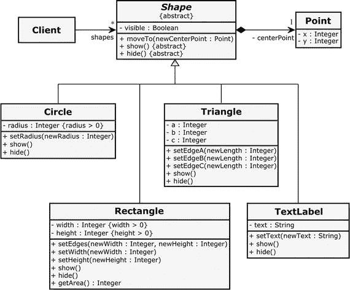
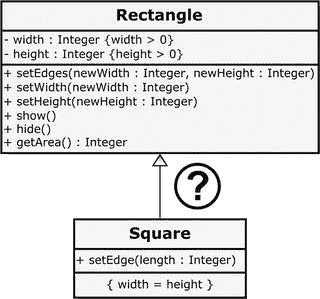
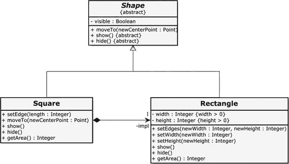
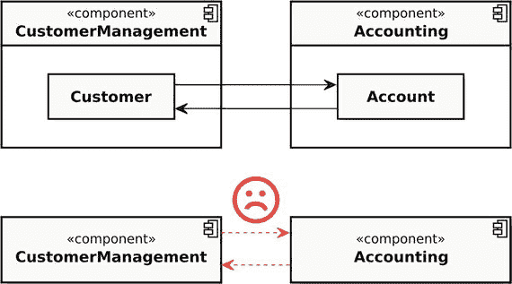
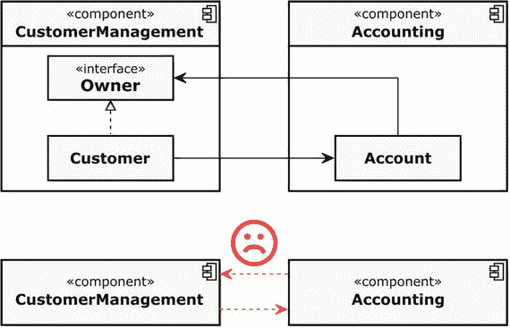
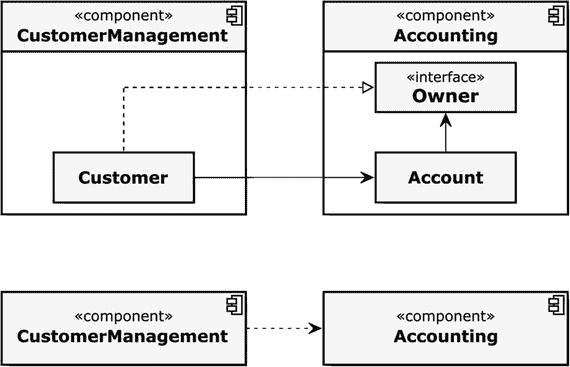
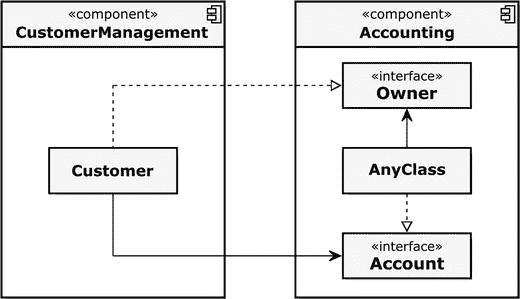
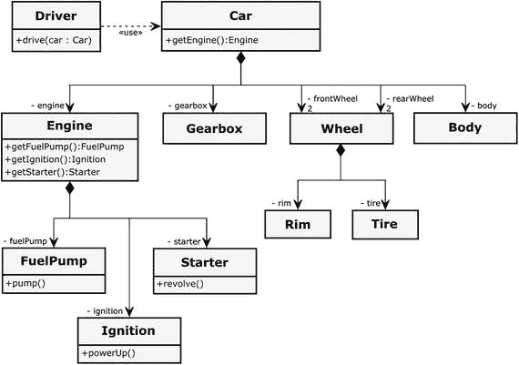
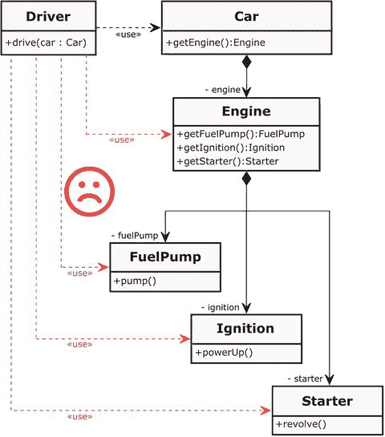

# 6.面向对象

面向对象(OO)的历史根源可以在 20 世纪 50 年代末找到。挪威计算机科学家克利斯登·奈加特和奥利·约翰·达尔在军事研究所挪威国防研究所(NDRE)为挪威第一个核反应堆的开发和建造进行了模拟计算。在开发模拟程序时，两位科学家注意到，用于该任务的过程编程语言不太适合要解决的问题的复杂性。达尔和尼加德感到需要在这些语言中找到合适的可能性来抽象和再现现实世界的结构、概念和过程。

1960 年，尼加德搬到了两年前在奥斯陆建立的挪威计算中心(NCC)。三年后，奥利·约翰·达尔也加入了 NCC。在这个私人的、独立的、非盈利的研究基金会，两位科学家为一种——从今天的观点来看——面向对象编程语言开发了第一个想法和概念。尼加德和达尔在寻找一种适用于所有领域的语言，而不是专门针对某些应用领域的语言，例如，用于数值计算和线性代数的 Fortran 或 COBOL，它是专门为商业用途设计的。

他们研究活动的结果最终是编程语言 Sim ula-67，它是过程编程语言 ALGOL 60 的扩展。新语言引入了类、子类、对象、实例变量、虚方法，甚至垃圾收集器。Simula-67 被认为是第一种面向对象的编程语言，并影响了以下许多其他编程语言，例如，由 Alan Kay 及其团队在 20 世纪 70 年代初设计的完全面向对象的编程语言 Smalltalk。

当丹麦计算机科学家比雅尼·斯特劳斯特鲁普于 1970 年末在剑桥大学完成他的博士论文《分布式计算机系统中的通信和控制》时，他使用了 Simula-67，并发现它非常有用，但对于实际应用来说太慢了。因此，他开始寻找将 Simula-67 数据抽象的面向对象概念与低级编程语言的高效率相结合的可能性。当时最有效的编程语言是 C 语言，它是由美国计算机科学家丹尼斯·里奇于 20 世纪 70 年代早期在贝尔电话实验室开发的。Stroustrup 于 1979 年加入贝尔电话实验室的计算机科学研究中心，他开始在 C 语言中加入面向对象的特性，如类、继承、强类型检查和许多其他东西，并将其命名为“带类的 C”1983 年，该语言的名称改为 C++，这是 Stroustrups 的合伙人 Rick Mascitti 创造的一个词，其中++ 的灵感来自于该语言的后增量运算符。

在接下来的几十年里，面向对象成为了主导的编程范式。

## 面向对象的思维

有一点非常重要，我们需要牢记在心。仅仅因为市场上有几种支持面向对象概念的编程语言，就绝对不能保证使用这些语言的开发人员会自动产生面向对象的软件设计。尤其是那些长期使用过程语言的开发人员，在向这种编程范式过渡时经常会遇到困难。面向对象不是一个容易理解的概念。它要求开发者以一种新的方式看待世界。

艾伦·库尔蒂斯·凯博士在 20 世纪 70 年代早期和 PARC 施乐公司的一些同事一起开发了面向对象的编程语言 Smalltalk，他被誉为“面向对象”一词的创始人之一在通过电子邮件与德国大学讲师迪平的讨论中。来自柏林自由大学的 Stefan Ram 从 2003 年开始，Kay 为他解释了什么是面向对象:

> I think that objects are like biological cells and/or a single computer on the network, which can only communicate with messages (so messaging appeared from the very beginning-it took some time to understand how to use messaging effectively in programming languages). (......) OOP to me only means messaging, local reservation, protecting and hiding state processes, and extreme late binding of everything. —Dr. Alan Curtis Kay, American computer scientist, July 23, 2003 [ram 03]

生物细胞可以被定义为所有生物体的最小结构和功能单位。它们通常被称为“生命的基石”艾伦·凯认为软件就像生物学家看待复杂的活的有机体一样。艾伦·凯的这种视角应该不会令人惊讶，因为他拥有数学和分子生物学学士学位。

艾伦·凯的细胞就是我们在 OO 中所说的对象。一个对象可以被认为是一个有结构和行为的“东西”。生物细胞有一层膜包裹着它。这也适用于面向对象的对象。对象应该被很好地封装，并通过定义良好的接口提供服务。

此外，Alan Kay 强调“消息传递”对他来说在面向对象中起着核心作用。然而，他并没有确切地解释他这么说的意思。在一个对象上调用一个名为`foo()`的方法是否等同于向那个对象发送一个名为“foo”的消息？或者 Alan Kay 有消息传递基础设施的想法，比如 CORBA(公共对象请求代理体系结构)和类似的技术？Kay 博士也是一名数学家，所以他也可以指一个著名的消息传递数学模型，名为 Actor 模型，在并发计算中非常流行。

在任何情况下，不管 Alan Kay 在谈到消息传递时有什么想法，我认为这种观点很有趣，并且大体上适用于在抽象层次上解释面向对象程序的典型结构。但是凯先生的解释肯定不足以回答下列重要问题:

*   我如何找到并形成“细胞”(物体)？
*   我如何设计这些单元的公共可用接口？
*   我如何管理谁可以与谁通信(依赖)？

面向对象(OO)主要是一种思维方式，而不是所用语言的问题。它也可能被滥用和误用。

我见过许多用 C++ 或纯面向对象语言(如 Java)编写的程序，其中使用了类，但这些类只构成了包装过程程序的大型名称空间。或者略带讽刺地表达:显然，类似 Fortran 的程序可以用几乎任何编程语言编写。另一方面，每一个已经内化了面向对象思想的开发人员将能够用面向对象的设计开发软件，即使是用像 ANSI-C、汇编程序这样的语言，或者使用 shell 脚本。

## 抽象——掌握复杂性的关键

面向对象背后的基本思想是我们在软件中从我们领域的相关部分建模事物和概念。因此，我们将自己仅仅局限于那些必须在我们的软件系统中表现出来以满足涉众需求的东西，也称为需求。抽象是以适当的方式对这些事物和概念建模的最重要的工具。我们不想模仿整个真实世界。我们只需要从现实世界中摘录，减少到与实现系统用例相关的细节。

例如，如果我们想在一个书店系统中代表一个顾客，那么这个顾客的血型是很有可能的，而且是绝对没有意义的。另一方面，对于医学领域的软件系统来说，人的血型可能是一个重要的细节。

对我来说，面向对象是关于数据抽象、责任、模块化，以及分而治之。如果我必须把它归结为，我会说 OO 是关于对复杂性的掌握。我用一个小例子来解释一下。

以汽车为例。汽车是由几个部分组成的，例如，车身、发动机、齿轮、车轮、座椅等。这些部分本身也由更小的部分组成。以汽车的发动机为例(让我们假设它是内燃机，而不是电动机)。发动机由气缸体、汽油点火泵、传动轴、凸轮轴、活塞、发动机控制单元(ECU)、冷却液子系统等组成。冷却液子系统同样由热交换器、冷却液泵、冷却液储罐、风扇、恒温器和加热器芯组成。汽车的分解理论上可以延续到最小的螺丝钉。每个确定的子系统或部分都有明确定义的职责。但是，只有所有的零件组合在一起，并以正确的方式组装，才能制造出一辆能提供司机所期望的服务的汽车。

复杂的软件系统可以用同样的方式来考虑。它们可以分层分解成粗粒度到细粒度的模块。这有助于应对系统的复杂性，提供更多的灵活性，并培养可重用性、可维护性和可测试性。进行这种分解的指导原则主要如下:

*   信息隐藏(参见第 [3](3.html) 章中的同名章节)，
*   凝聚力强(见第 [3 章](3.html)中的同名章节)，
*   松散耦合(参见第 [3](3.html) 章中的同名章节)，以及
*   单一责任原则(SRP 请参阅本章后面的同名部分)。

## 优秀课堂设计的原则

在面向对象语言中，形成前面描述的模块的广泛和众所周知的机制是类的概念。类被认为是封装的软件模块，它将结构特征(同义词:属性、数据成员、字段)和行为特征(同义词:成员函数、方法、操作)结合成一个内聚单元。

在像 C++ 这样具有面向对象功能的编程语言中，类是高于函数的下一个更高级的结构化概念。它们通常被描述为对象的蓝图(同义词:实例)。这足以成为进一步研究类的概念的理由。在这一章中，我给出了一些用 C++ 设计和编写好类的重要线索。

### 保持小班教学

在我作为软件开发人员的职业生涯中，我见过很多非常大的班级。成千上万行代码并不罕见。经过仔细观察，我注意到这些大型类通常只被用作或多或少过程化程序的名称空间，这些程序的开发人员通常不理解面向对象。

我认为这种大班的问题是显而易见的。如果类包含几千行代码，那么它们很难理解，并且它们的可维护性和可测试性通常很差，更不用说可重用性了。根据几项研究，大班通常包含更多的缺陷。

The God Class Anti-Pattern

在许多系统中，有非常大的类，有许多属性和几百个操作。这些类的名称通常以“…控制器”、“管理器”或“…助手”结尾开发人员经常争辩说，系统中的某个地方必须有一个中心实例来拉动字符串并协调一切。这种思维方式的结果是这样的巨型类，它们的内聚性非常差(参见第 [3](3.html) 章中关于强内聚性的部分)。他们就像一个便利店，提供五颜六色的商品。

这种类被称为 God 类，Go d 对象，有时也称为 Blob(Blob 是 1958 年的一部美国恐怖/科幻电影，讲述了一种外星变形虫吃掉一个村庄的居民)。这就是所谓的反模式，被认为是糟糕设计的同义词。一个神类是一个不可驯服的野兽，难以维护，难以理解，不可测试，容易出错，并且对其他类有很大的依赖性。在系统的生命周期中，这样的类越来越大。这让问题变得更糟。

什么被证明是函数大小的好规则(参见第 [4](4.html) 章中的“让它们小一点”),这似乎也是类大小的好建议:类应该小！

如果小尺寸是类设计的一个目标，那么接下来的问题是:多小？

对于函数，我已经在第[章第 4](4.html) 中给出了一些代码行。难道没有可能为被认为是好的或合适的类定义一些行吗？

在 ThoughtWorks 选集[ThoughtWorks08]中，Jeff Bay 提交了一篇题为“对象健美操:今天更好的软件设计的 9 个步骤”的文章，建议一个类的代码不要超过 50 行。

对于许多开发人员来说，大约 50 行的上限似乎是不可能的。他们似乎对阶级的产生有一种无法解释的抵触情绪。他们经常这样争论:“不超过 50 行？但这将导致大量的小类，只有很少的成员和函数。”然后他们肯定会变出一个不能简化到如此小规模的班级的例子。

我确信那些开发商完全错了。我很确定每一个软件系统都可以被分解成如此小的基本构件。

是的，如果班级很小，你会有更多的班级。但那是 OO！在面向对象的软件开发中，类是一种同样自然的语言元素，如函数或变量。换句话说:不要害怕创建小班。小班更容易使用、理解和测试。

尽管如此，这引出了一个基本问题:代码行数上限的定义基本上是正确的吗？我认为代码行数(LOC)是一个有用的指标。太多的 LOC 是一种气味。你可以仔细看看 50 行以上的课。但是并不一定是多行代码总是有问题。一个更好的标准是一个类的责任量。

### 单一责任原则

单一责任原则(SRP)声明每个软件单元——包括组件、类和功能——应该只有一个单一的和明确定义的责任。

SRP 基于我在第 3 章中讨论过的内聚性的一般原则。如果一个类有明确的职责，通常它的凝聚力也很强。

但是责任到底是什么？在文学作品中，我们经常可以找到这样的解释:改变阶级必须只有一个原因。一个经常提到的例子是，当类由于系统不同方面的新的或改变的需求而需要改变时，这个规则被违反了。

这些方面可以是例如设备驱动程序和 UI。如果必须改变同一个类，或者因为设备驱动程序的接口已经改变，或者必须实现关于图形用户界面的新需求，那么这个类显然有太多的责任。

另一类方面与系统的领域有关。如果必须改变同一个类，或者因为有关于客户管理的新要求，或者有关于发票的新要求，那么这个类有太多的责任。

遵循 SRP 的类通常很小，并且很少依赖。它们很清楚，容易理解，也很容易测试。

责任是比一个类的代码行数更好的标准。可以有 100 行、200 行甚至 500 行的类，如果这些类不违反单一责任原则，这是完全可以的。尽管如此，高锁定计数可能是一个指标。这是一条提示:“你应该看看这些课程！也许一切都很好，但也许他们这么大，是因为他们的责任太多了。”

### 开闭原则(OCP)

所有系统在其生命周期内都会发生变化。当开发预期比第一个版本持续时间更长的系统时，必须记住这一点。—Ivar Jacobson，瑞典计算机科学家，1992 年

对于任何类型的软件单元，尤其是对于类设计，另一个重要的指导原则是开闭原则(OCP)。它陈述了软件实体(模块、类、函数等)。)应该对扩展开放，但对修改关闭。

一个简单的事实是，软件系统会随着时间的推移而发展。必须不断满足新的需求，现有的需求必须根据客户需求或技术进步进行更改。这些扩展不仅应该以优雅的方式进行，而且应该尽可能地省力。它们应该特别地以这样一种方式制作，即不需要改变现有的代码。如果任何新的需求会导致软件现有的和经过良好测试的部分发生一连串的变化和调整，那将是致命的。

在面向对象中支持这一原则的一种方式是继承的概念。通过继承，可以在不修改类的情况下向类中添加新的功能。此外，有许多面向对象的设计模式正在培育 OCP，比如 Strategy，或者 Decorator(参见第 [9](9.html) 章关于设计模式)。

在第 [3](3.html) 章中关于松耦合的部分，我们已经讨论了一个非常支持 OCP 的设计(见图 [3-6](3.html#Fig6) )。这里，我们通过一个接口将开关和灯解耦。通过这一步，设计不会被修改，但可以愉快地扩展。我们可以很容易地添加更多可切换的设备，并且我们不需要触摸类别开关、灯和可切换的接口。你可以很容易地想象，这种设计的另一个优点是现在很容易提供一个测试替身(例如，一个模拟对象)用于测试目的(参见第 [2](2.html) 章中关于测试替身(模拟对象)的部分)。

### 利斯科夫替代原理

里斯科夫替代原理基本上是说，你不能通过给一只狗增加四条假腿来创造一只章鱼。——马里奥·富斯科(@mariofusco)，2013 年 9 月 15 日，在推特上

初看起来，面向对象的继承和多态的关键概念似乎相对简单。继承是一个分类学概念，应该用来构建类型的专门化层次结构，也就是说，子类型是从更一般的类型派生出来的。多态性通常意味着提供一个单一的接口作为对不同类型对象的访问可能性。

目前为止，一切顺利。但是有时你会遇到这样的情况，子类型并不真的想要适合类型层次结构。让我们讨论一个经常用来说明问题的非常流行的例子。

#### 正方形和长方形的困境

假设我们正在开发一个类库，其中包含用于在画布上绘图的基本形状类型，例如，`Circle`、`Rectangle`、`Triangle`和`TextLabel`。可视化为 UML 类图，这个库可能看起来如图 [6-1](#Fig1) 所示。



图 6-1。

A class library of diff erent shapes

抽象基类`Shape`具有对于所有特定形状都相同的属性和操作。例如，对于所有形状来说，它们如何在画布上从一个位置移动到另一个位置是相同的。然而，`Shape`不知道如何显示(同义词:绘制)或隐藏(同义词:删除)特定的形状。因此，这些操作是抽象的，也就是说，它们不能(完全)在`Shape`中实现。

在 C++ 中，抽象类`Shape`(以及`Shape`所需的类`Point`)的实现可能如下所示:

```cpp
class Point final {

public:
  Point() : x { 5 }, y { 5 } { }
  Point(const unsigned int initialX, const unsigned int initialY) :
    x { initialX }, y { initialY } { }
  void setCoordinates(const unsigned int newX, const unsigned int newY) {
    x = newX;
    y = newY;
  }
  // ...more member functions here...

private:
  unsigned int x;
  unsigned int y;
};

class Shape {

public:
  Shape() : isVisible { false } { }
  virtual ∼Shape() = default;
  void moveTo(const Point& newCenterPoint) {
    hide();
    centerPoint = newCenterPoint;
    show();
  }
  virtual void show() = 0;
  virtual void hide() = 0;
  // ...

private:
  Point centerPoint;
  bool isVisible;
};

void Shape::show() {
  isVisible = true;
}

void Shape::hide() {
  isVisible = false;
}

Listing 6-1.This is what the two classes Point and Shape look like

```

Final Specifier [C++11]

从 C++11 开始就有的`final`说明符有两种用法。

一方面，您可以使用此说明符来避免在派生类中重写单个虚拟成员函数，如下例所示:

```cpp
class AbstractBaseClass {

public:
  virtual void doSomething() = 0;
};

class Derived1 : public AbstractBaseClass {

public:
  virtual void doSomething() final {
    //...
  }
};

class Derived2 : public Derived1 {

public:
  virtual void doSomething() override { // Causes a compiler error!
    //...
  }
};

```

另外，你也可以将一个完整的类标记为`final`，就像我们形状库中的类`Point`一样。这确保了开发人员不能将这样的类用作继承的基类。

```cpp
class NotDerivable final {
  // ...
};

```

在 Shapes 库中的所有具体类中，我们可以对一个类进行示例性的研究，这个类就是`Rectangle`:

```cpp
class Rectangle : public Shape {

public:
  Rectangle() : width { 2 }, height { 1 } { }
  Rectangle(const unsigned int initialWidth, const unsigned int initialHeight) :
    width { initialWidth }, height { initialHeight } { }

  virtual void show() override {
    Shape::show();
    // ...code to show a rectangle here...
  }

  virtual void hide() override {
    Shape::hide();
    // ...code to hide a rectangle here...
  }

  void setWidth(const unsigned int newWidth) {
    width = newWidth;
  }

  void setHeight(const unsigned int newHeight) {
    height = newHeight;
  }

  void setEdges(const unsigned int newWidth, const unsigned int newHeight) {
    width = newWidth;
    height = newHeight;
  }

  unsigned long long getArea() const {
    return static_cast<unsigned long long>(width) * height;
  }
  // ...

private:
  unsigned int width;
  unsigned int height;
};

Listing 6-2.The important 

parts of class Rectangle

```

客户端代码希望以相似的方式使用所有形状，不管是哪种特定的实例(`Rectangle`、`Circle`等)。)它面临着。例如，所有 sha pes 应该一次性显示在画布上，这可以使用以下代码实现:

```cpp
#include "Shapes.h" // Circle, Rectangle, etc.

#include <memory>

#include <vector>

using ShapePtr = std::shared_ptr<Shape>;

using ShapeCollection = std::vector<ShapePtr>;

void showAllShapes(const ShapeCollection& shapes) {
  for (auto& shape : shapes) {
    shape->show();
  }
}

int main() {

  ShapeCollection shapes;
  shapes.push_back(std::make_shared<Circle>());
  shapes.push_back(std::make_shared<Rectangle>());
  shapes.push_back(std::make_shared<TextLabel>());
  // ...etc...

  showAllShapes(shapes);
  return 0;
}

```

现在让我们假设用户为我们的库制定了一个新的需求:他们想要一个正方形！

大概每个人都会马上想起自己小学的几何课。那时你的老师可能也说过，正方形是一种特殊的矩形，它有四条等长的边和四个等角(90 度角)。因此，第一个显而易见的解决方案似乎是我们从`Rectangle`派生出一个新的类`Square`，如图 [6-2](#Fig2) 所示。



图 6-2。

Deriving a Square from class Rectangle – a good idea?

乍一看，这似乎是一个可行的解决方案。`Square`继承了`Rectangle`的接口和实现。这有助于避免代码重复(参见我们在第三章[中讨论的 DRY 原则)，因为`Square`可以很容易地重用在`Rectangle`中实现的行为。](3.html)

一个正方形只需要满足一个额外的简单需求，这个需求在上面的 UML 图中显示为类`Square` : `{width = height}`中的一个约束。这个约束意味着`Square`类型的实例在任何情况下都保证它的边都是一样长的。

因此，我们首先通过从我们的`Rectangle`派生来实现我们的`Square`:

```cpp
class Square : public Rectangle {

public:
  //...
};

```

但其实并不是一个好的解决办法！

请注意，`Square`继承了`Rectangle`的所有操作。这意味着我们可以用一个`Square`实例做以下事情:

```cpp
Square square;
square.setHeight(10);    // Err...changing only the height of a square?!
square.setEdges(10, 20); // 

Uh oh!

```

首先，`Square`的用户会非常困惑，它提供了一个带有两个参数的设置器(记住第 [3 章](3.html)中的最小惊讶原则)。他们认为:为什么有两个参数？哪个参数用于设置所有边的长度？我必须把两个参数设为相同的值吗？如果我不这么做会怎么样？

当我们执行以下操作时，情况会更加戏剧性:

```cpp
std::unique_ptr<Rectangle> rectangle = std::make_unique<Square>();
// ...and somewhere else in the code...
rectangle->setEdges(10, 20);

```

在这种情况下，客户端代码使用有意义的 setter。矩形的两条边都可以独立操作。这并不奇怪；这正是期望。然而，结果可能是怪异的。在这样的调用之后，`Square`类型的实例实际上不再是正方形，因为它有两个不同的边长。所以我们再次违反了最小惊讶原则，更糟糕的是:违反了`Square`的类不变量。

然而，现在有人可能会争辩说，我们可以在类`Rectangle`中将`setEdges()`、`setWidth()`和`setHe`、T3】声明为`virtual`，并使用替代实现覆盖类`Square`中的这些成员函数，这在未经请求使用的情况下会引发异常。此外，我们在类`Square`中提供了一个新的成员函数`setEdge()`，如下所示:

```cpp
#include <stdexcept>
// ...

class IllegalOperationCall : public std::logic_error
{

public:

explicit IllegalOperationCall(const std::string& message) : logic_error(message) { }

virtual ∼IllegalOperationCall() { }
};

class Square : public Rectangle {

public:
Square() : Rectangle { 5, 5 } { }

explicit Square(const unsigned int edgeLength) : Rectangle { edgeLength, edgeLength } { }

virtual void setEdges([[maybe_unused]] const unsigned int newWidth,
                      [[maybe_unused]] const unsigned int newHeight) override {
  throw IllegalOperationCall { ILLEGAL_OPERATION_MSG };
}

virtual void setWidth([[maybe_unused]] const unsigned int newWidth) override {
  throw IllegalOperationCall { ILLEGAL_OPERATION_MSG };
}

virtual void setHeight([[maybe_unused]] const unsigned int newHeight) override {
  throw IllegalOperationCall { ILLEGAL_OPERATION_MSG };
}

void setEdge(const unsigned int length) {
  Rectangle::setEdges(length, length);
}

private:

static const constexpr char* const ILLEGAL_OPERATION_MSG { "Unsolicited call of a prohibited "
    "operation on an instance of class Square!" };
};

Listing 6-3.A really bad implementation of Square that tries to “erase” unwanted inherited features

```

嗯，我认为这显然是一个非常糟糕的设计。它违反了面向对象的基本原则，即派生类不能删除基类的继承属性。这绝对不是解决我们问题的办法。首先，如果我们想使用一个`Square`的实例作为一个`Rectangle`，那么新的 setter `setEdge()`将是不可见的。此外，所有其他的 setters 在被使用时都会抛出一个异常——这真是糟糕透了！它破坏了面向对象。

那么，这里的根本问题是什么？为什么从一个`Rectangle`中派生出一个类`Square`会引起这么多的困难？

解释是这样的:从`Rectangle`派生`Square`违背了面向对象软件设计中的一个重要原则——利斯科夫替代原则(LSP)！

美国计算机科学家芭芭拉·利斯科夫(Barbara Liskov)是麻省理工学院(MIT)的学院教授，Jeannette Wing 是卡内基梅隆大学的计算机科学教授，直到 2013 年，他们在 1994 年的一篇论文中阐述了该原理如下:

> Let q(x) be the provable property of object x of type T. Then q(y) should be a provable attribute of object y of type S, where S is a subtype of T. —barbarbara lis kov，Jeanette Wing [Liskov94]

嗯，这不一定是日常使用的定义。罗伯特·c·马丁(Robert C. Martin)在 1996 年的一篇文章中把这个原则表述如下:

> Functions that use pointers or references to base classes must be able to use objects of derived classes without knowing it. -Robert Martin [Martin 96]

事实上，这意味着:派生类型必须完全可以替换它们的基本类型。在我们的例子中，这是不可能的。类型为`Square`的实例不能替换为`Rectangle`。原因在于约束`{width = height}`(所谓的类不变量)将由`Square`强制执行，但是`Rectangle`不能满足该约束。

Liskov 替换原则分别为类型和类层次结构规定了以下规则:

*   基类的前提条件(参见第 [5](5.html) 章关于前提条件的“预防胜于治疗”一节)不能在派生类中得到加强。
*   基类的后置条件(参见第 [5](5.html) 章中的“预防胜于治疗”一节)不能在派生类中被削弱。
*   基类的所有不变量都不能通过派生的子类来改变或违反。
*   历史约束(也称为“历史规则”):对象的(内部)状态只能通过在它们的公共接口(封装)上的方法调用来改变。由于派生类可以引入基类中不存在的新属性和方法，这些方法的引入可以允许基类中不允许的派生类的对象的状态改变。所谓的历史约束禁止这样做。例如，如果基类被设计成一个不可变对象的蓝图(见第 [9](9.html) 章关于不可变类)，派生类不应该在新引入的成员函数的帮助下使这个不变性属性无效。

上图(图 [6-2](#Fig2) )类图中泛化关系的解释(`Square`和`Rectangle`之间的箭头)经常翻译成“……是一个……”:`Square`是一个`Rectangle`。但这可能会产生误导。在数学中，可以说正方形是一种特殊的矩形，但在编程中却不是！

为了处理这个问题，客户必须知道他正在处理的是哪种特定的类型。一些开发人员现在可能会说，“没问题，这可以通过使用运行时类型信息(RTTI)来完成。”

Run-Time Type Information (RTTI)

术语运行时类型信息(有时也称为运行时类型标识)表示在运行时访问对象数据类型信息的 C++ 机制。RTTI 背后的一般概念叫做类型自省，在其他编程语言中也可以使用，比如 Java。

在 C++ 中，`typeid`运算符(在头文件`<typeinfo>`中定义)和`dynamic_cast<T>`(参见第 [4 章](4.html)中关于 C++ 强制转换的章节)属于 RTTI。例如，要在运行时确定对象的类，您可以编写:

```cpp
const std::type_info& typeInformationAboutObject = typeid(instance);

```

类型`std::type_info`(也在 header `<typeinfo>`中定义)的 const 引用现在保存关于对象的类的信息，例如，类名。从 C++11 开始，哈希代码也是可用的(`std::type_info::hash_code()`)，它对于引用相同类型的`std::type_info`对象是相同的。

重要的是要知道 RTTI 只适用于多态的类，也就是说，至少有一个直接或通过继承的虚函数的类。此外，在某些编译器上可以打开或关闭 RTTI。例如，当使用 gcc (GNU 编译器集合)时，可以通过使用`-fno-` `rtti`选项禁用 RTTI。

```cpp
using ShapePtr = std::shared_ptr<Shape>;

using ShapeCollection = std::vector<ShapePtr>;
//...

void resizeAllShapes(const ShapeCollection& shapes) {
  try {
    for (const auto& shape : shapes) {
      const auto rawPointerToShape = shape.get();
      if (typeid(*rawPointerToShape) == typeid(Rectangle)) {
        Rectangle* rectangle = dynamic_cast<Rectangle*>(rawPointerToShape);
        rectangle->setEdges(10, 20);
        // Do more Rectangle-specific things here...
      } else if (typeid(*rawPointerToShape) == typeid(Square)) {
        Square* square = dynamic_cast<Square*>(rawPointerToShape);
        square->setEdge(10);
      } else {
        // ...
      }
    }
  } catch (const std::bad_typeid& ex) {
    // Attempted a typeid of NULL pointer!
  }
}

Listing 6-4.Just another “hack”: Usi

ng RTTI to distinguish between different types of shape during runtime

```

别这样！这不可能也不应该是合适的解决方案，尤其是在一个干净现代的 C++ 程序中。面向对象的许多好处，比如动态多态，都被抵消了。

Caution

每当你被迫在你的程序中使用 RTTI 来区分不同的类型时，它就是一种明显的“设计气味”，也就是说，一个糟糕的面向对象软件设计的明显标志！

此外，我们的代码会被糟糕的`if-else`结构严重污染，可读性也会下降。似乎这还不够,`try-catch`构造还表明可能会出错。

但是我们能做什么呢？

首先，我们应该再仔细看看正方形到底是什么。

从纯数学的观点来看，正方形可以看作是等边长的矩形。目前为止，一切顺利。但是这个定义不能直接转移到面向对象的类型层次结构中。正方形不是矩形的子类型！

相反，正方形仅仅是矩形的一种特殊状态。如果一个矩形有相同的边长，这仅仅是矩形的一种状态，那么我们通常用我们的自然语言给这样一个特殊的矩形一个特殊的名字:然后我们谈论一个正方形！

这意味着我们只需要向我们的类`Rectangle`添加一个 inspector 方法来查询它的状态，允许我们放弃一个显式的类`Square`。根据 KISS 原则(参见第 [3](3.html) 章)，该解决方案可能完全足以满足新的要求。此外，我们可以为客户提供一个方便的设置方法，用于相等地设置两个边的长度。

```cpp
class Rectangle : public Shape {

public:
  // ...
  void setEdgesToEqualLength(const unsigned int newLength) {
    setEdges(newLength, newLength);
  }

  bool isSquare() const {
    return width == height;
  }
  //...
};

Listing 6-5.A simple solution without an explicit class Square

```

#### 偏爱合成而非遗传

但是，如果明确的类 s `Square`是不折不扣地必需的，例如，因为有人需要它，我们能做什么呢？嗯，如果是这样的话，那么我们永远不应该从`Rectangle`继承，而是从`Shape`类继承，如图 [6-3](#Fig3) 所示。为了不违反 DRY 原则，我们将使用类`Rectangle`的一个实例作为`Square`的内部实现。



图 6-3。

The Square uses and delegates to an embedded instance of Rectangle

用源代码表示，这个类`Square`的实现看起来像这样:

```cpp
class Square : public Shape {

public:
  Square() {
    impl.setEdges(5, 5);
  }

  explicit Square(const unsigned int edgeLength) {
    impl.setEdges(edgeLength, edgeLength);
  }

  void setEdge

(const unsigned int length) {
    impl.setEdges(length, length);
  }

  virtual void moveTo(const Point& newCenterPoint) override {
    impl.moveTo(newCenterPoint);
  }

  virtual void show() override {
    impl.show();
  }

  virtual void hide() override {
    impl.hide();
  }

  unsigned lomg longgetArea() const {
    return impl.getArea();
  }

private:
  Rectangle impl;
};

Listing 6-6.The Square delegates all method calls to an embedded instance of Rectangle

```

也许你已经注意到了`moveTo()`方法也被覆盖了。为此，`moveTo()`方法也必须在`Shape`类中成为虚拟的。我们必须覆盖它，因为从`Shape`继承的`moveTo()`在基类`Shape`的`centerPoint`上操作，而不是在使用的`Rectangle`的嵌入式实例上操作。这是这个解决方案的一个小缺点:从基类`Shape`继承的一些部分闲置着。

显然，使用这种解决方案，我们将失去将`Square`的实例分配给`Rectangle`的可能性:

```cpp
std::unique_ptr<Rectangle> rectangle = std::make_unique<Square>(); // Compiler error!

```

这种解决面向对象中继承问题的方法背后的原理被称为“优先组合优先继承”(FCoI)，有时也被称为“优先委托优先继承”。对于功能的重用，面向对象编程基本上有两种选择:继承(“白盒重用”)和组合或委托(“黑盒重用”)。有时候，更好的方法是将另一个类型视为黑盒，也就是说，只通过其明确定义的公共接口来使用它，而不是从该类型派生一个子类型。通过组合/委托的重用比通过继承的重用促进了类之间的松散耦合。

### 接口隔离原则(ISP)

我们已经知道接口是促进类之间松散耦合的一种方式。在前面关于开闭原则的章节中，我们已经看到接口是在代码中拥有扩展和变化点的一种方式。一个接口就像一个契约:类可以通过这个契约请求服务，而服务可以由履行这个契约的其他类提供。

但是，当这些契约变得太广泛时，也就是说，如果一个接口变得太宽或太“胖”，会出现什么问题呢？用一个例子可以很好地说明其后果。假设我们有以下接口:

```cpp
class Bird {

public:
  virtual ∼Bird() = default;
  virtual void fly() = 0;
  virtual void eat() = 0;
  virtual void run() = 0;
  virtual void tweet() = 0;
};
Listing 6-7.An interface for Birds

```

这个接口是由几个具体的 birds 实现的，比如由一个`Sparrow`。

```cpp
class Sparrow : public Bird {

public:
  virtual void fly() override {
    //...
  }
  virtual void eat() override {
    //...
  }
  virtual void run() override {
    //...
  }
  virtual void tweet() override {
    //...
  }
};
Listing 6-8.The class Sparrow overrides and implements all pure virtual member functions of Bird

```

目前为止，一切顺利。现在假设我们有另一个具体的`Bird` : a `Penguin`。

```cpp
class Penguin : public Bird {

public:
  virtual void fly() override {
    // ???
  }
  //...
};
Listing 6-9.The class Penguin

```

虽然企鹅肯定是鸟，但它不会飞。虽然我们的接口相对较小，因为它只声明了四个简单的成员函数，但是这些声明的服务显然不能由每一种鸟提供。

接口分离原则(ISP)声明接口不应该被实现类不需要的成员函数所膨胀，或者这些类不能以有意义的方式实现。在我们上面的例子中，类`Penguin`不能为`Bird::fly()`提供有意义的实现，但是`Penguin`被强制覆盖那个成员函数。

接口分离原则认为，我们应该将一个“胖接口”分离成更小的、高度内聚的接口。由此产生的小接口也称为角色接口。

```cpp
class Lifeform {

public:
  virtual void eat() = 0;
  virtual void move() = 0;
};

class Flyable {

public:
  virtual void fly() = 0;
};

class Audible {

public:
  virtual void makeSound() = 0;
};

Listing 6-10.The three role interfaces as a better alternative to the broad Bird interface

```

这些小角色接口现在可以非常灵活地组合。这意味着实现类只需要为那些声明的成员函数提供有意义的功能，它们能够以合理的方式实现这些功能。

```cpp
class Sparrow : public Lifeform, public Flyable, public Audible {
  //...
};

class Penguin : public Lifeform, public Audible {
  //...
};

Listing 6-11.The classes Sparrow and Penguin respectively implement the relevant interfaces

```

### 非循环依赖原则

有时需要两个类互相“了解”。例如，让我们假设我们正在开发一个网上商店。为了能够实现某些用例，在这个网上商店中代表客户的类必须知道它的相关帐户。对于其他用例，帐户必须能够访问其所有者，即客户。

在 UML 中，这种相互关系如图 [6-4](#Fig4) 所示。


图 6-4。

The association relationships between class Customer and class Account

这就是所谓的循环依赖。这两个阶层直接或间接地相互依赖。在这种情况下，只有两个类。涉及几个软件单元时也会出现循环依赖。

让我们看看图 [6-4](#Fig4) 所示循环依赖是如何在 C++ 中实现的。

在 C++ 中肯定行不通的是:

```cpp
#ifndef CUSTOMER_H_

#define CUSTOMER_H_

#include "Account.h"

class Customer {
// ...

private:
  Account customerAccount;
};

#endif

Listing 6-12.The content of file Customer.h

```

```cpp
#ifndef ACCOUNT_H_

#define ACCOUNT_H_

#include "Customer.h"

class Account {

private:
  Customer owner;
};

#endif

Listing 6-13.The content of file Account.h

```

我认为这个问题在这里是显而易见的。只要有人使用类`Account`，或者类`Customer`，他就会在编译时引发连锁反应。比如账户拥有一个客户的实例谁拥有一个账户的实例谁拥有一个客户的实例，等等等等……由于 C++ 编译器严格的处理顺序，上述实现会导致编译器错误。

例如，通过将引用或指针与前向声明结合使用，可以避免这些编译器错误。前向声明是对标识符(例如，类型，如类)的声明，而不定义该标识符的完整结构。因此，这种类型有时也被称为不完整类型。因此，它们只能用于指针或引用，而不能用于实例成员变量，因为编译器不知道它的大小。

```cpp
#ifndef CUSTOMER_H_

#define CUSTOMER_H_

class Account;

class Customer {

public:
  // ...
  void setAccount(Account* account) {
    customerAccount = account;
  }
  // ...

private:
  Account* customerAccount;
};

#endif

Listing 6-14.The modified Customer with a forward-declared Account

```

```cpp
ifndef ACCOUNT_H_

#define ACCOUNT_H_

class Customer;

class Account {

public:
  //...
  void setOwner(Customer* customer) {
    owner = customer;
  }
  //...

private:
  Customer* owner;
};

#endif

Listing 6-15.The modified Account with a forward-declared Customer

```

手放在心上:你对这个解决方案有没有感到有点不舒服？如果是的话，那是有充分理由的！编译器错误消失了，但是这个“修复”产生了一种不好的直觉。让我们看看这两个类是如何使用的:

```cpp
#include "Account.h"

#include "Customer.h"
// ...
  Account* account = new Account { };
  Customer* customer = new Customer { };
  account->setOwner(customer);
  customer->setAccount(account);
// ...
Listing 6-16.Creating the instances of Customer and Account, and wiring them circularly together

```

我敢肯定，一个严重的问题是显而易见的:例如，如果 Account 的实例将被删除，但 Customer 的实例仍然存在，会发生什么情况？那么，Customer 的实例将包含一个悬空指针，即一个指向无人区的指针！使用或取消引用这样的指针会导致严重的问题，比如未定义的行为或应用程序崩溃。

前向声明对于某些事情非常有用，但是使用它们来处理循环依赖是一个非常糟糕的做法。这是一个令人毛骨悚然的变通方法，它应该隐藏一个基本的设计问题。

问题在于循环依赖本身。这是糟糕的设计。客户和账户这两个类别不能分开。因此，它们不能彼此独立使用，也不能彼此独立测试。这使得单元测试变得相当困难。

如果出现图 [6-5](#Fig5) 中描述的情况，问题会变得更加严重。



图 6-5。

The impact of circular dependencies between classes in different components

我们的类`Customer`和`Account`分别位于不同的组件中。也许在每个组件中有更多的类，但是这两个类有一个循环依赖。其结果是，这种循环依赖对架构级别也有负面影响。类级的循环依赖导致组件级的循环依赖。`CustomerManagement`和`Accounting`是紧耦合的(记住第 [3](3.html) 章中关于松耦合的部分)，不能单独(重复)使用。当然，独立元件测试也不再可能。架构层次上的模块化实际上已经被降低到荒谬的程度。

非循环依赖原则声明组件或类的依赖图应该没有循环。循环依赖是紧密耦合的一种糟糕形式，应该不惜一切代价避免。

别担心！打破循环依赖总是可能的，下一节将分别展示如何避免打破它们。

### 从属倒置原则

在上一节中，我们了解到循环依赖是不好的，在任何情况下都应该避免。和许多其他有不必要的依赖的问题一样，接口的概念(在 C++ 中，接口是用抽象类模拟的)是我们处理类似前一种情况的朋友。

因此，我们的目标应该是打破循环依赖，同时不丧失 class Customer 访问 Account 的必要可能性，反之亦然。

第一步是我们不再允许两个类中的一个直接访问另一个类。相反，我们只允许通过接口进行这样的访问。基本上，从两个类(`Customer`或`Account`)中的哪一个提取接口并不重要。我决定从`Customer`中提取一个名为`Owner`的接口。例如，`Owner`接口只声明了一个纯虚拟成员函数，这个函数必须被实现这个接口的类覆盖。

```cpp
#ifndef OWNER_H_

#define OWNER_H_

#include <memory>

#include <string>

class Owner {

public:
  virtual ∼Owner() = default;
  virtual std::string getName() const = 0;
};

using OwnerPtr = std::shared_ptr<Owner>;

#endif

Listing 6-17.An exemplary implementation of the new interface Owner

(File: Owner.h)

```

```cpp
#ifndef CUSTOMER_H_

#define CUSTOMER_H_

#include "Owner.h"

#include "Account.h"

class Customer : public Owner {

public:
  void setAccount(AccountPtr account) {
    customerAccount = account;
  }

  virtual std::string getName() const override {
    // return the Customer's name here...
  }
  // ...

private:
  AccountPtr customerAccount;
  // ...
};

using CustomerPtr = std::shared_ptr<Customer>;

#endif

Listing 6-18.The class Customer that implements i

nterface Owner (File: Customer.h)

```

从上面显示的 Customer 类的源代码中可以很容易地看出，Customer 仍然知道它的帐户。但是，当我们现在看一看更改后的 class Account 实现时，就不再依赖于客户了:

```cpp
#ifndef ACCOUNT_H_

#define ACCOUNT_H_

#include "Owner.h"

class Account {

public:
  void setOwner(OwnerPtr owner) {
    this->owner = owner;
  }
  //...

private:
  OwnerPtr owner;
};

using AccountPtr = std::shared_ptr<Account>;

#endif

Listing 6-19.The changed implementation of 

class Account (File: Account.h)

```

作为一个 UML 类图，在类层次上改变的设计如图 [6-6](#Fig6) 所示。


图 6-6。

The introduction of the interface has eliminated the circular dependency on class level

太棒了！通过重新设计的第一步，我们现在已经实现了在类级别上不再有循环依赖。现在，类`Account`对类`Customer`一无所知。但是当我们爬上图 [6-7](#Fig7) 所示的组件层时，情况会是怎样的呢？



图 6-7。

The circular dependency between the components is still there

不幸的是，组件之间的循环依赖还没有被打破。这两个关联关系仍然是从一个组件中的一个元素到另一个组件中的一个元素。然而，实现这个目标的步骤非常简单:我们只需要将接口`Owner`重新定位到其他组件中，如图 [6-8](#Fig8) 所示。



图 6-8。

Relocating the interface also fixes the circular dependency problem on an architecture level

太好了！现在组件之间的循环依赖已经消失了。`Accounting`组件不再依赖于`CustomerManagement`，因此模块化的质量得到了显著提高。此外，`Accounting`组件现在可以独立测试。

事实上，两个组件之间的不良依赖并没有真正消除。相反，通过引入接口`Owner`，我们甚至在类级别上获得了更多的依赖。我们真正做的是颠倒依赖性。

依赖倒置原则(DIP)是一种面向对象的设计原则，用于分离软件模块。该原则指出，面向对象设计的基础不是具体软件模块的特殊属性。相反，它们的公共特性应该被整合到一个共享的抽象中(例如，一个接口)。罗伯特·c·马丁(Robert c . Martin)a . k .“鲍勃大叔”将原则表述如下:

> A. advanced modules should not depend on low-level modules. Both should rely on abstraction. B. Abstraction should not depend on details. Details should depend on abstraction. -Robert Martin [Martin 03]

Note

此引用中的术语“高级模块”和“低级模块”可能会引起误解。它们不一定指它们在分层架构中的概念位置。在这种特定情况下，高级模块是需要来自另一个模块(所谓的低级模块)的外部服务的软件模块。高级模块是调用动作的模块，低级模块是执行动作的模块。在一些情况下，这两类模块也可以位于软件架构的不同级别(例如，层)，或者如在我们的示例中位于不同的组件中。

依赖倒置的原则是被认为是好的面向对象设计的基础。它通过抽象(例如接口)来定义所提供和所需的外部服务，从而促进了可重用软件模块的开发。一致地应用于我们上面讨论的情况，我们也必须相应地重新设计`Customer`和`Account`之间的直接依赖，如图 [6-9](#Fig9) 所示。



图 6-9。

Dependency Inversion Principle applied

两个组件中的类都完全依赖于抽象。因此，对于`Accounting`组件的客户端来说，哪个类需要`Owner`接口或提供`Account`接口已经不再重要了(还记得第 [3](3.html) 章中关于信息隐藏的部分)——我已经通过引入一个名为`AnyClass`的类暗示了这种情况，这个类实现了`Account`并使用了`Owner`。

例如，如果我们现在必须更改或替换`Customer`类，例如，因为我们想要将`Accounting`安装到测试夹具上进行组件测试，那么不需要更改`AnyClass`类来实现它。这也适用于相反的情况。

依赖倒置原则允许软件开发人员有目的地设计模块之间的依赖关系，即定义依赖关系指向哪个方向。你想反转组件之间的依赖关系，即`Accounting`应该依赖`CustomerManagement`？没问题:只需将两个接口从`Accounting`重新定位到`CustomerManagement`，依赖性就会改变。降低代码的可维护性和可测试性的不良依赖可以被优雅地重新设计和减少。

### 不要和陌生人说话(德米特里定律)

你还记得我在本章前面谈到的那辆车吗？我把这辆车描述为几个部分的组合，例如，车身、发动机、齿轮等等。我已经解释过，这些部分又可以由部分组成，而部分本身又可以由几个部分组成，等等。这就导致了一辆车的分层自上而下的分解。当然，一辆车可以有一个想要使用它的司机。

可视化为 UML 类图，汽车分解的摘录可以如图 [6-10](#Fig10) 所示。



图 6-10。

The hierarchical decomposition of a simple car

根据第 [5](5.html) 章讨论的单一责任原则，一切都很好，因为每个单一类都有明确定义的责任。

现在我们假设司机想驾驶汽车。这可以在类`Driver`中实现如下:

```cpp
class Driver {

public:
// ...
  void drive(Car& car) const {
    Engine& engine = car.getEngine();
    FuelPump& fuelPump = engine.getFuelPump();
    fuelPump.pump();
    Ignition& ignition = engine.getIgnition();
    ignition.powerUp();
    Starter& starter = engine.getStarter();
    starter.revolve();
  }
// ...
};
Listing 6-20.An excerpt from the implementation of class Driver

```

这里有什么问题？嗯，作为一名汽车司机，你会期望你必须直接接触你的汽车发动机，打开燃油泵，打开点火系统，并让起动机旋转吗？我甚至更进一步:如果你只是想驾驶你的汽车，你甚至对你的汽车由这些部件组成的事实感兴趣吗？！

我很确定你的明确答案会是:不！

现在让我们看一下图 [6-11](#Fig11) ，它描绘了 UML 类图中的相关部分，看看这个实现对设计有什么影响。



图 6-11。

The bad dep endencies of class Driver

从上图中可以很容易地看出，类`Driver`有许多令人尴尬的依赖关系。`Driver`并不仅仅依赖于`Engine`。这个类与`Engine`的某些部分也有一些依赖关系。很容易想象这有一些不利的后果。

例如，如果内燃机被电力传动系统取代，会发生什么？电力驱动没有燃油泵、点火系统和起动机。因此，结果将是类驱动程序的实现必须进行调整。这违反了开闭原则(见前面一节)。此外，所有将`Car`和`Engine`的内部暴露给环境的公共 getters 都违反了信息隐藏原则(参见第 [3 章](3.html))。

本质上，上述软件设计违反了德米特里定律(LoD)，也称为最少知识原则。得墨忒耳定律可以被认为是一个原则，它说的是“不要和陌生人说话”，或者“只和你的近邻说话。”这个原则表明你应该进行害羞编程，目标是控制面向对象设计中的通信结构。

德米特里定律假设了以下规则:

*   成员函数可以直接调用自己类范围内的其他成员函数。
*   允许成员函数直接调用其类范围内的成员变量上的成员函数。
*   如果成员函数有参数，则允许该成员函数直接调用这些参数的成员函数。
*   如果成员函数创建局部对象，则允许该成员函数调用这些局部对象上的成员函数。

如果上述四种成员函数调用中的一种返回的对象在结构上比该类的近邻更远，则禁止对这些对象调用成员函数。

Why This Rule Is Named Law Of Demeter

这个原则的名字可以追溯到关于面向方面软件开发的 Demeter 项目，在那里制定并严格应用了这些规则。Demeter 项目是 20 世纪 80 年代后期的一个研究项目，主要关注于通过自适应编程使软件更易于维护和扩展。德米特里定律是由伊恩·m·霍兰德和卡尔·利伯海尔发现并提出的，他们在那个项目中工作。在希腊神话中，得墨忒耳是宙斯和农业女神的妹妹。

那么，在我们的例子中，现在消除不良依赖的解决方案是什么呢？很简单，我们应该问自己:一个司机到底想做什么？答案很简单:他想发动汽车！

```cpp
class Driver {

public:
// ...
  void drive(Car& car) const {
    car.start();
  }
// ...
};

```

汽车用这个启动命令做什么？也很简单:它将这个方法调用委托给它的引擎。

```cpp
class Car {

public:
// ...
  void start() {
    engine.start();
  }
// ...

private:
  Engine engine;
};

```

最后但同样重要的是，引擎知道如何通过在它的部件上以正确的顺序调用适当的成员函数来执行启动过程，这些部件在软件设计中是它的近邻。

```cpp
class Engine {

public:
// ...
  void start() {
    fuelPump.pump();
    ignition.powerUp();
    starter.revolve();
  }
// ...

private:
  FuelPump fuelPump;
  Ignition ignition;
  Starter starter;
};

```

在图 [6-12](#Fig12) 中描绘的类图中，可以非常清楚地看到这些变化对面向对象设计的积极影响。


图 6-12。

Less dependencies a fter the application of the Law of Demeter

司机对汽车零部件令人讨厌的依赖消失了。相反，驾驶员可以启动汽车，而不用考虑汽车的内部结构。类`Driver`不再知道有一个`Engine`，一个`FuelPump`等等。所有那些糟糕的公共 getter 函数，那些向所有其他类显示汽车内部或引擎的函数，都消失了。这也意味着`Engine`及其部件的变化只会产生非常局部的影响，不会直接导致整个设计的级联变化。

在设计软件时遵循德米特定律可以显著减少依赖的数量。这导致了松散耦合，并助长了信息隐藏原则和开闭原则。与许多其他原则和规则一样，也可能有一些合理的例外，在这些例外中，开发人员必须出于非常充分的理由偏离这一原则。

### 避免贫血类

在几个项目中，我见过如下的类:

```cpp
class Customer {

public:
  void setId(const unsigned int id);
  unsigned int getId() const;
  void setForename(const std::string& forename);
  std::string getForename() const;
  void setSurname(const std::string& surname);
  std::string getSurname() const;
  //...more setters/getters here...

private:
  unsigned int id;
  std::string forename;
  std::string surname;
  // ...more attributes here...
};

Listing 6-21.A class without functionality that serves only as a bucket for a bunch of data

```

这个域类代表任意软件系统中的客户，不包含任何逻辑。逻辑在不同的地方，甚至是代表`Customer`专有功能的逻辑，也就是说，只对`Customer`的属性进行操作。

这样做的程序员使用对象作为一堆数据的袋子。这只是数据结构的过程化编程，与面向对象无关。所有这些设置器/获取器都非常愚蠢，严重违反了信息隐藏原则——实际上我们可以在这里使用一个简单的 C 结构(关键字:`struct`)。

这样的班级被称为贫血班，应该不惜一切代价避免。它们经常出现在一个反模式的软件设计中，Martin Fowler 称之为贫血域模型。它与面向对象设计的基本思想完全相反，面向对象设计是将数据和与数据一起工作的功能组合成内聚的单元。

只要你不违反德米特定律，你应该把逻辑也插入到(域)类中，如果这个逻辑是在那个类的属性上操作或者只与那个类的近邻合作。

### 告诉，不要问！

“告诉，不要问”的原则与前面讨论的得墨忒耳定律有一些相似之处。这个原则是对所有这些公共 get 方法的“宣战”，它揭示了一个对象的内部状态。也告诉不要问促进封装，加强信息隐藏(见第 [3](3.html) 章)，但首要原则是关于强内聚力。

让我们来看一个小例子。假设前面例子中的成员函数`Engine::start()`实现如下:

```cpp
class Engine {

public:
// ...
  void start() {
    if (! fuelPump.isRunning()) {
      fuelPump.powerUp();
      if (fuelPump.getFuelPressure() < NORMAL_FUEL_PRESSURE) {
        fuelPump.setFuelPressure(NORMAL_FUEL_PRESSURE);
      }
    }
    if (! ignition.isPoweredUp()) {
      ignition.powerUp();
    }
    if (! starter.isRotating()) {
      starter.revolve();
    }
    if (engine.hasStarted()) {
      starter.openClutchToEngine();
      starter.stop();
    }
  }
// ...

private:
  FuelPump fuelPump;
  Ignition ignition;
  Starter starter;
  static const unsigned int NORMAL_FUEL_PRESSURE { 120 };
};
Listing 6-22.A possible, but not recommendable implementation of the Engine::start() member function

```

显而易见，类`Engine`的`start()`方法从其部分查询许多状态，并做出相应的响应。此外，`Engine`还会检查燃油泵的燃油压力，如果压力过低，则会进行调整。这也意味着`Engine`必须知道正常燃油压力的值。由于 if 分支众多，圈复杂度很高。

“告诉不要问”原则提醒我们，如果一个对象能够自己做出决定，我们就不应该要求这个对象发布关于其内部状态的信息，并决定在这个对象之外做什么。基本上，这个原则提醒我们，在面向对象中，数据和对这些数据的操作，是要被组合成内聚的单元的。

如果我们将这个原则应用到我们的例子中，`Engine::start()`方法将只告诉它的部分它们应该做什么:

```cpp
class Engine {

public:
// ...
  void start() {
    fuelPump.pump();
    ignition.powerUp();
    starter.revolve();
  }
// ...

private:
  FuelPump fuelPump;
  Ignition ignition;
  Starter starter;
};
Listing 6-23.Delegating of stages of the starting procedure to the responsible parts of the engine

```

零件可以自己决定如何执行该命令，因为他们有相关的知识，例如,`FuelPump`可以做所有它必须做的事情来增加燃油压力:

```cpp
class FuelPump {

public:
// ...
  void pump() {
    if (! isRunning) {
      powerUp();
      setNormalFuelPressure();
    }
  }
// ...

private:
  void powerUp() {
    //...
  }

  void setNormalFuelPressure() {
    if (pressure != NORMAL_FUEL_PRESSURE) {
      pressure = NORMAL_FUEL_PRESSURE;
    }
  }

  bool isRunning;
  unsigned int pressure;
  static const unsigned int NORMAL_FUEL_PRESSURE { 120 };
};

Listing 6-24.An excerpt from the FuelPump class

```

当然，并不是所有的吸气剂天生就是坏的。有时有必要从对象中检索信息，例如，如果该信息应该显示在图形用户界面上。

### 避免静态类成员

我可以想象很多读者现在在想:静态成员变量和静态成员函数到底有什么问题？

嗯，也许您还记得我在前面关于小班的章节中描述的上帝类反模式。在那里，我已经描述了实用程序类通常会变成如此巨大的“神类”此外，这些实用程序类通常也由许多静态成员函数组成，甚至经常没有例外。对此，一个很容易理解的理由是:我为什么要强迫实用程序类的用户创建它的一个实例？因为这样的类为不同的目的提供了五颜六色的不同功能，顺便说一下，这是弱内聚的标志，我为这些杂乱的东西创建了一个特殊的模式名:垃圾商店反模式。根据在线百科全书维基百科，旧货店是一种零售商店，类似于廉价商店，以低廉的价格提供各种各样的常用商品。

```cpp
class JunkShop {

public:
  // ...many public utility functions...
  static int oneOfManyUtilityFunctions(int param);
  // ...more public utility functions...
};
Listing 6-25.Excerpt from some utility class

```

```cpp
#include "JunkShop.h"

class Client {
  // ...
  void doSomething() {
    // ...
    y = JunkShop::oneOfManyUtilityFunctions(x);
    // ...
  }
};

Listing 6-26.Another class that uses the Utility class

```

第一个问题是，您的代码变得与这些“垃圾商店”中的所有静态助手函数紧密相连从上面的例子可以很容易地看出，在另一个软件模块的实现中的某个地方使用了来自实用程序类的这种静态函数。因此，没有简单的方法可以用别的方法来替换这个函数调用。但是在单元测试中(见第 [2 章](2.html))，这正是你想要做的。

此外，静态成员函数培养了过程化编程风格。将它们与静态变量结合使用会使面向对象变得荒谬。借助静态成员变量在类的所有实例中共享相同的状态本质上不是 OOP，因为它打破了封装，因为对象不再完全控制它的状态。

当然，C++ 不是 Java 或者 C#那样的纯面向对象的编程语言，基本不禁止用 C++ 写过程化代码。但是当你想这样做的时候，你应该对自己诚实，因此使用简单的独立过程，分别是函数、全局变量和名称空间。

我的建议是尽量避免静态成员变量和成员函数。

这个规则的一个例外是类的私有常量，因为它们是只读的，不代表对象的状态。另一个例外是工厂方法，即创建对象实例的静态成员函数，通常是类类型的实例，也作为静态成员函数的命名空间。