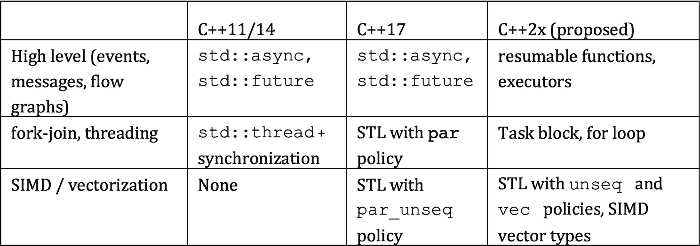
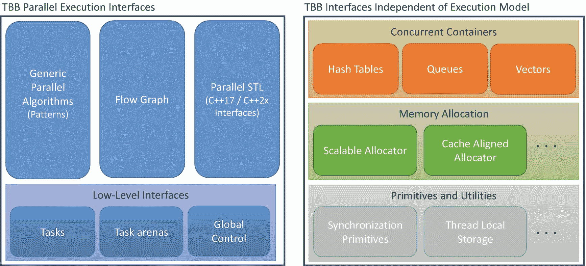
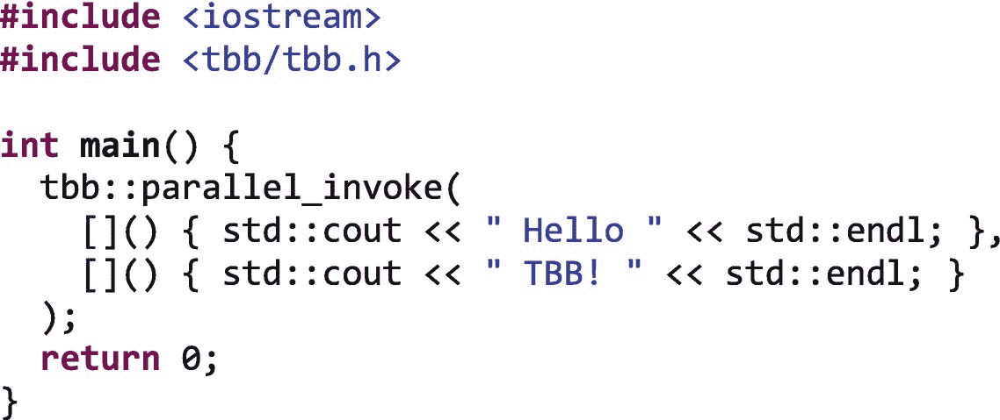
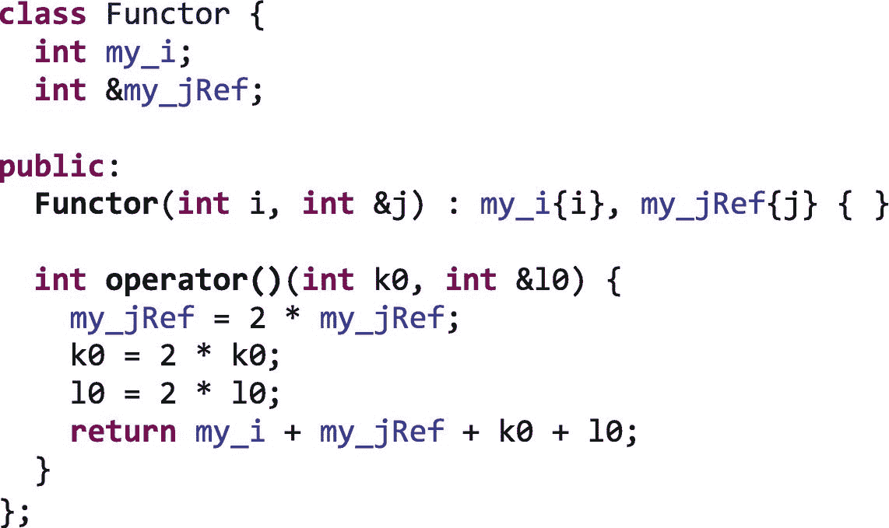
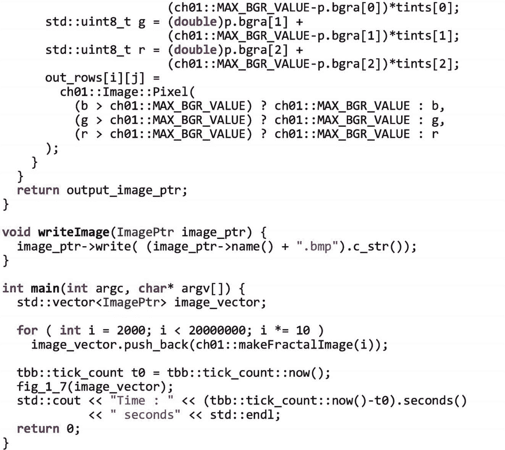
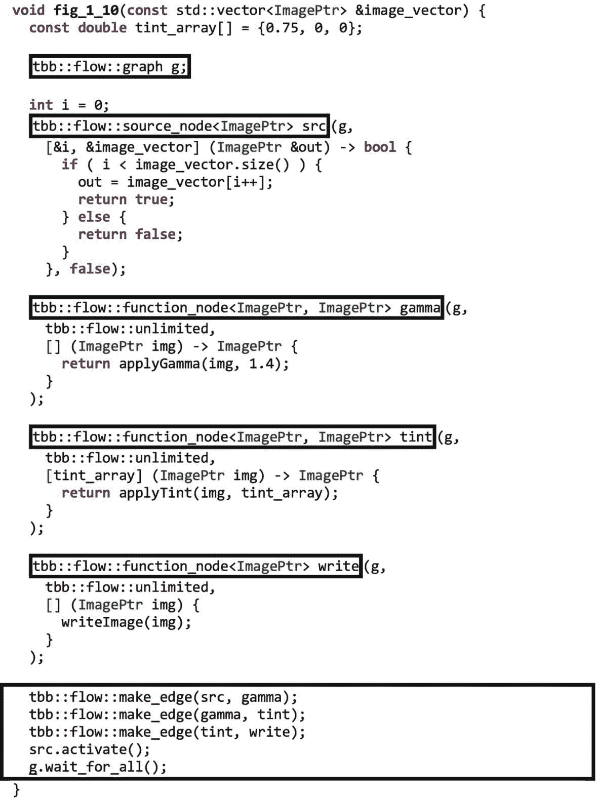
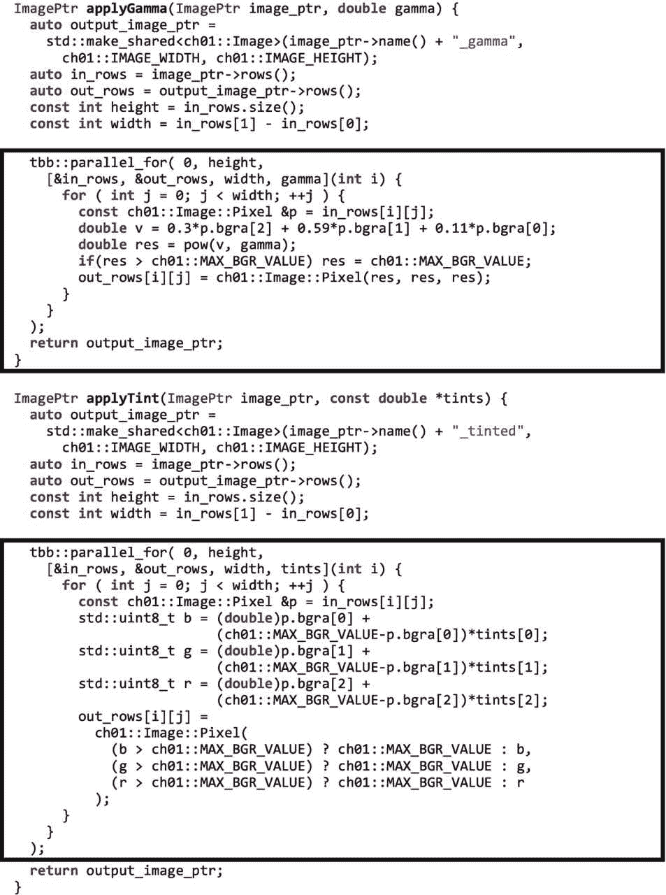
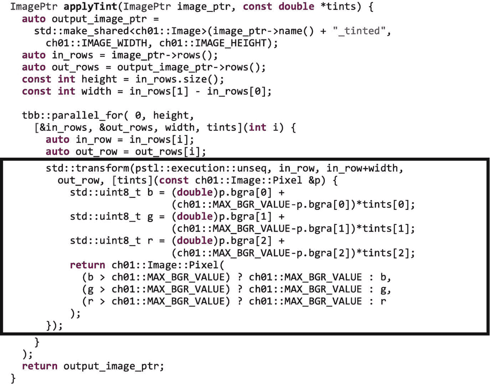

# 1.直接说:“你好，TBB！”

线程构建模块(TBB)库在首次发布 10 年后，已经成为并行编程中使用最广泛的 C++库之一。虽然它保留了其核心理念和功能，但随着新的机遇和挑战的出现，它将继续扩展以应对这些机遇和挑战。

在这一章中，我们讨论了 TBB 的动机，提供了其主要组件的简要概述，描述了如何获得该库，然后直接跳到几个简单的例子。

## 为什么要线程化构建模块？

并行编程有着悠久的历史，可以追溯到 20 世纪 50 年代甚至更久。几十年来，科学家们一直在为超级计算机开发大规模并行模拟，企业也一直在为大型多处理器大型机开发企业应用程序。但是大约 10 年前，第一批用于台式机和笔记本电脑的多核芯片开始进入市场。这改变了游戏规则。

第一批多核台式机和笔记本电脑系统中的处理器数量很少——只有两个内核——但必须成为并行程序员的开发人员数量巨大。如果多核处理器成为主流，并行编程也必须成为主流，特别是对于关心性能的开发人员。

TBB 库于 2006 年 9 月首次发布，旨在应对主流并行编程的独特挑战。它现在的目标，也是 10 年前首次推出时的目标，是为开发人员提供一种简单而强大的方法来构建应用程序，随着具有不同架构和更多内核的新平台的推出，这些应用程序将继续扩展。随着主流处理器中的内核数量从 2006 年的两个增加到 2018 年的 64 个以上，这种“面向未来”的做法取得了成效！

为了实现这一目标，即让并行应用不受处理内核数量和能力变化的影响，TBB 背后的关键理念是让开发人员能够轻松地在其应用中表达并行性，同时限制他们对这种并行性到底层硬件的映射的控制。对于一些有经验的并行程序员来说，这种哲学似乎是违反直觉的。如果我们认为并行编程必须通过对系统的裸机编程，并手动调整和优化应用程序以挤出最后一点性能来不惜一切代价获得最高性能，那么 TBB 可能不适合我们。相反，TBB 库是为那些希望编写在今天的平台上获得高性能的应用程序，但又愿意牺牲一点性能来确保他们的应用程序在未来的系统上继续良好运行的开发人员准备的。

为了实现这一目标，TBB 中的接口让我们能够表达应用中的并行性，同时为库提供灵活性，以便它可以有效地将这种并行性映射到当前和未来的平台，并在运行时使其适应系统资源的动态变化。

### 性能:开销小，对 C++好处大

我们无意对性能损失小题大做，也不想否认这一点。对于以“Fortran”风格编写的简单 C++代码，具有单层平衡良好的并行循环，可能根本不需要 TBB 的动态特性。然而，这种编码风格的局限性是 TBB 存在的一个重要因素。TBB 旨在高效支持嵌套、并发和顺序的并行组合，并将这种并行动态映射到目标平台。使用像 TBB 这样的*可组合*库，开发人员可以通过组合包含并行性的组件和库来构建应用程序，而不用担心它们会相互干扰。重要的是，TBB 不要求我们限制我们表达的并行性来避免性能问题。对于使用 C++的大型复杂的应用程序，TBB 很容易推荐，没有免责声明。

TBB 库经过多年的发展，不仅适应了新的平台，也满足了开发人员的需求，他们希望对库在将并行性映射到硬件时所做的选择有更多的控制。虽然 TBB 1.0 为用户提供的性能控制非常少，但 TBB 2019 提供了相当多的性能控制——例如亲和力控制、工作隔离的构造、可用于将线程固定到内核的钩子等等。TBB 的开发人员努力设计这些控件，在不牺牲可组合性的情况下提供合适的控件级别。

该库提供的接口层次分明——TBB 提供了适合大多数程序员需求的高级模板，专注于常见案例。但它也提供了低级接口，因此我们可以深入研究，并根据需要为我们的特定应用创建定制的解决方案。TBB 拥有两个世界的精华。我们通常依靠库的默认选择来获得出色的性能，但是如果需要的话，我们可以深入研究细节。

### 在 TBB 和 C++中不断发展对并行性的支持

自从最初的 TBB 问世以来，TBB 库和 C++语言都有了很大的发展。2006 年的时候，C++还没有对并行编程的语言支持，包括标准模板库(STL)在内的很多库都不容易在并行程序中使用，因为它们不是线程安全的。

C++语言委员会一直忙于直接向该语言及其附带的标准模板库(STL)添加线程特性。图 [1-1](#Fig1) 显示了解决并行性的新的和计划中的 C++特性。



图 1-1。

C++标准中的特性以及一些建议的特性

尽管我们是 TBB 的忠实粉丝，但事实上我们更希望并行所需的所有基础支持都在 C++语言本身中。这将允许 TBB 利用一致的基础来构建更高级别的并行抽象。TBB 的最初版本必须解决缺乏 C++语言支持的问题，在这个领域，C++标准已经有了很大的发展，以填补 TBB 最初别无选择，只能用可移植锁和原子等功能来填补的基本空白。不幸的是，对于 C++开发人员来说，该标准仍然缺乏完全支持并行编程所需的特性。幸运的是，对于本书的读者来说，这意味着 TBB 对于 C++中有效的线程化仍然是重要的，并且很可能在未来许多年都是重要的。

理解这一点非常重要，我们并不是在抱怨 C++标准流程。向语言标准添加特性最好是非常小心地完成，并仔细检查。例如，C++11 标准委员会在内存模型上花费了巨大的精力。这对于并行编程的重要性对于每个基于该标准构建的库来说都是至关重要的。对于语言标准应该包括什么，应该支持什么，也有一些限制。我们相信 TBB 的任务分配系统和流程图系统不会直接成为语言标准的一部分。即使我们错了，这也不是短期内会发生的事情。

### 针对并行性的最新 C++新增功能

如图 [1-1](#Fig1) 所示，C++11 标准为线程引入了一些底层的、基本的构建模块，包括`std::async`、`std::future`和`std::thread`。它还引入了原子变量、互斥对象和条件变量。这些扩展要求程序员做大量的编码工作来建立更高层次的抽象——但是它们允许我们直接用 C++来表达基本的并行性。C++11 标准对于线程来说是一个明显的改进，但是它并没有为我们提供可以轻松编写可移植的、高效的并行代码的高级特性。它也没有为我们提供任务或底层的偷工减料任务调度程序。

C++17 标准引入了一些特性，这些特性将抽象级别提升到了这些低级构件之上，使我们更容易表达并行性，而不必担心每一个低级细节。正如我们在本书后面所讨论的，仍然有一些重要的限制，所以这些特性还没有足够的表达力或性能——在 C++标准方面还有很多工作要做。

这些 C++17 新增功能中最相关的是可以与标准模板库(STL)算法一起使用的*执行策略*。这些策略让我们选择算法是否可以安全地并行化、矢量化、并行化和矢量化，或者它是否需要保留其原始的有序语义。我们称支持这些策略的 STL 实现为并行 STL。

展望未来，未来的 C++标准可能会包含更多的并行特性，如可恢复函数、执行器、任务块、并行 for 循环、SIMD 向量类型和 STL 算法的附加执行策略。

## 线程构建模块(TBB)库

线程构建模块(TBB)库是一个 C++库，它有两个关键作用:(1)在 C++标准没有充分发展或新功能没有被所有编译器完全支持的情况下，它填补了支持并行性的基本空白；以及(2)它为并行性提供了更高级别的抽象，这超出了 C++语言标准可能包含的范围。TBB 包含许多功能，如图 [1-2](#Fig2) 所示。



图 1-2。

TBB 图书馆的特色

这些特性可以分为两大类:表达并行计算的接口和独立于执行模型的接口。

### 并行执行接口

当我们使用 TBB 创建并行程序时，我们使用高级接口之一或直接通过任务来表达应用程序中的并行性。我们将在本书后面更详细地讨论任务，但是现在我们可以把 TBB 任务看作是一个轻量级对象，它定义了一个小的计算及其相关数据。作为 TBB 开发者，我们直接或间接地通过预先打包的 TBB 算法，使用任务来表达我们的应用，并且库为我们将这些任务调度到平台的硬件资源上。

值得注意的是，作为开发人员，我们可能想要表达不同种类的并行性。图 [1-3](#Fig3) 显示了并行应用中最常见的三个并行层。我们应该注意，一些应用程序可能包含所有三层，而其他应用程序可能只包含其中的一层或两层。TBB 最强大的一个方面是，它为这些不同的并行层提供了高级接口，允许我们使用同一个库来利用所有的层。

图 [1-3](#Fig3) 中所示的消息驱动层捕获并行性，这种并行性被构造为通过显式消息相互通信的相对较大的计算。这一层中的常见模式包括流图、数据流图和依赖图。在 TBB，这些模式通过流程图接口得到支持(在第 [3](03.html#b978-1-4842-4398-5_3) 章中描述)。

图 [1-3](#Fig3) 所示的 fork-join 层支持这样的模式:串行计算分支成一组并行任务，然后仅当并行子计算完成时才继续。fork-join 模式的例子包括功能并行(任务并行)、并行循环、并行归约和流水线。TBB 用它的通用并行算法支持这些(在第 [2](02.html#b978-1-4842-4398-5_2) 章中描述)。


图 1-3。

应用中常见的三个并行层，以及它们如何映射到高级 TBB 并行执行接口

最后，在单指令多数据(SIMD)层，通过对多个数据元素同时应用相同的操作来利用数据并行性。这种类型的并行性通常使用矢量扩展来实现，如 AVX、AVX2 和 AVX-512，它们使用每个处理器内核中可用的矢量单元。所有的 TBB 发行版都有一个并行的 STL 实现(在第 [4](04.html#b978-1-4842-4398-5_4) 章中描述),它提供了矢量实现，以及其他利用这些扩展的功能。

TBB 为许多常见的并行模式提供了高级接口，但是仍然存在没有高级接口匹配问题的情况。如果是这样的话，我们可以直接使用 TBB 任务来构建我们自己的算法。

TBB 并行执行接口的真正力量来自于将它们混合在一起的能力，这通常被称为“可组合性”我们可以创建在顶层具有流图的应用程序，该流图具有使用嵌套的通用并行算法的节点。反过来，这些嵌套的通用并行算法可以在其主体中使用并行 STL 算法。由于所有这些层所表达的并行性都暴露给了 TBB 库，所以这个库可以以高效且可组合的方式来调度相应的任务，从而充分利用平台的资源。

使 TBB 成为可组合的关键属性之一是它支持*宽松的顺序语义*。宽松的顺序语义意味着我们使用 TBB 任务表达的并行性实际上只是对库的一个暗示；不能保证任何任务实际上彼此并行执行。这为 TBB 图书馆提供了极大的灵活性，可以根据需要安排任务以提高性能。这种灵活性使该库能够在系统上提供可扩展的性能，无论它们是单核、八核还是 80 核。它还允许库适应平台上的动态负载；例如，如果一个内核超额完成工作，TBB 可以在其他内核上安排更多工作，甚至选择只使用一个内核来执行并行算法。我们将在第 9 章[中详细描述为什么 TBB 被认为是一个可组合的库。](pt2.html#b978-1-4842-4398-5_9)

### 独立于执行模型的接口

与并行执行接口不同，图 [1-2](#Fig2) 中的第二大组特性完全独立于执行模型和 TBB 任务。这些特性在使用本机线程的应用程序(如`pthreads`或`WinThreads`)中与在使用 TBB 任务的应用程序中一样有用。

这些特性包括并发容器，这些容器为常见的数据结构(如哈希表、队列和向量)提供线程友好的接口。它们还包括内存分配的特性，如 TBB 可伸缩内存分配器和高速缓存对齐分配器(两者都在第 [7](07.html#b978-1-4842-4398-5_7) 章中描述)。它们还包括低级功能，如同步原语和线程本地存储。

### 使用 TBB 的积木

作为开发人员，我们可以挑选 TBB 中对我们的应用程序有用的部分。例如，我们可以只使用可伸缩的内存分配器(在第 [7](07.html#b978-1-4842-4398-5_7) 章中描述),其他什么都不用。或者，我们可以使用并发容器(在第 [6](06.html#b978-1-4842-4398-5_6) 章中描述)和一些通用的并行算法(第 [2](02.html#b978-1-4842-4398-5_2) 章)。当然，我们也可以选择全力以赴，构建一个结合了所有三个高级执行接口的应用程序，并利用 TBB 可伸缩内存分配器和并发容器，以及库中的许多其他功能。

## 让我们开始吧！

### 获取线程构建模块(TBB)库

在开始使用 TBB 之前，我们需要获得该库的副本。有几种方法可以做到这一点。在写这本书的时候，这些方法包括

*   点击 [`www.threadingbuildingblocks.org`](https://www.threadingbuildingblocks.org) 或 [`https://software.intel.com/intel-tbb`](https://software.intel.com/intel-tbb) 的链接，直接从英特尔获得 TBB 库的免费版本。有适用于 Windows、Linux 和 macOS 的预编译版本。最新的软件包包括 TBB 库和并行 STL 算法的实现，该算法使用 TBB 进行线程处理。

*   访问 [`https://github.com/intel/tbb`](https://github.com/intel/tbb) 获得 TBB 图书馆的免费开源版本。TBB 的开源版本绝不是该库的精简版；它包含商业支持版本的所有功能。您可以选择从源代码中检验和构建，也可以单击“发布”下载由英特尔构建和测试的版本。在 GitHub，预构建和测试版本可用于 Windows、Linux、macOS 和 Android。同样，TBB 预建版本的最新包包括 TBB 库和一个使用 TBB 线程的并行 STL 实现。如果你想要并行 STL 的源代码，你需要从 [`https://github.com/intel/parallelstl`](https://github.com/intel/parallelstl) 单独下载。

*   您可以下载一份英特尔 Parallel Studio XE 工具套件 [`https://software.intel.com/intel-parallel-studio-xe`](https://software.intel.com/intel-parallel-studio-xe) 。TBB 和使用 TBB 的并行 STL 目前包含在该工具套件的所有版本中，包括最小的 Composer 版本。如果您安装了最新版本的英特尔 C++编译器，那么您的系统中可能已经安装了 TBB。

我们让读者选择获得 TBB 的最合适的途径，并遵循相应站点上提供的安装软件包的说明。

### 获取示例的副本

本书中使用的所有代码示例都可以在 [`https://github.com/Apress/pro-TBB`](https://github.com/Apress/pro-TBB) 获得。在这个库中，每个章节都有目录。许多源文件是根据它们出现的图来命名的，例如`ch01/fig_1_04.cpp`包含与本章中的图 [1-4](#Fig4) 匹配的代码。

### 写第一句“你好，TBB！”例子

图 [1-4](#Fig4) 提供了一个小例子，使用一个`tbb::parallel_invoke`来评估两个函数，一个打印`Hello`，另一个并行打印`TBB!`。这个例子很简单，不会从并行化中受益，但是我们可以使用它来确保我们已经正确地设置了使用 TBB 的环境。在图 [1-4](#Fig4) 中，我们包含了 tbb.h 头来访问 tbb 函数和类，它们都在名称空间 TBB 中。对`parallel_invoke`的调用向 TBB 库断言，传递给它的两个函数是相互独立的，在不同的内核或线程上以任何顺序并行执行都是安全的。在这些约束条件下，得到的输出可能首先包含`Hello`或`TBB!`。我们甚至可以看到，在输出的末尾，两个字符串和两个连续的换行符之间没有换行符，因为每个字符串及其`std::endl`的打印不是自动进行的。



图 1-4。

一个你好 TBB 的例子

图 [1-5](#Fig5) 提供了一个使用并行 STL `std::for_each`将一个函数并行应用到一个`std::vector`中的两个项目的例子。将一个`pstl::execution::par`策略传递给`std::for_each`断言，在不同的内核或线程上并行地将所提供的函数应用于解引用范围`[v.begin(), v.end()).`中的每个迭代器的结果是安全的，就像图 [1-4](#Fig4) 一样，运行该示例的输出可能会首先打印任一字符串。


图 1-5。

Hello 并行 STL 示例

在两个图 [1-4](#Fig4) 和 [1-5](#Fig5) 中，我们使用 *C++ lambda 表达式*来指定函数。当使用像 TBB 这样的库来指定作为任务执行的用户代码时，Lambda 表达式非常有用。为了帮助复习 C++ lambda 表达式，我们提供了一个标注框“C++ Lambda 表达式入门”,概述了这一重要的现代 C++特性。

### C++ Lambda 表达式入门

对 lambda 表达式的支持是在 C++11 中引入的。它们用于创建匿名函数对象(尽管您可以将它们赋给命名变量)，这些对象可以从封闭范围中捕获变量。C++ lambda 表达式的基本语法是

*   *【捕获清单】***[***参数***)->*【ret】***

 **在哪里

*   *捕获列表*是一个逗号分隔的捕获列表。我们通过在捕获列表中列出变量名来按值捕获变量。我们通过引用捕获一个变量，在它前面加上一个&符号，例如，`&v` **。**我们可以使用`this`通过引用来捕获当前对象。也有默认:`[=]`用于通过值捕获主体中使用的所有自动变量，通过引用捕获当前对象，`[&]`用于通过引用捕获主体中使用的所有自动变量以及当前对象，`[]`什么都不捕获。

*   `params`是函数参数列表，就像命名函数一样。

*   `ret`是返回类型。如果未指定`->ret`，则从返回语句中推断出来。

*   `body`是函数体。

下一个例子展示了一个 C++ lambda 表达式，它通过值捕获一个变量`i`，通过引用捕获另一个变量`j`。它还有一个参数`k0`和另一个通过引用接收的参数`l0`:


运行该示例将产生以下输出:

```cpp

i == 1
j == 10
k == 100
l == 1000
First call returned 2221
i == 1
j == 20
k == 100
l == 2000
Second call returned 4241
i == 1
j == 40
k == 100
l == 4000

```

我们可以把 lambda 表达式看作一个函数对象的实例，但是编译器为我们创建了类定义。例如，我们在前面的例子中使用的 lambda 表达式类似于一个类的实例:



无论我们在哪里使用 C++ lambda 表达式，我们都可以用一个函数对象的实例来代替它，就像前面的例子一样。事实上，TBB 库早于 C++11 标准，它的所有接口都需要传入用户定义类的对象实例。C++ lambda 表达式通过消除每次使用 TBB 算法时定义一个类的额外步骤，简化了 TBB 的使用。

### 构建简单的示例

一旦我们编写了图 [1-4](#Fig4) 和 [1-5](#Fig5) 中的例子，我们需要从它们构建可执行文件。构建使用 TBB 的应用程序的指令依赖于操作系统和编译器。但是，一般来说，正确配置环境需要两个必要的步骤。

#### 设置环境的步骤

1.  我们必须通知编译器 TBB 头文件和库的位置。如果我们使用并行 STL 接口，我们还必须通知编译器并行 STL 头文件的位置。

2.  我们必须配置我们的环境，以便应用程序可以在运行时定位 TBB 库。TBB 是作为动态链接库提供的，这意味着它不是直接嵌入到我们的应用程序中的；相反，应用程序在运行时定位并加载它。并行 STL 接口不需要自己的动态链接库，但是依赖于 TBB 库。

我们现在将简要讨论在 Windows 和 Linux 上完成这些步骤的一些最常见的方法。macOS 的指令类似于 Linux 的指令。TBB 库附带的文档中有更多的案例和更详细的说明。

### 使用 Microsoft Visual Studio 在 Windows 上构建

如果我们下载 TBB 的商业支持版本或英特尔 Parallel Studio XE 的版本，我们可以在安装时将 TBB 库与微软 Visual Studio 集成，然后从 Visual Studio 使用 TBB 就非常简单了。

创造一个“你好，TBB！”项目，我们在 Visual Studio 中照常创建一个项目，用图 [1-4](#Fig4) 或图 [1-5](#Fig5) 中包含的代码添加一个“`.cpp`文件，然后转到项目的**属性页，**遍历到**配置属性➤英特尔性能库**，将**使用 TBB** 改为**是**，如图 [1-6](#Fig6) 所示。这就完成了步骤 1。Visual Studio 现在会将 TBB 库链接到项目中，因为它具有指向头文件和库的正确路径。这也正确地设置了并行 STL 文件头的路径。


图 1-6。

在 Visual Studio 的项目属性页中设置使用***【TBB】***到 ***是***

在 Windows 系统上，由应用程序可执行文件在运行时动态加载的 TBB 库是。`dll`"文件。为了完成设置环境的第 2 步，我们需要将这些文件的位置添加到 PATH 环境变量中。我们可以通过将路径添加到我们的用户或系统路径变量中来做到这一点。找到这些设置的一个地方是在 Windows 控制面板中，通过遍历**系统和安全➤系统➤高级系统设置➤环境变量**。关于“`.dll`”文件的确切位置，我们可以参考我们的 TBB 安装文档。

### 注意

对环境中 PATH 变量的更改只有在 Microsoft Visual Studio 重新启动后才会生效。

一旦我们输入了源代码，让**使用 TBB** 设置为**是**，并且在我们的 path 变量中有了 TBB 的路径`.dll`，我们就可以通过输入 **Ctrl-F5 来构建和执行程序。**

### 从终端构建在 Linux 平台上

#### 使用英特尔编译器

使用英特尔 C++编译器时，编译过程得到了简化，因为 TBB 库包含在编译器中，它支持一个编译器标志`–tbb`，可以在编译过程中为我们正确设置包含和库路径。因此，要使用英特尔 C++编译器编译我们的示例，我们只需在编译行添加`–tbb`标志。

```cpp

    icpc –std=c++11 -tbb –o fig_1_04 fig_1_04.cpp
    icpc –std=c++11 -tbb –o fig_1_05 fig_1_05.cpp

```

#### `tbbvars`和`pstlvars`脚本

如果我们不使用英特尔 C++编译器，我们可以使用 TBB 和并行 STL 发行版中包含的脚本来设置我们的环境。这些脚本修改了`CPATH`、`LIBRARY_PATH`和`LD_LIBRARY_PATH`环境变量，以包含构建和运行 TBB 和并行 STL 应用程序所需的目录。当编译器查找`#include`文件时，`CPATH`变量将额外的目录添加到编译器搜索的目录列表中。`LIBRARY_PATH`在编译时查找要链接的库时，将额外的目录添加到编译器搜索的目录列表中。并且`LD_LIBRARY_PATH`将额外的目录添加到可执行文件在运行时加载动态库时将搜索的目录列表中。

让我们假设我们的 TBB 安装的根目录是`TBB_ROOT`。TBB 库在`${TBB_ROOT}/bin`目录中附带了一组脚本，我们可以执行这些脚本来正确地设置环境。我们需要将我们的架构类型`[ia32|intel64|mic]`传递给这个脚本。我们还需要在编译时添加一个标志来启用 C++11 特性的使用，比如我们对 lambda 表达式的使用。

尽管所有最近的 TBB 库包中都包含了并行 STL 头文件，但我们需要额外的步骤来将它们添加到我们的环境中。就像 TBB 一样，并行 STL 在`${PSTL_ROOT}/bin`目录中附带了一组脚本。`PSTL_ROOT`目录通常是`TBB_ROOT`目录的兄弟。我们还需要传入我们的架构类型，并启用 C++11 特性来使用并行 STL。

在采用 64 位英特尔处理器的 Linux 平台上构建和执行图 [1-4](#Fig4) 中的示例的步骤如下

```cpp

  source ${TBB_ROOT}/bin/tbbvars.sh intel64 linux auto_tbbroot
  g++ -std=c++11 -o fig_1_04 fig_1_04.cpp -ltbb
  ./fig_1_04

```

在采用 64 位英特尔处理器的 Linux 平台上构建和执行图 [1-5](#Fig5) 中的示例的步骤如下

```cpp

  source ${TBB_ROOT}/bin/tbbvars.sh intel64 linux auto_tbbroot
  source ${PSTL_ROOT}/bin/pstlvars.sh intel64 auto_pstlroot
  g++ -std=c++11 -o fig_1_05 fig_1_05.cpp -ltbb
  ./fig_1_05

```

### 注意

越来越多的 Linux 发行版包含了 TBB 库的副本。在这些平台上，GCC 编译器可能链接到平台版本的 TBB 库，而不是由`tbbvars`脚本添加到 LIBRARY_PATH 的 TBB 库版本。如果我们在使用 TBB 时发现链接问题，这可能就是问题所在。如果是这种情况，我们可以在编译器的命令行中添加一个显式的库路径，以选择特定版本的 TBB 库。

例如:

`g++ -L${TBB_ROOT}/lib/intel64/gcc4.7 –ltbb ...`

我们可以在`g++`命令行中添加`–Wl,--verbose`来生成一份报告，报告编译期间被链接的所有库，以帮助诊断这个问题。

虽然我们显示了`g++`的命令，但是除了使用的编译器名称之外，英特尔编译器(`icpc`)或 LLVM ( `clang++`)的命令行是相同的。

#### 不使用`tbbvars`脚本或英特尔编译器手动设置变量

有时我们可能不想使用`tbbvars`脚本，要么是因为我们想确切地知道正在设置什么变量，要么是因为我们需要与构建系统集成。如果不适合您，请跳过这一部分，除非您真的很想手动操作。

既然您还在阅读本节，让我们看看如何在不使用`tbbvars`脚本的情况下在命令行上构建和执行。当用非英特尔编译器编译时，我们没有可用的`–tbb`标志，所以我们需要指定 TBB 头文件和共享库的路径。

如果我们的 TBB 安装的根目录是`TBB_ROOT,`，那么头文件在`${TBB_ROOT}/include`中，共享库文件存储在`${TBB_ROOT}/lib/${ARCH}/${GCC_LIB_VERSION},`中，其中`ARCH`是系统架构`[ia32|intel64|mic]`，而`GCC_LIB_VERSION`是与您的 GCC 或 clang 安装兼容的 TBB 库的版本。

TBB 库版本之间的根本区别是它们依赖于 C++运行时库中的特性(例如`libstdc++`或`libc++`)。

通常，为了找到合适的 TBB 版本，我们可以在终端中执行命令`gcc –version`。然后，我们选择在`${TBB_ROOT}/lib/${ARCH}`中可用的最接近的 GCC 版本，该版本不比我们的 GCC 版本新(即使当我们使用 clang++时，这通常也是有效的)。但是由于不同机器的安装可能不同，并且我们可以选择编译器和 C++运行时的不同组合，这种简单的方法可能并不总是有效。如果没有，请参考 TBB 文档以获得更多指导。

例如，在安装了 GCC 5.4.0 的系统上，我们用

```cpp

g++ -std=c++11 -o fig_1_04 fig_1_04.cpp    \
   –I ${TBB_ROOT}/include                  \
   -L ${TBB_ROOT}/lib/intel64/gcc4.7 –ltbb

```

而在使用 clang++的时候，我们用的是同一个 TBB 版本:

```cpp

clang++ -std=c++11 -o fig_1_04 fig_1_04.cpp  \
    -I ${TBB_ROOT}/include                   \
    -L ${TBB_ROOT}/lib/intel64/gcc-4.7 –ltbb

```

为了编译图 [1-5](#Fig5) 中的例子，我们还需要添加并行 STL 包含目录的路径:

```cpp

g++ -std=c++11 -o fig_1_05 fig_1_05.cpp       \
    –I ${TBB_ROOT}/include                    \
    -I ${PSTL_ROOT}/include                   \
    -L ${TBB_ROOT}/lib/intel64/gcc4.7 –ltbb

```

不管我们是用英特尔编译器、gcc 还是 clang++编译，我们都需要将 TBB 共享库位置添加到我们的`LD_LIBRARY_PATH`中，以便在应用程序运行时可以找到它。同样，假设我们的 TBB 安装的根目录是`TBB_ROOT,`,我们可以这样设置，例如，用

```cpp

export LD_LIBRARY_PATH=${TBB_ROOT}/lib/${ARCH}/${GCC_LIB_VERSION}:${LD_LIBRARY_PATH}

```

一旦我们使用英特尔编译器、gcc 或 clang++编译了我们的应用，并根据需要设置了我们的`LD_LIBRARY_PATH`,我们就可以从命令行运行应用了:

```cpp

./fig_1_04

```

这将产生类似于以下内容的输出

```cpp

 Hello
 Parallel STL!

```

## 一个更完整的例子

前面几节提供了编写、构建和执行一个简单的 TBB 应用程序和一个简单的并行 STL 应用程序的步骤，每个应用程序都打印几行文本。在这一节中，我们编写了一个更大的示例，它使用图 [1-2](#Fig2) 中所示的所有三个高级执行接口，可以从并行执行中获益。我们不解释用于创建该示例的算法和特性的所有细节，而是使用该示例来查看可以用 TBB 表达的不同并行层。这个例子显然是人为的。用几个段落解释足够简单，但展示图 [1-3](#Fig3) 中描述的所有并行层又足够复杂。我们在这里创建的最终多级并行版本应该被视为一个语法演示，而不是如何编写一个最佳 TBB 应用程序的指南。在随后的章节中，我们将更详细地介绍本节中使用的所有特性，并就如何使用它们在更现实的应用中获得更好的性能提供指导。

### 从串行实现开始

让我们从图 [1-7](#Fig7) 所示的串行实现开始。本示例对图像矢量中的每个图像应用灰度校正和色调，并将每个结果写入一个文件。突出显示的函数`fig_1_7`包含一个 for 循环，通过对每幅图像执行`applyGamma`、`applyTint`和`writeImage`函数来处理矢量的元素。图 [1-7](#Fig7) 中也提供了这些功能的串行实现。图像表示和一些辅助功能的定义包含在`ch01.h`中。在 [`https://github.com/Apress/threading-building-blocks`](https://github.com/Apress/threading-building-blocks) 可以找到这个头文件，以及这个例子的所有源代码。

 

图 1-7。

对图像矢量应用灰度校正和色调的示例的串行实现

`applyGamma`函数和`applyTint`函数在外部 for 循环中遍历图像的行，在内部 for 循环中遍历每行的元素。计算新的像素值并将其分配给输出图像。`applyGamma`功能应用伽马校正。`applyTint`功能将蓝色调应用于图像。这些函数接收并返回`std::shared_ptr`对象以简化内存管理；不熟悉`std::shared_ptr`的读者可以参考侧栏讨论“关于智能指针的说明”图 [1-8](#Fig8) 显示了通过示例代码输入的图像输出示例。


图 1-8。

示例输出:(a)由`ch01::makeFractalImage(2000000)`生成的原始图像，(b)经过伽马校正后的图像，以及(c)经过伽马校正和着色后的图像

### 关于智能指针的一个注释

C/C++编程中最具挑战性的部分之一是动态内存管理。当我们使用 new/delete 或 malloc/free 时，我们必须确保正确地匹配它们，以避免内存泄漏和双重释放。C++11 中引入了智能指针，包括`unique_ptr`、`shared_ptr`和`weak_ptr`，以提供自动的、异常安全的内存管理。例如，如果我们通过使用`make_shared`分配一个对象，我们会收到一个指向该对象的智能指针。当我们将这个共享指针分配给其他共享指针时，C++库会为我们处理引用计数。当没有通过任何智能指针对我们的对象进行未完成的引用时，对象将被自动释放。在本书的大多数例子中，包括图 [1-7](#Fig7) ，我们使用智能指针而不是原始指针。使用智能指针，我们不必担心找到所有需要插入或删除的点——我们可以依靠智能指针做正确的事情。

### 使用流程图添加消息驱动层

使用自上而下的方法，我们可以用一个 TBB 流图来代替图 [1-7](#Fig7) 中函数`fig_1_07`的外部循环，该图通过一组过滤器来传输图像，如图 [1-9](#Fig9) 所示。我们承认，在这个特殊的例子中，这是我们最做作的选择。在这种情况下，我们可以很容易地使用外部并行循环；或者我们可以将 Gamma 和 Tint 循环嵌套合并在一起。但是出于演示的目的，我们选择用一个单独节点的图来表示，以展示 TBB 如何被用来表示消息驱动的并行性，这是图 [1-3](#Fig3) 中的顶级并行性。在第 [3](03.html#b978-1-4842-4398-5_3) 章中，我们将了解更多关于 TBB 流图接口的知识，并发现这种高级的、消息驱动的执行接口的更多自然应用。


图 1-9。

有四个节点的数据流图:(1)获取或生成图像的节点，(2)应用灰度校正的节点，(3)应用色调的节点，以及(4)写出结果图像的节点

通过使用图 [1-9](#Fig9) 中的数据流图，我们可以将应用于不同图像的不同阶段流水线的执行重叠。例如，当第一个图像 img <sub>0</sub> 在`gamma`节点完成时，结果被传递到`tint`节点，而新图像 img <sub>1</sub> 进入`gamma`节点。同样，当这个下一步完成时，现在已经通过`gamma`和`tint`节点的 img <sub>0</sub> 被发送到`write`节点。同时，img <sub>1</sub> 被发送到`tint`节点，新的图像 img <sub>2</sub> 在`gamma`节点开始处理。在每一步，过滤器的执行都是相互独立的，因此这些计算可以分布在不同的内核或线程上。图 [1-10](#Fig10) 显示了函数`fig_1_7`的循环，现在表示为 TBB 流程图。



图 1-10。

使用 TBB 流图代替外部 for 循环

正如我们将在第 [3](03.html#b978-1-4842-4398-5_3) 章中看到的，构建和执行 TBB 流图需要几个步骤。首先，构建一个图形对象`g`。接下来，我们在数据流图中构建代表计算的节点。将图像传输到图的其余部分的节点是一个名为`src`的`source_node`。计算由名为`gamma`、`tint`和`write`的`function_node`对象执行。我们可以认为`source_node`是一个没有输入的节点，它继续发送数据，直到没有数据可发送。我们可以把`function_node`看作是接收输入并生成输出的函数的包装器。

创建节点后，我们使用边将它们相互连接起来。边表示节点之间的依赖关系或通信通道。因为，在图 [1-10](#Fig10) 的例子中，我们希望`src`节点发送初始图像到`gamma`节点，我们从`src`节点到`gamma`节点`.`做一条边，然后从`gamma`节点到`tint`节点做一条边。同样，我们制作一条从`tint`节点到`write`节点的边。一旦我们完成了图结构的构建，我们调用`src.activate()`来启动`source_node`并调用`g.wait_for_all()`来等待直到图完成。

当图 [1-10](#Fig10) 中的应用程序执行时，由`src`节点生成的每幅图像都将通过节点管道，如前所述。当一个图像被发送到`gamma`节点时，TBB 库创建并调度一个任务，将`gamma`节点的主体应用到图像上。当该处理完成时，输出被馈送到`tint`节点。同样，TBB 将创建并调度一个任务，在`gamma`节点的输出上执行`tint`节点的主体。最后，当处理完成时，`tint`节点的输出被发送到`write`节点。同样，一个任务被创建并被调度来执行节点的主体，在本例中是将图像写入文件。每次执行完`src`节点并返回`true`时，都会产生一个新的任务来再次执行`src`节点的主体。只有在`src`节点停止生成新图像并且它已经生成的所有图像已经在写入节点中完成处理之后，`wait_for_all`调用才会返回。

### 使用`parallel_for`添加分叉连接层

现在，让我们把注意力转向`applyGamma`和`applyTint`函数的实现。在图 [1-11](#Fig11) 中，我们用对`tbb::parallel_for`的调用替换了串行实现中的外部`i`循环。我们使用一个`parallel_for`通用并行算法来并行执行不同的行。一个`parallel_for`创建的任务可以在一个平台上的多个处理器内核间扩展。该模式是图 [1-3](#Fig3) 中分叉连接层的一个例子，在第 [2](02.html#b978-1-4842-4398-5_2) 章中有更详细的描述。



图 1-11。

添加`parallel_for`以并行应用跨行的伽马校正和色调

### 使用并行 STL 转换添加 SIMD 层

我们可以通过调用并行 STL 函数`transform.`来替换内部`j`循环，从而进一步优化我们的两个计算内核。`transform`算法将函数应用于输入范围内的每个元素，并将结果存储到输出范围内。`transform`的参数是(1)执行策略，(2 和 3)元素的输入范围，(4)输出范围的开始，以及(5)应用于输入范围中的每个元素并且其结果存储到输出元素的 lambda 表达式。

在图 [1-12](#Fig12) 中，我们使用`unseq`执行策略来告诉编译器使用 SIMD 版本的转换函数。并行 STL 功能在第 [4 章](04.html#b978-1-4842-4398-5_4)中有更详细的描述。

 

图 1-12。

使用`std::transform`将 SIMD 并行添加到内部循环中

在图 [1-12](#Fig12) 中，每个`Image::Pixel`对象包含一个具有四个单字节元素的数组，代表该像素的蓝色、绿色、红色和 alpha 值。通过使用`unseq`执行策略，一个向量化的循环被用来跨元素行应用函数。这种级别的并行化对应于图 [1-3](#Fig3) 中的 SIMD 层，并利用 CPU 内核中的矢量单元来执行代码，但不会将计算分散到不同的内核中。

### 注意

将执行策略传递给并行 STL 算法并不能保证并行执行。库选择比所要求的更严格的执行策略是合法的。因此，检查使用执行策略的影响非常重要——尤其是依赖编译器实现的执行策略！

虽然我们在图 [1-7](#Fig7) 到图 [1-12](#Fig12) 中创建的例子有点做作，但它们展示了 TBB 库的并行执行接口的广度和力量。使用单个库，我们表达了消息驱动、fork-join 和 SIMD 并行，将它们组合成一个应用程序。

## 摘要

在这一章中，我们首先解释了为什么像 TBB 这样的图书馆在今天比 10 年前首次推出时更有意义。然后，我们简要地看了一下库中的主要特性，包括并行执行接口和独立于执行接口的其他特性。我们看到，高级执行接口映射到许多并行应用程序中常见的消息驱动、fork-join 和 SIMD 层。然后，我们讨论了如何获得 TBB 的副本，并通过编写、编译和执行非常简单的示例来验证我们的环境设置是否正确。我们通过构建一个使用所有三个高级执行接口的更完整的例子来结束这一章。

我们现在准备在接下来的几章中介绍并行编程的关键支持:通用并行算法(第 [2](02.html#b978-1-4842-4398-5_2) 章)、流程图(第 [3](03.html#b978-1-4842-4398-5_3) 章)、并行 STL(第 [4](04.html#b978-1-4842-4398-5_4) 章)、同步(第 [5](05.html#b978-1-4842-4398-5_5) 章)、并发容器(第 [6](06.html#b978-1-4842-4398-5_6) 章)和可伸缩内存分配(第 [7](07.html#b978-1-4842-4398-5_7) 章)。

[](https://creativecommons.org/licenses/by-nc-nd/4.0) 

**开放存取**本章根据知识共享署名-非商业-非专用 4.0 国际许可协议(http://Creative Commons . org/licenses/by-NC-nd/4.0/)的条款进行许可，该协议允许以任何媒体或格式进行任何非商业使用、共享、分发和复制，只要您适当注明原作者和来源，提供知识共享许可协议的链接，并指出您是否修改了许可材料。根据本许可证，您无权共享从本章或其部分内容派生的改编材料。

本章中的图像或其他第三方材料包含在本章的知识共享许可中，除非在材料的信用额度中另有说明。如果材料不包括在本章的知识共享许可中，并且您的预期使用不被法律法规允许或超出了允许的使用范围，您将需要直接从版权所有者处获得许可。**