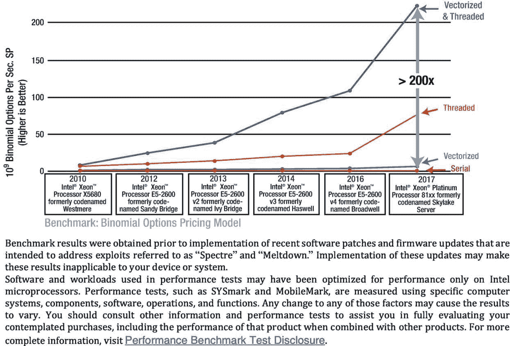
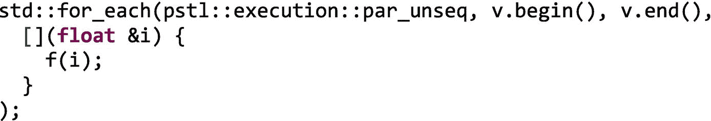
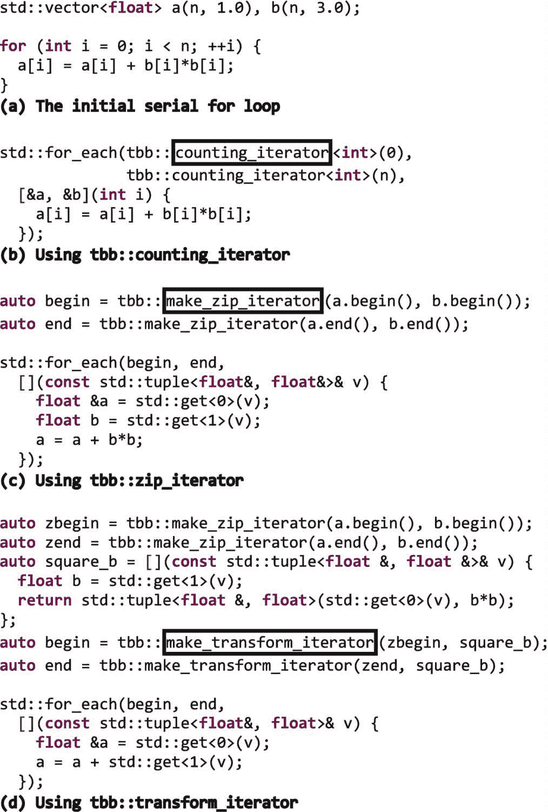
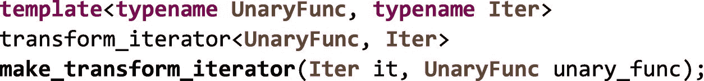
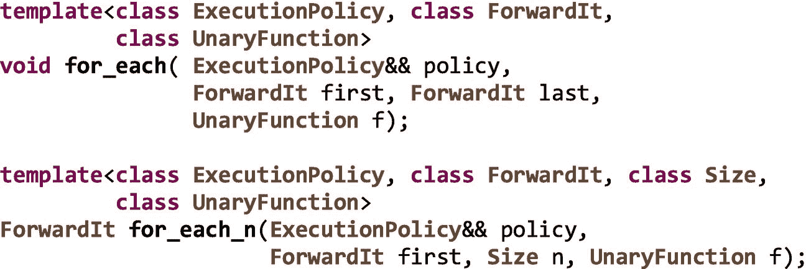
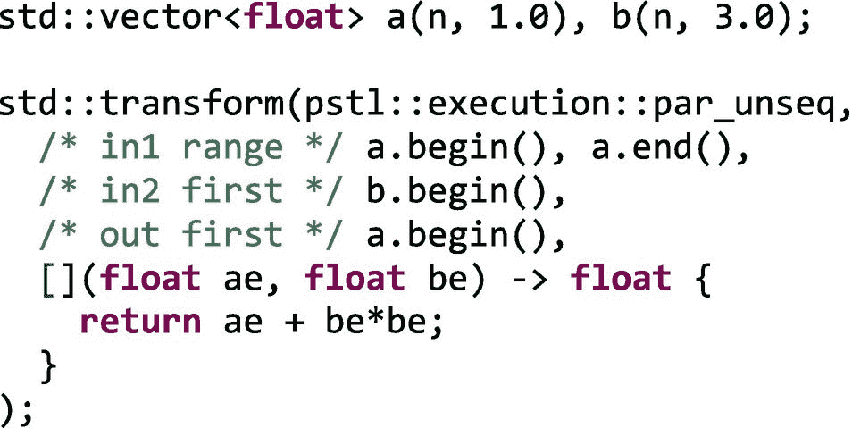
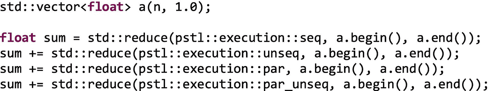
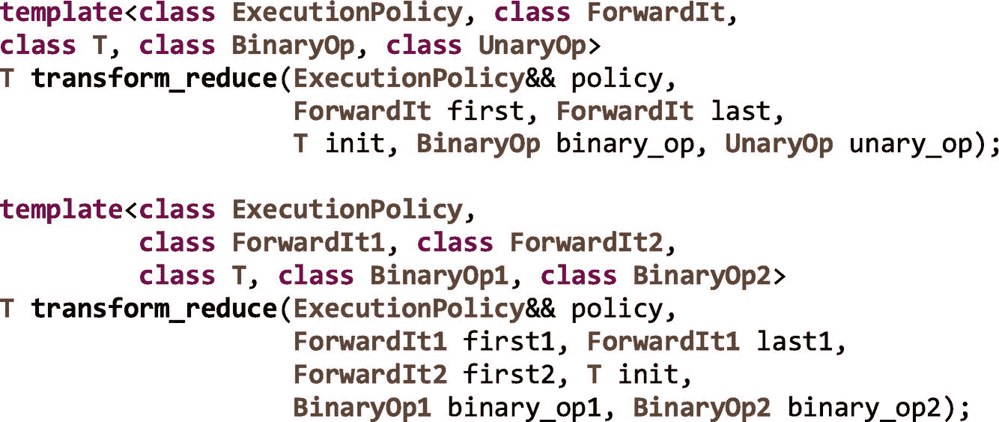
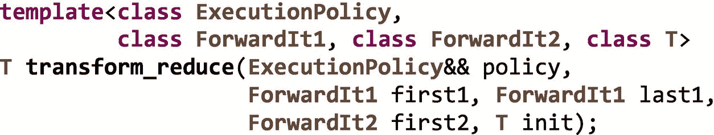

# 四、TBB 和 C++ 标准模板库的并行算法

为了有效地使用线程构建模块(TBB)库，了解它如何支持和扩充 C++ 标准是很重要的。在本章中，我们讨论了 TBB 与标准 C++ 关系的三个方面:

1.  TBB 库经常包含 C++ 标准中新增的与并行性相关的特性。在 TBB 中包含这样的特性可以让开发人员在它们被广泛应用于所有编译器之前就可以提前使用它们。在这种情况下，所有预构建的 TBB 发行版现在都包含了英特尔对 C++ 标准模板库(STL)并行算法的实现。这些实现使用 TBB 任务来实现多线程，使用 SIMD 指令来实现向量化。本章主要讨论并行 STL。

2.  TBB 库还提供了一些 C++ 标准中没有的特性，但是让开发人员更容易表达并行性。通用并行算法和流程图就是这样的例子。在这一章中，我们将讨论 TBB 中包含的自定义迭代器，它拓宽了并行 STL 算法的应用范围。

3.  最后，我们在本章中注意到，对 C++ 标准的一些补充可能会取代对某些 TBB 特性的需求。然而，我们也注意到，在可预见的未来，TBB 的价值可能不会被 C++ 标准所包含。例如，TBB 提供的将持续受益的特性包括它的工作窃取任务调度器、线程安全容器、流图 API 和可伸缩内存分配器。

## C++ STL 库属于这本书吗？

关于 C++ 标准模板库的一章真的属于一本关于 TBB 的书吗？是的，确实如此！TBB 是一个并行的 C++ 库，它不存在于真空中。我们需要理解它与 C++ 标准的关系。

我们在本章中讨论的执行策略在某些方面类似于第 [2](02.html#b978-1-4842-4398-5_2) 章中介绍的 TBB 并行算法，因为它们让我们表达了并行执行算法是安全的——但是它们 ***没有*** 规定确切的实现细节。如果我们想在一个应用程序中混合 TBB 算法和并行 STL 算法，并且仍然拥有高效、可组合的并行性(参见第 [9](pt2.html#b978-1-4842-4398-5_9) 章)，我们可以从使用 TBB 作为并行执行引擎的并行 STL 实现中获益！因此，当我们在本章中讨论并行执行策略时，我们将关注基于 TBB 的实现。当我们使用一个底层使用 TBB 的并行 STL 时，并行 STL 就变成了我们在代码中使用 TBB 任务的另一个途径。

回到第 [1](01.html#b978-1-4842-4398-5_1) 章中的图 [1-3](01.html#Fig3) ，我们注意到许多应用都有多级并行可用，包括最适合在矢量单元上执行的单指令多数据(SIMD)层。正如图 [4-1](#Fig1) 中所示二项式期权应用的性能结果所示，利用这种级别的并行性至关重要。向量并行在单独使用时只能提高很小一部分性能；它受到向量宽度的限制。然而，图 [4-1](#Fig1) 提醒我们，不应该忽视同时使用任务并行和向量并行的倍增效应。

图 4-1

二项式期权定价应用程序在串行、矢量化、线程化以及矢量化和线程化执行时的性能

在第 [1](01.html#b978-1-4842-4398-5_1) 章中，我们实现了一个示例，该示例使用顶级 TBB 流图形层来引入线程，在图形节点中嵌套通用 TBB 并行算法来获得更多线程，然后嵌套 STL 算法，该算法在并行算法体中使用矢量策略来引入矢量化。当我们将 TBB 与并行 STL 及其执行策略相结合时，我们不仅获得了可组合的消息传递和 fork-join 层，还获得了对 SIMD 层的访问。

正是由于这些原因，STL 库中的执行策略是我们探索 TBB 的重要部分！

### TBB 和 C++ 标准

开发 TBB 的团队是 C++ 语言本身支持线程的强烈支持者。事实上，TBB 经常包括模仿 C++ 中标准化的并行特性，以允许开发人员在主流编译器广泛支持这些接口之前迁移到这些接口。这方面的例子是`std::thread`。TBB 的开发人员认识到了`std::thread`的重要性，因此在它在所有 C++ 标准库中可用之前，就为开发人员提供了一个可移植的实现，将该特性直接注入到了`std`名称空间中。今天，TBB 对`std::thread`的实现简单地包括了平台对`std::thread`的实现(如果有的话),并且只有当平台的标准 C++ 库不包括实现时才回退到它自己的实现。对于其他现在标准的 C++ 特性，如原子变量、互斥对象和`std::condition_variable`，也有类似的情况。

## 并行 STL 执行策略模拟

为了帮助思考并行 STL 库提供的不同执行策略，我们可以想象一条多线高速公路，如图 [4-2](#Fig2) 所示。与大多数类比一样，这并不完美，但它可以帮助我们看到不同政策的好处。

我们可以将多车道高速公路中的每条车道视为一个执行线程，将每个人视为一个要完成的操作(例如，这个人需要从 A 点到 B 点)，将每辆汽车视为一个处理器内核，将汽车中的每个座位视为(向量)寄存器中的一个元素。在*串行执行*中，我们只使用高速公路的一条车道(单线程)，每个人都有自己的车(我们没有使用矢量单元)。无论人们是否在同一条路线上行驶，他们都各自开着自己的车，在同一条车道上行驶。

图 4-2

并行 STL 中执行策略的多线高速公路模拟

在一个*线程执行*中，我们使用了不止一条高速公路车道(即不止一个执行线程)。现在，我们在单位时间内完成了更多的任务，但是仍然不允许拼车。如果几个人从同一个起点出发，前往同一个目的地，他们各自开自己的车。我们正在更有效地利用高速公路，但我们的汽车(核心)正在被低效使用。

一个*矢量化执行*就像拼车。如果几个人需要走完全相同的路线，他们共用一辆车。许多现代处理器支持向量指令，例如英特尔处理器中的 SSE 和 AVX。如果我们不使用向量指令，我们就没有充分利用我们的处理器。这些内核中的矢量单元可以同时对多段数据应用相同的操作。向量寄存器中的数据就像人们共用一辆汽车，他们走完全相同的路线。

最后，线程化和矢量化的执行就像使用高速公路上的所有车道(所有内核)以及拼车(使用每个内核中的矢量单元)。

## 使用`std:`和`:for_each`的简单例子

现在我们已经对执行策略有了一个大致的概念，但是在我们进入所有血淋淋的细节之前，让我们从对 vector `v`中的所有元素应用一个函数`void f(float &e)`开始，如图 [4-3(a)](#Fig3) 所示。使用 C++ STL 库中的算法之一`std::for_each`，我们也可以做同样的事情，如图 [4-3(b)](#Fig3) 。就像基于范围的`for`，`for_each`从`v.begin()`迭代到`v.end()`，并对向量中的每一项调用 lambda 表达式。这是`for_each`的默认顺序行为。

然而，使用并行 STL，我们可以通知库，为了利用并行性，可以放松这些语义，或者如图 [4-3(c)](#Fig3) 所示，我们可以让库明确知道我们需要序列语义。使用英特尔的并行 STL 时，我们需要在代码中包含算法和执行策略头，例如:

在 C++17 中，省略执行策略或者传入`sequenced_policy`对象`seq`，会导致相同的默认执行行为:它*看起来就好像*lambda 表达式按顺序在 vector 中的每一项上被调用。我们说“好像”是因为硬件和编译器被允许并行化算法，但前提是这样做对符合标准的程序是不可见的。

并行 STL 的强大之处来自于放松了这种顺序约束的其他执行策略。我们说，通过使用`unsequenced_policy`对象`unseq`，操作可以从一个执行的单线程中重叠或矢量化，如图 [4-3(d)](#Fig3) 所示。然后，该库可以在单线程中重叠操作，例如，通过使用 SSE 或 AVX 等单指令多数据(SIMD)扩展来矢量化执行。图 [4-4](#Fig4) 显示了这种行为，使用并排的方框来表示这些操作使用矢量单位同时执行。`unseq`执行政策允许“拼车”

图 4-4

使用不同的执行策略应用操作

图 4-3

用`std::for_each`实现的简单循环，使用各种并行 STL 执行策略

在图 [4-3(e)](#Fig3) 中，我们告诉库，使用`parallel_policy`对象、`par`的多线程执行，在 vector 中的所有元素上执行这个函数是安全的。如图 [4-4](#Fig4) 所示，`par`策略允许操作分布在不同的执行线程上，但是，在每个线程内，操作不会重叠(即，它们不会被矢量化)。回想一下我们的多车道高速公路的例子，我们现在使用高速公路上的所有车道，但还没有拼车。

最后，在图 [4-3(f)](#Fig3) 中，`parallel_unsequenced_policy`对象，`par_unseq`用于传达 lambda 表达式对元素的应用既可以并行化也可以矢量化。在图 [4-4](#Fig4) 中，`par_unseq`的执行使用了多个执行线程*和*在每个线程内重叠操作。我们现在充分利用了平台中的所有内核，并通过利用每个内核的向量单元来有效地利用每个内核。

在实践中，我们在使用执行策略时必须小心。就像一般的 TBB 并行算法一样，当我们使用执行策略来放松 STL 算法的执行顺序时，我们向库声明这种放松是合法且有利可图的。图书馆不检查我们是正确的。同样，该库也不能保证使用某种执行策略不会降低性能。

图 [4-3](#Fig3) 中需要注意的另一点是，STL 算法本身在名称空间`std`中，但是由英特尔的并行 STL 提供的执行策略在名称空间`pstl::execution`中。如果您有一个完全兼容的 C++17 编译器，那么如果您在`std::execution`名称空间中使用标准执行策略，将会选择其他可能不使用 TBB 的实现。

## 并行 STL 实现中提供了哪些算法？

C++ 标准模板库(STL)主要包括应用于序列的操作。有一些异常值，如`std::min`和`std::max`，可以应用于值，但在大多数情况下，算法，如`std::for_each`、`std::find, std::transform, std::copy,`和`std::sort`，应用于项目序列。当我们想要在支持迭代器的容器上操作时，这种对序列的关注是很方便的，但是如果我们想要表达一些不能在容器上操作的东西，这就有点麻烦了。在这一章的后面，我们会看到有时我们可以“跳出框框思考”,使用自定义迭代器使一些算法的行为更像一般的循环。

解释每个 STL 算法做什么超出了本章和本书的范围。有很多关于 C++ 标准模板库以及如何使用它的书籍，包括 Nicolai Josuttis(Addison-Wesley Professional)的《C++ 标准库:教程和参考》。在本章中，我们只关注在 C++17 中首次引入的执行策略对这些算法意味着什么，以及它们如何与 TBB 一起使用。

C++ 标准中规定的大多数 STL 算法在 C++17 中都有接受执行策略的重载。此外，增加了一些新算法，因为它们在并行程序中特别有用，或者因为委员会希望避免语义上的变化。我们可以通过查看标准本身或在类似 [`http://en.cppreference.com/w/cpp/algorithm`](http://en.cppreference.com/w/cpp/algorithm) 的网站上找到支持执行策略的算法。

### 如何获得和使用一个使用 TBB 的并行 STL 副本

“获取线程构建模块(TBB)库”一节中的第 [1](01.html#b978-1-4842-4398-5_1) 章提供了下载和安装英特尔并行 STL 的详细说明如果你下载并安装了 TBB 2018 update 5 或更高版本的预建副本，无论是通过英特尔获得的商业许可副本还是从 GitHub 下载的开源二进制分发，那么你也会获得英特尔的并行 STL。并行 STL 附带了所有预构建的 TBB 包。

但是，如果您想从 GitHub 获得的源代码构建 TBB 库，那么您需要从 GitHub 单独下载并行 STL 源代码，因为这两个库的源代码分别保存在不同的库 [`https://github.com/intel/tbb`](https://github.com/intel/tbb) 和 [`https://github.com/intel/parallelstl`](https://github.com/intel/parallelstl) 中。

正如我们已经看到的，并行 STL 支持几种不同的执行策略，有些支持并行执行，有些支持矢量化执行，有些两者都支持。英特尔的并行 STL 支持 TBB 并行和使用 OpenMP 4.0 SIMD 结构的矢量化。为了充分利用英特尔的并行 STL，你必须拥有一个支持 C++11 和 OpenMP 4.0 SIMD 结构的 C++ 编译器——当然你还需要 TBB。我们强烈建议使用任何版本的英特尔 Parallel Studio XE 2018 或更高版本附带的英特尔编译器。这些编译器不仅包括 TBB 库并支持 OpenMP 4.0 SIMD 结构，还包括专门用于提高某些 C++ STL 算法在使用`unseq`或`par_unseq`执行策略时的性能的优化。

要构建一个在命令行使用并行 STL 的应用程序，我们需要为编译和链接设置环境变量。如果我们安装了英特尔 Parallel Studio XE，我们可以通过调用套件级环境脚本(如`compilervars.{sh|csh|bat}`)来实现。如果我们刚刚安装了并行 STL，那么我们可以通过在`<pstl_install_dir>/{linux|mac|windows}/pstl/bin.`中运行`pstlvars.{sh|csh|bat}`来设置环境变量，额外的说明在第 [1 章](01.html#b978-1-4842-4398-5_1)中提供。

### 英特尔并行 STL 中的算法

英特尔的并行 STL 还不支持每个 STL 算法的所有执行策略。可以在 [`https://software.intel.com/en-us/get-started-with-pstl`](https://software.intel.com/en-us/get-started-with-pstl) 找到该库提供的算法以及每个算法支持的策略的最新列表。

图 [4-5](#Fig5) 显示了本书撰写时所支持的算法和执行策略。

图 4-5

截至 2019 年 1 月，英特尔并行 STL 中支持执行策略的算法。以后可能会支持其他算法和策略。更新见 [`https://software.intel.com/en-us/get-started-with-pstl`](https://software.intel.com/en-us/get-started-with-pstl) 。

图 [4-6](#Fig6) 显示了英特尔并行 STL 所支持的政策，包括那些属于 C++17 标准的政策，以及那些被提议纳入未来标准的政策。C++17 策略允许我们选择顺序执行(`seq`)、使用 TBB 的并行执行(`par`)或使用也是矢量化的 TBB 的并行执行(`par_unseq`)。unsequenced ( `unseq`)策略让我们选择一个仅矢量化的实现。

图 4-6

英特尔并行 STL 支持的执行策略

## 用定制迭代器捕获更多用例

在本章的前面，我们介绍了`std::for_each`的一个简单用法，并展示了不同的执行策略如何与它一起使用。我们用图 [4-3(f)](#Fig3) 中的`par_unseq`的简单例子看起来像

乍一看，`for_each`算法似乎相当有限，它访问序列中的元素，并对每个元素应用一元函数。当以这种预期的方式在容器上使用时，它实际上在适用性上受到限制。例如，它不接受像 TBB `parallel_for`这样的范围。

然而，C++ 是一种强大的语言，我们可以创造性地使用 STL 算法来扩展它们的适用性。正如我们在第 2 章[中所讨论的，迭代器是一个对象，它指向一个元素范围中的一个元素，并定义提供遍历该范围中的元素的能力的操作符。迭代器有不同的类别，包括*正向*、*双向*和*随机访问*迭代器。许多标准 C++ 容器提供了返回迭代器的`begin`和`end`函数，让我们遍历容器的元素。将 STL 算法应用于更多用例的一种常见方式是使用定制的*迭代器。这些类实现迭代器接口，但不包含在 C++ 标准模板库中。*](02.html#b978-1-4842-4398-5_2)

TBB 库中包含了三个常用的自定义迭代器来帮助使用 STL 算法。这些迭代器类型在图 [4-7](#Fig7) 中有描述，并且可以在`iterators.h`头文件中或者通过全包`tbb.h`头文件获得。

图 4-7

TBB 提供的自定义迭代器类

例如，我们可以将自定义迭代器传递给`std::for_each`，使其更像一个普通的`for`循环。让我们考虑图 [4-8(a)](#Fig8) 所示的简单循环。对于范围`[0,n)`中的每个`i`，该循环将`a[i]+b[i]*b[i]`写回`a[i]`。

图 4-8

使用定制迭代器的`std::for_each`

在图 [4-8(b)](#Fig8) 中，`counting_iterator`类用于创建类似范围的东西。传递给`for_each`λ表达式的参数将是从`0`到`n-1`的整数值。尽管`for_each`仍然只在单个序列上迭代，我们使用这些值作为两个向量`a`和`b`的索引。

在图 [4-8(c)](#Fig8) 中，`zip_iterator`类用于同时迭代`a`和`b`向量。TBB 库提供了一个`make_zip_iterator`函数来简化迭代器的构造:

在图 [4-8(c)](#Fig8) 中，我们仍然在对`for_each`的调用中只使用了一个序列。但是现在，传递给 lambda 表达式的参数是对`float`的引用的`std::tuple`，每个向量一个。

最后，在图 [4-8(d)](#Fig8) 中，我们添加了`transform_iterator`类的用法。我们首先使用`zip_iterator`类将来自向量`a`和`b`的两个序列合并成一个序列，就像我们在图 [4-8(c)](#Fig8) 中所做的那样。但是，我们也创建了一个 lambda 表达式，并将其赋值给`square_b`。lambda 表达式将用于转换对`float`的引用的`std::tuple`，这些引用是通过解引用`zip_iterator.`获得的。我们将此 lambda 表达式传递给对`make_tranform_iterator`函数的调用:

当图 [4-8(d)](#Fig8) 中的`transform_iterator`对象被解引用时，它们从底层`zip_iterator`接收一个元素，对元组的第二个元素求平方，并创建一个新的`std::tuple`，它包含对来自`a`的`float`和来自`b`的平方值的引用。传递给`for_each` lambda 表达式的参数包含一个已经平方的值，因此该函数不需要计算`b[i]*b[i].`

因为像图 [4-7](#Fig7) 中那样的自定义迭代器非常有用，它们不仅可以在 TBB 库中获得，还可以通过其他库获得，比如 Boost C++ 库( [`www.boost.org`](http://www.boost.org) )和 Thrust ( [`https://thrust.github.io/doc/group__fancyiterator.html`](https://thrust.github.io/doc/group__fancyiterator.html) )。它们目前不能直接在 C++ 标准模板库中获得。

## 重点介绍一些最有用的算法

准备工作结束后，我们现在可以更深入地讨论并行 STL 提供的更有用的通用算法，包括`for_each`、`transform`、`reduce`和`transform_reduce`。当我们讨论每种算法时，我们指出了 TBB 通用算法中的相似之处。与 TBB 特定的接口相比，并行 STL 接口的优势在于并行 STL 是 C++ 标准的一部分。并行 STL 接口的缺点是，与一般的 TBB 算法相比，它们的表达能力和可调性较差。当我们在本节中讨论算法时，我们会指出其中的一些缺点。

### `std:` `:for_each`，`std:` `:for_each_n`

在这一章中我们已经谈了很多关于`for_each`的内容。除了`for_each,`并行 STL 还提供了一个`for_each_n`算法，只访问第一个`n`元素。算法`for_each`和`for_each_n`都有几个接口；接受执行策略的如下:

结合定制迭代器，`for_each`可以非常有表现力，正如我们在图 [4-8](#Fig8) 中所展示的。例如，我们可以从第 [2](02.html#b978-1-4842-4398-5_2) 章中提取简单的矩阵乘法示例，并使用`counting_iterator`类在图 [4-9](#Fig9) 中重新实现它。

图 4-9

使用`std::for_each`和`tbb::counting_iterator`创建矩阵乘法的并行版本

如果我们使用一个底层使用 TBB 的 STL，比如英特尔的并行 STL，`par`策略是使用`tbb::parallel_for`实现的，因此对于这样一个简单的例子来说，`std::for_each`和`tbb::parallel_for`的性能将是相似的。

这当然引出了一个问题。如果`std::for_each`使用一个`tbb::parallel_for`来实现它的`par`策略，但是它是一个标准接口，并且也给我们访问其他策略的权限，难道我们不应该*总是*使用`std::for_each`而不是`tbb::parallel_for`吗？

不幸的是，不是所有的代码都像这个例子一样简单。如果我们对有效的线程实现感兴趣，通常直接使用`tbb::parallel_for`会更好。即使对于这个矩阵乘法的例子，正如我们在第 2 章中提到的，我们的简单实现也不是最佳的。在本书的第 2 部分，我们讨论了 TBB 中可用的重要优化钩子，我们可以用它们来调优我们的代码。我们将在第 [16 章](16.html#b978-1-4842-4398-5_16)中看到这些钩子会带来显著的性能提升。不幸的是，当我们使用并行 STL 算法时，这些高级特性中的大部分都无法应用。标准的 C++ 接口根本不允许它们。

当我们使用一个并行 STL 算法并选择一个标准策略如`par, unseq`或`par_unseq`时，我们得到实现决定给我们的任何东西。有人提议在 C++ 中增加一些东西，比如 executors，将来可能会解决这个问题。但目前，我们对 STL 算法几乎没有控制权。当使用 TBB 遗传算法时，比如`parallel_for`，我们可以使用本书第 2 部分描述的丰富的优化特性，比如划分器、不同类型的阻塞范围、粒度、相似性提示、优先级、隔离特性等等。

对于一些简单的情况，一个标准的 C++ 并行 STL 算法可能和它的 TBB 版本一样好，但是在更现实的场景中，TBB 为我们提供了获得我们想要的性能所需的灵活性和控制。

### `std:` `:transform`

并行 STL 中另一个有用的算法是`transform`。它对一个序列中的元素应用一元运算，对两个输入序列中的元素应用二元运算，并将结果写入单个输出序列中的元素。支持并行执行策略的两个接口如下:

在图 [4-8](#Fig8) 中，我们使用`for_each`和自定义迭代器从两个向量中读取并写回一个输出向量，在每次迭代中计算`a[i] = a[i] + b[i]*b[i]`。正如我们在图 [4-10](#Fig10) 中看到的，这是`std::transform`的一个很好的候选。因为`transform`有一个支持两个输入序列和一个输出序列的接口，这与我们的例子非常匹配。

图 4-10

使用`std::transform`将两个向量相加

与`std::for_each`一样，当以典型方式使用时，该算法的适用性受到限制，因为最多有两个输入序列，只有一个输出序列。如果我们有一个写不止一个输出数组或容器的循环，用一个单独的 transform 调用来表达它是不方便的。当然，这是可能的——几乎任何东西都在 C++ 中——但是它需要使用自定义迭代器，比如`zip_iterator`，以及一些非常难看的代码来访问许多容器。

### `std:` `:reduce`

我们在第 [2](02.html#b978-1-4842-4398-5_2) 章讨论`tbb::parallel_reduce`时讨论了缩减。并行 STL 算法`reduce`对一个序列的元素进行约简。然而与`tbb::parallel_reduce`不同的是`,`它只提供了一个归约操作。在下一节中，我们将讨论`transform_reduce`，它更像`tbb::parallel_reduce`，因为它同时提供了转换操作和归约操作。支持并行执行策略的`std::reduce`的两个接口如下:

`reduce`算法使用`binary_op`和恒等值`init`执行序列元素的广义求和。在第一个界面中，`binary_op`不是输入参数，默认使用`std::plus<>`。广义和意味着元素可以按任意顺序分组和重新排列的归约——因此该算法假设运算是结合的和交换的。正因为如此，我们可能会遇到我们在第 [2](02.html#b978-1-4842-4398-5_2) 章的边栏中讨论过的浮点舍入问题。

如果我们想对向量中的元素求和，我们可以使用`std::reduce`和任何执行策略，如图 [4-11](#Fig11) 所示。

图 4-11

使用`std::reduce`对向量的柠檬求和四次

### 标准::转换 _ 减少

如前一节所述，`transform_reduce`类似于`tbb::parallel_reduce`,因为它提供了变换操作和归约操作。但是，与大多数 STL 算法一样，它一次只能应用于一个或两个输入序列:

我们可以用`std::transform_reduce`实现的一个重要且常见的内核是内积。这种用法非常普遍，以至于有一个接口在默认情况下使用`std::plus<>`和`std::multiplies<>`进行两种操作:

两个向量`a`和`b`的内积的串行码如图 [4-12(a)](#Fig12) 所示。我们可以使用一个`std::transform_reduce`，并为这两个操作提供我们自己的 lambda 表达式，如图 [4-12(b)](#Fig12) 所示。或者，如图 [4-12(c)](#Fig12) 所示，我们可以依赖默认操作。

图 4-12

使用`std::transform_reduce`计算内积

同样，与其他并行 STL 算法一样，如果我们稍微跳出框框思考，我们可以使用自定义迭代器，比如`counting_iterator`，使用这种算法来处理不仅仅是容器中的元素。例如，我们可以拿我们在第 [2](02.html#b978-1-4842-4398-5_2) 章中用`tbb::parallel_reduce`实现的圆周率的计算例子，用一个`std::transform_reduce`来实现，如图 [4-13](#Fig13) 所示。

图 4-13

使用`std::transform_reduce`计算圆周率

使用类似于`std::transform_reduce`的并行 STL 算法而不是`tbb::parallel_reduce`带有和我们描述的其他算法一样的优点和缺点。它使用一个标准化的接口，因此具有更好的可移植性。然而，它不允许我们使用本书第 2 部分中描述的优化特性来优化它的性能。

## 对执行策略的深入探究

并行 STL 中的执行策略让我们在 STL 算法的执行过程中交流我们想要应用于操作排序的约束。标准策略集不是凭空而来的，它捕捉了执行高效并行/线程或 SIMD/矢量化代码所需的宽松约束。

如果您乐意将`sequenced_policy`理解为顺序执行、`parallel_policy`理解为并行执行、`unsequenced_policy`理解为向量化执行、`parallel_unsequenced_policy`理解为并行和向量化执行，那么您可以跳过本节的其余部分。然而，如果你想理解这些政策所隐含的微妙之处，请继续阅读我们深入探讨的细节。

### `sequenced_policy`

`sequenced_policy`意味着一个算法的执行*看起来好像* (1)该算法使用的所有*元素访问函数*都在调用该算法的线程上被调用，以及(2)元素访问函数的调用不是交错的(即，它们在一个给定的线程内相对于彼此被排序)。元素访问函数是在访问元素的算法期间调用的任何函数，例如迭代器中的函数、比较或交换函数，以及应用于元素的任何其他用户提供的函数。如前所述，我们说“好像”是因为硬件和编译器被允许违反这些规则，但前提是这样做对符合标准的程序是不可见的。

需要注意的一点是，许多 STL 算法并没有指定操作以任何特定的顺序应用，即使是在有序的情况下。例如，虽然`std::for_each`指定了序列的元素在有序的情况下按顺序访问，但是`std::transform`没有。`std::transform`访问一个序列中的所有元素，但不是以任何特定的顺序。除非另有说明，有序执行意味着元素访问函数的调用在调用线程中是不确定有序的 T4。如果两个函数调用是“不确定顺序的”，这意味着其中一个函数调用在另一个函数调用开始执行之前执行完毕——但是哪个函数调用先执行并不重要。结果是，库可能无法交叉执行这两个函数的操作，例如，阻止了 SIMD 操作的使用。

“好像”规则有时会导致意想不到的性能结果。例如，`sequenced_policy`执行可能和`unsequenced_policy`执行得一样好，因为编译器对两者都进行了矢量化。如果得到令人困惑的结果，您可能需要检查编译器的优化报告，看看应用了哪些优化。

### 并行政策

`parallel_policy`允许在调用线程中或从库创建的其他线程中调用元素访问函数，以帮助并行执行。然而，来自同一线程内的任何调用都是相对于彼此排序的，也就是说，同一线程上的访问函数的执行不能交错。

当我们使用英特尔的并行 STL 库时，`parallel_policy`是使用 TBB 通用算法和任务实现的。执行操作的线程是主线程和 TBB 工作线程。

### `unsequenced_policy`

`unsequenced_policy`断言所有的元素访问函数都必须从调用线程中调用。然而，在调用线程中，这些函数的执行可以交错进行。顺序约束的这种放松是重要的，因为它允许库将不同函数调用中的操作聚集到单个 SIMD 指令中，或者重叠操作。

SIMD 并行可以用通过汇编代码、编译器内部函数或编译器编译指令引入的向量指令来实现。在英特尔的并行 STL 实现中，该库使用 OpenMP SIMD 编译指令。

因为元素访问函数的执行可以在单个线程中交错进行，所以在其中使用互斥对象是不安全的(互斥对象在第 [5](05.html#b978-1-4842-4398-5_5) 章中有更详细的描述)。例如，想象一下，在执行任何匹配的解锁操作之前，交错来自不同函数的几个锁定操作。

### 并行未排序策略

正如我们在了解了前面的策略后所猜测的那样，`parallel_unsequenced_policy`以两种方式削弱了执行约束:(1)元素访问函数可以由调用线程或其他创建来帮助并行执行的线程调用，以及(2)每个线程内的函数执行可以是交错的。

## 我们应该使用哪种执行策略？

当我们选择一个执行策略时，我们首先必须确保它不会将约束放松到算法计算的值是错误的程度。

例如，我们可以使用一个`std::for_each`来计算一个向量`a`的`a[i] = a[i] + a[i-1]`，但是代码依赖于`for_each`的排序顺序(与其他一些不确定排序的算法不同，它将运算符应用于按顺序排列的项目):

该示例将最后一个值存储到变量`previous_value`中，该值是由 lambda 表达式通过引用捕获的。只有当我们在单个执行线程中按顺序执行操作时，这个示例才起作用。使用除了`seq`之外的任何策略对象都会产生不正确的结果。

但是让我们假设我们做了尽职调查，并且我们知道哪些策略对于我们的操作和我们使用的 STL 算法是合法的。我们如何在`sequenced_policy`执行、`unsequenced_policy`执行、`parallel_policy`执行或`parallel_unsequenced_policy`执行之间做出选择？

不幸的是，没有简单的答案。但是我们可以使用一些指导方针:

*   只有当算法有足够的工作量从并行执行中获益时，我们才应该使用线程执行。我们将在本书第二部分的第 16 章讨论何时使用任务的经验法则。这些规则在这里也适用。并行执行会有一些开销，如果工作量不够大，我们只会增加开销而不会提高性能。

*   矢量化的开销较低，因此可以有效地用于小型内部循环。当简单算法无法从线程化中获益时，它们可能会从矢量化中获益。

*   不过，矢量化也会有开销。要在处理器中使用向量寄存器，必须将数据打包在一起。如果我们的数据在内存中不是连续的，或者我们不能以单位步长访问它，编译器可能必须生成额外的指令来将数据收集到向量寄存器中。在这种情况下，矢量化循环的性能可能会比顺序循环差。您应该阅读编译器矢量化报告，并查看运行时配置文件，以确保添加矢量化不会使事情变得更糟。

*   因为我们可以使用并行 STL 轻松地切换策略，所以最好的选择可能是分析您的代码，看看哪种策略最适合您的平台。

## 引入 SIMD 并行的其他方法

除了使用 C++ STL 中的并行算法，还有几种方法可以将 SIMD 并行引入到应用程序中。最简单也是最受欢迎的方法是尽可能使用优化的特定领域或数学内核库。例如，英特尔数学内核库(英特尔 MKL)提供了许多数学函数的高度优化实现，如 BLAS、LAPACK 和 FFTW 中的那些。这些函数在有利可图的情况下利用了线程和矢量化——因此，如果我们使用这些函数，我们可以免费获得线程和矢量化。免费的好！英特尔 MLK 支持基于 TBB 的多项功能执行，因此，如果我们使用这些 TBB 版本，它们将与我们基于 TBB 的并行技术完美结合。

当然，我们可能需要实现任何预打包库中都没有的算法。在这种情况下，有三种添加向量指令的通用方法:(1)内联汇编代码，(2) `simd`内部函数，以及(3)基于编译器的向量化。

我们可以使用内联汇编代码将特定的汇编指令，包括向量指令，直接注入到我们的应用程序中。这是一种依赖于编译器和处理器的低级方法，因此可移植性最差，也最容易出错。但是，它确实给了我们对所使用的指令的完全控制权(不管是好是坏)。我们使用这种方法作为最后的手段！

唯一稍微好一点的方法是使用 SIMD 内部函数。大多数编译器都提供了一组内部函数，让我们无需借助内联汇编代码就能注入特定于平台的指令。但是，除了使注入指令变得更容易之外，最终结果仍然是依赖于编译器和平台的，并且容易出错。我们通常也避免这种方法。

最后一种方法是依靠基于编译器的矢量化。在一个极端，这可能意味着完全自动化的向量化，其中我们打开正确的编译器标志，让编译器做它的事情，并希望最好的。如果成功了，那太好了！我们免费获得了矢量化的好处。记住，免费是个好东西。然而，有时我们需要给编译器一些指导，以便它能够(或将会)向量化我们的循环。有一些特定于编译器的方法来提供指导，如英特尔编译器的`#pragma ivdep and #pragma vector always`和一些标准化方法，如使用 OpenMP `simd`编译指令。与通过内联汇编代码或编译器内部函数将特定于平台的指令直接插入到我们的代码中相比，全自动和用户指导的编译器矢量化要容易得多。事实上，即使是英特尔的并行 STL 库也使用 OpenMP `simd`编译指令以可移植的方式为`unseq`和`parallel_unseq`策略支持矢量化。

我们在本章末尾的“更多信息”一节中提供了一些链接，以了解有关添加矢量指令的选项的更多信息。

## 摘要

在这一章中，我们提供了并行 STL 的概述，它支持哪些算法和执行策略，以及如何获得一个使用线程构建块作为其执行引擎的副本。然后，我们讨论了 TBB 提供的自定义迭代器类，它们增加了 STL 算法的适用性。我们继续强调了一些最有用的和通用的并行编程算法:`std::for_each`、`std::transform`、`std::reduce`和`std::transform_reduce`。我们展示了我们在第 [2](02.html#b978-1-4842-4398-5_2) 章中实现的一些示例也可以用这些算法来实现。但是我们也警告过，STL 算法的表达能力仍然不如 TBB，我们在本书第 2 部分讨论的重要性能挂钩不能用于并行 STL。虽然并行 STL 对于一些简单的情况是有用的，但是它目前的局限性使得我们不愿意将它广泛地推荐给线程。也就是说，TBB 任务并不是通向 SIMD 并行的道路。英特尔的并行 STL 提供的`unseq`和`parallel_unseq`策略，包含在所有最近的 TBB 发行版中，增强了 TBB 提供的线程，支持轻松矢量化。

## 更多信息

Vladimir Polin 和 Mikhail Dvorskiy，“并行 STL:提升 C++ STL 代码的性能:C++ 和向并行化的演进”，《并行宇宙》杂志，英特尔公司，第 28 期，第 5-18 页，2017 年。

阿列克谢·莫斯卡列夫和安德烈·费多罗夫，《并行 STL 入门》， [`https://software.intel.com/en-us/get-started-with-pstl`](https://software.intel.com/en-us/get-started-with-pstl) ，2018 年 3 月 29 日。

Pablo Halpern，Arch D Robison，Robert 杰瓦，Clark Nelson，Jen Maurer，《向量与波前政策》，编程语言 C++ (WG21)，P0076r3， [`http://open-std.org/JTC1/SC22/WG21/docs/papers/2016/p0076r3.pdf`](http://open-std.org/JTC1/SC22/WG21/docs/papers/2016/p0076r3.pdf) ，2016 年 7 月 7 日。

英特尔 64 和 IA-32 架构软件开发人员手册: [`https://software.intel.com/en-us/articles/intel-sdm`](https://software.intel.com/en-us/articles/intel-sdm) 。

英特尔内部函数指南: [`https://software.intel.com/sites/landingpage/IntrinsicsGuide/`](https://software.intel.com/sites/landingpage/IntrinsicsGuide/) 。

 

**开放存取**本章根据知识共享署名-非商业-非专用 4.0 国际许可协议(http://Creative Commons . org/licenses/by-NC-nd/4.0/)的条款进行许可，该协议允许以任何媒体或格式进行任何非商业使用、共享、分发和复制，只要您适当注明原作者和来源，提供知识共享许可协议的链接，并指出您是否修改了许可材料。根据本许可证，您无权共享从本章或其部分内容派生的改编材料。

本章中的图像或其他第三方材料包含在本章的知识共享许可中，除非在材料的信用额度中另有说明。如果材料不包括在本章的知识共享许可中，并且您的预期使用不被法律法规允许或超出了允许的使用范围，您将需要直接从版权所有者处获得许可。