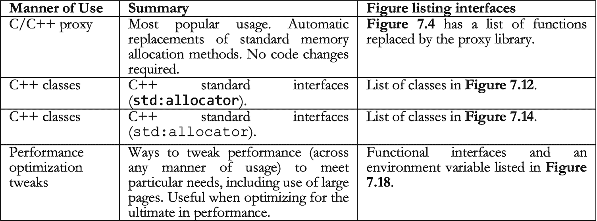
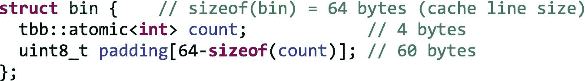
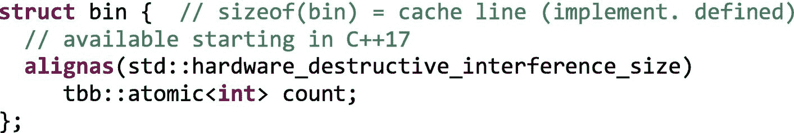
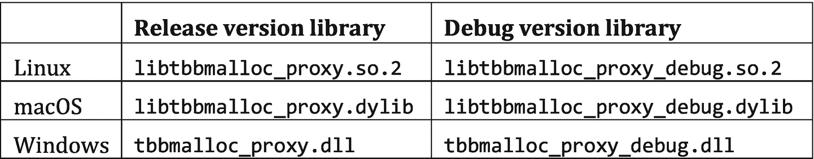
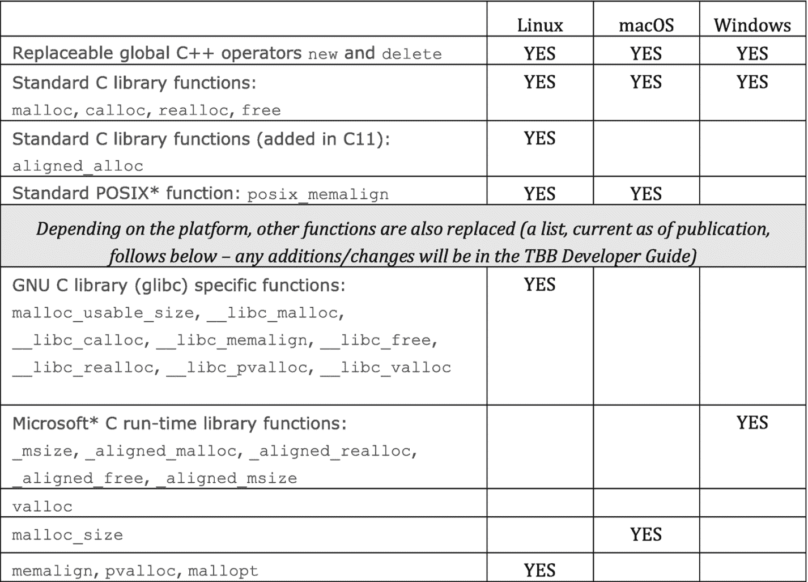
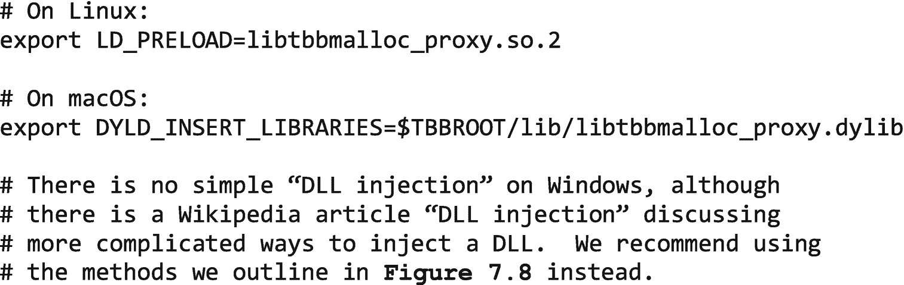
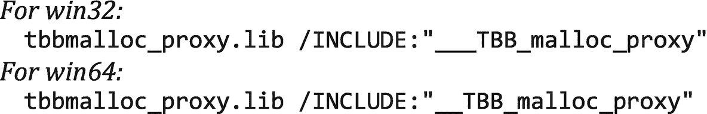
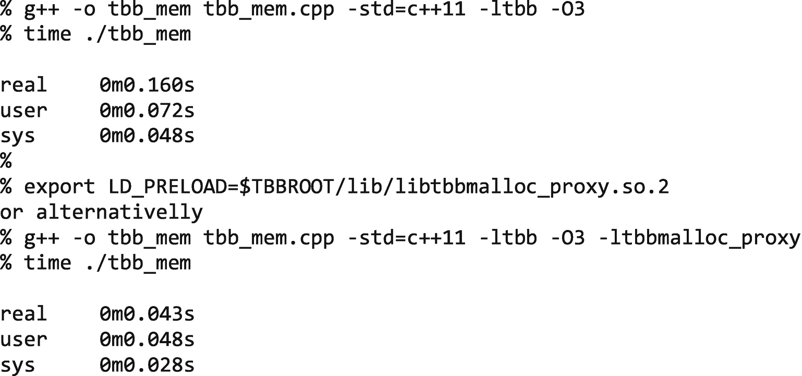
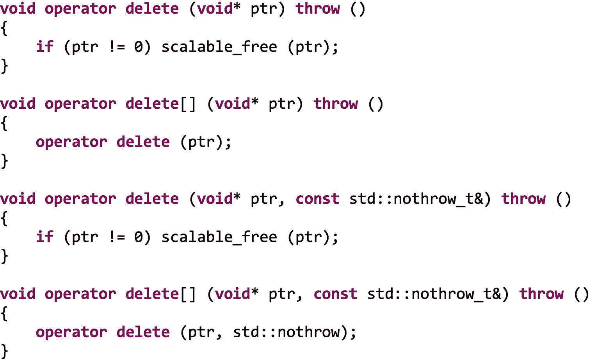
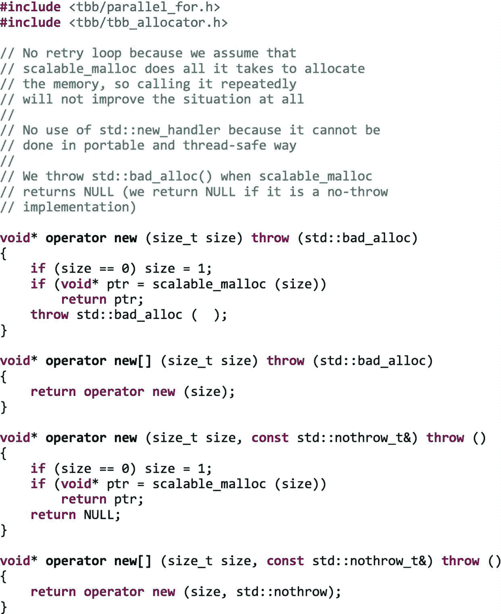

# 7.可扩展内存分配

本章讨论了任何并行程序的一个关键部分:可伸缩内存分配，包括使用`new`以及对`malloc`、`calloc`等的显式调用。无论我们是否使用线程构建模块(TBB)的任何其他部分，都可以使用可扩展内存分配。除了可以直接使用的接口之外，TBB 还提供了一种“代理”方法来自动替换 C/C++ 函数进行动态内存分配，这是一种简单、有效、流行的方法，可以在不修改任何代码的情况下提高性能。不管你对 C++ 的使用有多“现代”，这都是重要且有效的，特别是不管你是使用现代且受鼓励的`std::make_shared`，还是现在不受欢迎的`new`和`malloc`。使用可伸缩内存分配器的性能优势是显著的，因为它们直接解决了限制可伸缩性和错误共享风险的问题。TBB 是第一批广泛使用的可伸缩内存分配器之一，这在很大程度上是因为它与 TBB 一起免费提供，以帮助强调在任何并行程序中包含内存分配考虑因素的重要性。它现在仍然非常流行，并且是可用的最好的可伸缩内存分配器之一。

现代 C++ 编程(支持智能指针)与并行思维相结合，鼓励我们显式地使用`std::allocate_shared`或隐式地使用`std::make_shared`来使用 TBB 可伸缩内存分配器。

## 现代 C++ 内存分配

虽然性能是并行编程特别感兴趣的，但是*正确性*是*所有*应用程序的一个关键话题。内存分配/释放问题是应用程序中错误的一个重要来源，这导致了许多 C++ 标准的增加和被认为是现代 C++ 编程的转变！

现代 C++ 编程*鼓励*使用托管内存分配，在 C++11 中引入了智能指针(`make_shared`、`allocate_shared`等)。)和*不鼓励*大量使用`malloc`或`new`。从这本书的第一章开始，我们就在例子中使用了`std:` `:make_shared`。C++17 中添加的`std::aligned_alloc`提供了缓存对齐以避免错误共享，但没有解决可伸缩内存分配问题。C++20 中有许多额外的功能，但是没有对可伸缩性的明确支持。

TBB 继续为并行程序员提供这一关键部分:*可伸缩内存分配*。TBB 以一种完全符合所有版本的 C++ 和 C 标准的方式做到了这一点。TBB 支持的核心和灵魂可以被描述为*线程内存池*。这种池化避免了由不寻求避免缓存之间不必要的数据转移的内存分配所导致的性能下降。TBB 还提供结合缓存对齐的可扩展内存分配，这提供了比简单使用`std::aligned_alloc`更好的可扩展属性。缓存对齐不是默认行为，因为不加选择的使用会大大增加内存使用。

正如我们将在本章中讨论的，可伸缩内存分配的使用对性能至关重要。`std::make_shared`没有提供对分配器的规范，但是有一个相应的`std::allocate_shared`，它允许对分配器进行规范。

本章主要关注可伸缩内存分配器，无论为应用程序选择何种 C++ 内存分配方式，都应该使用可伸缩内存分配器。具有并行思想的现代 C++ 编程会鼓励用户通过 TBB 可伸缩内存分配器显式使用`std::allocate_shared`，或者通过覆盖默认的`new`来使用 TBB 可伸缩内存分配器，从而通过 TBB 隐式使用`std::make_shared`。注意，`std::make_shared`不受特定类的`new`操作符的影响，因为它实际上分配了更大的内存块来处理类的内容和簿记的额外空间(具体来说，是为了使它成为智能指针而添加的原子)。这就是为什么覆盖默认的`new`(使用 TBB 分配器)将足以影响`std::make_shared`。



图 7-1

使用 TBB 可伸缩内存分配器的方法

## 可伸缩内存分配:什么

本章分四类讨论 TBB 的可扩展内存能力，如图 [7-1](#Fig1) 所示。来自所有四个类别的特征可以自由混合；我们将它们分成几类只是为了解释所有的功能。C/C++ 代理库是目前使用可伸缩内存分配器最流行的方式。

可伸缩内存分配器与 TBB 的其他部分完全分离，因此我们为并发使用选择的内存分配器与我们选择的并行算法和容器模板无关。

## 可伸缩内存分配:为什么

虽然本书的大部分内容向我们展示了如何通过并行工作来提高程序的速度，但是非线程感知的内存分配和释放会使我们的辛苦工作付之东流！在并行程序中，仔细分配内存有两个主要问题:分配器的争用和缓存效应。

当使用普通的非线程分配器时，内存分配可能会成为多线程程序中的一个严重瓶颈，因为每个线程都会为从单个全局堆中分配和取消分配内存而竞争一个全局锁。以这种方式运行的程序是不可伸缩的。事实上，由于这种争用，大量使用内存分配的程序实际上可能会随着处理器内核数量的增加而变慢！可伸缩内存分配器通过使用更复杂的数据结构来很大程度上避免争用，从而解决了这个问题。

另一个问题是缓存效应，这是因为内存的使用在硬件中有一个底层的数据缓存机制。因此，程序中的数据使用将暗示数据需要缓存在哪里。如果我们为线程 B 分配内存，并且分配器给了我们线程 A 最近释放的内存，那么很有可能我们无意中导致数据从一个缓存复制到另一个缓存，这可能会不必要地降低应用程序的性能。此外，如果单独线程的内存分配靠得太近，它们可能会共享一条缓存线。我们可以把这种共享描述为*真共享*(共享同一个对象)或者*假共享*(没有对象被共享，但是对象恰好落在同一个缓存行)。任何一种类型的共享都会对性能产生特别显著的负面影响，但是*错误共享*尤其令人感兴趣，因为它是可以避免的，因为没有打算共享。可伸缩内存分配器通过使用类`cache_aligned_allocator<T>`始终从缓存行开始分配，并维护每个线程的堆(如果需要，会不时重新平衡)，从而避免错误共享。这个组织也有助于解决先前的争用问题。

使用可伸缩内存分配器的好处很容易就能提升 20-30%的性能，我们甚至听说在极端情况下，通过简单地重新链接可伸缩内存分配器，程序性能提高了 4 倍。

### 使用填充避免错误共享

如果数据结构的内部由于错误共享而导致问题，则需要填充。从第 [5](05.html#b978-1-4842-4398-5_5) 章开始，我们使用了直方图示例。直方图的桶和桶的锁都是可能的数据结构，它们在存储器中被足够紧密地打包，以使一个以上的任务更新单个高速缓存行中的数据。

在数据结构中，填充的概念是将元素分隔开，这样我们就不会共享相邻的元素，而这些相邻的元素会通过多个任务进行更新。

关于假共享，我们要采取的第一个措施是，在声明如图 [7-2](#Fig2) 所示的共享直方图(见图 [5-20](05.html#Fig20) )时，依靠`tbb::cache_aligned_allocator`，而不是`std::allocator`或`malloc`。


图 7-2

原子的简单直方图向量

然而，这只是对齐直方图向量的开始，并确保`hist_p[0]`将位于缓存行的开始。这意味着`hist_p[0], hist_p[1], ... , hist_p[15]`存储在同一个缓存行中，当一个线程递增`hist_p[0]`而另一个线程递增`hist_p[15]`时，这就转化为假共享。为了解决这个问题，我们需要确保直方图的每个位置，每个库，都占据了一个完整的缓存行，这可以通过使用图 [7-3](#Fig3) 所示的填充策略来实现。


图 7-3

使用原子的直方图向量中的填充来消除假共享

正如我们在图 [7-3](#Fig3) 中所看到的，二进制数组`hist_p`现在是一个`structs`的向量，每个二进制数组包含原子变量，但也是一个 60 字节的虚拟数组，它将填充一个缓存行的空间。因此，这个代码是依赖于架构的。在当今的英特尔处理器中，高速缓存行是 64 字节，但是你可以找到假定为 128 字节的假共享安全实现。这是因为高速缓存预取(当请求高速缓存行“`i`”时，高速缓存行“`i+1`”)是一种常见的技术，并且这种预取在某种程度上等同于 128 字节大小的高速缓存行。

我们的无伪共享数据结构占用的空间是原来的 16 倍。这是计算机编程中经常出现的时空权衡的又一个例子:现在我们占用了更多的内存，但代码却更快了。其他的例子有较小的代码与循环展开，调用函数与函数内联，或者处理压缩数据与未压缩数据。

等等！bin 结构的前一个实现是不是有点单调？嗯，的确是！一个不太硬的解决方案是这样的:



因为`sizeof()`是在编译时计算的，所以我们可以对其他填充的数据结构使用相同的结构，在这些数据结构中，实际的有效载荷(本例中为计数)具有不同的大小。但是我们知道 C++ 标准中有一个更好的解决方案:


由于使用了`alignas()`方法，这保证了`hist_p`的每个库占用了一个完整的缓存行。还有一件事！我们喜欢编写可移植的代码，对吗？如果在不同的或未来的体系结构中，高速缓存行大小不同，该怎么办。没问题，C++17 标准有我们正在寻找的解决方案:



太好了，假设我们已经修复了*假分享*的问题，那么真分享的呢？

两个不同的线程最终将增加同一个容器，这将从一个高速缓存乒乓到另一个。我们需要一个更好的主意来解决这个问题！当我们讨论*私有化和缩减*时，我们在第 [5](05.html#b978-1-4842-4398-5_5) 章展示了如何处理这个问题。

## 可伸缩内存分配备选方案:哪种

如今，TBB 并不是可伸缩内存分配的唯一选择。虽然我们非常喜欢它，但我们将在本节中介绍最受欢迎的选项。当使用 TBB 进行并行编程时，我们必须使用可伸缩的内存分配器，不管它是由 TBB 还是其他公司提供的。使用 TBB 编写的程序可以利用任何内存分配器解决方案。

TBB 是第一个流行的并行编程方法，它与其他并行编程技术一起促进了可伸缩内存分配，因为 TBB 的创造者了解在任何并行程序中包含内存分配考虑的重要性。TBB 内存分配器今天仍然非常流行，并且肯定仍然是可用的最好的可伸缩内存分配器之一。

无论我们是否使用线程构建模块(TBB)的任何其他部分，都可以使用 TBB 可伸缩内存分配器。同样，TBB 可以在任何可伸缩的内存分配器上运行。

TBB 可伸缩内存分配器最流行的替代品是`jemalloc`和`tcmalloc`。就像 TBB 的可扩展内存分配器一样，有一些替代`malloc`的方法，强调避免碎片，同时提供可扩展的并发支持。所有这三个都是开放源码的，具有自由许可(BSD 或 Apache)。

有些人会告诉你，他们已经将应用程序的`tbbmalloc`与`tcmalloc`和`jeamalloc`进行了比较，发现它比他们的应用程序更优越。这是很常见的。然而，有一些人选择`jemalloc`或`tcmalloc`或`llalloc`，即使他们广泛使用 TBB 的其他地方。这个也行。这是你的选择。

`jemalloc`是 FreeBSD `libc`分配器。最近，增加了额外的开发人员支持特性，如堆分析和广泛的监控/调优挂钩。`jemalloc`为脸书所用。

`tcmalloc`是谷歌`gperftools`的一部分，后者包括`tcmalloc`和一些性能分析工具。`tcmalloc`为谷歌所用。

作为一个开源的无锁内存分配器，可以免费获得，也可以购买与闭源软件一起使用。

单个应用程序的行为，特别是内存分配和释放的模式，使得不可能从这些选项中选出一个万能的赢家。我们确信，任何对`TBBmalloc, jemalloc, and tcmalloc`的选择都将远远优于默认的`malloc`函数或`new`操作符，如果它们是不可伸缩的(FreeBSD 使用`jemalloc`作为它的默认 malloc)。

## 编译注意事项

使用英特尔编译器或`gcc`编译程序时，最好传入以下标志:

*   `-fno-builtin-malloc`(在 Windows 上:`/Qfno-builtin-malloc`)

*   `-fno-builtin-calloc`(在 Windows 上:`/Qfno-builtin-calloc`)

*   `-fno-builtin-realloc`(在 Windows 上:`/Qfno-builtin-realloc`)

*   `-fno-builtin-free`(在 Windows 上:`/Qfno-builtin-free`)

这是因为编译器可能会进行一些优化，假设它正在使用自己的内置函数。当使用其他内存分配器时，这些假设可能不成立。不使用这些标志可能不会导致问题，但为了安全起见，这并不是一个坏主意。查看您最喜欢的编译器的文档可能是明智的。

## 最流行的用法(C/C++ 代理库):如何使用

使用代理方法，我们可以全局替换`new/delete`和`malloc/calloc/realloc/free/etc`。具有动态内存接口替换技术的例程。这种自动替换动态内存分配的`malloc`和其他 C/C++ 函数的方式是目前使用 TBB 可伸缩内存分配器功能最流行的方式。也很有效。

我们可以替换`malloc/calloc/realloc/free/`等。(完整列表见图 [7-4](#Fig4) )和`new/delete`通过使用`tbbmalloc_proxy`库。对于大多数程序来说，使用这种方法既简单又足够了。每个操作系统上使用的机制的细节略有不同，但最终效果在任何地方都是一样的。库名如图 [7-5](#Fig5) 所示；这些方法的总结如图 [7-6](#Fig6) 所示。


图 7-6

使用代理库的方法



图 7-5

代理库的名称



图 7-4

由代理替换的例程列表

### Linux`:`malloc/新代理库的使用

在 Linux 上，我们可以通过使用`LD_PRELOAD`环境变量在程序加载时加载代理库(不改变可执行文件，如图 [7-7](#Fig4) 所示)或者通过将主可执行文件与代理库`(-ltbbmalloc_proxy`链接来进行替换。Linux 程序加载器必须能够在程序加载时找到代理库和可伸缩内存分配器库。为此，我们可以在`LD_LIBRARY_PATH`环境变量中包含包含库的目录，或者将其添加到`/etc/ld.so.conf`。动态内存替换有两个限制:(1)不支持`glibc`内存分配挂钩，如`__malloc_hook`；以及(2) `Mono`(基于微软`.NET`框架的开源实现)。

### MAC OS:malloc/新代理库用法

在 macOS 上，我们可以通过使用`DYLD_INSERT_LIBRARIES`环境变量在程序加载时加载代理库(不改变可执行文件，如图 [7-7](#Fig4) 所示)，或者通过将主可执行文件与代理库(`-ltbbmalloc_proxy`)链接来进行替换。macOS 程序加载器必须能够在程序加载时找到代理库和可伸缩内存分配器库。为此，我们可以在`DYLD_LIBRARY_PATH`环境变量中包含包含库的目录。



图 7-7

`Environment`注入 TBB 可扩展内存分配器的变量

好奇者的实现洞察(非必读):TBB 有一个聪明的方法来克服使用`DYLD_INSERT_LIBRARIES`需要使用平面名称空间来访问共享库符号的事实。通常，如果应用程序是用两级名称空间构建的，这种方法将不起作用，并且强制使用平面名称空间可能会导致崩溃。TBB 通过这样安排来避免这种情况，当`libtbbmalloc_proxy`库被加载到进程中时；它的静态构造器被调用，并为 TBB 内存分配例程注册了一个*内存分配区*。这允许将来自标准 C++ 库的内存分配例程调用重定向到 TBB 可伸缩分配器例程中。这意味着应用程序不需要使用 TBB `malloc`库符号；它继续调用标准的`libc`例程。因此，名称空间没有问题。macOS *malloc zones* 机制还允许应用程序拥有多个内存分配器(例如，由不同的库使用)并正确管理内存。这保证了 TBB 将使用相同的分配器进行分配和取消分配。这是一种安全措施，可以防止由于调用另一个分配器分配的内存对象的释放例程而导致崩溃。

### windows:malloc/新代理库用法

在 Windows 上，我们必须修改我们的可执行文件。我们可以通过在源代码中添加一个`#include`来强制加载代理库，或者使用某些链接器选项，如图 [7-8](#Fig8) 所示。Windows 程序加载器必须能够在程序加载时找到代理库和可伸缩内存分配器库。为此，我们可以在`PATH`环境变量中包含包含库的目录。

包括`tbbmalloc_proxy.h>`到任何二进制文件的源(在应用程序启动时加载):

```cpp

#include <tbb/tbbmalloc_proxy.h>

```

或者将以下参数添加到二进制文件的链接器选项中(在应用程序启动期间加载)。可以为应用程序启动时加载的 EXE 文件或 DLL 指定它们:



图 7-8

在 Windows 上使用代理库的方法(注意:win32 比 win64 多了一个下划线)

### 测试我们的代理库的使用

作为一个简单的复查，看看我们的程序是否利用了更快的分配，我们可以在多核机器上使用图 [7-9](#Fig9) 中的测试程序。在图 [7-10](#Fig10) 中，我们展示了我们如何运行这个小测试，以及我们在运行 Ubuntu Linux 的四核虚拟机上看到的时间差异。在图 [7-11](#Fig11) 中，我们展示了我们如何运行这个小测试，以及我们在四核 iMac 上看到的时间差异。在 Windows 上，使用四核英特尔 NUC(酷睿 i7)上的 Visual Studio“性能分析器”，我们看到在没有可扩展内存分配器的情况下时间为 94 毫秒，在有可扩展内存分配器的情况下时间为 50 毫秒(将`#include <tbb/tbbmalloc_proxy.h>`添加到`tbb_mem.cpp`)。所有这些运行显示了这个小测试如何验证可伸缩内存分配器的注入正在工作(对于`new` / `delete`)并产生不小的性能提升！改为使用`malloc()`和`free()`的微小变化显示了类似的结果。我们将它作为`tbb_malloc.cpp`包含在与本书相关的示例程序下载中。

示例程序确实使用了大量的堆栈空间，因此“`ulimit –s unlimited`”(Linux/MAC OS)或“`/STACK:10000000`”(Visual Studio:Properties>配置属性>链接器>系统>堆栈保留大小)对于避免直接崩溃非常重要。


图 7-12

TBB 可伸缩内存分配器提供的功能


图 7-11

在四核 iMac (macOS)上运行和计时 tbb_mem.cpp



图 7-10

在四核虚拟 Linux 机器上运行和计时`tbb_mem.cpp`


图 7-9

`new` / `delete`速度的小测试程序(`tbb_mem.cpp`

## C 函数:C 的可伸缩内存分配器

图 [7-12](#Fig12) 中列出的一组函数为可伸缩内存分配器提供了一个 C 级接口。由于 TBB 编程使用 C++，这些接口不是为 TBB 用户准备的——它们是为 C 代码准备的。

每个分配例程`scalable_x`的行为类似于库函数`x`。这些程序形成了两个系列，如图 [7-13](#Fig13) 所示。由一个家族中的`scalable_x`函数分配的存储空间必须由同一家族中的`scalable_x`函数释放或调整大小，而不是由 C 标准库函数释放。类似地，任何由 C 标准库函数或 C++ `new`分配的存储空间都不应该被`scalable_x`函数释放或调整大小。

这些功能由特定的`#include <tbb/scalable_allocator.h>"`定义。


图 7-14

TBB 可伸缩内存分配器提供的类


图 7-13

按族耦合分配-解除分配功能

## C++ 类:C++ 的可伸缩内存分配器

虽然代理库提供了一个采用可伸缩内存分配的一揽子解决方案，但它都是基于我们可能选择直接使用的特定功能。TBB 以三种方式提供 C++ 类用于分配:(1)带有 C++ STL `std::allocator<T>`所需签名的分配器，(2)STL 容器的内存池支持，以及(3)对齐数组的特定分配器。

### 带有 std::allocator <t>签名的分配器</t>

图 [7-14](#Fig14) 中列出的一组类为可伸缩内存分配器提供了一个 C++ 级别的接口。根据 C++ 标准，TBB 有四个模板类(`tbb_allocator, cached_aligned_allocator`、`zero_allocator, and scalable_allocator`)支持与`std::allocator<T>`相同的签名。根据 C++11 和以前的标准，除了支持`<T>`之外，还支持`<void>`，这在 C++17 中已被否决，在 C++20 中可能会被删除。这意味着它们可以作为分配例程被 STL 模板使用，比如`vector`。所有四个类都模拟了一个分配器概念，它满足 C++ 的所有“分配器要求”，但是具有标准所要求的用于 ISO C++ 容器的额外保证。

## 可扩展分配器

`scalable_allocator`模板以随处理器数量扩展的方式分配和释放内存。用一个`scalable_allocator`代替`std::allocator`可以提高程序性能。由`scalable_allocator`分配的内存应该由`scalable_allocator`释放，而不是由`std::allocator`释放。

`scalable_allocator`分配器模板要求`TBBmalloc`库可用。如果库丢失，对`scalable_allocator`模板的调用将会失败。相反，如果内存分配器库不可用，其他的分配器`(tbb_allocator`、`cached_aligned_allocator`或`zero_allocator)`会回到 malloc 并释放。

这个类是用`#include <tbb/scalable_allocator.h> and is notably` `not`定义的，包含在(通常)全包的`tbb/tbb.h`中。

## tbb _ 分配器

如果可用，`tbb_allocator`模板通过`TBBmalloc`库分配和释放内存；否则，恢复使用`malloc`和`free`。`cache_alligned_allocator`和`zero_allocator`使用`tbb_allocator`；因此，它们在`malloc`上提供了相同的回退，但是`scalable_allocator`没有，因此如果`TBBmalloc`库不可用，它们将会失败。该类由`#include <tbb/tbb_allocator.h>`定义

## 零分配器

`zero_allocator`分配清零的内存。可以为任何模拟分配器概念的类 A 实例化一个`zero_allocator<T,A>`。A 的默认为`tbb_allocator`。`zero_allocator`将分配请求转发给 A，并在返回之前将分配归零。这个类是用`#include <tbb/tbb_allocator.h>`定义的。

## 缓存对齐分配器

`cached_aligned_allocator`模板提供了可伸缩性和防止虚假共享的保护。它通过确保每个分配都在单独的缓存行上完成来解决错误共享。

仅当虚假共享可能是真正的问题时才使用`cache_aligned_allocator`(参见图 [7-2](#Fig2) )。`cache_aligned_allocator`的功能在空间上是有代价的，因为它以多倍于缓存行大小的内存块来分配，即使对于一个小对象也是如此。填充通常为 128 字节。因此，用`cache_aligned_allocator`分配许多小对象可能会增加内存使用。

尝试使用`tbb_allocator`和`cache_aligned_allocator`并测量特定应用的最终性能是一个好主意。

注意，只有当两个对象都被分配了`cache_aligned_allocator`时，才能保证防止两个对象之间的错误共享。例如，如果一个对象是由`cache_aligned_allocator<T>`分配的，而另一个对象是以其他方式分配的，那么就不能保证防止错误共享，因为`cache_aligned_allocator<T>`在高速缓存行边界开始分配，但不一定分配到高速缓存行的末端。如果正在分配数组或结构，因为只有分配的开始是对齐的，所以单个数组或结构元素可能与其他元素一起位于高速缓存线上。图 [7-3](#Fig3) 显示了一个这样的例子，以及将元素强制到单个缓存行的填充。

这个类是用`#include <tbb/cache_alligned_allocator.h>`定义的。

### 内存池支持:`memory_pool_allocator`

池分配器是一种非常有效的方法，可以为许多固定大小的对象提供分配。我们的第一个分配器用法很特殊，它要求保留足够的内存来存储大小为`P`的`T`个对象。此后，当分配器用于提供内存块时，它将偏移量 mod `P`返回到分配的内存块中。这比为每个请求分别调用操作符`new`要有效得多，因为它避免了为不同大小的分配服务大量请求的通用内存分配器所需的簿记开销。

该类主要用于在 STL 容器中启用内存池。这是我们写这本书时的一个“预览”功能(将来可能会提升为一个常规功能)。使用#define `TBB_PREVIEW_MEMORY_POOL 1`启用预览功能。

由`tbb::memory_pool_allocator`和`tbb:: memory_pool_allocator`提供支持。这些要求


### 数组分配支持:aligned_space

这个模板类(`aligned_space`)占据了足够的内存，并且足够对齐以容纳一个数组`T[N]`。元素不由该类构造或销毁；客户端负责初始化或销毁对象。在需要一块固定长度的未初始化内存的场景中，`aligned_space`通常用作局部变量或字段。这个类是用`#include <tbb/aligned_space.h>`定义的。

## 有选择地替换新的和删除

开发定制的 new/delete 操作符有很多原因，包括错误检查、调试、优化和使用统计信息收集。

我们可以认为`new/delete`是单个对象和对象数组的变体。此外，C++11 定义了其中每一个的抛出、非抛出和放置版本:或者是全局集合`(::operator new`、`::operator new[]`、`::operator delete`和`::operator delete[]`，或者是类特定集合(对于类`X`，我们有`X::operator new`、`X::operator new[]`、`X::operator delete`和`X::operator delete[]`)。最后，C++17 给所有版本的 new 增加了一个可选的对齐参数。

如果我们想要全局替换所有的`new` / `delete`操作符，并且没有任何定制需求，我们将使用代理库。这也有取代`malloc/free`和相关 C 函数的好处。

出于自定义需要，重载特定于类的运算符而不是全局运算符是最常见的。本节展示了如何替换全局`new` / `delete`操作符，作为一个例子，可以根据特定的需求进行定制。我们展示了抛出和非抛出版本，但是我们没有覆盖放置版本，因为它们实际上不分配内存。我们也没有实现带有对齐(C++17)参数的版本。也可以使用相同的概念替换单个类的`new` / `delete`操作符，在这种情况下，您可以选择实现放置版本和对齐功能。如果使用代理库，所有这些都由 TBB 处理。

图 [7-15](#Fig15) 和 [7-16](#Fig16) 一起展示了一种替换`new`和`delete`的方法，图 [7-17](#Fig17) 展示了它们的用法。所有版本的`new`和`delete`都要立刻更换，相当于四个版本的`new`和四个版本的`delete`。当然，需要与可扩展内存库链接。

我们的例子选择忽略任何新的处理程序，因为存在线程安全问题，它总是抛出`std::bad_alloc()`。基本签名的变体包括附加参数`const std::nothrow_t&`，这意味着如果分配失败，该操作符不会抛出异常，但会返回`NULL`。这四个非抛出异常操作符可用于 C 运行时库。

我们不需要初始化任务调度器就可以使用内存分配器。我们在这个例子中初始化它，因为它使用了`parallel_for`来演示在多个任务中使用内存分配和释放。类似地，内存分配器唯一需要的头文件是`tbb/tbb_allocator.h`。


图 7-17。

演示新/删除替换的驱动程序



图 7-16

延续上图，替换删除运算符



图 7-15

新操作员替换示范(`tbb_nd.cpp`)

## 性能调音:一些控制旋钮

TBB 提供了一些关于操作系统分配、大页面支持和内部缓冲区刷新的特殊控制。每一个都是用来微调性能的。

*大页面*(Windows 上的*大页面*)用于提高使用大量内存的程序的性能。为了使用巨大的页面，我们需要一个支持的处理器，一个支持的操作系统，然后我们需要做一些事情，这样我们的应用程序就可以利用巨大的页面。幸运的是，大多数系统都有这一切，TBB 包括支持。

### 什么是巨页？

在大多数情况下，处理器一次在通常称为页面的地方分配内存 4K 字节。虚拟内存系统使用页表将地址映射到实际的内存位置。无需深入研究，只需说明应用程序使用的内存页面越多，就需要越多的页面描述符，并且大量页面描述符的到处乱飞会导致各种各样的性能问题。为了帮助解决这个问题，现代处理器支持比 4K 大得多的额外页面大小(例如，4 MB)。对于使用 2 GB 内存的程序，需要 524，288 个页面描述来描述 2 GB 内存和 4K 页面。使用 4 MB 描述符只需要 512 个页面描述，如果 1 GB 描述符可用，只需要两个。

### TBB 支持大页面

要使用具有 TBB 内存分配的大页面，应该通过调用`scalable_allocation_mode( TBBMALLOC_USE_HUGE_PAGES,1)`或者通过将`TBB_MALLOC_USE_HUGE_PAGES`环境变量设置为`1`来显式启用它。当用`tbbmalloc_proxy`库替换标准 malloc 例程时，环境变量很有用。

这些提供了调整用于 TBB 可伸缩内存分配器所有用法的算法的方法(不管使用的方法:代理库、C 函数或 C++ 类)。这些函数优先于任何环境变量设置。这些绝对不是随便用的，它们是为自称为“控制狂”的人准备的，并为特定需求提供了优化性能的好方法。当使用这些特性时，我们建议在目标环境中仔细评估对应用程序的性能影响。

当然，这两种方法都假设系统/内核被配置为分配巨大的页面。TBB 内存分配器还支持预分配和透明的巨大页面，这些页面在合适的时候由 Linux 内核自动分配。巨大的页面不是万能的；如果没有很好地考虑它们的使用，它们会对性能产生负面影响。

如图 [7-18](#Fig18) 所列的功能用`#include <tbb/tbb_allocator.h>`定义。


图 7-18

改进 TBB 可伸缩内存分配器行为的方法

### scalable _ allocation _ mode(int mode，intptr_t value)

`scalable_allocation_mode`函数可以用来调整可伸缩内存分配器的行为。下面两段中描述的参数控制 TBB 分配器的行为。如果操作成功，函数返回`TBBMALLOC_OK`，如果模式不是下面小节中描述的模式之一，或者如果值对于给定的模式无效，函数返回`TBBMALLOC_INVALID_PARAM`。当所描述的条件适用时，返回值`TBBMALLOC_NO_EFFECT`是可能的(参见每个函数的解释)。

### TBBMALLOC_USE_HUGE_PAGES

```cpp

scalable_allocation_mode(TBBMALLOC_USE_HUGE_PAGES,1)

```

如果操作系统支持，这个函数允许分配器使用巨大的页面；零作为第二个参数禁用它。将 TBB_MALLOC_USE_HUGE_PAGES 环境变量设置为 1 与调用`scalable_allocation_mode to`启用该模式具有相同的效果。用`scalable_allocation_mode`设置的模式优先于环境变量。如果平台不支持大页面，该函数将返回`TBBMALLOC_NO_EFFECT`。

### TBBMALLOC_SET_SOFT_HEAP_LIMIT

```cpp

scalable_allocation_mode(TBBMALLOC_SET_SOFT_HEAP_LIMIT, size)

```

这个函数为分配器从操作系统中获取的内存量设置了一个`size`字节的阈值。超过阈值将促使分配器从其内部缓冲区释放内存；但是，这并不妨碍 TBB 可伸缩内存分配器在需要时请求更多的内存。

### int scalable _ allocation _ command(int cmd，void∫param)

`scalable_allocation_command`函数可用于命令可伸缩内存分配器执行由第一个参数指定的动作。第二个参数是保留的，必须设置为零。如果操作成功，函数将返回`TBBMALLOC_OK`，如果`reserved`不等于零，或者`cmd`不是定义的命令`(TBBMALLOC_CLEAN_ALL_BUFFERS`或`TBBMALLOC_CLEAN_THREAD_BUFFERS)`，函数将返回`TBBMALLOC_INVALID_PARAM`。返回值`TBBMALLOC_NO_EFFECT`是可能的，如下所述。

### TBBMALLOC_CLEAN_ALL_BUFFERS

```cpp

scalable_allocation_command(TBBMALLOC_CLEAN_ALL_BUFFERS, 0)

```

这个函数清理分配器的内部内存缓冲区，并可能减少内存占用。这可能会导致后续内存分配请求的时间增加。该命令不是为频繁使用而设计的，建议仔细评估性能影响。如果没有缓冲区被释放，该函数将返回`TBBMALLOC_NO_EFFECT`。

### TBBMALLOC_CLEAN_THREAD_BUFFERS

```cpp

scalable_allocation_command(TBBMALLOC_CLEAN_THREAD_BUFFERS, 0)

```

这个函数清理内部内存缓冲区，但只针对调用线程。这可能导致后续内存分配请求的时间增加；建议仔细评估性能影响。如果没有缓冲区被释放，该函数将返回`TBBMALLOC_NO_EFFECT`。

## 摘要

使用可伸缩的内存分配器是任何并行程序中的一个基本元素。性能优势可能非常显著。如果没有可伸缩的内存分配器，由于分配争用、错误共享和其他无用的缓存到缓存的传输，经常会出现严重的性能问题。TBB 可伸缩内存分配(`TBBmalloc`)功能包括使用`new`以及显式调用`malloc`，等等，所有这些都可以直接使用，或者都可以通过 TBB 的代理库功能自动替换。无论我们是否使用 TBB 的任何其他部分，都可以使用 TBB 的可伸缩内存分配；无论使用哪种内存分配器(`TBBmalloc, tcmalloc, jemalloc`、`malloc`等)，都可以使用 TBB 的其余部分。).`TBBmalloc`库今天仍然非常流行，并且绝对是可用的最好的可伸缩内存分配器之一。

[](https://creativecommons.org/licenses/by-nc-nd/4.0) 

**开放存取**本章根据知识共享署名-非商业-非专用 4.0 国际许可协议(http://Creative Commons . org/licenses/by-NC-nd/4.0/)的条款进行许可，该协议允许以任何媒体或格式进行任何非商业使用、共享、分发和复制，只要您适当注明原作者和来源，提供知识共享许可协议的链接，并指出您是否修改了许可材料。根据本许可证，您无权共享从本章或其部分内容派生的改编材料。

本章中的图像或其他第三方材料包含在本章的知识共享许可中，除非在材料的信用额度中另有说明。如果材料不包括在本章的知识共享许可中，并且您的预期使用不被法律法规允许或超出了允许的使用范围，您将需要直接从版权所有者处获得许可。