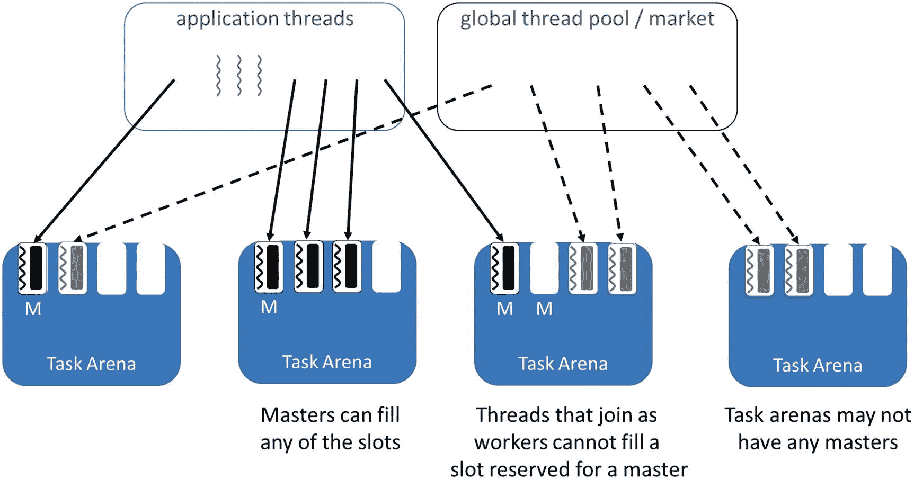
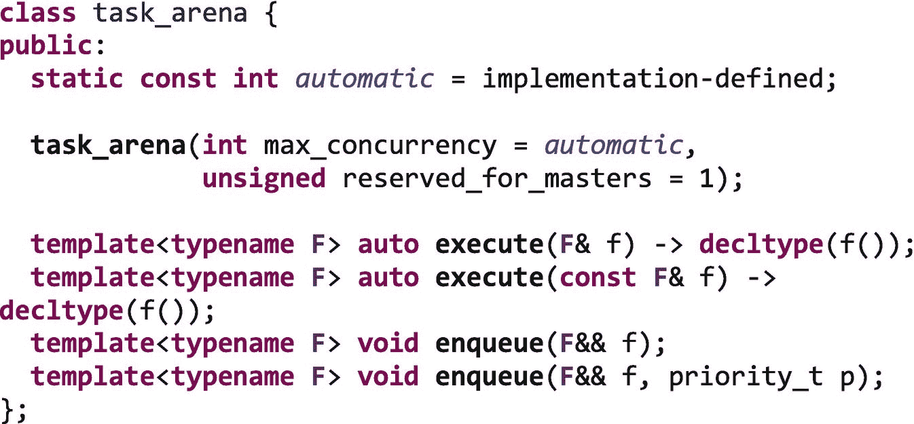
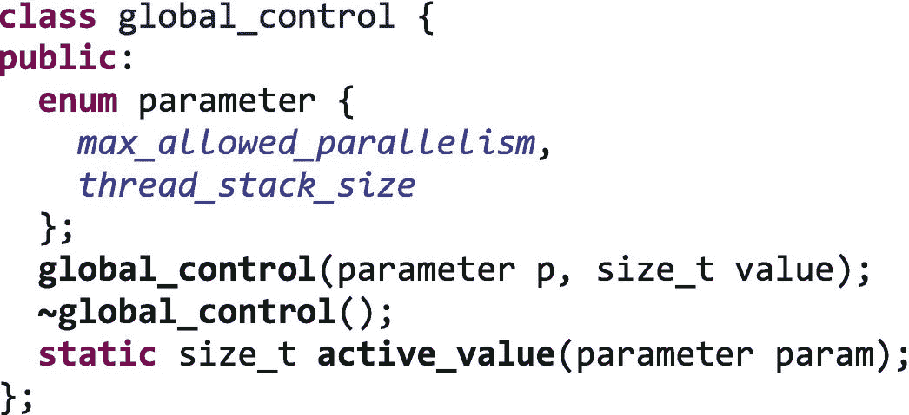
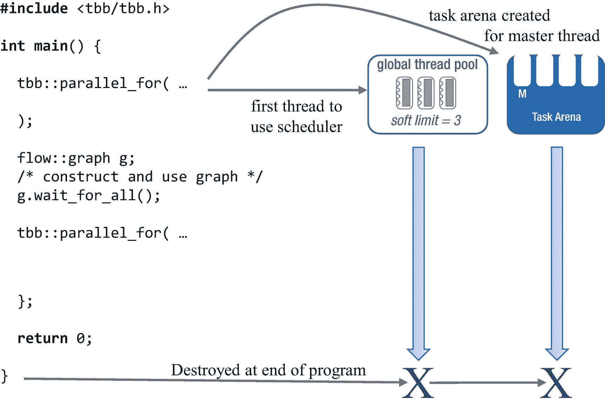
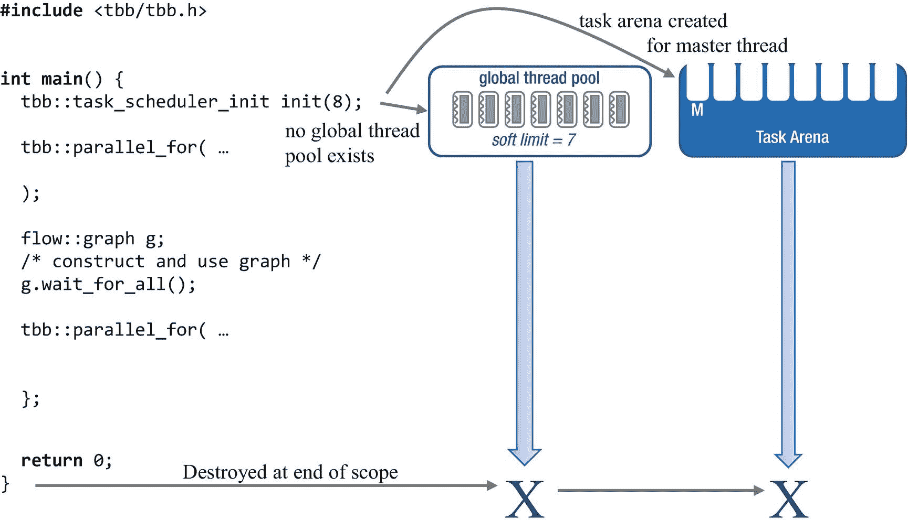
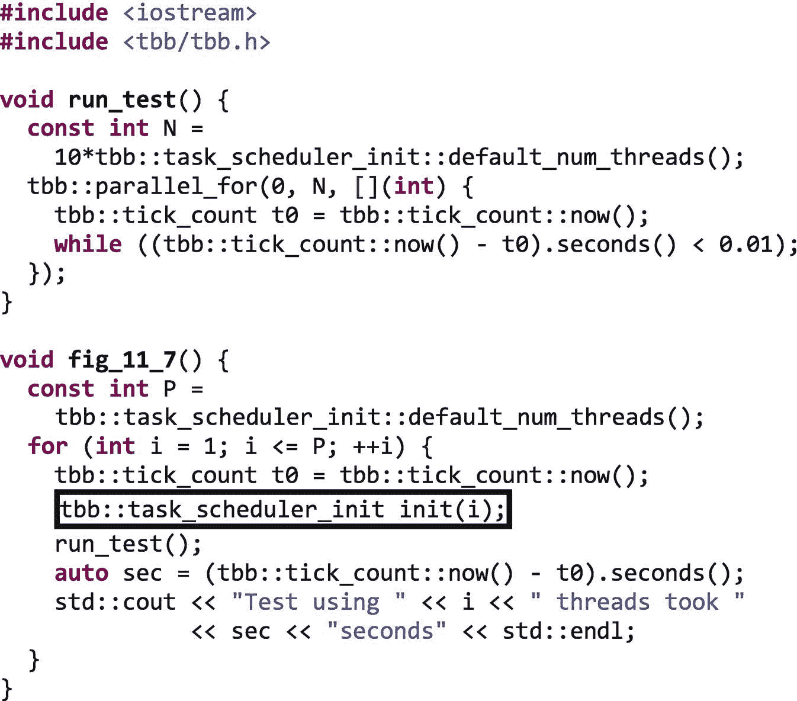
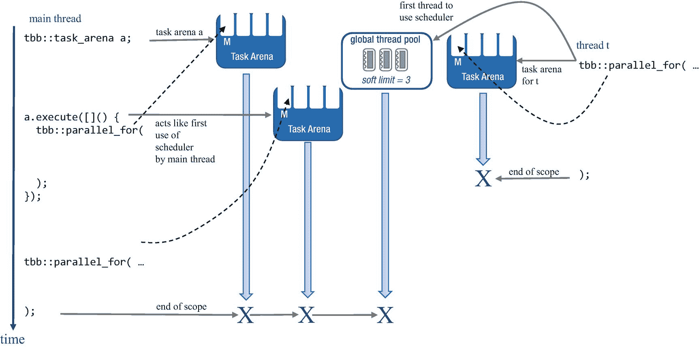
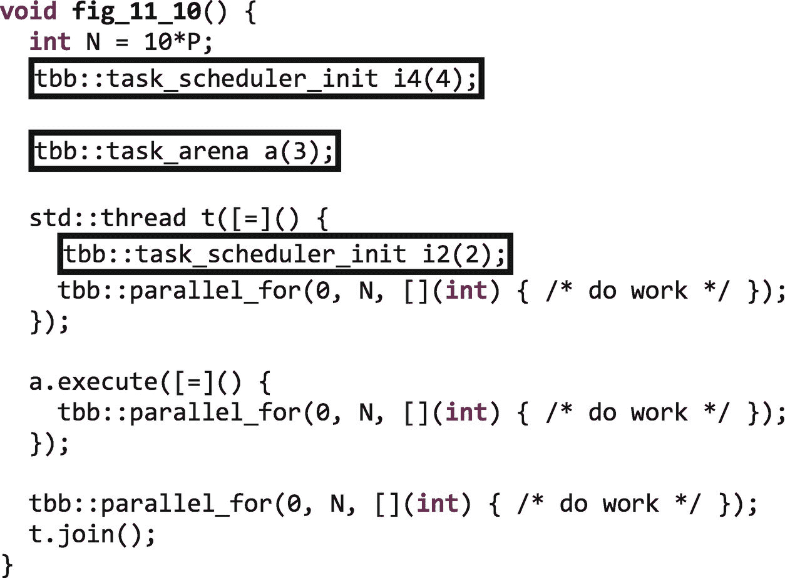
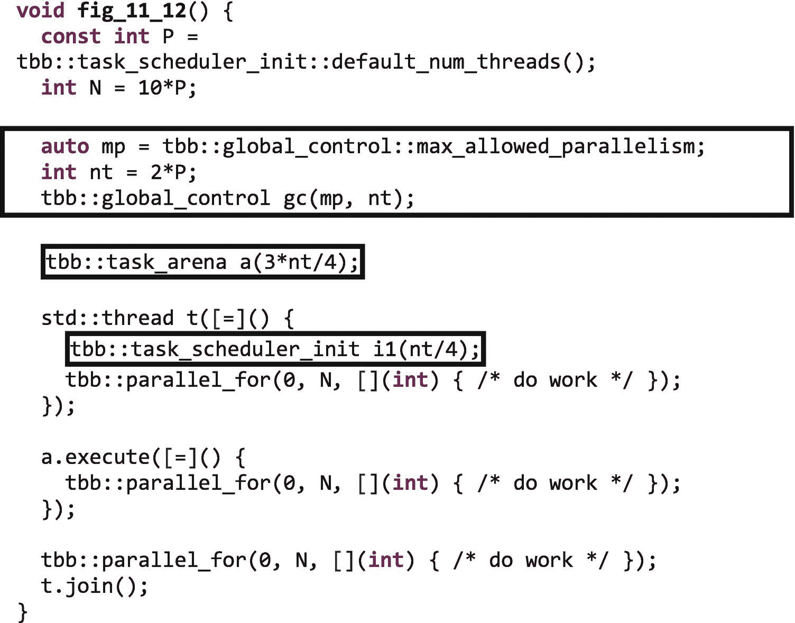
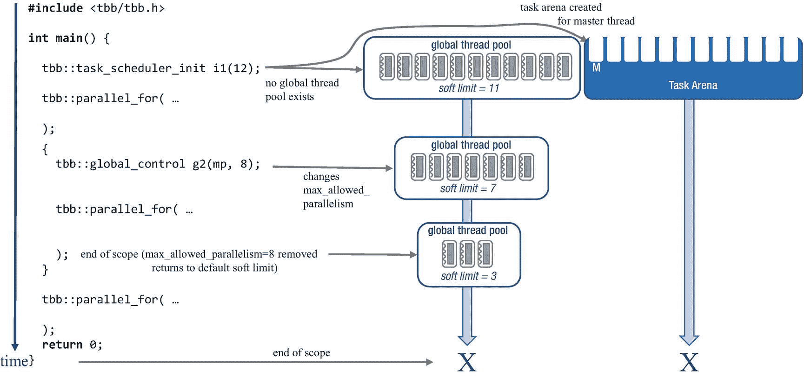

# 11.控制用于执行的线程数量

默认情况下，TBB 库使用通常正确的线程数量来初始化其调度程序。它创建的工作线程比平台上逻辑内核的数量少一个，留下一个内核可用于执行主应用程序线程。因为 TBB 库使用调度到这些线程上的任务来实现并行性，所以这通常是拥有线程的正确数量——每个逻辑内核正好有一个软件线程，TBB 的调度算法使用第 [9](pt2.html#b978-1-4842-4398-5_9) 章中描述的工作窃取来有效地将任务分配给这些软件线程。

然而，在许多情况下，我们可能有理由想要更改默认设置。也许我们正在进行扩展实验，并想看看我们的应用程序在不同数量的线程下表现如何。或者，也许我们知道几个应用程序将总是在我们的系统上并行执行，所以我们只想使用应用程序中可用资源的一个子集。或者，我们可能知道我们的应用程序为渲染、人工智能或其他目的创建了额外的本机线程，我们希望限制 TBB，以便在系统上为这些其他本机线程留出空间。在任何情况下，如果我们想改变默认设置，我们可以。

有三个类可用于影响有多少线程参与执行特定的 TBB 算法或流程图。但是这些类之间的交互可能非常复杂！在这一章中，我们将重点放在最常见的案例和最著名的实践上，这些对于除了最复杂的应用程序之外的所有应用程序来说都足够了。这种详细程度对大多数读者来说已经足够了，我们提出的建议对几乎所有情况都足够了。即便如此，想要了解 TBB 最底层的具体细节的读者，如果愿意的话，也可以查阅 TBB 文档，了解这些类之间可能的交互的所有细节。但是如果你遵循本章概述的模式，我们不认为这是必要的。

## TBB 调度程序架构的简要概述

在我们开始讨论控制用于执行并行算法的线程数量之前，让我们回忆一下图 [11-1](#Fig1) 所示的 TBB 调度程序的结构。在第 9 章[中可以找到关于 TBB 调度器的更深入的描述。](pt2.html#b978-1-4842-4398-5_9)

全局线程池(市场)是所有工作线程在迁移到任务竞技场之前的起点。线程迁移到有任务可执行的任务区域，并且如果没有足够的线程来填充所有区域中的所有槽，则线程与区域中的槽数量成比例地填充槽。例如，一个任务竞技场的槽数是另一个竞技场的两倍，那么它将接收大约两倍的工人。

### 注意

如果正在使用任务优先级，工作线程将在用较低优先级任务填充任务区域中的槽之前，完全满足来自具有较高优先级任务的任务区域的请求。我们将在第 [14 章](14.html#b978-1-4842-4398-5_14)中详细讨论任务优先级。在本章的其余部分，我们假设所有的任务都具有同等的优先级。



图 11-1

TBB 任务调度器的体系结构

任务竞技场有两种创建方式:(1)默认情况下，每个主线程在执行 TBB 算法或产生任务时都有自己的竞技场；(2)我们可以使用`class task_arena`显式创建任务竞技场，详见第 [12 章](12.html#b978-1-4842-4398-5_12)。

如果一个任务竞技场用完了工作，它的工作线程返回到全局线程池，在其他竞技场中寻找工作，或者在任何竞技场都没有工作的情况下休眠。

## 用于控制线程数量的接口

TBB 库在十多年前首次发布，在这段时间里，它随着平台和工作负载的发展而发展。现在，TBB 提供了三种控制线程的方法:`task_scheduler_init`、`task_arena`和`global_control`。在简单的应用程序中，我们可能只需要使用这些接口中的一个来完成我们需要的一切，但是在更复杂的应用程序中，我们可能需要使用这些接口的组合。

### 用`task_scheduler_init`控制线程数

当 TBB 库第一次发布时，只有一个控制应用程序中线程数量的接口:`class task_scheduler_init`。该类的接口如图 [11-2](#Fig2) 所示。

`task_scheduler_init`对象可用于(1)控制何时构建和销毁与主线程相关联的任务场所；(2)设置该线程的领域中的工作者槽的数量；(3)为竞技场中的每个工作者线程设置堆栈大小；如果需要的话，(4)对全局线程池中可用的线程数量设置一个初始的*软*限制(见侧栏)。


图 11-2

`task_scheduler_init`类接口

### 用`task_arena`控制线程数

后来，随着 TBB 被用于更大的系统和更复杂的应用程序中，`class task_arena`被添加到库中，以创建*显式*任务竞技场，作为隔离工作的一种方式。工作隔离将在第 [12](12.html#b978-1-4842-4398-5_12) 章中详细讨论。在这一章中，我们关注的是`class task_arena`如何让我们设置那些显式竞技场中可用的槽数。本章使用的`class task_arena`中的功能如图 [11-3](#Fig3) 所示。

使用`task_arena`构造器，我们可以使用`max_concurrency`参数设置 arena 中的插槽总数，使用`reserved_for_masters`参数设置为主线程专门保留的插槽数量。当我们将一个仿函数传递给`execute`方法时，调用线程连接到 arena，并且从仿函数中产生的任何任务都被产生到该 arena 中。



图 11-3

`task_arena`类接口

### 软限制和硬限制

全局线程池既有一个*软限制*又有一个*硬限制*。可用于并行执行的工作线程数量等于软限制值和硬限制值中的最小值。

软限制是应用程序中的`task_scheduler_init`和`global_control`对象发出的请求的函数。硬限制是系统上逻辑核心数量`P`的函数。在写这本书的时候，对于平台有 256 个线程的硬限制，对于平台有`P <= 64`，对于平台有`64 < P <= 128`有 4 个`P`，对于平台有`P > 128`有 2 个`P`。

TBB 任务在 TBB 工作线程上非抢占式执行。因此，超额订阅拥有比逻辑内核多得多的 TBB 线程的系统没有太大意义——只是有更多的线程需要操作系统管理。如果我们想要的 TBB 线程比硬限制允许的要多，几乎可以肯定，我们要么是错误地使用了 TBB，要么是试图完成一些 TBB 没有设计的事情。

### 用`global_control`控制线程数

在`class task_arena`被引入到库中之后，TBB 用户开始请求一个接口来直接控制全局线程池中可用的线程数量。在 TBB 2019 更新 4 之前，`class global_control`只是一个*预览功能*(它现在是一个完整的功能——这意味着它在默认情况下可用，无需启用预览宏定义)，用于更改 TBB 任务调度器使用的全局参数值——包括全局线程池中可用线程数量的软限制。

`class global_control`的等级定义如图 [11-4](#Fig4) 所示。



图 11-4

`global_control`类接口

### 概念和类别概述

本章中使用的概念和各种类的效果在本节中进行了总结。不要太担心理解这里介绍的所有细节。在下一节中，我们将介绍使用这些类来实现特定目标的最著名的方法。因此，尽管这里描述的交互可能看起来很复杂，但典型的使用模式要简单得多。

**调度器:**TBB 调度器指的是全局线程池和至少一个任务竞技场。一旦构建了 TBB 调度器，可以向其添加额外的任务领域，增加调度器上的引用计数。当任务竞技场被销毁时，它们会减少调度程序上的引用计数。如果最后一个任务竞技场被破坏，TBB 调度器也被破坏，包括全局线程池。未来使用 TBB 任务将需要构建一个新的 TBB 调度程序。一个进程中绝不会有多个 TBB 调度程序处于活动状态。

**硬线程限制**:TBB 调度程序创建的工作线程总数有一个硬限制。这是平台硬件并发性的一个功能(更多细节参见**软和硬限制**)。

**软线程限制**:对 TBB 调度器可用的工作线程数量有一个动态的软限制。一个`global_control`对象可用于直接改变软限制。否则，软限制由创建调度程序的线程初始化(更多细节见**软和硬限制**)。

**默认软线程限制**:如果一个线程产生了一个 TBB 任务，无论是直接通过使用低级接口还是间接通过使用 TBB 算法或流图，如果当时不存在 TBB 调度器，将会创建一个调度器。如果没有`global_control`对象设置了明确的软限制，则软限制被初始化为`P` -1，其中`P`是平台的硬件并发性。

`global_control` **对象**:一个`global_control`对象在其生命周期内影响 TBB 调度程序可以使用的工作线程数量的软限制。在任一时间点，软限制是活动的`global_control`对象请求的所有`max_concurrency_limit`值的最小值。如果软限制在任何活动的`global_control`对象被构造之前被初始化，当寻找最小值时，这个初始值也被考虑。当`global_control`对象被破坏时，如果被破坏的对象是限制`max_concurrency_limit`值，软限制可能增加。创建一个`global_control`对象不会初始化 TBB 调度程序，也不会增加调度程序的引用计数。当最后一个`global_control`对象被销毁时，软限制被重置为默认的软线程限制。

`task_scheduler_init` **对象**:一个`task_scheduler_init`对象创建一个与主线程相关联的任务竞技场，但前提是对于该线程还没有一个任务竞技场。如果一个已经存在，`task_scheduler_init`对象增加任务竞技场的引用计数。当一个`task_scheduler_init`对象被销毁时，它减少引用计数，如果新计数为零，任务竞技场被销毁。如果在构造`task_scheduler_init`对象时不存在 TBB 调度程序，则会创建一个 TBB 调度程序，如果`global_control`对象没有设置软线程限制，则会使用构造器的`max_threads`参数对其进行初始化，如下所示:

<colgroup><col class="tcol1 align-left"> <col class="tcol2 align-left"></colgroup> 
| `P` -1，其中`P`是逻辑核心的数量 | 如果`max_threads` < = `P` - 1 |
| `max_threads` | 否则 |

`task_arena` **对象**:一个`task_arena`对象创建一个不与特定主线程相关联的显式任务竞技场。底层任务竞技场并不是在构造器期间立即初始化，而是在第一次使用时才初始化(在本章的示例中，我们展示的是对象的构造，而不是底层任务竞技场的表示)。如果一个线程在初始化它自己的隐式任务竞技场之前将一个任务生成或排队到一个显式`task_arena`中，这个动作就像是该线程的 TBB 调度器的第一次使用——包括它的隐式任务竞技场的默认初始化和软限制的可能初始化的所有副作用。

## 设置线程数量的最佳方法

`task_scheduler_init`、`task_arena`和`global_control`类的组合提供了一套强大的工具，用于控制可以参与执行 TBB 并行工作的线程数量。

当以超出预期模式的方式组合时，这些对象的交互可能会令人困惑。因此，在本节中，我们将重点关注常见的场景，并提供使用这些类的推荐方法。为简单起见，我们在本节展示的图中，假设我们正在支持四个逻辑核心的系统上执行。在这样的系统上，TBB 库将默认创建三个工作线程，并且在任何默认的任务竞技场中都将有四个槽，其中一个槽保留给主线程。在我们的图中，我们显示了全局线程池中可用的线程数量和任务舞台中的槽数量。为了减少图中的混乱，我们没有显示被分配到插槽的工人。向下箭头用于指示对象的生存期。一个大“X”表示一个物体的破坏。

### 为简单的应用程序使用单个`task_scheduler_init`对象

最简单，也可能是最常见的场景是，我们有一个只有一个主线程的应用程序，没有明确的任务舞台。应用可能有许多 TBB 算法，包括嵌套并行的使用，但没有一个以上的用户创建的线程，即主线程。如果我们不采取任何措施来控制 TBB 库管理的线程数量，当主线程第一次通过生成任务、执行 TBB 算法或使用 TBB 流图与 TBB 调度程序进行交互时，就会为主线程创建一个隐式任务竞技场。创建这个默认任务竞技场时，全局线程池中的线程数量将比系统中逻辑核心的数量少一个。在图 [11-5](#Fig5) 中，针对具有四个逻辑内核的系统说明了这种最基本的情况，以及所有默认初始化。



图 11-5

全局线程池的默认初始化和主线程的单个任务竞技场

在 Github 的`ch11/fig_11_05.cpp`中可以获得示例代码，并对其进行了检测，以便打印出代码每一部分中有多少线程参与的摘要。本章中的许多示例都采用了类似的方法。这个工具没有在图中的源代码中显示，但是可以在 Github 的代码中找到。在具有四个逻辑核心的系统上运行此示例会产生类似于以下内容的输出

```cpp

There are 4 logical cores.
4 threads participated in 1st pfor
4 threads participated in 2nd pfor
4 threads participated in flow graph

```

如果我们在这个最简单的场景中想要不同的行为，`class task_scheduler_init`足以控制线程的数量。我们需要做的就是在第一次使用 TBB 任务之前创建一个`task_scheduler_init`对象，并向它传递我们希望应用程序使用的线程数量。图 [11-6](#Fig6) 显示了一个例子。这个对象的构造创建了任务调度器，用适当数量的线程填充全局线程池(market )(至少足以填充任务竞技场 <sup>[1](#Fn1)</sup> 中的槽)，并用请求数量的槽为主线程构造单个竞技场。当单个`task_scheduler_init`对象被销毁时，这个 TBB 调度程序也被销毁。



图 11-6

为简单的应用程序使用单个`task_scheduler_init`对象

执行图 [11-6](#Fig6) 的代码将产生一个输出:

```cpp

There are 4 logical cores.
8 threads participated in 1st pfor
8 threads participated in 2nd pfor
8 threads participated in flow graph

```

### 注意

当然，静态编码要使用的线程数量是一个非常糟糕的主意。我们用易于理解的具体数字示例来说明功能。为了编写可移植的和更永恒的代码，我们几乎从不建议编码特定的数字。

### 在一个简单的应用程序中使用多个`task_scheduler_init`对象

一个稍微复杂一点的用例是，我们仍然只有一个应用程序线程，但是我们希望在应用程序的不同阶段使用不同数量的线程来执行。只要我们不重叠`task_scheduler_init`对象的生命周期，我们可以通过创建和销毁使用不同`max_threads`值的`task_scheduler_init`对象来改变应用程序执行期间的线程数量。使用这种方法的一个常见场景是在缩放实验中。图 [11-7](#Fig7) 显示了一个在 1 到 P 个线程上运行测试的循环。在这里，我们创建并销毁一系列的`task_scheduler_init`对象，以及支持不同数量线程的 TBB 调度程序。



图 11-7

使用 1 到 P 个线程运行测试的简单计时循环

在图 [11-7](#Fig7) 中，每次我们创建`task_scheduler_init`对象`init`时，库为主线程创建一个任务竞技场，其中一个槽为主线程保留，另外还有`i-1`槽。同时，它设置软限制并用至少`i-1`个工作线程填充全局线程池(记住，如果`max_threads`是< `P-1`，它仍然在全局线程池中创建`P-` 1 个线程)。当`init`被销毁时，TBB 调度程序也被销毁，包括单任务竞技场和全局线程池。

运行示例代码的输出，其中`run_test()`包含一个工作时间为 400 毫秒的`parallel_for`,结果类似于

```cpp

Test using 1 threads took 0.401094seconds
Test using 2 threads took 0.200297seconds
Test using 3 threads took 0.140212seconds
Test using 4 threads took 0.100435seconds

```

### 使用具有不同槽数的多个竞技场来影响 TBB 放置其工作线程的位置

现在让我们探索更复杂的场景，其中我们有不止一个任务舞台。出现这种情况最常见的原因是我们的应用程序有多个应用程序线程。这些线程中的每一个都是主线程，并拥有自己的隐式任务竞技场。我们也可以有不止一个任务竞技场，因为我们使用`class task_arena`显式创建竞技场，如第 [12 章](12.html#b978-1-4842-4398-5_12)所述。不管我们在一个应用程序中如何处理多个任务区域，工作线程都会按照它们拥有的槽的数量成比例地迁移到任务区域。并且线程只考虑有任务可执行的任务区域。正如我们前面提到的，我们在本章中假设所有的任务都具有同等的优先级。任务优先级会影响线程如何迁移到竞技场，在第 [14 章](14.html#b978-1-4842-4398-5_14)中有更详细的描述。

图 [11-8](#Fig8) 显示了一个总共有三个任务竞技场的例子:两个为主线程创建的任务竞技场(主线程和线程`t`)和一个显式任务竞技场`a`。这个例子是人为设计的，但是展示了足够复杂的代码来表达我们的观点。

在图 [11-8](#Fig8) 中，没有试图控制应用中的线程数量或任务区域中的插槽数量。因此，每个 arena 都用默认数量的槽来构造，全局线程池用默认数量的工作线程来初始化，如图 [11-9](#Fig9) 所示。


图 11-8

一个有三个任务竞技场的应用程序:主线程的默认竞技场，一个显式的`task_arena a`，和一个主线程的默认任务竞技场`t`

因为我们现在有不止一个线程，所以我们使用图 [11-9](#Fig9) 中的垂直位置来表示时间；图中较低的对象是在图中较高的对象之后构建的。该图显示了一种可能的执行顺序，在我们的示例中，线程`t`是第一个使用`parallel_for`生成任务的线程，因此它创建了 TBB 调度器和全局线程池。尽管这个例子看起来很复杂，但是行为是很好定义的。



图 11-9

有三个任务领域的示例的可能执行

如图 [11-9](#Fig9) 所示，线程`t`和任务竞技场`a`中`parallel_for`算法的执行可能会重叠。如果是这样，全局线程池中的三个线程在它们之间分配。由于有三个工作线程，一个 arena 最初将获得一个工作线程，另一个最初将获得两个工作线程。哪个竞技场获得的线程更少取决于库的判断，当其中一个竞技场耗尽工作时，线程可以迁移到另一个竞技场来帮助完成那里的剩余工作。在图 [11-9](#Fig9) 的主线程中完成对`a.execute`的调用后，最终的`parallel_for`在主线程的默认竞技场中执行，主线程填充其主槽。如果此时线程`t`中的`parallel_for`也完成了，那么所有三个工作线程都可以迁移到主线程的竞技场来处理最终的算法。

图 [11-9](#Fig9) 中显示的默认行为很有意义。我们的系统只有四个逻辑内核，所以 TBB 用三个线程初始化全局线程池。当创建每个任务竞技场时，TBB 不会向全局线程池添加更多线程，因为平台仍然有相同数量的内核。相反，全局线程池中的三个线程在任务舞台之间动态共享。

TBB 库按照线程拥有的槽数比例分配线程到任务竞技场。但是我们不必满足于任务竞技场的默认槽数。我们可以通过为每个应用程序线程创建一个`task_scheduler_init`对象和/或通过向显式`task_arena`对象传递一个`max_concurrency`参数来控制不同领域中的插槽数量。图 [11-10](#Fig10) 显示了一个修改后的例子。



图 11-10

具有三个任务领域的应用程序:主线程的默认领域的最大并发数为 4，显式`task_arena a`的最大并发数为 3，主线程 t 的默认领域的最大并发数为 2。

现在，当我们执行应用程序时，TBB 库最多只能提供一个工作线程到线程`t`的 arena，因为它只有一个工作线程的插槽，剩下的两个可以分配给 arena `a`中的`parallel_for`。我们可以在图 [11-11](#Fig11) 中看到一个执行示例。


图 11-11

在我们显式地设置了各个领域中的槽的数量之后，有可能执行具有三个任务领域的示例

执行 Github 的示例代码，跟踪每个部分中有多少线程参与，显示的输出如下

```cpp

There are 4 logical cores.
3 threads participated in arena pfor
4 threads participated in main pfor
2 threads participated in std::thread pfor

```

因为我们已经限制了线程`t`可用的槽的数量，所以其他线程在完成它们的工作后不能再从`task_arena a`迁移到线程`t`。当我们限制插槽时，我们需要谨慎。在这个简单的例子中，我们有利于`task_arena a`的倾斜执行，但也限制了多少空闲线程可以协助线程`t`。

我们现在已经控制了任务竞技场中线程的槽数，但是仍然依赖 TBB 在全局线程池中分配的默认线程数来填充这些槽。如果我们想改变可用于填充槽的线程数量，我们需要求助于`class global_control`。

### 使用`global_control`来控制有多少线程可用于填充竞技场插槽

让我们再来看一下上一节的例子，但是要将全局线程池中的线程数量增加一倍。我们的新实现如图 [11-12](#Fig12) 所示。



图 11-12

一个有三个任务舞台和一个`global_control`对象的应用程序

我们现在使用一个`global_control`对象来设置全局线程池中的线程数量。请记住，`global_control`对象用于影响调度程序使用的全局参数；在这种情况下，我们正在改变`max_allowed_parallelism`参数。我们还使用线程`t`中的`task_scheduler_init`对象和`task_arena`构造器的参数来设置可以分配给每个任务区域的最大线程数。图 [11-13](#Fig13) 显示了我们的四核机器上的一个执行示例。应用程序现在创建了七个工作线程(总共八个线程减去已经可用的主线程)，并且工作线程在显式线程`task_arena a`和默认线程`t`之间不相等地分配。由于我们没有为主线程做什么特别的事情，最终的`parallel_for`使用了它默认的带有 P 个槽的任务竞技场。


图 11-13

在我们使用一个`global_control`对象显式地设置了软限制之后，一个可能的例子执行了三个任务领域

执行图 [11-13](#Fig13) 的示例代码会产生类似如下的输出

```cpp

There are 4 logical cores.
6 threads participated in arena pfor
4 threads participated in main pfor
2 threads participated in std::thread pfor

```

### 使用`global_control`临时限制可用线程的数量

另一个常见的场景是使用`global_control`对象来临时改变应用程序特定阶段的线程数量，如图 [11-14](#Fig14) 所示。在这个例子中，主线程通过构造一个`task_scheduler_init`对象创建了一个线程池和任务竞技场，可以支持 12 个工作线程。但是一个`global_control`对象被用来将一个特定的`parallel_for`限制为只有七个工作线程。虽然 task arena 在整个应用程序中保留了 12 个槽，但线程池中可用的线程数量会暂时减少，因此 task arena 中最多有 7 个槽可以被 workers 填充。



图 11-14

使用`global_control`对象临时改变特定算法实例可用的线程数量，然后返回默认设置

当`global_control`对象被销毁时，使用任何剩余的`global_control`对象重新计算软限制。因为没有，所以软限制被设置为默认软限制。这种可能出乎意料的行为值得注意，因为如果我们想在全局线程池中维护 11 个线程，我们需要创建一个外部的`global_control`对象。我们在图 [11-15](#Fig15) 中展示了这一点。

在图 [11-14](#Fig14) 和 [11-15](#Fig15) 中，我们不能使用`task_scheduler_init`对象来临时改变线程的数量，因为主线程已经存在一个任务竞技场。如果我们在内部作用域中创建另一个`task_scheduler_init`对象，它只会增加该任务领域的引用计数，而不会创建新的对象。因此，我们使用一个`global_control`对象来限制可用线程的数量，而不是减少 arena 插槽的数量。

如果我们执行图 [11-14](#Fig14) 中的代码，我们会看到类似如下的输出


图 11-15

使用`global_control`对象临时改变特定算法实例可用的线程数量

```cpp

There are 4 logical cores.
12 threads participated in 1st pfor
8 threads participated in 2nd pfor
4 threads participated in 3rd pfor

```

添加外部`global_control`对象后，如图 [11-15](#Fig15) 所示，结果输出为

```cpp

There are 4 logical cores.
12 threads participated in 1st pfor
8 threads participated in 2nd pfor
12 threads participated in 3rd pfor

```

## 何时不控制线程数量

当实现一个插件或库时，最好避免使用`global_control`对象。这些对象影响全局参数，所以我们的插件或库函数将改变应用程序中所有组件可用的线程数量。鉴于插件或库的本地视图，这可能不是它应该做的事情。在图 [11-14](#Fig14) 中，我们临时改变了全局线程池中的线程数量。如果我们在一个库调用中做这样的事情，它不仅会影响调用线程的任务领域中可用的线程数量，还会影响我们应用程序中的每个任务领域。库函数如何知道这样做是正确的？很可能不会。

我们建议库不要干预全局参数，只把它留给主程序。允许插件的应用程序的开发者应该清楚地向插件作者传达应用程序的并行执行策略是什么，以便他们可以适当地实现他们的插件。

### 设置工作线程的堆栈大小

`task_scheduler_init`和`global_control`类也可以用来设置工作线程的堆栈大小。多个对象的交互与用于设置线程数量时相同，只有一个例外。当有多个`global_control`对象设置堆栈大小时，堆栈大小是请求值的*最大值*，而不是最小值。

`task_scheduler_init`对象的第二个参数是`thread_stack_size`。默认值为 0，指示调度程序使用该平台的默认值。否则，将使用提供的值。

`global_control`构造器接受一个参数和值。如果参数自变量是`thread_stack_size,`，那么对象改变全局堆栈大小参数的值。与`max_allowed_paralleism`值不同，全局`thread_stack_size`值是请求值的最大值。

**为什么要改变默认堆栈大小？**

一个线程的堆栈必须足够大，以容纳在其堆栈上分配的所有内存，包括其调用堆栈上的所有局部变量。当决定需要多少堆栈时，我们必须考虑任务体中的局部变量，还要考虑任务树的递归执行如何导致深度递归，特别是如果我们已经使用任务阻塞实现了自己的基于任务的算法。如果我们不记得这种风格如何导致堆栈使用的爆炸，我们可以回头看看第 [10](10.html#b978-1-4842-4398-5_10) 章中的章节，**低级任务接口:第一部分/任务阻塞**。

由于合适的堆栈大小取决于应用程序，不幸的是没有好的经验法则可以分享。TBB 特定于操作系统的缺省值已经是对一个线程典型需求的最佳猜测。

## 找出哪里出了问题

随着时间的推移，`task_scheduler_init`、`task_arena`和`global_control`类被引入 TBB 图书馆以解决特定的问题。在 TBB 的早期，当很少有应用程序是并行的时候，`task_scheduler_init`类就足够了，即使有，也通常只有一个应用程序线程。随着应用程序变得越来越复杂，`task_arena`类帮助用户管理应用程序中的隔离。而`global_control`类让用户可以更好地控制库使用的全局参数，以进一步管理复杂性。不幸的是，这些功能并不是作为一个内聚设计的一部分一起创建的。结果是，当在我们之前概述的场景之外使用时，它们的行为有时可能是不直观的，即使它们被很好地定义了。

两个最常见的混淆来源是:( 1)知道默认情况下何时创建 TBB 调度程序,( 2)竞相设置全局线程池的软限制。

如果我们创建一个`task_scheduler_init`对象，它要么创建一个 TBB 调度器，要么增加调度器上的引用计数(如果它已经存在的话)。TBB 库中的哪些接口表现得像是第一次使用 TBB 调度程序，这可能很难弄清楚。很明显，使用 TBB 流图或生成任务来执行任何 TBB 算法，都是对 TBB 调度程序的使用。但是正如我们前面提到的，即使在显式`task_arena`中执行任务也被视为第一次使用 TBB 调度器，这不仅影响显式任务领域，还可能影响调用线程的默认任务领域。使用线程本地存储或者使用一个并发容器怎么样？这些不算。除了密切关注正在使用的接口的含义之外，最好的建议是，如果应用程序使用了意外数量的线程——特别是当您认为自己已经更改了默认线程数量时，如果它使用了默认线程数量——就要寻找默认 TBB 调度程序可能被意外初始化的地方。

混淆的第二个常见原因是争用对可用线程数量的软限制。例如，如果两个应用程序线程并行执行，并且都创建了一个`task_scheduler_init`对象，那么第一个创建其对象的线程将设置软限制。在图 [11-16](#Fig16) 中，在同一应用中同时执行的两个线程都创建了`task_scheduler_init`对象——一个请求`max_threads=4`，另一个请求`max_threads=8`。任务竞技场发生的事情很简单:每个主线程都有自己的任务竞技场，其中包含它所请求的槽数。但是，如果还没有设置全局线程池中线程数量的软限制呢？TBB 库在全局线程池中填充了多少线程？它应该创造`3`还是`7`还是`3+7=10`还是`P-1`还是……？


图 11-16

两个`task_scheduler_init`对象的并发使用

正如我们在对`task_scheduler_init`的描述中所概述的，它不做这些事情。相反，它使用最先出现的请求。是的，你没看错！如果线程 1 碰巧首先创建了它的`task_scheduler_init`对象，我们将得到一个 TBB 调度器，它有一个包含三个工作线程的全局线程池。如果线程 2 首先创建它的`task_scheduler_init`对象，我们得到一个有七个工作线程的线程池。我们的两个线程可能共享三个工作线程或七个工作线程；这完全取决于谁先赢得创建 TBB 调度程序的竞赛！

但是我们不应该绝望；几乎所有与设置线程数量相关的潜在缺陷都可以通过回到本章前面描述的常见使用模式来解决。例如，如果我们知道我们的应用程序可能会有如图 [11-16](#Fig16) 所示的竞争，我们可以通过使用`global_control`对象在主线程中设置软限制来清楚地表达我们的愿望。

## 摘要

在本章中，我们简要回顾了 TBB 调度器的结构，然后介绍了用于控制并行执行线程数量的三个类:`class task_scheduler_init`、`class task_arena`和`class global_control`。然后，我们描述了控制并行算法使用的线程数量的常见用例——从只有一个主线程和一个任务舞台的简单用例，到有多个主线程和多个任务舞台的更复杂的用例。我们最后指出，虽然在使用这些类时存在潜在的问题，但我们可以通过小心地使用这些类来避免这些问题，从而使我们的意图清晰，而不依赖于默认行为或比赛的获胜者。

[](https://creativecommons.org/licenses/by-nc-nd/4.0) 

**开放存取**本章根据知识共享署名-非商业-非专用 4.0 国际许可协议(http://Creative Commons . org/licenses/by-NC-nd/4.0/)的条款进行许可，该协议允许以任何媒体或格式进行任何非商业使用、共享、分发和复制，只要您适当注明原作者和来源，提供知识共享许可协议的链接，并指出您是否修改了许可材料。根据本许可证，您无权共享从本章或其部分内容派生的改编材料。

本章中的图像或其他第三方材料包含在该章的知识共享许可中，除非该材料的信用额度中另有说明。如果材料未包含在本章的知识共享许可中，并且您的预期用途不被法定法规允许或超出了允许的用途，您将需要直接从版权所有者处获得许可。

<aside class="FootnoteSection">Footnotes [1](#Fn1_source)

这有点过于简单化了。请参阅本章前面关于软限制和硬限制的边栏，了解更多信息。

 </aside>