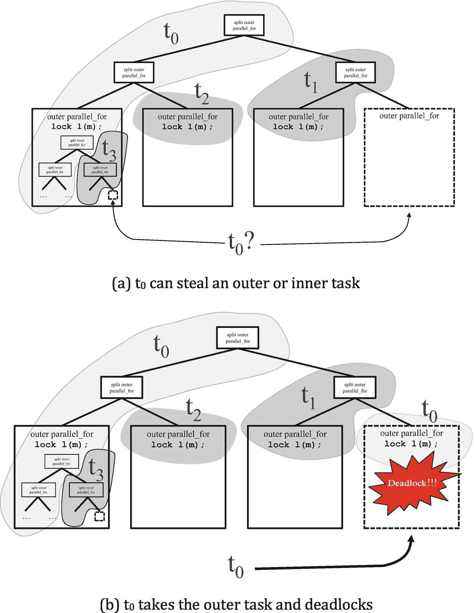
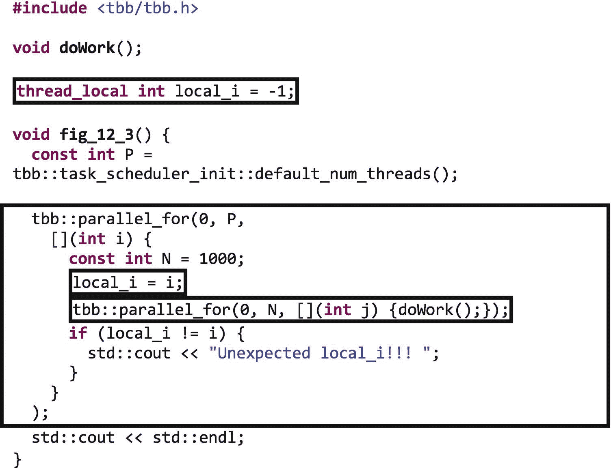
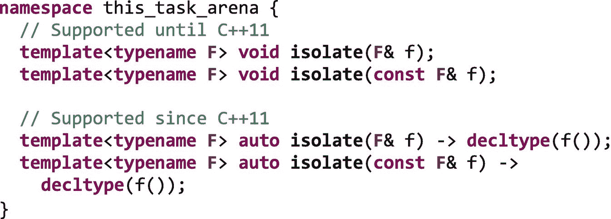
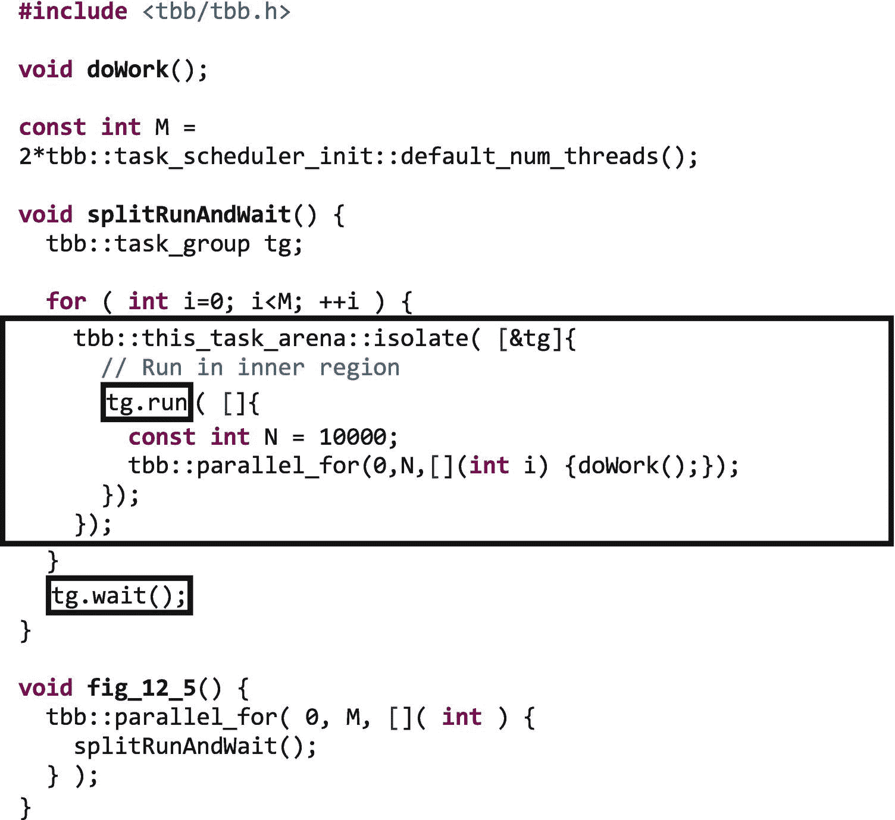
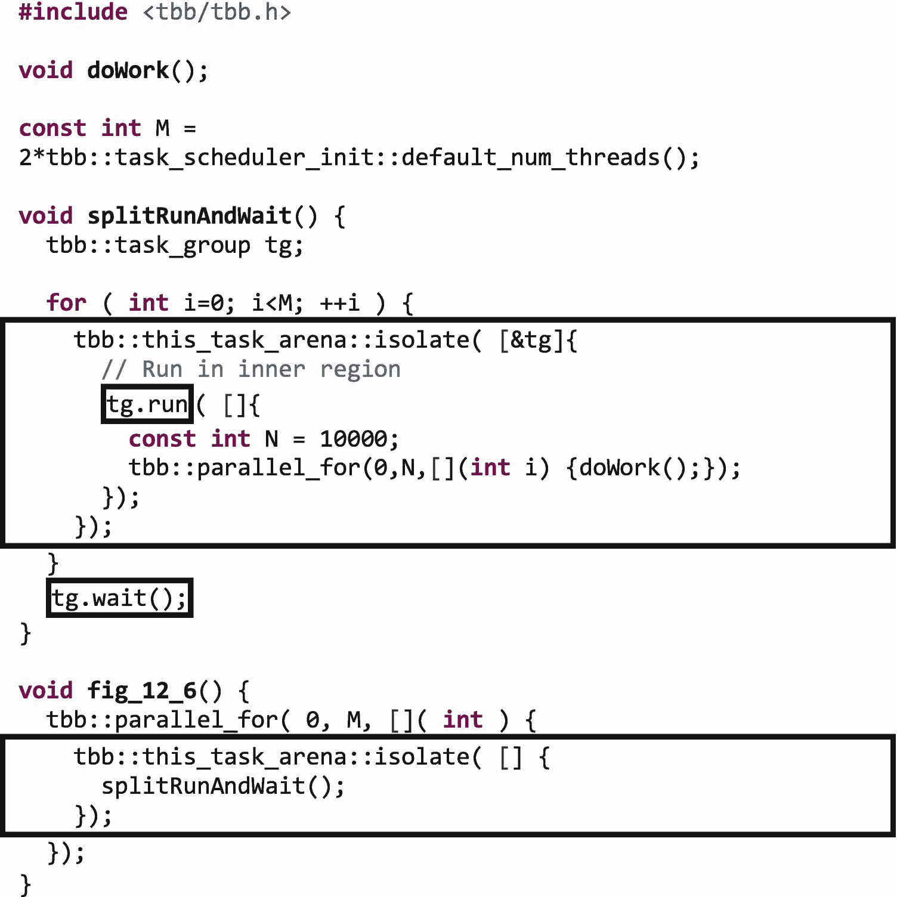
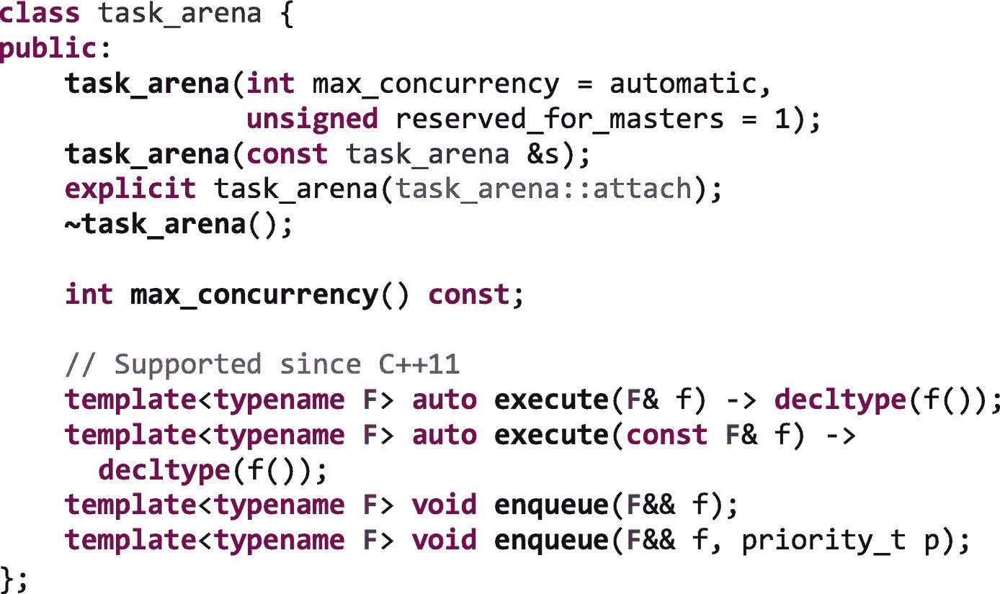

# 12.使用工作隔离来保证正确性和性能

任何一个和孩子在一起过的人(或者行为举止像孩子的人)都知道，有时候阻止孩子互相打扰的唯一方法就是把他们分开。TBB 任务和算法也是如此。当任务或算法无法相处时，我们可以使用*工作隔离*将它们分开。

例如，当使用嵌套并行时，我们需要——在某些有限的情况下——创建工作隔离以确保正确性。在这一章中，我们将浏览出现这种需求的场景，然后提供一组规则来确定何时需要隔离以保证正确性。我们还描述了如何使用`isolate`函数来创建工作隔离。

在其他情况下，我们可能希望创建工作隔离，这样我们就可以通过使用显式任务舞台来约束任务在哪里执行，从而提高性能。在这些情况下制造孤立是一把双刃剑。一方面，我们将能够控制将参与不同任务领域的线程数量，以此来支持一些任务，或者使用 TBB 库中的钩子将线程固定到特定的内核，以优化局部性。另一方面，显式任务竞技场使得线程更难参与当前分配给它们的竞技场之外的工作。当我们出于性能原因想要创建隔离时，我们将讨论如何使用`class task_arena`。我们还要提醒的是，虽然`class task_arena`也可以用来创建隔离以解决正确性问题，但是它的较高开销使得它不太适合这个目的。

当需要并正确使用时，工作隔离是一个有价值的特性，但是，正如我们将在本章看到的，它需要谨慎使用。

## 正确性的工作隔离

TBB 调度器旨在使工作线程及其底层内核尽可能忙碌。如果当一个工作线程空闲时，它会从另一个线程那里窃取工作，以便有事情做。当线程窃取时，它不知道最初是什么并行算法、循环或函数创建了它所窃取的任务。通常，任务来自哪里是无关紧要的，因此 TBB 图书馆最好的做法是平等对待所有可用的任务，并尽快处理它们。

然而，如果我们的应用程序使用嵌套并行，TBB 库可能会以某种方式窃取任务，导致开发人员可能不期望的执行顺序。这个执行命令本身并不危险；事实上，在大多数情况下，这正是我们希望发生的。但是，如果我们对任务可能如何执行做出不正确的假设，我们可能会创建导致意外甚至灾难性结果的模式。

图 [12-1](#Fig1) 显示了一个说明这个问题的小例子。在代码中，有两个`parallel_for`循环。在外部循环的主体中，获得了互斥锁`m`。获得这个锁的线程在持有锁时调用第二个嵌套的`parallel_for`循环。如果在`m`上获得锁的线程在其内部循环完成之前变得空闲，就会出现问题；如果工作线程窃取了迭代，但在主线程耗尽工作时尚未完成迭代，就会发生这种情况。主线程不能简单地退出`parallel_for`，因为它还没有完成。为了提高效率，这个线程不只是空转，等待其他线程完成它们的工作；谁知道这要花多长时间？相反，它将当前任务保留在堆栈中，并寻找额外的工作让自己忙碌起来，直到可以从中断的地方继续工作。如果这种情况出现在图 [12-1](#Fig1) 中，在线程寻找工作窃取点时，系统中有两种任务——内部循环任务和外部循环任务。如果线程碰巧从外部`parallel_for`窃取并执行了一个任务，它将再次尝试获取`m`上的锁。因为它已经在`m`上持有一个锁，而`tbb::spin_mutex`不是递归锁，所以存在死锁。线程被捕获，等待自己释放锁！


图 12-1

在执行嵌套的`parallel_for`时持有锁

看到这个例子后，两个问题普遍出现:(1)真的有人这样写代码吗？(2)一个线程真的能从外部循环窃取任务吗？不幸的是，这两个问题的答案都是肯定的。

事实上，人们确实会这样写代码——尽管几乎都是无意的。出现这种模式的一种常见方式是在调用库函数时持有锁。开发人员可能认为他们知道一个函数是做什么的，但是如果他们不熟悉它的实现，他们可能就错了。如果库调用包含嵌套并行，结果可能是图 [12-1](#Fig1) 所示的情况。

是的，偷工减料会导致这个例子死锁。图 [12-2](#Fig2) 显示了我们的例子是如何陷入这种糟糕的状态的。



图 12-2

图 [12-1](#Fig1) 中代码生成的任务树的一个潜在执行

在图 [12-2(a)](#Fig2) 中，线程 t <sub>0</sub> 启动外循环并获取`m`上的锁。线程 t <sub>0</sub> 然后开始嵌套的`parallel_for`并执行其迭代空间的左半部分。在线程`t` <sub>`0`</sub> 忙碌的同时，另外三个线程`t`<sub>`1`</sub>`t`<sub>`2`</sub>`t`<sub>`3`</sub>参与竞技场中任务的执行。线程 t <sub>1</sub> 和 t <sub>2</sub> 偷取外循环迭代，并被阻塞等待获取`m`上的锁，该锁当前由`t` <sub>`0`</sub> 持有。同时，线程`t` <sub>`3`</sub> 随机选择 t <sub>0</sub> 进行窃取，并开始执行其内循环的右半部分。这就是事情开始变得有趣的地方。线程 t <sub>0</sub> 完成了内循环迭代的左半部分，因此将窃取工作以防止自身空闲。此时，它有两个选择:(1)如果它随机选择线程 t <sub>3</sub> 进行窃取，它将执行更多自己的内部循环；或者(2)如果它随机选择线程 t <sub>1</sub> 进行窃取，它将执行一个外部循环迭代。请记住，默认情况下，调度程序平等地对待所有任务，因此它不会厚此薄彼。图 [12-2(b)](#Fig2) 显示了一个不幸的选择，它从线程`t` <sub>`1`</sub> 中偷取，并在试图获取它已经持有的锁时陷入死锁，因为它的外部任务仍在其堆栈中。

另一个显示正确性问题的例子如图 [12-3](#Fig3) 所示。同样，我们看到一组嵌套的`parallel_for`循环，但是由于使用了线程本地存储，我们得到的不是死锁，而是意外的结果。在每个任务中，将一个值写入线程本地存储位置`local_i`，执行内部`parallel_for`循环，然后读取线程本地存储位置。由于内部循环，线程可能会在空闲时窃取工作，将另一个值写入线程本地存储位置，然后返回到外部任务。



图 12-3

由于使用线程本地存储，嵌套并行可能会导致意外结果

TBB 开发团队使用术语*兼职* <sup>[1](#Fn1)</sup> 来描述线程在运行中有未完成的子任务，并窃取不相关的任务来保持忙碌的情况。兼职通常是件好事！这意味着我们的线程没有闲置。只有在有限的情况下事情会出错。在我们的两个例子中，都有一个不好的假设。他们都认为——不足为奇——因为 TBB 有一个非抢占式调度器，所以同一个线程永远不会执行内部任务，然后在完成内部任务之前开始执行外部任务。正如我们所见，由于线程在嵌套并行中等待时会窃取工作，这种情况实际上是可能发生的。只有当我们错误地依赖线程以互斥的方式执行任务时，这种典型的良性行为才是危险的。在第一种情况下，在执行嵌套并行时会持有一个锁，从而允许线程暂停内部任务并获取外部任务。在第二种情况下，线程在嵌套并行之前和之后访问线程本地存储，并假设线程不会在两者之间兼职。

正如我们所看到的，这些例子是不同的，但有一个共同的误解。在本章末尾的“更多信息”部分列出的博客“英特尔线程构建模块中的工作隔离功能”中，Alexei Katranov 提供了一个三步清单，用于确定何时需要工作隔离来确保正确性:

1.  是否使用了嵌套并行(即使是间接的，通过第三方库调用)？如果没有，就不需要隔离；否则，转到下一步。

2.  对于一个线程来说，重新进入外层并行任务是否安全(就像存在递归一样)？存储到一个线程本地值，重新获取这个线程已经获取的互斥体，或者其他不应该被同一个线程再次使用的资源都可能导致问题。如果重入是安全的，就不需要隔离；否则，转到下一步。

3.  需要隔离。嵌套并行必须在隔离区域内调用。

### 用`this_task_arena::isolate`创建一个隔离区域

当我们需要隔离以保证正确性时，我们可以使用`this_task_arena`名称空间中的`isolate`函数之一:



图 [12-4](#Fig4) 显示了如何使用该功能在图 [12-1](#Fig1) 的嵌套`parallel_for`周围添加一个隔离区域。在一个隔离区域内，如果一个线程因为必须等待而变得空闲——例如在嵌套的`parallel_for`结束时——它将只被允许窃取从它自己的隔离区域内产生的任务。这修复了我们的死锁问题，因为如果一个线程在等待图 [12-4](#Fig4) 中的内部`parallel_for`时偷取，它将不被允许偷取外部任务。


图 12-4

在嵌套并行的情况下，使用隔离功能来防止兼职

当一个线程在一个隔离区域内被阻塞时，它仍然会从它的任务区域中随机选择一个线程进行窃取，但是现在必须检查该受害线程的队列中的任务，以确保它只窃取源自其隔离区域内的任务。

在阿列克谢的博客中，`this_task_arena::isolate`的主要特性被很好地总结如下:

*   隔离仅约束进入或加入隔离区域的线程。隔离区域之外的工作线程可以接受任何任务，包括在隔离区域中产生的任务。

*   当一个没有隔离的线程执行一个在隔离区域中产生的任务时，它加入这个任务的区域并且变得隔离，直到任务完成。

*   在隔离区域内等待的线程不能处理在其他隔离区域中产生的任务(即，所有区域都是相互隔离的)。此外，如果隔离区域内的线程进入嵌套的隔离区域，则它不能处理来自外部隔离区域的任务。

#### 哦不！工作隔离会导致其自身的正确性问题！

不幸的是，我们不能只是不加区别地应用工作隔离。这对于性能有影响，我们稍后会谈到，但更重要的是，如果使用不当，工作隔离本身会导致死锁！又来了…

特别是，当我们将工作隔离与 TBB 接口混合时，我们必须格外小心，这些接口将生成任务与等待任务分开——例如`task_group`和流程图。在一个隔离区域中调用等待接口的任务在等待时不能参与另一个隔离区域中产生的任务。如果有足够多的线程卡在这样的位置，应用程序可能会耗尽线程，向前的进程将会停止。

让我们考虑图 [12-5](#Fig5) 所示的示例函数。在函数`splitRunAndWait, M`中，任务在`task_group tg`中产生。但是每次产卵都发生在*不同的*隔离区域。



图 12-5

在`task_group tg`上调用`run`和`wait`的函数。对`run`的调用是从一个隔离区域内发出的。

如果我们直接调用函数`fig_12_5`，如图 [12-5](#Fig5) 所示，就没有问题。对`splitRunAndWait`中的`tg.wait`的调用本身并不在一个隔离区域内，所以主线程和工作线程可以帮助处理不同的隔离区域，然后在它们完成时转移到其他区域。

但是如果我们把我们的主函数改成图 [12-6](#Fig6) 中的那个会怎么样呢？



图 12-6

在`task_group tg`上调用`run`和`wait`的函数。对`run`的调用是从一个隔离区域内发出的。

现在，对`splitRunAndWait`的调用分别在不同的隔离区域内进行，随后对`tg.wait`的调用在这些隔离区域内进行。每个调用`tg.wait`的线程必须等到它的`tg`结束，但不能窃取任何属于它的`tg`或任何其他`task_group`的任务，因为那些任务是从不同的隔离区域产生的！如果`M`足够大，我们可能会让所有的线程都等待调用`tg.wait`，而没有线程执行任何相关的任务。所以我们的应用程序死锁了。

如果我们使用一个将产生和等待分开的接口，我们可以通过确保我们总是在产生任务的同一个隔离区域中等待来避免这个问题。例如，我们可以重写图 [12-6](#Fig6) 中的代码，将对`run`的调用移到外部区域，如图 [12-7](#Fig7) 所示。


图 12-7

在`task_group tg`上调用`run`和`wait`的函数。对`run`和`wait`的呼叫现在都是在隔离区域之外进行的。

现在，即使我们的主函数使用了并行循环和隔离，我们也不再有问题，因为每个调用`tg.wait`的线程将能够执行来自其`tg`的任务:

#### 即使是安全的，隔离工作也不是免费的

除了潜在的死锁问题，从性能的角度来看，工作隔离也不是免费的，所以即使它可以安全使用，我们也需要明智地使用它。不在隔离区域中的线程可以在窃取时选择任何任务，这意味着它可以从受害线程的 deque 中快速弹出最旧的任务。如果受害者完全没有任务，它也可以立即挑选另一个受害者。然而，在隔离区域中产生的任务及其子任务被标记以识别它们所属的隔离区域。在隔离区域中执行的线程必须扫描所选择的牺牲者的队列，以找到属于其隔离区域的最老的任务——不是任何老的任务都可以。并且该线程仅在扫描了所有可用任务并且没有从其区域中找到任务之后，才知道牺牲线程是否没有来自其隔离区域的任务。只有到那时，它才会选择另一个受害者来偷东西。从隔离区域内部窃取的线程有更多的开销，因为它们需要更加小心！

## 使用任务竞技场进行隔离:一把双刃剑

工作隔离限制了线程在寻找工作时的选择。我们可以使用前面部分描述的`isolate`函数来隔离工作，或者我们可以使用`class task_arena`。与本章相关的`class task_arena`接口子集如图 [12-8](#Fig8) 所示。



图 12-8

`class task_arena`公共接口的子集

仅仅为了确保正确性而使用`class task_arena`而不是`isolate`函数来创建隔离几乎没有任何意义。也就是说，`class task_arena`仍然有重要的用途。让我们看看`class task_arena`的基础知识，同时，揭示它的优势和劣势。

通过`task_arena`构造器，我们可以使用`max_concurrency`参数设置 arena 中线程的总槽数，并使用`reserved_for_masters`参数设置专门为主线程保留的槽数。在第 [11 章](11.html#b978-1-4842-4398-5_11)中提供了更多关于`task_arena`如何用于控制计算使用的线程数量的细节。

图 [12-9](#Fig9) 显示了一个小例子，其中用`max_concurrency=2`创建了一个单独的`task_arena ta2`，并且在那个竞技场中执行了一个执行`parallel_for`的任务。


图 12-9

最大并发数为`2`的`task_arena`

当一个线程调用一个`task_arena`的 execute 方法时，它试图作为主线程加入竞技场。如果没有可用的槽，它将任务排入任务区。否则，它会加入竞技场，并在该竞技场中执行任务。在图 [12-9](#Fig9) 中，线程将加入`task_arena ta2`，启动`parallel_for`，然后参与执行来自`parallel_for`的任务。由于 arena 的`max_concurrency`为 2，因此最多有一个额外的工作线程可以加入并参与执行该任务 arena 中的任务。如果我们执行 Github 上图 [12-9](#Fig9) 中的仪表化示例，我们会看到

```cpp

There are 4 logical cores.
2 threads participated in ta2

```

我们已经可以开始看到`isolate`和`class task_arena`之间的差异。的确，只有`ta2`中的线程能够执行`ta2`中的任务，所以存在工作隔离，但是我们也能够设置能够参与执行嵌套的`parallel_for`的线程的最大数量。

图 [12-10](#Fig10) 更进一步，创建了两个任务竞技场，一个`max_concurrency`为 2，另一个`max_concurrency`为 6。然后用一个`parallel_invoke`创建两个任务，一个执行`ta2`中的`parallel_for`，另一个执行`ta6`中的`parallel_for`。两个`parallel_for`循环具有相同的迭代次数，并且每次迭代旋转相同的时间。


图 12-10

使用两个`task_arena`对象，一个循环使用六个线程，另一个循环使用两个线程

我们已经有效地将八个线程分成两组，让其中两个线程在`ta2`中的`parallel_for`上工作，六个线程在`ta6`中的`parallel_for`上工作。我们为什么要这么做？也许我们认为`ta6`的工作更重要。

如果我们在一个有八个硬件线程的平台上执行图 [12-10](#Fig10) 中的代码，我们将看到类似如下的输出

```cpp

ta2_time == 0.500409
ta6_time == 0.169082

There are 8 logical cores.
2 threads participated in ta2
6 threads participated in ta6

```

这是使用`isolate`和`task_arena`创建隔离的关键区别。当使用`task_arena`时，我们几乎总是更关心控制参与执行任务的线程，而不是隔离本身。隔离不是为了正确性，而是为了性能。显式的`task_arena`是一把双刃剑——它让我们控制参与工作的线程，但也在它们之间筑起了一道高墙。当一个线程离开由`isolate`创建的隔离区域时，它可以自由地参与执行它所在领域的任何其他任务。当一个线程在一个显式的`task_arena`中没有工作可做时，它必须返回到全局线程池，然后找到另一个有工作可做并且有空位的地方。

### 注意

我们只是提供了一个关键的经验法则:使用`isolate`主要是为了帮助正确性；使用`task_arenas`主要是为了性能。

让我们再次考虑图 [12-10](#Fig10) 中的例子。我们在`task_arena ta6`中创造了更多的插槽。结果，`ta6`的`parallel_for`比`ta2`的`parallel_for`完成得快多了。但是在`ta6`中的工作完成后，分配给那个 arena 的线程返回到全局线程池。他们现在很闲，但无法帮助完成`ta2`中的工作——竞技场只有两个线程槽，而且已经满了！

抽象非常强大，但是它在线程之间建立的高墙限制了它的实际应用。第 [11 章](11.html#b978-1-4842-4398-5_11)更详细地讨论了如何将`class task_arena`与`class task_scheduler_init`和`class global_control`一起使用，以控制 TBB 应用中特定并行算法可用的线程数量。第 [20](20.html#b978-1-4842-4398-5_20) 章展示了我们如何使用`task_arena`对象在非统一内存访问(NUMA)平台中的特定内核上划分工作和调度工作，以针对数据局部性进行调优。在这两章中，我们会看到`task_arena`非常有用，但也有缺点。

### 不要试图使用`task_arenas`来创建正确的工作隔离

在第 [11](11.html#b978-1-4842-4398-5_11) 和 [20](20.html#b978-1-4842-4398-5_20) 章描述的特定用例中，线程的数量甚至它们在特定内核上的位置都受到严格控制，因此我们希望在不同的领域拥有不同的线程。然而在一般情况下，需要`task_arena`对象来管理和迁移线程只会产生开销。

作为一个例子，让我们再看一组嵌套的`parallel_for`循环，但是现在没有正确性问题。我们可以在图 [12-11](#Fig11) 中看到代码和可能的任务树。如果我们执行这组循环，那么所有的任务都将出现在同一个任务舞台上。当我们在上一节中使用`isolate`时，所有的任务仍然保存在同一个竞技场中，但是线程在窃取任务之前通过检查任务来隔离自己，以确保它们被允许根据隔离约束来获取任务。


图 12-11

两个嵌套的`parallel_for`循环的例子:(a)源代码和(b)任务树

现在，让我们修改这个简单的嵌套循环示例，使用显式 task arena 对象创建隔离。如果我们想让每个在外循环中执行迭代的线程只执行自己内循环中的任务，这可以通过使用图 [12-4](#Fig4) 中的`isolate`轻松实现，我们可以在每个外体中创建本地`nested`显式`task_arena`实例，如图 [12-12(a)](#Fig12) 和图 [12-12(b)](#Fig12) 所示。


图 12-12

为每个外部循环体执行创建一个显式的`task_arena`。现在，在内部执行时，线程将与外部工作和不相关的内部循环隔离开来。

如果`M == 4`，总共会有五个竞技场，当每个线程调用`nested.execute`时，会与外循环任务以及不相关的内循环任务隔离。我们创造了一个非常优雅的解决方案，对吗？

当然不是！我们不仅要创建、初始化和销毁几个`task_arena`对象，这些领域还需要填充工作线程。如第 11 章所述，工作线程按照它们拥有的槽数比例填充任务区域。如果我们有一个有四个硬件线程的系统，每个竞技场只能得到一个线程！那有什么意义？如果我们有更多的线程，它们将被平均分配到不同的任务领域。当每个内部循环完成时，它的线程将返回到全局线程池，然后迁移到另一个尚未完成的任务舞台。这不是一个廉价的操作！

拥有多个任务竞技场并在它们之间迁移线程根本不是实现负载平衡的有效方式。我们在图 [12-12(b)](#Fig12) 中的玩具例子只显示了四次外部迭代；如果有许多迭代，我们将在每个外部任务中创建和销毁 task_arenas。我们的四个工作线程会从一个任务区跑到另一个任务区寻找工作！对于这些情况，请坚持使用`isolate`功能！

## 摘要

我们现在已经学会了当 TBB 任务和算法不能一起工作时，如何将它们分开。我们看到，如果我们不小心的话，嵌套并行与 TBB 的窃取方式相结合会导致危险的情况。然后我们看到`this_task_arena::isolate`函数可以用来处理这些情况，但是也必须小心使用，否则我们会产生新的问题。

然后，我们讨论了当我们出于性能原因想要创建隔离时，如何使用`class task_arena`。虽然`class task_arena`可以用来创建隔离以解决正确性问题，但是它较高的开销使得它不太适合这个目的。然而，正如我们在第 [11](11.html#b978-1-4842-4398-5_11) 和 [20](20.html#b978-1-4842-4398-5_20) 章节中看到的，当我们想要控制算法使用的线程数量或者控制线程在内核上的位置时，`class task_arena`是我们工具箱中必不可少的一部分。

## 更多信息

阿列克谢·卡特拉诺夫，“英特尔线程构建模块(TBB)中的工作隔离功能”， [`https://software.intel.com/en-us/blogs/2018/08/16/the-work-isolation-functionality-in-intel-threading-building-blocks-intel-tbb`](https://software.intel.com/en-us/blogs/2018/08/16/the-work-isolation-functionality-in-intel-threading-building-blocks-intel-tbb) 。

[](https://creativecommons.org/licenses/by-nc-nd/4.0) 

**开放存取**本章根据知识共享署名-非商业-非专用 4.0 国际许可协议(http://Creative Commons . org/licenses/by-NC-nd/4.0/)的条款进行许可，该协议允许以任何媒体或格式进行任何非商业使用、共享、分发和复制，只要您适当注明原作者和来源，提供知识共享许可协议的链接，并指出您是否修改了许可材料。根据本许可证，您无权共享从本章或其部分内容派生的改编材料。

本章中的图像或其他第三方材料包含在该章的知识共享许可中，除非该材料的信用额度中另有说明。如果材料未包含在本章的知识共享许可中，并且您的预期用途不被法定法规允许或超出了允许的用途，您将需要直接从版权所有者处获得许可。

<aside class="FootnoteSection">Footnotes [1](#Fn1_source)

来自柯林斯字典:从事第二职业，尤指。在晚上，而且经常是非法的。

 </aside>