# 十七、流程图：超越基础

这一章包含了从 TBB 的流图中获得最佳性能的一些关键提示。TBB 流图 API 的结构化程度较低，这提供了一种需要一些思考才能获得最佳可伸缩性能的表达能力——我们将在本章深入探讨让我们将流图调整到其最大潜力的细节。

在第 [3 章](03.html#b978-1-4842-4398-5_3)中，我们介绍了`tbb::flow`名称空间中的类和函数，以及如何用它们来表达简单的数据流和依赖图。在这一章中，我们将讨论使用 TBB 流图时出现的一些更高级的问题。正如在第 16 章中，我们的大部分讨论将围绕粒度、有效的内存使用和创建足够的并行性。但是因为流程图 API 让我们表达比第 [16](16.html#b978-1-4842-4398-5_16) 章中描述的并行算法更少结构化的并行性，所以我们也将讨论在构建流程图时需要注意的一些注意事项。

从 480 页开始的“关键 FG 建议:该做什么和不该做什么”一节给出了非常具体的经验法则，这些法则在 TBB 中使用流程图时非常有用。

在本章的最后，我们简要介绍了英特尔 Parallel Studio XE 中的一款工具——流程图分析器(FGA)。它为 TBB 流图的图形化设计和分析提供了强有力的支持。虽然在处理流程图时不需要使用 FGA，但在设计和分析过程中可视化图表会非常有帮助。该工具对每个人都是免费的，我们强烈推荐它给任何认真做 TBB 流图工作的人。

## 针对粒度、局部性和并行性进行优化

在本节中，我们将重点关注推动我们在第 [16 章](16.html#b978-1-4842-4398-5_16)中讨论的三个问题。我们首先看看节点粒度对性能的影响。因为流图用于结构化程度较低的算法，所以在讨论粒度时，我们需要考虑并行性是如何引入的——结构是否需要大量窃取，或者任务的生成是否在线程间分布良好？此外，我们可能希望在流程图中使用一些非常小的节点，只是因为它们使设计更加清晰——在这种情况下，我们描述如何使用具有`lightweight`执行策略的节点来限制开销。我们要解决的第二个问题是数据局部性。与 TBB 并行算法不同，流图 API 不提供像范围和划分器这样的抽象；相反，它旨在自然地增强局部性。我们将讨论线程如何跟踪数据来利用局部性。我们的第三个问题是创建足够的并行性。正如第 [16 章](16.html#b978-1-4842-4398-5_16)中所述，针对粒度和局部性的优化有时会以受限的并行性为代价——我们需要确保小心走钢丝。

### 节点粒度:多大才算够大？

在第 [16](16.html#b978-1-4842-4398-5_16) 章中，我们讨论了范围和划分器，以及如何使用它们来确保由 TBB 遗传算法创建的任务足够大，以分摊调度开销，同时又足够小，以提供足够的独立工作项来实现可伸缩性。TBB 流图不支持范围和划分器，但是我们仍然需要关注任务粒度。

为了查看我们在第 [16](16.html#b978-1-4842-4398-5_16) 章中介绍的 1 微秒任务的经验法则是否也适用于流图节点，就像它适用于并行算法体一样，我们将探索几个简单的微基准来捕捉流图中可能存在的极端情况。我们将比较四个函数的执行时间，并对每个节点的执行使用不同的工作量。我们将这些功能称为**序列**、 **FG 循环**、**主循环**和**每个工人的 FG 循环**。

我们相信，研究这些例子(图 [17-1](#Fig1) 到 [17-4](#Fig4) )对于直观地掌握一些关键问题是至关重要的，这些问题区分了高度可扩展的流程图的使用和令人失望的流程图的使用。附录 B 中完整记录的 API 本身并不提供这种教育——我们希望您能够充分研究这些示例以掌握概念，因为我们相信这将使您更好地充分利用 TBB 流图(查看图 [17-5](#Fig5) 以查看理解这些图对性能的好处的量化)!).

**串行**循环是我们的基线，它包含一个 for 循环，调用一个活动的自旋等待函数 N 次，如图 [17-1](#Fig1) 所示。

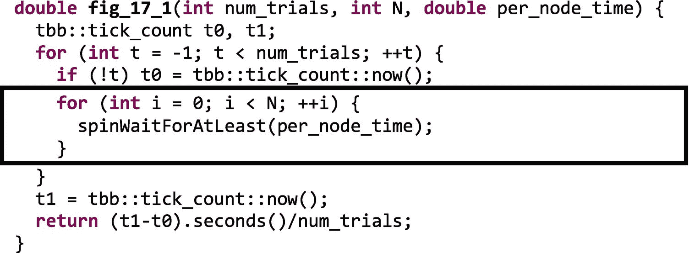

图 17-1

串行:对基线串行循环计时的功能

**FG 循环**功能如图 [17-2](#Fig2) 所示。这个函数构建了一个流图，它有一个从输出到输入的边。单个消息开始循环，然后节点旋转等待并向其输入发送回一个消息。该循环重复 N-1 次。因为节点在将消息发送回输入端之前会旋转，所以这个图仍然是一个串行循环——主体任务中的大部分工作不会重叠。但是，因为消息是在主体返回之前发送的，所以仍然有一小段时间间隔，在此期间另一个线程可以窃取`try_put`生成的任务。我们可以使用这个图来查看流图基础设施的基本开销。


图 17-2

FG 循环:一个为串行流图计时的函数

我们的下一个微基准函数，**主循环**，如图 [17-3](#Fig3) 所示，不创建循环。相反，它在串行循环中直接从主线程向`multifunction_node`发送所有 N 条消息。由于`multifunction_node`具有无限的并行性，并且串行 for-loop 会非常快地发送消息，因此创建了许多并行任务。然而，因为主线程是唯一调用节点`n`上的`try_put`方法的线程，所以所有主体任务都被生成到主线程的本地队列中。参与执行该图的工作线程将被迫窃取它们执行的每个任务——并且只有在它们随机选择主线程作为受害者之后。我们可以使用这个图来查看具有足够并行性的流图的行为，但是这需要大量的工作量。


图 17-3

主循环:仅从主线程提交消息的函数；工人必须窃取他们执行的每一项任务

最后，图 [17-4](#Fig4) 显示了每个工人功能的 **FG 循环。这个函数将任务分布在主线程和工作线程的本地队列中，因为一旦一个线程窃取了它的初始任务，它就会将任务生成到它自己的本地队列中。我们可以用这个图来看一个流量图的行为，有非常少量的窃取。**


图 17-4。

每个工作线程的 FG 循环:这个函数创建的并行度刚好满足工作线程的数量。一旦一个工作者窃取了它的初始任务，它将从它的本地队列中执行它的剩余任务。

除非另有说明，本章中介绍的所有性能结果都是在单插槽服务器上采集的，该服务器采用英特尔至强处理器 E3-1230，具有四个内核，每个内核支持两个硬件线程；该处理器的基本频率为 3.4 GHz，共享 8 MB 三级高速缓存，每核 256 KB L2 高速缓存。该系统运行的是 SUSE Linux Enterprise Server 12。所有样本均使用英特尔 C++ 编译器 19.0 线程构建模块 2019 进行编译，使用编译器标志“`–std=c++11 –O2 –tbb`”。

我们使用`N` =65，536 以及 100 纳秒、1 微秒、10 微秒和 100 微秒的自旋等待时间来运行这些微基准测试。我们收集了 10 次试验的平均执行时间，并在图 [17-5](#Fig5) 中展示了结果。从这些结果中，我们可以看到，当任务大小非常小时，例如 100 纳秒，流图基础设施的开销在所有情况下都会导致性能下降。随着任务大小至少达到 1 微秒，我们开始从并行执行中获益。当我们达到 100 微秒的任务规模时，我们能够达到接近完美的线性加速。


图 17-5

不同旋转等待时间的加速比 T <sub>序列</sub> /T <sub>基准</sub>

通过在流图分析器(FGA)中收集跟踪并查看结果，我们可以进一步了解我们的微基准测试的性能——本章末尾将更详细地介绍 FGA。图 [17-6](#Fig6) 显示了当使用 1 微秒的自旋等待时间时，不同函数的每个线程的时间线。这些时间线长度相同，显示了每个线程在一段时间内所做的工作。时间轴中的间隙(灰色)表示线程没有主动执行节点的主体。在图 [17-6(a)](#Fig6) 中，我们看到了 **FG 循环** `,`的行为，它就像一个串行循环。但是我们可以看到，主体中的`try_put`和任务出口之间的小间隙允许任务在线程之间来回切换，因为它们能够在任务产生时窃取每个任务。这部分解释了图 [17-5](#Fig5) 中所示的微基准测试相当大的开销。正如我们在本章后面所解释的，大多数功能节点在可能的情况下使用调度程序旁路来跟随它们的数据到下一个节点(参见第 [16](16.html#b978-1-4842-4398-5_16) 章中关于管道、数据局部性和线程关联性的讨论，以获得为什么调度程序旁路可以提高缓存性能的更详细的讨论)。由于`multifunction_node`将输出消息直接放入主体实现内部的输出端口，它不能使用调度器旁路立即跟随数据到下一个节点——它必须先完成自己的主体！因此，A `multifunction_node`不使用调度程序旁路来优化局部性。无论如何，这使得图 [17-6(a)](#Fig6) 中的性能成为最坏情况下的开销，因为没有使用调度程序旁路。

在图 [17-6(b)](#Fig6) 中，我们看到主线程正在生成所有的任务，而工作线程必须窃取每个任务，但是任务一旦被窃取就可以并行执行。因为工作线程必须窃取每个任务，所以它们在查找任务时比主线程慢得多。在图 [17-6(b)](#Fig6) 中，主线程持续忙碌——它可以从其本地队列中快速弹出下一个任务——而工作线程的时间线显示了一些间隙，在这些间隙中，它们相互争斗，以从主线程的本地队列中窃取下一个任务。

图 [17-6(c)](#Fig6) 显示了每个工作线程的 **FG 循环的良好行为，其中每个线程都能够从其本地队列中快速弹出下一个任务。现在我们在时间线上看到很少的间隙。**


图 17-6

当使用 1 微秒的自旋等待时，每个微基准测试的两毫秒时间线区域

观察这些极端的行为并注意图 [17-5](#Fig5) 中的性能，我们很乐意为流图节点推荐一个类似的经验法则。虽然一个病理案例，如**主循环**，在 1 微秒的时间内显示了 2.8 的有限加速，但它仍然显示了加速。如果工作更加平衡，比如每个工人使用 **FG 循环，**1 微秒的身体提供了很好的加速。考虑到这些警告，我们再次推荐 1 微秒的执行时间作为一个粗略的准则:

### 经验法则

为了从并行执行中获益，流图节点的执行时间应该至少为 1 微秒。这相当于几千个 CPU 周期——如果你喜欢使用周期，我们建议一个`10,000 cycle`经验法则。

就像 TBB 算法一样，这个规则*并不意味着我们必须不惜一切代价避免小于 1 微秒的节点。只有当我们的流图的执行时间由小节点支配时，我们才真正有问题。如果我们混合了具有不同执行时间的节点，那么与较大节点的执行时间相比，小节点引入的开销可以忽略不计。*

#### 如果节点太小该怎么办

如果流图中的一些节点小于推荐的 1 微秒阈值，则有三种选择:(1)如果该节点对应用程序的总执行时间没有显著影响，则什么都不做，(2)将该节点与周围的其他节点合并以增加粒度，或者(3)使用`lightweight`执行策略。

如果节点的粒度很小，但是它对总执行时间的贡献也很小，那么可以安全地忽略该节点；就让它保持原样。在这些情况下，清晰的设计可能会胜过任何无关紧要的效率。

如果必须解决节点的粒度问题，一种选择是将其与周围的节点合并。节点真的需要和它的前任和继任者分开封装吗？如果节点只有一个前任或一个继任者，并且具有相同的并发级别，那么它可能很容易与这些节点合并。如果它有多个前趋者或后继者，那么由该节点执行的操作可能会被复制到每个节点中。在任何情况下，如果合并不改变图的语义，将节点合并在一起是一种选择。

最后，在构造节点时，可以通过模板参数将节点更改为使用轻量级执行策略。例如:


该策略表示节点主体包含少量工作，如果可能的话，应该在没有任务调度开销的情况下执行。

有三种轻量级策略可供选择:`queueing_lightweight`、`rejecting_lightweight`、`lightweight`、T3【这些策略在附录 b 中有详细描述，除了`source_node`之外，所有功能节点都支持轻量级策略。轻量级节点可能不会产生执行主体的任务，而是在调用线程的上下文中直接在`try_put`内执行主体。这意味着派生的开销被移除了——但是其他线程没有机会窃取任务，因此并行性受到了限制！

图 [17-7](#Fig7) 显示了两个简单的图形，我们可以用它们来展示轻量级策略的好处和风险:第一个是一个链`multifunction_node`对象，第二个是一个连接到两个链`multifunction_node`对象的`multifunction_node`对象。

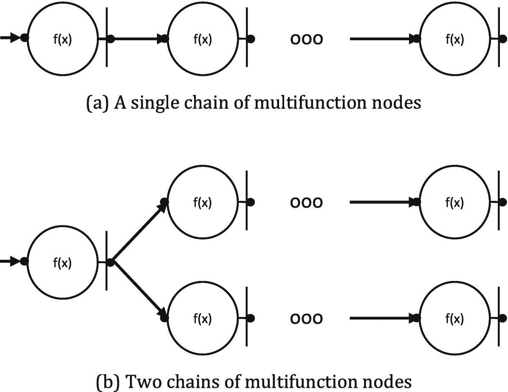

图 17-7

用于检查`lightweight`政策影响的流程图

图 [17-8](#Fig8) 显示了使用`lightweight`策略对图 [17-7](#Fig7) 所示图表的影响，图中使用了 1000 个节点的链，都使用相同的执行策略(`lightweight`或不使用)。我们通过每个图形发送一条消息，并改变每个节点旋转的时间，从 0 到 1 毫秒不等。我们应该注意，当只发送一条消息时，单链不允许任何并行性，而使用两条链，我们可以实现 2 倍的最大加速。


图 17-8

对单链和双链样本使用轻量级策略的影响。大于 1 的值意味着轻量级策略提高了性能。

`lightweight`策略不能限制单链情况下的并行性，因为在这个图中没有并行性。因此，我们在图 [17-8](#Fig8) 中看到，它改善了所有情况下的性能，尽管随着节点粒度的增加，它的影响变得不那么显著。对于单链情况，该比率接近 1.0，因为产卵任务的开销与身体的旋转时间相比变得可以忽略不计。双链案例确实有潜在的相似性。然而，如果所有节点都使用一个`lightweight`策略，那么两个链都将由执行第一个`multifunction_node`的线程来执行，潜在的并行性将被消除。正如我们所料，当我们接近 1 微秒的经验法则执行时间时，`lightweight`策略的优势被受限并行性所掩盖。即使节点旋转了 0.1 微秒，该比率也会下降到 1 以下。当使用两个链时，该比率接近 0.5，因为图的串行化导致我们预期的 2 倍加速的完全损失。

通过合并节点或使用`lightweight`策略来解决粒度问题可以减少开销，但正如我们所看到的，它们也会限制可伸缩性。这些“优化”可以带来显著的改进，但必须明智地应用，否则可能弊大于利。

### 内存使用和数据局部性

与迭代数据结构的 TBB 并行算法不同，流图将数据结构从一个节点传递到另一个节点。消息可以是基本类型、对象、指针，或者在依赖图的情况下是`tbb::flow::continue_msg`对象。为了获得最佳性能，我们需要同时考虑数据局部性和内存消耗。我们将在本节中讨论这两个问题。

#### 流图中的数据局部性

数据在节点之间传递，当一个节点接收到一条消息时，它会将消息正文作为 TBB 任务执行。该任务使用所有 TBB 任务使用的相同工作窃取调度程序进行调度。在图 [17-6(a)](#Fig6) 中，当一个串行循环作为流程图执行时，我们看到一个线程产生的任务可能被另一个线程执行。然而，我们注意到这部分是由于使用`multifunction_node`对象的微基准测试，它不使用调度程序旁路来优化性能。

通常，其他功能节点，包括`source_node`、`function_node`和`continue_node`，如果其中一个后继节点可以立即运行，则使用调度程序旁路。如果这些节点中的一个访问的数据适合数据缓存，那么它可以在执行后继节点时被同一个线程重用。

由于我们可以从流图中的局部性中受益，因此值得考虑数据大小，甚至将数据分成更小的部分，这样可以通过调度程序旁路从局部性中受益。例如，我们可以重温一下我们在第 [16 章](16.html#b978-1-4842-4398-5_16)中使用的矩阵转置内核，作为演示这种效果的例子。我们现在将使用图 [17-9](#Fig9) 所示的`FGMsg`结构传递三对`a`、`b`矩阵。你可以在图 [16-6](16.html#Fig6) 到图 [16-13](16.html#Fig13) 中看到第 [16](16.html#b978-1-4842-4398-5_16) 章矩阵转置内核的串行、高速缓存不经意和并行实现。

图 [17-9](#Fig9) 中也显示了我们第一个没有将数组分成小块的实现。`source_node, initialize`发送三条消息，每条消息是三个矩阵对之一。这个节点连接到一个具有无限并发性的`function_node, transpose`。`transpose`节点调用第 [16 章](16.html#b978-1-4842-4398-5_16)中的简单串行矩阵转置函数。最后一个节点`check`确认转置正确完成。


图 17-9

发送一系列矩阵进行转置的图形，每个矩阵都使用第 [16 章](16.html#b978-1-4842-4398-5_16)中的简单串行矩阵转置进行转置

我们的简单实现发送完整的矩阵，这些矩阵由`transpose`以非缓存无关的方式进行处理。正如我们可能预料的那样，这并没有很好地执行。在我们的测试机器上，它只比连续三次执行第 [16](16.html#b978-1-4842-4398-5_16) 章中矩阵转置的非缓存无关串行实现快 8%,每对矩阵执行一次。这并不奇怪，因为基准测试是受内存限制的——当我们无法从内存中获取一个转置所需的数据时，尝试并行执行多个转置并没有多大帮助。如果我们将我们的简单流程图与第 [16](16.html#b978-1-4842-4398-5_16) 章中的串行缓存无关转置进行比较，它看起来甚至更糟，当在我们的测试机上执行时，需要 2.5 倍*长的时间*来处理三对矩阵。幸运的是，有许多方法可以提高这个流程图的性能。例如，我们可以在`transpose`节点中使用串行缓存无关实现。或者，我们可以使用第 [16 章](16.html#b978-1-4842-4398-5_16)中的`parallel_for`实现，它在`transpose`节点中使用了`blocked_range2d`和`simple_partitioner`。我们将很快看到，这些都将极大地提高我们的基础案例加速 1.08。

然而，我们也可以将矩阵块作为消息发送，而不是将每对`a`和`b`矩阵作为一个大消息发送。为此，我们扩展了我们的消息结构，以包含一个`blocked_range2d`:

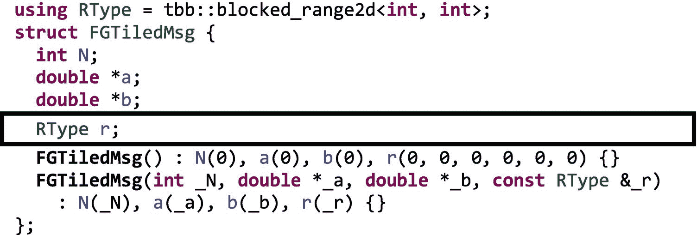

然后我们可以构建一个实现，其中`initialize`节点将`a`和`b`矩阵的块作为消息发送；在移动到下一个矩阵之前发送来自一对矩阵的所有块。图 [17-10](#Fig10) 显示了一种可能的实现方式。在这种实现中，堆栈由`source_node`维护，以模拟深度优先细分和块的执行，这将通过由 TBB `parallel_for`执行的范围的递归细分来实现。我们将不深入描述图 [17-10](#Fig10) 中的实现。相反，我们将简单地注意到它发送的是块而不是全矩阵。

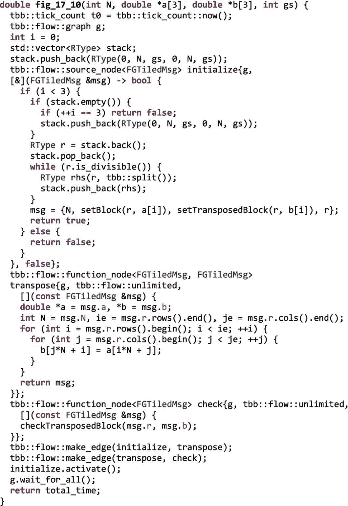

图 17-10

利用第 [16](16.html#b978-1-4842-4398-5_16) 章【高级算法】中描述的 blocked_range2d，发送一系列矩阵块进行转置的图形

图 [17-11](#Fig11) 显示了在我们的测试机上执行矩阵转置的几个变体的加速。我们可以看到，我们的第一个实现，标记为“流图”，显示了 8%的小改进。pfor-br2d 实现是图 [16-11](16.html#Fig11) 中基于`parallel_for`的实现，其中`blocked_range2d`和`simple_partitioner,`执行三次，每对矩阵执行一次。其余的条都对应于优化的流图版本:“流图+不经意”类似于图 [17-9](#Fig9) ，但是从`transpose`节点体内部调用矩阵转置的串行缓存不经意实现；“流图+ pfor-br2d”在`transpose`体中使用了一个`parallel_for`；“平铺流图”是我们在图 [17-10](#Fig10) 中的实现；“平铺流图+ pfor2d”与图 [17-10](#Fig10) 相似，但使用了一个`parallel_for`来处理其平铺。图 [17-10](#Fig10) 中的平铺流程图表现最佳。


图 17-11

矩阵转置的不同变体的加速。我们使用 32×32 的瓦片，因为这在我们的测试系统上表现最好。

令人惊讶的是，具有嵌套`parallel_fors`的平铺流图版本的性能不如没有嵌套并行的平铺流图。在第 9 章中，我们声称我们可以在 TBB 不受惩罚地使用嵌套并行——那么哪里出错了呢？残酷的现实是，一旦我们开始调优我们的 TBB 应用程序的性能——我们经常需要牺牲完全的可组合性来换取性能(参见可组合性方面侧栏)。在这种情况下，嵌套并行性干扰了我们小心翼翼地尝试实现的缓存优化。每个节点都被发送了一个适合其数据缓存的切片进行处理——通过嵌套并行，我们通过与其他线程共享切片来消除这种完美的匹配。

### 可组合性方面

我们可以将可组合性分解为三个愿望:

1.  正确性(作为绝对)

2.  使用能力(作为实际问题)

3.  绩效(作为一种期望)

    首先，我们希望可以混合和匹配代码，而不用担心它会突然出现故障(得到错误的答案)。TBB 给了我们这种能力，这在很大程度上是一个已经解决的问题——一个问题是，当使用有限精度数学(如本机浮点运算)时，不确定的执行顺序会使答案不同。我们在第 [16](16.html#b978-1-4842-4398-5_16) 章中讨论了这一点，提供了维护可组合性的“正确性”方面的方法。

    第二，我们希望程序不会崩溃。在许多情况下，这是一个实际问题，因为最常见的问题(无限制的内存使用)理论上可以用无限大小的内存来解决。☺ TBB 在很大程度上解决了这方面的可组合性，使其具有编程模型所不具备的优势(如 OpenMP)。TBB 在结构化程度较低的流程图方面确实需要更多的帮助，所以我们讨论在流程图中使用`limiter_nodes`来控制内存使用——这在大型流程图中尤其重要。

    最后，对于最佳性能，我们不知道全面性能可组合性的通用解决方案。现实情况是，高度优化的代码与运行在同一硬件上的其他代码竞争，会干扰任一代码的最佳性能。这意味着我们可以从手动调整代码中获益。幸运的是，TBB 为我们提供了调优控制，像 Flow Graph Analyzer 这样的工具有助于我们洞察并指导我们的调优。一旦调优，我们的经验是代码可以很好地工作，感觉是可组合的——但是盲目使用代码并获得最高性能的技术并不存在。“足够好”的表现可能经常发生，但“伟大”需要努力。

我们不应该过于关注图 [17-11](#Fig11) 中结果的细节——毕竟，这是一个内存受限的微基准测试。但是它清楚地表明，我们可以从考虑节点的大小中获益，不仅从粒度角度，而且从数据局部性角度。当我们从一个发送整个数组并且没有在节点中实现经过调整的内核的简单实现转移到我们的更能感知缓存的平铺流图版本时，我们看到了显著的性能提升。

#### 挑选最佳消息类型并限制传输中的消息数量

当我们允许消息进入一个图，或者当我们通过一个流图沿着多条路径分割它们时，我们消耗更多的内存。除了担心局部性，我们可能还需要限制内存增长。

当消息被传递到数据流图中的节点时，它可能被复制到该节点的内部缓冲区中。例如，如果一个串行节点需要推迟任务的生成，它会将传入的消息保存在一个队列中，直到可以合法地生成一个任务来处理它们。如果我们在流图中传递非常大的对象，这种复制会非常昂贵！因此，如果可能的话，最好是传递指向大型对象的指针，而不是对象本身。

C++11 标准引入了类(在`namespace std) unique_ptr`和`shared_ptr`中)，这对于简化流图中指针传递的对象的内存管理非常有用。例如，在图 [17-12](#Fig12) 中，让我们假设一个`BigObject`很大并且建造很慢。通过使用`shared_ptr`传递对象，只有`shared_ptr`被复制到串行节点`n`的输入缓冲区，而不是整个`BigObject`。此外，由于使用了`shared_ptr`，一旦每个`BigObject`到达图的末尾并且其引用计数达到 0，它就会被自动销毁。多方便啊！

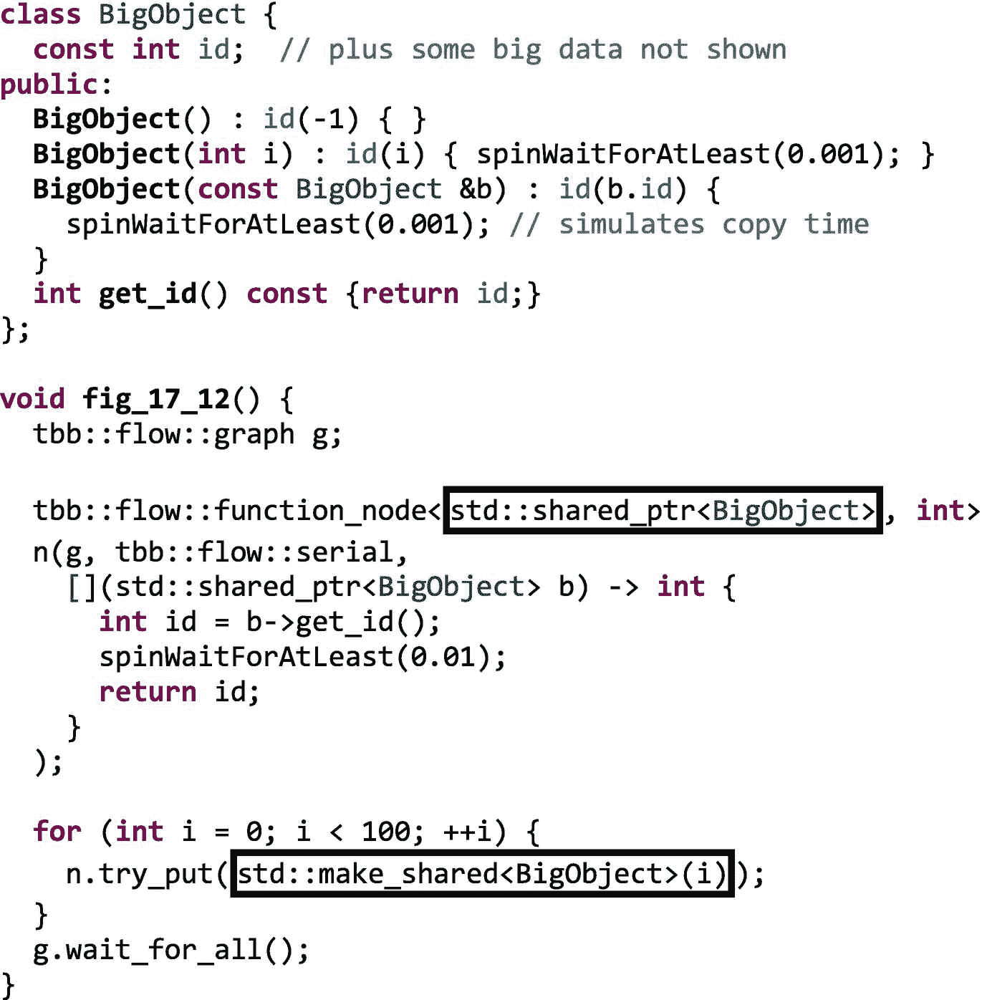

图 17-12

使用`std::shared_ptr`避免缓慢复制，同时简化内存管理

当然，当我们使用指向对象的指针时，我们需要小心。通过传递指针而不是对象，多个节点可以通过`shared_ptr`同时访问同一个对象。如果您的图依赖于功能并行性，即相同的消息被广播到多个节点，这一点尤其正确。`shared_ptr`将正确处理引用计数的递增和递减，但是我们需要确保在访问所指向的对象时，我们正确地使用了边来防止任何潜在的竞争情况。

正如我们在讨论节点如何映射到任务时所看到的，当消息到达功能节点时，可能会产生任务或者缓冲消息。在设计数据流图时，我们不应该忘记这些缓冲区和任务，以及它们的内存占用。

例如，让我们考虑图 [17-13](#Fig13) 。有两个节点，`serial_node`和`unlimited_node`；两者都包含一个长自旋循环。`for`循环为两个节点快速分配大量输入。节点`serial_node`是串行的，因此它的内部缓冲区将快速增长，因为它接收消息的速度比它完成任务的速度快。相比之下，节点`unlimited_node`将在每条消息到达时立即产生任务——用大量任务迅速淹没系统——远远超过工作线程的数量。这些产生的任务将在内部工作线程队列中缓冲。在这两种情况下，我们的图可能会很快消耗大量内存，因为它们允许 BigObject 消息进入图中的速度比它们被处理的速度更快。

我们的例子使用了一个原子计数器`bigObjectCount`，来跟踪在任何给定时间当前分配了多少个`ObjectCount`对象。在执行结束时，该示例打印最大值。当我们用`A_VERY_LARGE_NUMBER=4096`运行图 [17-13](#Fig13) 中的代码时，我们看到了一个`"maxCount == 8094"`。`serial_node`和`unlimited_node`都可以快速积累 BigObject 对象！

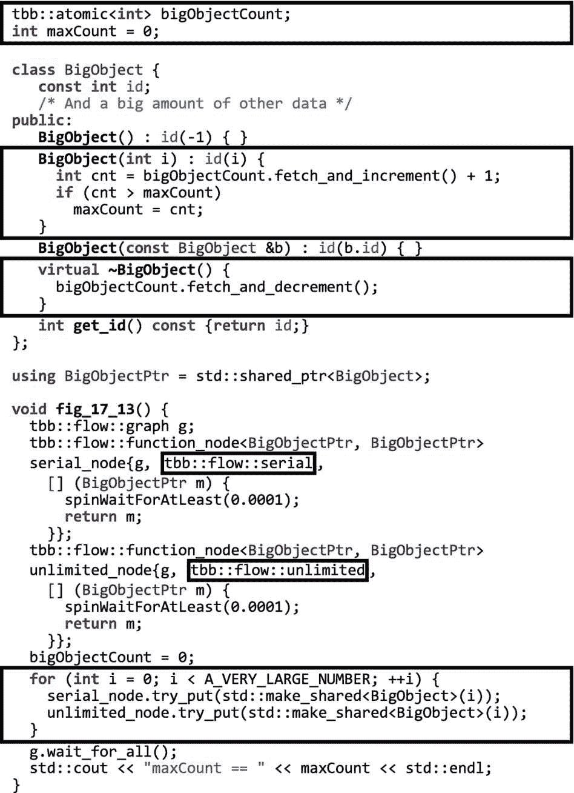

图 17-13

一个例子有连续的`function_node`、`serial_node`，还有无限的`function_node`、`unlimited_node`

有三种常见的方法来管理流程图中的资源消耗:(1)使用`limiter_node` , (2)使用并发限制，和/或(3)使用令牌传递模式。

我们使用一个`limiter_node`来设置可以通过图中给定点的消息数量的限制。`limiter_node`的接口子集如图 [17-14](#Fig14) 所示。

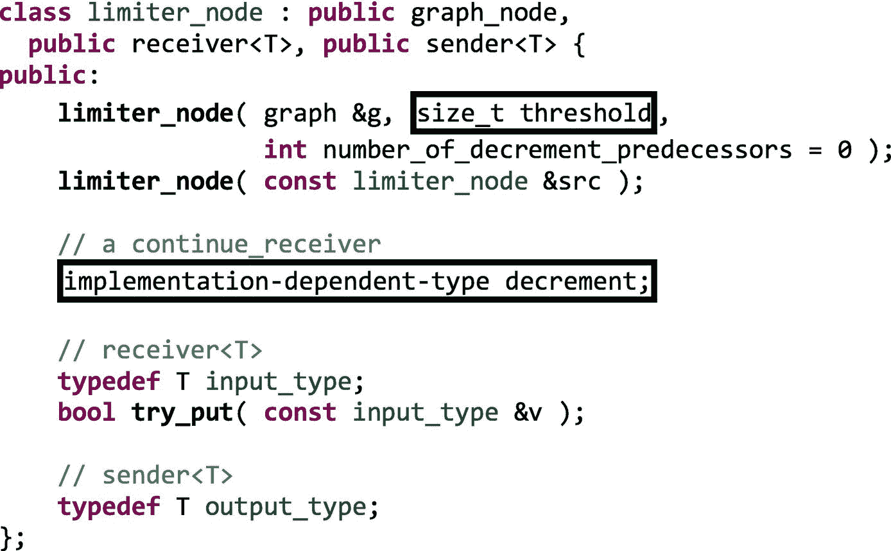

图 17-14

示例使用的`limiter_node`接口的子集

一个`limiter_node`维护通过它的消息的内部计数。发送到`limiter_node`上的`decrement`端口的消息会减少计数，允许更多的消息通过。如果计数等于节点的`threshold`，任何到达其输入端口的新消息都将被拒绝。

在图 [17-15](#Fig15) 中，一个`source_node source`生成大量的`BigObjects`。一旦先前生成的消息被消耗掉，一个`source_node`只会产生一个新的任务来生成一条消息。我们在`source`和`unlimited_node`之间插入一个`limiter_node` `limiter`，构造为限制 3，以限制发送到`unlimited_node`的消息数量。我们还添加了一个从`unlimited_node`回到`limiter_node`递减端口的边沿。通过`limiter`发送的消息数量现在最多比通过`limiter`的减量端口发回的消息数量多 3。


图 17-15

使用一个`limiter_node`一次只允许三个`BigObjects`到达`unlimited_node`

我们还可以使用节点上的并发限制来限制资源消耗，如图 [17-16](#Fig16) 所示。在代码中，我们有一个可以无限并发地安全执行的节点，但是我们选择了一个较小的数字来限制并发产生的任务数量。

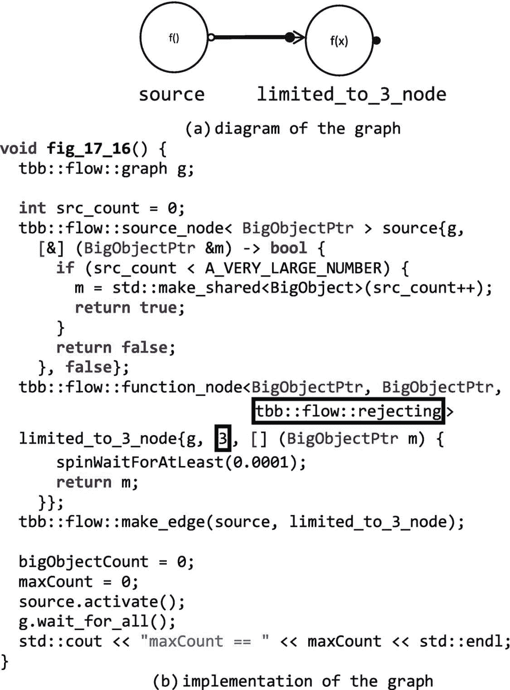

图 17-16

使用一个`tbb::flow::rejecting`策略和一个`concurrency_limit`来一次只允许三个`BigObjects`到达`limited_to_3_node`

我们可以通过构造一个执行策略、`flow::rejecting`或`flow::rejecting_lightweight`来关闭`function_node`的内部缓冲。图 [17-16](#Fig16) 中的`source_node`只有在被消耗时才会继续产生新的输出。

在数据流图中限制资源消耗的最后一种常用方法是使用基于令牌的系统。如第 [2](02.html#b978-1-4842-4398-5_2) 章所述，`tbb::parallel_pipeline`算法使用令牌来限制管道中将要运行的项目的最大数量。我们可以使用令牌和预留`join_node`创建一个类似的系统，如图 [17-17](#Fig17) 所示。在这个例子中，我们创建了一个`source_node source`和`buffer_node token_buffer`。这两个节点连接到预留`join_node join`的输入端。预留`join_node, join_node< tuple< BigObjectPtr, token_t >, flow::reserving >`，仅在它可以首先在其每个端口预留输入时消耗物品。由于`source_node`在其前一条消息未被消费时停止生成新消息，因此`token_buffer`中令牌的可用性限制了`source_node`可以生成的项目数量。当令牌由节点`unlimited_node`返回到`token_buffer`时，它们可以与`source`生成的附加消息配对，从而允许产生新的`source`任务。

图 [17-18](#Fig18) 显示了节点体串行执行过程中每种方法的加速。在这个图中，自旋时间是 100 微秒，我们可以看到令牌传递方法的开销稍微高一些，尽管这三种方法的加速比都接近 3，正如我们所预期的那样。


图 17-18

这三种方法都限制了加速，因为一次只有三个项目被允许进入节点 n

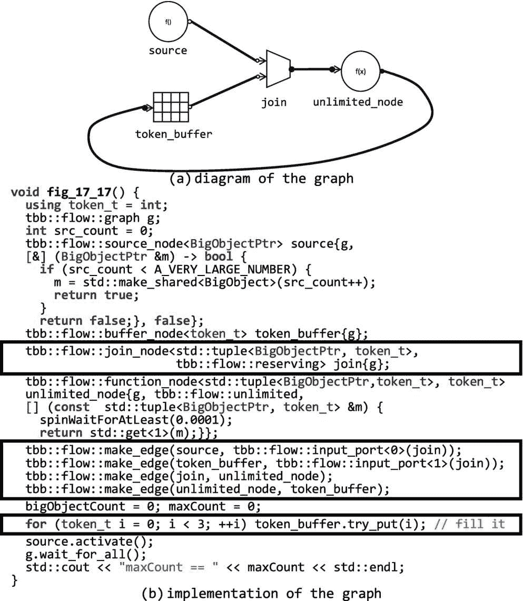

图 17-17

令牌传递模式使用令牌和一个`tbb::flow::reserving join_node`来限制可以到达节点`unlimited_node`的项目

在图 [17-18](#Fig18) 中，我们使用`int`作为令牌类型。一般来说，我们可以使用任何类型作为令牌，甚至是大型对象或指针。例如，如果我们想回收`BigObject`对象而不是为每个新输入分配它们，我们可以使用`BigObjectPtr`对象作为令牌。

### 任务竞技场和流程图

隐式和显式任务竞技场都会影响 TBB 任务和 TBB 通用并行算法的行为。任务产生的场所控制哪些线程可以参与执行任务。在第 11 章中，我们看到了如何使用隐式和显式竞技场来控制参与执行并行工作的线程数量。在第[12](12.html#b978-1-4842-4398-5_12)–[14](14.html#b978-1-4842-4398-5_14)章中，我们看到了显式任务竞技场可以与`task_sheduler_observer`对象一起使用，以在线程加入竞技场时设置线程的属性。由于任务领域对可用并行性和数据局部性的影响，在本节中，我们将更仔细地研究任务领域如何与流图相结合。

#### 流程图使用的默认竞技场

当我们构造一个`tbb::flow::graph`对象时，graph 对象捕获一个对构造该对象的线程的竞技场的引用。每当产生一个任务来执行图中的工作时，该任务就在这个场所中产生，而不是在导致该任务产生的线程的场所中产生。

为什么？

嗯，TBB 流图没有 TBB 并行算法那么结构化。TBB 算法使用 fork-join 并行性，TBB 任务竞技场的行为很好地匹配了这种模式——每个主线程都有自己的默认竞技场，因此如果不同的主线程并发执行算法，它们的任务在不同的任务竞技场中彼此隔离。但是对于 TBB 流图，可能有一个或多个主线程明确地将消息放入同一个图中。如果与这些交互相关的任务在每个主线程的竞技场中产生，那么来自一个图的一些任务将与来自同一图的其他任务隔离。这很可能不是我们想要的行为。

因此，所有的任务都产生在一个单独的舞台上，这个舞台就是构建 graph 对象的线程的舞台。

#### 更改流程图使用的任务领域

我们可以通过调用图的`reset()`函数来改变图所使用的任务竞技场。这将重新初始化图形，包括重新捕获任务竞技场。我们在图 [17-19](#Fig19) 中通过构建一个简单的图来演示这一点，图中有一个`function_node`打印了它的主体任务执行的竞技场中的槽的数量。因为主线程构建了图形对象，所以图形将使用默认的 arena，我们用八个槽来初始化它。


图 17-19

使用`graph::reset`改变图形使用的任务竞技场

在图 [17-19](#Fig19) 中对`n.try_put`的前三次调用中，我们没有重置那个图`g`，我们可以看到任务在默认的有八个槽的竞技场中执行。

```cpp

Without reset:
default : 8
a2 : 8
a4 : 8

```

但是在第二组调用中，我们调用 reset 来重新初始化图，节点首先在默认竞技场执行，然后在`arena a2`执行，最后在`arena a4`执行。

```cpp

With reset:
default : 8
a2 : 2
a4 : 4

```

#### 设置线程数量、线程与内核的相似性等。

既然我们知道了如何将任务竞技场与流程图关联起来，我们就可以使用第[11](11.html#b978-1-4842-4398-5_11)–[14](14.html#b978-1-4842-4398-5_14)章中描述的所有依赖于任务竞技场的性能调优。例如，我们可以使用任务竞技场将一个流程图从另一个流程图中分离出来。或者，我们可以使用`task_scheduler_observer`对象将线程固定到特定任务领域的内核，然后将该领域与流程图相关联。

## FG 的关键建议:该做的和不该做的

流图 API 是灵活的——可能太灵活了。当第一次使用流图时，界面可能会令人望而生畏，因为有太多的选项。在本节中，我们提供了几个注意事项，这些事项记录了我们在使用这个高级界面时的一些经验。然而，就像我们对节点执行时间的经验法则一样，这些只是建议。有许多有效的使用模式在这里没有被捕获，我们确信一些我们说要避免的模式可能有有效的用例。我们介绍这些最著名的方法，但你的里程可能会有所不同。

### Do:使用嵌套并行

就像管道一样，如果使用并行(`flow::unlimited`)节点，流图可以具有很大的可伸缩性，但是如果使用串行节点，则可伸缩性有限。增加缩放比例的一种方法是在 TBB 流图节点中使用嵌套并行算法。TBB 是关于可组合性的，所以我们应该尽可能使用嵌套并行。

### 不要:使用多功能节点代替嵌套并行

正如我们在本书中所看到的，TBB 并行算法，如`parallel_for`和`parallel_reduce`，都经过了高度优化，包括范围和分割器等功能，让我们可以进一步优化性能。我们还看到流图接口非常有表现力——我们可以表达包含循环的图，并使用像`multifunction_node`这样的节点从每次调用中输出许多消息。因此，我们应该注意在图中创建模式的情况，这些模式可以使用嵌套并行更好地表达。一个简单的例子如图 [17-20](#Fig20) 所示。


图 17-20

一个`multifunction_node`为它接收的每条消息发送许多消息。这种模式最好用嵌套的`parallel_for`循环来表达。

在图 [17-20](#Fig20) 中，对于`multifunction_node`接收到的每条消息，它都会生成许多输出消息，这些消息会无限并发地流入`function_node`中。这个图很像一个并行循环，其中`multifunction_node`作为控制循环，`function_node`作为主体。但是像图 [17-3](#Fig3) 和[17–5](#Fig5)中的主循环一样分发工作需要大量的窃取。虽然这种模式可能有一些有效的用法，但是使用高度优化的并行循环算法可能更有效。例如，整个图可以折叠成一个包含嵌套的`parallel_for`的节点。当然，这种替换是否可能或需要取决于应用。

### Do:需要时，使用`join_node`、`sequencer_node`或`multifunction_node`在流程图中重新建立顺序

因为流图不如简单的管道结构化，所以我们有时可能需要在图中的点上建立消息的顺序。在数据流图中建立顺序有三种常见的方法:使用键匹配`join_node`，使用`sequencer_node`，或者使用`multifunction_node`。

例如，在第 [3](03.html#b978-1-4842-4398-5_3) 章中，我们的立体 3D 流程图中的并行性允许左右图像在`mergeImageBuffersNode`点无序到达。在那个例子中，我们通过使用标签匹配`join_node`来确保正确的两幅图像被配对在一起作为`mergeImageBuffersNode`的输入。标签匹配`join_node`是一种密钥匹配`join_node.`类型，通过使用这种`join_node`类型，输入可以以不同的顺序到达两个输入端口，但仍然会根据它们的标签或密钥进行正确匹配。您可以在附录 b 中找到关于不同连接策略的更多信息。

另一种建立顺序的方法是使用`sequencer_node`。`sequencer_node`是一个缓冲区，它按照序列顺序输出消息，使用用户提供的 body 对象从传入的消息中获取序列号。

在图 [17-21](#Fig21) 中，我们可以看到一个三节点图，节点有`first_node`、`sequencer`和`last_node`。在最后一个串行输出节点`last_node`之前，我们使用一个`sequencer_node`来重新建立消息的输入顺序。因为`function_node first_node`是无限的，它的任务可以无序完成，并在完成时发送它们的输出。`sequencer_node`通过使用最初构造每个消息时分配的序列号来重新建立输入顺序。

如果我们执行一个没有序列器节点且`N` =10 的类似示例，当消息在去往`last_node`的途中相互传递时，输出被打乱:


图 17-21

一个`sequencer_node`用于确保消息按照它们的`my_seq_no`成员变量指定的顺序打印

```cpp

9 no sequencer
8 no sequencer
7 no sequencer
0 no sequencer
1 no sequencer
2 no sequencer
6 no sequencer
5 no sequencer
4 no sequencer
3 no sequencer

```

当我们执行图 [17-21](#Fig21) 中的代码时，我们会看到输出:

```cpp

0 with sequencer
1 with sequencer
2 with sequencer
3 with sequencer
4 with sequencer
5 with sequencer
6 with sequencer
7 with sequencer
8 with sequencer
9 with sequencer

```

正如我们所看到的，`sequencer_node`可以重新建立消息的顺序，但是它需要我们分配序列号，还需要为`sequencer_node`提供一个主体，以便从传入的消息中获取序列号。

建立顺序的最后一种方法是使用序列号`multifunction_node`。对于给定的输入消息，`multifunction_node`可以在它的任何输出端口上输出零个或多个消息。由于不会强制为每个传入的消息输出一条消息，因此它可以缓冲传入的消息并保存它们，直到满足一些用户定义的排序约束。

例如，图 [17-22](#Fig22) 显示了我们如何使用`multifunction_node`来实现`sequencer_node`,方法是缓冲传入的消息，直到序列器中的下一条消息到达。这个例子假设最多`N`消息被发送到一个节点`sequencer`，并且序列号从 0 开始并且连续到`N-1`。向量`v`是用初始化为空`shared_ptr`对象的`N`元素创建的。当消息到达`sequencer`时，它被分配给`v.`的相应元素，然后从最后发送的序列号开始，发送具有有效消息的`v`的每个元素，序列号递增。对于某些传入消息，将不发送输出消息；对于其他人，可能会发送一条或多条消息。

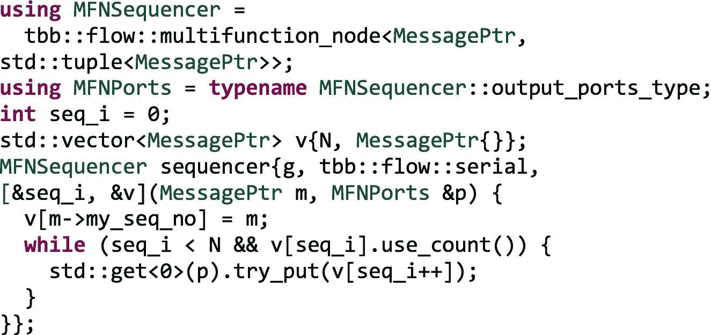

图 17-22

一个`multifunction_node`用于实现一个`sequencer_node`

虽然图 [17-22](#Fig22) 显示了如何使用`multifunction_node`按序列顺序对消息进行重新排序，但一般来说，可以使用任何用户定义的消息排序或捆绑。

### Do:使用`Isolate`函数进行嵌套并行

在第 [12](12.html#b978-1-4842-4398-5_12) 章中，我们谈到了在使用 TBB 算法时，我们有时会因为性能或正确性的原因而需要创建隔离。对于流图来说也是如此，对于通用算法来说，对于嵌套并行来说尤其如此。图 [17-23](#Fig23) 中的图的实现显示了一个简单的图，图中有节点`source`和`unlimited_node`，节点`unlimited_node`中有嵌套并行。在等待节点`unlimited_node`中嵌套的`parallel_for`循环完成时，线程可能会兼职(参见第 [12 章](12.html#b978-1-4842-4398-5_12)),并拾取节点`unlimited_node`的另一个实例。节点`unlimited_node`打印“`X started by Y`”，其中`X`是节点实例号，`Y`是线程 id。

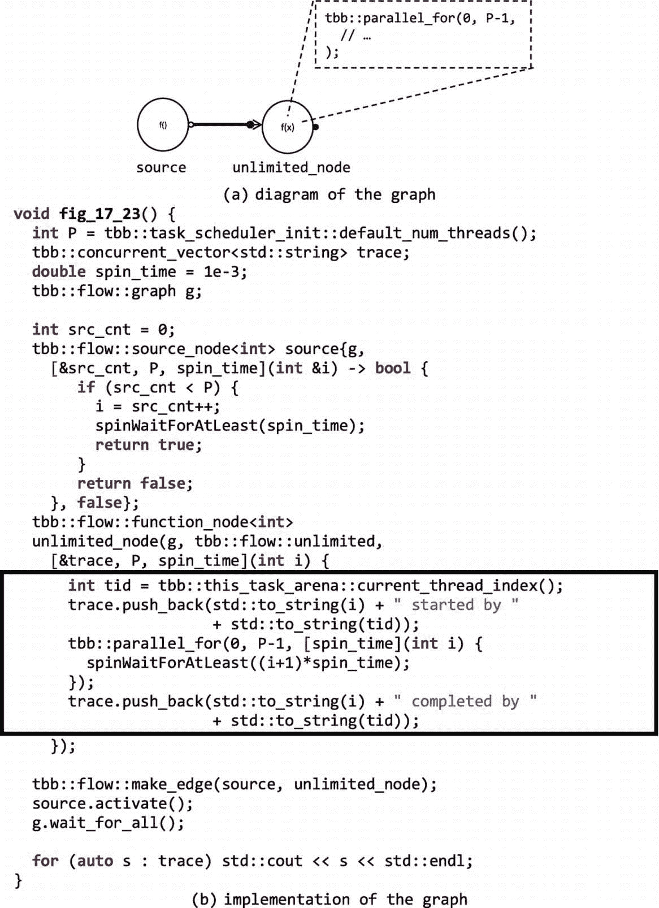

图 17-23

具有嵌套并行的图

在我们有八个逻辑内核的测试系统上，一个输出显示我们的线程 0 非常无聊，它在等待第一个`parallel_for`算法完成时，拾取了不止一个，而是三个不同的`unlimited_node`实例，如图 [17-24](#Fig24) 所示。

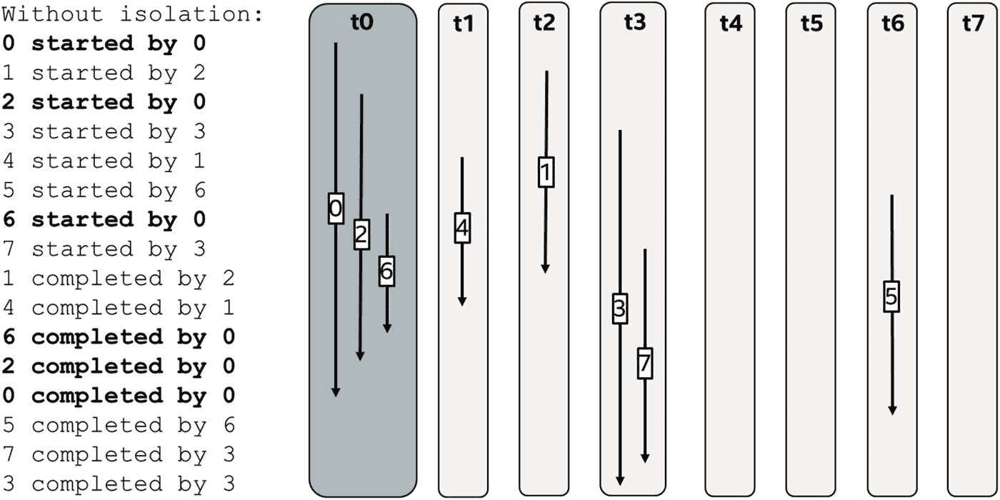

图 17-24。

图 [17-23](#Fig23) 中示例的输出显示在左边，右边是显示重叠执行的图表。线程 0 同时参与三个不同节点调用的执行。

正如我们在第 [12](12.html#b978-1-4842-4398-5_12) 章中所讨论的，兼职通常是良性的，这里的情况就是如此，因为我们没有计算任何真实的东西。但是正如我们在之前关于隔离的讨论中所强调的，这种行为并不总是良性的，在某些情况下会导致正确性问题，或者降低性能。

我们可以在流程图中处理兼职，就像我们在第 [12](12.html#b978-1-4842-4398-5_12) 章中处理一般任务一样，使用`this_task_arena::isolate`函数或显式任务竞技场。例如，我们可以在隔离调用中调用它，而不是直接在节点体中调用`parallel_for`:

```cpp

tbb::this_task_arena::isolate([P,spin_time]() {
  tbb::parallel_for(0, P-1, [spin_time](int
i) {
    spinWaitForAtLeast((i+1)∗spin_time);
  });
});

```

在修改我们的代码以使用这个函数后，我们看到线程不再兼职，每个线程都保持关注一个节点，直到该节点完成，如图 [17-25](#Fig25) 所示。


图 17-25

没有一个节点同时执行不同的节点调用

### Do:在流程图中使用取消和异常处理

在第 [15](15.html#b978-1-4842-4398-5_15) 章中，我们讨论了一般使用 TBB 任务时的任务取消和异常处理。因为我们已经熟悉了这个主题，所以在本节中我们将只强调与流程图相关的方面。

#### 每个流程图使用一个单独的`task_group_context`

一个流图实例将其所有的任务生成到一个单一的任务竞技场中，并且它还为所有这些任务使用一个单一的`task_group_context`对象。当我们实例化一个图形对象时，我们可以向构造器传递一个显式的`task_group_context`:

```cpp

tbb::task_group_context tgc;
tbb::flow::graph g{tgc};

```

如果我们不把一个传递给构造器，就会为我们创建一个默认对象。

#### 取消流程图

如果我们想要取消一个流图，我们使用`task_group_context`来取消它，就像我们使用 TBB 通用算法一样。

```cpp

tgc.cancel_group_excution();

```

就像 TBB 算法一样，已经开始的任务将会完成，但是与该图相关的新任务将不会开始。如附录 B 中所述，graph 类中还有一个帮助函数，它让我们可以直接检查图形的状态:

```cpp

if (g.is_cancelled()) {
  std::cout << "My graph was cancelled!" << std::endl;
}

```

如果我们需要取消一个图，但是没有对它的`task_group_context`的引用，我们可以从任务中得到一个:

```cpp

tbb::task::self().cancel_group_execution(); 

```

#### 取消后重置流程图

如果图形被取消，无论是直接取消还是由于异常取消，我们都需要重新设置图形`g.reset()`，然后才能再次使用它。这将重置图形的状态——清除内部缓冲区，将边恢复到初始状态，等等。有关更多详细信息，请参见附录 B。

#### 异常处理示例

为了了解异常如何与流程图一起工作，让我们看看图 [17-26](#Fig26) 中的图的实现。这个图提供了一个小的三节点图，它在第二个节点`node2`抛出一个异常。


图 17-26

在其一个节点中抛出异常的流图

如果我们执行这个例子，我们会得到一个异常(希望这不是一个意外):

```cpp

terminate called after throwing an instance of 'int'

```

由于我们没有处理异常，它传播到外部范围，我们的程序终止。当然，我们可以修改我们的节点`node2`的实现，这样它就可以在自己的主体中捕获异常，如图 [17-27](#Fig27) 所示。


图 17-27。

在其一个节点中抛出异常的流图

如果我们做了这样的更改，我们的示例将运行完成，打印出“捕获”的消息，没有特定的顺序:

```cpp

Caught 2
Caught 1

```

到目前为止，这些都不是非常特殊的(双关语)；这就是异常应该如何工作。

流程图中异常处理的独特之处在于，我们可以在调用图的`wait_for_all`函数时捕捉异常，如图 [17-28](#Fig28) 所示。

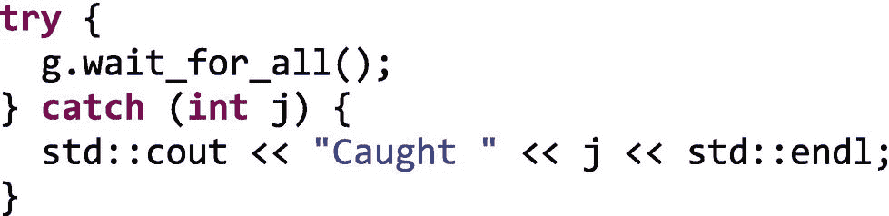

图 17-28

在其一个节点中抛出异常的流图

如果我们重新运行图 [17-26](#Fig26) 中的原始示例，但在调用`wait_for_all`时使用 try-catch 块，我们将只看到一条“catch”消息(针对 1 或 2):

```cpp

Caught 2

```

节点`node2`中抛出的异常没有在节点主体中被捕获，因此它将传播到等待调用`wait_for_all`的线程。如果一个节点的主体抛出一个异常，那么它所属的图就会被取消。在这种情况下，我们看到没有第二个“被捕获”消息，因为`node2`只会执行一次。

当然，如果我们想在处理完在`wait_for_all,`捕获的异常后重新执行图表，我们需要调用`g.reset()`，因为图表已经被取消了。

### Do:使用`task_group_context`设置图表的优先级

我们可以通过使用图表的`task_group_context`为图表产生的所有任务设置优先级，例如:

```cpp

if (auto t = g.root_task()) {
  t->group()->set_priority(tbb::priority_high);
}

```

或者我们可以将一个具有预设优先级的`task_group_context`对象传递给图形的构造器。但是，无论在哪种情况下，这都为与该图相关的所有任务设置了优先级。我们可以创建一个高优先级的图和另一个低优先级的图。

在这本书出版前不久，对功能节点相对优先级的支持作为预览特性被添加到 TBB 中。使用这个特性，我们可以向节点的构造器传递一个参数，赋予它相对于其他功能节点的优先级。该接口首次在 TBB 2019 更新 3 中提供。感兴趣的读者可以在在线 TBB 发行说明和文档中了解有关这一新功能的更多详细信息。

### 不要:在不同图中的节点之间创建边

所有图形节点都需要一个对图形对象的引用，作为其构造器的参数之一。一般来说，只有在属于同一个图的节点之间构造边才是安全的。连接不同图中的两个节点会使推理图的行为变得困难，例如将使用什么任务竞技场，我们对`wait_for_all`的调用是否会正确地检测到图的终止，等等。为了优化性能，TBB 图书馆利用了其关于边缘的知识。如果我们通过一条边连接两个图，TBB 图书馆将自由地通过这条边达到优化的目的。我们可能认为我们已经创建了两个不同的图，但是如果有共享的边，TBB 可以开始以意想不到的方式将它们的执行混合在一起。

为了演示我们如何获得意想不到的行为，我们实现了如图 [17-29](#Fig29) 所示的类`WhereAmIRunningBody`。它打印出`max_concurrency`和优先级设置，我们将使用它们来推断这个主体的任务在执行时使用了什么任务竞技场和`task_group_context`。


图 17-29

一个 body 类，让我们推断出节点执行使用了什么任务 arena 和`task_group_context`

图 [17-30](#Fig30) 提供了一个使用`WhereAmIRunningBody`演示意外行为的例子。在这个例子中，我们创建了两个节点:`g2_node`和`g4_node`。节点`g2_node`是参照`g2`构建的。图`g2`被传递对具有`priority_normal`的`task_group_context`的引用，并且`g2`是并发度为 2 的`task_arena`中的`reset()`。因此，我们应该期望`g2_node`在一个有两个线程的竞技场中以正常的优先级执行，对吗？节点`g4_node`是这样构造的，我们应该期望它在一个有四个线程的竞技场中以高优先级执行。

包含`g2_node.try_put(0)`和`g4_node.try_put(1)`的第一组呼叫符合这些预期:

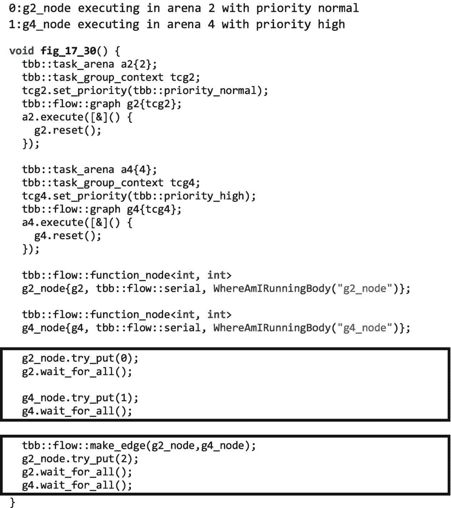

图 17-30

由于跨图通信而出现意外行为的示例

但是，当我们从`g2_node`到`g4_node`创建一条边时，我们在两个不同图中存在的节点之间创建了一个连接。我们包含`g2_node.try_put(2)`的第二组调用再次导致`g2_node`的主体在`arena a2`中以正常优先级执行。但是 TBB 试图减少调度开销，由于从`g2_node`到`g4_node`的边沿，当它调用`g4_node`时，使用调度程序旁路(参见第 [10 章](10.html#b978-1-4842-4398-5_10)中的调度程序旁路)。结果就是`g4_node`和`g2_node`在同一个线程中执行，但是这个线程属于`arena a2`而不是`a4`。当任务被构造时，它仍然使用正确的`task_group_context`,但是它最终被安排在一个意想不到的地方。

```cpp

2:g2_node executing in arena 2 with priority normal
2:g4_node executing in arena 2 with priority high

```

从这个简单的例子中，我们可以看到这条边打破了图形之间的分隔。如果我们使用 arenas `a2`和`a4`来控制线程的数量，用于工作隔离或线程关联的目的，这个边缘将撤销我们的努力。我们 ***不应该*** 在图形之间制造边。

### Do:使用`try_put`跨图形进行交流

在前面的“不要”中，我们决定不要在图形之间创建边。但是如果我们真的需要跨图交流呢？最不危险的选择是显式调用`try_put`将消息从一个图中的节点发送到另一个图中的节点。我们没有引入边缘，所以 TBB 库不会偷偷摸摸地优化两个节点之间的通信。即使在这种情况下，我们仍然需要小心，如图 [17-31](#Fig31) 中的例子所示。

这里，我们创建一个图`g2`，它向图`g1`发送一条消息，然后等待图`g1`和图`g2`。但是，等待的顺序是错误的！

由于节点`g2_node2`向`g1_node1`发送消息，对`g1.wait_for_all()`的调用可能会立即返回，因为在调用时`g1`中没有发生任何事情。然后我们调用`g2.wait_for_all()`，它在`g2_node2`完成后返回。该调用返回后，`g2`结束，但`g1`刚刚收到来自`g2_node2`的消息，其节点`g1_node1`刚刚开始执行！

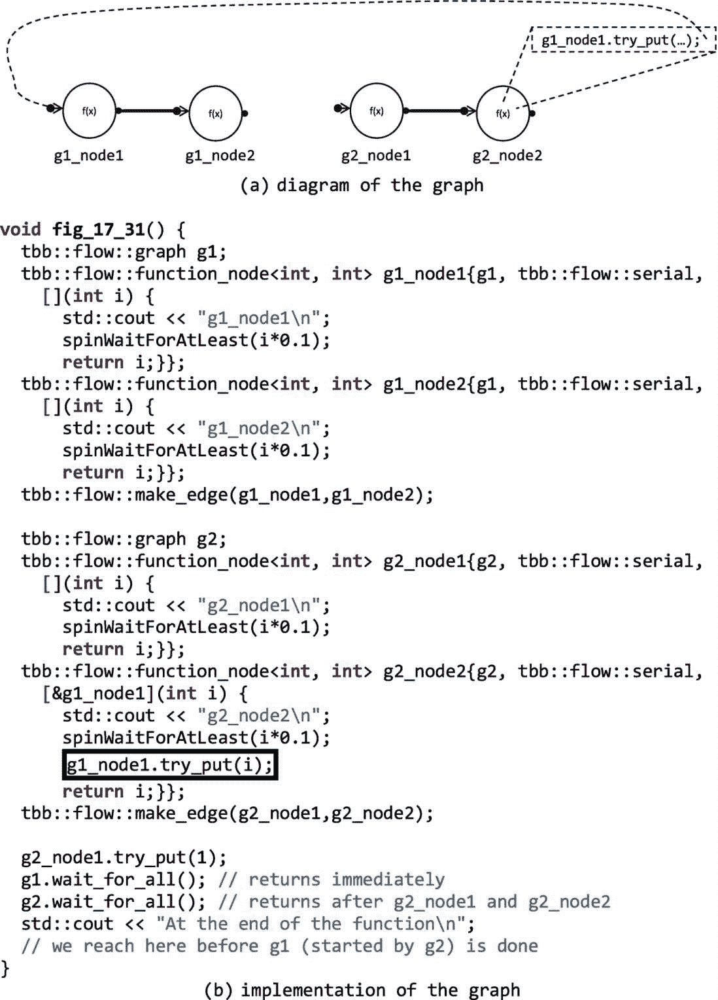

图 17-31

向另一个流程图发送消息的流程图

幸运的是，如果我们以相反的顺序调用等待，事情会像预期的那样进行:

```cpp

g2.wait_for_all();
g1.wait_for_all();

```

但是，我们仍然可以看到使用显式`try_puts`并非没有危险。当图形相互通信时，我们需要非常小心！

### Do:使用`composite_node`封装节点组

在前两节中，我们警告过图之间的通信会导致错误。开发人员经常使用不止一个图，因为他们想在逻辑上将一些节点与其他节点分开。如果有一个需要多次创建的公共模式，或者如果在一个大的平面图中有太多的细节，那么封装一组节点是很方便的。

在这两种情况下，我们都可以使用一个`tbb::flow::composite_node`。一个`composite_node`用于封装其他节点的集合，这样它们就可以像一个一级图节点一样使用。其界面如下:

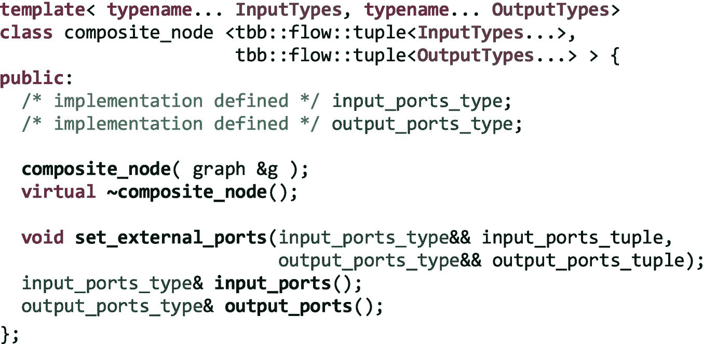

与我们在本章和第 [3](03.html#b978-1-4842-4398-5_3) 章中讨论的其他节点类型不同，我们需要创建一个从`tbb::flow::composite_node`继承的新类来使用它的功能。例如，让我们考虑图 [17-32(a)](#Fig32) 中的流程图。该图结合了来自`source1`和`source2`的两个输入，并使用令牌传递方案来限制内存消耗。


图 17-32

一个受益于`composite_node`的例子

如果这种令牌传递模式在我们的应用程序中经常使用，或者被我们开发团队的成员使用，那么将它封装到它自己的节点类型中可能是有意义的，如图 [17-32(b)](#Fig32) 所示。它还通过隐藏细节来清理应用程序的高级视图。

图 [17-33](#Fig33) 显示了如果我们有一个节点实现了图 [17-32(a)](#Fig32) 的虚线部分，用一个单独的`merge`节点代替它，流程图实现看起来会是什么样子。在图 [17-33](#Fig33) 中，我们像任何其他流图节点一样使用`merge`节点对象，为其输入和输出端口创建边。图 [17-34](#Fig34) 显示了我们如何使用`tbb::flow::composite_node`来实现我们的`MergeNode`类。

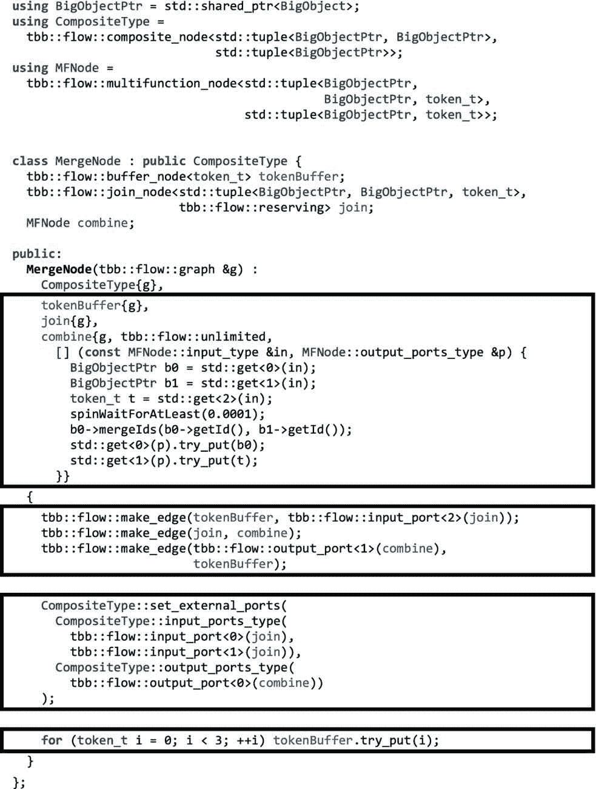

图 17-34

`MergeNode`的实施


图 17-33

创建使用从`tbb::flow::composite_node`继承的类`MergeNode`的流图

在图 [17-34](#Fig34) 中，`MergeNode`继承了`CompositeType`，T1 是的别名

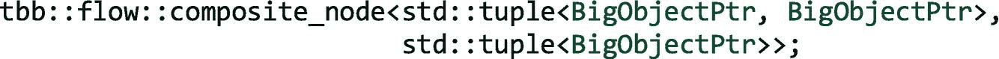

两个模板参数表明一个`MergeNode`将有两个输入端口，两个都接收`BigObjectPtr`消息，还有一个输出端口发送`BigObjectPtr`消息。类`MergeNode`封装的每个节点都有一个成员变量:一个`tokenBuffer`、一个`join`和一个`combine`节点。并且这些成员变量在`MergeNode`构造器的成员初始化列表中初始化。在构造器体中，对`tbb::flow::make_edge`的调用设置了所有的内部边。对`set_external_ports`的调用用于将成员节点的端口分配给`MergeNode`的外部端口。在这种情况下，`join`的前两个输入端口成为`MergeNode`的输入，`combine`的输出成为`MergeNode`的输出。最后，因为节点正在实现令牌传递方案，所以用令牌填充了`tokenBuffer`。

虽然创建一个继承自`tbb::flow::composite_node`的新类型一开始可能会令人望而生畏，但是使用这个接口可以产生更可读和可重用的代码，特别是当你的流程图变得更大更复杂的时候。

## 英特尔顾问简介:流程图分析器

英特尔 Parallel Studio XE 2019 及更高版本中提供了流图分析器(FGA)工具。它是作为英特尔顾问工具的一项功能提供的。获取工具的说明可在 [`https://software.intel.com/en-us/articles/intel-advisor-xe-release-notes`](https://software.intel.com/en-us/articles/intel-advisor-xe-release-notes) 找到。

开发 FGA 是为了支持使用 TBB 流图 API 构建的图形的设计、调试、可视化和分析。也就是说，FGA 的许多功能对于分析计算图都是有用的，不管它们来自哪里。目前，该工具对包括 OpenMP API 在内的其他并行编程模型的支持有限。

出于本书的目的，我们将只关注工具中的设计和分析工作流如何应用于 TBB。我们也用 FGA 来分析本章中的一些样本。然而，本章介绍的所有优化都可以在有或没有 FGA 的情况下完成。所以，如果你对使用 FGA 没有兴趣，你可以跳过这一节。但是，我们相信这个工具有很大的价值，所以跳过它将是一个错误。

### FGA 设计工作流程

FGA 的设计工作流让我们可以图形化地设计 TBB 流图，验证它们的正确性，评估它们的可伸缩性，并且在我们对设计满意之后，生成一个使用 TBB 流图类和函数的 C++ 实现。FGA 不像微软的 Visual Studio、Eclipse 或 Xcode 那样是一个完全集成的开发环境(IDE)。相反，它让我们开始我们的流程图设计，但是我们需要跳出工具来完成开发。然而，如果我们以一种受约束的方式使用设计工作流，正如我们将在后面描述的，在设计器中进行迭代开发是可能的。

图 [17-35](#Fig35) 显示了设计工作流程中使用的 FGA 图形用户界面。在这里，我们将仅简要描述该工具的组件，因为我们描述了典型的工作流；流程图分析器文档提供了更完整的描述。

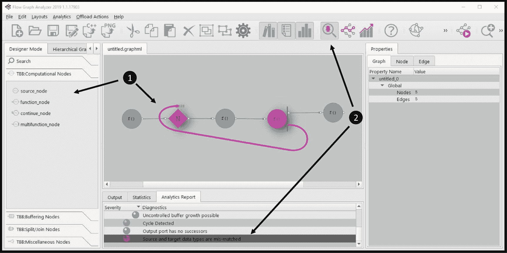

图 17-35

使用 FGA 设计工作流程

典型的设计工作流程从空白画布和项目开始。如图 [17-35](#Fig35) 中编号为 1 的黑色圆圈所示，我们在节点调色板中选择节点，并将它们放置在画布上，通过绘制端口之间的边将它们连接在一起。节点面板包含 TBB 流图界面中所有可用的节点类型，并提供工具提示，提醒我们每种类型的功能。对于画布上的每个节点，我们可以修改其特定于类型的属性；例如，对于一个`function_node`，我们可以为主体提供 C++ 代码，设置并发限制，等等。我们还可以提供一个估计的“权重”,表示节点的计算复杂度，以便稍后我们可以运行一个可伸缩性分析，看看我们的图是否会表现良好。

一旦我们在画布上绘制了图形，我们就运行一个规则检查来分析图形，寻找常见的错误和反模式。在图 [17-35](#Fig35) 中用黑色圆圈 2 突出显示的规则检查结果显示了诸如不必要的缓冲、类型不匹配、图中可疑循环等问题。在图 [17-35](#Fig35) 中，规则检查发现在我们的`limiter_node`的输入和我们的`multifunction_node`的输出之间存在类型不匹配。作为响应，我们可以修改`multifunction_node`的端口输出类型来解决这个问题。

当我们修复了规则检查发现的所有正确性问题后，我们就可以运行可伸缩性分析了。可伸缩性分析在内存中构建了一个 TBB 流图，用虚拟体替换了计算节点体，虚拟体在与它们的“重量”属性成比例的时间内活跃地旋转。FGA 在不同数量的线程上运行我们的图表模型，并提供了一个加速表，例如:


使用这些特性，我们可以迭代地改进我们的图形设计。在这个过程中，我们可以将图形设计保存为 GraphML 格式(一种表示图形的通用标准)。当我们对我们的设计满意时，我们可以生成 C++ 代码，该代码使用 TBB 流图接口来表达我们的设计。这个代码生成器更准确地说是一个代码向导，而不是 IDE，因为它不直接支持迭代代码开发模型。如果我们更改了生成的代码，就没有办法将我们的更改重新导入到工具中。

#### FGA 迭代开发技巧

如果我们想创建一个可以在 FGA 内部继续调优的设计，我们可以使用一种受约束的方法，在这种方法中，我们指定重定向到在 FGA 之外维护的实现的节点体。这是必要的，因为没有办法将修改后的 C++ 代码重新导入 FGA。

例如，如果我们想使迭代开发更容易，我们不应该指定一个直接在主体代码中公开其实现的`function_node`:

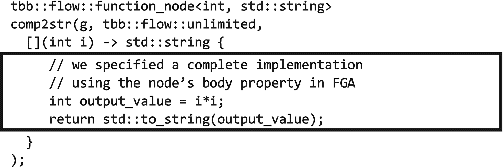

相反，我们应该只指定接口，并重定向到可以单独维护的实现:


如果我们采用这种受约束的方法，我们通常可以维护 FGA 中的图设计及其`GraphML`表示，迭代地调整拓扑和节点属性，而不会丢失我们在工具之外所做的任何节点体实现更改。每当我们从 FGA 生成新的 C++ 代码时，我们简单地包括最新的实现头，节点体使用这些在工具外部维护的实现。

当然，流图分析器并不要求我们使用这种方法，但是如果我们想将 FGA 的代码生成功能用作一个简单的代码向导，这是一个很好的实践。

### FGA 分析工作流程

FGA 的分析工作流独立于设计工作流。虽然我们肯定可以分析在 FGA 设计的流程图，但是我们也可以轻松地分析在工具之外设计和实现的 TBB 流程图。这是可能的，因为 TBB 库被设计为向 FGA 跟踪收集器提供运行时事件。从 TBB 应用程序中收集的跟踪信息让 FGA 重建了图结构和节点体执行的时间线——它确实 ***而不是*** 依赖于在设计工作流程中开发的 GraphML 文件。

如果我们想用`FGA`来分析一个使用流图的 TBB 应用程序，第一步是收集一个 FGA 轨迹。默认情况下，TBB 不会生成跟踪，所以我们需要激活跟踪收集。TBB 的 FGA 仪器是 TBB 2019 年之前的预览功能。如果我们使用的是旧版本的 TBB，我们需要采取额外的步骤。我们建议读者参考 FGA 文档，了解如何为他们正在使用的 TBB 和 FGA 版本收集跟踪信息。

一旦我们跟踪了我们的应用程序，FGA 的分析工作流将使用图 [17-36](#Fig36) 中用数字圆圈突出显示的活动:(1)检查树形图视图以了解图形性能的概况，并将其用作图形拓扑显示的索引，(2)运行关键路径算法以确定计算过程中的关键路径，以及(3)检查时间轴和并发数据以了解性能随时间的变化。分析通常是一个交互过程，随着应用程序性能的探索，它在这些不同的活动之间移动。


图 17-36

使用 FGA 分析工作流程。这些结果是在具有 16 个内核的系统上收集的。

图 [17-36](#Fig36) 中标为(1)的树形图视图提供了一个图表的整体健康状况的概览。在树形图中，每个矩形的面积表示节点的总 CPU 时间，每个正方形的颜色表示在节点执行期间观察到的并发性。并发信息分为差(红色)、好(橙色)、好(绿色)和超额预订(蓝色)。

标记为“差”的大面积节点是热点，其平均并发性在硬件并发性的 0%到 25%之间。因此，这些是优化的良好候选。树形图视图也可以作为大图的索引；单击正方形将突出显示图表中的节点，选择该突出显示的节点将依次在时间轴跟踪视图中标记该节点的所有实例的任务。

图形拓扑画布与工具中的其他视图同步。在树状图视图、时间线或数据分析报告中选择一个节点将在画布中突出显示该节点。这使得用户可以快速地将性能数据与图形结构联系起来。

FGA 提供的最重要的分析报告之一是图表中的关键路径列表。当必须分析一个大而复杂的图形时，这个特性特别有用。计算关键路径的结果是形成关键路径的节点列表，如图 [17-36](#Fig36) 中标有(2)的区域所示。正如我们在第 [3](03.html#b978-1-4842-4398-5_3) 章中讨论的，依赖图加速的上限可以通过将图中所有节点花费的总时间除以最长关键路径上花费的时间 T <sub>1</sub> /T <sub>∞</sub> 来快速计算。此上限可用于设置应用程序潜在加速的预期，以图形表示。

图 [17-36](#Fig36) 中标为(3)的时间线和并发视图显示了映射到软件线程的泳道中的原始轨迹。使用这些跟踪信息，FGA 可以计算额外的派生数据，如每个节点的平均并发性和图执行过程中的并发性直方图。在每个线程泳道的上方，一个直方图显示了在那个时间点有多少节点是活动的。这个视图允许用户快速识别低并发的时间区域。在这些低并发区域点击时间轴上的节点，可以让开发人员在他们的图中找到导致这些瓶颈的结构。

### 诊断 FGA 的性能问题

在本章中，我们讨论了使用流程图时可能出现的一些潜在的性能问题。在本节中，我们将简要讨论如何在基于 TBB 的应用程序中使用 FGA 来研究这些问题。

#### 诊断 FGA 的粒度问题

就像我们的 TBB 通用循环算法一样，我们需要关注那些太小而无法从并行化中获益的任务。但是我们需要在这种关注与创建足够多的任务以允许我们的工作量扩展的需求之间取得平衡。特别是，正如我们在第 [3](03.html#b978-1-4842-4398-5_3) 章中所讨论的，如果串行节点成为计算中的瓶颈，那么它们的可伸缩性就会受到限制。

在图 [17-37](#Fig37) 所示的 FGA 时间线示例中，我们可以看到有一个名为`m`的黑暗串行任务，它会导致低并发区域。颜色表明该任务的长度约为 1 毫秒——这超过了有效调度的阈值，但从时间表来看，这似乎是一个序列化瓶颈。如果可能的话，我们应该将这个任务分解成可以并行调度的任务——或者通过分解成多个独立的节点，或者通过嵌套并行。


图 17-37

FGA 时间线根据任务的执行时间给任务着色。较轻的任务较小。

相比之下，在图 [17-37](#Fig37) 中，一些名为`n`的较小任务被并行执行。通过它们的颜色，看起来它们接近 1 微秒的阈值，因此我们可以在该区域的时间线中看到间隙，这表明可能存在一些不可忽略的调度开销。在这种情况下，如果可能的话，合并节点或使用一个`lightweight`策略来减少开销可能对我们有好处。

#### 在 FGA 识别慢拷贝

图 [17-38](#Fig38) 展示了我们如何在 FGA 识别慢拷贝。在该图中，我们从类似于图 [17-12](#Fig12) 的图的运行时间线中看到 100 毫秒的片段，但是这些图直接传递`BigObject`消息(图 [17-38(a)](#Fig38) 和`shared_ptr<BigObject>`消息(图 [17-38(b)](#Fig38) )。为了使构造看起来很昂贵，我们在`BigObject`构造器中插入了一个自旋等待，这样构造每个对象需要 10 毫秒——使得`BigObject`的构造时间和我们的`function_node`主体的执行时间相等。在图 [17-38(a)](#Fig38) 中，我们可以看到在节点间复制消息所花费的时间在时间线上表现为间隙。在图 [17-38(b)](#Fig38) 中，我们通过指针传递，消息传递时间可以忽略不计，因此看不到间隙。

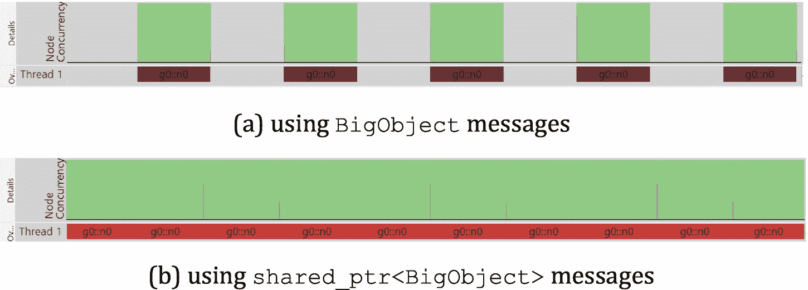

图 17-38

在 FGA 中，长副本显示为节点体执行之间的间隙。所示的每个时间线段大约 100 毫秒长。

当使用 FGA 分析我们的流程图应用程序时，时间线上的缺口表明效率低下，需要进一步调查。在本节中，他们指出了节点之间的高成本复制，在上一节中，他们指出了与任务大小相比，调度的开销很大。在这两种情况下，这些差距应该促使我们寻找提高性能的方法。

#### 使用 FGA 诊断兼职

在本章的前面，我们讨论了图 [17-23](#Fig23) 中的兼职图的执行，它产生了图 [17-24](#Fig24) 中的输出。FGA 在其执行时间表中提供了一个堆叠视图，让我们可以轻松发现兼职，如图 [17-39](#Fig39) 所示。

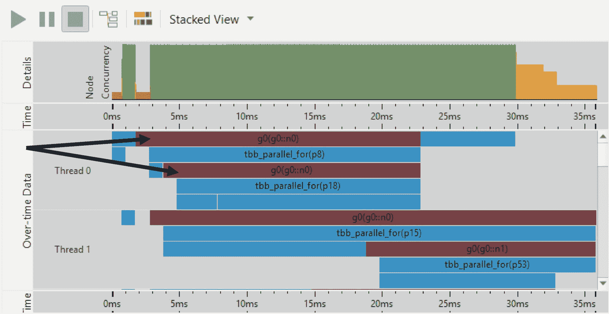

图 17-39

按节点/区域分组的 FGA 时间表。我们可以看到线程 0 正在兼职，因为它显示为并发执行多个并行区域。

在堆栈视图中，我们可以看到一个线程正在执行的所有嵌套任务，包括来自流图节点的任务和来自 TBB 通用并行算法的任务。如果我们看到一个线程同时执行两个节点，这就是兼职。例如，在图 [17-39](#Fig39) 中，我们看到线程 0 开始在现有的`n0`实例中执行节点`n0`的另一个实例。在我们之前关于兼职的讨论中，我们知道如果一个线程在等待嵌套并行算法完成时窃取工作，就会发生这种情况。图 [17-39](#Fig39) 中的堆叠视图，让我们很容易看到一个嵌套的`parallel_for`，标记为`p8`，是这种情况下的罪魁祸首。

使用来自 FGA 的时间轴视图，我们可以通过注意一个线程在多个区域或节点中的重叠参与来识别线程何时兼职。作为开发人员，可能通过与 FGA 的其他互动，我们需要确定兼职是良性的，还是需要通过 TBB 的隔离功能来解决。

## 摘要

流图 API 是一个灵活而强大的接口，用于创建依赖关系和数据流图。在本章中，我们讨论了使用 TBB 流程图高级执行接口时的一些更高级的注意事项。因为它是在 TBB 任务之上实现的，所以它共享 TBB 任务支持的可组合性和优化特性。我们讨论了如何利用这些来优化粒度、有效缓存和内存使用，并创建足够的并行性。然后，我们列出了一些在首次探索流程图界面时会有帮助的注意事项。最后，我们简要介绍了流图分析器(FGA)，这是英特尔 Parallel Studio XE 中的一款工具，支持 TBB 流图的图形设计和分析。

## 更多信息

迈克尔·沃斯，“英特尔线程构建模块流程图”，多布博士，2011 年 10 月 5 日。 [`www.drdobbs.com/tools/the-intel-threading-building-blocks-flow/231900177`](http://www.drdobbs.com/tools/the-intel-threading-building-blocks-flow/231900177) 。

Vasanth Tovinkere、Pablo Reble、Farshad Akhbari 和 Palanivel Guruvareddiar，“利用英特尔顾问的流图分析器提高代码性能”，《并行宇宙杂志》， [`https://software.seek.intel.com/driving-code-performance`](https://software.seek.intel.com/driving-code-performance) 。

Richard Friedman，“英特尔顾问的 TBB 流图分析器:让复杂的并行层更易于管理”，Inside HPC，2017 年 12 月 14 日， [`https://insidehpc.com/2017/12/intel-flow-graph-analyzer/`](https://insidehpc.com/2017/12/intel-flow-graph-analyzer/) 。

[](https://creativecommons.org/licenses/by-nc-nd/4.0) 

**开放存取**本章根据知识共享署名-非商业-非专用 4.0 国际许可协议(http://Creative Commons . org/licenses/by-NC-nd/4.0/)的条款进行许可，该协议允许以任何媒体或格式进行任何非商业使用、共享、分发和复制，只要您适当注明原作者和来源，提供知识共享许可协议的链接，并指出您是否修改了许可材料。根据本许可证，您无权共享从本章或其部分内容派生的改编材料。

本章中的图像或其他第三方材料包含在该章的知识共享许可中，除非该材料的信用额度中另有说明。如果材料未包含在本章的知识共享许可中，并且您的预期用途不被法定法规允许或超出了允许的用途，您将需要直接从版权所有者处获得许可。