# 2.通用设施

## 移动、前进、交换`<utility>`

本节解释`move()`、`move_if_noexcept()`、`forward()`、`swap()`和`exchange()`。顺便还介绍了移动语义和完美转发的概念。

### 移动的

如果某个对象的前一个用户不再需要它，可以将其移动到其他地方(而不是复制)。将资源从一个对象移动到另一个对象通常比(深度)复制它们更有效。例如，对于一个`string`对象，移动通常就像复制一个`char*`指针和一个长度(常数时间)一样简单；没有必要复制整个`char`数组(线性时间)。

除非另外指定，否则被移出的源对象处于未定义但有效的状态，除非重新初始化，否则不应再使用。例如，移动一个`std::string`(参见第 [6 章](6.html))的有效实现可以将源的`char*`指针设置为`nullptr`，以防止数组被删除两次，但这不是标准所要求的。同样，也没有说明`length()`被移走后将返回什么。某些操作，尤其是赋值，仍然是允许的，如下例所示:


尽管名字如此，`std::move()`函数在技术上并不移动任何东西:相反，它只是简单地标记一个给定的`T`、`T&`或`T&&`值可以被移动，实际上是通过静态地将它转换成一个右值引用`T&&`。由于类型强制转换，其他函数可能会被重载决策选择，和/或值参数对象可能会使用它们的移动构造函数(形式为`T(T&& t)`)进行初始化，如果可用的话，而不是它们的复制构造函数。这种初始化发生在被调用方，而不是调用方。一个右值参数`T&&`强制调用者总是移动。

类似地，也可以使用移动赋值操作符(形式为`operator=(T&&)`)将一个对象移动到另一个对象:

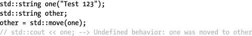

如果没有定义移动成员，无论是显式的还是隐式的，`T&&`的重载解析回退到`T&`或`T`，在后一种情况下仍然创建一个副本。生成隐式移动成员的条件包括不能有任何用户定义的复制、移动或析构成员，也不能有任何不能移动的非静态成员变量或基类。

`move_if_noexcept()`函数类似于`move()`，除了如果`T`的 move 构造函数已知不从其异常规范中抛出(`noexcept`，或已弃用的`throw()`)，它只向`T&&`进行强制转换；否则，它强制转换为`const T&`。

标准定义的所有类都有适当的移动成员。例如，第三章中的许多容器可以在固定时间内移动(不是`std::array`，尽管它会移动单个元素以避免深度复制)。

Tip

对于重要的自定义类型，为了获得最佳性能，不仅定义移动成员至关重要，而且始终使用`noexcept`说明符来定义成员也同样重要。第三章[中的容器类广泛使用移动来加速操作，比如添加一个新元素，或者重新定位元素数组(例如，用顺序容器)。类似地，如果提供有效的移动成员(和/或非成员操作，稍后讨论),第 4 章](3.html)[的许多算法都会受益。但是，尤其是在移动元素数组时，这些优化通常只有在已知值的移动成员不抛出时才会生效。](4.html)

### 促进

`std::forward()` helper 函数旨在模板化函数中使用，以便在保留任何 move 语义的同时有效地将其参数传递给其他函数。如果`forward<T>()`的参数是一个左值引用`T&`，那么这个引用将被原封不动地返回。否则，参数被转换为右值引用`T&&`。一个例子将阐明它的预期用途:


`good_fwd()`用的成语叫完美转发。它最佳地保留了右值引用(比如那些`std::move()` d 或临时对象)。这个习惯用法的第一个要素是所谓的转发或通用引用:一个`T&&`参数，一个`T`模板类型参数。如果没有它，模板参数演绎将删除所有引用:对于`ugly_fwd()`；`A&`和`A&&`都变成了`A`。有了转发引用，分别推导出`A&`和`A&&`:也就是说，即使转发引用看起来像`T&&`，如果传递了`A&`，则推导出`A&`而不是`A&&`。尽管如此，仅使用转发引用是不够的，如`bad_fwd()`所示。当按原样使用命名变量`t`时，它与一个左值函数参数绑定(所有命名变量都这样)，即使其类型被推断为`A&&`。这就是`std::forward<T>()`的用武之地。与`std::move()`类似，它会转换为`T&&`，但前提是给定一个右值类型的值(包括类型为`A&&`的命名变量)。

所有这些都很微妙，更多的是关于 C++ 语言(特别是类型演绎)而不是标准库。这里的要点是，为了将函数模板的参数正确地转发给函数，您应该考虑使用完美转发——也就是说，转发引用与`std::forward()`相结合。

### 交换

`std::swap()`模板函数交换两个对象，好像实现为:

```cpp
template<typename T> void swap(T& one, T& other)
{ T temp(std::move(one)); one = std::move(other); other = std::move(temp); }

```

还定义了一个类似的`swap()`函数模板来分段交换等长`T[N]`数组的所有元素。

虽然如果有合适的移动成员就已经很有效了，但是为了获得真正的最佳性能，您应该考虑专门化这些模板函数:例如，消除移动到临时。比如第四章[的很多算法都调用这个非成员`swap()`函数。对于标准类型，`swap()`在适当的地方已经定义了专门化。](4.html)

与`swap()`类似的一个函数是`std::exchange()`，它在返回旧值的同时给某物赋予一个新值。有效的实现是

```cpp
template<typename T, typename U=T> T exchange(T& x, U&& new_val)
  { T old_val(std::move(x)); x = std::forward<U>(new_val); return old_val; }

```

Tip

尽管`swap()`和`exchange()`可能在`std`名称空间中被特殊化，但是大多数人建议将它们特殊化到与它们的模板参数类型相同的名称空间中。这样做的好处是所谓的参数相关查找(ADL)是可行的。换句话说，例如`swap(x,y)`不需要`using`指令或声明，也不需要指定`swap()`的名称空间。ADL 规则基本上规定，非成员函数应该首先在其参数的名称空间中查找。如果需要的话，通用代码应该使用下面的习惯用法回到`std::swap()`:`using std::swap; swap(x,y);`。简单地编写`std::swap(x,y)`将不会在`std`名称空间之外使用用户定义的`swap()`函数，而单独的`swap(x,y)`将不会工作，除非有这样的用户定义函数。

## 对和元组

### 配对`<utility>`

`std::pair<T1,T2>`模板`struct`是一个可复制的、可移动的、可交换的(按字典顺序)可比较的`struct`，它在其公共成员变量`first`和`second`中存储了一对`T1`和`T2`值。默认构造的对对其值进行零初始化，但也可以提供初始值:

```cpp
std::pair<unsigned int, Person> p(42u, Person("Douglas", "Adams"));

```

使用辅助功能`std::make_pair()`可以自动推导出两个模板类型参数:

```cpp
auto p = std::make_pair(42u, Person("Douglas", "Adams"));

```

Tip

不是所有的类型都可以被有效地移动，并且在构造一个对的时候必须被复制。对于较大的对象(例如，包含固定大小数组的对象)，这可能是一个性能问题。其他类型甚至根本不可复制。对于这种情况，`std::pair`有一个特殊的“分段”构造函数来执行其两个成员的就地构造。它是用一个特殊的常量调用的，后跟两个元组(见下一节),其中包含要转发给两个成员的构造函数的参数。

例如(`forward_as_tuple()`用于不将字符串复制到临时元组):

```cpp
   std::pair<unsigned, Person> p(std::piecewise_construct,
      std::make_tuple(42u), std::forward_as_tuple("Douglas", "Adams"));

```

分段构造也可以与第 [3](3.html) 章中容器的`emplace()`函数一起使用(这些函数的定义类似，以避免不必要的复制)，特别是与`std::map`和`std::unordered_map`的函数一起使用。

### 元组〔t0〕

`std::` `tuple`是`pair`的推广，允许存储任意数量的值(即零个或更多，而不仅仅是两个):`std::tuple<Type...>`。大部分类似于`pair`，包括`make_tuple()`辅助功能。主要区别在于单个值不存储在公共成员变量中。相反，您可以使用`get()`模板函数之一来访问它们:

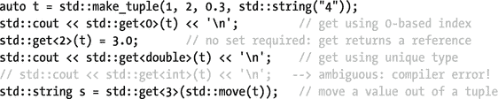

获取`tuple`值的另一种方法是使用`tie()`函数解包。特殊的`std::ignore`常量可用于排除任何值:

```cpp
int one, two; double three;
std::tie(one, two, three, std::ignore) = t;

```

Tip

`std::tie()`函数可用于基于多个值紧凑地实现字典式比较。例如，简介中的`Person`类的`operator<`主体可以写成

```cpp
return std::tie(lhs.m_isVIP, lhs.m_lastName, lhs.m_firstName)
     < std::tie(rhs.m_isVIP, rhs.m_lastName, rhs.m_firstName);

```

还有两个助手`struct`用于获取给定元组的大小和元素类型，这在编写通用代码时非常有用:

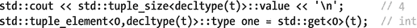

注意`pair`和`std::array`(见第 [3 章](3.html))在各自的头中也定义了`get()`、`tuple_size`和`tuple_element`，但没有定义`tie()`。

`tuple` s 的最后一个帮助函数是`std::forward_as_tuple()`，它创建了一个引用其参数的元组。这些通常是左值引用，但是保留右值引用，就像前面解释的`std::forward()`一样。它被设计为将参数转发给`tuple`的构造函数(也就是说，同时避免复制)，特别是在通过值接受元组的函数的上下文中。例如，函数`f(tuple<std::string, int>)`可以如下调用:`f(std::forward_as_tuple("test", 123));`。

元组也为自定义分配器提供了便利，但是这是一个高级主题，超出了本书的范围。

## 关系运算符`<utility>`

在`std::rel_ops`名称空间中提供了一组很好的关系操作符:`!=`、`<=`、`>`和`>=`。第一个按照`operator==`实现，其余的转发到`operator<`。所以，你的类只需要实现`operator==`和`<`，其他的都是在你添加一个`using namespace std::rel_ops;`时自动生成的


## 智能指针`<memory>`

智能指针是一个 RAII 样式的对象，它(通常)修饰并模仿一个指向堆分配内存的指针，同时保证在适当的时候总是释放这些内存。作为一条规则，现代 C++ 程序不应该使用原始指针来管理(共有的)动态内存:所有由`new`或`new[]`分配的内存都应该由一个智能指针来管理，或者，对于后者，由一个容器来管理，比如`vector`(参见第 [3 章](3.html))。因此，C++ 程序应该很少再直接调用`delete`或`delete[]`。这样做将大大有助于防止内存泄漏。

### 独占所有权指针

#### 标准::唯一 _ 指针

一个`unique_ptr`独占一个指向堆内存的指针，因此不能被复制，只能被移动或交换。除此之外，它的行为很像一个普通的指针。下面说明了它在堆栈上的基本用法:


`->`和`*`操作符确保了`unique_ptr`通常可以像原始指针一样使用。比较运算符`==`、`!=`、`<`、`>`、`<=`和`>=`用于比较两个`unique_ptrs`或一个`unique_ptr`与`nullptr`(按任意顺序)，但不用于比较一个`unique_ptr<T>`与一个`T`值。要实现后者，必须调用`get()`来访问原始指针。一个`unique_ptr`也方便地转换成一个布尔值来检查`nullptr`。

使用助手功能`make_unique()`有助于构建。例如:

```cpp
{ auto jeff = std::make_unique<Person>("Jeffrey");
  ...

```

Tip

使用`make_unique()`不仅可以缩短代码，还可以防止某些类型的内存泄漏。考虑一下`f(unique_ptr<X>(new X), g())`。如果`g()`在`X`被构造之后，但是在它被分配给它的`unique_ptr`之前抛出，那么`X`指针就会泄漏。相反，编写`f(make_unique<X>(), g())`可以保证这种泄漏不会发生。

使它们成为真正重要的实用工具的其他用途包括:

*   它们是转移独占所有权的最安全和推荐的方法，要么从创建堆对象的函数返回一个`unique_ptr`，要么将一个作为参数传递给接受进一步所有权的函数。这有三个主要优点:在这两种情况下，通常都必须使用`std::move()`，使得所有权转移显式。预期的所有权转移也从函数的签名中变得显而易见。它可以防止内存泄漏(这种错误有时很微妙:参见下一篇技巧)。
*   它们可以安全地存放在第 [3 章](3.html)的容器中。
*   当用作另一个类的成员变量时，它们消除了在析构函数中显式`delete`的需要。此外，它们防止编译器为应该独占动态内存的对象生成容易出错的副本成员。

A `unique_ptr`也可以管理用`new[]`分配的内存:


对于这个模板专门化，解引用操作符`*`和`->`被替换为索引数组访问操作符`[]`。一个更强大更方便的管理动态数组的类`std::vector`，在第 [3 章](3.html)中解释。

一个`unique_ptr<T>`有两个相似的成员经常被混淆:`release()`和`reset(T*=nullptr)`。前者用`nullptr`替换旧的存储指针(如果有的话)，而后者用给定的`T*`替换。关键区别在于`release()`不删除旧指针。相反，`release()`旨在释放存储指针的所有权:它只是将存储指针设置为`nullptr`并返回它的旧值。这有助于将所有权传递给例如遗留 API。另一方面，`reset()`旨在用新值替换存储的指针，不一定是`nullptr`。在覆盖旧指针之前，它会被删除。因此，它也不返回任何值:

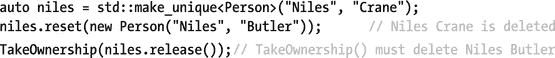

Tip

使用`release()`转移所有权时，注意内存泄漏。假设前面的例子以`TakeOwnership(niles.release(), f())`结束。如果对`f()`的调用在`unique_ptr`拥有`release` d 的所有权后抛出，奈尔斯泄密。因此，始终确保包含`release()`子表达式的表达式也不包含任何抛出子表达式。在本例中，解决方案是在前面的行中计算`f()`，将其结果存储在一个已命名的变量中。前面推荐的用`std::move(niles)`传输，顺便说一下也绝对不会漏。但是，对于遗留 API，这并不总是一个选项。

Caution

一个相当常见的错误是在应该使用`reset()`的地方使用`release()`，后者使用默认的`nullptr`参数，忽略由`release()`返回的值。先前由`unique_ptr`拥有的物品随后泄露，这通常不会被注意到。

的一个高级特性是他们可以使用自定义的删除器。删除器是销毁所拥有的指针时执行的函子。这对于非默认内存分配很有用，可以进行额外的清理，或者，例如，管理由 C 函数`fopen()`(在`<cstdio>`中定义)返回的文件指针:

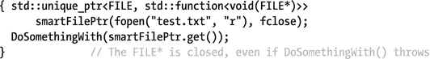

这个例子使用了一个类型为`std::function`(在`<functional>`头中定义，将在本章后面讨论)的删除器，它用一个函数指针初始化，但是也可以使用任何仿函数类型。

#### std::自动 _ptr

在编写时，`<memory>`头仍然为独占所有权定义了第二种智能指针类型，即`std::auto_ptr`。然而，在 C++11 中，这已经被弃用，取而代之的是`unique_ptr`，并且在 C++17 中将被移除。因此，我们不详细讨论它。本质上，`auto_ptr`是一个有缺陷的`unique_ptr`，在复制时被隐式移动:这使得它们不仅容易出错，而且与第 [3](3.html) 和 [4](4.html) 章中的标准容器和算法一起使用也很危险(事实上是非法的)。

### 共享所有权指针

#### 标准::共享 _ptr

当多个实体共享同一个堆分配的对象时，为它分配一个所有者并不总是显而易见或可能的。对于这种情况，`shared_ptr` s 存在，在`<memory>`中定义。这些智能指针为一个共享内存资源维护一个线程安全的引用计数，一旦它的引用计数达到零，它就会被删除:也就是说，一旦最后一个共同拥有它的`shared_ptr`被析构。`use_count()`成员返回引用计数，`unique()`检查计数是否等于 1。

像`unique_ptr`一样，它有`->`、`*`、转换为布尔和比较操作符来模拟原始指针。同样提供等效的`get()`和`reset()`成员，但没有`release()`。然而,`shared_ptr`不能管理动态数组。真正让它与众不同的是`shared_ptr` s 可以而且打算被复制:

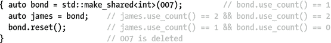

一个`shared_ptr`可以通过将一个`unique_ptr`移动到其中来构造，但不能反过来。为了构造一个新的`shared_ptr`，再次推荐使用`make_shared()`:原因与`make_unique()`(更短的代码和内存泄漏预防)相同，但在这种情况下也是因为它更有效。

再次支持自定义删除器。然而，与`unique_ptr`不同的是，删除者的类型不是`shared_ptr`模板的类型参数。因此，类似于前面示例中的声明变成了:

```cpp
std::shared_ptr<FILE> smartFilePtr(fopen("test.txt", "r"), fclose);

```

要获得相关类型的`shared_ptr`，请使用`std::static_pointer_cast()`、`dynamic_pointer_cast()`或`const_pointer_cast()`。如果结果不是`null`，引用计数安全地增加 1。一个例子将阐明:


`shared_ptr` s 的一个鲜为人知的特性叫做别名，用于共享已经共享的对象的部分。最好用一个例子来介绍:


一个`shared_ptr`既有自己的指针又有存储的指针。前者决定引用计数，后者由`get()`、`*`和`->`返回。通常两者是相同的，但如果用别名构造函数构造就不同了。几乎所有的操作都使用存储的指针，包括比较运算符`<`、`>=`等等。为了基于拥有的指针而不是存储的指针进行比较，使用`owner_before()`成员或`std::owner_less<>`仿函数类(仿函数将很快解释)。例如，当将`shared_ptr`存储在`std::set`中时，这很有用(参见第 [3 章](3.html))。

#### 标准::弱 _ 指针

有时，尤其是在构建共享对象的缓存时，您希望在需要时保留对共享对象的引用，但又不希望引用必然会阻止对象的删除。这个概念通常被称为弱引用，由`<memory>`以`std::weak_ptr`的形式提供。

一个非空的`weak_ptr`由一个`shared_ptr`构成，或者是后来给它赋值一个`shared_ptr`的结果。这些指针可以自由地复制、移动或交换。虽然一个`weak_ptr`并不共同拥有这个资源，但是它可以访问它的`use_count()`。为了检查共享资源是否仍然存在，也可以使用`expired()`(相当于`use_count()==0`)。然而，`weak_ptr`不能直接访问共享的原始指针，因为没有什么可以阻止最后一个共有者同时删除它。要访问资源，首先必须使用`lock()`成员将`weak_ptr`提升为共有`shared_ptr`:


## 功能对象`<functional>`

函数对象或仿函数是带有`operator()(T1,...,Tn)` ( `n`可能为零)的对象，允许它像函数或运算符一样被调用:


函子不仅可以传递给许多标准算法(第[章第 4](4.html) 节)和并发构造(第[章第 7](7.html) 节)，而且对于创建你自己的通用算法也非常有用，例如，存储或提供回调函数。

本节概述了在`<functional>`中定义的函子，以及创建和使用函子的工具。 [<sup>1</sup>](#Fn1) 我们还将简要介绍 lambda 表达式，这是一种强大的 C++11 语言构造，用于创建函子。

不过，在我们深入研究函子之前，先简单介绍一下在`<functional>`头文件中定义的引用包装器实用程序。

### 参考包装

函数`std::ref()`和`cref()`返回`std::reference_wrapper<T>`实例，这些实例简单地包装了对其输入参数的(`const` ) `T&`引用。然后，可以使用`get()`显式提取该引用，或者通过强制转换为`T&`隐式提取该引用。

因为这些包装器可以被安全地复制，所以它们可以被用来传递对模板函数的引用，这些模板函数通过值获取它们的参数，错误地转发它们的参数(转发在本章前面已经讨论过了)，或者出于其他原因复制它们的参数。不接受引用作为参数，但使用`ref()` / `cref()`的标准模板函数包括`std::thread()`和`async()`(参见第 [7 章](7.html))，以及稍后讨论的`std::bind()`函数。

这些包装器也可以分配给，这样就可以将引用存储到第三章[的容器中。例如，在下面的例子中，您不能声明一个`vector<int&>`，因为`int&`的值不能赋给:](3.html)


### 预定义函子

`<functional>`头提供了一整个系列的仿函数`struct`,类似于本节介绍中前面使用的`my_plus`示例:

*   `plus`、`minus`、`multiplies`、`divides`、`modulus`和`negate`
*   `equal_to`、`not_equal_to`、`greater`、`less`、`greater_equal`和`less_equal`
*   `logical_and`、`logical_or`和`logical_not`
*   `bit_and`、`bit_or`、`bit_xor`和`bit_not`

这些函子通常会产生简短易读的代码，甚至比 lambda 表达式更容易理解。以下示例使用第 [4 章](4.html)中介绍的`sort()`算法对数组进行降序排序(默认为升序):

```cpp
int array[] = { 7, 9, 7, 2, 0, 4 };
std::sort(begin(array), end(array), std::greater<int>());

```

从 C++14 开始，所有这些仿函数类都有一个特殊的专门化，即`T`等于`void`,`void`也成为了默认的模板类型参数。这些被称为透明运算符函子，因为它们的函数调用运算符可以方便地推导出参数类型。例如，在前面的`sort()`示例中，您可以简单地使用`std::greater<>`。同一函子甚至可以用于不同的类型:

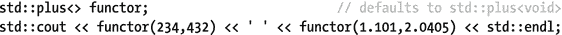

正如第 3 章[所解释的，透明的`std::less<>`和`greater<>`函子也是有序关联容器的首选比较函子。](3.html)

将一元/二元仿函数`predicate`传递给`std::not1()/not2()`会创建一个新的仿函数(类型为`unary_negate` / `binary_negate`)，该仿函数对`predicate`的结果求反(即计算结果为`!predicate()`)。为此，`predicate`的类型必须定义一个公共成员类型`argument_type`。`<functional>`中的所有函子类型都有这个。

### 通用函数包装

模板类是为包装任何类型的可调用实体而设计的:也就是说，任何类型的函数对象或指针。这包括，例如，`bind`或 lambda 表达式的结果(稍后将更详细地解释这两个表达式):


如果调用默认构造的`function`对象，就会抛出`std::bad_function_call`异常。为了验证一个`function`是否可以被调用，它方便地转换为一个布尔值。或者，您可以使用`==`或`!=`将`function`与`nullptr`进行比较，就像使用函数指针一样。

其他成员包括`target<Type>()`以获得指向包装实体的指针(必须指定正确的`Type`；否则成员返回`nullptr`，`target_type()`返回该包装实体的`type_info`(`type_info`将在本章后面的“类型实用程序”中解释)。

Tip

前面提到的`std::ref()`、`cref()`及其返回类型`reference_wrapper`的一个鲜为人知的特性是，它们也可以用来包装可调用函数。然而，与存储可调用对象副本的`std::function`不同的是，`reference_wrapper`存储的是对它的引用。这在将您不希望被复制的仿函数(例如，因为它太大(性能)、有状态或根本不可复制)传递给接受它或可能通过值传递它的算法时非常有用。例如:

```cpp
function_that_copies_its_callable_argument(std::ref(my_functor));

```

请注意，对于第 4 章中的标准算法，通常不指定它们多长时间复制一次参数。所以为了保证没有拷贝，你必须使用`(c)ref()`。

### 绑定函数参数

`std::bind()`函数可以用来包装任何可调用函数的副本，同时改变其签名:参数可以被重新排序，被赋予固定值，等等。为了指定将哪些参数转发给包装的可调用函数，一系列值或所谓的占位符(`_1`、`_2`等)被传递给`bind()`。传递给绑定函子的第一个参数被转发给占位符`_1`的所有实例，第二个被转发给`_2`的实例，依此类推。占位符的最大数量取决于具体的实现；并且返回的函子的类型是未指定的。一些例子将阐明:

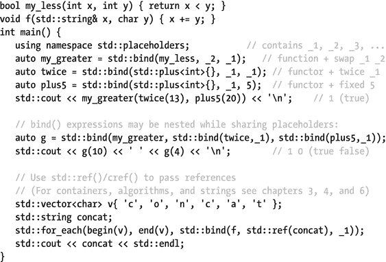

### 类成员的函子

前面介绍的`std::function`和`bind()`都可以用来创建仿函数，这些仿函数计算给定对象的成员变量，或者调用给定对象的成员函数。第三种选择是使用`std::mem_fn()`，它专门用于此目的:

```cpp
struct my_struct { int val; bool fun(int i) { return val == i; } };
int main() {
   my_struct s{234};

   std::function<int(my_struct&)> f_get_val = &my_struct::val;
   std::function<bool(my_struct&,int)> f_call_fun = &my_struct::fun;
   std::cout << f_get_val(s) << ' ' << f_call_fun(s, 123) << std::endl;

   using std::placeholders::_1;
   auto b_get_val = std::bind(&my_struct::val, _1);
   auto b_call_fun_on_s = std::bind(&my_struct::fun, std::ref(s), _1);
   std::cout << b_get_val(s) << ' ' << b_call_fun_on_s(234) << std::endl;

   auto m_get_val = std::mem_fn(&my_struct::val);
   auto m_call_fun = std::mem_fn(&my_struct::fun);
   std::cout << m_get_val(s) << ' ' << m_call_fun(s, 456) << std::endl;
}

```

由`bind()`和`mem_fn()`创建的成员函子，而不是`std::function`创建的成员函子，也可以用一个指针或一个标准智能指针(见上一节)作为第一个参数来调用(也就是说，不用解引用)。关于`bind()`选项的有趣之处还在于它可以绑定目标对象本身(参见`b_call_fun_on_s`)。如果这不是必需的，`std::mem_fn()`通常会产生最短的代码，因为它推导出了整个类型。更现实的例子是这样的(分别在第 [3](3.html) 、 [4](4.html) 和 [6](6.html) 章节中解释了`vector`、`count_if()`和`string`):

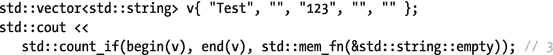

LAMBDA EXPRESSIONS

虽然不是标准库的一部分，但是 lambda 表达式是创建函子的强大工具，非常值得简单介绍一下。特别是，当与第 4 章[中的算法、第 7 章](4.html)中的并发结构等等结合起来时，它们通常构成了极具表现力的优雅代码的基础。在本书中可以找到几个 lambda 表达式的例子，尤其是在第 4 章[中。](4.html)

lambda 表达式通常被认为创建了一个匿名函数，但实际上它创建了一个未指定类型的函子，也称为闭包。lambda 表达式不必像`<functional>`构造那样从现有的函数开始:其闭包的函数调用操作符的主体可以包含任意代码。

lambda 表达式的基本语法如下:

```cpp
[CaptureBlock](Parameters) 

mutable -> ReturnType {Body}

```

`Capture block`:指定从封闭范围中捕获哪些变量。实际上，对于每个捕获的变量，创建的仿函数都有一个同名成员，如果是通过值捕获的，则包含该捕获变量的副本，如果是通过引用捕获的，则包含对该变量的引用。因此，这些变量在身体中变得可用。捕获块的基本语法:

*   `[]`不捕获变量(不能省略)。
*   `[x, &y]`通过值捕获`x`，通过引用捕获`y`。
*   `[=, &x]`通过值捕获封闭范围内的所有变量，除了`x`通过引用捕获。
*   `[&, x,y]`通过引用捕获所有变量，除了`x`和`y`通过值捕获。
*   `[this]`捕获`this`指针，授权主体访问周围对象的所有成员。

`Parameters`:调用仿函数时要传递的参数。省略等同于指定一个空列表`()`。参数类型可以是`auto`。

`mutable`:默认情况下，lambda 仿函数的函数调用操作符总是被标记为`const`，这意味着通过值捕获的变量(即复制到成员变量中的变量)不能被修改(赋值给被调用的非`const`成员，等等)。指定`mutable`使函数调用操作符非`const`。

`Return type`:返回值的类型。只要主体的所有返回语句返回完全相同的类型，就可以省略。

`Body`:调用 lambda 仿函数时要执行的代码(非可选)。

也可以指定`noexcept`和/或属性(在可选的`mutable`之后)，但是很少使用。

## 初始化列表`<initializer_list>`

C++ 编译器使用`initializer_list<T>`类型来表示初始化列表声明的结果:


这种花括号语法是创建非空初始化列表的唯一方法。一旦创建，`initializer_list`就不可改变。它们的几个操作`size()`、`begin()`和`end()`类似于容器的操作(第 [3 章](3.html))。当从一个初始化值列表中构造一个`initializer_list`时，该列表存储这些值的一个副本。然而，复制一个`initializer_list`并不会复制元素:新的副本只是引用相同的值数组。

最常见的用例可能是初始化列表构造函数，当使用花括号时，它们优先于其他构造函数，这一点很特别:

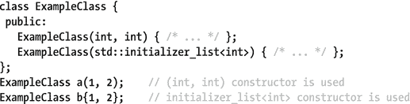

例如，第 3 章[的所有容器类都有初始化列表构造函数，用一个值列表来初始化它们。](3.html)

## 日期和时间实用程序`<chrono>`

`<chrono>`库引入了一些工具，主要用于跟踪不同精度的时间和持续时间，这由所使用的时钟类型决定。要处理日期，您必须使用 C 风格的日期和时间类型以及在`<ctime>`中定义的函数。来自`<chrono>`的`system_clock`允许与`<ctime>`的互操作性。

### 期间

A `std::chrono::duration<Rep, Period=std::ratio<1>>`将时间跨度表示为滴答计数，表示为通过`count()` ( `Rep`是或模拟算术类型)可获得的`Rep`值。两个连续分笔成交点之间的时间或周期由`Period`静态确定，一种表示秒数(或分数)的`std::ratio`类型(`std::ratio`在第 [1](1.html) 章中解释)。默认的`Period`是一秒钟:


只要不需要截断，`duration`构造函数可以在不同`Period`的`duration`和/或 count `Rep`表示之间进行转换。`duration_cast()`函数也可以用于截断转换:

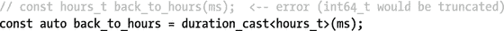

为了方便起见，在`std::chrono`名称空间中预定义了几个类似于前一个例子的`typedef`:`hours`、`minutes`、`seconds`、`milliseconds`、`microseconds`和`nanoseconds`。每个都使用未指定的有符号整数`Rep`类型，至少大到足以表示大约 1000 年的持续时间(`Rep`分别至少有 23、29、35、45、55 和 64 位)。为了进一步方便起见，名称空间`std::literals::chrono_literals`包含文字操作符，可以很容易地分别创建`duration`类型的实例:`h`、`min`、`s`、`ms`、`us`和`ns`。它们也可以通过`using namespace std::chrono`声明获得。当应用于浮点文字时，结果具有未指定的浮点类型，如`Rep`:


支持您直觉上期望使用`duration`的所有算术和比较运算符:`+`、`-`、`*`、`/`、`%`、`+=`、`-=`、`*=`、`/=`、`%=`、`++`、`--`、`==`、`!=`、`<`、`>`、`<=`和`>=`。例如，下面的表达式计算出带有`count() == 22`的`duration`:

```cpp
duration_cast<minutes>((12min + .5h) / 2 + (100ns >= 1ms? -3h : ++59s))

```

### 时间点

一个`std::chrono::time_point<Clock, Duration=Clock::duration>`代表一个时间点，表示为从一个`Clock`纪元开始的一个`Duration`。这个`Duration`可以从它的`time_since_epoch()`成员那里获得。历元被定义为被选作特定时钟的原点的时刻，即测量时间的参考点。下一节将介绍可用的标准`Clock`。

一个`time_point`通常最初是从它的`Clock`的类的成员中获得的。不过，它也可以由给定的`Duration`构建而成。如果默认构造，它代表`Clock`的纪元。几个算术(`+`、`-`、`+=`、`-=`)和比较(`==`、`!=`、`<`、`>`、`<=`、`>=`)再次可用。减去两个`time_point`得到一个`Duration`，并且`Duration`可以被加到一个`time_point`上或者从一个`time_point`上减去。不允许将`time_point`加在一起，也不允许从`Duration`中减去 1:

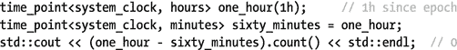

具有不同`Duration`类型的`time_point`之间的转换类似于`duration`的转换:只要不需要截断，就允许隐式转换；否则，可以使用`time_point_cast()`:

```cpp
auto one_hour = time_point_cast<hours>(sixty_minutes);

```

### 时钟

`The std::chrono`名称空间提供了三种时钟类型:`steady_clock`、`system_clock`和`high_resolution_clock`。所有时钟都定义了以下静态成员:

*   `now()`:返回当前时间点的函数。
*   `rep`、`period`、`duration`、`time_point`:具体实现类型。`time_point`是`now()`返回的类型:一个`std::chrono::time_point`的实例化，其`Duration`类型参数等于`duration`，进而等于`std::chrono::duration<rep, period>`。
*   `is_steady`:一个布尔常量，如果时钟滴答之间的时间是常数，并且连续两次调用`now()`总是返回`time_point` s `t1`和`t2`，其中`t1 <= t2`。

唯一保证稳定的时钟是`steady_clock`。也就是说，这个时钟不能调整。另一方面，`system_clock`对应于系统范围的实时时钟，通常可以由用户随意设置。最后，`high_resolution_clock`是库实现支持的周期最短的时钟(可能是`steady_clock`或`system_clock`的别名)。

为了测量一个操作花费的时间，应该使用一个`steady_clock`，除非你的实现的`high_resolution_clock`是稳定的:


`system_clock`应保留用于日历时间。因为`<chrono>`在这方面的功能有些有限，所以这个时钟提供了静态函数来将其`time_point`转换为`time_t`对象，反之亦然(分别为`to_time_t()`和`from_time_t()`)，然后可以与下一小节中讨论的 C 风格的日期和时间实用程序一起使用:


### c 风格的日期和时间实用程序`<ctime>`

`<ctime>`头定义了两种可互换的类型来表示日期和时间:`time_t`，算术类型的别名(一般是 64 位有符号整数)，以平台特定的方式表示时间；以及`tm`，一个便携的`struct`，带有这些字段:`tm_sec`(范围[ `0`、`60`，其中`60`用于闰秒)、`tm_min`、`tm_hour`、`tm_mday`(一个月中的某一天，范围[ `1`、`31`)、`tm_mon`(范围[ `0`、`11`)、`tm_year`(自 1900 年以来的年份)、`tm_wday`(范围[ `0`、`6`)，带有【T20)

以下功能可通过`<ctime>`使用。本地时区由当前活动的 C 语言环境决定(语言环境在第 [6](6.html) 章中解释):

<colgroup><col> <col></colgroup> 
| 功能 | 返回 |
| --- | --- |
| `clock()` | 一个`clock_t`(一种算术类型),以时钟节拍表示进程消耗的近似处理器时间；或`-1`失败时。时钟的周期存储在`CLOCKS_PER_SEC`常量中。虽然这个时钟是稳定的，但它可能会以不同于挂钟时间的速度运行(由于上下文切换而变慢，由于多线程而加速，等等)。 |
| `time()` | 当前时间点为故障时的`time_t`或`null`。必须传递一个`time_t*`参数:如果不传递`null`，值也会被写入其中。 |
| `difftime()` | 两个`time_t`之间的差值作为`double`值，表示以秒为单位的时间(结果可能为负)。 |
| `mktime()` | 从当地时区的`tm*`转换而来的`time_t`，或者失败时的`-1`。 |
| `localtime()` `gmtime()` | 一个指向静态分配的`tm`的指针，从给定的`time_t*`到本地/ GMT 时区的转换已被写入该指针，如果失败则为`null`。这些函数不是线程安全的:这个全局`tm`可能由`localtime()`、`gmtime()`和`ctime()`共享。 |
| `asctime()` `ctime()` | `A char*`指向全局缓冲区的指针，在该缓冲区中，给定的`tm*`或`time_t*`的(`null`-终止)文本表示被写入，使用固定的、独立于区域设置的格式。因此，它们都是有限的，并且不是线程安全的，所以它们已经被弃用，而代之以`strftime()`。 |
| `strftime()` | 接下来解释。 |

请查阅您的实现文档，以获得更安全的`localtime()`和`gmtime()`的替代方案(例如 Windows 的`localtime_s()`或 Linux 的`localtime_r()`)。对于将日期和时间转换成字符串，首选的 C 风格函数是`strftime()`(在本节的最后，我们指出了 C++ 风格的替代方法):

```cpp
size_t strftime(char* result, size_t n, const char* format, const tm*);

```

在`<cwchar>`中定义了转换为宽字符串(`wchar_t`序列)、`wcsftime()`的等价形式。这些函数将一个以`null`结尾的字符序列写入`result`，该字符序列必须指向一个预先分配的大小为`n`的缓冲区。如果这个缓冲区太小，则返回零。否则，返回值等于写入的字符数，不包括终止字符`null`。

指定所需文本表示的语法定义如下:`format`字符串中的任何字符都被复制到`result`，除了某些特殊说明符被替换，如下表所示:


<colgroup><col> <col> <col></colgroup> 
| 分类符 | 输出 | 范围或示例 |
| --- | --- | --- |
| `%M` / `%S` | 分钟/秒。 | `[00,59] / [00,60]` |
| `%H` / `%I` | 使用 24 小时/12 小时制的小时。 | `[00,23]` / `[01,12]` |
| `%R / %T` | 相当于`"%H:%M"` / `"%H:%M:%S"`。 | `04:29 / 04:29:00` |
| `%p / %r` | `A.m.`或`p.m. /`满 12 小时的时钟时间。 | `pm / 04:29:00 pm` |
| `%A` / `%a` | 完整/缩写的工作日名称。 | `Wednesday` / `Wed` |
| `%u` / `%w` | 工作日数字，其中范围内的第一个数字代表星期一/星期日。 | `[1-7]` / `[0-6]` |
| `%d` / `%e` | 一月中的某一天。 | `[01-31]` / `[1-31]` |
| `%j` | 一年中的某一天。 | `[001-366]` |
| `%U` / `%V` / `%W` | 一年中的星期，星期从星期日(`%U`)或星期一(`%V`、`%W`)开始；`%V`根据 ISO 8601 确定一年的第一周。 | `[00,53]    (%U,%W)` `/ [01,53]  (%V)` |
| `%B / %b, %h` | 完整/缩写月份名称(`%h`是`%b`的别名)。 | `October` / `Oct` |
| `%m` | 月份号。 | `[01-12]` |
| `%Y / %G` | 根据 ISO 8601，当前周所属年份/年份。 | `2015` |
| `%C / %y / %g` | 前(`%C` ) /后(`%y`、`%g`)两位数字的年份。`%g`根据 ISO 8601，使用当前周所属的年份。 | `20 / 15 / 15` |
| `%D / %F` | 相当于`"%m/%d/%y"` / `"%Y-%m-%d"`。 | `10/21/15 /` `2015-10-21` |
| `%c / %x / %X` | 首选日期+时间/日期/时间表示。 | (见下文) |
| `%Z / %z` | 如果可用(如果不可用则为空):时区名称或缩写/相对于 UTC 的偏移量为`"±hhmm"`。 | `PDT / -0700` |
| `%% / %t / %n` | 转义/特殊字符。 | `% / \t / \n` |

许多说明符的结果，包括那些扩展为名称或首选格式的说明符，取决于活动的语言环境(参见第 [6](6.html) 章)。例如，当使用法语语言环境执行时，上一个示例的输出可能是“`Today is mer. 21/11"`和`"10/21/15 16:29:00--10/21/15 16:29:00”`。要使用依赖于语言环境的替代表示法(如果当前语言环境定义了替代表示法)，`C`、`c`、`X`、`x`、`Y`和`y`前面可以有`E` ( `%EC`、`%Ec`等等)；为了使用替代数字符号，`d`、`e`、`H`、`I`、`M`、`m`、`S`、`u`、`U`、`V`、`W`、`w`和`y`可以用字母`O`进行修改。

如第 [5](5.html) 章所述，C++ 库也提供了从/向流中读取/写入`tm`的工具，即`get_time()`和`put_time()`。因此，`<ctime>`中唯一一个 C 风格的函数是`localtime()`(将`system_clock`的`time_t`转换成`tm)`)，你通常需要用 C++ 风格输出日历日期和时间。

## c 风格文件实用程序`<cstdio>`

下一版本的 C++ 标准库有望包含一个更强大的 C++ 风格的文件系统库。目前，`<cstdio>`头文件中有限的一组 C 风格函数是标准中唯一可用的可移植文件实用程序:

<colgroup><col> <col></colgroup> 
| 功能 | 描述 |
| --- | --- |
| `int remove(filename)` | 删除具有给定文件名的文件。成功时返回`0`。出现错误时是否设置`errno`(参见第 [8 章](8.html))取决于具体实现。 |
| `int rename(old, new)` | 名为`old`的文件被重命名为`new`。如果支持，文件也可以移动到不同的路径。成功时返回`0`。出现错误时是否设置`errno`(参见第 [8 章](8.html))取决于具体实施。 |
| `FILE* tmpfile()` | 使用为二进制输出生成的唯一名称打开新创建的文件。返回的`FILE*`指针可用于第 [5](5.html) 章中简要讨论的 C 型 I/O 功能。临时文件在关闭时会自动删除。无法创建文件时返回`nullptr`。 |
| `char* tmpnam(char*)` | 创建唯一的、不存在的文件名。如果提供了一个`char*`参数，那么结果将存储在这个指针中，指针也将被返回。提供的`char*`缓冲区必须至少有`L_tmpnam`字节长。如果参数是`nullptr`，则返回一个指向内部静态缓冲区的指针，文件名放在该缓冲区中。如果无法生成文件名，则返回`nullptr`。 |

## 类型实用程序

### 运行时类型识别<typeinfo>、</typeinfo>

C++ `typeid()`操作符用于获取一个值的运行时类型信息。它返回对在`<typeinfo>`中定义的`std::type_info`类的全局实例的引用。这些实例不能被复制，但是使用指向它们的引用或指针是安全的。使用它们的`==, !=`和`before()`成员可以进行比较，并且可以为它们计算一个`hash_code()`。特别有趣的是`name()`，它返回值的类型的特定于实现的文本表示:

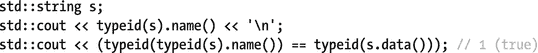

打印的`name()`可能类似于“`std::basic_string<char, std::char_traits<char>, std::allocator<char>>”`”(见第 [6 章](6.html))，但对于其他实现，它也可能是“`Ss”`”。

当用在指向派生类`D`实例的`B*`指针上时，如果`B`是多态的，即至少有一个`virtual`成员，那么`typeid()`只给出动态类型`D*`，而不是静态类型`B*`。

因为`type_info` s 不能被复制，所以它们不能直接用作第 [3](3.html) 章中关联数组的键。正是为了这个目的，`<typeindex>`头定义了`std::type_index`装饰器类:它模仿包装的`type_info&`的接口，但是它是可复制的；有`<`、`<=`、`>`、`>=`操作符；并为其定义了一个专门化`std::hash`。

### 类型特征`<type_traits>`

类型特征是一种构造，用于获取给定类型的编译时信息，或将一种或多种给定类型转换为相关类型。类型特征通常用于在编写泛型代码时检查和操作模板类型参数。

标题定义了许多特征。由于篇幅的限制，并且因为模板元编程是一个高级主题，本书无法对所有这些进行详细介绍。不过，我们提供了不同类型特征的简要参考，这对于基本的使用应该是足够的。

#### 体型鉴定

C++ 中的每个类型都属于 14 个主要类型类别中的一个。除此之外，该标准还定义了几个复合类型类别，以便于引用属于两个或更多相关主要类别的所有类型。对于其中的每一个，存在一个类型特征`struct`来检查给定的类型是否属于那个类别。它们的名称形式为`is_`类别，类别等于图 [2-1](#Fig1) 中所示的名称之一。一个名为`value`的特征的静态布尔包含了它的类型参数是否属于相应的类别。特征是返回和转换到这个`value`的函子。下面是一些例子(代码指`int main()`):

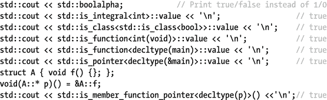

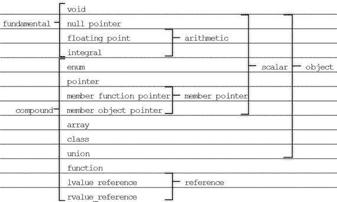

图 2-1。

Overview of the type classification traits. The second column lists the 14 primary categories; the other names are those of the composite categories.

#### 类型属性

第二个类型特征系列用于静态查询类型的属性。它们的使用方式与前一小节中的使用方式完全相同，除了一个名称`has_virtual_destructor`之外，所有的名称都采用了`is_`属性的形式。

以下属性值用于检查指示的类型属性:

*   类型量词的存在:`const`和`volatile`
*   类的多态性属性:`polymorphic`(有虚拟成员)；`abstract`(纯虚拟成员)和`final`
*   算术类型的有符号性:`signed`(包括浮点数)和`unsigned`(包括布尔值)

此外，还有一大类特征，其属性是具有指定参数类型的构造或赋值语句的有效性，或者销毁语句的有效性(总是省略`is_`):

*   基本的有`constructible<T,Args...>`、`assignable<T, Arg>`、`destructible<T>`。所有标量类型都是可析构的，前两个属性对于非类类型也适用(因为像`int i(0);`这样的构造是有效的)。
*   辅助特征用于检查默认结构(`default_constructible`)和复制/移动结构和赋值(`copy_constructible<T> == constructible<T, const T&>`等)的有效性。
*   所有先前的属性名称可以进一步以`trivially`或`nothrow`为前缀。比如:`trivially_destructible`、`nothrow_constructible`或者`nothrow_move_assignable`。

如果静态地知道构造、赋值或销毁永远不会抛出，那么`nothrow`属性就成立。如果类型是`scalar`或者这个操作是默认操作的非多态类(也就是说，不是由用户指定的)，则`trivial`属性成立，`trivial`属性也适用于它的所有基类和非静态成员变量。对于普通的可构造属性，类也不允许有任何带有类内初始值设定项的非静态数据成员。

属性值的最终列表在以下条件下基本成立。满足这些条件的类型数组也具有相同的属性:

*   `trivially_copyable`，如果`trivially_destructible`和`trivially_(copy|move)_(constructible` | `assignable)`都成立。像`std::memcpy()`这样的按位复制函数被定义为对`trivially_copyable`类型是安全的。
*   `trivial`、if `trivially_default_constructible`和`trivially_copyable`，并且不存在非默认构造函数。
*   `standard_layout`、if `scalar`或者一个类，对于该类，指向该类的指针可以安全地转换为指向其第一个非静态成员类型的指针(也就是说，没有多态、有限的多重继承等等)。这是为了与 C 兼容，因为这种强制转换(用 C `struct` s)在 C 代码中是常见的做法。
*   `pod`(普通旧数据)，如果`trivial`和`standard_layout`。
*   `literal_type`，if 值可能用在`constexpr`表达式中(即可以静态求值，没有副作用)。
*   `empty`，对于没有非静态成员变量的非多态类。

#### 类型属性查询

类型特征的`value`不总是布尔值。对于以下特征，它包含指定的`size_t`类型属性:

*   `std::alignment_of<T>`:操作符`alignof(T)`的值
*   `std::rank<T>`:数组维数，如`rank<int>() == 0`、`rank<int[]>() == 1`、`rank<int[][5][6]>() == 3`等
*   `std::extent<T,N=0>`:第`N`个数组维度的元素个数，如果未知或无效则为 0；比如`extent<int[]>() == 0`和`extent<int[][5][6], 1>() == 5`。

#### 类型比较

这三个类型特征比较类型:`is_same<T1, T2>`、i `s_base_of<Base, Derived>`和`is_convertible<From, To>`(使用隐式转换)。

#### 类型转换

大多数类型转换特征也非常相似，除了它们没有`value`，而是一个名为`type`的嵌套`typedef`:

*   `std::add_x`同`x``const``volatile``cv`(`const``volatile`)`pointer``lvalue_reference``rvalue_reference`其中之一。
*   `std::remove_x``x``const``volatile``cv``pointer``reference`(左值或右值)`extent``all_extents`其中之一。除了最后一种情况，只有顶层/第一个类型修饰符被删除。比如:`remove_extent<int[][5]>::type == int[5]`。
*   `std::decay<T>`:将`T`转换为相关的`type`，可以通过值存储，模拟通过值传递参数。比如数组类型`int[5]`变成指针类型`int*`，函数变成函数指针，`const`和`volatile`被剥离，等等。一个可能的实现作为一个例子简短地示出。
*   `std::make_y`同`y``signed`或`unsigned`。如果应用于整数类型`T`，`type`分别是带符号或不带符号的整数类型`sizeof(type) == sizeof(T)`。
*   仅针对`functional`类型定义的`std::result_of`，给出函数的返回`type`。
*   仅针对`enum`类型定义的`std::underlying_type`，给出了这个`enum`下面的【整数】`type`。
*   `std::common_type<T...>`有一个`type`所有类型`T`都可以隐式转换为。

这个头还包含两个实用特征来帮助类型元编程。通过几个例子来说明它们的基本用途。

*   如果`constexpr B`评估为`true`则`std::conditional<B,T1,T2>`有`type T1`，否则`type T2`。
*   `std::enable_if<B,T=void>`有`type T`，但前提是`constexpr B`求值为`true`。否则，`type`就没有定义。

对于该子部分的所有特征，名为`std::`特征`_t<T>`的便利类型被定义为`std::`特征`<T>::type`。例如，接下来的例子显示了与完整表达式相比，`enable_if_t<>`是多么方便。

第一个例子展示了如何使用 C++ SFINAE 习惯用法在重载决策中有条件地添加或删除函数。SFINAE 是替换失败不是错误的首字母缩写，它利用了这样一个事实，即未能专门化模板并不构成编译错误。在这种情况下，缺少`type typedef`会导致替换失败:


第二个例子显示了根据`std::conditional`元函数的`std::decay`转换特征的可能实现。后者用于在类型层面上基本形成一个`if` - `else if` - `else`结构；

```cpp
using namespace std;
template<typename T> struct my_decay {
private:
   typedef remove_reference_t<T> U;
public:
   typedef conditional_t<is_array<U>::value, remove_extent_t<U>*,
           conditional_t<is_function<U>::value, add_pointer_t<U>,
           remove_cv_t<U>>> type;
};

```

Footnotes [1](#Fn1_source)

`<functional>`包含许多我们没有讨论的不推荐使用的设施:`ptr_fun()`、`mem_fun()`、`mem_fun_ref()`、`bind1st()`和`bind2nd()`，加上它们的返回类型，以及基类`unary_function`和`binary_function`。所有这些都已经从标准的 C++17 版本中删除，不应该使用。