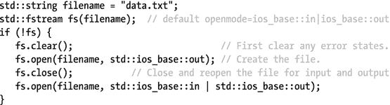

# 5.流输入输出

基于 C++ 流的 I/O 库允许您执行 I/O 操作，而不必知道有关目标或源的详细信息。流的目标或源可以是字符串、文件、内存缓冲区等等。

## 流的输入和输出

标准库提供的流类组织在一个层次结构和一组头中，如图 [5-1](#Fig1) 所示。


图 5-1。

The hierarchy of stream-related classes

更准确地说，该库定义了名为`basic_ios`、`basic_ostream`、`basic_istringstream`等的模板，所有模板都基于一种字符类型。层次结构中的所有类，除了`ios_base`，都是这些模板化类的`typedef`，模板类型为`char`。比如`std::ostream`就是`std::basic_ostream<char>`的一个`typedef`。对于称为`wios`、`wostream`、`wofstream`等的`wchar_t`字符类型，有对应的`typedef`。本章剩余部分仅使用图 [5-1](#Fig1) 中所示的`char typedef` s。

除了图中的表头，还有`<iostream>`。有点令人困惑的是，这并没有真正定义`std::iostream`本身，因为这是由`<istream>`完成的。相反，`<iostream>`包括`<ios>`、`<streambuf>`、`<istream>`、`<ostream>`和`<iosfwd>`，同时自身增加了标准输入和输出流(`w` ) `cin`、(`w` ) `cout`、(`w` ) `cerr`、(`w` ) `clog`。后两个分别用于输出错误和日志信息。它们的目的地是特定于实现的。

该库还提供了`std::basic_streambuf`、`basic_filebuf`和`basic_stringbuf`模板及其各种`typedef`，加上`istreambuf_iterator`和`ostreambuf_iterator`。这些是流缓冲区，是其他流类实现的基础，比如`ostream`、`ifstream`等等。在这一章的结尾会对它们进行简要的讨论。

头文件`<iosfwd>`包含所有标准 I/O 库类型的前向声明。将它包含在其他头文件中是很有用的，而不必包含您需要的所有类型的完整模板定义。

### 助手类型`<ios>`

以下助手类型在`<ios>`中定义:

<colgroup><col> <col></colgroup> 
| 类型 | 描述 |
| --- | --- |
| `std::streamsize` | 有符号整数类型的一个`typedef`,用于表示 I/O 操作期间传输的字符数，或表示 I/O 缓冲区的大小。 |
| `std::streamoff` | 有符号整数类型的一个`typedef`,用于表示流中的偏移量。 |
| `std::fpos` | 一个类模板，包含一个流中的绝对位置和一个将它转换成`streamoff`的转换操作符。支持某些算术运算:一个`streamoff`可以加到一个`fpos`或从中减去，产生一个`fpos`(使用`+`、`-`、`+=`或`-=`)，两个`fpos`对象可以比较(使用`==`或`!=`)或相减，产生一个`streamoff`(使用`-`)。提供了预定义的`typedef`:字符类型`char`和`wchar_t`的`std::streampos`和`wstreampos`。 |

### STD::IOs _ base`<ios>`

在`<ios>`中定义的`ios_base`类是所有输入和输出流类的基类。它跟踪格式化选项和标志，以操纵数据的读写方式。提供了以下方法:

<colgroup><col> <col></colgroup> 
| 方法 | 描述 |
| --- | --- |
| `precision()` `precision(streamsize)` | 返回浮点 I/O 的精度，或者在返回旧精度时更改它。精度的语义取决于设置了哪个`floatfield`格式化标志(见表 [5-1](#Tab1) 和表 [5-2](#Tab2) )。如果设置了`fixed`或`scientific`,精度将精确指定小数点后要显示多少位数，即使这意味着添加尾随零。如果两者都没有设置，那么它表示要显示的最大位数，计算小数点分隔符前后的位数(在这种情况下不添加零)。如果两者都设置了，则忽略精度。 |
| `width()` `width(streamsize)` | 返回下一个字段的宽度，或者在返回旧字段的同时更改它。这个宽度指定了某些 I/O 操作输出的最小字符数。为了达到这个最小值，需要添加填充字符(稍后解释)。仅对下一个 I/O 操作有影响。 |
| `getloc()` `imbue(locale)` | 返回 I/O 期间使用的`locale`,或者在返回旧值时更改它。有关地区的详细信息，请参见第 [6 章](6.html)。 |
| `flags()` `flags(fmtflags)` | 返回当前设置的格式标志，或者在返回旧标志时替换当前标志。表 [5-1](#Tab1) 列出了所有可用的`fmtflags`标志，可以按位组合。 |
| `setf(fmtflags)` `unsetf(fmtflags)` | 在不触及其他标志的情况下设置或取消设置单个标志。返回更新之前的标志。 |
| `setf(fmtflags flags,` `fmtflags mask)` | 在取消设置组中的其他组时设置`flags`，指定为`mask`。表 [5-2](#Tab2) 列出了预定义的屏蔽。例如，`setf(right &#124; fixed, adjustfield &#124; floatfield)`设置`right`和`fixed`标志，同时不设置`left`、`internal`和`scientific`标志。 |

还可以通过流 I/O 操纵器来修改标志，这将在下一节中讨论。

表 5-2。

`std::ios_base::fmtflags` Masks Defined in `<ios>`

<colgroup><col> <col></colgroup> 
| 旗 | 描述 |
| --- | --- |
| `basefield` | `dec &#124; oct &#124; hex` |
| `adjustfield` | `left &#124; right &#124; internal` |
| `floatfield` | `scientific &#124; fixed` |

表 5-1。

`std::ios_base::fmtflags` Formatting Flags Defined in `<ios>`

<colgroup><col> <col></colgroup> 
| 旗 | 描述 |
| --- | --- |
| `boolalpha` | 使用`true`和`false`代替布尔 I/O 的`1`和`0` |
| `left`、`right`、`internal` | 输出`left`与添加到右侧的填充字符对齐，或者`right`与左侧的填充对齐，或者通过中间的填充进行调整。第三个标志，`internal`，用于数字和货币值，指定的填充点位于值和它的任何前缀之间:符号、数字基数和/或货币符号。否则，`internal`相当于`right`。不同校准选项的结果显示在示例部分。 |
| `scientific`，`fixed` | 如果这两个标志都没有设置，则使用浮点 I/O 的默认符号(例如:`0.0314`)。否则，使用科学(`3.140000e-02`)或固定符号(`0.031400`)。如果两者结合使用，`scientific &#124; fixed`，则使用十六进制浮点表示法(`0x1.013a92p-5`)。 |
| `dec`、`oct`、`hex` | 对整数 I/O 使用十进制、八进制或十六进制基数。 |
| `showbase` | 对于整数 I/O，写入或期待用`dec`、`oct`或`hex`指定的基址前缀。当执行货币 I/O 时，`std::put_money()`用依赖于地区的货币符号作为值的前缀，`std::get_money()`需要一个货币符号前缀。 |
| `showpoint` | 对于浮点 I/O，始终使用与区域设置相关的小数分隔符，即使小数部分为零。 |
| `showpos` | 使用`+`字符表示非负数字 I/O。 |
| `skipws` | 指示所有格式化的输入操作(稍后解释)跳过前导空格。 |
| `unitbuf` | 在每次输出操作后强制刷新输出。 |
| `uppercase` | 指示浮点和十六进制整数输出操作使用大写字母而不是小写字母。 |

### 输入/输出操纵器`<ios>, <iomanip>`

操纵器允许你使用`operator<<`和`operator>>`而不是`flags(fmtflags)`或`setf()`来改变旗帜。

`<ios>`头为表 [5-1](#Tab1) : `std::scientific`、`std::left`等中定义的所有标志定义了全局`std`范围内的 I/O 操纵器。对于属于表 [5-2](#Tab2) 中定义的掩码的标志，I/O 操纵器使用该掩码。比如`std::dec`其实叫`ios_base::setf(dec, basefield)`。

对于`boolalpha`、`showbase`、`showpoint`、`showpos`、`skipws`、`uppercase`、`unitbuf`，也可以使用负面操纵器，它们的名称相同，但以`no`为前缀:例如`std::noboolalpha`。

除了`std::fixed`和`scientific`之外，还有`std::hexfloat` ( `scientific | fixed`)和`std::defaultfloat`(无`floatfield`标志设置)机械手。

此外，`<iomanip>`标题定义了以下操纵器:

<colgroup><col> <col></colgroup> 
| 操作者 | 描述 |
| --- | --- |
| `setiosflags(fmtflags)` `resetiosflags(fmtflags)` | 设置/取消给定的`fmtflags`。 |
| `setbase(int)` | 更改用于整数 I/O 的基数。除了`16` ( `hex`)、`8` ( `oct`)或`10` ( `dec`)之外的值将基数设置为`10`。 |
| `setfill(char)` | 更改填充字符。见后面的例子。 |
| `setprecision(int)` | 改变浮点输出的小数位数，如同用`ios_base::precision()`设置一样。 |
| `setw(int)` | 设置下一个字段的宽度。参见示例。 |
| `get_money(m&, bool=false)` `put_money(m&, bool=false)` | 读取或写入货币值。如果布尔值为`true`，则使用国际货币字符串(如`"USD "`)；否则使用货币符号(如`"$"`)。`m`的类型可以是`std::string`或`long double.`参见第 [6](6.html) 章了解更多关于货币格式化的细节。 |
| `get_time(tm*, char*)` `put_time(tm*, char*)` | 读取或写入日期/时间。格式与第 [2 章](2.html)中讨论的`std::strftime()`相同。 |
| `quoted()` | 读取或写入带引号的字符串，并正确处理嵌入的引号。在本章后面关于如何实现自己的`operator<<`和`operator>>`的章节中给出了这个操纵器的一个例子。 |

### 例子

这段代码还需要`<locale>`:


在美国系统上，输出如下:

```cpp
Left:     $1.23__
Right:    __$1.23
Internal: 0x___7b

```

### STD::IOs`<ios>`

在`<ios>`中定义的`ios`类继承自`ios_base`，并提供了许多检查和修改流状态的方法，它是表 [5-3](#Tab3) 中列出的状态标志的按位组合。

表 5-3。

`std::ios_base::iostate` State Constants Defined in `<ios>`

<colgroup><col> <col></colgroup> 
| 监视磁盘状态 | 描述 |
| --- | --- |
| `goodbit` | 该流不处于任何错误状态。没有设置任何位:即状态为 0。 |
| `badbit` | 该流处于不可恢复的错误状态。 |
| `failbit` | 输入或输出操作失败。例如，如果数值溢出整数，将数值读入整数可能会导致设置`failbit`。 |
| `eofbit` | 这条小溪到了尽头。 |

提供了以下与状态相关的方法:

<colgroup><col> <col></colgroup> 
| 方法 | 描述 |
| --- | --- |
| `good()``eof()``bad()`T3】 | 如果分别没有设置`badbit`、`failbit`和`eofbit`，设置了`eofbit`，设置了`badbit`，或者设置了`failbit`或`badbit`，则返回`true`。 |
| `operator!` | 相当于`fail()`。 |
| `operator bool` | 相当于`!fail()`。 |
| `rdstate()` | 返回当前的`ios_base::iostate`状态。 |
| `clear(state)` | 如果附加了有效的流缓冲区，则将流的状态更改为给定的状态(见下文)；否则将其设置为`state &#124; badbit`。 |
| `setstate(state)` | 调用`clear(state &#124; rdstate())`。 |

除了这些与状态相关的方法之外，以下附加方法由`ios`定义:

<colgroup><col> <col></colgroup> 
| 方法 | 描述 |
| --- | --- |
| `fill()` `fill(char)` | 返回当前填充字符，或者在返回旧字符的同时改变它。要更改它，也可以使用`setfill()`操纵器。 |
| `copyfmt()` | 从另一个`ios`实例复制所有内容，除了它的状态。 |
| `tie()` | 将任何输出流绑定到`this`流，这意味着每次对`this`流执行输入或输出操作时，都会刷新绑定的输出流。 |
| `narrow()` `widen()` | 以特定于区域设置的方式将宽字符转换为窄字符，反之亦然。有关地区的详细信息，请参见第 [6](6.html) 章。 |

`std::ios`的默认初始化有以下效果:

*   标志被设置为`skipws | dec`。
*   精度设置为 6。
*   字段宽度设置为 0。
*   填充字符被设置为`widen(' ')`。
*   如果附加了有效的流缓冲区(见下文),则将状态设置为`goodbit`,否则设置为`badbit`。

#### 错误处理

默认情况下，流操作通过设置流的状态位(`good`、`bad`、`fail`和`eof`)来报告错误，但它们不会抛出异常。不过，可以使用`exceptions()`方法来启用异常。它要么返回当前异常掩码，要么接受一个。该掩码是`std::ios_base::iostate`状态标志的按位组合(见表 [5-3](#Tab3) )。对于掩码中设置为 1 的每个状态标志，当该状态位为流设置时，流将引发异常。

例如，下面的代码试图使用文件流打开一个不存在的文件(将在本章后面详细解释)。不会引发任何异常；只有流的失败位被设置为 1:


如果您想使用异常，代码可以重写如下:


一个可能的输出可能是

```cpp
ios_base::failbit set: iostream stream error

```

### std::ostream `<ostream>`

`ostream`类支持对基于`char`的流进行格式化和非格式化输出。格式化输出意味着所写内容的格式会受到格式化选项的影响，例如字段的宽度、浮点数的十进制位数等等。格式化输出通常也会受到流的`locale`的影响，如第 [6](6.html) 章所述。无格式输出只需要按原样写入字符或字符缓冲区。

`ostream`提供了一个`swap()`方法和下面的高级输出操作。如果没有提到返回类型，操作返回一个`ostream&`，允许操作被链接:

表 5-4。

`std::ios_base::seekdir` Constants Defined in `<ios>`

<colgroup><col> <col></colgroup> 
| 塞克迪尔 | 描述 |
| --- | --- |
| `beg` | 溪流的起点 |
| `end` | 溪流的尽头 |
| `cur` | 流中的当前位置 |

<colgroup><col> <col></colgroup> 
| 操作 | 描述 |
| --- | --- |
| `operator<<` | 将格式化数据写入流。 |
| `put(char)` `write(const char*, n)` | 将单个字符或未格式化的`n`字符写入流。 |
| `fpos tellp()``seekp(pos)`T2】 | 返回或更改流中的当前位置。`p`是`put`的简写，表示这些方法正在输出流上工作。`seekp()`接受绝对位置(`fpos`)或偏移(`streamoff`)和开始偏移的方向(`seekdir`:见表 [5-4](#Tab4) )。 |
| `flush()` | 将缓冲区强制刷新到目标。 |

`<ostream>`还定义了以下额外的 I/O 操纵器:

<colgroup><col> <col></colgroup> 
| 操作者 | 描述 |
| --- | --- |
| `ends` | 将`\0`(空字符)写入流。 |
| `flush` | 刷新流。与调用`ostream`上的`flush()`相同。 |
| `endl` | 将`widen('\n')`写入流并刷新它。 |

`<iostream>`头提供了以下全局`ostream`实例:

*   `cout/wcout`:输出到标准 C 输出流`stdout`
*   `cerr/wcerr`:标准 C 错误流的输出，`stderr`
*   `clog/wclog`:标准 C 错误流的输出，`stderr`

`(w)cout`自动绑定到`(w)cin`。这意味着对`(w)cin`的输入操作导致`(w)cout`刷新其缓冲区。`(w)cout`也自动绑定到`(w)cerr`，因此`(w)cerr`上的任何输出操作都会导致`(w)cout`刷新。

`std::ios_base`提供了一个名为`sync_with_stdio()`的静态方法，用于在每次输出操作后将这些全局`ostream`与底层 C 流同步。这确保了它们使用相同的缓冲区，允许您安全地混合 C++ 和 C 风格的输出。它还保证了标准流是线程安全的:也就是说，没有数据竞争。尽管如此，字符交错仍然是可能的。

Note

当使用标准流`cout`、`cerr`、`clog`和`cin`(稍后讨论)时，您不必考虑与平台相关的行尾字符。例如，在 Windows 上，一行通常以`\r\n`结尾，而在 Linux 上以`\n`结尾。然而，翻译会自动发生，所以您可以总是使用`\n`。

#### 例子

以下示例演示了三种不同的输出方法:

```cpp
std::cout << "PI = " << 3.1415 << std::endl;
std::cout.put('\t');
std::cout.write("C++", 3);

```

### STD::ist stream`<istream>`

`istream`类支持来自基于`char`的流的格式化和非格式化输入。它提供`swap()`及以下高级输入操作。除非另有说明，否则操作返回一个`istream&`，这有助于链接:

<colgroup><col> <col></colgroup> 
| 操作 | 描述 |
| --- | --- |
| `operator>>` | 从流中读取格式化数据。所有其他输入操作都处理无格式数据。 |
| `get(char*, count``[, delim])``getline(char*, count``[, delim])`T4】 | 从流中读取`count`字符，并将它们存储在`char*`缓冲区中。终止空字符(`'\0'`)由`get()`和`getline()`自动添加，而不是由`read()`添加。对于前两个，默认情况下，当遇到分隔符时，输入停止`'\n'`。`get()`不会从流中提取分隔符，但`getline()`会。分隔符从不存储在`char*`缓冲器中。 |
| `streamsize readsome(` `char*, count)` | 最多读取给定`char*`缓冲区中立即可用的`count`个字符。这些字符是底层流缓冲区(稍后讨论)无需等待就可以返回的字符，例如用于无阻塞地从异步源读取数据。返回提取的字符数。 |
| `get(char&)``int get()`T2】 | 从流中读取单个字符。第一个版本将读取的字符存储在一个`char`引用中。最后两个返回一个整数，或者是一个有效的读取字符，或者是`EOF`，如果没有可用的字符。`peek()`不从流中删除字符。 |
| `unget()` `putback(char)` | 将最后一个读取的字符或给定的字符放在流中，以便它可用于下一个读取操作。 |
| `ignore([count` `[,delim]])` | 从流中读取`count`字符(默认为`1`)或者直到遇到给定的定界字符(默认为`eof`)并丢弃它们。分隔符也被删除。 |
| `streamsize gcount()` | 返回上一次无格式输入操作提取的字符数:`get()`、`getline()`、`read()`、`readsome()`、`peek()`、`unget()`、`putback()`或`ignore()`。 |
| `fpos tellg()``seekg(pos)`T2】 | 返回或更改流中的当前位置。`g`是`get`的简写，表示这些方法正在输入流上工作。`seekg()`接受绝对位置(`fpos`)或偏移(`streamoff`)和开始偏移的方向(`seekdir`:见表 [5-4](#Tab4) )。 |
| `int sync()` | 将输入流与底层流缓冲区同步(稍后讨论)。这是一种高级的、很少使用的方法。 |

`<istream>`还定义了以下额外的 I/O 操纵器:

<colgroup><col> <col></colgroup> 
| 操作者 | 描述 |
| --- | --- |
| `ws` | 丢弃流中当前的任何空白。 |

`<iostream>`头提供了以下全局`istream`实例:

*   `cin/wcin`:从标准 C 输入流中读取，`stdin`

`ios_base::sync_with_stdio()`功能也会影响`(w)cin`。参见前面对`cout`、`cerr`、`clog`的解释。

如前所述，`istream`提供了一个`getline()`方法来提取字符。不幸的是，你必须传递给它一个适当大小的`char*`缓冲区。`<string>`头定义了一个更容易使用的`std::getline()`方法，它接受一个`std::string`作为目标缓冲区。下面的例子说明了它的用法。

#### 例子

```cpp
int anInt;
double aDouble;
std::cout << "Enter an integer followed by some whitespace\n"
          << "and a double, and press enter: ";
std::cin >> anInt >> aDouble;
std::cout << "You entered: ";
std::cout << "Integer = " << anInt << ", Double = " << aDouble << std::endl;

std::string message;
std::cout << "Enter a string. End input with a * and enter: ";
std::getline(std::cin >> std::ws, message, '*');
std::cout << "You entered: '" << message << "'" << std::endl;

```

下面是该程序的一个可能输出:

```cpp
Enter an integer followed by some whitespace
and a double, and press enter: 1 3.2 ↩
You entered: Integer = 1, Double = 3.2
Enter a string. End input with a * and enter: This is ↩
a multiline test* ↩
You entered: 'This is ↩
a multiline test'

```

### std::iostream `<istream>`

`iostream`类，在`<istream>`中定义(不在`<iostream>`中！)，继承自`ostream`和`istream`，提供高级输入输出操作。它跟踪流中的两个独立位置:一个输入位置和一个输出位置。这就是为什么`ostream`有`tellp()`和`seekp()`方法，而`istream`有`tellg()`和`seekg()` : `iostream`包含所有四个方法，所以它们需要一个不同的名字。除了继承的功能之外，它不提供额外的功能。

## 字符串流`<sstream>`

字符串流允许您在字符串上使用流 I/O。该库提供了`istringstream`(输入，继承自`istream`)、`ostringstream`(输出，继承自`ostream`)、`stringstream`(输入输出，继承自`iostream`)。继承图见图 [5-1](#Fig1) 。这三个类都有一组相似的构造函数:

*   `[i|o]stringstream(ios_base::openmode)`: Constructs a new string stream with the given `openmode`, a bitwise combination of the flags defined in Table [5-5](#Tab5)

    表 5-5。

    `std::ios_base::openmode` Constants Defined in `<ios>`

    <colgroup><col> <col></colgroup> 
    | 开放模式 | 描述 |
    | --- | --- |
    | `app` | 追加的简称。在每次写入前查找到流的末尾。 |
    | `binary` | 以二进制模式打开的流。如果未指定，则以文本模式打开流。差异参见文件流部分。 |
    | `in / out` | 分别为读/写而打开的流。 |
    | `trunc` | 打开流后移除流的内容。 |
    | `ate` | 打开流后查找到流的末尾。 |

*   `[i|o]stringstream(string&, ios_base::openmode)`:用给定字符串的副本作为初始流内容，用给定的`openmode`构造一个新的字符串流
*   `[i|o]stringstream([i|o]stringstream&&)`:移动构造器

前两个构造函数中的`openmode`有一个默认值:`out`代表`ostringstream`，`in`代表`istringstream`，`out|in`代表`stringstream`。对于`ostringstream`和`istringstream`，给定的`openmode`总是和默认的组合在一起；比如对于`ostringstream`，实际的`openmode`是给定 _openmode `|ios_base::out`。

这三个类只添加了两个方法:

*   `string str()`:返回底层字符串对象的副本
*   `void str(string&)`:将底层字符串对象设置为给定对象的副本

### 例子

```cpp
std::ostringstream oss;
oss << 123 << " " << 3.1415;
std::string myString = oss.str();
std::cout << "ostringstream contains: '" << myString << "'" << std::endl;

std::istringstream iss(myString);
int myInt; double myDouble;
iss >> myInt >> myDouble;
std::cout << "int = " << myInt << ", double = " << myDouble << std::endl;

```

## 对象

文件流允许您对文件使用流 I/O。该库提供了一个`ifstream`(输入，继承自`istream`)、`ofstream`(输出，继承自`ostream`)、`fstream`(输入输出，继承自`iostream`)。继承图见图 [5-1](#Fig1) 。这三个类都有一组相似的构造函数:

*   `[i|o]fstream(filename, ios_base::openmode)`:构造一个文件流，用给定的`openmode`打开给定的文件。文件可以指定为`const char*`或`std::string&`。
*   `[i|o]fstream([i|o]fstream&&)`:移动构造器。

这三个类都添加了以下方法:

*   `open(filename, ios_base::openmode)`:打开一个类似于第一个构造函数的文件
*   `is_open()`:如果打开文件进行输入和/或输出，则返回`true`
*   `close()`:关闭当前打开的文件

构造函数和`open()`方法中的`openmode`(见表 [5-5](#Tab5) )有一个默认:`ofstream`用`out`，`ifstream`用`in`，`fstream`用`out|in`。对于`ofstream`和`ifstream`，给定的`openmode`总是和默认的组合在一起；例如:对于`ofstream`，实际`openmode`是给定 _openmode `|ios_base::out`。

如果指定了`ios_base::in`标志，无论是否与`ios_base::out`结合，您试图打开的文件必须已经存在。以下代码打开一个用于输入和输出的文件，如果该文件尚不存在，则创建该文件:



如果一个文件以文本模式打开，而不是二进制模式，库被允许翻译某些特殊字符来匹配平台如何使用这些字符。例如，在 Windows 上，行通常以`\r\n`结尾，而在 Linux 上，它们通常以`\n`结尾。当一个文件在文本模式下打开时，你并不是自己在 Windows 上读/写`\r`；库为您处理这种翻译。

与其他组合的输入和输出流(如`stringstream`)相比，`fstream`类支持输入和输出，处理当前位置的方式不同。文件流只有一个位置，因此输出和输入位置总是相同的。

Tip

文件流的析构函数自动关闭文件。

### 例子

下面的示例类似于前面给出的字符串流示例，但使用了一个文件。在这个例子中，`ofstream`是使用`close()`显式关闭的，`ifstream`是通过`ifs`的析构函数隐式关闭的:

```cpp
const std::string filename = "output.txt";
std::ofstream ofs(filename);
ofs << 123 << " " << 3.1415;
ofs.close();

std::ifstream ifs(filename);
int myInt; double myDouble;
ifs >> myInt >> myDouble;
std::cout << "int = " << myInt << ", double = " << myDouble << std::endl;

```

## 自定义类型的运算符<< and >

您可以编写自己版本的流输出和提取操作符`operator<<`和`operator>>`。下面是一个关于`Person`类的两个操作符的例子，使用`std::quoted()`操作符来处理名字中的空格:

```cpp
std::ostream& operator<<(std::ostream& os, const Person& person) {
   os << std::quoted(person.GetFirstName()) << ' '
      << std::quoted(person.GetLastName());
   return os;
}

std::istream& operator>>(std::istream& is, Person& person) {
   std::string firstName, lastName;
   is >> std::quoted(firstName) >> std::quoted(lastName);
   person.SetFirstName(firstName); person.SetLastName(lastName);
   return is;
}

```

这些运算符可以如下使用(`<sstream>`也是必需的):


## 流迭代器

除了在第 [3](3.html) 和 [4](4.html) 章节中讨论的其他迭代器之外，`<iterator>`头定义了两个流迭代器`std::istream_iterator`和`std::ostream_iterator`。

### std::ostream_iterator

`ostream_iterator`是一个输出迭代器，能够使用`operator<<`向`ostream`输出某种类型的对象序列。要输出的对象的类型被指定为模板类型参数。有一个构造函数接受对要使用的`ostream`的引用和一个可选的分隔符，该分隔符在每次输出后被写入流中。

结合第 [4](4.html) 章讨论的算法，流迭代器非常强大。例如，下面的代码片段使用`std::copy()`算法将`double`的`vector`写入控制台，其中每个`double`后跟一个制表符(另外还需要`<vector>`和`<algorithm>`):

```cpp
std::vector<double> vec{ 1.11, 2.22, 3.33, 4.44 };
std::copy(cbegin(vec), cend(vec),
          std::ostream_iterator<double>(std::cout, "\t"));

```

### std::istream_iterator

`istream_iterator`是一个输入迭代器，能够通过使用`operator>>`逐个提取对象来迭代`istream`中的某种类型的对象。要从流中提取的对象的类型被指定为模板类型参数。有三个构造函数:

*   `istream_iterator()`:默认构造函数，导致迭代器指向流的末尾
*   `istream_iterator(istream&)`:构造一个迭代器，从给定的`istream`中提取对象
*   `istream_iterator(istream_iterator&)`:复制构造函数

就像一个`ostream_iterator`，`istream_iterator` s 结合算法非常厉害。以下示例结合使用`for_each()`算法和`istream_iterator`从标准输入流中读取未指定数量的`double`值，并将它们相加以计算平均值(还需要`<algorithm>`):

```cpp
std::istream_iterator<double> begin(std::cin), end;
double sum = 0.0; int count = 0;
std::for_each(begin, end, [&](double value){ sum += value; ++count;});
std::cout << sum / count << std::endl;

```

在 Windows 上按 Ctrl+Z 或在 Linux 上按 Ctrl+D 终止输入，然后按 Enter。

第二个例子使用一个`istream_iterator`从控制台读取不确定数量的`double`和一个`ostream_iterator`将读取的`double`写入由制表符分隔的`stringstream`(另外需要`<sstream>`和`<algorithm>`):

```cpp
std::ostringstream oss;
std::istream_iterator<double> begin(std::cin), end;
std::copy(begin, end, std::ostream_iterator<double>(oss, "\t"));
std::cout << oss.str() << std::endl;

```

## 流缓冲器`<streambuf>`

流类不直接处理目标，如内存中的字符串、磁盘上的文件等。相反，他们使用由`std::basic_streambuf<CharType>`定义的流缓冲区的概念。提供两个`typedef`、`std::streambuf`和`std::wstreambuf`，模板类型分别为`char`或`wchar_t`。文件流使用`std::(w)filebuf`，字符串流使用`std::(w)stringbuf`，两者都继承自`(w)streambuf`。

每个流都有一个与之相关联的流缓冲区，您可以使用`rdbuf()`获得指向该缓冲区的指针。对`rdbuf(streambuf*)`的调用返回当前关联的流缓冲区，并将其更改为给定的流缓冲区。

流缓冲区可用于编写流重定向器类，将一个流重定向到另一个流。作为一个基本的例子，下面的代码片段将所有的`std::cout`输出重定向到一个文件(另外还需要`<fstream>`):


Caution

当更改一个标准流的缓冲区时，不要忘记在终止应用程序之前恢复旧的缓冲区，就像上一个示例中所做的那样。否则，您的代码可能会因某些库实现而崩溃。

它还可以用于实现一个 tee 类，该类将输出重定向到两个或多个目标流。另一个用途是轻松读取整个文件:

```cpp
std::ifstream ifs("test.txt");
std::stringstream buffer;
buffer << ifs.rdbuf();

```

流缓冲区的确切行为取决于实现。直接使用流缓冲区是一个高级主题，由于页面限制，我们不能进一步详细讨论。

## c 型输出和输入`<cstdio>`

除了在第 [2](2.html) 章中解释的文件实用程序外，`<cstdio>`头文件还定义了 C 风格的 I/O 库，包括基于字符的 I/O ( `getc()`、`putc()`)，...)和格式化的 I/O ( `printf()`，`scanf()`，...).所有 C 风格的 I/O 功能都包含在类型安全的 C++ 流中，它也有更好的定义，可移植的错误处理。 [<sup>1</sup>](#Fn1) 这一节确实讨论了`std::printf()`和`std::scanf()`函数族，而且只讨论这些，因为它们的格式语法紧凑，有时比 C++ 流更方便。

### std::printf()系列

以下`printf()`系列函数在`<cstdio>`中定义:

```cpp
std::printf(const char* format, ...)
std::fprintf(FILE* file, const char* format, ...)
std::snprintf(char* buffer, size_t bufferSize, const char* format, ...)
std::sprintf(char* buffer, const char* format, ...)

```

它们将格式化的输出分别写入标准输出、文件、给定大小的缓冲区或缓冲区，并返回写出的字符数。最后一个`sprintf()`，不如`snprintf()`安全。它们在`format`字符串后都有数量可变的参数。也有以`v`为前缀的版本接受`va_list`作为参数:例如`vprintf(const char* format, va_list)`。对于前三种，还提供了宽字符版本:`(v)wprintf()`、`(v)fwprintf()`和`(v)swprintf()`。

如何格式化输出由给定的`format`字符串控制。除了以`%`开头的序列之外，它的所有字符都按原样写出。格式化选项的基本语法是`%`后跟一个转换说明符。这告诉`printf()`如何解释变长参数列表中的下一个值。传递给`printf()`的参数必须与`format`中的`%`指令顺序相同。表 [5-6](#Tab6) 解释了可用的转换说明符。列出的预期参数类型适用于不使用长度修饰符的情况(稍后讨论)。

表 5-6。

Available Conversion Specifiers for `printf()`-Like Functions

<colgroup><col> <col></colgroup> 
| 分类符 | 描述 |
| --- | --- |
| `d`，`i` | 转换为十进制表示形式[ `-` ] `ddd`的`signed int`参数。 |
| `o`、`u`、`x`、`X` | 转换为八进制(`o`)、十进制(`u`)或十六进制表示形式的`unsigned int`参数，后者采用小写(`x`)或大写数字(`X`)。 |
| `f`，`F` | 转换为[ `-` ] `ddd.dd`样式的十进制符号的`double`参数(小写或大写字母分别用于无穷大和 NaN 值)。 |
| `e`，`E` | 转换为科学符号的`double`参数:即[ `-` ] `d.dde±dd`或[ `-` ] `d.ddE±dd`(同样用小写/大写字母表示特殊值)。 |
| `g`，`G` | 一个转换的`double`参数，如同使用`f` / `F`或`e` / `E`一样，对于给定的值和精度，哪一个更紧凑。`e` / `E`仅在指数大于或等于精度，或小于-4 时使用。 |
| `a`，`A` | 转换为十六进制格式的`double`参数:[ `-` ] `0xh.hhhp±d`或[ `-` ] `0Xh.hhhP±d`(无穷大和 NaN 值与`f`、`F`一样打印)。 |
| `c` | 一个`int`参数被转换成一个`unsigned char`。 |
| `s` | 参数是一个指向`char`数组的指针。精度指定要输出的最大字节数。如果没有给定精度，则写入所有内容，直到空终止符。注意:不要传递一个`std::string`对象作为`%s`修饰符的参数！ |
| `p` | 该参数被解释为一个`void`指针，该指针被转换为依赖于实现的格式。 |
| `n` | 参数是一个指向`signed int`的指针，它接收到目前为止通过调用`printf()`写出的字符数。 |
| `%` | 输出一个`%`字符。不需要传递相应的参数。 |

Caution

C 风格的 I/O 函数不是类型安全的。如果您的转换说明符要求将参数值解释为`double`，那么该参数必须是真的`double`(而不是，例如，`float`或整数)。如果传递了错误的类型，它会编译并运行，但这很少会有好结果。这也意味着永远不要将 C++ `std::string`原样作为字符串转换说明符的参数传递:而是使用`c_str()`，如下例所示。

下面的例子打印了美国传统民歌“99 瓶啤酒”的歌词(假设有一个`using namespace std`):

```cpp
string bottles = "bottles of beer";
char on_wall[99];
for (int i = 99; i > 0; --i) {
   snprintf(on_wall, sizeof(on_wall), "%s on the wall", bottles.c_str());
   printf("%d %s, %d %s.\n", i, on_wall, i, bottles.c_str());
   printf("Take one down, pass it around, %d %s.\n", i-1, on_wall);
}

```

格式化选项比到目前为止讨论的基本转换要强大得多。`%`指令的完整语法如下:

```cpp
%<flags><width><precision><length_modifier><conversion>

```

随着

*   `<flags>`: Zero or more flags that change the meaning of the conversion specifier. See Table [5-7](#Tab7).

    表 5-7。

    Available Flags

    <colgroup><col> <col></colgroup> 
    | 旗 | 描述 |
    | --- | --- |
    | `-` | 左对齐输出。默认情况下，输出右对齐。 |
    | `+` | 始终输出数字的符号，即使是正数。 |
    | 空格字符 | 如果要输出的数字是非负的或者没有字符，则在输出前加上一个空格。如果还指定了`+`，则忽略。 |
    | `#` | 输出一个所谓的另类形式。对于`x`和`X`，如果数字不为零，则结果以`0x`或`0X`为前缀。对于所有浮点说明符(`a`、`A`、`e`、`E`、`f`、`F`、`g`和`G`)，输出总是包含一个小数点字符。对于`g`和`G`，尾随零不会被删除。对于 o，精度增加，因此输出的第一个数字是零。 |
    | `0` | 对于所有的整数和浮点转换说明符(`d`、`i`、`o`、`u`、`x`、`X`、`a`、`A`、`e`、`E`、`f`、`F`、`g`和`G`)，用零代替空格进行填充。如果也指定了`-`，或者对于所有整数说明符与精度的组合，则忽略此选项。 |

*   `<width>`:可选最小字段宽度(不截断:仅填充)。如果转换后的值的字符数少于指定的宽度，则应用填充。默认情况下，空格用于填充。`<width>`可以是非负整数，也可以是`*`，这意味着从参数列表中的整数参数中获取宽度。此宽度必须在要格式化的值之前。
*   `<precision>`:一个点，后面跟一个可选的非负整数(如果没有指定，则假定为 0)，或者一个`*`，这也意味着从参数列表中的一个整数参数中获取精度。精度是可选的，它决定了以下内容:
    *   s 的最大字节数，默认情况下，应该是以零结尾的字符数组。
    *   所有整数转换说明符(d、I、o、u、X 和 X)的最小输出位数。默认值:1。
    *   对于大多数浮点转换说明符(A、A、E、E、F 和 F)，小数点后要输出的位数。如果未指定，默认精度为 6。
    *   g 和 g 的最大有效位数。默认值也是 6。
*   `<length_modifier>`: An optional modifier that alters the type of the argument to be passed. Table [5-8](#Tab8) gives an overview of all supported modifiers for numeric conversions. For character and strings (`c` and `s` conversion specifiers, respectively), the `l` length modifier (note: this is the letter `l`) changes the expected input type from `int` and `char*` to `wint_t` and `wchar_t*`, respectively.[<sup>2</sup>](#Fn2)

    表 5-8。

    Length Modifiers for All Numeric Conversion Specifiers

    <colgroup><col> <col> <col> <col> <col></colgroup> 
    | 修饰语 | `d`，`i` | `o`、`u`、`x`、`X` | `n` | `a`、`A`、`e`、`E`、`f`、`F`、`g`、`G` |
    | --- | --- | --- | --- | --- |
    | (无) | `int` | `unsigned int` | `int*` | `double` |
    | `hh` | `char` | `unsigned char` | `char*` |   |
    | `h` | `short` | `unsigned short` | `short*` |   |
    | `l` | `long` | `unsigned long` | `long*` |   |
    | `ll` | `long long` | `unsigned long long` | `long long*` |   |
    | `j` | `intmax_t` | `uintmax_t` | `intmax_t*` |   |
    | `z` | `size_t` | `size_t` | `size_t*` |   |
    | `t` | `ptrdiff_t` | `ptrdiff_t` | `ptrdiff_t*` |   |
    | `L` |   |   |   | `long double` |

*   `<conversion>`:唯一必需的组件，指定要应用于参数的转换。(见表 [5-6](#Tab6) 。)

表 [5-8](#Tab8) 中的修饰符决定了必须按指示传递的输入类型。`std::intmax_t`、`uintmax_`、`t`在`<cstdint>`(见第[章 1](1.html) )中定义，`size_t`、`ptrdiff_t`在`<cstddef>`中定义。还要注意的是`long`和 l `ong long`修饰符使用字母`l`，而不是数字`1`。

#### 例子


### std::scanf()系列

以下`scanf()`系列函数在`<cstdio>`中定义:

```cpp
std::scanf(const char* format, ...)
std::fscanf(FILE* file, const char* format, ...)
std::sscanf(const char* buffer, const char* format, ...)

```

它们分别从标准输入、文件或缓冲区中读取。除了这些在`format`字符串后面有可变数量的参数的函数之外，还有一些名称以`v`为前缀并接受`va_list`作为参数的版本:例如，`vscanf(const char* format, va_list)`。还提供了宽字符版本:`(v)wscanf()`、`(v)fwscanf()`和`(v)swscanf()`。

它们都根据给定的`format`字符串读取格式化数据。使用的`scanf()`格式语法类似于前面看到的`printf()`格式语法。格式字符串中的所有字符只是用来与输入进行比较，除了以`%`开头的序列。这些`%`指令导致值被解析并按顺序存储在函数参数所指向的位置。基本语法是一个`%`符号，后跟表 [5-9](#Tab9) 中的一个转换说明符。最后一列显示了未指定长度修饰符时的参数类型(见表 [5-10](#Tab10) )。

表 5-10。

Available Length Modifiers for the Numeric Conversion Specifiers of `scanf()`-Like Functions

<colgroup><col> <col> <col> <col> <col></colgroup> 
| 修饰语 | d，我 | o，u，X，X | n | `a`、`A`、`e`、`E`、`f`、`F`、`g`、`G` |
| --- | --- | --- | --- | --- |
| `(none)` | `int*` | `unsigned int*` | `int*` | `float*` |
| `hh` | `char*` | `unsigned char*` | `char*` |   |
| `h` | `short*` | `unsigned short*` | `short*` |   |
| `l` | `long*` | `unsigned long*` | `long*` | `double*` |
| `ll` | `long long*` | `unsigned long long*` | `long long*` |   |
| `j` | `intmax_t*` | `uintmax_t*` | `intmax_t*` |   |
| `z` | `size_t*` | `size_t*` | `size_t*` |   |
| `t` | `ptrdiff_t*` | `ptrdiff_t*` | `ptrdiff_t*` |   |
| `L` |   |   |  | `long double*` |

表 5-9。

Available Conversion Specifiers for `scanf()`-Like Functions

<colgroup><col> <col> <col></colgroup> 
| 分类符 | 比赛... | 争吵 |
| --- | --- | --- |
| `d` | 可选有符号十进制整数。 | `int*` |
| `i` | 可选有符号整数，其基数由整数的前缀决定:默认为十进制，但如果以`0`开头则为八进制，如果以`0x`或`0X`开头则为十六进制。 | `int*` |
| `o` / `u` / `x`，`X` | 可选带符号的八进制/十进制/十六进制整数。 | `unsigned int*` |
| `a`、`A`、`e`、`E`、`f`、`F`、`g`、`G` | 可选有符号浮点数、无穷大或 NaN。所有八个说明符完全等价:例如，它们都解析科学符号。 | `float*` |
| `c` | 一种字符序列，其长度由字段宽度指定，如果没有指定宽度，则长度为 1。 | `char**` |
| `s` | 非空白字符序列。 | `char**` |
| `[...]` | 一组预期字符中的非空字符序列。集合在方括号中指定，例如`[abc]`。要匹配集合中的字符之外的所有字符，请使用`[^abc]`。 | `char**` |
| `p` | 由`%p`和`printf()`产生的依赖于实现的字符序列。 | `void**` |
| `n` | 不提取/解析任何输入。该参数接收到目前为止从输入流中读取的字符数。 | `int*` |
| `%` | 一个`%`人物。 | `/` |

对于除转换说明符`c`、`s`或`[...]`之外的所有指令，任何空白字符都会被跳过，直到第一个非空白字符出现。当到达输入字符串的末尾、出现流输入错误或出现解析错误时，解析会停止。返回值等于指定值的数量，或者如果在开始第一次转换前发生输入故障，则返回值为`EOF`。如果到达流的末尾或出现解析错误，则赋值的数量将小于指令的数量:例如，如果在第一次转换期间出现这种情况，则赋值的数量为零。

`%`指令的完整语法如下:

```cpp
%<*><width><length_modifier><conversion>

```

与:

*   `<*>`:一个可选的`*`符号，使`scanf()`从输入中解析数据，而不把它存储在任何参数中。
*   `<width>`:可选最大字段宽度，以字符为单位。
*   `<length_modifier>`:可选长度修改量:见表 [5-10](#Tab10) 。当应用于`c`、`s`或`[...]`说明符时，`l`(字母`l`)将所需的输入类型从`char**`修改为`wchar_t**`。
*   `<conversion>`:必选。指定要应用的转换；见表 [5-9](#Tab9) 。

表 [5-10](#Tab10) 和表 [5-8](#Tab8) 之间唯一不明显的区别是，默认情况下，浮点参数必须指向一个`float`而不是一个`double`。

#### 例子

```cpp
std::string s = "int: +123; double: -2.34E-3; chars: abcdef";
int i = 0; double d = 0.0; char chars[4] = { 0 };
std::sscanf(s.data(), "int: %i; double: %lE; chars: %[abc]", &i, &d, chars);
std::printf("int: %+i; double: %.2lE; chars: %s", i, d, chars);

```

Footnotes [1](#Fn1_source)

一些库实现使用`errno`(参见第 [8 章](8.html))来报告 C 风格 I/O 函数的错误，包括`printf()`和`scanf()`函数:请查阅您的库文档以确认。

  [2](#Fn2_source)

`wint_t`在`<cwchar>`中定义，是一个足够大的整型的`typedef`，可以容纳任何宽字符(`wchar_t`值)和至少一个不是有效宽字符的值(WEOF)。