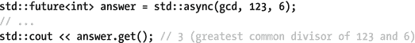
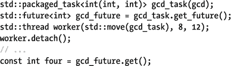
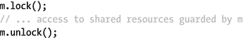
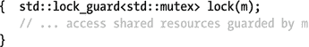
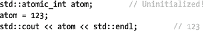

# 七、并发

## 线程`<thread>`

线程是能够编写并行运行的代码的基本构件。

### 启动新线程

要在新的执行线程中运行任何函数指针、仿函数或 lambda 表达式，请将它传递给`std::thread`的构造函数，以及任意数量的参数。例如，这两行是等价的:

```cpp
std::thread worker1(function, "arg", anotherArg);
std::thread worker2([=] { function("arg", anotherArg); });

```

在从`thread`的构造函数返回之前，带有参数的函数在新启动的执行线程中被调用。

函数及其参数必须首先被复制或移动(例如，对于临时对象或如果使用了`std::move()`)到这个新线程可访问的内存中。因此，要将引用作为参数传递，首先必须使其可复制:例如，使用`std::ref()` / `std::cref()`包装它。当然，您也可以简单地使用带有引用捕获的 lambda 表达式。函子、引用包装器和 lambda 表达式都将在第 2 章中详细讨论。

`thread`类不提供任何检索函数结果的工具。相反，它的返回值被忽略，如果它引发了一个未被捕获的异常，就调用`std::terminate()`(默认情况下会终止进程:参见第 [8 章](8.html))。通过使用在`<future>`头文件中定义的结构，检索函数结果变得更加容易，这将在本章后面详述。

Tip

为了异步执行一个函数并在以后检索它的结果，推荐使用`std::async()`(在`<future>`中定义)而不是`thread`。这通常更容易也更有效(实现`async()`可能使用线程池)。为不一定返回结果的长期运行的并发任务保留线程的使用。

### 线程的生存期

如果一个`std::thread`与一个执行线程相关联，那么它就是可接合的。使用用函数 start out joinable 初始化的`joinable(). thread`来查询该属性，而默认构造的函数 start out non-joinable。之后，线程实例可以按预期移动和交换。然而，复制`thread`对象是不可能的。这确保了在任何时候，最多一个`thread`实例代表一个给定的执行线程。底层本地线程表示的句柄可以通过可选的`native_handle()`成员获得。

关于`std::thread` s，需要记住的两个最重要的事实如下:

*   即使在线程函数执行完毕后,`thread`仍保持可连接状态。
*   如果一个`thread`对象在被析构时仍然是可连接的，那么从它的析构函数中调用`std::terminate()`。

因此，为了确保后一种情况不会发生，一定要确保最终在每个可连接的`thread`上调用以下函数之一:

*   `join()`:阻塞，直到线程函数执行完毕
*   `detach()`:解除`thread`对象与可能继续执行的线程的关联

注意，分离`thread`是以一劳永逸的方式异步执行函数的唯一标准方式。

`std::thread`没有提供终止、中断或恢复底层执行线程的方法。因此，停止线程功能或与之同步必须使用其他方法，如互斥或条件变量，这两种方法将在本章后面讨论。

### 线程标识符

每个活动线程都有一个唯一的`thread::id`，它提供了线程标识符通常需要的所有操作:

*   它们可以输出到字符串流(例如，用于日志记录)。
*   可以使用`==`对它们进行比较(例如，测试/断言某个函数在某个特定线程上执行)。
*   它们可以在有序和无序的关联容器中用作键:所有的比较操作符(`<`、`>=`等等)都被定义，就像`std::hash()`的专门化一样。

如果一个`std::thread`对象是可连接的，你可以在它上面调用`get_id()`来获得相关线程的标识符。所有不可连接的`thread`都有一个等同于默认构造的`thread::id`的标识符。要获取当前活动线程的标识符，还可以调用全局`std::this_thread::get_id()`函数。

### 实用功能

静态`std::thread::hardware_concurrency()`函数返回当前硬件支持的并发线程数(或其近似值),如果无法确定，则返回零。这个数字可能大于物理内核的数量:例如，如果硬件支持同步多线程(英特尔称之为超线程)，这将是内核数量的偶数倍(通常是两倍)。

除了`get_id()`，`std::this_thread`名称空间包含三个额外的函数来操纵当前的执行线程:

*   `yield()`提示实现重新调度，允许其他活动线程继续执行。
*   `sleep_for(duration)`和`sleep_until(time_point)`暂停当前线程一段时间或直到给定时间；使用第 [2 章](2.html)中描述的`<chrono>`中的类型指定超时。

### 例外

除非在此注明，否则`<thread>`中的所有函数都声明为`noexcept`。几个`std::thread`成员调用本地系统函数来操纵本地线程。如果这些失败，则抛出一个`std::` `system_error`并带有以下错误代码之一(参见第 [8](8.html) 章了解更多关于`system_error` s 和错误代码的信息):

*   `resource_unavailable_try_again`如果在构造函数中不能创建新的本机线程
*   `invalid_argument`如果`join()`或`detach()`在不可连接的线程上被调用
*   `no_such_process`如果`join()`或`detach()`被调用并且线程无效
*   `resource_deadlock_would_occur`如果从相应的执行线程调用可加入线程上的`join()`

通过抛出一个`std::bad_` `alloc`的实例或者一个从`bad_alloc`派生的类，也可以报告在构造函数中分配存储失败。

## 期货`<future>`

`<future>`头提供了从正在、将要或已经执行的函数中检索结果(值或异常)的工具，通常在不同的线程中。从概念上讲，线程安全的通信通道是在单个提供者和一个或多个返回对象(`T`可能是`void`或引用类型)之间建立的:


共享状态是一个内部引用计数对象，在单个提供者和一个或多个返回对象之间共享。提供者异步地将结果存储到它的共享状态中，然后该状态被称为就绪。获得这个结果的唯一方法是通过一个相应的返回对象。

### 返回对象

所有返回对象都有一个同步的`get()`函数，该函数会阻塞，直到相关的共享状态就绪，然后或者返回提供的值(可能是`void`)或者在调用线程中重新抛出提供的异常。

要等到结果准备好而不实际检索它，使用等待函数之一:`wait()`、`wait_until(time_point)`或`wait_for(duration)`。前者无限期等待，后两者等待的时间不会超过使用`<chrono>`(第 [2 章](2.html)中定义的类型之一指定的超时时间。

与共享状态相关联的返回对象被认为是有效的。可以使用`valid()`检查有效性。有效的`future`不能直接构造，但必须总是从共享状态的单一提供者获得。

`std::futures`有两个重要的限制:

*   每个共享状态只能有一个有效的`future`，就像只能有一个提供者一样。也就是说，每个提供者只允许创建一个`future`，并且`future`永远不能被复制，只能被移动(`future`也不能被交换)。
*   `get()`只能调用一次；也就是说，调用`get()`释放了`future`对共享状态的引用，使得`future`无效。在这之后再次调用`get()`抛出一个异常。本节末尾总结了出现的异常以及出现的时间。

一个`shared_future`完全等价于一个`future`，但没有这两个限制:即它们可以被复制，`get()`可能被调用不止一次。一个`shared_future`是通过在一个`future`上调用`share()`获得的。这也只能做一次，因为它使`future`无效。但是一旦你有了一个`shared_future`，更多的可以通过复制来创造。以下是一个概述:


### 提供者

`<future>`库提供了三个不同的提供者:`std::async()`、`packaged_task`和`promise` s。本节将依次讨论每一个。作为异步计算的工作负载示例，我们使用以下最大公约数函数:


#### 异步ˌ非同步(asynchronous)

在返回可用于检索结果的`std::future`对象之前，调用`std::async()`调度给定函数的异步执行:



与`std::thread`构造函数一样，几乎可以使用任何类型的函数或函数对象，函数及其参数都被移动或复制到它们的异步执行上下文中。

一旦函数执行完毕，函数调用的结果就进入共享状态。如果函数抛出一个异常，这个异常被捕获并被放入共享状态；如果成功，返回值将被移动到那里。

该标准定义了额外的对`std::async()`的覆盖，将`std::launch`的实例作为第一个参数。支持的值至少包括以下`enum`值(允许实现定义更多):

*   使用`std::launch::async`，函数就像在一个新的执行线程中一样被执行，尽管实现可能使用例如线程池来提高性能。
*   对于`std::launch::deferred`，直到对`async()`的这次调用的返回对象之一调用`get()`时，该函数才被执行。该函数在调用`get()`的第一个线程中执行。

这些选项可以使用`|`操作符进行组合。例如，组合`async | deferred`鼓励实现利用任何可用的并发性，但是如果没有足够的并发性，允许推迟到调用`get()`时。这种组合也是在没有指定显式启动策略时使用的默认策略。

当使用包含`async`的启动策略时，有一个重要的注意事项(也就是说，使用默认策略)。从概念上讲，执行异步函数的线程归共享状态所有，共享状态的析构函数与之相联。结果，下面变成了`f()`的同步执行:


这是因为`async()`返回的临时`future`的销毁会一直阻塞到`f()`执行完毕(内部共享状态的销毁与`f()`运行的`thread`汇合)。

Tip

要启动一个函数而不等待它的结果，也就是所谓的一劳永逸，创建一个`std::thread`对象并`detach()`它。

#### 打包的任务

一个`packaged_task`是一个函子，当它的`operator()`被调用时执行一个给定的函数，然后将结果(即一个值或一个异常)存储到一个共享状态中。例如，这可以用来获取由`std::thread`执行的函数的结果(回想一下，`thread`函数的返回值被忽略，如果函数抛出异常，则调用`std::terminate()`):



用任何函数、仿函数或 lambda 表达式构造的`packaged_task`有一个相关的共享状态，因此称为`valid()`；默认构造的任务不是`valid()`。使用`get_future()`可以获得单个`future`到`get()`函数的结果。

像所有的提供者一样，`packaged_task`不能被复制，只能被移动或交换。这就是为什么在前面的例子中，我们必须将任务仿函数移动到`thread`(在首先获得它的`future`之后)。然而，它是唯一可以被多次使用的提供者:有效的`packaged_task`上的`reset()`释放其旧的共享状态，并将其与新创建的状态相关联。重置无效任务会引发异常。

有一个额外的成员函数`make_ready_at_thread_exit()`，它像`operator()`一样执行任务的函数，除了它直到调用线程退出时才使共享状态就绪。这是在销毁所有线程本地对象之后完成的，用于避免争用情况:


#### 承诺

`promise`与`future`相似，但代表通信通道的输入端，而不是输出端。未来具有阻塞`get()`功能，承诺提供非阻塞`set_value()`和`set_exception()`功能。

新的`promise`是默认构造的，不能复制，只能移动或交换。从每个`promise`中，可以使用`get_future()`获得一个单独的`future`。如果请求第二个，则会引发异常。这里有一个例子:


还有第二组成员函数来填充结果:`set_value_at_thread_exit()`和`set_exception_at_thread_exit()`。这再次推迟了共享状态的准备，直到调用线程退出，从而确保这发生在销毁任何线程本地对象之后。

### 例外

如果被误用，`<future>`头中的大多数函数都会抛出异常。因为所有提供者和返回对象的行为是一致的，所以这一节提供了概述。以下讨论涉及标准异常类以及错误代码和类别的概念，所有这些都将在第 [8](8.html) 章中详细解释。

像往常一样，默认和移动构造函数、移动赋值操作符和`swap()`函数被声明为`noexcept`，当然析构函数也从不抛出异常。除了这些，只有`valid()`功能是`noexcept`。

provider 和 return 对象的大多数其他成员函数在出错时抛出一个`std::future_error`，它是`std::logic_error`的子类。不过，与`std::system_error`更相似的是，`future_error`也有一个返回`std::error_code`的`code()`成员，在本例中，这个成员的`category()`等于`std::future_category()`(其`name()`等于`"future"`)。对于`future_error` s，`error_code`的`value()`始终等于错误代码`enum`类`std::future_`的四个值之一`errc`:

*   `broken_promise`，如果`get()`在共享状态的返回对象上被调用，而该对象是由共享状态的提供者释放的——因为它的析构函数、移动赋值函数或`reset()`函数被调用——而没有首先使共享状态就绪。
*   `future_already_retrieved`，如果`get_future()`在同一个提供者上被调用两次(没有`packaged_task`的`reset()`)。
*   `promise_already_satisfied`，如果通过`set`功能或通过重新执行`packaged_task`多次使共享状态就绪。
*   `no_state`，如果在没有关联状态的提供程序上调用除前面列出的非抛出成员之外的任何成员。对于非`valid()`返回对象，我们鼓励实现也这样做。

当使用`async`启动策略时，`async()`可能会抛出一个带有错误代码`resource_unavailable_try_again`的`system_error`，如果它无法创建一个新线程的话。

## 互斥`<mutex>`

互斥(互斥的缩写)是同步对象，用于防止或限制对共享内存和其他资源(如外围设备、网络连接和文件)的并发访问。

除了大量的互斥和锁类型选择之外，`<mutex>`头还定义了`std::call_once()`，用于确保给定的函数只被调用一次。本节末尾介绍了`call_once()`实用程序。

### 互斥和锁

`std::mutex`对象`m`的基本用法如下:



`lock()`函数会一直阻塞，直到线程获得互斥体的所有权。对于一个基本的`std::mutex`对象，在任何给定时间只有一个线程被授予独占所有权。目的是只有拥有给定互斥体的线程才被允许访问它所保护的资源，从而防止数据竞争。一个线程保留这个所有权，直到它通过调用`unlock()`来释放它。一旦解锁，另一个被阻塞在`mutex`上的线程(如果有的话)被唤醒并被授予所有权。线程被唤醒的顺序是未定义的。

至关重要的是，任何和所有对锁定函数的成功调用都与对`unlock()`的调用成对出现。为了确保这是以一致和异常安全的方式完成的，您应该避免直接调用这些锁定和解锁函数，而是使用资源获取是初始化(RAII)习惯用法。为此，标准库提供了几个锁类。最简单、最精简的锁是`lock_guard`，它简单地在其构造函数中调用`lock()`，在其析构函数中调用`unlock()`:



#### 例子


结果 2000。移除`lock_guard`几乎肯定会导致小于 2000 的值，当然，除非您的系统不能并发执行线程。

### 互斥类型

标准库提供了几种风格的互斥体，每一种都比基本的`std::mutex`有更多的功能。更受限制的互斥类型通常可以更有效地实现。

<colgroup><col> <col> <col> <col> <col></colgroup> 
| 互斥类型 | 递归的 | 超时设定 | 共享 | 页眉 |
| --- | --- | --- | --- | --- |
| `mutex` | 不 | 不 | 不 | `<mutex>` |
| `recursive_mutex` | 是 | 不 | 不 | `<mutex>` |
| `timed_mutex` | 不 | 是 | 不 | `<mutex>` |
| `recursive_timed_mutex` | 是 | 是 | 不 | `<mutex>` |
| `shared_timed_mutex` | 不 | 是 | 是 | `<shared_mutex>` |
| `shared_mutex`[<sup>1</sup>T4】](#Fn1) | 不 | 不 | 是 | `<shared_mutex>` |

#### 通用功能

除了前面解释的`lock()`和`unlock()`函数之外，所有的互斥类型还支持`try_lock()`，一个`lock()`的非阻塞版本。如果可以立即获得所有权，则返回`true`；否则返回`false`。 [<sup>2</sup>](#Fn2)

实现还可能提供一个`native_handle()`成员，返回底层本机对象的句柄。

没有一种互斥类型允许复制、移动或交换。

#### 递归

递归互斥体(也称为可重入互斥体)允许已经拥有互斥体的线程调用锁函数。这样做时，锁定会立即成功。但是要小心:为了释放所有权，每次成功调用一个锁函数，都必须调用一次`unlock()`。因此，和往常一样，最好使用 RAII 锁对象。

对于非递归互斥类型，按照标准，锁定已经拥有的互斥体的行为是未定义的，但是这很可能导致死锁。

#### 超时设定

定时互斥增加了两个额外的锁功能，它们会一直阻塞到给定的超时:`try_lock_for(duration)`和`try_lock_until(time_point)`。通常，使用`<chrono>`中定义的类型指定超时，在第 [2](2.html) 章中解释。两个函数都返回一个布尔值:`true`如果互斥体的所有权获得成功，或者`false`如果指定的超时首先发生。

#### 共享所有权`<shared_mutex>`

只要不被修改，许多类型的共享资源可以被安全地并发访问。例如，对于共享内存，多个线程可以安全地从一个给定的位置读取数据，只要没有线程同时向它写入数据。在这种情况下，限制对单个线程的读访问过于保守，可能会损害性能。

因此,`<shared_mutex>`头定义了支持共享锁定的互斥体，在它们与所有其他互斥体类型共有的独占锁定模式之上。这种互斥体通常也称为读者-作者互斥体或多读者/单作者互斥体。

想要修改/写入资源的线程必须获得互斥体的独占所有权。这是通过使用与所有互斥类型完全相同的一组函数或锁对象来完成的。然而，只想检查/读取资源的线程可以获得共享所有权。获得共享所有权的成员完全类似于获得独占所有权的成员，除了他们的名称中的`lock`被替换为`lock_shared`；也就是说，它们被命名为`lock_shared()`、`try_lock_shared_for()`等等。使用`unlock_shared()`释放共享所有权。

当一个或多个线程获得共享所有权时，不授予独占所有权，反之亦然。该标准没有定义授予所有权的顺序，也没有定义线程以任何方式被解除阻塞的顺序。

该标准定义的共享锁目前不支持在没有首先解锁的情况下将所有权从共享升级到独占，或者从独占降级到共享。

### 锁类型

该标准提供了三种锁类型:std::lock_guard、unique_lock 和 shared_lock。

#### 标准::锁定 _ 保护

`lock_guard`是一个简单的教科书式的 RAII 模板类:默认情况下，它在构造函数中锁定一个互斥体，在析构函数中解锁。唯一的额外成员是一个构造函数，用于调用线程已经拥有的互斥体。这个构造函数通过传递全局`std::adopt_lock`常量来调用:

```cpp
std::lock_guard<std::mutex> lock(m, std::adopt_lock);

```

#### 标准::唯一 _ 锁定

虽然`lock_guard`很简单，效率也很高，但是它的功能有限。为了促进更高级的场景，标准定义了`unique_lock`。

基本用法是一样的:

```cpp
std::unique_lock<std::mutex> lock(m);

```

然而，`unique_lock`与`lock_guard`相比有几个额外的特性，包括:

*   一个`unique_lock`可以移动和交换(当然不能复制)。
*   它有一个`release()`函数来解除它与底层互斥体的关联，而不用解锁它。
*   成员返回一个指向底层互斥体的指针。

然而，真正使`unique_lock`与众不同的是，它提供了释放和(重新)获得互斥体所有权的功能。具体来说，它支持与底层互斥类型完全相同的一组锁定函数:`lock()`、`try_lock()`和`unlock()`，以及针对定时互斥类型的定时锁定函数。`unique_lock`的锁定函数只能被调用一次，即使底层互斥体是递归的，否则将抛出异常。要检查`unique_lock`是否会在销毁时解锁，调用`owns_lock()` ( `unique_lock`也会将这个值转换为布尔值)。

除了带有给定互斥体的显而易见的构造函数之外，`unique_lock`类还支持三种可选的构造函数，在这些构造函数中传递一个额外的常量:

*   `adopt_lock`:当互斥体已经被当前线程拥有时使用(类似于等价的`lock_guard`构造函数)。
*   `defer_lock`:施工中不要上锁的信号；其中一个锁定功能可以在以后用来锁定互斥体。
*   尝试在构建期间锁定，但如果失败，则不进行锁定。`owns_lock()`可用于检查是否成功。

#### std::shared_lock `<shared_mutex>`

`lock_guard`和`unique_lock`都管理互斥体的独占所有权。为了可靠地管理共享所有权，`<shared_mutex>`定义了`std::shared_lock`，除了获取/释放共享所有权之外，它完全等同于`unique_lock`。即使他们获得共享所有权，其锁定和解锁成员的名称也不包含`shared`。这样做是为了确保`shared_lock`满足其他实用程序的要求，如`std::lock()`和`std::condition_variable_any`，两者将在后面讨论。

### 锁定多个互斥体

一旦线程需要同时获得多个互斥体的所有权，死锁的风险就迫在眉睫。可以采用不同的技术来防止这种死锁:例如，以相同的顺序锁定所有线程中的互斥锁(容易出错)，或者所谓的尝试后退方案。标准库提供了模板化的助手函数来促进这一点:

```cpp
std::lock(lockable1, lockable2, ..., lockableN);

```

该函数将一直阻塞，直到获得传递给它的所有可锁定对象的所有权。这些可以是互斥体(在锁定后，您应该使用它们的`adopt_lock`构造函数将其转移到 RAII 锁)，但也可以是`unique_`或`shared_lock`(例如，用`defer_lock`构造)。尽管标准没有规定如何实现这一点，但是如果所有线程都使用`std::lock()`，就不会出现死锁。

当然，也存在相当于`std::lock()`的非阻塞`std::try_lock()`。它按照对象被传递的顺序对所有对象调用`try_lock()`,并返回失败的第一个`try_lock()`的从 0 开始的索引，如果它们都成功，则返回-1。如果它未能锁定对象，任何已锁定的对象将首先被再次解锁。

### 例外

在互斥体被完全构造之前或被析构之后使用它会导致未定义的行为。如果使用得当，只有下面提到的函数可能会抛出异常。

对于互斥体，所有的`lock()`和`lock_shared()`函数(不是`try_`的变体)可能会抛出一个`system_error`，其中包含一个错误代码(参见第 [8 章](8.html)):

*   `operation_not_permitted`，如果调用线程权限不足。
*   `resource_deadlock_would_occur`如果实现检测到死锁将会发生。不过，死锁检测只是可选的:千万不要依赖它！
*   `device_or_resource_busy`如果因为底层句柄已经锁定而无法锁定。当然，只针对非递归互斥体，但同样:检测只是可选的。

任何超时的锁定函数，包括`try_`变量，也可能抛出超时相关的异常。

通过扩展，`std::lock()`和 RAII 锁的构造函数和锁定函数也可能抛出相同的异常。如果`owns_lock() == true`(即使底层互斥体是递归的)，任何 RAII 锁定函数(包括`try_`变体)肯定会抛出一个带有`resource_deadlock_would_occur`的`system_error`，如果`owns_lock() == false`，它们的`unlock()`成员将抛出一个带有`operation_not_permitted`的。

如果任何锁定函数抛出异常，就可以保证没有互斥锁被锁定。

### 调用一次函数`<mutex>`

`std::call_once()`是一个线程安全的实用函数，确保其他函数最多被调用一次。例如，这对于实现惰性初始化习惯用法很有用:

```cpp
std::once_flag flag;
...
std::call_once(flag, initialise, "a string argument");

```

只有用给定的`std::once_flag`实例调用`call_once()`的单个线程——一个默认可构造的、不可复制的、不可移动的助手类——有效地执行与其一起传递的函数。任何后续调用都没有效果。如果多个线程同时用同一个标志调用`call_once()`，那么除了一个之外，所有线程都被挂起，直到执行该函数的线程完成调用。用相同的标志递归调用`call_once()`会导致未定义的行为。

函数的任何返回值都会被忽略。如果运行函数抛出异常，这将在调用线程中抛出，并且允许另一个线程使用该标志再次执行。如果有线程被阻塞，其中一个会被唤醒。

请注意，`call_once()`通常比容易出错的双重检查锁定(反)模式更有效，应该始终优先使用。

Tip

函数局部静态(又名魔术静态)与`call_once()`有着完全相同的语义，但实现起来可能更加高效。因此，尽管`call_once()`可以很容易地用于单例设计模式的线程安全实现(留给您作为练习)，但建议使用函数局部静态:

```cpp
Singleton& GetInstance() {
   static Singleton instance;
   return instance;
}

```

## 条件变量`<condition_variable>`

条件变量是一个同步原语，它允许线程等待，直到某个用户指定的条件变为`true`。条件变量总是与互斥体协同工作。这个互斥体还旨在防止检查和设置条件之间的竞争，这本来是由不同的线程完成的。

### 等待一个条件

假设以下变量在线程间以某种方式共享:

```cpp
std::mutex m;
std::condition_variable cv;
bool ready = false;

```

那么等待`ready`变成`true`的典型模式是


要使用`condition_variable`等待，线程必须首先使用`std::unique_lock<std::mutex>`锁定相应的互斥体。 [<sup>3</sup>](#Fn3) 当`wait()`阻塞线程时，它也解锁互斥体:这允许其他线程锁定互斥体以满足共享条件。当一个等待线程被唤醒时，在从`wait()`返回之前，它总是首先使用`unique_lock`再次锁定互斥体，使得重新检查条件变得安全。

Caution

虽然等待条件变量的线程通常保持阻塞状态，直到对该变量发出通知(稍后讨论)，但是它们也有可能(尽管不太可能)在没有通知的情况下随时自动醒来。这些被称为虚假唤醒。这种现象使得像示例中那样始终检查循环中的条件变得至关重要。

或者，所有等待函数都有一个重载，该重载将谓词函数作为参数:可以使用任何返回可以计算为布尔值的函数或仿函数。例如，示例中的循环相当于

```cpp
cv.wait(lock, [&]{ return ready; });

```

有两组额外的等待函数，它们永远不会阻塞超过给定的超时:`wait_until(time_point)`和`wait_for(duration)`。超时总是使用在`<chrono>`头中定义的类型来表示。wait_until()和 wait_for()的返回值如下:

*   没有谓词的函数版本从枚举类`std::cv_status`返回值:`timeout`或`no_timeout`。
*   接受谓词函数的重载返回一个布尔值:`true`,如果谓词在一个通知、一个虚假的唤醒或超时到达后返回`true`;否则，他们返回`false`。

### 通知

提供了两个通知函数:`notify_all()`，它释放所有等待条件变量的线程，和`notify_one()`，它只释放一个线程。未指定唤醒多个等待线程的顺序。

通知通常发生在条件发生变化时:

```cpp
{  std::lock_guard<std::mutex> lock(m);
   ready = true;
}
cv.notify_all();

```

请注意，在调用通知函数时，通知线程不需要拥有互斥体。事实上，任何未阻塞的线程做的第一件事就是试图锁定互斥体，因此在通知之前释放所有权实际上可能会提高性能。 [<sup>4</sup>](#Fn4)

还有一个通知函数，但它是非成员函数，具有以下签名:

```cpp
void std::notify_all_at_thread_exit(condition_variable& cv,
                                    unique_lock<mutex> lock);

```

当互斥体已经被调用线程通过给定的`unique_lock`拥有时，并且当没有线程正在等待使用不同互斥体的条件变量时，它将被调用；否则，行为是未定义的。当被调用时，它在删除所有线程本地对象后，在线程退出时调度以下操作序列:

```cpp
lock.unlock();
cv.notify_all();

```

### 例外

如果可用内存不足，条件变量的构造函数可能抛出一个`std::bad_alloc`，或者如果由于非内存相关的资源限制而无法创建条件变量，则抛出一个带有`resource_unavailable_try_again`的`std::system_error`作为错误代码。

析构线程仍在等待的条件变量会导致未定义的行为。

## 同步

非正式地说，对于单线程程序，优化实现(编译器、内存缓存和处理器的组合)受假设规则的约束。本质上，在一个结构良好的程序中，只要程序的可观察行为(I/O 操作等)就好像指令是按照编写的那样执行的，就可以随意地对指令进行重新排序、省略、发明等等。

然而，在多线程程序中，这还不够。如果没有适当的同步，并发访问共享资源不可避免地会导致数据和其他竞争，即使每个线程都遵守假设规则。

尽管对内存模型的完整、正式的描述超出了本快速参考的范围，但本章还是对不同构造所施加的同步约束进行了简要的非正式介绍，重点放在编写多线程程序时的实际应用上。我们首先使用互斥体介绍所有基本的同步原理。回忆以下内容:


首先，同步构造引入了对单个执行线程中允许的代码重新排序的约束。例如，锁定和解锁互斥体会注入特殊指令，分别称为获取和释放栅栏。这些指令告诉实现(不仅仅是编译器，还有所有执行代码的硬件！)遵守这些规则:任何代码都不能上移获取栏或下移发布栏。总之，这确保了没有代码在临界区之外执行，临界区在`lock()`和`unlock()`之间。

第二，栅栏在不同的执行线程之间施加约束。这可以解释为对允许并发线程的指令交错到假想的单个指令序列中的限制。例如，在一个线程中释放互斥体的所有权被认为是与在另一个线程中获取互斥体的所有权同步:本质上，在任何交错中，前者必须发生在后者之前。结合前面解释的线程内约束，这意味着在后一个线程进入其临界段之前，前一个线程的整个临界段被保证完全执行。

对于条件变量，同步属性由相应互斥体上的操作所隐含。

对于`std::thread` s，以下适用:

*   当启动一个`thread`时，它的构造函数注入一个释放栅栏，它与线程函数执行的开始同步。这意味着您可以在启动`thread`之前写入共享内存(例如，初始化它或传递输入),然后安全地(无需额外的同步)从线程函数中访问它。
*   相反，`thread`函数执行的结束与它的`join()`函数内的获取栅栏同步。这确保了加入线程可以安全地读取由线程函数写入的所有共享数据。

最后，对于`<future>`头中的构造，通过提供者使共享状态就绪包含一个释放栅栏，它与同一共享状态的返回对象的`get()`内的获取栅栏同步。因此，调用`get()`的线程不仅可以安全地读取结果(幸运的是)，还可以安全地读取提供者编写的任何其他值。例如，`future<void>`可以用来等待，直到一个线程完成了对共享内存的异步写入。或者一个`future<T*>`可以指向由提供者函数创建的整个数据结构。

Note

所有这些可以总结如下:不同步的数据竞争(线程并发访问内存，至少有一次写入)的行为是未定义的。然而，只要您始终使用标准库提供的同步结构，您的程序通常会完全按照预期运行。

## 原子操作`<atomic>`

首先也是最重要的是，`<atomic>`头定义了两种类型的原子变量，其操作是原子的或无数据竞争的特殊变量:`std::atomic<T>`和`std::atomic_flag`。此外，它提供了一些低级函数来显式地引入栅栏，如本节末尾所解释的。

### 原子变量

`std::atomic<T>`类型的变量大多表现得像常规的`T`变量——感谢明显的构造函数、赋值和强制转换操作符——提供了一组有限的细粒度原子操作，具有特定的内存一致性属性。稍后会有更多的细节，但是首先我们介绍一下`atomic<T>`的模板专门化。

#### 模板专门化和类型定义

`atomic<T>`模板至少可以与任何普通的可复制的 [<sup>5</sup>](#Fn5) 类型`T`一起使用，并且为布尔以及所有其他整型和指针类型`T*`定义了专门化。后两者提供了额外的操作，如下所述。

对于布尔和整数特化，定义了便利的`typedef`。对于`std::atomic<xxx>`，这些大多等于`std::atomic_xxx`。具体来说，对于`xxx`等于`bool`、`char`、`char16_t`、`char32_t`、`wchar_t`、`short`、`int`、`long`或者`<cstdint>`中定义的任何整数类型都是如此(参见第[章 1](1.html) )。对于剩余的整数类型，`typedef`缩写了`xxx`类型的第一个字:

<colgroup><col> <col> <col> <col></colgroup> 
| `typedef` | `xxx` | `typedef` | `xxx` |
| --- | --- | --- | --- |
| `std::atomic_schar``std::atomic_uchar``std::atomic_ushort`T3】 | `signed char``unsigned char``unsigned short`T3】 | `std::atomic_ulong``std::atomic_llong`T2】 | `unsigned long``long long`T2】 |

#### 通用原子操作

一个`atomic<T>`变量的默认构造函数的行为与一个常规`T`变量的声明完全一样:也就是说，它通常不初始化值；只有静态或线程本地的`atomic`变量是零初始化的。用给定的`T`值初始化的构造函数也存在。不过，这种初始化不是原子的:来自另一个线程的并发访问，即使是通过原子操作，也是一种数据竞争。原子变量不能被复制、移动或交换。

所有的`atomic<T>`类型都有一个接受`T`值的赋值操作符和一个转换为`T`的转换操作符，因此可以用作常规的`T`变量:



与这些操作符相当的是`store()`和`load()`成员。例如，前面代码片段的最后两行也可以写成


无论哪种方式，这些操作都是原子的，换句话说，是无数据竞争的。也就是说，如果一个线程同时将一个值存储到一个原子变量中，而另一个线程正在从该原子变量中加载，那么后者看到的要么是存储之前的旧值，要么是新存储的值，而不是两者之间的值(没有半写值)。或者用技术术语来说，不存在撕裂读数。类似地，当两个线程同时存储一个值时，其中一个值被完全存储；从来没有被撕掉的字迹。对于常规变量，这种情况是数据竞争，因此会导致未定义的行为，包括可能的读写错误。

所有的原子变量还提供一些不太明显的原子操作，`exchange()`和`compare_exchange`。这些成员函数的行为就好像实现如下:

<colgroup><col> <col></colgroup> 
| `T exchange(T newVal) {``T oldVal = load();``store(newVal);``return oldVal;`T4】 | `bool compare_exchange(T& oldVal, T newVal) {` `if (load() == oldVal) {` `store(newVal); return true;` `} else {` `oldVal = load(); return false;` |

当然，这两种操作都是原子性的。也就是说，它们(有条件地)以这样一种方式交换值，即在交换期间没有线程可以并发地存储另一个值或经历一次损坏读取。

没有名为`compare_exchange`的实际成员。相反，有两种不同的变体:`compare_exchange_weak()`和`compare_exchange_strong()`。唯一(微妙)的区别是前者被允许虚假地失败:也就是说，即使可以进行有效的交换，也会偶尔返回`false`。这种“弱”变体可能比“强”变体稍快，但只用于循环中。后者旨在用作独立的陈述。

`exchange()`和`compare_exchange`操作是实现无锁数据结构的关键构件:不使用阻塞互斥的线程安全数据结构。这是一个高级的话题，最好留给专家们来讨论。不过，一个经典的例子是在单链表的开头添加一个新节点:


本节介绍的所有操作对于任何基本类型`T`都是原子的。对于布尔、整数和指针等类型，大多数编译器只是生成一些保证原子性的特殊指令(目前大多数 CPU 都支持这一点)。如果是，`lock_free()`返回`true`。对于其他类型，原子变量大多依靠类似互斥的结构来实现原子性。对于这样的类型，`lock_free()`返回`false`。

注意:尽管原子变量确保加载和存储是原子的，但这并不意味着底层对象上的操作是原子的。在下面的例子中，如果另一个线程同时调用`person`对象上的`GetLastName()`，那么就会与`SetLastName()`发生数据竞争:


#### 整数和指针类型的原子操作

某些模板专门化提供了额外的操作符来自动更新变量。选择基于当前硬件通常支持的原子指令(例如，无乘法):

*   原子积分变量:`++`、`--`、`+=`、`-=`、`&=`、`|=`、`^=`
*   原子指针变量:`++`、`--`、`+=`、`-=`

支持前缀和后缀版本的`++`和`--`。对于其他操作员，等效的非操作员成员也同样可用:分别为:`fetch_add()`、`fetch_sub()`、`fetch_and()`、`fetch_or()`和`fetch_xor()`。

#### 同步

除了原子性之外，原子变量的一个鲜为人知的属性是它们提供了与互斥或线程相同的同步保证。具体来说，所有写入变量的操作(`store()`、`exchange` s、`fetch_xxx`())都包含与从同一变量读取的操作(`load()`、`exchange` s、`fetch_xxx()`等)中的获取围栏同步的释放围栏。这使得下面的习惯用法成为可能，在将潜在的复杂对象或数据结构存储到共享原子变量中之前，先对其进行初始化:


任何加载指向新对象的指针的线程(在这个例子中是一个`Person`)也可以安全地读取它所指向的所有其他内存(例如名称字符串),只要这是在释放栅栏之前完全写入的。

所有原子操作(当然除了操作符)都接受一个额外的可选参数(或多个参数)，允许调用者微调内存顺序约束。可能的值有`memory_order_relaxed, memory_order_consume`、`memory_order_acquire`、`memory_order_release, memory_order_acq_rel`和`memory_order_seq_cst`(默认)。例如，第一个选项`memory_order_relaxed`表示操作必须是原子的，并且不需要进一步的内存顺序约束。其他选项之间的细微差别超出了本书的范围。除非您是专家，否则我们建议您始终坚持使用默认值。否则，您可能会引入微妙的错误。

### 原子标志

`std::atomic_` `flag`是一个简单的、保证无锁的、原子的、类似布尔的类型。它只能是默认构造的，不能复制、移动或交换。没有指定默认构造函数是否初始化该标志。唯一保证有效的初始化就是这个表达式:


一个`atomic_flag`只提供另外两个成员:

*   `void clear()`:自动将标志设置为`false`
*   `bool test_and_set()`:自动将标志设置为`true`，同时返回其先前值

这两个函数都具有类似于`atomic_bool` s 的同步属性，并且同样接受可选的`std::memory_order`参数。

### 非成员函数

为了与 C 兼容，`<atomic>`为`std::atomic<T>`和`std::atomic_flag` : `atomic_init()`、`atomic_load()`、`atomic_fetch_add()`、`atomic_flag_test_and_set()`等等的所有成员函数定义了非成员对等函数。作为一名 C++ 程序员，通常不需要这些:只需使用类的成员函数。

### 藩篱

`<atomic>`头还提供了两个函数来显式创建获取和/或释放围栏:`std::atomic_thread_fence()`和`std::atomic_signal_fence()`。栅栏的概念在本章前面已经解释过了。两者都采用一个`std::memory_order`参数来指定期望的栅栏类型:`memory_order_release`表示释放栅栏，`memory_order_acquire`或`memory_order_consume`表示获取栅栏，`memory_order_acq_rel`和`memory_order_seq_cst`表示同时是获取和释放栅栏，后一个选项表示栅栏必须是顺序一致的变体(它们的语义差异不在本书讨论范围之内)。带`memory_order_relaxed`的栅栏没有效果。

这两个函数的区别在于，后者只限制线程和在同一线程中执行的信号处理程序之间的重新排序。后者只约束编译器，但不注入任何指令来约束硬件(内存缓存和 CPU)。

Caution

不鼓励使用显式栅栏:原子变量或其他同步结构具有更有趣的同步属性，通常应该优先使用。

Footnotes [1](#Fn1_source)

预定由标准库的 C++17 版本添加。

  [2](#Fn2_source)

虽然通常不常见，但是允许`try_lock()`虚假地失败:也就是说，即使互斥体不属于任何其他线程，也返回`false`。在设计更高级的同步场景时要考虑到这一点。

  [3](#Fn3_source)

对于`condition_variable`，必须使用这种确切的锁和互斥类型。为了使用其他标准类型，或者任何具有公共`lock()`和`unlock()`功能的对象，声明更通用的`std::condition_variable_any`类，这在其他方面类似于`condition_variable`。

  [4](#Fn4_source)

必须注意:它在设置条件和通知等待线程之间引入了一个竞争条件窗口。在某些情况下，在持有锁的同时进行通知实际上可能会导致更可预测的结果，并避免微妙的竞争。如果有疑问，最好不要在通知时解锁互斥体，因为对性能的影响可能很小。

  [5](#Fn5_source)

普通的可复制类型没有普通的复制/移动构造函数/赋值，没有虚函数或虚基，也没有普通的析构函数。本质上，这些是可以安全地逐位复制的类型(例如，使用`memcpy()`)。