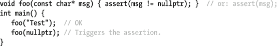
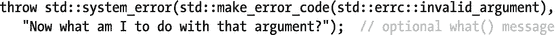
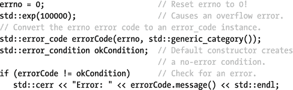

# 8.诊断学

## 断言`<cassert>`

断言是布尔表达式，在代码中的给定点应该是`true`。`<cassert>`的`assert`宏定义如下:

```cpp
#ifdef NDEBUG
 #define assert(_)
#else
 #define assert(CONDITION) if (!CONDITION) { print_msg(...); std::abort(); }
#endif

```

如果断言失败，诊断消息将被写入标准错误输出，并调用`std::abort()`，这将终止应用程序而不执行任何清理。在调试应用程序时，如果断言失败，某些 ide 会让您选择继续执行。通常的做法是使用断言作为调试辅助，并在构建应用程序的发布版本时定义`NDEBUG`，将`assert`变成无操作。

断言通常用于检查不变量，比如循环不变量，或者函数前置和后置条件。一个例子是参数验证:



该程序的一个可能输出是

```cpp
Assertion failed: msg != nullptr, file d:\Test\Test.cpp, line 13

```

Caution

确保您提供给`assert()`的条件没有任何副作用，而这些副作用是正确执行您的程序所必需的，因为如果定义了`NDEBUG`(例如，对于一个发布版本)，这个表达式就不会被计算。

## 异常<exception>，<stdexcept></stdexcept></exception>

在`<exception>`中定义的`std::exception`，它本身并不打算被抛出，而是作为标准库定义的所有异常的基类，并且可以作为你自己的基类。图 [8-1](#Fig1) 概述了所有标准例外情况。


图 8-1。

The C++ Standard Library exception hierarchy

一个`exception`可以被复制，并提供一个`what()`方法来返回错误的字符串表示。此函数是虚拟的，应该被重写。返回类型是`const char*`，但是没有指定字符编码(例如，可以使用编码为 UTF-8 的 Unicode 字符串；参见第六章。

在`<stdexcept>`中定义的异常是唯一由应用程序代码抛出的标准异常。通常，`logic_error` s 代表程序逻辑中可避免的错误，而`runtime_error` s 是由超出程序范围的不可预测的事件引起的。`logic_error`、`runtime_error`和它们的大部分子类(除了`system_error` s 和`future_error`，它们需要一个错误代码，这将在后面讨论)必须在构造时传递一个`std::string`或`const char*`指针，之后由`what()`返回。因此，无需进一步覆盖`what()`。

## 异常指针`<exception>`

`<exception>`头提供了`std::exception_ptr`，一种未指定的类似指针的类型，用于存储和传输捕获的异常，即使不知道具体的异常类型。一个`exception_ptr`可以指向任何类型的值，而不仅仅是一个`std::exception`。它可以指向自定义异常类、整数、字符串等。只要至少有一个`exception_ptr`仍在引用它，任何指向的值都保持有效(也就是说，引用计数的智能指针可用于实现`exception_ptr`)。

在`<exception>`中定义了几个函数来处理异常指针:

*   当从`catch()`块内部直接或间接调用时，创建并返回一个引用当前正在运行的异常的`exception_ptr`(记住，这可以是任何类型的异常)(`catch()`块可以调用一个助手函数来处理异常)。如果在没有异常被处理时调用，返回的`exception_ptr`指的是空值。

```cpp
exception_ptr std::current_exception() noexcept

```

*   创建并返回一个指向`t`的`exception_ptr`。

```cpp
template<typename T>
exception_ptr std::make_exception_ptr(T t) noexcept

```

*   重新抛出给定的`exception_ptr`指向的异常。这是获得由一个`exception_ptr`指向的对象的唯一方法。一个`exception_ptr`不能被解引用，也没有 getter 函数。

```cpp
[[noreturn]] void std::rethrow_exception(exception_ptr)

```

一旦被创建，`exception_ptr`可以被复制、比较，特别是与`nullptr`进行赋值和比较。这使得它们在存储和移动异常以及稍后测试异常是否发生时非常有用。为此，`exception_ptr`也可以转换为布尔值:`true`如果它指向一个异常，`false`如果它是一个空指针。默认构造的实例相当于`nullptr`。

例如，异常指针可用于将异常从工作线程转移到主线程(注意，这也是上一章讨论的`<future>`实用程序隐式为您做的事情):


## 嵌套异常`<exception>`

`<exception>`头文件还提供了处理嵌套异常的工具。它们允许您将捕获的异常封装在另一个异常中:例如，用额外的上下文信息扩充它，或者将其转换为更适合您的应用程序的异常。`std::nested_exception`是一个可复制的 mixin [<sup>1</sup>](#Fn1) 类，其默认构造函数捕获`current_exception()`并存储。这个嵌套的异常可以作为一个带有`nested_ptr()`的`exception_ptr`来检索，或者通过使用`rethrow_nested()`来重新抛出它。但是要小心:当调用`rethrow_nested()`而没有存储任何异常时，会调用`std::terminate()`。因此，通常建议您不要直接使用`nested_exception`，而是使用这些辅助方法:

*   抛出一个从`std::nested_exception`和`T`派生的未定义类型(去掉了引用限定符)，可以使用常规的`catch (const T&)`表达式处理，忽略嵌套的异常。作为一个`std::nested_exception`，它也包含了`std::current_exception()`的结果，可以随意地检索和处理。

```cpp
[[noreturn]] template<typename T> void std::throw_with_nested(T&& t)

```

*   如果`t`是从`nested_exception`派生出来的，就在上面调用`rethrow_nested()`；否则什么也不做。

```cpp
template <typename T> void std::rethrow_if_nested(const T& t)

```

下面的示例演示了嵌套异常:

```cpp
void execute_helper() {
   throw std::range_error("Out-of-range error in execute_helper()");
}
void execute() {
   try { execute_helper(); }
   catch (...) {
      std::throw_with_nested(std::runtime_error("Caught in execute()"));
   }
}
void print(const std::exception& exc) {
   std::cout << "Exception: " << exc.what() << std::endl;
   try { std::rethrow_if_nested(exc); }
   catch (const std::exception& e) {
      std::cout << "   Nested ";
      print(e);
   }
}
int main() {
   try { execute(); }
   catch (const std::exception& e) { print(e); }
}

```

这段代码的输出如下:

```cpp
Exception: Caught in execute()
   Nested Exception: Out-of-range error in execute_helper()  

```

## 系统错误`<system_error>`

来自操作系统或其他低级 API 的错误称为系统错误。这些由在`<system_error>`头中定义的类和函数处理:

*   `error_code`: Generally wraps a platform-specific error code (an `int`), although for some categories the error codes are defined by the standard (see Table [8-1](#Tab1)).

    表 8-1。

    Available Error Category Functions and Corresponding Error Condition and Error Code Enum Classes

    <colgroup><col> <col> <col> <col></colgroup> 
    | 单一函数 | 错误条件 | 错误代码 | 页眉 |
    | --- | --- | --- | --- |
    | `generic_category()` | `std::errc` |   | `<system_error>` |
    | `system_category()` |   |   | `<system_error>` |
    | `iostream_category()` |   | `std::io_errc` | `<ios>` |
    | `future_category()` |   | `std::future_errc` | `<future>` |

*   `error_condition`: Wraps a portable, platform-independent error condition (an `int`). The enum class `std::errc` lists the built-in conditions. They correspond to the standard POSIX error codes, defined also as macros in `<cerrno>`. See Table [8-2](#Tab2) at the end of this chapter.

    表 8-2。

    `std::errc` Error Condition Values and Corresponding `<cerrno>` Macros

    <colgroup><col> <col></colgroup> 
    | `std::errc enum`值 | `<cerrno>`宏 |
    | --- | --- |
    | `address_family_not_supported` | `EAFNOSUPPORT` |
    | `address_in_use` | `EADDRINUSE` |
    | `address_not_available` | `EADDRNOTAVAIL` |
    | `already_connected` | `EISCONN` |
    | `argument_list_too_long` | `E2BIG` |
    | `argument_out_of_domain` | `EDOM` |
    | `bad_address` | `EFAULT` |
    | `bad_file_descriptor` | `EBADF` |
    | `bad_message` | `EBADMSG` |
    | `broken_pipe` | `EPIPE` |
    | `connection_aborted` | `ECONNABORTED` |
    | `connection_already_in_progress` | `EALREADY` |
    | `connection_refused` | `ECONNREFUSED` |
    | `connection_reset` | `ECONNRESET` |
    | `cross_device_link` | `EXDEV` |
    | `destination_address_required` | `EDESTADDRREQ` |
    | `device_or_resource_busy` | `EBUSY` |
    | `directory_not_empty` | `ENOTEMPTY` |
    | `executable_format_error` | `ENOEXEC` |
    | `file_exists` | `EEXIST` |
    | `file_too_large` | `EFBIG` |
    | `filename_too_long` | `ENAMETOOLONG` |
    | `function_not_supported` | `ENOSYS` |
    | `host_unreachable` | `EHOSTUNREACH` |
    | `identifier_removed` | `EIDRM` |
    | `illegal_byte_sequence` | `EILSEQ` |
    | `inappropriate_io_control_operation` | `ENOTTY` |
    | `interrupted` | `EINTR` |
    | `invalid_argument` | `EINVAL` |
    | `invalid_seek` | `ESPIPE` |
    | `io_error` | `EIO` |
    | `is_a_directory` | `EISDIR` |
    | `message_size` | `EMSGSIZE` |
    | `network_down` | `ENETDOWN` |
    | `network_reset` | `ENETRESET` |
    | `network_unreachable` | `ENETUNREACH` |
    | `no_buffer_space` | `ENOBUFS` |
    | `no_child_process` | `ECHILD` |
    | `no_link` | `ENOLINK` |
    | `no_lock_available` | `ENOLOCK` |
    | `no_message` | `ENOMSG` |
    | `no_message_available` | `ENODATA` |
    | `no_protocol_option` | `ENOPROTOOPT` |
    | `no_space_on_device` | `ENOSPC` |
    | `no_stream_resources` | `ENOSR` |
    | `no_such_device` | `ENODEV` |
    | `no_such_device_or_address` | `ENXIO` |
    | `no_such_file_or_directory` | `ENOENT` |
    | `no_such_process` | `ESRCH` |
    | `not_a_directory` | `ENOTDIR` |
    | `not_a_socket` | `ENOTSOCK` |
    | `not_a_stream` | `ENOSTR` |
    | `not_connected` | `ENOTCONN` |
    | `not_enough_memory` | `ENOMEM` |
    | `not_supported` | `ENOTSUP` |
    | `operation_canceled` | `ECANCELED` |
    | `operation_in_progress` | `EINPROGRESS` |
    | `operation_not_permitted` | `EPERM` |
    | `operation_not_supported` | `EOPNOTSUPP` |
    | `operation_would_block` | `EWOULDBLOCK` |
    | `owner_dead` | `EOWNERDEAD` |
    | `permission_denied` | `EACCES` |
    | `protocol_error` | `EPROTO` |
    | `protocol_not_supported` | `EPROTONOSUPPORT` |
    | `read_only_file_system` | `EROFS` |
    | `resource_deadlock_would_occur` | `EDEADLK` |
    | `resource_unavailable_try_again` | `EAGAIN` |
    | `result_out_of_range` | `ERANGE` |
    | `state_not_recoverable` | `ENOTRECOVERABLE` |
    | `stream_timeout` | `ETIME` |
    | `text_file_busy` | `ETXTBSY` |
    | `timed_out` | `ETIMEDOUT` |
    | `too_many_files_open` | `EMFILE` |
    | `too_many_files_open_in_system` | `ENFILE` |
    | `too_many_links` | `EMLINK` |
    | `too_many_symbolic_link_levels` | `ELOOP` |
    | `value_too_large` | `EOVERFLOW` |
    | `wrong_protocol_type` | `EPROTOTYPE` |

*   `error_category`:错误代码和情况属于一个类别。类别单例对象负责两种数字之间的转换。
*   `system_error`:一个异常类(见图 [8-1](#Fig1) )，有一个额外的`code()`成员返回一个`error_code`。

除了一个数值之外，`error_code`和`error_condition`对象都有一个对它们的`error_category`的引用。在一个类别中，一个编号是唯一的，但是同一编号可能被不同的类别使用。

所有这些看起来相当复杂，但是这些错误的主要用途仍然很简单。为了比较一个给定的错误代码，比如来自一个被捕获的`system_error`异常的错误代码，可以使用`==`和`!=`操作符。例如:

```cpp
if (systemError.code() == std::errc::argument_out_of_domain)
   ...

```

Note

与`std::ios_base::failure`(第[章 5](5.html) )和`future_error`(第[章 7](7.html) )工作类似。它们还有一个`code()`成员返回一个`error_code`，可以使用`==`和`!=`与已知的代码值(见表 [8-1](#Tab1) )进行比较。

### 标准::错误 _ 类别

不同的`std::error_category`实例被实现为单例:也就是说，每个类别只有一个全局的、不可复制的实例。存在许多预定义的类别，可从表 [8-1](#Tab1) 中列出的全局函数中获得。

一个`std::error_category`有以下方法:

<colgroup><col> <col></colgroup> 
| 成员 | 描述 |
| --- | --- |
| `name()` | 返回类别的名称(作为一个`const char*`)。 |
| `message()` | 返回给定错误条件值的解释性`std::string`(一个`int`)。 |
| `default_error_condition()` | 将给定的错误代码值(an `int`)转换为可移植的`error_condition`。 |
| `equivalent()` | 将错误代码与便携条件进行比较。相反，使用前面显示的`==`和`!=`操作符更容易。 |

### 标准::错误代码

`std::error_code`封装一个错误码值和一个`error_category`。有三个构造函数:

*   将错误代码设置为`0`(这通常表示“无错误”)并将其与`system_category`相关联的默认设置。
*   一个接受错误代码`int`和一个`error_category`。
*   一个是通过调用`std::make_error_code(e)`从错误代码枚举值`e`构造一个`error_code`。参数类型必须是错误代码枚举类型，即`std::is_error_code_enum`类型特征的值为`true`的枚举类型(类型特征参见第 [2](2.html) 章)。这也会自动设置正确的类别。标准类别的枚举类如表 [8-1](#Tab1) 所示。

要提升你自己的`std::system_error`，你必须提供一个`error_code`，它可以用它的一个构造函数或者用`make_error_code()`来创建。例如:



`std::error_code`提供了以下方法:

<colgroup><col> <col></colgroup> 
| 方法 | 描述 |
| --- | --- |
| `assign(int,` `error_category&)` | 将给定的错误代码和类别分配给此`error_code` |
| `operator=` | 使用`std::make_error_code()`给这个`error_code`分配一个给定的错误代码枚举值 |
| `clear()` | 将错误代码设置为 0，并将类别设置为`system_category`以表示没有错误 |
| `int value()` `error_category& category()` | 返回错误值/相关类别 |
| `error_condition` `default_error_condition()` | 调用`category().default_error_condition(value())`，返回相应的便携错误条件 |
| `string message()` | 通话次数`category().message(value())` |
| `operator bool` | 如果错误代码不为 0，则返回`true` |

### 标准::错误条件

`std::error_condition`类封装了一个可移植的条件代码和相关的错误类别。这个类有一组类似于`error_code`的构造函数和方法，除了

*   它没有从错误状态到错误代码的`default_error_condition()`方法或等效函数。
*   使用错误条件枚举来代替错误代码枚举:这些枚举类型的`is_error_condition_enum`类型特征的值为`true`。
*   使用`std::make_error_code()`的成员使用`std::make_error_condition()`代替。

## c 错误号`<cerrno>`

`<cerrno>`头定义了`errno`，一个扩展到与`int&`相等的值的宏。函数可以将`errno`的值设置为特定的错误值，以发出错误信号。每个执行线程都有一个单独的`errno`。设置`errno`对于 C 头文件中的函数来说非常常见。C++ 库大多在失败时抛出异常，尽管有些库也设置了`errno`(例如`std::string`-数字转换)。表 [8-2](#Tab2) 列出了由`<cerrno>`定义的带有默认 POSIX 错误号的宏。

如果您想使用`errno`来检测使用`errno`来报告错误的函数中的错误，那么您必须确保在调用该函数之前将`errno`设置为`0`，就像本例中所做的那样(需要`<cmath>` ) [<sup>2</sup>](#Fn2) :



输出取决于您的平台，但可能如下所示:

```cpp
Error: result out of range

```

为了完整起见，我们展示了两种报告当前`errno`的错误字符串的替代方法。它们分别使用来自`<cstring>`的`strerror()`(注意:这个函数不是线程安全的！)和来自`<cstdio>`的`std::perror()`。下面两行打印了一条类似于前面代码的消息:


## 故障处理`<exception>`

### STD::un capture _ exception()

如果在代码中的任何地方，您想知道当前是否有一个尚未被捕获的异常正在进行中——换句话说，检测堆栈展开正在进行中——使用`uncaught_exception()`,如果是这样，它将返回`true`。

Note

通常没有理由或安全的方法来使用`uncaught_exception()`，所以我们建议不要使用它。这里提到它只是为了完整。

### std::terminate()

如果异常处理由于某种原因失败了——例如，异常被抛出但从未被捕获——那么运行时调用`std::terminate()`,它调用终止处理程序。默认处理程序调用`std::abort()`，这反过来中止应用程序而不执行任何进一步的清理。使用来自`<exception>`的以下函数管理主动终止处理程序，其中`std::terminate_handler`是函数指针类型，必须指向不带参数的`void`函数:

```cpp
std::terminate_handler std::set_terminate(std::terminate_handler) noexcept
std::terminate_handler std::get_terminate() noexcept

```

自定义终止处理程序的一个用例是在调用`std::terminate()`时自动生成一个进程转储。拥有一个转储文件来进行分析极大地帮助了追踪触发流程到`terminate()`的 bug。您应该考虑为任何专业应用程序设置此功能。

### std::意外()

如果动态异常规范 [<sup>3</sup>](#Fn3) 被忽略，运行时调用`std::unexpected()`:也就是说，如果一个函数抛出了它不被允许的东西。类似于`terminate()`，这个函数调用一个`std::unexpected_handler`函数，可以使用`std::set_unexpected()` / `get_unexpected()`来管理这个函数。默认处理程序调用`std::terminate()`。

Note

动态异常规范和`std::unexpected()`都已被弃用，这里仅是为了完整性而提及。

Footnotes [1](#Fn1_source)

mixin 是一个类，它提供了一些添加到其他类的功能(在这种情况下，存储指向嵌套异常和一些相关函数的指针的能力)。在 C++ 中，mixins 一般通过多重继承来实现。

  [2](#Fn2_source)

`std::exp()`仅对`<cmath>`中定义的`math_errhandling`包含`MATH_ERRNO`的实现设置`errno`:参见第 [1 章](1.html)。不过，大多数情况似乎都是如此。

  [3](#Fn3_source)

动态异常规范是函数声明的一部分，用逗号分隔的列表指定允许函数抛出哪些异常。比如:`ReturnType Func(...) throw(exception1, exception2, ...);`。