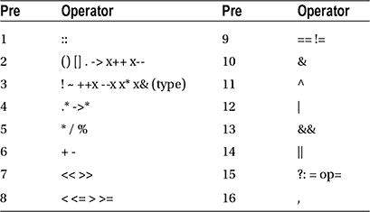

第四章


经营者

数字运算符是使程序执行特定数学或逻辑操作的符号。C++中的数值运算符可以分为五种类型:算术、赋值、比较、逻辑和按位运算符。

算术运算符

有四个基本算术运算符，以及用于获得除法余数的模数运算符(`%`)。

```cpp
int x = 3 + 2; // 5 // addition
    x = 3 - 2; // 1 // subtraction
    x = 3 * 2; // 6 // multiplication
    x = 3 / 2; // 1 // division
    x = 3 % 2; // 1 // modulus (division remainder)
```

请注意，除法符号给出了不正确的结果。这是因为它对两个整数值进行运算，因此会截断结果并返回一个整数。要获得正确的值，必须将其中一个数字显式转换为浮点数。

```cpp
float f = 3 / (float)2; // 1.5
```

赋值运算符

第二组是赋值操作符。最重要的是赋值操作符(`=`)本身，它给变量赋值。

组合赋值运算符

赋值运算符和算术运算符的一个常见用途是对变量进行运算，然后将结果保存回同一个变量中。这些操作可以用组合赋值操作符来缩短。

```cpp
x += 5; // x = x+5;
x -= 5; // x = x-5;
x *= 5; // x = x*5;
x /= 5; // x = x/5;
x %= 5; // x = x%5;
```

递增和递减运算符

另一个常见的操作是将变量加 1 或减 1。这可以用增量(`++`)和减量(-)操作符来简化。

```cpp
x++; // x = x+1;
x--; // x = x-1;
```

这两者都可以用在变量之前或之后。

```cpp
x++; // post-increment
x--; // post-decrement
++x; // pre-increment
--x; // pre-decrement
```

无论使用哪个变量，变量的结果都是相同的。不同的是，后运算符在改变变量之前返回原始值，而前运算符先改变变量，然后返回值。

```cpp
int x, y;
x = 5; y = x++; // y=5, x=6
x = 5; y = ++x; // y=6, x=6
```

比较运算符

比较运算符比较两个值并返回真或假。它们主要用于指定条件，即计算结果为 true 或 false 的表达式。

```cpp
bool b = (2 == 3); // false // equal to
     b = (2 != 3); // true  // not equal to
     b = (2 > 3);  // false // greater than
     b = (2 < 3);  // true  // less than
     b = (2 >= 3); // false // greater than or equal to
     b = (2 <= 3); // true  // less than or equal to
```

逻辑运算符

逻辑运算符通常与比较运算符一起使用。如果左右两边都为真，则逻辑 and ( `&&`)计算为真，如果左右两边都为真，则逻辑 or ( `||`)为真。对一个布尔结果取反，有一个逻辑非(`!`)运算符。请注意，对于“逻辑与”和“逻辑或”，如果结果已经由左侧确定，则不会计算右侧。

```cpp
bool b = (true && false); // false // logical and
     b = (true || false); // true  // logical or
     b = !(true);         // false // logical not
```

按位运算符

按位运算符可以操作整数中的单个位。例如,“按位或”运算符(`|`)使结果位为 1，如果这些位设置在运算符的任一侧。

```cpp
int x = 5 & 4;  // 101 & 100 = 100 (4)  // and
x = 5 | 4;      // 101 | 100 = 101 (5)  // or
x = 5 ^ 4;      // 101 ^ 100 = 001 (1)  // xor
x = 4 << 1;     // 100 << 1  =1000 (8)  // left shift
x = 4 >> 1;     // 100 >> 1  =  10 (2)  // right shift
x = ~4;         // ~00000100 = 11111011 (-5) // invert
```

按位运算符也有组合赋值运算符。

```cpp
int x=5; x &= 4; // 101 & 100 = 100 (4) // and
    x=5; x |= 4; // 101 | 100 = 101 (5) // or
    x=5; x ^= 4; // 101 ^ 100 = 001 (1) // xor
    x=5; x <<= 1;// 101 << 1  =1010 (10)// left shift
    x=5; x >>= 1;// 101 >> 1  =  10 (2) // right shift
```

运算符优先级

在 C++中，表达式通常从左到右计算。然而，当一个表达式包含多个操作符时，这些操作符的优先级决定了它们被求值的顺序。下表显示了优先级顺序，其中优先级最低的运算符将首先被计算。同样的基本顺序也适用于许多其他语言，如 C、Java 和 C#。



举个例子，逻辑 and ( `&&`)绑定弱于关系运算符，关系运算符反过来绑定弱于算术运算符。

```cpp
bool b = 2+3 > 1*4 && 5/5 == 1; // true
```

为了使事情更清楚，括号可以用来指定表达式的哪一部分将首先被求值。从表中可以看出，括号是优先级最低的运算符。

```cpp
bool b = ((2+3) > (1*4)) && ((5/5) == 1); // true
```