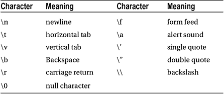

第八章


线

C++中的`string`类用于存储字符串值。在声明字符串之前，必须首先包含字符串头。也可以包含标准名称空间，因为 string 类是该名称空间的一部分。

```cpp
#include <string>
using namespace std;
```

然后可以像声明任何其他数据类型一样声明字符串。要将字符串值赋给字符串变量，请用双引号将文本分隔开，然后将它们赋给变量。初始值也可以在声明字符串的同时通过构造函数初始化来赋值。

```cpp
string h = "Hello";
string w (" World");
```

字符串组合

加号，在这个上下文中称为连接操作符(`+`)，用于组合两个字符串。它有一个伴随的赋值操作符(`+=`)来附加一个字符串。

```cpp
string a = h + w; // Hello World
h += w;           // Hello World
```

只要串联运算符所操作的字符串之一是 C++字符串，它就会起作用。

```cpp
string b = "Hello" + w; // ok
```

它不能连接两个 C 字符串或两个字符串文字。为此，必须将其中一个值显式转换为一个`string`。

```cpp
char *c = "World";              // C-style string
b = (string)c + c;              // ok
b = "Hello" + (string)" World"; // ok
```

如果省略了加号，字符串也将被隐式组合。

```cpp
b = "Hel" "lo"; // ok
```

转义字符

通过在每一行的末尾加上反斜杠(`\`)可以将字符串文字扩展到多行。

```cpp
string s = "Hello \ World";
```

要向字符串本身添加新行，需要使用转义符“\n”。

```cpp
s = "Hello \n World";
```

这个反斜杠符号用于书写特殊字符，如制表符或换页符。



此外，128 个 ASCII 字符中的任何一个都可以通过写一个反斜杠后跟该字符的 ASCII 码来表示，表示为八进制或十六进制数。

```cpp
"\07F"    // octal character (0-07F)
"\0x177" // hexadecimal character (0-0x177)
```

从 C++11 开始，通过在字符串前加上一个“R ”,并在双引号内加上一组括号，可以忽略转义字符。这称为原始字符串，例如，可以用来使文件路径更具可读性。

```cpp
string escaped = "c:\\Windows\\System32\\cmd.exe";
string raw = R"(c:\Windows\System32\cmd.exe)";
```

字符串比较

比较两个字符串的方法很简单，就是使用等于运算符(`==`)。这不会像 C 字符串那样比较字符串的内存地址。

```cpp
string s = "Hello";
bool b = (s == "Hello"); // true
```

字符串函数

`string`类有很多函数。其中最有用的是`length`和`size`函数，它们都返回字符串中的字符数。它们的返回类型是`size_t`，这是一种无符号数据类型，用于保存对象的大小。这个只是一种内置数据类型的别名，但是它被定义为哪一种在不同的编译器之间是不同的。别名在 crtdefs.h 标准库文件中定义，该文件包含在 iostream 中。

```cpp
size_t i = s.length(); // 5, length of string
i = s.size();         // 5, same as length()
```

另一个有用的函数是`substr`(子串)，它需要两个参数。第二个参数是从第一个参数中指定的位置开始返回的字符数。

```cpp
s.substr(0,2); // "He"
```

也可以使用数组符号提取或更改单个字符。

```cpp
char c = s[0]; // 'H'
```

字符串编码

双引号中的字符串产生一个 char 类型的数组，它只能容纳 256 个唯一的符号。为了支持更大的字符集，提供了宽字符类型 wchar_t。这种类型的字符串文字是通过在字符串前面加上大写字母“L”来创建的。可以使用 wstring 类存储生成的数组。这个类的工作方式类似于基本的 string 类，但是它使用 wchar_t 字符类型。

```cpp
wstring s1 = L"Hello";
wchar_t *s2 = L"Hello";
```

C++11 中引入了固定大小的字符类型，即 char16_t 和 char32_t。这些类型分别提供了 UTF-16 和 UTF-32 编码的明确表示。UTF-16 字符串以“u”为前缀，可以使用 u16string 类存储。同样，UTF-32 字符串以“U”为前缀，存储在 u32string 类中。还添加了前缀“u8”来表示 UTF-8 编码的字符串文字。

```cpp
string s3 = u8"UTF-8 string";
u16string s4 = u"UTF-16 string";
u32string s5 = U"UTF-32 string";
```

可以使用转义符“\u”后跟一个表示字符的十六进制数，将特定的 Unicode 字符插入字符串文字。

```cpp
string s6 = u8"An asterisk: \u002A";
```