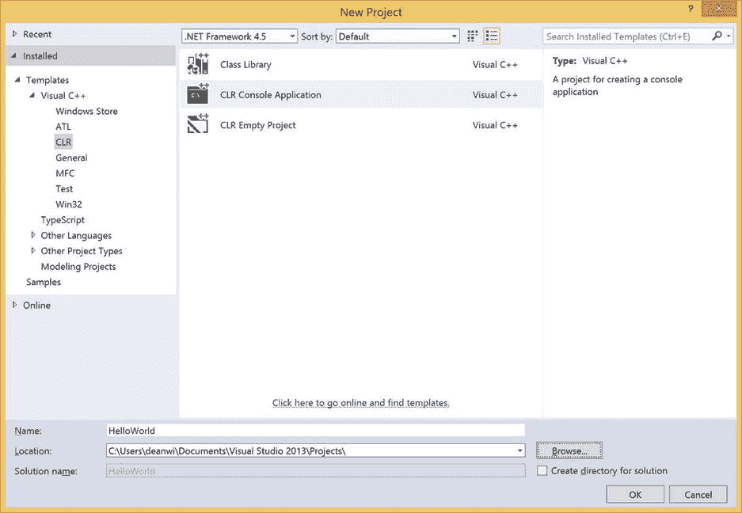
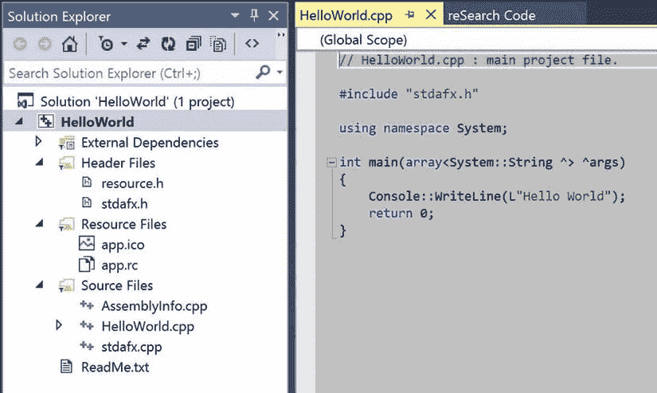
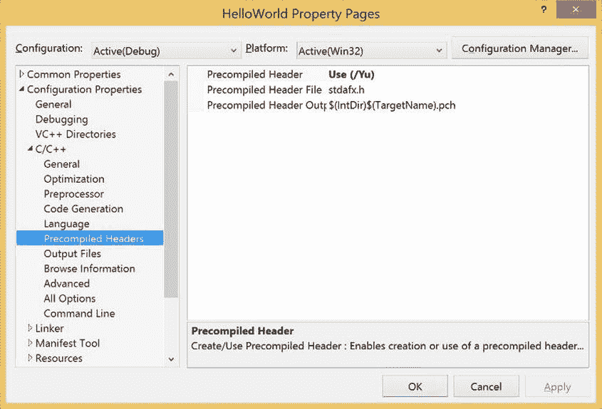
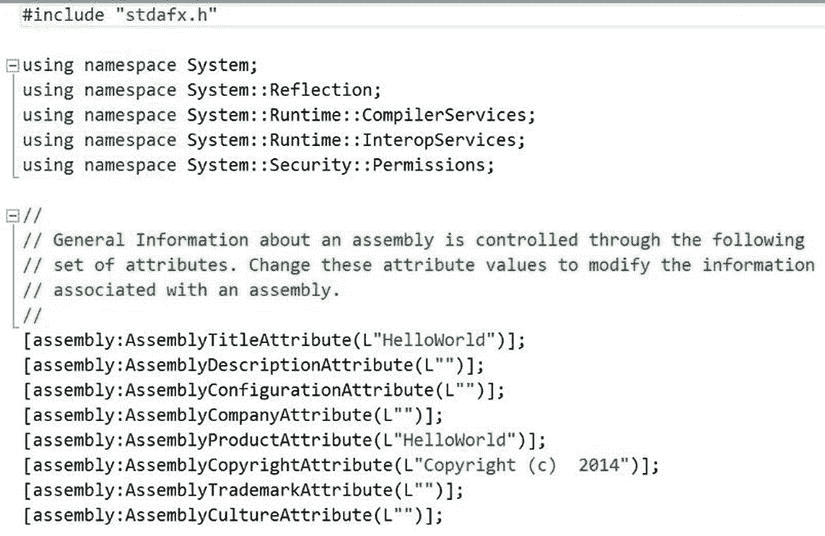
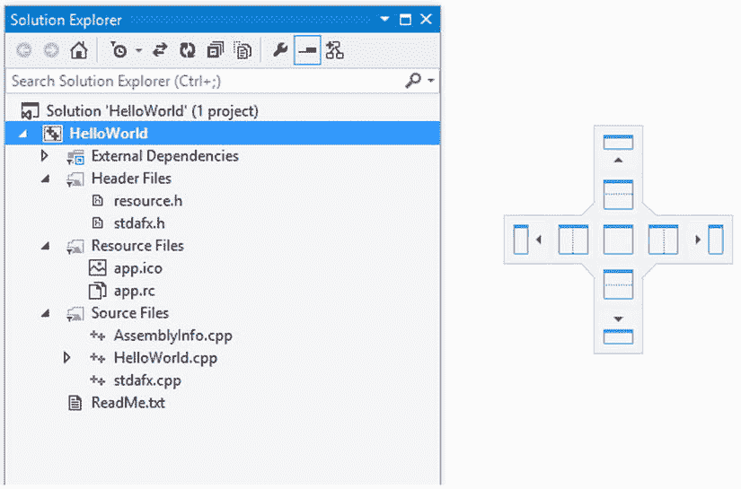
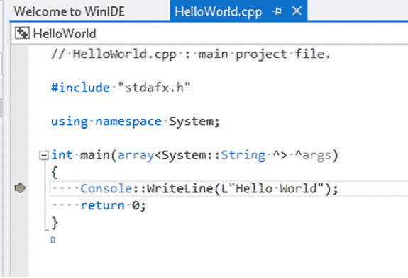

# 一、你好，世界

一致性是缺乏想象力的人最后的避难所。—奥斯卡·王尔德

自古以来，可以追溯到 Kernighan 和 Richie 关于 C 的书的发行，有一个传统，即打开一本关于 C 或其后代的书时，用一个简短的例子来说明显示“Hello World”是多么容易。本书也不例外。让我们并排检查一下“Hello World”的 C# 和 C++ 版本(见表 [1-1](#Tab1) )。

表 1-1。

“Hello World” in C# and C++

<colgroup><col> <col></colgroup> 
| C# | C++ |
| --- | --- |
| `using System;` | `using namespace System;` |
| `class HelloWorld` |   |
| `{` |   |
| `static void Main()` | `void main()` |
| `{` | `{` |
| `Console.WriteLine(“Hello World”);` | `Console::WriteLine(“Hello World”);` |
| `}` | `}` |
| `}` |   |

如表 [1-1](#Tab1) 所示，语言明显不同。另一方面，C# 和 C++ 就像法语和意大利语；尽管 C++ 的语法看起来像是外来的，但是它的意思是很清楚的。

以下是一些需要注意的事项:

*   在 C# 中，`Main()`总是一个类的方法。在 C++/CLI(公共语言基础设施)中，`main()`不是类方法；这是一个全局函数。这很简单——只要记住全局函数没有类。
*   就像在任何 C# 程序中都有一个名为`Main()`的唯一静态成员函数一样，在任何 C++ 程序中都有一个名为`main()`的唯一全局函数。在 C# 中，通过将多个`Main()`方法嵌入到不同的类中，可以避开这一要求。然后，您可以使用`/main:<type>`选项告诉编译器哪个类包含启动方法。这个技巧在标准 C++ 中不起作用，因为`main()`必须是一个全局函数，任何版本的`main()`在全局名称空间中都有相同的签名和冲突。
*   C++ 使用`::`(冒号-冒号)来分隔名称空间和类名，用一个点(`.`)来访问类成员；C# 对所有东西都用一个点。C++ 希望你对你正在做的事情更加明确。
*   C++/CLI `using`语句需要额外的关键字`namespace`。

Note

在 Microsoft Visual C++ 中，入口点可以是任何函数，只要它满足链接器文档中定义的某些限制。它可以是全局函数，也可以是成员函数。通过指定/entry: <function_name>链接器选项可以做到这一点。标准 C++ 需要一个名为 main 的唯一全局函数，它有一个整数返回值和一个可选的参数列表。参见 C++ 标准的第 3.61 节，ISO/IEC 14882:2003(E)。该标准的 PDF 版本可从 [http:// webstore 下载。安西。org](http://webstore.ansi.org/) 收取少量费用。</function_name>

## 启动 Visual Studio 2013 控制台

我打赌你一定很想试一试。“真正的程序员”使用命令行，所以让我们从那里开始。我们现在要构建一个控制台应用程序。

点击开始，打开 Visual Studio Tools 文件夹，如图 [1-1](#Fig1) 所示，然后双击 VS2013 的开发者命令提示符。

图 1-1。

Open the Visual Studio Tools folder

这产生了一个新的命令提示符，其环境变量设置为与 Visual Studio 2013 一起工作。所有 Visual Studio 编译器都可以从命令行运行，包括 Visual C++、Visual C# 和 Visual Basic。

## 检索源文件

要么弹出`notepad.exe`(肯定是你最喜欢的编辑器)并开始输入，要么从 Apress 网站的源代码部分获取源代码。去 [`www.apress.com`](http://www.apress.com/) ，用 ISBN 978-1-4302-6706-5 搜索这本书。

## 正在执行 HelloCpp.cpp

导航到这个[第 1 章](01.html)的样本目录，并转到`HelloWorld`子目录。这里是`HelloCpp.cpp`:

`using namespace System;`

`void main()`

`{`

`Console::WriteLine(“Hello World”);`

`}`

输入以下命令:

`cl /nologo /clr HelloCpp.cpp`

此命令指示 C++ 编译器针对公共语言运行时(CLR)编译此文件，并创建 C++/CLI 可执行文件。可执行文件是包含元数据和公共中间语言(CIL)的托管程序集，就像 C# 可执行文件一样。CIL 在 CLR 上也被称为 MSIL。

让我们执行这个例子。首先，键入

`HelloCpp`

接下来，按回车键。您应该看到以下内容:

`Hello World`

这是件好事。

## Visual C++ IDE 快速浏览

在本节中，我们将介绍使用 Visual Studio 2013 C++ 集成开发环境(IDE)制作基本 C++/CLI 项目的步骤。这非常类似于创建一个 C# 项目。

Load Visual Studio 2013.   From the File menu, select New Project. My system is set up with Visual C++ as the default language, so my New Project dialog box looks like the one shown in Figure [1-2](#Fig2).  

图 1-2。

Creating a new HelloWorld project and solutionNavigate to the CLR project types under Visual C++.   Select CLR Console Application.   Enter HelloWorld in the Name text box.   Click OK.  

默认情况下，Visual Studio 2013 在 C:\ Users \ % USERNAME % \ Documents \ Visual Studio 2013 \ Projects 中创建新项目。如果您愿意，可以随意更改目录并将项目放在其他地方。单击确定。

### 了解项目和解决方案

Visual C++ CLR 控制台应用程序向导在也称为 HelloWorld 的解决方案中创建了一个名为 HelloWorld 的新项目。项目和解决方案有什么区别？

Visual Studio 中使用的基本范例是您创建一个解决方案，它是您正在处理的内容的容器。一个解决方案可以由几个项目组成，这些项目可以是类库或可执行文件。每个项目都是特定于语言的，尽管也可以使用定制的构建规则在一个项目中混合使用不同的语言。

在我们的例子中，我们需要一个 Visual C++ 项目来生成一个名为`HelloWorld.exe`的可执行文件，所以我们的解决方案只有一个项目。默认情况下，项目是在子目录中创建的，但是我们可以通过取消选择“为解决方案创建目录”来更改此行为。在本书的后面，我们将会有依赖于几个项目的更复杂的解决方案。

现在您应该看到两个平铺的窗口:Solution Explorer 和包含`HelloWorld.cpp`的编辑器窗口。看起来 Visual C++ 2013 已经费尽心思为我们编写了这个程序`—`现在这不是很好吗？

### 了解差异

我们的基本 HelloCpp 应用程序和由 Visual Studio C++ CLR 控制台应用程序向导创建的 HelloWorld 应用程序之间存在一些差异，如图 [1-3](#Fig3) 所示。最明显的区别是向导创建了几个额外的支持文件。

图 1-3。

The HelloWorld application as created by the CLR Console Application Wizard

让我们看看那些新文件。

#### 资源

这些文件为您的应用程序配备了一个漂亮的小图标，并为将来的应用程序开发铺平了道路。Visual C++ 允许您在二进制文件中嵌入资源。它们可以是位图、图标、字符串和其他类型。有关更多信息，请参考 Visual C++ 文档。

*   `resource.h`
*   `app.ico`
*   `app.rc`

#### 预编译头

这些文件通过避免公共代码的多次编译来提高编译速度:

*   `stdafx.h`
*   `stdafx.cpp`

本书中反复出现的一个主题是 C++ 中声明和定义的区别。与 C# 不同，类原型(称为声明)可以从类定义中分离到不同的文件中。这提高了编译速度，避免了循环依赖，并为复杂项目提供了面向对象的抽象层。在许多 C++ 项目中，通常只包含声明的文件，称为头文件，以扩展名`.h`结束，在每个源文件的开头被编译为一个单元。如果项目中的头文件是相同的，编译器最终会用每个源文件编译相同的代码块。Visual C++ 提供的一个优化是在所有其他编译之前，将`stdafx.h`文件中引用的头文件全部编译成二进制 PCH(预编译头文件)文件。这称为预编译头文件。只要头文件没有被修改，源文件的后续编译就会大大加快，因为预编译头文件是作为一个单元从磁盘加载的，而不是单独重新编译。Visual C++ 生成了两个文件`stdafx.h`和`stdafx.cpp`来辅助这种机制。有关更多信息，请参考 Visual C++ 文档。

可以通过更改项目属性来禁用预编译头。要修改项目设置，在解决方案资源管理器中右键单击`HelloWorld`项目。导航到配置属性，并单击三角形以展开列表。然后展开 C/C++ 旁边的三角形，并选择预编译头。如图 [1-4](#Fig4) 所示，属性页窗口出现在屏幕上，允许你在应用程序中配置预编译头文件。

图 1-4。

Configuration of precompiled headers from the Property Pages window

#### AssemblyInfo.cpp

文件`AssemblyInfo.cpp`包含组件的所有属性信息。这个和 C# 出品的`AssemblyInfo.cs`差不多。这包括但不限于版权、版本和基本程序集描述信息。默认值对于开发来说很好，但是您需要在发布之前填写一些信息，包括版权属性。图 [1-5](#Fig5) 显示了一个样本`AssemblyInfo.cpp`的摘录。

图 1-5。

An excerpt from AssemblyInfo.cpp

#### hello world . CPP . hello world . hello world . hello world . hello world . hello world . hello world . hello world

主源文件也有一些显著的不同，如图 [1-6](#Fig6) 所示:

图 1-6。

HelloWorld.cpp

*   `main`函数被定义为接受一个`System::String`的托管数组，相当于 C# `Main(string[] Args)`。这允许您访问命令行参数。
*   包含预编译头文件`stdafx.h`是为了支持预编译头文件的使用。
*   文字字符串“Hello World”前面加了一个`L`来表示一个宽字符串。在本机 C++ 中，默认情况下，字符串是字节数组。编译 C++/CLI 时，编译器试图通过上下文来区分宽字符串和字节数组。不管你在这个上下文中有没有一个`L`，一个宽字符`System::String`被创建。

### 窗口布局

Visual Studio 的一个精心设计的功能是能够通过使用简单的鼠标移动来重新排列窗口，从而自定义 IDE 的外观。在本节中，我们将学习如何停靠和定位窗口。

#### 停靠窗口

解决方案资源管理器自然出现在 Visual Studio 的左侧或右侧，这取决于默认情况下选择的设置。幸运的是，自定义重排既简单又直观。右键点击标题栏，弹出窗口如图 [1-7](#Fig7) 所示，可以停靠窗口，停靠为选项卡式文档，或者浮动在顶部。

图 1-7。

Right-clicking on the title bar reveals options for displaying the window

现在，当您单击并按住标题栏时，您会在光标悬停的框架中看到一个小指南针，以及每个其他窗口框架上的引用标记。指南针允许您根据您悬停的框架来指示窗口的位置。将窗口移到另一个框架上，指南针会跳到那个框架。

图 1-8。

Clicking and holding down the title bar reveals a compass

#### 指南针的中心

指南针本身有方向标签(北、南、东、西)和一个中心框。如果在中心框上释放鼠标，窗口将在当前框架内变成选项卡式窗口。将它放在主框架上，在这里编辑文档。您现在可以看到，它与其他主窗口共享一个框架。

当您将鼠标悬停在其中一个指南针方向选项卡上时，目标框架的相应部分会变灰，以便您可以预览新的窗口排列。如果你把窗口放到了错误的地方，你总是可以把它撕下来或者手动把它设置为可停靠或者浮动，这取决于它的状态。

玩玩这个。在图 [1-9](#Fig9) 中，您可以在主窗口中看到作为选项卡式文档的解决方案窗口。

图 1-9。

Solution Explorer as a tabbed document in the main frame

### 构建、执行和调试

让我们在构建和测试 HelloWorld 时快速浏览一些关键的 Visual C++ IDE 命令(见表 [1-2](#Tab2) )。

表 1-2。

Common IDE Commands Quick Reference

<colgroup><col> <col> <col></colgroup> 
| C# | C++ | 说明 |
| --- | --- | --- |
| 第三子代 | 第三子代 | 查找下一个 |
| F8 | 法乐四联症 | 转到源代码中的下一个编译错误 |
| 移位-F8 | 移位-F4 | 转到源代码中的上一个编译错误 |
| F5 | F5 | 调试时执行 |
| Ctrl-F5 | Ctrl-F5 | 不调试就执行 |
| F6 | F7 | 建设 |
| F9 | F9 | 切换断点 |
| F10 | F10 | 跨过 |
| F11 | F11 | 进入 |

#### 构建程序

根据我们的键绑定，我们可以使用 F6 或 F7 来构建。如果有任何错误，它们会出现在屏幕底部的输出窗口中，您可以使用 F8 或 F4 来循环显示它们。

在 C++ 中，就像在 C# 中一样，多个编译错误经常是乱真的；编译器尝试在第一个检测到的问题之后进行编译，可能会丢失。这通常允许您看到两三个错误，并在一次编辑过程中修复它们。通常，额外的错误是编译器基于不正确的语法出去吃午饭的产物，修复一两个错误可能会使其余的错误消失。我建议经常建设。

#### 执行 HelloWorld

F5 键是执行命令。因为这是一个控制台应用程序，所以执行会产生一个显示“Hello World”的命令窗口，然后很快关闭，这有点不令人满意。有几种方法可以解决这个问题。一种方法是创建另一个开发人员命令提示符，导航到创建可执行文件的调试目录，手动运行程序，就像我们前面所做的那样。另一种方法是将下面的调用添加到`main()`函数的末尾:

`Console::ReadLine()`

该方法要求用户输入一行内容，并保持控制台窗口打开，直到用户按下 Enter 键。

另一组解决方案通过利用内置的 Visual C++ 调试器而呈现出来。您可以使用 F9 命令在程序的最后一行设置断点，也可以一行一行地单步执行程序。无论哪种方式，您都可以切换到衍生的命令提示符来查看所需的输出。

让我们试着使用调试器。

#### 使用 Visual C++ 2013 调试器

调试器集成在 Visual Studio 2013 中，因此启动调试非常简单。输入任何调试命令都会在调试器下启动应用程序。窗口布局肯定会改变，因为默认情况下，有几个状态窗口只有在调试时才可见。

Note

编辑和调试有不同的窗口配置。每个配置都必须单独定制。

基本的调试命令是 F5(带调试执行)、F9(切换断点)、F10(单步执行源代码行)和 F11(单步执行源代码行)。

#### 单步执行代码

Step 命令执行程序中的一行代码。“单步执行”命令有两种:F10(单步执行)和 F11(单步执行)。这些是相似的，但是当应用于函数调用时，它们是不同的。F10 执行到函数调用后的一行，而 F11 在函数体的第一行停止执行。当然，使用 F11 总是取决于调试信息是否可用于该函数所来自的二进制文件。因为`Console::WriteLine()`的调试信息没有随 Visual C++ 2013 一起发布，所以 F10 和 F11 都跳过了该函数。

按 F10 开始用 Visual C++ 2013 调试 HelloWorld。标题栏更改为显示“HelloWorld(调试)”以指示调试模式。此外，在单独的窗口中会产生一个命令窗口。此时，它是空白的，因为 HelloWorld 尚未显示任何信息。

编辑器窗口的左边缘会出现一个黄色小箭头，指示当前正在执行的代码行。图 [1-10](#Fig10) 显示执行已经停止，调试器等待下一个命令。

图 1-10。

Debugging HelloWorld

箭头表示我们开始执行`main()`函数，下一个要执行的行包含`Console::WriteLine()`语句。

再次按下 F10。执行`Console::WriteLine()`函数调用，并且“Hello World”出现在单独的命令窗口中。

如果你敢多按几次 F10，你就会在屏幕上制造一场噩梦。第一次，你执行返回函数。下一次，您从 HelloWorld 代码返回到 C/C++ 运行时，或 CRT。此模块执行重要的任务，包括在 Windows 中初始化程序、打包程序的命令行参数以及处理程序退出 Windows。注意，这段代码通过名字显式地调用`main()`，这解释了为什么每个 C++ 程序都需要一个名为`main()`的全局函数。

#### 完成执行

按一次 F5 执行退出代码的剩余部分，并返回到编辑器。如果`HelloWorld.cpp`不可见，您可以点击选项卡再次显示信号源。此时，调试已经完成，标题栏不再显示调试。

## 摘要

本章向您提供了如何从控制台创建简单的 C++/CLI 应用程序以及如何使用 IDE 创建更复杂的应用程序的基本概述。我还向您展示了如何使用集成调试器在 Visual C++ 2013 中执行基本调试。

在下一章，我们将看到如何从一个简单的 C++ 程序中调用 C#。