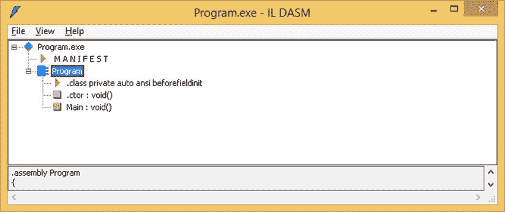

# 5.工具

当其他方法都失败时，清洁你的工具。—罗伯特·皮尔西格

在这一章中，我们将让自己熟悉一些工具。NET 开发在 C#和 C++ 中都更容易。

## 卢茨.罗德尔的。网状反射器

最强大的工具之一。今天可用的. NET 开发是 Lutz Roeder 的。网反射器，现在由红门公司销售。这个程序是理解的无价工具。NET 程序集。它允许你反编译。NET 可执行文件以及库转换成 IL、C#、C++/CLI 和其他语言。

罗德的。NET Reflector 实现了一种独立于。NET 框架。它旨在通过反编译将元数据和 CIL 转换到更高的抽象层次。这个范例略有不同，因为它不是从程序本身内部调用的，所以从技术上讲它不是一个镜像；这更像是一次穿越镜子的旅行。你发射。NET Reflector，指定要查看哪个程序集或可执行文件，然后在里面看看。而`System::Reflection`中的类库主要用于运行时分析或处理。NET Reflector 擅长在封装后检查程序集。

### 什么是反思？

a。NET 汇编不仅仅是一系列的执行指令。它包含关于程序集内容的描述和属性，统称为元数据。英寸用. NET 的说法，反射是程序在运行时读取和分析另一个程序集的元数据的能力。当程序读取自己的元数据时，有点像照镜子，所以“反射”这个术语似乎很合适。名称空间`System::Reflection`专用于。NET 的类库实现了主要的反射机制。还有另外两个:CCI，允许你访问`System::Reflection`不能访问的信息的公共编译器基础设施，和`IMetadata` API。所有这些机制相辅相成。

反射允许您发现关于一个类型的所有元数据信息，而不需要实例化它。这包括但不限于以下项目:

*   名字
*   菲尔茨
*   方法
*   能见度
*   属性

反射使你能够发现这些物品的各种特征。这些包括字段修饰符(`initonly`、`literal`等)。)、方法类型(`generic`与否)、属性和事件。反射甚至允许您使用`Reflection::Emit`动态创建类型。

#### 解码基类库程序集

基类库(BCL)是我们称之为。NET 框架。这个程序适用于所有的 BCL。NET 程序集，因此您可以查看任何 Microsoft DLLs 内部以帮助您的编程工作。当我试图找出程序中哪些 dll 必须通过`#using`引用或解析才能正确编译时，我发现这特别有用。例如，`System::Collections::Generic`名称空间被分成两部分，一部分在`mscorlib.dll`中，另一部分在`System.dll`中。很容易发现哪些类是在哪些 dll 中实现的。网状反射器。例如，如果你正在使用`System::Collections::Generic::List<T>`，你不需要引用任何 DLL，因为`mscorlib.dll`在每一个 C++/CLI 程序中都被隐式和自动引用。另一方面，如果您使用的是`System::Collections::Generic::Stack<T>`，您需要在项目设置中添加对`System.dll`的引用，或者在代码中添加以下代码行:

`#using "System.dll"`

在这两种情况下，如果您想在没有显式名称空间限定的情况下引用`Stack<T>`或`List<T>`，也需要下面一行:

`using namespace System::Collections::Generic`

关键字`#using`和`using`不相同；它们在 C++/CLI 中有不同的用途。这有点令人困惑，但这就是这种语言的定义。

`#using`是一种编译器指令，意思是它指示编译器在编译时如何做一些事情。在`#using`的情况下，它指示它添加一个对它的引用。NET 汇编，比如在 C#编译器的命令行上用`/reference`做的事情。`using`是语言的一部分，而`using namespace`将符号纳入范围。

#### 查看元数据和 CIL，或者进入深渊

我提到过。NET Reflector“允许你窥视内部”程序和“解码程序集”，但我没有解释这到底是什么意思。程序集，无论是编译为可执行文件还是动态链接库，都包含远不止可执行代码。这个信息集合被称为元数据，理想情况下，它是一个自包含的包，描述了使用这个程序集所需要知道的一切。

几年前，程序本身仅仅是可执行代码和数据的组合。能够执行另一个程序的唯一程序是操作系统本身，它充当信息路由器，定义如何在专用组件之间传递信息，例如设计用于硬件组件的设备驱动程序和想要与这些设备驱动程序通信的高级程序。

随着时间的推移，操作系统和程序不断发展。程序被设计用来与其他程序交换信息。在 Windows 世界中，这最初采取剪贴板的形式用于被动交换，OLE [1](#Fn1) 用于主动交换。程序进化到不仅仅包含可执行代码；程序被绑定到资源文件，其中包含本地化和全球化信息，因此它们不仅可以被翻译成其他语言，还可以处理外国字符集、不同的货币、处理时间的方式以及其他特定于文化的信息。

那个。NET Framework 代表了一种范式的转变，它真正地将这些责任卸给了操作系统，或者在本例中是。NET 框架，可以认为是操作系统的扩展。

将有关程序集的尽可能多的信息绑定到单个文件中，并将其智能地组织为多种类型的数据或元数据的集合，这是。NET 框架。

#### 可扩展类浏览器

微软和。Visual Studio 附带的. NET Framework IL 反汇编程序(`ildasm.exe`)和 Dependency Walker ( `Depends.exe`)允许用户检查或理解元数据的各个方面。ILDasm 允许您查看通用中间语言(CIL)以及元数据。CIL 构成了组成程序的可执行指令。卢茨.罗德尔的。NET Reflector 是一个类浏览器，可以显示程序集中所有方法的 CIL。它还更进一步，能够将 CIL 反编译成半普通的 C#、Visual Basic 和 Delphi。

Note

这个程序的优点之一是它有一个定义良好的代码模型，并接受第三方插件。一个将 CIL 反编译成 C++/CLI 的插件是我和 Jason Shirk 写的。它可以在 github `—`上免费获得，关于它的更多信息，后来已经有几十个程序被编写出来，用它来做令人惊奇的事情。网状反射器。在 [`http://www.red-gate.com/products/dotnet-development/reflector/add-ins`](http://www.red-gate.com/products/dotnet-development/reflector/add-ins) `.`找到他们

#### 从 C#到 C++/CLI

可以用鲁兹的。NET Reflector 作为学习 C++/CLI 语法的教育工具。也可以用这个作为从 C#转换到 C++/CLI 的工具。这样做不太令人满意，因为 Reflector 将元数据中的内容反编译成高级格式；通常，CIL 中有一些工件是由语言本身的编译或语法便利性创造出来的。实现这一点的算法很简单，使用以下步骤:

Create a C# program.   Compile the program.   Load the program in .NET Reflector.   View any class definition or procedure using the C++/CLI add-in.  

### 安装和装载。NET 反射器和 C++/CLI 外接程序

第一步是导航到红门的网站并获得。网状反射器。

[T2`http://www.red-gate.com/products/dotnet-development/reflector/`](http://www.red-gate.com/products/dotnet-development/reflector/)

它可以试用 14 天，也可以立即购买。安装软件，然后打开 Visual Studio。它既可以独立运行，也可以作为 Visual Studio 外接程序运行。如果安装正确，您会在屏幕顶部看到一个新菜单。网状反射器。

现在安装 CppCliReflector 加载项。该项目位于:

[T2`http://www.sandpapersoftware.com`](http://www.sandpapersoftware.com)

目前在 GitHub 上有一个带源代码的版本，在砂纸软件页面上有一个内置的二进制文件。从源代码构建是有指导意义的，所以请从以下网址下载源代码:

[T2`https://github.com/lzybkr/CppCliReflector`](https://github.com/lzybkr/CppCliReflector)

下载项目并解压缩源代码后，打开解决方案 CppCliReflectorAddin.sln，可能会要求您为最新版本的 Visual C++ 更新解决方案或项目。去吧，那不是问题。

它可能无法编译，因为插件需要直接从 Reflector 可执行文件中获取代码引用。我们将把这看作是一个学习如何引用外部可执行文件的机会。

首先，导航到解决方案资源管理器中的 References 部分。你会发现对反射器的引用不准确，如图 [5-1](#Fig1) 所示。

图 5-1。

The reference to the .NET Reflector executable

现在让我们通过再次添加来更新它`—`右键单击引用，然后单击添加引用。使用导航到。NET Reflector 可执行文件，它可能位于以下文件的某个变体中:

`C:\Program Files (x86)\Red Gate\.NET Reflector\Desktop 8.3`

现在构建项目。

接下来，让我们设置项目来加载反射器。右键点击图 [5-1](#Fig1) 中的 CppCliReflectorAddin，选择属性。选择调试选项卡，选择启动外部程序单选按钮，如图 [5-2](#Fig2) 。

图 5-2。

Exception generated by the .NET Framework

进入 Reflector.exe 之路，这可能是:

`C:\Program Files (x86)\Red Gate\.NET Reflector\Desktop 8.3\Reflector.exe`

现在，从 Visual Studio 调试菜单中，选择开始调试。。净反射器应加载。

从。反射器工具菜单，选择加载项。使用+按钮添加加载项。导航到 CppCliReflectorAddin 解决方案目录，向下浏览项目和 bin 子目录，直到找到:

`CppCliReflectorAddin.dll`

然后单击确定。

么事儿啦在那里。

现在 C++/CLI 已被添加到语言下拉列表中。这允许您通过在两种语言之间进行切换来查看 C#代码在 C++/CLI 中的外观。

### 正在执行。网状反射器

让我们用做一个示例。网状反射器。编译下面的 C#程序:

`class Program`

`{`

`public static void Main()`

`{`

`System.Console.WriteLine("Hello, World!");`

`}`

`}`

#### C#视图

使用。NET Reflector，使用文件➤打开打开可执行文件(参见图 [5-3](#Fig3) )。点击加号导航至`Main()`程序。展开`{}`，它对应于全局名称空间。然后展开`Program`，导航到`Main()`，双击。确保下拉窗口显示 C#作为反编译视图。

图 5-3。

C# view of the sample code using .NET Reflector

#### C++/CLI 视图

现在将下拉视图更改为 C++/CLI。视图应该切换成如图 [5-4](#Fig4) 所示的样子。

图 5-4。

C++/CLI view of the sample code using .NET Reflector

可以看到，在 C++/CLI 中，值类型和引用类型的声明和初始化是不同的；这将在第 6 章中详细讨论。

## C++ 即时

即时 C++ [2](#Fn2) 是一个有用的 C#到 C++/CLI 的翻译器，可从有形软件解决方案( [`www.tangiblesoftwaresolutions.com`](http://www.tangiblesoftwaresolutions.com/) )获得。该公司为遗留 C#项目提供了一个易于使用、价格合理的翻译器。该软件不仅将孤立的 C#代码片段转换成 C++/CLI，还能翻译完整的项目。

例如，假设我们使用 Snippet 转换器转换前面的示例(参见图 [5-5](#Fig5) )。

图 5-5。

Conversion from C# to C++/CLI using Instant C++

这个代码片段已经可以编译了，保存了所有 C++ 程序都需要的必要的全局`main()`。只需添加下面一行，程序就可以用 C++ 编译了:

`void main() { Program::Main();}`

## Visual Studio 附带的工具

Visual Studio 附带了许多非常有用的工具。在这一节中，我将介绍两个我最喜欢的。

### 微软。NET Framework IL 反汇编程序(ILDasm)

`ildasm.exe`是一个元数据和 CIL 浏览器，很像。净反射器，在更基本的水平切割。要在 VS2013 的开发人员命令提示符下使用 ILDasm，只需输入以下内容:

`ildasm <assembly name>`

您也可以从 IDE 的“工具”菜单中启动它。无论哪种情况，你都会看到一个类似于图 [5-6](#Fig6) 所示的窗口。

图 5-6。

ILDasm’s view of the test executable

单击加号展开每个类别下的定义。

### 依赖沃克(依赖)

`Depends.exe`是 Windows 二进制文件的依赖遍历器。它适用于。NET 程序集以及本机 Win32 二进制文件。这是一个追踪丢失的 dll 以及解决清单问题的非常有价值的工具。

首先从以下网址下载:

[T2`http://dependencywalker.com/`](http://dependencywalker.com/)

然后使用这个直观的命令来调用它:

`depends <binary name>`

您将看到一个类似于图 [5-7](#Fig7) 所示的窗口。

图 5-7。

Dependency Walker

如你所见，我似乎对一些丢失的 dll 有某种依赖，我想知道是什么导致了它们？

## 更多 Visual Studio 工具

无论你有多聪明，你的生产力都会受到工具质量的限制。虽然向您介绍 Visual Studio 2005 附带的所有工具已经超出了本书的范围，但是这里有一些更值得研究的工具:

*   可移植的可执行验证器确定一个程序集是否满足可验证代码的要求。
*   `SN.exe`:强名称实用工具对程序集进行数字签名。
*   这个实用程序处理全局程序集缓存，这是一个机器范围的代码缓存，用于在一台计算机上的多个应用程序之间共享的程序集。
*   `NMake.exe`:Make 实用程序从命令行执行构建过程。
*   `MT.exe`:清单工具是用来处理清单的。
*   `RC.exe`:资源编译器用于处理`.rc`文件。
*   `ResGen.exe`:资源生成器在格式之间转换资源。
*   `CLRVer.exe`:CLR 版本工具确定安装在机器上的 CLR 的版本。
*   这个工具允许你使用一个环境变量来追踪一个文件。
*   这个工具可以让你直观地比较同一个文本文件的不同版本。
*   `guidgen.exe`:该工具生成唯一的全局标识符。
*   `TLBImp.exe`:类型库转换工具用于从类型库中导入类。

## 摘要

现在我们有了深入研究 C++/CLI 所需的工具。NET 实现。事不宜迟，让我们在下一章讨论数据类型。

Footnotes [1](#Fn1_source)

OLE 是 COM 的前身，代表对象链接和嵌入。

  [2](#Fn2_source)

Instant C++ 的版权归有形软件解决方案所有。所有图片和参考资料均经许可使用。