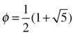
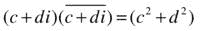
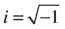
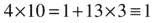
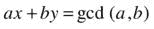
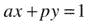
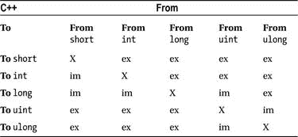
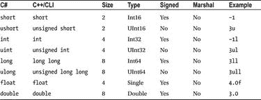

# 11.表达式和运算符

为你的局限性争辩，毫无疑问，它们是你的。—理查德·巴赫，幻觉

在这一章中，我们将讨论表达式和操作符与 C#的区别。我们将从一个警告开始:不要假设 C#和 C++中的表达式求值是相同的。C#和 C++/CLI 有不同的规则来控制表达式的计算，如果您正在编写过于复杂的表达式，这可能会让您感到惊讶。

这里有一个 C++的老把戏，经常出现在面试问题上。它不能保证按照 C++标准工作，但是它可以在 x86 的所有主要 C++编译器上工作。它被称为 XOR 交换，它允许您交换两个整数的值，而无需声明显式的临时。代码如下:

`using namespace System;`

`void main()`

`{`

`int i=3, j=6;`

`Console::WriteLine("{0}, {1}", i, j);`

`i ^= j ^= i ^= j;`

`Console::WriteLine("{0}, {1}", i, j);`

`}`

让我们运行它:

`C:\>cl /clr:pure /nologo test.cpp`

`C:\>test`

`3, 6`

`6, 3`

看下面一行:

`i ^= j ^= i ^= j;`

如您所见，它交换了`i`和`j`的值，因为它的计算结果如下:

`i ^= j;`

`j ^= i;`

`i ^= j;`

第一个 XOR 交换将`i`和`j`之间的位差存储在`i`中。下一行根据这个差异改变`j`，变成`i`。最后一行通过将原来的`i`(当前为`j`)也改变为差异(当前为`i`)，从而将`i`的剩余部分改变为`j`。这依赖于以下身份进行异或:

`x == y ^ (x^y)`

它或多或少地将`x`和`y`分成两部分:相同的部分和不同的部分，就像取两个数字并知道它们与平均值等距。

现在让我们试着用 C#来做这件事:

`using System;`

`class R`

`{`

`public static void Main()`

`{`

`int i=3, j=6;`

`Console.WriteLine("{0}, {1}", i, j);`

`i ^= j ^= i ^= j;`

`Console.WriteLine("{0}, {1}", i, j);`

`}`

`}`

结果如下:

`C:\>csc /nologo test.cs`

`C:\>test`

`3, 6`

`0, 3`

如你所见，这是行不通的。大概就是缺少括号吧？如果我们试试这个呢？

`i ^= (j ^= (i ^= j));`

那也不行；我们得到同样的结果。这里的答案是 C#和 C++对表达式求值的方式不同。这些规则相当复杂，除非你选择的职业是规则律师，否则你并不需要非常了解它们。

Note

在这种情况下，C#代码的求值方式不同，因为 C#将表达式的求值与变量的求值分开，以便帮助优化器。C++计算带括号的表达式；C#可以自由地扫描整个语句，预先计算变量，并使用这些值来计算表达式。该代码依赖于在表达式中间更新的临时值`i`和`j`，以便正确工作。

避免这些深奥的结构是很好的编程实践。编写两种语言都能正常工作的代码的简单而安全的方法是细分表达式:

`i ^= j;`

`j ^= i;`

`i ^= j;`

这个序列在 C#和 C++中都可以正常工作。十年前，将这些表达式编织在一起可能会产生更快的代码；今天的优化编译器已经足够成熟，可以计算出你要做什么，并补偿这种扩展。

## 运算符重载

C#和 C++/CLI 最重要的方面之一是它们支持将用户定义的类型提升到内置类型的级别；其中一个重要的方面是定义操作符来处理新类型的能力。出版文献中最常见的例子定义了复杂变量或分数的类型，但这只是冰山一角。定义运算符来执行与其数学定义完全无关的运算也是常见的做法，这拓展了我们有限范式的边界，并经常重新定义新的范式。

当然，也有局限性，包括以下几点:

*   一元运算符必须保持一元；二元运算符必须保持二元。换句话说，您不能重新定义加号(`+`)来接受三个参数而不是两个。
*   您不能编造不存在的运算符。您不能定义一个`/%`操作符，即使它在逻辑上可以被语法消除歧义。您只能使用该语言的内置操作符。
*   您不能控制预定义的求值顺序，也不能期望复杂的表达式在 C++/CLI 和 C#中以相同的方式求值。如前所述，C#和 C++/CLI 有不同的规则来控制表达式的求值。

### 复数，一个基本例子

回想一下，我们可以考虑 C++/CLI 中的一个简单的复数类，复数是以下形式的数字:

a + bi

在哪里

这有助于我们为第 15 章打下基础，当我们在以下形式的数字环境中使用模板重温复数时:

这种形式在处理黄金比例时非常有用:

利用黄金分割率，我们可以用一种非递归的、简单的、封闭的形式来计算斐波那契数列。 [1](#Fn1)

#### 复数的回顾

使用复数的基本数学运算的回顾如下: [2](#Fn2)

添加:

(a + bi) + (c + di) = (a + c) + (b+d)i

减法:

(a + bi) - (c + di) = (a - c) + (b - d)i

复杂共轭:

乘法:

(a+bi)(c+de)=(AC-BD)+(ad+BC)I

除以标量(实数):

复数之间的除法:使用复数共轭、乘法、标量除法和下列恒等式，

我们可以推导出复数之间的除法:

注意这个除法运算如何遵从复共轭以及乘法来计算商。

#### 简单实现

我们通过定义类数据以及作用于数据的操作符来实现这个类。非常简单，类数据是对应于实部和虚部的两个双精度值，乘以以下内容:

数据结构如下:

`value struct Complex`

`{`

`double re;`

`double im;`

`}`

至于操作符本身，有几种方法来定义它们，这取决于我们是否希望我们的代码符合公共语言规范(CLS )(我们将在本章后面再讨论这一点)。本质上，我们的操作符是静态成员函数，它们返回对象而不是引用。

##### 一元运算符

CLI 一元运算具有以下格式:

`static``type``operator``op``(``type`T6】

我们将在我们的类中使用以下操作符:

复杂共轭:

`static Complex operator ∼ (Complex a);`

##### 二元运算符

CLI 二进制操作具有以下格式:

`static``type``operator``op``(``type``a,``type``b)`

我们将在我们的类中使用这些运算符:

添加:

`static Complex operator + (Complex a, Complex b);`

减法:

`static Complex operator - (Complex a, Complex b);`

乘法:

`static Complex operator * (Complex a, Complex b);`

除以二:

`static Complex operator / (Complex a, double b);`

按复合体划分:

`static Complex operator / (Complex a, Complex b);`

##### 秩序至关重要

注意，代码没有假设交换性；将`a/b`定义为不同于`b/a`是完全合理的，因此也可以实现以下代码行:

`static Complex operator / (Complex a, double b)`

用不同于这行的方法:

`static Complex operator / (double a, Complex b)`

##### 我们努力的成果

完整的程序如下:

`using namespace System;`

`value struct Complex`

`{`

`double re;`

`double im;`

`Complex(double re, double im)`

`{`

`this->re = re;`

`this->im = im;`

`}`

`static Complex operator + (Complex a, Complex b)`

`{`

`return Complex(a.re+b.re, a.im+b.im);`

`}`

`static Complex operator - (Complex a, Complex b)`

`{`

`return Complex(a.re-b.re, a.im-b.im);`

`}`

`static Complex operator ∼ (Complex a)`

`{`

`return Complex(a.re, - a.im);`

`}`

`static Complex operator * (Complex a, Complex b)`

`{`

`return Complex(a.re*b.re - a.im*b.im, a.re*b.im + a.im*b.re);`

`}`

`static Complex operator / (Complex a, Complex b)`

`{`

`return a / (b.re*b.re+b.im*b.im) * ∼b;`

`}`

`virtual String ^ ToString() override`

`{`

`String ^s = re.ToString();`

`if(im != 0)`

`{`

`return s += " + " + im.ToString() + "i";`

`}`

`return s;`

`}`

`private:`

`static Complex operator / (Complex a, double f)`

`{`

`return Complex(a.re/f, a.im/f);`

`}`

`};`

`void main()`

`{`

`Complex a(-5,10), b(3,4);`

`Console::WriteLine("({0}) / ({1}) = {2}",a,b,a/b);`

`}`

正如您所看到的，基本操作符`+`、`-`、`*`和`/`已经被重载来操作`Complex`类型，而不是它们所基于的子类型，在本例中是`double`。

布尔逻辑中的一元补码运算符`∼`并不直观地对应于你在实数上对复数执行的任何运算。因此，它是满足我们对复共轭一元运算符需求的理想候选，我们需要实现`operator/`。除了参数数量和参数类型之外，编译器不会强制任何逻辑范例。你可以自由定义`operator*`为除法，`operator/`为乘法。这当然是不好的形式，除非混淆视听是你的目标。

快速编译和运行的结果如下:

`C:\>cl /clr:pure /nologo test.cpp`

`C:\>test`

`(-5 + 10i) / (3 + 4i) = 1 + 2i`

#### 过载的解决方案

你可能还注意到有两种不同的除法方法。C#和 C++都有选择调用哪个方法的内置规则，但这些规则的不同之处令人惊讶。两个名称相同但参数不同的方法称为重载。为给定的一组参数确定最匹配的过程被称为重载决策，我在这里将在`operator/`的上下文中介绍它，尽管它将继续是我们顺便涉及的一个主题。

假设我们用下面的函数替换前面的`main()`函数:

`void main()`

`{`

`Complex a(-5,10);`

`float b = 5.0f;`

`Console::WriteLine("({0}) / ({1}) = {2}",a,b,a/b);`

`}`

让我们运行这个例子:

`C:\>cl /clr:pure /nologo test.cpp`

`C:\>test`

`(-5 + 10i) / (5) = -1 + 2i`

当这个例子被执行时，编译器需要查找如何计算`a/b`，其中变量`a`的类型为`Complex`，变量`b`的类型为`float`。

编译器解析`a/b`并开始寻找兼容的方法

`operator/(Complex a,float b)`

在程序的源代码中，没有方法具有这种精确的签名，所以编译器收集了一个可能的候选方法列表，并试图确定最佳匹配。在这种情况下，可能的选择如下:

`operator/(Complex a,double b)`

`operator/(Complex a,Complex b)`

这两个都不完全匹配。C++标准中有明确定义的规则来管理重载的解析，这些规则不仅适用于运算符，也适用于一般的函数。我不想在这个问题上纠缠太多；现在，要知道在这种情况下直觉的选择是赢家。允许的操作是将`float`提升(扩展)到`double`并选择以下选项:

`operator/(Complex a,double b)`

重载决策的规则提供了一种处理隐式和显式转换的多层方法。某些转换优于其他转换，这绝不是任意的。乍一看，这似乎不是一个充满危险的话题，但请考虑以下情况:假设我们在代码中添加了一个从`double`到`Complex`的隐式转换。如果编译器可以自动执行这种转换，我们还会担心创建无限递归吗？由于`operator/(Complex, Complex)`调用`operator/ (Complex, double)`，添加一个从`double`到`Complex`的隐式转换可能会导致歧义或无限循环。在这种情况下，这是因为 C++规范中的优先级规则，它为每种类型的转换分配一个等级，并根据等级对它们进行优先级排序。我们将在本章后面讨论隐式和显式转换。

当你认为复数的主题变得过于数学化时，请做好准备——我很高兴向你展示下面的数学转移。

### 数学转移:数字模素数

C#和 C++/CLI 都使用百分号作为运算符来计算一个数对另一个数的模。回想一下，当`number`除以`p`时，`(number%p)`等于余数。很容易定义一类以一个数为模的数`p`。下面就是这组简单的数字:

{0,1, .。。(p - 1)}

现在我们只需要弄清楚如何对它们进行操作。

通过计算结果模`p`，我们可以很容易地重新定义加法、乘法和减法的基本运算符。除法通常会让我们遇到分数的使用，但是初等数论的一个结果告诉我们，当模数`p`是质数时，除法可以不用分数来定义。例如，让我们考虑以 13 为模的数字，假设我们正在试图计算四分之一，1 除以 4，是多少。换句话说，4 的倒数是多少？

一个简单的计算表明`(4 * 10) % 13 = 1`，由于`4*10=40=39+1`，因此 1 是 40 除以 13 的余数。

让我们用编译器来证明这一点:

`using namespace System;`

`void main()`

`{`

`Console::WriteLine("4 * 10 = {0} (13)", 4*10%13);`

`}`

当我们编译并执行它时，我们得到了以下内容:

`C:\>cl /nologo /clr:pure test.cpp`

`C:\>test`

`4 * 10 = 1 (13)`

10 是 4 的倒数。如果我们将两边除以 4，我们得到如下结果:

因为

同样，所有以 13 为模的非零数字都以同样的方式求逆。为了找到它，我们必须使用数论的另一个结果。事实证明，对于每两个数字 a 和 b，都存在数字 x 和 y

如果其中一个数是质数，另一个不是这个质数的倍数，那么这两个数的最大公约数(gcd)就是 1，我们得到如下:

因为根据定义，p 的任何倍数都是 0，所以我们得到

阅读前面的表达式如下:py 等于 0 模 p，因为当 py 除以 p 时余数为 0。结合这些事实，我们得出结论，存在一个数 x，使得

换句话说，我们只需要找到数字 x，我们就有了它的逆！我不会用更多的细节或推导来烦你，但是有一个扩展版本的欧几里德算法可以帮你做到这一点。 [3](#Fn3) 它在下面的代码中；请注意，`ExtendedEuclid()`是作为一个全局函数实现的，而不是一个类方法，它将对整数的引用作为它的一些参数:

`using namespace System;`

`void ExtendedEuclid(int a, int b, int %d, int %x, int %y)`

`{`

`if(b==0)`

`{`

`d=a;`

`x=1;`

`y=0;`

`}`

`else`

`{`

`ExtendedEuclid(b,a%b, d, y, x);`

`y-= (a/b)*x;`

`}`

`}`

`value struct F13`

`{`

`unsigned Value;`

`initonly static unsigned P = 13;`

`F13(unsigned Val)`

`{`

`Value = Val % P;`

`}`

`static F13 operator * (F13 arg1, F13 arg2)`

`{`

`return F13((arg1.Value * arg2.Value) % P);`

`}`

`static F13 operator + (F13 arg1, F13 arg2)`

`{`

`return F13((arg1.Value + arg2.Value) % P);`

`}`

`static F13 operator - (F13 arg1, F13 arg2)`

`{`

`return F13((arg1.Value - arg2.Value) % P);`

`}`

`static F13 operator - (F13 arg1)`

`{`

`return F13((P - arg1.Value) % P);`

`}`

`static F13 operator / (F13 arg1, F13 arg2)`

`{`

`int d, x, y;`

`ExtendedEuclid(arg2.Value,P,d,x,y);`

`return arg1*F13(x*d);`

`}`

`virtual String ^ ToString() override`

`{`

`Value = (Value+P) % P;`

`String ^s = Value.ToString();`

`return s;`

`}`

`};`

`void main()`

`{`

`F13 a(6), b(9), c(4), d(10);`

`Console::WriteLine("{0} * {1} is {2}", a, b, a*b);`

`Console::WriteLine("{0} / {1} is {2}", a, b, a/b);`

`Console::WriteLine("{0} * {1} is {2}", c, d, c*d);`

`}`

结果如下:

`C:\>cl /clr:pure /nologo test.cpp`

`C:\>test`

`6 * 9 is 2`

`6 / 9 is 5`

`4 * 10 is 1`

### 内置类型的隐式和显式转换

C#和 C++/CLI 都支持定义类型之间的隐式和显式转换。这是用户定义的类型，相当于将`float`提升为`double`，或者将`short`提升为`int`。隐式转换是编译器可以自动应用的转换，而显式转换需要 cast 运算符。让我们谈一谈内置类型之间的转换。

#### C#和 C++之间的转换差异

不幸的是，内置类型的隐式转换在 C++和 C#之间有所不同。众所周知，C++在防止有数据丢失风险的转换方面非常松懈。考虑以下示例:

`using namespace System;`

`void main()`

`{`

`long l=65537;`

`short s=0;`

`s=l;`

`l=s;`

`Console::WriteLine(l);`

`}`

现在让我们试一试:

`C:\>cl /clr:pure /nologo test.cpp`

`C:\>test`

`1`

在这种情况下，编译器会在`short`和`long`之间进行隐式转换，反之亦然，并且不会发出可能丢失数据的警告。如果我们将警告级别提高到 3，我们会得到以下输出:

`C:\>cl /clr:pure /nologo /W3 test.cpp`

`test.cpp(6) : warning C4244: '=' : conversion from 'long' to 'short', possible loss`

`of data`

这才像话！

假设我们将`long`改为`int`，并在警告级别 3 进行编译。数据丢失仍然存在:

`C:\>cl /clr:pure /nologo /W3 test.cpp`

`C:\>test`

`1`

充其量，这是一个烦恼。在最坏的情况下，这是一个召回类的错误。幸运的是，如果我们将警告级别提高到 4 级，我们会得到以下结果:

`C:\>cl /clr:pure /nologo /W4 test.cpp`

`test.cpp`

`test.cpp(6) : warning C4244: '=' : conversion from 'int' to 'short', possible loss`

`of data`

4 级警告的唯一问题是，它们被认为是建议性的，而不是诊断性的，有时会出现虚假或嘈杂的警告。吸取的教训是你需要小心。在这方面，C++编译器不像 C#编译器那样小心翼翼，正如我以前所建议的，当你开发代码时，不时地打开`/W4`警告。

#### 有符号/无符号不匹配

如果您试图将有符号值赋给无符号变量，C++/CLI 编译器会发出警告，反之亦然。默认情况下，它是禁用的，但是可以使用`/Wall`编译器选项来启用，这将启用编译中默认禁用的所有警告。

例如，考虑以下情况:

`void main()`

`{`

`unsigned u=0;`

`int i=0;`

`i=u;`

`}`

编译后，我们得到

`C:\>cl /Wall /nologo test.cpp`

`test.cpp(5) : warning C4365: '=' : conversion from 'unsigned int' to 'int',`

`signed/unsigned mismatch`

#### 整数转换表

让我们回顾一下 C++和 C#中的一些内置转换。使用以下缩写列表作为解释整数换算表的关键(表 [11-1](#Tab1) 至表 [11-5](#Tab5) ):

例如:明确的

im:隐式，没有警告

i2:隐含，警告级别 2

i3:隐含，警告级别 3

i4:隐含，警告级别 4

ia:隐式，仅警告`/Wall`(表示有符号/无符号不匹配)

x:不需要转换

我们先来看看表 [11-1](#Tab1) 中的整数类型。

表 11-1。

C++/CLI Conversion Table for a Sampling of Built-in Integer Types

让我们看看 C#表中的表 [11-2](#Tab2) 中的整数类型。

表 11-2。

C# Conversion Table for a Sampling of Built-in Integer Types

请记住，当您阅读这些表格时，您必须考虑到`long`在 C#中的含义与在 C++中的含义不同。在 C++/CLI 中，`long`和`int`都是`System::Int32`的别名，`long long`用于`System::Int64`，而 C#是通过使用`long`来实现的。表 [11-3](#Tab3) 摘自[第 6 章](06.html)中的类型表。

表 11-3。

A Partial Type Table

现在让我们看看换算表。您可能会注意到，在 C#表中没有可能丢失数据。我是 C++的拥护者，但我必须承认，在这方面我更喜欢 C#实现。还要注意，C++/CLI 也将 C#认为是隐式的每个转换视为隐式的，但在从`unsigned int`扩展到`long`时仍会报告有符号/无符号不匹配。

好消息是，当我们查看这些表格时，我们发现 C++/CLI 有办法获得与 C#中相同的警告级别。这不直观但很简单——不要用`int`。

在 C++/CLI 中，`int`和`long`都映射到`System::Int32`，而`unsigned int`和`unsigned long`都映射到`System::UInt32`，但 C++编译器出于警告目的对它们进行了不同的处理。造成这种情况的大部分原因是历史原因；`short`和`long`最初被定义为目标架构支持的最小和最大整数大小。类型`int`被定义为目标架构的最有效尺寸。随着时间的推移，实现发现这种浮动定义使得在平台之间移植程序成为问题。这导致了上的当前实现。NET 将`short`固定为 16 位，将`int`和`long`固定为 32 位。类型`long long`被添加到. NET 的 64 位语言中。

对于其他目标体系结构，`int`要么被实现为`short`要么被实现为`long`，这使得警告的发布成为问题。非官方的编程实践是，当你不真正关心转换问题并且需要快速、高效的代码时，使用`int`;如果数据本身需要，你可以使用`short`或`long`。这种做法今天仍然适用于。NET:在`int`上使用`short`和`long`，编译器会做好自己的工作并发出警告。

现在我们来看看浮点转换。

#### 浮点转换表

让我们在表 [11-4](#Tab4) 中考察一些 C++中的交叉转换。

表 11-4。

C++ Conversion Table for Floating Point Types and for a Sampling of Integer Types

让我们在表 [11-5](#Tab5) 中检查一些 C#中的交叉转换。

表 11-5。

C# Conversion Table for Floating Point Types and for a Sampling of Integer Types

关于浮点转换表需要注意的一件有趣的事情是，C++在将`int`提升为`float`时会发出 2 级警告，但在将`int`提升为`double`时不会。考虑下面的片段:

`using namespace System;`

`void main()`

`{`

`int i0 = int::MaxValue;`

`int i;`

`float f;`

`double d;`

`f = i0;`

`i = f;`

`Console::WriteLine("int {0}, to float {1}, back to int {2}", i0, f, i);`

`d = i0;`

`i = d;`

`Console::WriteLine("int {0}, to double {1}, back to int {2}", i0, d, i);`

`}`

在本例中，我们取最大正整数，并将其转换为一个`float`，然后返回，数据会丢失。尽管`int`和`float`都是 4 个字节长，`float`使用其中的一些位来存储指数和符号信息，所以它不能完全精确地存储整数信息。如果您使用`double`进行类似的往返，则不会有数据丢失。因此，警告是正确的:

`C:\>cl /clr:pure /nologo /W4 test.cpp`

`test.cpp(8) : warning C4244: '=' : conversion from 'int' to 'float', possible loss`

`of data`

`test.cpp(9) : warning C4244: '=' : conversion from 'float' to 'int', possible loss`

`of data`

`test.cpp(12) : warning C4244: '=' : conversion from 'double' to 'int', possible loss`

`of data`

`C:\>test`

`int 2147483647, to float 2.147484E+09, back to int -2147483648`

`int 2147483647, to double 2147483647, back to int 2147483647`

你可能认为 C#编译器有问题，因为它允许从`int`到`float`的转换，而没有警告可能的数据丢失。然而，C#要求从`float`到`int`的转换有一个显式的转换或强制转换，所以你可以说出站方向的警告是多余的。C#代码如下:

`using System;`

`class R`

`{`

`public static void Main()`

`{`

`int i0 = int.MaxValue;`

`int i;`

`float f;`

`double d;`

`f = i0;`

`i = (int)f;`

`Console.WriteLine("int {0}, to float {1}, back to int {2}", i0, f, i);`

`d = i0;`

`i = (int)d;`

`Console.WriteLine("int {0}, to double {1}, back to int {2}", i0, d, i);`

`}`

`}`

C#版本的结果如下:

`C:\>csc /nologo test.cs`

`C:\>test`

`int 2147483647, to float 2.147484E+09, back to int -2147483648`

`int 2147483647, to double 2147483647, back to int 2147483647`

请注意，C#版本需要显式转换才能编译。

### 用户定义的转换

与编译器定义内置类型之间的隐式和显式转换相同，用户也可以定义用户定义类型之间的隐式和显式转换。在 C#中，你使用`implicit`和`explicit`关键字。在 C++/CLI 中，默认情况下转换是隐式的，您可以使用`explicit`关键字来指定显式转换。

#### 隐式转换

在我们的`Complex`类中，我们使用了一个私有的 helper 函数来定义一个复数除以一个`double`。为什么不揭露这个？除此之外，为什么不允许用户将一个复数乘以一个`double`或者将一个`double`乘以一个复数呢？

我们可以为这些操作中的每一个编写特定的重载，或者我们可以定义一个隐式操作符，将一个`double`转换成一个`Complex`。在这里，在 C++/CLI 语法中；它是一个静态成员函数，接受一个`double`参数:

`static operator Complex(double re)`

`{`

`return Complex(re,0);`

`}`

现在，用户可以对复数和双精度数执行所有基本的数学运算。下面是一个新版本的`main()`使用了这个隐式操作符:

`void main()`

`{`

`Complex a(-5,10), b(3,4);`

`double c(3.5);`

`Console::WriteLine("({0}) / ({1}) = {2}",a,b,a/b);`

`Console::WriteLine("({0}) * ({1}) = {2}",a,c,a*c);`

`Console::WriteLine("({0}) / ({1}) = {2}",c,a,c/a);`

`}`

编译和运行后，我们得到以下内容:

`C:\>cl /clr:pure /nologo test.cpp`

`C:\>test`

`(-5 + 10i) / (3 + 4i) = 1 + 2i`

`(-5 + 10i) * (3.5) = -17.5 + 35i`

`(3.5) / (-5 + 10i) = -0.14 + -0.28i`

对于一点点工作来说，这是很大的能量。从一个`Complex`到一个`double`的另一个方向呢？

#### 显式转换

从`Complex`到`double`将会丢失一些数据，因此这不应该是隐式转换。这可能意味着什么？是不是应该把复数投影到实线上，只返回复数的实部？应该返回复数的大小吗？向`double`的转变应该存在吗？走哪条路真的要由我们来决定。

就我个人而言，我被使用量值的想法所吸引:

除了关键字`explicit`之外，显式转换看起来与隐式转换一样:

`static explicit operator double(Complex c)`

`{`

`return Math::Sqrt(c.re*c.re + c.im * c.im);`

`}`

为了简洁起见，我们可以替换以下代码:

`static Complex operator / (Complex a, Complex b)`

`{`

`return a / (b.re*b.re+b.im*b.im) * ∼b;`

`}`

随着

`static Complex operator / (Complex a, Complex b)`

`{`

`return a / ((double)b * (double)b) * ∼b;`

`}`

这给了我们以下完成的程序:注意`operator/(Complex, double)`不再是`private`:

`using namespace System;`

`value struct Complex`

`{`

`double re;`

`double im;`

`Complex(double re, double im)`

`{`

`this->re = re;`

`this->im = im;`

`}`

`static Complex operator + (Complex a, Complex b)`

`{`

`return Complex(a.re+b.re, a.im+b.im);`

`}`

`static Complex operator - (Complex a, Complex b)`

`{`

`return Complex(a.re-b.re, a.im-b.im);`

`}`

`static Complex operator ∼ (Complex a)`

`{`

`return Complex(a.re, - a.im);`

`}`

`static Complex operator * (Complex a, Complex b)`

`{`

`return Complex(a.re*b.re - a.im*b.im, a.re*b.im + a.im*b.re);`

`}`

`virtual String ^ ToString() override`

`{`

`String ^s = re.ToString();`

`if(im != 0)`

`{`

`return s += " + " + im.ToString() + "i";`

`}`

`return s;`

`}`

`static Complex operator / (Complex a, Complex b)`

`{`

`return a / ((double)b * (double)b) * ∼b;`

`}`

`static operator Complex(double re)`

`{`

`return Complex(re,0);`

`}`

`static explicit operator double(Complex c)`

`{`

`return Math::Sqrt(c.re*c.re + c.im * c.im);`

`}`

`static Complex operator / (Complex a, double f)`

`{`

`return Complex(a.re/f, a.im/f);`

`}`

`};`

`void main()`

`{`

`Complex a(-5,10), b(3,4);`

`double c(3.5);`

`Console::WriteLine("({0}) / ({1}) = {2}",a,b,a/b);`

`Console::WriteLine("({0}) * ({1}) = {2}",a,c,a*c);`

`Console::WriteLine("({0}) / ({1}) = {2}",c,a,c/a);`

`}`

### 符合 CLS 标准的运营商

在 C++中有几种定义操作符的方法，这取决于你的意图和目标。在这种情况下，目标是创建一个符合 CLS 标准的应用程序。公共语言规范(CLS)定义了如何使代码与多种 CLI 语言兼容。因此，在编写与 C#或其他链接的程序时，最好采用这种范式。网络语言。当满足以下所有标准时，我们认为运营商符合 CLS 标准:

*   如 CLS 所述，该操作器列在符合 CLS 标准的表格中。
*   运算符是引用或值类的静态成员。
*   运算符函数的参数和返回值不由任何指针、引用或句柄传递或返回。

让我们检查一下表 [11-6](#Tab6) 中符合 CLS 的一元运算符。 [4](#Fn4)

表 11-6。

CLS-Compliant Unary Operators

<colgroup><col> <col> <col> <col></colgroup> 
| 操作员名 | 函数名 | C# | C++ |
| --- | --- | --- | --- |
| `operator&` | `AddressOf` | 不 | 是 |
| `operator!` | `LogicalNot` | 是 | 是 |
| `operator∼` | `OnesComplement` | 是 | 是 |
| `operator*` | `PointerDereference` | 不 | 是 |
| `operator-` | `UnaryNegation` | 是 | 是 |
| `operator+` | `UnaryPlus` | 是 | 是 |
| `operator true` | `true` | 是 | 不 |
| `operator false` | `false` | 是 | 不 |

让我们检查一下表 [11-7](#Tab7) 中符合 CLS 的二元运算符。

表 11-7。

CLS-Compliant Binary Operators

<colgroup><col> <col> <col> <col></colgroup> 
| 操作员名 | 函数名 | C# | C++ |
| --- | --- | --- | --- |
| `operator+` | `Addition` | 是 | 是 |
| `operator&` | `BitwiseAnd` | 是 | 是 |
| `operator&#124;` | `BitwiseOr` | 是 | 是 |
| `operator,` | `Comma` | 是 | 是 |
| `operator--` | `Decrement` | 是 | 是 |
| `operator/` | `Division` | 是 | 是 |
| `operator==` | `Equality` | 是 | 是 |
| `operator^` | `ExclusiveOr` | 是 | 是 |
| `operator>` | `GreaterThan` | 是 | 是 |
| `operator>=` | `GreaterThanOrEqual` | 是 | 是 |
| `operator++` | `Increment` | 是 | 是 |
| `operator!=` | `Inequality` | 是 | 是 |
| `operator<<` | `LeftShift` | 是 | 是 |
| `operator<` | `LessThan` | 是 | 是 |
| `operator<=` | `LessThanOrEqual` | 是 | 是 |
| `operator&&` | `LogicalAnd` | 不 | 是 |
| `operator&#124;&#124;` | `LogicalOr` | 不 | 是 |
| `operator%` | `Modulus` | 是 | 是 |
| `operator*` | `Multiply` | 是 | 是 |
| `operator>>` | `RightShift` | 是 | 是 |
| `operator-` | `Subtraction` | 是 | 是 |

这些操作符中的大多数都是不言自明的。只有几个值得特别一提:

*   `operator*`可以是`Multiply`也可以是`PointerDereference`，这取决于它是二元还是一元运算符。
*   `operator&`可以是`BitwiseAnd`也可以是`AddressOf`，这取决于它是二元还是一元运算符。
*   `operator&&`和`operator||`都可以在 C++/CLI 中重载。这些不能在 C#中重载。
*   C++中没有实现`operator true`和`operator false`。

#### 运算符 true 和运算符 false

`operator true`和`operator false`在下面的 C#代码中使用，在 C++/CLI 中不能类似地编写:

`using System;`

`class R`

`{`

`int value;`

`R(int V)`

`{`

`value = V;`

`}`

`public static bool operator true (R r)`

`{`

`return r.value!=0;`

`}`

`public static bool operator false ( R r)`

`{`

`return r.value==0;`

`}`

`public void Test(String name)`

`{`

`if(this)`

`{`

`Console.WriteLine("{0} is true", name);`

`}`

`else`

`{`

`Console.WriteLine("{0} is false", name);`

`}`

`}`

`public static void Main()`

`{`

`R r3 = new R(3);`

`r3.Test("r3");`

`R r0 = new R(0);`

`r0.Test("r0");`

`}`

`}`

如果在 C#中编译并运行，您会得到以下结果:

`C:\>csc /nologo test.cs`

`C:\>test`

`r3 is true`

`r0 is false`

在 C++中有一个很好的解决方法，使用到`bool`的隐式转换:

`using namespace System;`

`ref class R`

`{`

`private:`

`int value;`

`R(int V)`

`{`

`value = V;`

`}`

`public:`

`static operator bool(R^ r)`

`{`

`return r->value != 0;`

`}`

`void Test(String^ name)`

`{`

`if(this)`

`{`

`Console::WriteLine("{0} is true", name);`

`}`

`else`

`{`

`Console::WriteLine("{0} is false", name);`

`}`

`}`

`static void Main()`

`{`

`R ^r3 = gcnew R(3);`

`r3->Test("r3");`

`R ^r0 = gcnew R(0);`

`r0->Test("r0");`

`}`

`};`

`void main()`

`{`

`R::Main();`

`}`

#### 其他操作员

C++允许你重载赋值操作符、函数调用(`operator()`)和索引(`operator[]`)，其方式不符合 CLS 标准。

## 摘要

对表达式和操作符有良好的感觉在面向对象编程中是很重要的。它们允许您扩展您的类，并像处理内置类型一样处理它们。

在下一章，我们将通过补充一些在前几章的大类中没有涉及到的细节来完成我们的基本 C++之旅。在那之后，你将为后面的章节做好更深入和详细的准备。

Footnotes [1](#Fn1_source)

计算机编程艺术，第一卷:基本算法，第三版。(波士顿:艾迪森-韦斯利出版社，1997 年)。

  [2](#Fn2_source)

这些是从复数域的结合律、交换律和分配律以及`i`的定义中推导出来的。

  [3](#Fn3_source)

《算法导论》，第二版。(麻省剑桥:麻省理工学院出版社，2001 年)。

  [4](#Fn4_source)

这些表格来自 C++/CLI 语言规范。