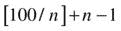
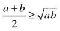
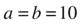
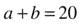
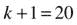
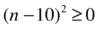

# 十三、有趣，有趣，更有趣

一个项目是如何迟到一年的？一天一天来。—小佛瑞德·P·布鲁克斯，神话中的人月

当我们结束对 C++ 的基本介绍并准备处理更高级的主题时，也许稍微转移一下注意力来奖励我们的努力是合适的。我们将通过编程 C++ 解决方案来看一些有趣的面试问题。

## 掉落的灯泡

网上流传着一个面试问题，让你判断一个超强的灯泡能跌落多远而不破碎。我们将从数学上分解这个程序，并实现一个很好的递归算法来展示解决方案。

LIGHT BULBS

你有两个几乎打不坏的灯泡和一座 100 层的大楼。使用尽可能少的跌落次数，确定这种类型的灯泡可以承受多大的冲击(例如，它可以承受从 17 楼跌落，但从 18 楼跌落时会破碎)。注意，一直流行的二分搜索法给你的最坏情况是 50 滴。你应该能在 20 分钟内完成。

### 最初的想法

这个问题首先要注意的是，你只有两个灯泡。一旦第一个被打破，你就不能再冒险了。你需要遵循最保守的策略来护理你的灯泡，直到你确定当它坏掉的时候你已经找到了正确的地板。这意味着你必须一次爬一层楼，从一层楼开始，你要确定灯泡从一层楼掉下来还能存活。你不能冒第二个灯泡破裂的风险，除非这能确切地告诉你最大允许冲击力是多少。

换句话说，如果第二个灯泡从 n 层坠落时破碎了，你应该已经确定这个灯泡从 n–1 层坠落时不会损坏。

我们最初的直觉是将楼层数除以 2，然后从那里开始，所以让我们来看看当我们从第 50 层放下灯泡时会发生什么。

好吧，如果它在第一次落下时就断了会怎么样？因为只剩下一个灯泡了，我们不能冒险跳过一层楼。剩下的唯一策略就是极端保守，从尽可能低的楼层开始，一次升一层。然后我们被迫从一楼扔下第二个灯泡，然后是第二个，以此类推。最糟糕的情况是，我们被迫一次一层地一路爬到 49 楼。这将意味着总共 50 滴(1+49 滴)。

所以把楼层数除以 2 作为初始落差是非常低效的。如果我们把楼层数除以一个更大的数作为初始落差，会发生什么？

### 粗略的估计

假设我们将楼层数除以五。那么我们的第一次空投会从 20 楼开始。如果最初的灯泡没有坏掉，我们可以尝试从 40 楼，60 楼，等等直到 100 楼。如果灯泡坏了，我们最多只剩下两次下降之间的楼层数来确定灯泡坏了。在这种情况下，会有 19 次下降(20–1 次下降)。现在我们可以计算最坏的情况。第一个灯泡对于每层楼最多掉落一次，每层楼是 20 的倍数，或者{20，40，60，80，100}。这就产生了五种可能的下落，也等于 100 除以 20，或 100/20。在任何中断之后，第二个灯泡最多会掉落这些 20 的倍数之间的差值，或 20-1 倍。因此，我们看到最差情况下的跌落次数如下:

当然，24 次跌落比我们之前算法的最坏情况 50 次要好得多。

### 一点代数

或许，用一点点代数，我们可以看到我们能把这个想法推进多远。假设我们从第 n 层扔下第一个灯泡，对于 n 的所有可能值，按照前面导出的模式，我们得到

100 可能不能被 n 整除，这一事实会造成轻微的不准确，并且在之前从 80 跌落后从地板 100 跌落灯泡不会给你提供与之前从 60 跌落后从 80 跌落一样多的新信息。不过，这个公式很容易让我们计算出最佳算法的上限。

假设 k 是给定 n 的算法的最差情况，则我们有以下公式:

本质上，

现在我们有一个 n 中的二次方程，可以用一点点初等代数来粗略计算一下。我们希望在 n 的所有可能值上使 k 最小，这将给出最好的最坏情况。

一个二次因素为:

因为算术平均值总是至少与几何平均值一样大，

当 a=b 时，这实现了等式，并且我们得到如下:

还有这里

还有这里。

我们应该每隔十层放下第一个灯泡，以便从这个算法中获得最佳结果。在这种情况下，即 k=19 滴。 [2](#Fn2)

面试问题的目标是看你是否能发现 19 降算法，即使你不用代数来揭示它。

不要误会，我并不是说这是最好的算法。第一次从十楼掉下第一个灯泡似乎是有道理的，但是如果灯泡没有坏，我们能不能不用这个信息来重新评估这个问题？现在不是新问题了吗？现在是两个灯泡和 90 层楼的问题。出于这个原因，如果第一个灯泡从下落中幸存下来，那么减少下落之间的距离似乎是一个明显的优化。这可能会随着每次下降而继续被重新评估。我们不应该仅仅因为十楼是第一次空投的最佳地点，就被束缚于每十楼空投一次灯泡。

### 发现递归算法

这样，这个问题的递归性就出现了。与其用 100 个故事来思考这个问题，不如用 N 个故事来思考问题，递归考虑。那么也许我们可以找到一种更有效的算法。

为此，我们需要定义一个函数:

`int Drop(int floors);`

函数`Drop()`返回给定楼层数的最小下降次数。当然，这并没有告诉我们从哪个楼层往下掉，但是如果我们愿意，我们可以修改程序来做到这一点。

假设我们在一个楼层数等于`floors`的建筑里。如果我们从`i`楼层掉下第一个灯泡，灯泡坏了，我们需要用另一个灯泡来确定它从`1, 2, 3...(i-1)`楼层掉下时是否会坏。这最多需要`(i-1)`滴。如果灯泡没有坏，那么`Drop(floors-i)`计算出我们能做的最高高度`floors-i`的建筑。只要`floors-i`总是严格小于`floors`，并且我们注意到`Drop(1)==1`这个事实，我们就不会被锁定在一个无限循环中。 [3](#Fn3)

在这种情况下，最差的掉线次数是

`max(i, Drop(floors-i)+1)`

如果我们循环合理的`i`值，我们可以找到最小的最坏情况。`i`的合理值是多少？尝试`i`的所有可能值，从`1`到`floors`都是矫枉过正。一个简单的优化是认识到我们不应该从前面显示的二进制例子下降到中间以上。从`1`到`floors`的平方根的`i`的尝试值似乎直观地满足了之前提出的论点。在下面的代码中，我使用了一系列的`[1, floors/2]`:

`using namespace System;`

`ref struct Drops`

`{`

`array<int>^floordata;`

`Drops()`

`{`

`floordata = gcnew array<int>(300);`

`floordata[1] = 1;`

`}`

`int Drop(int floors)`

`{`

`if(floordata[floors])`

`{`

`return floordata[floors];`

`}`

`int best = Int32::MaxValue;`

`if(floors == 1)`

`{`

`best = 1;`

`}`

`else`

`{`

`int i;`

`for(i=1;i<floors/2+1;i++)`

`{`

`int drops = Drop(floors-i) + 1;`

`int thisone = (drops>i) ? drops : i;`

`best = thisone<best ? thisone : best;`

`}`

`}`

`floordata[floors]=best;`

`return best;`

`}`

`};`

`void main()`

`{`

`Drops ^d = gcnew Drops();`

`Console::WriteLine("For {0} floors, the minimum is {1}", 100, d->Drop(100));`

`}`

输出如下:

`For 100 floors, the minimum is 14`

### 履行

代码本身非常简单，尽管需要一次优化。

我写的最初版本运行得太慢了，以至于我想边喝咖啡边等它完成。因为代码是递归的，`Drop(n)`被称为`Drop(n-1)`，`Drop(n-2)`，等等，并导致所有这些被重新计算。`Drop(n+1)`除了调用`Drop(n)`之外，做更多相同的事情，所以有如此多的重复计算，我们必须非常小心如何度过我们的周期。

我们需要确保对于`floors`的每个值，最多只计算一次`Drop(floors)`，否则我们最终会一次又一次地重复同样的工作。为此，我们创建了`floordata`数组来保存之前对`Drop()`调用的结果。这个数组是`Drops`类的成员，由构造器`Drops()`分配。对于楼层的每个值，我们检查数组以查看是否已经计算了一个值。如果没有，我们继续执行`Drop()`函数中的工作，并在退出时将结果保存在`floordata`数组中。

该程序确实使用了`?:`三元条件运算符:

`expression ? value1 : value2`

如果`expression`为真，则该运算符计算为`value1`，否则计算为`value2`。它允许我们避免简单结构的`if else`语句，并以更紧凑的形式编写。

SHOW THE WAY: PART 1

程序计算出我们的算法至少需要 14 次投放。发现灯泡强度，并显示导致 100 层建筑跌落 14 次的最坏情况的跌落顺序。

### 第一滴

这个程序不会告诉你放置灯泡的最佳位置，尽管它可以被修改来做到这一点。结果是，你应该从哪一层放下灯泡，这很大程度上取决于还剩几层，因为这个问题是离散的。因此，不可能打印出一份简短的清单，说明如何扔掉灯泡；相反，解决方案是一个图表。如果灯泡在这一层坏了，就这样做，否则就那样做。然而，对于任何给定的灯泡强度，打印这种最佳算法将遵循的液滴序列是简单的。

不过，你可能会注意到一件事，那就是你最好从 14 楼第一次往下掉。这样做的理由很简单:我们希望从尽可能高的楼层进行第一次坠落，这样我们可以最快地解决问题。如果灯泡坏了，我们最多有 13 秒钟的灯泡跌落时间来确定灯泡强度，因此我们不会比 14 次跌落的最佳最坏情况更糟。使用一个程序，你可以确定从 11 楼到 14 楼的初始下落仍然允许你实现最多 14 次下落的最佳顺序。

## 跨线桥

另一个在互联网上流传的常见问题是，四个人拿着一个手电筒走过一座黑暗的桥。

FOUR MEN ON A BRIDGE

四个人必须在晚上过桥。这座桥破旧不堪，一次最多只能容纳两个人。没有栏杆，人们只有一个手电筒。任何时候有人过，不管是一个人还是两个人去，手电筒都必须带着。手电筒必须来回走；不能扔。每个人走路的速度不同。一个需要 1 分钟穿越，另一个 2 分钟，另一个 5 分钟，最后 10 分钟。如果两个人一起过马路，他们必须以较慢的人的速度行走。这四个人穿越最少需要多少时间？

### 背景

现在这个问题如此流行的原因是，有一个明显的、逻辑上不正确的结论，所有人都跳到了这个结论上。只有经过更深入的思考和一点洞察力，你才能得出正确的答案。 [4](#Fn4)

在你继续读下去之前，想一想这个问题。你在桥上，来回走着。几个跑得快的人，一个非常快，还有几个比较慢的人，坐在桥上。你甚至可以放纵自己；想象你是一个能在一分钟内穿越的步行者。

最初不正确的结论是，走得更快的人应该来回引导大家。1 分钟步行者和 10 分钟步行者一起走过，需要 10 分钟。她回来了，花了 1 分钟。她去找下一个男人，等等。这个解决方案给你 19 分钟的最佳时间让所有人过桥。你自豪地向面试官宣布这一点，面试官沾沾自喜地说有更好的解决方案。惊恐之余，你跌跌撞撞地回到白板前，试着写些有智慧的东西。

更好的解决方案依赖于经典的调度算法。你试图平衡你的任务，所以任务是同时完成的。在 19 分钟的解决方案中，10 分钟和 5 分钟的步行者分别走过，这样你的基本时间是 15 分钟，不管谁和他们一起走。这是一件很难优化的事情。如果你把 5 分钟和 10 分钟的步行者放在一起，那么慢的人只用 10 分钟就可以走完，再用一点手电筒，你计算出你可以在总共 17 分钟内让所有人都走完。我会把如何解决这个问题留给你。

这当然给我们带来了另一个问题:这是最好的算法吗？

我们也很想知道，如果我们改变穿越者的速度，会得到什么样的结果。那么最好的旅行时间是什么时候？

我们可以通过编写一个简短的计算机程序来回答这些问题。为了实现它，我们做如下假设:

*   从起点到终点的每个路口正好有两个行人。
*   从终点到起点的每一个交叉点都恰好包含一个行走者。

考虑到问题的性质，这些都是相当合理的假设。我确信有可能证明没有最优解会违反这些假设，但证明不是这里的目标，所以我们将继续。

### 算法和实现

一个显而易见的算法是，在给定这些假设的情况下，尝试所有可能的步行者过桥。为了做到这一点，我们必须跟踪谁在桥的哪一边以及手电筒的位置。因为这些假设，我们知道每一次有两个步行者的过桥，后面都会有一个步行者的返回，直到我们完成。那么手电筒的位置是隐含的。

然后我们可以写一个函数`crossover(State, Direction)`,我们可以用它在任何方向上过桥。我最初是这样写程序的，它确实工作了，但是事实证明，将交叉点分成一个出站`start(State)`函数和一个入站`end(State)`函数更简洁。

对于我们如何跟踪穿越的`State`,有几种可能性，但是一个简单的位字段表明谁在桥的起始端就足够了，而且是干净的。我们用一个`unsigned int`来表示谁在桥的起始端。对于`start(unsigned here)`函数，这个数据表明谁在桥的起始端，或者“这里”对于`end(unsigned there)`函数，该数据指示谁在另一边，或者“在那里”在这两种情况下，数据总是指示谁在桥的起始端。我们可以通过对带有一个位字段的数据连续应用异或来传递谁在手电筒的那一边，但是我发现总是传递起始端的状态是用于调试目的的最简单的方式。

### 《守则》

我们使用一个名为`Crossing`的`ref struct`,它包含我们不希望递归传递的常量信息。在这种情况下，我们有步行者的穿越速度，存储在`times`数组中，还有一个`Mask`，它允许我们通过简单的异或运算来计算谁在桥的对面。我们不在构造器中初始化它们；相反，我们从输入参数中保存`times`，并在每次开始穿越时重新计算`Mask`。这与其说是追求准确，不如说是品味和风格的问题。代码本身很有趣，也很有教育意义；花点时间浏览一下，继续熟悉 C++/CLI:

`using namespace System;`

`ref struct Crossing`

`{`

`array<unsigned>^ times;`

`unsigned int Mask;`

`int cross(...array<unsigned>^ times)`

`{`

`this->times = times;`

`Mask = (1u<<times->Length)-1;`

`return start(Mask);`

`}`

`int end(unsigned there)`

`{`

`if(there==0)`

`{`

`return 0;`

`}`

`unsigned here = Mask^there;`

`unsigned best = 0xffff;`

`for(int i=0;i<times->Length; i++)`

`{`

`if(here & (1<<i))`

`{`

`unsigned thistrip;`

`thistrip = times[i] + start(there^(1<<i));`

`if(thistrip<best)`

`{`

`best = thistrip;`

`}`

`}`

`}`

`return best;`

`}`

`int start(unsigned here)`

`{`

`if(here==0)`

`{`

`return 0;`

`}`

`unsigned best = 0xffff;`

`for(int i=0;i<times->Length; i++)`

`{`

`if(here & (1<<i))`

`{`

`unsigned thistrip;`

`for(int j=i+1;j<times->Length; j++)`

`{`

`if(here & (1<<j))`

`{`

`thistrip =`

`(times[i]>times[j]? times[i] : times[j])`

`+ end(here^((1<<i)|(1<<j)));`

`if(thistrip<best)`

`{`

`best = thistrip;`

`}`

`}`

`}`

`}`

`}`

`return best;`

`}`

`};`

`void main()`

`{`

`Crossing ^c = gcnew Crossing();`

`int time = c->cross(1,2,5,10);`

`Console::WriteLine("It takes at least {0} minutes", time);`

`}`

如果您执行这个程序，您会得到预期的结果:

`It takes at least 17 minutes`

SHOW THE WAY: PART 2

增强程序，以便显示实际的最小交叉顺序。这需要递归地传递更多的数据。

### 带着算法兜一圈

当然，因为我们用接受可变数量参数的`param`数组实现了这一点，所以很容易用不同数量的 walkers 尝试不同的情况。如果我们改变下面一行:

`int time = c->cross(1,2,5,10);`

到

`int time = c->cross(1,2,5,10,7);`

那么凭直觉，我们预计这可能需要额外的 7 分钟。真相就在那里:

`It takes at least 23 minutes`

这有点让人吃惊。增加一个 7 分钟的步行器只会让整个过程慢 6 分钟。结果是，7 分钟的步行者最终与 10 分钟的步行者交叉，剩下 5 分钟的步行者来处理。5 分钟步行器与 1 分钟步行器进行一次往返，总共需要额外的 6 分钟。好吧，有道理。

如果我们再增加一个 7 分钟步行机呢？

`int time = c->cross(1,2,5,10,7,7);`

既然他不能和 10 分钟步行者一起过马路，他必须和 5 分钟步行者一起过马路，这样就多了 7 分钟。让我们试一试:

`It takes at least 29 minutes`

等等，只多了 6 分钟——这又是一个反直觉的答案。我肯定有一个简单的解释。也许 1 分钟步行机的回程可以避免？

这绝对是一个好玩的程序。

## 对付食人族

这个问题似乎不像其他两个问题那样经常在面试中出现，但它有一个有趣而有启发性的转折。

RIVER CROSSING

三个食人族和三个人类学家必须过河。他们的船只够两个人坐。如果在任何时候，河这边的食人族比人类学家还多，食人族就会吃掉他们。人类学家可以用什么计划过河，这样他们就不会被吃掉？

### 假设

乍一看，这个问题似乎不像桥梁问题那样困难。我们有一些离散的食人族和人类学家，没有附带的穿越时间(或者说进食时间)的概念。).

我们能够通过对谁在过河做出几个明确的假设来解决前一个问题。我们很乐意在这里做类似的假设，例如:

*   两个人总是从发射侧穿越到着陆侧。
*   总有一个人会回来。

不幸的是，这些假设是无效的。有非常清楚的理由，为什么你可能想在回程中派两个人去维持河两边的人的安全组合。事实上，11 个交叉点的最优解就是这样做的。

怎样才能想出一个保证在所有情况下都终止的算法？如果我们尝试一条路径，在这条路径上，我们正好来回发送两个人，我们的递归算法不起作用。

这里的技巧是根据可能性的深度优先遍历来考虑这个算法。我们不是让算法在一条潜在的无限路径中越来越深地寻找一个解，而是构造算法，让它迭代地问:“有没有一个有`iteration`个交叉点的解？”我们从`1`的`iteration`开始，直到得到肯定的回答。如果有解决方案，这个算法一定会成功。如果没有解决方案，这个循环将继续下去，直到资源耗尽；在这种情况下，资源就是堆栈。

### 《守则》

在这个程序中，我创建了一个单独的子程序，用于任意方向的交叉，因为这些操作是完全对称的，因为缺少假设。变量`dir`在集合`{1,–1}`中，它决定了我们要穿越的方向。

因为船上的人只有五种可能的组合，所以我用逻辑“或”把它们分开列出来。就像在 C#中一样，一旦调用返回`true`，短路评估会阻止对`crossover()`的进一步调用。

代码的其余部分相当简单，可能就是将来某一天您需要在白板上生成的内容:

`using namespace System;`

`ref struct Crossing`

`{`

`int MaxA;`

`int MaxC;`

`int cross(int MaxA, int MaxC)`

`{`

`this->MaxA=MaxA;`

`this->MaxC=MaxC;`

`int iterations;`

`for(iterations=1;  ;iterations++)`

`{`

`if(crossover(MaxA, MaxC, iterations, -1))`

`{`

`break;`

`}`

`}`

`return iterations;`

`}`

`bool crossover(int A, int C, int iterations, int dir)`

`{`

`if(iterations--<0)`

`{`

`return false;`

`}`

`if(A==0 && C==0)`

`{`

`return true;`

`}`

`if(A<0 || C<0)`

`{`

`return false;`

`}`

`if(A>0 && C>A)`

`{`

`return false;`

`}`

`int Ap = MaxA-A;`

`int Cp = MaxC-C;`

`if(Ap>0 && Cp>Ap)`

`{`

`return false;`

`}`

`return (`

`crossover(A+dir,C,iterations,-dir) ||`

`crossover(A,C+dir,iterations,-dir) ||`

`crossover(A+dir,C+dir,iterations,-dir) ||`

`crossover(A+dir+dir,C,iterations,-dir) ||`

`crossover(A,C+dir+dir,iterations,-dir)`

`);`

`}`

`};`

`void main()`

`{`

`Crossing ^c = gcnew Crossing();`

`int Count = c->cross(3,3);`

`Console::WriteLine("It takes at least {0} crossings", Count);`

`}`

在我们用三个食人族和三个人类学家运行这个程序后，我们得到了预期的结果:

`It takes at least 11 crossings`

如果我们尝试更多或更少会发生什么？如果只有两个食人族和两个人类学家，我们得到以下结果:

`It takes at least 5 crossings`

如果每种都有 4 个呢？事实证明是无解的。程序会一直运行，直到它的存储容量溢出。

## 摘要

所有这些例子都展示了棘手问题的优雅的递归解决方案。这是一个很好的练习，用这些类型的问题挑战你的假设，不仅寻找逻辑的解决方案，也寻找程序的解决方案。

在下一章中，我们将通过学习基本泛型上下文中的参数多态来开始对 C++ 有更深的理解。

Footnotes [1](#Fn1_source)

你可以在 http://www . com 找到这一章中的问题以及其他类似的问题。技术访谈。org 。这个网站转而引用了威廉·庞德斯通的《你会如何移动富士山》作为资料来源。庞德斯通没有声称发明了这些问题，但他将它们收集在一个有趣的文本中。

  [2](#Fn2_source)

这个方法可以推广。对于一栋 N 层高的建筑，如果我们选择，我们可以进行同样的分解:

那么我们可以看到

  [3](#Fn3_source)

你注意到递归算法的实现和数学归纳法的证明之间有什么相似之处吗？

  [4](#Fn4_source)

或者我们应该说，当你坐在面试官的办公室里，汗流浃背，头脑被恐惧冻结的时候，你有一点运气？