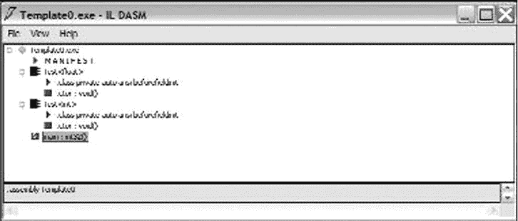
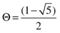

# 15.模板介绍

即使是为了实用的目的，理论通常最终会成为最重要的东西。—奥利佛·文德尔·霍马斯

在前一章中，我们看到了你可以用 C++/CLI 泛型做什么。在这一章中，我将介绍模板，它在许多方面与泛型相似，在许多其他方面又不同。

## 与泛型的比较

模板和泛型都允许您创建实现多种类型功能的函数和类。我们可以用两种方法之一来解决这个问题:

*   编写与所处理的数据类型无关的代码。代码只实现不依赖于数据类型的算法，所以算法以通用的方式作用于数据。这是 CLI 泛型背后的思想。
*   编写编译器适用于每种数据类型的通用高级代码。结果是，对于所处理的每种类型的数据，都有一组独立的依赖于数据的方法和类型。这是 C++ 模板背后的思想。

在执行之前，泛型类型与数据类型是分离的，模板也是分离的，但在编译期间，编译器会将其绑定到特定的数据类型。泛型方法的结果是 IL 中指定的单个方法；模板方法的结果是在 IL 中为编译期间传递给模板的每个类型参数组合生成一个方法。

Note

泛型是 CLR 支持的一项功能，泛型在各种。NET 语言，包括 C#。然而在 Visual Studio 2013 中，模板是 C++ 独有的。

因为泛型方法和类不知道它们的类型参数，所以它们可以很容易地在一个模块中定义，在另一个定义新类型的模块中被引用，并且仍然可以在该类型上使用。例如，`System.Collections.Generics`中的泛型`Stack<T>`类可以用来管理任意数量的用户定义类型的堆栈。

尽管模板方法和类型是以通用方式定义的，但它们依赖于它们的类型参数，并且需要 CLI 中不存在的运行时编译级别来操作在其他地方定义的类型。因此，模板是特定于编译单元的。

泛型方法和类完全不知道它们的类型参数的要求对泛型有严格的限制。泛型约束有一点帮助，因为它们允许泛型类型对可能的类型参数做出一些假设，并且只作用于实现一组给定接口的类型参数。

模板没有这样的限制。模板可以应用于任何类型，编译器可以确定语法错误是否由无效的类型参数生成。类型参数甚至可能在初始替换阶段失败，编译器不会中止编译，而是继续寻找合适的模板候选来进行替换，而不会生成语法错误。模板也可以有非类型的参数，称为非类型模板参数，以及模板本身的参数，称为模板模板参数。

通过允许程序员编写适用于多种类型的单个方法，泛型类型代表了减少代码的有效方法，而模板作为一种强大的 C++ 元编程环境出现，并允许程序员利用编译过程在编译时实现复杂的算法和语言扩展。

### 句法差异

这两种类型参数机制有很多共同之处，通常可以互换使用。模板和泛型在功能上的相似性反映在 C++/CLI 语法中。从一个到另一个的切换通常很简单，只需将关键字`generic`改为`template`，反之亦然。

考虑下面一行:

`generic <typename T> ref class TypeGeneric {};`

`TypeGeneric <T>`是一个完整的泛型类型，能够在运行时创建。现在考虑这一行:

`template <typename T> ref class TypeTemplate {};`

`TypeTemplate <T>`根本不是一个类型。它是一种类型的模型，可以由编译器在以后的编译过程中使用或实例化它时生成。

### 比较摘要

虽然模板和泛型在很多方面都很相似，但是这两种机制之间有一个主要的区别。与运行时由虚拟执行系统(VES)实例化的泛型类型不同，模板完全由 C++ 编译器解析、实例化和编译。泛型类型可以被认为是 CLI 类型的打包机制，而模板更像是在编译时扩展、验证和执行的智能宏。

### 编译过程

当编译器遇到一个泛型函数时，它会验证在给定约束和实现的情况下，它对所有可能的类型都有意义。然后在 IL 中生成一个函数。

考虑以下简单的通用函数:

`generic <typename T>`

`ref class Test`

`{`

`public:`

`Test()`

`{`

`System::Console::WriteLine(this->ToString());`

`}`

`};`

`void main()`

`{`

`Test<int> i;`

`Test<float> j;`

`}`

当解析类`Test`时，为通用类创建 IL 和元数据。让我们编译并运行它:

`C:\>cl /nologo /clr:pure test.cpp`

`C:\>test`

`Test`1[System.Int32]`

`Test`1[System.Single]`

现在让我们在上面运行`ildasm.exe`。在 ILDasm 主窗口中，打开构造器(`.ctor`)定义。您应该会发现类似于以下内容的 IL 和元数据:

`.method public hidebysig specialname rtspecialname`

`instance void  .ctor() cil managed`

`{`

`// Code size       18 (0x12)`

`.maxstack  1`

`IL_0000:  ldarg.0`

`IL_0001:  call       instance void [mscorlib]System.Object::.ctor()`

`IL_0006:  ldarg.0`

`IL_0007:  callvirt   instance string [mscorlib]System.Object::ToString()`

`IL_000c:  call       void [mscorlib]System.Console::WriteLine(string)`

`IL_0011:  ret`

`} // end of method Test`1::.ctor`

编译器创建了一个名为`Test`1::.ctor`的方法，它是一个名为`Test`的类的构造器，只有一个泛型参数。注意，在这种情况下，`Test<int>`和`Test<float>`与构造器无关。`Test<T>`的构造器独立于类型参数。

另一方面，举一个完全相同的例子，用关键字`generic`代替`template`。编译并运行它:

`C:\>cl /nologo /clr:pure test.cpp`

`C:\>test`

`Test<int>`

`Test<float>`

如您所见，创建了两个完全不同的类，`Test<int>`和`Test<float>`。让我们运行`ildasm.exe`看看这个(见图 [15-1](#Fig1) )。注意`Test<float>`和`Test<int>`是不同的。

图 15-1。

Metadata for the different compile-time–generated template instantiations

现在让我们看看代码，以及编译器如何解析它的描述:

`01: template <typename T>`

`02: ref class Test`

`03: {`

`04: public:`

`05:     Test()`

`06:     {`

`07:         System::Console::WriteLine(this->ToString());`

`08:     }`

`09: };`

`10: void main()`

`11: {`

`12:     Test<int> i;`

`13:     Test<float> j;`

`14: }`

到第 9 行，编译器已经意识到有一个模板。然后，它判断哪些类型是确定的和不确定的，绑定它能绑定的任何引用，发出任何可检测的语法错误，并将模板存档以备将来实例化。

如果在第 9 行使用了泛型，编译器将有足够的信息将类提交给元数据。对于模板，在实例化之前，它只是一个潜在的类。模板告诉编译器如何创建一个特定类型的类，如果你决定创建一个的话。

现在回到解析。在第 12 行，编译器试图实例化`Test<int>`。模板被重新解析，`int`被替换为`typename T`，任何未绑定的引用被绑定，类被生成。编译器现在准备将`Test<int>`提交给元数据。同样，在第 13 行，编译器能够解析并确定`Test<float>`是否有效。

Note

CLR 要求泛型设计为适用于满足任何给定类型约束的所有可能类型，而模板只需要设计为适用于您实际实例化的类型。

现在打开`Test<int>`构造器(`.ctor`)定义。您应该可以找到如下所示的元数据和 IL:

`.method public hidebysig specialname rtspecialname`

`instance void  .ctor() cil managed`

`{`

`// Code size       18 (0x12)`

`.maxstack  1`

`IL_0000:  ldarg.0`

`IL_0001:  call       instance void [mscorlib]System.Object::.ctor()`

`IL_0006:  ldarg.0`

`IL_0007:  callvirt   instance string [mscorlib]System.Object::ToString()`

`IL_000c:  call       void [mscorlib]System.Console::WriteLine(string)`

`IL_0011:  ret`

`} // end of method 'Test<int>'::.ctor`

快速的比较表明，模板类的方法和泛型类的方法的元数据和 IL 是相同的。在这种情况下，使用泛型似乎更有意义，因为`int`和`float`是重复的。实际上，性能含义并不清楚，因为 CLR 为值类型创建了重复的实例化，并为引用类型创建了单一的通用实例化。

### 模板并不真正存在

因为模板被实例化为常规的 CLI 类型和方法，所以从 CLI 的角度来看，它们不是一个特殊的实体。CLR 显式支持泛型，这意味着它支持 IL 打包类型作为泛型参数。模板没有特定的 IL，很容易看出为什么。

编译器将模板视为基于类型参数创建类的一组指令。一旦用模板参数实例化了类型，编译器就确切地知道要创建什么样的类，并且这个类被写入特定于实例化中使用的类型的元数据和 IL 中。只有模板的实例，而不是模板本身，才能进入模块。因此，模板不能像泛型一样从程序集中导出，程序员重用模板的唯一方法是重用该模板的源代码定义。

EXERCISE

理论上，您可以创建一个模板泛型，尽管这还不是 C++/CLI 规范的一部分。你能想出一个令人信服的理由来添加这个功能吗？

### 限制自由是件好事

为了使泛型功能变得有用，以某种方式限制类型变得很有必要。这被称为通用约束。使用一个完全任意的类型来编写有用的东西是非常困难的。毕竟，你能用它做什么呢？甚至前面的示例例程也依赖于这样一个事实，即所有 CLR 类型都支持具有`ToString()`方法的接口。如果没有这种隐式约束，甚至前面的简单示例都无法编译。因此，在编译时，约束限制了可用作泛型类型参数的类型种类，也就是告诉泛型它需要支持什么类型。典型的范例是，您有一个想要使用的特定接口，因此您将泛型类型约束为从该接口派生。我将在本章的后面给出一个例子。

与泛型不同，模板不支持显式类型约束。因为泛型是在运行时由 VES 实例化的，所以它们需要一种编译时机制来防止用无效的类型参数实例化泛型类型，而泛型类型约束就是这种机制。另一方面，模板是由编译器在编译时解析和实例化的，因此不会遇到无效的运行时实例化问题。仍然可以争论的是，当与模板一起使用时，某些形式的显式类型约束可能是有用的，但是，作为一个设计问题，C++ 使用了模板代码中隐式存在的类型约束。

### 模板范例

泛型类型被设计为在以下范例下工作:

*   您只从`System::Object`调用方法。
*   你使用一个约束来限制可能的类型参数，并且只使用由约束激活的方法(见[第 16 章](16.html))。
*   使用强制转换运算符对类型参数执行运行时切换，并执行特定于类型的操作。

基本思想是泛型要么必须为所有可能的类型工作，这意味着要么`System::Object`要么你定义的任何约束，要么类型必须在编译时被分叉和处理。

模板更广泛。编译时，编译器不检查类或方法是否适用于所有或一类类型参数，而是只检查它是否适用于某些类型；也就是说，模板是为语法错误而准备的。

当模板用一组特定的类型参数实例化时，该模板在此上下文中被重新计算，并被编译成特定于类型参数的代码。

## 专门化

可以通过用一组更具体的类型参数重新定义模板来专门化它。模板引擎在编译期间倾向于最专门化的版本。例如，如果您想为所有类型创建一个默认的类模板，您应该编写以下代码:

`template <typename T> ref class R {};`

如果您后来决定要以一种定制的方式处理某种类型，比如一个`double`，那么您应该声明

`template<> ref struct R<double> {};`

下面是一个使用模板函数和非模板函数重载的更复杂的例子:

`using namespace System;`

`template <typename T> void function(T t)`

`{`

`Object ^o = t;`

`Console::WriteLine(o->GetType());`

`};`

`template<> void function(int i)`

`{`

`Console::WriteLine("template integer");`

`};`

`void function(int j)`

`{`

`Console::WriteLine("not a template");`

`}`

`void main()`

`{`

`String ^s="hello";`

`function(s);`

`function(3.0);`

`function(1);`

`function<int>(1);`

`}`

在这个例子中，我们声明了一个模板函数，恰当地命名为`function()`。主模板函数在屏幕上显示类型参数的类型名称。对于一个整型参数和一个具有相同函数名的最终非模板函数，存在一些专门化。在`main()`例程中，我们使用编译器推断参数类型的能力来调用正确的模板函数。

让我们编译并运行这个示例:

`C:\>cl /nologo /clr:pure test.cpp`

`C:\>test`

`System.String`

`System.Double`

`not a template`

`template integer`

在这种情况下，对带有`String`和`double`的`function()`的调用被路由到主模板。第一次调用`function()`传递一个整数到非模板版本，显式指定`function<int>()`的调用被发送到带有`int`的显式专门化。

需要注意的一件重要事情是主模板中的显式装箱。在代码中，我写了以下内容:

`Object ^o = t;`

`Console::WriteLine(o->GetType());`

而不是

`Console::WriteLine(t->GetType());`

与合并引用和值类型语法的泛型类型不同，模板是代码的文字分析。在这种情况下，我们希望模板既适用于值类型，也适用于引用类型。如果是句柄，下面的语法是正确的:

`t->GetType()`

如果是值类型(或堆栈上的引用类型)，下面一行是正确的语法:

`t.GetType()`

我们可以通过转换为`System::Object^`来处理这种语法差异，如示例所示，或者通过使用引用类型的部分专门化，如我接下来将展示的。

### 部分专业化

部分限定模板参数的类模板声明称为部分专门化。部分专门化仍然是模板，而不是实例化或显式专门化，因为它们需要在生成代码之前用完整的类型参数进行实例化。模板参数可以通过指针间接寻址、类型、参数复制以及其他方式来专门化，如 C++ 标准中所述。

考虑以下示例:

`using namespace System;`

`template <typename T, typename W> ref struct R`

`{`

`static R()`

`{`

`Console::WriteLine("T,W: "+__FUNCTION__);`

`}`

`};`

`template <typename T, typename W> ref struct R<T^,W>`

`{`

`static R()`

`{`

`Console::WriteLine("T^,W: "+__FUNCTION__);`

`}`

`};`

`template <typename T, typename W> ref struct R<T*,W>`

`{`

`static R()`

`{`

`Console::WriteLine("T*,W: "+__FUNCTION__);`

`}`

`};`

`template <typename T> ref struct R<T,T>`

`{`

`static R()`

`{`

`Console::WriteLine("T,T: "+__FUNCTION__);`

`}`

`};`

`void main()`

`{`

`R<int,double> Primary;`

`R<R^,int> First;`

`R<int,int> Second;`

`R<char*,int> Third;`

`}`

我们有一个主要模板和三个部分专门化。第一个专门化要求第一个类型参数是某种引用类型，第二个专门化要求两个参数相同。第三种专门化需要一个指向本机类型的指针。

让我们编译并运行这个:

`C:\>cl /nologo /clr:pure test.cpp`

`test.cpp`

`C:\>test`

`T,W: R<int,double>::R (static class constructor)`

`T^,W: R<struct R ^,int>::R (static class constructor)`

`T,T: R<int,int>::R (static class constructor)`

`T*,W: R<char *,int>::R (static class constructor)`

正如您从结果中看到的，主模板和两个部分专门化中的每一个都被依次实例化。

### 函数模板的偏序

如果您想以类似于部分专门化的方式来区分函数，该怎么办呢？例如，假设您想用一个定制版本替换`ToString()`,该版本以某种方式为您的内置变量格式化字符串；也许你想用科学记数法显示所有的双精度数:

`using namespace System;`

`template <typename T> String ^MyToString(T t)`

`{`

`return t.ToString();`

`}`

`template <typename T> String ^MyToString(T ^t)`

`{`

`return t->ToString();`

`}`

`template <> String ^MyToString(double d)`

`{`

`return d.ToString("0.###e+00");`

`}`

`value struct V`

`{`

`virtual String ^ToString() override`

`{`

`return "it's V";`

`}`

`};`

`void main()`

`{`

`V v;`

`int i = 23;`

`double d=47.3;`

`Console::WriteLine(MyToString<int>(i));`

`Console::WriteLine(MyToString<double>(d));`

`Console::WriteLine(MyToString<V>(v));`

`}`

在本例中，我们为最常见的情况提供了一个模板:

`template <typename T> String ^MyToString(T t) {}`

还有一个更具体的霸主:

`template <typename T> String ^MyToString(T ^t) {}`

当我们调用`MyToString()`时，编译器在重载选择期间通过一个称为部分排序的过程挑选出更显式或限制性的匹配。部分排序允许我们区分由值传递的典型值类型和由句柄传递的典型引用类型。

让我们编译并运行这个:

`C:\>cl /nologo /clr:pure test.cpp`

`C:\>test`

`23`

`4.73e+01`

`it's V`

在这种情况下，对于我们的例子，我们仍然使用来自`System::Object`的方法`ToString()`。与泛型类型不同，即使模板不识别要调用的方法，只要在没有确定类型参数的情况下模板是不可解析的，它也会编译。例如，考虑以下情况:

`using namespace System;`

`template <typename T> String ^MyToString(T ^t)`

`{`

`return t->MyFunction();`

`}`

`void main() {}`

即使编译器不能确定假想句柄`T^t`是否有一个名为`MyFunction()`的成员方法，这个程序也能很好地编译。只有当用户试图使用实类型参数实例化模板时，编译器才能确定成功或失败。泛型假设最坏的情况；模板希望最好的。

现在让我们完成这个程序，实现模板的希望:

`using namespace System;`

`template <typename T> String ^MyToString(T ^t)`

`{`

`return t->MyFunction();`

`}`

`ref struct R`

`{`

`String ^ MyFunction()`

`{`

`return "Hello";`

`}`

`};`

`void main()`

`{`

`R ^r = gcnew R();`

`Console::WriteLine(MyToString(r));`

`}`

现在让我们编译并运行它:

`C:\>cl /nologo /clr:pure test.cpp`

`C:\>test`

`Hello`

这是正确的。

### 非类型模板参数

模板的主要优点之一是能够拥有非类型的模板参数；例如，它们可以是整数值。

#### 斐波那契数字模板

考虑下面的模板，它生成斐波那契数:

`using namespace System;`

`template <int N>`

`struct Fibonacci`

`{`

`enum { Value = Fibonacci<N-1>::Value + Fibonacci<N-2>::Value};`

`};`

`template <>`

`struct Fibonacci<0>`

`{`

`enum {Value = 0 };`

`};`

`template <>`

`struct Fibonacci<1>`

`{`

`enum {Value = 1 };`

`};`

`void main()`

`{`

`Console::WriteLine(Fibonacci<7>::Value);`

`}`

此代码使用枚举值在类中设置一个数字；然后，它使用带有两个显式专门化的递归算法来计算斐波那契数。

让我们编译并运行它:

`C:\>cl /nologo /clr:pure test.cpp`

`C:\>test`

`13`

这个程序有趣的地方在于，由于它的编写方式，它允许在编译时计算模板的值。如果我们查看 ildasm 中的程序，我们会看到算法的整个递归性质已经解决，代码被浓缩为:

`int main()`

`{`

`Console::WriteLine(13);`

`return 0;`

`}`

#### 平方根模板

让我们尝试一个更复杂的例子。此示例计算整数的四舍五入平方根。它在模板参数中使用默认值，这在 C++ 中是允许的:

`using namespace System;`

`template <int N, int low=1, int high=N>`

`struct Root`

`{`

`enum { Value = Root<N, ((low+high)/2), N/((low+high)/2)>::Value};`

`};`

`template <int N, int R>`

`struct Root<N,R,R>`

`{`

`enum {Value = R};`

`};`

`void main()`

`{`

`Console::WriteLine(Root<196>::Value);`

`}`

让我们编译并运行它:

`C:\>cl /nologo /clr:pure test.cpp`

`C:\>test`

`14`

这个程序试图通过不断平均一个猜测和除以猜测的数来迭代计算平方根。平方根总是介于两者之间。只有当输入是一个完美的正方形时，程序才能保证工作，否则可能会导致编译错误。

#### 质数模板

1994 年，Erwin Unruh 在一次 C++ 标准委员会会议上分发了一个程序，用模板打印出素数作为错误信息。尽管原始程序在 Visual C++ 2005 上不发布相同的诊断，但我写的这个版本具有相同的效果:

`template <int p, int i=p-1> struct is_prime`

`{`

`enum { value = (p%i) && is_prime<p,i-1>::value };`

`};`

`template<int p> struct is_prime<p,1>`

`{`

`enum { value=1 };`

`};`

`template<> struct is_prime<2>`

`{`

`enum { value=1 };`

`};`

`template <int p> ref struct Prime_print`

`{`

`Prime_print<p-1> a;`

`static void *ptr = (int)is_prime
::value;`

`};`

`template<> ref struct Prime_print<1> {};`

`void main()`

`{`

`Prime_print<9> d;`

`}`

让我们编译并运行这个:

`C:\>cl  /nologo /clr:pure test.cpp`

`test.cpp`

`test.cpp(16) : error C2440: 'initializing' : cannot convert from 'int' to 'void *'`

`Conversion from integral type to pointer type requires`

`reinterpret_cast, C-style cast or function-style cast`

`This diagnostic occurred in the compiler generated function`

`'void Prime_print
::Prime_print(void)'`

`with`

`[`

`p=2`

`]`

`test.cpp(16) : error C2440: 'initializing' : cannot convert from 'int' to 'void *'`

`Conversion from integral type to pointer type requires`

`reinterpret_cast, C-style cast or function-style cast`

`This diagnostic occurred in the compiler generated function`

`'void Prime_print
::Prime_print(void)'`

`with`

`[`

`p=3`

`]`

`test.cpp(16) : error C2440: 'initializing' : cannot convert from 'int' to 'void *'`

`Conversion from integral type to pointer type requires`

`reinterpret_cast, C-style cast or function-style cast`

`This diagnostic occurred in the compiler generated function`

`'void Prime_print
::Prime_print(void)'`

`with`

`[`

`p=5`

`]`

`test.cpp(16) : error C2440: 'initializing' : cannot convert from 'int' to 'void *'`

`Conversion from integral type to pointer type requires`

`reinterpret_cast, C-style cast or function-style cast`

`This diagnostic occurred in the compiler generated function`

`'void Prime_print
::Prime_print(void)'`

`with`

`[`

`p=7`

`]`

如您所见，所有小于或等于非类型模板参数的质数都显示在诊断中。

## 复数

在第 11 章中，我们做了几件有趣的事情:

*   我们定义了一个复数类。
*   我们定义了一类模为 13 的整数。
*   我们介绍了斐波纳契数列可以用黄金分割率来计算的事实。

在这一节中，我们将把这些表面上不同的概念收集到一个单一的程序中，该程序使用黄金分割公式计算斐波那契数模任意素数。这个程序将使用模板、类型和非类型参数以及专门化来创建干净的模块化代码。

### 概观

将一个复数类与斐波那契数公式结合起来使用似乎有些奇怪，但这完全取决于我们对复数对的定义。让我们通过考虑对(a，b)来概括复数的含义，其中第二个数乘以 5 的平方根而不是–1 的平方根。事实上，我们可以使用 integer 类型的非类型模板参数来指示平方根下的数字。我们的复数类也将有一个类型参数来指示我们对`(a,b)`中每个数字的类型。我们将使用这个类型参数来提供`Modulo
`的类类型，其中`Modulo`是模素数`P`的类模板，`P`是非类型模板参数。

### 数学公式

这是一个数学事实，斐波那契数列可以由黄金分割率及其共轭的幂产生。具体公式如下:

如前所述，我们的`Complex`类模板能够使用任意类型对，其中部首中的数字是任意整数，比如 5。为此，我们使用一个非类型模板参数，它的非类型模板参数是整数常量，并使用另一个类型参数作为该对的基础类型:

`template <typename T, int N> value struct Complex;`

我们在[第 11 章](11.html)的复数类中，使用了两个 doubles 作为我们的私有数据成员，对应于复数的实部和虚部。虚部是一个双精度数，它隐式地乘以–1 的平方根以生成复数。在本章的课程中，我们还将使用任意类型的实部和虚部，并考虑虚部平方根下乘以整数的部分。

我们将使用 5 作为基数来实现复数类，从而为斐波那契公式创建黄金比例及其补数。但是，为什么就此打住呢？与其使用双精度数，为什么不用整数模素数来表示我们的数字呢？让类型带有用于基本数学运算的运算符让我们可以做到这一点。

所以我们将把我们的复数建立在不同于`int`的类型上，比如`float`和`double`。这似乎是泛型的自然任务，对吗？为了实现一个通用的复数类，我们所要做的就是能够对这些内置类型进行加、减、乘、除运算。这表面上看起来很简单，但外表可能具有欺骗性。

### 通用实现

通用操作都是根据 IL 中的虚函数调用来定义的。因此，在解析泛型时，编译器必须能够判断出为特定的表达式调用哪些函数。如果有一个所有类型都支持的公共`multiply`接口，那么泛型类将能够为任意类型调用一个`multiply`函数并解析表达式。事实上，没有一个通用的算术接口适用于所有类型，原因有二:

*   算术对于从`Object^`派生的任意类型并不总是有任何意义。比如，`String^`乘以`String^`是什么意思？
*   为任意类型实现额外的接口对程序员来说是很麻烦的。

当然，追溯重写内置类型以支持算术接口也是不可能的，所以我们面临着为每个内置类型创建一个包装类的令人不快的任务，它支持实现基于任意内置类型的`Complex`变量所需的算术接口。然后，我们可以约束从算术接口派生的类型。这个解决方案既不优雅也不是最佳的。

### 拯救模板

使用类模板实现既简单又高效。编译器可以在编译时确定它已经知道如何将两个类型为`float`的项相乘。当模板被实例化时，类型对编译器来说并不神秘，所以它能够在每种情况下产生正确的 IL。没有必要创建一个能够处理任意类型的函数。事实上，实例化可能基于类型本身的定义产生完全不同的代码！

事不宜迟，下面是`Complex<typename T,int N>`、`Modulo<int P>`和`Fibonacci<typename T>`类；这可能是书中最长的例子，但我认为这是值得的:

`using namespace System;`

`template <int P> String^ Radix()`

`{`

`return " sqr("+P.ToString()+")";`

`}`

`template <> String^ Radix<-1>()`

`{`

`return "i";`

`}`

`template <typename T, int N>`

`value struct Complex`

`{`

`T re;`

`T im;`

`Complex(T _re, T _im)`

`{`

`re = _re;`

`im = _im;`

`}`

`Complex(T _re)`

`{`

`re = _re;`

`im = T(0);`

`}`

`static Complex operator* (Complex lhs, Complex rhs)`

`{`

`return Complex(lhs.re*rhs.re + (lhs.im*rhs.im*T(N)),`

`lhs.re*rhs.im + lhs.im*rhs.re);`

`}`

`static Complex operator/ (Complex lhs, Complex rhs)`

`{`

`T bottom = rhs.re*rhs.re - rhs.im*rhs.im*T(N);`

`Complex product = Complex(lhs * ∼rhs);`

`return Complex(product.re/bottom, product.im/bottom);`

`}`

`static Complex operator+ (Complex lhs, Complex rhs)`

`{`

`return Complex(lhs.re+rhs.re, lhs.im+rhs.im);`

`}`

`static Complex operator- (Complex lhs, Complex rhs)`

`{`

`return Complex(lhs.re-rhs.re, lhs.im-rhs.im);`

`}`

`static Complex operator∼ (Complex lhs)`

`{`

`return Complex(lhs.re, -lhs.im);`

`}`

`virtual String^ ToString() override`

`{`

`return re.ToString() + (!!im ? " + " + im.ToString() +  Radix<N>() : "");`

`}`

`};`

`template <int P>`

`value struct Modulo`

`{`

`int Value;`

`Modulo(int Val)`

`{`

`Value = Val % P;`

`}`

`static bool operator!(Modulo rhs)`

`{`

`return !rhs.Value;`

`}`

`static void ExtendedEuclid(int a, int b, int %d, int %x, int %y)`

`{`

`if(b==0)`

`{`

`d=a;`

`x=1;`

`y=0;`

`}`

`else`

`{`

`ExtendedEuclid(b,a%b, d, y, x);`

`y-= (a/b)*x;`

`}`

`}`

`static bool operator==(Modulo lhs, Modulo rhs)`

`{`

`return((rhs.Value-lhs.Value) % P == 0);`

`}`

`static bool operator!=(Modulo lhs, Modulo rhs)`

`{`

`return !(lhs == rhs);`

`}`

`static Modulo operator* (Modulo lhs, Modulo rhs)`

`{`

`return Modulo((lhs.Value * rhs.Value) % P);`

`}`

`static Modulo operator+ (Modulo lhs, Modulo rhs)`

`{`

`return Modulo((lhs.Value + rhs.Value) % P);`

`}`

`static Modulo operator- (Modulo lhs, Modulo rhs)`

`{`

`return Modulo((lhs.Value - rhs.Value) % P);`

`}`

`static Modulo operator- (Modulo lhs)`

`{`

`return Modulo((P - lhs.Value) % P);`

`}`

`static Modulo operator/ (Modulo lhs, Modulo rhs)`

`{`

`int d, x, y;`

`ExtendedEuclid(rhs.Value,P,d,x,y);`

`return lhs*Modulo(x*d);`

`}`

`virtual String ^ ToString() override`

`{`

`Value = (Value+P) % P;`

`String ^s = Value.ToString();`

`return s;`

`}`

`};`

`template <typename T> ref struct Fibonacci`

`{`

`static T half = T(1)/T(2);`

`static Complex<T,5> phi = Complex<T,5>(half,half);`

`static Complex<T,5> theta = Complex<T,5>(half,-half);`

`static Complex<T,5> difference = phi-theta;`

`template <int N>`

`ref struct Result`

`{`

`static initonly Complex<T,5> phi_n = Result<N-1>::phi_n * phi;`

`static initonly Complex<T,5> theta_n = Result<N-1>::theta_n * theta;`

`static initonly Complex<T,5> Value = (phi_n-theta_n)/difference;`

`};`

`template <>`

`ref struct Result<0>`

`{`

`static initonly Complex<T,5> phi_n = Complex<T,5>(T(1));`

`static initonly Complex<T,5> theta_n = Complex<T,5>(T(1));`

`static initonly Complex<T,5> Value = Complex<T,5>(T(0));`

`};`

`template <int N>`

`static void Print()`

`{`

`Print<N-1>();`

`Console::Write("{0,4} ", Result<N>::Value);`

`}`

`template <>`

`static void Print<0>()`

`{`

`}`

`};`

`void main()`

`{`

`Fibonacci<double>::Print<14>();`

`Console::WriteLine();`

`Fibonacci<Modulo<7>>::Print<14>();`

`Console::WriteLine();`

`Fibonacci<Modulo<13>>::Print<14>();`

`Console::WriteLine();`

`}`

`C:\>cl /clr:safe /nologo test.cpp`

`C:\>test`

`1    1    2    3    5    8   13   21   34   55   89  144  233  377`

`1    1    2    3    5    1    6    0    6    6    5    4    2    6`

`1    1    2    3    5    8    0    8    8    3   11    1   12    0`

注意第 7 个斐波那契数是(–1 模 7)，第 13 个是(–1 模 13)。事实上，对于 5 以外的质数`p`，第`p`个斐波那契数总是等于 1 或-1 模`p`。

## 核心区别:模板和泛型

模板和泛型有以下核心区别:

*   泛型保持泛型，直到在运行时执行类型替换。模板在编译时是专门化的。
*   CLR 特别支持元数据和 IL 中的泛型类型。模板的类型在编译时被解析成普通类型。
*   编译器为所有类型生成一个类或函数。模板为每个专用参数列表生成不同的类和函数。
*   在具有相同类型参数的不同程序集中专门化的泛型是相同的泛型类型；模板类型在编译中是唯一的，不能导出到程序集之外。
*   只有模板允许非类型参数。
*   只有模板允许类型参数有默认值。
*   模板允许部分和显式专门化。
*   模板支持模板模板参数。
*   模板类可以将类型参数作为基类。

## 摘要

模板乍一看似乎很简单，但是实现的细节和分支却令人困惑。有了对模板的这种了解，我们就可以在下一章再看一看泛型类型了。