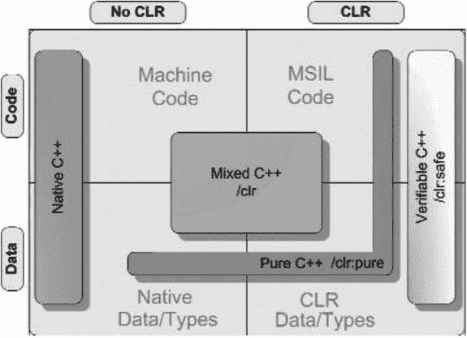

# 十九、多语言支持

对真善美的追求是一个活动领域，在这个领域里，我们可以一辈子做个孩子。—阿尔伯特·爱因斯坦

在这一章中，我将介绍将不同的。NET 语言以及与非托管代码的接口。我将从回顾. NET 中管理语言集成和互操作性的标准开始。

随着 Microsoft Visual Studio 2013 的到来，使用多种编程语言开发应用程序比以往任何时候都更容易。您不仅可以利用。NET 语言，但也可以用。NET 互操作性。

让我们来看看。NET 语言集成，然后继续学习。NET 互操作性。

## 。网络语言集成

那个。NET 平台与编程语言无关。您可以在 Visual Basic 中开发一个类，在 C#中从它派生一个类，然后在 C++/CLI 中使用这两个类。语言集成的关键在于公共语言基础设施(CLI)、公共类型系统(CTS)和公共语言规范(CLS)标准。

CLI 标准描述了. NET. All 的执行引擎和文件格式。NET 实现遵循这个标准，尽管它们可能在不同的平台上以不同的方式实现不同的元素。

通用类型系统(CTS)是 CLI 标准的一个子集，它描述兼容 CLI 的语言可用的类型。

CLS 是 CLI 标准的子集，它描述从程序集导出的项的语言互操作性规则。它不适用于程序集内的内部实现。它影响联系类型的子集以及与这些类型相关的方法。

所有这些的实际意义在于，符合 CLI 的语言不仅可以共享数据，还可以共享数据类型，它们可以基于一种语言创建多态类型，并从另一种语言派生。

### 正在收集元数据

CLI 定义元数据、公共中间语言(CIL)指令集、模块和程序集。模块是元数据单元，其中包含类型描述和 CIL 中的托管代码。程序集是一个或多个模块的部署单元。程序集被打包为类库文件(DLL)或应用程序文件(EXE)，它们可以选择从其他类库加载类。

语言集成通常是通过将模块限制为单一的。NET 语言，可以选择将这些模块收集到程序集中，并将结果绑定在一起进行部署。

如果一个构建块是一个完整的模块，后续代码将通过将它与其他模块集成到一个新的模块或程序集中来使用该模块。如果一个构造块是一个程序集或类库，那么后续代码将通过链接到它并在运行时将其作为 DLL 文件加载来使用它。

在下面的例子中，我们采用第一种选择——使用模块创建一个可执行文件。

### 跟踪学生示例

假设我们在 Visual Basic .NET 中开发了一个`Student`类，这个类封装了我们需要了解的关于学生的所有管理信息。它支持`IComparable<T>`接口，该接口允许我们使用通用集合类按标识号对学生进行排序。除此之外，让我们用 C#做一个`Tree`。`Tree`是我们自己的一个通用集合类，用于组织任意类型:它对学生没有什么特别的了解，但也不需要。最后，让我们用一个 C++/CLI 类来结束，这个类覆盖了`Tree`的树遍历方法`VisitLeaf()`，将树更改为一个链表。我们将显示按身份证号排序的学生名单。

#### 学习 Visual Basic 的学生。网

VB `Student`类有一个小的`Main()`程序用于单元测试。`Student`类有以下重要的方法:

*   `New()`:施工方
*   `CompareTo()`:用于实现`IComparable`
*   `NewStudents()`:创建一个`Student`对象数组的静态方法

下面是 VB `Student`类:

`Imports System`

`Namespace Sample`

`Public Class Student`

`Implements IComparable(Of Student)`

`' Constructor`

`Private Sub New(ByVal Id As Integer)`

`Me.Id = Id`

`End Sub`

`' IComparable`

`Public Function CompareTo(ByVal other As Student) As Integer _`

`Implements System.IComparable(Of Student).CompareTo`

`Return Me.Id.CompareTo(other.Id)`

`End Function`

`Public Shared Function`

`NewStudents(ByVal ParamArray Ids As Integer()) As Student()`

`Dim students As Student() = New Student(Ids.Length  - 1) {}`

`Dim index As Integer = 0`

`For Each id As Integer In Ids`

`students(index) = New Student(id)`

`index += 1`

`Next`

`Return students`

`End Function`

`Public Overrides Function ToString() As String`

`Return String.Format("ID:{0}", Me.Id)`

`End Function`

`' Fields`

`Private Id As Integer`

`End Class`

`Module Run`

`Sub Main()`

`Dim students As Student() = Nothing`

`students = Student.NewStudents(5, 2, 6, 8, 10, 9, 7, 1, 3, 4)`

`For Each student As Student In students`

`Console.WriteLine(student)`

`Next`

`End Sub`

`End Module`

`End Namespace`

让我们编译并运行这个:

`C:\>vbc /nologo student.vb`

`C:\>student`

`ID:5`

`ID:2`

`ID:6`

`ID:8`

`ID:10`

`ID:9`

`ID:7`

`ID:1`

`ID:3`

`ID:4`

前面的 Visual Basic 命令行将该示例编译成可执行的程序集；稍后，我们将把同一个示例编译成一个模块，用于 C#和 C++/CLI。

#### C#中的通用树类

接下来，我们研究 C#中的`Tree<T>`类。它接受实现了`IComparable<T>`接口的类型。让我们稍微检查一下代码，因为这个程序看起来比实际情况差得多。`Tree<T>`类有一个名为`Leaf`的嵌套类。每个`Leaf`不仅包含一个数据元素，还包含对树的左右分支的引用。`Leaf`包含以下方法:

*   `CompareTo()`:工具`IComparable`
*   `operator>=`和`operator<=`:`CompareTo()`方法的快捷键
*   `Leaf()`:施工方
*   `ToString()`:显示`Leaf`中包含的数据元素

`Tree<T>`类是实现`IComparable<T>. Tree<T>`的类型的一般集合，它对`Student`类一无所知。它在嵌套类`Leaf. Tree<T>`的实例中存储通用类型`T`的数据项，有以下公共方法:

*   `Add()`:`Add()`方法有两个重载:一个向树中添加单个数据项；另一个添加数据项的数组。这个方法看起来有点复杂，因为它很长，但是实际上，它所做的只是向下遍历树，寻找一个存储新的`Leaf`的地方。
*   `Inorder()`:该方法使用有序算法遍历树；这个算法访问左边的孩子，当前的叶子，最后是右边的孩子。基于我们将树叶添加到树中的方式，该算法将按照应用于两个数据实例的`IComparable<T>`的结果所定义的顺序访问所有树叶。
*   `VisitLeaf()`:每次访问一片叶子时，这个方法被`Inorder()`调用。目前实现的是使用`Leaf.ToString()`将叶子写到控制台。这个方法很重要，因为我们将在 C++ 类中覆盖它来保存叶数据，而不是将其写入控制台。

`Tree<T>`的代码如下:

`using System;`

`using System.Collections.Generic;`

`namespace Sample`

`{`

`public class Tree<T> where T : IComparable<T>`

`{`

`public class Leaf`

`{`

`public Leaf left = null;`

`public Leaf right = null;`

`public T data;`

`public Leaf(T data)`

`{`

`this.data = data;`

`}`

`public static bool operator>=(Leaf lhs, Leaf rhs)`

`{`

`return lhs.data.CompareTo(rhs.data) >=0;`

`}`

`public static bool operator<=(Leaf lhs, Leaf rhs)`

`{`

`return lhs.data.CompareTo(rhs.data) <= 0;`

`}`

`public override string ToString()`

`{`

`return data.ToString();`

`}`

`}`

`public Leaf root = null;`

`public void Add(T[] adata)`

`{`

`foreach(T data in adata)`

`{`

`Add(data);`

`}`

`}`

`public void Add(T data)`

`{`

`Leaf leaf = new Leaf(data);`

`if(root == null)`

`{`

`root = leaf;`

`}`

`else`

`{`

`Leaf current = root;`

`for(;;)`

`{`

`if(current >=leaf)`

`{`

`if(current.left == null)`

`{`

`current.left = leaf;`

`break;`

`}`

`else`

`{`

`current = current.left;`

`}`

`}`

`else`

`{`

`if(current.right == null)`

`{`

`current.right = leaf;`

`break;`

`}`

`else`

`{`

`current = current.right;`

`}`

`}`

`}`

`}`

`}`

`public virtual void VisitLeaf(Leaf leaf)`

`{`

`Console.WriteLine(leaf);`

`}`

`private void DoInorder(Leaf leaf)`

`{`

`if(leaf==null)`

`{`

`return;`

`}`

`DoInorder(leaf.left);`

`VisitLeaf(leaf);`

`DoInorder(leaf.right);`

`}`

`public virtual void Inorder()`

`{`

`DoInorder(root);`

`}`

`}`

`class Test`

`{`

`public static void Main()`

`{`

`Tree<int> tree = new Tree<int>();`

`tree.Add(3);`

`tree.Add(1);`

`tree.Add(5);`

`tree.Inorder();`

`}`

`}`

`}`

最后一个类`Test`只是用于单元测试；它有一个静态公共方法`Main()`，所以让我们如下编译并运行它:

`C:\>csc /nologo tree.cs`

`C:\>tree.exe`

`1`

`3`

`5`

同样，`csc`命令行将样本编译成汇编可执行文件；稍后，我们将把同一个示例编译成一个模块，用于 C#和 C++/CLI。

#### 在 C++/CLI 中收集片段

我们的 C++ 应用程序的目标是创建一个按标识号排序的学生链表。`Tree<T>`类中的`Inorder()`方法可以按顺序遍历树，但是它的副作用是用`VisitLeaf()`方法在控制台上显示学生。我们可以通过从`Tree<T>`派生链表类并覆盖`VisitLeaf()`方法来利用这一点。由于在遍历树时按排序顺序为每个元素调用了`VisitLeaf()`，我们可以在派生类中重写`VisitLeaf()`以将元素添加到链表中。我们在链表中使用`System::Collections::Generic`中的`LinkedList<T>`。

由于嵌套类`Tree<T>::Leaf`，这个类也是跨语言使用泛型处理嵌套类的一个很好的例子。

下面是 C++ 代码，它使用并结合了 C#和 VB:

`#using "System.dll"`

`using namespace System;`

`using namespace Collections::Generic;`

`using namespace Sample;`

`generic <typename T>`

`where T : IComparable<T>`

`ref struct LList : public Tree<T>`

`{`

`LinkedList<T> list;`

`virtual void VisitLeaf(Leaf^ leaf) override`

`{`

`list.AddLast(leaf->data);`

`}`

`virtual void Dump()`

`{`

`for each(T t in list)`

`{`

`Console::WriteLine(t);`

`}`

`}`

`};`

`void main()`

`{`

`array<Student^>^ students = Student::NewStudents(25, 46, 34, 12, 1);`

`LList<Student^>^ ll = gcnew LList<Student^>();`

`ll->Add(students);`

`ll->Inorder();`

`ll->Dump();`

`}`

这个类比其他两个简单得多；`LList<T>`只有两种显著的方法:

*   `VisitLeaf()`:覆盖`Tree<T>::VisitLeaf()`将数据项添加到我们的链表中，而不是像基类方法那样显示它
*   `Dump()`:在控制台上显示整个链表

这一次，我们想为 VB 和 C#创建模块。我们将使用这些模块编译 C++ 代码。我们可以编译并运行完成的程序:

`C:\>vbc /nologo /target:module /out:student.netmodule student.vb`

`C:\>csc /nologo /target:module /out:tree.netmodule tree.cs`

`C:\>cl /nologo /clr:pure /FUstudent.netmodule /FUtree.netmodule test.cpp`

`C:\>test`

`ID:1`

`ID:12`

`ID:25`

`ID:34`

`ID:46`

注意，我们使用`/FU`(强制使用)来添加对 C#和 VB 模块的引用；使用 force using 相当于在源代码本身内部添加了一个`#using`语句。

#### 使用 IDE

核心 IDE 项目系统仅支持使用自定义构建步骤的模块。在 Visual C++ 中，您也可以使用`/LN`命令行选项来实现这一点，您可以在项目的属性中设置该选项。为了利用 IDE 的强大功能，让我们稍微修改一下我们的应用程序。我们将创建三个项目:一个用 VB，一个用 C#，一个用 C++。

我们将 VB 和 C#目标设置为类库。确保 VB 项目属性页(Application 下)中的根命名空间为空，否则整个 VB 应用程序将隐藏在根命名空间中。

在 C++ 项目中添加对 VB 和 C#项目的引用。这自动为 C++ 项目创建了对其他两个的依赖。此外，确保 C++ 项目是启动项目。

应该可以了。这将创建一个在运行时加载 VB 和 C#类库 dll 的可执行文件。虽然您的应用程序将由三个不同的程序集组成，一个 EXE 和两个 dll，而不仅仅是上一个示例中的一个 EXE 程序集，但结果将与以前相同。

#### 。NET 语言集成摘要

好吧，从三种不同的语言中收集代码并不难，不是吗？您确实需要对每种语言有一个基本的了解来完成它，因为您需要能够跨语言映射类声明和方法声明，但是一旦您对每种语言有了基本的了解，这并不是非常困难的。如果你遇到困难，有几个公开可用的语言工具，包括。NET Reflector，可以帮你解决基本的语言差异。

与本机代码的互操作性并不简单，但对于 C++/CLI 程序来说却很简单。使用语言集成，我们还可以使用 C++/CLI 作为通向本机代码的桥梁，并轻松地将 C++/CLI 模块合并到 C#或 VB 代码中。

## 。NET 互操作性

互操作性，简称为 InterOp，是. NET 应用程序与非托管或本机代码连接的能力。

“当然，”您说，“这对于遗留代码开发很重要，但是随着这么多开发发生在。网方，真的对我有影响吗？”

如今，你可能很容易被误导，认为本机代码不再重要。让我现在澄清一下——本地开发至关重要。

当我在新西兰 TechEd 2006 上发表关于 C++ 的演讲时，Visual Studio 产品营销经理 Jason McConnell 建议我使用下面的幻灯片:

`Windows = Native + Managed`

好消息是，当你使用 C++ 时，API 是托管的还是本地的并不重要。用 C++ 做 InterOp 极其容易；这是语言中固有的。即使开发人员将 C++ 作为特定项目的主要开发平台，他们仍然依赖托管 C++ 模块或程序集来调用本机 API。他们也依靠。NET 语言集成将托管 C++ 绑定到它们的 C#或 VB 程序集。

在 C#中，就没这么简单了。您需要遵循某种机制，如平台调用或 COM 互操作，并注意在托管代码和本机代码之间正确地封送或转换数据。此外，C++ 头文件包含必须传递给本机 API 的参数定义，在 C#中不可用，因此您必须定义并行构造。如果 API 发生变化，您的代码就会中断。

C++ 有内置的互操作性，所以你可以直接访问你所有的本地代码和 API。原生 C++ 头文件可以直接在 C++/CLI 中使用，这样您就不必经历一个容易出错的步骤来将任何内容翻译成不同的语言，并且如果 API 发生变化，使用更新的头文件重新编译您的代码会将您的代码更新到新的 API。同样重要的是，C++ 知道本机类型和托管类型，所以封送是自动的。C++/CLI 的设计使得本机类型成为语言的自然组成部分。例如，`int`既可以被视为本机类型，也可以被视为`System::Int32`的实例。两种范式都受支持。C++ 也知道托管字符串和字节或字符数组之间的区别。这是语言的一部分。

让我们来看一些 C#和 C++ 中的互操作的例子。

### 等待哔哔声

让我们挑选一个非常简单的原生 Windows 调用，`MessageBeep()`。根据 MSDN 定义`MessageBeep()`播放一段波形声音。每种声音类型的波形声音由注册表中的条目标识。`MessageBeep()`代码如下:

`BOOL MessageBeep(`

`UINT uType`

`);`

#### 因素

对于参数，`MessageBeep()`采用声音类型，由注册表中的条目标识:

`uType`

该输入参数可以是表 [19-1](#Tab1) 中显示的值之一。

表 19-1。

Possible uType Parameter Values

<colgroup><col> <col></colgroup> 
| 价值 | 意义 |
| --- | --- |
| `–1` | 简单的哔哔声。如果声卡不可用，则使用扬声器产生声音。注意，这个值在函数中被解析为`0xFFFFFFFF`。 |
| `MB_ICONASTERISK` `0x00000040L` | `SystemAsterisk` |
| `MB_ICONEXCLAMATION` `0x00000030L` | `SystemExclamation` |
| `MB_ICONHAND` 0 `x00000010L` | `SystemHand` |
| `MB_ICONQUESTION` `0x00000020L` | `SystemQuestion` |
| `MB_OK` `0x00000000L` | `SystemDefault` |

现在让我们看看如何从 C#调用`MessageBeep(ICONEXCLAMATION)`。

### C#平台调用

平台调用，简称 P/Invoke，是 C#调用本机代码的主要方法。我们可以通过在 C#中声明`MessageBeep()`函数并使用 C#语言特性定义参数定义来使用 P/Invoke。名为 [`www.pinvoke.net`](http://www.pinvoke.net/) 的第三方网站非常有用，可以用来获取在 Windows API 调用中使用 P/Invoke 所需的所有信息。如果您正在与其他本机代码进行交互，那么您必须自己去发现所有这些。当你这么做的时候，记住调用本机代码的方法在 C++ 中都是内置的和自动的。

下面是`MessageBeep()`的 C#代码:

`using System.Runtime.InteropServices;`

`class Test`

`{`

`public enum beepType`

`{`

`Beep        = -1,`

`OK          = 0x00,`

`Question    = 0x20,`

`Exclamation = 0x30,`

`Asterisk    = 0x40,`

`}`

`[DllImport("User32.dll", ExactSpelling=true)]`

`static extern bool MessageBeep(uint type);`

`public static void Main(string[] args)`

`{`

`MessageBeep((uint)beepType.Exclamation);`

`}`

`}`

这个例子有几个地方令人不安。首先，我们必须为传递给`MessageBeep()`的参数创建一个`enum`。这本身就容易出错，因为现在 API 有两种不同的定义:最初的定义在`User32.dll`中，声明在 C++ 头文件中，而我们的副本在这里。

接下来，我们必须通过将我们的参数强制转换为一个`uint`以传递给`MessageBeep()`来显式地整理数据。任何时候进行造型，都有隐藏不该隐藏的东西的风险，这种情况也不例外。

在这种情况下，您会发现一个危险信号，即在`MessageBeep()` API 定义中有一个 bug 我们在 API 中发现了`Beep`的有符号/无符号不匹配。API 期望一个无符号整数，以及一个标准哔哔声的`–1`。MSDN 上有一个注释，在这种情况下使用了`0xFFFFFFFF`而不是`–1`，但它仍然指出了试图在 C#中使一些实际上不干净的东西变得干净是徒劳的。

通过将`enum`定义更改为以下内容，可以尝试做一点小小的改进:

`public enum beepType : uint`

如果我们现在编译它，我们会看到

`C:\>csc /nologo test.cs`

`test.cs(6,23): error CS0031: Constant value '-1' cannot be converted to a 'uint'`

我们可以着手修改我们的 C#代码来使用`0xFFFFFFFF`而不是`–1`，但是这只会导致我们进一步偏离已发布的 API，使得我们的代码更难维护。

### C++ 内置支持

下面是本机 C++ 中的代码:

`#include "windows.h"`

`int main()`

`{`

`MessageBeep(MB_ICONEXCLAMATION);`

`return 0;`

`}`

它非常干净，使用 Windows 头文件定义，并使用发布的 API 参数定义调用 API。不需要参数强制转换或`enum`，代码自行维护。

为了编译它，您需要输入以下内容:

`cl /nologo test.cpp user32.lib`

注意,`user32.lib`被添加到命令行，因为这是 Windows 中`MessageBeep()`的位置。在原生 C++ 中也有一种使用 DLL 导入样式属性引入库的方法，但是将它添加到命令行或项目中是标准的做法。

您可能发现自己对从原生 C++ 调用`MessageBeep()`是多么容易没有印象。毕竟，它是一个原生 API，所以它会被无缝支持是非常直观的。看看下面的 C++/CLI 应用程序:

`#include <windows.h>`

`using namespace System;`

`int main()`

`{`

`MessageBeep(MB_ICONEXCLAMATION);`

`Console::WriteLine("Did you hear the beep?");`

`return 0;`

`}`

我们用`/clr`命令行选项编译它:

`C:\>cl /nologo /clr test.cpp user32.lib`

`C:\>test`

`Did you hear the beep?`

现在，这很容易。你所要做的就是添加`/clr`选项，添加你的管理呼叫，它就工作了。产生了本机代码和托管代码的混合。

使用 Visual C++，您可以保留现有代码并添加托管功能。您向托管代码的迁移会根据需要逐渐自然地发生，没有人会被迫接受新的范例。毕竟，唯一比遗留代码更难更新的是遗留程序员。

让我们再次回顾一下托管代码和本机代码的编译器选项:

*   `/clr:safe`:这将生成一个仅 IL 可验证的输出文件，并且只能用于托管类型和托管代码。
*   `/clr:pure`:这将生成一个仅包含 IL 的输出文件(没有本机可执行代码)，并且只能用于托管和本机类型以及托管代码。
*   这产生了本地和 IL 输出的混合。允许托管和本机类型以及托管代码和本机代码。
*   `<default>`:没有指定选项，所以程序编译为本机执行。

有关直观表示，请参考图 [19-1](#Fig1) 。

图 19-1。

/clr command line options

### 使用 C++ 实现 C#互操作

在这一节中，我将重点介绍使用 C++/CLI 作为 C#和本机 C++ 之间的转换层是多么容易。

#### 在 C++ 类中包装 MessageBeep

让我们从创建一个 C++ `/clr`应用程序开始，该应用程序将`MessageBeep()`包装在一个引用类型中，以便在 C#中使用:

`#include <windows.h>`

`using namespace System;`

`using namespace System::Runtime::InteropServices;`

`public ref struct Beep`

`{`

`enum struct BeepTypes : unsigned int`

`{`

`Beep            = (unsigned int) -1,`

`Asterix         = MB_ICONASTERISK,`

`Exclamation     = MB_ICONEXCLAMATION,`

`Hand            = MB_ICONHAND,`

`Question        = MB_ICONQUESTION,`

`OK              = MB_OK,`

`};`

`static void MessageBeep(enum class BeepTypes beep)`

`{`

`::MessageBeep((unsigned int)beep);`

`}`

`};`

`void main()`

`{`

`Beep::MessageBeep(Beep::BeepTypes::Exclamation);`

`}`

我们可以编译并运行如下代码:

`C:\>cl /nologo /clr beep.cpp user32.lib`

`C:\>beep`

可惜这本书不是写在“声音开”或类似的东西，所以你可以听到哔哔声。

您可能会注意到，在 C#示例中，我为 beep 创建了一个托管的`enum`，但是这一次，我能够利用 Windows 中的 C++ 头文件定义，并且只需要显式地将基本 beep 定义为`–1`。这使得代码更能适应 API 的可能变化。

#### 在 C#中使用包装类

让我们创建一个使用包装的 C++/CLI 类的简单 C#程序:

`class Test`

`{`

`public static void Main()`

`{`

`Beep.MessageBeep(Beep.BeepTypes.Exclamation);`

`}`

`}`

如你所见，这是非常紧密和干净的。管理本机转换和接口差异的困难隐藏在 C++ 部分中。

让我们编译并运行这个最后的程序。再次注意听哔哔声，就像一只手拍手的声音。

`C:\>cl /nologo /LD /clr beep.cpp user32.lib`

`C:\>csc /nologo /r:beep.dll test.cs`

`C:\>test`

在这种情况下，我们创建一个混合的特定于处理器的程序集`beep.dll`和一个与处理器无关的程序集`test.exe`，它们一起执行托管/本机调用。

## 摘要

C#和原生 C++ 之间的切换不是一件小事，但是 C++/CLI 在两者之间形成了一个天然的桥梁。此外，由于 C++/CLI 与 C#一样是托管语言，所以完全用 C++ 开发应用程序实际上是一个极其简单方便的解决方案。

此外，。NET 语言集成使得用不同语言编写的模块和程序集的连接变得简单。为了连接到其他语言，需要重写代码或遵循带有编组环和障碍的限制性 API 的日子已经一去不复返了。CTS 和 CLS 标准确保了这一点。NET 语言以兼容的方式传递数据。

全部。NET 程序的目标是相同的平台 CLI 标准中定义的 IL。换句话说，所有。NET 编译器共享相同的目标语言，运行时和 JIT 不知道它是在运行从 C#、C++/CLI，甚至是 VB.NET 生成的 IL。VES 读取并解释由编译器产生的二进制元数据，并执行程序。

原生 C++ 是一个不同的故事。它由处理器准备执行的实际机器代码组成。在本机代码和托管代码之间进行转换的中间层受运行时支持，并且是透明集成的。如果你问我，我会说这一切都做得相当好。

在下一章，也是最后一章，我将通过补充一些细节和建议进一步研究的方向来结束这本书。