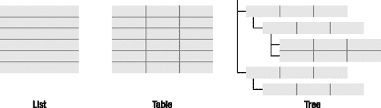
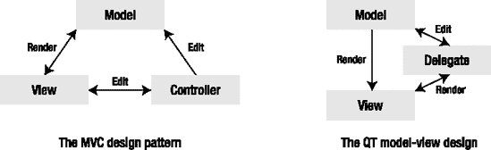
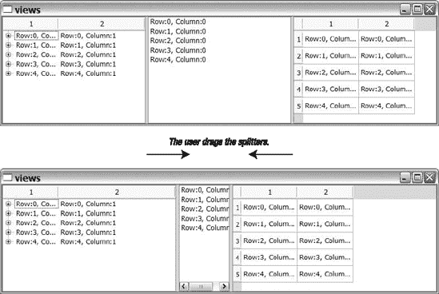
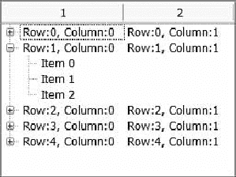
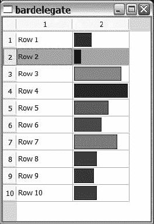
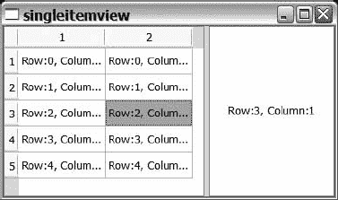
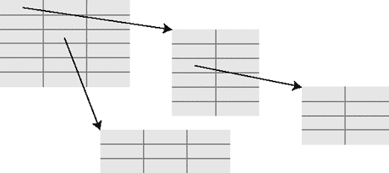
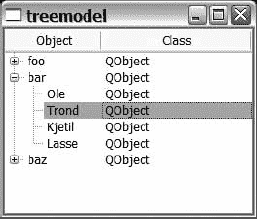
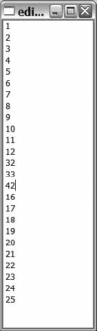

## 第二部分

Qt 积木

**<big class="calibre11">T</big> 他的部分深入看 Qt 的关键部分。这里介绍的类和技术使您能够创建和修改 Qt 构建块，并为您自己的应用程序创建定制组件。**

## 第五章

模型-视图框架

<big class="calibre11">**M**</big> 模型和视图是在所有类型的软件中频繁出现的设计模式。通过将数据分离到一个模型中，并通过视图将该模型呈现给用户，就创建了一个健壮的、可重用的设计。

*模型*用于描述[图 5-1](#a_list_comma_a_table_comma_and_a_tree) 所示的结构:列表、表格和树。一个*列表*是数据的一维向量。一个*表*是一个列表，但是有多个列——一个二维数据结构。一个*树*仅仅是一个表，但是有另一个维度，因为数据可能隐藏在其他数据中。

当您考虑如何构建应用程序时，您会发现这些结构几乎可以在所有情况下使用，因此您可以构建一个以良好方式表示您的数据结构的模型。同样重要的是要记住，您不需要改变实际存储数据的方式，您可以提供一个表示数据的模型类，然后将模型化数据中的每一项映射到应用程序数据结构中的实际项。

所有这些结构都可以用许多不同的方式表现出来。例如，列表可以显示为列表(一次显示所有项目)或组合框(仅显示当前项目)。每个值也可以以不同的方式显示，例如，显示为文本、值甚至图像。这就是*视图*进入画面的地方——它的任务是向用户显示来自模型的数据。



**图 5-1。** *一个列表，一个表格，一棵树*

在经典的模型-视图-控制器(MVC)设计模式中(见[图 5-2](#mvc_compared_with_model-view_and_delegat) ),模型保存数据，视图将数据呈现给显示单元。当用户想要编辑数据时，控制器类处理数据的所有修改。

Qt 以稍微不同的方式处理这种模式。视图没有控制器类，而是通过使用一个*委托*类来处理数据更新(参见[图 5-2](#mvc_compared_with_model-view_and_delegat) )。委托有两个任务:帮助视图呈现每个值，以及在用户想要编辑值时帮助视图。将经典的 MVC 模式与 Qt 的方法进行比较，你可以说控制器和视图已经合并，但是视图使用委托来处理控制器的部分工作。



**图 5-2。** *MVC 与模型-视图和代理的比较*

### 使用视图显示数据

Qt 提供了三种不同的默认视图:树、列表和表格。在[第 2 章](02.html#rapid_application_development_using_qt)电话簿示例中，您通过`QListWidget`看到了列表视图。`QListWidget`类是`QListView`的特殊版本，但是`QListWidget`包含列表中显示的数据，而`QListView`从模型中访问它的数据。`QListWidget`有时被称为便利类，因为它不太灵活，但与使用`QListView`和模型相比，在不太复杂的情况下更方便。

就像列表小部件与列表视图相关联一样，`QTreeWidget-QTreeView`和`QTableWidget-QTableView`对也相关联。

让我们从一个例子开始，展示如何创建一个模型，填充它，并使用所有三个视图显示它。为了简单起见，它是由一个单独的`main`函数创建的。

首先要做的是创建小部件。在[清单 5-1](#creating_the_views_and_putting_them_in_a) 中，您可以看到`QTreeView`、`QListView`和`QTableView`被创建并放入一个`QSplitter`中。一个*分割器*是一个小部件，它将可移动的条放在其子部件之间。这意味着用户可以自由地在树、列表和表格之间划分空间。你可以在图 5-3 中看到分离器的动作。

**清单 5-1。** *创建视图并将它们放入分割器*

```cpp
  QTreeView *tree = new QTreeView;

  QListView *list = new QListView;

  QTableView *table = new QTableView;

  QSplitter splitter;

  splitter.addWidget( tree );

  splitter.addWidget( list );

  splitter.addWidget( table );

```



**图 5-3。** *使用分割器可以调整树、列表和表格的大小。顶部窗口是默认的开始状态，而下面窗口中的拆分条已被移动。*

当创建小部件时，您必须创建并填充一个模型。首先使用`QStandardItemModel`，这是 Qt 附带的标准型号之一。

清单 5-2 展示了模型是如何被填充的。填充过程由三个循环组成:行(`r`)、列(`c`)和项(`i`)。这些循环创建了五行两列，其中第一列有三个子项。

**清单 5-2。** *创建并填充模型*

`  QStandardItemModel model( 5, 2 );
  for( int r=0; r<5; r++ )
    for( int c=0; c<2; c++)
    {
      QStandardItem *item =
        new QStandardItem( QString("Row:%1, Column:%2").arg(r).arg(c) );

      if( c == 0 )
        for( int i=0; i<3; i++ )
          item->appendRow( new QStandardItem( QString("Item %1").arg(i) ) );

      model.setItem(r, c, item);
    }`

让我们仔细看看人口是如何构成的。首先，`QStandardItemModel`被创建，构造函数被告知要使它变成 5 行 2 列。然后对行和列运行一对循环，其中为每个位置创建一个`QStandardItem`。通过使用`setItem(int, int, QStandardItem*)`方法将该项目放入模型中。对于第一列中的所有项目，其中`c`等于`0`，创建了三个新的`QStandardItem`对象，并使用`appendRow(QStandardItem*)`方法将其作为子项目。[图 5-4](#the_model_shown_in_a_tree_view_comma_wit) 显示了模型在树形视图中的样子。每个列和行位置的项目以表格形式显示。在表中，第二行已经展开，显示了三个子项。



**图 5-4。** *模型以树形视图显示，第二行打开显示子项目*

在小示例应用程序显示模型之前，你必须通过使用`setModel(QAbstractItemModel*)`方法告诉视图使用什么模型，如[清单 5-3](#setting_the_model_for_all_views) 所示。

**清单 5-3。** *为所有视图设置模型*

```cpp
  tree->setModel( &model );

  list->setModel( &model );

  table->setModel( &model );
```

虽然设置模型是启动和运行的全部要求，但是我想使用选择模型来演示模型之间的差异，所以在继续之前还有一个步骤要执行。

选择模型管理模型中的选择。每个视图都有自己的选择模型，但是可以使用`setSelectionModel(QItemSelectionModel*)`方法分配一个模型。通过在列表和表格中设置树的模型，如[清单 5-4](#sharing_the_selection_model) 所示，选择将被共享。这意味着，如果您在一个视图中选择了某个项目，该项目在其他两个视图中也会被选中。

**清单 5-4。** *分享选择模式*

```cpp
  list->setSelectionModel( tree->selectionModel() );

  table->setSelectionModel( tree->selectionModel() );
```

将所有这些封装在一个`main`函数和一个`QApplication`对象中，就可以得到一个可以用 QMake 构建的工作应用程序。[图 5-3](#the_tree_comma_list_comma_and_table_can) 和[图 5-4](#the_model_shown_in_a_tree_view_comma_wit) 显示了运行应用。您可以在应用程序中尝试很多东西，这些东西可以让您了解模型和视图在 Qt 中是如何工作的:

*   尝试在任一视图中一次选取一个项目，并研究该选择在其他视图中的显示位置。请注意，列表仅显示第一列，子项仅影响树视图。
*   尝试在按住 Ctrl 或 Shift 键的情况下拾取项目(然后尝试同时按住这两个键)。
*   尝试从每个视图中选取一行。当您选择列表中的一行时，只会选择第一列。
*   尝试在表中选择列(单击标题)，看看在其他视图中会发生什么。确保选择第二列并观察列表视图。
*   双击任何项目并修改文本。默认情况下，对象是可编辑的。
*   不要忘记用间隔棒做实验。

#### 提供标题

视图和标准模型是灵活的。您可能不喜欢应用程序中的一些细节，所以让我们开始查看这些细节。您可以从在标题中设置一些描述性文本开始:通过使用`setHorizontalHeaderItem(int, QStandardItem*)`和`setVerticalHeaderItem(int, QStandardItem*)`将`QStandardItem` s 插入到模型中。[清单 5-5](#adding_headers_to_the_standard_item_mode) 显示了添加到`main`函数中的行，用于添加水平标题。

**清单 5-5。** *向标准项目模型添加标题*

```cpp
  model.setHorizontalHeaderItem( 0, new QStandardItem( "Name" ) );

  model.setHorizontalHeaderItem( 1, new QStandardItem( "Phone number" ) );
```

#### 限制编辑

然后是用户可编辑的项目的问题。editable 属性在项目级别进行控制。通过在树形视图中显示的每个子项上使用`setEditable(bool)`方法，你可以使它们成为只读的(参见清单 5-6 中的内部循环)。

**清单 5-6。** *在标准项目模型中创建只读项目*

```cpp
      if( c == 0 )

        for( int i=0; i<3; i++ )

        {

          QStandardItem *child = new QStandardItem( QString("Item %1").arg(i) );

          child->setEditable( false );

          item->appendRow( child );

        }
```

#### 限制选择行为

有时候，限制选择的方式是有帮助的。例如，您可能希望限制用户一次只能选择一项(或者只能选择整行)。这个限制是由每个视图的`selectionBehavior`和`selectionMode`属性控制的。因为它是在视图级别上控制的，所以重要的是要记住，一旦选择模型在两个视图之间共享，两个视图都需要正确设置它们的`selectionBehavior`和`selectionMode`属性。

选择行为可以设置为`SelectItems`、`SelectRows`或`SelectColumns`(分别限制选择单个项目、整行或整列)。属性不限制用户可以选择的项数、行数或列数。它由`selectionMode`属性控制。选择模式可设置为以下值:

*   `NoSelection`:用户不能在视图中进行选择。
*   `SingleSelection`:用户可以在视图中选择单个项目、行或列。
*   `ContiguousSelection`:用户可以在视图中选择多个项目、行或列。选择区域必须是一个整体，彼此相邻，没有任何间隙。
*   `ExtendedSelection`:用户可以在视图中选择多个项目、行或列。选择区域是独立的，可以有间隙。用户可以通过单击和拖动来选择项目，同时按下 Shift 或 Ctrl 键来选择项目。
*   `MultiSelection`:相当于`ExtendedSelection`从程序员的角度来看，选择区域是独立的，可以有间隙。用户通过单击项目来切换所选状态。不需要使用 Shift 或 Ctrl 键。

在[清单 5-7](#changing_the_selection_behavior) 中，表格视图被配置为只允许选择一整行。尝试使用树视图和列表视图选择多个项目和单个项目。

**清单 5-7。** *改变选择行为*

```cpp
  table->setSelectionBehavior( QAbstractItemView::SelectRows );

  table->setSelectionMode( QAbstractItemView::SingleSelection );
```

#### 单列列表

对于真正简单的列表，Qt 提供了`QStringListModel`。因为项目列表通常保存在 Qt 应用程序的`QStringList`对象中，所以最好有一个采用字符串列表并能与所有视图一起工作的模型。

[清单 5-8](#using_the_qstringlistmodel_to_populate_a) 展示了如何创建和填充`QStringList`对象`list`。创建一个`QStringListModel`，并用`setStringList(const QStringList&)`设置列表。最后，在列表视图中使用该列表。

**清单 5-8。** *使用* `QStringListModel` *来填充一个* `QListView`

```cpp
  QListView list;

  QStringListModel model;

  QStringList strings;

  strings << "Huey" << "Dewey" << "Louie";

  model.setStringList( strings );

  list.setModel( &model );
```

### 创建自定义视图

能够通过现有的视图显示模型是有用的，但是有时您需要能够根据自己的需要定制视图。有两种方法:要么从`QAbstractItemDelegate`类构建一个委托，要么从`QAbstractItemView`类创建一个完全自定义的视图。

创建代理是最简单的方法，所以从这里开始。Qt 附带的视图都使用代理来绘制和编辑它的项目。通过创建用于绘制行或列(或视图中的所有项目)的委托，您通常可以获得所需的外观。

#### 画画的代表

首先创建一个委托，将整数值显示为条形。在[图 5-5](#the_bardelegate_class_is_used_to_show_in) 所示的表格视图中可以看到代表的动作。条形的范围从 0 到 100，其中 0 只是一条蓝色的细线，100 是一条完整的绿色条形。如果该值超过 100，条形会变成红色，表示超出范围。



**图 5-5。***`BarDelegate`*类用于将整数值显示为条形。**

 *因为它是一个显示条形图的委托，所以新类被称为`BarDelegate`并建立在`QAbstractItemDelegate`类的基础上。抽象项委托类是所有委托的基类。清单 5-9 中显示了类声明。这段代码可以被认为是所有管理值显示的委托的样板文件，因为覆盖的两种方法在`QAbstractItemDelegate`基类的文档中都有明确的说明。该方法的用途从其名称就很容易猜到。`paint(QPainter*, const QStyleOptionViewItem&, const QModelIndex&)`方法绘制项目，而`sizeHint(const QStyleOptionViewItem&, const QmodelIndex&)`指示每个项目想要多大。

**清单 5-9。**T3【自定义委托】的类声明

```cpp
class BarDelegate : public QAbstractItemDelegate

{

public:

  BarDelegate( QObject *parent = 0 );

  void paint( QPainter *painter,

              const QStyleOptionViewItem &option,

              const QModelIndex &index ) const;

  QSize sizeHint( const QStyleOptionViewItem &option,

                  const QModelIndex &index ) const;

};
```

清单 5-10 中的[显示了`sizeHint`方法。它只是返回一个足够大但不超过大小限制的大小。记住这只是一个提示；实际大小可以由 Qt 针对布局问题进行更改，也可以由用户通过调整行和列的大小来进行更改。](#returning_a_size_hint_for_the_custom_del)

**清单 5-10。** *返回自定义委托的大小提示*

```cpp
QSize BarDelegate::sizeHint( const QStyleOptionViewItem &option,

                             const QModelIndex &index ) const

{

  return QSize( 45, 15 );

}
```

`sizeHint`方法非常简单；`paint`方法更有趣(见[清单 5-11](#painting_the_value_for_the_custom_delega) )。第一个`if`语句通过测试样式选项的状态来检查该项是否被选中。(*样式选项*用于控制 Qt 应用程序中所有东西的外观。)负责使 Qt 应用程序看起来像本机应用程序的样式化系统将样式选项对象用于调色板、区域、可视状态以及影响对象在屏幕上的外观的所有其他内容。有许多样式对象类——几乎每个图形元素都有一个。全部继承`QStyleOption`类。

**清单 5-11。** *为自定义代理绘制值*

```cpp
void BarDelegate::paint( QPainter *painter,

  const QStyleOptionViewItem &option, const QModelIndex &index ) const

{

  if( option.state & QStyle::State_Selected )

    painter->fillRect( option.rect, option.palette.highlight() );

  int value = index.model()->data( index, Qt::DisplayRole ).toInt();

  double factor = (double)value/100.0;

  painter->save();

  if( factor > 1 )

  {

    painter->setBrush( Qt::red );

    factor = 1;

  }

  else

    painter->setBrush( QColor( 0, (int)(factor*255), 255-(int)(factor*255) ) );

  painter->setPen( Qt::black );

  painter->drawRect( option.rect.x()+2, option.rect.y()+2,

    (int)(factor*(option.rect.width()-5)), option.rect.height()-5 );

  painter->restore();

}
```

如果样式选项指示该项已被选中，则背景将填充平台的选定背景颜色，该颜色也是从样式选项中获得的。对于绘图，使用`QPainter`对象和填充给定矩形的`fillRect(const QRect&, const QBrush&)`方法。

下一行从模型中选取值，并将其转换为整数。代码请求带有索引的`DisplayRole`值。每个模型项可以有几个不同角色的数据，但是要显示的值有`DisplayRole`。该值作为一个`QVariant`返回。variant 数据类型可以保存任何类型的值:字符串、整数、实值、布尔值等等。`toInt(bool*)`方法试图将当前值转换成整数，这是委托所期望的。

获得该项目的选择状态和值的两行被突出显示。这些线条必须总是以某种形式出现在代理绘制方法中。

模型中的值用于计算一个因子，该因子告诉您该值是 100 的几分之一。该因子用于计算条形的长度和填充条形的颜色。

下一步是保存画师的内部状态，这样就可以更改钢笔颜色和画笔，然后调用`restore()`让画师保持原样。(`QPainter`类在[第 7 章](07.html#drawing_and_printing)中有更详细的讨论。)

`if`语句检查`factor`是否超过 1，并负责给用于填充条的画笔着色。如果因子大于 1，条形变为红色；否则，计算颜色时，接近零的因子给出蓝色，接近 1 的因子给出绿色。因为该因子用于控制条的长度，所以如果它太大，该因子被限制为 1，这确保了您不会试图在指定的矩形之外进行绘制。

设置画笔颜色后，在绘制线条之前，使用`drawRect(int, int, int, int)`方法将钢笔颜色设置为黑色。`option`的`rect`成员告诉你物品有多大。最后，画师恢复到方法结束前保存的状态。

为了测试委托，在`main`函数中创建了一个表视图和一个标准模型。这方面的源代码如清单 5-12 所示。该模型有两列:一个包含字符串的只读行和一个包含整数值的只读行。

在清单末尾突出显示的行中创建和设置了代理。`setItemDelegateForColumn(int, QAbstractItemDelegate*)`代表被分配到第二列。如果您不想定制一个行，您可以使用`setItemDelegateForRow(int, QAbstractItemDelegate*)`将一个代表分配给一个行，或者您可以使用`setItemDelegate(QAbstractItemDelegate*)`将一个代表分配给整个模型。

**清单 5-12。** *创建并填充一个模型；然后为第二列*设置代表

```cpp
  QTableView table;

  QStandardItemModel model( 10, 2 );

  for( int r=0; r<10; ++r )

  {

    QStandardItem *item = new QStandardItem( QString("Row %1").arg(r+1) );

    item->setEditable( false );

    model.setItem( r, 0, item );

    model.setItem( r, 1, new QStandardItem( QString::number((r*30)%100 )) );

  }

  table.setModel( &model );

  BarDelegate delegate;

  table.setItemDelegateForColumn( 1, &delegate );
```

产生的应用程序在图 5-5 的[中显示运行。问题是用户不能编辑条形后面的值，因为没有编辑器从委托的`createEditor`方法返回。](#the_bardelegate_class_is_used_to_show_in)

#### 自定义编辑

要使用户能够编辑使用自定义委托显示的项，必须扩展委托类。在[清单 5-13](#the_custom_delegate_with_support_for_a_c) 中，带有新成员的行被突出显示。它们都与为模型项提供编辑小部件有关。根据下面的列表，每种方法都有一个要处理的任务:

*   `createEditor(...)`:创建一个编辑器小部件，并将 delegate 类用作事件过滤器
*   `setEditorData(...)`:用来自给定模型项的数据初始化编辑器小部件
*   `setModelData(...)`:将模型项的值设置为编辑器小部件中的值
*   `updateEditorGeometry(...)`:更新几何图形(即位置和大小)或编辑小工具

**清单 5-13。** *支持自定义编辑小工具的自定义代理*

```cpp
class BarDelegate : public QAbstractItemDelegate

{

public:

  BarDelegate( QObject *parent = 0 );

  void paint( QPainter *painter,

              const QStyleOptionViewItem &option,

              const QModelIndex &index ) const;

  QSize sizeHint( const QStyleOptionViewItem &option,

                  const QModelIndex &index ) const;

  QWidget *createEditor( QWidget *parent,

                         const QStyleOptionViewItem &option,

                         const QModelIndex &index ) const;

  void setEditorData( QWidget *editor,

                      const QModelIndex &index ) const;

  void setModelData( QWidget *editor,

                     QAbstractItemModel *model,

                     const QModelIndex &index ) const;

  void updateEditorGeometry( QWidget *editor,

                             const QStyleOptionViewItem &option,

                             const QModelIndex &index ) const;

};
```

因为该值显示为水平增长的条形，所以使用了在水平方向移动的滑块作为编辑器。这意味着滑块的水平位置将对应于条的水平范围，如图[图 5-6](#the_custom_delegate_shows_the_value_as_a) 所示。


**图 5-6。** *自定义委托将值显示为一个条，并使用一个自定义编辑小部件:滑块来编辑值。*

让我们看看[清单 5-14](#creating_the_custom_editing_widget_and_r) 中显示的`createEditor`和`updateEditorGeometry`方法。更新几何图形的成员非常简单——它只需要通过`option`获得`rect`,并相应地设置`editor`的几何图形。

**清单 5-14。** *创建自定义编辑小工具并调整其大小*

```cpp
QWidget *BarDelegate::createEditor( QWidget *parent,

  const QStyleOptionViewItem &option, const QModelIndex &index ) const

{

  QSlider *slider = new QSlider( parent );

  slider->setAutoFillBackground( true );

  slider->setOrientation( Qt::Horizontal );

  slider->setRange( 0, 100 );

  slider->installEventFilter( const_cast<BarDelegate*>(this) );

  return slider;

}

void BarDelegate::updateEditorGeometry( QWidget *editor,

  const QStyleOptionViewItem &option, const QModelIndex &index ) const

{

  editor->setGeometry( option.rect );

}

```

* * *

**提示**使用`setGeometry(const QRect&)`方法来设置小部件的位置和大小似乎是个好主意，但是在 99%的情况下，布局是更好的选择。此处使用它是因为显示模型项目的区域是已知的，并且如果使用了布局，它是从布局直接或间接确定的。

* * *

创建编辑器的方法包含的代码稍微多一点，但是并不复杂。首先，设置一个`QSlider`来绘制背景，以便模型项的值被小部件覆盖。然后在委托类作为事件过滤器安装之前设置方向和范围。事件过滤功能包含在基类`QAbstractItemDelegate`中。

* * *

**注意** *事件过滤*是一种在事件到达小部件之前查看发送到小部件的事件的方法。这将在第 6 章的[中详细讨论。](06.html#creating_widgets)

* * *

在编辑小部件为用户准备好之前，它必须从模型中获取当前值。这是`setEditorData`方法的责任。清单 5-15 中的[方法从模型中获取值。使用`toInt(bool*)`将该值转换为整数，因此非数字值将被转换为零值。最后，使用`setValue(int)`方法设置编辑器小部件的值。](#initializing_the_editor_widget_according)

**清单 5-15。** *根据模型值初始化编辑器控件*

`void BarDelegate::setEditorData( QWidget *editor, const QModelIndex &index ) const
{
  int value = index.model()->data( index, Qt::DisplayRole ).toInt();
  static_cast<QSlider*>( editor )->setValue( value );
}`

编辑器小部件可以正确地创建、放置和调整大小，然后用当前值进行初始化。然后，用户可以以有意义的方式编辑该值，但是新值无法到达模型。这是`setModelData(QWidget*, QAbstractItemModel*, const QModelIndex&)`处理的任务。你可以在[清单 5-16](#getting_the_value_from_the_editor_widget) 中看到这个方法。代码相当简单，即使由于强制转换而有点模糊。发生的情况是，来自编辑器小部件的值被获取并在一个`setData(const QModelIndex&, const QVariant&, int)`调用中使用。受影响的模型索引`index`被作为参数传递给`setModelData`方法，因此没有真正的障碍。

**清单 5-16。** *从编辑器小部件获取值并更新模型*

```cpp
void BarDelegate::setModelData( QWidget *editor,

  QAbstractItemModel *model, const QModelIndex &index ) const

{

  model->setData( index, static_cast<QSlider*>( editor )->value() );

}
```

生成的应用程序将值显示为条形，并允许用户使用滑块编辑它们。(运行应用参见[图 5-6](#the_custom_delegate_shows_the_value_as_a) 。)

#### 创造自己的观点

当您觉得通过使用可用的视图、委托或任何其他技巧无法到达您想要的位置时，您将面临一种情况，您必须实现自己的视图。

[图 5-7](#the_custom_view_in_action) 显示了一个表格和一个显示所选项目的自定义视图。自定义视图一次显示一个项目(如果一次选择多个项目，则显示一段解释文字)。它基于一个`QAbstractItemView`并使用一个`QLabel`来显示文本。



**图 5-7。** *行动中的自定义视图*

当实现一个定制视图时，你必须提供一大堆方法的实现。有些方法很重要；其他的只是提供一个有效的返回值。哪些方法需要复杂的实现很大程度上取决于您正在实现的视图类型。

在[清单 5-17](#the_custom_view_with_all_required_member) 中，你可以看到自定义视图`SingleItemView`的类声明。除了`updateText()`之外的所有方法都是必需的，因为它们在`QAbstractItemView`中被声明为纯抽象方法。

* * *

**提示**纯抽象方法是在基类声明中设置为零的虚方法。这意味着该方法没有实现，并且该类不能被实例化。为了能够创建继承基类的类的对象，必须实现方法，因为必须实现所有对象的所有方法。

* * *

类声明中的方法告诉您视图的职责:显示模型的视图，对模型中的变化做出反应，以及对用户动作做出反应。

**清单 5-17。** *包含所有必需成员的自定义视图*

```cpp
class SingleItemView : public QAbstractItemView

{

  Q_OBJECT

public:

  SingleItemView( QWidget *parent = 0 );

  QModelIndex indexAt( const QPoint &point ) const;

  void scrollTo( const QModelIndex &index, ScrollHint hint = EnsureVisible );

  QRect visualRect( const QModelIndex &index ) const;

protected:

  int horizontalOffset() const;

  bool isIndexHidden( const QModelIndex &index ) const;

  QModelIndex moveCursor( CursorAction cursorAction,

                          Qt::KeyboardModifiers modifiers );

  void setSelection( const QRect &rect, QItemSelectionModel::SelectionFlags flags );

  int verticalOffset() const;

  QRegion visualRegionForSelection( const QItemSelection &selection ) const;

protected slots:

  void dataChanged( const QModelIndex &topLeft, const QModelIndex &bottomRight );

  void selectionChanged( const QItemSelection &selected,

                         const QItemSelection &deselected );

private:

  void updateText();

  QLabel *label;

};
```

`SingleViewItem`的构造函数在`QAbstractItemView`小部件的视图部分设置了一个`QLabel`。`QAbstractItemView`类继承了`QAbstractScrollArea`，用于创建可能需要滚动条的小部件。可滚动区域内部是查看端口小部件。

清单 5-18 中显示的构造函数的源代码展示了如何让标签填充视口。首先，为视口创建布局，然后将标签添加到布局中。为了确保标签填满可用区域，其大小策略设置为向所有方向扩展。最后，标签被配置为在设置标准文本之前在可用区域的中间显示文本。

**清单 5-18。** *在自定义视图的视口中设置标签*

```cpp
SingleItemView::SingleItemView( QWidget *parent ) : QAbstractItemView( parent )

{

  QGridLayout *layout = new QGridLayout( this->viewport() );

  label = new QLabel();

  layout->addWidget( label, 0, 0 );

  label->setAlignment( Qt::AlignCenter );

  label->setSizePolicy(

    QSizePolicy( QSizePolicy::Expanding, QSizePolicy::Expanding ) );

  label->setText( tr("<i>No data.</i>") );

}
```

在构造函数中，设置一个标准文本；在`updateText`方法中，设置实际的文本。清单 5-19 显示了该方法的实现。它通过查看从选择模型的`selection`方法中获得的`QModelIndex`个对象的数量来工作。`selection`方法返回模型中所有选中项目的索引。如果选择的项目数为零，文本被设置为`No data`。当选择一个项目时，将显示该项目的值。否则，意味着不止一个选择的项目，显示文本通知用户只能显示一个项目。

通过模型的`data`方法和`currentIndex`方法检索所选项的值。只要至少选择了一项，这些方法的组合将从当前项返回值。

**清单 5-19。** *更新标签的文本*

```cpp
void SingleItemView::updateText()

{

  switch( selectionModel()->selection().indexes().count() )

  {

    case 0:

      label->setText( tr("<i>No data.</i>") );

      break;

    case 1:

      label->setText( model()->data( currentIndex() ).toString() );

      break;

    default:

      label->setText( tr("<i>Too many items selected.<br>"

                         "Can only show one item at a time.</i>") );

      break;

  }

}
```

因为视图的大部分工作是显示项目，所以视图需要有方法来告诉什么是可见的以及在哪里。因为视图只显示了一个项目，所以您只能面对全有或全无的情况。清单 5-20 中的[所示的方法`visualRect`，返回一个包含给定模型索引的矩形。该方法只是检查它是否是可见项，如果是，则返回整个视图的区域；否则，返回一个空矩形。](#determining_what_is_visible_and_what_is)

有更多的方法以同样的方式工作:`visualRegionForSelection`、`isIndexHidden`和`indexAt`。所有这些方法都检查给定的模型索引是否是显示的那个，然后相应地返回。

**清单 5-20。** *确定什么是可见的，什么是不可见的*

```cpp
QRect SingleItemView::visualRect( const QModelIndex &index ) const

{

  if( selectionModel()->selection().indexes().count() != 1 )

    return QRect();

  if( currentIndex() != index )

    return QRect();

  return rect();

}
```

一些方法的目的是返回有效值来维护一个预定义的接口，这是清单 5-21 中显示的方法的工作。因为滚动条没有被使用，并且一次只显示一个项目，所以这些方法尽可能接近于空的。

**清单 5-21。** *返回有效响应而不采取行动*

```cpp
int SingleItemView::horizontalOffset() const

{

  return horizontalScrollBar()->value();

}

int SingleItemView::verticalOffset() const

{

  return verticalScrollBar()->value();

}

QModelIndex SingleItemView::moveCursor( CursorAction cursorAction,

                                        Qt::KeyboardModifiers modifiers )

{

  return currentIndex();

}

void SingleItemView::setSelection( const QRect &rect,

                                   QItemSelectionModel::SelectionFlags flags )

{

  // do nothing

}

void SingleItemView::scrollTo( const QModelIndex &index, ScrollHint hint )

{

  // cannot scroll

}
```

**对变化做出反应**

视图的最后一个任务是对模型中的变化和用户动作做出反应(例如，通过改变选择)。方法`dataChanged`和`selectionChanged`通过使用`updateText`更新显示的文本来对这些事件做出反应。你可以在清单 5-22 中看到这两种方法的实现。

**清单 5-22。** *对模型和选择的变化做出反应*

```cpp
void SingleItemView::dataChanged( const QModelIndex &topLeft,

                                  const QModelIndex &bottomRight )

{

  updateText();

}

void SingleItemView::selectionChanged( const QItemSelection &selected,

                                       const QItemSelection &deselected )

{

  updateText();

}
```

使用定制视图就像使用 Qt 附带的视图一样简单。[清单 5-23](#using_the_single_item_view_together_with) 展示了它的样子(填充模型被省略了)。使用一对嵌套的`for`回路来使用和填充`QStandardItemModel`。如您所见，使用视图和共享选择模型非常容易。(应用见[图 5-7](#the_custom_view_in_action) 。)

**清单 5-23。** *利用单项视图结合表格视图*

```cpp
int main( int argc, char **argv )

{

  QApplication app( argc, argv );

  QTableView *table = new QTableView;

  SingleItemView *selectionView = new SingleItemView;

  QSplitter splitter;

  splitter.addWidget( table );

  splitter.addWidget( selectionView );

...

  table->setModel( &model );

  selectionView->setModel( &model );

  selectionView->setSelectionModel( table->selectionModel() );

  splitter.show();

  return app.exec();

}
```

### 创建定制模型

到目前为止，您一直在查看自定义视图和代理。模型都是`QStandardItemModel`或`QStringListModel`的，所以模型-视图架构的一个要点被忽略了:定制模型。

通过提供您自己的模型，您可以将应用程序的数据结构转换成一个模型，该模型可以显示为表格、列表、树或任何其他视图。通过让模型转换您现有的数据，您不必保留数据集——一个用于应用程序的内部，一个用于显示。这带来了另一个好处:您不必确保这两个集合是同步的。

定制模型有四种方法:

*   您可以将应用程序的数据保存在模型中，并通过视图使用的模型预定义的类接口来访问它。
*   您可以将应用程序的数据保存在模型中，并通过视图使用的预定义接口旁边实现的自定义类接口来访问它。
*   您可以将应用程序的数据保存在外部对象中，并让模型充当您的数据和视图所需的类接口之间的包装器。
*   您可以动态地为模型生成数据，并通过视图使用的类接口提供结果。

本节讨论表格和树，以及只读和可编辑模型。所有模型都使用不同的方法来保存和向视图提供数据；所有视图都可以与标准视图以及您使用的任何自定义视图一起使用。

#### 只读表格模型

首先，您将看到一个动态生成数据的只读表模型。名为`MulModel`的模型类显示了乘法表的可配置部分。类别声明如清单 5-24 所示。

该类基于`QAbstractTableModel`，在创建二维模型时，这是一个很好的开始类。所有的模型实际上都基于`QAbstractItemModel`类，但是抽象表模型类为一些需要的方法提供了存根实现。`MulModel`类的方法各有特殊的责任:

*   `flags`:告诉视图可以对每个项目做什么(是否可以编辑、选择等等)
*   `data`:给视图返回给定角色的数据
*   `headerData`:将表头数据返回给视图
*   `rowCount`和`columnCount`:将模型的尺寸返回视图

**清单 5-24。** *自定义模型类声明*

```cpp
class MulModel : public QAbstractTableModel

{

public:

  MulModel( int rows, int columns, QObject *parent = 0 );

  Qt::ItemFlags flags( const QModelIndex &index ) const;

  QVariant data( const QModelIndex &index, int role = Qt::DisplayRole ) const;

  QVariant headerData( int section, Qt::Orientation orientation,

                       int role = Qt::DisplayRole ) const;

  int rowCount( const QModelIndex &parent = QModelIndex() ) const;

  int columnCount( const QModelIndex &parent = QModelIndex() ) const;

private:

  int m_rows, m_columns;

};
```

构造函数只是记住要显示的行数和列数，然后将父类传递给基类构造函数。`rowCount`和`columnCount`方法和构造函数一样简单，因为它们只是返回给构造函数的维度。你可以在[清单 5-25](#constructor_comma_rowcount_comma_and_col) 中看到这些方法。

**清单 5-25。** *构造函数、* `rowCount`、*和* `columnCount` *方法*

```cpp
MulModel::MulModel( int rows, int columns, QObject *parent ) :

  QAbstractTableModel( parent )

{

  m_rows = rows;

  m_columns = columns;

}

int MulModel::rowCount( const QModelIndex &parent ) const

{

  return m_rows;

}

int MulModel::columnCount( const QModelIndex &parent ) const

{

  return m_columns;

}
```

`data`方法返回给定角色的数据。数据总是以`QVariant`的形式返回，这意味着它可以被转换成图标、大小、文本和值。角色定义了数据的用途，如下表所示:

*   `Qt::DisplayRole`:要显示的数据(文本)
*   `Qt::DecorationRole`:用于装饰物品的数据(图标)
*   `Qt::EditRole`:可用于编辑器的格式的数据
*   `Qt::ToolTipRole`:显示为工具提示的数据(文本)
*   `Qt::StatusTipRole`:显示为状态栏信息的数据(文本)
*   `Qt::WhatsThisRole`:这是什么中要显示的数据？信息
*   `Qt::SizeHintRole`:视图的尺寸提示

`MulModel`的`data`方法支持`DisplayRole`和`ToolTipRole`。显示角色是当前乘法的值；显示的工具提示是乘法表达式本身。该方法的源代码如[清单 5-26](#providing_data_from_the_custom_model) 所示。

**清单 5-26。** *从自定义模型中提供数据*

```cpp
QVariant MulModel::data( const QModelIndex &index, int role ) const

{

  switch( role )

  {

  case Qt::DisplayRole:

    return (index.row()+1) * (index.column()+1);

  case Qt::ToolTipRole:

    return QString( "%1 × %2" ).arg( index.row()+1 ).arg( index.column()+1 );

  default:

    return QVariant();

  }

}
```

为不同的角色返回标题数据，就像为实际项目数据返回一样。当返回头数据时，注意方向通常是很重要的(即，请求的信息是针对`Horizontal`还是`Vertical`头)。因为它与乘法表无关，所以[清单 5-27](#providing_headers_for_the_custom_model) 所示的方法非常简单。

**清单 5-27。** *为自定义模型提供表头*

```cpp
QVariant MulModel::headerData( int section,

                                Qt::Orientation orientation, int role ) const

{

  if( role != Qt::DisplayRole )

    return QVariant();

  return section+1;

}
```

最后，`flags`返回的标志用于控制用户可以对项目做什么。清单 5-28 中显示的方法告诉视图所有的项目都可以被选择和启用。还有更多可用的标志。请参考以下列表进行快速概述:

*   `Qt::ItemIsSelectable`:可以选择项目。
*   `Qt::ItemIsEditable`:该项目可以编辑。
*   `Qt::ItemIsDragEnabled`:可以从模型中拖动项目。
*   `Qt::ItemIsDropEnabled`:可以将数据拖放到项目上。
*   `Qt::ItemIsUserCheckable`:用户可以勾选和取消勾选该项。
*   `Qt::ItemIsEnabled`:该项被启用。
*   `Qt::ItemIsTristate`:项目在树形状态之间循环。

**清单 5-28。** *用于控制用户可以对模型项目做什么的标志*

```cpp
Qt::ItemFlags MulModel::flags( const QModelIndex &index ) const

{

  if(!index.isValid())

    return Qt::ItemIsEnabled;

  return Qt::ItemIsSelectable | Qt::ItemIsEnabled;

}
```

这是模型需要的所有方法。在继续之前，看一下[图 5-8](#the_mulmodel_class_used_with_a_qtablevie) ，它显示了显示工具提示的`MulModel`。使用带有`QTableView`的`MulModel`的代码如[清单 5-29](#using_the_custom_model_with_a_table_view) 所示。


**图 5-8。** *将* `MulModel` *类与* `QTableView`类配合使用

**清单 5-29。** *使用带有表格视图的自定义模型*

```cpp
int main( int argc, char **argv )

{

  QApplication app( argc, argv );

  MulModel model( 12, 12 );

  QTableView table;

  table.setModel( &model );

  table.show();

  return app.exec();

}
```

#### 属于你自己的一棵树

尽管创建一个二维表并不困难，但是创建树模型稍微复杂一些。要理解表格和树的区别，请看一下图 5-9 ，它显示了 Qt 中的一棵树。



**图 5-9。** *树实际上是一个表格，其中每个单元格可以包含更多的表格。*

让树模型工作的诀窍是将树结构映射到模型的索引。这使得可以返回每个索引的数据以及每个索引可用的行数和列数(即每个索引可用的子项数)。

我选择将模型建立在所有 Qt 应用程序中都可用的树结构上:`QObject`所有权树。每个`QObject`都有一个父节点，并且可以有子节点，这就构建了一个模型将要表示的树。

* * *

**注意**这里展示的模型显示了一个`QObject`树的快照。如果通过添加或删除对象来修改树，模型将失去同步，并且必须重置。

* * *

将要实施的应用程序在[图 5-10](#the_tree_model_showing_qobjects_through) 中显示。



**图 5-10。** *树形模型通过* `QTreeView`显示 `QObjects`

 *让我们先来看看类声明(参见[清单 5-30](#the_class_declaration_for_the_tree_model) )。该类名为`ObjectTreeModel`，基于`QAbstractItemModel`。清单中突出显示的行显示了与`MulModel`相比增加的方法。

**清单 5-30。** *树模型的类声明*

```cpp
class ObjectTreeModel : public QAbstractItemModel

{

public:

  ObjectTreeModel( QObject *root, QObject *parent = 0 );

  Qt::ItemFlags flags( const QModelIndex &index ) const;

  QVariant data( const QModelIndex &index, int role ) const;

  QVariant headerData( int section, Qt::Orientation orientation,

                       int role = Qt::DisplayRole ) const;

  int rowCount( const QModelIndex &parent = QModelIndex() ) const;

  int columnCount( const QModelIndex &parent = QModelIndex() ) const;

  QModelIndex index( int row, int column,

                     const QModelIndex &parent = QModelIndex() ) const;

  QModelIndex parent( const QModelIndex &index ) const;

private:

  QObject *m_root;

};
```

构造函数和`MulModel`类一样简单。它不是记住乘法表的维数，而是存储一个指向根`QObject`的指针作为`m_root`。

在[清单 5-31](#the_header_function_for_the_tree_model) 中显示的`headerData`方法比`MulModel`方法稍微复杂一些，因为它只返回水平标题。从方法中可以看出，所有树节点都有两列:一列用于对象名，一列用于类名。

**清单 5-31。** *树形模型的表头功能*

```cpp
QVariant ObjectTreeModel::headerData(int section,

                                     Qt::Orientation orientation, int role ) const

{

  if( role != Qt::DisplayRole || orientation != Qt::Horizontal )

    return QVariant();

  switch( section )

  {

  case 0:

    return QString( "Object" );

  case 1:

    return QString( "Class" );

  default:

    return QVariant();

  }

}
```

如果您将`index`方法与`ObjectTreeModel`类和`MulModel`类进行比较，您可以看到一些真正的差异，这是意料之中的，因为数据以不同的方式表示(并且索引也不同)。在`MulModel`中，您不必提供一个`index`方法，因为`QAbstractTableModel`已经为您实现了它。

`ObjectTreeModel` class' `index`方法接受一个模型索引、`parent`、一列和一行；它在树的表中给出一个位置。索引到实际树的映射是通过模型索引的`internalPointer()`方法来处理的。这个方法使得在每个索引中存储一个指针成为可能，并且你可以存储一个指向被索引的`QObject`的指针。

如果索引是有效的，您可以获得适当的`QObject`，对于它，您希望每个子元素对应一行。这意味着通过使用`row`作为从`children()`返回的数组的索引，您可以构建一个指向新的`QObject`的指针，您可以用它来构建一个新的索引。使用`QAbstractItemModel`中可用的`createIndex`方法构建索引(参见[清单 5-32](#the_workhorsemturning_qobjects_into_inde) )。

在`index`方法中，做了一个假设。如果视图请求一个无效的索引，它将获得树的根，这为视图提供了一个开始的方法。

**清单 5-32。** *老黄牛——把* `QObject` *s 变成指标*

```cpp
QModelIndex ObjectTreeModel::index(int row, int column,

                                   const QModelIndex &parent ) const

{

  QObject *parentObject;

  if( !parent.isValid() )

    parentObject = m_root;

  else

    parentObject = static_cast<QObject*>( parent.internalPointer() );

  if( row >= 0 && row < parentObject->children().count() )

    return createIndex( row, column, parentObject->children().at( row ) );

  else

    return QModelIndex();

}
```

给定`index`方法，返回可用行数和列数的方法(如[清单 5-33](#calculating_the_number_of_rows_and_retur) 所示)很容易实现。总是有两列，行数简单地对应于`children`数组的大小。

**清单 5-33。** *计算行数，返回* `2` *为列数*

```cpp
int ObjectTreeModel::rowCount(const QModelIndex &parent ) const

{

  QObject *parentObject;

  if( !parent.isValid() )

    parentObject = m_root;

  else

    parentObject = static_cast<QObject*>( parent.internalPointer() );

  return parentObject->children().count();

}

int ObjectTreeModel::columnCount(const QModelIndex &parent ) const

{

  return 2;

}
```

获取数据几乎和计算行数一样简单。第一列的对象名可以通过`objectName`属性获得，而您必须通过`QMetaObject`来获得第二列的类名。你还必须确保只为`DisplayRole`归还。清单 5-34 的[中省略了`ToolTipRole`，但是您可以看到`DisplayRole`数据是如何被检索的。](#returning_the_actual_data_for_each_index)

**清单 5-34。** *返回每个指标的实际数据*

```cpp
QVariant ObjectTreeModel::data( const QModelIndex &index, int role) const

{

  if( !index.isValid() )

    return QVariant();

  if( role == Qt::DisplayRole )

  {

    switch( index.column() )

    {

    case 0:

      return static_cast<QObject*>( index.internalPointer() )->objectName();

    case 1:

      return static_cast<QObject*>( index.internalPointer() )->

        metaObject()->className();

    default:

      break;

    }

  }

  else if( role == Qt::ToolTipRole )

  {

...

  }

  return QVariant();

}
```

最后一个方法的实现稍微复杂一些:父方法(见清单 5-35 )返回一个给定索引的父索引。很容易找到从索引中获得的`QObject`的父级，但是还需要获得该父级的行号。

解决方案是，如果父对象不是根对象，它也必须有一个祖父对象。对祖父级的`children`数组使用`indexOf`方法，可以得到父级的行。知道自己孩子的顺序很重要！

**清单 5-35。** *为父节点构建索引需要向祖父节点请求 indexOf 方法。*

```cpp
QModelIndex ObjectTreeModel::parent(const QModelIndex &index) const

{

  if( !index.isValid() )

    return QModelIndex();

  QObject *indexObject = static_cast<QObject*>( index.internalPointer() );

  QObject *parentObject = indexObject->parent();

  if( parentObject == m_root )

    return QModelIndex();

  QObject *grandParentObject = parentObject->parent();

  return createIndex( grandParentObject->children().indexOf( parentObject ),

                      0, parentObject );

}
```

要尝试全新的`ObjectTreeModel`，你可以使用[清单 5-36](#building_a_tree_of_qobjects_and_then_sho) 中的`main`函数。`main`函数的最大部分用于构建一棵`QObjects`树。创建一个带有指向根对象的指针的模型并将其传递给视图只需要四行代码(包括创建和显示视图)。运行应用如图 5-10 中的[所示。](#the_tree_model_showing_qobjects_through)

**清单 5-36。** *构建* `QObjects` *的树，然后使用自定义树模型*显示

```cpp
int main( int argc, char **argv )

{

  QApplication app( argc, argv );

  QObject root;

  root.setObjectName( "root" );

  QObject *child;

  QObject *foo = new QObject( &root );

  foo->setObjectName( "foo" );

  child = new QObject( foo );

  child->setObjectName( "Mark" );

  child = new QObject( foo );

  child->setObjectName( "Bob" );

  child = new QObject( foo );

  child->setObjectName( "Kent" );

  QObject *bar = new QObject( &root );

  bar->setObjectName( "bar" );

...

  ObjectTreeModel model( &root );

  QTreeView tree;

  tree.setModel( &model );

  tree.show();

  return app.exec();

}
```

#### 编辑模型

之前的两个模型——一个二维数组和一棵树——显示了复杂的结构，但它们是只读的。这里显示的`IntModel`非常简单——只是一个整数列表——但是可以编辑。

[清单 5-37](#the_intmodel_has_fewer_methods_than_mulm) 显示了`IntModel`的类声明，它基于最简单的抽象模型库:`QAbstractListModel`(这意味着正在创建一个一维列表)。

这个类的方法比`MulModel`和`ObjectTreeModel`少。唯一的新闻是用于使模型可写的`setData`方法。

**清单 5-37。***`IntModel`*的方法比* `MulModel` *少，但是* `MulModel` *没有* `setData`。*

```cpp
class IntModel : public QAbstractListModel

{

public:

  IntModel( int count, QObject *parent = 0 );

  Qt::ItemFlags flags( const QModelIndex &index ) const;

  QVariant data( const QModelIndex &index, int role = Qt::DisplayRole ) const;

  int rowCount( const QModelIndex &parent = QModelIndex() ) const;

  bool setData( const QModelIndex &index, const QVariant &value,

                int role = Qt::EditRole );

private:

  QList<int> m_values;

};
```

因为`IntModel`是一个非常简单的模型，所以它也有许多简单的方法。首先，如[清单 5-38](#easy_as_one_comma_two_comma_three_..._th) 所示的构造函数用通过`count`指定的值的数量初始化列表。

**清单 5-38。** *易如一、二、三...构造函数只是填充列表。*

```cpp
IntModel::IntModel( int count, QObject *parent )

{

  for( int i=0; i<count; ++i )

    m_values << i+1;

}
```

行数等于`m_values`列表的`count`属性。这意味着`rowCount`就像[清单 5-39](#the_number_of_rows_is_the_number_of_item) 一样简单。

**清单 5-39。** *行数是列表中项目的数量。*

```cpp
int IntModel::rowCount( const QModelIndex &parent ) const

{

  return m_values.count();

}
```

返回每个索引的数据也很容易(见清单 5-40)；你可以使用`index`的`rows`属性在`m_values`列表中查找正确的值。返回与`EditRole`相同的`DisplayRole`的`QVariant`。`EditRole`代表用于初始化编辑器的值。如果忽略它，用户每次都必须从一个空的编辑器开始。

**清单 5-40。** *返回值就像在列表中查找一样简单。*

```cpp
QVariant IntModel::data( const QModelIndex &index, int role ) const

{

  if( role != Qt::DisplayRole || role != Qt::EditRole )

    return QVariant();

  if( index.column() == 0 && index.row() < m_values.count() )

    return m_values.at( index.row() );

  else

    return QVariant();

}
```

要使一个项目可编辑，返回标志值`ItemIsEditable`和`ItemIsSelectable`是很重要的。通过返回`ItemIsEnabled`，这个项目看起来也是活动的。`flag`方法如[清单 5-41](#flagging_editability_comma_selectability) 所示。

**清单 5-41。** *标记可编辑性、可选择性和被启用*

```cpp
Qt::ItemFlags IntModel::flags( const QModelIndex &index ) const

{

  if(!index.isValid())

    return Qt::ItemIsEnabled;

  return Qt::ItemIsSelectable | Qt::ItemIsEditable | Qt::ItemIsEnabled;

}
```

[清单 5-42](#updating_the_model_according_to_an_edit) 显示了`setData`方法，这是整个`IntModel`类中最复杂的方法，仍然适合七行代码。它首先检查给定的索引是否有效，角色是否是`EditRole`。(`EditRole`是适合编辑的格式的数据，是用户编辑一个值后从视图中得到的。)

在您确定索引和角色都很好之后，您必须确保已经发生了实际的变化。如果值没有发生变化(或者如果索引或角色无效)，则返回`false`，表示没有发生变化。

当实际变化发生时，模型的值被更新，并且在返回`true`之前发出`dataChanged`信号。不要忘记发出信号并返回正确的值；否则，模型和视图之间的交互将会失败。

**清单 5-42。** *根据编辑动作更新模型*

```cpp
bool IntModel::setData( const QModelIndex &index, const QVariant &value, int role )

{

  if( role != Qt::EditRole ||

      index.column() != 0 ||

      index.row() >= m_values.count() )

    return false;

  if( value.toInt() == m_values.at( index.row() ) )

    return false;

  m_values[ index.row() ] = value.toInt();

  emit dataChanged( index, index );

  return true;

}
```

[清单 5-43](#using_the_intmodel_with_a_qlistview) 和[图 5-11](#an_intmodel_being_edited) 显示了使用中的`IntModel`。可编辑的模型不会以任何方式影响`main`功能。这是模型和视图同意使用模型的`flag`方法的返回值。

**清单 5-43。** *用* `IntModel` *带* `QListView`

```cpp
int main( int argc, char **argv )

{

  QApplication app( argc, argv );

  IntModel model( 25 );

  QListView list;

  list.setModel( &model );

  list.show();

  return app.exec();

}

```



**图 5-11。**T3T0*正在编辑*

### 排序和过滤模型

来自模型的数据通常是未排序的，但是您可以通过实现模型的`sort`方法来启用排序。如果您使用一个树形视图或者表格视图来显示您的模型，您可以通过将属性`sortingEnabled`设置为`true`来允许用户点击标题进行排序。

只要您使用`QStandardItemModel`模型并坚持使用`QVariant`处理的类型，排序马上就能工作。但是，您肯定会遇到不希望更改模型来执行排序的情况。这就是代理模型的用武之地。

一个*代理模型*是一个将另一个类包装在其自身中，转换它，并取代它的模型。包装后的模型通常被称为*源模型*。在代理模型上执行的所有操作都被转发到源模型，并且源模型中的所有更改都被传播到代理模型。要实现一个代理模型，从`QAbstractProxyModel`类开始(如果您想要排序或过滤一个模型，使用`QSortFilterProxyModel`类)。

首先，让我们通过代理模型提供自定义排序。在你开始实现代理模型之前，你可能想看看清单 5-44 中的`main`函数。`main`功能显示代理模型`sorter`被插入到源模型(`model`和视图(`table`)之间。通过使用`setSourceModel(QAbstractItemModel*)`方法将源模型分配给代理模型。然后代理被用作视图中的模型，而不是直接使用源。

**清单 5-44。** *源模型被分配给代理模型，然后被视图使用，而不是直接使用源模型。*

`int main( int argc, char **argv )
{
  QApplication app( argc, argv );

  QStringListModel model;
  QStringList list;
  list << "Totte" << "Alfons" << "Laban" << "Bamse" << "Skalman";
  model.setStringList( list );

  SortOnSecondModel sorter;
  sorter.setSourceModel( &model );

  QTableView table;
  table.setModel( &sorter );
  table.setSortingEnabled( true );
  table.show();

  return app.exec();
}`

如果您想通过继承`QSortFilterProxyModel`的类提供自定义排序，您需要覆盖`lessThan(const QModelIndex&, const QModelIndex&)`方法。代理类本身非常简单——它只需要一个构造函数和一个覆盖方法。示例排序代理模型在按字母顺序对字符串进行排序之前会忽略字符串的第一个字母。这个类叫做`SortOnSecondModel`，声明如[清单 5-45](#the_class_declaration_of_the_custom_sort) 所示。

**清单 5-45。** *自定义排序代理模型的类声明*

```cpp
class SortOnSecondModel : public QSortFilterProxyModel

{

public:

  SortOnSecondModel( QObject *parent = 0 );

protected:

  bool lessThan( const QModelIndex &left, const QModelIndex &right ) const;

};
```

`SortOnSecondModel`的构造函数很简单；它只是将父对象传递给基类的构造函数。该类的代码包含在[清单 5-46](#the_lessthan_method_ignores_the_first_ch) 所示的`lessThan`方法中。

**清单 5-46。***`lessThan`*方法在比较字符串之前会忽略它们的第一个字符。**

```cpp
bool SortOnSecondModel::lessThan( const QModelIndex &left,

                                  const QModelIndex &right ) const

{

  QString leftString = sourceModel()->data( left ).toString();

  QString rightString = sourceModel()->data( right ).toString();

  if( !leftString.isEmpty() )

    leftString = leftString.mid( 1 );

  if( !rightString.isEmpty() )

    rightString = rightstring.mid( 1 );

  return leftString < rightString;

}
```

在该方法中，您使用`sourceModel()`方法获取对源模型的引用，并从中获取实际数据进行比较。在比较字符串之前，从左右字符串中截取第一个字母(如果有)。[图 5-12](#the_custom_sorting_proxy_model_in_action) 显示了应用程序运行时，源模型按照代理模型的排序顺序进行排序。


**图 5-12。** *自定义排序代理模型在行动*

当模型的数据改变时，排序不会自动更新，但是可以通过将代理模型的`dynamicSortFilter`属性设置为`true`来改变。在使用这种方法之前，请确保您的模型足够小，以便在它再次发生变化之前有时间进行排序。

之前的应用只使用了`QSortFilterProxyModel`的排序功能。如果您需要过滤一个模型以省去几行，您可以重新实现`filterAcceptsRow`方法。使用`filterAcceptsColumn`对列进行过滤。这些方法接受源索引和行(或列),如果要显示行(或列),则返回布尔值 true。

### 总结

使用模型和视图似乎是一种过于复杂的做事方式，但是最终的软件是用一种已经被证明是灵活和强大的结构构建的。

当您处理需要以多种方式显示相同数据的情况时，应该考虑使用模型-视图方法；处理常见的选择；或者只显示列表、树或数据表。

使用带有自定义代理和模型的标准视图通常是比提供完全自定义的小部件更好的解决方案。****