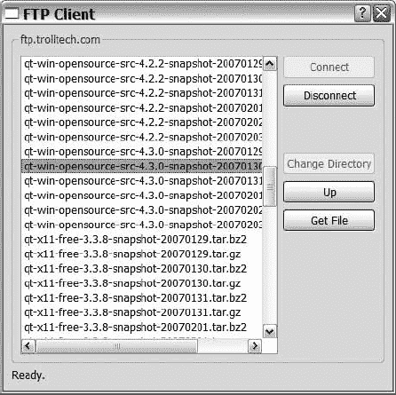
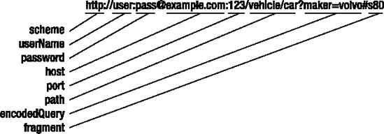
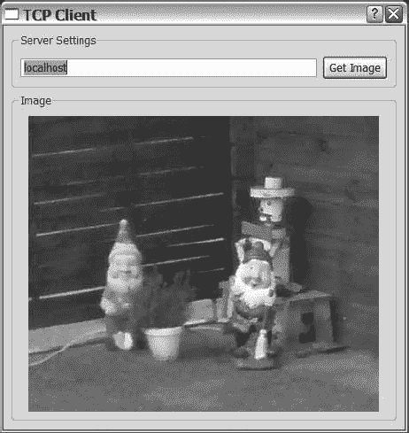

## 第十四章

联网

<big class="calibre11">**Qt**</big> 支持通过*传输控制协议(TCP)* 和*用户数据报协议(UDP)* 套接字建立的基于 IP 的连接。此外，Qt 支持 HTTP 和 FTP 协议的客户端实现，这有助于创建 FTP 客户端和基于 HTTP 的下载。所有这些类都保存在 Qt 的一个单独的网络模块中。

本章首先讨论客户端协议以及如何使用它们下载数据(协议的客户端是与服务器交互时使用的代码)。您还将快速浏览一下`QUrl`类，它用于处理 URL 及其不同部分。

本章的后半部分讨论了 TCP 和 UDP 套接字类，以及如何实现服务器和客户端。

### 使用 QtNetwork 模块

所有用于联网的 Qt 类都是`QtNetwork`模块的一部分。这个模块并不是在 Qt 的所有闭源版本中都有，但是它包含在开源版本中。这意味着如果您计划在您的闭源 Qt 项目中使用它，您必须首先访问该模块。

在确保您可以访问该模块之后，您需要通过告诉 QMake 您正在使用它来将它包含在您的构建过程中(将代码行`QT += network`添加到项目文件中)。

### 使用客户端协议

`QFtp`和`QHttp`类封装了 FTP 和 HTTP 协议。请记住，这两个类只实现这些协议的客户端，所以如果你想创建一个 FTP 服务器或 HTTP 服务器，你必须求助于 TCP 服务器和套接字类(在本章后面介绍)。

比较 FTP 和 HTTP 可以看出，虽然两种协议在相同的问题域中工作，但 FTP 是一种稍微复杂一些的协议。例如，FTP 协议依赖于一种状态，在这种状态下，连接被建立，然后在关闭之前被使用。另一方面，HTTP 是无状态的——它将每个请求与其他请求分开处理。

然而，从应用程序开发人员的角度来看，这两种协议的使用方式是相同的。创建一个协议对象(一个`QFtp`对象或一个`QHttp`对象)。当一个方法被调用时，请求的动作被异步执行，这意味着方法只返回一个请求标识符，而不是实际的结果。相反，您的应用程序必须等待一个携带结果的信号被发出。

让我们看看这在实践中是如何工作的，从开发一个 FTP 客户端开始。

#### 创建 FTP 客户端

使用`QFtp`类，您将实现一个基本的 FTP 客户端，使用户能够连接到`[ftp://ftp.trolltech.com](http://ftp://ftp.trolltech.com)`，浏览目录树，并下载文件。[图 14-1](#the_ftp_client_in_action) 显示了实际应用。

功能的限制(例如，只能连接到一个主机)简化了应用程序，但是仍然展示了如何使用`QFtp`类。



**图 14-1。***FTP 客户端在行动*

FTP 客户端由一个对话框组成，该对话框包含一个用于与 FTP 站点交互的`QFtp`对象。`QFtp`对象与应用程序异步工作，所以当你发出一个命令时，你必须等待一个信号到达——当命令被执行时，应用程序保持运行。

`QFtp`类有一系列在不同事件发生时发出的信号，包括:

*   `commandFinished(int request, bool error)`:该信号在命令结束时发出。`request`参数可用于识别命令，而如果在命令执行过程中发生了`error`，则`error`为`true`。
*   `listInfo(QUrlInfo info)`:当列出一个目录的内容时，为找到的每个文件或目录发出该信号。
*   `dataTransferProgress(qint64 done, qint64 total)`:该信号在上传和下载过程中发出。参数`done`报告了`total`已经完成了多少。`done`和`total`参数是可伸缩的，所以你不能依赖这些代表字节的参数。如果总大小未知，`total`为零。

这三个信号从`QFtp`对象连接到对话框构造器中对话框的三个私有槽。你可以在清单 14-1 中的[类中找到插槽(它们的名字以`ftp`开头)。](#the_clientdialog_class_declaration)

该类还包括从 Designer 生成的`Ui::ClientDialog`类以及以`Clicked`结尾的五个插槽；图 14-1 中的[按钮各一个。`selectionChanged`插槽连接到用于显示当前目录内容的`QListWidget`发出的`itemSelectionChanged`信号。](#the_ftp_client_in_action)

该类还包含一个下载文件时使用的`QFile`指针和一个用于区分文件和目录的`QStringList`。

**清单 14-1。***`ClientDialog`*类声明**

```cpp
class FtpDialog : public QDialog

{

  Q_OBJECT

public:

  FtpDialog();

private slots:

  void connectClicked();

  void disconnectClicked();

  void cdClicked();

  void upClicked();

  void getClicked();

  void selectionChanged();

  void ftpFinished(int,bool);

  void ftpListInfo(const QUrlInfo&);

  void ftpProgress(qint64,qint64);

private:

  void getFileList();

  Ui::FtpDialog ui;

  QFtp ftp;

  QFile *file;

  QStringList files;

};
```

让我们来看看这个应用程序，从用户启动应用程序并点击连接按钮开始。

**设置对话框**

从`main`函数中创建并显示`ClientDialog`(对话框的构造函数如[清单 14-2](#the_clientdialog_constructor_initializes) 所示)。它初始化指向`null`的`QFile`指针，配置用户界面，并进行必要的连接。然后，它禁用除连接按钮以外的所有按钮。

在整个应用程序中，按钮将被启用和禁用，以反映可用的选项。保持按钮的状态与`QFtp`对象同步是很重要的，因为没有检查来看一个动作在作用于被点击的按钮的槽中是否有意义。

**清单 14-2。***`ClientDialog`*构造函数初始化、连接并确保右边的按钮被启用，其余的被禁用。**

```cpp
FtpDialog::FtpDialog() : QDialog()

{

  file = 0;

  ui.setupUi( this );

  connect( ui.connectButton, SIGNAL(clicked()),

           this, SLOT(connectClicked()) );

  connect( ui.disconnectButton, SIGNAL(clicked()),

           this, SLOT(disconnectClicked()) );

  connect( ui.cdButton, SIGNAL(clicked()),

           this, SLOT(cdClicked()) );

  connect( ui.upButton, SIGNAL(clicked()),

           this, SLOT(upClicked()) );

  connect( ui.getButton, SIGNAL(clicked()),

           this, SLOT(getClicked()) );

  connect( ui.dirList, SIGNAL(itemSelectionChanged()),

           this, SLOT(selectionChanged()) );

  connect( &ftp, SIGNAL(commandFinished(int,bool)),

           this, SLOT(ftpFinished(int,bool)) );

  connect( &ftp, SIGNAL(listInfo(QUrlInfo)),

           this, SLOT(ftpListInfo(QUrlInfo)) );

  connect( &ftp, SIGNAL(dataTransferProgress(qint64,qint64)),

           this, SLOT(ftpProgress(qint64,qint64)) );

  ui.disconnectButton->setEnabled( false );

  ui.cdButton->setEnabled( false );

  ui.upButton->setEnabled( false );

  ui.getButton->setEnabled( false );

}
```

**连接 FTP 服务器，列出文件**

当对话框被构建时，在`event`循环开始之前，它从`main`函数中显示出来。当用户最终决定单击连接按钮时，事件将被发出信号的`QPushButton`对象捕获，该信号连接到`connectClicked`插槽。

如[清单 14-3](#connecting_to_the_host_when_the_connect) 所示，插槽相应地调用`QFtp`对象。它使用`connectToHost(QString)`连接到`[ftp.trolltech.com](http://ftp.trolltech.com)`。在此之前,“连接”按钮被禁用，这样用户就不能尝试多次连接。更新`statusLabel`的文本，让用户了解正在发生的事情。

对`QFtp`对象的所有调用都是异步的，所以应用程序可以在它们被处理的同时继续运行。您可以知道命令何时完成，因为它会在完成时发出信号。

**清单 14-3。** *点击连接按钮后连接主机*

```cpp
void FtpDialog::connectClicked()

{

  ui.connectButton->setEnabled( false );

  ftp.connectToHost( "ftp.trolltech.com" );

  ui.statusLabel->setText( tr("Connecting to host...") );

}
```

当`connectToHost`调用完成时，`QFtp`对象发出一个`commandFinished(int,bool)`信号。信号连接到类的`ftpFinished`插槽。槽的相关部分如[清单 14-4](#the_ftpfinished_slot_handles_connecttoho) 所示。

该槽被分成两个`switch`语句。第一种处理故障(即`error`为`true`的情况)；第二个处理已经成功完成的命令。

可以从赋予插槽的`request`参数中识别已发布的命令。对`QFtp`对象的所有调用都返回一个请求标识符，通过将它与`request`参数进行匹配，您可以知道哪个命令已经完成。在清单所示的插槽中，有一种不同的方法。因为您一次只发出每种类型的一个命令，所以您可以依赖于`currentCommand`方法，该方法返回一个枚举值，指示插槽引用哪个命令。

在点击连接按钮的情况下，结束命令是一个`ConnectToHost`命令。如果呼叫失败，您可以使用消息框通知用户，然后重新启用连接按钮，以便用户可以重试。如果命令成功完成，您可以通过调用`login`方法继续连接过程。它只是发出一个新命令，导致对插槽的新调用。因为该过程涉及几个异步命令，所以理解起来可能有些复杂。你可以在[图 14-2](#connecting_to_an_ftp_site_consists_of_th) 中查看流程图。

**清单 14-4。***`ftpFinished`*插槽手柄*`ConnectToHost``Login``Close`*`List`。**

```cpp
void FtpDialog::ftpFinished( int request, bool error )

{

  // Handle errors depending on the command causing it

  if( error )

  {

    switch( ftp.currentCommand() )

    {

      case QFtp::ConnectToHost:

        QMessageBox::warning( this, tr("Error"), tr("Failed to connect to host.") );

        ui.connectButton->setEnabled( true );

        break;

      case QFtp::Login:

        QMessageBox::warning( this, tr("Error"), tr("Failed to login.") );

        ui.connectButton->setEnabled( true );

        break;

      case QFtp::List:

        QMessageBox::warning( this, tr("Error"),

          tr("Failed to get file list.\nClosing connection.") )

        ftp.close();

        break;

...

    }

    ui.statusLabel->setText( tr("Ready.") );

  }

  // React to the current command and issue

  // more commands or update the user interface

  else

  {

    switch( ftp.currentCommand() )

    {

      case QFtp::ConnectToHost:

        ftp.login();

        break;

      case QFtp::Login:

        getFileList();

        break;

      case QFtp::Close:

        ui.connectButton->setEnabled( true );

        getFileList();

        break;

      case QFtp::List:

        ui.disconnectButton->setEnabled( true );

        ui.upButton->setEnabled( true );

        ui.statusLabel->setText( tr("Ready.") );

        break;

...

    }

  }

}
```


**图 14-2。** *连接一个 FTP 站点包括连接主机、登录和列表几个步骤。*

当登录命令完成时，您通过通知用户并重新启用 Connect 按钮来处理错误。成功的命令触发对`getFileList`方法的调用，该方法检索当前目录的内容。你可以在[清单 14-5](#getting_a_list_of_directory_items_by_cal) 中看到实现。

`getFileList`方法禁用所有按钮(记住您是连接的，所以 Connect 按钮已经被禁用)。然后，在调用`QFtp`对象来`list`当前目录的内容之前，它清除列表小部件`dirList`和`QStringList`文件。

您检查 FTP 连接的开始是`LoggedIn`,因为当您想要清除`dirList`时(例如，当断开连接时)调用这个方法。

当调用了`QFtp::list`时，对于每个目录条目，发出一次`listInfo`信号。该信号连接到清单 14-5 中`getFileList`下方所示的`ftpListInfo`插槽。`QUrlInfo`包含了许多关于每一项的有趣信息，但是您只对`name`属性感兴趣，并想知道该项是否是一个文件。如果是一个文件，将该名称添加到`files`列表中(稍后您将使用该列表来决定是否启用获取文件按钮或更改目录按钮)。

**清单 14-5。** *通过调用* `list` *然后监听* `listInfo` *信号*得到目录项列表

```cpp
void FtpDialog::getFileList()

{

  ui.disconnectButton->setEnabled( false );

  ui.cdButton->setEnabled( false );

  ui.upButton->setEnabled( false );

  ui.getButton->setEnabled( false );

  ui.dirList->clear();

  files.clear();

  if( ftp.state() == QFtp::LoggedIn )

    ftp.list();

}

void FtpDialog::ftpListInfo( const QUrlInfo&info )

{

  ui.dirList->addItem( info.name() );

  if( info.isFile() )

    files << info.name();

}
```

当`list`命令结束时，它发出一个被`ftpFinished`插槽捕获的信号。`switch`语句的相关部分可以在[清单 14-4](#the_ftpfinished_slot_handles_connecttoho) 中看到。如您所见，如果一个`list`命令失败，FTP 连接就会关闭。如果成功，将启用断开连接和向上按钮。

当连接关闭后，再次调用`ftpFinished`槽，并且`QFtp::Close`将是当前命令。当`close`命令成功完成后，启用连接按钮并调用`getFileList`方法。查看清单 14-5 中的方法，你会发现因为`QFtp`命令不再是`LoggedIn`，调用的结果是目录条目列表被清除。

**从 FTP 服务器断开**

当遇到失败的`list`命令时，调用`QFtp`对象上的`close`方法，关闭连接。当用户想要断开连接时，他们点击 disconnect 按钮，这导致对[清单 14-6](#the_disconnectclicked_slot_is_triggered) 中所示的`disconnectClicked`插槽的调用。

该插槽简单地禁用所有按钮，因此当连接被关闭时，用户不能做任何事情。然后它调用`close`方法。当`close`呼叫结束后，`ftpFinished`插槽将启用连接按钮并清除目录条目列表。

**清单 14-6。***`disconnectClicked`*槽在用户点击断开按钮时触发。**

```cpp
void FtpDialog::disconnectClicked()

{

  ui.disconnectButton->setEnabled( false );

  ui.cdButton->setEnabled( false );

  ui.upButton->setEnabled( false );

  ui.getButton->setEnabled( false );

  ftp.close();

}
```

**文件还是目录？**

当 FTP 连接建立后，Disconnect 和 Up 按钮被启用，并且`dirList`小部件包含一个目录条目列表。为了能够下载文件或更深入地浏览目录树，用户必须在`dirList`中选择一个项目。当这种情况发生时，从`QListWidget`发出`itemSelectionChanged`信号，并调用`selectionChanged`插槽。该槽如清单 14-7 中的[所示。](#in_the_selectionchanged_slot_you_ensure)

确定插槽中的当前选择是包含一个项目还是不包含任何项目。`QListWidget`的`selectionMode`属性已经被设置为`SingleSelection`，所以你不能进入任何其他的选择场景。如果未选择任何项目，则“获取文件”和“更改目录”按钮都将被禁用。

如果选择了一个项目，查看所选项目的文本是否在文件`QStringList`中。如果是，则启用“获取文件”按钮；否则，将启用“更改目录”按钮。

**清单 14-7。** *在* `selectionChanged` *槽中你确保右边的按钮都被启用。*

```cpp
void FtpDialog::selectionChanged()

{

  if( !ui.dirList->selectedItems().isEmpty() )

  {

    if( files.indexOf( ui.dirList->selectedItems()[0]->text() ) == −1 )

    {

      ui.cdButton->setEnabled( ui.disconnectButton->isEnabled() );

      ui.getButton->setEnabled( false );

    }

    else

    {

      ui.cdButton->setEnabled( false );

      ui.getButton->setEnabled( ui.disconnectButton->isEnabled() );

    }

  }

  else

  {

    ui.cdButton->setEnabled( false );

    ui.getButton->setEnabled( false );

  }

}
```

**导航 FTP 服务器目录结构**

当用户想要在 FTP 站点的目录之间移动时，他们使用向上和改变目录按钮。只有在目录内容列表中选择了一个目录时，用户才可以使用后者。

点击这些按钮会调用清单 14-8 中的[所示的一个插槽。两个插槽的工作方式完全相同:按钮被禁用，调用`QFtp`对象的`cd`方法，并更新状态文本。不同的是，当按下向上按钮时，`cd`调用试图移动到父目录(..)，而“更改目录”按钮试图移动到一个已命名的子目录。](#the_slots_for_the_up_and_change_director)

**清单 14-8。** *向上和改变目录按钮的插槽*

```cpp
void FtpDialog::cdClicked()

{

  ui.disconnectButton->setEnabled( false );

  ui.cdButton->setEnabled( false );

  ui.upButton->setEnabled( false );

  ui.getButton->setEnabled( false );

  ftp.cd( ui.dirList->selectedItems()[0]->text() ;)

  ui.statusLabel->setText( tr("Changing directory...") );

}

void FtpDialog::upClicked()

{

  ui.disconnectButton->setEnabled( false );

  ui.cdButton->setEnabled( false );

  ui.upButton->setEnabled( false );

  ui.getButton->setEnabled( false );

  ftp.cd("..");

  ui.statusLabel->setText( tr("Changing directory...") );

}
```

因为两个按钮都导致调用`QFtp`对象中的同一个方法，所以两个方法都在`ftpFinished`槽中的同一个`switch`案例中结束。(源代码的相关部分见[清单 14-9](#when_a_cd_call_is_finished_comma_the_con) 。)无论`cd`调用失败还是成功，结果动作都是一样的——调用`getFileList`。这个额外的调用更新了目录内容列表并启用了相关的按钮。如果`cd`命令因为您被注销或连接失败而失败，那么`getFileList`调用也会失败。该故障导致 FTP 连接关闭(参见[清单 14-4](#the_ftpfinished_slot_handles_connecttoho) )。

**清单 14-9。** *当一个* `cd` *调用完成后，当前目录的内容将被更新。*

```cpp
void FtpDialog::ftpFinished( int request, bool error )

{

  if( error )

  {

    switch( ftp.currentCommand() )

    {

...

      case QFtp::Cd:

        QMessageBox::warning( this, tr("Error"),

                              tr("Failed to change directory.") );

        getFileList();

        break;

...

    }

    ui.statusLabel->setText( tr("Ready.") );

  }

  else

  {

    switch( ftp.currentCommand() )

    {

...

      case QFtp::Cd:

        getFileList();

        break;

...

    }

  }

}
```

如果`getFileList`调用失败，FTP 连接关闭，如[清单 14-4](#the_ftpfinished_slot_handles_connecttoho) 所示。这意味着如果一个无效的`cd`调用会使 FTP 连接无效，那么连接就会被关闭，这是摆脱这种情况的最安全的方法。

**下载文件**

如果在目录内容列表中选择了一个文件，则“获取文件”按钮将被启用。点击此按钮将调用`getClicked`插槽。清单 14-10 中的槽实现了三阶段操作。首先，它询问使用什么文件名来保存正在使用`QFileDialog::getSaveFileName`下载的文件。如果它得到一个有效的文件名，它会尝试为它创建一个`QFile`对象，并打开它进行写入。如果成功，它调用`QFtp`对象的`get`方法，传递文件名和`QFile`对象作为参数。

插槽在调用`get`之前也禁用所有按钮。在它调用了`get`之后，它更新状态文本。

`get`方法启动指定文件的下载操作。结果数据被保存到给定的`QIODevice`(T2 的超类)。当`QFtp`对象执行下载时，通过连接到`ftpProgress`插槽的一系列`dataTransferProgress`信号来报告进度(参见`getClicked`插槽源代码后的[清单 14-10](#starting_a_download_and_showing_progress) )。

给`ftpProgress`的参数不一定代表字节；它们只显示相对大小。在某些情况下，下载文件的大小是未知的。那么`total`自变量为零。如果大小已知，插槽会更新状态标签以显示进度。

* * *

**注意**下载和上传时都会发出`dataTransferProgress`。当使用`put`上传文件时，当您想要显示进度时，您可以收听与使用`get`下载时相同的信号。

* * *

**清单 14-10。** *开始下载并显示进度*

```cpp
void FtpDialog::getClicked()

{

  QString fileName =

    QFileDialog::getSaveFileName( this, tr("Get File"),

                                  ui.dirList->selectedItems()[0]->text() );

  if( fileName.isEmpty() )

    return;

  file = new QFile( fileName, this );

  if( !file->open( QIODevice::WriteOnly|QIODevice::Truncate ) )

  {

    QMessageBox::warning( this, tr("Error"),

      tr("Failed to open file %1 for writing.").arg( fileName ) );

    delete file;

    file = 0;

    return;

  }

  ui.disconnectButton->setEnabled( false );

  ui.cdButton->setEnabled( false );

  ui.upButton->setEnabled( false );

  ui.getButton->setEnabled( false );

  ftp.get( ui.dirList->selectedItems()[0]->text(), file );

  ui.statusLabel->setText( tr("Downloading file...") );

}

void FtpDialog::ftpProgress( qint64 done, qint64 total )

{

  if( total == 0 )

    return;

  ui.statusLabel->setText(

    tr("Downloading file... (%1%)")

      .arg( QString::number( done*100.0/total, 'f', 1 ) ) );

}
```

当`get`命令结束时，由`ftpFinished`插槽处理(代码如[清单 14-11](#taking_care_of_the_file_when_the_downloa) 所示)。当下载失败时(甚至成功时)，关闭并删除`QFile`对象，重新启用按钮，并更新状态标签。对`selectionUpdated`的调用确保根据目录内容列表中的当前选择启用按钮。这意味着要么启用“获取文件”或“更改目录”，要么两者都不启用(但不是两者都启用)。

失败的下载和成功的下载的区别在于，当下载失败时，您在删除它之前调用`QFile`对象上的`remove`方法。这会将文件从磁盘中移除，这样您就不会为用户留下未完成的文件。

**清单 14-11。** *下载完成后管理文件*

```cpp
void FtpDialog::ftpFinished( int request, bool error )

{

  if( error )

  {

    switch( ftp.currentCommand() )

    {

...

      case QFtp::Get:

        QMessageBox::warning( this, tr("Error"), tr("Failed to get file?") );

        file->close();

        file->remove();

        delete file;

        file = 0;

        ui.disconnectButton->setEnabled( true );

        ui.upButton->setEnabled( true );

        selectionChanged();

        break;

    }

    ui.statusLabel->setText( tr("Ready.") );

  }

  else

  {

    switch( ftp.currentCommand() )

    {

...

      case QFtp::Get:

        file->close();

        delete file;

        file = 0;

        ui.disconnectButton->setEnabled( true );

        ui.upButton->setEnabled( true );

        selectionChanged();

        ui.statusLabel->setText( tr("Ready.") );

        break;

    }

  }

}
```

**组装在一起**

通过将图 14-1 中的[所示的对话框和前面的列表与一个显示该对话框的简单的`main`函数结合起来，你就有了一个完整的 FTP 客户端。它被限制在一个域中，只能浏览目录和执行下载，但是所有需要的机制都已经到位。](#the_ftp_client_in_action)

要构建客户机，您必须创建一个项目文件——最好使用`qmake -project QT+=network`。然后您可以像往常一样使用`qmake`和`make`构建您的应用程序。

**`QFtp`**类**的其他应用**

 **`QFtp`类可以用于构建 FTP 客户端应用程序之外的任务。因为`get`方法下载到一个`QIODevice`，你可以用它直接下载数据到一个`QBuffer`设备并显示它(与你在[第 13 章](13.html#databases)的`BLOB`栏中存储图像的方式相比)。

也可以使用与`get`方法相反的`put`方法上传数据。当上传和下载时，通过使用第三个可选参数到`get(QString,QIODevice*,TransferType)`和`put(QIODevice*,QString,TransferType)`方法来控制 FTP 连接是以二进制模式还是 ASCII 模式通信是很重要的。传送类型可以是`QFtp::Binary`或`QFtp::Ascii`。

如果您在`QFtp`类中缺少一个方法，您可以使用带有`rawCommand`方法的原始命令接口发送 FTP 服务器理解的任何命令。如果你期待一个原始命令的回复，你可以收听`rawCommandReply(int,QString)`信号。

* * *

**注意**建议您尽可能使用现有命令。

* * *

#### 创建 HTTP 客户端

HTTP 协议的工作方式类似于 FTP 协议，但是有所不同。最明显的一点是，当使用 FTP 连接时，您可以进行连接、移动和执行操作。使用 HTTP 时，一次执行一个请求，请求本身或多或少是独立的。

说到相似之处，`QFtp`和`QHttp`类都是异步的。它们也解决类似的问题——它们通过网络传输数据。

**解析和验证 URL**

因为 Web 是由 URL 驱动的，所以应用程序需要能够正确地将这些 URL 解析成适当的组件，以使必要的通信命令发挥作用。这就是`QUrl`进入画面的地方；它使得验证一个 URL 并把它分解成你需要的组件变得很容易。

让我们先来看看[图 14-3](#a_url_and_its_parts) ，它展示了一个复杂的 URL 以及它所包含的不同部分。图中零件的名称对应于`QUrl`类的属性。



**图 14-3。** *一个网址及其组成部分*

当您从用户处接收到一个 URL 时，您可以将其提供给`QUrl`构造函数，然后询问`isValid`方法是否可以解释该 URL。这就是清单 14-12 中的`getClicked`插槽所发生的情况。该对话框在图 14-4 中显示。URL 被输入到`a QLineEdit`小部件中，并被传递给`QUrl`对象的构造函数。第二个构造函数参数告诉`QUrl`类要宽容。宽容的替代方案是严格的，这种模式是通过将`QUrl::StrictMode`值传递给构造函数来设置的。容忍模式补偿用户输入的 URL 中遇到的常见错误。


**图 14-4。***`HttpDialog`*如图所示给用户**

 *如果发现 URL 无效，用于显示 URL 不同部分的`QLabel`小部件被设置为不显示文本。然后，在离开该方法之前会显示一个对话框。如果已经输入了一个有效的 URL，那么`QLabel`小部件将使用 URL 部分进行更新。

当更新标签时，`port`属性得到特殊处理。如果用户没有指定端口，那么`port`属性被设置为 1，这意味着用户希望使用 HTTP 通信的默认端口:端口 80。

**清单 14-12。** *解析 URL 并将其拆分成单独的部分*

```cpp
void HttpDialog::getClicked()

{

  QUrl url( ui.requestEdit->text(), QUrl::TolerantMode );

  if( !url.isValid() )

  {

    ui.hostLabel->clear();

    ui.pathLabel->clear();

    ui.portLabel->clear();

    ui.userLabel->clear();

    ui.passwordLabel->clear();

    QMessageBox::warning( this, tr("Invalid URL"),

      tr("The URL '%1' is invalid.").arg( ui.requestEdit->text() ) );

    return;

  }

  ui.hostLabel->setText( url.host() );

  ui.pathLabel->setText( url.path() );

  ui.portLabel->setText( QString::number(url.port()==-1 ? 80 : url.port()) );

  ui.userLabel->setText( url.userName() );

  ui.passwordLabel->setText( url.password() );

...
```

清单 14-12 中[的源代码是清单 14-13](#parsing_the_url_and_splitting_it_into_it) 中[所示的`HttpDialog`类的一部分。](#the_httpdialog_class_declaration)

用户使用该对话框通过 HTTP 下载文件。用户在顶部的文本字段中输入一个 URL，然后单击 Get 按钮。按钮连接到前面所示的`getClicked`槽。当 URL 被验证后，它被用来下载它所指向的文件。下载文件时，从`QHttp`对象发出的信号会在对话框底部的列表小部件中列出。

每个以`http`开头的插槽用于监听`QHttp`对象工作时发出的不同信号。用户界面本身已经在设计器中创建，并作为`ui`成员变量包含在内。最后，在下载数据时使用一个`QFile`指针和`QHttp`对象。

**清单 14-13。***`HttpDialog`*类声明**

```cpp
class HttpDialog : public QDialog

{

  Q_OBJECT

public:

  HttpDialog();

private slots:

  void getClicked();

  void httpStateChanged(int);

  void httpDataSent(int,int);

  void httpDataReceived(int,int);

  void httpHeaderDone(const QHttpResponseHeader&);

  void httpDataDone(const QHttpResponseHeader&);

  void httpStarted(int);

  void httpFinished(int,bool);

  void httpDone(bool);

private:

  Ui::HttpDialog ui;

  QHttp http;

  QFile *file;

};
```

清单 14-12 中的代码管理对话框的上半部分。有趣的事情发生在对话的下半部分(接下来讨论)。

**对话内部**

处理 URL 的代码处理对话框的上半部分:请求和 URL 组件分组框及其内容(参见[图 14-4](#the_httpdialog_as_shown_to_the_user) )。在你看同一个对话框的下半部分，HTTP Status 分组框之前，让我们看一下它的构造函数(如[清单 14-14](#initializing_variables_and_the_user_inte) 所示)。构造函数有三个任务:初始化局部变量(也就是`file`)，调用`setupUi`创建用 Designer 设计的用户界面，以及进行使对话框工作所需的所有连接。

这些连接可以分为两组。来自`getButton`的`clicked`信号将用户交互连接到插槽；其余的连接将 HTTP 事件连接到插槽。

**清单 14-14。** *在创建所有连接之前初始化变量和用户界面*

```cpp
HttpDialog::HttpDialog() : QDialog()

{

  file = 0;

  ui.setupUi( this );

  connect( ui.getButton, SIGNAL(clicked()), this, SLOT(getClicked()) );

  connect( &http, SIGNAL(stateChanged(int)),

           this, SLOT(httpStateChanged(int)) );

  connect( &http, SIGNAL(dataSendProgress(int,int)),

           this, SLOT(httpDataSent(int,int)) );

  connect( &http, SIGNAL(dataReadProgress(int,int)),

           this, SLOT(httpDataReceived(int,int)) );

  connect( &http, SIGNAL(responseHeaderReceived(const QHttpResponseHeader&)),

           this, SLOT(httpHeaderDone(const QHttpResponseHeader&)) );

  connect( &http, SIGNAL(readyRead(const QHttpResponseHeader&)),

           this, SLOT(httpDataDone(const QHttpResponseHeader&)) );

  connect( &http, SIGNAL(requestStarted(int)),

           this, SLOT(httpStarted(int)) );

  connect( &http, SIGNAL(requestFinished(int,bool)),

           this, SLOT(httpFinished(int,bool)) );

  connect( &http, SIGNAL(done(bool)),

           this, SLOT(httpDone(bool)) );

}
```

前面讨论的 URL 处理代码是一个名为`getClicked`的槽的上半部分。在前面的构造函数中，您看到了该方法是如何连接到用户界面的。当您离开清单 14-12 的[中的`getClicked`方法时，URL 刚刚被验证并被分割成其构建块。](#parsing_the_url_and_splitting_it_into_it)

当您继续在[清单 14-15](#using_the_validated_url_to_start_downloa) 中时，您使用 URL 来设置`QHttp`对象的`host`属性。调用`setHost`并指定主机名和端口。就像显示端口一样，如果没有指定其他内容，端口 80 是默认端口。如果指定了用户名，则使用`setUser`方法设置用户名及其密码。

当`QHttp`对象被设置后，继续通过使用`QFileDialog`类的静态方法`getSaveFileName`向用户询问用于存储下载材料的文件名。如果用户取消对话框，从插槽返回；否则，继续尝试打开文件进行写入。如果失败，通过显示警告对话框通知用户并删除`QFile`对象。

如果用户选择了一个可用于书写的文件名，调用`QHttp`对象的`get(QString,QIODevice)`方法来下载文件。最后，在执行实际下载时，禁用 Get 按钮。

**清单 14-15。** *使用验证过的网址开始下载*

```cpp
void HttpDialog::getClicked()

{

...

  http.setHost( url.host(), url.port()==-1 ? 80 : url.port() );

  if( !url.userName().isEmpty() )

    http.setUser( url.userName(), url.password() );

  QString fileName = QFileDialog::getSaveFileName( this );

  if( fileName.isEmpty() )

    return;

  file = new QFile( fileName, this );

  if( !file->open( QIODevice::WriteOnly|QIODevice::Truncate ) )

  {

    QMessageBox::warning( this, tr("Could not write"),

      tr("Could not open the file %f for writing.").arg( fileName ) );

    delete file;

    file = 0;

    return;

  }

  http.get( url.path(), file );

  ui.getButton->setEnabled( false );

}
```

现在开始下载；如果一切顺利，你需要做的就是等待`done`信号发出。如果遇到错误，布尔参数是`true`，所以你希望它是`false`。信号连接到[列表 14-16](#when_the_download_is_finished_or_has_fai) 中所示的`httpDone`插槽。如果`error`参数为`false`，使用`close`方法关闭`QFile`对象并删除文件对象。

如果下载操作遇到了问题，并且`error`参数为`true`，则在关闭和删除文件之前以及删除`QFile`对象之前，用户会得到警告。使用`remove`方法删除文件。您必须删除该文件，因为它可能包含部分下载(如果连接在下载操作过程中断开，就会发生这种情况)。

您用来警告用户问题的消息是用`errorString`方法检索的，该方法返回一个错误消息。

无论下载是否成功，在离开插槽之前重新启用 Get 按钮，以便用户可以输入新的 URL 并尝试下载更多数据。

**清单 14-16。** *当下载完成或失败时，由* `QHttp` *对象发出* `done` *信号。该信号连接到* `httpDone` *插槽。*

```cpp
void HttpDialog::httpDone( bool error )

{

  ui.statusList->addItem( QString("done( %1 )").arg( error ? "True" : "False" ) );

  if( error )

  {

    QMessageBox::warning( this, tr("Http: done"), http.errorString() );

    if( file )

    {

      file->close();

      file->remove();

      delete file;

      file = 0;

    }

  }

  if( file )

  {

    file->close();

    delete file;

    file = 0;

  }

  ui.getButton->setEnabled( true );

}
```

所有剩余的插槽只是将它们的名称和参数值输出到对话框底部的列表中。这个列表显示了`QHttp`对象用来执行请求的下载的确切步骤。`QHttp`物体很健谈，工作时能发出以下信号:

*   `dataReadProgress(int done, int total)`:请求数据的一部分已被读取。参数`done`和`total`显示了比例，但不一定是字节数。请注意，如果总大小未知，则`total`可以为零。
*   `dataSendProgress(int done, int total)`:正在发送的一部分数据已经传输。这个参数的工作方式与`dataReadProgress`相同。
*   `done(bool error)`:最后一个待处理的请求已经完成。
*   `readyRead(const QHttpResponseHeader &resp)`:读取请求已完成。如果在发出请求时指定了目标设备，则不会发出此信号。
*   `requestFinished(int id, bool error)`:请求已完成。您可以从`id`参数中识别请求。
*   `requestStarted(int id)`:请求已经开始。您可以从`id`参数中识别请求。
*   `responseHeaderReceived(const QHttpResponseHeader &resp)`:响应头可用。
*   `stateChanged(int state)`:`QHttp`对象的状态已经改变。

**下载信号**

知道所有信号的意思是一回事，但实际上知道会发生什么是另一回事。让我们看看两种不同的下载场景，从成功下载开始。

这一切都从发出请求开始，首先设置主机，然后开始下载:

```cpp
requestStarted( 1 )

requestFinished( 1, False )

requestStarted( 2 )

stateChanged( Connecting )

stateChanged( Sending )

dataSendProgress( done: 74, total: 74 )

stateChanged( Reading )
现在开始读取，这将产生一系列的`dataReadProgress`信号(它们的参数和数量将因您的计算机而异):
responseHeaderReceived(code: 200, reason: OK, version: 1.1 )

dataReadProgress( done: 895, total: 0 )

...

dataReadProgress( done: 32546, total: 0 )

stateChanged( Closing )

stateChanged( Unconnected )
现在您已经断开连接，读取结束。对 HTTP 对象来说，剩下的就是说所有的事情都已经做了，一切都很顺利:
requestFinished( 2, False )

done( False )
在下一次尝试中，您将尝试从不存在的服务器下载文件。这意味着你甚至不会与服务器取得联系。
一切都像以前一样开始:设置主机，然后尝试下载一个文件:
requestStarted( 1 )

requestFinished( 1, False )

requestStarted( 2 )

stateChanged( Connecting )
第二个请求失败:
requestFinished( 2, True )
这也反映在`done`信号中；它的参数是`true`，表示错误:
done( True )

stateChanged( Closing )

stateChanged( Unconnected )
这里显示了两个场景，但是还有许多其他场景。在处理网络应用程序时，注意在收到正确的数据时向用户报告成功。不要试图查出所有的错案；试着找到你期待的成功。
插座
当使用`QHttp`和`QFtp`类时，您实际上依赖底层协议来处理实际的数据传输。使用的协议是 TCP，它有一个稍微不太可靠的近亲，叫做 UDP。Qt 支持这两种协议。
当直接使用 TCP 和 UDP 套接字时，您的工作水平远远低于使用 HTTP 和 FTP 时。当您使用这些技术时，您负责将发送和接收的数据转换为应用程序友好的格式，并在应用程序端处理数据。
这意味着您要做更多的工作，但也意味着对最终协议的更多控制。FTP 和 HTTP 并不总是合适的协议，因为应用领域可能已经有了一个协议。在其他情况下，使用自定义协议的好处大于花费的额外工作。应用程序的性质有时意味着使用 HTTP 或 FTP 是不可能的，或者比实现特定于应用程序的协议涉及更多的工作。
可靠性在 UDP 和 TCP 中的作用
尽管 UDP 和 TCP 通信之间存在一些差异，但大多数开发人员只需要记住他们实现可靠性的不同方法。TCP 传输的数据能否真正到达目的地至关重要。另一方面，当使用 UDP 时，您只是在相关的计算机之间传递数据，无法保证数据能够到达目的地。另外，当数据到达目的地时，TCP 协议确保数据以正确的顺序提供给应用程序。使用 UDP 发送的数据可能会乱序到达，这是应用程序必须处理的情况。
如果你想传输一段数据，并且需要传输所有的数据，TCP 是最好的。示例包括传输文件和维护远程访问计算机的会话。在这些情况下，丢失的一部分数据会使其余的数据变得无用。
在时间比可靠性更重要的情况下，UDP 对于输出数据很有用。比如视频流的时候，错过几帧总比时间漂移好。其他示例包括多人游戏，其中其他玩家的位置可能不太重要(只要不发生直接交互)。
有时，需求同时涉及 TCP 和 UDP 的属性:一种常见的情况是，对数据流的控制使用 TCP，而实际数据使用 UDP 传输。这意味着用户身份验证、控制命令等是通过有质量保证的连接来处理的，而实际数据是使用 UDP 来发送的。
服务器、客户端和对等端
历史上，计算机通信发生在服务器为客户端提供某种服务的情况下。

主人之间直接对话已经变得越来越普遍。例子包括文件共享客户端以及 VoIP 解决方案。从软件开发的角度来看，这并不难做到；您只需要创建能够处理传入和传出连接的应用程序。

**使用 Qt 创建服务器端应用**
服务器应用程序通常不需要图形用户界面；它们往往在后台运行，用户看不见。不包含用户界面模块也可以编写 Qt 应用程序。这涉及到两个变化:首先，`QApplication`对象被一个`QCoreApplication`对象取代；然后你需要在项目文件中添加一行`QT -= gui`。
生成的应用程序没有链接到任何 Qt 的用户界面类，因此无论是在运行时还是在分发时，它都将占用更少的磁盘空间和需要更少的内存。
使用 TCP 发送图像
您第一次尝试客户机-服务器解决方案时，将涉及到一个服务器应用程序，用于传输客户机请求的图像，并使最终用户可以看到这些图像。服务器从给定的目录中随机选取一个图像，并通过 TCP 将其发送给客户端。客户端应用程序使用户能够通过点击按钮来请求新图像，然后接收并显示给定的图像。
**创建服务器应用**
让我们先来看看服务器端。您将按照执行的顺序查看服务器的源代码，从`main`函数开始(如[清单 14-17](#the_main_function_attempts_to_set_up_the) 所示)。
在`main`函数中，您设置了一个`Server`对象来监听端口 9876 的传入连接。这些联系可能来自任何来源。如果`listen`调用失败，告诉用户并退出。否则，通过从`QCoreApplication`对象调用`exec`方法来启动`event`循环。

**注意**如果调用`listen`时没有指定端口，`QTcpServer`类会选择一个空闲端口。您可以使用`serverPort`属性找出服务器监听哪个端口。当您不需要控制使用哪个端口时，这非常有用。

**清单 14-17。***`main`*功能尝试设置服务器。** *`int main( int argc, char **argv )

{

  QCoreApplication app( argc, argv );

  Server server;

  if( !server.listen( QHostAddress::Any, 9876 ) )

  {

    qCritical( "Cannot listen to port 9876." );

    return 1;

  }

  return app.exec();

}` 

清单 14-18 中的[类继承了`QTcpServer`类。使用 Qt 的 TCP server 类作为服务器实现的基础可以让你免费得到很多东西。现在，`main`函数创建一个对象实例，并在进入`event`循环之前调用`listen`。所有连接到服务器的尝试都将导致调用`incomingConnection`方法。通过重新实现方法，您可以处理连接。](#the_server_class_inherits_qtcpserver_and)

**清单 14-18。** *服务器类继承了* `QTcpServer` *并重新实现了* `incomingConnection` *方法。*

```
class Server : public QTcpServer

{

public:

  Server();

protected:

  void incomingConnection( int descriptor );

};
```cpp

服务器的实现几乎和类声明一样简单，因为实际的工作不是由`Server`类执行的。(你可以在[清单 14-19](#the_server_simply_starts_a_thread_per_co) 中看到所有的源代码。)

由于服务器会很快承受大量同时传入的连接，发送图像可能需要一段时间。为了减轻负载，可以利用线程化——为每个连接创建一个新线程。通过这样做，`Server`对象可以在服务第一个连接的同时继续前进并处理下一个连接。

当调用`incomingConnection`方法时，一个*套接字描述符*作为参数被传递。这个整数可以用来连接一个处理连接的`QTcpSocket`对象。这被传递给被创建和启动的`ServerThread`对象。通过将完成信号连接到`deleteLater`插槽，线程对象被设置为在它们完成后进行清理。`deleteLater`槽可用于`QObject`，并在到达`event`循环时删除对象实例。这使得对象可以删除自己——这通常是不可能的，因为从类方法内部删除`this`指针会导致不可预知的结果和灾难性的崩溃。

**清单 14-19。** *服务器只是为每个连接启动一个线程。*

```
Server::Server() : QTcpServer()

{

}

void Server::incomingConnection( int descriptor )

{

  ServerThread *thread = new ServerThread( descriptor, this );

  connect( thread, SIGNAL(finished()), thread, SLOT(deleteLater()) );

  thread->start();

}
```cpp

`Server`对象为每个传入的连接创建一个`ServerThread`对象。`thread`类由两个方法组成:`run`和`randomImage`。你可以在清单 14-20 的[类声明中看到它们。](#each_incoming_connection_is_handled_by_a)

`run`方法负责执行通过给定套接字传输图像的实际任务。`randomImage`方法被`run`方法用来获取要发送的图像。

**清单 14-20。** *每个传入的连接都由一个* `ServerThread` *对象处理。*

```
class ServerThread : public QThread

{

public:

  ServerThread( int descriptor, QObject *parent );

  void run();

private:

  QImage randomImage();

  int m_descriptor;

};
```cpp

让我们从查看`randomImage`方法开始(参见[清单 14-21](img/Chapter14.html#pick_a_random_file_from_images_and_load) )。该方法使用一个`QDir`对象在`./images`目录中查找文件。它假设该目录中的所有文件都是有效的图像。然后，它使用`qrand`函数生成一个随机数，用于选择其中一个文件。

在使用`qrand`之前，用一个种子初始化随机数发生器很重要；否则，每次都会得到相同的数列。`qsrand`调用使用自午夜以来经过的秒数作为种子。

**清单 14-21。** *从* `images` *中选择一个随机文件，用* `QImage`加载

```
QImage ServerThread::randomImage()

{

  qsrand(QTime(0,0,0).secsTo(QTime::currentTime()));

  QDir dir("images");

  dir.setFilter( QDir::Files );

  QFileInfoList entries = dir.entryInfoList();

  if( entries.size() == 0 )

  {

    qDebug( "No images to show!" );

    return QImage();

  }

  return QImage( entries.at( qrand() % entries.size() ).absoluteFilePath() );

}
```cpp

实际发送图像的任务由清单 14-22 中的[方法处理。相同清单中显示的构造函数只是保留了对`run`方法的描述。在`run`方法中，描述符用于建立一个`QTcpSocket`对象。通过使用`setSocketDescriptor`设置套接字描述符，您可以获得一个套接字对象，该对象连接到连接到服务器的客户机。](#the_run_method_sends_the_image_data_over)

当套接字设置好后，就该准备通过套接字传输数据了。这是一个两阶段的过程。首先创建一个`QBuffer`来写入图像。一个`QBuffer`是一个`QIODevice`(就像一个`QFile`一样)，并且`QImageWriter`可以写任何一个`QIODevice`。对`QImageWriter`的`write`方法的调用留给您一个包含编码为 PNG 的图像的缓冲区。

在发送缓冲区的内容之前，您需要找到一种方法来告诉客户端预期有多少数据。这是下一步。首先创建一个`QByteArray`和一个`QStreamWriter`来写数组。将流的版本设置为`Qt_4_0`，以确保数据以一种方式编码。如果跳过这一步，使用 Qt 未来版本编译的服务器可能会与客户机不兼容。

使用流写入器将包含在`QBuffer`中的数据的大小放入字节数组中。确定大小后，将缓冲区的内容添加到字节数组中，并将所有数据写入套接字。

当数据被发送后，你不再需要套接字，所以使用`disconnectFromHost`断开它。然后在`run`方法结束之前，使用`waitForDisconnect`等待断开完成。当方法返回时，发出`finished` 信号。这个信号通过`Server`对象连接到`deleteLater`插槽，所以当数据发送后`ServerThread`对象删除自己。

**清单 14-22。***`run`*方法通过套接字发送图像数据。**

```
ServerThread::ServerThread( int descriptor, QObject *parent ) : QThread( parent )

{

  m_descriptor = descriptor;

}

void ServerThread::run()

{

  QTcpSocket socket;

  if( !socket.setSocketDescriptor( m_descriptor ) )

  {

    qDebug( "Socket error!" );

    return;

  }

  QBuffer buffer;

  QImageWriter writer(&buffer, "PNG");

  writer.write( randomImage() );

  QByteArray data;

  QDataStream stream( &data, QIODevice::WriteOnly );

  stream.setVersion( QDataStream::Qt_4_0 );

  stream << (quint32)buffer.data().size();

  data.append( buffer.data() );

  socket.write( data );

  socket.disconnectFromHost();

  socket.waitForDisconnected();

}
```cpp

**创建客户端应用程序**

图像查看系统的客户端是用户将会遇到的。对他们来说，它将像其他用户应用程序一样工作，显示图 14-5 中的用户界面。该应用程序使用户能够指定服务器，下载新图像，并查看上一个图像。

在图中，服务器运行在 *localhost* (与客户机相同的计算机)上。您可以在这里输入任何计算机名或 IP 地址。当要求获取图像时，客户端将尝试建立到服务器上 9876 端口的连接，这是服务器监听的端口。如果在这个过程中出现问题(例如，没有可用的服务器)，用户会看到一条错误消息。



**图 14-5。** *图像浏览器客户端应用*

整个应用程序由一个在`ClientDialog`类中实现的对话框组成。一个简单的`main`函数用于显示对话框并启动应用程序。`main`函数简单地创建了一个`ClientDialog`对象，在对其`QApplication`对象调用`exec`之前，先对其调用`show`方法。

清单 14-23 显示了对话框的类声明。它由一个构造函数、一个用于获取图像按钮的插槽(`getClicked`)和两个用于监控 TCP 套接字的插槽(`tcpReady`和`tcpError`)构建而成。该类还包含三个私有变量:用户界面(保存在`ui`中)，一个名为`socket`的`QTcpSocket`对象，以及用于跟踪下载图像时预期数据量的`dataSize`变量。

用户界面在设计器中创建(参见[图 14-5](#the_image_viewer_client_application) 查看对话框)。用户界面的活动部分是用于输入服务器名称的`QLineEdit`,用于点击下载新图像的`QPushButton`,以及用于显示图像和状态消息的`QLabel`。

**清单 14-23。** *客户端对话框类声明*

```
class ClientDialog : public QDialog

{

  Q_OBJECT

public:

  ClientDialog();

private slots:

  void getClicked();

  void tcpReady();

  void tcpError( QAbstractSocket::SocketError error );

private:

  Ui::ClientDialog ui;

  QTcpSocket socket;

  int dataSize;

};
```cpp

在查看套接字处理和图像下载之前，让我们从一切开始的地方开始。客户端应用程序一启动，对话框就创建好了(构造函数如[清单 14-24](#constructing_the_client_dialog) 所示)。

构造函数非常简单(这是对话框如此简单的结果)。构造函数所做的就是通过调用`setupUi`来初始化用户界面，将获取图像按钮连接到`getClicked`插槽，并围绕`QTcpSocket`对象进行必要的连接。

**清单 14-24。** *构造客户端对话框*

```
ClientDialog::ClientDialog() : QDialog()

{

  ui.setupUi( this );

  connect( ui.getButton, SIGNAL(clicked()), this, SLOT(getClicked()) );

  connect( &socket, SIGNAL(error(QAbstractSocket::SocketError)),

           this, SLOT(tcpError(QAbstractSocket::SocketError)) );

  connect( &socket, SIGNAL(readyRead()),

           this, SLOT(tcpReady()) );

}
```cpp

从构造函数执行应用程序之后，代码等待用户填写服务器名称并单击 Get Image 按钮。点击按钮会把你带到清单 14-25 中的[位置。](#the_slot_initiating_downloads)

该槽通过禁用“获取图像”按钮来开始，以防止用户在第一次下载完成之前试图开始新的下载。然后从任何先前的图像中清除`QLabel`,并显示一条消息。通过调用带有空的`QPixmap`对象的`setPixmap`来清除之前的图像。

当用户界面已经为下载做好准备时，`dataSize`变量被初始化为零，并且在`QTcpSocket`对象上调用`abort`方法，以防止先前调用的任何残余干扰。最后，调用`connectToHost`连接到指定服务器的 9876 端口。这个过程导致清单 14-18 中的[对象检测到一个传入的连接，从而将一个图像发送到客户端应用程序。](#the_server_class_inherits_qtcpserver_and)

**清单 14-25。** *槽位发起下载*

```
void ClientDialog::getClicked()

{

  ui.getButton->setEnabled( false );

  ui.imageLabel->setPixmap( QPixmap() );

  ui.imageLabel->setText( tr("<i>Getting image...</i>") );

  dataSize = 0;

  socket.abort();

  socket.connectToHost( ui.serverEdit->text(), 9876 );

}
```cpp

工作时，`QTcpSocket`级通过发射信号来传达其当前状态。在客户端应用程序中，您会听到`readyRead`和`error`信号，但还有更多信号(见下表):** 
```

***   `connected()`:当一个成功的`connectToHost`呼叫被发出，并且一个连接被建立。*   `disconnected()`:插座断开时发出。*   `error(QAbstractSocket::SocketError)`:发生错误时发出。该参数描述了错误的原因。*   `hostFound()`:主机对`connectToHost`的调用已经完成，主机名已经成功查找并解析时发出。它是在`connected`信号之前发出的，不能保证连接的建立——服务器仍然可以拒绝接受它。*   `stateChanged(QAbstractSocket::SocketState)`:套接字状态改变时发出。*   `readyRead()`:当数据可供读取时发出。它仅在有新数据可用时发出，因此，如果您不读取数据，直到有更多数据可用时，信号才会重新发出。**

 **注意，所有这些信号都是在`QTcpSocket`类继承的类中定义的。列表中的前五个是在`QAbstractSocket`类中定义的，而`readyRead`来自于`QIODevice`类。这意味着当浏览参考文档时，你必须查找超类而不是`QTcpSocket`来寻找关于信号的信息。

套接字始终处于一种状态，即使在未连接时也是如此。状态变化导致发出`stateChanged`信号。客户端应用程序套接字中存在以下状态:

*   `QAbstractSocket::UnconnectedState`:插座未连接。
*   `QAbstractSocket::HostLookupState`:套接字正在查找主机。
*   `QAbstractSocket::ConnectingState`:套接字已经查找到主机，正在尝试建立连接。
*   `QAbstractSocket::ConnectedState`:socket 连接服务器。
*   `QAbstractSocket::ClosingState`:套接字正在关闭连接。

这里列出的状态按照它们在实际应用中出现的顺序出现。套接字开始时未连接，查找主机，尝试连接，然后连接。然后套接字被关闭，最后返回为未连接。如果出现错误，套接字将返回到未连接状态，并准备好重新开始。

当讨论错误时，`error`信号携带一个指定错误原因的参数，该参数由枚举类型指定。适用于 TCP 套接字的不同问题如下所列(如果您想要一个人类可读版本的错误，您可以使用`errorString`方法，它返回一个描述问题的`QString`):

*   `QAbstractSocket::ConnectionRefusedError`:连接被远程主机拒绝或超时。
*   `QAbstractSocket::RemoteHostClosedError`:远程主机关闭连接。
*   `QAbstractSocket::HostNotFoundError`:找不到指定的主机。
*   `QAbstractSocket::SocketAccessError`:由于安全限制，操作无法进行。
*   `QAbstractSocket::SocketResourceError`:无法创建套接字。操作系统通常会限制同时打开的套接字的数量。
*   `QAbstractSocket::SocketTimeoutError`:套接字超时。
*   `QAbstractSocket::NetworkError`:网络导致的错误。例如，连接丢失或电缆断开。
*   `QAbstractSocket::UnsupportedSocketOperationError`:当前操作系统不支持套接字操作(可能是因为操作系统不支持 IPv6，这样的地址正在被使用)。
*   `QAbstractSocket::UnknownSocketError`:发生了无法识别的错误。

现在返回到图像下载客户端应用程序。如果一切顺利，当用户点击了获取图像按钮，并且建立了连接，`QTcpSocket`对象将开始发出`readyRead`信号。

这会导致调用`tcpReady`槽。插槽的实现可以在[清单 14-26](#handling_the_data_received) 中看到。该插槽可以说是在两种模式下工作。如果`dataSize`是零，它检查是否至少有四个字节(一个`quint32`的大小)可以从套接字读取。(套接字为此提供了`bytesAvailable`方法。)

当四个字节可用时，设置一个`QDataStream`从套接字读取。您可以确保流使用与服务器相同的版本。如果不这样做，可能会遇到流数据被曲解的奇怪问题。当流建立后，您读取四个字节，并将它们放在`dataSize`变量中。

参考[清单 14-22](#the_run_method_sends_the_image_data_over) 中的`run`方法；您可以看出`dataSize`变量包含了生成您所等待的图像的字节数。你所要做的就是等待那个字节数的到来。

一旦`dataSize`被设置为一个值，就将其与 socket 对象的`bytesAvailable`方法返回的值进行比较。继续这样做，直到你知道整个图像已经到达。

下一步是从接收到的数据创建一个`QImage`对象。如您所知，图像是以 PNG 文件的形式传输的。因为 PNG 格式是压缩的，所以要传输的数据量最小。

要从数据制作图像，首先将数据读入`QByteArray`。该数组放在一个`QBuffer`中，您可以使用一个`QImageReader`从其中读取图像。然后检查结果`QImage`是否有效(也就是说，`isNull`返回`false`)。

如果图像有效，使用`QLabel`显示；否则，显示使用`QLabel`的错误信息。不管结果如何，重新启用“获取图像”按钮，以便用户可以尝试下载另一个图像。

**清单 14-26。** *处理收到的数据*

```cpp
void ClientDialog::tcpReady()

{

  if( dataSize == 0 )

  {

    QDataStream stream( &socket );

    stream.setVersion( QDataStream::Qt_4_0 );

    if( socket.bytesAvailable() < sizeof(quint32) )

      return;

    stream >> dataSize;

  }

  if( dataSize > socket.bytesAvailable() )

    return;

  QByteArray array = socket.read( dataSize );

  QBuffer buffer(&array);

  buffer.open( QIODevice::ReadOnly );

  QImageReader reader(&buffer, "PNG");

  QImage image = reader.read();

  if( !image.isNull() )

  {

    ui.imageLabel->setPixmap( QPixmap::fromImage( image ) );

    ui.imageLabel->clear();

  }

  else

  {

    ui.imageLabel->setText( tr("<i>Invalid image received!</i>") );

  }

    ui.getButton->setEnabled( true );

}
```

只要一切按计划进行，先前讨论的都是有效的。当你与网络打交道时，你会发现事情并不总是按照你想要的方式发展。随着不如电缆连接可靠的无线连接变得越来越普遍，这种情况会更频繁地发生。

如果出现错误，就会调用[清单 14-27](#tcperror_slot) 中所示的`tcpError`插槽。该槽简单地显示了用`QMessageBox::warning`描述错误的可读字符串。然后，它重新启用“获取图像”按钮，以便用户可以重试。

但是，有一个错误被忽略了:当连接被主机关闭时。您不希望为此显示错误消息，因为这是服务器传输图像时发生的情况，它会关闭连接。

**清单 14-27。** `tcpError` *插槽*

```cpp
void ClientDialog::tcpError( QAbstractSocket::SocketError error )

{

  if( error == QAbstractSocket::RemoteHostClosedError )

    return;

  QMessageBox::warning( this, tr("Error"),

                        tr("TCP error: %1").arg( socket.errorString() ) );

  ui.imageLabel->setText( tr("<i>No Image</i>") );

  ui.getButton->setEnabled( true );

}
```

**关于图像应用的进一步思考**

整个系统由客户机和服务器组成，Qt 负责连接它们的许多细节。让我们快速看一下使用的类。

看服务器；您会看到接受传入请求并打开一个`QTcpSocket`进行响应的任务是由`QTcpServer`类处理的。在继承了`QTcpServer`的`Server`类中，为每个传入请求创建一个线程，这样在应答早期连接的同时可以接受更多的传入连接。这将增加服务器的吞吐量，只要运行它的计算机有能力处理所有的连接。

风险在于服务器可能会过于频繁地连接，以至于耗尽内存。这将导致内存交换，增加处理每个连接所需的时间，从而导致更多线程同时处于活动状态，而可用的内存则更少。这不是 Qt 特有的问题，而是服务器过载时的反应方式。

客户端位于网络的另一端。使用`QTcpSocket`很容易连接到主机并接收数据。因为`QTcpSocket`是一个`QIODevice`，所以可以使用流和其他类从套接字读取。

最后，您可以看到 Qt 简化了 TCP 连接两端的实现。剩下要实现的代码是指定要使用的协议的代码；这是您在使用 Qt 的 TCP 类时希望能够关注的代码。

#### 使用 UDP 广播图片

虽然 UDP 的可靠性或缺乏可靠性可能会使您认为它不太适合基于网络的应用程序开发，但是您可能会惊讶地发现这种方法有几个优点。也许最值得注意的是，发送方和接收方的联系不那么紧密，这意味着可以同时向几个接收方广播数据。这是你试用`QUdpSocket`类时会看到的。

这个想法是向服务器子网内的所有客户端逐行广播图像。客户端只是监听发送到预定端口(在本例中是 9988)的数据报消息。每个数据报都是一个独立的数据包，包含一行图像所需的所有数据。当接收到一行时，客户端通过添加新行来更新图像的内部副本。

因为服务器不知道客户端，而客户端只是监听端口，所以它们之间没有真正的联系。服务器可以独立于客户机启动和停止，并且可以有任意数量的客户机监听同一个服务器。

[图 14-6](#the_upc_client_application) 显示了运行中的客户端应用程序。图像没有被完全接收，并且服务器以有限的速度以随机的顺序传输线条，因此需要一段时间来完成图像。


**图 14-6。***UPC 客户端应用*

您在 UDP 上使用的协议由包含一行图形数据的数据报组成。数据报包含正在广播的图像的尺寸，因此客户端可以判断它们是否需要调整大小以及当前数据报包含哪一行——y 坐标后跟该行每个像素的红色、绿色和蓝色值。[图 14-7](#the_structure_of_the_datagram_containing) 显示了每条传输数据所使用的数据类型。该协议还确定数据通过 9988 端口发送。

* * *

提示您可能需要打开防火墙才能广播到本地网络的 9988 端口。请注意，您需要打开 UDP 端口 9988，而不是相同号码的 TCP 端口。

* * *


**图 14-7。** *包含一行图像的数据报的结构*

**创建客户端**

客户端由一个小部件类组成:`Listener`。它继承了`QLabel`，所以可以显示文字和图片。它还包含一个用于监听传入数据报的`QUdpSocket`和一个用于保存正在接收的图像的本地副本的`QImage`。整个类声明可以在清单 14-28 中看到。在清单中，您可以看到该类包含一个插槽、`dataPending`和一个构造函数。

**清单 14-28。***`Listener`*类声明**

```cpp
class Listener : public QLabel

{

  Q_OBJECT

public:

  Listener( QWidget *parent=0 );

private slots:

  void dataPending();

private:

  QUdpSocket *socket;

  QImage *image;

};
```

让我们从查看构造函数开始研究实现(见[清单 14-29](#listening_to_incoming_datagrams) )。它主要做三件事:在等待第一个数据报到达时设置一个要显示的文本，将`image`变量初始化为零，并设置 UDP 套接字。

UDP 套接字是`QUdpSocket`类的一个实例，可以用来实现监听器和发送器。对于侦听，将套接字绑定到一个端口(在本例中为 9988)。当绑定到端口时，套接字将接收发送到该端口的数据报。当它接收到这样一个数据报时，它可以被读取，所以它发出`readyRead`信号。该信号连接到`Listener`级的`dataPending`插槽。

**清单 14-29。** *监听传入的数据报*

```cpp
Listener::Listener( QWidget *parent ) : QLabel( parent )

{

  setText( "Waiting for data." );

  image = 0;

  socket = new QUdpSocket( this );

  socket->bind( 9988 );

  connect( socket, SIGNAL(readyRead()), this, SLOT(dataPending()) );

}
```

在[清单 14-30](#handling_an_arrived_datagram) 中显示的`dataPending`插座由一个用于清空插座的`while`回路组成。里面是处理每个数据报的代码；之后是用于更新显示图像的代码。

只要套接字的`hasPendingDatagrams`方法返回`true`，循环就会运行。当该方法返回`true`时，可以使用`pendingDatagramSize`方法获得第一个未决数据报的大小。要读取数据报，使用`readDatagram`方法。您可以使用这两种方法首先创建一个大小合适的`QByteArray`,然后将数据报的内容读入字节数组。

当数据报在字节数组中时，继续创建一个用于从数组中读取的`QDataStream`对象。还要确保调用`setVersion`来确保用不同 Qt 版本编译的客户机和服务器仍然可以一起工作。一旦数据流建立起来，就该开始解释你刚刚收到的大量数据了。

根据图 14-7 中的[，如果假设数据报包含数据，从读取流中的三个`quint16`变量开始:`width`、`height`和 y](#the_structure_of_the_datagram_containing)

接下来就是看你有没有一个`QImage`对象；如果没有，请创建一个新的。如果您有一个，请确保它的尺寸与收到的图像相对应。如果没有，删除它并创建一个具有正确尺寸的新的。

最后一步由一个`for`循环组成，在这个循环中，读取每个像素的三个`quint8`变量——`red`、`green`和`blue`——然后使用`setPixel`方法将相应的像素设置为该颜色。

当`hasPendingDatagrams`方法不再返回`true`时，清除显示的文本，显示收到的`QImage`。调用`resize`以确保小部件的大小对应于图像的大小。

您可以使用`QImage`来保存缓冲的图像，因为您知道它使用每像素 24 位来存储图像。(这是在通过沿宽度和高度传递`QImage::Format_RGB32`标志来创建`QImage`对象时指定的。)方法`setPixmap`需要一个`QPixmap`对象，所以您必须使用静态方法`QPixmap::fromImage`将`QImage`转换为`QPixmap`。

当未决数据报队列清空时，更新显示图像的解决方案假定您可以比数据报到达更快地处理数据报；否则，显示的图像将不会更新。一个技巧是使用一个计数器来确保每 10 行左右更新一次显示的图像。查看服务器，了解为什么在这种情况下不需要它。

**清单 14-30。** *处理到达的数据报*

```cpp
void Listener::dataPending()

{

  while( socket->hasPendingDatagrams() )

  {

    QByteArray buffer( socket->pendingDatagramSize(), 0 );

    socket->readDatagram( buffer.data(), buffer.size() );

    QDataStream stream( buffer );

    stream.setVersion( QDataStream::Qt_4_0 );

    quint16 width, height, y;

    stream >> width >> height >> y;

    if( !image )

      image = new QImage( width, height, QImage::Format_RGB32 );

    else if( image->width() != width || image->height() != height )

    {

      delete image;

      image = new QImage( width, height, QImage::Format_RGB32 );

    }

    for( int x=0; x<width; ++x )

    {

      quint8 red, green, blue;

      stream >> red >> green >> blue;

      image->setPixel( x, y, qRgb( red, green, blue ) );

    }

  }

  setText( "" );

  setPixmap( QPixmap::fromImage( *image ) );

  resize( image->size() );

}
```

这是客户端小部件所需的所有代码。该应用程序由这个小部件和一个简单的`main`函数组成，该函数显示了小部件的一个实例。

**创建服务器**

服务器简单地从图像`test.png`发送随机行，该图像必须位于启动服务器时使用的工作目录中。该应用程序由一个执行实际广播的类(称为`Sender`)和一个最小的`main`函数组成。

`Sender`类的声明如[清单 14-31](#the_server_apostrophy_s_class_declaratio) 所示。该类继承了`QObject`，这意味着它没有用户界面(它会直接或间接地继承`QWidget`)。该类继承了`QObject`，因为它有一个槽。

`broadcastLine`槽用于广播图像的单行。该类保存由`image`指向的`QImage`对象中的图像。广播插座是由`socket`指向的`QUdpSocket`。除了插槽和两个指针，该类还包含一个构造函数。

**清单 14-31。** *服务器的类声明*

```cpp
class Sender : public QObject

{

  Q_OBJECT

public:

  Sender();

private slots:

  void broadcastLine();

private:

  QUdpSocket *socket;

  QImage *image;

};
```

清单 14-32 中的[所示的构造器由三部分组成。首先创建套接字；然后加载图像。如果图像没有加载，`isNull`返回`true`。在这种情况下，您可以使用`qFatal`来报告它，这将结束应用程序。](#starting_the_broadcasting)

如果图像加载正确，继续设置一个`QTimer`对象。计时器的`timeout`信号连接到`broadcastLine`插槽。计时器的目的是限制每 250 毫秒向一条线路发送数据的速率，这意味着每秒四条线路。

**清单 14-32。** *开始广播*

```cpp
Sender::Sender()

{

  socket = new QUdpSocket( this );

  image = new QImage( "test.png" );

  if( image->isNull() )

    qFatal( "Failed to open test.png" );

  QTimer *timer = new QTimer( this );

  timer->setInterval( 250 );

  timer->start();

  connect( timer, SIGNAL(timeout()), this, SLOT(broadcastLine()) );

}
```

每当定时器超时，就会调用`broadcastLine`。插槽的源代码显示在[清单 14-33](#broadcasting_a_single_line) 中。当你查看代码时，回想一下图 14-7 中[所示的数据报描述。](#the_structure_of_the_datagram_containing)

调用该槽时发生的第一件事是分配一个`QByteArray`作为缓冲区。可以从图像宽度计算出数组的大小。图像和 y 坐标的尺寸消耗六个字节；然后实际数据每像素需要三个字节，所以需要`6+3*image->width()`个字节。设置一个用于写入缓冲区的`QDataStream`，并设置流的版本以匹配客户端使用的流的版本。

下一步是在使用`qrand`决定广播哪一行之前，将图像的尺寸添加到流中。当您知道使用哪一行时，也将 y 坐标添加到流中。

* * *

**注意**因为你使用`qrand`而没有使用`qsrand`给随机数发生器一个种子，所以每次服务器运行时，图像线将以相同的伪随机顺序广播。

* * *

使用`for`循环将每个像素的红色、绿色和蓝色值添加到流中。您使用`pixel`方法获得`QImage`的每个像素的`QRgb`值。然后使用`qRed`、`qGreen`和`qBlue`函数获得`QRgb`值的红色、绿色和蓝色部分。

当给定行的所有像素值都被添加到流中时，就可以使用`QUdpSocket`对象广播整个`QByteArray`缓冲区了。使用`writeDatagram`方法可以做到这一点，该方法试图将整个给定的字节数组作为数据报发送到给定的地址和端口。[清单 14-33](#broadcasting_a_single_line) 中显示的代码使用`QHostAddress::Broadcast`作为主机地址和端口 9988，因此数据将被发送到与服务器在同一子网中的所有客户机上的端口 9988。

**清单 14-33。** *广播单线*

```cpp
void Sender::broadcastLine()

{

  QByteArray buffer( 6+3*image->width(), 0 );

  QDataStream stream( &buffer, QIODevice::WriteOnly );

  stream.setVersion( QDataStream::Qt_4_0 );

  stream << (quint16)image->width() << (quint16)image->height();

  quint16 y = qrand() % image->height();

  stream << y;

  for( int x=0; x<image->width(); ++x )

  {

    QRgb rgb = image->pixel( x, y );

    stream << (quint8)qRed( rgb ) << (quint8)qGreen( rgb ) << (quint8)qBlue( rgb );

  }

  socket->writeDatagram( buffer, QHostAddress::Broadcast, 9988 );

}
```

清单 14-34 中的[函数使用了`Sender`类。使用`QMessageBox::information`创建`Sender`对象，然后显示一个对话框。当对话框打开时，`Sender`对象中的`QTimer`触发广播。用户一关闭对话框，`main`功能就结束，`Sender`对象和`QTimer`一起被销毁，广播停止。这提供了一种创建易于关闭的服务器的好方法。](#the_main_function_of_the_broadcaster)

**清单 14-34。***`main`*广播器的功能**

```cpp
int main( int argc, char **argv )

{

  QApplication app( argc, argv );

  Sender sender;

  QMessageBox::information( 0, "Info", "Broadcasting image" );

  return 0;

}
```

**关于 UDP 的最终想法**

要测试 UDP 服务器和客户端，请独立地启动和停止这两个应用程序。然后，您将看到客户机和服务器是真正独立的。一旦服务器开始广播，客户端将开始接收。一旦客户端启动，它也开始接收。双方都不在乎对方是否活跃。

虽然客户机和服务器一样非常简单，但是结束图像会很有帮助，这样每个客户机都会知道它何时收到了完整的图像。

从整体来看，协议才是最重要的。现在，您一次只能广播一个图像(也许应该在每个数据报前添加一个唯一的图像标识符值，以便一次可以广播多个图像)。通过在每个数据报的末尾发送整个图像的校验和，客户端可以确保在看到整个图像时拥有正确的图像(或者可以丢弃校验和不正确的数据报)。

同样重要的是，要考虑如果网络连接关闭后又重新打开会发生什么。这对客户端接收的数据有什么影响，更重要的是，客户端如何将数据呈现给用户？因为 UDP 协议不保证任何数据到达，也不保证哪些数据或以什么顺序到达，所以在设计数据报的内容时考虑这些限制是很重要的。

### 总结

使用 Qt 的网络模块时，您可以选择想要控制操作的级别。如果您只需要获取文件或发出可以通过 FTP 或 HTTP 处理的请求，请使用`QHttp`和`QFtp`类。这些类负责许多细节，并为您提供高级操作。例如，`QHttp`提供`setHost`和`get`。`QFtp`为您提供`connectToHost`、`login`、`get`、`put`。

当使用这些类时，您可以监听`done`信号，然后对布尔参数做出反应。如果是`true`，则发生了错误；除此之外，一切正常。如果发生了错误，您会从`errorString`获得一个文本呈现给用户。

如果您需要在较低层次上控制网络交互，Qt 提供了基于 TCP 和 UDP 的套接字类。虽然这两者之间的差异很多，超出了本书的范围，但每一个都可以大大简化:

*   TCP 适合在两台计算机之间建立会话，并以可靠的方式在它们之间传输数据。数据以流的形式传输。
*   UDP 适用于在计算机之间发送单独的数据包。发送方不需要知道接收方是否正在接收，接收方也不知道是否已经收到了所有发送的数据。数据以称为数据报的独立数据包的形式传输。

实现 TCP 服务器时，可以从`QTcpServer`类继承。简单地重新实现`incomingConnection`来处理新的连接。给定的整数参数是套接字描述符。将它传递给`QTcpSocket`类的构造函数，以获得一个连接到传入连接的套接字。

要设置服务器监听端口，请使用`listen`方法。通过将`QHostAddress::Any`指定为主机地址，服务器将接受所有传入的连接。

从套接字描述符创建的服务器和客户机都使用一个`QTcpSocket`。在客户机中，使用`connectToHost`来指定要连接的服务器和端口。因为`QTcpSocket`继承自`QIODevice`类，所以您可以设置一个`QDataStream`(或`QTextStream`)来通过它所代表的连接发送和接收数据。

当实现 UDP 服务器时，从创建一个`QUdpSocket`开始。然后，您可以使用`writeDatagram`写入套接字。当实现一个客户端时，使用同一个类`QUdpSocket`，但是通过使用`bind`将它绑定到一个端口。每次数据报到达套接字绑定的端口时，它都会发出一个`readyRead`信号。然后，您可以使用`readDatagram`读取数据报。*************