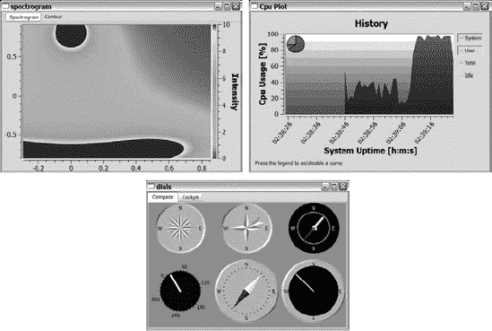
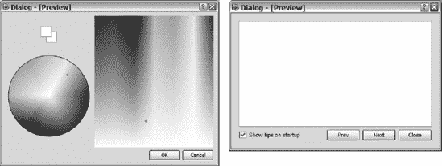

## 第三部分

附录

## 附录一

第三方工具

<big class="calibre11">**T**</big> 他的附录向你展示了一些第三方工具。一个大型的项目社区是围绕 Qt 构建的，这里展示的工具只是可用工具的一小部分。目的不是向您展示它们是如何使用的，而是向您展示可用工具的多样性。提到的每个项目都有很好的文档，并且很容易学习。

### 技术应用 Qt Widgets:Qwt

*   类别:小部件和类
*   网址:`[http://qwt.sf.net](http://qwt.sf.net)`
*   许可证:Qwt 许可证——LGPL 的慷慨版本

Qwt 是技术应用程序中使用的类和小部件的集合。小部件包括刻度盘、滑块、旋钮、图表、刻度和图例。提供的小部件通过插件与 Designer 很好地集成在一起。

在[图 A-1](#widgets_and_plots_from_the_qwt_examples) 中可以看到 Qwt 的一些示例截图，其中显示了 Qwt 提供的一些表盘。这些刻度盘与滚轮和滑块结合在一起，可以很容易地指定数值。然而，Qwt 的真正威力在于它的绘图能力。您可以创建散点图、曲线图和直方图，带或不带等高线。所有这些图的数据都是通过`QwtData`类或其后代提供的。通过继承`QwtData`类，您可以计算要动态绘制的数据，然后将其提供给适当的绘图小部件。

**图 A-1。***Qwt 示例中的小部件和情节*

### wwWidgets

*   类别:小工具
*   网址:`[http://www.wysota.eu.org/wwwidgets](http://www.wysota.eu.org/wwwidgets)`
*   许可证:GPL

wwWidgets 库用一系列小部件补充了 Qt。这些小部件关注 Qt 从一开始就没有填充的区域——颜色选择小部件、屏幕键盘等——但也关注常见的组合小部件，如启动提示小部件。图 A-2 中显示了设计师会议的示例。这些小部件节省了时间，因为它们不必在每个新项目中都重新发明。

wwWidgets 库与 Qt 的其余部分集成得非常好——无论是在设计器中还是在构建系统中。当它被安装时，它会将自己添加到 Qt 安装中，所以您需要做的就是在您的项目文件中添加`CONFIG += wwwidgets`——就像使用 Qt 模块一样简单。

**图 A-2。** *设计师会议中的一些 ww widgets*

### QDevelop

*   类别:开发环境
*   网址:`[http://www.qdevelop.org](http://www.qdevelop.org)`
*   许可证:GPL

QDevelop 是一个适用于 Qt 的真正的跨平台集成开发环境。它为 Qt 支持的所有平台提供了一个通用的开发环境。您可以在[图 A-3](#qdevelop_in_action) 中看到一个示例会话。

QDevelop 的优势包括使用 GNU 调试器(gdb)调试应用程序的能力，处理 QMake 项目的能力，使用 ctags 提供代码完成和方法列表的能力，以及基于插件的架构。

* * *

**注意**要在 Windows 平台上使用 gdb，必须先安装(详情可以在 QDevelop 网站上找到)。

* * *

**图 A-3。** *QDevelop 在行动*

ctags 对代码完成和方法列表的依赖性意味着接口可能会很慢，因为 ctags 是作为外部进程运行的，QDevelop 在这些功能实际工作之前会等待它完成。

QDevelop 确实有一个烦人的 bug。当请求帮助一个 Qt 类的成员函数时，它失败了。在寻找帮助时，您必须始终将光标放在实际的类名上。

当启动 Qt Assistant 来提供帮助时，它会作为一个单独的应用程序启动。QDevelop 将 Designer 和 Qt Assistant 作为外部应用程序与 QDevelop 应用程序并行运行。这很好，但是你必须手动地在应用程序之间来回切换。

### Edyuk

*   类别:开发环境
*   网址:`[http://edyuk.sf.net](http://edyuk.sf.net)`
*   许可证:GPL

Edyuk 是另一个跨平台的集成开发环境，设计用于 Qt。Edyuk 是围绕透视图和插件构建的，它完全集成了设计器和 Qt Assistant，因此您可以在 Edyuk 环境中在代码视图和设计器之间切换。[图 A-4](#the_edyuk_editor_in_action) 显示了显示代码透视图(顶部)和设计师透视图(底部)的屏幕截图。

项目文件支持很好，代码编辑器也是如此，但是打开项目可能会令人害怕，因为用户界面在加载时有时会没有响应。然而，开发速度很快(在我写这本书的时候)，所以在你读到这本书的时候，这种情况可能已经改善了。

* * *

**注意**使用右下角的按钮可以显示或隐藏组成每个透视图的不同面板。这些按钮并不总是容易找到。

* * *

**图 A-4。** *行动中的 Edyuk 编辑*