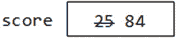

# 2.c–基础知识

在本章中，我们将解释以下内容:

*   什么是字母表、字符集和令牌
*   什么是语法规则和语法错误
*   什么是保留字
*   如何在 C 中创建标识符
*   什么是符号常数
*   C 数据类型— `int`、`float`和`double`
*   如何写`int`和`double`表达式
*   如何使用字段宽度打印整数
*   如何将浮点数打印到所需的小数位数
*   当`int`和`double`值混合在同一个表达式中时会发生什么
*   当我们将`int`分配给`double`并将`double`分配给`int`时会发生什么
*   如何声明变量来保存字符串
*   如何将字符串值赋给字符串变量
*   使用赋值语句时要避免的一些问题

## 2.1 导言

在这一章中，我们将讨论一些用 C 语言编写程序时你需要知道的基本概念。

编程语言在许多方面类似于口语。它有一个字母表(通常称为字符集)，语言中的所有内容都是从这个字母表构建的。它有构成单词(也称为记号)的规则、构成语句的规则和构成程序的规则。这些被称为语言的语法规则，在编写程序时必须遵守。如果你违反了规则，你的程序将包含一个语法错误。当你试图编译程序时，编译器会通知你错误。您必须更正并重试。

成为优秀程序员的第一步是学习编程语言的语法规则。这是容易的部分，许多人错误地认为这使他们成为程序员。这就像说，学习一些英语语法规则，并能够写出一些正确形成的句子，使一个人成为小说家。小说写作技巧需要的不仅仅是学习一些语法规则。除此之外，它还需要洞察力、创造力和在特定情况下使用正确词汇的诀窍。

同样，一个好的程序员必须能够创造性地使用语言的特性，以优雅而高效的方式解决各种各样的问题。这是困难的部分，只有通过长期、艰苦地研究解决问题的算法和编写程序来解决广泛的问题才能实现。但是我们必须从小步开始。

## 2.2 字母表

在 1.4 节中，我们介绍了角色的概念。我们可以把 C 字母表看作是由所有可以在标准英语键盘上输入的字符组成的:例如，数字；大写和小写字母；以及`+`、`=`、`<`、`>`、`&`、`%`等特殊字符。

更正式的说法是，C 使用 ASCII(美国信息交换标准代码，发音为`ass-key`)字符集。这是一种字符标准，包括标准键盘上的字母、数字和特殊字符。它还包括控制字符，如退格、制表符、换行符、换页符和回车符。每个字符被分配一个数字代码。ASCII 码从 0 到 127。

本书中的程序将使用 ASCII 字符集编写。ASCII 字符集中的字符如附录 b 所示。

角色处理将在第 6 章中详细讨论。

## 2.3 C 代币

语言的标记是可以放在一起构造程序的基本构件。令牌可以是保留字(如`int`或`while`)、标识符(如`b`或`sum`)、常量(如`25`或`"Alice in Wonderland"`)、分隔符(如`}`或`;`)或运算符(如`+`或`=`)。

例如，考虑上一章末尾给出的程序 P1.4 的以下部分:

`int main() {`

`int a, b, sum;`

`a = 14;`

`b = 25;`

`sum = a + b;`

`printf("%d + %d = %d\n", a, b, sum);`

`}`

从头开始，我们可以按顺序列出令牌:

<colgroup><col> <col></colgroup> 
| 代币 | 类型 |
| --- | --- |
| `int` | 预定字 |
| `main` | 标识符 |
| `(` | 左括号，分隔符 |
| `)` | 右括号，分隔符 |
| `{` | 左大括号，分隔符 |
| `int` | 预定字 |
| `a` | 标识符 |
| `,` | 逗号，分隔符 |
| `b` | 标识符 |
| `,` | 逗号，分隔符 |
| `sum` | 标识符 |
| `;` | 分号，分隔符 |
| `a` | 标识符 |
| `=` | 等号，分隔符 |
| `14` | 常数 |
| `;` | 分号，分隔符 |

等等。因此，我们可以把一个程序想象成一串符号，这正是编译器看待它的方式。因此，就编译器而言，上面的代码可以写成这样:

`int main() { int a, b, sum;`

`a = 14; b = 25; sum = a + b;`

`printf("%d + %d = %d\n", a, b, sum); }`

令牌的顺序完全相同；对编译器来说，它是同一个程序。对于计算机来说，只有令牌的顺序才是重要的。然而，布局和间距对于提高程序的可读性是很重要的。

### 2.3.1 程序内的间距

一般来说，C 程序可以用“自由格式”编写。例如，这种语言不要求我们在一行上写一个语句。甚至一个简单的声明，如

`a = 14;`

可以写成四行，像这样:

`a`

`=`

`14`

`;`

只有标记的顺序是重要的。然而，由于`14`是一个令牌，所以`1`不能与`4`分开。你甚至不能在`1`和`4`之间留一个空格。

除了在字符串或字符常量中，空格在 c #中并不重要。但是，合理使用空格可以极大地提高程序的可读性。一般的经验法则是，只要你能放一个空格，你就可以放任意数量的空格，而不影响你程序的意思。该声明

`a = 14;`

可以写成

`a=14;`

或者

`a = 14 ;`

或者

`a= 14;`

声明

`sum = a + b;`

可以写成

`sum=a+b;`

或者

`sum= a + b ;`

或者

`sum = a+b;`

当然，请注意，变量`sum`中不能有空格。写`s um`或者`su m`就不对了。一般来说，一个令牌的所有字符必须在一起。

### 保留字

C 语言使用了许多关键字，如`int, char`和`while`。关键字在 C 程序的上下文中有特殊的含义，并且只能用于该目的。比如，int 只能用在那些我们需要指定某个项的类型是整数的地方。所有关键字都只用小写字母书写。因此`int`是一个关键字，而`Int`和`INT`不是。关键字是保留的，也就是说，不能将它们用作标识符。因此，它们通常被称为保留字。附录 a 中给出了 C 关键字列表。

### 标识符

C 程序员需要为诸如变量、函数名([第 7 章](07.html))和符号常量(见下页)等事物起名字。他编造的名字被称为用户标识符。在命名标识符时，需要遵循一些简单的规则:

*   它必须以字母或下划线开头。
*   如果需要其他字符，它们可以是字母、数字或下划线的任意组合。

标识符的长度不能超过 63 个字符。

有效标识符的示例:

`r`

`R`

`sumOfRoots1and2`

`_XYZ`

`maxThrowsPerTurn`

`TURNS_PER_GAME`

`R2D2`

`root1`

无效标识符的示例:

`2hotToHandle   // does not start with a letter`

`Net Pay        // contains a space`

`ALPHA;BETA     // contains an invalid character ;`

需要注意的要点:

*   标识符中不允许有空格。如果你需要一个由两个或更多单词组成的单词，使用大小写字母的组合(如`numThrowsThisTurn`)或使用下划线来分隔单词(如`num_throws_this_turn`)。我们更喜欢大写/小写的组合。
*   通常，C 区分大小写(大写字母被认为不同于相应的小写字母)。因此`r`是不同于`R`的标识符。而且`sum`不同于`Sum`不同于`SUM`不同于`SuM`。
*   不能使用 C 保留字作为标识符之一。

### 2.3.4 一些命名约定

除了创建标识符的规则之外，C 对于使用什么名字，或者使用什么格式(例如，大写或小写)没有任何限制。然而，良好的编程实践表明应该遵循一些常识性的规则。

标识符应该是有意义的。例如，如果它是一个变量，它应该反映存储在变量中的值；对于存储某人的净工资，`netPay`是比`x`更好的变量，尽管两者都有效。如果是一个函数([第 7 章](07.html))，它应该给出这个函数应该做什么的一些指示；`playGame`是比`plg`更好的标识符。

使用大写字母和小写字母的组合来表示由标识符命名的项的种类是一个好主意。在本书中，我们使用以下约定:

*   变量通常用小写字母书写:例如，`sum`。如果我们需要一个由两个或更多单词组成的变量，我们用一个大写字母开始第二个和随后的单词:例如，`voteCount`或`sumOfSeries`。
*   符号(或命名)常量是一个标识符，可以用来代替常量，如`100`。假设`100`代表我们希望在某个程序中处理的项目的最大数量。我们可能需要在程序的不同地方使用数字`100`。但是假设我们改变主意，想要供应 500 件商品。我们必须把所有出现的`100`都改成`500`。然而，我们必须确保不改变除了最大项目数(在类似于`principal*rate/100`的计算中)之外的其他用途的`100`的出现。
*   为了便于改变我们的想法，我们可以将标识符`MaxItems`设置为`100`，并在需要引用最大项数时使用`MaxItems`。如果我们改变主意，我们只需要将`MaxItems`设置为新值。我们将以大写字母开始一个符号常量。如果它由一个以上的单词组成，我们将以大写字母开始每个单词，如`MaxThrowsPerTurn`。
*   我们将在 4.6 节看到如何使用符号常量。

## 2.4 基本数据类型

在 1.4 节中，我们简要地谈到了数据类型的概念。对于本书的大部分内容，我们将使用以下数据类型:

`int, double, and char`

其中，这些被称为原始数据类型。

每种数据类型都定义了该类型的常数。当我们声明一个变量为特定类型时，我们实际上是在说什么样的常量(值)可以存储在那个变量中。例如，如果我们将变量`num`声明为`int`，我们就是说`num`的值在任何时候都可以是一个整数常量，如`25`、`-369`或`1024`。

## 2.5 整数- int

int 变量用于存储一个整数值。整数值是 0、1、2、3、4 等中的一个。然而，在计算机上，可以存储的最大和最小整数是由用于存储整数的位数决定的。附录 C 展示了如何在计算机上表示整数。

通常，`int`变量占用 16 位(2 字节),可用于存储-32，768 到+32，767 范围内的整数。但是，请注意，在某些机器上，`int`可以占用 32 位，在这种情况下，它可以存储从-2，147，483，648 到+2，147，483，647 的整数。一般来说，如果用 n 位来存储一个`int`，可以存储的数的范围是-2 n-1 到+2 n-1 - 1。

作为练习，找出计算机上最大和最小的`int`值。

### 声明变量

在 C #中，通过指定类型名后跟变量来声明变量。例如，

`int h;`

将`h`声明为`int`类型的变量。该声明为`h`分配了空间，但没有将其初始化为任何值。除非明确地为变量赋值，否则不能假定变量包含任何值。

您可以在一个语句中声明几个相同类型的变量，如下所示:

`int a, b, c; // declares 3 variables of type int`

变量之间用逗号分隔，最后一个变量后用分号隔开。

您可以在一条语句中声明一个变量并赋予它一个初始值，如:

`int h = 14;`

这将`h`声明为`int`，并给它一个值`14`。

### 整数表达式

整数常量的写法我们都很熟悉:比如`354`、`639, -1`、`30705`、`-4812`。请注意，您只能使用一个可能的符号，后跟从`0`到`9`的数字。特别是，您不能像分隔千位那样使用逗号；因此`32,732`是一个无效的整数常量——您必须将其写成`32732`。

可以使用以下算术运算符来编写整数表达式:

<colgroup><col> <col></colgroup> 
| `+` | 增加 |
| − | 减去 |
| `*` | 多样地 |
| `/` | 划分 |
| `%` | 查找余数 |

例如，假设我们有以下声明:

`int a, b, c;`

那么以下都是有效的表达式:

`a + 39`

`a + b - c * 2`

`b % 10 //the remainder when b is divided by 10`

`c + (a * 2 + b * 2) / 2`

操作符`+`、`-`和`*`都给出了预期的结果。但是，`/`执行整数除法；如果有剩余，就扔掉。我们说整数除法截断。因此`19/5`给出值`3`；剩余部分`4`被丢弃。

但是`-19/5`的值是多少呢？这里的答案是`–3`。规则是，在 C 中，整数除法向零截断。因为`–19 ÷ 5`的精确值是`–3.8`，向零截断得到`–3`。(在下一节中，我们将展示如何获得一个整数除以另一个整数的精确值。)

当一个整数被另一个整数除时,`%`运算符给出余数。举个例子，

`19 % 5 evaluates to 4;`

`h % 7 gives the remainder when h is divided by 7;`

例如，你可以用它来测试一个数字`h`是偶数还是奇数。如果`h % 2`是`0`，那么`h`是偶数；如果`h % 2`是`1`，那么`h`就是奇数。

### 2.5.3 运算符优先级

c #基于运算符的通常优先级对表达式求值:乘法和除法在加法和减法之前完成。我们说乘除法的优先级高于加减法。例如，表达式

`5 + 3 * 4`

首先将`3`乘以`4`(给出`12`，然后将`5`加到`12`，给出`17`作为表达式的值。

像往常一样，我们可以使用括号来强制表达式按照我们想要的顺序求值。例如，

`(5 + 3) * 4`

先将`5`和`3`相加(给出`8`，再将`8`乘以`4`，给出`32`。

当两个具有相同优先级的运算符出现在一个表达式中时，它们从左到右进行计算，除非用括号另行指定。例如，

`24 / 4 * 2`

被评估为

`(24 / 4) * 2`

(给予`12`)和

`12 - 7 + 3`

被评估为

`(12 - 7) + 3`

给予`8`。然而，

`24 / (4 * 2)`

按照预期进行评估，给出`3`，并且

`12 - (7 + 3)`

如预期被评估，给出`2`。

在 C 语言中，余数运算符`%`与乘法(`*`)和除法(`/`)具有相同的优先级。

Exercise: What is printed by the following program? Verify your answer by typing and running the program

`#include <stdio.h>`

`int main() {`

`int a = 15;`

`int b = 24;`

`printf("%d %d\n", b - a + 7, b - (a + 7));`

`printf("%d %d\n", b - a - 4, b - (a - 4));`

`printf("%d %d\n", b % a / 2, b % (a / 2));`

`printf("%d %d\n", b * a / 2, b * (a / 2));`

`printf("%d %d\n", b / 2 * a, b / (2 * a));`

`}`

### 2.5.4 使用“字段宽度”打印整数

我们已经看到，我们可以通过在`printf`语句中指定值(通过变量或表达式)来打印整数值。当我们这样做时，C 使用所需的“打印列”打印值。例如，如果值是 782，则使用 3 列打印，因为 782 有 3 个数字。如果该值为-2345，则使用 5 个打印列(一个用于负号)进行打印。

虽然这对于大多数目的来说已经足够了，但是有时候能够告诉 C 要使用多少个打印列是很有用的。例如，如果我们想在`5`打印列中打印`n`的值，我们可以通过指定字段宽度`5`来实现，如下所示:

`printf("%5d", n);`

我们现在用`%5d`代替规格`%d`。字段宽度位于`%`和`d`之间。`n`的值被打印在“字段宽度`5`”中。

假设`n`是`279`；有 3 个数字要打印，因此需要 3 个打印列。由于字段宽度为`5`，所以数字`279`前会打印 2 个空格，因此:◎◎`279`(表示空格)。我们也说“打印时有两个前导空格”和“打印时在左边填充两个空格”

更专业的说法是“`n`在字段宽度`5`中右对齐打印。”“右对齐”是指将数字尽可能地放在字段的右侧，并在其前面添加空格以构成字段宽度。如果数字放在尽可能靠左的位置，并在其后添加空格以构成字段宽度，则数字是左对齐的。例如，`279`在字段宽度`5`中左对齐。

减号可用于指定左对齐；`%-wd`将在`w`的字段宽度中打印一个左对齐的值。例如，要打印一个在`5`的字段宽度中左对齐的整数值，我们使用`%-5d`。

再比如，假设`n`是`-7`，字段宽度是`5`。打印`n`需要两个打印列(一个用于`-`，一个用于`7`)；由于字段宽度为`5`，打印时有 3 个前导空格，因此:◎◎`-7`。

你可能会问，场宽太小会怎么样？假设要打印的值是`23456`，字段宽度是`3`。打印该值需要 5 列，这大于字段宽度 3。在这种情况下，C 忽略字段宽度，并根据需要使用尽可能多的列(本例中为 5 列)来打印值。

一般情况下，假设用规格`%wd`打印整数值`v`，其中`w`为整数，假设需要`n`列打印`v`。有两种情况需要考虑:

If `n` is less than `w` (the field width is bigger), the value is padded on the left with (`w - n`) spaces. For example, if `w` is `7` and `v` is `-345` so that `n` is `4`, the number is padded on the left with (`7-4`) = `3` spaces and printed as ◊◊◊`-345`.   If `n` is greater than or equal to `w` (field width is the same or smaller), the value is printed using `n` print columns. In this case, the field width is ignored.  

当我们想要一个接一个地排列数字时，字段宽度很有用。假设我们有三个`int`变量`a`、`b`和`c`，分别具有值`9876`、`-3`和`501`。声明

`printf("%d\n", a);`

`printf("%d\n", b);`

`printf("%d\n", c);`

将打印

`9876`

`-3`

`501`

每个数字仅使用所需的列数打印。由于这一数字与下一个数字不同，所以它们不会排成一行。例如，如果我们愿意，我们可以使用字段宽度`5`来排列数字。声明

`printf("%5d\n", a);`

`printf("%5d\n", b);`

`printf("%5d\n", c);`

将打印(◊表示空格)

`◊9876`

`◊◊◊-3`

`◊◊501`

那会是这样的(不带◎):

`9876`

`-3`

`501`

一切都井然有序。

有趣的是，我们并不真的需要三个`printf`语句。我们可以将最后三个`printf`语句替换为

`printf("%5d\n%5d\n%5d\n", a, b, c);`

每个`\n`强制下面的输出到新的一行。

## 2.6 浮点数—`float`和`double`

浮点数是可能有小数部分的数字。浮点常数可以用两种方法之一来编写:

*   正常方式，带有一个可选符号，包括一个小数点；比如-3.75，0.537，47.0。
*   使用科学记数法，带有可选符号，包括小数点和“指数”部分；比如-0.375E1，意思是“-0.375 乘以 10 的 1 次方”，也就是-3.75。同样，0.537 可以写成 5.37e-1，即 5.37 x 10-1。指数可以用 e 或 e 来指定。
*   注意，同一个数有几种写法。例如，以下都表示同一个数字 27.96:

`27.96E00 2.796E1 2.796E+1 2.796E+01 0.2796E+02 279.6E-1`

在 C 中，我们可以使用`float`或`double`来声明浮点变量。一个`float`值通常存储为一个 32 位浮点数，给出大约 6 或 7 个有效数字。一个`double`值被存储为一个 64 位浮点数，给出大约 15 个有效数字。

浮点常量的类型是`double`，除非它后面跟有`f`或`F`，在这种情况下，它的类型是`float`。因此`3.75`属于`double`类型，但`3.75f`或`3.75F`属于`float`类型。大多数计算都是使用`double`精度完成的。如果您需要存储大量浮点数，并且希望使用尽可能少的存储空间(并且不介意只有 6 或 7 位精度)，那么类型`float`非常有用。

在本书中，我们将主要使用`double`来处理浮点数。

### 2.6.1 打印`double`和`float`变量

我们已经在一个`printf`语句中使用了格式规范`%d`来打印一个整型变量的值。如果我们希望打印一个`double`或`float`变量的值，我们可以使用`%f`。例如，考虑以下情况:

`double d = 987.654321;`

`printf("%f \n", d);`

`d`的值将被打印到预定义的小数位数(通常是 6 位，但可能因编译器而异)。在这种情况下，打印的值将是`987.654321`。然而，如果`d`被赋值为`987.6543215`，打印出的值将是`987.654322`(四舍五入到小数点后六位)。

类似地，如果`x`的类型是`float`，那么它的值可以使用以下方式打印:

`printf("%f \n", x);`

我们刚刚看到规范`%f`将数字打印到预定义的小数位数。然而，大多数时候，我们想说要打印多少个小数位，有时，要使用多少列。例如，如果我们想在宽度为 6 的字段中打印上面的`d`，精确到 2 位小数，我们可以使用:

`printf("%6.2f \n", d);`

在`%`和`f`之间，我们写`6.2`，也就是字段宽度，后面是一个`.`(点)，后面是小数位数。该值四舍五入到指定的小数位数，然后打印出来。这里，打印的值将是`987.65`，正好占据 6 个打印列。如果字段宽度更大，数字将在左边用空格填充。如果字段宽度较小，则会被忽略，并根据需要使用尽可能多的列来打印数字。

作为另一个例子，考虑

`b = 245.75;`

`printf("%6.1f \n", b);`

在规范`%6.1f`中，`1`表示将数字四舍五入到小数点后 1 位；这给出了`245.8`，它需要 5 列来打印。

`6`表示打印第 6 列`245.8`；由于打印数字只需要 5 列，所以在开头加了一个空格组成 6 列，所以数字打印为◎`245.8`(￠表示空格)。

同样的，

`printf("%6.0f \n", b);`

将`b`打印为◎◎`246`(四舍五入到`0`小数位，打印在字段宽度`6`)。

如果规格是`%3.1f`并且要打印的值是`245.8`，它将使用`5`打印列来打印，即使字段宽度是`3`。同样，当指定的字段宽度小于所需的打印列数时，C 会忽略字段宽度，并根据需要使用尽可能多的列来打印值。

我们有时可以利用这一点。如果我们不知道一个值可能有多大，我们可以故意使用一个小的字段宽度，以确保使用打印该值所需的精确的打印列数来打印它。

一般来说，假设`float`或`double`值`v`要用规格`%w.df`打印，其中`w`和`d`是整数。首先，将值`v`四舍五入到`d`位小数。假设打印`v`需要的打印列数，包括一个可能的点(d = 0 就没有点；该值将被四舍五入为整数)和一个可能的符号，是`n`。有两种情况需要考虑:

If `n` is less than `w` (the field width is bigger), the value is padded on the left with (`w - n`) spaces. For example, suppose `w` is `7` and the value to be printed is `-3.45` so that `n` is `5`. The number is padded on the left with (`7-5`) = `2` spaces and printed as ◊◊`-3.45`.   If `n` is greater than or equal to `w` (field width is the same or smaller), the value is printed using `n` print columns. In this case, the field width is ignored.  

与整数一样，当我们想要一个接一个地排列数字时，字段宽度很有用。假设我们有三个`double`变量`a`、`b,`和`c`，分别具有值`419.563`、`-8.7,`和`3.25`。假设我们要将值打印到小数点后两位，按小数点对齐，如下所示:

`419.56`

`-8.70`

`3.25`

因为最大的数字需要 6 个打印列，我们可以使用至少 6 的字段宽度来排列它们。下面的语句会将它们按上述方式排列起来:

`printf("%6.2f \n", a);`

`printf("%6.2f \n", b);`

`printf("%6.2f \n", c);`

如果我们使用大于 6 的字段宽度，数字仍然会排列，但是会有前导空格。

例如，如果我们使用字段宽度`8`，我们将得到(◊表示一个空格)

`◊◊419.56`

`◊◊◊-8.70`

`◊◊◊◊3.25`

同样，我们可以使用一个`printf`而不是三个来达到相同的效果:

`printf("%6.2f \n%6.2f \n%6.2f \n", a, b, c);`

每个`\n`强制下面的输出到新的一行。

### 2 . 6 . 2`double`和`float`之间的分配

正如所料，您可以在一个`float`变量中存储一个`float`值，在一个`double`变量中存储一个`double`值。由于`float`比`double`小，C 允许你在`double`变量中存储一个`float`值，没有任何问题。但是，如果将一个`double`赋值给一个`float`，可能会损失一些精度。请考虑以下几点:

`double d = 987.654321;`

`float x = d;`

`printf("%f \n", x);`

由于一个`float`变量只允许大约 7 位数的精度，我们应该预料到`d`的值可能不会精确地分配给`x`。实际上，当使用一个编译器运行时，会为`x`打印出值`987.654297`。当`d`改为`987654321.12345`时，打印的数值为`987654336.000000`。在这两种情况下，保留了大约 6 或 7 位数的精度。

作为一个练习，看看用你的编译器打印出了什么值。

### 浮点表达式

浮点表达式可以使用以下运算符编写:

<colgroup><col> <col></colgroup> 
| `+` | 添加 |
| − | 减法 |
| `*` | 增加 |
| `/` | 分开 |

这些按预期运行；特别地，除法以通常的方式执行，例如，`19.0/5.0`给出值`3.8`。

如果`op1`和`op2`是一个运算符的两个操作数，下面显示了所执行的计算类型:

<colgroup><col> <col> <col></colgroup> 
| op1 | op2 | 计算类型 |
| --- | --- | --- |
| `float` | `float` | `float` |
| `float` | `double` | `double` |
| `double` | `float` | `double` |
| `double` | `double` | `double` |

因此，只有当两个操作数都是`float`时，才会执行`float`；否则执行`double`。

### 2.6.4 具有整数和浮点值的表达式

使用包含整数值和浮点值的表达式是很常见的，例如，

`a / 3 where a is float`

`n * 0.25 where n is int`

在 C 语言中，这种表达式的规则是这样的:

> If any operand of arithmetic operator is floating-point, the calculation is completed in floating-point arithmetic. Unless at least one operand is double, the calculation is of floating-point type, in which case the calculation is of double type.

在上面的第一个例子中，整数`3`被转换为`float`，计算在`float`中完成。在第二个例子中，`n`被转换为`double`(因为`0.25`是`double`)，计算在`double`中完成。

比方说，我们如何得到整数除法`19/5`的精确值？我们可以通过将一个或两个常数写成`double`来强制进行双精度计算，因此:`19/5.0`、`19.0/5,`或`19.0/5.0`。我们也可以使用石膏，比如

`(double) 19 / 5`

强制转换由括号中的类型名组成，并允许我们强制将一种类型转换为另一种类型。这里，`19`被转换为`double`，迫使`5`转换为`double`，并执行双精度除法。

然而，我们必须小心像这样的构造

`(double) (19 / 5)`

这可能不是我们想的那样。这不做浮点除法。由于两个常数都是整数，括号内的表达式计算为整数除法，给出`3`；这个值转换成`double`，给出`3.0`。

### 2.6.5 将`double/float`分配给`int`

考虑一下:

`double d = 987.654321;`

`int n = d;`

`printf("%d \n", n);`

打印数值`987`。当我们将一个浮点值赋给一个`int`时，小数部分(如果有的话)将被丢弃(不舍入)并且最终的整数值被赋值。我们有责任确保获得的整数足够小，能够适合一个`int`。否则，结果值是不可预测的。

在一个编译器上，一个`int`的最大值是`32767`，当`d`被改为`987654.321`时，输出的值是`4614`，与预期相差甚远，看起来不可预测。(不完全不可预测；赋值为`987654 % 32768`，也就是`4614`。一般来说，如果`big`代表一个太大而无法存储的值，那么对于 16 位存储的整数，实际存储的值就是`big % 32768`。)这是因为`d`的截断值是`987654`，它太大了，放不进一个`int`变量。作为一个练习，看看你的编译器会输出什么样的值。

如果我们想要将`d`的舍入值存储在`n`中，我们可以用

`n = d + 0.5;`

如果`d`中小数点后的第一个数字是`5`或更多，添加`0.5`会将`1`添加到整个数字部分。如果点后的第一个数字小于`5`，添加`0.5`不会改变整个数字部分。

比如`d`是`245.75`，加`0.5`会给`246.25`，`246`会赋给`n`。但如果`d`是`245.49`，加`0.5`会给`245.99`，`245`会赋给`n`。

## 2.7 弦

到目前为止，我们已经看到了几个`printf`语句中字符串常量的例子。

字符串常量是任何用双引号括起来的字符序列。例如:

`"Once upon a time"`

`"645-2001"`

`"Are you OK?"`

`"c:\\data\\castle.in"`

左引号和右引号必须出现在同一行。换句话说，C 不允许字符串常量延续到另一行。然而，一个长的字符串可以被分成几个部分，每个部分占一行。当程序被编译时，C 将把这些片段连接起来，形成一个字符串。例如，

`printf("Place part of a long string on one line and "`

`"place the next part on the next line. The parts are "`

`"separated by whitespace, not comma or ; \n");`

字符串常量的值是没有开始和结束引号的字符序列。因此，`"Are you OK?"`的值就是`Are you OK?`。

如果您希望双引号成为字符串的一部分，您必须使用转义序列`\"`来编写它，如

`"\"Don’t move!\", he commanded"`

该字符串的值为

`"Don’t move!", he commanded`

每个`\"`都被替换为`"`，并且开始和结束的引号都被删除。

C 语言没有预定义的`string`类型。这给初学编程的人带来了困难，因为他不能像处理数值变量那样处理字符串变量。

在 C 语言中，字符串存储在“字符数组”中既然我们在第 6 章的[中讨论了字符，在第 8 章](06.html)的[中讨论了数组，我们可以耐心等待，直到理解数组是什么，字符串是如何存储的，以及我们如何用它们来存储一个名字。或者，我们可以凭着信心接受一些东西，并以一种有限的方式，比我们通常更快地收获能够与弦一起工作的好处。我们会不耐烦，选择后者。](08.html)

假设我们希望在某个变量`name`中存储一个人的名字。我们可以声明`name`如下:

`char name[50];`

这声明了`name`是一个大小为`50`的“字符数组”。正如我们将在[第 8 章](08.html)中解释的，这允许我们在`name`中存储最多`49`个角色。如果您发现这对于您的目的来说太多(或太少)，您可以使用不同的数字。

如果我们愿意，我们可以在声明中给`name`赋一个字符串常量，这样:

`char name[50] = "Alice Wonder";`

这在`name`中存储了从`A`到`r`的字符，包括空格。报价不会被存储。一旦完成，我们可以使用`printf`中的规格`%s`打印`name`的值，因此:

`printf("Hello, %s\n", name);`

这会打印出来

`Hello, Alice Wonder`

`name`的值替换`%s`。

不幸的是，除了在`name`的声明中，我们不能给`name`赋值一个字符串常量。c 不允许我们写一个赋值语句，比如

`name = "Alice in Wonderland"; // this is not valid`

给`name`赋值。我们可以使用标准函数`strcpy`(用于字符串复制)，如下所示:

`strcpy(name, "Alice in Wonderland"); // this is valid`

但是为了使用`strcpy`(和其他字符串函数)，我们必须在程序前加上指令:

`#include <string.h>`

我们在程序 P2.1 中总结了所有这些。

Program P2.1

`#include <stdio.h>  // needed for printf`

`#include <string.h> // needed for strcpy`

`int main() {`

`char name[50];`

`strcpy(name, "Alice in Wonderland");`

`printf("Hello, %s\n", name);`

`}`

运行时，该程序将打印

`Hello, Alice in Wonderland`

在 3.4 和 5.9 节中，我们将看到如何将一个字符串值读入一个变量。

连接两个字符串是我们有时想要执行的操作。我们说我们想要连接两个字符串。我们可以用标准的字符串函数`strcat`(字符串连接)来实现。例如，假设我们有:

`char name[30] = "Alice";`

`char last[15] = "Wonderland";`

声明

`strcat(name, last);`

会将`last`中的字符串添加到`name`中的字符串。我们有责任确保`name`足够大，能够容纳连接的字符串。结果是`name`现在会按住`AliceWonderland`；`last`中的值不变。以下语句将 name 设置为`Alice in Wonderland`。

`strcat(name, " in "); //one space before and after "in"`

`strcat(name, last);`

## 2.8 转让声明

在 1.9 节中，我们介绍了赋值语句。回想一下，赋值语句包括一个变量，后面跟一个等号(=)，后面跟要赋给变量的值，再后面跟一个分号。我们可以这样写:

`<variable> = <value>;`

`<value>`必须与`<variable>`兼容，否则会出错。例如，如果`<variable>`是`int`，我们必须能够从`<value>`中导出一个整数。如果`<variable>`是`double`，我们必须能够从`<value>`中导出一个浮点值。例如，如果`n`是`int`而`x`是`double`，我们就不能写

`n = "Hi there"; //cannot assign string to int`

`x = "Be nice";  //cannot assign string to double`

将赋值语句想象成如下执行是很有用的:计算`=`右边的值。获得的值存储在左侧的变量中。变量的旧值(如果有)会丢失。例如，如果 s `core`的值为`25`，那么在语句之后

`score = 84;`

`score`的值将是`84`；旧的价值`25`丢失了。我们可以把这想象成:

一个变量可以取几个值中的任何一个，但一次只能取一个。作为另一个例子，考虑这个陈述:

`score = score + 5;`

假设`score`在这个语句执行之前有值`84`。执行后的价值是什么？

首先，使用`score`、`84`的当前值评估右侧`score + 5`。计算得出`89`—该值存储在左侧的变量中；恰好是`score`。最终结果是`score`的值增加了`5`到`89`。旧值`84`丢失。

即使赋值语句是有效的，它也可能在程序运行时产生错误。考虑以下情况(`a`、`b`、`c`、`d`、`e`为`int`):

`a = 12;`

`b = 5;`

`c = (a – b) * 2;`

`d = c + e;`

其中每一个都是格式正确的赋值语句。但是，当执行这些语句时，将会导致错误。你能看出是怎么回事吗？

第一条语句将`12`赋值给`a`；第二个将`5`分配给`b`；第三个将`14`分配给`c`；目前没有问题。然而，当计算机试图执行第四条语句时，它遇到了问题。`e`没有值，所以表达式`c + e`不能求值。我们说`e`是未定义的——它没有值。

在我们可以在表达式中使用任何变量之前，它必须已经被某个先前的语句赋值。如果没有，我们将得到一个“未定义变量”的错误，我们的程序将暂停。

这个故事的寓意是:有效的程序不一定是正确的程序。

Exercise: What is printed by the following?

`a = 13;`

`b = a + 12;`

`printf("%d %d\n", a, b);`

`c = a + b;`

`a = a + 11;`

`printf("a = %d b = %d c = %d\n", a, b, c);`

## 2.9 `printf`

我们已经看到了几个`printf`语句的例子。我们用它来打印字符串常量、整数值和浮点值。我们打印了有和没有字段宽度的值。我们还看到了如何使用转义序列`\n`来强制输出到新的一行。

值得强调的是，格式字符串中的字符完全按照它们出现时的样子打印，只是格式规范被其相应的值所替换。例如，如果`a`是`25`，`b`是`847`，考虑以下语句

`printf("%d%d\n", a, b);`

这会打印出来

`25847`

这些数字粘在一起，我们分不清什么是`a`什么是`b`！这是因为规范`%d%d`说要打印相邻的数字。如果我们想用一个空格将它们分开，比如说，我们必须在`%d`和`%d`之间放一个空格，就像这样:

`printf("%d %d\n", a, b);`

这会打印出来

`25 847`

为了在数字之间获得更多的空格，我们只需在`%d`和`%d`之间输入我们想要的数字。

Exercise: What is printed by the following?

`printf("%d\n %d\n", a, b);`

下面是一些关于格式规范的有用信息。

假设`num`为`int`，其值为`75`:

*   规格`%d`将使用`2`打印列`75`打印`75`
*   规格`%5d`将打印带有 3 个前导空格的`75`:`◊◊◊75`
*   规格`%-5d`将打印带有 3 个尾随空格的`75`:`75◊◊◊`
*   规格`%05d`将打印带有 3 个前导零的`75`:`00075`

对于前导`0`可能有用的示例，考虑以下语句

`printf("Pay this amount: $%04d\n", num);`

这会打印出来

`Pay this amount: $0075`

这比印刷好

`Pay this amount: $  75`

因为有人可以在`$`和`7`之间插入数字。

通常，减号指定左对齐，字段宽度前面的`0`指定`0`(零，而不是空格)作为填充字符。

Exercises 2In the ASCII character set, what is the range of codes for (a) the digits (b) the uppercase letters and (c) the lowercase letters?   What is a token? Give examples.   Spaces are normally not significant in a program. Give an example showing where spaces are significant.   What is a reserved word? Give examples.   Give the rules for making up an identifier.   What is a symbolic constant and why is it useful?   Give examples of integer constants, floating-point constants, and string constants.   Name five operators that can be used for writing integer expressions and give their precedence in relation to each other.   Give the value of (a) 39 % 7 (b) 88 % 4 (c) 100 % 11 (d) -25 % 9   Give the value of (a) 39 / 7 (b) 88 / 4 (c) 100 / 11 (d) -25 / 9   Write a statement that prints the value of the `int` variable `sum`, right justified in a field width of `6`.   You are required to print the values of the `int` variables `b`, `h`, and `n`. Write a statement that prints `b` with its rightmost digit in column 10, `h` with its rightmost digit in column 20, and `n` with its rightmost digit in column 30.   Write statements that print the values of `b`, `h`, and `n` lined up one below the other with their rightmost digits in column 8.   Using scientific notation, write the number 345.72 in four different ways.   Write a statement that prints the value of the `double` variable `total` to 3 decimal places, right justified in a field width of 9.   You need to print the values of the `float` variables `a`, `b`, and `c` to 1 decimal place. Write a statement that prints `a` with its rightmost digit in column 12, `b` with its rightmost digit in column 20, and `c` with its rightmost digit in column 32.   What kind of variable would you use to store a telephone number? Explain.   Write statements to print the values of 3 double variables `a`, `b`, and `c`, to 2 decimal places, The values must be printed one below the other, with their rightmost digits in column 12.   How can you print the value of a `double` variable, rounded to the nearest whole number?   What happens if you try to print a number (`int`, `float`, or `double`) with a field width and the field width is too small? What if the field width is too big?   Name some operators that can be used for writing floating-point expressions.   Describe what happens when we attempt to assign an `int` value to a `float` variable.   Describe what happens when we attempt to assign a `float` value to an `int` variable.   Write a statement to print the following: `Use \n to end a line of output`.   Write a statement to increase the value of the `int` variable quantity by `10`.   Write a statement to decrease the value of the int variable `quantity` by `5`.   Write a statement to double the value of the `int` variable `quantity`.   Write a statement to set `a` to `2` times `b` plus `3` times `c`.   The `double` variable `price` holds the price of an item. Write a statement to increase the price by (a) $12.50 (b) 25%.   What will happen when the computer attempts to execute the following: `p = 7;` `q = 3 + p;` `p = p + r;` `printf("%d\n", p);`   Suppose `rate = 15`. What is printed by each of the following? `printf("Maria earns rate dollars an hour\n");` `printf("Maria earns %d dollars an hour\n", rate);`   If `m` is `3770` and `n` is `123`, what is printed by each of the following? `(a) printf("%d%d\n", n, m);` `(b) printf("%d\n%d\n", n, m);`