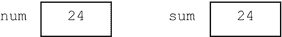
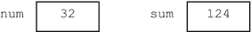
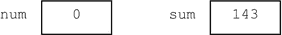
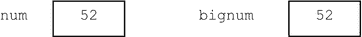
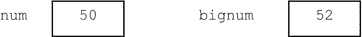
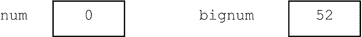

# 五、具有重复逻辑的程序

在本章中，我们将解释以下内容:

*   如何使用`while`构造在程序中执行“循环”
*   如何求任意一组数的和与平均值
*   如何让一个程序“算数”
*   如何找出任意一组数字中的最大值和最小值
*   如何从文件中读取数据
*   如何将输出写入文件
*   如何使用`for`构造在程序中执行“循环”
*   如何使用`for`生成表格

## 5.1 导言

在第 3 章中，我们向你展示了如何使用顺序逻辑编写程序——程序的语句从第一个到最后一个“按顺序”执行。

在[第 4 章](04.html)中，我们向你展示了如何为需要选择逻辑的问题编写程序。这些程序使用了`if`和`if...else`语句。

在这一章中，我们讨论需要重复逻辑的问题。这个想法是写一次语句，让计算机重复执行它们，只要某些条件为真。我们将看到如何使用`while`和`for`语句来表达重复逻辑。

## 5.2 while 结构

考虑这样一个问题:编写一个程序来寻找用户一次输入一个数字的和。程序将提示用户输入如下数字:

`Enter a number:` `13`

`Enter a number:` `8`

`Enter a number:` `16`

等等。我们想让用户输入任意多的数字。因为我们不知道会有多少，而且每次运行程序时数量会有所不同，所以我们必须让用户“告诉”我们何时他想停止输入数字。

他如何“告诉”我们？嗯，用户唯一一次与程序“交谈”是在他键入一个数字来回应提示的时候。如果他希望停止输入数字，他可以输入一些“商定的”值；当程序读取这个值时，它将知道用户希望停止。

在这个例子中，我们可以使用`0`作为告诉程序用户希望停止的值。当一个值以这种方式使用时，它被称为标记值或数据结束值。它有时被称为流氓值-该值不被视为实际数据值之一。

我们可以用什么作为哨兵值？任何不能与实际数据值混淆的值都是可以的。例如，如果数据值都是正数，我们可以使用`0`或`1`作为标记值。当我们提示用户时，提醒他使用什么值作为哨兵值是个好主意。

假设我们希望程序如下运行:

`Enter a number (0 to end):` `24`

`Enter a number (0 to end):` `13`

`Enter a number (0 to end):` `55`

`Enter a number (0 to end):` `32`

`Enter a number (0 to end):` `19`

`Enter a number (0 to end):` `0`

`The sum is 143`

我们如何让程序像那样运行？我们希望能够以计算机能够理解的形式表达下面的逻辑:

> As long as the user does not enter 0, he will continue to be prompted to enter another number and add it to the total.

似乎很明显，我们必须，至少，提示他第一个数字。如果这个数字是`0`，我们必须打印出总和(当然，此时应该是`0`)。如果数字不是`0`，我们必须把它加到总数中，并提示输入另一个数字。如果这个数字是`0`，我们必须打印出总和。如果这个数字不是`0`，我们必须把它加到总数中，并提示输入另一个数字。如果这个数字是`0`...，等等。

当用户输入`0`时，该过程将结束。

这个逻辑用一个`while`结构(也称为`while`语句或`while`循环)表达得非常简洁:

`//Algorithm for finding sum`

`set sum to 0`

`get a number, num`

`while num is not 0 do`

`add num to sum`

`get another number, num`

`endwhile`

`print sum`

特别注意，我们在进入`while`循环之前得到一个数字。这是为了确保`while`条件第一次有意义。(如果`num`没有价值，那就没有意义了。)

要计算总和，我们需要:

*   选择一个变量来保存总和；我们将使用`sum`。
*   将`sum`初始化为`0`(在`while`循环之前)。
*   给`sum`加一个数(在`while`循环内)。每次循环时都会增加一个数字。

退出循环时，`sum`包含所有输入数字的总和。

只要某个条件为`true`，这个`while`构造就可以让我们重复执行一个或多个语句。这里，两个声明

`add num to sum`

`get another number, num`

只要条件`num is not 0`为真，就重复执行。

在伪代码中，`while`构造通常如下所示:

`while <condition> do`

`statements to be executed repeatedly`

`endwhile`

要重复执行的语句被称为`while`结构的主体(或者简单地说，循环的主体)。该构造按如下方式执行:

`<condition>` is tested.   If `true`, the body is executed and we go back to step 1; if `false`, we continue with the statement, if any, after `endwhile`.  

我们现在展示如何使用上面输入的样本数据来执行该算法。为便于参考，数据按以下顺序输入:

`24  13  55  32  19  0`

最初，`num`未定义，`sum`为`0`。我们显示如下:

`24`被输入并存储在`num`中；

`num`不是`0`所以我们进入`while`循环；

`num` ( `24`)加到`sum` ( `0`，给出:

`13`被输入并存储在`num`中；

`num`不是`0`所以我们进入`while`循环；

`num` ( `13`)加到`sum` ( `24`，给出:

`55`被输入并存储在`num`中；

`num`不是`0`所以我们进入`while`循环；

`num` ( `55`)加到`sum` ( `37`，给出:

`32`被输入并存储在`num`中；

`num`不是`0`所以我们进入`while`循环；

`num` ( `32`)加到`sum` ( `92`，给出:

`19`被输入并存储在`num`中；

`num`不是`0`所以我们进入`while`循环；

`num` ( `19`)加到`sum` ( `124`，给出:

`0`被输入并存储在`num`中；

`num`是`0`,因此我们退出`while`循环，并使用

`sum`现在是`143`，所以算法打印出`143`。

当一个 while 结构被执行时，我们说程序正在循环或者 while 循环正在被执行。

如何在 c 语言中表达这个算法还有待展示。程序 P5.1 展示了如何表达。

Program P5.1

`//print the sum of several numbers entered by a user`

`#include <stdio.h>`

`int main() {`

`int num, sum = 0;`

`printf("Enter a number (0 to end): ");`

`scanf("%d", &num);`

`while (num != 0) {`

`sum = sum + num;`

`printf("Enter a number (0 to end): ");`

`scanf("%d", &num);`

`}`

`printf("\nThe sum is %d\n", sum);`

`}`

特别有趣的是 while 语句。伪代码

`while num is not 0 do`

`add num to sum`

`get another number, num`

`endwhile`

在 C 语言中表示为

`while (num != 0) {`

`sum = sum + num;`

`printf("Enter a number (0 to end): ");`

`scanf("%d", &num);`

`}`

当程序运行时，如果输入的第一个数字是`0`，会发生什么？因为`num`是`0`，所以`while`条件立即是`false`，所以我们退出`while`循环，继续执行`printf`语句。程序将打印出正确的答案:

`The sum is 0`

一般来说，如果第一次测试时`while`条件是`false`，那么主体根本不执行。

形式上，C 语言中的`while`构造定义如下:

而( <condition>)<statement></statement></condition>

单词`while`和括号是必需的。您必须提供`<condition>`和`<statement>. <statement>`必须是一条语句或一个块——由`{`和`}`括起来的一条或多条语句。第一，`<condition>`是测试；如果为真，则执行`<statement>`并再次测试`<condition>`。重复此过程，直到`<condition>`变为`false`；当这种情况发生时，在`<statement>`之后继续执行语句(如果有的话)。如果第一次`<condition>`为`false`，则`<statement>`不执行，继续执行以下语句(如有)。

在程序 P5.1 中，`<condition>`是`num != 0`，`<statement>`是块

`{`

`sum = sum + num;`

`printf("Enter a number (0 to end): ");`

`scanf("%d", &num);`

`}`

如果`<condition>`为真，每当我们想执行几个语句时，我们必须用`{`和`}`将语句括起来。实际上，这使它们成为一个语句，一个复合语句，满足 C 的语法规则，即要求一个语句作为主体。

### 最高公因数

让我们写一个程序，求两个数的最高公因数 HCF(也叫最大公约数，GCD)。该程序将按如下方式运行:

`Enter two numbers:` `42 24`

`Their HCF is 6`

我们将使用欧几里德算法来寻找两个整数的 HCF，`m`和`n`。算法如下:

`1\. if n is 0, the HCF is m and stop`

`2\. set r to the remainder when m is divided by n`

`3\. set m to n`

`4\. set n to` `r`

`5\. go to step 1`

使用`m`作为`42`，使用`n`作为`24`，逐步执行算法，并验证它是否给出正确答案`6`。

只要`n`不是`0`，就执行步骤 2、3 和 4。因此，该算法可以用一个`while`循环表示如下:

`while n is not 0 do`

`set r to m % n`

`set m to n`

`set n to r`

`endwhile`

`HCF is m`

我们现在可以编写程序 P5.2，它查找输入的两个数字的 HCF。

Program P5.2

`//find the HCF of two numbers entered by a user`

`#include <stdio.h>`

`int main() {`

`int m, n, r;`

`printf("Enter two numbers: ");`

`scanf("%d %d", &m, &n);`

`while (n != 0) {`

`r = m % n;`

`m = n;`

`n = r;`

`}`

`printf("\nTheir HCF is %d\n", m);`

`}`

注意，`while`条件是`n != 0`并且`while`主体是块

`{`

`r = m % n;`

`m = n;`

`n = r;`

`}`

无论`m`是否大于`n`，算法和程序都会工作。使用上面的例子，如果`m`是`24`而`n`是`42`，当第一次执行循环时，它会将`m`设置为`42`并将`n`设置为`24`。一般来说，如果`m`小于`n`，算法做的第一件事就是交换它们的值。

## 5.3 保持计数

程序 P5.1 计算输入的一组数字的和。假设我们想计算输入了多少个数字，而不是计算数据结束符`0`。我们可以使用一个整数变量`n`来保存计数。为了让程序保持计数，我们需要执行以下操作:

*   选择一个变量来保存计数；我们选择`n`。
*   将`n`初始化为`0`。
*   在适当的位置添加`1`到`n`。这里，我们需要在用户每次输入一个非零数字时将`1`加到`n`上。
*   打印计数。

程序 P5.3 是用于计数的修改程序。

Program P5.3

`//print the sum and count of several numbers entered by a user`

`#include <stdio.h>`

`int main() {`

`int num, sum = 0, n = 0;`

`printf("Enter a number (0 to end): ");`

`scanf("%d", &num);`

`while (num != 0) {`

`n = n + 1;`

`sum = sum + num;`

`printf("Enter a number (0 to end): ");`

`scanf("%d", &num);`

`}`

`printf("\n%d numbers were entered\n", n);`

`printf("The sum is %d\n", sum);`

`}`

以下是该程序的运行示例:

`Enter a number (0 to end):` `24`

`Enter a number (0 to end):` `13`

`Enter a number (0 to end):` `55`

`Enter a number (0 to end):` `32`

`Enter a number (0 to end):` `19`

`Enter a number (0 to end):` `0`

`5 numbers were entered`

`The sum is 143`

对程序 P5.3 的评论

*   我们在`while`循环之前声明并初始化`n`和`sum`到`0`。
*   语句`n = n + 1;`将`1`加到`n`上。我们说`n`增加了`1`。假设`n`具有值`3`。
*   当计算右侧时，得到的值是`3 + 1 = 4`。该值存储在左侧的变量中，即`n`。最终结果是`4`被存储在`n`中。
*   该语句被放在循环内部，以便每次执行循环体时`n`都递增。由于循环体是在`num`不是`0`时执行的，所以`n`的值总是到目前为止输入的数字的数量。
*   当我们退出`while`循环时，`n`中的值将是输入的数字数量，不包括`0`。然后打印该值。
*   注意，如果输入的第一个数字是`0`，则`while`条件将立即为假，控制将直接转到循环后的第一个`printf`语句，其中`n`和`sum`都具有值`0`。程序将正确打印:`0 numbers were entered` `The sum is 0`
*   如果输入一个数字，程序会打印出`"1 numbers were entered"`——不是很好的英文。使用一个`if`语句来解决这个问题。

### 5.3.1 求平均值

程序 P5.3 可以很容易地修改，以找到输入数字的平均值。正如我们在上面看到的，在退出`while`循环时，我们知道总数(`sum`)和输入了多少个数字(`n`)。我们可以添加一个`printf`语句，将平均值打印到小数点后两位，比如:

`printf("The average is %3.2f\n", (double) sum/n);`

对于示例运行中的数据，输出将是

`5 numbers were entered`

`The sum is 143`

`The average is 28.60`

如第 2.5.4 节所述，注意强制浮点计算的强制转换(`double`)的使用。如果没有它，由于`sum`和`n`是`int`，将执行整数除法，给出`28`。

或者，我们可以将`sum`声明为`double`，并打印总和以及平均值，如下所示:

`printf("The sum is %3.0f\n", sum);`

`printf("The average is %3.2f\n", sum/n);`

但是，还有一个问题。如果用户输入`0`作为第一个数字，执行将到达最后一个`printf`语句，其中`sum`和`n`都具有值`0`。程序将试图用`0`除`0`，给出错误“试图用`0.`除”。这是一个运行时(或执行)错误的例子。

为了迎合这种情况，我们可以在`while`循环后使用以下代码:

`if (n == 0) printf("\nNo numbers entered\n");`

`else {`

`printf("\n%d numbers were entered\n", n);`

`printf("The sum is %d\n", sum);`

`printf("The average is %3.2f\n", (double) sum/n);`

`}`

这个故事的寓意是，只要有可能，你应该试着预测你的程序可能失败的方式，并迎合它们。这就是所谓的防御性编程的一个例子。

## 5.4 递增和递减运算符

有许多运算符起源于 C，并赋予了 C 独特的风格。其中最著名的是增量运算符`++`。在上一个节目中，我们使用了

`n = n + 1;`

将`1`加到`n`上。声明

`n++;`

做同样的事情。运算符`++`将`1`添加到其参数中，该参数必须是一个变量。可以写成前缀(`++n`)或者后缀(`n++`)。

即使`++n`和`n++`都将`1`加到了`n`上，但在某些情况下，`++n`的副作用与`n++`不同。这是因为`++n`在使用其值之前递增`n`，而`n++`在使用其值之后递增`n`。作为一个例子，假设`n`具有值`7`。声明

`a = ++n;`

首先增加`n`，然后将值(`8`)分配给`a`。但是声明

`a = n++;`

首先将值`7`分配给`a`，然后将`n`增加到`8`。不过，在这两种情况下，最终结果都是`n`被赋予了值`8`。

作为练习，下面打印的是什么？

`n = 5;`

`printf("Suffix: %d\n", n++);`

`printf("Prefix: %d\n", ++n);`

减量运算符`--`类似于`++`，只是它从变量参数中减去了`1`。例如，`--n`和`n--`都相当于

`n = n - 1;`

如上所述，`--n`减去`1`，然后使用`n`的值；`n--`使用`n`的值，然后从中减去`1`。用`--`代替`++`来做上面的练习会很有用。

## 5.5 赋值运算符

到目前为止，我们已经使用赋值操作符`=`将表达式的值赋给变量，如下所示:

`c = a + b`

由变量`=`和表达式组成的整个结构被称为赋值表达式。当表达式后面跟一个分号时，它就变成了一个赋值语句。赋值表达式的值就是赋给变量的值。例如，如果`a`是`15`，而`b`是`20`，那么赋值表达式

`c = a + b`

将值`35`分配给`c`。(整个)赋值表达式的值也是`35`。

多重赋值是可能的，如

`a = b = c = 13`

操作符`=`从右到左求值，所以上面等价于

`a = (b = (c = 13))`

最右边的赋值首先完成，然后是左边的，依此类推。

c 提供了其他赋值运算符，其中使用最广泛的是`+=`。在上面的程序 P5.3 中，我们使用了语句

`sum = sum + num;`

将`num`的值加到`sum`上。用`+=`可以写得更清楚，比如:

`sum += num;  //add num to sum`

要将`3`加到`n`上，我们可以这样写

`n += 3`

这和

`n = n + 3`

其他赋值运算符包括`-=`、`*=`、/=、`%=`。如果`op`代表`+`、`-`、`*`、`/`或`%`中的任意一个，则

`variable op= expression`

相当于

`variable = variable op expression`

我们指出，我们可以不用递增、递减或特殊的赋值操作符来编写所有的程序。然而，有时，它们允许我们更简洁、更方便、可能更清楚地表达某些操作。

## 5.6 找到最大的

假设我们想写一个程序，工作方式如下:用户输入一些数字，程序会找到输入的最大数字。以下是该程序的运行示例(带下划线的项目由用户键入):

`Enter a number (0 to end):` `36`

`Enter a number (0 to end):` `17`

`Enter a number (0 to end):` `43`

`Enter a number (0 to end):` `52`

`Enter a number (0 to end):` `50`

`Enter a number (0 to end):` `0`

`The largest is 52`

用户将被提示输入数字，一次一个。我们将假设输入的数字都是正整数。我们将让用户输入她喜欢的数字。然而，在这种情况下，她需要告诉程序她什么时候想停止输入数字。为此，她将键入`0`。

寻找最大数量包括以下步骤:

*   选择一个变量来保存最大的数字；我们选择`bigNum`。
*   将`bigNum`初始化为一个非常小的值。选择的值应该是这样的，无论输入什么数字，它的值都要大于这个初始值。因为我们假设输入的数字是正数，所以我们可以将`bigNum`初始化为`0`。
*   当每个数字(`num`，比方说)被输入时，它与`bigNum`进行比较；如果`num`大于`bigNum`，那么我们有一个更大的数字，并且`bigNum`被设置为这个新的数字。
*   当所有的数字都被输入和检查后，`bigNum`将包含最大的一个。

这些想法用下面的算法来表达:

`set bigNum to 0`

`get a number, num`

`while num is not 0 do`

`if num is bigger than bigNum, set bigNum to num`

`get a number, num`

`endwhile`

`print bigNum`

像以前一样，我们在进入`while`循环之前得到第一个数字。这是为了确保`while`条件第一次有意义(被定义)。如果`num`没有价值，那就没有意义。如果不是`0`，我们进入循环。在循环内部，我们处理数字(与`bigNum`等进行比较)。)之后我们得到另一个数。然后这个数字被用于`while`条件的下一次测试。当`while`条件为`false` ( `num`为`0`)时，程序在循环后继续执行`print`语句。

该算法如程序 P5.4 所示实现。

Program P5.4

`//find the largest of a set of numbers entered`

`#include <stdio.h>`

`int main() {`

`int num, bigNum = 0;`

`printf("Enter a number (0 to end): ");`

`scanf("%d", &num);`

`while (num != 0) {`

`if (num > bigNum) bigNum = num; //is this number bigger?`

`printf("Enter a number (0 to end): ");`

`scanf("%d", &num);`

`}`

`printf("\nThe largest is %d\n", bigNum);`

`}`

让我们使用本节开始时输入的示例数据来“逐步完成”这个程序。为便于参考，数据按以下顺序输入:

`36  17  43  52  50  0`

最初，`num`未定义，`bigNum`为`0`。我们将此显示为:

`36`被输入并存储在`num`中；

`num`不是`0`所以我们进入`while`循环；

`num` ( `36`)与`bigNum` (0)相比较；

`36`更大，因此`bigNum`被设置为`36`，给出:

`17`被输入并存储在`num`中；

`num`不是`0`所以我们进入`while`循环；

`num` ( `17`)对比`bigNum`(`36`)；

`17`不大，所以`bigNum`保持在`36`，给出:

`43`被输入并存储在`num`中；

`num`不是`0`所以我们进入`while`循环；

`num` ( `43`)对比`bigNum`(`36`)；

`43`更大，因此`bigNum`被设置为`43`，给出:

`52`被输入并存储在`num`中；

`num`不是`0`所以我们进入`while`循环；

`num` ( `52`)对比`bigNum`(`43`)；

`52`更大，因此`bigNum`被设置为`52`，给出:

`50`被输入并存储在`num`中；

`num`不是`0`所以我们进入`while`循环；

`num` ( `50`)对比`bigNum`(`52`)；

`50`不大，所以`bigNum`保持在`52`，给出:

`0`被输入并存储在`num`中；

`num`是`0`,因此我们退出`while`循环，并使用

`bigNum`现在是`52`，并且打印出`printf`报表

`The largest is` `52`

## 5.7 找到最小的

除了寻找一组项目中最大的项目，我们有时还对寻找最小的项目感兴趣。我们将找到一组整数中最小的一个。为此，需要执行以下步骤:

*   选择一个变量来保存最小的数字；我们选择`smallNum`。
*   将`smallNum`初始化为一个非常大的值。选择的值应该是这样的，无论输入什么数字，它的值都小于这个初始值。如果我们知道我们将得到的数字，我们可以选择一个合适的值。
*   例如，如果我们知道数字最多包含 4 个数字，我们可以使用初始值，比如`10000`。如果我们不知道这一点，我们可以将`smallNum`设置为编译器定义的最大整数值(`32767`表示 16 位整数)。同样，当我们寻找最大值时，我们可以将`bigNum`(比如说)初始化为一个非常小的数，比如`-32767`。
*   另一种可能是读取第一个数字，并将`smallNum`(或`bigNum`)设置为该数字，前提是它不是`0`。为了多样化，我们将举例说明这种方法。
*   当每个数字(`num`，比方说)被输入时，它与`smallNum`进行比较；如果 num 比`smallNum`小，那么我们有一个更小的数字，并且`smallNum`被设置为这个新的数字。
*   当所有的数字都被输入和检查后，`smallNum`将包含最小的一个。

这些想法用下面的算法来表达:

`get a number, num`

`if num is 0 then stop //do nothing and halt the program`

`set smallNum to num`

`while num is not 0 do`

`if num is smaller than smallNum, set smallNum to num`

`get a number, num`

`endwhile`

`print smallNum`

第一个数字被读出。如果是`0`，则什么都不做，程序暂停。如果它不是`0`，我们将`smallNum`设置为它。在这个阶段，我们可以在执行`while`语句之前获得另一个数字。然而，为了简洁起见，我们没有。这样做的代价是，即使我们知道`num`不是`0`，也不小于`smallNum`(是一样的)，我们仍然在得到下一个数之前做这些测试。

该算法如程序 P5.5 所示实现。

Program P5.5

`//find the smallest of a set of numbers entered`

`#include <stdio.h>`

`int main() {`

`int num;`

`printf("Enter a number (0 to end): ");`

`scanf("%d", &num);`

`if (num == 0) return; //halt the program`

`int smallNum = num;`

`while (num != 0) {`

`if (num < smallNum) smallNum = num;`

`printf("Enter a number (0 to end): ");`

`scanf("%d", &num);`

`}`

`printf("\nThe smallest is %d\n", smallNum);`

`}`

在 C 语言中，关键字`return`可以在`main`中使用，通过“返回”到操作系统来暂停程序。我们将在第 7 章的[中更详细地讨论返回。](07.html)

运行时，如果按以下顺序输入数字:

`36  17  43  52  50  0`

该程序将打印

`The smallest is 17`

如果输入的数字是

`36  -17  43  -52  50  0`

该程序将打印

`The smallest is -` `52`

## 5.8 从文件中读取数据

到目前为止，我们编写的程序都假设要提供的数据是在键盘上输入的。我们使用`scanf`读取数字，使用`gets`读取字符串来获取数据。通常，程序会提示用户输入数据，并等待用户键入数据。当数据被键入时，程序读取它，将它存储在一个(或多个)变量中，并继续执行。这种提供数据的模式被称为交互模式，因为用户是在与程序进行交互。

我们说我们一直在从“标准输入”中读取数据 c 使用预定义的标识符`stdin`来引用标准输入。当你的程序启动时，C 假设`stdin`指的是键盘。类似地，预定义的标识符`stdout`指的是标准输出，屏幕。到目前为止，我们的程序已经把输出写到屏幕上了。

我们也可以通过将数据存储在文件中来为程序提供数据。当程序需要数据时，它直接从文件中获取数据，无需用户干预。当然，我们必须确保适当的数据以正确的顺序和格式存储在文件中。这种提供数据的模式通常被称为批处理模式。(术语“批处理”是历史性的，来源于数据在提交处理之前必须“批处理”的旧时代。)

例如，假设我们需要为几个商品提供一个商品编号(`int`)和一个价格(`double`)。如果编写程序时假设数据文件包含几对数字(一个`int`常量后跟一个`double`常量)，那么我们必须确保文件中的数据符合这一点。

假设我们创建一个名为`input.txt`的文件，并在其中键入数据。该文件是字符文件或文本文件。根据 C 编译器提供的编程环境，有可能将`stdin`分配给`input.txt`——我们说将标准输入重定向到`input.txt`。一旦完成，你的程序将从文件中而不是键盘上读取数据。类似地，也可以将标准输出重定向到一个文件，比如说`output.txt`。如果完成，你的`printf`将把输出写到文件中，而不是屏幕上。

我们将采用一种稍微不同的方法，这种方法更加通用，因为它适用于任何 C 程序，并且不依赖于您正在使用的特定编译器或操作系统。

假设我们希望能够从文件`input.txt`中读取数据。我们需要做的第一件事是声明一个称为“文件指针”的标识符这可以通过语句来完成。

`FILE * in; // read as "file pointer in"`

单词`FILE`必须按图示拼写，全部大写字母。`*`前后的空格可以省略。所以你可以写`FILE* in`、`FILE *in`甚至`FILE*in`。我们使用了标识符`in`；其他什么都行，比如`inf`、`infile`、`inputFile`、`payData`。

我们必须做的第二件事是将文件指针`in`与文件`input.txt`相关联，并告诉 C 我们将从文件中读取数据。这是使用功能`fopen`完成的，如下所示:

`in = fopen("input.txt", "r");`

这告诉 C“打开文件`input.txt`进行读取”:`"r"`表示读取。(如果我们希望打开文件进行“写入”，即接收输出，我们将使用`"w"`。)如果我们愿意，我们可以用一个语句完成这两件事，因此:

`FILE * in = fopen("input.txt", "r");`

一旦完成，这个“数据指针”将被定位在文件的开头。我们现在可以编写从文件中读取数据的语句。我们很快就会看到。

我们有责任确保文件存在并包含适当的数据。否则，我们将得到一条错误消息，如“文件未找到”如果需要，我们可以指定文件的路径。

假设文件位于`C:\testdata\input.txt`。

我们可以告诉 C，我们将从这个文件中读取数据:

`FILE * in = fopen("C:\\testdata\\input.txt", "r");`

回想一下，转义序列`\\`用于表示字符串中的`\`。如果文件在带有指定字母`E`的闪存盘上，我们可以使用:

`FILE * in = fopen("E:\\input.txt", "r");`

### 5.8.1 fscanf

我们使用语句(更准确地说是函数)`fscanf`从文件中读取数据。除了第一个参数是文件指针`in`之外，它的用法与`scanf`完全相同。例如，如果`num`是`int`，则语句

`fscanf(in, "%d", &num);`

将从文件`input.txt`(与`in`关联的文件)中读取一个整数，并存储在`num`中。注意，第一个参数是文件指针，而不是文件名。

当我们从文件中读取完数据后，我们应该关闭它。这是通过`fclose`完成的，如下所示:

`fclose(in);`

有一个参数，文件指针(不是文件名)。该语句中断了文件指针`in`与文件`input.txt`的关联。如果需要的话，我们现在可以使用下面的代码将标识符`in`与另一个文件(`paydata.txt`)链接起来:

`in = fopen("paydata.txt", "r");`

注意，我们不重复声明的`FILE *`部分，因为它已经被声明为`FILE *`。后续的`fscanf(in, ...)`语句将从文件`paydata.txt`中读取数据。

### 5.8.2 查找文件中数字的平均值

为了说明`fscanf`的用法，让我们重写程序 P5.3，从一个文件中读取几个数字，并求出它们的平均值。之前，我们讨论了如何求平均值。我们只需要做些修改来从文件中读取数字。假设文件名为`input.txt`，包含几个正整数，`0`表示结束，例如

`24 13 55 32 19 0`

程序 P5.6 显示了如何将文件定义为读取数据的地方，以及如何找到平均值。

Program P5.6

`//read numbers from a file and find their average; 0 ends the data`

`#include <stdio.h>`

`int main() {`

`FILE * in = fopen("input.txt", "r");`

`int num, sum = 0, n = 0;`

`fscanf(in, "%d", &num);`

`while (num != 0) {`

`n = n + 1;`

`sum = sum + num;`

`fscanf(in, "%d", &num);`

`}`

`if (n == 0) printf("\nNo numbers supplied\n");`

`else {`

`if (n == 1) printf("\n1 number supplied\n");`

`else printf("\n%d numbers supplied\n", n);`

`printf("The sum is %d\n", sum);`

`printf("The average is %3.2f\n", (double) sum/n);`

`}`

`fclose(in);`

`}`

对程序 P5.6 的评论

*   使用`FILE *`和`fopen`以便`fscanf`语句从文件`input.txt`中获取数据。
*   因为数据是直接从文件中读取的，所以不会出现提示输入数据的问题。不再需要提示输入数据的`printf`语句。
*   该程序在试图寻找平均值之前确保`n`不是`0`。
*   运行时，程序从文件中读取数据并打印结果，无需任何用户干预。
*   如果数据文件包含`24 13 55 32 19 0`，输出将是`5 numbers were supplied` `The sum is 143` `The average is 28.60`
*   文件中的数字可以以“自由格式”提供——任何数量都可以放在一行中。例如，样本数据可以在一行中键入，如上所示或如下:`24 13` `55 32` `19 0`或如下:`24 13` `55` `32 19` `0`
*   或者像这样:`24` `13` `55` `32` `19` `0`
*   作为练习，将语句添加到程序中，以便它也打印文件中最大和最小的数字。

File cannot be found

当您尝试运行此程序时，它可能无法正常运行，因为它找不到文件`input.txt`。这可能是因为编译器在错误的位置查找文件。一些编译器希望在与程序文件相同的文件夹/目录中找到该文件。其他人希望在与编译器相同的文件夹/目录中找到它。试着依次将`input.txt`放在这些文件夹中，然后运行程序。如果这不起作用，那么您需要在`fopen`语句中指定文件的完整路径。例如，如果文件位于文件夹 CS10E 中的文件夹 data 中，该文件夹位于 C:驱动器上，则需要使用以下语句:

`FILE * in = fopen("C:\\CS10E\\data\\input.txt", "r");`

## 5.9 将输出发送到文件

到目前为止，我们的程序已经从标准输入(键盘)读取数据，并将输出发送到标准输出(屏幕)。我们刚刚看到了如何从文件中读取数据。我们现在向您展示如何将输出发送到文件。

这很重要，因为当我们将输出发送到屏幕上时，当我们退出程序或关闭计算机时，输出就会丢失。如果我们需要保存我们的输出，我们必须把它写到一个文件中。那么只要我们希望保存文件，输出就可用。

这个过程类似于从文件中读取。我们必须声明一个“文件指针”(我们使用`out`)，并使用`fopen`将它与实际文件关联起来。这可以通过

`FILE * out = fopen("output.txt", "w");`

这告诉 C“打开文件`output.txt`进行写入”；`"w"`表示书写。当这个语句被执行时，如果文件`output.txt`不存在，它将被创建。如果它存在，它的内容就会被销毁。换句话说，无论您向文件中写入什么，都将替换其原始内容。请注意，不要打开要写入内容的文件。

### 5.9.1 fprintf

我们使用语句(更准确地说，是函数)`fprintf`将输出发送到文件。除了第一个参数是文件指针`out`之外，它的用法与`printf`完全相同。例如，如果 sum 是值为`143`的`int`，则语句

`fprintf(out, "The sum is %d\n", sum);`

会写

`The sum is 143`

到文件`output.txt`。

注意，第一个参数是文件指针，而不是文件名。

当我们将输出写入文件后，我们必须`close`它。这对于输出文件尤其重要，因为按照某些编译器的操作方式，这是确保所有输出都发送到文件的唯一方法。(例如，它们将输出发送到内存中的临时缓冲区；只有当缓冲区已满时，它才会被发送到文件。如果不关闭文件，一些输出可能会留在缓冲区中，永远不会发送到文件中。)我们用`fclose`关闭文件，如下:

`fclose(out);`

有一个参数，文件指针(不是文件名)。该语句中断了文件指针与文件`output.txt`的关联。如果需要的话，我们现在可以使用以下方法将标识符`out`与另一个文件(`payroll.txt`)链接起来:

`out = fopen("payroll.txt", "w");`

注意，我们不重复声明的`FILE *`部分，因为 out 已经被声明为`FILE *`。后续的`fprintf(out, ...)`语句会将输出发送到文件`payroll.txt`。

例如，我们通过添加`fopen`和`fprintf`语句将程序 P5.6 重写为程序 P5.7。唯一的区别是 P5.6 将其输出发送到屏幕，而 P5.7 将其输出发送到文件`output.txt`。

Program P5.7

`//read numbers from a file and find their average; 0 ends the data`

`#include <stdio.h>`

`int main() {`

`FILE * in = fopen("input.txt", "r");`

`FILE * out = fopen("output.txt", "w");`

`int num, sum = 0, n = 0;`

`fscanf(in, "%d", &num);`

`while (num != 0) {`

`n = n + 1;`

`sum = sum + num;`

`fscanf(in, "%d", &num);`

`}`

`if (n == 0) fprintf(out, "No numbers entered\n");`

`else {`

`fprintf(out, "%d numbers were entered\n", n);`

`fprintf(out, "The sum is %d\n", sum);`

`fprintf(out, "The average is %3.2f\n", (double) sum/n);`

`}`

`fclose(in);`

`fclose(out);`

`}`

如 5.8 节所述，如果你愿意，可以在`fopen`语句中指定文件的完整路径。例如，如果您想将输出发送到闪存驱动器上的文件夹`Results`(带有指定的字母`F`，您可以使用

`FILE * out = fopen("F:\\Results\\output.txt", "w");`

当你运行程序 P5.7 时，看起来好像什么都没发生。但是，如果您使用您指定的文件路径检查您的文件系统，您将会找到文件`output.txt`。打开它查看您的结果。

## 5.10 工资单

到目前为止，我们的程序已经从标准输入(键盘)读取数据，并将输出发送到标准输出(屏幕)。我们刚刚看到了如何从文件中读取数据。我们现在向您展示如何将输出发送到文件。

每个雇员的数据由名、姓、工作时数和工资率组成。数据将存储在文件`paydata.txt`中，输出将发送到文件`payroll.txt`。

为了向您展示读取字符串的另一种方式，我们将假设数据存储在文件中，如下所示:

`Maggie May 50 12.00`

`Akira Kanda 40 15.00`

`Richard Singh 48 20.00`

`Jamie Barath 30 18.00`

`END`

我们使用“名字”`END`作为数据结束标记。

常规工资、加班工资和净工资将按照第 4.4.1 节所述进行计算。员工姓名、工作时间、工资率、正常工资、加班工资和净工资都打印在适当的标题下。此外，我们将编写程序来做以下事情:

*   统计处理了多少员工。
*   计算工资总额(所有员工的净工资总额)。
*   确定哪个员工的工资最高，有多少。我们将忽略平局的可能性。

对于示例数据，输出应该如下所示:

`Name         Hours   Rate Regular  Overtime     Net`

`Maggie May    50.0  12.00  480.00    180.00  660.00`

`Akira Kanda   40.0  15.00  600.00      0.00  600.00`

`Richard Singh 48.0  20.00  800.00    240.00 1040.00`

`Jamie Barath  30.0  18.00  540.00      0.00  540.00`

`Number of employees: 4`

`Total wage bill: $2840.00`

`Richard Singh earned the most pay of $1040.00`

用于读取数据的算法的概要如下:

`read firstName`

`while firstName is not "END" do`

`read lastName, hours, rate`

`do the calculations`

`print results for this employee`

`read firstName`

`endwhile`

我们将使用`fscanf`中的规范`%s`来读取名称。假设我们已经声明`firstName`为

`char firstName[20];`

我们可以用语句将一个字符串读入`firstName`

`fscanf(in, "%s", firstName);`

规范`%s`必须匹配一个字符数组，比如`firstName`。如 3.4 节所述，当一个数组名是`scanf`(或`fscanf`)的参数时，我们不能在它前面写`&`。

`%s`用于读取不包含任何空白字符的字符串。从下一个非空白字符开始，字符存储在`firstName`中，直到遇到下一个空白字符。由我们来确保数组足够大以容纳字符串。

因为空白字符结束了字符串的读取，所以`%s`不能用于读取包含空白的字符串。出于这个原因，我们将对名字(`firstName`)和姓氏(`lastName`)使用单独的变量。

例如，假设下一段数据包含(◊表示空格):

◇◆T0◆T1◆T1

声明

`fscanf(in, "%s", firstName);`

将跳过空格，直到到达第一个非空白字符`R`。从`R`开始，它将字符存储在`firstName`中，直到到达下一个空格，即`n`之后的空格。读取停止，`Robin`存储在`firstName`中。数据指针位于`n`后的空格处。如果我们现在执行

`fscanf(in, "%s", lastName);`

`fscanf`将跳过空格，直到到达`H`。从`H`开始，它将字符存储在`lastName`中，直到到达`d`后的空格。读数停止，`Hood`被存储在`lastName`中。如果`d`是该行的最后一个字符，行尾字符(空白)将会停止阅读。

由于`%s`的工作方式，我们需要分别读出名字和姓氏。然而，为了让输出整齐地排列起来，如前一页所示，将整个名称存储在一个变量中会更方便一些(`name`)。假设`Robin`存储在`firstName`中，`Hood`存储在`lastName`中。我们将把`firstName`复制到`name`,用

`strcpy(name, firstName);`

然后，我们将添加一个空格

`strcat(name, " ");`

`strcat`是一个预定义的字符串函数，允许我们连接两个字符串。它代表“字符串连接”。如果`s1`和`s2`是字符串，`strcat(s1, s2)`会在`s1`的末尾加上`s2`。它假设`s1`足够大，可以容纳连接的字符串。

然后我们将在`lastName`后面加上

`strcat(name, lastName);`

以我们的例子为例，在这一切结束时，`name`将包含`Robin Hood`。

在我们的程序中，我们将使用规范`%-15s`来打印`name`。这将在字段宽度`15`中左对齐打印`name`。换句话说，所有的名字都将使用`15`打印列进行打印。这对于输出整齐排列是必要的。为了适应较长的名称，您可以增加字段宽度。

要使用字符串函数，我们必须编写指令

`#include <string.h>`

如果我们想使用 c 语言提供的字符串函数。

我们的程序需要检查`firstName`中的值是否是字符串`"END"`。理想情况下，我们会这样说

`while (firstName != "END") {  //cannot write this in C`

但是我们不能这样做，因为 C 不允许我们使用关系运算符来比较字符串。我们能做的就是使用预定义的字符串函数`strcmp`(字符串比较)。

如果`s1`和`s2`是字符串，表达式`strcmp(s1, s2)`返回以下值:

*   `0`如果`s1`与`s2`相同
*   如果`s1`小于`s2`，则< 0(按字母顺序)
*   >`0`如果`s1`大于`s2`(按字母顺序)

例如，

`strcmp("hello", "hi") is < 0`

`strcmp("hi","hello") is > 0`

`strcmp("allo","allo") is 0`

使用`strcmp`，我们可以将`while`条件写成

`while (strcmp(firstName, "END") != 0)`

如果`strcmp(firstName, "END")`不是`0`，说明`firstName`不包含`END`这个词所以我们还没有到达数据的末尾；进入`while`循环来处理该雇员。

当面对一个需要做很多事情的程序时，最好从解决问题的一部分开始，把它做好，然后解决其他部分。对于这个问题，我们可以从让程序读取和处理数据开始，不需要计数，找到总数或者找到工资最高的员工。

程序 P5.8 基于程序 P4.7(第 4.6.2 节)。

Program P5.8

`#include <stdio.h>`

`#include <string.h>`

`#define MaxRegularHours 40`

`#define OvertimeFactor 1.5`

`int main() {`

`FILE * in = fopen("paydata.txt", "r");`

`FILE * out = fopen("payroll.txt", "w");`

`char firstName[20], lastName[20], name[40];`

`double hours, rate, regPay, ovtPay, netPay;`

`fprintf(out,"Name   Hours Rate  Regular  Overtime  Net\n\n");`

`fscanf(in, "%s", firstName);`

`while (strcmp(firstName, "END") != 0) {`

`fscanf(in, "%s %lf %lf", lastName, &hours, &rate);`

`if (hours <= MaxRegularHours) {`

`regPay = hours * rate;`

`ovtPay = 0;`

`}`

`else {`

`regPay = MaxRegularHours * rate;`

`ovtPay = (hours - MaxRegularHours) * rate * OvertimeFactor;`

`}`

`netPay = regPay + ovtPay;`

`//make one name out of firstName and lastName`

`strcpy(name,firstName); strcat(name," "); strcat(name,lastName);`

`fprintf(out, "%-15s %5.1f %6.2f", name, hours, rate);`

`fprintf(out, "%9.2f %9.2f %7.2f\n", regPay, ovtPay, netPay);`

`fscanf(in, "%s", firstName);`

`}`

`fclose(in);`

`fclose(out);`

`}`

对程序 P5.8 的评论

*   我们使用“文件指针”`in`和`out`从`paydata.txt`读取数据并将输出发送到`payroll.txt`。
*   由于数据是从文件中读取的，因此不需要提示。
*   我们使用`fscanf`读取数据，使用`fprintf`写入输出。
*   我们使用`fclose`来关闭文件。
*   我们打印一个带有以下语句的标题:`fprintf(out,"Name   Hours Rate  Regular  Overtime  Net\n\n");`
*   为了让输出很好地对齐，您需要调整打印结果的语句中单词之间的空格和字段宽度。例如，`e`和`H`之间有 12 个空格，`s`和`R`之间有 3 个空格，`e`和`R`之间有 2 个空格，`r`和`O`之间有 2 个空格，`e`和`N`之间有 5 个空格。
*   您应该试验一下`fprintf`语句(写一行输出)中的字段宽度，看看它对您的输出有什么影响。
*   我们使用一个`while`循环来处理几个雇员。当“名字”`END`被读取时，程序知道它已经到达数据的末尾。它关闭文件并停止。

既然我们已经得到了基本的处理，我们可以添加语句来执行其他任务。程序 P5.9 是一个完整的程序，它计算雇员人数，计算工资总额，并确定工资最高的雇员。

计算雇员人数和工资总额相当简单。我们使用变量`numEmp`和`wageBill,`，它们在循环之前被初始化为`0`。它们在循环中递增，并在循环后打印出它们的最终值。如果你理解代码有困难，你需要重读 5.1 和 5.2 节。我们用`numEmp++`将`1`加到`numEmp`，用`wageBill += netPay`将`netPay`加到`wageBill`。

变量`mostPay`保存了所有员工获得的最多工资。它被初始化为`0`。每次我们计算当前员工的`netPay`时，我们都将其与`mostPay`进行比较。如果更大，我们将`mostPay`设置为新的金额，并将员工的姓名(`name`)保存在`bestPaid`中。

Program P5.9

`#include <stdio.h>`

`#include <string.h>`

`#define MaxRegularHours 40`

`#define OvertimeFactor 1.5`

`int main() {`

`FILE * in = fopen("paydata.txt", "r");`

`FILE * out = fopen("payroll.txt", "w");`

`char firstName[20], lastName[20], name[40], bestPaid[40];`

`double hours, rate, regPay, ovtPay, netPay;`

`double wageBill = 0, mostPay = 0;`

`int numEmp = 0;`

`fprintf(out,"Name   Hours Rate  Regular  Overtime  Net\n\n");`

`fscanf(in, "%s", firstName);`

`while (strcmp(firstName, "END") != 0) {`

`numEmp++;`

`fscanf(in, "%s %lf %lf", lastName, &hours, &rate);`

`if (hours <= MaxRegularHours) {`

`regPay = hours * rate;`

`ovtPay = 0;`

`}`

`else {`

`regPay = MaxRegularHours * rate;`

`ovtPay = (hours - MaxRegularHours) * rate * OvertimeFactor;`

`}`

`netPay = regPay + ovtPay;`

`//make one name out of firstName and lastName`

`strcpy(name,firstName); strcat(name," "); strcat(name,lastName);`

`fprintf(out, "%-15s %5.1f %6.2f", name, hours, rate);`

`fprintf(out, "%9.2f %9.2f %7.2f\n", regPay, ovtPay, netPay);`

`if (netPay > mostPay) {`

`mostPay = netPay;`

`strcpy(bestPaid, name);`

`}`

`wageBill += netPay;`

`fscanf(in, "%s", firstName);`

`} //end while`

`fprintf(out, "\nNumber of employees: %d\n", numEmp);`

`fprintf(out, "Total wage bill: $%3.2f\n", wageBill);`

`fprintf(out,"%s earned the most pay of $%3.2f\n",bestPaid, mostPay);`

`fclose(in);  fclose(out);`

`}`

## 5.11 for 结构

在[第 3 章](03.html)、[第 4 章](04.html)和[第 5 章](05.html)中，我们向你展示了三种可用于编写程序的逻辑——顺序、选择和重复。信不信由你，有了这三个，你就有了表达任何程序逻辑所需的所有逻辑控制结构。事实证明，这三种结构是你制定逻辑来解决任何可以在计算机上解决的问题所需要的。

由此可见，你所需要的是`if`和`while`语句来编写任何程序的逻辑。然而，许多编程语言提供了额外的语句，因为它们允许您比使用`if`和`while`更方便地表达某些类型的逻辑。`for`声明就是一个很好的例子。

`while`让您在某些条件为真时重复语句，`for`让您重复语句指定的次数(比如 25 次)。考虑下面的`for`构造的伪代码示例(通常称为`for`循环):

`for h = 1 to 5 do`

`print "I must not sleep in class"`

`endfor`

这表示执行`print`语句`5`次，其中`h`假设值为 1、2、3、4 和 5，每个`5`次一个值。效果是打印以下内容:

`I must not sleep in class`

`I must not sleep in class`

`I must not sleep in class`

`I must not sleep in class`

`I must not sleep in class`

该结构包括:

*   `for`这个词
*   循环变量(示例中的`h`)
*   `=`
*   初始值(示例中的`1`)
*   `to`这个词
*   最终值(示例中的`5`)
*   `do`这个词
*   每次通过循环要执行的一条或多条语句；这些语句构成了循环的主体
*   单词`endfor`，表示构造的结束

我们强调`endfor`不是一个 C 字，没有出现在任何 C 程序中。它只是程序员在编写伪代码时使用的一个方便的词，用来表示一个`for`循环的结束。

为了突出循环的结构，使其更具可读性，我们将`for`和`endfor`排成一行，并在主体中缩进语句。

在`for`和`do`之间的部分被称为循环的控制部分。这是决定身体被执行多少次的因素。在这个例子中，控制部分是`h = 1 to 5`。其工作原理如下:

*   `h`被设置为`1`并执行主体(`print`
*   `h`被设置为`2`并执行主体(`print`
*   `h`被设置为`3`并执行主体(`print`
*   `h`被设置为`4`并执行主体(`print`
*   `h`被设置为`5`并执行主体(`print`

最终结果是，在这种情况下，主体执行了`5`次。

一般来说，如果控制部分是`h = first to last`，则执行如下:

*   如果`first > last`，身体根本不执行；在`endfor`之后，继续执行语句(如果有的话)；否则
*   `h`被设置为`first`并执行主体
*   `1`加到`h`；如果`h`的值小于或等于`last`，则再次执行主体
*   `1`加到`h`；如果`h`的值小于或等于`last`，则再次执行主体
*   等等

当`h`的值达到`last`时，最后一次执行主体，控制转到`endfor`之后的语句(如果有的话)。

实际效果是，对于在`first`和`last`之间的`h`的每个值，执行主体。

### 5 . 11 . 1 C 中的 for 语句

伪代码结构

`for h = 1 to 5 do`

`print "I must not sleep in class"`

`endfor`

在 C 中实现如下:

`for (h = 1; h <= 5; h++)`

`printf("I must not sleep in class\n");`

假设`h`声明为`int`。然而，更常见的是在`for`语句本身中声明`h`，就像这样:

`for (int h = 1; h <= 5; h++)`

`printf("I must not sleep in class\n");`

不过，在这种情况下，请注意`h`的范围只扩展到了`for`的主体(见下一节)。

Caution

在早期版本的 c 语言中，不允许在`for`语句中声明循环变量。如果您使用的是较旧的编译器，将会出现错误。在这种情况下，只需在`for`语句之前声明循环变量。

在 C 中，`for`的主体必须是一条语句或一个块。在本例中，它是单个`printf`语句。如果它是一个块，我们将把它写成如下形式:

`for (int h = 1; h <= 5; h++) {`

`<statement1>`

`<statement2>`

`etc.`

`}`

当我们在`for`语句中声明循环变量(示例中的`h`)时，`h`仅在块内“已知”(可以使用)。如果我们试图在块后使用`h`，我们将得到一个“未声明变量”的错误消息。

程序 P5.10 说明了如何使用`for`语句打印以下五次:

`I must not sleep in class`

正如您可能会想到的，如果您想打印`100`行，比方说，您所要做的就是将`for`语句中的`5`改为`100`。

Program P5.10

`#include`

`int main() {`

`int h;`

`for (h = 1; h <= 5; h++)`

`printf("I must not sleep in class\n");`

`}`

C #中 for 语句的一般形式是

`for (<expr1>;  <expr2>;  <expr3>)`

`<statement>`

单词`for`、括号和分号是必需的。你必须提供`<expr1>`、`<expr2>`、`<expr3>`和`<statement>`。

具体来说，`for`语句包括

*   `for`这个词
*   一个左括号，`(`
*   `<expr1>`，称为初始化步骤；这是执行 for 时执行的第一步。
*   分号，；
*   `<expr2>`，控制是否执行`<statement>`的条件。
*   分号，；
*   `<expr3>`，称为重新初始化步骤
*   一个右括号，`)`
*   `<statement>`，称为循环体。这可以是一个简单的语句，也可以是一个块。

当遇到一个`for`语句时，它按如下方式执行:

`<expr1>` is evaluated.   `<expr2>` is evaluated. If it is `false`, execution continues with the statement, if any, after `<statement>`. If it is `true`, `<statement>` is executed, followed by `<expr3>`, and this step (2) is repeated.  

这可以更简明地表达如下:

`<expr1>;`

`while (<expr2>) {`

`<statement>;`

`<expr3>;`

`}`

请考虑以下几点:

`for (h = 1; h <= 5; h++)`

`printf("I must not sleep in class\n");`

*   `h = 1`是`<expr1>`
*   `h <= 5`是`<expr2>`
*   `h++`是`<expr3>`
*   `<statement>`是`printf(...);`

该代码执行如下:

`h` is set to `1`   The test `h <=` 5 is performed. It is true, so the body of the loop is executed (one line is printed). The reinitialization step `h++` is then performed, so `h` is now `2`.   The test `h <= 5` is again performed. It is true, so the body of the loop is executed (a second line is printed); `h++` is performed, so `h` is now `3`.   The test `h <= 5` is again performed. It is true, so the body of the loop is executed (a third line is printed); `h++` is performed, so `h` is now `4`.   The test `h <= 5` is again performed. It is true, so the body of the loop is executed (a fourth line is printed); `h++` is performed, so `h` is now `5`.   The test `h <= 5` is again performed. It is true, so the body of the loop is executed (a fifth line is printed); `h++` is performed, so `h` is now `6`.   The test `h <= 5` is again performed. It is now false, so execution of the `for` loop ends and the program continues with the statement, if any, after `printf(...)`.  

从`for`循环退出时，`h`(本例中为`6`)的值可用，如果需要，可由程序员使用。但是，请注意，如果在`for`语句中声明了`h`，那么它在循环之外将不可用。

如果我们需要一个循环来倒计数(比如从`5`到`1`，我们可以写

`for (int h = 5; h >= 1; h--)`

执行循环体时，`h`取值为`5`、`4`、`3`、`2`和`1`。

除了 1，我们还可以向上(或向下)计数。例如，语句

`for (int h = 10; h <= 20; h += 3)`

将执行带有值`10`、`13`、`16`和`19`的`h`的主体。和声明

`for (int h = 100; h >= 50; h -= 10)`

将执行带有值`100`、`90`、`80`、`70`、`60`和`50`的`h`的身体。

一般来说，我们可以使用任何我们需要的表达方式来达到我们想要的效果。

在程序 P5.10 中，`h`在循环内取值为`1`、`2`、`3`、`4`和`5`。我们还没有在身体中使用`h`，但是如果需要的话，它是可用的。我们展示了程序 P5.11 中的一个简单用法，其中我们通过打印`h`的值来给行编号。

Program P5.11

`#include <stdio.h>`

`int main() {`

`for (int h = 1; h <= 5; h++)`

`printf("%d. I must not sleep in class\n", h);`

`}`

运行时，该程序将打印以下内容:

`1\. I must not sleep in class`

`2\. I must not sleep in class`

`3\. I must not sleep in class`

`4\. I must not sleep in class`

`5\. I must not sleep in class`

`for`语句中的初始值和最终值不必是常量；它们可以是变量或表达式。例如，考虑以下情况:

`for (h = 1; h <= n; h++) ...`

这个循环的主体会被执行多少次？我们不能说，除非我们知道遇到这个语句时`n`的值。如果`n`的值为`7`，那么主体将被执行`7`次。

这意味着在计算机执行`for`语句之前，`n`必须已经被赋予了某个值，这个值决定了循环执行的次数。如果没有给`n`赋值，那么`for`语句就没有意义，程序就会崩溃(或者最多给出一些无意义的输出)。

举例来说，我们可以修改程序 P5.11 来询问用户她想要打印多少行。输入的数字用于控制循环执行的次数，从而控制打印的行数。

这些变化显示在程序 P5.12 中。

Program P5.12

`#include <stdio.h>`

`int main() {`

`int n;`

`printf("How many lines to print? ");`

`scanf("%d", &n);`

`printf("\n"); //print a blank line`

`for (int h = 1; h <= n; h++)`

`printf("%d. I must not sleep in class\n", h);`

`}`

下面显示了一个运行示例。我们将很快展示如何整理输出。

`How many lines to print?` `12`

`1\. I must not sleep in class`

`2\. I must not sleep in class`

`3\. I must not sleep in class`

`4\. I must not sleep in class`

`5\. I must not sleep in class`

`6\. I must not sleep in class`

`7\. I must not sleep in class`

`8\. I must not sleep in class`

`9\. I must not sleep in class`

`10\. I must not sleep in class`

`11\. I must not sleep in class`

`12\. I must not sleep in class`

请注意，我们不(也不可能)预先知道用户将键入什么数字。然而，这不是问题。我们只是将数字存储在一个变量中(使用了`n`),并使用`n`作为`for`语句中的“最终值”。因此，用户键入的数字将决定主体被执行的次数。

现在，用户只需根据提示输入所需的值，就可以更改打印的行数。程序中不需要任何改变。程序 P5.12 比 P5.11 灵活得多。

### 一点美学

在上面的运行中，虽然输出是正确的，但是数字没有很好地对齐，结果是`I`没有正确对齐。在打印`h`时，我们可以通过使用字段宽度来对齐。举这个例子，`2`就可以了。但是，如果数量可能达到数百，我们必须至少使用`3`，对于数千，至少使用`4`，以此类推。

在程序 P5.12 中，如果我们将`printf`语句改为:

`printf("%2d. I must not sleep in class\n", h);`

下面的输出看起来更整洁，将被打印出来:

`How many lines to print?` `12`

`1\. I must not sleep in class`

`2\. I must not sleep in class`

`3\. I must not sleep in class`

`4\. I must not sleep in class`

`5\. I must not sleep in class`

`6\. I must not sleep in class`

`7\. I must not sleep in class`

`8\. I must not sleep in class`

`9\. I must not sleep in class`

`10\. I must not sleep in class`

`11\. I must not sleep in4` `class`

`12\. I must not sleep in class`

## 5.12 乘法表

对于生成乘法表来说,`for`语句非常方便。举例来说，让我们写一个程序来产生一个从 1 到 12 的“2 倍”表。程序应该打印以下内容:

`1 x 2 =  2`

`2 x 2 =  4`

`3 x 2 =  6`

`4 x 2 =  8`

`5 x 2 = 10`

`6 x 2 = 12`

`7 x 2 = 14`

`8 x 2 = 16`

`9 x 2 = 18`

`10 x 2 = 20`

`11 x 2 = 22`

`12 x 2 = 24`

查看输出可以发现，每一行都由三部分组成:

A number on the left that increases by `1` for each new line.   A fixed part `" x 2 = "` (note the spaces) that is the same for each line.   A number on the right; this is derived by multiplying the number on the left by `2`.  

我们可以使用以下语句生成左边的数字:

`for (int m = 1; m <= 12; m++)`

然后我们每次通过循环打印`m`。我们可以通过将`m`乘以`2`得出右边的数字。

程序 P5.13 展示了如何编写它。运行时，它将生成上表。

Program P5.13

`#include <stdio.h>`

`int main() {`

`for (int m = 1; m <= 12; m++)`

`printf("%2d x 2 = %2d\n", m, m * 2);`

`}`

注意使用字段宽度`2`(在`%2d`中)打印`m`和`m * 2`。这是为了确保数字如输出所示排列。如果没有字段宽度，表格看起来会不整洁—试试看吧。

如果我们想打印一个“7 倍”的表呢？需要什么样的改变？我们只需要将`printf`语句改为

`printf("%2d x 7 = %2d\n", m, m * 7);`

类似地，如果我们想要一个“9 倍”的表，我们必须将`7`改为`9`，并且我们必须为我们想要的每个表不断地改变程序。

更好的方法是让用户告诉计算机他想要哪张桌子。然后，程序将使用这些信息生成所需的表格。现在当程序运行时，它会提示:

`Enter type of table:`

如果用户想要一个“7 倍”的表，他会输入`7`。该计划将继续进行，并产生一个“7 倍”表。程序 P5.14 显示了如何操作。

Program P5.14

`#include <stdio.h>`

`int main() {`

`int factor;`

`printf("Type of table? ");`

`scanf("%d", &factor);`

`for (int m = 1; m <= 12; m++)`

`printf("%2d x %d = %2d\n", m, factor, m * factor);`

`}`

因为我们事先不知道需要什么类型的表，所以我们不能在格式字符串中使用`7`，因为用户可能想要一个“9 倍”的表。我们必须打印包含表格类型的可变因子。

以下是运行示例:

`Type of table?` `7`

`1 x 7 =  7`

`2 x 7 = 14`

`3 x 7 = 21`

`4 x 7 = 28`

`5 x 7 = 35`

`6 x 7 = 42`

`7 x 7 = 49`

`8 x 7 = 56`

`9 x 7 = 63`

`10 x 7 =` `70`

`11 x 7 = 77`

`12 x 7 = 84`

我们现在有一个程序可以生成从`1`到`12`的任何乘法表。但是从`1`到`12`的范围并没有什么神圣的(也许很特别，因为这是我们在学校学过的)。我们如何将程序一般化以产生任何范围内的任何表格？我们必须让用户告诉程序他想要什么类型的表和什么范围。在程序中，我们需要用变量代替数字`1`和`12`(比如说`start`和`finish`)。

所有这些变化都反映在计划 P5.15 中。

Program P5.15

`#include <stdio.h>`

`int main() {`

`int factor, start, finish;`

`printf("Type of table? ");`

`scanf("%d", &factor);`

`printf("From? ");`

`scanf("%d", &start);`

`printf("To? ");`

`scanf("%d", &finish);`

`printf("\n");`

`for (int m = start; m <= finish; m++)`

`printf("%2d x %d = %2d\n", m, factor, m * factor);`

`}`

下面的示例运行显示了如何从`10`到`16`生成一个“6 次”表。

`Type of table?` `6`

`From?` `10`

`To?` `16`

`10 x 6 = 60`

`11 x 6 = 66`

`12 x 6 = 72`

`13 x 6 = 78`

`14 x 6 = 84`

`15 x 6 = 90`

`16 x 6 = 96`

为了迎合更大的数字，如果我们希望数字整齐排列，我们需要增加`printf`语句中`2`的字段宽度。

对程序 P5.15 的评论

程序假设`start`小于或等于`finish`。如果不是这样呢？例如，假设用户为`start`输入`20`，为`finish`输入`15`。`for`语句变成

`for (int m = 20; m <= 15; m++)`

`m`设置为`20`；因为这个值立即大于最终值`15`，所以主体根本不执行，程序结束时不打印任何东西。

为了迎合这种可能性，我们可以让程序验证`start`和`finish`的值，以确保“From”值小于或等于“To”值。一种方法是编写以下内容:

`if (start > finish)`

`printf("Invalid data: From value is bigger than To value\n");`

`else {`

`printf("\n");`

`for (int m = start; m <= finish; m++)`

`printf("%2d x %d = %2d\n", m, factor, m * factor);`

`}`

验证输入的数据是防御性编程的另一个例子。此外，最好打印一条消息通知用户这个错误，而不是让程序什么也不做。这使得程序更加用户友好。

这里的另一个选择是不将较大的`start`值视为错误，而是简单地以相反的顺序打印表格，从最大到最小。还有一种可能性是交换`start`和`finish`的值，并以正常方式打印表格。这些变化是作为练习留下的。

## 5.13 温度转换表

有些国家用摄氏温标来测量温度，而有些国家用华氏温标。假设我们想打印一个摄氏温度到华氏温度的转换表。工作台以`10`的步长从`0`摄氏度运行到`100`摄氏度，因此:

`Celsius  Fahrenheit`

`0        32`

`10        50`

`20        68`

`30        86`

`40       104`

`50       122`

`60       140`

`70       158`

`80       176`

`90       194`

`100       212`

对于摄氏温度 C 来说，华氏温度相当于 32 + 9C/5。

如果我们用`c`来保持摄氏温度，我们可以写一个`for`语句让`c`取值`0`、`10`、`20`，...，直到`100`，带有

`for (c = 0; c <= 100; c += 10)`

每次执行循环时，`c`增加`10`。利用这一点，我们编写程序 P5.16 来生成表格。

Program P5.16

`#include <stdio.h>`

`int main() {`

`double c, f;`

`printf("Celsius  Fahrenheit\n\n");`

`for (c = 0; c <= 100; c += 10) {`

`f = 32 + 9 * c / 5;`

`printf("%5.0f %9.0f\n", c, f);`

`}`

`}`

程序中一个有趣的部分是`printf`语句。为了让温度在标题下居中，我们需要做一些计算。考虑标题

`Celsius  Fahrenheit`

第 1 列中的`C`和第 2 列中的`s`和`F`之间的空格。

假设我们希望摄氏温度排列在`i`下，华氏温度排列在`n`下(见上面的输出)。

通过计数，我们发现`i`在第 5 列，`n`在第 15 列。

由此我们可以得出，`c`的值必须打印在宽度为 5 的字段中(前 5 列),而`f`的值必须打印在接下来的 10 列中。我们对`f`使用字段宽度 9，因为在`printf(...)`中的`f`和`%`之间已经有一个空格。

我们使用`0`作为格式规范中的小数位数，打印出不带小数点的`c`和`f`。如果任何温度不是一个整数，`0`规格会将其四舍五入为最接近的整数，如下表所示。

`Celsius  Fahrenheit`

`20        68`

`22        72`

`24        75`

`26        79`

`28        82`

`30        86`

`32        90`

`34        93`

`36        97`

`38       100`

`40       104`

作为练习，重写程序 P5.16，使其请求三个值用于`start`、`finish`和`incr`，并生成一个转换表，其中摄氏温度以`incr`为步长从`start`到`finish`。按照上一节的思路制作乘法表。例如，如果`start`是`20` , `finish`是`40`并且`incr`是`2`，程序将生成下表(华氏温度四舍五入为最接近的整数):

作为另一个练习，编写一个程序，生成一个从华氏温度到摄氏温度的表格。对于华氏温度`F`，摄氏当量是`5(F - 32)/` `9`。

## 5.14】的表现力

在 C 语言中，`for`语句不仅仅可以用来计算循环执行的次数。这是可能的，因为< `expr1` >、< `expr2` >、< `expr3` >可以是任何表达式；他们甚至不需要有任何关系。因此，例如，< `expr1` >可以是`h = 1`，< `expr2` >可以测试`a`是否等于`b`，< `expr3` >可以是`k++`或程序员期望的任何其他表达式。以下是完全有效的:

`for (h = 1; a == b; k++)`

也可以省略<`expr1` >、< `expr2` >或< `expr3` >中的任何一个。但是，分号必须包括在内。因此，要省略< `expr3` >，可以这样写

`for (<expr1>; <expr2>; ) <statement>`

在这种情况下，

<`expr1`> is evaluated; then   <`expr2`> is evaluated. If it is false, execution continues after <`statement`>. If it is true, <`statement`> is executed and this step (2) is repeated.  

这相当于

`<expr1>;`

`while (<expr2>) <statement>`

此外，如果我们省略<`expr1` >，我们将有

`for ( ; expr2 ; ) <statement>  // note the semicolons`

现在，<`expr2` >被求值。如果为假，则在< `statement` >之后继续执行。如果为真，则执行< `statement` >，接着执行另一个< `expr2` >的求值，以此类推。最终效果是，只要< `expr2` >为真，就会执行<`statement`>——这与通过

`while (<expr2>) <statement>`

大多数时候，<`expr1` >会初始化一些变量，< `expr2` >会测试它，< `expr3` >会改变它。但是更多是可能的。例如，以下是有效的:

`for (lo = 1, hi = n; lo <= hi; lo++, hi--) <statement>`

这里，<`expr1` >由逗号分隔的两个赋值语句组成；< `expr3` >由逗号分隔的两个表达式组成。当两个变量相关并且我们想要突出这种关系时，这是非常有用的。在这种情况下，这种关系被捕捉到一个地方，即`for`语句。我们可以很容易地看到变量是如何初始化的，以及它们是如何被改变的。

这个特性在处理数组时非常方便。我们将在第八章中看到例子。现在，我们把打印所有整数对的例子留给你，这些整数加起来就是一个给定的整数，`n`。

代码是:

`int lo, hi;`

`//assume n has been assigned a value`

`for (lo = 1, hi = n - 1; lo <= hi; lo++, hi--)`

`printf("%2d %2d\n", lo, hi);`

如果`n`是`10`，该代码将打印以下内容:

`1   9`

`2   8`

`3   7`

`4   6`

`5   5`

变量`lo`和`hi`被初始化为第一对。打印一对后，`lo`增加`1`，而`hi`减少`1`，以获得下一对。当`lo`通过`hi`时，所有对都已打印完毕。

## 5.15`do...while`声明

我们已经看到,`while`语句允许一个循环执行零次或多次。然而，在某些情况下，让循环至少执行一次是很方便的。例如，假设我们希望提示输入一个代表一周中某一天的数字，1 代表星期日，2 代表星期一，依此类推。我们还希望确保输入的数字是有效的，并且在 1 到 7 的范围内。在这种情况下，必须至少输入一个数字。如果它是有效的，我们继续前进；否则，我们必须再次提示输入另一个号码，只要输入的号码无效，我们就必须这样做。我们可以使用如下的`while`语句来表达这个逻辑:

`printf("Enter a day of the week  (1-7): ");`

`scanf("%d", &day); //assume int day`

`while (day < 1 || day > 7) { //as long as day is invalid`

`printf("Enter a day of the week  (1-7): ");`

`scanf("%d", &day);`

`}`

虽然这是可行的，但是我们可以使用一个`do...while`语句来更简洁地表达它。

C 语言中`do...while`语句的一般形式是

`do`

`<statement>`

`while (<expression>);`

单词`do`和`while`、括号和分号是必需的。你必须供应< `statement` >和< `expression` >。

当遇到`do...while`时，

<`statement`> is executed   <`expression`> is then evaluated; if it is true (non-zero), repeat from step 1\. If it is false (zero), execution continues with the statement, if any, after the semicolon.  

只要<`expression` >为真，`statement` >就会被执行。值得注意的是，由于构造的编写方式，< `statement` >总是至少执行一次。

使用`do...while`，我们可以将上面的逻辑表达如下:

`do {`

`printf("Enter a day of the week  (1-7): ");`

`scanf("%d", &day);`

`} while (day < 1 || day > 7); //as long as day is invalid`

注意这看起来有多整洁。这里，<`statement` >是由`{`和`}`划定的区块，< `expression` >是`day < 1 || day > 7`。

我们用另外两个例子来说明`do...while`的用法。

### 最高公因数

之前我们写过程序 P5.2，用欧几里德的算法求两个整数的 HCF。我们现在使用`do...while`重写程序，以确保输入的两个数字确实是正整数。我们还使用`do...while`代替`while`对算法进行了重新编码。这显示为程序 P5.17。

Program P5.17

`#include <stdio.h>`

`int main() {`

`int m, n, r;`

`do {`

`printf("Enter two positive integers: ");`

`scanf("%d %d", &m, &n);`

`} while (m <= 0 || n <= 0);`

`// At this point, both m and n are positive`

`printf("\nThe HCF of %d and %d is ", m, n);`

`do {`

`r = m % n;`

`m = n;`

`n = r;`

`} while (n > 0);`

`printf("%d\n", m);`

`}`

程序 P5.17 要求两个正值。第一个`do...while`一直问，直到输入两个正值。当这种情况发生时，程序继续计算 HCF。从第二个`do...while`退出时，`n`的值为`0`，`m`的值为 HCF。以下是程序 P5.17 的运行示例:

`Enter two positive integers:` `84 -7`

`Enter two positive integers:` `46 0`

`Enter two positive integers:` `200 16`

`The HCF of 200 and 16 is 8`

### 银行利息

考虑以下问题:

一个人在银行存了 1000 美元，年利率是 10%。在每年年底，获得的利息被加到存款金额中，成为下一年的新存款。编写一个程序来确定累计金额首次超过 2000 美元的年份。对于每一年，打印年初的存款和当年的利息，直到达到目标。

程序 P5.18 给出了这个问题的解决方案。

Program P5.18

`#include <stdio.h>`

`int main() {`

`int year;`

`double initialDeposit, interestRate, target, deposit, interest;`

`printf("Initial deposit? ");`

`scanf("%lf", &initialDeposit);`

`printf("Rate of interest? ");`

`scanf("%lf", &interestRate);`

`printf("Target deposit? ");`

`scanf("%lf", &target);`

`printf("\nYear Deposit Interest\n\n");`

`deposit = initialDeposit;`

`year = 0;`

`do {`

`year++;`

`interest = deposit * interestRate / 100;`

`printf("%3d %8.2f %8.2f\n", year, deposit, interest);`

`deposit += interest;`

`} while (deposit <= target);`

`printf("\nDeposit exceeds $%7.2f at the end of year %d\n", target, year);`

`}`

该程序使用以下变量:

<colgroup><col> <col></colgroup> 
| `initialDeposit` | `1000, in the example` |
| `interestRate` | `10, in the example` |
| `target` | `2000, in the example` |
| `deposit` | `the deposit at any given time` |

只要年末存款没有超额完成目标，我们就再计算一年的利息。程序 P5.18 不考虑初始存款大于目标值的情况。如果需要，可以使用`while`语句(练习！).以下是 P5.18 的运行示例:

`Initial deposit? 1000`

`Rate of interest? 10`

`Target deposit? 2000`

`Year Deposit Interest`

`1  1000.00   100.00`

`2  1100.00   110.00`

`3  1210.00   121.00`

`4  1331.00   133.10`

`5  1464.10   146.41`

`6  1610.51   161.05`

`7  1771.56   177.16`

`8  1948.72   194.87`

`Deposit exceeds $2000.00 at the end of year 8`

EXERCISES 5What is an end-of-data marker? Give the other names for it.   Write a program to read data for several items from a file. For each item, the price and a discount percent is given. Choose an appropriate end-of-data marker. For each item, print the original price, the discount amount, and the amount the customer must pay. At the end, print the number of items and the total amount the customer must pay.   An auto repair shop charges as follows. Inspecting the vehicle costs $75\. If no work needs to be done, there is no further charge. Otherwise, the charge is $75 per hour for labor plus the cost of parts, with a minimum charge of $120\. If any work is done, there is no charge for inspecting the vehicle.   Write a program to read several sets of hours worked and cost of parts and, for each, print the charge for the job. Choose an appropriate end-of-data marker. (You cannot choose 0 since either hours or parts could be 0.) At the end, print the total charge for all jobs.   Write a program to calculate electricity charges for several customers. The data for each customer consists of a name, the previous meter reading, and the current meter reading. The difference in the two readings gives the number of units of electricity used. The customer pays a fixed charge of $25 plus 20 cents for each unit used. The data is stored in a file.   Assume that the fixed charge and the rate per unit are the same for all customers and are given on the first line. This is followed by the data for the customers. Each set of data consists of two lines: a name on the first line and the meter readings on the second line. The “name” `xxxx` ends the data. Print the information for the customers under a suitable heading. Also,

*   计算处理了多少客户
*   打印应付给电力公司的总额
*   找到账单最高的客户

  A file contains data for several persons. The data for each person consists of their gross salary, deductions allowed and rate of tax (e.g., 25, meaning 25%). Tax is calculated by applying the rate of tax to (gross salary minus deductions). Net pay is calculated by gross salary minus tax. Under an appropriate heading, print the gross salary, tax deducted, net pay, and the percentage of the gross salary that was paid in tax. For each person, the data consists of two lines: a name on the first line and gross salary, deductions allowed and rate of tax on the second line. The “name” `xxxx` ends the data. Also,

*   计算处理了多少人
*   打印薪金总额、扣除的税款和净工资总额
*   找出净工资最高的人

  Write a program that reads several lengths in inches and, for each, converts it to yards, feet and inches. (1 yard = 3 feet, 1 foot = 12 inches). For example, if a length is `100`, the program should print `2 yd 2 ft 4 in`. Choose an appropriate end-of-data marker.   Each line of data in a file consists of two lengths. Each length is given as two numbers representing feet and inches. A line consisting of 0 0 only ends the data. For each pair of lengths, print their sum. For example, if the lengths are `5 ft. 4 in.` and `8 ft. 11 in.`, your program should print `14 ft. 3 in.` The line of data for this example would be given as `5 4 8 11`   You are given a file containing an unknown amount of numbers. Each number is one of the numbers 1 to 9\. A number can appear zero or more times and can appear anywhere in the file. The number `0` indicates the end of the data. Some sample data are: `5 3 7 7 7 4 3 3 2 2 2 6 7 4 7 7` `2 2 9 6 6 6 6 6 8 5 5 3 7 9 9 9 0` Write a program to read the data once and print the number that appears the most in consecutive positions and the number of times it appears. Ignore the possibility of a tie. For the above data, output should be `6 5`.   A contest was held for the promotion of SuperMarbles. Each contestant was required to guess the number of marbles in a jar. Write a program to determine the Grand Prize winner (ignoring the possibility of a tie) based on the following: The first line of data contains a single integer (`answer`, say) representing the actual number of marbles in the jar. Each subsequent line contains a contestant’s ID number (an integer), and an integer representing that contestant’s guess. The data is terminated by a line containing 0 only. The Grand Prize winner is that contestant who guesses closest to `answer` without exceeding it. There is no winner if all guesses are too big. Assume all data are valid. Print the number of contestants and the ID number of the winner, if any.   The manager of a hotel wants to calculate the cost of carpeting the rooms in the hotel. All the rooms are rectangular in shape. He has a file, rooms.in, which contains data for the rooms. Each line of data consists of the room number, the length, and breadth of the room (in meters), and the cost per square meter of the carpet for that room. For example, the data line: `325  3.0  4.5  40.00` means that room `325` is `3.0` meters by `4.5` meters, and the cost of the carpet for that room is `$40.00` per square meter. The last line of the file contains `0` only, indicating the end of the data. Write a program to do the following, sending output to the file `rooms.out`:

*   打印一个合适的标题，并在标题下为每个房间打印房间号、房间面积和房间地毯的价格；
*   打印已处理的房间数量；
*   打印所有房间铺地毯的总费用；
*   打印地毯费用最高的房间号(忽略领带)。

  The price of an item is p dollars. Due to inflation, the price of the item is expected to increase by r% each year. For example, the price might be $79.50 and inflation might be 7.5%. Write a program which reads values for p and r, and, starting with year 1, prints a table consisting of year and year-end price. The table ends when the year-end price is at least twice the original price.   A fixed percentage of water is taken from a well each day. Request values for W and P where

*   w 是第一天开始时井中的水量(以升为单位)
*   p 是每天从井中取出的水的百分比

Write a program to print the number of the day, the amount taken for that day, and the amount remaining at the end of the day. The output should be terminated when 30 days have been printed or the amount remaining is less than 100 liters, whichever comes first. For example, if W is 1000 and P is 10, the output should start as follows: `Day    Amount    Amount`        `Taken     Remaining` `1      100        900` `2       90        810` `3       81        729`   Write a program to print the following 99 times: `When you have nothing to say, it is a time to be silent`   Write a program to print 8 copies of your favorite song.   Write a program to print a table of squares from 1 to 10\. Each line of the table consists of a number and the square of that number.   Write a program to request a value for `n` and print a table of squares from `1` to `n`.   Write a program to request values for `first` and `last`, and print a table of squares from `first` to `last`.   Write a program to print 100 mailing labels for `The Computer Store` `57 First Avenue` `San Fernando`   Write a program to print a conversion table from miles to kilometers. The table ranges from 5 to 100 miles in steps of 5\. (1 mile = 1.61 km).   Write a program which requests a user to enter an amount of money. The program prints the interest payable per year for rates of interest from 5% to 12% in steps of 0.5%.   Write a program to request a value for `n`; the user is then asked to enter `n` numbers, one at a time. The program calculates and prints the sum of the numbers. The following is a sample run: `How many numbers? 3` `Enter a number? 12` `Enter a number? 25` `Enter a number? 18` `The sum of the 3 numbers is 55`   Write a program to request an integer `n` from `1` to `9` and print a line of output consisting of ascending digits from `1` to `n` followed by descending digits from `n-1` to `1`. For example, if `n` = `5`, print the line `123454321`   Solve problem 10, above, assuming that the first line of data contains the number of rooms (`n`, say) to carpet. This is followed by `n` lines of data, one line for each room.   Solve problem 12, above, but this time print the table for exactly 30 days. If necessary, continue printing the table even if the amount of water falls below 100 liters.