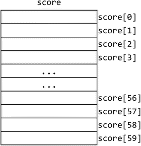
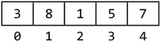
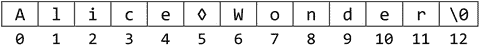
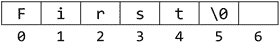
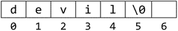
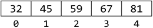
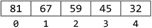
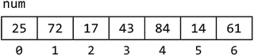
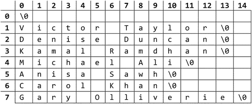
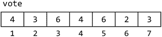

# 8.数组

在本章中，我们将解释以下内容:

*   什么是数组以及如何声明数组
*   如何在数组中存储值
*   如何使用`for`循环将已知数量的值读入数组
*   如何使用`for`循环处理数组元素
*   如何使用`while`循环将未知数量的值读入数组
*   如何从带下标的数组中提取所需的元素
*   如何计算数组中存储的数字之和
*   如何计算存储在数组中的数字的平均值
*   如何使用数组保存多个计数
*   如何使用作为字符数组的`string`
*   如何反转数组中的元素
*   如何编写一个函数来判断一个短语是否是回文
*   如何将数组作为参数传递给函数
*   如何找到数组中的最大值和最小值

## 8.1 简单变量与数组变量

到目前为止我们一直在使用的变量(如`ch`、`n`、`sum`)通常被称为简单变量。在任何给定的时间，一个简单的变量可以用来存储一项数据:例如，一个数字或一个字符。当然，如果我们愿意，存储在变量中的值是可以改变的。但是，在许多情况下，我们希望存储一组相关的项目，并能够通过一个公共名称来引用它们。数组变量允许我们这样做。

例如，假设我们希望存储学生在一次测试中的 60 个分数的列表。我们可以通过发明 60 个不同的 int 变量并将一个分数存储在一个变量中来实现。但是编写代码来操作这 60 个变量将是非常乏味、麻烦、笨拙和耗时的。(想想你会如何给这 60 个变量赋值。)如果我们需要处理 200 个分数呢？

更好的方法是使用一个数组来存储 60 个分数。我们可以认为这个数组有 60 个“位置”——我们使用一个位置来存储一个元素，在本例中是一个分数。为了表示特定的分数，我们使用下标。例如，如果`score`是数组的名称，那么`score[5]`指的是位置`5`中的分数——这里`5`用作下标。写在方括号内，`[`和`]`。

一般来说，数组可以用来存储相同类型的值的列表；例如，我们称之为整数数组、字符数组、字符串数组或浮点数数组。正如您将看到的，使用数组允许我们以简单、系统的方式处理列表，不管它有多大。我们可以使用一个简单的循环来处理全部或部分项目。我们还可以做一些事情，比如在列表中搜索一个项目，或者按照升序或降序对列表进行排序。

## 8.2 数组声明

在使用数组之前，必须声明它。例如，考虑以下语句:

`int score[60];`

这声明了 score 是一个“整数数组”或一个下标从`0`到`59`的“T0 数组”。数组声明由以下部分组成

*   类型(本例中为 int)
*   数组的名称(本例中为 score)
*   一个左方括号，[
*   数组的大小(本例中为 60)
*   一个右方括号，]

在 C 语言中，如果`n`是数组的大小，数组下标从`0`开始，一直到`n-1`。

我们可以认为这个声明创建了 60 个`int`变量，这些变量可以被数组变量`score`共同引用。为了引用这些分数中的一个特定分数，我们在数组名后使用一个写在方括号中的下标。在这个例子中，

`score[0]`指第一次得分

`score[1]`指第二个分数

`score[2]`指第三个分数

。

。

`score[58]`指第 59 分

`score[59]`指第 60 分

如你所见，数组下标在 C 中有点笨拙；如果`score[i]`是指第`i`个分数，那就更好了(也更符合逻辑)。我们将很快看到如何解决这个问题。

试图引用下标允许范围之外的元素是错误的。如果您这样做，您将得到一个“数组下标”错误。例如，您不能引用`score[60]`、`score[-1]`和`score[99]`，因为它们不存在。

下标可以用常量(如`25`)、变量(如`n`)或表达式(如`i+1`)来写。下标的值决定了引用的是哪个元素。

在我们的例子中，数组的每个元素都是一个`int`，可以像普通的`int`变量一样以任何方式使用。特别是，一个值可以存储在其中，它的值可以打印出来，并且可以与另一个`int`进行比较。

我们可以把`score`描绘成图 [8-1](#Fig1) 。

图 8-1。

Declaration of `int score[60]`

就像一个简单的变量，当一个数组被声明时，它的元素的值保持未定义，直到我们执行在其中存储值的语句。这将在接下来的 8.3 节中讨论。

再举一个例子，假设我们需要存储 100 件商品的商品编号(整数)和价格(浮点数)。我们可以用一个数组(`item`)保存商品编号，用另一个数组(`price`)保存价格。这些可以用这个来声明:

`int item[100];`

`double price[100];`

`item`的元素范围从`item[0]`到`item[99]`，而`price`的元素范围从`price[0]`到`price[99]`。当我们在这些数组中存储值时(见下一步)，我们将确保

`price[0]`持有`item[0]`的价格；

`price[1]`持有`item[1]`的价格；

总的来说，

`price[i]`持有价格`of item[i]`。

## 8.3 将值存储在数组中

考虑数组`score`。如果愿意，我们可以将选定的元素设置为特定值，如下所示:

`score[3] = 56;`

`score[7] = 81;`

但是如果我们希望将 60 个位置设置为 60 个分数呢？我们需要像下面这样写 60 条语句吗？

`score[0] = 45;`

`score[1] = 63;`

`score[2] = 39;`

`.`

`.`

`score[59] = 78;`

这当然是完成工作的一种方式，但是它非常乏味、耗时而且不灵活。更简洁的方法是让下标是变量而不是常量。例如，`score[h]`可以用来引用位置`h`的分数；哪个分数取决于`h`的价值。如果`h`的值是`47`，那么`score[h]`指的是`score[47]`，位置`47`的分数。

注意，`score[h]`可以通过简单地改变`h`的值来引用另一个分数，但是，在任何时候，`score[h]`都是指一个特定的分数，由`h`的当前值决定。

假设 60 个分数存储在一个文件`scores.txt`中。下面的代码将读取 60 个分数，并将它们存储在数组`score`中:

`FILE * in = fopen("scores.txt", "r");`

`for (int h = 0; h < 60; h++)`

`fscanf(in, "%d", &score[h]);`

假设文件`scores.` `txt`以下列数据开始:

`45 63 39 ...`

执行`for`循环时，`h`的值范围为`0`到`59`:

*   当`h`为`0`时，第一个分数`45`被读取并存储在`score[0]`中；
*   当`h`为`1`时，第二个分数`63`被读取并存储在`score[1]`中；
*   当`h`为`2`时，第三个分数`39`被读取并存储在`score[2]`中；

依此类推，直到

*   当`h`为`59`时，第 60 个分数被读取并存储在`score[59]`中。

注意，这个方法比写 60 条赋值语句要简洁得多。我们使用一种说法

`fscanf(in, "%d", &score[h]);`

在 60 个不同的地方储存分数。这通过改变下标`h`的值来实现。这种方法也更加灵活。如果我们必须处理 200 个分数，比方说，我们只需要在`score`的声明和`for`语句中将 60 个分数改为 200 个分数(并在数据文件中提供 200 个分数)。前面的方法需要我们写 200 条赋值语句。

如果我们希望在阅读时打印分数，我们可以像这样编写`for`循环:

`for (int h = 0; h < 60; h++) {`

`fscanf(in, "%d", &score[h]);`

`printf("%d\n", score[h]);`

`}`

另一方面，如果我们希望在分数被读取并存储在数组中之后打印分数，我们可以编写另一个`for`循环:

`for (h = 0; h < 60; h++)`

`printf("%d\n", score[h]);`

我们使用了用于读取分数的同一个循环变量`h`。但是并不要求我们这样做。任何其他循环变量都会有同样的效果。例如，我们可以这样写:

`for (int x = 0; x < 60; x++)`

`printf("%d\n", score[x]);`

重要的是下标的值，而不是用作下标的变量。

我们经常需要将一个数值数组的所有元素设置为`0`。这可能是必要的，例如，如果我们要用它们来保存总数，或者作为计数器。例如，要将 score 的 60 个元素设置为`0`，我们可以写:

`for (int h = 0; h < 60; h++)`

`score[h] = 0;`

`for`循环执行 60 次，其中`h`取值为`0`至`59`:

*   第一次循环时，`h`是`0`，所以`score[0]`被设置为`0`。
*   第二次循环时，`h`是`1`，所以`score[1]`被设置为`0`。

以此类推，直到

*   第 60 次循环时，`h`为`59`，因此`score[59]`被设置为`0`。

如果我们想将元素设置为不同的值(`-1`)，我们可以这样写:

`for (int h = 0; h < 60; h++)`

`score[h] = -1;`

应该注意的是，尽管我们已经声明`score`的大小为 60，但并不要求我们使用所有的元素。例如，假设我们只想将 score 的前 20 个元素设置为`0`，我们可以通过以下方式实现:

`for (int h = 0; h < 20; h++)`

`score[h] = 0;`

这设置了元素`score[0]`、`score[1]`、`score[2]`，直到`score[19]`到`0`。元素`score[20]`至`score[59]`仍未定义。

c 提供了另一种初始化数组的方法——在声明中。考虑一下这个:

`int score[5] = {75, 43, 81, 52, 68};`

这将`score`声明为大小为`5`的数组，并将`score[0]`设置为`75`、`score[1]`设置为`43`、`score[2]`设置为`81`、`score[3]`设置为`52`以及`score[4]`设置为`68`。

初始值用大括号括起来，并用逗号分隔。最后一个值后面不需要逗号，但是放一个逗号也不是错误。

如果提供的值少于`5`个，那么`0`将用于填充数组。例如，《宣言》

`int score[5] = {75, 43};`

将`score[0]`设置为`75`、`score[1]`设置为`43`、`score[2]`设置为`0`、`score[3]`设置为`0`、`score[4]`设置为`0`。

如果提供了超过`5`的值，您会得到一个警告或错误，这取决于您的编译器设置。例如，由于有`8`值，下面将生成一个警告或错误:

`int score[5] = {75, 43, 81, 52, 68, 49, 66, 37};`

可以省略数组的大小，例如这样写:

`int score[] = {75, 43, 81, 52, 68, 49, 66, 37};`

在这种情况下，编译器计算值的数量来确定数组的大小。这里，值的个数是`8`，所以就好像我们写了这个声明一样:

`int score[8] = {75, 43, 81, 52, 68, 49, 66, 37};`

作为另一个例子，假设我们想存储闰年中一个月的天数。我们可以用这个:

`int month[] = {31,29,31,30,31,30,31,31,30,31,30,31};`

这将把`month[0]`设置为`31`，`month[2]`设置为`29`，等等。，我们必须记住，`month[0]`指的是一月，`month[1]`指的是二月，以此类推。我们可以通过使用以下方法来解决这个问题:

`int month[] = {0,31,29,31,30,31,30,31,31,30,31,30,31};`

现在，`month[1]`是`31`并且指代一月，`month[2]`是`29`，指代二月，以此类推——这比之前的声明更自然。元素`month[0]`是`0`，但是我们忽略了它(见下一条)。

### 8.3.1 关于不使用元素`0`

正如我们已经看到的，当我们不得不说“第三个元素存储在位置 2”时，从元素`0`开始可能有点尴尬和不自然；下标与元素的位置“不同步”。说“第一个元素存储在位置 1”或“第五个元素存储在位置 5”会更合理、更符合逻辑

对于这种情况，最好忽略元素`0`，假设下标从`1`开始。但是，您必须声明数组的大小比您实际需要的大 1。例如，如果我们想要满足 60 个分数，我们将不得不声明`score`为

`int score[61];`

这创建了元素`score[0]`到`score[60]`。我们可以忽略`score[0]`，只用`score[1]`到`score[60]`。不得不声明一个额外的元素，这是以一种更自然和更符合逻辑的方式处理我们的问题的小小代价。

有时候使用位置`0`的数组会更好。但是，当它不是的时候，我们将声明我们的数组大小比需要的大一，并忽略位置`0`中的元素。更好的编程实践是使用该语言来满足您的目的，而不是将自己局限于该语言的特性。

假设我们要满足 60 分的要求。实现这一点的一个好方法如下:

`#define MaxScores 60`

`...`

`int score[MaxScores + 1];`

我们现在可以处理元素`score[1]`到`score[MaxScores]`。

## 8.4 平均值和与平均值的差异

考虑寻找一组数字(整数)的平均值以及每个数字与平均值的差值的问题。为了求平均值，我们需要知道所有的数字。在第 5.3.1 节中，我们看到了如何通过一次读取和存储一个数字来求平均值。每读一个新的数字都取代了前一个。最后，我们可以计算平均值，但是我们丢失了所有的数字。

现在，如果我们还想知道每个数字与平均值相差多少，我们需要存储原始数字，以便在计算平均值后可以使用它们。我们将把它们存储在一个数组中。该计划将基于以下假设:

*   将提供不超过 100 个号码；需要此信息来声明数组的大小；
*   数字将由`0`终止；假设`0`不是其中一个数字。

下面显示了我们希望该程序如何工作:

`Enter up to 100 numbers (end with 0)`

`2 7 5 3 0`

`Numbers entered: 4`

`Sum of numbers: 17`

`The average is 4.25`

`Numbers and differences from average`

`2  -2.25`

`7   2.75`

`5   0.75`

`3  -1.25`

程序 P8.1 显示了如何编写这样的程序。

Program P8.1

`//find average and difference from average`

`#include <stdio.h>`

`#define MaxNum 100`

`int main() {`

`int a, num[MaxNum];`

`int n = 0;`

`double sum = 0;`

`printf("Enter up to %d numbers (end with 0)\n", MaxNum);`

`scanf("%d", &a);`

`while (a != 0) {`

`sum += a;`

`num[n++] = a;  //store in location n, then add 1 to n`

`scanf("%d", &a);`

`}`

`if (n == 0) printf("No numbers entered\n");`

`else {`

`printf("\nNumbers entered: %d\n", n);`

`printf("Sum of numbers: %1.0f\n\n", sum);`

`double average = sum / n;`

`printf("The average is %3.2f\n", average);`

`printf("\nNumbers and differences from average\n");`

`for (int h = 0; h < n; h++)`

`printf("%4d %6.2f\n", num[h], num[h] - average);`

`}`

`}`

关于程序 P8.1 的注意事项:

*   使用`#define`，我们将符号常量`MaxNum`设置为`100`；我们用它来声明数组并在提示符下输入数字。这使得程序很容易修改，如果我们改变主意，希望迎合不同数量的数字。
*   当读取的数字不是`0`时，我们进入`while`循环。在循环内部，我们将它添加到总和中，存储在数组中，并对其进行计数。每次我们到达循环的末尾，`n`的值就是到目前为止数组中存储的数字的数量。
*   在从`while`循环退出时，我们测试`n`。如果仍然是`0`，那么没有提供数字，也没有其他事情可做。如果是`0`，程序不会犯试图除以`n`的错误。如果`n`是正的，我们自信地用总和除以它来求平均值。
*   `for`循环“遍历”数组，打印数字以及它们与平均值的差值。这里，`n`是实际使用的数组元素的数量，不一定是整个数组。使用的元素有`num[0]`到`num[n-1]`。
*   这个程序计算出读取的数字的总和。如果我们需要找到存储在数组中的前`n`个元素的和，我们可以用下面的代码来做:`sum = 0;` `for(int h = 0; h < n; h++) sum += num[h];`

程序 P8.1 完成基础工作。但是如果用户输入了超过 100 个数字呢？回想一下，正如声明的那样，`num`的元素范围从`num[0]`到`num[99]`。

现在假设`n`是`100`，这意味着`100`数字已经存储在数组中。如果输入了另一个，并且不是`0`，程序将进入`while`循环并尝试执行该语句

`num[n++] = a;`

由于`n`是`100`，这现在与

`num[100] = a;`

但是没有元素`num[100]`——你会得到一个“数组下标”错误。当开始使用数组时，必须非常小心，不要让程序逻辑超出下标的范围。如果是这样，你的程序就会崩溃。

为了适应这种可能性，我们可以将`while`条件写成

`while (a != 0 && n < MaxNum) { ...`

如果`n`等于`MaxNum` ( `100`，意味着我们已经在数组中存储了`100`个值，没有空间再存储了。在这种情况下，循环条件将是`false`，不会进入循环，程序也不会试图在数组中存储另一个值。

这是另一个防御性编程的例子:试图让我们的程序不受外力影响。现在，用户操作没有办法通过超出数组的边界来导致程序崩溃。

## 8.5 字母频率计数

让我们写一个程序来计算输入中每个字母的出现频率。该程序将把一个大写字母和它的小写字母视为同一个字母；例如，`E`和`e`递增同一个计数器。

在程序 P7.10 中，我们写了一个函数，`position`，给定一个字符，如果该字符不是字母，则返回`0`；如果它是一个字母，它返回它在字母表中的位置。我们将使用`position`来解决这个问题。然而，我们将使用预定义的角色函数`isupper`和`islower`重写它。

为了解决这个问题，我们需要保留 26 个计数器，每个计数器代表字母表中的一个字母。我们需要一个用于`a`和`A`的计数器，一个用于`b`和`B`的计数器，一个用于`c`和`C`的计数器，等等。我们可以声明 26 个变量，称为`a`、`b`、`c`、`...`，直到`z`；`a`保存`a`和`A`的计数，`b`保存`b`和`B`的计数，依此类推。而且，在我们的程序中，我们可以编写以下形式的语句(假设`ch`包含下一个字符):

`if (ch == 'a' || ch == 'A') a++;`

`else if (ch == 'b' || ch == 'B') b++;`

`else if (ch == 'c' || ch == 'C') c++;`

`else if ...`

这很快就会令人厌倦。而且我们要打印结果的时候也会有类似的问题。不得不处理 26 个变量来解决这样一个小问题既不合适也不方便。正如我们将看到的，数组让我们更容易解决这个问题。

我们需要一个包含 26 个元素的`int`数组来保存字母表中每个字母的计数。因为使用元素 1(而不是元素 0)来保存`a`和`A`的计数，使用元素 2(而不是元素 1)来保存`b`和`B`的计数，等等，更自然，所以我们将数组`letterCount`声明为

`int letterCount[27];`

我们将忽略`letterCount[0]`并使用以下内容:

*   `letterCount[1]`保存`a`和`A`的计数
*   `letterCount[2]`保存`b`和`B`的计数
*   `letterCount[3]`保存`c`和`C`的计数
*   等等。
*   `letterCount[26]`保存`z`和`Z`的计数

完整的程序如程序 P8.2 所示。它从文件`passage.txt`中读取数据，并将输出发送到文件`output.txt`。

Program P8.2

`#include <stdio.h>`

`#include <ctype.h>`

`int main() {`

`char ch;`

`int n, letterCount[27], position(char);`

`FILE * in = fopen("passage.txt", "r");`

`FILE * out = fopen("output.txt", "w");`

`for (n = 1; n <= 26; n++) letterCount[n] = 0;  //set counts to 0`

`while ((ch = getc(in)) != EOF) {`

`n = position(ch);`

`if (n > 0) ++letterCount[n];`

`}`

`//print the results`

`fprintf(out, "Letter  Frequency\n\n");`

`for (n = 1; n <= 26; n++)`

`fprintf(out, "%4c %8d\n", 'a' + n - 1, letterCount[n]);`

`fclose(in);`

`fclose(out);`

`} //end main`

`int position(char ch) {`

`if (isupper(ch)) return ch - 'A' + 1;`

`if (islower(ch)) return ch - 'a' + 1;`

`return 0;`

`} //end position`

假设`passage.txt`包含以下内容:

`The quick brown fox jumps over the lazy dog.`

`If the quick brown fox jumped over the lazy dog then`

`Why did the quick brown fox jump over the lazy dog?`

程序 P8.2 将以下输出发送到文件`output.txt`:

`Letter  Frequency`

`a        3`

`b        3`

`c        3`

`d        6`

`e       11`

`f        4`

`g        3`

`h        8`

`i        5`

`j        3`

`k        3`

`l        3`

`m        3`

`n        4`

`o       12`

`p        3`

`q        3`

`r        6`

`s        1`

`t        7`

`u        6`

`v        3`

`w        4`

`x        3`

`y        4`

`z        3`

当读取一个字符`ch`时，我们调用函数`position`，就像这样:

`n = position(ch);`

如果`n`大于`0`，我们知道`ch`包含一个字母，`n`是该字母在字母表中的位置。例如，如果`ch`包含`Y`，那么`n`就是`25`，因为`Y`是字母表中的第 25 个字母。如果我们将`1`加到`letterCount[n]`上，我们将`1`加到`ch`包含的字母的计数上。这里，如果我们将`1`加到`letterCount[25]`上，我们将`1`加到`Y`的计数上。下面的语句完成了这项工作:

`if (n > 0) ++letterCount[n];`

看看打印一行输出的`fprintf`语句:

`fprintf(out, "%4c %8d\n", 'a' + n - 1, letterCount[n]);`

这将打印一个字母(小写)及其计数。让我们看看如何。`'a'`的代码是`97`。当`n`为`1`时，

`'a' + n - 1`

被评价为`97+1-1`，也就是`97`；当`97`被印上`%c`时，它被解释为一个字符，所以字母`a`被印上。当`n`为`2`时，

`'a' + n - 1`

被评价为`97+2-1`，也就是`98`；当`98`被印上`%c`时，它被解释为一个字符，所以`b`被印上。当`n`为`3`时，

`'a' + n - 1`

被评价为`97+3-1`，也就是`99`；当`99`被印上`%c`时，它被解释为一个字符，所以`c`被印上。等等。随着`n`呈现从`1`到`26`的值，

`'a' + n - 1`

将承担从`'a'`到`'z'`的字母代码。

有趣的是，我们可以使用前面描述的以下特殊形式的`for`语句来获得相同的结果。这是:

`for (ch = 'a', n = 1; n <= 26; ch++, n++)`

`fprintf(out, "%4c %8d\n", ch, letterCount[n]);`

从`1`到`26`的`n`循环仍然被执行。但是，与`n`同步，它也随着`ch`从`'a'`到`'z'`而被执行。注意使用`ch++`移动到下一个字符。

## 8.6 更好地利用`fopen`

考虑以下陈述:

`FILE * in = fopen("passage.txt", "r");`

这表示“打开文件`passage.txt`进行读取”它假设已经创建了文件，并且在其中存储了适当的数据。但是，如果用户忘记创建文件或者把文件放在了错误的位置(例如，放在了错误的文件夹中)，该怎么办呢？我们可以使用`fopen`来检查这一点。如果`fopen`找不到文件，它返回预定义的值`NULL`(在`stdio.h`中定义)。我们可以按如下方式对此进行测试:

`FILE * in = fopen("passage.txt", "r");`

`if (in == NULL) {`

`printf("File cannot be found\n");`

`exit(1);`

`}`

如果`in`为`NULL`，程序打印一条信息并停止。如果`in`不是`NULL`，程序照常进行。

预定义函数`exit`用于终止程序的执行，并将控制返回给操作系统。通常使用`exit(0)`表示正常终止；其他参数用于指示某种错误。

要使用`exit`，我们必须编写指令

`#include <stdlib.h>`

在我们程序的开头，由于`exit`是在“标准库”中定义的，`stdlib.h`。其中，这个库包含处理随机数的函数、搜索函数和排序函数。

像往常一样，我们可以给`in`赋值，并用下面的方法测试`NULL`:

`FILE * in;`

`if ((in = fopen("passage.txt", "r")) == NULL) {`

`printf("File cannot be found\n");`

`exit(1);`

`}`

注意，我们不能在`if`条件中使用`FILE * in`，因为这里不允许声明。

同样，当我们写作时

`FILE * out = fopen("output.txt", "w");`

我们假设文件`output.txt`存在或者可以被创建。如果它不存在并且不能被创建(例如，磁盘可能被写保护或者已满)，`fopen`将返回`NULL`。我们可以按如下方式对此进行测试:

`FILE * out;`

`if ((out = fopen("output.txt", "w")) == NULL) {`

`printf("File cannot be found or created\n");`

`exit(1);`

`}`

到目前为止，我们已经在`fopen`语句中写入了我们的文件名。要使用不同的文件，我们必须改变语句中的名称，并且必须重新编译程序。如果我们让用户在程序运行时告诉我们文件名，我们的程序会更加灵活。

我们可以声明`dataFile`(说)来保存文件名

`char dataFile[40];`

您可以将`40`更改为您想要的任何尺寸。如果`in`已经被声明为`FILE *`，我们可以提示用户输入文件名并测试是否一切正常:

`printf("Enter name of file: ");`

`scanf("%s", dataFile);`

`if ((in = fopen(dataFile, "r")) == NULL) {`

`printf("File cannot be found\n");`

`exit(1);`

`}`

因为我们使用`%s`来读取文件的名称，所以名称不能包含空格。如果您的文件名可能包含空格，您可以使用`gets`。

## 8.7 作为函数参数的数组

在第 7 章中，我们看到了参数是如何传递给函数的。在 C #中，参数是“按值”传递的当参数“通过值”传递时，会用参数的值创建一个临时位置，并将该临时位置传递给函数。该函数永远无法访问原始参数。

我们还看到，例如，当我们使用`gets(item)`将一个字符串读入字符数组`item`时，该函数能够将该字符串放入参数`item`。这意味着该函数可以访问实际的参数，不涉及副本。

在 C 语言中，数组名表示其第一个元素的地址。当我们使用一个数组名作为一个函数的参数时，第一个元素的地址被传递给这个函数，因此它可以访问这个数组。

我们现在仔细看看用数组参数编写函数所涉及的一些问题。

我们将编写一个函数`sumList`，它返回传递给函数的数组中整数的和。例如，如果数组包含以下内容:

该函数应该返回`24`。

我们可以这样写函数头:

`int sumList(int num[])`

数组参数就像数组声明一样编写，但是没有指定大小。但是，方括号必须存在，以便与简单的参数区分开来。例如，如果我们写了 int `num`，这将意味着`num`是一个普通的`int`变量。

如果愿意，可以使用常量、符号常量或任何可以在程序编译时计算的整数表达式来指定大小。(C99 和更高版本的 C 允许可变长度数组，其中数组下标可以在运行时指定。我们将在 9.4.1 节看到一个例子。)然而，如果你不这样做，你的程序将会更加灵活。

现在，假设`score`在`main`中被声明为

`int score[10];`

我们打电话

`sumList(score);`

我们可以简单的认为，在函数中，`score`是由名字`num`知道的；对`num`的任何引用都是对原始参数`score`的引用。

更精确的解释是这样的:由于名称`score`表示`score[0]`的地址，这个地址被传递给函数，在那里它成为`num`、`num[0]`的第一个元素的地址。事实上，任何地址都可以传递给函数，在那里它将被当作`num[0]`的地址。

该函数可以随意为`num`设定任何大小。显然，如果我们试图处理不存在的数组元素，这会给我们带来麻烦。因此，告诉函数要处理多少个元素是很好的编程习惯。我们使用另一个参数来实现这一点，如:

`int sumList(int num[], int n)`

现在，调用函数可以通过为`n`提供一个值来告诉`sumList`要处理多少个元素。使用`score`的宣言，如上，调用

`sumList(score, 10);`

告诉函数处理`score`(整个数组)的第一个`10`元素。但是，这也是这种方法的优势所在:我们也可以进行这样的调用

`sumList(score, 5);`

让函数处理`score`的第一个`5`元素。

使用这个函数头，我们写`sumList`如下:

`int sumList(int num[], int n) {`

`int sum = 0;`

`for (int h = 0; h < n; h++) sum += num[h];`

`return sum;`

`}`

该函数使用一个`for`循环从`num[0]`到`num[n-1]`遍历数组。每次通过循环，它都向`sum`添加一个元素。从循环中退出时，`sum`的值作为函数值返回。

构造

`for (h = 0; h < n; h++)`

通常用于处理数组的第一个`n`元素。

要使用该功能，请考虑`main`中的以下代码:

`int sumList(int[], int), score[10];`

`for (int h = 0; h < 5; h++) scanf("%d", &score[h]);`

`printf("Sum of scores is %d\n", sumList(score, 5));`

像往常一样，任何想要使用`sumList`的函数都必须使用函数原型来声明它。注意使用`int[]`来表示第一个参数是一个整数数组。如果我们愿意，我们可以在声明原型时使用标识符，如下所示:

`int sumList(int list[], int);`

实际使用的标识符并不重要。我们可以用任何有效的标识符代替`list`。

`for`循环将`5`值读入数组。注意，由于数组元素就像一个普通的变量，我们必须在`scanf`中写入`&score[h]`，以将一个值读入`score[h]`。

假设读入`score`的值如下:

在`printf`中，调用

`sumList(score, 5)`

会得到函数返回`score`的前`5`个元素之和:也就是`24`。你现在应该知道了，为了找到第一个`3`元素的和，我们可以写

`sumList(score, 3)`

## 8.8 字符串–字符数组

在 2.7 节中，我们向您展示了如何在“字符数组”中存储字符串现在我们对数组有了一些了解，我们可以解释字符串实际上是如何存储的。

在 C #中，字符串存储在字符数组中。字符串中的每个字符存储在数组中的一个位置，从位置`0`开始。空字符`0`放在最后一个字符之后。这样做是为了让程序知道什么时候到达了字符串的末尾。例如，字符串

`"Enter rate:"`

存储如下(表示空格):

(当然，在计算机内部，每个字符都用它的数字代码来表示，用二进制表示。)

空字符串，一个没有字符的字符串，被写成`""`(两个连续的双引号)并像这样存储:

字符串常量`"a"`存储如下:

这不要和字符常量`'a'`混淆，它有一个数值(它的整数代码值)与之关联，可以用在算术表达式中。没有与字符串`"a."`相关联的数值

我们可以使用关系运算符==，！=，和> =，但是我们不能这样比较两个字符串，即使是像`"a"`和`"h,"`这样的单字符字符串。为了比较两个字符串，我们可以使用标准的字符串函数`strcmp`。

假设我们打算在变量`name`中存储一个名字，声明为

`char name[25];`

如果我们使用

`gets(name);`

或者

`scanf("%s", name);`

c 将把`\0`放在存储的最后一个字符之后。(这被称为用`\0`正确终止字符串。)我们必须确保数组中有足够的空间来存储`\0`。因此，如果我们声明一个大小为`25`的数组，我们最多可以在其中存储一串`24`字符，因为我们必须为`\0`保留一个位置。

例如，假设`Alice Wonder`被键入以响应`gets(name)`。数组`name`看起来像这样(只显示使用过的位置):

因为`name`是一个数组，如果我们愿意，我们可以处理单个字符。例如，`name[0]`指的是第一个字符，`name[1]`指的是第二个，以此类推。一般来说，我们可以用`name[i]`来指代`i`位置上的人物。正如我们已经看到的，我们可以使用`name`本身来引用存储在数组中的字符串。

字符串的长度定义为其中的字符数，不算`\0`。预定义的字符串函数`strlen`将一个字符数组作为其参数，并返回存储在其中的字符串的长度。在这个例子中，`strlen(name)`将返回`12`，`"Alice Wonder."`中的字符数，作为一个兴趣点，`strlen`从数组的开头开始计算字符数，直到找到`\0`；`\0`不算。

事实上，所有标准的字符串函数(如`strlen`、`strcpy`、`strcat,`和`strcmp`)都假设我们给它们的字符串以`\0`结束。否则，将会出现不可预测的结果。想象一下会发生什么，例如，如果我们给`strlen`一个字符数组，但是没有`\0`来表示字符串的结束。它将永远继续寻找`\0`。

当我们编写如下语句时:

`char name[25] = "Alice Wonder";`

或者

`strcpy(name, "Alice Wonder");`

c 将在最后一个字符后存储`\0`,所以我们不必担心。

但是，如果我们自己把字符存储在一个数组里，一定要小心，要在末尾加上`\0`。如果我们打算对字符串使用任何标准的字符串函数，或者如果我们打算用`%s`打印它，这是非常重要的。例如，考虑以下代码:

`char word[10];`

`int n = 0;`

`char ch = getchar();`

`while (!isalpha(ch)) ch = getchar(); //read and ignore non-letters`

`while (isalpha(ch)) {`

`word[n++] = ch;`

`ch = getchar();`

`}`

`word[n] = '\0';`

代码从输入中读取字符，并存储在数组`word`中找到的第一个单词。这里，单词被定义为任何连续的字母字符串。第一个`while`循环读取所有非字母字符。当它找到第一个字母字符时退出。只要读取的字符是字母，就执行第二个`while`循环。它使用`n`遍历数组中的位置，从位置`0`开始。在退出该循环时，`\0`被存储在位置`n`，因为此时，`n`表示最后一个字母被存储的位置。

举例来说，假设数据是:

`123$#%&First Caribbean7890`

第一个`while`循环将读取字符，直到到达`F`，因为`F`是数据中的第一个字母字符。第二个循环将存储

`F in word[0]`

`i in word[1]`

`r in word[2]`

`s in word[3]`

`t in word[4]`

由于`n`在每个字符被存储后递增，所以在这个阶段`n`的值是`5`。当`t`之后的空间被读取时，`while`循环退出，并且`\0`被存储在`word[5]`中，适当地终止字符串。数组`word`将如下所示:

我们现在可以将`word`与任何标准字符串函数一起使用，并可以使用`%s`打印它，如下所示:

`printf("%s", word);`

`%s`到达`\0`时将停止打印字符。

上面的代码并不完美——我们使用它主要是为了说明的目的。由于`word`的大小为`10`，我们可以在其中存储最多`9`个字母(加上`\0`)。如果下一个单词长于 9 个字母(例如，`serendipity`，代码将试图访问不存在的`word[10]`，给出一个“数组下标”错误。

作为一个练习，考虑你将如何处理比你所能应付的更长的单词。(提示:在`word[n]`中存储任何内容之前，请检查`n`是否有效。)

为了说明如何处理字符串中的单个字符，我们编写了一个函数`numSpaces`，来计算并返回字符串`str`中的空格数:

`int numSpaces(char str[]) {`

`int h = 0, spaces = 0;`

`while (str[h] != '\0') {`

`if (str[h] == ' ') spaces++;`

`h++;`

`}`

`return spaces;`

`} //end numSpaces`

考虑代码:

`char phrase[] = "How we live and how we die";`

`printf("Number of spaces is %d\n", numSpaces(phrase));`

第一条语句创建了一个大小正好可以容纳字符串加上`\0`的数组。由于短语包含`26`字符(字母和空格)，数组`phrase`的大小为 27，其中`phrase[0]`包含`H` , `phrase[25]`包含`e`,`phrase[26]`包含`\0`。

在`printf`中，调用`numSpaces(phrase)`将把控制转移给函数，其中`phrase`将被称为`str`。在该函数中，`while`循环将遍历数组，直到到达`\0`。对于每个字符，它将检查它是否是一个空格。如果是，`1`加到`spaces`上。在退出循环时，`spaces`的值作为函数值返回。对于样本`phrase`，返回值将为`6`。

有趣的是，`while`循环的主体可以写成:

`if (str[h++] == ' ') spaces++;`

这里，`h`在我们测试了`str[h]`是否包含空格后递增。

练习

Write a function to return the number of digits in a string `str`.   Write a function to return how many vowels there are in a string `str`. Hint: it would be useful to write a function `isVowel` that, given a character `ch`, returns `1` if `ch` is a vowel and `0` if it is not.  

### 8.8.1 反转字符串中的字符

作为另一个例子，我们编写代码来反转字符串`str`中的字符。比如`str`包含`lived`，我们就必须把它改成`devil`。为了说明代码将如何工作，我们将`str`描述如下:

我们将首先交换`str[0]`、`l`和`str[4]`、`d`，假设:

接下来，我们将交换`str[1]`、`i`和`str[3]`、`e`，给出这个:

`str[2]`已经就位(中间的字母不动)，所以没有更多的事情要做，该方法以反转的`str`结束。

看起来我们将需要两个变量:一个将采用从`0`开始并递增的下标值，而另一个将采用从`length(str)-1`开始并递减的下标值。我们称它们为`lo`和`hi`。最初，我们会将`lo`设置为`0`，将`hi`设置为`length(str)-1`。

该算法的基本思想如下:

`1\. set lo to 0`

`2\. set hi to length(str)-1`

`3\. exchange the characters in positions lo and hi`

`4\. add 1 to lo`

`5\. subtract 1 from hi`

`6\. repeat from step 3`

我们什么时候停止？当没有更多的角色可以交换时，我们可以停止。这将在`lo`大于或等于`hi`时发生。或者换句话说，只要`lo`小于`hi`，我们就必须不停地交换角色。我们现在可以将算法编写如下:

`set lo to 0`

`set hi to length(str) - 1`

`while lo < hi do`

`exchange the characters in positions lo and hi`

`add 1 to lo`

`subtract 1 from hi`

`endwhile`

在这种形式下，很容易转换成 C 如下(假设`c`为`char`):

`lo = 0;`

`hi = strlen(str) - 1;`

`while (lo < hi) {`

`c = str[lo];`

`str[lo] = str[hi];`

`str[hi] = c;`

`lo++; hi--;`

`}`

然而，我们可以利用`for`语句的表达能力，将它写得更简洁，也许更易读，如下所示:

`for (lo = 0, hi = strlen(str) - 1; lo < hi; lo++, hi--) {`

`c = str[lo];`

`str[lo] = str[hi];`

`str[hi] = c;`

`}`

交换字符串中的两个字符是我们经常要做的事情。编写一个函数(`swap`)来完成这个任务会很方便。当我们调用`swap`时，我们会给它字符串和我们想要交换的字符的下标。例如，如果`word`是一个`char`数组，则调用

`swap(word, i, j);`

会交换角色`word[i]`和`word[j]`。因为`word`是一个数组，所以原始数组(不是副本)被传递给`swap`。当函数交换两个字符时，它是在实际参数中交换它们，`word`。

该函数可以写成如下形式:

`void swap(char str[], int i, int j) {`

`char c = str[i];`

`str[i] = str[j];`

`str[j] = c;`

`} //end swap`

在函数中，实际的参数(`word`，比方说)被称为`str`。

使用`swap`，我们可以用另一个函数`reverse`反转字符，如下所示:

`void reverse(char str[]) {`

`void swap(char [], int, int);`

`int lo, hi;`

`for (lo = 0, hi = strlen(str) - 1; lo < hi; lo++, hi--)`

`swap(str, lo, hi);`

`} //end reverse`

由于`reverse`使用`swap`，我们必须在`reverse`中声明`swap`的原型。再次注意，原型类似于函数头，除了我们省略了变量名。然而，如果你愿意，你可以把名字包括进去——任何名字都可以。

使用这些函数，我们编写了程序 P8.3，它读取一个字符串，反转它，并打印它。

Program P8.3

`#include <stdio.h>`

`#include <string.h>`

`int main() {`

`char sample[100];`

`void reverse(char s[]);`

`printf("Type some data and I will reverse it\n");`

`gets(sample);`

`reverse(sample);`

`printf("%s\n", sample);`

`} //end main`

`void reverse(char str[]) {`

`void swap(char [], int, int);`

`int lo, hi;`

`for (lo = 0, hi = strlen(str) - 1; lo < hi; lo++, hi--)`

`swap(str, lo, hi);`

`} //end reverse`

`void swap(char str[], int i, int j) {`

`char c = str[i];`

`str[i] = str[j];`

`str[j] = c;`

`} //end swap`

以下是 P8.3 的运行示例:

`Type some data and I will reverse it`

`Once upon a time`

`emit a nopu ecnO`

反转一个字符串本身似乎并不重要，但是有时候我们需要反转一个数组的元素。例如，我们可以将学生成绩列表存储在一个数组中，并按升序排序，如下所示:

如果我们想让标记按降序排列，我们所要做的就是反转数组，就像这样:

## 8.9 回文

考虑确定给定字符串是否是回文的问题(向前或向后拼写都一样)。回文的例子(忽略大小写、标点和空格)有:

`civic`

`Race car`

`Madam, I’m Adam.`

`A man, a plan, a canal, Panama.`

如果所有字母都是相同的大小写(大写或小写)，并且字符串(`word`)不包含空格或标点符号，我们可以如下解决问题:

`assign word to another string, temp`

`reverse the letters in temp`

`if temp = word then word is a palindrome`

`else word is not a palindrome`

换句话说，如果一个词的反义词和这个词相同，那就是回文。听起来合乎逻辑且正确。但是，效率不高。让我们看看为什么。

假设这个词是`thermostat`。这个方法将反转`thermostat`得到`tatsomreht`。两者对比告诉我们`thermostat`不是回文。但是我们可以更快地得到如下答案:

`compare the first and last letters,``t``and`T3】

`they are the same, so`

`compare the second and second to last letters,``h``and`T3】

`these are different so the word is not a palindrome`

我们将编写一个名为`palindrome`的函数，给定一个字符串`word`，如果 word 是回文，则返回`1`，如果不是，则返回`0`。目前，我们将假设`word`全部大写或全部小写，并且不包含空格或标点符号。该功能将基于以下理念:

`compare the first and last letters`

`if they are different, the string is not a palindrome`

`if they are the same, compare the second and second to last letters`

`if they are different, the string is not a palindrome`

`if they are the same, compare the third and third to last letters`

诸如此类；我们继续下去，直到我们找到一个不匹配的对(这不是一个回文)或者没有更多的对来比较(这是一个回文)。我们可以用伪代码来表达这个逻辑，如下所示:

`set lo to 0`

`set hi to length(word) - 1`

`while lo < hi do //while there are more pairs to compare`

`if word[lo] != word[hi] then return 0 // not a palindrome`

`//the letters match, move on to the next pair`

`lo = lo + 1`

`hi = hi - 1`

`endwhile`

`return 1 // all pairs match, it is a palindrome`

`while`循环比较字母对；如果它发现一个不匹配的对，它立即返回`0`。如果所有配对都匹配，当`lo`不再小于`hi`时，它将以正常方式退出。在这种情况下，它返回`1`。

函数回文显示在程序 P8.4 中，它通过读取几个单词并打印每个单词是否是回文来测试它。

Program P8.4

`#include <stdio.h>`

`#include <string.h>`

`int main() {`

`char aWord[100];`

`int palindrome(char str[]);`

`printf("Type a word. (To stop, press 'Enter' only): ");`

`gets(aWord);`

`while (strcmp(aWord, "") != 0) {`

`if (palindrome(aWord)) printf("is a palindrome\n");`

`else printf("is not a palindrome\n");`

`printf("Type a word. (To stop, press 'Enter' only): ");`

`gets(aWord);`

`}`

`} //end main`

`int palindrome(char word[]) {`

`int lo = 0;`

`int hi = strlen(word) - 1;`

`while (lo < hi)`

`if (word[lo++] != word[hi--]) return 0;`

`return 1;`

`} //end palindrome`

在函数中，我们使用单个语句

`if (word[lo++] != word[hi--]) return 0;`

来表达上述算法中 while 循环体的所有逻辑。由于我们用`++`和`--`做后缀，`word[lo]`和`word[hi]`比较后`lo`和`hi`就变了。

当然，我们可以把它表达为:

`if (word[lo] != word[hi]) return 0;`

`lo++;`

`hi--;`

该程序提示用户键入一个单词，并告诉她这是否是一个回文。然后它会提示输入另一个单词。要停止，用户只需按“输入”或“返回”键。当她这样做时，空字符串被存储在`aWord`中。`while`条件通过比较`aWord`和`""`来检查这一点(两个连续的双引号表示空字符串)。以下是程序 P8.4 的运行示例:

`Type a word. (To stop, press "Enter" only):` `racecar`

`is a palindrome`

`Type a word. (To stop, press "Enter" only):` `race car`

`is not a palindrome`

`Type a word. (To stop, press "Enter" only):` `Racecar`

`is not a palindrome`

`Type a word. (To stop, press "Enter" only):` `DEIFIED`

`is a palindrome`

`Type a word. (To stop, press "Enter" only):`

请注意，`race car`不是回文，因为`'e'`与`' '`不同，`Racecar`也不是回文，因为`'R'`与`'r'`不同。我们将很快解决这个问题。

### 8.9.1 更好的回文函数

我们编写的函数适用于全大写或全小写的单词回文。我们现在处理更困难的问题，检查可能包含大写字母、小写字母、空格和标点符号的单词或短语。为了说明我们的方法，请考虑以下短语:

`Madam, I’m Adam`

我们将把所有的字母转换成一个大小写(比如说小写),去掉所有的空格和非字母，给出

`madamimadam`

我们现在可以使用我们在程序 P8.4 中编写的函数来测试这是否是一个回文。

让我们编写一个函数`lettersOnlyLower`，给定一个字符串短语，将所有字母转换成小写，并删除所有空格和非字母。该函数将转换后的字符串存储在第二个参数中。这是:

`void lettersOnlyLower(char phrase[], char word[]) {`

`int i = 0, n = 0;`

`char c;`

`while ((c = phrase[i++]) != '\0')`

`if (isalpha(c)) word[n++] = tolower(c);`

`word[n] = '\0';`

`}`

功能注释`lettersOnlyLower`

*   `i`用于索引给定短语，存储在`phrase`中。
*   `n`用于索引转换后的短语，存储在`word`中。
*   `while`循环依次查看`phrase`的每个字符。如果是字母，用预定义的函数`tolower`转换成小写，存储在`word`中的下一个位置；要使用`tolower`，您的程序前面必须有指令`#include <ctype.h>`
*   从`while`退出时，`word`与`\0`正确终止。

将所有东西放在一起，我们得到程序 P8.5，它测试我们的新函数`letterOnlyLower`。

Program P8.5

`#include <stdio.h>`

`#include <string.h>`

`#include <ctype.h>`

`int main() {`

`char aPhrase[100], aWord[100];`

`void lettersOnlyLower(char p[], char w[]);`

`int palindrome(char str[]);`

`printf("Type a phrase. (To stop, press 'Enter' only): ");`

`gets(aPhrase);`

`while (strcmp(aPhrase, "") != 0) {`

`lettersOnlyLower(aPhrase, aWord);`

`printf("Converted to: %s\n", aWord);`

`if (palindrome(aWord)) printf("is a palindrome\n");`

`else printf("is not a palindrome\n");`

`printf("Type a word. (To stop, press 'Enter' only): ");`

`gets(aPhrase);`

`} //end while`

`} //end main`

`void lettersOnlyLower(char phrase[], char word[]) {`

`int j = 0, n = 0;`

`char c;`

`while ((c = phrase[j++]) != '\0')`

`if (isalpha(c))  word[n++] = tolower(c);`

`word[n] = '\0';`

`} //end lettersOnlyLower`

`int palindrome(char word[]) {`

`int lo = 0;`

`int hi = strlen(word) - 1;`

`while (lo < hi)`

`if (word[lo++] != word[hi--]) return 0;`

`return 1;`

`} //end` `palindrome`

程序提示用户输入一个短语，并告诉她这是否是一个回文。我们还打印了转换后的短语，向您展示该函数是如何工作的。

这里显示了一个运行示例:

`Type a phrase. (To stop, press "Enter" only):` `Madam I’m Adam`

`Converted to: madamimadam`

`is a palindrome`

`Type a phrase. (To stop, press "Enter" only):` `Flo, gin is a sin. I golf.`

`Converted to: floginisasinigolf`

`is a palindrome`

`Type a phrase. (To stop, press "Enter" only):` `Never odd or even.`

`Converted to: neveroddoreven`

`is a palindrome`

`Type a phrase. (To stop, press "Enter" only):` `Thermostat`

`Converted to: thermostat`

`is not a palindrome`

`Type a phrase. (To stop, press "Enter" only):` `Pull up if I pull up.`

`Converted to: pullupifipullup`

`is a` `palindrome`

`Type a phrase. (To stop, press "Enter" only):`

## 8.10 字符串数组-重访日名称

在程序 P7.4 中，我们编写了一个函数`printDay` `,`，它打印出一天的名称，给定一天的数字。我们现在要写一个函数`nameOfDay`,它有两个参数:第一个是一天的数字，第二个是一个字符数组。该函数将在数组中存储与日期编号相对应的日期名称。例如，调用

`nameOfDay(6, dayName);`

会将`Friday`存储在`dayName`中，假设`dayName`是一个字符数组。

我们展示了如何使用一个数组来写`nameOfDay`来存储日期的名称。假设我们有一个数组`day`，如图 [8-2](#Fig2) ( `day[0]`未使用，未显示)。

图 8-2。

The array `day`

如果`d`包含从`1`到`7`的值，那么`day[d]`包含对应于`d`的日期名称。比如`d`是`3`，`day[d]`包含`Tuesday`。但是我们如何在一个数组中存储日期的名称呢？我们需要什么样的阵列？

我们将需要一个数组，其中每个元素可以保存一个字符串-一个字符串数组。但是字符串本身存储在一个字符数组中。所以我们需要一个“字符数组”的数组——我们需要一个二维数组。考虑宣言

`char day[8][10];`

我们可以认为 day 有 8 行 10 列。如果我们在每行中存储一天的名称，那么我们可以存储 8 个名称。每个名字存储在一个由 10 个字符组成的数组中。行从`0`到`7`编号，列从`0`到`9`编号。如上图所示，我们将不使用行`0`。我们将把名字存储在行`1`到`7`中。如果我们将日期的名称存储在这个数组中，它将看起来像这样(我们将空字符串""放入`day[0]`):

c 让我们用`day[i]`来引用第`i`行。如果需要，我们可以用`day[i][k]`来指代`i`行`k`列的人物。比如`day[3][2]`就是`e`，`day[7][4]`就是`r`。

我们可以声明数组 day，并用日期的名称初始化它，如下所示:

`char day[8][10] = {"", "Sunday", "Monday", "Tuesday",`

`"Wednesday", "Thursday", "Friday", "Saturday"};`

该声明将创建如图 [8-3](#Fig3) 所示的数组。要放入数组中的字符串用`{`和`}`括起来，用逗号分隔，最后一个后面没有逗号。第一个字符串(空字符串)放在`day[0]`中，第二个放在`day[1]`中，第三个放在`day[2]`中，依此类推。

图 8-3。

The 2-dimensional array `day`

完整的功能`nameOfDay`如程序 P8.6 所示，其中`main`仅用于测试功能。

Program P8.6

`#include <stdio.h>`

`#include <string.h>`

`int main() {`

`void nameOfDay(int, char[]);`

`int n;`

`char dayName[12];`

`printf("Enter a day from 1 to 7: ");`

`scanf("%d", &n);`

`nameOfDay(n, dayName);`

`printf("%s\n", dayName);`

`} //end main`

`void nameOfDay(int n, char name[]) {`

`char day[8][10] = {"", "Sunday", "Monday", "Tuesday", "Wednesday",`

`"Thursday", "Friday", "Saturday"};`

`if (n < 1 || n > 7) strcpy(name, "Invalid day");`

`else strcpy(name, day[n]);`

`} //end nameOfDay`

在函数中，以下语句检查`n`的值。

`if (n < 1 || n > 7) strcpy(name, "Invalid day");`

`else strcpy(name, day[n]);`

如果`n`不是从`1`到 7 的值，该功能将`Invalid day`存储在`name`中。如果是有效的天数，它将`day[n]`的值存储在`name`中。例如，如果`n`为`6`，则函数将`day[6]`，即`Friday`存储在`name`中。

在`main`中，`dayName`被声明为大小为`12`，因为如果日期无效，它需要保存字符串`"Invalid day"`。

## 8.11 灵活的`getString`功能

到目前为止，我们已经使用格式规范`%s`读取不包含空白字符的字符串，使用函数`gets`读取直到行尾的字符串。然而，这两者都不允许我们读取由双引号分隔的字符串。假设我们有如下格式的数据:

`"Margaret Dwarika" "Clerical Assistant"`

我们将无法使用`%s`或`gets`轻松读取这些数据。

我们将编写一个函数`getString`，它让我们读取一个包含在“分隔符”字符中的字符串。例如，我们可以指定一个字符串为`$John Smith$`或`"John Smith."`，这是一种非常灵活的指定字符串的方式。每个字符串都可以指定自己的分隔符，这些分隔符对于下一个字符串可能是不同的。它对于指定可能包含特殊字符(如双引号)的字符串特别有用，而不必使用像`\"`这样的转义序列。

例如，为了在 C 中指定以下字符串:

`"Don’t move!" he commanded.`

我们必须写:

`"\"Don’t move!\" he commanded."`

使用`getString`，该字符串可以作为

`$"Don’t move!" he commanded.$`

或者

`%"Don’t move!" he commanded.%`

或者使用任何其他字符作为分隔符，只要它不是字符串中的字符之一。我们甚至可以使用这样的东西:

`7"Don’t move!" he commanded."7`

但是通常会使用特殊字符如`"`、`$`、`%`或`#`作为分隔符。

我们将用两个参数来编写`getString`:一个由`in`指定的文件和一个字符数组`str`。该函数将从`in`中读取下一个字符串，并将其存储在`str`中。

该函数假设第一个非空白字符 met ( `delim`)是分隔符。读取并存储字符，直到再次遇到`delim`，表示字符串结束。分隔符不存储，因为它们不是字符串的一部分。

假设我们在`main`中有以下声明:

`FILE * input = fopen("quizdata.txt", "r");`

`char country[50];`

并且文件`quizdata.txt`包含如上所述分隔的字符串。我们将能够从文件中读取下一个字符串，并将其存储在`country`中，如下所示:

`getString(input, country);`

由我们来确保`country`足够大以容纳下一个字符串。否则，程序可能会崩溃或出现无意义的结果。

这里是`getString`:

`void getString(FILE * in, char str[]) {`

`//stores, in str, the next string within delimiters`

`// the first non-whitespace character is the delimiter`

`// the string is read from the file 'in'`

`char ch, delim;`

`int n = 0;`

`str[0] = '\0';`

`// read over white space`

`while (isspace(ch = getc(in))) ; //empty while body`

`if (ch == EOF) return;`

`delim = ch;`

`while (((ch = getc(in)) != delim) && (ch != EOF))`

`str[n++] = ch;`

`str[n] = '\0';`

`} // end getString`

对`getString`的评论

*   如果预定义函数`isspace`的`char`参数是空格、制表符或换行符，则返回`1`(真)，否则返回`0`(假)。
*   如果`getString`在找到非空白字符(分隔符)之前遇到文件尾，那么空字符串将在`str`中返回。否则，它通过一次读取一个字符来构建字符串；字符串在下一次出现分隔符或文件结尾时终止，以先出现者为准。
*   我们可以用第一个参数`stdin`调用`getString`，从标准输入(键盘)中读取一个字符串。

## 8.12 地理问答节目

让我们写一个程序，询问用户关于国家和他们的首都。该计划将说明一些有用的编程概念，如从键盘和文件读取，并在用户输入方面非常灵活。下面是程序的运行示例，表明我们希望完成的程序如何工作。用户有两次机会回答一个问题。如果她两次都答错了，程序会告诉她正确的答案。

`What is the capital of Trinidad?` `Tobago`

`Wrong. Try again.`

`What is the capital of Trinidad?` `Port of Spain`

`Correct!`

`What is the capital of Jamaica?` `Kingston`

`Correct!`

`What is the capital of Grenada?` `Georgetown`

`Wrong. Try again.`

`What is the capital of Grenada?` `Castries`

`Wrong. Answer is St. George’s`

我们将把这些国家的名称和它们的首都存储在一个文件中。对于每个国家，我们将存储其名称、首都和一个仅由首都字母组成的特殊字符串，全部转换为大写。这最后一个字符串将用于使用户能够非常灵活地键入他们的答案，它将使我们能够编写一个更有效的程序。提供最后一个字符串不是绝对必要的，因为我们可以让程序为我们创建它(参见程序 P8.7 后的注释)。字符串`"*"`用于表示数据的结束。下面显示了一些示例数据:

`"Trinidad" "Port of Spain" "PORTOFSPAIN"`

`"Jamaica" "Kingston" "KINGSTON"`

`"Grenada" "St. George’s" "STGEORGES"`

`"*"`

我们每行显示 3 个字符串，但这不是必需的。唯一的要求是它们以正确的顺序提供。如果你愿意，你可以每行有 1 根弦或 6 根弦，或者每行有不同数量的弦。此外，您可以使用任何字符来分隔字符串，只要它不是字符串中的字符。您可以为不同的字符串使用不同的分隔符。提供以下上述数据是完全可以的:

`"Trinidad" $Port of Spain$ *PORTOFSPAIN*`

`%Jamaica% "Kingston" &KINGSTON&`

`$Grenada$ %St. George’s% ^STGEORGES^`

`#*#`

我们能做到这一点是因为`getString`的灵活性。我们将使用`getString`从文件中读取字符串，使用`gets`获取用户在键盘上输入的答案。

假设一个国家的数据分别读入变量`country`、`capital`和`CAPITAL`。(记住，在 C 中，`capital`是与`CAPITAL.`不同的变量)当用户键入一个答案时(`answer`，比方说)，它必须与`capital`进行比较。如果我们用一个简单的比较，比如

`if (strcmp(answer, capital) == 0) ...`

为了检查`answer`是否与`capital`相同，那么像`"Portof Spain,""port of spain,"" Port ofSpain,"`和`"st georges"`这样的答案都会被认为是错误的。如果我们希望这些答案是正确的(我们可能应该这样做)，我们必须在比较之前将所有用户的答案转换成一种通用的格式。

我们认为，只要所有的字母都在那里，顺序正确，无论大小写，答案就被认为是正确的。当用户键入答案时，我们忽略空格和标点符号，只将字母转换成大写。然后将其与`CAPITAL`进行比较。例如，上面的答案将被转换成`"PORTOFSPAIN"`和`"STGEORGES"`，并引发`"Correct!"`响应。

在回文程序(P8.5)中，我们编写了一个函数`lettersOnlyLower`，它只保存字符串中的字母，并将它们转换成小写字母。在这里，我们想要相同的功能，但我们转换成大写。我们将这个函数命名为`lettersOnlyUpper`。除了将`tolower`替换为`toupper`之外，代码与`lettersOnlyLower`相同。我们对正确性的测试现在变成了这样:

`lettersOnlyUpper(answer, ANSWER);`

`if (strcmp(ANSWER, CAPITAL) == 0) printf("Correct!\n");`

所有细节都记录在 P8.7 程序中。

Program P8.7

`#include <stdio.h>`

`#include <string.h>`

`#include <ctype.h>`

`#include <stdlib.h>`

`#define MaxLength 50`

`int main() {`

`void getString(FILE *, char[]);`

`void askOneQuestion(char[], char[], char[]);`

`char EndOfData[] = "*", country[MaxLength+1] ;`

`char capital[MaxLength+1], CAPITAL[MaxLength+1];`

`FILE * in = fopen("quizdata.txt", "r");`

`if (in == NULL){`

`printf("Cannot find file\n");`

`exit(1);`

`}`

`getString(in, country);`

`while (strcmp(country, EndOfData) != 0) {`

`getString(in, capital);`

`getString(in, CAPITAL);`

`askOneQuestion(country, capital, CAPITAL);`

`getString(in, country);`

`}`

`} // end main`

`void askOneQuestion(char country[], char capital[], char CAPITAL[]) {`

`void lettersOnlyUpper(char [], char[]);`

`char answer[MaxLength+1], ANSWER[MaxLength+1];`

`printf("\nWhat is the capital of %s?", country);`

`gets(answer);`

`lettersOnlyUpper(answer, ANSWER);`

`if (strcmp(ANSWER, CAPITAL) == 0) printf("Correct!\n");`

`else {`

`printf("Wrong. Try again\n");`

`printf("\nWhat is the capital of %s?", country);`

`gets(answer);`

`lettersOnlyUpper(answer, ANSWER);`

`if (strcmp(ANSWER, CAPITAL) == 0) printf("Correct!\n");`

`else printf("Wrong. Answer is %s\n", capital);`

`}`

`} // end askOneQuestion`

`void lettersOnlyUpper(char word[], char WORD[]) {`

`// stores the letters in word (converted to uppercase) in WORD`

`int i = 0, n = 0;`

`char c;`

`while ((c = word[i++]) != '\0')`

`if (isalpha(c)) WORD[n++] = toupper(c);`

`WORD[n] = '\0';`

`} // end lettersOnlyUpper`

`void getString(FILE * in, char str[]) {`

`//stores, in str, the next string within delimiters`

`// the first non-whitespace character is the delimiter`

`// the string is read from the file 'in'`

`char ch, delim;`

`int n = 0;`

`str[0] = '\0';`

`// read over white space`

`while (isspace(ch = getc(in))) ; //empty while body`

`if (ch == EOF) return;`

`delim = ch;`

`while (((ch = getc(in)) != delim) && (ch != EOF))`

`str[n++] = ch;`

`str[n] = '\0';`

`} // end getString`

如前所述，在文件中存储`CAPITAL`并不是绝对必要的。我们可以只存储`country`和`capital`，当这些被读取时，用

`lettersOnlyUpper(capital, CAPITAL);`

你可以用这个程序的思想写很多类似的。在地理主题上，可以问山和高，河流和长度，国家和人口，国家和首相等等。对于不同的应用程序，您可以使用它来训练用户的英语-西班牙语(或任何其他语言组合)词汇。您的问题可以采取以下形式:

`What is the Spanish word for water?`

或者，如果你喜欢，

`What is the English word for agua?`

更好的是，让用户选择是给她英语单词还是西班牙语单词。

你可以询问书籍和作者，歌曲和歌手，电影和明星。作为一个练习，想一想这个程序的思想可以用来测试用户的其他五个领域。

## 8.13 找出最大的数字

让我们考虑寻找存储在数组中的一组值的最大值的问题。寻找最大值的原则与我们在 5.6 节中讨论的相同。假设整数数组`num`包含以下值:

我们可以很容易地看到，最大的数字是 84，它位于位置 4。但是程序如何确定这一点呢？一种方法如下:

*   假设第一个元素(位置`0`的元素)最大；我们通过将`big`设置为`0`来实现这一点。当我们遍历数组时，我们将使用`big`来保存到目前为止遇到的最大数的位置；`num[big]`泛指实际人数。
*   接下来，从位置`1`开始，我们查看每个连续位置中的数字，直到`6`，并将该数字与位置`big`中的数字进行比较。
*   第一次，我们比较`num[1]`和`num[0]`；由于`num[1]`、`72`大于`num[0]`、`25`，我们将`big`更新为`1`。这意味着到目前为止最大的数量位于位置`1`。
*   接下来我们比较一下`num[2]`、`17`、`num[big]`(也就是`num[1]`)、`72`；由于`num[2]`小于`num[1]`，我们继续下一个数字，将`big`留在`1`。
*   接下来我们比较一下`num[3]`、`43`、`num[big]`(也就是`num[1]`)、`72`；由于`num[3]`小于`num[1]`，我们继续下一个数字，将`big`留在`1`。
*   接下来我们比较一下`num[4]`、`84`、`num[big]`(也就是`num[1]`)、`72`；由于`num[4]`大于`num[1]`，我们将`big`更新为`4`。这意味着到目前为止最大的数字位于位置`4`。
*   接下来我们比较一下`num[5]`、`14`、`num[big]`(也就是`num[4]`)、`84`；由于`num[5]`比`num[4]`小，我们继续下一个数字，在`4`留下大的。
*   接下来我们比较一下`num[6]`、`61`、`num[big]`(也就是`num[4]`)、`84`；由于`num[6]`比`num[4]`小，我们继续下一个数字，在`4`留下大的。
*   由于没有下一个数字，该过程结束，其中`big`的值是最大数字的位置`4`。实际数字用`num[big]`表示；既然`big`是`4`，这就是`num[4]`，也就是`84`。

我们可以用下面的伪代码来表达刚才描述的过程:

`big = 0`

`for h = 1 to 6`

`if num[h] > num[big] then big = h`

`endfor`

`print "Largest is ", num[big], " in position ", big`

我们现在将编写一个函数`getLargest`，来寻找数组中的最大值。一般来说，我们将指定在数组的哪个部分搜索值。这很重要，因为大多数时候，我们声明一个数组有最大的大小(比如说 T1)，但是并不总是把`100`的值放在数组中。

当我们声明数组的大小为`100`时，我们是在迎合`100`值。但是，在任何时候，阵列的容量都可能少于这个数量。我们使用另一个变量(`n`，比方说)来告诉我们数组中当前存储了多少个值。例如，如果`n`是`36`，则表示值存储在数组的元素`0`到`35`中。

所以当我们寻找最大值时，我们必须指定要搜索数组中的哪些元素。我们将编写这样的函数，它接受三个参数——数组`num`和两个整数`lo`和`hi`——并返回从`num[lo]`到`num[hi]`的最大数的位置。由调用者来确保`lo`和`hi`在为数组声明的下标范围内。例如，呼叫

*   `getLargest(score, 0, 6)`将从`score[0]`到`score[6]`返回最大数的位置；那电话呢
*   `getLargest(mark, 10, 20)`将从`mark[10]`到`mark[20]`返回最大数的位置。

下面是函数，`getLargest`:

`int getLargest(int num[], int lo, int hi) {`

`int big = lo;`

`for (int h = lo + 1; h <= hi; h++)`

`if (num[h] > num[big]) big = h;`

`return big;`

`} //end getLargest`

通过将`big`设置为`lo`，该功能假定最大数位于第一个位置`lo`。接着，它将位置`lo+1`到`hi`的数字与位置`big`的数字进行比较。如果找到一个更大的，则`big`被更新到更大数字的位置。

## 8.14 找出最小的数字

函数`getLargest`可以很容易地修改，以找到数组中的最小值。简单地将`big`改为`small`，并将>替换为

`int getSmallest(int num[], int lo, int hi) {`

`int small = lo;`

`for (int h = lo + 1; h <= hi; h++)`

`if (num[h] < num[small]) small = h;`

`return small;`

`} //end getSmallest`

该函数返回从`num[lo]`到`num[hi]`的最小元素的位置。稍后，我们将向您展示如何使用该函数来按升序排列一组数字。

我们已经展示了如何在一个整数数组中找到最大值和最小值。对于其他类型的数组，如`double`、`char`或`float`，该过程完全相同。唯一要做的改变是数组的声明。请记住，当我们比较两个字符时,“较大的”字符是具有较高数字代码的字符。

## 8.15 投票问题

我们现在说明如何使用刚才讨论的一些想法来解决下面的问题。

*   在一次选举中，有七名候选人。每个选民可以投自己选择的候选人一票。投票记录为从 1 到 7 的数字。投票人数事先未知，但投票会因`0`的投票而终止。任何不是从 1 到 7 的数字的投票都是无效的。
*   文件`votes.txt`包含候选人的姓名。第一个名字被视为候选人 1，第二个被视为候选人 2，依此类推。名字后面是投票。写一个程序来读取数据并评估选举的结果。打印所有输出到文件，`results.txt`。
*   您的输出应该指定总票数、有效票数和无效票数。接下来是每位候选人和选举获胜者获得的票数。

假设您在文件中得到以下数据，`votes.txt`:

`Victor Taylor`

`Denise Duncan`

`Kamal Ramdhan`

`Michael Ali`

`Anisa Sawh`

`Carol Khan`

`Gary Olliverie`

`3 1 2 5 4 3 5 3 5 3 2 8 1 6 7 7 3 5`

`6 9 3 4 7 1 2 4 5 5 1 4 0`

您的程序应该将以下输出发送到文件中，`results.txt`:

`Invalid vote: 8`

`Invalid vote: 9`

`Number of voters: 30`

`Number of valid votes: 28`

`Number of spoilt votes: 2`

`Candidate       Score`

`Victor Taylor     4`

`Denise Duncan     3`

`Kamal Ramdhan     6`

`Michael Ali       4`

`Anisa Sawh        6`

`Carol Khan        2`

`Gary Olliverie    3`

`The winner(s):`

`Kamal Ramdhan`

`Anisa Sawh`

我们需要存储 7 名候选人的姓名和他们各自获得的票数。我们将使用一个`int`数组进行投票。为了自然地与候选人 1 到 7 一起工作，我们将编写声明

`int vote[8];`

并用`vote[1]`到`vote[7]`统计候选人的票数；`vote[c]`将为候选人`c`计票。我们不会使用`vote[0]`。

但是，既然名字本身存储在一个`char`数组中，我们可以为名字使用哪种数组呢？我们将需要一个“数组的数组”——一个二维数组。考虑宣言

`char name[8][15];`

我们可以认为`name`有 8 行 15 列。如果我们每行存储一个名字，那么我们可以存储 8 个名字。每个名字存储在一个由 15 个字符组成的数组中。行从`0`到`7`编号，列从`0`到`14`编号。在我们的程序中，我们将不使用行`0`。我们将把名字存储在第 1 行到第 7 行。如果我们将样本名称存储在该数组中，它将如下所示:

为了适应更长的名字，我们将使用下面的声明来存储候选人的名字:

`char name[8][31];`

我们将在`name[c]`中存储候选人`c`的姓名；`name[0]`不会使用。

为了使程序灵活，我们将定义以下符号常量:

`#define MaxCandidates 7`

`#define MaxNameLength 30`

并且，在`main`中，使用这些声明:

`char name[MaxCandidates + 1][MaxNameLength + 1];`

`int vote[MaxCandidates + 1];`

`#define`指令将放在程序的顶部，在`main`之前。当我们这样做时，任何需要使用符号常量的函数都可以使用它们。

一般来说，在任何函数之外声明的变量和标识符都是外部的，可以被同一个文件中跟在它后面的任何函数使用。(规则比这复杂一点，但这足以满足我们的目的。)因此，如果将声明放在程序的顶部，那么程序中的所有函数都可以使用变量和标识符，假设整个程序存储在一个文件中(我们的程序就是这种情况)。

该程序必须做的第一件事是读取名字并将投票计数设置为`0`。我们将编写一个函数`initialize`来做这件事。这也将让我们向您展示如何将一个二维数组传递给一个函数。

如前所述，我们将从两个部分(名和姓)读取候选人的名字，然后将它们连接在一起，创建一个名字，并存储在`name[c]`中。下面是函数:

`void initialize(char name[][MaxNameLength + 1], int vote[]) {`

`char lastName[MaxNameLength];`

`for (int c = 1; c <= MaxCandidates; c++) {`

`fscanf(in, "%s %s", name[c], lastName);`

`strcat(name[c], " ");`

`strcat(name[c], lastName);`

`vote[c] = 0;`

`}`

`} //end initialize`

正如我们在参数`vote`的例子中看到的，我们只需要方括号来表示`vote`是一维数组。但是，在二维数组名的情况下，我们必须指定第二维的大小，并且我们必须使用一个常量或表达式，其值可以在编译程序时确定。(C99 和更高版本的 C 允许可变长度数组，其中数组下标可以在运行时指定。我们将在 9.4.1 节看到一个例子。)第一维的大小可以保持未指定，如空方括号所示。这适用于任何用作参数的二维数组。

接下来，我们必须读取和处理投票。处理投票`v`包括检查它是否有效。如果是，我们想给候选人`v`的分数加 1。我们将使用以下内容读取和处理投票:

`fscanf(in, "%d", &v);`

`while (v != 0) {`

`if (v < 1 || v > MaxCandidates) {`

`fprintf(out, "Invalid vote: %d\n", v);`

`++spoiltVotes;`

`}`

`else {`

`++vote[v];`

`++validVotes;`

`}`

`fscanf(in, "%d", &v);`

`}`

这里的关键陈述是

`++vote[v];`

这是一个聪明的方法，使用投票`v`作为下标，为正确的候选人加 1。例如，如果`v`是`3`，我们有一个候选人`3`、`Kamal Ramdhan`的投票。我们希望将`1`添加到候选人`3`的投票计数中。该计数存储在`vote[3]`中。当`v`为`3`时，语句变为

`++vote[3];`

这就把`1`加到了`vote[3]`上。美妙之处在于，根据`v`的值，相同的语句将为任何候选项加 1。这说明了使用数组的一些威力。有 7 个候选人还是 700 个候选人并不重要；一个声明将适用于所有人。

现在我们知道了如何读取和处理投票，剩下的只是确定获胜者并打印结果。我们将把这个任务委托给函数`printResults`。

使用示例数据，在计算完所有投票后，数组 vote 将包含以下值(记住我们没有使用 vote[0])。

要找到获胜者，我们必须首先找到数组中的最大值。为此，我们将调用`getLargest`(第 8.13 节)

`int win = getLargest(vote, 1, MaxCandidates);`

这将把`win`设置为从`vote[1]`到`vote[7]`的最大值的下标(因为`MaxCandidates`是`7`)。在我们的示例中，`win`将被设置为`3`，因为最大值`6`位于位置`3`。(`6`也在位置`5`中，但是按照编写代码的方式，它将返回包含最大值的第一个位置，如果有多个位置的话。)

现在我们知道最大值在`vote[win]`中，我们可以“遍历”数组，寻找具有该值的候选值。这样，我们将找到所有得票最高的候选人(一个或多个)，并宣布他们为获胜者。

细节在程序 P8.8 的函数`printResults`中给出，这是我们对本节开始时提出的投票问题的解决方案。

Program P8.8

`#include <stdio.h>`

`#include <string.h>`

`#define MaxCandidates 7`

`#define MaxNameLength 30`

`FILE *in, *out;`

`int main() {`

`char name[MaxCandidates + 1][MaxNameLength + 1];`

`int vote[MaxCandidates + 1];`

`int v, validVotes = 0, spoiltVotes = 0;`

`void initialize(char [][MaxNameLength + 1], int []);`

`void printResults(char [][``MaxNameLeng`T2】

`in = fopen("votes.txt", "r");`

`out = fopen("results.txt", "w");`

`initialize(name, vote);`

`fscanf(in, "%d", &v);`

`while (v != 0) {`

`if (v < 1 || v > MaxCandidates) {`

`fprintf(out, "Invalid vote: %d\n", v);`

`++spoiltVotes;`

`}`

`else {`

`++vote[v];`

`++validVotes;`

`}`

`fscanf(in, "%d", &v);`

`}`

`printResults(name, vote, validVotes, spoiltVotes);`

`fclose(in);`

`fclose(out);`

`} // end main`

`void initialize(char name[][MaxNameLength + 1], int vote[]) {`

`char lastName[MaxNameLength];`

`for (int c = 1; c <= MaxCandidates; c++) {`

`fscanf(in, "%s %s", name[c], lastName);`

`strcat(name[c], " ");`

`strcat(name[c], lastName);`

`vote[c] = 0;`

`}`

`} // end initialize`

`int getLargest(int num[], int lo, int hi) {`

`int big = lo;`

`for (int h = lo + 1; h <= hi; h++)`

`if (num[h] > num[big]) big = h;`

`return big;`

`} //end getLargest`

`void printResults(char name[][MaxNameLength + 1], int vote[],`

`int valid, int spoilt) {`

`int getLargest(int v[], int, int);`

`fprintf(out, "\nNumber of voters: %d\n", valid + spoilt);`

`fprintf(out, "Number of valid votes: %d\n", valid);`

`fprintf(out, "Number of spoilt votes: %d\n", spoilt);`

`fprintf(out, "\nCandidate       Score\n\n");`

`for (int c = 1; c <= MaxCandidates; c++)`

`fprintf(out, "%-15s %3d\n", name[c], vote[c]);`

`fprintf(out, "\nThe winner(s)\n");`

`int win = getLargest(vote, 1, MaxCandidates);`

`int winningVote = vote[win];`

`for (int c = 1; c <= MaxCandidates; c++)`

`if (vote[c] == winningVote) fprintf(out, "%s\n", name[c]);`

`} //end printResults`

EXERCISES 8Explain the difference between a simple variable and an array variable.   Write array declarations for each of the following: (a) a floating-point array of size 25 (b) an integer array of size 50 (c) a character array of size 32.   What is a subscript? Name three ways in which we can write a subscript.   What values are stored in an array when it is first declared?   Name two ways in which we can store a value in an array element.   Write a function which, given a number from `1` to `12` and a character array, stores the name of the month in the array. For example, given `8`, it stores `August` in the array. Store the empty string if the number given is not valid.   You declare an array of size 500\. Must you store values in all elements of the array?   Write code to read 200 names from a file and store them in an array.   An array `num` is of size `100`. You are given two values `i` and `k`, with `0 ≤ i < k ≤ 99`. Write code to find the average of the numbers from `num[i]` to `num[k]`, inclusive.   Write a function, which, given a string of arbitrary characters, returns the number of consonants in the string.   Modify the letter frequency count program (Program P8.2) to count the number of non-letters as well. Make sure you do not count the end-of-line characters.   Write a function that, given an array of integers and an integer n, reverses the first n elements of the array.   Write a program to read names and phone numbers into two arrays. Request a name and print the person’s phone number. Use at least one function.   Write a function `indexOf` that, given a string `s` and a character `c`, returns the position of the first occurrence of `c` in `s`. If `c` is not in `s`, return `-1`. For example, `indexOf("brother",'h')` returns `4` but `indexOf("brother", 'a')` returns `-1`.   Write a function `substring` that, given two strings `s1` and `s2`, returns the starting position of the first occurrence of `s1` in `s2`. If `s1` is not in `s2`, return `-1`. For example, `substring("mom","thermometer")` returns `4` but `substring("dad","thermometer")` returns `-1`.   Write a function `remove` that, given a string `str` and a character `c`, removes all occurrences of `c` from `str`. For example, if `str` contains `"brother,"remove(str,'r')` should change `str` to `"bothe."`   Write a program to read English words and their equivalent Spanish words into two arrays. Request the user to type several English words. For each, print the equivalent Spanish word. Choose a suitable end-of-data marker. Modify the program so that the user types Spanish words instead.   The number `27472` is said to be palindromic since it reads the same forwards or backwards. Write a function that, given an integer `n`, returns `1` if `n` is palindromic and `0` if it is not.   Write a program to find out, for a class of students, the number of families with 1, 2, 3, ... up to 8 or more children. The data consists of the number of children in each pupil’s family, terminated by `0`. (Why is `0` a good value to use?)   A survey of 10 pop artists is made. Each person votes for an artist by specifying the number of the artist (a value from 1 to 10). Write a program to read the names of the artists, followed by the votes, and find out which artist is the most popular. Choose a suitable end-of-data marker.   The children’s game of ‘count-out’ is played as follows. n children (numbered 1 to n) are arranged in a circle. A sentence consisting of m words is used to eliminate one child at a time until one child is left. Starting at child 1, the children are counted from 1 to m and the mth child is eliminated. Starting with the child after the one just eliminated, the children are again counted from 1 to m and the mth child eliminated. This is repeated until one child is left. Counting is done circularly and eliminated children are not counted. Write a program to read values for n (assumed <= 100) and m (> 0) and print the number of the last remaining child.   The prime numbers from 1 to 2500 can be obtained as follows. From a list of the numbers 1 to 2500, cross out all multiples of 2 (but not 2 itself). Then, find the next number (n, say) that is not crossed out and cross out all multiples of n (but not n). Repeat this last step provided that n has not exceeded 50 (the square root of 2500). The numbers remaining in the list (except 1) are prime. Write a program that uses this method to print all primes from 1 to 2500\. Store your output in a file called `primes.out`. This method is called the Sieve of Eratosthenes, named after the Greek mathematician, geographer, and philosopher.   There are 500 light bulbs (numbered 1 to 500) arranged in a row. Initially, they are all OFF. Starting with bulb 2, all even numbered bulbs are turned ON. Next, starting with bulb 3, and visiting every third bulb, it is turned ON if it is OFF, and it is turned OFF if it is ON. This procedure is repeated for every 4th bulb, then every 5h bulb, and so on up to the 500th bulb. Write a program to determine which bulbs are OFF at the end of the above exercise. There is something special about the bulbs that are OFF. What is it? Can you explain why it is so?