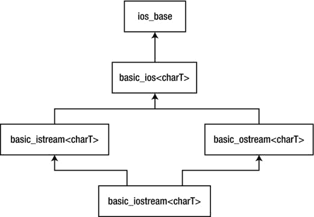
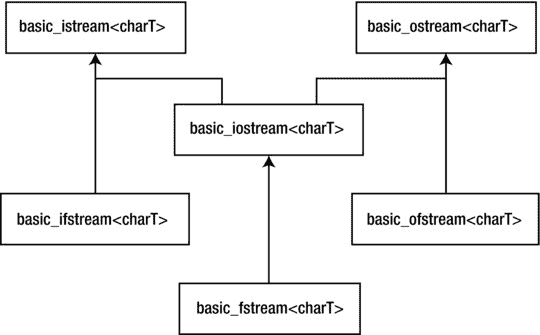
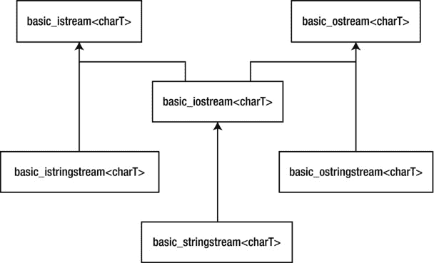

第十九章


iostreams

对于一般的 I/O 问题，你可以做更多的事情，而不仅仅是把标准的 I/O 变成一个类。

如果您可以让所有常见的“容器”——标准 I/O、文件甚至内存块——看起来都一样，以便您只需要记住一个接口，这不是很好吗？这就是`iostreams` 背后的想法。它们比标准 C 库`stdio` *中的各种函数更容易、更安全，有时甚至更高效。*

`iostreams`类通常是新 C++ 程序员学习使用的 C++ 库的第一部分。这一章讨论了`iostreams`是如何改进 C 的`stdio`功能的，并探讨了除标准控制台流之外的文件和字符串流的行为。

为什么是 iostreams？

您可能想知道优秀的旧 C 库有什么问题。为什么不把 C 库“包装”在一个类中就完事了呢？有时这是一个很好的解决方案。例如，假设您想确保由一个`stdio FILE`指针表示的文件总是安全地打开和正确地关闭，而不必依赖用户记住调用`close()`函数。[清单 19-1](#list1) 展示了这样一个尝试。

***[清单 19-1](#_list1)*** 。包装 stdio 文件类

```cpp
//: C19:FileClass.h
// stdio files wrapped.
#ifndef FILECLASS_H
#define FILECLASS_H
#include <cstdio>
#include <stdexcept>

class FileClass {
  std::FILE* f;
public:
  struct FileClassError : std::runtime_error {
    FileClassError(const char* msg)
    : std::runtime_error(msg) {}
  };
  FileClass(const char* fname, const char* mode = "r");
  ∼FileClass();
  std::FILE* fp();
};
#endif // FILECLASS_H ///:∼
```

当您在 C 中执行文件 I/O 时，您使用的是一个指向文件`struct`的裸指针，但是这个类包装了指针，并保证使用构造器和析构函数对其进行正确的初始化和清理。第二个构造器参数是文件模式，默认为“r”表示“读取”

要获取在文件 I/O 函数中使用的指针值，可以使用`fp()`访问函数。清单 19-2 包含了成员函数定义。

***[清单 19-2](#_list2)*** 。实现清单 19-1 中的头文件

```cpp
//: C19:FileClass.cpp {O}
// FileClass Implementation.
#include "FileClass.h" // To be INCLUDED from Header FILE above
#include <cstdlib>
#include <cstdio>
using namespace std;

FileClass::FileClass(const char* fname, const char* mode) {
  if((f = fopen(fname, mode)) == 0)
    throw FileClassError("Error opening file");
}

FileClass::∼FileClass() { fclose(f); }

FILE* FileClass::fp() { return f; } ///:∼
```

构造器像平常一样调用`fopen()`，但是它也确保结果不为零，这表示打开文件失败。如果文件没有按预期打开，将引发异常。

析构函数关闭文件，访问函数`fp()`返回`f`。关于使用`FileClass`的简单例子，见[清单 19-3](#list3) 。

***[清单 19-3](#_list3)*** 。测试清单 19-2 中的实现

```cpp
//: C19:FileClassTest.cpp
//{L} FileClass
#include <cstdlib>
#include <iostream>
#include "FileClass.h"
using namespace std;

int main() {
  try {
    FileClass f("FileClassTest.cpp");
    const int BSIZE = 100;
    char buf[BSIZE];
    while(fgets(buf, BSIZE, f.fp()))
      fputs(buf, stdout);
  } catch(FileClass::FileClassError& e) {
    cout << e.what() << endl;
    return EXIT_FAILURE;
  }
  return EXIT_SUCCESS;
} // File automatically closed by destructor
///:∼
```

您创建了`FileClass`对象，并通过调用`fp()`在普通的 C 文件 I/O 函数调用中使用它。当你用完后，就把它忘掉；文件在其作用域的末尾被析构函数关闭。

尽管`FILE`指针是私有的，但它并不特别安全，因为`fp()`会检索它。既然唯一的效果似乎是保证初始化和清理，为什么不将其公开或者使用一个`struct`来代替呢？请注意，虽然您可以使用`fp()`获得`f`的副本，但是您不能将其分配给`f`——这完全由类控制。在捕获了`fp()`返回的指针后，客户端程序员仍然可以给结构元素赋值，甚至关闭它，所以安全性在于保证一个有效的`FILE`指针，而不是结构的正确内容。

如果你想要完全安全，你必须阻止用户直接访问`FILE`指针，如[清单 19-4](#list4) 所示。所有普通文件 I/O 函数的某个版本必须作为类成员出现，这样你用 C 方法做的一切都可以在 C++ 类中得到。

***[清单 19-4](#_list4)*** 。在 C++ 中隐藏文件 I/O

```cpp
//: C19:Fullwrap.h
// Completely hidden file I/O.
#ifndef FULLWRAP_H
#define FULLWRAP_H
#include <cstddef>
#include <cstdio>
#undef getc
#undef putc
#undef ungetc
using std::size_t;
using std::fpos_t;
class File {
  std::FILE* f;
  std::FILE* F(); // Produces checked pointer to f
public:
  File(); // Create object but don't open file
  File(const char* path, const char* mode = "r");
  ∼File();
  int open(const char* path, const char* mode = "r");
  int reopen(const char* path, const char* mode);
  int getc();
  int ungetc(int c);
  int putc(int c);
  int puts(const char* s);
  char* gets(char* s, int n);
  int printf(const char* format, ...);
  size_t read(void* ptr, size_t size, size_t n);
  size_t write(const void* ptr, size_t size, size_t n);
  int eof();
  int close();
  int flush();
  int seek(long offset, int whence);
  int getpos(fpos_t* pos);
  int setpos(const fpos_t* pos);
  long tell();
  void rewind();
  void setbuf(char* buf);
  int setvbuf(char* buf, int type, size_t sz);
  int error();
  void clearErr();
};
#endif // FULLWRAP_H ///:∼
```

这个类包含了几乎所有来自`<cstdio>`的文件 I/O 函数。注意`vfprintf()`不见了；它实现了`printf()`成员功能。

`File`具有与清单 19-3 中的[相同的构造器，并且它也有一个默认的构造器。如果你想创建一个`File`对象的数组或者使用一个`File`对象作为另一个类的成员，默认的构造器是很重要的，因为初始化不是在构造器中发生的，而是在封闭对象被创建之后的某个时候。](#list3)

默认构造器将私有`FILE`指针`f`设置为零。但是现在，在引用`f`之前，必须检查它的值以确保它不为零。这是通过`F()`完成的，它是`private`，因为它只供其他成员函数使用。(您不想让用户直接访问这个类中的底层`FILE`结构。)

这种方法无论如何都不是一个糟糕的解决方案。它非常实用，您可以想象为标准(控制台)I/O 和内核格式化(读/写一块内存而不是文件或控制台)创建类似的类。

绊脚石是用于变量参数列表函数的运行时解释器。这是在运行时解析你的格式字符串并从变量参数列表中获取和解释参数的代码。这是一个问题，原因有四。

1.  即使你只使用了解释器的一小部分功能，全部内容都会被加载到你的可执行文件中。所以如果你说`printf("%c", 'x');`，你会得到整个包，包括打印浮点数和字符串的部分。没有减少程序占用空间的标准选项。
2.  因为解释是在运行时进行的，所以无法消除性能开销。这很令人沮丧，因为所有的信息在编译时都在格式字符串中，但是直到运行时才会被计算。然而，如果您可以在编译时解析格式字符串中的参数，您就可以直接调用函数，这有可能比运行时解释器快得多(尽管`printf()`函数族通常已经过很好的优化)。
3.  因为直到运行时才计算格式字符串，所以不可能有编译时错误检查。如果您曾试图寻找因在`printf()`语句中使用错误的参数数量或类型而导致的错误，您可能对这个问题很熟悉。C++ 非常重视编译时错误检查，以便尽早发现错误，让您的生活更轻松。抛弃 I/O 库的类型安全似乎是一种耻辱，尤其是在 I/O 被大量使用的情况下。
4.  对于 C++，最关键的问题是`printf()`函数族不是特别具有可扩展性。它们实际上被设计成只处理 C 语言中的基本数据类型(`char`、`int`、`float`、`double`、`wchar_t`、`char*`、`wchar_t*`和`void*)`以及它们的变体。您可能认为每次添加一个新类时，您都可以添加重载的`printf()`和`scanf()`函数(以及它们的文件和字符串变体)，但是请记住，重载函数必须在它们的参数列表中有不同的类型，并且`printf()`系列在格式字符串和变量参数列表中隐藏了它的类型信息。对于像 C++ 这样的语言来说，其目标是能够容易地添加新的数据类型，这是一个不可接受的限制。

拯救之流

这些问题清楚地表明 I/O 是标准 C++ 类库的首要任务之一。因为“Hello，World”是几乎每个人都用新语言编写的第一个程序，并且因为 I/O 是几乎每个程序的一部分，所以 C++ 中的 I/O 库必须特别容易使用。它还面临着更大的挑战，即它必须适应任何新的类别。因此，它的约束要求这个基础类库是一个真正有灵感的设计。除了在处理 I/O 和格式化时获得大量的杠杆作用和清晰性，你还将在本章中看到一个真正强大的 C++ 库是如何工作的。

此时，我们在清单 19-5 的[中引入了一些日期类文件。](#list5)

***[清单 19-5](#_list5)*** 。日期类文件

```cpp
//: C19:Date.h
*#ifndef DATE_H*
*#define DATE_H*
*#include <string>*
*#include <stdexcept>*
*#include <iosfwd>*
class Date {
  int year, month, day;
  int compare(const Date&) const;
  static int daysInPrevMonth(int year, int mon);
public:
  *// A class for date calculations*
  struct Duration {
    int years, months, days;
    Duration(int y, int m, int d)
    : years(y), months(m) ,days(d) {}
  };
  *// An exception class*
  struct DateError : public std::logic_error {
    DateError(const std::string& msg = "")
: std::logic_error(msg) {}
  };
  Date();
  Date(int, int, int) throw(DateError);
  Date(const std::string&) throw(DateError);
  int getYear() const;
  int getMonth() const;
  int getDay() const;
  std::string toString() const;
  friend Duration duration(const Date&, const Date&);
  friend bool operator<(const Date&, const Date&);
  friend bool operator<=(const Date&, const Date&);
  friend bool operator>(const Date&, const Date&);
  friend bool operator>=(const Date&, const Date&);
  friend bool operator==(const Date&, const Date&);
  friend bool operator!=(const Date&, const Date&);
  friend std::ostream& operator<<(std::ostream&,
                                  const Date&);
  friend std::istream& operator>>(std::istream&, Date&);
};
#endif *// DATE_H ///:∼*

*//:*
C19:Date.cpp {O}
*#include "Date.h"    // To be INCLUDED from Header FILE above*
*#include <iostream>*
*#include <sstream>*
*#include <cstdlib>*
*#include <string>*
*#include <algorithm> // For swap()*
*#include <ctime>*
*#include <cassert>*
*#include <iomanip>*
*using namespace std;*
namespace {
  const int daysInMonth[][13] = {
    { 0, 31, 28, 31, 30, 31, 30, 31, 31, 30, 31, 30, 31 },
    { 0, 31, 29, 31, 30, 31, 30, 31, 31, 30, 31, 30, 31 }
  };
  inline bool isleap(int y) {
    return y%4 == 0 && y%100 != 0 || y%400 == 0;
  }
}
Date::Date() {
  *// Get current date*
  time_t tval = time(0);
  struct tm *now = localtime(&tval);
  year = now->tm_year + 1900;
  month = now->tm_mon + 1;
  day = now->tm_mday;
}
Date::Date(int yr,int mon,int dy) throw(Date::DateError) {
  if(!(1 <= mon && mon <= 12))
    throw DateError("Bad month in Date ");
  if(!(1 <= dy && dy <= daysInMonth[isleap(year)][mon]))
    throw DateError("Bad day in Date ");
  year = yr;
  month = mon;
  day = dy;
}
Date::Date(const std::string& s) throw(Date::DateError) {
  *// Assume YYYYMMDD format*
  if(!(s.size() == 8))
    throw DateError("Bad string in Date ");
  for(int n = 8; --n >= 0;)
    if(!isdigit(s[n]))
      throw DateError("Bad string in Date ");
  string buf = s.substr(0, 4);
  year = atoi(buf.c_str());
  buf = s.substr(4, 2);
  month = atoi(buf.c_str());
  buf = s.substr(6, 2);
  day = atoi(buf.c_str());
  if(!(1 <= month && month <= 12))
    throw DateError("Bad month in Date ");
if(!(1 <= day && day <=
  daysInMonth[isleap(year)][month]))
    throw DateError("Bad day in Date ");
}
int Date::getYear() const { return year; }
int Date::getMonth() const { return month; }
int Date::getDay() const { return day; }
string Date::toString() const {
  ostringstream os;
  os.fill('0');
  os << setw(4) << year
     << setw(2) << month
     << setw(2) << day;
  return os.str();
}
int Date::compare(const Date& d2) const {
  int result = year - d2.year;
  if(result == 0) {
    result = month - d2.month;
    if(result == 0)
      result = day - d2.day;
  }
  return result;
}
int Date::daysInPrevMonth(int year, int month) {
  if(month == 1) {
    --year;
    month = 12;
  }
  else
    --month;
  return daysInMonth[isleap(year)][month];
}
bool operator<(const Date& d1, const Date& d2) {
  return d1.compare(d2) < 0;
}
bool operator<=(const Date& d1, const Date& d2) {
  return d1 < d2 || d1 == d2;
}
bool operator>(const Date& d1, const Date& d2) {
  return !(d1 < d2) && !(d1 == d2);
}
bool operator>=(const Date& d1, const Date& d2) {
  return !(d1 < d2);
}
bool operator==(const Date& d1, const Date& d2) {
  return d1.compare(d2) == 0;
}
bool operator!=(const Date& d1, const Date& d2) {
  return !(d1 == d2);
}
Date::Duration
duration(const Date& date1, const Date& date2) {
  int y1 = date1.year;
  int y2 = date2.year;
  int m1 = date1.month;
  int m2 = date2.month;
  int d1 = date1.day;
  int d2 = date2.day;
  *// Compute the compare*
  int order = date1.compare(date2);
  if(order == 0)
    return Date::Duration(0,0,0);
  else if(order > 0) {
    *// Make date1 precede date2 locally*
    using std::swap;
    swap(y1, y2);
    swap(m1, m2);
    swap(d1, d2);
  }
  int years = y2 - y1;
  int months = m2 - m1;
  int days = d2 - d1;
  assert(years > 0 ||
     years == 0 && months > 0 ||
     years == 0 && months == 0 && days > 0);

  *// Do the obvious corrections (must adjust days before months!)*
*// This is a loop in case the previous month is February, and days < -28.*
  int lastMonth = m2;
  int lastYear = y2;
  while(days < 0) {
    *// Borrow from month*
    assert(months > 0);
    days += Date::daysInPrevMonth(
      lastYear, lastMonth--);
    --months;
  }
  if(months < 0) {
    *// Borrow from year*
    assert(years > 0);
    months += 12;
    --years;
  }
  return Date::Duration(years, months, days);
}
ostream& operator<<(ostream& os, const Date& d) {
  char fillc = os.fill('0');
  os << setw(2) << d.getMonth() << '-'
     << setw(2) << d.getDay() << '-'
     << setw(4) << setfill(fillc) << d.getYear();
  return os;
}
istream& operator>>(istream& is, Date& d) {
  is >> d.month;
  char dash;
  is >> dash;
  if(dash != '-')
    is.setstate(ios::failbit);
  is >> d.day;
  is >> dash;
  if(dash != '-')
    is.setstate(ios::failbit);
  is >> d.year;
  return is;
} *///:∼*

```

插入器和提取器

*流*是传输和格式化固定宽度字符的对象。你可以拥有一个输入流(通过`istream`类的后代)，一个输出流(带有`ostream`对象)，或者同时拥有两者的流(带有从`iostream`派生的对象)。`iostreams`库提供了不同类型的类:用于文件的`ifstream`、`ofstream`和`fstream`，以及用于与标准 C++ `string`类接口的`istringstream`、`ostringstream`和`stringstream`。所有这些流类都有几乎相同的接口，因此您可以以统一的方式使用流，无论您是处理文件、标准 I/O、内存区域还是`string`对象。您学习的单一接口也适用于为支持新类而添加的扩展。有些函数实现您的格式化命令，有些函数在没有格式化的情况下读写字符。

前面提到的流类实际上是模板专门化，很像标准的`string`类是`basic_string`模板的专门化。`iostreams`继承层次中的基本类如图[图 19-1](#Fig1) 所示。



[图 19-1](#_Fig1) 。显示 IOSTREAM 继承层次结构中的基本类

`ios_base`类声明所有流共有的一切，与流处理的字符类型无关。这些声明大部分是常量和管理它们的函数，其中一些你会在本章看到。其余的类是以底层字符类型作为参数的模板。例如，`istream`类定义如下:

```cpp
typedef basic_istream<char> istream;
```

前面提到的所有类都是通过类似的类型定义来定义的。还有使用`wchar_t`(宽字符类型)代替`char`的所有流类的类型定义。你会在本章末尾看到这些。`basic_ios`模板定义了输入和输出通用的函数，但这取决于底层的字符类型(你不会经常用到)。模板`basic_istream`为输入定义了通用函数，`basic_ostream`为输出做了同样的事情。稍后介绍的文件和字符串流类为它们特定的流类型添加了功能。

在`iostreams`库中，两个操作符被重载以简化 iostreams 的使用。操作员`<<`通常被称为 iostreams 的*插入器*，操作员`>>`通常被称为*提取器*。

提取器根据目的对象的类型解析它所期望的信息。要查看这方面的示例，您可以使用`cin`对象，它是 C 语言中`stdin`的 iostream 等价物，即可重定向的标准输入。每当包含`<iostream>`标题时，这个对象都是预定义的，比如:

```cpp

 int i;
 cin >> i;

 float f;
 cin >> f;

char c;
 cin >> c;

char buf[100];
 cin >> buf;
```

每个内置数据类型都有一个重载的`operator>>`。你也可以重载你自己的，稍后你会看到。

为了找出你在各种变量中有什么，你可以使用`cout`对象(对应标准输出；还有一个`cerr`对象对应于标准误差)和插入器`<<`，如:

```cpp
cout << "i = ";
cout << i;
cout << "\n";
cout << "f = ";
cout << f;
cout << "\n";
cout << "c = ";
cout << c;
cout << "\n";
cout << "buf = ";
cout << buf;
cout << "\n";
```

尽管类型检查有所改进，但这很乏味，看起来并不比`printf()`有多大改进。幸运的是，重载的插入器和提取器被设计成链接成一个更复杂的表达式，更容易*写* ( *读*):

```cpp
cout << "i = " << i << endl;
cout << "f = " << f << endl;

cout << "c = " << c << endl;
cout << "buf = " << buf << endl;
```

为你自己的类定义插入器和提取器只是重载相关的操作符来做正确的事情，即:

*   使第一个参数成为流的非`const`引用(`istream`表示输入，`ostream`表示输出)。
*   通过向/从流中插入/提取数据来执行操作(通过处理对象的组件)。
*   返回对流的引用。

流应该是非`const`的，因为处理流数据会改变流的状态。通过返回流，可以在一条语句中链接流操作，如前所示。

例如，考虑如何以 MM-DD-YYYY 格式输出一个`Date`对象的表示。以下插入器完成工作:

```cpp
ostream& operator<<(ostream& os, const Date& d) {
  char fillc = os.fill('0');
  os << setw(2) << d.getMonth() << '-'
     << setw(2) << d.getDay() << '-'
     << setw(4) << setfill(fillc) << d.getYear();
  return os;
}
```

此函数不能是`Date`类的成员，因为`<<`运算符的左操作数必须是输出流。`ostream`的`fill()`成员函数改变由*操纵器* `setw()`决定的输出字段宽度大于数据所需宽度时使用的填充字符。您使用“0”字符，这样十月之前的月份将显示前导零，例如“09”表示九月。`fill()`函数还返回前一个填充字符(默认为一个空格)，以便您稍后可以使用操纵器`setfill()`恢复它。我将在本章后面深入讨论操纵器。

提取器需要多一点小心，因为输入数据可能会出错。通知流错误的方法是设置流的*失败位*，如下所示:

```cpp
istream& operator>>(istream& is, Date& d) {
  is >> d.month;
  char dash;
  is >> dash;
  if(dash != '-')
    is.setstate(ios::failbit);
  is >> d.day;
  is >> dash;
  if(dash != '-')
    is.setstate(ios::failbit);
  is >> d.year;
  return is;
}
```

当流中的错误位被置位时，所有进一步的流操作都被忽略，直到流恢复到良好状态(稍后解释)。这就是为什么即使`ios::failbit`被设置，上面的代码也继续提取。这个实现有些宽容，因为它允许日期字符串中的数字和破折号之间有空白(因为在读取内置类型时，`>>`操作符默认跳过空白)。

以下是此提取器的有效日期字符串:

```cpp
"08-10-2003"
"8-10-2003"
"08 - 10 - 2003"
```

但这些不是:

```cpp
"A-10-2003"  // No alpha characters allowed
"08%10/2003" // Only dashes allowed as a delimiter
```

我将在本章后面的“处理流错误”一节中更深入地讨论流状态。

常见用法

正如`Date`提取器所示，您必须警惕错误的输入。如果输入产生了一个意外的值，那么这个过程就是偏斜的，并且很难恢复。此外，格式化输入默认为空白分隔符。考虑一下当你把本章前面的代码片段收集到一个程序中会发生什么，如清单 19-6 所示。

***[清单 19-6](#_list6)*** 。阐释 iostream 示例

```cpp
//: C19:Iosexamp.cpp {RunByHand}
// iostream examples.
#include <iostream>
using namespace std;

int main() {
  int i;
  cin >> i;

  float f;
  cin >> f;
  char c;
  cin >> c;

  char buf[100];
  cin >> buf;

  cout << "i = " << i << endl;
  cout << "f = " << f << endl;
  cout << "c = " << c << endl;
  cout << "buf = " << buf << endl;

  cout << flush;
  cout << hex << "0x" << i << endl;
} ///:∼
```

让我们给它以下输入:

```cpp
12 1.4 c this is a test
```

我们期待同样的输出，就好像我们给了它一样

```cpp
12
1.4
c
this is a test
```

有点出乎意料的是，

```cpp
i = 12
f = 1.4
c = c
buf = this
0xc
```

注意，`buf`只得到第一个单词，因为输入例程寻找一个空格来分隔输入，它在“this”之后看到了*此外，如果连续的输入字符串比分配给`buf`的存储空间长，就会使缓冲区溢出。*

实际上，您通常希望从交互式程序中以字符序列的形式一次一行地获取输入，扫描它们，然后在它们安全地进入缓冲区时执行转换。这样你就不需要担心输入程序会被意外的数据阻塞。

另一个考虑是命令行界面的整体概念。在过去，当控制台比玻璃打字机好不了多少时，这是有意义的，但世界正在迅速改变，图形用户界面(GUI)占据主导地位。在这样的世界里，控制台 I/O 的意义是什么？除了简单的例子或测试，完全忽略`cin`更有意义，并采取以下方法。

1.  如果你的程序需要输入，从一个文件中读取输入——你很快就会发现用`iostreams`使用文件非常容易。`iostreams`对于文件来说，在 GUI 中仍然可以很好地工作。
2.  正如刚才建议的那样，读取输入，不要试图转换它。当输入在转换过程中不会出错时，您可以安全地扫描它。
3.  产量不一样。如果您使用 GUI，`cout`不一定有效，您必须将它发送到一个文件(这与发送到`cout`是一样的)或使用 GUI 工具来显示数据。否则，把它送给`cout`通常是有意义的。在这两种情况下，iostreams 的输出格式化功能都非常有用。

另一种常见的做法是节省大型项目的编译时间。例如，考虑如何在头文件中声明本章前面介绍的`Date`流操作符。您只需要包含函数的原型，所以没有必要在`Date.h`中包含整个`<iostream>`头。标准的做法是只声明类，就像这样:

```cpp
class ostream;
```

这是一种将接口与实现分离的古老技术，通常被称为*前向声明*(此时`ostream`将被视为*不完整类型*，因为编译器尚未看到类定义)。

然而，由于两个原因，这样做是行不通的。

1.  流类在`std`名称空间中定义。
2.  它们是模板。

正确的声明应该是

```cpp
namespace std {
  template<class charT, class traits = char_traits<charT>>
    class basic_ostream;
  typedef basic_ostream<char> ostream;
}
```

(如您所见，与`string`类一样，streams 类也使用字符特征类)。因为为您想要引用的每个流类键入所有这些内容非常繁琐，所以标准提供了一个头文件来为您完成这项工作:`<iosfwd>`。`Date`头(见上)看起来会像这样:

```cpp
// Date.h
#include <iosfwd>

class Date {
 friend std::ostream& operator<<(std::ostream&, const      Date&);
  friend std::istream& operator>>(std::istream&, Date&);
  // Etc.

```

面向行的输入

要一次抓取一行输入，您有三种选择。

1.  成员函数`get()`
2.  成员函数`getline()`
3.  在`<string>`标题中定义的全局函数`getline()`

前两个函数有三个参数。

1.  指向存储结果的字符缓冲区的指针。
2.  缓冲区大小(因此不会溢出)。
3.  终止字符，知道何时停止读取输入。

终止字符有一个默认值`'\n'`，这是您通常会使用的。当两个函数在输入中遇到终止字符时，它们在结果缓冲区中存储一个零。

那有什么区别呢？微妙但重要的是:`get()`在*看到输入流中的分隔符*时停止，但它没有从输入流中提取它。因此，如果您使用相同的分隔符执行另一个`get()`,它将立即返回，并且不获取输入。(大概，你要么在下一个`get()`语句中使用不同的分隔符，要么使用不同的输入函数*。*)另一方面，`getline()`函数从输入流中提取分隔符，但仍然不将它存储在结果缓冲区中。

`<string>`中定义的`getline()`函数很方便。它不是一个成员函数，而是一个在名称空间`std`中声明的独立函数。它只需要两个非默认参数，输入流和`string`对象来填充。就像它的名字一样，它读取字符，直到遇到第一个出现的分隔符(默认情况下是`'\n'`)并消耗和丢弃该分隔符。这个函数的优点是它读入一个`string`对象，所以你不需要担心缓冲区的大小。

一般来说，当你在处理一个文本文件时，你一次读一行，你会想要使用一个`getline()`函数。

get_)的重写版本

`get()`函数还有另外三个重载版本:一个没有参数，使用`int`返回值返回下一个字符；使用引用将字符填充到其`char`参数中的函数；一个直接存储到另一个`iostream`对象的底层缓冲区结构中。

 **注**后者将在本章后面探讨。

读取原始字节

如果您确切地知道您正在处理什么，并且想要将字节直接移动到内存中的变量、数组或结构中，您可以使用无格式的 I/O 函数`read()`。这个函数的第一个参数是指向目标内存的指针，第二个参数是要读取的字节数。如果您之前已经将信息存储到了一个文件中，例如，使用互补的`write()`成员函数将信息以二进制形式存储到了一个输出流中(当然，使用的是同一个编译器)，那么这将非常有用。稍后您将看到所有这些函数的示例。

处理流错误

前面显示的`Date`提取器在特定条件下设置流的失败位。用户如何知道这样的故障何时发生？您可以通过调用某些流成员函数来检测流错误，以查看是否发生了错误状态，或者如果您不关心特定的错误是什么，您可以只在布尔上下文中评估流。这两种技术都源自流的错误位的状态。

流状态

从`ios`派生的`ios_base`类定义了四个标志，如[表 19-1](#Tab1) 所示，你可以用它们来测试一个流的状态。

[表 19-1](#_Tab1) 。测试流状态的四个标志

| 旗 | 意义 |
| --- | --- |
| `Badbit` | 发生了一些致命的(可能是物理的)错误。该流应被视为不可用。 |
| `Eofbit` | 输入结束已发生(通过遇到文件流的物理结尾或通过用户终止控制台流，如使用 Ctrl-Z 或 Ctrl-D)。 |
| `Failbit` | I/O 操作失败，很可能是因为无效数据(例如，在尝试读取数字时发现字母)。该流仍然可用。当输入结束时，failbit 标志也会置位。 |
| `Goodbit` | 一切都好；没有错误。输入结束尚未发生。 |

您可以通过调用相应的成员函数来测试这些条件是否已经发生，这些函数返回一个布尔值来指示这些条件是否已经设置。如果其他三个位都没有设置，则`good()`流成员函数返回 true。如果`eofbit`被设置，函数`eof()`返回 true，这发生在试图从没有更多数据的流(通常是文件)中读取时。因为在 C++ 中，当试图读取物理介质的末尾时会发生输入结束，所以`failbit`也被设置为指示“预期的”数据没有被成功读取。如果*`failbit`或`badbit`被置位，则`fail()`函数返回真，如果`badbit`被置位，则`bad()`仅*返回真。**

 *一旦流状态中的任何错误位被设置，它们就保持设置状态，这并不总是您想要的。读取文件时，您可能希望在文件结束之前重新定位到文件中更早的位置。仅仅移动文件指针不会自动复位`eofbit`或`failbit`；你必须自己用`clear()`函数来做，就像这样:

```cpp
myStream.clear(); // Clears all error bits
```

调用`clear()`后，如果立即调用，`good()`将返回`true`。正如您在前面的`Date`提取器中看到的，`setstate()`函数设置您传递给它的位。结果是`setstate()`不会影响任何其他位——如果它们已经被设置，它们将保持设置。如果您想要设置某些位，但同时重置所有其他位，您可以调用重载版本的`clear()`，向其传递表示您想要设置的位的按位表达式，如:

```cpp
myStream.clear(ios::failbit | ios::eofbit);
```

大多数时候，您不会对单独检查流状态位感兴趣。通常你只是想知道是否一切都好。从头到尾读一个文件就是这种情况；您只想知道输入数据何时用完。您可以使用为`void*`定义的转换函数，当布尔表达式中出现流时会自动调用该函数。使用这个习惯用法读取一个流，直到输入结束，如下所示:

```cpp
int i;
while(myStream >> i)
  cout << i << endl;
```

记住`operator>>()`返回它的流参数，所以上面的`while`语句将流作为布尔表达式进行测试。这个特殊的例子假设输入流`myStream`包含由空格分隔的整数。函数`ios_base::operator void*()`简单地在它的流上调用`good()`并返回结果。因为大多数流操作返回它们的流，所以使用这个习惯用法很方便。

流和异常

早在异常出现之前，它就已经作为 C++ 的一部分存在了，所以手动检查流状态只是一种方式。为了向后兼容，这仍然是现状，但是现代的`iostreams`可以抛出异常来代替。`exceptions()`流成员函数接受一个参数，该参数表示您希望抛出异常的状态位。每当流遇到这样的状态，它抛出一个类型为`std::ios_base::failure`的异常，该异常继承自`std::exception`。

尽管您可以为四种流状态中的任何一种触发失败异常，但是为所有这些状态启用异常不一定是个好主意。正如[第 17 章](17.html)所解释的那样，对于真正异常的情况使用异常，但是文件结束不仅是*而不是*异常——它是*预期的*！出于这个原因，您可能希望仅对由`badbit`表示的错误启用异常，您可以这样做:

```cpp
myStream.exceptions(ios::badbit);
```

您可以逐流启用异常，因为`exceptions()`是流的成员函数。`exceptions()`函数返回一个位掩码(类型为`iostate`，这是一种依赖于编译器的类型，可转换为`int`)，指示哪些流状态会导致异常。如果已经设置了这些状态，则会立即引发异常。当然，如果您使用与流相关的异常，您最好准备好捕捉它们，这意味着您需要用一个具有`ios::failure`处理程序的`try`块包装所有的流处理。许多程序员觉得这很乏味，只是手动检查他们预计会发生错误的状态(因为，例如，他们不希望`bad()`在大多数情况下返回`true`)。这是让流抛出异常是可选的而不是默认的另一个原因。在任何情况下，您都可以选择想要如何处理流错误。出于我建议在其他上下文中使用异常进行错误处理的同样原因，我在这里也这样做。

文件流

使用`iostreams`操作文件比在 c 语言中使用`stdio`要容易和安全得多。你所要做的就是创建一个对象——由构造器来完成这项工作。你不需要显式关闭一个文件(尽管你可以使用`close()`成员函数)，因为当对象超出范围时析构函数会关闭它。要创建默认为输入的文件，创建一个`ifstream`对象。要创建一个默认为输出的对象，创建一个`ofstream`对象。一个`fstream`对象既可以做输入也可以做输出。

文件流类归入`iostreams`类，如图 19-2 中的[所示。](#Fig2)



[图 19-2](#_Fig2) 。展示了文件流类如何适应 iostream 继承层次结构

和以前一样，您实际使用的类是由类型定义定义的模板专门化。例如，`ifstream`处理`char`的文件，定义为

```cpp
typedef basic_ifstream<char> ifstream;

```

文件处理示例

[清单 19-7](#list7) 显示了迄今为止讨论过的许多特性。注意包含了`<fstream>`来声明文件 I/O 类。尽管在许多平台上这也会自动包含`<iostream>`，但编译器并不需要这样做。如果你想要可移植的代码，总是包括两个头。

***[清单 19-7](#_list7)*** 。用文件说明流 I/O

```cpp
//: C19:Strfile.cpp
// Stream I/O with files;
// The difference between get() & getline().
#include <fstream>
#include <iostream>
#include "../require.h"          // To be INCLUDED from *[Chapter 9](09.html)*
using namespace std;

int main() {
  const int SZ = 100;            // Buffer size;
  char buf[SZ];
  {
    ifstream in("Strfile.cpp");  // Read
    assure(in, "Strfile.cpp");   // Verify open
    ofstream out("Strfile.out"); // Write
    assure(out, "Strfile.out");
    int i = 1; // Line counter
     // A less-convenient approach for line input:
    while(in.get(buf, SZ)) {     // Leaves \n in input
      in.get(); // Throw away next character (\n)
      cout << buf << endl;       // Must add \n
      // File output just like standard I/O:
      out << i++ << ": " << buf << endl;
    }
  } // Destructors close in & out
  ifstream in("Strfile.out");
  assure(in, "Strfile.out");
  // More convenient line input:
  while(in.getline(buf, SZ)) {   // Removes \n
    char* cp = buf;
    while(*cp != ':')
      ++cp;
    cp += 2; // Past ": "
    cout << cp << endl;
      // Must still add \n
  }
} ///:∼
```

在创建了`ifstream`和`ofstream`之后，会有一个`assure()`来保证文件被成功打开。这里，在编译器期望布尔结果的情况下使用的对象产生一个指示成功或失败的值。

第一个`while`循环演示了两种形式的`get()`函数的使用。第一个将字符放入缓冲区，并在读取了`SZ-1`字符或遇到第三个参数(默认为`'\n'`)时将零终止符放入缓冲区。`get()`函数在输入流中留下了终止符，所以这个终止符必须通过`in.get()`使用不带参数的`get()`的形式丢弃，它获取一个字节并作为`int`返回。您也可以使用`ignore()`成员函数，它有两个默认参数。第一个参数是要丢弃的字符数，默认为 1。第二个参数是`ignore()`函数退出(提取后)的字符，默认为`EOF`。

接下来，您会看到两条看起来相似的输出语句:一条是针对`cout`的，一条是针对文件`out`的。注意这里的便利性——你不需要担心对象类型，因为格式化语句对所有的`ostream`对象都是一样的。第一个将该行回显到标准输出中，第二个将该行写出到新文件中，并包含一个行号。

为了演示`getline()`，打开您刚刚创建的文件，去掉行号。要确保在打开文件进行读取之前将其正确关闭，您有两种选择。您可以用大括号将程序的第一部分括起来，迫使`out`对象超出作用域，从而调用析构函数并关闭文件，这里就完成了。您也可以调用`close()`来获取这两个文件；如果这样做，您甚至可以通过调用`open()`成员函数来重用`in`对象。

第二个`while`循环展示了当遇到终止符时`getline()`如何从输入流中移除终止符(它的第三个参数，默认为`'\n'`)。虽然`getline()`和`get()`一样，在缓冲区中放了一个零，但还是没有插入终止符。

这个例子，以及本章中的大多数例子，假设对任何重载`getline()`的每个调用都会遇到一个换行符。如果不是这样，流的`eofbit`状态将被设置，对`getline()`的调用将返回`false`，导致程序丢失最后一行输入。

打开模式

通过重写构造器的默认参数，可以控制文件的打开方式。[表 19-2](#Tab2) 显示了控制文件模式的标志。

[表 19-2](#_Tab2) 。控制文件模式的标志

| 旗 | 功能 |
| --- | --- |
| `ios::in` | 打开一个输入文件。将此用作`ofstream`的打开模式，以防止截断现有文件。 |
| `ios::out` | 打开输出文件。用于不带`ios::app`、`ios::ate`或`ios::in`的`ofstream`时，隐含`ios::trunc`。 |
| `ios::app` | 打开仅用于追加的输出文件。 |
| `ios::ate` | 打开一个现有文件(输入或输出)并查找到结尾。 |
| `ios::trunc` | 如果旧文件已经存在，则截断旧文件。 |
| `ios::binary` | 以*二进制模式*打开文件。默认为*文本模式*。 |

您可以使用按位*或*操作来组合这些标志。

尽管二进制标志是可移植的，但它只对某些非 UNIX 系统有效，例如从 MS-DOS 派生的操作系统，这些系统有存储行尾分隔符的特殊约定。例如，在文本模式(这是默认模式)的 MS-DOS 系统上，每次输出一个换行符(`'\n'`)，文件系统实际上输出两个字符，一个回车/换行符对(CRLF)，也就是一对 ASCII 字符`0x0D`和`0x0A`。相反，当您在文本模式下将这样一个文件读回内存时，这对字节的每一次出现都会导致一个`'\n'`被发送到程序的相应位置。如果想绕过这种特殊处理，可以用二进制模式打开文件。二进制模式与你*能否*将原始字节写入文件没有任何关系——你*总能*做到(通过调用`write()`)。然而，当您使用`read()`或`write()`时，您应该以二进制模式打开文件，因为这些函数需要一个字节计数参数。在这些情况下，拥有额外的`'\r'`字符会影响字节数。如果你要使用本章后面讨论的流定位命令，你也应该以二进制模式打开一个文件。

您可以通过声明一个`fstream`对象来打开一个输入和输出文件。当声明一个`fstream`对象时，您必须使用前面提到的足够多的开放模式标志来让文件系统知道您是想要输入、输出还是两者都要。要从输出切换到输入，您需要刷新流或更改文件位置。要从输入更改为输出，请更改文件位置。要通过一个`fstream`对象创建一个文件，在构造器调用中使用`ios::trunc` open mode 标志进行输入和输出。

iostream 缓冲

良好的设计实践表明，无论何时创建一个新的类，都应该尽可能对类的用户隐藏底层实现的细节。你只给他们看他们需要知道的，其余的则让他们看以免混淆。当使用插入器和提取器时，您通常不知道或不关心字节在哪里产生或消耗，也不知道或不关心您处理的是标准 I/O、文件、内存还是一些新创建的类或设备。

然而，有时与产生和消耗字节的`iostream`部分进行通信是很重要的。为了给这个部分提供一个公共接口，同时仍然隐藏它的底层实现，标准库将它抽象成自己的类，称为`streambuf`。每个`iostream`对象都包含一个指向某种`streambuf`的指针。

 **注意**类型取决于它是否处理标准 I/O、文件、内存等等。

可以直接访问`streambuf`；例如，您可以将原始字节移入和移出`streambuf`，而无需通过封闭的`iostream`对它们进行格式化。这是通过调用`streambuf`对象的成员函数来完成的。

目前，您需要知道的最重要的事情是，每个`iostream`对象都包含一个指向`streambuf`对象的指针，并且`streambuf`对象有一些您可以在必要时调用的成员函数。对于文件和字符串流，有专门类型的流缓冲区，如图 19-3 所示。


[图 19-3](#_Fig3) 。显示文件和字符串的专用流缓冲区

为了允许你访问`streambuf`，每个`iostream`对象都有一个名为`rdbuf()`的成员函数，它返回指向对象`streambuf`的指针。这样你可以调用底层`streambuf`的任何成员函数。然而，您可以用`streambuf`指针做的最有趣的事情之一是使用`<<`操作符将它连接到另一个`iostream`对象。这将把你的对象中的所有字符都排到`<<`左侧的对象中。如果你想把所有的字符从一个`iostream`移动到另一个`iostream`，你不需要经历一次读一个字符或一行的繁琐(和潜在的编码错误)。这是一种更优雅的方法。[清单 19-8](#list8) 打开一个文件并将内容发送到标准输出(类似于前面的例子)。

***[清单 19-8](#_list8)*** 。将文件键入标准输出

```cpp
//: C19:Stype.cpp
// Type a file to standard output.
#include <fstream>
#include <iostream>
#include "../require.h"
using namespace std;

int main() {
  ifstream in("Stype.cpp");
  assure(in, "Stype.cpp");
  cout << in.rdbuf(); // Outputs entire file
} ///:∼
```

使用该程序的源代码文件作为参数创建一个`ifstream`。如果文件无法打开，函数`assure()`会报告失败。所有的工作都真实地发生在声明中

```cpp
cout << in.rdbuf();
```

它将文件的全部内容发送到`cout`。这不仅更简洁，而且通常比一次移动一个字节更有效。

一种形式的`get()`直接写入另一个对象的`streambuf`。第一个参数是对目的地`streambuf`的引用，第二个参数是终止字符(默认为`'\n'`，它停止了`get()`功能。所以还有另一种方法将文件打印成标准输出，如清单 19-9 所示。

***[清单 19-9](#_list9)*** 。将文件复制到标准输出

```cpp
//: C19:Sbufget.cpp
// Copies a file to standard output.
#include <fstream>
#include <iostream>
#include "../require.h"
using namespace std;

int main() {
  ifstream in("Sbufget.cpp");
  assure(in);
  streambuf& sb = *cout.rdbuf();
  while(!in.get(sb).eof()) {
    if(in.fail())           // Found blank line
      in.clear();
    cout << char(in.get()); // Process '\n'
  }
} ///:∼
```

`rdbuf()`函数返回一个指针，所以它必须被解引用以满足函数查看对象的需要。流缓冲区不应该被复制(它们没有复制构造器)，所以您将`sb`定义为对`cout`的流缓冲区的*引用*。您需要调用`fail()`和`clear()`，以防输入文件有空行(这个就是)。当这个特定的重载版本的`get()`在一行中看到两个新行(空行的证据)时，它设置输入流的 fail 位，因此您必须调用`clear()`来重置它，以便可以继续读取流。对`get()`的第二次调用提取并回显每个换行符。(记住，`get()`函数不像`getline()`和*那样提取它的分隔符。*)

您可能不需要经常使用这样的技术，但是知道它的存在是很好的。

在 iostreams 中搜索

每种类型的`iostream`都有一个概念，即它的“下一个”角色将来自哪里(如果是`istream` ) *或* go(如果是`ostream`)。在某些情况下，您可能想要移动这个流位置。您可以使用两种模型来实现这一点:一种使用流中的绝对位置，称为`streampos`；第二种工作方式类似于文件的标准 C 库函数`fseek()`，从文件的开头、结尾或当前位置移动给定数量的字节。

`streampos`方法要求您首先调用一个“tell”函数:`ostream`的`tellp()`或`istream`的`tellg()`。(“p”指的是*放指针*,“g”指的是*取指针*。)这个函数返回一个`streampos`,当您想要返回到流中的那个位置时，您可以稍后在对`ostream`的`seekp()`或对`istream`的`seekg()`的调用中使用这个函数。

第二种方法是相对查找，使用重载版本的`seekp()`和`seekg()`。第一个参数是要移动的字符数:它可以是正数，也可以是负数。第二个参数是寻道地点/位置，如[表 19-3](#Tab3) 所示。

[表 19-3](#_Tab3) 。任何 C++ 流中的三个查找位置

| ios::beg | 从流的开始 |
| --- | --- |
| `ios::cur` | 流中的当前位置 |
| `ios::end` | 从流的末尾 |

[清单 19-10](#list10) 显示了在文件中的移动，但是记住，你并不局限于在文件中查找，就像你使用 C 的`stdio`一样。使用 C++，您可以在任何类型的 iostream 中进行查找(尽管标准流对象，如`cin`和`cout`，明确不允许这样做)。

***[清单 19-10](#_list10)*** 。在 iostreams 中寻找的演示

```cpp
//: C19:Seeking.cpp
// Seeking in iostreams.
#include <cassert>
#include <cstddef>
#include <cstring>
#include <fstream>
#include "../require.h"
using namespace std;

int main() {
  const int STR_NUM = 5, STR_LEN = 30;
  char origData[STR_NUM][STR_LEN] = {
    "Hickory dickory dus. . .",
    "Are you tired of C++?",
    "Well, if you have,",
    "That's just too bad,",
    "There's plenty more for us!"
  };
  char readData[STR_NUM][STR_LEN] = {{ 0 }};
  ofstream out("Poem.bin", ios::out | ios::binary);
  assure(out, "Poem.bin");
  for(int i = 0; i < STR_NUM; i++)
    out.write(origData[i], STR_LEN);
  out.close();
  ifstream in("Poem.bin", ios::in | ios::binary);
  assure(in, "Poem.bin");
  in.read(readData[0], STR_LEN);
  assert(strcmp(readData[0], "Hickory dickory dus. . .")
    == 0);

// Seek -STR_LEN bytes from the end of file
  in.seekg(-STR_LEN, ios::end);
  in.read(readData[1], STR_LEN);
  assert(strcmp(readData[1], "There's plenty more for us!")
    == 0);

// Absolute seek (like using operator[] with a file)
  in.seekg(3 * STR_LEN);
  in.read(readData[2], STR_LEN);
  assert(strcmp(readData[2], "That's just too bad,") == 0);

// Seek backwards from current position
  in.seekg(-STR_LEN * 2, ios::cur);
  in.read(readData[3], STR_LEN);
  assert(strcmp(readData[3], "Well, if you have,") == 0);

// Seek from the beginning of the file
  in.seekg(1 * STR_LEN, ios::beg);
  in.read(readData[4], STR_LEN);
  assert(strcmp(readData[4], "Are you tired of C++?")
    == 0);
} ///:∼
```

这个程序使用二进制输出流将一首诗写到一个文件中。因为您将它作为`ifstream`重新打开，所以您使用`seekg()`来定位 get 指针。如您所见，您可以从文件的开头或结尾或者从当前文件位置开始查找。显然，您必须提供一个正数来从文件的开始处移动，提供一个负数来从文件的结尾处向后移动。

现在你已经知道了`streambuf`和如何查找，你可以理解一个替代的方法(除了使用一个`fstream`对象)来创建一个读和写文件的流对象。下面的代码首先创建一个带有标志的`ifstream`,标志表示它既是输入文件又是输出文件。您不能写入一个`ifstream`，因此您需要创建一个带有底层流缓冲区的`ostream`，如下所示:

```cpp
ifstream in("filename", ios::in | ios::out);
ostream out(in.rdbuf());
```

你可能想知道当你写这些对象时会发生什么。清单 19-11 包含了一个例子。

***[清单 19-11](#_list11)*** 。读写一个文件的演示

```cpp
//: C19:Iofile.cpp
// Reading & writing one file.
#include <fstream>
#include <iostream>
#include "../require.h"
using namespace std;

int main() {
  ifstream in("Iofile.cpp");
  assure(in, "Iofile.cpp");
  ofstream out("Iofile.out");
  assure(out, "Iofile.out");
  out << in.rdbuf();
   // Copy file

  in.close();
  out.close();
  // Open for reading and writing:
  ifstream in2("Iofile.out", ios::in | ios::out);
  assure(in2, "Iofile.out");
  ostream out2(in2.rdbuf());

  cout << in2.rdbuf();  // Print whole file
  out2 << "Where does this end up?";
  out2.seekp(0, ios::beg);
  out2 << "And what about this?";
  in2.seekg(0, ios::beg);

cout << in2.rdbuf();
} ///:∼
```

前五行将这个程序的源代码复制到一个名为`iofile.out`的文件中，然后关闭这些文件。这给了你一个安全的文本文件。然后，使用上述技术创建两个对象，这两个对象读写同一个文件。在`cout <<  in2.rdbuf()`中，你可以看到 get 指针被初始化到文件的开头。然而，put 指针被设置到文件的末尾，因为“它在哪里结束？”显示为附加到文件中。然而，如果 put 指针移动到带有`seekp()`的开头，所有插入的文本*将覆盖现有的文本*。当使用`seekg()`将`get`指针移回到开头时，可以看到两次写入，并显示文件。当`out2`超出范围并调用其析构函数时，文件自动保存并关闭。

字符串 iostreams

字符串流直接作用于内存，而不是文件或标准输出。它使用与`cin`和`cout`相同的读取和格式化功能来操作内存中的字节。在旧电脑上，内存被称为*内核*，因此这种功能通常被称为*内核格式化*。

字符串流的类名与文件流的类名相呼应。如果您想创建一个字符串流来从中提取字符，您可以创建一个`istringstream`。如果您想将字符放入字符串流，您可以创建一个`ostringstream`。字符串流的所有声明都在标准头文件`<sstream>`中。通常，有适合`iostreams`层次的类模板，如图[图 19-4](#Fig4) 所示。



[图 19-4](#_Fig4) 。iostream 继承层次结构中的字符串流模板

输入字符串流

要使用流操作从字符串中读取数据，需要创建一个用字符串初始化的`istringstream`对象。[清单 19-12](#list12) 展示了如何使用一个`istringstream`对象。

***[清单 19-12](#_list12)*** 。演示输入字符串流

```cpp
//: C19:Istring.cpp
// Input string streams.
#include <cassert>
#include <cmath>     // For fabs()
#include <iostream>
#include <limits>    // For epsilon()
#include <sstream>
#include <string>
using namespace std;

int main() {
  istringstream s("47 1.414 This is a test");
  int i;
  double f;

  s >> i >> f;       // Whitespace-delimited input
  assert(i == 47);
  double relerr = (fabs(f) - 1.414) / 1.414;
  assert(relerr <= numeric_limits<double>::epsilon());
  string buf2;
  s >> buf2;
  assert(buf2 == "This");
  cout << s.rdbuf(); // " is a test"
} ///:∼
```

您可以看到，与标准的 C 库函数(如`atof()`或`atoi()`)相比，这是一种更灵活、更通用的将字符串转换为类型值的方法，尽管后者对于单次转换可能更有效。

在表达式`s >> i >> f`中，第一个数字被提取到`i`，第二个被提取到`f`。这不是第一个空格分隔的字符集，因为它取决于要提取的数据类型。例如，如果字符串改为“`1.414 47 This is a test`”，那么`i`将得到值 1，因为输入例程将在小数点处停止。那么`f`就会得到`0.414`。如果您想将一个浮点数分解成一个整数和一个小数部分，这可能会很有用。否则，这似乎是一个错误。第二个`assert()`计算你读到的和你期望的相对误差；这样做总比比较浮点数是否相等要好。由`epsilon()`返回的常量，在`<limits>`中定义，代表双精度数的*机器ε*，这是你可以期望`double` s 的比较满足的最佳公差。

正如您可能已经猜到的那样，`buf2`没有得到字符串的其余部分，只是下一个空格分隔的单词。一般来说，当您知道输入流中数据的确切序列，并且您正在转换成某种类型而不是字符串时，最好使用`iostreams`中的提取器。然而，如果您想一次提取字符串的剩余部分，并将其发送给另一个`iostream`，您可以使用如图所示的`rdbuf()`。

为了测试本章开头的`Date`提取器，[清单 19-13](#list13) 展示了一个输入字符串流的使用。

***[清单 19-13](#_list13)*** 。测试日期提取器

```cpp
//: C19:DateIOTest.cpp
//{L} ../C19/Date
#include <iostream>
#include <sstream>
#include "../Date.h"
using namespace std;

void testDate(const string& s) {
  istringstream os(s);
  Date d;
  os >> d;

  if(os)
    cout << d << endl;
  else
    cout << "input error with \"" << s << "\"" << endl;
}
int main() {
  testDate("08-10-2003");
  testDate("8-10-2003");
  testDate("08 - 10 - 2003");
  testDate("A-10-2003");
  testDate("08%10/2003");
} ///:∼
```

`main()`中的每个字符串文字都通过引用传递给`testDate()`，后者又将它包装在一个`istringstream`中，这样就可以测试`Date`对象的流提取器。功能`testDate()`也开始测试插入器`operator<<()`。

输出字符串流

要创建输出字符串流，您只需创建一个`ostringstream`对象，它管理一个动态大小的字符缓冲区来保存您插入的任何内容。为了获得作为`string`对象的格式化结果，您调用`str()`成员函数，如清单 19-14 中的[所示。](#list14)

***[清单 19-14](#_list14)*** 。说明 ostringstream 的用法

```cpp
//: C19:Ostring.cpp {RunByHand}
// Illustrates ostringstream.
#include <iostream>
#include <sstream>
#include <string>
using namespace std;

int main() {
  cout << "type an int, a float and a string: ";
  int i;
  float f;
  cin >> i >> f;
  cin >> ws;           // Throw away white space
  string stuff;
  getline(cin, stuff); // Get rest of the line
  ostringstream os;
  os << "integer = " << i << endl;
  os << "float = " << f << endl;
  os << "string = " << stuff << endl;
  string result = os.str();
  cout << result << endl;
} ///:∼
```

这类似于清单 19-12 中[的`Istring.cpp`例子，它获取了一个`int`和一个`float`。下面是一个执行示例(*键盘输入以斜体显示*)。](#list12)

```cpp
type an int, a float and a string: *10 20.5 the end*
integer = 10
float = 20.5
string = the end
```

您可以看到，像其他输出流一样，您可以使用普通的格式化工具，比如`<<`操作符和`endl`，向`ostringstream`发送字节。每次您调用`str()`函数时，它都会返回一个新的`string`对象，因此字符串流拥有的底层`stringbuf`对象不受干扰。

第 18 章包含了一个程序，清单 18-20 中的`HTMLStripper.cpp`，它从一个文本文件中移除了所有的 HTML 标签和特殊代码。正如所承诺的，这里有一个使用字符串流的更优雅的版本；参见[清单 19-15](#list15) 。

***[清单 19-15](#_list15)*** 。展示了一个使用字符串流的更优雅的 HTML 剥离器(前一个，你在[清单 18-20](#list20) :参考[第 18 章](18.html))

```cpp
//: C19:HTMLStripper2.cpp {RunByHand}
//{L} ../C19/ReplaceAll
// Filter to remove html tags and markers.
#include <cstddef>
#include <cstdlib>
#include <fstream>
#include <iostream>
#include <sstream>
#include <stdexcept>
#include <string>
#include "../ReplaceAll.h"    // To be INCLUDED from Chapter 18
#include "../require.h"
using namespace std;

string& stripHTMLTags(string& s) throw(runtime_error) {
  size_t leftPos;
  while((leftPos = s.find('<')) != string::npos) {
    size_t rightPos = s.find('>', leftPos+1);
    if(rightPos == string::npos) {
      ostringstream msg;
      msg << "Incomplete HTML tag starting in position "
          << leftPos;
      throw runtime_error(msg.str());
    }
    s.erase(leftPos, rightPos - leftPos + 1);
  }

  // Remove all special HTML characters
  replaceAll(s, "&lt;", "<");
  replaceAll(s, "&gt;", ">");
  replaceAll(s, "&amp;", "&");
  replaceAll(s, "&nbsp;", " ");
  // Etc...
  return s;
}

int main(int argc, char* argv[]) {
  requireArgs(argc, 1,
    "usage: HTMLStripper2 InputFile");
  ifstream in(argv[1]);
  assure(in, argv[1]);
  // Read entire file into string; then strip
  ostringstream ss;
  ss << in.rdbuf();
  try {
    string s = ss.str();
    cout << stripHTMLTags(s) << endl;
    return EXIT_SUCCESS;
  } catch(runtime_error& x) {
    cout << x.what() << endl;
    return EXIT_FAILURE;
  }
} ///:∼
```

在这个程序中，通过在一个`ostringstream`中插入一个对文件流的`rdbuf()`调用，将整个文件读入一个字符串。现在，搜索 HTML 分隔符对并删除它们变得很容易。[清单 19-16](#list16) 展示了如何使用双向(即读/写)字符串流。

***[清单 19-16](#_list16)*** 。读取和写入字符串流

```cpp
//: C19:StringSeeking.cpp {-bor}{-dmc}
// Reads and writes a string stream.
#include <cassert>
#include <sstream>
#include <string>
using namespace std;

int main() {
  string text = "We will hook no fish";
  stringstream ss(text);
  ss.seekp(0, ios::end);
  ss << " before its time.";

  assert(ss.str() ==
    "We will hook no fish before its time.");
  // Change "hook" to "ship"
  ss.seekg(8, ios::beg);
  string word;
  ss >> word;
  assert(word == "hook");
  ss.seekp(8, ios::beg);
  ss << "ship";

  // Change "fish" to "code"
  ss.seekg(16, ios::beg);
  ss >> word;
  assert(word == "fish");
  ss.seekp(16, ios::beg);
  ss << "code";

  assert(ss.str() ==
    "We will ship no code before its time.");
  ss.str("A horse of a different color.");
  assert(ss.str() == "A horse of a different color.");
} ///:∼
```

和往常一样，要移动 put 指针，调用`seekp()`，要重新定位 get 指针，调用`seekg()`。尽管我没有在这个例子中展示，但是字符串流比文件流更宽容一些，因为您可以随时从读取切换到写入，反之亦然。您不需要重新定位 get 或 put 指针或刷新流。这个程序还演示了用一个新字符串替换流的底层`stringbuf`的`str()`重载。

输出流格式

`iostreams`设计的目标是允许你轻松地移动和/或格式化字符。如果你不能完成 C 的`printf()`系列函数所提供的大部分格式，那么它肯定是没有用的。在这一节中，您将学习所有可用于`iostreams`的输出格式化函数，这样您就可以按照您想要的方式格式化您的字节。

起初，`iostreams`中的格式化函数可能有些混乱，因为通常有不止一种方法来控制格式化:通过成员函数和操纵器。更令人困惑的是，泛型成员函数设置状态标志来控制格式，例如左对齐或右对齐，使用大写字母表示十六进制符号，始终使用小数点表示浮点值，等等。另一方面，单独的成员函数设置和读取填充字符、字段宽度和精度的值。

为了澄清这一切，让我们首先检查一个`iostream`的内部格式化数据，以及可以修改该数据的成员函数。(*如果需要，一切都可以通过成员函数来控制。*)机械手将单独介绍。

格式标志

类`ios`包含数据成员来存储所有与流相关的格式化信息。有些数据有一个取值范围，并存储在变量中:浮点精度、输出字段宽度和用于填充输出的字符(通常是一个空格)。其余的格式由标志决定，这些标志通常组合在一起以节省空间，统称为*格式标志*。您可以用`ios::flags()`成员函数找出格式标志的值，该函数不带参数，返回一个包含当前格式标志的`fmtflags`(通常是`long`的同义词)类型的对象。所有其余的函数对格式标志进行修改，并返回格式标志的前一个值，如:

```cpp
fmtflags ios::flags(fmtflags newflags);
fmtflags ios::setf(fmtflags ored_flag);
fmtflags ios::unsetf(fmtflags clear_flag);
fmtflags ios::setf(fmtflags bits, fmtflags field);
```

第一个函数强制*所有的*标志改变，这有时是你想要的。更常见的情况是，使用剩下的三个函数一次更改一个标志。

使用`setf()`似乎有些令人困惑。要知道使用哪个重载版本，您必须知道您要更改的标志的类型。有两种类型的标志:简单地打开或关闭的标志，以及与其他标志一起工作的标志。开/关标志最容易理解，因为你用`setf(fmtflags)`打开它们，用`unsetf(fmtflags)`关闭它们。这些标志如[表 19-4](#Tab4) 所示。

[表 19-4](#_Tab4) 。开/关标志和效果

| 开/关标志 | 影响 |
| --- | --- |
| ios::skipws | 跳过空白。(供输入；这是默认值。) |
| ios::showbase | 显示打印整数值时的数字基数(例如通过`dec`、`oct`或`hex`设置)。当`showbase`开启时，输入流也会识别基本前缀。 |
| ios::showpoint | 显示浮点值的小数点和尾随零。 |
| ios::uppercase | 十六进制值显示大写`A-F`，科学值显示大写`E`。 |
| ios::showpos | 显示正值的加号(+)。 |
| IOs::unibuf | 单位缓冲；每次插入后都会刷新流。 |

例如，为了表示`cout`的加号，你说`cout.setf(ios::showpos)`。要停止显示加号，你说`cout.unsetf(ios::showpos)`。

`unitbuf`标志控制*单元缓冲*，这意味着每个插入都被立即刷新到其输出流。这对于错误跟踪很方便，这样在程序崩溃的情况下，您的数据仍然会被写入日志文件。清单 19-17 展示了单元缓冲。

***[清单 19-17](#_list17)*** 。说明单元缓冲的使用

```cpp
//: C19:Unitbuf.cpp {RunByHand}
#include <cstdlib>  // For abort()
#include <fstream>
using namespace std;

int main() {
  ofstream out("log.txt");
  out.setf(ios::unitbuf);
  out << "one" << endl;
  out << "two" << endl;
  abort();
} ///:∼
```

在对流进行任何插入之前，有必要打开单元缓冲。当我注释掉对`setf()`的调用时，一个特定的编译器只将字母“o”写到文件`log.txt`中。有了单元缓冲，没有数据丢失。

默认情况下，标准错误输出流`cerr`打开了单元缓冲。单元缓冲是有成本的，所以如果输出流被大量使用，除非效率不是考虑因素，否则不要启用单元缓冲。

格式化字段

第二种类型的格式化标志在组中工作。一次只能设置其中一个标志，就像老式汽车收音机上的按钮一样——你按下一个，其余的就会弹出来。不幸的是，这不会自动发生，你必须注意你设置了什么标志，这样你就不会不小心调用了错误的`setf()`函数。例如，每种基数都有一个标志:十六进制、十进制和八进制。这些标志统称为`ios::basefield`。如果设置了`ios::dec`标志，并且您调用了`setf(ios::hex)`，您将设置`ios::hex`标志，但是您*不会清除`ios::dec`位，从而导致未定义的行为。而是这样调用`setf()`的第二种形式:`setf(ios::hex, ios::basefield)`。该功能首先清除`ios::basefield`和*中的所有位，然后*设置`ios::hex`。因此，这种形式的`setf()`确保了组*中的*其他标志在您设置一个标志时“弹出”。操作器自动地为你做所有这些，所以你不需要关心这个类实现的内部细节，甚至不需要关心它是一组二进制标志。稍后你会看到在所有你会用到`setf()`的地方都有操纵器提供同等的功能。标志组及其作用见[表 19-5](#Tab5) 。T24】*

[表 19-5](#_Tab5) 。三个标志组和效果

| ios::basefield | 影响 |
| --- | --- |
| ios::dec | 以 10 为基数(十进制)格式化整数值(默认基数—前缀不可见)。 |
| ios::hex | 以 16 进制(十六进制)格式化整数值。 |
| ios::oct | 以 8 进制(八进制)格式化整数值。 |
| `ios::floatfield` | 影响 |
| ios::科学 | 以科学格式显示浮点数。精度字段表示小数点后的位数。 |
| ios::已修复 | 以固定格式显示浮点数。精度字段表示小数点后的位数。 |
| `"automatic" (Neither bit is set.)` | 精度字段指示有效数字的总数。 |
| `ios::adjustfield` | 影响 |
| ios::左 | 左对齐值；用填充字符填充右侧。 |
| ios::右 | 右对齐值。用填充字符填充左侧。这是默认对齐方式。 |
| ios::内部 | 在任何前导符号或基准指示器之后、值之前添加填充字符。(换句话说，如果打印，符号是左对齐的，而数字是右对齐的。) |

宽度、填充和精度

控制输出字段宽度的内部变量、用于填充输出字段的填充字符以及打印浮点数的精度由同名的成员函数读写。参见[表 19-6](#Tab6) 。T3】

[表 19-6](#_Tab6) 。宽度、填充和精度功能以及效果

| 功能 | 影响 |
| --- | --- |
| int ios::width() | 返回当前宽度。默认值为 0。用于插入和提取。 |
| int ios::width(int n) | 设置宽度并返回以前的宽度。 |
| int ios：：son（） | 返回当前填充字符。默认为空格。 |
| int ios：：son（int n） | 设置填充字符并返回上一个填充字符。 |
| int ios::precision() | 返回当前浮点精度。默认值为 6。 |
| int ios::precision(int n) | 设置浮点精度并返回以前的精度。“精度”的含义见[表 19-5](#Tab5) 中的`ios::floatfield` |

`fill`和`precision`的值相当简单，但是`width`需要一些解释。当`width`为零时，插入一个值会产生表示该值所需的最少字符数。正的`width`意味着插入一个值将产生至少与宽度一样多的字符；如果值少于宽度字符，则填充字符填充字段。然而，该值永远不会被截断，所以如果您试图用 2 的`width`打印 123，您仍然会得到 123。字段`width`指定最小*字符数*；没有办法指定最大数量。

`width`也明显不同，因为它被每个插入器或提取器重置为零，这可能受其值的影响。它实际上不是一个状态变量，而是插入器和提取器的隐式参数。如果您想要一个恒定的宽度，在每次插入或提取后调用`width()`。

详尽的例子

为了确保你知道如何调用前面讨论的所有函数，清单 19-18 调用了它们。T3】

***[清单 19-18](#_list18)*** 。说明所有的格式化功能

```cpp
//: C19:Format.cpp
// Formatting Functions.
#include <fstream>
#include <iostream>
#include "../require.h"
using namespace std;
#define D(A) T << #A << endl; A

int main() {
  ofstream T("format.out");
  assure(T);
  D(int i = 47;)
  D(float f = 2300114.414159;)
  const char* s = "Is there any more?";

  D(T.setf(ios::unitbuf);)
  D(T.setf(ios::showbase);)
  D(T.setf(ios::uppercase | ios::showpos);)
  D(T << i << endl;) // Default is dec
  D(T.setf(ios::hex, ios::basefield);)
  D(T << i << endl;)
  D(T.setf(ios::oct, ios::basefield);)
  D(T << i << endl;)
  D(T.unsetf(ios::showbase);)
  D(T.setf(ios::dec, ios::basefield);)
  D(T.setf(ios::left, ios::adjustfield);)
  D(T.fill('0');)
  D(T << "fill char: " << T.fill() << endl;)
  D(T.width(10);)
  T << i << endl;
  D(T.setf(ios::right, ios::adjustfield);)
  D(T.width(10);)
  T << i << endl;
  D(T.setf(ios::internal, ios::adjustfield);)
  D(T.width(10);)
  T << i << endl;
  D(T << i << endl;) // Without width(10)

  D(T.unsetf(ios::showpos);)
  D(T.setf(ios::showpoint);)
  D(T << "prec = " << T.precision() << endl;)
  D(T.setf(ios::scientific, ios::floatfield);)
  D(T << endl << f << endl;)
  D(T.unsetf(ios::uppercase);)
  D(T << endl << f << endl;)
  D(T.setf(ios::fixed, ios::floatfield);)
  D(T << f << endl;)
  D(T.precision(20);)
  D(T << "prec = " << T.precision() << endl;)
  D(T << endl << f << endl;)
  D(T.setf(ios::scientific, ios::floatfield);)
  D(T << endl << f << endl;)
  D(T.setf(ios::fixed, ios::floatfield);)
  D(T << f << endl;)

  D(T.width(10);)
  T << s << endl;
  D(T.width(40);)
  T << s << endl;
  D(T.setf(ios::left, ios::adjustfield);)
  D(T.width(40);)
  T << s << endl;
} ///:∼
```

/*这个例子使用了一个技巧来创建一个跟踪文件，这样您就可以监视发生了什么。宏`D(a)`使用预处理器字符串化将`a`转换成要显示的字符串。然后它重申`a`所以语句被执行。宏将所有信息发送到一个名为`T`的文件中，这个文件就是跟踪文件。*/

输出是

```cpp
int i = 47;
float f = 2300114.414159;
T.setf(ios::unitbuf);
T.setf(ios::showbase);
T.setf(ios::uppercase | ios::showpos);
T << i << endl;
+47
T.setf(ios::hex, ios::basefield);
T << i << endl;
0X2F
T.setf(ios::oct, ios::basefield);
T << i << endl;
057
T.unsetf(ios::showbase);
T.setf(ios::dec, ios::basefield);
T.setf(ios::left, ios::adjustfield);
T.fill('0');
T << "fill char: " << T.fill() << endl;
fill char: 0
T.width(10);
+470000000
T.setf(ios::right, ios::adjustfield);
T.width(10);
0000000+47
T.setf(ios::internal, ios::adjustfield);
T.width(10);
+000000047
T << i << endl;
+47
T.unsetf(ios::showpos);
T.setf(ios::showpoint);
T << "prec = " << T.precision() << endl;
prec = 6
T.setf(ios::scientific, ios::floatfield);
T << endl << f << endl;

2.300114E+06
T.unsetf(ios::uppercase);
T << endl << f << endl;

2.300114e+06
T.setf(ios::fixed, ios::floatfield);
T << f << endl;

2300114.500000
T.precision(20);
T << "prec = " << T.precision() << endl;
prec = 20
T << endl << f << endl;

2300114.50000000000000000000
T.setf(ios::scientific, ios::floatfield);
T << endl << f << endl;

2.30011450000000000000e+06
T.setf(ios::fixed, ios::floatfield);
T << f << endl;

2300114.50000000000000000000
T.width(10);
Is there any more?
T.width(40);
0000000000000000000000Is there any more?
T.setf(ios::left, ios::adjustfield);
T.width(40);
Is there any more?0000000000000000000000
```

研究这个输出应该会澄清您对`iostream`格式化成员函数的理解。

操作者

正如您从清单 19-18 中看到的，调用成员函数进行流格式化操作会变得有点乏味。为了使事情更容易读写，提供了一组*操纵器*来复制成员函数提供的动作。操纵器很方便，因为您可以在包含表达式中插入它们以获得效果；您不需要创建单独的函数调用语句。

操纵器改变流的状态，而不是处理数据。例如，当您在输出表达式中插入`endl`时，它不仅会插入一个换行符，而且*还会刷新*流(也就是说，输出所有已经存储在内部流缓冲区中但尚未输出的待定字符)。你也可以像这样冲洗水流

```cpp
cout << flush;
```

这导致对成员函数`flush()`的调用，如

```cpp
cout.flush();
```

作为副作用(没有任何东西被插入到流中)。其他基本操纵器会将基数更改为`oct`(八进制)、`dec`(十进制)或`hex`(十六进制)，如下所示:

```cpp
cout << hex << "0x" << i << endl;
```

在这种情况下，数字输出将以十六进制模式继续，直到您通过在输出流中插入`dec`或`oct`来改变它。

还有一个用于提取的操纵器，它“吃掉”空白:

```cpp
cin >> ws;
```

`<iostream>`中提供了不带参数的操纵器。这些包括`dec`、`oct`和`hex`，它们分别执行与`setf(ios::dec, ios::basefield)`、`setf(ios::oct, ios::basefield)`和`setf(ios::hex, ios::basefield)`相同的动作，尽管更加简洁。`<iostream>`集管还包括`ws`、`endl`、`flush`以及[表 19-7](#Tab7) 所示的附加集。

[表 19-7](#_Tab7) 。在< iostream >中定义的操纵器(附加)

| 操作者 | 影响 |
| --- | --- |
| showbase
我们的 showbase | 显示打印整数值时的数字基数(`dec`、`oct`或`hex`)。 |
| 
鼻道 | 显示正值的加号(+)。 |
| upper case〔t0〕noupper case | 显示大写的 A-F 表示十六进制值，显示 E 表示科学值。 |
| 展示点
无展示点 | 显示浮点值的小数点和尾随零。 |
| skipws
noskipws | 跳过输入中的空白。 |
| 左
右
内部 | 左对齐，右边填充。
右对齐，左边填充。
在前导符号或基本指示符与值之间填充。 |
| 科学
固定 | 指示浮点输出的显示首选项(科学记数法与定点十进制)。 |

带参数的操纵器

有六个标准操纵器，比如`setw()`，它们接受参数。这些在头文件< `iomanip>`中定义，并在[表 19-8](#Tab8) 中总结。

[表 19-8](#_Tab8) 。在< iomanip >中定义了参数的操纵器

| 操作者 | 影响 |
| --- | --- |
| setosflags(fmtfflags)-setosflags(setosflags)-setosflags(setosflags)(setosflags)(setosflags)(setosflags)(setosflags(setosflags)(setosflags)(setosflags)(setosflags(setosflags)) | 相当于调用了`setf(n)`。该设置保持有效，直到下一次改变，如`ios::setf()`。 |
| 重置标志(fmtflags) | 仅清除由`n`指定的格式标志。该设置保持有效，直到下一次改变，如`ios::unsetf()`。 |
| setbase(基数 n) | 将基数改为`n`，其中`n`为 10、8 或 16。(其他任何结果都是 0。)如果`n`是零，输出基数是 10，但是输入使用 C 惯例:10 是 10，010 是 8，0xf 是 15。不妨用`dec`、`oct`、`hex`输出。 |
| setfill(char n) | 将填充字符改为`n`，如`ios::fill()`。 |
| setprecision（int n） | 将精度改为`n`，如`ios::precision()`。 |
| setw(内部 n) | 将字段宽度更改为`n`，如`ios::width()`。 |

如果您正在进行大量的格式化，您可以看到使用操纵器而不是调用流成员函数是如何清理代码的。作为一个例子，[清单 19-19](#list19) 包含了前一节中重写的程序，以使用操纵器。(`D()`宏被删除，以便于阅读。)

***[清单 19-19](#_list19)*** 。说明操纵器的使用

```cpp
//: C19:Manips.cpp
// Format.cpp using manipulators.
#include <fstream>
#include <iomanip>
#include <iostream>
using namespace std;

int main() {
  ofstream trc("trace.out");
  int i = 47;
  float f = 2300114.414159;
  char* s = "Is there any more?";

  trc << setiosflags(ios::unitbuf
           | ios::showbase | ios::uppercase
           | ios::showpos);
  trc << i << endl;
  trc << hex << i << endl
      << oct << i << endl;
  trc.setf(ios::left, ios::adjustfield);
  trc << resetiosflags(ios::showbase)
      << dec << setfill('0');
  trc << "fill char: " << trc.fill() << endl;
  trc << setw(10) << i << endl;
  trc.setf(ios::right, ios::adjustfield);
  trc << setw(10) << i << endl;
  trc.setf(ios::internal, ios::adjustfield);
  trc << setw(10) << i << endl;
  trc << i << endl; // Without setw(10)

  trc << resetiosflags(ios::showpos)
      << setiosflags(ios::showpoint)
      << "prec = " << trc.precision() << endl;
  trc.setf(ios::scientific, ios::floatfield);
  trc << f << resetiosflags(ios::uppercase) << endl;
  trc.setf(ios::fixed, ios::floatfield);
  trc << f << endl;
  trc << f << endl;
  trc << setprecision(20);
  trc << "prec = " << trc.precision() << endl;
  trc << f << endl;
  trc.setf(ios::scientific, ios::floatfield);
  trc << f << endl;
  trc.setf(ios::fixed, ios::floatfield);
  trc << f << endl;
  trc << f << endl;

  trc << setw(10) << s << endl;
  trc << setw(40) << s << endl;
  trc.setf(ios::left, ios::adjustfield);
  trc << setw(40) << s << endl;
} ///:∼
```

您可以看到许多多重语句被压缩到一个链式插入中。注意对`setiosflags()`的调用，其中传递了标志的按位“或”。这也可以用前面的例子中的`setf()`和`unsetf()`来完成([清单 19-18](#list18) )。

当对输出流使用`setw()`时，输出表达式被格式化为一个临时字符串，如果需要的话，用当前填充字符填充，这是通过将格式化结果的长度与`setw()`的参数进行比较来确定的。换句话说，`setw()`影响格式化输出操作的*结果字符串*。同样，在读取*字符串*时，只对输入流使用`setw()`是有意义的，如[清单 19-20](#list20) 所示。

***[清单 19-20](#_list20)*** 。用输入说明 setw 的局限性

```cpp
//: C19:InputWidth.cpp
// Shows limitations of setw with input.
#include <cassert>
#include <cmath>
#include <iomanip>
#include <limits>
#include <sstream>
#include <string>
using namespace std;

int main() {
  istringstream is("one 2.34 five");
  string temp;
  is >> setw(2) >> temp;
  assert(temp == "on");
  is >> setw(2) >> temp;
  assert(temp == "e");
  double x;
  is >> setw(2) >> x;
  double relerr = fabs(x - 2.34) / x;
  assert(relerr <= numeric_limits<double>::epsilon());
} ///:∼
```

如果你试图读取一个字符串，`setw()`会很好地控制提取的字符数。。。在某种程度上。第一次提取得到两个字符，但是第二次只得到一个，即使您要求两个。这是因为`operator>>()`使用空格作为分隔符(除非您关闭了`skipws`标志)。然而，当试图读取一个数字时，例如`x`，您不能使用`setw()`来限制读取的字符。对于输入流，仅使用`setw()`提取字符串。

创建操纵器

有时你想创造你自己的操纵器，结果非常简单。像`endl`这样的零参数操纵器只是一个函数，它将一个`ostream`引用作为其参数，并返回一个`ostream`引用。`endl`的申报是

```cpp
ostream& endl(ostream&);
```

现在，当你说

```cpp
cout << "howdy" << endl;
```

`endl`产生该函数的*地址*。所以编译器会问，“这里有没有可以应用的函数，把函数的地址作为参数？”`<iostream>`中的预定义函数会这样做；他们被称为*应用器*(因为他们*将*功能应用于流)。应用程序调用它的函数参数，将`ostream`对象作为它的参数传递给它。你不需要知道喷涂机如何创造你自己的机械手；你只需要知道他们的存在。以下是`ostream`敷贴器的(简化)代码:

```cpp
ostream& ostream::operator<<(ostream& (*pf)(ostream&)) {
  return pf(*this);
}
```

实际的定义稍微复杂一些，因为它涉及到模板，但是这段代码演示了这种技术。当一个像`*pf`(接受流参数并返回流引用)这样的函数被插入到流中时，这个 applicator 函数被调用，它反过来执行`pf`指向的函数。标准 C++ 库中预定义了`ios_base`、`basic_ios`、`basic_ostream`和`basic_istream`的应用程序。

为了说明这个过程，[清单 19-21](#list21) 是一个简单的例子，它创建了一个名为`nl`的操纵器，相当于在一个流中插入一个新行(也就是说，不会像`endl`那样刷新流)。

***[清单 19-21](#_list21)*** 。说明了操纵器的创建

```cpp
//: C19:nl.cpp
// Creating a manipulator.
#include <iostream>
using namespace std;

ostream& nl(ostream& os) {
  return os << '\n';
}

int main() {
  cout << "newlines" << nl << "between" << nl
       << "each" << nl << "word" << nl;
} ///:∼
```

当您将`nl`插入到一个输出流中时，比如`cout`，下面的调用序列随之发生:

```cpp
cout.operator<<(nl) è nl(cout)
```

表情

```cpp
os << '\n';
```

在`nl()`内部调用`ostream::operator(char)`，它返回流，这是最终从`nl()`返回的内容。

效应物

如你所见，零参数操纵器很容易创建。但是如果你想创建一个接受参数的操纵器呢？如果您检查`<iomanip>`头，您会看到一个名为`smanip`的类型，这是带有参数的操纵器返回的内容。你可能会试图用这种类型来定义你自己的操纵器，但是不要这样做。`smanip`类型依赖于实现，因此不可移植。幸运的是，基于一种叫做*效应器*的技术，你可以直接定义这种操纵器，而不需要任何特殊的机械。效应器是一个简单的类，它的构造器格式化一个表示所需操作的字符串，以及一个重载的`operator<<`来将该字符串插入到流中。清单 19-22 是一个有两个效应器的例子。第一个输出截断的字符串，第二个输出二进制数。

***[清单 19-22](#_list22)*** 。演示了两个效应器的使用(前者输出一个截断的字符串，而后者以二进制格式输出一个数字)

```cpp
//: C19:Effector.cpp
#include <cassert>
#include <limits>  // For max()
#include <sstream>
#include <string>
using namespace std;

// Put out a prefix of a string:
class Fixw {
  string str;
public:
  Fixw(const string& s, int width) : str(s, 0, width) {}
  friend ostream& operator<<(ostream& os, const Fixw& fw) {
    return os << fw.str;
  }
};

// Print a number in binary:
typedef unsigned long ulong;

class Bin {
  ulong n;
public:
  Bin(ulong nn) { n = nn; }
  friend ostream& operator<<(ostream& os, const Bin& b) {
    const ulong ULMAX = numeric_limits<ulong>::max();
    ulong bit = ∼(ULMAX >> 1); // Top bit set
    while(bit) {
      os << (b.n & bit ? '1' : '0');
      bit >>= 1;
    }
    return os;
  }
};
int main() {
  string words = "Things that make us happy, make us wise";
  for(int i = words.size(); --i >= 0;) {
    ostringstream s;
    s << Fixw(words, i);
    assert(s.str() == words.substr(0, i));
  }
  ostringstream xs, ys;
  xs << Bin(0xCAFEBABEUL);
  assert(xs.str() ==
    "1100""1010""1111""1110""1011""1010""1011""1110");
  ys << Bin(0x76543210UL);
  assert(ys.str() ==
    "0111""0110""0101""0100""0011""0010""0001""0000");
} ///:∼
```

`Fixw`的构造器为它的`char*`参数创建一个缩短的副本，析构函数释放为这个副本创建的内存。重载的`operator<<`获取其第二个参数`Fixw`对象的内容，将其插入到第一个参数`ostream`中，然后返回`ostream`，以便在链式表达式中使用。当你在这样的表达式中使用`Fixw`时

```cpp
cout << Fixw(string, i) << endl;
```

通过调用`Fixw`构造器创建一个*临时对象*，并将该临时对象传递给`operator<<`。其效果就像一个带有参数的操纵器。临时的`Fixw`对象持续到语句结束。

`Bin`效应器依赖于这样一个事实:将一个无符号数向右移动会将零移动到高位。我使用`numeric_limits<unsigned long>::max()`(最大的`unsigned long`值，来自标准报头`<limits>`)来产生一个高位设置的值，并且这个值在所讨论的数字中移动(通过将其向右移动)，依次屏蔽每个位。为了可读性，我在代码中并置了字符串文字；编译器将单独的字符串连接成一个字符串。

从历史上看，这种技术的问题在于，一旦你为`char*`创建了一个名为`Fixw`的类，或者为`unsigned long`创建了一个名为`Bin`的类，其他人就无法为他们的类型创建不同的`Fixw`或`Bin`类。但是，有了名称空间，这个问题就解决了。效应器和操纵器并不等同，尽管它们通常可以用来解决相同的问题。如果你发现一个效应器是不够的，你将需要征服操纵器的复杂性。

iostream 示例

在这一节中，你将看到运用你在本章中学到的知识的例子。尽管有许多工具可以操作字节(来自 Unix 的流编辑器如`sed`和`awk`可能是最著名的，但是文本编辑器也属于这一类)，但它们通常有一些限制。`sed`和`awk`都很慢，只能按顺序处理行，文本编辑器通常需要人工交互，或者至少学习一门专有的宏语言。你用`iostreams`编写的程序没有这些限制:它们快速、可移植、灵活。

维护类库源代码

通常，当你创建一个类时，你用库的术语来考虑:你为类声明创建一个头文件`Name.h`，然后创建一个名为`Name.cpp`的文件，在那里实现成员函数。这些文件有一定的要求:特定的编码标准(这里显示的程序使用本书的编码格式)，头文件中代码周围的预处理语句，以防止类的多重声明。(多个声明让编译器很困惑——它不知道你想用哪一个。它们可能是不同的，所以它抛出双手，给出一个错误信息*。*)

清单 19-23 创建一个新的文件头/实现对，或者修改一个现有的对。如果文件已经存在，它会检查并可能修改文件，但是如果文件不存在，它会使用正确的格式创建文件。

***[清单 19-23](#_list23)*** 。测试文件的一致性

```cpp
//: C19:Cppcheck.cpp
// Configures .h & .cpp files to conform to style
// standard. Tests existing files for conformance.

#include <fstream>
#include <sstream>
#include <string>
#include <cstddef>
#include "../require.h"
using namespace std;

bool startsWith(const string& base, const string& key) {
  return base.compare(0, key.size(), key) == 0;
}

void cppCheck(string fileName) {
  enum bufs { BASE, HEADER, IMPLEMENT, HLINE1, GUARD1,
    GUARD2, GUARD3, CPPLINE1, INCLUDE, BUFNUM };
  string part[BUFNUM];
  part[BASE] = fileName;

  // Find any '.' in the string:
  size_t loc = part[BASE].find('.');
  if(loc != string::npos)
    part[BASE].erase(loc);  // Strip extension

  // Force to upper case:
  for(size_t i = 0; i < part[BASE].size(); i++)
    part[BASE][i] = toupper(part[BASE][i]);

  // Create file names and internal lines:
  part[HEADER] = part[BASE] + ".h";
  part[IMPLEMENT] = part[BASE] + ".cpp";
  part[HLINE1] = "//" ": " + part[HEADER];
  part[GUARD1] = "#ifndef " + part[BASE] + "_H";
  part[GUARD2] = "#define " + part[BASE] + "_H";
  part[GUARD3] = "#endif // " + part[BASE] +"_H";
  part[CPPLINE1] = string("//") + ": " + part[IMPLEMENT];
  part[INCLUDE] = "#include \"" + part[HEADER] + "\"";
  // First, try to open existing files:
  ifstream existh(part[HEADER].c_str()),
           existcpp(part[IMPLEMENT].c_str());

  if(!existh) { // Doesn't exist; create it
    ofstream newheader(part[HEADER].c_str());
    assure(newheader, part[HEADER].c_str());
    newheader << part[HLINE1] << endl
              << part[GUARD1] << endl
              << part[GUARD2] << endl << endl
              << part[GUARD3] << endl;
  } else { // Already exists; verify it
    stringstream hfile; // Write & read
    ostringstream newheader; // Write
    hfile << existh.rdbuf();
    // Check that first three lines conform:
    bool changed = false;
    string s;
    hfile.seekg(0);
    getline(hfile, s);
    bool lineUsed = false;

    // The call to good() is for Microsoft (later too):
    for(int line = HLINE1; hfile.good() && line <= GUARD2;
         ++line) {
      if(startsWith(s, part[line])) {
        newheader << s << endl;
        lineUsed = true;
        if(getline(hfile, s))
          lineUsed = false;
      } else {
        newheader << part[line] << endl;
        changed = true;
        lineUsed = false;
      }
    }

    // Copy rest of file
    if(!lineUsed)
      newheader << s << endl;
    newheader << hfile.rdbuf();

    // Check for GUARD3
    string head = hfile.str();
    if(head.find(part[GUARD3]) == string::npos) {
      newheader << part[GUARD3] << endl;
      changed = true;
    }

    // If there were changes, overwrite file:
    if(changed) {
      existh.close();
      ofstream newH(part[HEADER].c_str());
      assure(newH, part[HEADER].c_str());
      newH << "//@//\n"  // Change marker
           << newheader.str();
    }
  }

 if(!existcpp) { // Create cpp file
    ofstream newcpp(part[IMPLEMENT].c_str());
    assure(newcpp, part[IMPLEMENT].c_str());
    newcpp << part[CPPLINE1] << endl
           << part[INCLUDE] << endl;
  } else { // Already exists; verify it
    stringstream cppfile;
    ostringstream newcpp;
    cppfile << existcpp.rdbuf();

    // Check that first two lines conform:
    bool changed = false;
    string s;
    cppfile.seekg(0);
    getline(cppfile, s);
    bool lineUsed = false;
    for(int line = CPPLINE1;
        cppfile.good() && line <= INCLUDE; ++line) {
      if(startsWith(s, part[line])) {
        newcpp << s << endl;
        lineUsed = true;
        if(getline(cppfile, s))
          lineUsed = false;
      } else {
        newcpp << part[line] << endl;
        changed = true;
        lineUsed = false;
      }
    }

    // Copy rest of file
    if(!lineUsed)
      newcpp << s << endl;
    newcpp << cppfile.rdbuf();

    // If there were changes, overwrite file:
    if(changed) {
      existcpp.close();
      ofstream newCPP(part[IMPLEMENT].c_str());
      assure(newCPP, part[IMPLEMENT].c_str());
      newCPP << "//@//\n"  // Change marker
             << newcpp.str();
    }
  }
}

int main(int argc, char* argv[]) {
  if(argc > 1)
    cppCheck(argv[1]);
  else
    cppCheck("cppCheckTest.h");
} ///:∼
```

首先，注意有用的函数`startsWith()`，正如它的名字所说，如果第一个字符串参数以第二个参数开始，它将返回`true`。这在查找预期的注释和与包含相关的语句时使用。有了字符串数组，`part`，就可以在源代码中的一系列预期语句中轻松循环。如果源文件不存在，只需将语句写入一个给定名称的新文件中。如果文件确实存在，您可以一次搜索一行，验证预期的行是否出现。如果不存在，则插入它们。必须特别注意确保不要删除现有的行(参见布尔变量`lineUsed`的位置)。请注意对现有文件使用了一个`stringstream`,因此您可以首先将文件内容写入其中，然后读取和搜索它。

枚举中的名称是`BASE`，大写的不带扩展名的基本文件名；`HEADER`，头文件名称；`IMPLEMENT`，实现文件(`cpp`)名称；`HLINE1`，头文件的骨架第一行；`GUARD1`、`GUARD2`和`GUARD3`，头文件中的“保护”行(防止多重包含)；`CPPLINE1`，`cpp`文件的骨架第一行；以及`INCLUDE`，包含头文件的`cpp`文件中的行。

如果不带任何参数运行该程序，将创建以下两个文件:

```cpp
// CPPCHECKTEST.h
#ifndef CPPCHECKTEST_H
#define CPPCHECKTEST_H
#endif // CPPCHECKTEST_H

// CPPCHECKTEST.cpp
#include "CPPCHECKTEST.h" // To be INCLUDED from above
```

 **注意**为了不混淆本书的代码提取器，我删除了第一行注释中双斜杠后的冒号。它会出现在`cppCheck`产生的实际输出中。

您可以通过从这些文件中删除选定的行并重新运行程序来进行试验。每次你都会看到正确的行被添加回来。当文件被修改时，字符串“`//@//`”被放置在文件的第一行，以引起您的注意。在再次处理文件之前，您需要删除这一行(否则`cppCheck`将认为初始注释行丢失)。

检测编译器错误

本书中的所有代码都被设计成可以如所示编译而不会出错。应该生成编译时错误的代码行可以用特殊的注释序列“//！”注释掉。[清单 19-24](#list24) 将删除这些特殊注释，并在该行后面添加一个编号注释。当您运行您的编译器时，它应该会生成错误消息，并且当您编译所有文件时，您会看到所有的数字出现。这个程序还将修改后的行附加到一个特殊的文件中，这样您就可以很容易地找到任何不会产生错误的行。

***[清单 19-24](#_list24)*** 。取消注释错误生成器

```cpp
//: C19:Showerr.cpp {RunByHand}
// Uncomment error generators.
#include <cstddef>
#include <cstdlib>
#include <cstdio>
#include <fstream>
#include <iostream>
#include <sstream>
#include <string>
#include "../require.h"
using namespace std;

const string USAGE =
  "usage: showerr filename chapnum\n"
  "where filename is a C++ source file\n"
  "and chapnum is the chapter name it's in.\n"
  "Finds lines commented with //! and removes\n"
  "the comment, appending //(#) where # is unique\n"
  "across all files, so you can determine\n"
  "if your compiler finds the error.\n"
  "showerr /r\n"
  "resets the unique counter.";

class Showerr {
  const int CHAP;
  const string MARKER, FNAME;
  // File containing error number counter:
  const string ERRNUM;
  // File containing error lines:
  const string ERRFILE;
  stringstream edited; // Edited file
  int counter;
public:
  Showerr(const string& f, const string& en,
    const string& ef, int c)
  : CHAP(c), MARKER("//!"), FNAME(f), ERRNUM(en),
    ERRFILE(ef), counter(0) {}
  void replaceErrors() {
    ifstream infile(FNAME.c_str());
    assure(infile, FNAME.c_str());
    ifstream count(ERRNUM.c_str());
    if(count) count >> counter;
    int linecount = 1;
    string buf;
    ofstream errlines(ERRFILE.c_str(), ios::app);
    assure(errlines, ERRFILE.c_str());
    while(getline(infile, buf)) {
      // Find marker at start of line:
      size_t pos = buf.find(MARKER);
      if(pos != string::npos) {
        // Erase marker:
        buf.erase(pos, MARKER.size() + 1);
        // Append counter & error info:
        ostringstream out;
        out << buf << " // (" << ++counter << ") "
            << "Chapter " << CHAP
            << " File: " << FNAME
            << " Line " << linecount << endl;
        edited << out.str();
        errlines << out.str();       // Append error file
      }
      else
        edited << buf << "\n";       // Just copy
      ++linecount;
    }
  }
  void saveFiles() {
    ofstream outfile(FNAME.c_str()); // Overwrites
    assure(outfile, FNAME.c_str());
    outfile << edited.rdbuf();
    ofstream count(ERRNUM.c_str());  // Overwrites
    assure(count, ERRNUM.c_str());
    count << counter; // Save new counter
  }
};

int main(int argc, char* argv[]) {
  const string ERRCOUNT("../errnum.txt"),
    ERRFILE("../errlines.txt");
  requireMinArgs(argc, 1, USAGE.c_str());
  if(argv[1][0] == '/' || argv[1][0] == '-') {
    // Allow for other switches:
    switch(argv[1][1]) {
      case 'r': case 'R':
        cout << "reset counter" << endl;
        remove(ERRCOUNT.c_str());    // Delete files
        remove(ERRFILE.c_str());
        return EXIT_SUCCESS;
      default:
        cerr << USAGE << endl;
        return EXIT_FAILURE;
    }
  }
  if(argc == 3) {
    Showerr s(argv[1], ERRCOUNT, ERRFILE, atoi(argv[2]));
    s.replaceErrors();
    s.saveFiles();
  }
} ///:∼
```

你可以用你选择的一个来替换这个标记。

每个文件一次读取一行，并在每行中搜索出现在行首的标记；该行被修改并放入错误行列表和字符串流`edited`。当整个文件被处理时，它被关闭(通过到达一个作用域的末尾)，它作为一个输出文件被重新打开，并且`edited`被注入文件。还要注意，计数器保存在外部文件中。下一次调用这个程序时，它继续增加计数器。

一个简单的数据记录器

清单 19-25 展示了一种方法，你可以把数据记录到磁盘上，然后再取出来进行处理。它的目的是制作海洋不同点的温度-深度剖面图。`DataPoint`类保存数据。

***[清单 19-25](#_list25)*** 。展示了一个简单的数据记录器记录布局

```cpp
//: C19:DataLogger.h
// Datalogger record layout.
#ifndef DATALOG_H
#define DATALOG_H
#include <ctime>
#include <iosfwd>
#include <string>
using std::ostream;

struct Coord {
  int deg, min, sec;
  Coord(int d = 0, int m = 0, int s = 0)
  : deg(d), min(m), sec(s) {}
  std::string toString() const;
};
ostream& operator<<(ostream&, const Coord&);
class DataPoint {
  std::time_t timestamp; // Time & day
  Coord latitude, longitude;
  double depth, temperature;
public:
  DataPoint(std::time_t ts, const Coord& lat,
            const Coord& lon, double dep, double temp)
  : timestamp(ts), latitude(lat), longitude(lon),
      depth(dep), temperature(temp) {}
  DataPoint() : timestamp(0), depth(0), temperature(0) {}
  friend ostream& operator<<(ostream&, const DataPoint&);
};
#endif // DATALOG_H ///:∼
```

一个`DataPoint`由一个时间戳、经度和纬度坐标以及深度和温度值组成，时间戳存储为一个在`<ctime>`中定义的`time_t`值。请注意，使用插入符是为了方便格式化。[清单 19-26](#list26) 包含了实现文件。

***[清单 19-26](#_list26)*** 。实现清单 19-25 中的头文件(DataLogger.h)

```cpp
//: C19:DataLogger.cpp {O}
// Datapoint implementations.
#include "DataLogger.h"// To be INCLUDED from Header FILE above
#include <iomanip>
#include <iostream>
#include <sstream>
#include <string>
using namespace std;

ostream& operator<<(ostream& os, const Coord& c) {
  return os << c.deg << '*' << c.min << '\''
            << c.sec << '"';
}
string Coord::toString() const {
  ostringstream os;
  os << *this;
  return os.str();
}

ostream& operator<<(ostream& os, const DataPoint& d) {
  os.setf(ios::fixed, ios::floatfield);
  char fillc = os.fill('0'); // Pad on left with '0'
  tm* tdata = localtime(&d.timestamp);
  os << setw(2) << tdata->tm_mon + 1 << '\\'
     << setw(2) << tdata->tm_mday << '\\'
     << setw(2) << tdata->tm_year+1900 << ' '
     << setw(2) << tdata->tm_hour << ':'
     << setw(2) << tdata->tm_min << ':'
     << setw(2) << tdata->tm_sec;
  os.fill(' '); // Pad on left with ' '
  streamsize prec = os.precision(4);
  os << " Lat:"    << setw(9) << d.latitude.toString()
     << ", Long:"  << setw(9) << d.longitude.toString()
     << ", depth:" << setw(9) << d.depth
     << ", temp:"  << setw(9) << d.temperature;

  os.fill(fillc);
  os.precision(prec);
  return os;
} ///:∼
```

因为`DataPoint`插入器在打印纬度和经度之前调用`setw()`，所以`Coord::toString()`功能是必要的。如果您使用`Coord`的流插入器，宽度将仅适用于第一次插入(即`Coord::deg`)，因为宽度变化总是立即重置。对`setf()`的调用导致浮点输出为固定精度，并且`precision()`将小数位数设置为 4。注意如何将填充字符和精度恢复到调用插入器之前的状态。

为了从存储在`DataPoint::timestamp`中的时间编码中获取值，您调用函数`std::localtime()`，该函数返回一个指向`tm`对象的静态指针。`tmstruct`的布局如下:

```cpp
struct tm {
  int tm_sec;          // 0-59 seconds
  int tm_min;          // 0-59 minutes
  int tm_hour;         // 0-23 hours
  int tm_mday;         // Day of month
  int tm_mon;          // 0-11 months
  int tm_year;         // Years since 1900
  int tm_wday;         // Sunday == 0, etc.
  int tm_yday;         // 0-365 day of year
  int tm_isdst;        // Daylight savings?
};

```

生成测试数据

[清单 19-27](#list27) 使用`write()`创建一个二进制形式的测试数据文件，并使用`DataPoint`插入器创建第二个 ASCII 形式的文件。您也可以将它打印到屏幕上，但以文件形式查看更容易。

***[清单 19-27](#_list27)*** 。说明测试数据的生成(使用 write()和数据点插入器)

```cpp
//: C19:Datagen.cpp
// Test data generator.
//{L} DataLogger
#include <cstdlib>
#include <ctime>
#include <cstring>
#include <fstream>
#include "DataLogger.h"
#include "../require.h"
using namespace std;

int main() {
  time_t timer;
  srand(time(&timer)); // Seed the random number generator

  ofstream data("data.txt");
  assure(data, "data.txt");

  ofstream bindata("data.bin", ios::binary);
  assure(bindata, "data.bin");

  for(int i = 0; i < 100; i++, timer += 55) {
    // Zero to 199 meters:
    double newdepth  = rand() % 200;
    double fraction = rand() % 100 + 1;
    newdepth += 1.0 / fraction;
    double newtemp = 150 + rand() % 200; // Kelvin
    fraction = rand() % 100 + 1;
    newtemp += 1.0 / fraction;

    const DataPoint d(timer, Coord(45,20,31),
                      Coord(22,34,18), newdepth,
                      newtemp);
    data << d << endl;
    bindata.write(reinterpret_cast<const char*>(&d),
                  sizeof(d));
  }
} ///:∼
```

文件`data.txt`以普通方式创建为 ASCII 文件，但是`data.bin`有一个标志`ios::binary`来告诉构造器将其设置为二进制文件。为了说明文本文件使用的格式，下面是第一行`data.txt`(该行换行是因为它的长度超过了该页面允许的长度):

```cpp
07\28\2003 12:54:40 Lat:45*20'31", Long:22*34'18", depth:  16.0164, temp: 242.0122
```

标准 C 库函数`time()`用当前时间的编码更新其参数指向的`time_t`值，在大多数平台上，当前时间是自 1970 年 1 月 1 日格林威治时间 00:00:00*(*宝瓶座时代的开始)以来经过的秒数？*)。*当前时间也是用标准 C 库函数`srand()`生成随机数生成器的一种便捷方式，就像这里所做的一样。

在此之后，`timer`增加 55 秒，以给出该模拟中读数之间的有趣间隔。

所用的纬度和经度是固定值，用来表示单个位置的一组读数。深度和温度都由标准 C 库`rand()`函数生成，该函数返回一个介于零和平台相关常量`RAND_MAX`之间的伪随机数，该常量在`<cstdlib>`中定义(通常是平台最大无符号整数的值)。要将它放入期望的范围，使用余数运算符`%`和范围的上限。这些数字是整数；要添加一个小数部分，第二次调用`rand()`，值在加 1 后反转(防止被零除的错误)。

实际上，`data.bin`文件被用作程序中数据的容器，尽管这个容器存在于磁盘上，而不在 ram 中。`write()`以二进制形式将数据发送到磁盘。第一个参数是源块的起始地址——注意它必须被转换成一个`char*`,因为这是`write()`对窄流的期望。第二个参数是要写入的字符数，在本例中是`DataPoint`对象的大小(同样，因为使用了窄流)。因为`DataPoint`中没有包含指针，所以将对象写入磁盘没有问题。如果对象更复杂，您必须实现一个*序列化*的方案，它写入指针引用的数据，并在以后读回时定义新的指针。

验证和查看数据

为了检查以二进制格式存储的数据的有效性，您可以使用输入流的`read()`成员函数将它读入内存，并与之前由`Datagen.cpp`创建的文本文件进行比较。[清单 19-28](#list28) 只是将格式化的结果写到`cout`，但是你可以将它重定向到一个文件，然后使用一个文件比较工具来验证它是否与原始文件相同。

***[清单 19-28](#_list28)*** 。扫描并验证二进制数据(对照清单 19-27 中由 Datagen.cpp 创建的文本文件)

```cpp
//: C19:Datascan.cpp
//{L} DataLogger
#include <fstream>
#include <iostream>
#include "DataLogger.h"
#include "../require.h"
using namespace std;

int main() {
  ifstream bindata("data.bin", ios::binary);
  assure(bindata, "data.bin");
  DataPoint d;
  while(bindata.read(reinterpret_cast<char*>(&d),
         sizeof d))
    cout << d << endl;
} ///:∼

```

国际化

软件业现在是一个健康的全球经济市场，对可以在各种语言和文化中运行的应用程序有需求。早在 20 世纪 80 年代末，C 标准委员会就通过他们的*地区*机制增加了对非美国格式约定的支持。区域设置是显示某些实体(如日期和货币数量)的一组首选项。在 20 世纪 90 年代，C 标准委员会批准了标准 C 的附录，指定了处理*宽字符*(由*类型* `wchar_t`表示)的函数，允许支持除 ASCII 及其常用的西欧扩展以外的字符集。尽管没有指定宽字符的大小，但一些平台将它们实现为 32 位量，因此它们可以保存 Unicode Consortium 指定的编码，以及到亚洲标准团体定义的多字节字符集的映射。C++ 在 iostreams 库中集成了对宽字符和地区的支持。

宽流

*宽流是处理宽字符的流类* 。到目前为止，大多数例子都使用了保存`char`实例的*窄*流。因为不管底层字符类型如何，流操作本质上都是相同的，所以它们一般被封装为模板。例如，所有输入流都连接到`basic_istream`类模板，如:

```cpp
template<class charT, class traits = char_traits<charT>>
class basic_istream {...};
```

事实上，根据下面的类型定义 : ，所有的输入流类型都是这个模板的专门化

```cpp
typedef basic_istream<char> istream;
typedef basic_istream<wchar_t> wistream;
typedef basic_ifstream<char> ifstream;
typedef basic_ifstream<wchar_t> wifstream;
typedef basic_istringstream<char> istringstream;
typedef basic_istringstream<wchar_t> wistringstream;
```

所有其他流类型都以类似的方式定义。

在一个完美的世界中，这是你创建不同字符类型的流所需要的。但是事情没那么简单。原因是为`char`和`wchar_t`提供的字符处理函数没有相同的名称。例如，要比较两个窄字符串，可以使用`strcmp()`函数。对于宽字符，该函数被命名为`wcscmp()`。(*记住这些起源于 C，它没有函数重载，因此需要唯一的名字*。)因此，通用流不能只调用`strcmp()`来响应比较操作符。需要有一种方法来自动调用正确的低级函数。

解决方案是将差异分解成一个新的抽象。你可以对角色执行的操作已经被抽象到了`char_traits`模板中，该模板已经为`char`和`wchar_t`预定义了专门化，正如上一章末尾所讨论的。为了比较两个字符串，然后，`basic_string`只是调用`traits::compare()`(记住`traits`是第二个模板参数)，后者又调用`strcmp()`或`wcscmp()`，这取决于使用的是哪个专门化(对`basic_string`透明)。

你只需要关心`char_traits`如果你访问低级的字符处理函数；大多数时候你都不在乎。但是，考虑一下，通过将插入器和提取器定义为模板来使它们更加健壮，以防有人想在更宽的流上使用它们。

为了说明这一点，再次回忆一下本章开头的`Date`类插入器。它最初被宣布为

```cpp
ostream& operator<<(ostream&, const Date&);
```

这只能容纳狭窄的溪流。为了使它通用，您只需使它成为基于`basic_ostream` 的模板，如:

```cpp
template<class charT, class traits>
std::basic_ostream<charT, traits>&
operator<<(std::basic_ostream<charT, traits>& os,
           const Date& d) {
  charT fillc = os.fill(os.widen('0'));
  charT dash = os.widen('-');
  os << setw(2) << d.month << dash<< setw(2) << d.day
     << dash<< setw(4) << d.year;
  os.fill(fillc);
  return os;
}
```

注意，在`fillc`的声明中，您还必须用模板参数`charT`替换`char`，因为它可以是`char`或`wchar_t`，这取决于所使用的模板实例化。

因为您不知道在编写模板时您拥有哪种类型的流，所以您需要一种方法来自动将字符文字转换成流的正确大小。这是`widen()`成员函数的工作。例如，如果流是宽流，则表达式`widen('-')`将其参数转换为`L'-'`(字面语法等同于转换`wchar_t('-')`)，否则不进行处理。还有一个`narrow()`功能，如果需要可以转换成`char`。

您可以使用`widen()`编写本章前面提到的`nl`操纵器的通用版本，如:

```cpp
template<class charT, class traits>
basic_ostream<charT,traits>&
nl(basic_ostream<charT,traits>& os) {
  return os << charT(os.widen('\n'));
}

```

处所〔t0〕〔t1〕

也许国与国之间典型的数字计算机输出最显著的区别是用来分隔实数的整数和小数部分的标点符号。在印度，句点表示小数点，但在世界上的大多数地方，逗号应该被替换。为依赖于区域设置的显示自行设置格式是很不方便的。再一次，创建一个处理这些差异的抽象解决了这个问题。

这个抽象就是*场所*。所有流都有一个关联的 locale 对象，用于指导如何为不同的文化环境显示特定的数量。区域设置管理依赖于文化的显示规则的类别，这些规则在[表 19-9](#Tab9) 中定义。

[表 19-9](#_Tab9) 。由与流相关联的区域设置管理的依赖于区域性的显示规则的类别

| 种类 | 影响 |
| --- | --- |
| 核对 | 允许根据不同的、受支持的排序序列比较字符串。 |
| C 型 | 抽象出<cctype>中的字符分类和转换功能。</cctype> |
| 货币的 | 支持货币数量的不同显示。 |
| 数字的 | 支持实数的不同显示格式，包括基数(小数点)和分组(千位)分隔符。 |
| 时间 | 支持各种国际格式的日期和时间显示。 |
| 信息 | 搭建来实现上下文相关的消息目录(比如不同语言的错误消息)。 |

清单 19-29 展示了基本的区域行为。

***[清单 19-29](#_list29)*** 。说明地区的影响

```cpp
//: C19:Locale.cpp {-g++}{-bor}{-edg} {RunByHand}
// Illustrates effects of locales.
#include <iostream>
#include <locale>
using namespace std;

int main() {
  locale def;
  cout << def.name() << endl;
  locale current = cout.getloc();
  cout << current.name() << endl;
  float val = 1234.56;
  cout << val << endl;
  // Change to French/France
  cout.imbue(locale("french"));
  current = cout.getloc();

  cout << current.name() << endl;
  cout << val << endl;

  cout << "Enter the literal 7890,12: ";
  cin.imbue(cout.getloc());

  cin >> val;
  cout << val << endl;

  cout.imbue(def);

  cout << val << endl;
} ///:∼
```

以下是输出结果:

```cpp
C
C
1234.56
French_France.1252
1234,56
Enter the literal 7890,12: 7890,12
7890,12
7890.12
```

默认的区域设置是“C”区域设置，这是 C 和 C++ 程序员这些年来已经习惯的(基本上就是英语和美国文化)。所有流最初都被“灌输”了“C”语言环境。

成员函数改变了流使用的语言环境。请注意，显示了“法语”地区的完整 ISO 名称(即，在法国使用的法语与在其他国家使用的法语)。此示例显示该区域设置在数字显示中使用逗号作为基点。如果你想根据这个地区的规则进行输入，你必须将`cin`改变到相同的地区。

每一个地区类别都被分成若干个*方面*，这些方面是封装了与该类别相关的功能的类。例如，`time`类别有面`time_put`和`time_get`，它们分别包含处理时间和日期的函数`input`和`output`。`monetary`类别有刻面`money_get`、`money_put`和`moneypunct`。(后一方面决定了货币符号*。*)

[清单 19-30](#list30) 展示了`moneypunct`方面。(`time`方面需要迭代器的复杂使用，这超出了本章*的范围。* )

***[清单 19-30](#_list30)*** 。说明“moneypunct”方面

```cpp
//: C19:Facets.cpp {-bor}{-g++}{-mwcc}{-edg}
#include <iostream>
#include <locale>
#include <string>
using namespace std;

int main() {
  // Change to French/France
  locale loc("french");
  cout.imbue(loc);
  string currency =
    use_facet<moneypunct<char>>(loc).curr_symbol();
  char point =
    use_facet<moneypunct<char>>(loc).decimal_point();
  cout << "I made " << currency << 12.34 << " today!"
       << endl;
} ///:∼
```

输出显示了法国货币符号和小数点分隔符:

```cpp
I made Ç12,34 today!
```

您还可以定义自己的方面来构建定制的语言环境。请注意，区域设置的开销相当大。事实上，一些库供应商提供了不同“风格”的标准 C++ 库，以适应空间有限的环境。

审查会议

1.  本章已经给了你一个关于`iostream`类库的相当全面的介绍。
2.  您在这里看到的可能是您使用`iostreams`创建程序所需的全部内容。
3.  然而，要知道`iostreams`中的一些附加特性并不经常使用，但是你*可以通过查看`iostream` *头文件*和*来发现它们*，方法是在* `iostreams`上阅读你的编译器文档。*